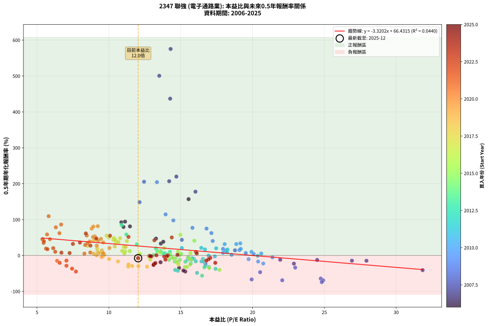
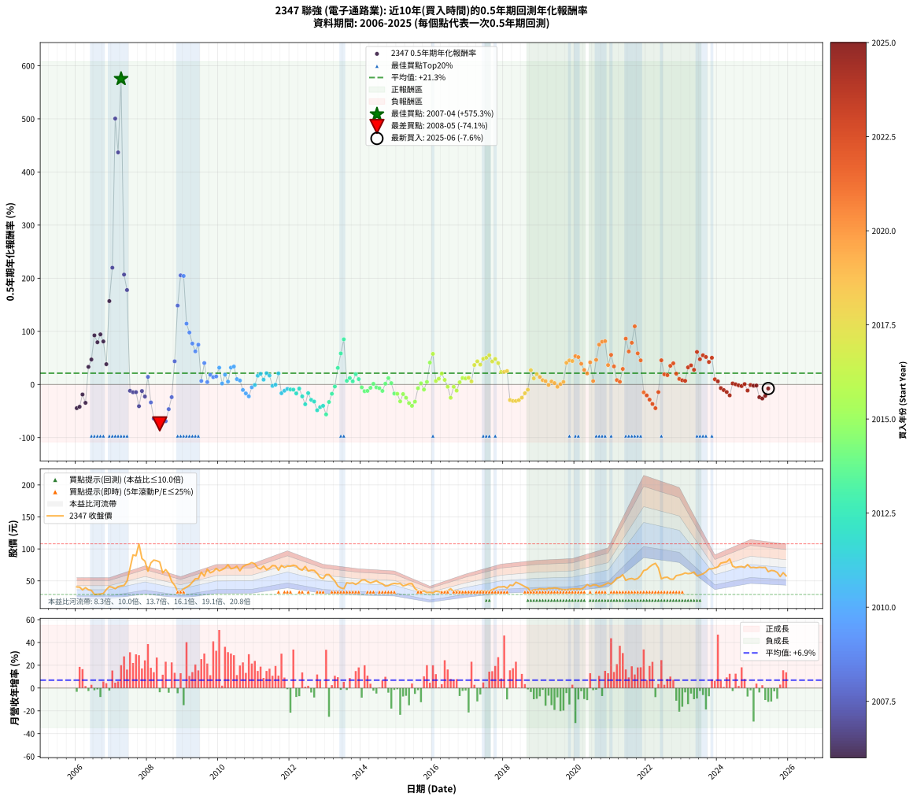

# 2347 聯強 - 本益比與未來報酬率分析

!!! info "報告資訊"
    - **股票代號**: 2347
    - **公司名稱**: 聯強
    - **產業別**: 電子通路業
    - **分析期間**: 2006-2025 (234 個數據點)
    - **資料來源**: Type 12 (ShowMonthlyK_ChartFlow) 月收盤價與本益比
    - **報酬率口徑**: 含現金股利 (簡化: 年度合計，假設每年7/1入帳)
    - **報告生成時間**: 2026-01-06 22:28:03 CST

## 📈 視覺化圖表

### 圖表1: 本益比 vs 未來報酬率關係

*圖表1：2347 聯強 本益比與0.5年期未來報酬率關係 (2006-2025)*

### 圖表2: 歷年買入時點的0.5年期實際報酬率

*圖表2：2347 聯強 歷年買入時點的0.5年期實際報酬率 (2006-2025)*

## 📍 買點訊號說明

本報告提供兩種買點提示訊號（顯示於圖表2的股價子圖中）：

### ▲ 小綠色三角形（回測驗證）
- **計算方式**: 使用全部歷史資料計算本益比第25百分位數
- **用途**: 事後驗證，顯示歷史上哪些時點確實為低估區
- **限制**: 當下無法判斷，僅供回測參考
- **特性**: 後見之明（Look-Ahead Bias）

### ▲ 小橘色三角形（即時訊號）
- **計算方式**: 使用截至當月的過去5年資料計算本益比第25百分位數
- **用途**: 實際投資決策，當時即可判斷
- **優勢**: 可操作性強，符合實務需求
- **特性**: 無後見之明，滾動窗口計算

!!! tip "如何使用兩種訊號"
    - **綠色▲** 幫助理解歷史估值機會，驗證策略有效性
    - **橘色▲** 可作為實際買進參考，但仍需搭配基本面分析
    - 兩種訊號重疊時，表示即時判斷與事後驗證一致，信心度較高
    - 僅有綠色▲時，表示當時無法判斷（需要未來資料才能確認）
    - 僅有橘色▲時，表示即時判斷為買點，但事後可能不是最佳時機

## 📊 估值分析摘要

| 指標 | 數值 |
|:---:|:---:|
| **目前本益比** (2025-06) | **12.04 倍** |
| **歷史平均本益比** | 13.60 倍 |
| **估值水準** | 🟡 合理範圍 |
| **預期0.5年年化報酬率** | **+26.46%** |
| **歷史平均報酬率** | +21.29% |
| **相關係數 (R²)** | 0.0440 |
| **趨勢線斜率** | -3.3202 |

!!! abstract "核心洞察"
    目前本益比接近歷史平均，預期報酬率符合長期趨勢

    根據歷史數據回測，2347 聯強 在目前本益比 **12.0倍** 的估值水準下，
    預期未來0.5年年化報酬率約為 **+26.5%**。

    **重要提醒**: 本分析基於歷史數據統計，實際報酬率會受到公司基本面變化、產業趨勢、
    總體經濟環境等多重因素影響。R² = 0.04 表示本益比可解釋約 4.4% 的報酬率變異。

## 📈 歷史估值統計

### 最佳買點 (最高報酬率)

| 項目 | 數值 |
|:---:|:---:|
| 起始時間 | 2007-04 |
| 當時本益比 | 14.30 倍 |
| 起始價格 | 42.1 元 |
| 0.5年後價格 | 108.0 元 |
| **0.5年年化報酬率** | **+575.32%** |

### 最差買點 (最低報酬率)

| 項目 | 數值 |
|:---:|:---:|
| 起始時間 | 2008-05 |
| 當時本益比 | 24.82 倍 |
| 起始價格 | 79.5 元 |
| 0.5年後價格 | 34.0 元 |
| **0.5年年化報酬率** | **-74.13%** |

## 🎯 投資啟示

### 本益比與報酬率關係

趨勢線方程式: **y = -3.3202x + 66.4315**

!!! warning "強負相關"
    本益比與未來報酬率呈現強負相關。在高本益比時期買入，未來報酬率顯著較低；
    在低本益比時期買入，未來報酬率顯著較高。**估值紀律至關重要**。

### 估值區間建議

基於歷史數據分析:

- **🟢 低估區** (P/E < 10.9): 預期報酬率較高，可考慮增加持股
- **🟡 合理區** (P/E 10.9-16.3): 預期報酬率符合長期趨勢，正常持有
- **🔴 高估區** (P/E > 16.3): 預期報酬率較低，可考慮減碼或觀望

!!! danger "風險提示"
    - 過去表現不代表未來結果
    - 本分析假設公司基本面無重大結構性變化
    - 產業環境劇變可能使歷史規律失效
    - 應結合公司財報、產業趨勢、總體經濟等多重因素綜合判斷

!!! success "長期投資觀點"
    歷史數據顯示，在合理或低估的估值水準買入並長期持有，
    往往能獲得較佳的投資報酬。**耐心等待好價格**是價值投資的核心原則。

## 📊 數據品質

- **資料來源**: GoodInfo.tw Type 12 (ShowMonthlyK_ChartFlow)
- **資料頻率**: 月度收盤價與本益比
- **回測期間**: 2006-2025
- **數據點數量**: 234 個 (每個點代表一次0.5年期回測)

### 計算方法說明

1. **0.5年期年化報酬率**:
   - 對每個歷史時點，計算其後0.5年的實際投資報酬率
   - 期末價值(不含股利): 期末價格
   - 期末價值(含現金股利): 期末價格 + 持有期間內的現金股利合計 (簡化: 年度合計，假設每年7/1入帳)
   - 公式: 年化報酬率 = [(期末價值/期初價格)^(1/年數) - 1] × 100%

2. **本益比 (P/E Ratio)**:
   - 使用當時的月收盤價與EPS計算
   - 資料來源: Type 12 月度河流圖本益比數據

3. **趨勢線 (Linear Regression)**:
   - 使用最小平方法擬合線性趨勢線
   - R²值衡量本益比對報酬率的解釋能力

---

*本報告由 Stock Analysis System v1.9.0 自動生成*
*數據更新時間: 2026-01-06 22:28:03 CST*

## 📋 月度回測明細表

（每一列對應時間線圖中的一個買入點；可用來對照 SVG 圖上的每個點。）

| 買入月份 | 賣出月份 | 回測期限_年 | 實際持有年數 | 買入本益比_倍 | 買入收盤價_元 | 賣出收盤價_元 | 現金股利合計_元 | 總報酬率_pct | 年化報酬率_pct |
| --- | --- | --- | --- | --- | --- | --- | --- | --- | --- |
| 2006-01 | 2006-07 | 0.5 | 0.496 | 15.32 | 40.60 | 28.80 | 1.50 | -25.37 | -44.59 |
| 2006-02 | 2006-08 | 0.5 | 0.498 | 15.19 | 40.25 | 29.20 | 1.50 | -23.73 | -41.93 |
| 2006-03 | 2006-10 | 0.5 | 0.586 | 13.60 | 36.05 | 30.40 | 1.50 | -11.51 | -18.84 |
| 2006-04 | 2006-10 | 0.5 | 0.501 | 14.89 | 39.45 | 30.40 | 1.50 | -19.14 | -34.56 |
| 2006-05 | 2006-12 | 0.5 | 0.586 | 13.62 | 36.10 | 41.20 | 1.50 | +18.28 | +33.19 |
| 2006-06 | 2006-12 | 0.5 | 0.501 | 13.28 | 35.20 | 41.20 | 1.50 | +21.31 | +47.04 |
| 2006-07 | 2007-01 | 0.5 | 0.504 | 10.87 | 28.80 | 40.05 | 0.00 | +39.06 | +92.43 |
| 2006-08 | 2007-03 | 0.5 | 0.580 | 11.02 | 29.20 | 41.00 | 0.00 | +40.41 | +79.45 |
| 2006-09 | 2007-03 | 0.5 | 0.496 | 11.13 | 29.50 | 41.00 | 0.00 | +38.98 | +94.31 |
| 2006-10 | 2007-05 | 0.5 | 0.580 | 11.47 | 30.40 | 42.90 | 0.00 | +41.12 | +81.01 |
| 2006-11 | 2007-05 | 0.5 | 0.496 | 13.79 | 36.55 | 42.90 | 0.00 | +17.37 | +38.16 |
| 2006-12 | 2007-07 | 0.5 | 0.580 | 15.55 | 41.20 | 69.50 | 1.75 | +72.94 | +156.95 |
| 2007-01 | 2007-07 | 0.5 | 0.496 | 14.70 | 40.05 | 69.50 | 1.75 | +77.90 | +219.78 |
| 2007-02 | 2007-08 | 0.5 | 0.498 | 13.51 | 37.80 | 90.60 | 1.75 | +144.31 | +500.56 |
| 2007-03 | 2007-10 | 0.5 | 0.586 | 14.27 | 41.00 | 108.00 | 1.75 | +167.68 | +436.85 |
| 2007-04 | 2007-10 | 0.5 | 0.501 | 14.30 | 42.15 | 108.00 | 1.75 | +160.38 | +575.32 |
| 2007-05 | 2007-12 | 0.5 | 0.586 | 14.20 | 42.90 | 81.00 | 1.75 | +92.89 | +206.87 |
| 2007-06 | 2007-12 | 0.5 | 0.501 | 16.03 | 49.60 | 81.00 | 1.75 | +66.83 | +177.75 |
| 2007-07 | 2008-01 | 0.5 | 0.504 | 21.93 | 69.50 | 65.20 | 0.00 | -6.19 | -11.91 |
| 2007-08 | 2008-03 | 0.5 | 0.583 | 27.93 | 90.60 | 82.60 | 0.00 | -8.83 | -14.66 |
| 2007-09 | 2008-03 | 0.5 | 0.498 | 26.92 | 89.30 | 82.60 | 0.00 | -7.50 | -14.49 |
| 2007-10 | 2008-05 | 0.5 | 0.583 | 31.84 | 108.00 | 79.50 | 0.00 | -26.39 | -40.87 |
| 2007-11 | 2008-05 | 0.5 | 0.498 | 24.50 | 84.90 | 79.50 | 0.00 | -6.36 | -12.36 |
| 2007-12 | 2008-07 | 0.5 | 0.583 | 22.88 | 81.00 | 67.70 | 2.00 | -13.95 | -22.71 |
| 2008-01 | 2008-07 | 0.5 | 0.498 | 18.78 | 65.20 | 67.70 | 2.00 | +6.90 | +14.33 |
| 2008-02 | 2008-08 | 0.5 | 0.501 | 22.97 | 78.20 | 61.60 | 2.00 | -18.67 | -33.80 |
| 2008-03 | 2008-10 | 0.5 | 0.586 | 24.75 | 82.60 | 43.20 | 2.00 | -45.28 | -64.26 |
| 2008-04 | 2008-10 | 0.5 | 0.501 | 24.92 | 81.50 | 43.20 | 2.00 | -44.54 | -69.17 |
| 2008-05 | 2008-12 | 0.5 | 0.586 | 24.82 | 79.50 | 34.00 | 2.00 | -54.72 | -74.13 |
| 2008-06 | 2008-12 | 0.5 | 0.501 | 19.94 | 62.50 | 34.00 | 2.00 | -42.40 | -66.75 |
| 2008-07 | 2009-01 | 0.5 | 0.504 | 22.07 | 67.70 | 37.45 | 0.00 | -44.68 | -69.13 |
| 2008-08 | 2009-03 | 0.5 | 0.580 | 20.53 | 61.60 | 42.85 | 0.00 | -30.44 | -46.49 |
| 2008-09 | 2009-03 | 0.5 | 0.496 | 16.73 | 49.05 | 42.85 | 0.00 | -12.64 | -23.87 |
| 2008-10 | 2009-05 | 0.5 | 0.580 | 15.08 | 43.20 | 53.30 | 0.00 | +23.38 | +43.62 |
| 2008-11 | 2009-05 | 0.5 | 0.496 | 12.14 | 33.95 | 53.30 | 0.00 | +57.00 | +148.48 |
| 2008-12 | 2009-07 | 0.5 | 0.580 | 12.45 | 34.00 | 63.70 | 1.30 | +91.18 | +205.41 |
| 2009-01 | 2009-07 | 0.5 | 0.496 | 13.35 | 37.45 | 63.70 | 1.30 | +73.56 | +204.24 |
| 2009-02 | 2009-08 | 0.5 | 0.498 | 13.95 | 40.20 | 57.50 | 1.30 | +46.27 | +114.50 |
| 2009-03 | 2009-10 | 0.5 | 0.586 | 14.49 | 42.85 | 62.60 | 1.30 | +49.12 | +97.79 |
| 2009-04 | 2009-10 | 0.5 | 0.501 | 15.82 | 48.00 | 62.60 | 1.30 | +33.12 | +77.01 |
| 2009-05 | 2009-12 | 0.5 | 0.586 | 17.14 | 53.30 | 69.50 | 1.30 | +32.83 | +62.35 |
| 2009-06 | 2009-12 | 0.5 | 0.501 | 16.80 | 53.50 | 69.50 | 1.30 | +32.34 | +74.93 |
| 2009-07 | 2010-01 | 0.5 | 0.504 | 19.53 | 63.70 | 65.80 | 0.00 | +3.30 | +6.65 |
| 2009-08 | 2010-03 | 0.5 | 0.580 | 17.23 | 57.50 | 70.00 | 0.00 | +21.74 | +40.34 |
| 2009-09 | 2010-03 | 0.5 | 0.496 | 20.07 | 68.50 | 70.00 | 0.00 | +2.19 | +4.47 |
| 2009-10 | 2010-05 | 0.5 | 0.580 | 17.95 | 62.60 | 69.00 | 0.00 | +10.22 | +18.26 |
| 2009-11 | 2010-05 | 0.5 | 0.496 | 18.15 | 64.70 | 69.00 | 0.00 | +6.65 | +13.87 |
| 2009-12 | 2010-07 | 0.5 | 0.580 | 19.09 | 69.50 | 73.00 | 2.40 | +8.49 | +15.07 |
| 2010-01 | 2010-07 | 0.5 | 0.496 | 18.06 | 65.80 | 73.00 | 2.40 | +14.59 | +31.63 |
| 2010-02 | 2010-08 | 0.5 | 0.498 | 18.54 | 67.60 | 65.80 | 2.40 | +0.89 | +1.79 |
| 2010-03 | 2010-10 | 0.5 | 0.586 | 19.18 | 70.00 | 74.90 | 2.40 | +10.43 | +18.45 |
| 2010-04 | 2010-10 | 0.5 | 0.501 | 20.61 | 75.30 | 74.90 | 2.40 | +2.66 | +5.37 |
| 2010-05 | 2010-12 | 0.5 | 0.586 | 18.87 | 69.00 | 78.70 | 2.40 | +17.54 | +31.76 |
| 2010-06 | 2010-12 | 0.5 | 0.501 | 19.15 | 70.10 | 78.70 | 2.40 | +15.69 | +33.77 |
| 2010-07 | 2011-01 | 0.5 | 0.504 | 19.93 | 73.00 | 76.60 | 0.00 | +4.93 | +10.03 |
| 2010-08 | 2011-03 | 0.5 | 0.580 | 17.95 | 65.80 | 68.60 | 0.00 | +4.26 | +7.44 |
| 2010-09 | 2011-03 | 0.5 | 0.496 | 19.73 | 72.40 | 68.60 | 0.00 | -5.25 | -10.31 |
| 2010-10 | 2011-05 | 0.5 | 0.580 | 20.39 | 74.90 | 67.30 | 0.00 | -10.15 | -16.83 |
| 2010-11 | 2011-05 | 0.5 | 0.496 | 20.75 | 76.30 | 67.30 | 0.00 | -11.80 | -22.37 |
| 2010-12 | 2011-07 | 0.5 | 0.580 | 21.39 | 78.70 | 74.00 | 2.25 | -3.12 | -5.31 |
| 2011-01 | 2011-07 | 0.5 | 0.496 | 20.36 | 76.60 | 74.00 | 2.25 | -0.46 | -0.93 |
| 2011-02 | 2011-08 | 0.5 | 0.498 | 18.26 | 70.20 | 73.50 | 2.25 | +7.90 | +16.49 |
| 2011-03 | 2011-10 | 0.5 | 0.586 | 17.47 | 68.60 | 74.10 | 2.25 | +11.29 | +20.04 |
| 2011-04 | 2011-10 | 0.5 | 0.501 | 18.23 | 73.10 | 74.10 | 2.25 | +4.44 | +9.06 |
| 2011-05 | 2011-12 | 0.5 | 0.586 | 16.44 | 67.30 | 73.10 | 2.25 | +11.96 | +21.26 |
| 2011-06 | 2011-12 | 0.5 | 0.501 | 16.69 | 69.70 | 73.10 | 2.25 | +8.10 | +16.83 |
| 2011-07 | 2012-01 | 0.5 | 0.504 | 17.38 | 74.00 | 73.00 | 0.00 | -1.35 | -2.66 |
| 2011-08 | 2012-03 | 0.5 | 0.583 | 16.94 | 73.50 | 73.30 | 0.00 | -0.27 | -0.47 |
| 2011-09 | 2012-03 | 0.5 | 0.498 | 15.08 | 66.70 | 73.30 | 0.00 | +9.90 | +20.85 |
| 2011-10 | 2012-05 | 0.5 | 0.583 | 16.45 | 74.10 | 66.70 | 0.00 | -9.99 | -16.51 |
| 2011-11 | 2012-05 | 0.5 | 0.498 | 15.48 | 71.00 | 66.70 | 0.00 | -6.06 | -11.78 |
| 2011-12 | 2012-07 | 0.5 | 0.583 | 15.65 | 73.10 | 65.50 | 4.00 | -4.93 | -8.30 |
| 2012-01 | 2012-07 | 0.5 | 0.498 | 15.92 | 73.00 | 65.50 | 4.00 | -4.80 | -9.39 |
| 2012-02 | 2012-08 | 0.5 | 0.501 | 16.55 | 74.50 | 66.80 | 4.00 | -4.97 | -9.67 |
| 2012-03 | 2012-10 | 0.5 | 0.586 | 16.59 | 73.30 | 61.80 | 4.00 | -10.23 | -16.83 |
| 2012-04 | 2012-10 | 0.5 | 0.501 | 15.81 | 68.50 | 61.80 | 4.00 | -3.94 | -7.72 |
| 2012-05 | 2012-12 | 0.5 | 0.586 | 15.70 | 66.70 | 53.50 | 4.00 | -13.79 | -22.38 |
| 2012-06 | 2012-12 | 0.5 | 0.501 | 17.43 | 72.60 | 53.50 | 4.00 | -20.80 | -37.21 |
| 2012-07 | 2013-01 | 0.5 | 0.504 | 16.05 | 65.50 | 59.90 | 0.00 | -8.55 | -16.26 |
| 2012-08 | 2013-03 | 0.5 | 0.580 | 16.71 | 66.80 | 54.80 | 0.00 | -17.96 | -28.90 |
| 2012-09 | 2013-03 | 0.5 | 0.496 | 16.97 | 66.40 | 54.80 | 0.00 | -17.47 | -32.12 |
| 2012-10 | 2013-05 | 0.5 | 0.580 | 16.14 | 61.80 | 42.05 | 0.00 | -31.96 | -48.49 |
| 2012-11 | 2013-05 | 0.5 | 0.496 | 14.80 | 55.40 | 42.05 | 0.00 | -24.10 | -42.67 |
| 2012-12 | 2013-07 | 0.5 | 0.580 | 14.62 | 53.50 | 37.70 | 2.00 | -25.79 | -40.19 |
| 2013-01 | 2013-07 | 0.5 | 0.496 | 16.49 | 59.90 | 37.70 | 2.00 | -33.72 | -56.40 |
| 2013-02 | 2013-08 | 0.5 | 0.498 | 16.65 | 60.00 | 47.15 | 2.00 | -18.08 | -32.99 |
| 2013-03 | 2013-10 | 0.5 | 0.586 | 15.33 | 54.80 | 46.95 | 2.00 | -10.68 | -17.53 |
| 2013-04 | 2013-10 | 0.5 | 0.501 | 14.07 | 49.90 | 46.95 | 2.00 | -1.90 | -3.76 |
| 2013-05 | 2013-12 | 0.5 | 0.586 | 11.95 | 42.05 | 47.30 | 2.00 | +17.24 | +31.19 |
| 2013-06 | 2013-12 | 0.5 | 0.501 | 11.22 | 39.15 | 47.30 | 2.00 | +25.93 | +58.42 |
| 2013-07 | 2014-01 | 0.5 | 0.504 | 10.89 | 37.70 | 51.40 | 0.00 | +36.34 | +85.03 |
| 2013-08 | 2014-03 | 0.5 | 0.580 | 13.73 | 47.15 | 49.00 | 0.00 | +3.92 | +6.86 |
| 2013-09 | 2014-03 | 0.5 | 0.496 | 13.60 | 46.30 | 49.00 | 0.00 | +5.83 | +12.12 |
| 2013-10 | 2014-05 | 0.5 | 0.580 | 13.90 | 46.95 | 48.55 | 0.00 | +3.41 | +5.94 |
| 2013-11 | 2014-05 | 0.5 | 0.496 | 13.28 | 44.45 | 48.55 | 0.00 | +9.22 | +19.49 |
| 2013-12 | 2014-07 | 0.5 | 0.580 | 14.25 | 47.30 | 47.20 | 2.80 | +5.71 | +10.04 |
| 2014-01 | 2014-07 | 0.5 | 0.496 | 15.54 | 51.40 | 47.20 | 2.80 | -2.72 | -5.42 |
| 2014-02 | 2014-08 | 0.5 | 0.498 | 15.73 | 51.80 | 45.60 | 2.80 | -6.56 | -12.74 |
| 2014-03 | 2014-10 | 0.5 | 0.586 | 14.94 | 49.00 | 42.65 | 2.80 | -7.24 | -12.05 |
| 2014-04 | 2014-10 | 0.5 | 0.501 | 14.37 | 46.95 | 42.65 | 2.80 | -3.19 | -6.28 |
| 2014-05 | 2014-12 | 0.5 | 0.586 | 14.92 | 48.55 | 46.10 | 2.80 | +0.72 | +1.23 |
| 2014-06 | 2014-12 | 0.5 | 0.501 | 15.52 | 50.30 | 46.10 | 2.80 | -2.78 | -5.48 |
| 2014-07 | 2015-01 | 0.5 | 0.504 | 14.63 | 47.20 | 45.50 | 0.00 | -3.60 | -7.02 |
| 2014-08 | 2015-03 | 0.5 | 0.580 | 14.19 | 45.60 | 42.30 | 0.00 | -7.24 | -12.14 |
| 2014-09 | 2015-03 | 0.5 | 0.496 | 13.12 | 42.00 | 42.30 | 0.00 | +0.71 | +1.45 |
| 2014-10 | 2015-05 | 0.5 | 0.580 | 13.38 | 42.65 | 45.55 | 0.00 | +6.80 | +12.00 |
| 2014-11 | 2015-05 | 0.5 | 0.496 | 14.18 | 45.00 | 45.55 | 0.00 | +1.22 | +2.48 |
| 2014-12 | 2015-07 | 0.5 | 0.580 | 14.59 | 46.10 | 38.05 | 3.30 | -10.30 | -17.08 |
| 2015-01 | 2015-07 | 0.5 | 0.496 | 14.85 | 45.50 | 38.05 | 3.30 | -9.12 | -17.55 |
| 2015-02 | 2015-08 | 0.5 | 0.498 | 15.45 | 45.85 | 34.60 | 3.30 | -17.34 | -31.76 |
| 2015-03 | 2015-10 | 0.5 | 0.586 | 14.73 | 42.30 | 34.35 | 3.30 | -10.99 | -18.03 |
| 2015-04 | 2015-10 | 0.5 | 0.501 | 15.67 | 43.50 | 34.35 | 3.30 | -13.45 | -25.04 |
| 2015-05 | 2015-12 | 0.5 | 0.586 | 16.99 | 45.55 | 32.05 | 3.30 | -22.39 | -35.12 |
| 2015-06 | 2015-12 | 0.5 | 0.501 | 17.70 | 45.75 | 32.05 | 3.30 | -22.73 | -40.23 |
| 2015-07 | 2016-01 | 0.5 | 0.504 | 15.29 | 38.05 | 31.25 | 0.00 | -17.87 | -32.35 |
| 2015-08 | 2016-03 | 0.5 | 0.583 | 14.46 | 34.60 | 33.15 | 0.00 | -4.19 | -7.08 |
| 2015-09 | 2016-03 | 0.5 | 0.498 | 14.28 | 32.80 | 33.15 | 0.00 | +1.07 | +2.15 |
| 2015-10 | 2016-05 | 0.5 | 0.583 | 15.60 | 34.35 | 32.40 | 0.00 | -5.68 | -9.54 |
| 2015-11 | 2016-05 | 0.5 | 0.498 | 15.03 | 31.65 | 32.40 | 0.00 | +2.37 | +4.81 |
| 2015-12 | 2016-07 | 0.5 | 0.583 | 15.95 | 32.05 | 37.70 | 1.50 | +22.31 | +41.24 |
| 2016-01 | 2016-07 | 0.5 | 0.498 | 14.98 | 31.25 | 37.70 | 1.50 | +25.44 | +57.60 |
| 2016-02 | 2016-08 | 0.5 | 0.501 | 15.68 | 33.90 | 33.50 | 1.50 | +3.24 | +6.58 |
| 2016-03 | 2016-10 | 0.5 | 0.586 | 14.82 | 33.15 | 33.70 | 1.50 | +6.18 | +10.78 |
| 2016-04 | 2016-10 | 0.5 | 0.501 | 13.85 | 32.05 | 33.70 | 1.50 | +9.83 | +20.58 |
| 2016-05 | 2016-12 | 0.5 | 0.586 | 13.56 | 32.40 | 32.50 | 1.50 | +4.94 | +8.57 |
| 2016-06 | 2016-12 | 0.5 | 0.501 | 14.10 | 34.75 | 32.50 | 1.50 | -2.16 | -4.26 |
| 2016-07 | 2017-01 | 0.5 | 0.504 | 14.84 | 37.70 | 32.60 | 0.00 | -13.53 | -25.06 |
| 2016-08 | 2017-03 | 0.5 | 0.580 | 12.80 | 33.50 | 32.65 | 0.00 | -2.54 | -4.33 |
| 2016-09 | 2017-03 | 0.5 | 0.496 | 12.89 | 34.70 | 32.65 | 0.00 | -5.91 | -11.56 |
| 2016-10 | 2017-05 | 0.5 | 0.580 | 12.17 | 33.70 | 34.50 | 0.00 | +2.37 | +4.12 |
| 2016-11 | 2017-05 | 0.5 | 0.496 | 11.46 | 32.60 | 34.50 | 0.00 | +5.83 | +12.11 |
| 2016-12 | 2017-07 | 0.5 | 0.580 | 11.13 | 32.50 | 33.60 | 1.00 | +6.46 | +11.39 |
| 2017-01 | 2017-07 | 0.5 | 0.496 | 10.93 | 32.60 | 33.60 | 1.00 | +6.13 | +12.77 |
| 2017-02 | 2017-08 | 0.5 | 0.498 | 11.08 | 33.75 | 33.70 | 1.00 | +2.81 | +5.73 |
| 2017-03 | 2017-10 | 0.5 | 0.586 | 10.51 | 32.65 | 38.20 | 1.00 | +20.06 | +36.62 |
| 2017-04 | 2017-10 | 0.5 | 0.501 | 10.32 | 32.70 | 38.20 | 1.00 | +19.88 | +43.60 |
| 2017-05 | 2017-12 | 0.5 | 0.586 | 10.67 | 34.50 | 40.55 | 1.00 | +20.43 | +37.35 |
| 2017-06 | 2017-12 | 0.5 | 0.501 | 10.35 | 34.10 | 40.55 | 1.00 | +21.85 | +48.35 |
| 2017-07 | 2018-01 | 0.5 | 0.504 | 10.01 | 33.60 | 41.25 | 0.00 | +22.77 | +50.26 |
| 2017-08 | 2018-03 | 0.5 | 0.580 | 9.85 | 33.70 | 43.50 | 0.00 | +29.08 | +55.24 |
| 2017-09 | 2018-03 | 0.5 | 0.496 | 10.45 | 36.40 | 43.50 | 0.00 | +19.51 | +43.27 |
| 2017-10 | 2018-05 | 0.5 | 0.580 | 10.78 | 38.20 | 48.00 | 0.00 | +25.65 | +48.21 |
| 2017-11 | 2018-05 | 0.5 | 0.496 | 11.25 | 40.60 | 48.00 | 0.00 | +18.23 | +40.20 |
| 2017-12 | 2018-07 | 0.5 | 0.580 | 11.05 | 40.55 | 43.65 | 2.20 | +13.07 | +23.57 |
| 2018-01 | 2018-07 | 0.5 | 0.496 | 11.17 | 41.25 | 43.65 | 2.20 | +11.15 | +23.78 |
| 2018-02 | 2018-08 | 0.5 | 0.498 | 10.41 | 38.70 | 41.10 | 2.20 | +11.89 | +25.28 |
| 2018-03 | 2018-10 | 0.5 | 0.586 | 11.62 | 43.50 | 33.30 | 2.20 | -18.39 | -29.31 |
| 2018-04 | 2018-10 | 0.5 | 0.501 | 11.35 | 42.75 | 33.30 | 2.20 | -16.96 | -30.99 |
| 2018-05 | 2018-12 | 0.5 | 0.586 | 12.66 | 48.00 | 36.40 | 2.20 | -19.58 | -31.06 |
| 2018-06 | 2018-12 | 0.5 | 0.501 | 12.06 | 46.00 | 36.40 | 2.20 | -16.09 | -29.54 |
| 2018-07 | 2019-01 | 0.5 | 0.504 | 11.37 | 43.65 | 37.80 | 0.00 | -13.40 | -24.85 |
| 2018-08 | 2019-03 | 0.5 | 0.580 | 10.64 | 41.10 | 37.00 | 0.00 | -9.98 | -16.56 |
| 2018-09 | 2019-03 | 0.5 | 0.496 | 10.02 | 38.95 | 37.00 | 0.00 | -5.01 | -9.85 |
| 2018-10 | 2019-05 | 0.5 | 0.580 | 8.51 | 33.30 | 38.25 | 0.00 | +14.86 | +26.97 |
| 2018-11 | 2019-05 | 0.5 | 0.496 | 9.21 | 36.25 | 38.25 | 0.00 | +5.52 | +11.45 |
| 2018-12 | 2019-07 | 0.5 | 0.580 | 9.19 | 36.40 | 38.35 | 2.00 | +10.85 | +19.42 |
| 2019-01 | 2019-07 | 0.5 | 0.496 | 9.52 | 37.80 | 38.35 | 2.00 | +6.75 | +14.08 |
| 2019-02 | 2019-08 | 0.5 | 0.498 | 9.42 | 37.50 | 37.00 | 2.00 | +4.00 | +8.19 |
| 2019-03 | 2019-10 | 0.5 | 0.586 | 9.27 | 37.00 | 36.35 | 2.00 | +3.65 | +6.31 |
| 2019-04 | 2019-10 | 0.5 | 0.501 | 9.62 | 38.50 | 36.35 | 2.00 | -0.39 | -0.78 |
| 2019-05 | 2019-12 | 0.5 | 0.586 | 9.53 | 38.25 | 37.50 | 2.00 | +3.27 | +5.64 |
| 2019-06 | 2019-12 | 0.5 | 0.501 | 9.69 | 39.00 | 37.50 | 2.00 | +1.28 | +2.58 |
| 2019-07 | 2020-01 | 0.5 | 0.504 | 9.50 | 38.35 | 37.50 | 0.00 | -2.22 | -4.35 |
| 2019-08 | 2020-03 | 0.5 | 0.583 | 9.14 | 37.00 | 37.15 | 0.00 | +0.41 | +0.70 |
| 2019-09 | 2020-03 | 0.5 | 0.498 | 8.95 | 36.30 | 37.15 | 0.00 | +2.34 | +4.75 |
| 2019-10 | 2020-05 | 0.5 | 0.583 | 8.93 | 36.35 | 44.40 | 0.00 | +22.15 | +40.92 |
| 2019-11 | 2020-05 | 0.5 | 0.498 | 9.03 | 36.85 | 44.40 | 0.00 | +20.49 | +45.36 |
| 2019-12 | 2020-07 | 0.5 | 0.583 | 9.17 | 37.50 | 43.80 | 2.60 | +23.73 | +44.08 |
| 2020-01 | 2020-07 | 0.5 | 0.498 | 9.02 | 37.50 | 43.80 | 2.60 | +23.73 | +53.32 |
| 2020-02 | 2020-08 | 0.5 | 0.501 | 8.90 | 37.60 | 43.70 | 2.60 | +23.14 | +51.50 |
| 2020-03 | 2020-10 | 0.5 | 0.586 | 8.66 | 37.15 | 42.45 | 2.60 | +21.27 | +38.97 |
| 2020-04 | 2020-10 | 0.5 | 0.501 | 9.16 | 39.90 | 42.45 | 2.60 | +12.91 | +27.42 |
| 2020-05 | 2020-12 | 0.5 | 0.586 | 10.04 | 44.40 | 47.00 | 2.60 | +11.71 | +20.81 |
| 2020-06 | 2020-12 | 0.5 | 0.501 | 9.28 | 41.65 | 47.00 | 2.60 | +19.09 | +41.72 |
| 2020-07 | 2021-01 | 0.5 | 0.504 | 9.61 | 43.80 | 45.20 | 0.00 | +3.20 | +6.44 |
| 2020-08 | 2021-03 | 0.5 | 0.580 | 9.45 | 43.70 | 54.50 | 0.00 | +24.71 | +46.30 |
| 2020-09 | 2021-03 | 0.5 | 0.496 | 8.81 | 41.30 | 54.50 | 0.00 | +31.96 | +75.01 |
| 2020-10 | 2021-05 | 0.5 | 0.580 | 8.92 | 42.45 | 59.80 | 0.00 | +40.87 | +80.47 |
| 2020-11 | 2021-05 | 0.5 | 0.496 | 9.23 | 44.50 | 59.80 | 0.00 | +34.38 | +81.55 |
| 2020-12 | 2021-07 | 0.5 | 0.580 | 9.61 | 47.00 | 53.00 | 3.30 | +19.79 | +36.49 |
| 2021-01 | 2021-07 | 0.5 | 0.496 | 8.46 | 45.20 | 53.00 | 3.30 | +24.56 | +55.76 |
| 2021-02 | 2021-08 | 0.5 | 0.498 | 8.51 | 49.35 | 53.80 | 3.30 | +15.70 | +34.01 |
| 2021-03 | 2021-10 | 0.5 | 0.586 | 8.71 | 54.50 | 53.80 | 3.30 | +4.77 | +8.28 |
| 2021-04 | 2021-10 | 0.5 | 0.501 | 8.30 | 55.70 | 53.80 | 3.30 | +2.51 | +5.08 |
| 2021-05 | 2021-12 | 0.5 | 0.586 | 8.35 | 59.80 | 66.20 | 3.30 | +16.22 | +29.25 |
| 2021-06 | 2021-12 | 0.5 | 0.501 | 6.68 | 50.90 | 66.20 | 3.30 | +36.54 | +86.20 |
| 2021-07 | 2022-01 | 0.5 | 0.504 | 6.56 | 53.00 | 67.60 | 0.00 | +27.55 | +62.09 |
| 2021-08 | 2022-03 | 0.5 | 0.580 | 6.31 | 53.80 | 75.30 | 0.00 | +39.96 | +78.47 |
| 2021-09 | 2022-03 | 0.5 | 0.496 | 5.81 | 52.20 | 75.30 | 0.00 | +44.25 | +109.46 |
| 2021-10 | 2022-05 | 0.5 | 0.580 | 5.70 | 53.80 | 70.30 | 0.00 | +30.67 | +58.54 |
| 2021-11 | 2022-05 | 0.5 | 0.496 | 5.90 | 58.40 | 70.30 | 0.00 | +20.38 | +45.39 |
| 2021-12 | 2022-07 | 0.5 | 0.580 | 6.40 | 66.20 | 55.30 | 5.00 | -8.91 | -14.86 |
| 2022-01 | 2022-07 | 0.5 | 0.496 | 6.58 | 67.60 | 55.30 | 5.00 | -10.80 | -20.59 |
| 2022-02 | 2022-08 | 0.5 | 0.498 | 7.05 | 71.90 | 55.80 | 5.00 | -15.44 | -28.58 |
| 2022-03 | 2022-10 | 0.5 | 0.586 | 7.44 | 75.30 | 52.60 | 5.00 | -23.51 | -36.70 |
| 2022-04 | 2022-10 | 0.5 | 0.501 | 7.71 | 77.50 | 52.60 | 5.00 | -25.68 | -44.69 |
| 2022-05 | 2022-12 | 0.5 | 0.586 | 7.05 | 70.30 | 59.20 | 5.00 | -8.68 | -14.35 |
| 2022-06 | 2022-12 | 0.5 | 0.501 | 5.38 | 53.20 | 59.20 | 5.00 | +20.68 | +45.52 |
| 2022-07 | 2023-01 | 0.5 | 0.504 | 5.63 | 55.30 | 60.40 | 0.00 | +9.22 | +19.14 |
| 2022-08 | 2023-03 | 0.5 | 0.580 | 5.73 | 55.80 | 61.30 | 0.00 | +9.86 | +17.58 |
| 2022-09 | 2023-03 | 0.5 | 0.496 | 5.46 | 52.80 | 61.30 | 0.00 | +16.10 | +35.15 |
| 2022-10 | 2023-05 | 0.5 | 0.580 | 5.48 | 52.60 | 63.90 | 0.00 | +21.48 | +39.83 |
| 2022-11 | 2023-05 | 0.5 | 0.496 | 6.13 | 58.30 | 63.90 | 0.00 | +9.61 | +20.33 |
| 2022-12 | 2023-07 | 0.5 | 0.580 | 6.27 | 59.20 | 59.20 | 3.50 | +5.91 | +10.40 |
| 2023-01 | 2023-07 | 0.5 | 0.496 | 6.70 | 60.40 | 59.20 | 3.50 | +3.81 | +7.83 |
| 2023-02 | 2023-08 | 0.5 | 0.498 | 7.27 | 62.50 | 61.10 | 3.50 | +3.36 | +6.86 |
| 2023-03 | 2023-10 | 0.5 | 0.586 | 7.50 | 61.30 | 68.70 | 3.50 | +17.78 | +32.22 |
| 2023-04 | 2023-10 | 0.5 | 0.501 | 7.99 | 61.90 | 68.70 | 3.50 | +16.64 | +35.96 |
| 2023-05 | 2023-12 | 0.5 | 0.586 | 8.72 | 63.90 | 70.20 | 3.50 | +15.34 | +27.57 |
| 2023-06 | 2023-12 | 0.5 | 0.501 | 8.40 | 58.00 | 70.20 | 3.50 | +27.07 | +61.31 |
| 2023-07 | 2024-01 | 0.5 | 0.504 | 9.13 | 59.20 | 72.00 | 0.00 | +21.62 | +47.49 |
| 2023-08 | 2024-03 | 0.5 | 0.583 | 10.08 | 61.10 | 78.90 | 0.00 | +29.13 | +55.03 |
| 2023-09 | 2024-03 | 0.5 | 0.498 | 11.37 | 64.10 | 78.90 | 0.00 | +23.09 | +51.73 |
| 2023-10 | 2024-05 | 0.5 | 0.583 | 13.17 | 68.70 | 84.40 | 0.00 | +22.85 | +42.32 |
| 2023-11 | 2024-05 | 0.5 | 0.498 | 14.38 | 68.90 | 84.40 | 0.00 | +22.50 | +50.26 |
| 2023-12 | 2024-07 | 0.5 | 0.583 | 16.06 | 70.20 | 71.10 | 3.00 | +5.56 | +9.71 |
| 2024-01 | 2024-07 | 0.5 | 0.498 | 16.12 | 72.00 | 71.10 | 3.00 | +2.92 | +5.94 |
| 2024-02 | 2024-08 | 0.5 | 0.501 | 17.06 | 77.80 | 72.10 | 3.00 | -3.47 | -6.81 |
| 2024-03 | 2024-10 | 0.5 | 0.586 | 16.94 | 78.90 | 70.90 | 3.00 | -6.34 | -10.57 |
| 2024-04 | 2024-10 | 0.5 | 0.501 | 16.79 | 79.80 | 70.90 | 3.00 | -7.39 | -14.21 |
| 2024-05 | 2024-12 | 0.5 | 0.586 | 17.41 | 84.40 | 70.80 | 3.00 | -12.56 | -20.47 |
| 2024-06 | 2024-12 | 0.5 | 0.501 | 14.78 | 73.10 | 70.80 | 3.00 | +0.96 | +1.92 |
| 2024-07 | 2025-01 | 0.5 | 0.504 | 14.10 | 71.10 | 71.20 | 0.00 | +0.14 | +0.28 |
| 2024-08 | 2025-03 | 0.5 | 0.580 | 14.04 | 72.10 | 71.40 | 0.00 | -0.97 | -1.67 |
| 2024-09 | 2025-03 | 0.5 | 0.496 | 13.86 | 72.50 | 71.40 | 0.00 | -1.52 | -3.04 |
| 2024-10 | 2025-05 | 0.5 | 0.580 | 13.31 | 70.90 | 71.20 | 0.00 | +0.42 | +0.73 |
| 2024-11 | 2025-05 | 0.5 | 0.496 | 13.94 | 75.60 | 71.20 | 0.00 | -5.82 | -11.40 |
| 2024-12 | 2025-07 | 0.5 | 0.580 | 12.83 | 70.80 | 66.40 | 4.00 | -0.56 | -0.97 |
| 2025-01 | 2025-07 | 0.5 | 0.496 | 12.97 | 71.20 | 66.40 | 4.00 | -1.12 | -2.25 |
| 2025-02 | 2025-08 | 0.5 | 0.498 | 12.90 | 70.50 | 65.80 | 4.00 | -0.99 | -1.98 |
| 2025-03 | 2025-10 | 0.5 | 0.586 | 13.14 | 71.40 | 56.80 | 4.00 | -14.85 | -23.99 |
| 2025-04 | 2025-10 | 0.5 | 0.501 | 13.11 | 70.90 | 56.80 | 4.00 | -14.25 | -26.42 |
| 2025-05 | 2025-12 | 0.5 | 0.586 | 13.24 | 71.20 | 57.90 | 4.00 | -13.06 | -21.25 |
| 2025-06 | 2025-12 | 0.5 | 0.501 | 12.04 | 64.40 | 57.90 | 4.00 | -3.88 | -7.60 |
