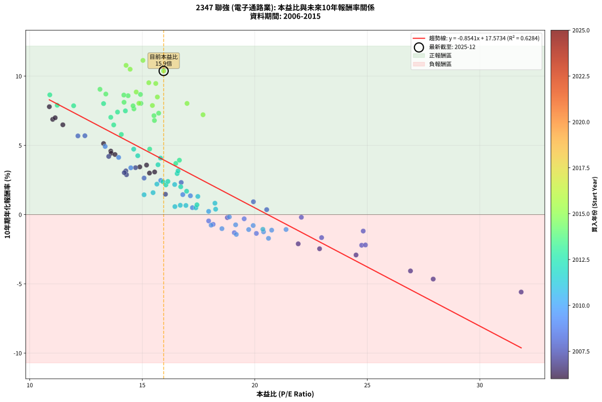
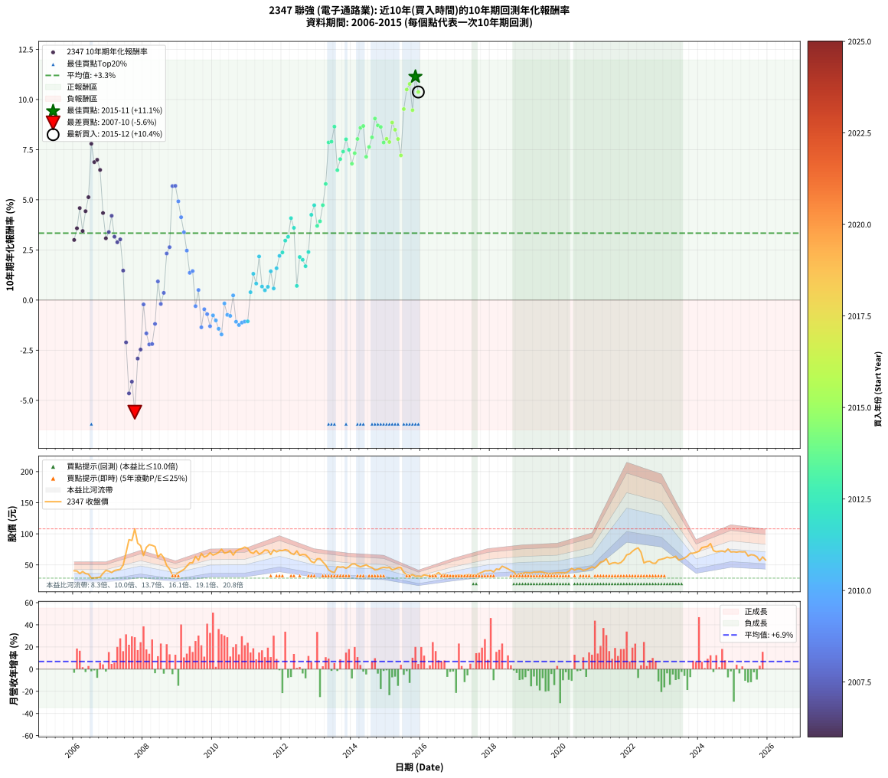

# 2347 聯強 - 本益比與未來報酬率分析

!!! info "報告資訊"
    - **股票代號**: 2347
    - **公司名稱**: 聯強
    - **產業別**: 電子通路業
    - **分析期間**: 2006-2015 (120 個數據點)
    - **資料來源**: Type 12 (ShowMonthlyK_ChartFlow) 月收盤價與本益比
    - **報酬率口徑**: 含現金股利 (簡化: 年度合計，假設每年7/1入帳)
    - **報告生成時間**: 2026-01-10 22:26:21 CST

## 📈 視覺化圖表

### 圖表1: 本益比 vs 未來報酬率關係

*圖表1：2347 聯強 本益比與10年期未來報酬率關係 (2006-2015)*

### 圖表2: 歷年買入時點的10年期實際報酬率

*圖表2：2347 聯強 歷年買入時點的10年期實際報酬率 (2006-2015)*

## 📍 買點訊號說明

本報告提供兩種買點提示訊號（顯示於圖表2的股價子圖中）：

### ▲ 小綠色三角形（回測驗證）
- **計算方式**: 使用全部歷史資料計算本益比第25百分位數
- **用途**: 事後驗證，顯示歷史上哪些時點確實為低估區
- **限制**: 當下無法判斷，僅供回測參考
- **特性**: 後見之明（Look-Ahead Bias）

### ▲ 小橘色三角形（即時訊號）
- **計算方式**: 使用截至當月的過去5年資料計算本益比第25百分位數
- **用途**: 實際投資決策，當時即可判斷
- **優勢**: 可操作性強，符合實務需求
- **特性**: 無後見之明，滾動窗口計算

!!! tip "如何使用兩種訊號"
    - **綠色▲** 幫助理解歷史估值機會，驗證策略有效性
    - **橘色▲** 可作為實際買進參考，但仍需搭配基本面分析
    - 兩種訊號重疊時，表示即時判斷與事後驗證一致，信心度較高
    - 僅有綠色▲時，表示當時無法判斷（需要未來資料才能確認）
    - 僅有橘色▲時，表示即時判斷為買點，但事後可能不是最佳時機

## 📊 估值分析摘要

| 指標 | 數值 |
|:---:|:---:|
| **目前本益比** (2015-12) | **15.95 倍** |
| **歷史平均本益比** | 16.67 倍 |
| **估值水準** | 🟡 合理範圍 |
| **預期10年年化報酬率** | **+3.95%** |
| **歷史平均報酬率** | +3.34% |
| **相關係數 (R²)** | 0.6284 |
| **趨勢線斜率** | -0.8541 |

!!! abstract "核心洞察"
    目前本益比接近歷史平均，預期報酬率符合長期趨勢

    根據歷史數據回測，2347 聯強 在目前本益比 **15.9倍** 的估值水準下，
    預期未來10年年化報酬率約為 **+3.9%**。

    **重要提醒**: 本分析基於歷史數據統計，實際報酬率會受到公司基本面變化、產業趨勢、
    總體經濟環境等多重因素影響。R² = 0.63 表示本益比可解釋約 62.8% 的報酬率變異。

## 📈 歷史估值統計

### 最佳買點 (最高報酬率)

| 項目 | 數值 |
|:---:|:---:|
| 起始時間 | 2015-11 |
| 當時本益比 | 15.03 倍 |
| 起始價格 | 31.6 元 |
| 10年後價格 | 62.9 元 |
| **10年年化報酬率** | **+11.14%** |

### 最差買點 (最低報酬率)

| 項目 | 數值 |
|:---:|:---:|
| 起始時間 | 2007-10 |
| 當時本益比 | 31.84 倍 |
| 起始價格 | 108.0 元 |
| 10年後價格 | 38.2 元 |
| **10年年化報酬率** | **-5.59%** |

## 🎯 投資啟示

### 本益比與報酬率關係

趨勢線方程式: **y = -0.8541x + 17.5734**

!!! warning "強負相關"
    本益比與未來報酬率呈現強負相關。在高本益比時期買入，未來報酬率顯著較低；
    在低本益比時期買入，未來報酬率顯著較高。**估值紀律至關重要**。

### 估值區間建議

基於歷史數據分析:

- **🟢 低估區** (P/E < 13.3): 預期報酬率較高，可考慮增加持股
- **🟡 合理區** (P/E 13.3-20.0): 預期報酬率符合長期趨勢，正常持有
- **🔴 高估區** (P/E > 20.0): 預期報酬率較低，可考慮減碼或觀望

!!! danger "風險提示"
    - 過去表現不代表未來結果
    - 本分析假設公司基本面無重大結構性變化
    - 產業環境劇變可能使歷史規律失效
    - 應結合公司財報、產業趨勢、總體經濟等多重因素綜合判斷

!!! success "長期投資觀點"
    歷史數據顯示，在合理或低估的估值水準買入並長期持有，
    往往能獲得較佳的投資報酬。**耐心等待好價格**是價值投資的核心原則。

## 📊 數據品質

- **資料來源**: GoodInfo.tw Type 12 (ShowMonthlyK_ChartFlow)
- **資料頻率**: 月度收盤價與本益比
- **回測期間**: 2006-2015
- **數據點數量**: 120 個 (每個點代表一次10年期回測)

### 計算方法說明

1. **10年期年化報酬率**:
   - 對每個歷史時點，計算其後10年的實際投資報酬率
   - 期末價值(不含股利): 期末價格
   - 期末價值(含現金股利): 期末價格 + 持有期間內的現金股利合計 (簡化: 年度合計，假設每年7/1入帳)
   - 公式: 年化報酬率 = [(期末價值/期初價格)^(1/年數) - 1] × 100%

2. **本益比 (P/E Ratio)**:
   - 使用當時的月收盤價與EPS計算
   - 資料來源: Type 12 月度河流圖本益比數據

3. **趨勢線 (Linear Regression)**:
   - 使用最小平方法擬合線性趨勢線
   - R²值衡量本益比對報酬率的解釋能力

---

*本報告由 Stock Analysis System v1.9.0 自動生成*
*數據更新時間: 2026-01-10 22:26:21 CST*

## 📋 月度回測明細表

（每一列對應時間線圖中的一個買入點；可用來對照 SVG 圖上的每個點。）

| 買入月份 | 賣出月份 | 回測期限_年 | 實際持有年數 | 買入本益比_倍 | 買入收盤價_元 | 賣出收盤價_元 | 現金股利合計_元 | 總報酬率_pct | 年化報酬率_pct |
| --- | --- | --- | --- | --- | --- | --- | --- | --- | --- |
| 2006-01 | 2016-01 | 10 | 9.999 | 15.32 | 40.60 | 31.25 | 23.30 | +34.35 | +3.00 |
| 2006-02 | 2016-02 | 10 | 9.999 | 15.19 | 40.25 | 33.90 | 23.30 | +42.11 | +3.58 |
| 2006-03 | 2016-03 | 10 | 10.001 | 13.60 | 36.05 | 33.15 | 23.30 | +56.58 | +4.59 |
| 2006-04 | 2016-04 | 10 | 10.001 | 14.89 | 39.45 | 32.05 | 23.30 | +40.30 | +3.44 |
| 2006-05 | 2016-05 | 10 | 10.001 | 13.62 | 36.10 | 32.40 | 23.30 | +54.29 | +4.43 |
| 2006-06 | 2016-06 | 10 | 10.001 | 13.28 | 35.20 | 34.75 | 23.30 | +64.91 | +5.13 |
| 2006-07 | 2016-07 | 10 | 10.001 | 10.87 | 28.80 | 37.70 | 23.30 | +111.80 | +7.79 |
| 2006-08 | 2016-08 | 10 | 10.001 | 11.02 | 29.20 | 33.50 | 23.30 | +94.51 | +6.88 |
| 2006-09 | 2016-09 | 10 | 10.001 | 11.13 | 29.50 | 34.70 | 23.30 | +96.60 | +6.99 |
| 2006-10 | 2016-10 | 10 | 10.001 | 11.47 | 30.40 | 33.70 | 23.30 | +87.49 | +6.49 |
| 2006-11 | 2016-11 | 10 | 10.001 | 13.79 | 36.55 | 32.60 | 23.30 | +52.94 | +4.34 |
| 2006-12 | 2016-12 | 10 | 10.001 | 15.55 | 41.20 | 32.50 | 23.30 | +35.43 | +3.08 |
| 2007-01 | 2017-01 | 10 | 10.001 | 14.70 | 40.05 | 32.60 | 23.30 | +39.57 | +3.39 |
| 2007-02 | 2017-02 | 10 | 10.001 | 13.51 | 37.80 | 33.75 | 23.30 | +50.92 | +4.20 |
| 2007-03 | 2017-03 | 10 | 10.001 | 14.27 | 41.00 | 32.65 | 23.30 | +36.46 | +3.16 |
| 2007-04 | 2017-04 | 10 | 10.001 | 14.30 | 42.15 | 32.70 | 23.30 | +32.85 | +2.88 |
| 2007-05 | 2017-05 | 10 | 10.001 | 14.20 | 42.90 | 34.50 | 23.30 | +34.73 | +3.03 |
| 2007-06 | 2017-06 | 10 | 10.001 | 16.03 | 49.60 | 34.10 | 23.30 | +15.72 | +1.47 |
| 2007-07 | 2017-07 | 10 | 10.001 | 21.93 | 69.50 | 33.60 | 22.55 | -19.21 | -2.11 |
| 2007-08 | 2017-08 | 10 | 10.001 | 27.93 | 90.60 | 33.70 | 22.55 | -37.92 | -4.65 |
| 2007-09 | 2017-09 | 10 | 10.001 | 26.92 | 89.30 | 36.40 | 22.55 | -33.99 | -4.07 |
| 2007-10 | 2017-10 | 10 | 10.001 | 31.84 | 108.00 | 38.20 | 22.55 | -43.75 | -5.59 |
| 2007-11 | 2017-11 | 10 | 10.001 | 24.50 | 84.90 | 40.60 | 22.55 | -25.62 | -2.92 |
| 2007-12 | 2017-12 | 10 | 10.001 | 22.88 | 81.00 | 40.55 | 22.55 | -22.10 | -2.47 |
| 2008-01 | 2018-01 | 10 | 10.001 | 18.78 | 65.20 | 41.25 | 22.55 | -2.15 | -0.22 |
| 2008-02 | 2018-03 | 10 | 10.081 | 22.97 | 78.20 | 43.50 | 22.55 | -15.54 | -1.66 |
| 2008-03 | 2018-03 | 10 | 9.999 | 24.75 | 82.60 | 43.50 | 22.55 | -20.04 | -2.21 |
| 2008-04 | 2018-04 | 10 | 9.999 | 24.92 | 81.50 | 42.75 | 22.55 | -19.88 | -2.19 |
| 2008-05 | 2018-05 | 10 | 9.999 | 24.82 | 79.50 | 48.00 | 22.55 | -11.26 | -1.19 |
| 2008-06 | 2018-06 | 10 | 9.999 | 19.94 | 62.50 | 46.00 | 22.55 | +9.68 | +0.93 |
| 2008-07 | 2018-07 | 10 | 9.999 | 22.07 | 67.70 | 43.65 | 22.75 | -1.92 | -0.19 |
| 2008-08 | 2018-08 | 10 | 9.999 | 20.53 | 61.60 | 41.10 | 22.75 | +3.65 | +0.36 |
| 2008-09 | 2018-09 | 10 | 9.999 | 16.73 | 49.05 | 38.95 | 22.75 | +25.79 | +2.32 |
| 2008-10 | 2018-10 | 10 | 9.999 | 15.08 | 43.20 | 33.30 | 22.75 | +29.74 | +2.64 |
| 2008-11 | 2018-11 | 10 | 9.999 | 12.14 | 33.95 | 36.25 | 22.75 | +73.78 | +5.68 |
| 2008-12 | 2018-12 | 10 | 9.999 | 12.45 | 34.00 | 36.40 | 22.75 | +73.96 | +5.69 |
| 2009-01 | 2019-01 | 10 | 9.999 | 13.35 | 37.45 | 37.80 | 22.75 | +61.68 | +4.92 |
| 2009-02 | 2019-02 | 10 | 9.999 | 13.95 | 40.20 | 37.50 | 22.75 | +49.87 | +4.13 |
| 2009-03 | 2019-03 | 10 | 9.999 | 14.49 | 42.85 | 37.00 | 22.75 | +39.44 | +3.38 |
| 2009-04 | 2019-04 | 10 | 9.999 | 15.82 | 48.00 | 38.50 | 22.75 | +27.60 | +2.47 |
| 2009-05 | 2019-05 | 10 | 9.999 | 17.14 | 53.30 | 38.25 | 22.75 | +14.44 | +1.36 |
| 2009-06 | 2019-06 | 10 | 9.999 | 16.80 | 53.50 | 39.00 | 22.75 | +15.42 | +1.44 |
| 2009-07 | 2019-07 | 10 | 9.999 | 19.53 | 63.70 | 38.35 | 23.45 | -2.99 | -0.30 |
| 2009-08 | 2019-08 | 10 | 9.999 | 17.23 | 57.50 | 37.00 | 23.45 | +5.13 | +0.50 |
| 2009-09 | 2019-09 | 10 | 9.999 | 20.07 | 68.50 | 36.30 | 23.45 | -12.78 | -1.36 |
| 2009-10 | 2019-10 | 10 | 9.999 | 17.95 | 62.60 | 36.35 | 23.45 | -4.48 | -0.46 |
| 2009-11 | 2019-11 | 10 | 9.999 | 18.15 | 64.70 | 36.85 | 23.45 | -6.80 | -0.70 |
| 2009-12 | 2019-12 | 10 | 9.999 | 19.09 | 69.50 | 37.50 | 23.45 | -12.31 | -1.30 |
| 2010-01 | 2020-01 | 10 | 9.999 | 18.06 | 65.80 | 37.50 | 23.45 | -7.37 | -0.76 |
| 2010-02 | 2020-02 | 10 | 9.999 | 18.54 | 67.60 | 37.60 | 23.45 | -9.69 | -1.01 |
| 2010-03 | 2020-03 | 10 | 10.001 | 19.18 | 70.00 | 37.15 | 23.45 | -13.43 | -1.43 |
| 2010-04 | 2020-04 | 10 | 10.001 | 20.61 | 75.30 | 39.90 | 23.45 | -15.87 | -1.71 |
| 2010-05 | 2020-05 | 10 | 10.001 | 18.87 | 69.00 | 44.40 | 23.45 | -1.67 | -0.17 |
| 2010-06 | 2020-06 | 10 | 10.001 | 19.15 | 70.10 | 41.65 | 23.45 | -7.14 | -0.74 |
| 2010-07 | 2020-07 | 10 | 10.001 | 19.93 | 73.00 | 43.80 | 23.65 | -7.61 | -0.79 |
| 2010-08 | 2020-08 | 10 | 10.001 | 17.95 | 65.80 | 43.70 | 23.65 | +2.35 | +0.23 |
| 2010-09 | 2020-09 | 10 | 10.001 | 19.73 | 72.40 | 41.30 | 23.65 | -10.29 | -1.08 |
| 2010-10 | 2020-10 | 10 | 10.001 | 20.39 | 74.90 | 42.45 | 23.65 | -11.75 | -1.24 |
| 2010-11 | 2020-11 | 10 | 10.001 | 20.75 | 76.30 | 44.50 | 23.65 | -10.69 | -1.12 |
| 2010-12 | 2020-12 | 10 | 10.001 | 21.39 | 78.70 | 47.00 | 23.65 | -10.23 | -1.07 |
| 2011-01 | 2021-01 | 10 | 10.001 | 20.36 | 76.60 | 45.20 | 23.65 | -10.12 | -1.06 |
| 2011-02 | 2021-02 | 10 | 10.001 | 18.26 | 70.20 | 49.35 | 23.65 | +3.98 | +0.39 |
| 2011-03 | 2021-03 | 10 | 10.001 | 17.47 | 68.60 | 54.50 | 23.65 | +13.92 | +1.31 |
| 2011-04 | 2021-04 | 10 | 10.001 | 18.23 | 73.10 | 55.70 | 23.65 | +8.55 | +0.82 |
| 2011-05 | 2021-05 | 10 | 10.001 | 16.44 | 67.30 | 59.80 | 23.65 | +23.99 | +2.17 |
| 2011-06 | 2021-06 | 10 | 10.001 | 16.69 | 69.70 | 50.90 | 23.65 | +6.95 | +0.67 |
| 2011-07 | 2021-07 | 10 | 10.001 | 17.38 | 74.00 | 53.00 | 24.70 | +5.00 | +0.49 |
| 2011-08 | 2021-08 | 10 | 10.001 | 16.94 | 73.50 | 53.80 | 24.70 | +6.80 | +0.66 |
| 2011-09 | 2021-09 | 10 | 10.001 | 15.08 | 66.70 | 52.20 | 24.70 | +15.29 | +1.43 |
| 2011-10 | 2021-10 | 10 | 10.001 | 16.45 | 74.10 | 53.80 | 24.70 | +5.94 | +0.58 |
| 2011-11 | 2021-11 | 10 | 10.001 | 15.48 | 71.00 | 58.40 | 24.70 | +17.04 | +1.59 |
| 2011-12 | 2021-12 | 10 | 10.001 | 15.65 | 73.10 | 66.20 | 24.70 | +24.35 | +2.20 |
| 2012-01 | 2022-01 | 10 | 10.001 | 15.92 | 73.00 | 67.60 | 24.70 | +26.44 | +2.37 |
| 2012-02 | 2022-03 | 10 | 10.081 | 16.55 | 74.50 | 75.30 | 24.70 | +34.23 | +2.96 |
| 2012-03 | 2022-03 | 10 | 9.999 | 16.59 | 73.30 | 75.30 | 24.70 | +36.42 | +3.16 |
| 2012-04 | 2022-04 | 10 | 9.999 | 15.81 | 68.50 | 77.50 | 24.70 | +49.20 | +4.08 |
| 2012-05 | 2022-05 | 10 | 9.999 | 15.70 | 66.70 | 70.30 | 24.70 | +42.43 | +3.60 |
| 2012-06 | 2022-06 | 10 | 9.999 | 17.43 | 72.60 | 53.20 | 24.70 | +7.30 | +0.71 |
| 2012-07 | 2022-07 | 10 | 9.999 | 16.05 | 65.50 | 55.30 | 25.70 | +23.66 | +2.15 |
| 2012-08 | 2022-08 | 10 | 9.999 | 16.71 | 66.80 | 55.80 | 25.70 | +22.01 | +2.01 |
| 2012-09 | 2022-09 | 10 | 9.999 | 16.97 | 66.40 | 52.80 | 25.70 | +18.22 | +1.69 |
| 2012-10 | 2022-10 | 10 | 9.999 | 16.14 | 61.80 | 52.60 | 25.70 | +26.70 | +2.39 |
| 2012-11 | 2022-11 | 10 | 9.999 | 14.80 | 55.40 | 58.30 | 25.70 | +51.62 | +4.25 |
| 2012-12 | 2022-12 | 10 | 9.999 | 14.62 | 53.50 | 59.20 | 25.70 | +58.69 | +4.73 |
| 2013-01 | 2023-01 | 10 | 9.999 | 16.49 | 59.90 | 60.40 | 25.70 | +43.74 | +3.70 |
| 2013-02 | 2023-02 | 10 | 9.999 | 16.65 | 60.00 | 62.50 | 25.70 | +47.00 | +3.93 |
| 2013-03 | 2023-03 | 10 | 9.999 | 15.33 | 54.80 | 61.30 | 25.70 | +58.76 | +4.73 |
| 2013-04 | 2023-04 | 10 | 9.999 | 14.07 | 49.90 | 61.90 | 25.70 | +75.55 | +5.79 |
| 2013-05 | 2023-05 | 10 | 9.999 | 11.95 | 42.05 | 63.90 | 25.70 | +113.08 | +7.86 |
| 2013-06 | 2023-06 | 10 | 9.999 | 11.22 | 39.15 | 58.00 | 25.70 | +113.79 | +7.90 |
| 2013-07 | 2023-07 | 10 | 9.999 | 10.89 | 37.70 | 59.20 | 27.20 | +129.18 | +8.65 |
| 2013-08 | 2023-08 | 10 | 9.999 | 13.73 | 47.15 | 61.10 | 27.20 | +87.27 | +6.48 |
| 2013-09 | 2023-09 | 10 | 9.999 | 13.60 | 46.30 | 64.10 | 27.20 | +97.19 | +7.03 |
| 2013-10 | 2023-10 | 10 | 9.999 | 13.90 | 46.95 | 68.70 | 27.20 | +104.26 | +7.40 |
| 2013-11 | 2023-11 | 10 | 9.999 | 13.28 | 44.45 | 68.90 | 27.20 | +116.20 | +8.02 |
| 2013-12 | 2023-12 | 10 | 9.999 | 14.25 | 47.30 | 70.20 | 27.20 | +105.92 | +7.49 |
| 2014-01 | 2024-01 | 10 | 9.999 | 15.54 | 51.40 | 72.00 | 27.20 | +93.00 | +6.80 |
| 2014-02 | 2024-02 | 10 | 9.999 | 15.73 | 51.80 | 77.80 | 27.20 | +102.70 | +7.32 |
| 2014-03 | 2024-03 | 10 | 10.001 | 14.94 | 49.00 | 78.90 | 27.20 | +116.53 | +8.03 |
| 2014-04 | 2024-04 | 10 | 10.001 | 14.37 | 46.95 | 79.80 | 27.20 | +127.90 | +8.59 |
| 2014-05 | 2024-05 | 10 | 10.001 | 14.92 | 48.55 | 84.40 | 27.20 | +129.87 | +8.68 |
| 2014-06 | 2024-06 | 10 | 10.001 | 15.52 | 50.30 | 73.10 | 27.20 | +99.40 | +7.14 |
| 2014-07 | 2024-07 | 10 | 10.001 | 14.63 | 47.20 | 71.10 | 27.40 | +108.69 | +7.63 |
| 2014-08 | 2024-08 | 10 | 10.001 | 14.19 | 45.60 | 72.10 | 27.40 | +118.20 | +8.11 |
| 2014-09 | 2024-09 | 10 | 10.001 | 13.12 | 42.00 | 72.50 | 27.40 | +137.86 | +9.05 |
| 2014-10 | 2024-10 | 10 | 10.001 | 13.38 | 42.65 | 70.90 | 27.40 | +130.48 | +8.71 |
| 2014-11 | 2024-11 | 10 | 10.001 | 14.18 | 45.00 | 75.60 | 27.40 | +128.89 | +8.63 |
| 2014-12 | 2024-12 | 10 | 10.001 | 14.59 | 46.10 | 70.80 | 27.40 | +113.02 | +7.85 |
| 2015-01 | 2025-01 | 10 | 10.001 | 14.85 | 45.50 | 71.20 | 27.40 | +116.70 | +8.04 |
| 2015-02 | 2025-02 | 10 | 10.001 | 15.45 | 45.85 | 70.50 | 27.40 | +113.52 | +7.88 |
| 2015-03 | 2025-03 | 10 | 10.001 | 14.73 | 42.30 | 71.40 | 27.40 | +133.57 | +8.85 |
| 2015-04 | 2025-04 | 10 | 10.001 | 15.67 | 43.50 | 70.90 | 27.40 | +125.98 | +8.49 |
| 2015-05 | 2025-05 | 10 | 10.001 | 16.99 | 45.55 | 71.20 | 27.40 | +116.47 | +8.03 |
| 2015-06 | 2025-06 | 10 | 10.001 | 17.70 | 45.75 | 64.40 | 27.40 | +100.66 | +7.21 |
| 2015-07 | 2025-07 | 10 | 10.001 | 15.29 | 38.05 | 66.40 | 28.10 | +148.36 | +9.52 |
| 2015-08 | 2025-08 | 10 | 10.001 | 14.46 | 34.60 | 65.80 | 28.10 | +171.39 | +10.50 |
| 2015-09 | 2025-09 | 10 | 10.001 | 14.28 | 32.80 | 63.20 | 28.10 | +178.35 | +10.78 |
| 2015-10 | 2025-10 | 10 | 10.001 | 15.60 | 34.35 | 56.80 | 28.10 | +147.16 | +9.47 |
| 2015-11 | 2025-11 | 10 | 10.001 | 15.03 | 31.65 | 62.90 | 28.10 | +187.52 | +11.14 |
| 2015-12 | 2025-12 | 10 | 10.001 | 15.95 | 32.05 | 57.90 | 28.10 | +168.33 | +10.37 |
