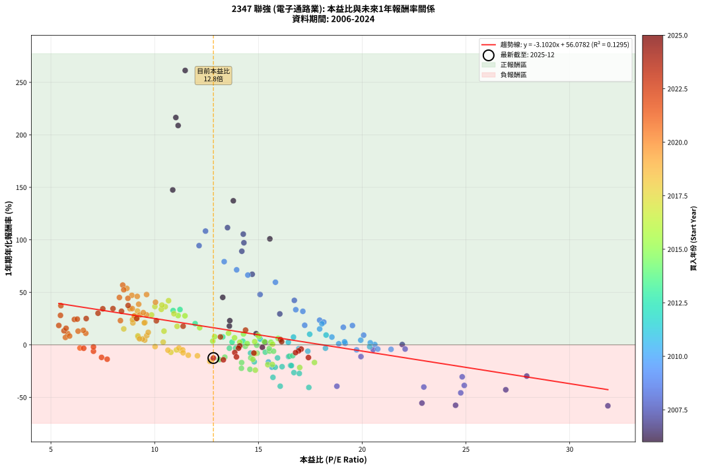
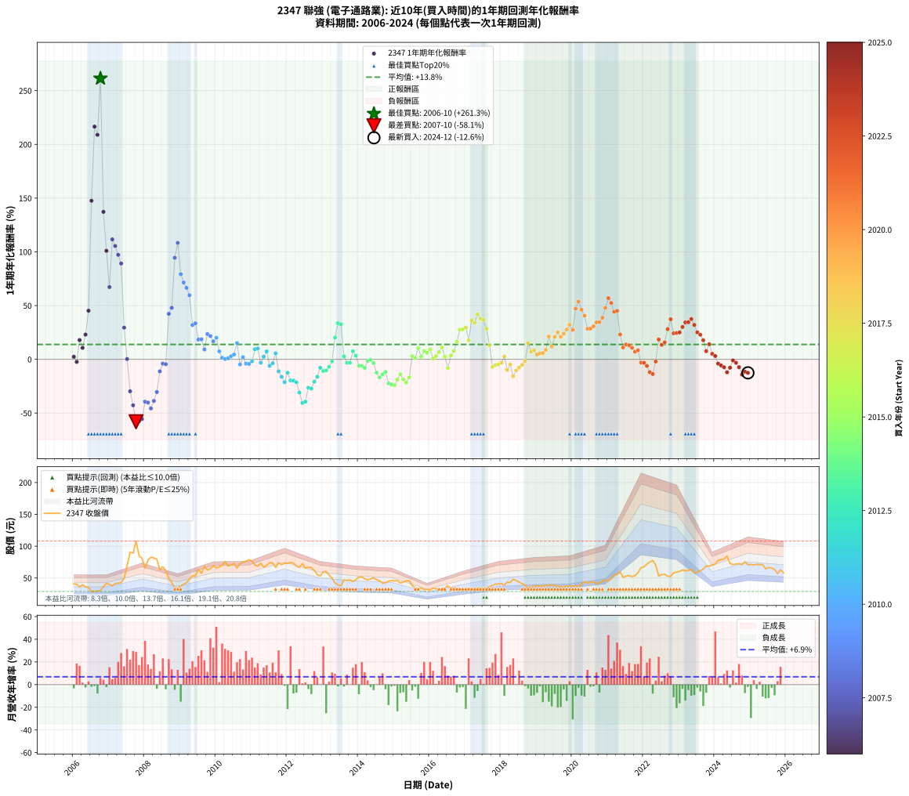

# 2347 聯強 - 本益比與未來報酬率分析

!!! info "報告資訊"
    - **股票代號**: 2347
    - **公司名稱**: 聯強
    - **產業別**: 電子通路業
    - **分析期間**: 2005-2024 (229 個數據點)
    - **資料來源**: Type 12 (ShowMonthlyK_ChartFlow) 月收盤價與本益比
    - **報酬率口徑**: 含現金股利 (簡化: 年度合計，假設每年7/1入帳)
    - **報告生成時間**: 2025-12-23 11:56:57 CST

## 📈 視覺化圖表

### 圖表1: 本益比 vs 未來報酬率關係

*圖表1：2347 聯強 本益比與1年期未來報酬率關係 (2005-2024)*

### 圖表2: 歷年買入時點的1年期實際報酬率

*圖表2：2347 聯強 歷年買入時點的1年期實際報酬率 (2005-2024)*

## 📍 買點訊號說明

本報告提供兩種買點提示訊號（顯示於圖表2的股價子圖中）：

### ▲ 小綠色三角形（回測驗證）
- **計算方式**: 使用全部歷史資料計算本益比第25百分位數
- **用途**: 事後驗證，顯示歷史上哪些時點確實為低估區
- **限制**: 當下無法判斷，僅供回測參考
- **特性**: 後見之明（Look-Ahead Bias）

### ▲ 小橘色三角形（即時訊號）
- **計算方式**: 使用截至當月的過去5年資料計算本益比第25百分位數
- **用途**: 實際投資決策，當時即可判斷
- **優勢**: 可操作性強，符合實務需求
- **特性**: 無後見之明，滾動窗口計算

!!! tip "如何使用兩種訊號"
    - **綠色▲** 幫助理解歷史估值機會，驗證策略有效性
    - **橘色▲** 可作為實際買進參考，但仍需搭配基本面分析
    - 兩種訊號重疊時，表示即時判斷與事後驗證一致，信心度較高
    - 僅有綠色▲時，表示當時無法判斷（需要未來資料才能確認）
    - 僅有橘色▲時，表示即時判斷為買點，但事後可能不是最佳時機

## 📊 估值分析摘要

| 指標 | 數值 |
|:---:|:---:|
| **目前本益比** (2024-12) | **12.83 倍** |
| **歷史平均本益比** | 13.55 倍 |
| **估值水準** | 🟡 合理範圍 |
| **預期1年年化報酬率** | **+16.14%** |
| **歷史平均報酬率** | +13.84% |
| **相關係數 (R²)** | 0.1369 |
| **趨勢線斜率** | -3.1844 |

!!! abstract "核心洞察"
    目前本益比接近歷史平均，預期報酬率符合長期趨勢

    根據歷史數據回測，2347 聯強 在目前本益比 **12.8倍** 的估值水準下，
    預期未來1年年化報酬率約為 **+16.1%**。

    **重要提醒**: 本分析基於歷史數據統計，實際報酬率會受到公司基本面變化、產業趨勢、
    總體經濟環境等多重因素影響。R² = 0.14 表示本益比可解釋約 13.7% 的報酬率變異。

## 📈 歷史估值統計

### 最佳買點 (最高報酬率)

| 項目 | 數值 |
|:---:|:---:|
| 起始時間 | 2006-10 |
| 當時本益比 | 11.12 倍 |
| 起始價格 | 30.4 元 |
| 1年後價格 | 108.0 元 |
| **1年年化報酬率** | **+261.34%** |

### 最差買點 (最低報酬率)

| 項目 | 數值 |
|:---:|:---:|
| 起始時間 | 2007-10 |
| 當時本益比 | 31.84 倍 |
| 起始價格 | 108.0 元 |
| 1年後價格 | 43.2 元 |
| **1年年化報酬率** | **-58.07%** |

## 🎯 投資啟示

### 本益比與報酬率關係

趨勢線方程式: **y = -3.1844x + 56.9979**

!!! warning "強負相關"
    本益比與未來報酬率呈現強負相關。在高本益比時期買入，未來報酬率顯著較低；
    在低本益比時期買入，未來報酬率顯著較高。**估值紀律至關重要**。

### 估值區間建議

基於歷史數據分析:

- **🟢 低估區** (P/E < 10.8): 預期報酬率較高，可考慮增加持股
- **🟡 合理區** (P/E 10.8-16.3): 預期報酬率符合長期趨勢，正常持有
- **🔴 高估區** (P/E > 16.3): 預期報酬率較低，可考慮減碼或觀望

!!! danger "風險提示"
    - 過去表現不代表未來結果
    - 本分析假設公司基本面無重大結構性變化
    - 產業環境劇變可能使歷史規律失效
    - 應結合公司財報、產業趨勢、總體經濟等多重因素綜合判斷

!!! success "長期投資觀點"
    歷史數據顯示，在合理或低估的估值水準買入並長期持有，
    往往能獲得較佳的投資報酬。**耐心等待好價格**是價值投資的核心原則。

## 📊 數據品質

- **資料來源**: GoodInfo.tw Type 12 (ShowMonthlyK_ChartFlow)
- **資料頻率**: 月度收盤價與本益比
- **回測期間**: 2005-2024
- **數據點數量**: 229 個 (每個點代表一次1年期回測)

### 計算方法說明

1. **1年期年化報酬率**:
   - 對每個歷史時點，計算其後1年的實際投資報酬率
   - 期末價值(不含股利): 期末價格
   - 期末價值(含現金股利): 期末價格 + 持有期間內的現金股利合計 (簡化: 年度合計，假設每年7/1入帳)
   - 公式: 年化報酬率 = [(期末價值/期初價格)^(1/年數) - 1] × 100%

2. **本益比 (P/E Ratio)**:
   - 使用當時的月收盤價與EPS計算
   - 資料來源: Type 12 月度河流圖本益比數據

3. **趨勢線 (Linear Regression)**:
   - 使用最小平方法擬合線性趨勢線
   - R²值衡量本益比對報酬率的解釋能力

---

*本報告由 Stock Analysis System v1.9.0 自動生成*
*數據更新時間: 2025-12-23 11:56:57 CST*

## 📋 月度回測明細表

（每一列對應時間線圖中的一個買入點；可用來對照 SVG 圖上的每個點。）

| 買入月份 | 賣出月份 | 回測期限_年 | 實際持有年數 | 買入本益比_倍 | 買入收盤價_元 | 賣出收盤價_元 | 現金股利合計_元 | 總報酬率_pct | 年化報酬率_pct |
| --- | --- | --- | --- | --- | --- | --- | --- | --- | --- |
| 2005-12 | 2006-12 | 1 | 0.999 | 12.80 | 40.45 | 41.20 | 1.50 | +5.56 | +5.57 |
| 2006-01 | 2007-01 | 1 | 0.999 | 13.02 | 40.60 | 40.05 | 1.50 | +2.34 | +2.34 |
| 2006-02 | 2007-02 | 1 | 0.999 | 13.09 | 40.25 | 37.80 | 1.50 | -2.36 | -2.36 |
| 2006-03 | 2007-03 | 1 | 0.999 | 11.89 | 36.05 | 41.00 | 1.50 | +17.89 | +17.91 |
| 2006-04 | 2007-04 | 1 | 0.999 | 13.19 | 39.45 | 42.15 | 1.50 | +10.65 | +10.65 |
| 2006-05 | 2007-05 | 1 | 0.999 | 12.25 | 36.10 | 42.90 | 1.50 | +22.99 | +23.01 |
| 2006-06 | 2007-06 | 1 | 0.999 | 12.12 | 35.20 | 49.60 | 1.50 | +45.17 | +45.21 |
| 2006-07 | 2007-07 | 1 | 0.999 | 10.06 | 28.80 | 69.50 | 1.75 | +147.40 | +147.55 |
| 2006-08 | 2007-08 | 1 | 0.999 | 10.35 | 29.20 | 90.60 | 1.75 | +216.27 | +216.52 |
| 2006-09 | 2007-09 | 1 | 0.999 | 10.62 | 29.50 | 89.30 | 1.75 | +208.64 | +208.88 |
| 2006-10 | 2007-10 | 1 | 0.999 | 11.12 | 30.40 | 108.00 | 1.75 | +261.02 | +261.34 |
| 2006-11 | 2007-11 | 1 | 0.999 | 13.57 | 36.55 | 84.90 | 1.75 | +137.07 | +137.21 |
| 2006-12 | 2007-12 | 1 | 0.999 | 15.55 | 41.20 | 81.00 | 1.75 | +100.85 | +100.95 |
| 2007-01 | 2008-01 | 1 | 0.999 | 14.70 | 40.05 | 65.20 | 1.75 | +67.17 | +67.22 |
| 2007-02 | 2008-02 | 1 | 0.999 | 13.51 | 37.80 | 78.20 | 1.75 | +111.51 | +111.62 |
| 2007-03 | 2008-03 | 1 | 1.002 | 14.27 | 41.00 | 82.60 | 1.75 | +105.73 | +105.43 |
| 2007-04 | 2008-04 | 1 | 1.002 | 14.30 | 42.15 | 81.50 | 1.75 | +97.51 | +97.23 |
| 2007-05 | 2008-05 | 1 | 1.002 | 14.20 | 42.90 | 79.50 | 1.75 | +89.39 | +89.15 |
| 2007-06 | 2008-06 | 1 | 1.002 | 16.03 | 49.60 | 62.50 | 1.75 | +29.54 | +29.47 |
| 2007-07 | 2008-07 | 1 | 1.002 | 21.93 | 69.50 | 67.70 | 2.00 | +0.29 | +0.29 |
| 2007-08 | 2008-08 | 1 | 1.002 | 27.93 | 90.60 | 61.60 | 2.00 | -29.80 | -29.75 |
| 2007-09 | 2008-09 | 1 | 1.002 | 26.92 | 89.30 | 49.05 | 2.00 | -42.83 | -42.77 |
| 2007-10 | 2008-10 | 1 | 1.002 | 31.84 | 108.00 | 43.20 | 2.00 | -58.15 | -58.07 |
| 2007-11 | 2008-11 | 1 | 1.002 | 24.50 | 84.90 | 33.95 | 2.00 | -57.66 | -57.58 |
| 2007-12 | 2008-12 | 1 | 1.002 | 22.88 | 81.00 | 34.00 | 2.00 | -55.56 | -55.48 |
| 2008-01 | 2009-01 | 1 | 1.002 | 18.78 | 65.20 | 37.45 | 2.00 | -39.49 | -39.43 |
| 2008-02 | 2009-03 | 1 | 1.081 | 22.97 | 78.20 | 42.85 | 2.00 | -42.65 | -40.19 |
| 2008-03 | 2009-03 | 1 | 0.999 | 24.75 | 82.60 | 42.85 | 2.00 | -45.70 | -45.72 |
| 2008-04 | 2009-04 | 1 | 0.999 | 24.92 | 81.50 | 48.00 | 2.00 | -38.65 | -38.67 |
| 2008-05 | 2009-05 | 1 | 0.999 | 24.82 | 79.50 | 53.30 | 2.00 | -30.44 | -30.46 |
| 2008-06 | 2009-06 | 1 | 0.999 | 19.94 | 62.50 | 53.50 | 2.00 | -11.20 | -11.21 |
| 2008-07 | 2009-07 | 1 | 0.999 | 22.07 | 67.70 | 63.70 | 1.30 | -3.99 | -3.99 |
| 2008-08 | 2009-08 | 1 | 0.999 | 20.53 | 61.60 | 57.50 | 1.30 | -4.55 | -4.55 |
| 2008-09 | 2009-09 | 1 | 0.999 | 16.73 | 49.05 | 68.50 | 1.30 | +42.30 | +42.34 |
| 2008-10 | 2009-10 | 1 | 0.999 | 15.08 | 43.20 | 62.60 | 1.30 | +47.92 | +47.96 |
| 2008-11 | 2009-11 | 1 | 0.999 | 12.14 | 33.95 | 64.70 | 1.30 | +94.40 | +94.49 |
| 2008-12 | 2009-12 | 1 | 0.999 | 12.45 | 34.00 | 69.50 | 1.30 | +108.24 | +108.34 |
| 2009-01 | 2010-01 | 1 | 0.999 | 13.35 | 37.45 | 65.80 | 1.30 | +79.17 | +79.24 |
| 2009-02 | 2010-02 | 1 | 0.999 | 13.95 | 40.20 | 67.60 | 1.30 | +71.39 | +71.46 |
| 2009-03 | 2010-03 | 1 | 0.999 | 14.49 | 42.85 | 70.00 | 1.30 | +66.39 | +66.45 |
| 2009-04 | 2010-04 | 1 | 0.999 | 15.82 | 48.00 | 75.30 | 1.30 | +59.58 | +59.63 |
| 2009-05 | 2010-05 | 1 | 0.999 | 17.14 | 53.30 | 69.00 | 1.30 | +31.89 | +31.92 |
| 2009-06 | 2010-06 | 1 | 0.999 | 16.80 | 53.50 | 70.10 | 1.30 | +33.46 | +33.48 |
| 2009-07 | 2010-07 | 1 | 0.999 | 19.53 | 63.70 | 73.00 | 2.40 | +18.37 | +18.38 |
| 2009-08 | 2010-08 | 1 | 0.999 | 17.23 | 57.50 | 65.80 | 2.40 | +18.61 | +18.62 |
| 2009-09 | 2010-09 | 1 | 0.999 | 20.07 | 68.50 | 72.40 | 2.40 | +9.20 | +9.21 |
| 2009-10 | 2010-10 | 1 | 0.999 | 17.95 | 62.60 | 74.90 | 2.40 | +23.48 | +23.50 |
| 2009-11 | 2010-11 | 1 | 0.999 | 18.15 | 64.70 | 76.30 | 2.40 | +21.64 | +21.66 |
| 2009-12 | 2010-12 | 1 | 0.999 | 19.09 | 69.50 | 78.70 | 2.40 | +16.69 | +16.70 |
| 2010-01 | 2011-01 | 1 | 0.999 | 18.06 | 65.80 | 76.60 | 2.40 | +20.06 | +20.08 |
| 2010-02 | 2011-02 | 1 | 0.999 | 18.54 | 67.60 | 70.20 | 2.40 | +7.40 | +7.40 |
| 2010-03 | 2011-03 | 1 | 0.999 | 19.18 | 70.00 | 68.60 | 2.40 | +1.43 | +1.43 |
| 2010-04 | 2011-04 | 1 | 0.999 | 20.61 | 75.30 | 73.10 | 2.40 | +0.27 | +0.27 |
| 2010-05 | 2011-05 | 1 | 0.999 | 18.87 | 69.00 | 67.30 | 2.40 | +1.02 | +1.02 |
| 2010-06 | 2011-06 | 1 | 0.999 | 19.15 | 70.10 | 69.70 | 2.40 | +2.85 | +2.86 |
| 2010-07 | 2011-07 | 1 | 0.999 | 19.93 | 73.00 | 74.00 | 2.25 | +4.45 | +4.45 |
| 2010-08 | 2011-08 | 1 | 0.999 | 17.95 | 65.80 | 73.50 | 2.25 | +15.12 | +15.13 |
| 2010-09 | 2011-09 | 1 | 0.999 | 19.73 | 72.40 | 66.70 | 2.25 | -4.77 | -4.77 |
| 2010-10 | 2011-10 | 1 | 0.999 | 20.39 | 74.90 | 74.10 | 2.25 | +1.93 | +1.93 |
| 2010-11 | 2011-11 | 1 | 0.999 | 20.75 | 76.30 | 71.00 | 2.25 | -4.00 | -4.00 |
| 2010-12 | 2011-12 | 1 | 0.999 | 21.39 | 78.70 | 73.10 | 2.25 | -4.26 | -4.26 |
| 2011-01 | 2012-01 | 1 | 0.999 | 20.36 | 76.60 | 73.00 | 2.25 | -1.77 | -1.77 |
| 2011-02 | 2012-02 | 1 | 0.999 | 18.26 | 70.20 | 74.50 | 2.25 | +9.33 | +9.33 |
| 2011-03 | 2012-03 | 1 | 1.002 | 17.47 | 68.60 | 73.30 | 2.25 | +10.13 | +10.11 |
| 2011-04 | 2012-04 | 1 | 1.002 | 18.23 | 73.10 | 68.50 | 2.25 | -3.22 | -3.21 |
| 2011-05 | 2012-05 | 1 | 1.002 | 16.44 | 67.30 | 66.70 | 2.25 | +2.45 | +2.44 |
| 2011-06 | 2012-06 | 1 | 1.002 | 16.69 | 69.70 | 72.60 | 2.25 | +7.39 | +7.37 |
| 2011-07 | 2012-07 | 1 | 1.002 | 17.38 | 74.00 | 65.50 | 4.00 | -6.08 | -6.07 |
| 2011-08 | 2012-08 | 1 | 1.002 | 16.94 | 73.50 | 66.80 | 4.00 | -3.67 | -3.67 |
| 2011-09 | 2012-09 | 1 | 1.002 | 15.08 | 66.70 | 66.40 | 4.00 | +5.55 | +5.53 |
| 2011-10 | 2012-10 | 1 | 1.002 | 16.45 | 74.10 | 61.80 | 4.00 | -11.20 | -11.18 |
| 2011-11 | 2012-11 | 1 | 1.002 | 15.48 | 71.00 | 55.40 | 4.00 | -16.34 | -16.31 |
| 2011-12 | 2012-12 | 1 | 1.002 | 15.65 | 73.10 | 53.50 | 4.00 | -21.34 | -21.30 |
| 2012-01 | 2013-01 | 1 | 1.002 | 15.92 | 73.00 | 59.90 | 4.00 | -12.47 | -12.44 |
| 2012-02 | 2013-03 | 1 | 1.081 | 16.55 | 74.50 | 54.80 | 4.00 | -21.08 | -19.66 |
| 2012-03 | 2013-03 | 1 | 0.999 | 16.59 | 73.30 | 54.80 | 4.00 | -19.78 | -19.80 |
| 2012-04 | 2013-04 | 1 | 0.999 | 15.81 | 68.50 | 49.90 | 4.00 | -21.32 | -21.33 |
| 2012-05 | 2013-05 | 1 | 0.999 | 15.70 | 66.70 | 42.05 | 4.00 | -30.96 | -30.98 |
| 2012-06 | 2013-06 | 1 | 0.999 | 17.43 | 72.60 | 39.15 | 4.00 | -40.57 | -40.59 |
| 2012-07 | 2013-07 | 1 | 0.999 | 16.05 | 65.50 | 37.70 | 2.00 | -39.39 | -39.41 |
| 2012-08 | 2013-08 | 1 | 0.999 | 16.71 | 66.80 | 47.15 | 2.00 | -26.42 | -26.44 |
| 2012-09 | 2013-09 | 1 | 0.999 | 16.97 | 66.40 | 46.30 | 2.00 | -27.26 | -27.27 |
| 2012-10 | 2013-10 | 1 | 0.999 | 16.14 | 61.80 | 46.95 | 2.00 | -20.79 | -20.81 |
| 2012-11 | 2013-11 | 1 | 0.999 | 14.80 | 55.40 | 44.45 | 2.00 | -16.16 | -16.17 |
| 2012-12 | 2013-12 | 1 | 0.999 | 14.62 | 53.50 | 47.30 | 2.00 | -7.85 | -7.86 |
| 2013-01 | 2014-01 | 1 | 0.999 | 16.49 | 59.90 | 51.40 | 2.00 | -10.85 | -10.86 |
| 2013-02 | 2014-02 | 1 | 0.999 | 16.65 | 60.00 | 51.80 | 2.00 | -10.33 | -10.34 |
| 2013-03 | 2014-03 | 1 | 0.999 | 15.33 | 54.80 | 49.00 | 2.00 | -6.93 | -6.94 |
| 2013-04 | 2014-04 | 1 | 0.999 | 14.07 | 49.90 | 46.95 | 2.00 | -1.90 | -1.91 |
| 2013-05 | 2014-05 | 1 | 0.999 | 11.95 | 42.05 | 48.55 | 2.00 | +20.21 | +20.23 |
| 2013-06 | 2014-06 | 1 | 0.999 | 11.22 | 39.15 | 50.30 | 2.00 | +33.59 | +33.62 |
| 2013-07 | 2014-07 | 1 | 0.999 | 10.89 | 37.70 | 47.20 | 2.80 | +32.63 | +32.65 |
| 2013-08 | 2014-08 | 1 | 0.999 | 13.73 | 47.15 | 45.60 | 2.80 | +2.65 | +2.65 |
| 2013-09 | 2014-09 | 1 | 0.999 | 13.60 | 46.30 | 42.00 | 2.80 | -3.24 | -3.24 |
| 2013-10 | 2014-10 | 1 | 0.999 | 13.90 | 46.95 | 42.65 | 2.80 | -3.19 | -3.20 |
| 2013-11 | 2014-11 | 1 | 0.999 | 13.28 | 44.45 | 45.00 | 2.80 | +7.54 | +7.54 |
| 2013-12 | 2014-12 | 1 | 0.999 | 14.25 | 47.30 | 46.10 | 2.80 | +3.38 | +3.39 |
| 2014-01 | 2015-01 | 1 | 0.999 | 15.54 | 51.40 | 45.50 | 2.80 | -6.03 | -6.04 |
| 2014-02 | 2015-02 | 1 | 0.999 | 15.73 | 51.80 | 45.85 | 2.80 | -6.08 | -6.09 |
| 2014-03 | 2015-03 | 1 | 0.999 | 14.94 | 49.00 | 42.30 | 2.80 | -7.96 | -7.96 |
| 2014-04 | 2015-04 | 1 | 0.999 | 14.37 | 46.95 | 43.50 | 2.80 | -1.38 | -1.39 |
| 2014-05 | 2015-05 | 1 | 0.999 | 14.92 | 48.55 | 45.55 | 2.80 | -0.41 | -0.41 |
| 2014-06 | 2015-06 | 1 | 0.999 | 15.52 | 50.30 | 45.75 | 2.80 | -3.48 | -3.48 |
| 2014-07 | 2015-07 | 1 | 0.999 | 14.63 | 47.20 | 38.05 | 3.30 | -12.39 | -12.40 |
| 2014-08 | 2015-08 | 1 | 0.999 | 14.19 | 45.60 | 34.60 | 3.30 | -16.89 | -16.90 |
| 2014-09 | 2015-09 | 1 | 0.999 | 13.12 | 42.00 | 32.80 | 3.30 | -14.05 | -14.06 |
| 2014-10 | 2015-10 | 1 | 0.999 | 13.38 | 42.65 | 34.35 | 3.30 | -11.72 | -11.73 |
| 2014-11 | 2015-11 | 1 | 0.999 | 14.18 | 45.00 | 31.65 | 3.30 | -22.33 | -22.35 |
| 2014-12 | 2015-12 | 1 | 0.999 | 14.59 | 46.10 | 32.05 | 3.30 | -23.32 | -23.33 |
| 2015-01 | 2016-01 | 1 | 0.999 | 14.85 | 45.50 | 31.25 | 3.30 | -24.07 | -24.08 |
| 2015-02 | 2016-02 | 1 | 0.999 | 15.45 | 45.85 | 33.90 | 3.30 | -18.87 | -18.88 |
| 2015-03 | 2016-03 | 1 | 1.002 | 14.73 | 42.30 | 33.15 | 3.30 | -13.83 | -13.80 |
| 2015-04 | 2016-04 | 1 | 1.002 | 15.67 | 43.50 | 32.05 | 3.30 | -18.74 | -18.70 |
| 2015-05 | 2016-05 | 1 | 1.002 | 16.99 | 45.55 | 32.40 | 3.30 | -21.62 | -21.59 |
| 2015-06 | 2016-06 | 1 | 1.002 | 17.70 | 45.75 | 34.75 | 3.30 | -16.83 | -16.80 |
| 2015-07 | 2016-07 | 1 | 1.002 | 15.29 | 38.05 | 37.70 | 1.50 | +3.02 | +3.02 |
| 2015-08 | 2016-08 | 1 | 1.002 | 14.46 | 34.60 | 33.50 | 1.50 | +1.16 | +1.15 |
| 2015-09 | 2016-09 | 1 | 1.002 | 14.28 | 32.80 | 34.70 | 1.50 | +10.37 | +10.34 |
| 2015-10 | 2016-10 | 1 | 1.002 | 15.60 | 34.35 | 33.70 | 1.50 | +2.47 | +2.47 |
| 2015-11 | 2016-11 | 1 | 1.002 | 15.03 | 31.65 | 32.60 | 1.50 | +7.74 | +7.72 |
| 2015-12 | 2016-12 | 1 | 1.002 | 15.95 | 32.05 | 32.50 | 1.50 | +6.08 | +6.07 |
| 2016-01 | 2017-01 | 1 | 1.002 | 14.98 | 31.25 | 32.60 | 1.50 | +9.12 | +9.10 |
| 2016-02 | 2017-03 | 1 | 1.081 | 15.68 | 33.90 | 32.65 | 1.50 | +0.74 | +0.68 |
| 2016-03 | 2017-03 | 1 | 0.999 | 14.82 | 33.15 | 32.65 | 1.50 | +3.02 | +3.02 |
| 2016-04 | 2017-04 | 1 | 0.999 | 13.85 | 32.05 | 32.70 | 1.50 | +6.71 | +6.71 |
| 2016-05 | 2017-05 | 1 | 0.999 | 13.56 | 32.40 | 34.50 | 1.50 | +11.11 | +11.12 |
| 2016-06 | 2017-06 | 1 | 0.999 | 14.10 | 34.75 | 34.10 | 1.50 | +2.45 | +2.45 |
| 2016-07 | 2017-07 | 1 | 0.999 | 14.84 | 37.70 | 33.60 | 1.00 | -8.22 | -8.23 |
| 2016-08 | 2017-08 | 1 | 0.999 | 12.80 | 33.50 | 33.70 | 1.00 | +3.58 | +3.58 |
| 2016-09 | 2017-09 | 1 | 0.999 | 12.89 | 34.70 | 36.40 | 1.00 | +7.78 | +7.79 |
| 2016-10 | 2017-10 | 1 | 0.999 | 12.17 | 33.70 | 38.20 | 1.00 | +16.32 | +16.33 |
| 2016-11 | 2017-11 | 1 | 0.999 | 11.46 | 32.60 | 40.60 | 1.00 | +27.61 | +27.63 |
| 2016-12 | 2017-12 | 1 | 0.999 | 11.13 | 32.50 | 40.55 | 1.00 | +27.85 | +27.87 |
| 2017-01 | 2018-01 | 1 | 0.999 | 10.93 | 32.60 | 41.25 | 1.00 | +29.60 | +29.62 |
| 2017-02 | 2018-02 | 1 | 0.999 | 11.08 | 33.75 | 38.70 | 1.00 | +17.63 | +17.64 |
| 2017-03 | 2018-03 | 1 | 0.999 | 10.51 | 32.65 | 43.50 | 1.00 | +36.29 | +36.32 |
| 2017-04 | 2018-04 | 1 | 0.999 | 10.32 | 32.70 | 42.75 | 1.00 | +33.79 | +33.82 |
| 2017-05 | 2018-05 | 1 | 0.999 | 10.67 | 34.50 | 48.00 | 1.00 | +42.03 | +42.06 |
| 2017-06 | 2018-06 | 1 | 0.999 | 10.35 | 34.10 | 46.00 | 1.00 | +37.83 | +37.86 |
| 2017-07 | 2018-07 | 1 | 0.999 | 10.01 | 33.60 | 43.65 | 2.20 | +36.46 | +36.49 |
| 2017-08 | 2018-08 | 1 | 0.999 | 9.85 | 33.70 | 41.10 | 2.20 | +28.49 | +28.51 |
| 2017-09 | 2018-09 | 1 | 0.999 | 10.45 | 36.40 | 38.95 | 2.20 | +13.05 | +13.06 |
| 2017-10 | 2018-10 | 1 | 0.999 | 10.78 | 38.20 | 33.30 | 2.20 | -7.07 | -7.07 |
| 2017-11 | 2018-11 | 1 | 0.999 | 11.25 | 40.60 | 36.25 | 2.20 | -5.30 | -5.30 |
| 2017-12 | 2018-12 | 1 | 0.999 | 11.05 | 40.55 | 36.40 | 2.20 | -4.81 | -4.81 |
| 2018-01 | 2019-01 | 1 | 0.999 | 11.17 | 41.25 | 37.80 | 2.20 | -3.03 | -3.03 |
| 2018-02 | 2019-02 | 1 | 0.999 | 10.41 | 38.70 | 37.50 | 2.20 | +2.58 | +2.59 |
| 2018-03 | 2019-03 | 1 | 0.999 | 11.62 | 43.50 | 37.00 | 2.20 | -9.89 | -9.89 |
| 2018-04 | 2019-04 | 1 | 0.999 | 11.35 | 42.75 | 38.50 | 2.20 | -4.80 | -4.80 |
| 2018-05 | 2019-05 | 1 | 0.999 | 12.66 | 48.00 | 38.25 | 2.20 | -15.73 | -15.74 |
| 2018-06 | 2019-06 | 1 | 0.999 | 12.06 | 46.00 | 39.00 | 2.20 | -10.43 | -10.44 |
| 2018-07 | 2019-07 | 1 | 0.999 | 11.37 | 43.65 | 38.35 | 2.00 | -7.56 | -7.57 |
| 2018-08 | 2019-08 | 1 | 0.999 | 10.64 | 41.10 | 37.00 | 2.00 | -5.11 | -5.11 |
| 2018-09 | 2019-09 | 1 | 0.999 | 10.02 | 38.95 | 36.30 | 2.00 | -1.67 | -1.67 |
| 2018-10 | 2019-10 | 1 | 0.999 | 8.51 | 33.30 | 36.35 | 2.00 | +15.17 | +15.18 |
| 2018-11 | 2019-11 | 1 | 0.999 | 9.21 | 36.25 | 36.85 | 2.00 | +7.17 | +7.18 |
| 2018-12 | 2019-12 | 1 | 0.999 | 9.19 | 36.40 | 37.50 | 2.00 | +8.52 | +8.52 |
| 2019-01 | 2020-01 | 1 | 0.999 | 9.52 | 37.80 | 37.50 | 2.00 | +4.50 | +4.50 |
| 2019-02 | 2020-02 | 1 | 0.999 | 9.42 | 37.50 | 37.60 | 2.00 | +5.60 | +5.60 |
| 2019-03 | 2020-03 | 1 | 1.002 | 9.27 | 37.00 | 37.15 | 2.00 | +5.81 | +5.80 |
| 2019-04 | 2020-04 | 1 | 1.002 | 9.62 | 38.50 | 39.90 | 2.00 | +8.83 | +8.81 |
| 2019-05 | 2020-05 | 1 | 1.002 | 9.53 | 38.25 | 44.40 | 2.00 | +21.31 | +21.26 |
| 2019-06 | 2020-06 | 1 | 1.002 | 9.69 | 39.00 | 41.65 | 2.00 | +11.92 | +11.90 |
| 2019-07 | 2020-07 | 1 | 1.002 | 9.50 | 38.35 | 43.80 | 2.60 | +20.99 | +20.94 |
| 2019-08 | 2020-08 | 1 | 1.002 | 9.14 | 37.00 | 43.70 | 2.60 | +25.14 | +25.08 |
| 2019-09 | 2020-09 | 1 | 1.002 | 8.95 | 36.30 | 41.30 | 2.60 | +20.94 | +20.89 |
| 2019-10 | 2020-10 | 1 | 1.002 | 8.93 | 36.35 | 42.45 | 2.60 | +23.93 | +23.88 |
| 2019-11 | 2020-11 | 1 | 1.002 | 9.03 | 36.85 | 44.50 | 2.60 | +27.82 | +27.75 |
| 2019-12 | 2020-12 | 1 | 1.002 | 9.17 | 37.50 | 47.00 | 2.60 | +32.27 | +32.19 |
| 2020-01 | 2021-01 | 1 | 1.002 | 9.02 | 37.50 | 45.20 | 2.60 | +27.47 | +27.40 |
| 2020-02 | 2021-03 | 1 | 1.081 | 8.90 | 37.60 | 54.50 | 2.60 | +51.86 | +47.16 |
| 2020-03 | 2021-03 | 1 | 0.999 | 8.66 | 37.15 | 54.50 | 2.60 | +53.70 | +53.75 |
| 2020-04 | 2021-04 | 1 | 0.999 | 9.16 | 39.90 | 55.70 | 2.60 | +46.12 | +46.15 |
| 2020-05 | 2021-05 | 1 | 0.999 | 10.04 | 44.40 | 59.80 | 2.60 | +40.54 | +40.57 |
| 2020-06 | 2021-06 | 1 | 0.999 | 9.28 | 41.65 | 50.90 | 2.60 | +28.45 | +28.47 |
| 2020-07 | 2021-07 | 1 | 0.999 | 9.61 | 43.80 | 53.00 | 3.30 | +28.54 | +28.56 |
| 2020-08 | 2021-08 | 1 | 0.999 | 9.45 | 43.70 | 53.80 | 3.30 | +30.66 | +30.69 |
| 2020-09 | 2021-09 | 1 | 0.999 | 8.81 | 41.30 | 52.20 | 3.30 | +34.38 | +34.41 |
| 2020-10 | 2021-10 | 1 | 0.999 | 8.92 | 42.45 | 53.80 | 3.30 | +34.51 | +34.54 |
| 2020-11 | 2021-11 | 1 | 0.999 | 9.23 | 44.50 | 58.40 | 3.30 | +38.65 | +38.68 |
| 2020-12 | 2021-12 | 1 | 0.999 | 9.61 | 47.00 | 66.20 | 3.30 | +47.87 | +47.91 |
| 2021-01 | 2022-01 | 1 | 0.999 | 8.46 | 45.20 | 67.60 | 3.30 | +56.86 | +56.91 |
| 2021-02 | 2022-02 | 1 | 0.999 | 8.51 | 49.35 | 71.90 | 3.30 | +52.38 | +52.42 |
| 2021-03 | 2022-03 | 1 | 0.999 | 8.71 | 54.50 | 75.30 | 3.30 | +44.22 | +44.26 |
| 2021-04 | 2022-04 | 1 | 0.999 | 8.30 | 55.70 | 77.50 | 3.30 | +45.06 | +45.10 |
| 2021-05 | 2022-05 | 1 | 0.999 | 8.35 | 59.80 | 70.30 | 3.30 | +23.08 | +23.09 |
| 2021-06 | 2022-06 | 1 | 0.999 | 6.68 | 50.90 | 53.20 | 3.30 | +11.00 | +11.01 |
| 2021-07 | 2022-07 | 1 | 0.999 | 6.56 | 53.00 | 55.30 | 5.00 | +13.77 | +13.78 |
| 2021-08 | 2022-08 | 1 | 0.999 | 6.31 | 53.80 | 55.80 | 5.00 | +13.01 | +13.02 |
| 2021-09 | 2022-09 | 1 | 0.999 | 5.81 | 52.20 | 52.80 | 5.00 | +10.73 | +10.74 |
| 2021-10 | 2022-10 | 1 | 0.999 | 5.70 | 53.80 | 52.60 | 5.00 | +7.06 | +7.07 |
| 2021-11 | 2022-11 | 1 | 0.999 | 5.90 | 58.40 | 58.30 | 5.00 | +8.39 | +8.40 |
| 2021-12 | 2022-12 | 1 | 0.999 | 6.40 | 66.20 | 59.20 | 5.00 | -3.02 | -3.02 |
| 2022-01 | 2023-01 | 1 | 0.999 | 6.58 | 67.60 | 60.40 | 5.00 | -3.25 | -3.26 |
| 2022-02 | 2023-02 | 1 | 0.999 | 7.05 | 71.90 | 62.50 | 5.00 | -6.12 | -6.12 |
| 2022-03 | 2023-03 | 1 | 0.999 | 7.44 | 75.30 | 61.30 | 5.00 | -11.95 | -11.96 |
| 2022-04 | 2023-04 | 1 | 0.999 | 7.71 | 77.50 | 61.90 | 5.00 | -13.68 | -13.69 |
| 2022-05 | 2023-05 | 1 | 0.999 | 7.05 | 70.30 | 63.90 | 5.00 | -1.99 | -1.99 |
| 2022-06 | 2023-06 | 1 | 0.999 | 5.38 | 53.20 | 58.00 | 5.00 | +18.42 | +18.43 |
| 2022-07 | 2023-07 | 1 | 0.999 | 5.63 | 55.30 | 59.20 | 3.50 | +13.38 | +13.39 |
| 2022-08 | 2023-08 | 1 | 0.999 | 5.73 | 55.80 | 61.10 | 3.50 | +15.77 | +15.78 |
| 2022-09 | 2023-09 | 1 | 0.999 | 5.46 | 52.80 | 64.10 | 3.50 | +28.03 | +28.05 |
| 2022-10 | 2023-10 | 1 | 0.999 | 5.48 | 52.60 | 68.70 | 3.50 | +37.26 | +37.29 |
| 2022-11 | 2023-11 | 1 | 0.999 | 6.13 | 58.30 | 68.90 | 3.50 | +24.19 | +24.20 |
| 2022-12 | 2023-12 | 1 | 0.999 | 6.27 | 59.20 | 70.20 | 3.50 | +24.49 | +24.51 |
| 2023-01 | 2024-01 | 1 | 0.999 | 6.70 | 60.40 | 72.00 | 3.50 | +25.00 | +25.02 |
| 2023-02 | 2024-02 | 1 | 0.999 | 7.27 | 62.50 | 77.80 | 3.50 | +30.08 | +30.10 |
| 2023-03 | 2024-03 | 1 | 1.002 | 7.50 | 61.30 | 78.90 | 3.50 | +34.42 | +34.34 |
| 2023-04 | 2024-04 | 1 | 1.002 | 7.99 | 61.90 | 79.80 | 3.50 | +34.57 | +34.49 |
| 2023-05 | 2024-05 | 1 | 1.002 | 8.72 | 63.90 | 84.40 | 3.50 | +37.56 | +37.47 |
| 2023-06 | 2024-06 | 1 | 1.002 | 8.40 | 58.00 | 73.10 | 3.50 | +32.07 | +31.99 |
| 2023-07 | 2024-07 | 1 | 1.002 | 9.13 | 59.20 | 71.10 | 3.00 | +25.17 | +25.11 |
| 2023-08 | 2024-08 | 1 | 1.002 | 10.08 | 61.10 | 72.10 | 3.00 | +22.91 | +22.86 |
| 2023-09 | 2024-09 | 1 | 1.002 | 11.37 | 64.10 | 72.50 | 3.00 | +17.78 | +17.75 |
| 2023-10 | 2024-10 | 1 | 1.002 | 13.17 | 68.70 | 70.90 | 3.00 | +7.57 | +7.55 |
| 2023-11 | 2024-11 | 1 | 1.002 | 14.38 | 68.90 | 75.60 | 3.00 | +14.08 | +14.05 |
| 2023-12 | 2024-12 | 1 | 1.002 | 16.06 | 70.20 | 70.80 | 3.00 | +5.13 | +5.12 |
| 2024-01 | 2025-01 | 1 | 1.002 | 16.12 | 72.00 | 71.20 | 3.00 | +3.06 | +3.05 |
| 2024-02 | 2025-03 | 1 | 1.081 | 17.06 | 77.80 | 71.40 | 3.00 | -4.37 | -4.05 |
| 2024-03 | 2025-03 | 1 | 0.999 | 16.94 | 78.90 | 71.40 | 3.00 | -5.70 | -5.71 |
| 2024-04 | 2025-04 | 1 | 0.999 | 16.79 | 79.80 | 70.90 | 3.00 | -7.39 | -7.40 |
| 2024-05 | 2025-05 | 1 | 0.999 | 17.41 | 84.40 | 71.20 | 3.00 | -12.09 | -12.09 |
| 2024-06 | 2025-06 | 1 | 0.999 | 14.78 | 73.10 | 64.40 | 3.00 | -7.80 | -7.80 |
| 2024-07 | 2025-07 | 1 | 0.999 | 14.10 | 71.10 | 66.40 | 4.00 | -0.98 | -0.99 |
| 2024-08 | 2025-08 | 1 | 0.999 | 14.04 | 72.10 | 65.80 | 4.00 | -3.19 | -3.19 |
| 2024-09 | 2025-09 | 1 | 0.999 | 13.86 | 72.50 | 63.20 | 4.00 | -7.31 | -7.32 |
| 2024-10 | 2025-10 | 1 | 0.999 | 13.31 | 70.90 | 56.80 | 4.00 | -14.25 | -14.25 |
| 2024-11 | 2025-11 | 1 | 0.999 | 13.94 | 75.60 | 62.90 | 4.00 | -11.51 | -11.52 |
| 2024-12 | 2025-12 | 1 | 0.999 | 12.83 | 70.80 | 61.90 | 4.00 | -6.92 | -6.93 |
