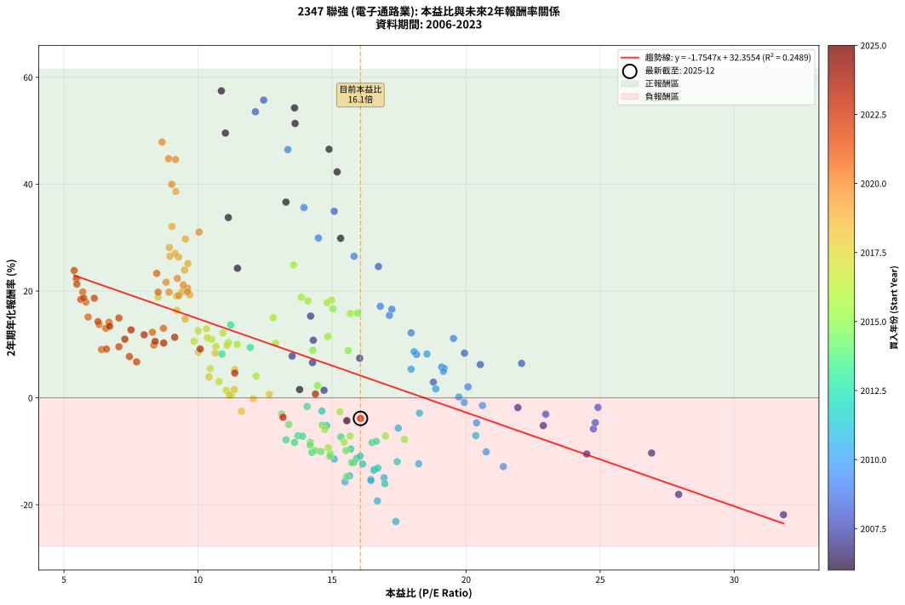
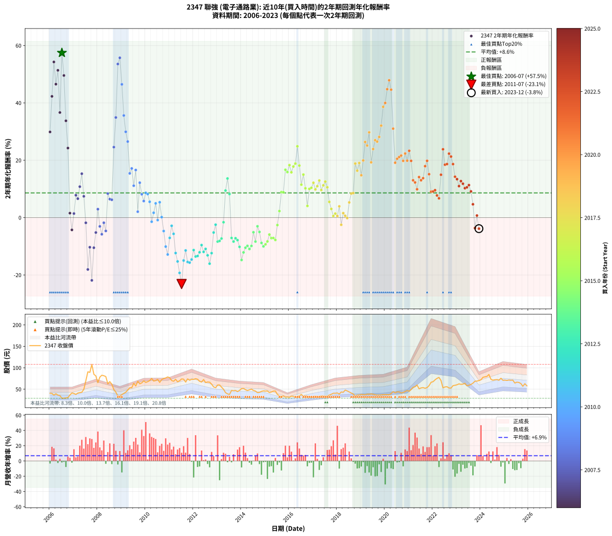

# 2347 聯強 - 本益比與未來報酬率分析

!!! info "報告資訊"
    - **股票代號**: 2347
    - **公司名稱**: 聯強
    - **產業別**: 電子通路業
    - **分析期間**: 2006-2023 (216 個數據點)
    - **資料來源**: Type 12 (ShowMonthlyK_ChartFlow) 月收盤價與本益比
    - **報酬率口徑**: 含現金股利 (簡化: 年度合計，假設每年7/1入帳)
    - **報告生成時間**: 2026-01-06 22:28:11 CST

## 📈 視覺化圖表

### 圖表1: 本益比 vs 未來報酬率關係

*圖表1：2347 聯強 本益比與2年期未來報酬率關係 (2006-2023)*

### 圖表2: 歷年買入時點的2年期實際報酬率

*圖表2：2347 聯強 歷年買入時點的2年期實際報酬率 (2006-2023)*

## 📍 買點訊號說明

本報告提供兩種買點提示訊號（顯示於圖表2的股價子圖中）：

### ▲ 小綠色三角形（回測驗證）
- **計算方式**: 使用全部歷史資料計算本益比第25百分位數
- **用途**: 事後驗證，顯示歷史上哪些時點確實為低估區
- **限制**: 當下無法判斷，僅供回測參考
- **特性**: 後見之明（Look-Ahead Bias）

### ▲ 小橘色三角形（即時訊號）
- **計算方式**: 使用截至當月的過去5年資料計算本益比第25百分位數
- **用途**: 實際投資決策，當時即可判斷
- **優勢**: 可操作性強，符合實務需求
- **特性**: 無後見之明，滾動窗口計算

!!! tip "如何使用兩種訊號"
    - **綠色▲** 幫助理解歷史估值機會，驗證策略有效性
    - **橘色▲** 可作為實際買進參考，但仍需搭配基本面分析
    - 兩種訊號重疊時，表示即時判斷與事後驗證一致，信心度較高
    - 僅有綠色▲時，表示當時無法判斷（需要未來資料才能確認）
    - 僅有橘色▲時，表示即時判斷為買點，但事後可能不是最佳時機

## 📊 估值分析摘要

| 指標 | 數值 |
|:---:|:---:|
| **目前本益比** (2023-12) | **16.06 倍** |
| **歷史平均本益比** | 13.53 倍 |
| **估值水準** | 🟡 合理範圍 |
| **預期2年年化報酬率** | **+4.17%** |
| **歷史平均報酬率** | +8.61% |
| **相關係數 (R²)** | 0.2489 |
| **趨勢線斜率** | -1.7547 |

!!! abstract "核心洞察"
    目前本益比接近歷史平均，預期報酬率符合長期趨勢

    根據歷史數據回測，2347 聯強 在目前本益比 **16.1倍** 的估值水準下，
    預期未來2年年化報酬率約為 **+4.2%**。

    **重要提醒**: 本分析基於歷史數據統計，實際報酬率會受到公司基本面變化、產業趨勢、
    總體經濟環境等多重因素影響。R² = 0.25 表示本益比可解釋約 24.9% 的報酬率變異。

## 📈 歷史估值統計

### 最佳買點 (最高報酬率)

| 項目 | 數值 |
|:---:|:---:|
| 起始時間 | 2006-07 |
| 當時本益比 | 10.87 倍 |
| 起始價格 | 28.8 元 |
| 2年後價格 | 67.7 元 |
| **2年年化報酬率** | **+57.46%** |

### 最差買點 (最低報酬率)

| 項目 | 數值 |
|:---:|:---:|
| 起始時間 | 2011-07 |
| 當時本益比 | 17.38 倍 |
| 起始價格 | 74.0 元 |
| 2年後價格 | 37.7 元 |
| **2年年化報酬率** | **-23.14%** |

## 🎯 投資啟示

### 本益比與報酬率關係

趨勢線方程式: **y = -1.7547x + 32.3554**

!!! warning "強負相關"
    本益比與未來報酬率呈現強負相關。在高本益比時期買入，未來報酬率顯著較低；
    在低本益比時期買入，未來報酬率顯著較高。**估值紀律至關重要**。

### 估值區間建議

基於歷史數據分析:

- **🟢 低估區** (P/E < 10.8): 預期報酬率較高，可考慮增加持股
- **🟡 合理區** (P/E 10.8-16.2): 預期報酬率符合長期趨勢，正常持有
- **🔴 高估區** (P/E > 16.2): 預期報酬率較低，可考慮減碼或觀望

!!! danger "風險提示"
    - 過去表現不代表未來結果
    - 本分析假設公司基本面無重大結構性變化
    - 產業環境劇變可能使歷史規律失效
    - 應結合公司財報、產業趨勢、總體經濟等多重因素綜合判斷

!!! success "長期投資觀點"
    歷史數據顯示，在合理或低估的估值水準買入並長期持有，
    往往能獲得較佳的投資報酬。**耐心等待好價格**是價值投資的核心原則。

## 📊 數據品質

- **資料來源**: GoodInfo.tw Type 12 (ShowMonthlyK_ChartFlow)
- **資料頻率**: 月度收盤價與本益比
- **回測期間**: 2006-2023
- **數據點數量**: 216 個 (每個點代表一次2年期回測)

### 計算方法說明

1. **2年期年化報酬率**:
   - 對每個歷史時點，計算其後2年的實際投資報酬率
   - 期末價值(不含股利): 期末價格
   - 期末價值(含現金股利): 期末價格 + 持有期間內的現金股利合計 (簡化: 年度合計，假設每年7/1入帳)
   - 公式: 年化報酬率 = [(期末價值/期初價格)^(1/年數) - 1] × 100%

2. **本益比 (P/E Ratio)**:
   - 使用當時的月收盤價與EPS計算
   - 資料來源: Type 12 月度河流圖本益比數據

3. **趨勢線 (Linear Regression)**:
   - 使用最小平方法擬合線性趨勢線
   - R²值衡量本益比對報酬率的解釋能力

---

*本報告由 Stock Analysis System v1.9.0 自動生成*
*數據更新時間: 2026-01-06 22:28:11 CST*

## 📋 月度回測明細表

（每一列對應時間線圖中的一個買入點；可用來對照 SVG 圖上的每個點。）

| 買入月份 | 賣出月份 | 回測期限_年 | 實際持有年數 | 買入本益比_倍 | 買入收盤價_元 | 賣出收盤價_元 | 現金股利合計_元 | 總報酬率_pct | 年化報酬率_pct |
| --- | --- | --- | --- | --- | --- | --- | --- | --- | --- |
| 2006-01 | 2008-01 | 2 | 1.999 | 15.32 | 40.60 | 65.20 | 3.25 | +68.60 | +29.87 |
| 2006-02 | 2008-02 | 2 | 1.999 | 15.19 | 40.25 | 78.20 | 3.25 | +102.36 | +42.29 |
| 2006-03 | 2008-03 | 2 | 2.001 | 13.60 | 36.05 | 82.60 | 3.25 | +138.14 | +54.27 |
| 2006-04 | 2008-04 | 2 | 2.001 | 14.89 | 39.45 | 81.50 | 3.25 | +114.83 | +46.53 |
| 2006-05 | 2008-05 | 2 | 2.001 | 13.62 | 36.10 | 79.50 | 3.25 | +129.22 | +51.36 |
| 2006-06 | 2008-06 | 2 | 2.001 | 13.28 | 35.20 | 62.50 | 3.25 | +86.79 | +36.64 |
| 2006-07 | 2008-07 | 2 | 2.001 | 10.87 | 28.80 | 67.70 | 3.75 | +148.09 | +57.46 |
| 2006-08 | 2008-08 | 2 | 2.001 | 11.02 | 29.20 | 61.60 | 3.75 | +123.80 | +49.56 |
| 2006-09 | 2008-09 | 2 | 2.001 | 11.13 | 29.50 | 49.05 | 3.75 | +78.98 | +33.76 |
| 2006-10 | 2008-10 | 2 | 2.001 | 11.47 | 30.40 | 43.20 | 3.75 | +54.44 | +24.26 |
| 2006-11 | 2008-11 | 2 | 2.001 | 13.79 | 36.55 | 33.95 | 3.75 | +3.15 | +1.56 |
| 2006-12 | 2008-12 | 2 | 2.001 | 15.55 | 41.20 | 34.00 | 3.75 | -8.37 | -4.28 |
| 2007-01 | 2009-01 | 2 | 2.001 | 14.70 | 40.05 | 37.45 | 3.75 | +2.87 | +1.42 |
| 2007-02 | 2009-02 | 2 | 2.001 | 13.51 | 37.80 | 40.20 | 3.75 | +16.27 | +7.82 |
| 2007-03 | 2009-03 | 2 | 2.001 | 14.27 | 41.00 | 42.85 | 3.75 | +13.66 | +6.61 |
| 2007-04 | 2009-04 | 2 | 2.001 | 14.30 | 42.15 | 48.00 | 3.75 | +22.78 | +10.80 |
| 2007-05 | 2009-05 | 2 | 2.001 | 14.20 | 42.90 | 53.30 | 3.75 | +32.98 | +15.31 |
| 2007-06 | 2009-06 | 2 | 2.001 | 16.03 | 49.60 | 53.50 | 3.75 | +15.42 | +7.43 |
| 2007-07 | 2009-07 | 2 | 2.001 | 21.93 | 69.50 | 63.70 | 3.30 | -3.60 | -1.81 |
| 2007-08 | 2009-08 | 2 | 2.001 | 27.93 | 90.60 | 57.50 | 3.30 | -32.89 | -18.07 |
| 2007-09 | 2009-09 | 2 | 2.001 | 26.92 | 89.30 | 68.50 | 3.30 | -19.60 | -10.33 |
| 2007-10 | 2009-10 | 2 | 2.001 | 31.84 | 108.00 | 62.60 | 3.30 | -38.98 | -21.87 |
| 2007-11 | 2009-11 | 2 | 2.001 | 24.50 | 84.90 | 64.70 | 3.30 | -19.91 | -10.50 |
| 2007-12 | 2009-12 | 2 | 2.001 | 22.88 | 81.00 | 69.50 | 3.30 | -10.12 | -5.19 |
| 2008-01 | 2010-01 | 2 | 2.001 | 18.78 | 65.20 | 65.80 | 3.30 | +5.98 | +2.95 |
| 2008-02 | 2010-03 | 2 | 2.081 | 22.97 | 78.20 | 70.00 | 3.30 | -6.27 | -3.06 |
| 2008-03 | 2010-03 | 2 | 1.999 | 24.75 | 82.60 | 70.00 | 3.30 | -11.26 | -5.80 |
| 2008-04 | 2010-04 | 2 | 1.999 | 24.92 | 81.50 | 75.30 | 3.30 | -3.56 | -1.80 |
| 2008-05 | 2010-05 | 2 | 1.999 | 24.82 | 79.50 | 69.00 | 3.30 | -9.06 | -4.64 |
| 2008-06 | 2010-06 | 2 | 1.999 | 19.94 | 62.50 | 70.10 | 3.30 | +17.44 | +8.38 |
| 2008-07 | 2010-07 | 2 | 1.999 | 22.07 | 67.70 | 73.00 | 3.70 | +13.30 | +6.44 |
| 2008-08 | 2010-08 | 2 | 1.999 | 20.53 | 61.60 | 65.80 | 3.70 | +12.83 | +6.22 |
| 2008-09 | 2010-09 | 2 | 1.999 | 16.73 | 49.05 | 72.40 | 3.70 | +55.15 | +24.58 |
| 2008-10 | 2010-10 | 2 | 1.999 | 15.08 | 43.20 | 74.90 | 3.70 | +81.95 | +34.92 |
| 2008-11 | 2010-11 | 2 | 1.999 | 12.14 | 33.95 | 76.30 | 3.70 | +135.64 | +53.55 |
| 2008-12 | 2010-12 | 2 | 1.999 | 12.45 | 34.00 | 78.70 | 3.70 | +142.36 | +55.73 |
| 2009-01 | 2011-01 | 2 | 1.999 | 13.35 | 37.45 | 76.60 | 3.70 | +114.42 | +46.47 |
| 2009-02 | 2011-02 | 2 | 1.999 | 13.95 | 40.20 | 70.20 | 3.70 | +83.83 | +35.61 |
| 2009-03 | 2011-03 | 2 | 1.999 | 14.49 | 42.85 | 68.60 | 3.70 | +68.73 | +29.92 |
| 2009-04 | 2011-04 | 2 | 1.999 | 15.82 | 48.00 | 73.10 | 3.70 | +60.00 | +26.51 |
| 2009-05 | 2011-05 | 2 | 1.999 | 17.14 | 53.30 | 67.30 | 3.70 | +33.21 | +15.43 |
| 2009-06 | 2011-06 | 2 | 1.999 | 16.80 | 53.50 | 69.70 | 3.70 | +37.20 | +17.14 |
| 2009-07 | 2011-07 | 2 | 1.999 | 19.53 | 63.70 | 74.00 | 4.65 | +23.47 | +11.12 |
| 2009-08 | 2011-08 | 2 | 1.999 | 17.23 | 57.50 | 73.50 | 4.65 | +35.91 | +16.59 |
| 2009-09 | 2011-09 | 2 | 1.999 | 20.07 | 68.50 | 66.70 | 4.65 | +4.16 | +2.06 |
| 2009-10 | 2011-10 | 2 | 1.999 | 17.95 | 62.60 | 74.10 | 4.65 | +25.80 | +12.17 |
| 2009-11 | 2011-11 | 2 | 1.999 | 18.15 | 64.70 | 71.00 | 4.65 | +16.92 | +8.14 |
| 2009-12 | 2011-12 | 2 | 1.999 | 19.09 | 69.50 | 73.10 | 4.65 | +11.87 | +5.77 |
| 2010-01 | 2012-01 | 2 | 1.999 | 18.06 | 65.80 | 73.00 | 4.65 | +18.01 | +8.64 |
| 2010-02 | 2012-02 | 2 | 1.999 | 18.54 | 67.60 | 74.50 | 4.65 | +17.08 | +8.21 |
| 2010-03 | 2012-03 | 2 | 2.001 | 19.18 | 70.00 | 73.30 | 4.65 | +11.36 | +5.52 |
| 2010-04 | 2012-04 | 2 | 2.001 | 20.61 | 75.30 | 68.50 | 4.65 | -2.86 | -1.44 |
| 2010-05 | 2012-05 | 2 | 2.001 | 18.87 | 69.00 | 66.70 | 4.65 | +3.40 | +1.69 |
| 2010-06 | 2012-06 | 2 | 2.001 | 19.15 | 70.10 | 72.60 | 4.65 | +10.20 | +4.97 |
| 2010-07 | 2012-07 | 2 | 2.001 | 19.93 | 73.00 | 65.50 | 6.25 | -1.72 | -0.86 |
| 2010-08 | 2012-08 | 2 | 2.001 | 17.95 | 65.80 | 66.80 | 6.25 | +11.01 | +5.36 |
| 2010-09 | 2012-09 | 2 | 2.001 | 19.73 | 72.40 | 66.40 | 6.25 | +0.34 | +0.17 |
| 2010-10 | 2012-10 | 2 | 2.001 | 20.39 | 74.90 | 61.80 | 6.25 | -9.15 | -4.68 |
| 2010-11 | 2012-11 | 2 | 2.001 | 20.75 | 76.30 | 55.40 | 6.25 | -19.20 | -10.11 |
| 2010-12 | 2012-12 | 2 | 2.001 | 21.39 | 78.70 | 53.50 | 6.25 | -24.08 | -12.86 |
| 2011-01 | 2013-01 | 2 | 2.001 | 20.36 | 76.60 | 59.90 | 6.25 | -13.65 | -7.07 |
| 2011-02 | 2013-02 | 2 | 2.001 | 18.26 | 70.20 | 60.00 | 6.25 | -5.63 | -2.85 |
| 2011-03 | 2013-03 | 2 | 2.001 | 17.47 | 68.60 | 54.80 | 6.25 | -11.01 | -5.66 |
| 2011-04 | 2013-04 | 2 | 2.001 | 18.23 | 73.10 | 49.90 | 6.25 | -23.19 | -12.35 |
| 2011-05 | 2013-05 | 2 | 2.001 | 16.44 | 67.30 | 42.05 | 6.25 | -28.24 | -15.28 |
| 2011-06 | 2013-06 | 2 | 2.001 | 16.69 | 69.70 | 39.15 | 6.25 | -34.87 | -19.28 |
| 2011-07 | 2013-07 | 2 | 2.001 | 17.38 | 74.00 | 37.70 | 6.00 | -40.95 | -23.14 |
| 2011-08 | 2013-08 | 2 | 2.001 | 16.94 | 73.50 | 47.15 | 6.00 | -27.69 | -14.95 |
| 2011-09 | 2013-09 | 2 | 2.001 | 15.08 | 66.70 | 46.30 | 6.00 | -21.59 | -11.44 |
| 2011-10 | 2013-10 | 2 | 2.001 | 16.45 | 74.10 | 46.95 | 6.00 | -28.54 | -15.46 |
| 2011-11 | 2013-11 | 2 | 2.001 | 15.48 | 71.00 | 44.45 | 6.00 | -28.95 | -15.70 |
| 2011-12 | 2013-12 | 2 | 2.001 | 15.65 | 73.10 | 47.30 | 6.00 | -27.09 | -14.60 |
| 2012-01 | 2014-01 | 2 | 2.001 | 15.92 | 73.00 | 51.40 | 6.00 | -21.37 | -11.32 |
| 2012-02 | 2014-03 | 2 | 2.081 | 16.55 | 74.50 | 49.00 | 6.00 | -26.18 | -13.57 |
| 2012-03 | 2014-03 | 2 | 1.999 | 16.59 | 73.30 | 49.00 | 6.00 | -24.97 | -13.39 |
| 2012-04 | 2014-04 | 2 | 1.999 | 15.81 | 68.50 | 46.95 | 6.00 | -22.70 | -12.09 |
| 2012-05 | 2014-05 | 2 | 1.999 | 15.70 | 66.70 | 48.55 | 6.00 | -18.22 | -9.57 |
| 2012-06 | 2014-06 | 2 | 1.999 | 17.43 | 72.60 | 50.30 | 6.00 | -22.45 | -11.95 |
| 2012-07 | 2014-07 | 2 | 1.999 | 16.05 | 65.50 | 47.20 | 4.80 | -20.61 | -10.91 |
| 2012-08 | 2014-08 | 2 | 1.999 | 16.71 | 66.80 | 45.60 | 4.80 | -24.55 | -13.15 |
| 2012-09 | 2014-09 | 2 | 1.999 | 16.97 | 66.40 | 42.00 | 4.80 | -29.52 | -16.06 |
| 2012-10 | 2014-10 | 2 | 1.999 | 16.14 | 61.80 | 42.65 | 4.80 | -23.22 | -12.38 |
| 2012-11 | 2014-11 | 2 | 1.999 | 14.80 | 55.40 | 45.00 | 4.80 | -10.11 | -5.19 |
| 2012-12 | 2014-12 | 2 | 1.999 | 14.62 | 53.50 | 46.10 | 4.80 | -4.86 | -2.46 |
| 2013-01 | 2015-01 | 2 | 1.999 | 16.49 | 59.90 | 45.50 | 4.80 | -16.03 | -8.37 |
| 2013-02 | 2015-02 | 2 | 1.999 | 16.65 | 60.00 | 45.85 | 4.80 | -15.58 | -8.13 |
| 2013-03 | 2015-03 | 2 | 1.999 | 15.33 | 54.80 | 42.30 | 4.80 | -14.05 | -7.30 |
| 2013-04 | 2015-04 | 2 | 1.999 | 14.07 | 49.90 | 43.50 | 4.80 | -3.21 | -1.62 |
| 2013-05 | 2015-05 | 2 | 1.999 | 11.95 | 42.05 | 45.55 | 4.80 | +19.74 | +9.43 |
| 2013-06 | 2015-06 | 2 | 1.999 | 11.22 | 39.15 | 45.75 | 4.80 | +29.12 | +13.64 |
| 2013-07 | 2015-07 | 2 | 1.999 | 10.89 | 37.70 | 38.05 | 6.10 | +17.11 | +8.22 |
| 2013-08 | 2015-08 | 2 | 1.999 | 13.73 | 47.15 | 34.60 | 6.10 | -13.68 | -7.10 |
| 2013-09 | 2015-09 | 2 | 1.999 | 13.60 | 46.30 | 32.80 | 6.10 | -15.98 | -8.34 |
| 2013-10 | 2015-10 | 2 | 1.999 | 13.90 | 46.95 | 34.35 | 6.10 | -13.84 | -7.18 |
| 2013-11 | 2015-11 | 2 | 1.999 | 13.28 | 44.45 | 31.65 | 6.10 | -15.07 | -7.85 |
| 2013-12 | 2015-12 | 2 | 1.999 | 14.25 | 47.30 | 32.05 | 6.10 | -19.34 | -10.20 |
| 2014-01 | 2016-01 | 2 | 1.999 | 15.54 | 51.40 | 31.25 | 6.10 | -27.33 | -14.77 |
| 2014-02 | 2016-02 | 2 | 1.999 | 15.73 | 51.80 | 33.90 | 6.10 | -22.78 | -12.13 |
| 2014-03 | 2016-03 | 2 | 2.001 | 14.94 | 49.00 | 33.15 | 6.10 | -19.90 | -10.49 |
| 2014-04 | 2016-04 | 2 | 2.001 | 14.37 | 46.95 | 32.05 | 6.10 | -18.74 | -9.85 |
| 2014-05 | 2016-05 | 2 | 2.001 | 14.92 | 48.55 | 32.40 | 6.10 | -20.70 | -10.94 |
| 2014-06 | 2016-06 | 2 | 2.001 | 15.52 | 50.30 | 34.75 | 6.10 | -18.79 | -9.88 |
| 2014-07 | 2016-07 | 2 | 2.001 | 14.63 | 47.20 | 37.70 | 4.80 | -9.96 | -5.11 |
| 2014-08 | 2016-08 | 2 | 2.001 | 14.19 | 45.60 | 33.50 | 4.80 | -16.01 | -8.35 |
| 2014-09 | 2016-09 | 2 | 2.001 | 13.12 | 42.00 | 34.70 | 4.80 | -5.95 | -3.02 |
| 2014-10 | 2016-10 | 2 | 2.001 | 13.38 | 42.65 | 33.70 | 4.80 | -9.73 | -4.99 |
| 2014-11 | 2016-11 | 2 | 2.001 | 14.18 | 45.00 | 32.60 | 4.80 | -16.89 | -8.83 |
| 2014-12 | 2016-12 | 2 | 2.001 | 14.59 | 46.10 | 32.50 | 4.80 | -19.09 | -10.04 |
| 2015-01 | 2017-01 | 2 | 2.001 | 14.85 | 45.50 | 32.60 | 4.80 | -17.80 | -9.33 |
| 2015-02 | 2017-02 | 2 | 2.001 | 15.45 | 45.85 | 33.75 | 4.80 | -15.92 | -8.30 |
| 2015-03 | 2017-03 | 2 | 2.001 | 14.73 | 42.30 | 32.65 | 4.80 | -11.47 | -5.90 |
| 2015-04 | 2017-04 | 2 | 2.001 | 15.67 | 43.50 | 32.70 | 4.80 | -13.79 | -7.15 |
| 2015-05 | 2017-05 | 2 | 2.001 | 16.99 | 45.55 | 34.50 | 4.80 | -13.72 | -7.11 |
| 2015-06 | 2017-06 | 2 | 2.001 | 17.70 | 45.75 | 34.10 | 4.80 | -14.97 | -7.78 |
| 2015-07 | 2017-07 | 2 | 2.001 | 15.29 | 38.05 | 33.60 | 2.50 | -5.12 | -2.59 |
| 2015-08 | 2017-08 | 2 | 2.001 | 14.46 | 34.60 | 33.70 | 2.50 | +4.62 | +2.28 |
| 2015-09 | 2017-09 | 2 | 2.001 | 14.28 | 32.80 | 36.40 | 2.50 | +18.60 | +8.90 |
| 2015-10 | 2017-10 | 2 | 2.001 | 15.60 | 34.35 | 38.20 | 2.50 | +18.49 | +8.85 |
| 2015-11 | 2017-11 | 2 | 2.001 | 15.03 | 31.65 | 40.60 | 2.50 | +36.18 | +16.68 |
| 2015-12 | 2017-12 | 2 | 2.001 | 15.95 | 32.05 | 40.55 | 2.50 | +34.32 | +15.89 |
| 2016-01 | 2018-01 | 2 | 2.001 | 14.98 | 31.25 | 41.25 | 2.50 | +40.00 | +18.31 |
| 2016-02 | 2018-03 | 2 | 2.081 | 15.68 | 33.90 | 43.50 | 2.50 | +35.69 | +15.80 |
| 2016-03 | 2018-03 | 2 | 1.999 | 14.82 | 33.15 | 43.50 | 2.50 | +38.76 | +17.81 |
| 2016-04 | 2018-04 | 2 | 1.999 | 13.85 | 32.05 | 42.75 | 2.50 | +41.19 | +18.84 |
| 2016-05 | 2018-05 | 2 | 1.999 | 13.56 | 32.40 | 48.00 | 2.50 | +55.86 | +24.86 |
| 2016-06 | 2018-06 | 2 | 1.999 | 14.10 | 34.75 | 46.00 | 2.50 | +39.57 | +18.15 |
| 2016-07 | 2018-07 | 2 | 1.999 | 14.84 | 37.70 | 43.65 | 3.20 | +24.27 | +11.49 |
| 2016-08 | 2018-08 | 2 | 1.999 | 12.80 | 33.50 | 41.10 | 3.20 | +32.24 | +15.01 |
| 2016-09 | 2018-09 | 2 | 1.999 | 12.89 | 34.70 | 38.95 | 3.20 | +21.47 | +10.22 |
| 2016-10 | 2018-10 | 2 | 1.999 | 12.17 | 33.70 | 33.30 | 3.20 | +8.31 | +4.07 |
| 2016-11 | 2018-11 | 2 | 1.999 | 11.46 | 32.60 | 36.25 | 3.20 | +21.01 | +10.01 |
| 2016-12 | 2018-12 | 2 | 1.999 | 11.13 | 32.50 | 36.40 | 3.20 | +21.85 | +10.39 |
| 2017-01 | 2019-01 | 2 | 1.999 | 10.93 | 32.60 | 37.80 | 3.20 | +25.77 | +12.15 |
| 2017-02 | 2019-02 | 2 | 1.999 | 11.08 | 33.75 | 37.50 | 3.20 | +20.59 | +9.82 |
| 2017-03 | 2019-03 | 2 | 1.999 | 10.51 | 32.65 | 37.00 | 3.20 | +23.12 | +10.97 |
| 2017-04 | 2019-04 | 2 | 1.999 | 10.32 | 32.70 | 38.50 | 3.20 | +27.52 | +12.94 |
| 2017-05 | 2019-05 | 2 | 1.999 | 10.67 | 34.50 | 38.25 | 3.20 | +20.14 | +9.62 |
| 2017-06 | 2019-06 | 2 | 1.999 | 10.35 | 34.10 | 39.00 | 3.20 | +23.75 | +11.25 |
| 2017-07 | 2019-07 | 2 | 1.999 | 10.01 | 33.60 | 38.35 | 4.20 | +26.64 | +12.54 |
| 2017-08 | 2019-08 | 2 | 1.999 | 9.85 | 33.70 | 37.00 | 4.20 | +22.26 | +10.58 |
| 2017-09 | 2019-09 | 2 | 1.999 | 10.45 | 36.40 | 36.30 | 4.20 | +11.26 | +5.49 |
| 2017-10 | 2019-10 | 2 | 1.999 | 10.78 | 38.20 | 36.35 | 4.20 | +6.15 | +3.03 |
| 2017-11 | 2019-11 | 2 | 1.999 | 11.25 | 40.60 | 36.85 | 4.20 | +1.11 | +0.55 |
| 2017-12 | 2019-12 | 2 | 1.999 | 11.05 | 40.55 | 37.50 | 4.20 | +2.84 | +1.41 |
| 2018-01 | 2020-01 | 2 | 1.999 | 11.17 | 41.25 | 37.50 | 4.20 | +1.09 | +0.54 |
| 2018-02 | 2020-02 | 2 | 1.999 | 10.41 | 38.70 | 37.60 | 4.20 | +8.01 | +3.93 |
| 2018-03 | 2020-03 | 2 | 2.001 | 11.62 | 43.50 | 37.15 | 4.20 | -4.94 | -2.50 |
| 2018-04 | 2020-04 | 2 | 2.001 | 11.35 | 42.75 | 39.90 | 4.20 | +3.16 | +1.57 |
| 2018-05 | 2020-05 | 2 | 2.001 | 12.66 | 48.00 | 44.40 | 4.20 | +1.25 | +0.62 |
| 2018-06 | 2020-06 | 2 | 2.001 | 12.06 | 46.00 | 41.65 | 4.20 | -0.33 | -0.16 |
| 2018-07 | 2020-07 | 2 | 2.001 | 11.37 | 43.65 | 43.80 | 4.60 | +10.88 | +5.30 |
| 2018-08 | 2020-08 | 2 | 2.001 | 10.64 | 41.10 | 43.70 | 4.60 | +17.52 | +8.40 |
| 2018-09 | 2020-09 | 2 | 2.001 | 10.02 | 38.95 | 41.30 | 4.60 | +17.84 | +8.55 |
| 2018-10 | 2020-10 | 2 | 2.001 | 8.51 | 33.30 | 42.45 | 4.60 | +41.29 | +18.85 |
| 2018-11 | 2020-11 | 2 | 2.001 | 9.21 | 36.25 | 44.50 | 4.60 | +35.45 | +16.37 |
| 2018-12 | 2020-12 | 2 | 2.001 | 9.19 | 36.40 | 47.00 | 4.60 | +41.76 | +19.05 |
| 2019-01 | 2021-01 | 2 | 2.001 | 9.52 | 37.80 | 45.20 | 4.60 | +31.75 | +14.77 |
| 2019-02 | 2021-02 | 2 | 2.001 | 9.42 | 37.50 | 49.35 | 4.60 | +43.87 | +19.93 |
| 2019-03 | 2021-03 | 2 | 2.001 | 9.27 | 37.00 | 54.50 | 4.60 | +59.73 | +26.36 |
| 2019-04 | 2021-04 | 2 | 2.001 | 9.62 | 38.50 | 55.70 | 4.60 | +56.62 | +25.13 |
| 2019-05 | 2021-05 | 2 | 2.001 | 9.53 | 38.25 | 59.80 | 4.60 | +68.37 | +29.73 |
| 2019-06 | 2021-06 | 2 | 2.001 | 9.69 | 39.00 | 50.90 | 4.60 | +42.31 | +19.28 |
| 2019-07 | 2021-07 | 2 | 2.001 | 9.50 | 38.35 | 53.00 | 5.90 | +53.59 | +23.91 |
| 2019-08 | 2021-08 | 2 | 2.001 | 9.14 | 37.00 | 53.80 | 5.90 | +61.35 | +27.00 |
| 2019-09 | 2021-09 | 2 | 2.001 | 8.95 | 36.30 | 52.20 | 5.90 | +60.06 | +26.49 |
| 2019-10 | 2021-10 | 2 | 2.001 | 8.93 | 36.35 | 53.80 | 5.90 | +64.24 | +28.13 |
| 2019-11 | 2021-11 | 2 | 2.001 | 9.03 | 36.85 | 58.40 | 5.90 | +74.49 | +32.07 |
| 2019-12 | 2021-12 | 2 | 2.001 | 9.17 | 37.50 | 66.20 | 5.90 | +92.27 | +38.63 |
| 2020-01 | 2022-01 | 2 | 2.001 | 9.02 | 37.50 | 67.60 | 5.90 | +96.00 | +39.97 |
| 2020-02 | 2022-03 | 2 | 2.081 | 8.90 | 37.60 | 75.30 | 5.90 | +115.96 | +44.78 |
| 2020-03 | 2022-03 | 2 | 1.999 | 8.66 | 37.15 | 75.30 | 5.90 | +118.57 | +47.88 |
| 2020-04 | 2022-04 | 2 | 1.999 | 9.16 | 39.90 | 77.50 | 5.90 | +109.02 | +44.61 |
| 2020-05 | 2022-05 | 2 | 1.999 | 10.04 | 44.40 | 70.30 | 5.90 | +71.62 | +31.03 |
| 2020-06 | 2022-06 | 2 | 1.999 | 9.28 | 41.65 | 53.20 | 5.90 | +41.90 | +19.13 |
| 2020-07 | 2022-07 | 2 | 1.999 | 9.61 | 43.80 | 55.30 | 8.30 | +45.21 | +20.52 |
| 2020-08 | 2022-08 | 2 | 1.999 | 9.45 | 43.70 | 55.80 | 8.30 | +46.68 | +21.13 |
| 2020-09 | 2022-09 | 2 | 1.999 | 8.81 | 41.30 | 52.80 | 8.30 | +47.94 | +21.65 |
| 2020-10 | 2022-10 | 2 | 1.999 | 8.92 | 42.45 | 52.60 | 8.30 | +43.46 | +19.79 |
| 2020-11 | 2022-11 | 2 | 1.999 | 9.23 | 44.50 | 58.30 | 8.30 | +49.66 | +22.35 |
| 2020-12 | 2022-12 | 2 | 1.999 | 9.61 | 47.00 | 59.20 | 8.30 | +43.62 | +19.86 |
| 2021-01 | 2023-01 | 2 | 1.999 | 8.46 | 45.20 | 60.40 | 8.30 | +51.99 | +23.30 |
| 2021-02 | 2023-02 | 2 | 1.999 | 8.51 | 49.35 | 62.50 | 8.30 | +43.47 | +19.79 |
| 2021-03 | 2023-03 | 2 | 1.999 | 8.71 | 54.50 | 61.30 | 8.30 | +27.71 | +13.02 |
| 2021-04 | 2023-04 | 2 | 1.999 | 8.30 | 55.70 | 61.90 | 8.30 | +26.03 | +12.27 |
| 2021-05 | 2023-05 | 2 | 1.999 | 8.35 | 59.80 | 63.90 | 8.30 | +20.74 | +9.89 |
| 2021-06 | 2023-06 | 2 | 1.999 | 6.68 | 50.90 | 58.00 | 8.30 | +30.26 | +14.14 |
| 2021-07 | 2023-07 | 2 | 1.999 | 6.56 | 53.00 | 59.20 | 8.50 | +27.74 | +13.03 |
| 2021-08 | 2023-08 | 2 | 1.999 | 6.31 | 53.80 | 61.10 | 8.50 | +29.37 | +13.75 |
| 2021-09 | 2023-09 | 2 | 1.999 | 5.81 | 52.20 | 64.10 | 8.50 | +39.08 | +17.95 |
| 2021-10 | 2023-10 | 2 | 1.999 | 5.70 | 53.80 | 68.70 | 8.50 | +43.49 | +19.80 |
| 2021-11 | 2023-11 | 2 | 1.999 | 5.90 | 58.40 | 68.90 | 8.50 | +32.53 | +15.13 |
| 2021-12 | 2023-12 | 2 | 1.999 | 6.40 | 66.20 | 70.20 | 8.50 | +18.88 | +9.04 |
| 2022-01 | 2024-01 | 2 | 1.999 | 6.58 | 67.60 | 72.00 | 8.50 | +19.08 | +9.13 |
| 2022-02 | 2024-02 | 2 | 1.999 | 7.05 | 71.90 | 77.80 | 8.50 | +20.03 | +9.56 |
| 2022-03 | 2024-03 | 2 | 2.001 | 7.44 | 75.30 | 78.90 | 8.50 | +16.07 | +7.73 |
| 2022-04 | 2024-04 | 2 | 2.001 | 7.71 | 77.50 | 79.80 | 8.50 | +13.94 | +6.74 |
| 2022-05 | 2024-05 | 2 | 2.001 | 7.05 | 70.30 | 84.40 | 8.50 | +32.15 | +14.94 |
| 2022-06 | 2024-06 | 2 | 2.001 | 5.38 | 53.20 | 73.10 | 8.50 | +53.38 | +23.83 |
| 2022-07 | 2024-07 | 2 | 2.001 | 5.63 | 55.30 | 71.10 | 6.50 | +40.33 | +18.45 |
| 2022-08 | 2024-08 | 2 | 2.001 | 5.73 | 55.80 | 72.10 | 6.50 | +40.86 | +18.67 |
| 2022-09 | 2024-09 | 2 | 2.001 | 5.46 | 52.80 | 72.50 | 6.50 | +49.62 | +22.30 |
| 2022-10 | 2024-10 | 2 | 2.001 | 5.48 | 52.60 | 70.90 | 6.50 | +47.15 | +21.29 |
| 2022-11 | 2024-11 | 2 | 2.001 | 6.13 | 58.30 | 75.60 | 6.50 | +40.82 | +18.66 |
| 2022-12 | 2024-12 | 2 | 2.001 | 6.27 | 59.20 | 70.80 | 6.50 | +30.57 | +14.26 |
| 2023-01 | 2025-01 | 2 | 2.001 | 6.70 | 60.40 | 71.20 | 6.50 | +28.64 | +13.41 |
| 2023-02 | 2025-02 | 2 | 2.001 | 7.27 | 62.50 | 70.50 | 6.50 | +23.20 | +10.99 |
| 2023-03 | 2025-03 | 2 | 2.001 | 7.50 | 61.30 | 71.40 | 6.50 | +27.08 | +12.72 |
| 2023-04 | 2025-04 | 2 | 2.001 | 7.99 | 61.90 | 70.90 | 6.50 | +25.04 | +11.81 |
| 2023-05 | 2025-05 | 2 | 2.001 | 8.72 | 63.90 | 71.20 | 6.50 | +21.60 | +10.26 |
| 2023-06 | 2025-06 | 2 | 2.001 | 8.40 | 58.00 | 64.40 | 6.50 | +22.24 | +10.56 |
| 2023-07 | 2025-07 | 2 | 2.001 | 9.13 | 59.20 | 66.40 | 7.00 | +23.99 | +11.34 |
| 2023-08 | 2025-08 | 2 | 2.001 | 10.08 | 61.10 | 65.80 | 7.00 | +19.15 | +9.15 |
| 2023-09 | 2025-09 | 2 | 2.001 | 11.37 | 64.10 | 63.20 | 7.00 | +9.52 | +4.65 |
| 2023-10 | 2025-10 | 2 | 2.001 | 13.17 | 68.70 | 56.80 | 7.00 | -7.13 | -3.63 |
| 2023-11 | 2025-11 | 2 | 2.001 | 14.38 | 68.90 | 62.90 | 7.00 | +1.45 | +0.72 |
| 2023-12 | 2025-12 | 2 | 2.001 | 16.06 | 70.20 | 57.90 | 7.00 | -7.55 | -3.85 |
