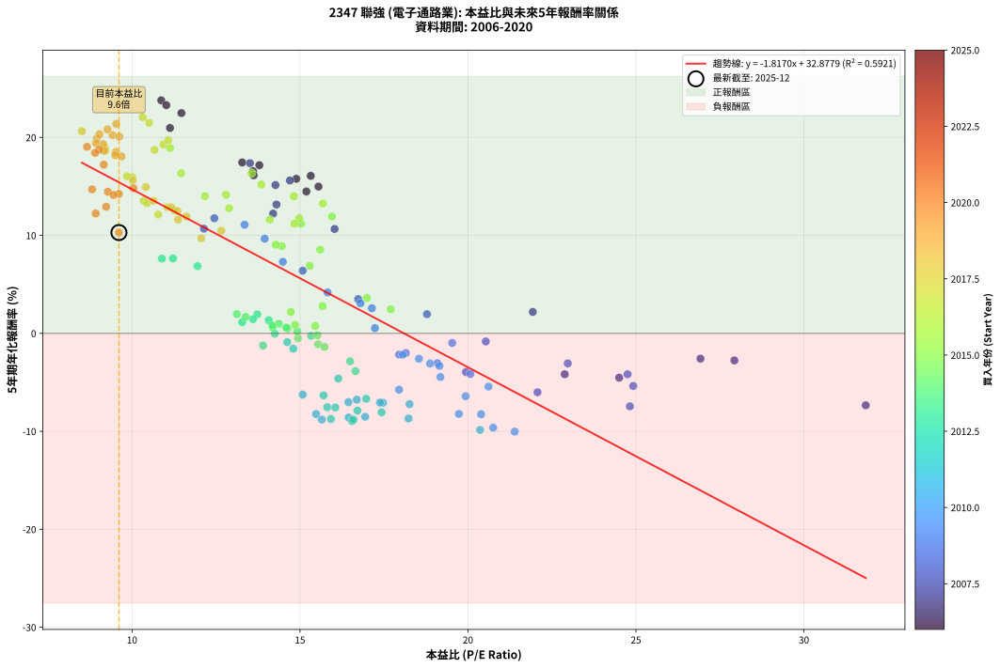
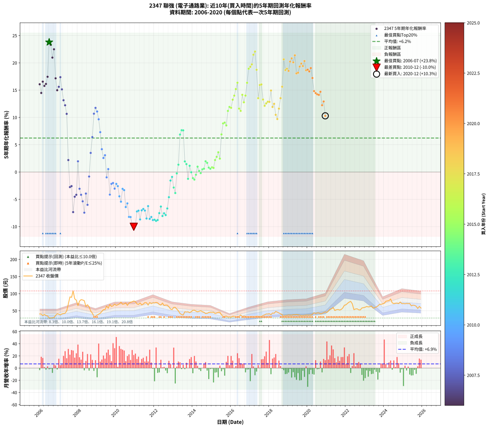

# 2347 聯強 - 本益比與未來報酬率分析

!!! info "報告資訊"
    - **股票代號**: 2347
    - **公司名稱**: 聯強
    - **產業別**: 電子通路業
    - **分析期間**: 2006-2020 (180 個數據點)
    - **資料來源**: Type 12 (ShowMonthlyK_ChartFlow) 月收盤價與本益比
    - **報酬率口徑**: 含現金股利 (簡化: 年度合計，假設每年7/1入帳)
    - **報告生成時間**: 2026-01-07 18:28:35 CST

## 📈 視覺化圖表

### 圖表1: 本益比 vs 未來報酬率關係

*圖表1：2347 聯強 本益比與5年期未來報酬率關係 (2006-2020)*

### 圖表2: 歷年買入時點的5年期實際報酬率

*圖表2：2347 聯強 歷年買入時點的5年期實際報酬率 (2006-2020)*

## 📍 買點訊號說明

本報告提供兩種買點提示訊號（顯示於圖表2的股價子圖中）：

### ▲ 小綠色三角形（回測驗證）
- **計算方式**: 使用全部歷史資料計算本益比第25百分位數
- **用途**: 事後驗證，顯示歷史上哪些時點確實為低估區
- **限制**: 當下無法判斷，僅供回測參考
- **特性**: 後見之明（Look-Ahead Bias）

### ▲ 小橘色三角形（即時訊號）
- **計算方式**: 使用截至當月的過去5年資料計算本益比第25百分位數
- **用途**: 實際投資決策，當時即可判斷
- **優勢**: 可操作性強，符合實務需求
- **特性**: 無後見之明，滾動窗口計算

!!! tip "如何使用兩種訊號"
    - **綠色▲** 幫助理解歷史估值機會，驗證策略有效性
    - **橘色▲** 可作為實際買進參考，但仍需搭配基本面分析
    - 兩種訊號重疊時，表示即時判斷與事後驗證一致，信心度較高
    - 僅有綠色▲時，表示當時無法判斷（需要未來資料才能確認）
    - 僅有橘色▲時，表示即時判斷為買點，但事後可能不是最佳時機

## 📊 估值分析摘要

| 指標 | 數值 |
|:---:|:---:|
| **目前本益比** (2020-12) | **9.61 倍** |
| **歷史平均本益比** | 14.67 倍 |
| **估值水準** | 🟢 相對低估 |
| **預期5年年化報酬率** | **+15.42%** |
| **歷史平均報酬率** | +6.22% |
| **相關係數 (R²)** | 0.5921 |
| **趨勢線斜率** | -1.8170 |

!!! abstract "核心洞察"
    目前本益比顯著低於歷史平均，預期未來報酬率可能較高

    根據歷史數據回測，2347 聯強 在目前本益比 **9.6倍** 的估值水準下，
    預期未來5年年化報酬率約為 **+15.4%**。

    **重要提醒**: 本分析基於歷史數據統計，實際報酬率會受到公司基本面變化、產業趨勢、
    總體經濟環境等多重因素影響。R² = 0.59 表示本益比可解釋約 59.2% 的報酬率變異。

## 📈 歷史估值統計

### 最佳買點 (最高報酬率)

| 項目 | 數值 |
|:---:|:---:|
| 起始時間 | 2006-07 |
| 當時本益比 | 10.87 倍 |
| 起始價格 | 28.8 元 |
| 5年後價格 | 74.0 元 |
| **5年年化報酬率** | **+23.79%** |

### 最差買點 (最低報酬率)

| 項目 | 數值 |
|:---:|:---:|
| 起始時間 | 2010-12 |
| 當時本益比 | 21.39 倍 |
| 起始價格 | 78.7 元 |
| 5年後價格 | 32.0 元 |
| **5年年化報酬率** | **-10.03%** |

## 🎯 投資啟示

### 本益比與報酬率關係

趨勢線方程式: **y = -1.8170x + 32.8779**

!!! warning "強負相關"
    本益比與未來報酬率呈現強負相關。在高本益比時期買入，未來報酬率顯著較低；
    在低本益比時期買入，未來報酬率顯著較高。**估值紀律至關重要**。

### 估值區間建議

基於歷史數據分析:

- **🟢 低估區** (P/E < 11.7): 預期報酬率較高，可考慮增加持股
- **🟡 合理區** (P/E 11.7-17.6): 預期報酬率符合長期趨勢，正常持有
- **🔴 高估區** (P/E > 17.6): 預期報酬率較低，可考慮減碼或觀望

!!! danger "風險提示"
    - 過去表現不代表未來結果
    - 本分析假設公司基本面無重大結構性變化
    - 產業環境劇變可能使歷史規律失效
    - 應結合公司財報、產業趨勢、總體經濟等多重因素綜合判斷

!!! success "長期投資觀點"
    歷史數據顯示，在合理或低估的估值水準買入並長期持有，
    往往能獲得較佳的投資報酬。**耐心等待好價格**是價值投資的核心原則。

## 📊 數據品質

- **資料來源**: GoodInfo.tw Type 12 (ShowMonthlyK_ChartFlow)
- **資料頻率**: 月度收盤價與本益比
- **回測期間**: 2006-2020
- **數據點數量**: 180 個 (每個點代表一次5年期回測)

### 計算方法說明

1. **5年期年化報酬率**:
   - 對每個歷史時點，計算其後5年的實際投資報酬率
   - 期末價值(不含股利): 期末價格
   - 期末價值(含現金股利): 期末價格 + 持有期間內的現金股利合計 (簡化: 年度合計，假設每年7/1入帳)
   - 公式: 年化報酬率 = [(期末價值/期初價格)^(1/年數) - 1] × 100%

2. **本益比 (P/E Ratio)**:
   - 使用當時的月收盤價與EPS計算
   - 資料來源: Type 12 月度河流圖本益比數據

3. **趨勢線 (Linear Regression)**:
   - 使用最小平方法擬合線性趨勢線
   - R²值衡量本益比對報酬率的解釋能力

---

*本報告由 Stock Analysis System v1.9.0 自動生成*
*數據更新時間: 2026-01-07 18:28:35 CST*

## 📋 月度回測明細表

（每一列對應時間線圖中的一個買入點；可用來對照 SVG 圖上的每個點。）

| 買入月份 | 賣出月份 | 回測期限_年 | 實際持有年數 | 買入本益比_倍 | 買入收盤價_元 | 賣出收盤價_元 | 現金股利合計_元 | 總報酬率_pct | 年化報酬率_pct |
| --- | --- | --- | --- | --- | --- | --- | --- | --- | --- |
| 2006-01 | 2011-01 | 5 | 4.999 | 15.32 | 40.60 | 76.60 | 8.95 | +110.72 | +16.08 |
| 2006-02 | 2011-02 | 5 | 4.999 | 15.19 | 40.25 | 70.20 | 8.95 | +96.65 | +14.48 |
| 2006-03 | 2011-03 | 5 | 4.999 | 13.60 | 36.05 | 68.60 | 8.95 | +115.12 | +16.56 |
| 2006-04 | 2011-04 | 5 | 4.999 | 14.89 | 39.45 | 73.10 | 8.95 | +107.99 | +15.78 |
| 2006-05 | 2011-05 | 5 | 4.999 | 13.62 | 36.10 | 67.30 | 8.95 | +111.22 | +16.13 |
| 2006-06 | 2011-06 | 5 | 4.999 | 13.28 | 35.20 | 69.70 | 8.95 | +123.44 | +17.45 |
| 2006-07 | 2011-07 | 5 | 4.999 | 10.87 | 28.80 | 74.00 | 9.70 | +190.62 | +23.79 |
| 2006-08 | 2011-08 | 5 | 4.999 | 11.02 | 29.20 | 73.50 | 9.70 | +184.93 | +23.30 |
| 2006-09 | 2011-09 | 5 | 4.999 | 11.13 | 29.50 | 66.70 | 9.70 | +158.98 | +20.97 |
| 2006-10 | 2011-10 | 5 | 4.999 | 11.47 | 30.40 | 74.10 | 9.70 | +175.65 | +22.49 |
| 2006-11 | 2011-11 | 5 | 4.999 | 13.79 | 36.55 | 71.00 | 9.70 | +120.79 | +17.17 |
| 2006-12 | 2011-12 | 5 | 4.999 | 15.55 | 41.20 | 73.10 | 9.70 | +100.97 | +14.98 |
| 2007-01 | 2012-01 | 5 | 4.999 | 14.70 | 40.05 | 73.00 | 9.70 | +106.49 | +15.61 |
| 2007-02 | 2012-02 | 5 | 4.999 | 13.51 | 37.80 | 74.50 | 9.70 | +122.75 | +17.37 |
| 2007-03 | 2012-03 | 5 | 5.002 | 14.27 | 41.00 | 73.30 | 9.70 | +102.44 | +15.14 |
| 2007-04 | 2012-04 | 5 | 5.002 | 14.30 | 42.15 | 68.50 | 9.70 | +85.53 | +13.15 |
| 2007-05 | 2012-05 | 5 | 5.002 | 14.20 | 42.90 | 66.70 | 9.70 | +78.09 | +12.23 |
| 2007-06 | 2012-06 | 5 | 5.002 | 16.03 | 49.60 | 72.60 | 9.70 | +65.93 | +10.65 |
| 2007-07 | 2012-07 | 5 | 5.002 | 21.93 | 69.50 | 65.50 | 11.95 | +11.44 | +2.19 |
| 2007-08 | 2012-08 | 5 | 5.002 | 27.93 | 90.60 | 66.80 | 11.95 | -13.08 | -2.76 |
| 2007-09 | 2012-09 | 5 | 5.002 | 26.92 | 89.30 | 66.40 | 11.95 | -12.26 | -2.58 |
| 2007-10 | 2012-10 | 5 | 5.002 | 31.84 | 108.00 | 61.80 | 11.95 | -31.71 | -7.34 |
| 2007-11 | 2012-11 | 5 | 5.002 | 24.50 | 84.90 | 55.40 | 11.95 | -20.67 | -4.52 |
| 2007-12 | 2012-12 | 5 | 5.002 | 22.88 | 81.00 | 53.50 | 11.95 | -19.20 | -4.17 |
| 2008-01 | 2013-01 | 5 | 5.002 | 18.78 | 65.20 | 59.90 | 11.95 | +10.20 | +1.96 |
| 2008-02 | 2013-03 | 5 | 5.081 | 22.97 | 78.20 | 54.80 | 11.95 | -14.64 | -3.07 |
| 2008-03 | 2013-03 | 5 | 4.999 | 24.75 | 82.60 | 54.80 | 11.95 | -19.19 | -4.17 |
| 2008-04 | 2013-04 | 5 | 4.999 | 24.92 | 81.50 | 49.90 | 11.95 | -24.11 | -5.37 |
| 2008-05 | 2013-05 | 5 | 4.999 | 24.82 | 79.50 | 42.05 | 11.95 | -32.08 | -7.45 |
| 2008-06 | 2013-06 | 5 | 4.999 | 19.94 | 62.50 | 39.15 | 11.95 | -18.24 | -3.95 |
| 2008-07 | 2013-07 | 5 | 4.999 | 22.07 | 67.70 | 37.70 | 11.95 | -26.66 | -6.01 |
| 2008-08 | 2013-08 | 5 | 4.999 | 20.53 | 61.60 | 47.15 | 11.95 | -4.06 | -0.83 |
| 2008-09 | 2013-09 | 5 | 4.999 | 16.73 | 49.05 | 46.30 | 11.95 | +18.75 | +3.50 |
| 2008-10 | 2013-10 | 5 | 4.999 | 15.08 | 43.20 | 46.95 | 11.95 | +36.34 | +6.40 |
| 2008-11 | 2013-11 | 5 | 4.999 | 12.14 | 33.95 | 44.45 | 11.95 | +66.12 | +10.69 |
| 2008-12 | 2013-12 | 5 | 4.999 | 12.45 | 34.00 | 47.30 | 11.95 | +74.26 | +11.75 |
| 2009-01 | 2014-01 | 5 | 4.999 | 13.35 | 37.45 | 51.40 | 11.95 | +69.15 | +11.09 |
| 2009-02 | 2014-02 | 5 | 4.999 | 13.95 | 40.20 | 51.80 | 11.95 | +58.58 | +9.66 |
| 2009-03 | 2014-03 | 5 | 4.999 | 14.49 | 42.85 | 49.00 | 11.95 | +42.24 | +7.30 |
| 2009-04 | 2014-04 | 5 | 4.999 | 15.82 | 48.00 | 46.95 | 11.95 | +22.70 | +4.18 |
| 2009-05 | 2014-05 | 5 | 4.999 | 17.14 | 53.30 | 48.55 | 11.95 | +13.50 | +2.57 |
| 2009-06 | 2014-06 | 5 | 4.999 | 16.80 | 53.50 | 50.30 | 11.95 | +16.35 | +3.08 |
| 2009-07 | 2014-07 | 5 | 4.999 | 19.53 | 63.70 | 47.20 | 13.45 | -4.79 | -0.98 |
| 2009-08 | 2014-08 | 5 | 4.999 | 17.23 | 57.50 | 45.60 | 13.45 | +2.69 | +0.53 |
| 2009-09 | 2014-09 | 5 | 4.999 | 20.07 | 68.50 | 42.00 | 13.45 | -19.05 | -4.14 |
| 2009-10 | 2014-10 | 5 | 4.999 | 17.95 | 62.60 | 42.65 | 13.45 | -10.39 | -2.17 |
| 2009-11 | 2014-11 | 5 | 4.999 | 18.15 | 64.70 | 45.00 | 13.45 | -9.66 | -2.01 |
| 2009-12 | 2014-12 | 5 | 4.999 | 19.09 | 69.50 | 46.10 | 13.45 | -14.32 | -3.04 |
| 2010-01 | 2015-01 | 5 | 4.999 | 18.06 | 65.80 | 45.50 | 13.45 | -10.41 | -2.18 |
| 2010-02 | 2015-02 | 5 | 4.999 | 18.54 | 67.60 | 45.85 | 13.45 | -12.28 | -2.59 |
| 2010-03 | 2015-03 | 5 | 4.999 | 19.18 | 70.00 | 42.30 | 13.45 | -20.36 | -4.45 |
| 2010-04 | 2015-04 | 5 | 4.999 | 20.61 | 75.30 | 43.50 | 13.45 | -24.37 | -5.43 |
| 2010-05 | 2015-05 | 5 | 4.999 | 18.87 | 69.00 | 45.55 | 13.45 | -14.50 | -3.08 |
| 2010-06 | 2015-06 | 5 | 4.999 | 19.15 | 70.10 | 45.75 | 13.45 | -15.55 | -3.32 |
| 2010-07 | 2015-07 | 5 | 4.999 | 19.93 | 73.00 | 38.05 | 14.35 | -28.22 | -6.42 |
| 2010-08 | 2015-08 | 5 | 4.999 | 17.95 | 65.80 | 34.60 | 14.35 | -25.61 | -5.75 |
| 2010-09 | 2015-09 | 5 | 4.999 | 19.73 | 72.40 | 32.80 | 14.35 | -34.88 | -8.22 |
| 2010-10 | 2015-10 | 5 | 4.999 | 20.39 | 74.90 | 34.35 | 14.35 | -34.98 | -8.25 |
| 2010-11 | 2015-11 | 5 | 4.999 | 20.75 | 76.30 | 31.65 | 14.35 | -39.72 | -9.63 |
| 2010-12 | 2015-12 | 5 | 4.999 | 21.39 | 78.70 | 32.05 | 14.35 | -41.05 | -10.03 |
| 2011-01 | 2016-01 | 5 | 4.999 | 20.36 | 76.60 | 31.25 | 14.35 | -40.47 | -9.86 |
| 2011-02 | 2016-02 | 5 | 4.999 | 18.26 | 70.20 | 33.90 | 14.35 | -31.27 | -7.23 |
| 2011-03 | 2016-03 | 5 | 5.002 | 17.47 | 68.60 | 33.15 | 14.35 | -30.76 | -7.09 |
| 2011-04 | 2016-04 | 5 | 5.002 | 18.23 | 73.10 | 32.05 | 14.35 | -36.53 | -8.69 |
| 2011-05 | 2016-05 | 5 | 5.002 | 16.44 | 67.30 | 32.40 | 14.35 | -30.54 | -7.03 |
| 2011-06 | 2016-06 | 5 | 5.002 | 16.69 | 69.70 | 34.75 | 14.35 | -29.56 | -6.77 |
| 2011-07 | 2016-07 | 5 | 5.002 | 17.38 | 74.00 | 37.70 | 13.60 | -30.68 | -7.06 |
| 2011-08 | 2016-08 | 5 | 5.002 | 16.94 | 73.50 | 33.50 | 13.60 | -35.92 | -8.51 |
| 2011-09 | 2016-09 | 5 | 5.002 | 15.08 | 66.70 | 34.70 | 13.60 | -27.59 | -6.25 |
| 2011-10 | 2016-10 | 5 | 5.002 | 16.45 | 74.10 | 33.70 | 13.60 | -36.17 | -8.58 |
| 2011-11 | 2016-11 | 5 | 5.002 | 15.48 | 71.00 | 32.60 | 13.60 | -34.93 | -8.23 |
| 2011-12 | 2016-12 | 5 | 5.002 | 15.65 | 73.10 | 32.50 | 13.60 | -36.94 | -8.80 |
| 2012-01 | 2017-01 | 5 | 5.002 | 15.92 | 73.00 | 32.60 | 13.60 | -36.71 | -8.74 |
| 2012-02 | 2017-03 | 5 | 5.081 | 16.55 | 74.50 | 32.65 | 13.60 | -37.92 | -8.96 |
| 2012-03 | 2017-03 | 5 | 4.999 | 16.59 | 73.30 | 32.65 | 13.60 | -36.90 | -8.80 |
| 2012-04 | 2017-04 | 5 | 4.999 | 15.81 | 68.50 | 32.70 | 13.60 | -32.41 | -7.54 |
| 2012-05 | 2017-05 | 5 | 4.999 | 15.70 | 66.70 | 34.50 | 13.60 | -27.89 | -6.33 |
| 2012-06 | 2017-06 | 5 | 4.999 | 17.43 | 72.60 | 34.10 | 13.60 | -34.30 | -8.06 |
| 2012-07 | 2017-07 | 5 | 4.999 | 16.05 | 65.50 | 33.60 | 10.60 | -32.52 | -7.57 |
| 2012-08 | 2017-08 | 5 | 4.999 | 16.71 | 66.80 | 33.70 | 10.60 | -33.68 | -7.89 |
| 2012-09 | 2017-09 | 5 | 4.999 | 16.97 | 66.40 | 36.40 | 10.60 | -29.22 | -6.68 |
| 2012-10 | 2017-10 | 5 | 4.999 | 16.14 | 61.80 | 38.20 | 10.60 | -21.04 | -4.61 |
| 2012-11 | 2017-11 | 5 | 4.999 | 14.80 | 55.40 | 40.60 | 10.60 | -7.58 | -1.56 |
| 2012-12 | 2017-12 | 5 | 4.999 | 14.62 | 53.50 | 40.55 | 10.60 | -4.39 | -0.89 |
| 2013-01 | 2018-01 | 5 | 4.999 | 16.49 | 59.90 | 41.25 | 10.60 | -13.44 | -2.85 |
| 2013-02 | 2018-02 | 5 | 4.999 | 16.65 | 60.00 | 38.70 | 10.60 | -17.83 | -3.85 |
| 2013-03 | 2018-03 | 5 | 4.999 | 15.33 | 54.80 | 43.50 | 10.60 | -1.28 | -0.26 |
| 2013-04 | 2018-04 | 5 | 4.999 | 14.07 | 49.90 | 42.75 | 10.60 | +6.91 | +1.35 |
| 2013-05 | 2018-05 | 5 | 4.999 | 11.95 | 42.05 | 48.00 | 10.60 | +39.36 | +6.86 |
| 2013-06 | 2018-06 | 5 | 4.999 | 11.22 | 39.15 | 46.00 | 10.60 | +44.57 | +7.65 |
| 2013-07 | 2018-07 | 5 | 4.999 | 10.89 | 37.70 | 43.65 | 10.80 | +44.43 | +7.63 |
| 2013-08 | 2018-08 | 5 | 4.999 | 13.73 | 47.15 | 41.10 | 10.80 | +10.07 | +1.94 |
| 2013-09 | 2018-09 | 5 | 4.999 | 13.60 | 46.30 | 38.95 | 10.80 | +7.45 | +1.45 |
| 2013-10 | 2018-10 | 5 | 4.999 | 13.90 | 46.95 | 33.30 | 10.80 | -6.07 | -1.24 |
| 2013-11 | 2018-11 | 5 | 4.999 | 13.28 | 44.45 | 36.25 | 10.80 | +5.85 | +1.14 |
| 2013-12 | 2018-12 | 5 | 4.999 | 14.25 | 47.30 | 36.40 | 10.80 | -0.21 | -0.04 |
| 2014-01 | 2019-01 | 5 | 4.999 | 15.54 | 51.40 | 37.80 | 10.80 | -5.45 | -1.11 |
| 2014-02 | 2019-02 | 5 | 4.999 | 15.73 | 51.80 | 37.50 | 10.80 | -6.76 | -1.39 |
| 2014-03 | 2019-03 | 5 | 4.999 | 14.94 | 49.00 | 37.00 | 10.80 | -2.45 | -0.49 |
| 2014-04 | 2019-04 | 5 | 4.999 | 14.37 | 46.95 | 38.50 | 10.80 | +5.01 | +0.98 |
| 2014-05 | 2019-05 | 5 | 4.999 | 14.92 | 48.55 | 38.25 | 10.80 | +1.03 | +0.21 |
| 2014-06 | 2019-06 | 5 | 4.999 | 15.52 | 50.30 | 39.00 | 10.80 | -0.99 | -0.20 |
| 2014-07 | 2019-07 | 5 | 4.999 | 14.63 | 47.20 | 38.35 | 10.00 | +2.44 | +0.48 |
| 2014-08 | 2019-08 | 5 | 4.999 | 14.19 | 45.60 | 37.00 | 10.00 | +3.07 | +0.61 |
| 2014-09 | 2019-09 | 5 | 4.999 | 13.12 | 42.00 | 36.30 | 10.00 | +10.24 | +1.97 |
| 2014-10 | 2019-10 | 5 | 4.999 | 13.38 | 42.65 | 36.35 | 10.00 | +8.68 | +1.68 |
| 2014-11 | 2019-11 | 5 | 4.999 | 14.18 | 45.00 | 36.85 | 10.00 | +4.11 | +0.81 |
| 2014-12 | 2019-12 | 5 | 4.999 | 14.59 | 46.10 | 37.50 | 10.00 | +3.04 | +0.60 |
| 2015-01 | 2020-01 | 5 | 4.999 | 14.85 | 45.50 | 37.50 | 10.00 | +4.40 | +0.86 |
| 2015-02 | 2020-02 | 5 | 4.999 | 15.45 | 45.85 | 37.60 | 10.00 | +3.82 | +0.75 |
| 2015-03 | 2020-03 | 5 | 5.002 | 14.73 | 42.30 | 37.15 | 10.00 | +11.47 | +2.19 |
| 2015-04 | 2020-04 | 5 | 5.002 | 15.67 | 43.50 | 39.90 | 10.00 | +14.71 | +2.78 |
| 2015-05 | 2020-05 | 5 | 5.002 | 16.99 | 45.55 | 44.40 | 10.00 | +19.43 | +3.61 |
| 2015-06 | 2020-06 | 5 | 5.002 | 17.70 | 45.75 | 41.65 | 10.00 | +12.90 | +2.45 |
| 2015-07 | 2020-07 | 5 | 5.002 | 15.29 | 38.05 | 43.80 | 9.30 | +39.55 | +6.89 |
| 2015-08 | 2020-08 | 5 | 5.002 | 14.46 | 34.60 | 43.70 | 9.30 | +53.18 | +8.90 |
| 2015-09 | 2020-09 | 5 | 5.002 | 14.28 | 32.80 | 41.30 | 9.30 | +54.27 | +9.05 |
| 2015-10 | 2020-10 | 5 | 5.002 | 15.60 | 34.35 | 42.45 | 9.30 | +50.66 | +8.54 |
| 2015-11 | 2020-11 | 5 | 5.002 | 15.03 | 31.65 | 44.50 | 9.30 | +69.98 | +11.19 |
| 2015-12 | 2020-12 | 5 | 5.002 | 15.95 | 32.05 | 47.00 | 9.30 | +75.66 | +11.92 |
| 2016-01 | 2021-01 | 5 | 5.002 | 14.98 | 31.25 | 45.20 | 9.30 | +74.40 | +11.76 |
| 2016-02 | 2021-03 | 5 | 5.081 | 15.68 | 33.90 | 54.50 | 9.30 | +88.20 | +13.25 |
| 2016-03 | 2021-03 | 5 | 4.999 | 14.82 | 33.15 | 54.50 | 9.30 | +92.46 | +13.99 |
| 2016-04 | 2021-04 | 5 | 4.999 | 13.85 | 32.05 | 55.70 | 9.30 | +102.81 | +15.19 |
| 2016-05 | 2021-05 | 5 | 4.999 | 13.56 | 32.40 | 59.80 | 9.30 | +113.27 | +16.36 |
| 2016-06 | 2021-06 | 5 | 4.999 | 14.10 | 34.75 | 50.90 | 9.30 | +73.24 | +11.62 |
| 2016-07 | 2021-07 | 5 | 4.999 | 14.84 | 37.70 | 53.00 | 11.10 | +70.03 | +11.20 |
| 2016-08 | 2021-08 | 5 | 4.999 | 12.80 | 33.50 | 53.80 | 11.10 | +93.73 | +14.14 |
| 2016-09 | 2021-09 | 5 | 4.999 | 12.89 | 34.70 | 52.20 | 11.10 | +82.42 | +12.78 |
| 2016-10 | 2021-10 | 5 | 4.999 | 12.17 | 33.70 | 53.80 | 11.10 | +92.58 | +14.01 |
| 2016-11 | 2021-11 | 5 | 4.999 | 11.46 | 32.60 | 58.40 | 11.10 | +113.19 | +16.35 |
| 2016-12 | 2021-12 | 5 | 4.999 | 11.13 | 32.50 | 66.20 | 11.10 | +137.85 | +18.92 |
| 2017-01 | 2022-01 | 5 | 4.999 | 10.93 | 32.60 | 67.60 | 11.10 | +141.41 | +19.28 |
| 2017-02 | 2022-02 | 5 | 4.999 | 11.08 | 33.75 | 71.90 | 11.10 | +145.93 | +19.72 |
| 2017-03 | 2022-03 | 5 | 4.999 | 10.51 | 32.65 | 75.30 | 11.10 | +164.62 | +21.49 |
| 2017-04 | 2022-04 | 5 | 4.999 | 10.32 | 32.70 | 77.50 | 11.10 | +170.95 | +22.06 |
| 2017-05 | 2022-05 | 5 | 4.999 | 10.67 | 34.50 | 70.30 | 11.10 | +135.94 | +18.73 |
| 2017-06 | 2022-06 | 5 | 4.999 | 10.35 | 34.10 | 53.20 | 11.10 | +88.56 | +13.53 |
| 2017-07 | 2022-07 | 5 | 4.999 | 10.01 | 33.60 | 55.30 | 15.10 | +109.52 | +15.95 |
| 2017-08 | 2022-08 | 5 | 4.999 | 9.85 | 33.70 | 55.80 | 15.10 | +110.39 | +16.04 |
| 2017-09 | 2022-09 | 5 | 4.999 | 10.45 | 36.40 | 52.80 | 15.10 | +86.54 | +13.28 |
| 2017-10 | 2022-10 | 5 | 4.999 | 10.78 | 38.20 | 52.60 | 15.10 | +77.23 | +12.13 |
| 2017-11 | 2022-11 | 5 | 4.999 | 11.25 | 40.60 | 58.30 | 15.10 | +80.79 | +12.57 |
| 2017-12 | 2022-12 | 5 | 4.999 | 11.05 | 40.55 | 59.20 | 15.10 | +83.23 | +12.88 |
| 2018-01 | 2023-01 | 5 | 4.999 | 11.17 | 41.25 | 60.40 | 15.10 | +83.03 | +12.85 |
| 2018-02 | 2023-02 | 5 | 4.999 | 10.41 | 38.70 | 62.50 | 15.10 | +100.52 | +14.93 |
| 2018-03 | 2023-03 | 5 | 4.999 | 11.62 | 43.50 | 61.30 | 15.10 | +75.63 | +11.93 |
| 2018-04 | 2023-04 | 5 | 4.999 | 11.35 | 42.75 | 61.90 | 15.10 | +80.12 | +12.49 |
| 2018-05 | 2023-05 | 5 | 4.999 | 12.66 | 48.00 | 63.90 | 15.10 | +64.58 | +10.48 |
| 2018-06 | 2023-06 | 5 | 4.999 | 12.06 | 46.00 | 58.00 | 15.10 | +58.91 | +9.71 |
| 2018-07 | 2023-07 | 5 | 4.999 | 11.37 | 43.65 | 59.20 | 16.40 | +73.20 | +11.61 |
| 2018-08 | 2023-08 | 5 | 4.999 | 10.64 | 41.10 | 61.10 | 16.40 | +88.56 | +13.53 |
| 2018-09 | 2023-09 | 5 | 4.999 | 10.02 | 38.95 | 64.10 | 16.40 | +106.68 | +15.63 |
| 2018-10 | 2023-10 | 5 | 4.999 | 8.51 | 33.30 | 68.70 | 16.40 | +155.56 | +20.64 |
| 2018-11 | 2023-11 | 5 | 4.999 | 9.21 | 36.25 | 68.90 | 16.40 | +135.31 | +18.67 |
| 2018-12 | 2023-12 | 5 | 4.999 | 9.19 | 36.40 | 70.20 | 16.40 | +137.91 | +18.93 |
| 2019-01 | 2024-01 | 5 | 4.999 | 9.52 | 37.80 | 72.00 | 16.40 | +133.86 | +18.52 |
| 2019-02 | 2024-02 | 5 | 4.999 | 9.42 | 37.50 | 77.80 | 16.40 | +151.20 | +20.23 |
| 2019-03 | 2024-03 | 5 | 5.002 | 9.27 | 37.00 | 78.90 | 16.40 | +157.57 | +20.82 |
| 2019-04 | 2024-04 | 5 | 5.002 | 9.62 | 38.50 | 79.80 | 16.40 | +149.87 | +20.09 |
| 2019-05 | 2024-05 | 5 | 5.002 | 9.53 | 38.25 | 84.40 | 16.40 | +163.53 | +21.38 |
| 2019-06 | 2024-06 | 5 | 5.002 | 9.69 | 39.00 | 73.10 | 16.40 | +129.49 | +18.07 |
| 2019-07 | 2024-07 | 5 | 5.002 | 9.50 | 38.35 | 71.10 | 17.40 | +130.77 | +18.20 |
| 2019-08 | 2024-08 | 5 | 5.002 | 9.14 | 37.00 | 72.10 | 17.40 | +141.89 | +19.31 |
| 2019-09 | 2024-09 | 5 | 5.002 | 8.95 | 36.30 | 72.50 | 17.40 | +147.66 | +19.88 |
| 2019-10 | 2024-10 | 5 | 5.002 | 8.93 | 36.35 | 70.90 | 17.40 | +142.92 | +19.42 |
| 2019-11 | 2024-11 | 5 | 5.002 | 9.03 | 36.85 | 75.60 | 17.40 | +152.37 | +20.33 |
| 2019-12 | 2024-12 | 5 | 5.002 | 9.17 | 37.50 | 70.80 | 17.40 | +135.20 | +18.65 |
| 2020-01 | 2025-01 | 5 | 5.002 | 9.02 | 37.50 | 71.20 | 17.40 | +136.27 | +18.75 |
| 2020-02 | 2025-03 | 5 | 5.081 | 8.90 | 37.60 | 71.40 | 17.40 | +136.17 | +18.43 |
| 2020-03 | 2025-03 | 5 | 4.999 | 8.66 | 37.15 | 71.40 | 17.40 | +139.03 | +19.04 |
| 2020-04 | 2025-04 | 5 | 4.999 | 9.16 | 39.90 | 70.90 | 17.40 | +121.30 | +17.22 |
| 2020-05 | 2025-05 | 5 | 4.999 | 10.04 | 44.40 | 71.20 | 17.40 | +99.55 | +14.82 |
| 2020-06 | 2025-06 | 5 | 4.999 | 9.28 | 41.65 | 64.40 | 17.40 | +96.40 | +14.46 |
| 2020-07 | 2025-07 | 5 | 4.999 | 9.61 | 43.80 | 66.40 | 18.80 | +94.52 | +14.24 |
| 2020-08 | 2025-08 | 5 | 4.999 | 9.45 | 43.70 | 65.80 | 18.80 | +93.59 | +14.13 |
| 2020-09 | 2025-09 | 5 | 4.999 | 8.81 | 41.30 | 63.20 | 18.80 | +98.55 | +14.70 |
| 2020-10 | 2025-10 | 5 | 4.999 | 8.92 | 42.45 | 56.80 | 18.80 | +78.09 | +12.24 |
| 2020-11 | 2025-11 | 5 | 4.999 | 9.23 | 44.50 | 62.90 | 18.80 | +83.60 | +12.92 |
| 2020-12 | 2025-12 | 5 | 4.999 | 9.61 | 47.00 | 57.90 | 18.80 | +63.19 | +10.29 |
