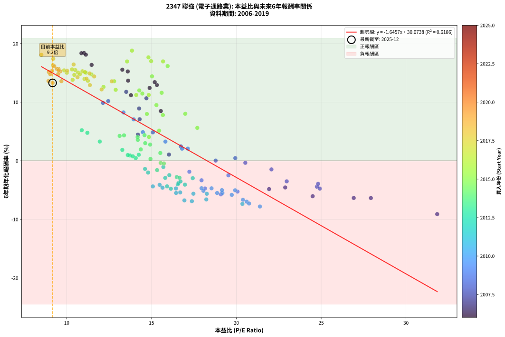
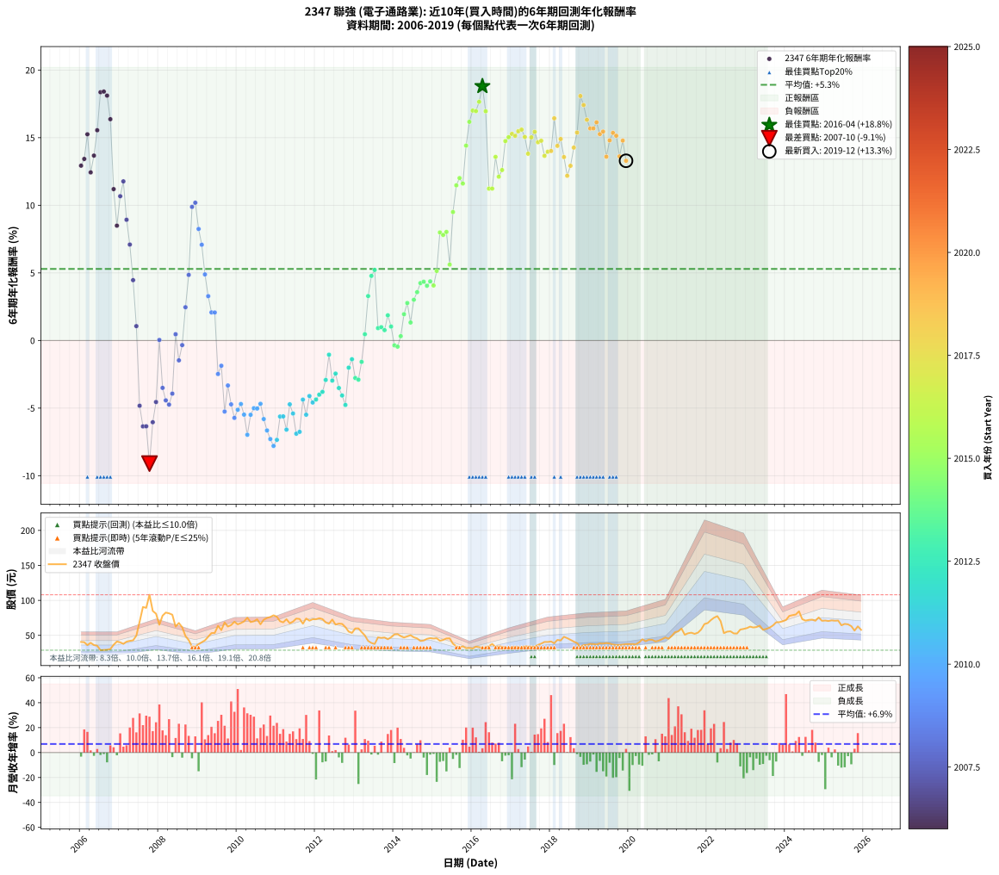

# 2347 聯強 - 本益比與未來報酬率分析

!!! info "報告資訊"
    - **股票代號**: 2347
    - **公司名稱**: 聯強
    - **產業別**: 電子通路業
    - **分析期間**: 2006-2019 (168 個數據點)
    - **資料來源**: Type 12 (ShowMonthlyK_ChartFlow) 月收盤價與本益比
    - **報酬率口徑**: 含現金股利 (簡化: 年度合計，假設每年7/1入帳)
    - **報告生成時間**: 2026-01-10 22:26:14 CST

## 📈 視覺化圖表

### 圖表1: 本益比 vs 未來報酬率關係

*圖表1：2347 聯強 本益比與6年期未來報酬率關係 (2006-2019)*

### 圖表2: 歷年買入時點的6年期實際報酬率

*圖表2：2347 聯強 歷年買入時點的6年期實際報酬率 (2006-2019)*

## 📍 買點訊號說明

本報告提供兩種買點提示訊號（顯示於圖表2的股價子圖中）：

### ▲ 小綠色三角形（回測驗證）
- **計算方式**: 使用全部歷史資料計算本益比第25百分位數
- **用途**: 事後驗證，顯示歷史上哪些時點確實為低估區
- **限制**: 當下無法判斷，僅供回測參考
- **特性**: 後見之明（Look-Ahead Bias）

### ▲ 小橘色三角形（即時訊號）
- **計算方式**: 使用截至當月的過去5年資料計算本益比第25百分位數
- **用途**: 實際投資決策，當時即可判斷
- **優勢**: 可操作性強，符合實務需求
- **特性**: 無後見之明，滾動窗口計算

!!! tip "如何使用兩種訊號"
    - **綠色▲** 幫助理解歷史估值機會，驗證策略有效性
    - **橘色▲** 可作為實際買進參考，但仍需搭配基本面分析
    - 兩種訊號重疊時，表示即時判斷與事後驗證一致，信心度較高
    - 僅有綠色▲時，表示當時無法判斷（需要未來資料才能確認）
    - 僅有橘色▲時，表示即時判斷為買點，但事後可能不是最佳時機

## 📊 估值分析摘要

| 指標 | 數值 |
|:---:|:---:|
| **目前本益比** (2019-12) | **9.17 倍** |
| **歷史平均本益比** | 15.06 倍 |
| **估值水準** | 🟢 相對低估 |
| **預期6年年化報酬率** | **+14.98%** |
| **歷史平均報酬率** | +5.29% |
| **相關係數 (R²)** | 0.6186 |
| **趨勢線斜率** | -1.6457 |

!!! abstract "核心洞察"
    目前本益比顯著低於歷史平均，預期未來報酬率可能較高

    根據歷史數據回測，2347 聯強 在目前本益比 **9.2倍** 的估值水準下，
    預期未來6年年化報酬率約為 **+15.0%**。

    **重要提醒**: 本分析基於歷史數據統計，實際報酬率會受到公司基本面變化、產業趨勢、
    總體經濟環境等多重因素影響。R² = 0.62 表示本益比可解釋約 61.9% 的報酬率變異。

## 📈 歷史估值統計

### 最佳買點 (最高報酬率)

| 項目 | 數值 |
|:---:|:---:|
| 起始時間 | 2016-04 |
| 當時本益比 | 13.85 倍 |
| 起始價格 | 32.0 元 |
| 6年後價格 | 77.5 元 |
| **6年年化報酬率** | **+18.80%** |

### 最差買點 (最低報酬率)

| 項目 | 數值 |
|:---:|:---:|
| 起始時間 | 2007-10 |
| 當時本益比 | 31.84 倍 |
| 起始價格 | 108.0 元 |
| 6年後價格 | 47.0 元 |
| **6年年化報酬率** | **-9.11%** |

## 🎯 投資啟示

### 本益比與報酬率關係

趨勢線方程式: **y = -1.6457x + 30.0738**

!!! warning "強負相關"
    本益比與未來報酬率呈現強負相關。在高本益比時期買入，未來報酬率顯著較低；
    在低本益比時期買入，未來報酬率顯著較高。**估值紀律至關重要**。

### 估值區間建議

基於歷史數據分析:

- **🟢 低估區** (P/E < 12.0): 預期報酬率較高，可考慮增加持股
- **🟡 合理區** (P/E 12.0-18.1): 預期報酬率符合長期趨勢，正常持有
- **🔴 高估區** (P/E > 18.1): 預期報酬率較低，可考慮減碼或觀望

!!! danger "風險提示"
    - 過去表現不代表未來結果
    - 本分析假設公司基本面無重大結構性變化
    - 產業環境劇變可能使歷史規律失效
    - 應結合公司財報、產業趨勢、總體經濟等多重因素綜合判斷

!!! success "長期投資觀點"
    歷史數據顯示，在合理或低估的估值水準買入並長期持有，
    往往能獲得較佳的投資報酬。**耐心等待好價格**是價值投資的核心原則。

## 📊 數據品質

- **資料來源**: GoodInfo.tw Type 12 (ShowMonthlyK_ChartFlow)
- **資料頻率**: 月度收盤價與本益比
- **回測期間**: 2006-2019
- **數據點數量**: 168 個 (每個點代表一次6年期回測)

### 計算方法說明

1. **6年期年化報酬率**:
   - 對每個歷史時點，計算其後6年的實際投資報酬率
   - 期末價值(不含股利): 期末價格
   - 期末價值(含現金股利): 期末價格 + 持有期間內的現金股利合計 (簡化: 年度合計，假設每年7/1入帳)
   - 公式: 年化報酬率 = [(期末價值/期初價格)^(1/年數) - 1] × 100%

2. **本益比 (P/E Ratio)**:
   - 使用當時的月收盤價與EPS計算
   - 資料來源: Type 12 月度河流圖本益比數據

3. **趨勢線 (Linear Regression)**:
   - 使用最小平方法擬合線性趨勢線
   - R²值衡量本益比對報酬率的解釋能力

---

*本報告由 Stock Analysis System v1.9.0 自動生成*
*數據更新時間: 2026-01-10 22:26:14 CST*

## 📋 月度回測明細表

（每一列對應時間線圖中的一個買入點；可用來對照 SVG 圖上的每個點。）

| 買入月份 | 賣出月份 | 回測期限_年 | 實際持有年數 | 買入本益比_倍 | 買入收盤價_元 | 賣出收盤價_元 | 現金股利合計_元 | 總報酬率_pct | 年化報酬率_pct |
| --- | --- | --- | --- | --- | --- | --- | --- | --- | --- |
| 2006-01 | 2012-01 | 6 | 5.999 | 15.32 | 40.60 | 73.00 | 11.20 | +107.39 | +12.93 |
| 2006-02 | 2012-02 | 6 | 5.999 | 15.19 | 40.25 | 74.50 | 11.20 | +112.92 | +13.43 |
| 2006-03 | 2012-03 | 6 | 6.001 | 13.60 | 36.05 | 73.30 | 11.20 | +134.39 | +15.25 |
| 2006-04 | 2012-04 | 6 | 6.001 | 14.89 | 39.45 | 68.50 | 11.20 | +102.03 | +12.43 |
| 2006-05 | 2012-05 | 6 | 6.001 | 13.62 | 36.10 | 66.70 | 11.20 | +115.79 | +13.67 |
| 2006-06 | 2012-06 | 6 | 6.001 | 13.28 | 35.20 | 72.60 | 11.20 | +138.07 | +15.55 |
| 2006-07 | 2012-07 | 6 | 6.001 | 10.87 | 28.80 | 65.50 | 13.70 | +174.99 | +18.36 |
| 2006-08 | 2012-08 | 6 | 6.001 | 11.02 | 29.20 | 66.80 | 13.70 | +175.68 | +18.41 |
| 2006-09 | 2012-09 | 6 | 6.001 | 11.13 | 29.50 | 66.40 | 13.70 | +171.52 | +18.11 |
| 2006-10 | 2012-10 | 6 | 6.001 | 11.47 | 30.40 | 61.80 | 13.70 | +148.35 | +16.37 |
| 2006-11 | 2012-11 | 6 | 6.001 | 13.79 | 36.55 | 55.40 | 13.70 | +89.05 | +11.20 |
| 2006-12 | 2012-12 | 6 | 6.001 | 15.55 | 41.20 | 53.50 | 13.70 | +63.10 | +8.49 |
| 2007-01 | 2013-01 | 6 | 6.001 | 14.70 | 40.05 | 59.90 | 13.70 | +83.77 | +10.67 |
| 2007-02 | 2013-02 | 6 | 6.001 | 13.51 | 37.80 | 60.00 | 13.70 | +94.97 | +11.77 |
| 2007-03 | 2013-03 | 6 | 6.001 | 14.27 | 41.00 | 54.80 | 13.70 | +67.07 | +8.93 |
| 2007-04 | 2013-04 | 6 | 6.001 | 14.30 | 42.15 | 49.90 | 13.70 | +50.88 | +7.09 |
| 2007-05 | 2013-05 | 6 | 6.001 | 14.20 | 42.90 | 42.05 | 13.70 | +29.95 | +4.46 |
| 2007-06 | 2013-06 | 6 | 6.001 | 16.03 | 49.60 | 39.15 | 13.70 | +6.55 | +1.06 |
| 2007-07 | 2013-07 | 6 | 6.001 | 21.93 | 69.50 | 37.70 | 13.95 | -25.69 | -4.83 |
| 2007-08 | 2013-08 | 6 | 6.001 | 27.93 | 90.60 | 47.15 | 13.95 | -32.56 | -6.35 |
| 2007-09 | 2013-09 | 6 | 6.001 | 26.92 | 89.30 | 46.30 | 13.95 | -32.53 | -6.35 |
| 2007-10 | 2013-10 | 6 | 6.001 | 31.84 | 108.00 | 46.95 | 13.95 | -43.61 | -9.11 |
| 2007-11 | 2013-11 | 6 | 6.001 | 24.50 | 84.90 | 44.45 | 13.95 | -31.22 | -6.04 |
| 2007-12 | 2013-12 | 6 | 6.001 | 22.88 | 81.00 | 47.30 | 13.95 | -24.39 | -4.55 |
| 2008-01 | 2014-01 | 6 | 6.001 | 18.78 | 65.20 | 51.40 | 13.95 | +0.23 | +0.04 |
| 2008-02 | 2014-03 | 6 | 6.081 | 22.97 | 78.20 | 49.00 | 13.95 | -19.50 | -3.51 |
| 2008-03 | 2014-03 | 6 | 5.999 | 24.75 | 82.60 | 49.00 | 13.95 | -23.79 | -4.43 |
| 2008-04 | 2014-04 | 6 | 5.999 | 24.92 | 81.50 | 46.95 | 13.95 | -25.28 | -4.74 |
| 2008-05 | 2014-05 | 6 | 5.999 | 24.82 | 79.50 | 48.55 | 13.95 | -21.39 | -3.93 |
| 2008-06 | 2014-06 | 6 | 5.999 | 19.94 | 62.50 | 50.30 | 13.95 | +2.80 | +0.46 |
| 2008-07 | 2014-07 | 6 | 5.999 | 22.07 | 67.70 | 47.20 | 14.75 | -8.50 | -1.47 |
| 2008-08 | 2014-08 | 6 | 5.999 | 20.53 | 61.60 | 45.60 | 14.75 | -2.03 | -0.34 |
| 2008-09 | 2014-09 | 6 | 5.999 | 16.73 | 49.05 | 42.00 | 14.75 | +15.69 | +2.46 |
| 2008-10 | 2014-10 | 6 | 5.999 | 15.08 | 43.20 | 42.65 | 14.75 | +32.87 | +4.85 |
| 2008-11 | 2014-11 | 6 | 5.999 | 12.14 | 33.95 | 45.00 | 14.75 | +75.99 | +9.88 |
| 2008-12 | 2014-12 | 6 | 5.999 | 12.45 | 34.00 | 46.10 | 14.75 | +78.96 | +10.19 |
| 2009-01 | 2015-01 | 6 | 5.999 | 13.35 | 37.45 | 45.50 | 14.75 | +60.88 | +8.25 |
| 2009-02 | 2015-02 | 6 | 5.999 | 13.95 | 40.20 | 45.85 | 14.75 | +50.74 | +7.08 |
| 2009-03 | 2015-03 | 6 | 5.999 | 14.49 | 42.85 | 42.30 | 14.75 | +33.13 | +4.89 |
| 2009-04 | 2015-04 | 6 | 5.999 | 15.82 | 48.00 | 43.50 | 14.75 | +21.35 | +3.28 |
| 2009-05 | 2015-05 | 6 | 5.999 | 17.14 | 53.30 | 45.55 | 14.75 | +13.13 | +2.08 |
| 2009-06 | 2015-06 | 6 | 5.999 | 16.80 | 53.50 | 45.75 | 14.75 | +13.08 | +2.07 |
| 2009-07 | 2015-07 | 6 | 5.999 | 19.53 | 63.70 | 38.05 | 16.75 | -13.97 | -2.48 |
| 2009-08 | 2015-08 | 6 | 5.999 | 17.23 | 57.50 | 34.60 | 16.75 | -10.70 | -1.87 |
| 2009-09 | 2015-09 | 6 | 5.999 | 20.07 | 68.50 | 32.80 | 16.75 | -27.67 | -5.26 |
| 2009-10 | 2015-10 | 6 | 5.999 | 17.95 | 62.60 | 34.35 | 16.75 | -18.37 | -3.33 |
| 2009-11 | 2015-11 | 6 | 5.999 | 18.15 | 64.70 | 31.65 | 16.75 | -25.20 | -4.72 |
| 2009-12 | 2015-12 | 6 | 5.999 | 19.09 | 69.50 | 32.05 | 16.75 | -29.79 | -5.72 |
| 2010-01 | 2016-01 | 6 | 5.999 | 18.06 | 65.80 | 31.25 | 16.75 | -27.05 | -5.12 |
| 2010-02 | 2016-02 | 6 | 5.999 | 18.54 | 67.60 | 33.90 | 16.75 | -25.08 | -4.70 |
| 2010-03 | 2016-03 | 6 | 6.001 | 19.18 | 70.00 | 33.15 | 16.75 | -28.72 | -5.48 |
| 2010-04 | 2016-04 | 6 | 6.001 | 20.61 | 75.30 | 32.05 | 16.75 | -35.20 | -6.97 |
| 2010-05 | 2016-05 | 6 | 6.001 | 18.87 | 69.00 | 32.40 | 16.75 | -28.77 | -5.50 |
| 2010-06 | 2016-06 | 6 | 6.001 | 19.15 | 70.10 | 34.75 | 16.75 | -26.54 | -5.01 |
| 2010-07 | 2016-07 | 6 | 6.001 | 19.93 | 73.00 | 37.70 | 15.85 | -26.65 | -5.03 |
| 2010-08 | 2016-08 | 6 | 6.001 | 17.95 | 65.80 | 33.50 | 15.85 | -25.00 | -4.68 |
| 2010-09 | 2016-09 | 6 | 6.001 | 19.73 | 72.40 | 34.70 | 15.85 | -30.18 | -5.81 |
| 2010-10 | 2016-10 | 6 | 6.001 | 20.39 | 74.90 | 33.70 | 15.85 | -33.85 | -6.65 |
| 2010-11 | 2016-11 | 6 | 6.001 | 20.75 | 76.30 | 32.60 | 15.85 | -36.50 | -7.29 |
| 2010-12 | 2016-12 | 6 | 6.001 | 21.39 | 78.70 | 32.50 | 15.85 | -38.57 | -7.80 |
| 2011-01 | 2017-01 | 6 | 6.001 | 20.36 | 76.60 | 32.60 | 15.85 | -36.75 | -7.35 |
| 2011-02 | 2017-02 | 6 | 6.001 | 18.26 | 70.20 | 33.75 | 15.85 | -29.35 | -5.62 |
| 2011-03 | 2017-03 | 6 | 6.001 | 17.47 | 68.60 | 32.65 | 15.85 | -29.30 | -5.61 |
| 2011-04 | 2017-04 | 6 | 6.001 | 18.23 | 73.10 | 32.70 | 15.85 | -33.59 | -6.59 |
| 2011-05 | 2017-05 | 6 | 6.001 | 16.44 | 67.30 | 34.50 | 15.85 | -25.19 | -4.72 |
| 2011-06 | 2017-06 | 6 | 6.001 | 16.69 | 69.70 | 34.10 | 15.85 | -28.34 | -5.40 |
| 2011-07 | 2017-07 | 6 | 6.001 | 17.38 | 74.00 | 33.60 | 14.60 | -34.87 | -6.89 |
| 2011-08 | 2017-08 | 6 | 6.001 | 16.94 | 73.50 | 33.70 | 14.60 | -34.29 | -6.76 |
| 2011-09 | 2017-09 | 6 | 6.001 | 15.08 | 66.70 | 36.40 | 14.60 | -23.54 | -4.37 |
| 2011-10 | 2017-10 | 6 | 6.001 | 16.45 | 74.10 | 38.20 | 14.60 | -28.75 | -5.49 |
| 2011-11 | 2017-11 | 6 | 6.001 | 15.48 | 71.00 | 40.60 | 14.60 | -22.25 | -4.11 |
| 2011-12 | 2017-12 | 6 | 6.001 | 15.65 | 73.10 | 40.55 | 14.60 | -24.56 | -4.59 |
| 2012-01 | 2018-01 | 6 | 6.001 | 15.92 | 73.00 | 41.25 | 14.60 | -23.49 | -4.36 |
| 2012-02 | 2018-03 | 6 | 6.081 | 16.55 | 74.50 | 43.50 | 14.60 | -22.01 | -4.01 |
| 2012-03 | 2018-03 | 6 | 5.999 | 16.59 | 73.30 | 43.50 | 14.60 | -20.74 | -3.80 |
| 2012-04 | 2018-04 | 6 | 5.999 | 15.81 | 68.50 | 42.75 | 14.60 | -16.28 | -2.92 |
| 2012-05 | 2018-05 | 6 | 5.999 | 15.70 | 66.70 | 48.00 | 14.60 | -6.15 | -1.05 |
| 2012-06 | 2018-06 | 6 | 5.999 | 17.43 | 72.60 | 46.00 | 14.60 | -16.53 | -2.97 |
| 2012-07 | 2018-07 | 6 | 5.999 | 16.05 | 65.50 | 43.65 | 12.80 | -13.82 | -2.45 |
| 2012-08 | 2018-08 | 6 | 5.999 | 16.71 | 66.80 | 41.10 | 12.80 | -19.31 | -3.51 |
| 2012-09 | 2018-09 | 6 | 5.999 | 16.97 | 66.40 | 38.95 | 12.80 | -22.06 | -4.07 |
| 2012-10 | 2018-10 | 6 | 5.999 | 16.14 | 61.80 | 33.30 | 12.80 | -25.40 | -4.77 |
| 2012-11 | 2018-11 | 6 | 5.999 | 14.80 | 55.40 | 36.25 | 12.80 | -11.46 | -2.01 |
| 2012-12 | 2018-12 | 6 | 5.999 | 14.62 | 53.50 | 36.40 | 12.80 | -8.04 | -1.39 |
| 2013-01 | 2019-01 | 6 | 5.999 | 16.49 | 59.90 | 37.80 | 12.80 | -15.53 | -2.77 |
| 2013-02 | 2019-02 | 6 | 5.999 | 16.65 | 60.00 | 37.50 | 12.80 | -16.17 | -2.90 |
| 2013-03 | 2019-03 | 6 | 5.999 | 15.33 | 54.80 | 37.00 | 12.80 | -9.12 | -1.58 |
| 2013-04 | 2019-04 | 6 | 5.999 | 14.07 | 49.90 | 38.50 | 12.80 | +2.81 | +0.46 |
| 2013-05 | 2019-05 | 6 | 5.999 | 11.95 | 42.05 | 38.25 | 12.80 | +21.40 | +3.29 |
| 2013-06 | 2019-06 | 6 | 5.999 | 11.22 | 39.15 | 39.00 | 12.80 | +32.31 | +4.78 |
| 2013-07 | 2019-07 | 6 | 5.999 | 10.89 | 37.70 | 38.35 | 12.80 | +35.68 | +5.22 |
| 2013-08 | 2019-08 | 6 | 5.999 | 13.73 | 47.15 | 37.00 | 12.80 | +5.62 | +0.92 |
| 2013-09 | 2019-09 | 6 | 5.999 | 13.60 | 46.30 | 36.30 | 12.80 | +6.05 | +0.98 |
| 2013-10 | 2019-10 | 6 | 5.999 | 13.90 | 46.95 | 36.35 | 12.80 | +4.69 | +0.77 |
| 2013-11 | 2019-11 | 6 | 5.999 | 13.28 | 44.45 | 36.85 | 12.80 | +11.70 | +1.86 |
| 2013-12 | 2019-12 | 6 | 5.999 | 14.25 | 47.30 | 37.50 | 12.80 | +6.34 | +1.03 |
| 2014-01 | 2020-01 | 6 | 5.999 | 15.54 | 51.40 | 37.50 | 12.80 | -2.14 | -0.36 |
| 2014-02 | 2020-02 | 6 | 5.999 | 15.73 | 51.80 | 37.60 | 12.80 | -2.70 | -0.46 |
| 2014-03 | 2020-03 | 6 | 6.001 | 14.94 | 49.00 | 37.15 | 12.80 | +1.94 | +0.32 |
| 2014-04 | 2020-04 | 6 | 6.001 | 14.37 | 46.95 | 39.90 | 12.80 | +12.25 | +1.94 |
| 2014-05 | 2020-05 | 6 | 6.001 | 14.92 | 48.55 | 44.40 | 12.80 | +17.82 | +2.77 |
| 2014-06 | 2020-06 | 6 | 6.001 | 15.52 | 50.30 | 41.65 | 12.80 | +8.25 | +1.33 |
| 2014-07 | 2020-07 | 6 | 6.001 | 14.63 | 47.20 | 43.80 | 12.60 | +19.49 | +3.01 |
| 2014-08 | 2020-08 | 6 | 6.001 | 14.19 | 45.60 | 43.70 | 12.60 | +23.46 | +3.57 |
| 2014-09 | 2020-09 | 6 | 6.001 | 13.12 | 42.00 | 41.30 | 12.60 | +28.33 | +4.24 |
| 2014-10 | 2020-10 | 6 | 6.001 | 13.38 | 42.65 | 42.45 | 12.60 | +29.07 | +4.34 |
| 2014-11 | 2020-11 | 6 | 6.001 | 14.18 | 45.00 | 44.50 | 12.60 | +26.89 | +4.05 |
| 2014-12 | 2020-12 | 6 | 6.001 | 14.59 | 46.10 | 47.00 | 12.60 | +29.28 | +4.37 |
| 2015-01 | 2021-01 | 6 | 6.001 | 14.85 | 45.50 | 45.20 | 12.60 | +27.03 | +4.07 |
| 2015-02 | 2021-02 | 6 | 6.001 | 15.45 | 45.85 | 49.35 | 12.60 | +35.11 | +5.14 |
| 2015-03 | 2021-03 | 6 | 6.001 | 14.73 | 42.30 | 54.50 | 12.60 | +58.63 | +7.99 |
| 2015-04 | 2021-04 | 6 | 6.001 | 15.67 | 43.50 | 55.70 | 12.60 | +57.01 | +7.81 |
| 2015-05 | 2021-05 | 6 | 6.001 | 16.99 | 45.55 | 59.80 | 12.60 | +58.95 | +8.03 |
| 2015-06 | 2021-06 | 6 | 6.001 | 17.70 | 45.75 | 50.90 | 12.60 | +38.80 | +5.61 |
| 2015-07 | 2021-07 | 6 | 6.001 | 15.29 | 38.05 | 53.00 | 12.60 | +72.40 | +9.50 |
| 2015-08 | 2021-08 | 6 | 6.001 | 14.46 | 34.60 | 53.80 | 12.60 | +91.91 | +11.47 |
| 2015-09 | 2021-09 | 6 | 6.001 | 14.28 | 32.80 | 52.20 | 12.60 | +97.56 | +12.01 |
| 2015-10 | 2021-10 | 6 | 6.001 | 15.60 | 34.35 | 53.80 | 12.60 | +93.30 | +11.61 |
| 2015-11 | 2021-11 | 6 | 6.001 | 15.03 | 31.65 | 58.40 | 12.60 | +124.33 | +14.41 |
| 2015-12 | 2021-12 | 6 | 6.001 | 15.95 | 32.05 | 66.20 | 12.60 | +145.87 | +16.17 |
| 2016-01 | 2022-01 | 6 | 6.001 | 14.98 | 31.25 | 67.60 | 12.60 | +156.64 | +17.01 |
| 2016-02 | 2022-03 | 6 | 6.081 | 15.68 | 33.90 | 75.30 | 12.60 | +159.29 | +16.96 |
| 2016-03 | 2022-03 | 6 | 5.999 | 14.82 | 33.15 | 75.30 | 12.60 | +165.16 | +17.65 |
| 2016-04 | 2022-04 | 6 | 5.999 | 13.85 | 32.05 | 77.50 | 12.60 | +181.12 | +18.80 |
| 2016-05 | 2022-05 | 6 | 5.999 | 13.56 | 32.40 | 70.30 | 12.60 | +155.86 | +16.95 |
| 2016-06 | 2022-06 | 6 | 5.999 | 14.10 | 34.75 | 53.20 | 12.60 | +89.35 | +11.23 |
| 2016-07 | 2022-07 | 6 | 5.999 | 14.84 | 37.70 | 55.30 | 16.10 | +89.39 | +11.23 |
| 2016-08 | 2022-08 | 6 | 5.999 | 12.80 | 33.50 | 55.80 | 16.10 | +114.63 | +13.58 |
| 2016-09 | 2022-09 | 6 | 5.999 | 12.89 | 34.70 | 52.80 | 16.10 | +98.56 | +12.11 |
| 2016-10 | 2022-10 | 6 | 5.999 | 12.17 | 33.70 | 52.60 | 16.10 | +103.86 | +12.61 |
| 2016-11 | 2022-11 | 6 | 5.999 | 11.46 | 32.60 | 58.30 | 16.10 | +128.22 | +14.75 |
| 2016-12 | 2022-12 | 6 | 5.999 | 11.13 | 32.50 | 59.20 | 16.10 | +131.69 | +15.04 |
| 2017-01 | 2023-01 | 6 | 5.999 | 10.93 | 32.60 | 60.40 | 16.10 | +134.66 | +15.28 |
| 2017-02 | 2023-02 | 6 | 5.999 | 11.08 | 33.75 | 62.50 | 16.10 | +132.89 | +15.13 |
| 2017-03 | 2023-03 | 6 | 5.999 | 10.51 | 32.65 | 61.30 | 16.10 | +137.06 | +15.48 |
| 2017-04 | 2023-04 | 6 | 5.999 | 10.32 | 32.70 | 61.90 | 16.10 | +138.53 | +15.59 |
| 2017-05 | 2023-05 | 6 | 5.999 | 10.67 | 34.50 | 63.90 | 16.10 | +131.88 | +15.05 |
| 2017-06 | 2023-06 | 6 | 5.999 | 10.35 | 34.10 | 58.00 | 16.10 | +117.30 | +13.81 |
| 2017-07 | 2023-07 | 6 | 5.999 | 10.01 | 33.60 | 59.20 | 18.60 | +131.55 | +15.02 |
| 2017-08 | 2023-08 | 6 | 5.999 | 9.85 | 33.70 | 61.10 | 18.60 | +136.50 | +15.43 |
| 2017-09 | 2023-09 | 6 | 5.999 | 10.45 | 36.40 | 64.10 | 18.60 | +127.20 | +14.66 |
| 2017-10 | 2023-10 | 6 | 5.999 | 10.78 | 38.20 | 68.70 | 18.60 | +128.53 | +14.77 |
| 2017-11 | 2023-11 | 6 | 5.999 | 11.25 | 40.60 | 68.90 | 18.60 | +115.52 | +13.66 |
| 2017-12 | 2023-12 | 6 | 5.999 | 11.05 | 40.55 | 70.20 | 18.60 | +118.99 | +13.96 |
| 2018-01 | 2024-01 | 6 | 5.999 | 11.17 | 41.25 | 72.00 | 18.60 | +119.64 | +14.02 |
| 2018-02 | 2024-02 | 6 | 5.999 | 10.41 | 38.70 | 77.80 | 18.60 | +149.10 | +16.43 |
| 2018-03 | 2024-03 | 6 | 6.001 | 11.62 | 43.50 | 78.90 | 18.60 | +124.14 | +14.39 |
| 2018-04 | 2024-04 | 6 | 6.001 | 11.35 | 42.75 | 79.80 | 18.60 | +130.18 | +14.90 |
| 2018-05 | 2024-05 | 6 | 6.001 | 12.66 | 48.00 | 84.40 | 18.60 | +114.58 | +13.57 |
| 2018-06 | 2024-06 | 6 | 6.001 | 12.06 | 46.00 | 73.10 | 18.60 | +99.35 | +12.18 |
| 2018-07 | 2024-07 | 6 | 6.001 | 11.37 | 43.65 | 71.10 | 19.40 | +107.33 | +12.92 |
| 2018-08 | 2024-08 | 6 | 6.001 | 10.64 | 41.10 | 72.10 | 19.40 | +122.63 | +14.27 |
| 2018-09 | 2024-09 | 6 | 6.001 | 10.02 | 38.95 | 72.50 | 19.40 | +135.94 | +15.38 |
| 2018-10 | 2024-10 | 6 | 6.001 | 8.51 | 33.30 | 70.90 | 19.40 | +171.17 | +18.08 |
| 2018-11 | 2024-11 | 6 | 6.001 | 9.21 | 36.25 | 75.60 | 19.40 | +162.07 | +17.41 |
| 2018-12 | 2024-12 | 6 | 6.001 | 9.19 | 36.40 | 70.80 | 19.40 | +147.80 | +16.32 |
| 2019-01 | 2025-01 | 6 | 6.001 | 9.52 | 37.80 | 71.20 | 19.40 | +139.68 | +15.68 |
| 2019-02 | 2025-02 | 6 | 6.001 | 9.42 | 37.50 | 70.50 | 19.40 | +139.73 | +15.68 |
| 2019-03 | 2025-03 | 6 | 6.001 | 9.27 | 37.00 | 71.40 | 19.40 | +145.41 | +16.14 |
| 2019-04 | 2025-04 | 6 | 6.001 | 9.62 | 38.50 | 70.90 | 19.40 | +134.55 | +15.26 |
| 2019-05 | 2025-05 | 6 | 6.001 | 9.53 | 38.25 | 71.20 | 19.40 | +136.86 | +15.45 |
| 2019-06 | 2025-06 | 6 | 6.001 | 9.69 | 39.00 | 64.40 | 19.40 | +114.87 | +13.59 |
| 2019-07 | 2025-07 | 6 | 6.001 | 9.50 | 38.35 | 66.40 | 21.40 | +128.94 | +14.80 |
| 2019-08 | 2025-08 | 6 | 6.001 | 9.14 | 37.00 | 65.80 | 21.40 | +135.68 | +15.36 |
| 2019-09 | 2025-09 | 6 | 6.001 | 8.95 | 36.30 | 63.20 | 21.40 | +133.06 | +15.14 |
| 2019-10 | 2025-10 | 6 | 6.001 | 8.93 | 36.35 | 56.80 | 21.40 | +115.13 | +13.62 |
| 2019-11 | 2025-11 | 6 | 6.001 | 9.03 | 36.85 | 62.90 | 21.40 | +128.77 | +14.78 |
| 2019-12 | 2025-12 | 6 | 6.001 | 9.17 | 37.50 | 57.90 | 21.40 | +111.47 | +13.29 |
