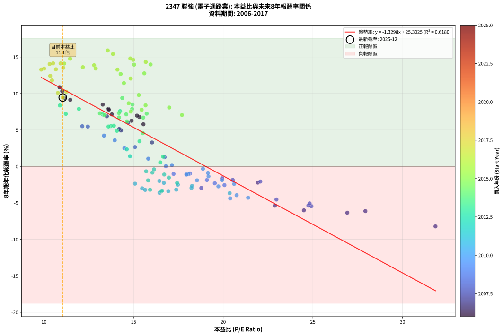
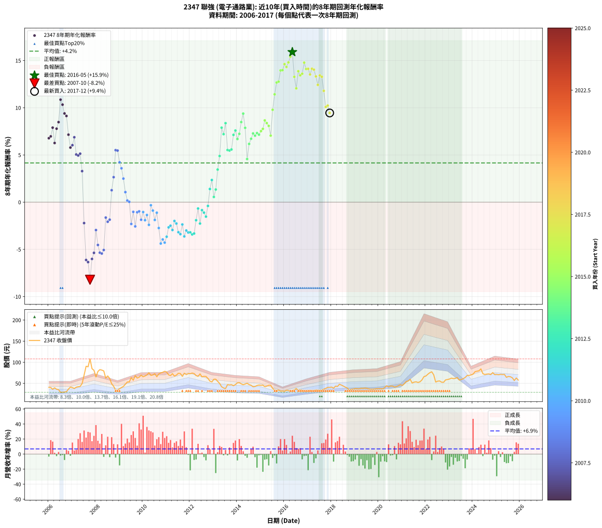

# 2347 聯強 - 本益比與未來報酬率分析

!!! info "報告資訊"
    - **股票代號**: 2347
    - **公司名稱**: 聯強
    - **產業別**: 電子通路業
    - **分析期間**: 2006-2017 (144 個數據點)
    - **資料來源**: Type 12 (ShowMonthlyK_ChartFlow) 月收盤價與本益比
    - **報酬率口徑**: 含現金股利 (簡化: 年度合計，假設每年7/1入帳)
    - **報告生成時間**: 2026-01-13 00:32:53 CST

## 📈 視覺化圖表

### 圖表1: 本益比 vs 未來報酬率關係

*圖表1：2347 聯強 本益比與8年期未來報酬率關係 (2006-2017)*

### 圖表2: 歷年買入時點的8年期實際報酬率

*圖表2：2347 聯強 歷年買入時點的8年期實際報酬率 (2006-2017)*

## 📍 買點訊號說明

本報告提供兩種買點提示訊號（顯示於圖表2的股價子圖中）：

### ▲ 小綠色三角形（回測驗證）
- **計算方式**: 使用全部歷史資料計算本益比第25百分位數
- **用途**: 事後驗證，顯示歷史上哪些時點確實為低估區
- **限制**: 當下無法判斷，僅供回測參考
- **特性**: 後見之明（Look-Ahead Bias）

### ▲ 小橘色三角形（即時訊號）
- **計算方式**: 使用截至當月的過去5年資料計算本益比第25百分位數
- **用途**: 實際投資決策，當時即可判斷
- **優勢**: 可操作性強，符合實務需求
- **特性**: 無後見之明，滾動窗口計算

!!! tip "如何使用兩種訊號"
    - **綠色▲** 幫助理解歷史估值機會，驗證策略有效性
    - **橘色▲** 可作為實際買進參考，但仍需搭配基本面分析
    - 兩種訊號重疊時，表示即時判斷與事後驗證一致，信心度較高
    - 僅有綠色▲時，表示當時無法判斷（需要未來資料才能確認）
    - 僅有橘色▲時，表示即時判斷為買點，但事後可能不是最佳時機

## 📊 估值分析摘要

| 指標 | 數值 |
|:---:|:---:|
| **目前本益比** (2017-12) | **11.05 倍** |
| **歷史平均本益比** | 15.90 倍 |
| **估值水準** | 🟢 相對低估 |
| **預期8年年化報酬率** | **+10.61%** |
| **歷史平均報酬率** | +4.16% |
| **相關係數 (R²)** | 0.6180 |
| **趨勢線斜率** | -1.3298 |

!!! abstract "核心洞察"
    目前本益比顯著低於歷史平均，預期未來報酬率可能較高

    根據歷史數據回測，2347 聯強 在目前本益比 **11.1倍** 的估值水準下，
    預期未來8年年化報酬率約為 **+10.6%**。

    **重要提醒**: 本分析基於歷史數據統計，實際報酬率會受到公司基本面變化、產業趨勢、
    總體經濟環境等多重因素影響。R² = 0.62 表示本益比可解釋約 61.8% 的報酬率變異。

## 📈 歷史估值統計

### 最佳買點 (最高報酬率)

| 項目 | 數值 |
|:---:|:---:|
| 起始時間 | 2016-05 |
| 當時本益比 | 13.56 倍 |
| 起始價格 | 32.4 元 |
| 8年後價格 | 84.4 元 |
| **8年年化報酬率** | **+15.90%** |

### 最差買點 (最低報酬率)

| 項目 | 數值 |
|:---:|:---:|
| 起始時間 | 2007-10 |
| 當時本益比 | 31.84 倍 |
| 起始價格 | 108.0 元 |
| 8年後價格 | 34.4 元 |
| **8年年化報酬率** | **-8.22%** |

## 🎯 投資啟示

### 本益比與報酬率關係

趨勢線方程式: **y = -1.3298x + 25.3025**

!!! warning "強負相關"
    本益比與未來報酬率呈現強負相關。在高本益比時期買入，未來報酬率顯著較低；
    在低本益比時期買入，未來報酬率顯著較高。**估值紀律至關重要**。

### 估值區間建議

基於歷史數據分析:

- **🟢 低估區** (P/E < 12.7): 預期報酬率較高，可考慮增加持股
- **🟡 合理區** (P/E 12.7-19.1): 預期報酬率符合長期趨勢，正常持有
- **🔴 高估區** (P/E > 19.1): 預期報酬率較低，可考慮減碼或觀望

!!! danger "風險提示"
    - 過去表現不代表未來結果
    - 本分析假設公司基本面無重大結構性變化
    - 產業環境劇變可能使歷史規律失效
    - 應結合公司財報、產業趨勢、總體經濟等多重因素綜合判斷

!!! success "長期投資觀點"
    歷史數據顯示，在合理或低估的估值水準買入並長期持有，
    往往能獲得較佳的投資報酬。**耐心等待好價格**是價值投資的核心原則。

## 📊 數據品質

- **資料來源**: GoodInfo.tw Type 12 (ShowMonthlyK_ChartFlow)
- **資料頻率**: 月度收盤價與本益比
- **回測期間**: 2006-2017
- **數據點數量**: 144 個 (每個點代表一次8年期回測)

### 計算方法說明

1. **8年期年化報酬率**:
   - 對每個歷史時點，計算其後8年的實際投資報酬率
   - 期末價值(不含股利): 期末價格
   - 期末價值(含現金股利): 期末價格 + 持有期間內的現金股利合計 (簡化: 年度合計，假設每年7/1入帳)
   - 公式: 年化報酬率 = [(期末價值/期初價格)^(1/年數) - 1] × 100%

2. **本益比 (P/E Ratio)**:
   - 使用當時的月收盤價與EPS計算
   - 資料來源: Type 12 月度河流圖本益比數據

3. **趨勢線 (Linear Regression)**:
   - 使用最小平方法擬合線性趨勢線
   - R²值衡量本益比對報酬率的解釋能力

---

*本報告由 Stock Analysis System v1.9.0 自動生成*
*數據更新時間: 2026-01-13 00:32:53 CST*

## 📋 月度回測明細表

（每一列對應時間線圖中的一個買入點；可用來對照 SVG 圖上的每個點。）

| 買入月份 | 賣出月份 | 回測期限_年 | 實際持有年數 | 買入本益比_倍 | 買入收盤價_元 | 賣出收盤價_元 | 現金股利合計_元 | 總報酬率_pct | 年化報酬率_pct |
| --- | --- | --- | --- | --- | --- | --- | --- | --- | --- |
| 2006-01 | 2014-01 | 8 | 8.000 | 15.32 | 40.60 | 51.40 | 17.20 | +68.96 | +6.78 |
| 2006-02 | 2014-02 | 8 | 8.000 | 15.19 | 40.25 | 51.80 | 17.20 | +71.42 | +6.97 |
| 2006-03 | 2014-03 | 8 | 8.000 | 13.60 | 36.05 | 49.00 | 17.20 | +83.63 | +7.89 |
| 2006-04 | 2014-04 | 8 | 8.000 | 14.89 | 39.45 | 46.95 | 17.20 | +62.61 | +6.27 |
| 2006-05 | 2014-05 | 8 | 8.000 | 13.62 | 36.10 | 48.55 | 17.20 | +82.13 | +7.78 |
| 2006-06 | 2014-06 | 8 | 8.000 | 13.28 | 35.20 | 50.30 | 17.20 | +91.76 | +8.48 |
| 2006-07 | 2014-07 | 8 | 8.000 | 10.87 | 28.80 | 47.20 | 18.50 | +128.12 | +10.86 |
| 2006-08 | 2014-08 | 8 | 8.000 | 11.02 | 29.20 | 45.60 | 18.50 | +119.51 | +10.33 |
| 2006-09 | 2014-09 | 8 | 8.000 | 11.13 | 29.50 | 42.00 | 18.50 | +105.08 | +9.39 |
| 2006-10 | 2014-10 | 8 | 8.000 | 11.47 | 30.40 | 42.65 | 18.50 | +101.14 | +9.13 |
| 2006-11 | 2014-11 | 8 | 8.000 | 13.79 | 36.55 | 45.00 | 18.50 | +73.73 | +7.15 |
| 2006-12 | 2014-12 | 8 | 8.000 | 15.55 | 41.20 | 46.10 | 18.50 | +56.79 | +5.78 |
| 2007-01 | 2015-01 | 8 | 8.000 | 14.70 | 40.05 | 45.50 | 18.50 | +59.80 | +6.03 |
| 2007-02 | 2015-02 | 8 | 8.000 | 13.51 | 37.80 | 45.85 | 18.50 | +70.23 | +6.88 |
| 2007-03 | 2015-03 | 8 | 8.000 | 14.27 | 41.00 | 42.30 | 18.50 | +48.29 | +5.05 |
| 2007-04 | 2015-04 | 8 | 8.000 | 14.30 | 42.15 | 43.50 | 18.50 | +47.09 | +4.94 |
| 2007-05 | 2015-05 | 8 | 8.000 | 14.20 | 42.90 | 45.55 | 18.50 | +49.30 | +5.14 |
| 2007-06 | 2015-06 | 8 | 8.000 | 16.03 | 49.60 | 45.75 | 18.50 | +29.53 | +3.29 |
| 2007-07 | 2015-07 | 8 | 8.000 | 21.93 | 69.50 | 38.05 | 20.05 | -16.41 | -2.22 |
| 2007-08 | 2015-08 | 8 | 8.000 | 27.93 | 90.60 | 34.60 | 20.05 | -39.68 | -6.12 |
| 2007-09 | 2015-09 | 8 | 8.000 | 26.92 | 89.30 | 32.80 | 20.05 | -40.82 | -6.35 |
| 2007-10 | 2015-10 | 8 | 8.000 | 31.84 | 108.00 | 34.35 | 20.05 | -49.63 | -8.22 |
| 2007-11 | 2015-11 | 8 | 8.000 | 24.50 | 84.90 | 31.65 | 20.05 | -39.11 | -6.01 |
| 2007-12 | 2015-12 | 8 | 8.000 | 22.88 | 81.00 | 32.05 | 20.05 | -35.68 | -5.37 |
| 2008-01 | 2016-01 | 8 | 8.000 | 18.78 | 65.20 | 31.25 | 20.05 | -21.32 | -2.95 |
| 2008-02 | 2016-02 | 8 | 8.000 | 22.97 | 78.20 | 33.90 | 20.05 | -31.01 | -4.53 |
| 2008-03 | 2016-03 | 8 | 8.000 | 24.75 | 82.60 | 33.15 | 20.05 | -35.60 | -5.35 |
| 2008-04 | 2016-04 | 8 | 8.000 | 24.92 | 81.50 | 32.05 | 20.05 | -36.08 | -5.44 |
| 2008-05 | 2016-05 | 8 | 8.000 | 24.82 | 79.50 | 32.40 | 20.05 | -34.03 | -5.07 |
| 2008-06 | 2016-06 | 8 | 8.000 | 19.94 | 62.50 | 34.75 | 20.05 | -12.32 | -1.63 |
| 2008-07 | 2016-07 | 8 | 8.000 | 22.07 | 67.70 | 37.70 | 19.55 | -15.44 | -2.07 |
| 2008-08 | 2016-08 | 8 | 8.000 | 20.53 | 61.60 | 33.50 | 19.55 | -13.88 | -1.85 |
| 2008-09 | 2016-09 | 8 | 8.000 | 16.73 | 49.05 | 34.70 | 19.55 | +10.60 | +1.27 |
| 2008-10 | 2016-10 | 8 | 8.000 | 15.08 | 43.20 | 33.70 | 19.55 | +23.26 | +2.65 |
| 2008-11 | 2016-11 | 8 | 8.000 | 12.14 | 33.95 | 32.60 | 19.55 | +53.60 | +5.51 |
| 2008-12 | 2016-12 | 8 | 8.000 | 12.45 | 34.00 | 32.50 | 19.55 | +53.08 | +5.47 |
| 2009-01 | 2017-01 | 8 | 8.000 | 13.35 | 37.45 | 32.60 | 19.55 | +39.25 | +4.23 |
| 2009-02 | 2017-02 | 8 | 8.000 | 13.95 | 40.20 | 33.75 | 19.55 | +32.58 | +3.59 |
| 2009-03 | 2017-03 | 8 | 8.000 | 14.49 | 42.85 | 32.65 | 19.55 | +21.82 | +2.50 |
| 2009-04 | 2017-04 | 8 | 8.000 | 15.82 | 48.00 | 32.70 | 19.55 | +8.85 | +1.07 |
| 2009-05 | 2017-05 | 8 | 8.000 | 17.14 | 53.30 | 34.50 | 19.55 | +1.40 | +0.17 |
| 2009-06 | 2017-06 | 8 | 8.000 | 16.80 | 53.50 | 34.10 | 19.55 | +0.28 | +0.03 |
| 2009-07 | 2017-07 | 8 | 8.000 | 19.53 | 63.70 | 33.60 | 19.25 | -17.04 | -2.31 |
| 2009-08 | 2017-08 | 8 | 8.000 | 17.23 | 57.50 | 33.70 | 19.25 | -7.92 | -1.03 |
| 2009-09 | 2017-09 | 8 | 8.000 | 20.07 | 68.50 | 36.40 | 19.25 | -18.76 | -2.56 |
| 2009-10 | 2017-10 | 8 | 8.000 | 17.95 | 62.60 | 38.20 | 19.25 | -8.23 | -1.07 |
| 2009-11 | 2017-11 | 8 | 8.000 | 18.15 | 64.70 | 40.60 | 19.25 | -7.50 | -0.97 |
| 2009-12 | 2017-12 | 8 | 8.000 | 19.09 | 69.50 | 40.55 | 19.25 | -13.96 | -1.86 |
| 2010-01 | 2018-01 | 8 | 8.000 | 18.06 | 65.80 | 41.25 | 19.25 | -8.06 | -1.04 |
| 2010-02 | 2018-02 | 8 | 8.000 | 18.54 | 67.60 | 38.70 | 19.25 | -14.28 | -1.91 |
| 2010-03 | 2018-03 | 8 | 8.000 | 19.18 | 70.00 | 43.50 | 19.25 | -10.36 | -1.36 |
| 2010-04 | 2018-04 | 8 | 8.000 | 20.61 | 75.30 | 42.75 | 19.25 | -17.67 | -2.40 |
| 2010-05 | 2018-05 | 8 | 8.000 | 18.87 | 69.00 | 48.00 | 19.25 | -2.54 | -0.32 |
| 2010-06 | 2018-06 | 8 | 8.000 | 19.15 | 70.10 | 46.00 | 19.25 | -6.92 | -0.89 |
| 2010-07 | 2018-07 | 8 | 8.000 | 19.93 | 73.00 | 43.65 | 19.05 | -14.11 | -1.88 |
| 2010-08 | 2018-08 | 8 | 8.000 | 17.95 | 65.80 | 41.10 | 19.05 | -8.59 | -1.12 |
| 2010-09 | 2018-09 | 8 | 8.000 | 19.73 | 72.40 | 38.95 | 19.05 | -19.89 | -2.73 |
| 2010-10 | 2018-10 | 8 | 8.000 | 20.39 | 74.90 | 33.30 | 19.05 | -30.11 | -4.38 |
| 2010-11 | 2018-11 | 8 | 8.000 | 20.75 | 76.30 | 36.25 | 19.05 | -27.53 | -3.94 |
| 2010-12 | 2018-12 | 8 | 8.000 | 21.39 | 78.70 | 36.40 | 19.05 | -29.55 | -4.28 |
| 2011-01 | 2019-01 | 8 | 8.000 | 20.36 | 76.60 | 37.80 | 19.05 | -25.79 | -3.66 |
| 2011-02 | 2019-02 | 8 | 8.000 | 18.26 | 70.20 | 37.50 | 19.05 | -19.45 | -2.67 |
| 2011-03 | 2019-03 | 8 | 8.000 | 17.47 | 68.60 | 37.00 | 19.05 | -18.30 | -2.49 |
| 2011-04 | 2019-04 | 8 | 8.000 | 18.23 | 73.10 | 38.50 | 19.05 | -21.28 | -2.95 |
| 2011-05 | 2019-05 | 8 | 8.000 | 16.44 | 67.30 | 38.25 | 19.05 | -14.86 | -1.99 |
| 2011-06 | 2019-06 | 8 | 8.000 | 16.69 | 69.70 | 39.00 | 19.05 | -16.72 | -2.26 |
| 2011-07 | 2019-07 | 8 | 8.000 | 17.38 | 74.00 | 38.35 | 18.80 | -22.77 | -3.18 |
| 2011-08 | 2019-08 | 8 | 8.000 | 16.94 | 73.50 | 37.00 | 18.80 | -24.08 | -3.39 |
| 2011-09 | 2019-09 | 8 | 8.000 | 15.08 | 66.70 | 36.30 | 18.80 | -17.39 | -2.36 |
| 2011-10 | 2019-10 | 8 | 8.000 | 16.45 | 74.10 | 36.35 | 18.80 | -25.57 | -3.62 |
| 2011-11 | 2019-11 | 8 | 8.000 | 15.48 | 71.00 | 36.85 | 18.80 | -21.62 | -3.00 |
| 2011-12 | 2019-12 | 8 | 8.000 | 15.65 | 73.10 | 37.50 | 18.80 | -22.98 | -3.21 |
| 2012-01 | 2020-01 | 8 | 8.000 | 15.92 | 73.00 | 37.50 | 18.80 | -22.88 | -3.20 |
| 2012-02 | 2020-02 | 8 | 8.000 | 16.55 | 74.50 | 37.60 | 18.80 | -24.30 | -3.42 |
| 2012-03 | 2020-03 | 8 | 8.000 | 16.59 | 73.30 | 37.15 | 18.80 | -23.67 | -3.32 |
| 2012-04 | 2020-04 | 8 | 8.000 | 15.81 | 68.50 | 39.90 | 18.80 | -14.31 | -1.91 |
| 2012-05 | 2020-05 | 8 | 8.000 | 15.70 | 66.70 | 44.40 | 18.80 | -5.25 | -0.67 |
| 2012-06 | 2020-06 | 8 | 8.000 | 17.43 | 72.60 | 41.65 | 18.80 | -16.74 | -2.26 |
| 2012-07 | 2020-07 | 8 | 8.000 | 16.05 | 65.50 | 43.80 | 17.40 | -6.56 | -0.85 |
| 2012-08 | 2020-08 | 8 | 8.000 | 16.71 | 66.80 | 43.70 | 17.40 | -8.53 | -1.11 |
| 2012-09 | 2020-09 | 8 | 8.000 | 16.97 | 66.40 | 41.30 | 17.40 | -11.60 | -1.53 |
| 2012-10 | 2020-10 | 8 | 8.000 | 16.14 | 61.80 | 42.45 | 17.40 | -3.16 | -0.40 |
| 2012-11 | 2020-11 | 8 | 8.000 | 14.80 | 55.40 | 44.50 | 17.40 | +11.73 | +1.40 |
| 2012-12 | 2020-12 | 8 | 8.000 | 14.62 | 53.50 | 47.00 | 17.40 | +20.37 | +2.34 |
| 2013-01 | 2021-01 | 8 | 8.000 | 16.49 | 59.90 | 45.20 | 17.40 | +4.51 | +0.55 |
| 2013-02 | 2021-02 | 8 | 8.000 | 16.65 | 60.00 | 49.35 | 17.40 | +11.25 | +1.34 |
| 2013-03 | 2021-03 | 8 | 8.000 | 15.33 | 54.80 | 54.50 | 17.40 | +31.20 | +3.45 |
| 2013-04 | 2021-04 | 8 | 8.000 | 14.07 | 49.90 | 55.70 | 17.40 | +46.49 | +4.89 |
| 2013-05 | 2021-05 | 8 | 8.000 | 11.95 | 42.05 | 59.80 | 17.40 | +83.59 | +7.89 |
| 2013-06 | 2021-06 | 8 | 8.000 | 11.22 | 39.15 | 50.90 | 17.40 | +74.46 | +7.20 |
| 2013-07 | 2021-07 | 8 | 8.000 | 10.89 | 37.70 | 53.00 | 18.70 | +90.19 | +8.37 |
| 2013-08 | 2021-08 | 8 | 8.000 | 13.73 | 47.15 | 53.80 | 18.70 | +53.76 | +5.53 |
| 2013-09 | 2021-09 | 8 | 8.000 | 13.60 | 46.30 | 52.20 | 18.70 | +53.13 | +5.47 |
| 2013-10 | 2021-10 | 8 | 8.000 | 13.90 | 46.95 | 53.80 | 18.70 | +54.42 | +5.58 |
| 2013-11 | 2021-11 | 8 | 8.000 | 13.28 | 44.45 | 58.40 | 18.70 | +73.45 | +7.13 |
| 2013-12 | 2021-12 | 8 | 8.000 | 14.25 | 47.30 | 66.20 | 18.70 | +79.49 | +7.59 |
| 2014-01 | 2022-01 | 8 | 8.000 | 15.54 | 51.40 | 67.60 | 18.70 | +67.90 | +6.69 |
| 2014-02 | 2022-02 | 8 | 8.000 | 15.73 | 51.80 | 71.90 | 18.70 | +74.90 | +7.24 |
| 2014-03 | 2022-03 | 8 | 8.000 | 14.94 | 49.00 | 75.30 | 18.70 | +91.84 | +8.48 |
| 2014-04 | 2022-04 | 8 | 8.000 | 14.37 | 46.95 | 77.50 | 18.70 | +104.90 | +9.38 |
| 2014-05 | 2022-05 | 8 | 8.000 | 14.92 | 48.55 | 70.30 | 18.70 | +83.32 | +7.87 |
| 2014-06 | 2022-06 | 8 | 8.000 | 15.52 | 50.30 | 53.20 | 18.70 | +42.94 | +4.57 |
| 2014-07 | 2022-07 | 8 | 8.000 | 14.63 | 47.20 | 55.30 | 20.90 | +61.44 | +6.17 |
| 2014-08 | 2022-08 | 8 | 8.000 | 14.19 | 45.60 | 55.80 | 20.90 | +68.20 | +6.72 |
| 2014-09 | 2022-09 | 8 | 8.000 | 13.12 | 42.00 | 52.80 | 20.90 | +75.48 | +7.28 |
| 2014-10 | 2022-10 | 8 | 8.000 | 13.38 | 42.65 | 52.60 | 20.90 | +72.33 | +7.04 |
| 2014-11 | 2022-11 | 8 | 8.000 | 14.18 | 45.00 | 58.30 | 20.90 | +76.00 | +7.32 |
| 2014-12 | 2022-12 | 8 | 8.000 | 14.59 | 46.10 | 59.20 | 20.90 | +73.75 | +7.15 |
| 2015-01 | 2023-01 | 8 | 8.000 | 14.85 | 45.50 | 60.40 | 20.90 | +78.68 | +7.53 |
| 2015-02 | 2023-02 | 8 | 8.000 | 15.45 | 45.85 | 62.50 | 20.90 | +81.90 | +7.77 |
| 2015-03 | 2023-03 | 8 | 8.000 | 14.73 | 42.30 | 61.30 | 20.90 | +94.33 | +8.66 |
| 2015-04 | 2023-04 | 8 | 8.000 | 15.67 | 43.50 | 61.90 | 20.90 | +90.34 | +8.38 |
| 2015-05 | 2023-05 | 8 | 8.000 | 16.99 | 45.55 | 63.90 | 20.90 | +86.17 | +8.08 |
| 2015-06 | 2023-06 | 8 | 8.000 | 17.70 | 45.75 | 58.00 | 20.90 | +72.46 | +7.05 |
| 2015-07 | 2023-07 | 8 | 8.000 | 15.29 | 38.05 | 59.20 | 21.10 | +111.04 | +9.79 |
| 2015-08 | 2023-08 | 8 | 8.000 | 14.46 | 34.60 | 61.10 | 21.10 | +137.57 | +11.42 |
| 2015-09 | 2023-09 | 8 | 8.000 | 14.28 | 32.80 | 64.10 | 21.10 | +159.76 | +12.67 |
| 2015-10 | 2023-10 | 8 | 8.000 | 15.60 | 34.35 | 68.70 | 21.10 | +161.43 | +12.76 |
| 2015-11 | 2023-11 | 8 | 8.000 | 15.03 | 31.65 | 68.90 | 21.10 | +184.36 | +13.96 |
| 2015-12 | 2023-12 | 8 | 8.000 | 15.95 | 32.05 | 70.20 | 21.10 | +184.87 | +13.98 |
| 2016-01 | 2024-01 | 8 | 8.000 | 14.98 | 31.25 | 72.00 | 21.10 | +197.92 | +14.62 |
| 2016-02 | 2024-02 | 8 | 8.000 | 15.68 | 33.90 | 77.80 | 21.10 | +191.74 | +14.32 |
| 2016-03 | 2024-03 | 8 | 8.000 | 14.82 | 33.15 | 78.90 | 21.10 | +201.66 | +14.80 |
| 2016-04 | 2024-04 | 8 | 8.000 | 13.85 | 32.05 | 79.80 | 21.10 | +214.82 | +15.41 |
| 2016-05 | 2024-05 | 8 | 8.000 | 13.56 | 32.40 | 84.40 | 21.10 | +225.62 | +15.90 |
| 2016-06 | 2024-06 | 8 | 8.000 | 14.10 | 34.75 | 73.10 | 21.10 | +171.08 | +13.28 |
| 2016-07 | 2024-07 | 8 | 8.000 | 14.84 | 37.70 | 71.10 | 22.60 | +148.54 | +12.05 |
| 2016-08 | 2024-08 | 8 | 8.000 | 12.80 | 33.50 | 72.10 | 22.60 | +182.69 | +13.87 |
| 2016-09 | 2024-09 | 8 | 8.000 | 12.89 | 34.70 | 72.50 | 22.60 | +174.06 | +13.43 |
| 2016-10 | 2024-10 | 8 | 8.000 | 12.17 | 33.70 | 70.90 | 22.60 | +177.45 | +13.61 |
| 2016-11 | 2024-11 | 8 | 8.000 | 11.46 | 32.60 | 75.60 | 22.60 | +201.23 | +14.78 |
| 2016-12 | 2024-12 | 8 | 8.000 | 11.13 | 32.50 | 70.80 | 22.60 | +187.38 | +14.11 |
| 2017-01 | 2025-01 | 8 | 8.000 | 10.93 | 32.60 | 71.20 | 22.60 | +187.73 | +14.12 |
| 2017-02 | 2025-02 | 8 | 8.000 | 11.08 | 33.75 | 70.50 | 22.60 | +175.85 | +13.52 |
| 2017-03 | 2025-03 | 8 | 8.000 | 10.51 | 32.65 | 71.40 | 22.60 | +187.90 | +14.13 |
| 2017-04 | 2025-04 | 8 | 8.000 | 10.32 | 32.70 | 70.90 | 22.60 | +185.93 | +14.03 |
| 2017-05 | 2025-05 | 8 | 8.000 | 10.67 | 34.50 | 71.20 | 22.60 | +171.88 | +13.32 |
| 2017-06 | 2025-06 | 8 | 8.000 | 10.35 | 34.10 | 64.40 | 22.60 | +155.13 | +12.42 |
| 2017-07 | 2025-07 | 8 | 8.000 | 10.01 | 33.60 | 66.40 | 25.60 | +173.81 | +13.42 |
| 2017-08 | 2025-08 | 8 | 8.000 | 9.85 | 33.70 | 65.80 | 25.60 | +171.22 | +13.28 |
| 2017-09 | 2025-09 | 8 | 8.000 | 10.45 | 36.40 | 63.20 | 25.60 | +143.96 | +11.79 |
| 2017-10 | 2025-10 | 8 | 8.000 | 10.78 | 38.20 | 56.80 | 25.60 | +115.71 | +10.09 |
| 2017-11 | 2025-11 | 8 | 8.000 | 11.25 | 40.60 | 62.90 | 25.60 | +117.98 | +10.23 |
| 2017-12 | 2025-12 | 8 | 8.000 | 11.05 | 40.55 | 57.90 | 25.60 | +105.92 | +9.45 |
