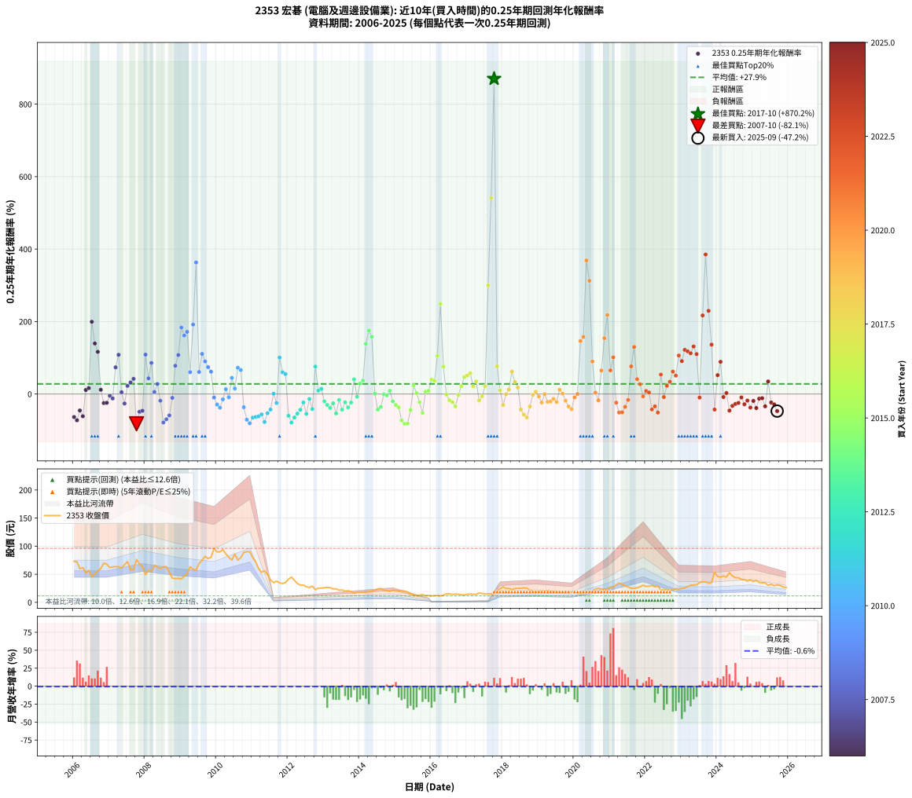

# 2353 宏碁 - 本益比與未來報酬率分析

!!! info "報告資訊"
    - **股票代號**: 2353
    - **公司名稱**: 宏碁
    - **產業別**: 電腦及週邊設備業
    - **分析期間**: 2006-2025 (237 個數據點)
    - **資料來源**: Type 12 (ShowMonthlyK_ChartFlow) 月收盤價與本益比
    - **報酬率口徑**: 含現金股利 (簡化: 年度合計，假設每年7/1入帳)
    - **報告生成時間**: 2026-01-13 13:16:16 CST

## 📈 視覺化圖表

### 圖表1: 本益比 vs 未來報酬率關係

*圖表1：2353 宏碁 本益比與0.25年期未來報酬率關係 (2006-2025)*

### 圖表2: 歷年買入時點的0.25年期實際報酬率

*圖表2：2353 宏碁 歷年買入時點的0.25年期實際報酬率 (2006-2025)*

## 📍 買點訊號說明

本報告提供兩種買點提示訊號（顯示於圖表2的股價子圖中）：

### ▲ 小綠色三角形（回測驗證）
- **計算方式**: 使用全部歷史資料計算本益比第25百分位數
- **用途**: 事後驗證，顯示歷史上哪些時點確實為低估區
- **限制**: 當下無法判斷，僅供回測參考
- **特性**: 後見之明（Look-Ahead Bias）

### ▲ 小橘色三角形（即時訊號）
- **計算方式**: 使用截至當月的過去5年資料計算本益比第25百分位數
- **用途**: 實際投資決策，當時即可判斷
- **優勢**: 可操作性強，符合實務需求
- **特性**: 無後見之明，滾動窗口計算

!!! tip "如何使用兩種訊號"
    - **綠色▲** 幫助理解歷史估值機會，驗證策略有效性
    - **橘色▲** 可作為實際買進參考，但仍需搭配基本面分析
    - 兩種訊號重疊時，表示即時判斷與事後驗證一致，信心度較高
    - 僅有綠色▲時，表示當時無法判斷（需要未來資料才能確認）
    - 僅有橘色▲時，表示即時判斷為買點，但事後可能不是最佳時機

## 📊 估值分析摘要

| 指標 | 數值 |
|:---:|:---:|
| **目前本益比** (2025-09) | **20.81 倍** |
| **歷史平均本益比** | 21.75 倍 |
| **估值水準** | 🟡 合理範圍 |
| **預期0.25年年化報酬率** | **+32.72%** |
| **歷史平均報酬率** | +27.85% |
| **相關係數 (R²)** | 0.0043 |
| **趨勢線斜率** | 0.3053 |

!!! abstract "核心洞察"
    目前本益比接近歷史平均，預期報酬率符合長期趨勢

    根據歷史數據回測，2353 宏碁 在目前本益比 **20.8倍** 的估值水準下，
    預期未來0.25年年化報酬率約為 **+32.7%**。

    **重要提醒**: 本分析基於歷史數據統計，實際報酬率會受到公司基本面變化、產業趨勢、
    總體經濟環境等多重因素影響。R² = 0.00 表示本益比可解釋約 0.4% 的報酬率變異。

## 📈 歷史估值統計

### 最佳買點 (最高報酬率)

| 項目 | 數值 |
|:---:|:---:|
| 起始時間 | 2017-10 |
| 當時本益比 | 30.89 倍 |
| 起始價格 | 15.6 元 |
| 0.25年後價格 | 27.6 元 |
| **0.25年年化報酬率** | **+870.18%** |

### 最差買點 (最低報酬率)

| 項目 | 數值 |
|:---:|:---:|
| 起始時間 | 2007-10 |
| 當時本益比 | 14.37 倍 |
| 起始價格 | 76.3 元 |
| 0.25年後價格 | 49.5 元 |
| **0.25年年化報酬率** | **-82.13%** |

## 🎯 投資啟示

### 本益比與報酬率關係

趨勢線方程式: **y = 0.3053x + 26.3643**

!!! info "弱相關或正相關"
    本益比與未來報酬率相關性較弱。這可能表示該股票的報酬率更多受到
    公司成長性、產業趨勢等因素影響，而非估值水準。**需綜合考量多項指標**。

### 估值區間建議

基於歷史數據分析:

- **🟢 低估區** (P/E < 17.4): 預期報酬率較高，可考慮增加持股
- **🟡 合理區** (P/E 17.4-26.1): 預期報酬率符合長期趨勢，正常持有
- **🔴 高估區** (P/E > 26.1): 預期報酬率較低，可考慮減碼或觀望

!!! danger "風險提示"
    - 過去表現不代表未來結果
    - 本分析假設公司基本面無重大結構性變化
    - 產業環境劇變可能使歷史規律失效
    - 應結合公司財報、產業趨勢、總體經濟等多重因素綜合判斷

!!! success "長期投資觀點"
    歷史數據顯示，在合理或低估的估值水準買入並長期持有，
    往往能獲得較佳的投資報酬。**耐心等待好價格**是價值投資的核心原則。

## 📊 數據品質

- **資料來源**: GoodInfo.tw Type 12 (ShowMonthlyK_ChartFlow)
- **資料頻率**: 月度收盤價與本益比
- **回測期間**: 2006-2025
- **數據點數量**: 237 個 (每個點代表一次0.25年期回測)

### 計算方法說明

1. **0.25年期年化報酬率**:
   - 對每個歷史時點，計算其後0.25年的實際投資報酬率
   - 期末價值(不含股利): 期末價格
   - 期末價值(含現金股利): 期末價格 + 持有期間內的現金股利合計 (簡化: 年度合計，假設每年7/1入帳)
   - 公式: 年化報酬率 = [(期末價值/期初價格)^(1/年數) - 1] × 100%

2. **本益比 (P/E Ratio)**:
   - 使用當時的月收盤價與EPS計算
   - 資料來源: Type 12 月度河流圖本益比數據

3. **趨勢線 (Linear Regression)**:
   - 使用最小平方法擬合線性趨勢線
   - R²值衡量本益比對報酬率的解釋能力

---

*本報告由 Stock Analysis System v1.9.0 自動生成*
*數據更新時間: 2026-01-13 13:16:16 CST*

## 📋 月度回測明細表

（每一列對應時間線圖中的一個買入點；可用來對照 SVG 圖上的每個點。）

| 買入月份 | 賣出月份 | 回測期限_年 | 實際持有年數 | 買入本益比_倍 | 買入收盤價_元 | 賣出收盤價_元 | 現金股利合計_元 | 總報酬率_pct | 年化報酬率_pct |
| --- | --- | --- | --- | --- | --- | --- | --- | --- | --- |
| 2006-01 | 2006-05 | 0.25 | 0.329 | 16.40 | 73.00 | 52.40 | 0.00 | -28.22 | -63.55 |
| 2006-02 | 2006-05 | 0.25 | 0.246 | 16.18 | 72.00 | 52.40 | 0.00 | -27.22 | -72.46 |
| 2006-03 | 2006-07 | 0.25 | 0.334 | 13.42 | 59.70 | 45.75 | 3.00 | -18.34 | -45.48 |
| 2006-04 | 2006-07 | 0.25 | 0.249 | 13.89 | 61.80 | 45.75 | 3.00 | -21.12 | -61.41 |
| 2006-05 | 2006-08 | 0.25 | 0.252 | 11.78 | 52.40 | 50.80 | 3.00 | +2.67 | +11.04 |
| 2006-06 | 2006-09 | 0.25 | 0.252 | 12.79 | 56.90 | 56.10 | 3.00 | +3.87 | +16.25 |
| 2006-07 | 2006-10 | 0.25 | 0.252 | 10.28 | 45.75 | 60.30 | 0.00 | +31.80 | +199.31 |
| 2006-08 | 2006-12 | 0.25 | 0.334 | 11.42 | 50.80 | 68.00 | 0.00 | +33.86 | +139.42 |
| 2006-09 | 2006-12 | 0.25 | 0.249 | 12.61 | 56.10 | 68.00 | 0.00 | +21.21 | +116.44 |
| 2006-10 | 2007-01 | 0.25 | 0.252 | 13.55 | 60.30 | 62.00 | 0.00 | +2.82 | +11.67 |
| 2006-11 | 2007-03 | 0.25 | 0.329 | 15.69 | 69.80 | 63.50 | 0.00 | -9.03 | -25.02 |
| 2006-12 | 2007-03 | 0.25 | 0.246 | 15.28 | 68.00 | 63.50 | 0.00 | -6.62 | -24.26 |
| 2007-01 | 2007-05 | 0.25 | 0.329 | 13.67 | 62.00 | 61.00 | 0.00 | -1.61 | -4.83 |
| 2007-02 | 2007-05 | 0.25 | 0.246 | 13.63 | 63.00 | 61.00 | 0.00 | -3.17 | -12.27 |
| 2007-03 | 2007-07 | 0.25 | 0.334 | 13.49 | 63.50 | 72.50 | 3.85 | +20.24 | +73.63 |
| 2007-04 | 2007-07 | 0.25 | 0.249 | 13.27 | 63.60 | 72.50 | 3.85 | +20.05 | +108.21 |
| 2007-05 | 2007-08 | 0.25 | 0.252 | 12.50 | 61.00 | 57.90 | 3.85 | +1.23 | +4.97 |
| 2007-06 | 2007-09 | 0.25 | 0.252 | 13.49 | 67.00 | 58.20 | 3.85 | -7.39 | -26.27 |
| 2007-07 | 2007-10 | 0.25 | 0.252 | 14.35 | 72.50 | 76.30 | 0.00 | +5.24 | +22.49 |
| 2007-08 | 2007-12 | 0.25 | 0.334 | 11.27 | 57.90 | 63.50 | 0.00 | +9.67 | +31.84 |
| 2007-09 | 2007-12 | 0.25 | 0.249 | 11.14 | 58.20 | 63.50 | 0.00 | +9.11 | +41.88 |
| 2007-10 | 2008-01 | 0.25 | 0.252 | 14.37 | 76.30 | 49.45 | 0.00 | -35.19 | -82.13 |
| 2007-11 | 2008-03 | 0.25 | 0.331 | 12.61 | 68.00 | 54.40 | 0.00 | -20.00 | -49.01 |
| 2007-12 | 2008-03 | 0.25 | 0.249 | 11.59 | 63.50 | 54.40 | 0.00 | -14.33 | -46.25 |
| 2008-01 | 2008-05 | 0.25 | 0.331 | 9.13 | 49.45 | 63.10 | 0.00 | +27.60 | +108.72 |
| 2008-02 | 2008-05 | 0.25 | 0.249 | 10.78 | 57.70 | 63.10 | 0.00 | +9.36 | +43.20 |
| 2008-03 | 2008-07 | 0.25 | 0.334 | 10.28 | 54.40 | 63.30 | 3.60 | +22.98 | +85.75 |
| 2008-04 | 2008-07 | 0.25 | 0.249 | 12.63 | 66.00 | 63.30 | 3.60 | +1.36 | +5.59 |
| 2008-05 | 2008-08 | 0.25 | 0.252 | 12.22 | 63.10 | 63.50 | 3.60 | +6.34 | +27.64 |
| 2008-06 | 2008-09 | 0.25 | 0.252 | 11.73 | 59.80 | 53.20 | 3.60 | -5.02 | -18.48 |
| 2008-07 | 2008-10 | 0.25 | 0.252 | 12.57 | 63.30 | 42.95 | 0.00 | -32.15 | -78.56 |
| 2008-08 | 2008-12 | 0.25 | 0.334 | 12.77 | 63.50 | 42.60 | 0.00 | -32.91 | -69.73 |
| 2008-09 | 2008-12 | 0.25 | 0.249 | 10.84 | 53.20 | 42.60 | 0.00 | -19.92 | -59.01 |
| 2008-10 | 2009-01 | 0.25 | 0.252 | 8.86 | 42.95 | 41.75 | 0.00 | -2.79 | -10.64 |
| 2008-11 | 2009-03 | 0.25 | 0.329 | 8.82 | 42.20 | 51.00 | 0.00 | +20.85 | +77.98 |
| 2008-12 | 2009-03 | 0.25 | 0.246 | 9.03 | 42.60 | 51.00 | 0.00 | +19.72 | +107.59 |
| 2009-01 | 2009-05 | 0.25 | 0.329 | 8.91 | 41.75 | 58.80 | 0.00 | +40.84 | +183.58 |
| 2009-02 | 2009-05 | 0.25 | 0.246 | 9.97 | 46.40 | 58.80 | 0.00 | +26.72 | +161.48 |
| 2009-03 | 2009-07 | 0.25 | 0.334 | 11.04 | 51.00 | 69.20 | 2.00 | +39.61 | +171.54 |
| 2009-04 | 2009-07 | 0.25 | 0.249 | 13.81 | 63.30 | 69.20 | 2.00 | +12.48 | +60.33 |
| 2009-05 | 2009-08 | 0.25 | 0.252 | 12.93 | 58.80 | 75.00 | 2.00 | +30.95 | +191.71 |
| 2009-06 | 2009-09 | 0.25 | 0.252 | 12.65 | 57.10 | 82.00 | 2.00 | +47.11 | +362.98 |
| 2009-07 | 2009-10 | 0.25 | 0.252 | 15.44 | 69.20 | 78.00 | 0.00 | +12.72 | +60.84 |
| 2009-08 | 2009-12 | 0.25 | 0.334 | 16.87 | 75.00 | 96.20 | 0.00 | +28.27 | +110.71 |
| 2009-09 | 2009-12 | 0.25 | 0.249 | 18.58 | 82.00 | 96.20 | 0.00 | +17.32 | +89.84 |
| 2009-10 | 2010-01 | 0.25 | 0.252 | 17.81 | 78.00 | 89.70 | 0.00 | +15.00 | +74.17 |
| 2009-11 | 2010-03 | 0.25 | 0.329 | 18.44 | 80.10 | 93.80 | 0.00 | +17.10 | +61.70 |
| 2009-12 | 2010-03 | 0.25 | 0.246 | 22.32 | 96.20 | 93.80 | 0.00 | -2.49 | -9.75 |
| 2010-01 | 2010-05 | 0.25 | 0.329 | 20.26 | 89.70 | 80.10 | 0.00 | -10.70 | -29.15 |
| 2010-02 | 2010-05 | 0.25 | 0.246 | 19.81 | 90.00 | 80.10 | 0.00 | -11.00 | -37.68 |
| 2010-03 | 2010-07 | 0.25 | 0.334 | 20.13 | 93.80 | 85.80 | 3.10 | -5.22 | -14.84 |
| 2010-04 | 2010-07 | 0.25 | 0.249 | 18.05 | 86.20 | 85.80 | 3.10 | +3.13 | +13.18 |
| 2010-05 | 2010-08 | 0.25 | 0.252 | 16.37 | 80.10 | 75.10 | 3.10 | -2.37 | -9.09 |
| 2010-06 | 2010-09 | 0.25 | 0.252 | 15.01 | 75.20 | 79.40 | 3.10 | +9.71 | +44.46 |
| 2010-07 | 2010-10 | 0.25 | 0.252 | 16.74 | 85.80 | 88.90 | 0.00 | +3.61 | +15.13 |
| 2010-08 | 2010-12 | 0.25 | 0.334 | 14.32 | 75.10 | 90.10 | 0.00 | +19.97 | +72.49 |
| 2010-09 | 2010-12 | 0.25 | 0.249 | 14.81 | 79.40 | 90.10 | 0.00 | +13.48 | +66.10 |
| 2010-10 | 2011-01 | 0.25 | 0.252 | 16.23 | 88.90 | 79.30 | 0.00 | -10.80 | -36.47 |
| 2010-11 | 2011-03 | 0.25 | 0.329 | 16.09 | 90.00 | 60.00 | 0.00 | -33.33 | -70.89 |
| 2010-12 | 2011-03 | 0.25 | 0.246 | 15.78 | 90.10 | 60.00 | 0.00 | -33.41 | -80.80 |
| 2011-01 | 2011-05 | 0.25 | 0.329 | 15.78 | 79.30 | 56.10 | 0.00 | -29.26 | -65.13 |
| 2011-02 | 2011-05 | 0.25 | 0.246 | 16.55 | 71.80 | 56.10 | 0.00 | -21.87 | -63.26 |
| 2011-03 | 2011-07 | 0.25 | 0.334 | 16.43 | 60.00 | 39.95 | 3.65 | -27.33 | -61.54 |
| 2011-04 | 2011-07 | 0.25 | 0.249 | 18.07 | 53.60 | 39.95 | 3.65 | -18.65 | -56.33 |
| 2011-05 | 2011-08 | 0.25 | 0.252 | 24.60 | 56.10 | 35.00 | 3.65 | -31.10 | -77.21 |
| 2011-06 | 2011-09 | 0.25 | 0.252 | 31.35 | 50.00 | 37.70 | 3.65 | -17.29 | -52.94 |
| 2011-07 | 2011-10 | 0.25 | 0.252 | 43.94 | 39.95 | 34.70 | 0.00 | -13.14 | -42.84 |
| 2011-08 | 2011-12 | 0.25 | 0.334 | 156.70 | 35.00 | 35.10 | 0.00 | +0.29 | +0.86 |
| 2011-09 | 2011-12 | 0.25 | 0.249 |  | 37.70 | 35.10 | 0.00 | -6.90 | -24.94 |
| 2011-10 | 2012-01 | 0.25 | 0.252 |  | 34.70 | 41.35 | 0.00 | +19.16 | +100.59 |
| 2011-11 | 2012-03 | 0.25 | 0.331 |  | 33.50 | 39.15 | 0.00 | +16.87 | +60.07 |
| 2011-12 | 2012-03 | 0.25 | 0.249 |  | 35.10 | 39.15 | 0.00 | +11.54 | +55.01 |
| 2012-01 | 2012-05 | 0.25 | 0.331 |  | 41.35 | 30.55 | 0.00 | -26.12 | -59.90 |
| 2012-02 | 2012-05 | 0.25 | 0.249 |  | 45.00 | 30.55 | 0.00 | -32.11 | -78.87 |
| 2012-03 | 2012-07 | 0.25 | 0.334 |  | 39.15 | 27.60 | 0.00 | -29.50 | -64.89 |
| 2012-04 | 2012-07 | 0.25 | 0.249 |  | 33.50 | 27.60 | 0.00 | -17.61 | -54.05 |
| 2012-05 | 2012-08 | 0.25 | 0.252 |  | 30.55 | 26.45 | 0.00 | -13.42 | -43.57 |
| 2012-06 | 2012-09 | 0.25 | 0.252 |  | 30.80 | 28.80 | 0.00 | -6.49 | -23.40 |
| 2012-07 | 2012-10 | 0.25 | 0.252 |  | 27.60 | 22.60 | 0.00 | -18.12 | -54.77 |
| 2012-08 | 2012-12 | 0.25 | 0.334 |  | 26.45 | 25.20 | 0.00 | -4.73 | -13.49 |
| 2012-09 | 2012-12 | 0.25 | 0.249 |  | 28.80 | 25.20 | 0.00 | -12.50 | -41.49 |
| 2012-10 | 2013-01 | 0.25 | 0.252 |  | 22.60 | 26.05 | 0.00 | +15.27 | +75.77 |
| 2012-11 | 2013-03 | 0.25 | 0.329 |  | 25.30 | 26.05 | 0.00 | +2.96 | +9.30 |
| 2012-12 | 2013-03 | 0.25 | 0.246 |  | 25.20 | 26.05 | 0.00 | +3.37 | +14.41 |
| 2013-01 | 2013-05 | 0.25 | 0.329 |  | 26.05 | 24.20 | 0.00 | -7.10 | -20.09 |
| 2013-02 | 2013-05 | 0.25 | 0.246 |  | 26.45 | 24.20 | 0.00 | -8.51 | -30.29 |
| 2013-03 | 2013-07 | 0.25 | 0.334 |  | 26.05 | 22.15 | 0.00 | -14.97 | -38.46 |
| 2013-04 | 2013-07 | 0.25 | 0.249 |  | 23.85 | 22.15 | 0.00 | -7.13 | -25.68 |
| 2013-05 | 2013-08 | 0.25 | 0.252 |  | 24.20 | 19.95 | 0.00 | -17.56 | -53.55 |
| 2013-06 | 2013-09 | 0.25 | 0.252 |  | 21.50 | 20.55 | 0.00 | -4.42 | -16.42 |
| 2013-07 | 2013-10 | 0.25 | 0.252 |  | 22.15 | 19.20 | 0.00 | -13.32 | -43.30 |
| 2013-08 | 2013-12 | 0.25 | 0.334 |  | 19.95 | 18.30 | 0.00 | -8.27 | -22.78 |
| 2013-09 | 2013-12 | 0.25 | 0.249 |  | 20.55 | 18.30 | 0.00 | -10.95 | -37.21 |
| 2013-10 | 2014-01 | 0.25 | 0.252 |  | 19.20 | 17.95 | 0.00 | -6.51 | -23.45 |
| 2013-11 | 2014-03 | 0.25 | 0.329 |  | 16.05 | 17.95 | 0.00 | +11.84 | +40.57 |
| 2013-12 | 2014-03 | 0.25 | 0.246 |  | 18.30 | 17.95 | 0.00 | -1.91 | -7.54 |
| 2014-01 | 2014-05 | 0.25 | 0.329 |  | 17.95 | 19.50 | 0.00 | +8.64 | +28.67 |
| 2014-02 | 2014-05 | 0.25 | 0.246 |  | 18.05 | 19.50 | 0.00 | +8.03 | +36.83 |
| 2014-03 | 2014-07 | 0.25 | 0.334 |  | 17.95 | 24.00 | 0.00 | +33.70 | +138.60 |
| 2014-04 | 2014-07 | 0.25 | 0.249 |  | 18.65 | 24.00 | 0.00 | +28.69 | +175.19 |
| 2014-05 | 2014-08 | 0.25 | 0.252 |  | 19.50 | 24.75 | 0.00 | +26.92 | +157.67 |
| 2014-06 | 2014-09 | 0.25 | 0.252 |  | 21.35 | 21.40 | 0.00 | +0.23 | +0.93 |
| 2014-07 | 2014-10 | 0.25 | 0.252 |  | 24.00 | 20.85 | 0.00 | -13.12 | -42.80 |
| 2014-08 | 2014-12 | 0.25 | 0.334 |  | 24.75 | 21.35 | 0.00 | -13.74 | -35.75 |
| 2014-09 | 2014-12 | 0.25 | 0.249 |  | 21.40 | 21.35 | 0.00 | -0.23 | -0.93 |
| 2014-10 | 2015-01 | 0.25 | 0.252 |  | 20.85 | 20.65 | 0.00 | -0.96 | -3.75 |
| 2014-11 | 2015-03 | 0.25 | 0.329 |  | 19.65 | 20.20 | 0.00 | +2.80 | +8.77 |
| 2014-12 | 2015-03 | 0.25 | 0.246 | 32.35 | 21.35 | 20.20 | 0.00 | -5.39 | -20.12 |
| 2015-01 | 2015-05 | 0.25 | 0.329 | 33.22 | 20.65 | 18.35 | 0.00 | -11.14 | -30.19 |
| 2015-02 | 2015-05 | 0.25 | 0.246 | 35.23 | 20.55 | 18.35 | 0.00 | -10.71 | -36.84 |
| 2015-03 | 2015-07 | 0.25 | 0.334 | 37.06 | 20.20 | 13.10 | 0.00 | -35.15 | -72.65 |
| 2015-04 | 2015-07 | 0.25 | 0.249 | 39.67 | 20.10 | 13.10 | 0.00 | -34.83 | -82.06 |
| 2015-05 | 2015-08 | 0.25 | 0.252 | 39.18 | 18.35 | 12.00 | 0.00 | -34.60 | -81.48 |
| 2015-06 | 2015-09 | 0.25 | 0.252 | 34.77 | 14.95 | 12.90 | 0.00 | -13.71 | -44.32 |
| 2015-07 | 2015-10 | 0.25 | 0.252 | 33.45 | 13.10 | 13.80 | 0.00 | +5.34 | +22.96 |
| 2015-08 | 2015-12 | 0.25 | 0.334 | 33.96 | 12.00 | 12.10 | 0.00 | +0.83 | +2.52 |
| 2015-09 | 2015-12 | 0.25 | 0.249 | 40.95 | 12.90 | 12.10 | 0.00 | -6.20 | -22.66 |
| 2015-10 | 2016-01 | 0.25 | 0.252 | 49.88 | 13.80 | 11.45 | 0.00 | -17.03 | -52.34 |
| 2015-11 | 2016-03 | 0.25 | 0.331 | 50.77 | 12.10 | 12.35 | 0.00 | +2.07 | +6.37 |
| 2015-12 | 2016-03 | 0.25 | 0.249 | 60.50 | 12.10 | 12.35 | 0.00 | +2.07 | +8.55 |
| 2016-01 | 2016-05 | 0.25 | 0.331 | 236.90 | 11.45 | 12.80 | 0.00 | +11.79 | +40.00 |
| 2016-02 | 2016-05 | 0.25 | 0.249 |  | 11.85 | 12.80 | 0.00 | +8.02 | +36.28 |
| 2016-03 | 2016-07 | 0.25 | 0.334 |  | 12.35 | 15.20 | 0.50 | +27.13 | +105.14 |
| 2016-04 | 2016-07 | 0.25 | 0.249 |  | 11.50 | 15.20 | 0.50 | +36.52 | +248.87 |
| 2016-05 | 2016-08 | 0.25 | 0.252 |  | 12.80 | 14.25 | 0.50 | +15.23 | +75.59 |
| 2016-06 | 2016-09 | 0.25 | 0.252 |  | 15.10 | 14.55 | 0.50 | -0.33 | -1.31 |
| 2016-07 | 2016-10 | 0.25 | 0.252 |  | 15.20 | 14.50 | 0.00 | -4.61 | -17.07 |
| 2016-08 | 2016-12 | 0.25 | 0.334 |  | 14.25 | 13.10 | 0.00 | -8.07 | -22.27 |
| 2016-09 | 2016-12 | 0.25 | 0.249 |  | 14.55 | 13.10 | 0.00 | -9.97 | -34.38 |
| 2016-10 | 2017-01 | 0.25 | 0.252 |  | 14.50 | 14.40 | 0.00 | -0.69 | -2.71 |
| 2016-11 | 2017-03 | 0.25 | 0.329 |  | 13.50 | 14.40 | 0.00 | +6.67 | +21.71 |
| 2016-12 | 2017-03 | 0.25 | 0.246 |  | 13.10 | 14.40 | 0.00 | +9.92 | +46.81 |
| 2017-01 | 2017-05 | 0.25 | 0.329 |  | 14.40 | 16.50 | 0.00 | +14.58 | +51.34 |
| 2017-02 | 2017-05 | 0.25 | 0.246 |  | 14.75 | 16.50 | 0.00 | +11.86 | +57.62 |
| 2017-03 | 2017-07 | 0.25 | 0.334 |  | 14.40 | 14.85 | 0.50 | +6.60 | +21.08 |
| 2017-04 | 2017-07 | 0.25 | 0.249 |  | 14.25 | 14.85 | 0.50 | +7.72 | +34.78 |
| 2017-05 | 2017-08 | 0.25 | 0.252 |  | 16.50 | 15.20 | 0.50 | -4.85 | -17.91 |
| 2017-06 | 2017-09 | 0.25 | 0.252 |  | 15.95 | 15.20 | 0.50 | -1.57 | -6.08 |
| 2017-07 | 2017-10 | 0.25 | 0.252 |  | 14.85 | 15.60 | 0.00 | +5.05 | +21.61 |
| 2017-08 | 2017-12 | 0.25 | 0.334 | 190.00 | 15.20 | 24.15 | 0.00 | +58.88 | +299.93 |
| 2017-09 | 2017-12 | 0.25 | 0.249 | 51.97 | 15.20 | 24.15 | 0.00 | +58.88 | +541.29 |
| 2017-10 | 2018-01 | 0.25 | 0.252 | 30.89 | 15.60 | 27.65 | 0.00 | +77.24 | +870.18 |
| 2017-11 | 2018-03 | 0.25 | 0.329 | 28.57 | 20.50 | 24.70 | 0.00 | +20.49 | +76.35 |
| 2017-12 | 2018-03 | 0.25 | 0.246 | 25.97 | 24.15 | 24.70 | 0.00 | +2.28 | +9.57 |
| 2018-01 | 2018-05 | 0.25 | 0.329 | 29.52 | 27.65 | 24.55 | 0.00 | -11.21 | -30.37 |
| 2018-02 | 2018-05 | 0.25 | 0.246 | 26.08 | 24.60 | 24.55 | 0.00 | -0.20 | -0.82 |
| 2018-03 | 2018-07 | 0.25 | 0.334 | 26.00 | 24.70 | 25.00 | 0.70 | +4.05 | +12.62 |
| 2018-04 | 2018-07 | 0.25 | 0.249 | 23.83 | 22.80 | 25.00 | 0.70 | +12.72 | +61.70 |
| 2018-05 | 2018-08 | 0.25 | 0.252 | 25.48 | 24.55 | 25.70 | 0.70 | +7.54 | +33.43 |
| 2018-06 | 2018-09 | 0.25 | 0.252 | 25.67 | 24.90 | 25.25 | 0.70 | +4.22 | +17.82 |
| 2018-07 | 2018-10 | 0.25 | 0.252 | 25.60 | 25.00 | 21.70 | 0.00 | -13.20 | -42.99 |
| 2018-08 | 2018-12 | 0.25 | 0.334 | 26.14 | 25.70 | 19.45 | 0.00 | -24.32 | -56.58 |
| 2018-09 | 2018-12 | 0.25 | 0.249 | 25.51 | 25.25 | 19.45 | 0.00 | -22.97 | -64.92 |
| 2018-10 | 2019-01 | 0.25 | 0.252 | 21.77 | 21.70 | 19.50 | 0.00 | -10.14 | -34.58 |
| 2018-11 | 2019-03 | 0.25 | 0.329 | 19.83 | 19.90 | 19.75 | 0.00 | -0.75 | -2.28 |
| 2018-12 | 2019-03 | 0.25 | 0.246 | 19.26 | 19.45 | 19.75 | 0.00 | +1.54 | +6.41 |
| 2019-01 | 2019-05 | 0.25 | 0.329 | 19.53 | 19.50 | 19.05 | 0.00 | -2.31 | -6.86 |
| 2019-02 | 2019-05 | 0.25 | 0.246 | 20.62 | 20.35 | 19.05 | 0.00 | -6.39 | -23.50 |
| 2019-03 | 2019-07 | 0.25 | 0.334 | 20.26 | 19.75 | 18.95 | 0.77 | -0.15 | -0.45 |
| 2019-04 | 2019-07 | 0.25 | 0.249 | 21.75 | 20.95 | 18.95 | 0.77 | -5.87 | -21.56 |
| 2019-05 | 2019-08 | 0.25 | 0.252 | 20.02 | 19.05 | 17.20 | 0.77 | -5.67 | -20.68 |
| 2019-06 | 2019-09 | 0.25 | 0.252 | 20.48 | 19.25 | 17.80 | 0.77 | -3.53 | -13.31 |
| 2019-07 | 2019-10 | 0.25 | 0.252 | 20.41 | 18.95 | 17.80 | 0.00 | -6.07 | -22.01 |
| 2019-08 | 2019-12 | 0.25 | 0.334 | 18.76 | 17.20 | 17.85 | 0.00 | +3.78 | +11.75 |
| 2019-09 | 2019-12 | 0.25 | 0.249 | 19.67 | 17.80 | 17.85 | 0.00 | +0.28 | +1.13 |
| 2019-10 | 2020-01 | 0.25 | 0.252 | 19.93 | 17.80 | 16.90 | 0.00 | -5.06 | -18.62 |
| 2019-11 | 2020-03 | 0.25 | 0.331 | 20.36 | 17.95 | 15.60 | 0.00 | -13.09 | -34.53 |
| 2019-12 | 2020-03 | 0.25 | 0.249 | 20.52 | 17.85 | 15.60 | 0.00 | -12.61 | -41.77 |
| 2020-01 | 2020-05 | 0.25 | 0.331 | 17.51 | 16.90 | 16.35 | 0.00 | -3.25 | -9.50 |
| 2020-02 | 2020-05 | 0.25 | 0.249 | 15.42 | 16.35 | 16.35 | 0.00 | +0.00 | +0.00 |
| 2020-03 | 2020-07 | 0.25 | 0.334 | 13.51 | 15.60 | 20.30 | 0.78 | +35.11 | +146.18 |
| 2020-04 | 2020-07 | 0.25 | 0.249 | 13.32 | 16.65 | 20.30 | 0.78 | +26.59 | +157.62 |
| 2020-05 | 2020-08 | 0.25 | 0.252 | 12.16 | 16.35 | 23.35 | 0.78 | +47.57 | +368.70 |
| 2020-06 | 2020-09 | 0.25 | 0.252 | 12.43 | 17.90 | 24.80 | 0.78 | +42.89 | +312.43 |
| 2020-07 | 2020-10 | 0.25 | 0.252 | 13.22 | 20.30 | 23.85 | 0.00 | +17.49 | +89.62 |
| 2020-08 | 2020-12 | 0.25 | 0.334 | 14.33 | 23.35 | 23.65 | 0.00 | +1.28 | +3.90 |
| 2020-09 | 2020-12 | 0.25 | 0.249 | 14.38 | 24.80 | 23.65 | 0.00 | -4.64 | -17.35 |
| 2020-10 | 2021-01 | 0.25 | 0.252 | 13.10 | 23.85 | 27.05 | 0.00 | +13.42 | +64.85 |
| 2020-11 | 2021-03 | 0.25 | 0.329 | 12.09 | 23.15 | 31.45 | 0.00 | +35.85 | +154.12 |
| 2020-12 | 2021-03 | 0.25 | 0.246 | 11.77 | 23.65 | 31.45 | 0.00 | +32.98 | +217.96 |
| 2021-01 | 2021-05 | 0.25 | 0.329 | 12.61 | 27.05 | 31.90 | 0.00 | +17.93 | +65.20 |
| 2021-02 | 2021-05 | 0.25 | 0.246 | 11.78 | 26.85 | 31.90 | 0.00 | +18.81 | +101.26 |
| 2021-03 | 2021-07 | 0.25 | 0.334 | 13.02 | 31.45 | 27.20 | 1.50 | -8.74 | -23.96 |
| 2021-04 | 2021-07 | 0.25 | 0.249 | 13.45 | 34.30 | 27.20 | 1.50 | -16.33 | -51.10 |
| 2021-05 | 2021-08 | 0.25 | 0.252 | 11.88 | 31.90 | 25.20 | 1.50 | -16.30 | -50.66 |
| 2021-06 | 2021-09 | 0.25 | 0.252 | 10.39 | 29.30 | 24.75 | 1.50 | -10.41 | -35.36 |
| 2021-07 | 2021-10 | 0.25 | 0.252 | 9.20 | 27.20 | 26.00 | 0.00 | -4.41 | -16.40 |
| 2021-08 | 2021-12 | 0.25 | 0.334 | 8.16 | 25.20 | 30.45 | 0.00 | +20.83 | +76.22 |
| 2021-09 | 2021-12 | 0.25 | 0.249 | 7.67 | 24.75 | 30.45 | 0.00 | +23.03 | +129.77 |
| 2021-10 | 2022-01 | 0.25 | 0.252 | 7.74 | 26.00 | 28.35 | 0.00 | +9.04 | +40.99 |
| 2021-11 | 2022-03 | 0.25 | 0.329 | 7.93 | 27.70 | 29.95 | 0.00 | +8.12 | +26.83 |
| 2021-12 | 2022-03 | 0.25 | 0.246 | 8.39 | 30.45 | 29.95 | 0.00 | -1.64 | -6.50 |
| 2022-01 | 2022-05 | 0.25 | 0.329 | 8.18 | 28.35 | 29.10 | 0.00 | +2.65 | +8.27 |
| 2022-02 | 2022-05 | 0.25 | 0.246 | 8.72 | 28.80 | 29.10 | 0.00 | +1.04 | +4.30 |
| 2022-03 | 2022-07 | 0.25 | 0.334 | 9.54 | 29.95 | 22.60 | 2.28 | -16.93 | -42.61 |
| 2022-04 | 2022-07 | 0.25 | 0.249 | 9.27 | 27.60 | 22.60 | 2.28 | -9.86 | -34.06 |
| 2022-05 | 2022-08 | 0.25 | 0.252 | 10.34 | 29.10 | 22.00 | 2.28 | -16.56 | -51.27 |
| 2022-06 | 2022-09 | 0.25 | 0.252 | 8.19 | 21.70 | 21.90 | 2.28 | +11.43 | +53.67 |
| 2022-07 | 2022-10 | 0.25 | 0.252 | 9.09 | 22.60 | 22.10 | 0.00 | -2.21 | -8.50 |
| 2022-08 | 2022-12 | 0.25 | 0.334 | 9.47 | 22.00 | 23.55 | 0.00 | +7.05 | +22.61 |
| 2022-09 | 2022-12 | 0.25 | 0.249 | 10.14 | 21.90 | 23.55 | 0.00 | +7.53 | +33.85 |
| 2022-10 | 2023-01 | 0.25 | 0.252 | 11.07 | 22.10 | 24.95 | 0.00 | +12.90 | +61.86 |
| 2022-11 | 2023-03 | 0.25 | 0.329 | 13.42 | 24.60 | 28.15 | 0.00 | +14.43 | +50.73 |
| 2022-12 | 2023-03 | 0.25 | 0.246 | 14.10 | 23.55 | 28.15 | 0.00 | +19.53 | +106.29 |
| 2023-01 | 2023-05 | 0.25 | 0.329 | 14.96 | 24.95 | 30.85 | 0.00 | +23.65 | +90.80 |
| 2023-02 | 2023-05 | 0.25 | 0.246 | 15.23 | 25.35 | 30.85 | 0.00 | +21.70 | +121.86 |
| 2023-03 | 2023-07 | 0.25 | 0.334 | 16.93 | 28.15 | 35.00 | 1.50 | +29.66 | +117.65 |
| 2023-04 | 2023-07 | 0.25 | 0.249 | 18.22 | 30.25 | 35.00 | 1.50 | +20.66 | +112.52 |
| 2023-05 | 2023-08 | 0.25 | 0.252 | 18.61 | 30.85 | 36.60 | 1.50 | +23.50 | +131.17 |
| 2023-06 | 2023-09 | 0.25 | 0.252 | 18.94 | 31.35 | 36.30 | 1.50 | +20.57 | +110.18 |
| 2023-07 | 2023-10 | 0.25 | 0.252 | 21.18 | 35.00 | 34.10 | 0.00 | -2.57 | -9.83 |
| 2023-08 | 2023-12 | 0.25 | 0.334 | 22.18 | 36.60 | 53.80 | 0.00 | +46.99 | +216.87 |
| 2023-09 | 2023-12 | 0.25 | 0.249 | 22.03 | 36.30 | 53.80 | 0.00 | +48.21 | +385.12 |
| 2023-10 | 2024-01 | 0.25 | 0.252 | 20.73 | 34.10 | 46.05 | 0.00 | +35.04 | +229.61 |
| 2023-11 | 2024-03 | 0.25 | 0.331 | 21.43 | 35.20 | 46.80 | 0.00 | +32.95 | +136.27 |
| 2023-12 | 2024-03 | 0.25 | 0.249 | 32.80 | 53.80 | 46.80 | 0.00 | -13.01 | -42.85 |
| 2024-01 | 2024-05 | 0.25 | 0.331 | 27.80 | 46.05 | 52.90 | 0.00 | +14.88 | +51.98 |
| 2024-02 | 2024-05 | 0.25 | 0.249 | 26.98 | 45.15 | 52.90 | 0.00 | +17.17 | +88.86 |
| 2024-03 | 2024-07 | 0.25 | 0.334 | 27.69 | 46.80 | 43.85 | 1.60 | -2.88 | -8.39 |
| 2024-04 | 2024-07 | 0.25 | 0.249 | 26.46 | 45.15 | 43.85 | 1.60 | +0.66 | +2.69 |
| 2024-05 | 2024-08 | 0.25 | 0.252 | 30.70 | 52.90 | 43.75 | 1.60 | -14.27 | -45.74 |
| 2024-06 | 2024-09 | 0.25 | 0.252 | 26.93 | 46.85 | 40.80 | 1.60 | -9.50 | -32.71 |
| 2024-07 | 2024-10 | 0.25 | 0.252 | 24.96 | 43.85 | 40.45 | 0.00 | -7.75 | -27.42 |
| 2024-08 | 2024-12 | 0.25 | 0.334 | 24.67 | 43.75 | 39.80 | 0.00 | -9.03 | -24.67 |
| 2024-09 | 2024-12 | 0.25 | 0.249 | 22.79 | 40.80 | 39.80 | 0.00 | -2.45 | -9.48 |
| 2024-10 | 2025-01 | 0.25 | 0.252 | 22.39 | 40.45 | 37.20 | 0.00 | -8.03 | -28.29 |
| 2024-11 | 2025-03 | 0.25 | 0.329 | 20.76 | 37.85 | 35.45 | 0.00 | -6.34 | -18.08 |
| 2024-12 | 2025-03 | 0.25 | 0.246 | 21.63 | 39.80 | 35.45 | 0.00 | -10.93 | -37.48 |
| 2025-01 | 2025-05 | 0.25 | 0.329 | 20.66 | 37.20 | 34.70 | 0.00 | -6.72 | -19.08 |
| 2025-02 | 2025-05 | 0.25 | 0.246 | 22.22 | 39.15 | 34.70 | 0.00 | -11.37 | -38.72 |
| 2025-03 | 2025-07 | 0.25 | 0.334 | 20.58 | 35.45 | 32.15 | 1.70 | -4.51 | -12.91 |
| 2025-04 | 2025-07 | 0.25 | 0.249 | 20.73 | 34.90 | 32.15 | 1.70 | -3.01 | -11.54 |
| 2025-05 | 2025-08 | 0.25 | 0.252 | 21.10 | 34.70 | 29.55 | 1.70 | -9.94 | -34.02 |
| 2025-06 | 2025-09 | 0.25 | 0.252 | 18.88 | 30.30 | 30.95 | 1.70 | +7.76 | +34.52 |
| 2025-07 | 2025-10 | 0.25 | 0.252 | 20.53 | 32.15 | 30.05 | 0.00 | -6.53 | -23.52 |
| 2025-08 | 2025-12 | 0.25 | 0.334 | 19.36 | 29.55 | 26.40 | 0.00 | -10.66 | -28.64 |
| 2025-09 | 2025-12 | 0.25 | 0.249 | 20.81 | 30.95 | 26.40 | 0.00 | -14.70 | -47.18 |
