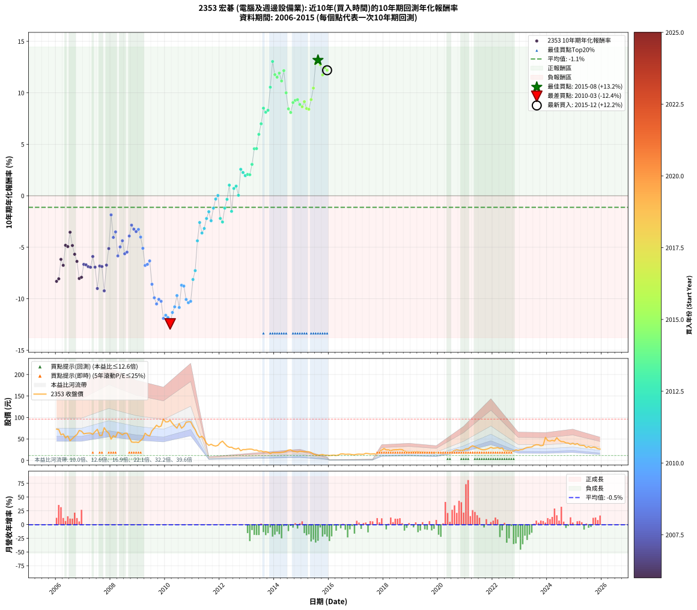

# 2353 宏碁 - 本益比與未來報酬率分析

!!! info "報告資訊"
    - **股票代號**: 2353
    - **公司名稱**: 宏碁
    - **產業別**: 電腦及週邊設備業
    - **分析期間**: 2006-2015 (120 個數據點)
    - **資料來源**: Type 12 (ShowMonthlyK_ChartFlow) 月收盤價與本益比
    - **報酬率口徑**: 含現金股利 (簡化: 年度合計，假設每年7/1入帳)
    - **報告生成時間**: 2026-01-06 00:31:06 CST

## 📈 視覺化圖表

### 圖表1: 本益比 vs 未來報酬率關係

*圖表1：2353 宏碁 本益比與10年期未來報酬率關係 (2006-2015)*

### 圖表2: 歷年買入時點的10年期實際報酬率

*圖表2：2353 宏碁 歷年買入時點的10年期實際報酬率 (2006-2015)*

## 📍 買點訊號說明

本報告提供兩種買點提示訊號（顯示於圖表2的股價子圖中）：

### ▲ 小綠色三角形（回測驗證）
- **計算方式**: 使用全部歷史資料計算本益比第25百分位數
- **用途**: 事後驗證，顯示歷史上哪些時點確實為低估區
- **限制**: 當下無法判斷，僅供回測參考
- **特性**: 後見之明（Look-Ahead Bias）

### ▲ 小橘色三角形（即時訊號）
- **計算方式**: 使用截至當月的過去5年資料計算本益比第25百分位數
- **用途**: 實際投資決策，當時即可判斷
- **優勢**: 可操作性強，符合實務需求
- **特性**: 無後見之明，滾動窗口計算

!!! tip "如何使用兩種訊號"
    - **綠色▲** 幫助理解歷史估值機會，驗證策略有效性
    - **橘色▲** 可作為實際買進參考，但仍需搭配基本面分析
    - 兩種訊號重疊時，表示即時判斷與事後驗證一致，信心度較高
    - 僅有綠色▲時，表示當時無法判斷（需要未來資料才能確認）
    - 僅有橘色▲時，表示即時判斷為買點，但事後可能不是最佳時機

## 📊 估值分析摘要

| 指標 | 數值 |
|:---:|:---:|
| **目前本益比** (2015-12) | **60.50 倍** |
| **歷史平均本益比** | 20.68 倍 |
| **估值水準** | 🔴 相對高估 |
| **預期10年年化報酬率** | **+3.05%** |
| **歷史平均報酬率** | -1.12% |
| **相關係數 (R²)** | 0.2279 |
| **趨勢線斜率** | 0.1768 |

!!! abstract "核心洞察"
    目前本益比顯著高於歷史平均，預期未來報酬率可能較低

    根據歷史數據回測，2353 宏碁 在目前本益比 **60.5倍** 的估值水準下，
    預期未來10年年化報酬率約為 **+3.1%**。

    **重要提醒**: 本分析基於歷史數據統計，實際報酬率會受到公司基本面變化、產業趨勢、
    總體經濟環境等多重因素影響。R² = 0.23 表示本益比可解釋約 22.8% 的報酬率變異。

## 📈 歷史估值統計

### 最佳買點 (最高報酬率)

| 項目 | 數值 |
|:---:|:---:|
| 起始時間 | 2015-08 |
| 當時本益比 | 33.96 倍 |
| 起始價格 | 12.0 元 |
| 10年後價格 | 29.6 元 |
| **10年年化報酬率** | **+13.17%** |

### 最差買點 (最低報酬率)

| 項目 | 數值 |
|:---:|:---:|
| 起始時間 | 2010-03 |
| 當時本益比 | 20.13 倍 |
| 起始價格 | 93.8 元 |
| 10年後價格 | 15.6 元 |
| **10年年化報酬率** | **-12.45%** |

## 🎯 投資啟示

### 本益比與報酬率關係

趨勢線方程式: **y = 0.1768x + -7.6443**

!!! info "弱相關或正相關"
    本益比與未來報酬率相關性較弱。這可能表示該股票的報酬率更多受到
    公司成長性、產業趨勢等因素影響，而非估值水準。**需綜合考量多項指標**。

### 估值區間建議

基於歷史數據分析:

- **🟢 低估區** (P/E < 16.5): 預期報酬率較高，可考慮增加持股
- **🟡 合理區** (P/E 16.5-24.8): 預期報酬率符合長期趨勢，正常持有
- **🔴 高估區** (P/E > 24.8): 預期報酬率較低，可考慮減碼或觀望

!!! danger "風險提示"
    - 過去表現不代表未來結果
    - 本分析假設公司基本面無重大結構性變化
    - 產業環境劇變可能使歷史規律失效
    - 應結合公司財報、產業趨勢、總體經濟等多重因素綜合判斷

!!! success "長期投資觀點"
    歷史數據顯示，在合理或低估的估值水準買入並長期持有，
    往往能獲得較佳的投資報酬。**耐心等待好價格**是價值投資的核心原則。

## 📊 數據品質

- **資料來源**: GoodInfo.tw Type 12 (ShowMonthlyK_ChartFlow)
- **資料頻率**: 月度收盤價與本益比
- **回測期間**: 2006-2015
- **數據點數量**: 120 個 (每個點代表一次10年期回測)

### 計算方法說明

1. **10年期年化報酬率**:
   - 對每個歷史時點，計算其後10年的實際投資報酬率
   - 期末價值(不含股利): 期末價格
   - 期末價值(含現金股利): 期末價格 + 持有期間內的現金股利合計 (簡化: 年度合計，假設每年7/1入帳)
   - 公式: 年化報酬率 = [(期末價值/期初價格)^(1/年數) - 1] × 100%

2. **本益比 (P/E Ratio)**:
   - 使用當時的月收盤價與EPS計算
   - 資料來源: Type 12 月度河流圖本益比數據

3. **趨勢線 (Linear Regression)**:
   - 使用最小平方法擬合線性趨勢線
   - R²值衡量本益比對報酬率的解釋能力

---

*本報告由 Stock Analysis System v1.9.0 自動生成*
*數據更新時間: 2026-01-06 00:31:06 CST*

## 📋 月度回測明細表

（每一列對應時間線圖中的一個買入點；可用來對照 SVG 圖上的每個點。）

| 買入月份 | 賣出月份 | 回測期限_年 | 實際持有年數 | 買入本益比_倍 | 買入收盤價_元 | 賣出收盤價_元 | 現金股利合計_元 | 總報酬率_pct | 年化報酬率_pct |
| --- | --- | --- | --- | --- | --- | --- | --- | --- | --- |
| 2006-01 | 2016-01 | 10 | 9.999 | 16.40 | 73.00 | 11.45 | 19.20 | -58.01 | -8.31 |
| 2006-02 | 2016-02 | 10 | 9.999 | 16.18 | 72.00 | 11.85 | 19.20 | -56.87 | -8.07 |
| 2006-03 | 2016-03 | 10 | 10.001 | 13.42 | 59.70 | 12.35 | 19.20 | -47.15 | -6.18 |
| 2006-04 | 2016-04 | 10 | 10.001 | 13.89 | 61.80 | 11.50 | 19.20 | -50.32 | -6.76 |
| 2006-05 | 2016-05 | 10 | 10.001 | 11.78 | 52.40 | 12.80 | 19.20 | -38.92 | -4.81 |
| 2006-06 | 2016-06 | 10 | 10.001 | 12.79 | 56.90 | 15.10 | 19.20 | -39.71 | -4.93 |
| 2006-07 | 2016-07 | 10 | 10.001 | 10.28 | 45.75 | 15.20 | 16.70 | -30.26 | -3.54 |
| 2006-08 | 2016-08 | 10 | 10.001 | 11.42 | 50.80 | 14.25 | 16.70 | -39.07 | -4.83 |
| 2006-09 | 2016-09 | 10 | 10.001 | 12.61 | 56.10 | 14.55 | 16.70 | -44.29 | -5.68 |
| 2006-10 | 2016-10 | 10 | 10.001 | 13.55 | 60.30 | 14.50 | 16.70 | -48.25 | -6.37 |
| 2006-11 | 2016-11 | 10 | 10.001 | 15.69 | 69.80 | 13.50 | 16.70 | -56.73 | -8.03 |
| 2006-12 | 2016-12 | 10 | 10.001 | 15.28 | 68.00 | 13.10 | 16.70 | -56.17 | -7.92 |
| 2007-01 | 2017-01 | 10 | 10.001 | 13.67 | 62.00 | 14.40 | 16.70 | -49.83 | -6.66 |
| 2007-02 | 2017-02 | 10 | 10.001 | 13.63 | 63.00 | 14.75 | 16.70 | -50.07 | -6.71 |
| 2007-03 | 2017-03 | 10 | 10.001 | 13.49 | 63.50 | 14.40 | 16.70 | -51.02 | -6.89 |
| 2007-04 | 2017-04 | 10 | 10.001 | 13.27 | 63.60 | 14.25 | 16.70 | -51.33 | -6.95 |
| 2007-05 | 2017-05 | 10 | 10.001 | 12.50 | 61.00 | 16.50 | 16.70 | -45.57 | -5.90 |
| 2007-06 | 2017-06 | 10 | 10.001 | 13.49 | 67.00 | 15.95 | 16.70 | -51.26 | -6.93 |
| 2007-07 | 2017-07 | 10 | 10.001 | 14.35 | 72.50 | 14.85 | 13.35 | -61.10 | -9.01 |
| 2007-08 | 2017-08 | 10 | 10.001 | 11.27 | 57.90 | 15.20 | 13.35 | -50.68 | -6.82 |
| 2007-09 | 2017-09 | 10 | 10.001 | 11.14 | 58.20 | 15.20 | 13.35 | -50.94 | -6.87 |
| 2007-10 | 2017-10 | 10 | 10.001 | 14.37 | 76.30 | 15.60 | 13.35 | -62.05 | -9.23 |
| 2007-11 | 2017-11 | 10 | 10.001 | 12.61 | 68.00 | 20.50 | 13.35 | -50.21 | -6.74 |
| 2007-12 | 2017-12 | 10 | 10.001 | 11.59 | 63.50 | 24.15 | 13.35 | -40.94 | -5.13 |
| 2008-01 | 2018-01 | 10 | 10.001 | 9.13 | 49.45 | 27.65 | 13.35 | -17.08 | -1.86 |
| 2008-02 | 2018-03 | 10 | 10.081 | 10.78 | 57.70 | 24.70 | 13.35 | -34.05 | -4.05 |
| 2008-03 | 2018-03 | 10 | 9.999 | 10.28 | 54.40 | 24.70 | 13.35 | -30.05 | -3.51 |
| 2008-04 | 2018-04 | 10 | 9.999 | 12.63 | 66.00 | 22.80 | 13.35 | -45.22 | -5.84 |
| 2008-05 | 2018-05 | 10 | 9.999 | 12.22 | 63.10 | 24.55 | 13.35 | -39.93 | -4.97 |
| 2008-06 | 2018-06 | 10 | 9.999 | 11.73 | 59.80 | 24.90 | 13.35 | -36.03 | -4.37 |
| 2008-07 | 2018-07 | 10 | 9.999 | 12.57 | 63.30 | 25.00 | 10.45 | -43.99 | -5.63 |
| 2008-08 | 2018-08 | 10 | 9.999 | 12.77 | 63.50 | 25.70 | 10.45 | -43.06 | -5.48 |
| 2008-09 | 2018-09 | 10 | 9.999 | 10.84 | 53.20 | 25.25 | 10.45 | -32.89 | -3.91 |
| 2008-10 | 2018-10 | 10 | 9.999 | 8.86 | 42.95 | 21.70 | 10.45 | -25.14 | -2.85 |
| 2008-11 | 2018-11 | 10 | 9.999 | 8.82 | 42.20 | 19.90 | 10.45 | -28.07 | -3.24 |
| 2008-12 | 2018-12 | 10 | 9.999 | 9.03 | 42.60 | 19.45 | 10.45 | -29.80 | -3.48 |
| 2009-01 | 2019-01 | 10 | 9.999 | 8.91 | 41.75 | 19.50 | 10.45 | -28.25 | -3.27 |
| 2009-02 | 2019-02 | 10 | 9.999 | 9.97 | 46.40 | 20.35 | 10.45 | -33.61 | -4.01 |
| 2009-03 | 2019-03 | 10 | 9.999 | 11.04 | 51.00 | 19.75 | 10.45 | -40.78 | -5.10 |
| 2009-04 | 2019-04 | 10 | 9.999 | 13.81 | 63.30 | 20.95 | 10.45 | -50.39 | -6.77 |
| 2009-05 | 2019-05 | 10 | 9.999 | 12.93 | 58.80 | 19.05 | 10.45 | -49.82 | -6.66 |
| 2009-06 | 2019-06 | 10 | 9.999 | 12.65 | 57.10 | 19.25 | 10.45 | -47.98 | -6.33 |
| 2009-07 | 2019-07 | 10 | 9.999 | 15.44 | 69.20 | 18.95 | 9.22 | -59.29 | -8.60 |
| 2009-08 | 2019-08 | 10 | 9.999 | 16.87 | 75.00 | 17.20 | 9.22 | -64.77 | -9.91 |
| 2009-09 | 2019-09 | 10 | 9.999 | 18.58 | 82.00 | 17.80 | 9.22 | -67.04 | -10.51 |
| 2009-10 | 2019-10 | 10 | 9.999 | 17.81 | 78.00 | 17.80 | 9.22 | -65.35 | -10.06 |
| 2009-11 | 2019-11 | 10 | 9.999 | 18.44 | 80.10 | 17.95 | 9.22 | -66.07 | -10.25 |
| 2009-12 | 2019-12 | 10 | 9.999 | 22.32 | 96.20 | 17.85 | 9.22 | -71.86 | -11.91 |
| 2010-01 | 2020-01 | 10 | 9.999 | 20.26 | 89.70 | 16.90 | 9.22 | -70.88 | -11.61 |
| 2010-02 | 2020-02 | 10 | 9.999 | 19.81 | 90.00 | 16.35 | 9.22 | -71.58 | -11.82 |
| 2010-03 | 2020-03 | 10 | 10.001 | 20.13 | 93.80 | 15.60 | 9.22 | -73.54 | -12.45 |
| 2010-04 | 2020-04 | 10 | 10.001 | 18.05 | 86.20 | 16.65 | 9.22 | -69.98 | -11.34 |
| 2010-05 | 2020-05 | 10 | 10.001 | 16.37 | 80.10 | 16.35 | 9.22 | -68.07 | -10.79 |
| 2010-06 | 2020-06 | 10 | 10.001 | 15.01 | 75.20 | 17.90 | 9.22 | -63.93 | -9.69 |
| 2010-07 | 2020-07 | 10 | 10.001 | 16.74 | 85.80 | 20.30 | 6.90 | -68.30 | -10.85 |
| 2010-08 | 2020-08 | 10 | 10.001 | 14.32 | 75.10 | 23.35 | 6.90 | -59.72 | -8.69 |
| 2010-09 | 2020-09 | 10 | 10.001 | 14.81 | 79.40 | 24.80 | 6.90 | -60.07 | -8.77 |
| 2010-10 | 2020-10 | 10 | 10.001 | 16.23 | 88.90 | 23.85 | 6.90 | -65.41 | -10.07 |
| 2010-11 | 2020-11 | 10 | 10.001 | 16.09 | 90.00 | 23.15 | 6.90 | -66.61 | -10.39 |
| 2010-12 | 2020-12 | 10 | 10.001 | 15.78 | 90.10 | 23.65 | 6.90 | -66.09 | -10.25 |
| 2011-01 | 2021-01 | 10 | 10.001 | 15.78 | 79.30 | 27.05 | 6.90 | -57.19 | -8.13 |
| 2011-02 | 2021-02 | 10 | 10.001 | 16.55 | 71.80 | 26.85 | 6.90 | -52.99 | -7.27 |
| 2011-03 | 2021-03 | 10 | 10.001 | 16.43 | 60.00 | 31.45 | 6.90 | -36.08 | -4.38 |
| 2011-04 | 2021-04 | 10 | 10.001 | 18.07 | 53.60 | 34.30 | 6.90 | -23.13 | -2.60 |
| 2011-05 | 2021-05 | 10 | 10.001 | 24.60 | 56.10 | 31.90 | 6.90 | -30.84 | -3.62 |
| 2011-06 | 2021-06 | 10 | 10.001 | 31.35 | 50.00 | 29.30 | 6.90 | -27.60 | -3.18 |
| 2011-07 | 2021-07 | 10 | 10.001 | 43.94 | 39.95 | 27.20 | 4.75 | -20.03 | -2.21 |
| 2011-08 | 2021-08 | 10 | 10.001 | 156.70 | 35.00 | 25.20 | 4.75 | -14.44 | -1.55 |
| 2011-09 | 2021-09 | 10 | 10.001 |  | 37.70 | 24.75 | 4.75 | -21.76 | -2.42 |
| 2011-10 | 2021-10 | 10 | 10.001 |  | 34.70 | 26.00 | 4.75 | -11.39 | -1.20 |
| 2011-11 | 2021-11 | 10 | 10.001 |  | 33.50 | 27.70 | 4.75 | -3.14 | -0.32 |
| 2011-12 | 2021-12 | 10 | 10.001 |  | 35.10 | 30.45 | 4.75 | +0.28 | +0.03 |
| 2012-01 | 2022-01 | 10 | 10.001 |  | 41.35 | 28.35 | 4.75 | -19.96 | -2.20 |
| 2012-02 | 2022-03 | 10 | 10.081 |  | 45.00 | 29.95 | 4.75 | -22.90 | -2.55 |
| 2012-03 | 2022-03 | 10 | 9.999 |  | 39.15 | 29.95 | 4.75 | -11.37 | -1.20 |
| 2012-04 | 2022-04 | 10 | 9.999 |  | 33.50 | 27.60 | 4.75 | -3.44 | -0.35 |
| 2012-05 | 2022-05 | 10 | 9.999 |  | 30.55 | 29.10 | 4.75 | +10.79 | +1.03 |
| 2012-06 | 2022-06 | 10 | 9.999 |  | 30.80 | 21.70 | 4.75 | -14.13 | -1.51 |
| 2012-07 | 2022-07 | 10 | 9.999 |  | 27.60 | 22.60 | 7.03 | +7.34 | +0.71 |
| 2012-08 | 2022-08 | 10 | 9.999 |  | 26.45 | 22.00 | 7.03 | +9.74 | +0.93 |
| 2012-09 | 2022-09 | 10 | 9.999 |  | 28.80 | 21.90 | 7.03 | +0.44 | +0.04 |
| 2012-10 | 2022-10 | 10 | 9.999 |  | 22.60 | 22.10 | 7.03 | +28.88 | +2.57 |
| 2012-11 | 2022-11 | 10 | 9.999 |  | 25.30 | 24.60 | 7.03 | +25.01 | +2.26 |
| 2012-12 | 2022-12 | 10 | 9.999 |  | 25.20 | 23.55 | 7.03 | +21.34 | +1.95 |
| 2013-01 | 2023-01 | 10 | 9.999 |  | 26.05 | 24.95 | 7.03 | +22.75 | +2.07 |
| 2013-02 | 2023-02 | 10 | 9.999 |  | 26.45 | 25.35 | 7.03 | +22.41 | +2.04 |
| 2013-03 | 2023-03 | 10 | 9.999 |  | 26.05 | 28.15 | 7.03 | +35.04 | +3.05 |
| 2013-04 | 2023-04 | 10 | 9.999 |  | 23.85 | 30.25 | 7.03 | +56.30 | +4.57 |
| 2013-05 | 2023-05 | 10 | 9.999 |  | 24.20 | 30.85 | 7.03 | +56.52 | +4.58 |
| 2013-06 | 2023-06 | 10 | 9.999 |  | 21.50 | 31.35 | 7.03 | +78.50 | +5.97 |
| 2013-07 | 2023-07 | 10 | 9.999 |  | 22.15 | 35.00 | 8.53 | +96.51 | +6.99 |
| 2013-08 | 2023-08 | 10 | 9.999 |  | 19.95 | 36.60 | 8.53 | +126.20 | +8.51 |
| 2013-09 | 2023-09 | 10 | 9.999 |  | 20.55 | 36.30 | 8.53 | +118.14 | +8.11 |
| 2013-10 | 2023-10 | 10 | 9.999 |  | 19.20 | 34.10 | 8.53 | +122.02 | +8.30 |
| 2013-11 | 2023-11 | 10 | 9.999 |  | 16.05 | 35.20 | 8.53 | +172.44 | +10.54 |
| 2013-12 | 2023-12 | 10 | 9.999 |  | 18.30 | 53.80 | 8.53 | +240.58 | +13.04 |
| 2014-01 | 2024-01 | 10 | 9.999 |  | 17.95 | 46.05 | 8.53 | +204.05 | +11.76 |
| 2014-02 | 2024-02 | 10 | 9.999 |  | 18.05 | 45.15 | 8.53 | +197.38 | +11.52 |
| 2014-03 | 2024-03 | 10 | 10.001 |  | 17.95 | 46.80 | 8.53 | +208.23 | +11.91 |
| 2014-04 | 2024-04 | 10 | 10.001 |  | 18.65 | 45.15 | 8.53 | +187.81 | +11.15 |
| 2014-05 | 2024-05 | 10 | 10.001 |  | 19.50 | 52.90 | 8.53 | +215.01 | +12.16 |
| 2014-06 | 2024-06 | 10 | 10.001 |  | 21.35 | 46.85 | 8.53 | +159.38 | +10.00 |
| 2014-07 | 2024-07 | 10 | 10.001 |  | 24.00 | 43.85 | 10.13 | +124.90 | +8.44 |
| 2014-08 | 2024-08 | 10 | 10.001 |  | 24.75 | 43.75 | 10.13 | +117.68 | +8.09 |
| 2014-09 | 2024-09 | 10 | 10.001 |  | 21.40 | 40.80 | 10.13 | +137.98 | +9.06 |
| 2014-10 | 2024-10 | 10 | 10.001 |  | 20.85 | 40.45 | 10.13 | +142.58 | +9.26 |
| 2014-11 | 2024-11 | 10 | 10.001 |  | 19.65 | 37.85 | 10.13 | +144.16 | +9.34 |
| 2014-12 | 2024-12 | 10 | 10.001 | 32.35 | 21.35 | 39.80 | 10.13 | +133.85 | +8.87 |
| 2015-01 | 2025-01 | 10 | 10.001 | 33.22 | 20.65 | 37.20 | 10.13 | +129.19 | +8.65 |
| 2015-02 | 2025-02 | 10 | 10.001 | 35.23 | 20.55 | 39.15 | 10.13 | +139.79 | +9.14 |
| 2015-03 | 2025-03 | 10 | 10.001 | 37.06 | 20.20 | 35.45 | 10.13 | +125.63 | +8.48 |
| 2015-04 | 2025-04 | 10 | 10.001 | 39.67 | 20.10 | 34.90 | 10.13 | +124.01 | +8.40 |
| 2015-05 | 2025-05 | 10 | 10.001 | 39.18 | 18.35 | 34.70 | 10.13 | +144.29 | +9.34 |
| 2015-06 | 2025-06 | 10 | 10.001 | 34.77 | 14.95 | 30.30 | 10.13 | +170.41 | +10.46 |
| 2015-07 | 2025-07 | 10 | 10.001 | 33.45 | 13.10 | 32.15 | 11.83 | +235.70 | +12.87 |
| 2015-08 | 2025-08 | 10 | 10.001 | 33.96 | 12.00 | 29.55 | 11.83 | +244.81 | +13.17 |
| 2015-09 | 2025-09 | 10 | 10.001 | 40.95 | 12.90 | 30.95 | 11.83 | +231.60 | +12.73 |
| 2015-10 | 2025-10 | 10 | 10.001 | 49.88 | 13.80 | 30.05 | 11.83 | +203.46 | +11.74 |
| 2015-11 | 2025-11 | 10 | 10.001 | 50.77 | 12.10 | 27.25 | 11.83 | +222.95 | +12.44 |
| 2015-12 | 2025-12 | 10 | 10.001 | 60.50 | 12.10 | 26.40 | 11.83 | +215.93 | +12.19 |
