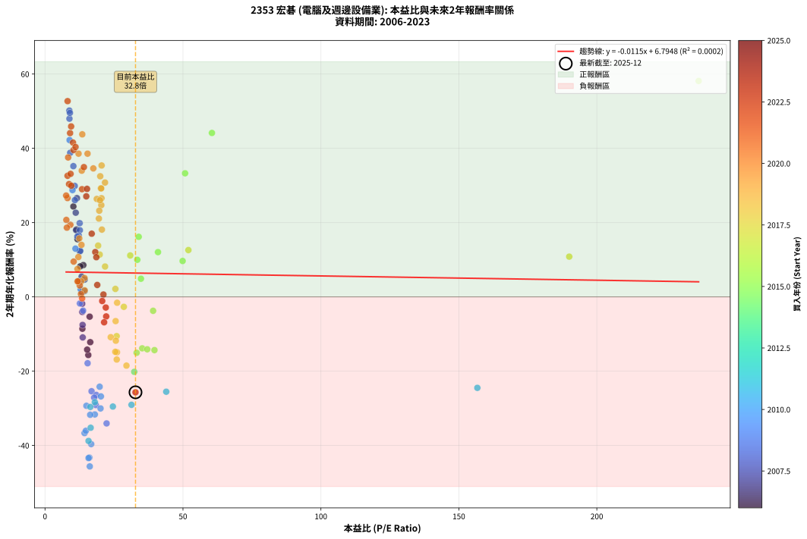
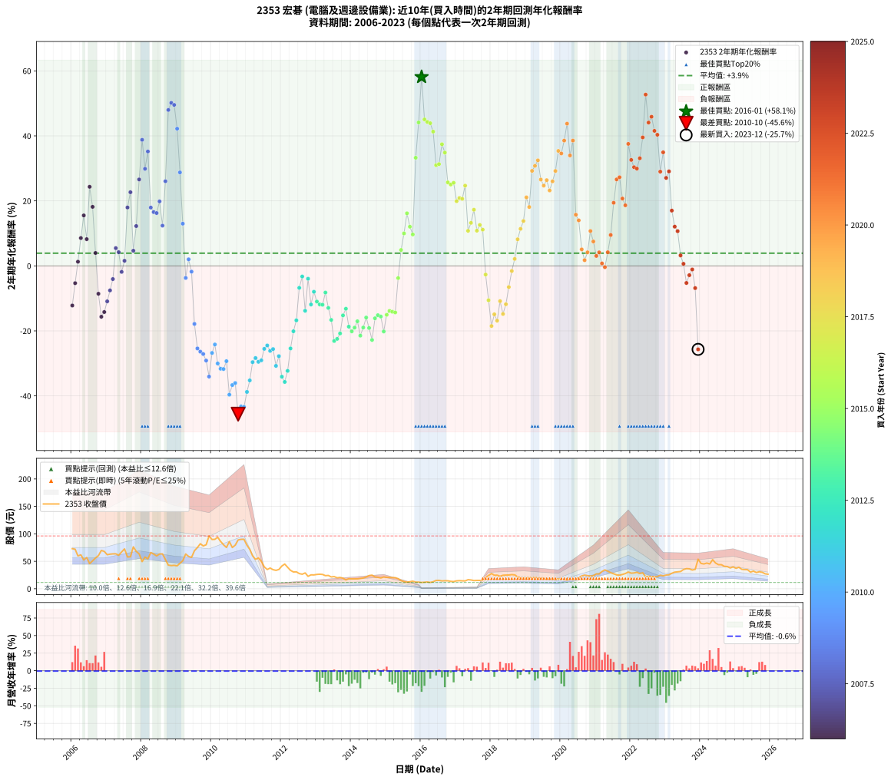

# 2353 宏碁 - 本益比與未來報酬率分析

!!! info "報告資訊"
    - **股票代號**: 2353
    - **公司名稱**: 宏碁
    - **產業別**: 電腦及週邊設備業
    - **分析期間**: 2006-2023 (216 個數據點)
    - **資料來源**: Type 12 (ShowMonthlyK_ChartFlow) 月收盤價與本益比
    - **報酬率口徑**: 含現金股利 (簡化: 年度合計，假設每年7/1入帳)
    - **報告生成時間**: 2026-01-22 22:26:42 CST

## 📈 視覺化圖表

### 圖表1: 本益比 vs 未來報酬率關係

*圖表1：2353 宏碁 本益比與2年期未來報酬率關係 (2006-2023)*

### 圖表2: 歷年買入時點的2年期實際報酬率

*圖表2：2353 宏碁 歷年買入時點的2年期實際報酬率 (2006-2023)*

## 📍 買點訊號說明

本報告提供兩種買點提示訊號（顯示於圖表2的股價子圖中）：

### ▲ 小綠色三角形（回測驗證）
- **計算方式**: 使用全部歷史資料計算本益比第25百分位數
- **用途**: 事後驗證，顯示歷史上哪些時點確實為低估區
- **限制**: 當下無法判斷，僅供回測參考
- **特性**: 後見之明（Look-Ahead Bias）

### ▲ 小橘色三角形（即時訊號）
- **計算方式**: 使用截至當月的過去5年資料計算本益比第25百分位數
- **用途**: 實際投資決策，當時即可判斷
- **優勢**: 可操作性強，符合實務需求
- **特性**: 無後見之明，滾動窗口計算

!!! tip "如何使用兩種訊號"
    - **綠色▲** 幫助理解歷史估值機會，驗證策略有效性
    - **橘色▲** 可作為實際買進參考，但仍需搭配基本面分析
    - 兩種訊號重疊時，表示即時判斷與事後驗證一致，信心度較高
    - 僅有綠色▲時，表示當時無法判斷（需要未來資料才能確認）
    - 僅有橘色▲時，表示即時判斷為買點，但事後可能不是最佳時機

## 📊 估值分析摘要

| 指標 | 數值 |
|:---:|:---:|
| **目前本益比** (2023-12) | **32.80 倍** |
| **歷史平均本益比** | 21.55 倍 |
| **估值水準** | 🔴 相對高估 |
| **預期2年年化報酬率** | **+6.42%** |
| **歷史平均報酬率** | +3.91% |
| **相關係數 (R²)** | 0.0002 |
| **趨勢線斜率** | -0.0115 |

!!! abstract "核心洞察"
    目前本益比顯著高於歷史平均，預期未來報酬率可能較低

    根據歷史數據回測，2353 宏碁 在目前本益比 **32.8倍** 的估值水準下，
    預期未來2年年化報酬率約為 **+6.4%**。

    **重要提醒**: 本分析基於歷史數據統計，實際報酬率會受到公司基本面變化、產業趨勢、
    總體經濟環境等多重因素影響。R² = 0.00 表示本益比可解釋約 0.0% 的報酬率變異。

## 📈 歷史估值統計

### 最佳買點 (最高報酬率)

| 項目 | 數值 |
|:---:|:---:|
| 起始時間 | 2016-01 |
| 當時本益比 | 236.90 倍 |
| 起始價格 | 11.4 元 |
| 2年後價格 | 27.6 元 |
| **2年年化報酬率** | **+58.13%** |

### 最差買點 (最低報酬率)

| 項目 | 數值 |
|:---:|:---:|
| 起始時間 | 2010-10 |
| 當時本益比 | 16.23 倍 |
| 起始價格 | 88.9 元 |
| 2年後價格 | 22.6 元 |
| **2年年化報酬率** | **-45.63%** |

## 🎯 投資啟示

### 本益比與報酬率關係

趨勢線方程式: **y = -0.0115x + 6.7948**

!!! note "負相關"
    本益比與未來報酬率呈現負相關。較低的本益比通常帶來較高的未來報酬率，
    但相關性不算非常強。**估值仍是重要參考指標之一**。

### 估值區間建議

基於歷史數據分析:

- **🟢 低估區** (P/E < 17.2): 預期報酬率較高，可考慮增加持股
- **🟡 合理區** (P/E 17.2-25.9): 預期報酬率符合長期趨勢，正常持有
- **🔴 高估區** (P/E > 25.9): 預期報酬率較低，可考慮減碼或觀望

!!! danger "風險提示"
    - 過去表現不代表未來結果
    - 本分析假設公司基本面無重大結構性變化
    - 產業環境劇變可能使歷史規律失效
    - 應結合公司財報、產業趨勢、總體經濟等多重因素綜合判斷

!!! success "長期投資觀點"
    歷史數據顯示，在合理或低估的估值水準買入並長期持有，
    往往能獲得較佳的投資報酬。**耐心等待好價格**是價值投資的核心原則。

## 📊 數據品質

- **資料來源**: GoodInfo.tw Type 12 (ShowMonthlyK_ChartFlow)
- **資料頻率**: 月度收盤價與本益比
- **回測期間**: 2006-2023
- **數據點數量**: 216 個 (每個點代表一次2年期回測)

### 計算方法說明

1. **2年期年化報酬率**:
   - 對每個歷史時點，計算其後2年的實際投資報酬率
   - 期末價值(不含股利): 期末價格
   - 期末價值(含現金股利): 期末價格 + 持有期間內的現金股利合計 (簡化: 年度合計，假設每年7/1入帳)
   - 公式: 年化報酬率 = [(期末價值/期初價格)^(1/年數) - 1] × 100%

2. **本益比 (P/E Ratio)**:
   - 使用當時的月收盤價與EPS計算
   - 資料來源: Type 12 月度河流圖本益比數據

3. **趨勢線 (Linear Regression)**:
   - 使用最小平方法擬合線性趨勢線
   - R²值衡量本益比對報酬率的解釋能力

---

*本報告由 Stock Analysis System v1.9.0 自動生成*
*數據更新時間: 2026-01-22 22:26:42 CST*

## 📋 月度回測明細表

（每一列對應時間線圖中的一個買入點；可用來對照 SVG 圖上的每個點。）

| 買入月份 | 賣出月份 | 回測期限_年 | 實際持有年數 | 買入本益比_倍 | 買入收盤價_元 | 賣出收盤價_元 | 現金股利合計_元 | 總報酬率_pct | 年化報酬率_pct |
| --- | --- | --- | --- | --- | --- | --- | --- | --- | --- |
| 2006-01 | 2008-01 | 2 | 1.999 | 16.40 | 73.00 | 49.45 | 6.85 | -22.88 | -12.19 |
| 2006-02 | 2008-02 | 2 | 1.999 | 16.18 | 72.00 | 57.70 | 6.85 | -10.35 | -5.32 |
| 2006-03 | 2008-03 | 2 | 2.001 | 13.42 | 59.70 | 54.40 | 6.85 | +2.60 | +1.29 |
| 2006-04 | 2008-04 | 2 | 2.001 | 13.89 | 61.80 | 66.00 | 6.85 | +17.88 | +8.57 |
| 2006-05 | 2008-05 | 2 | 2.001 | 11.78 | 52.40 | 63.10 | 6.85 | +33.49 | +15.53 |
| 2006-06 | 2008-06 | 2 | 2.001 | 12.79 | 56.90 | 59.80 | 6.85 | +17.14 | +8.22 |
| 2006-07 | 2008-07 | 2 | 2.001 | 10.28 | 45.75 | 63.30 | 7.45 | +54.64 | +24.34 |
| 2006-08 | 2008-08 | 2 | 2.001 | 11.42 | 50.80 | 63.50 | 7.45 | +39.67 | +18.17 |
| 2006-09 | 2008-09 | 2 | 2.001 | 12.61 | 56.10 | 53.20 | 7.45 | +8.11 | +3.97 |
| 2006-10 | 2008-10 | 2 | 2.001 | 13.55 | 60.30 | 42.95 | 7.45 | -16.42 | -8.57 |
| 2006-11 | 2008-11 | 2 | 2.001 | 15.69 | 69.80 | 42.20 | 7.45 | -28.87 | -15.65 |
| 2006-12 | 2008-12 | 2 | 2.001 | 15.28 | 68.00 | 42.60 | 7.45 | -26.40 | -14.20 |
| 2007-01 | 2009-01 | 2 | 2.001 | 13.67 | 62.00 | 41.75 | 7.45 | -20.65 | -10.91 |
| 2007-02 | 2009-02 | 2 | 2.001 | 13.63 | 63.00 | 46.40 | 7.45 | -14.52 | -7.54 |
| 2007-03 | 2009-03 | 2 | 2.001 | 13.49 | 63.50 | 51.00 | 7.45 | -7.95 | -4.06 |
| 2007-04 | 2009-04 | 2 | 2.001 | 13.27 | 63.60 | 63.30 | 7.45 | +11.24 | +5.47 |
| 2007-05 | 2009-05 | 2 | 2.001 | 12.50 | 61.00 | 58.80 | 7.45 | +8.61 | +4.21 |
| 2007-06 | 2009-06 | 2 | 2.001 | 13.49 | 67.00 | 57.10 | 7.45 | -3.66 | -1.84 |
| 2007-07 | 2009-07 | 2 | 2.001 | 14.35 | 72.50 | 69.20 | 5.60 | +3.17 | +1.57 |
| 2007-08 | 2009-08 | 2 | 2.001 | 11.27 | 57.90 | 75.00 | 5.60 | +39.21 | +17.97 |
| 2007-09 | 2009-09 | 2 | 2.001 | 11.14 | 58.20 | 82.00 | 5.60 | +50.52 | +22.67 |
| 2007-10 | 2009-10 | 2 | 2.001 | 14.37 | 76.30 | 78.00 | 5.60 | +9.57 | +4.67 |
| 2007-11 | 2009-11 | 2 | 2.001 | 12.61 | 68.00 | 80.10 | 5.60 | +26.03 | +12.25 |
| 2007-12 | 2009-12 | 2 | 2.001 | 11.59 | 63.50 | 96.20 | 5.60 | +60.31 | +26.60 |
| 2008-01 | 2010-01 | 2 | 2.001 | 9.13 | 49.45 | 89.70 | 5.60 | +92.72 | +38.79 |
| 2008-02 | 2010-03 | 2 | 2.081 | 10.78 | 57.70 | 93.80 | 5.60 | +72.27 | +29.87 |
| 2008-03 | 2010-03 | 2 | 1.999 | 10.28 | 54.40 | 93.80 | 5.60 | +82.72 | +35.20 |
| 2008-04 | 2010-04 | 2 | 1.999 | 12.63 | 66.00 | 86.20 | 5.60 | +39.09 | +17.95 |
| 2008-05 | 2010-05 | 2 | 1.999 | 12.22 | 63.10 | 80.10 | 5.60 | +35.82 | +16.55 |
| 2008-06 | 2010-06 | 2 | 1.999 | 11.73 | 59.80 | 75.20 | 5.60 | +35.12 | +16.25 |
| 2008-07 | 2010-07 | 2 | 1.999 | 12.57 | 63.30 | 85.80 | 5.10 | +43.60 | +19.85 |
| 2008-08 | 2010-08 | 2 | 1.999 | 12.77 | 63.50 | 75.10 | 5.10 | +26.30 | +12.39 |
| 2008-09 | 2010-09 | 2 | 1.999 | 10.84 | 53.20 | 79.40 | 5.10 | +58.83 | +26.05 |
| 2008-10 | 2010-10 | 2 | 1.999 | 8.86 | 42.95 | 88.90 | 5.10 | +118.86 | +47.98 |
| 2008-11 | 2010-11 | 2 | 1.999 | 8.82 | 42.20 | 90.00 | 5.10 | +125.36 | +50.16 |
| 2008-12 | 2010-12 | 2 | 1.999 | 9.03 | 42.60 | 90.10 | 5.10 | +123.47 | +49.53 |
| 2009-01 | 2011-01 | 2 | 1.999 | 8.91 | 41.75 | 79.30 | 5.10 | +102.16 | +42.22 |
| 2009-02 | 2011-02 | 2 | 1.999 | 9.97 | 46.40 | 71.80 | 5.10 | +65.73 | +28.76 |
| 2009-03 | 2011-03 | 2 | 1.999 | 11.04 | 51.00 | 60.00 | 5.10 | +27.65 | +12.99 |
| 2009-04 | 2011-04 | 2 | 1.999 | 13.81 | 63.30 | 53.60 | 5.10 | -7.27 | -3.70 |
| 2009-05 | 2011-05 | 2 | 1.999 | 12.93 | 58.80 | 56.10 | 5.10 | +4.08 | +2.02 |
| 2009-06 | 2011-06 | 2 | 1.999 | 12.65 | 57.10 | 50.00 | 5.10 | -3.50 | -1.77 |
| 2009-07 | 2011-07 | 2 | 1.999 | 15.44 | 69.20 | 39.95 | 6.75 | -32.51 | -17.86 |
| 2009-08 | 2011-08 | 2 | 1.999 | 16.87 | 75.00 | 35.00 | 6.75 | -44.33 | -25.40 |
| 2009-09 | 2011-09 | 2 | 1.999 | 18.58 | 82.00 | 37.70 | 6.75 | -45.79 | -26.39 |
| 2009-10 | 2011-10 | 2 | 1.999 | 17.81 | 78.00 | 34.70 | 6.75 | -46.85 | -27.11 |
| 2009-11 | 2011-11 | 2 | 1.999 | 18.44 | 80.10 | 33.50 | 6.75 | -49.75 | -29.13 |
| 2009-12 | 2011-12 | 2 | 1.999 | 22.32 | 96.20 | 35.10 | 6.75 | -56.49 | -34.06 |
| 2010-01 | 2012-01 | 2 | 1.999 | 20.26 | 89.70 | 41.35 | 6.75 | -46.37 | -26.78 |
| 2010-02 | 2012-02 | 2 | 1.999 | 19.81 | 90.00 | 45.00 | 6.75 | -42.50 | -24.18 |
| 2010-03 | 2012-03 | 2 | 2.001 | 20.13 | 93.80 | 39.15 | 6.75 | -51.06 | -30.03 |
| 2010-04 | 2012-04 | 2 | 2.001 | 18.05 | 86.20 | 33.50 | 6.75 | -53.30 | -31.65 |
| 2010-05 | 2012-05 | 2 | 2.001 | 16.37 | 80.10 | 30.55 | 6.75 | -53.43 | -31.74 |
| 2010-06 | 2012-06 | 2 | 2.001 | 15.01 | 75.20 | 30.80 | 6.75 | -50.06 | -29.32 |
| 2010-07 | 2012-07 | 2 | 2.001 | 16.74 | 85.80 | 27.60 | 3.65 | -63.57 | -39.62 |
| 2010-08 | 2012-08 | 2 | 2.001 | 14.32 | 75.10 | 26.45 | 3.65 | -59.91 | -36.67 |
| 2010-09 | 2012-09 | 2 | 2.001 | 14.81 | 79.40 | 28.80 | 3.65 | -59.13 | -36.05 |
| 2010-10 | 2012-10 | 2 | 2.001 | 16.23 | 88.90 | 22.60 | 3.65 | -70.47 | -45.63 |
| 2010-11 | 2012-11 | 2 | 2.001 | 16.09 | 90.00 | 25.30 | 3.65 | -67.83 | -43.26 |
| 2010-12 | 2012-12 | 2 | 2.001 | 15.78 | 90.10 | 25.20 | 3.65 | -67.98 | -43.39 |
| 2011-01 | 2013-01 | 2 | 2.001 | 15.78 | 79.30 | 26.05 | 3.65 | -62.54 | -38.78 |
| 2011-02 | 2013-02 | 2 | 2.001 | 16.55 | 71.80 | 26.45 | 3.65 | -58.07 | -35.23 |
| 2011-03 | 2013-03 | 2 | 2.001 | 16.43 | 60.00 | 26.05 | 3.65 | -50.49 | -29.62 |
| 2011-04 | 2013-04 | 2 | 2.001 | 18.07 | 53.60 | 23.85 | 3.65 | -48.69 | -28.35 |
| 2011-05 | 2013-05 | 2 | 2.001 | 24.60 | 56.10 | 24.20 | 3.65 | -50.35 | -29.52 |
| 2011-06 | 2013-06 | 2 | 2.001 | 31.35 | 50.00 | 21.50 | 3.65 | -49.69 | -29.06 |
| 2011-07 | 2013-07 | 2 | 2.001 | 43.94 | 39.95 | 22.15 | 0.00 | -44.56 | -25.52 |
| 2011-08 | 2013-08 | 2 | 2.001 | 156.70 | 35.00 | 19.95 | 0.00 | -43.00 | -24.49 |
| 2011-09 | 2013-09 | 2 | 2.001 |  | 37.70 | 20.55 | 0.00 | -45.49 | -26.15 |
| 2011-10 | 2013-10 | 2 | 2.001 |  | 34.70 | 19.20 | 0.00 | -44.67 | -25.60 |
| 2011-11 | 2013-11 | 2 | 2.001 |  | 33.50 | 16.05 | 0.00 | -52.09 | -30.77 |
| 2011-12 | 2013-12 | 2 | 2.001 |  | 35.10 | 18.30 | 0.00 | -47.86 | -27.78 |
| 2012-01 | 2014-01 | 2 | 2.001 |  | 41.35 | 17.95 | 0.00 | -56.59 | -34.09 |
| 2012-02 | 2014-03 | 2 | 2.081 |  | 45.00 | 17.95 | 0.00 | -60.11 | -35.71 |
| 2012-03 | 2014-03 | 2 | 1.999 |  | 39.15 | 17.95 | 0.00 | -54.15 | -32.31 |
| 2012-04 | 2014-04 | 2 | 1.999 |  | 33.50 | 18.65 | 0.00 | -44.33 | -25.40 |
| 2012-05 | 2014-05 | 2 | 1.999 |  | 30.55 | 19.50 | 0.00 | -36.17 | -20.12 |
| 2012-06 | 2014-06 | 2 | 1.999 |  | 30.80 | 21.35 | 0.00 | -30.68 | -16.75 |
| 2012-07 | 2014-07 | 2 | 1.999 |  | 27.60 | 24.00 | 0.00 | -13.04 | -6.75 |
| 2012-08 | 2014-08 | 2 | 1.999 |  | 26.45 | 24.75 | 0.00 | -6.43 | -3.27 |
| 2012-09 | 2014-09 | 2 | 1.999 |  | 28.80 | 21.40 | 0.00 | -25.69 | -13.81 |
| 2012-10 | 2014-10 | 2 | 1.999 |  | 22.60 | 20.85 | 0.00 | -7.74 | -3.95 |
| 2012-11 | 2014-11 | 2 | 1.999 |  | 25.30 | 19.65 | 0.00 | -22.33 | -11.88 |
| 2012-12 | 2014-12 | 2 | 1.999 |  | 25.20 | 21.35 | 0.00 | -15.28 | -7.96 |
| 2013-01 | 2015-01 | 2 | 1.999 |  | 26.05 | 20.65 | 0.00 | -20.73 | -10.97 |
| 2013-02 | 2015-02 | 2 | 1.999 |  | 26.45 | 20.55 | 0.00 | -22.31 | -11.86 |
| 2013-03 | 2015-03 | 2 | 1.999 |  | 26.05 | 20.20 | 0.00 | -22.46 | -11.95 |
| 2013-04 | 2015-04 | 2 | 1.999 |  | 23.85 | 20.10 | 0.00 | -15.72 | -8.20 |
| 2013-05 | 2015-05 | 2 | 1.999 |  | 24.20 | 18.35 | 0.00 | -24.17 | -12.93 |
| 2013-06 | 2015-06 | 2 | 1.999 |  | 21.50 | 14.95 | 0.00 | -30.47 | -16.62 |
| 2013-07 | 2015-07 | 2 | 1.999 |  | 22.15 | 13.10 | 0.00 | -40.86 | -23.11 |
| 2013-08 | 2015-08 | 2 | 1.999 |  | 19.95 | 12.00 | 0.00 | -39.85 | -22.46 |
| 2013-09 | 2015-09 | 2 | 1.999 |  | 20.55 | 12.90 | 0.00 | -37.23 | -20.78 |
| 2013-10 | 2015-10 | 2 | 1.999 |  | 19.20 | 13.80 | 0.00 | -28.12 | -15.23 |
| 2013-11 | 2015-11 | 2 | 1.999 |  | 16.05 | 12.10 | 0.00 | -24.61 | -13.18 |
| 2013-12 | 2015-12 | 2 | 1.999 |  | 18.30 | 12.10 | 0.00 | -33.88 | -18.70 |
| 2014-01 | 2016-01 | 2 | 1.999 |  | 17.95 | 11.45 | 0.00 | -36.21 | -20.14 |
| 2014-02 | 2016-02 | 2 | 1.999 |  | 18.05 | 11.85 | 0.00 | -34.35 | -18.99 |
| 2014-03 | 2016-03 | 2 | 2.001 |  | 17.95 | 12.35 | 0.00 | -31.20 | -17.04 |
| 2014-04 | 2016-04 | 2 | 2.001 |  | 18.65 | 11.50 | 0.00 | -38.34 | -21.46 |
| 2014-05 | 2016-05 | 2 | 2.001 |  | 19.50 | 12.80 | 0.00 | -34.36 | -18.97 |
| 2014-06 | 2016-06 | 2 | 2.001 |  | 21.35 | 15.10 | 0.00 | -29.27 | -15.89 |
| 2014-07 | 2016-07 | 2 | 2.001 |  | 24.00 | 15.20 | 0.50 | -34.58 | -19.11 |
| 2014-08 | 2016-08 | 2 | 2.001 |  | 24.75 | 14.25 | 0.50 | -40.40 | -22.79 |
| 2014-09 | 2016-09 | 2 | 2.001 |  | 21.40 | 14.55 | 0.50 | -29.67 | -16.13 |
| 2014-10 | 2016-10 | 2 | 2.001 |  | 20.85 | 14.50 | 0.50 | -28.06 | -15.17 |
| 2014-11 | 2016-11 | 2 | 2.001 |  | 19.65 | 13.50 | 0.50 | -28.75 | -15.58 |
| 2014-12 | 2016-12 | 2 | 2.001 | 32.35 | 21.35 | 13.10 | 0.50 | -36.30 | -20.18 |
| 2015-01 | 2017-01 | 2 | 2.001 | 33.22 | 20.65 | 14.40 | 0.50 | -27.85 | -15.05 |
| 2015-02 | 2017-02 | 2 | 2.001 | 35.23 | 20.55 | 14.75 | 0.50 | -25.79 | -13.85 |
| 2015-03 | 2017-03 | 2 | 2.001 | 37.06 | 20.20 | 14.40 | 0.50 | -26.24 | -14.11 |
| 2015-04 | 2017-04 | 2 | 2.001 | 39.67 | 20.10 | 14.25 | 0.50 | -26.62 | -14.33 |
| 2015-05 | 2017-05 | 2 | 2.001 | 39.18 | 18.35 | 16.50 | 0.50 | -7.36 | -3.75 |
| 2015-06 | 2017-06 | 2 | 2.001 | 34.77 | 14.95 | 15.95 | 0.50 | +10.03 | +4.89 |
| 2015-07 | 2017-07 | 2 | 2.001 | 33.45 | 13.10 | 14.85 | 1.00 | +20.99 | +9.99 |
| 2015-08 | 2017-08 | 2 | 2.001 | 33.96 | 12.00 | 15.20 | 1.00 | +35.00 | +16.18 |
| 2015-09 | 2017-09 | 2 | 2.001 | 40.95 | 12.90 | 15.20 | 1.00 | +25.58 | +12.05 |
| 2015-10 | 2017-10 | 2 | 2.001 | 49.88 | 13.80 | 15.60 | 1.00 | +20.29 | +9.67 |
| 2015-11 | 2017-11 | 2 | 2.001 | 50.77 | 12.10 | 20.50 | 1.00 | +77.69 | +33.27 |
| 2015-12 | 2017-12 | 2 | 2.001 | 60.50 | 12.10 | 24.15 | 1.00 | +107.85 | +44.13 |
| 2016-01 | 2018-01 | 2 | 2.001 | 236.90 | 11.45 | 27.65 | 1.00 | +150.22 | +58.13 |
| 2016-02 | 2018-03 | 2 | 2.081 |  | 11.85 | 24.70 | 1.00 | +116.88 | +45.07 |
| 2016-03 | 2018-03 | 2 | 1.999 |  | 12.35 | 24.70 | 1.00 | +108.10 | +44.29 |
| 2016-04 | 2018-04 | 2 | 1.999 |  | 11.50 | 22.80 | 1.00 | +106.96 | +43.90 |
| 2016-05 | 2018-05 | 2 | 1.999 |  | 12.80 | 24.55 | 1.00 | +99.61 | +41.32 |
| 2016-06 | 2018-06 | 2 | 1.999 |  | 15.10 | 24.90 | 1.00 | +71.52 | +30.99 |
| 2016-07 | 2018-07 | 2 | 1.999 |  | 15.20 | 25.00 | 1.20 | +72.37 | +31.31 |
| 2016-08 | 2018-08 | 2 | 1.999 |  | 14.25 | 25.70 | 1.20 | +88.77 | +37.42 |
| 2016-09 | 2018-09 | 2 | 1.999 |  | 14.55 | 25.25 | 1.20 | +81.79 | +34.86 |
| 2016-10 | 2018-10 | 2 | 1.999 |  | 14.50 | 21.70 | 1.20 | +57.93 | +25.69 |
| 2016-11 | 2018-11 | 2 | 1.999 |  | 13.50 | 19.90 | 1.20 | +56.30 | +25.04 |
| 2016-12 | 2018-12 | 2 | 1.999 |  | 13.10 | 19.45 | 1.20 | +57.63 | +25.57 |
| 2017-01 | 2019-01 | 2 | 1.999 |  | 14.40 | 19.50 | 1.20 | +43.75 | +19.91 |
| 2017-02 | 2019-02 | 2 | 1.999 |  | 14.75 | 20.35 | 1.20 | +46.10 | +20.89 |
| 2017-03 | 2019-03 | 2 | 1.999 |  | 14.40 | 19.75 | 1.20 | +45.49 | +20.63 |
| 2017-04 | 2019-04 | 2 | 1.999 |  | 14.25 | 20.95 | 1.20 | +55.44 | +24.69 |
| 2017-05 | 2019-05 | 2 | 1.999 |  | 16.50 | 19.05 | 1.20 | +22.73 | +10.79 |
| 2017-06 | 2019-06 | 2 | 1.999 |  | 15.95 | 19.25 | 1.20 | +28.21 | +13.24 |
| 2017-07 | 2019-07 | 2 | 1.999 |  | 14.85 | 18.95 | 1.47 | +37.51 | +17.28 |
| 2017-08 | 2019-08 | 2 | 1.999 | 190.00 | 15.20 | 17.20 | 1.47 | +22.83 | +10.84 |
| 2017-09 | 2019-09 | 2 | 1.999 | 51.97 | 15.20 | 17.80 | 1.47 | +26.78 | +12.60 |
| 2017-10 | 2019-10 | 2 | 1.999 | 30.89 | 15.60 | 17.80 | 1.47 | +23.53 | +11.15 |
| 2017-11 | 2019-11 | 2 | 1.999 | 28.57 | 20.50 | 17.95 | 1.47 | -5.27 | -2.67 |
| 2017-12 | 2019-12 | 2 | 1.999 | 25.97 | 24.15 | 17.85 | 1.47 | -20.00 | -10.56 |
| 2018-01 | 2020-01 | 2 | 1.999 | 29.52 | 27.65 | 16.90 | 1.47 | -33.56 | -18.50 |
| 2018-02 | 2020-02 | 2 | 1.999 | 26.08 | 24.60 | 16.35 | 1.47 | -27.56 | -14.90 |
| 2018-03 | 2020-03 | 2 | 2.001 | 26.00 | 24.70 | 15.60 | 1.47 | -30.89 | -16.86 |
| 2018-04 | 2020-04 | 2 | 2.001 | 23.83 | 22.80 | 16.65 | 1.47 | -20.53 | -10.84 |
| 2018-05 | 2020-05 | 2 | 2.001 | 25.48 | 24.55 | 16.35 | 1.47 | -27.41 | -14.79 |
| 2018-06 | 2020-06 | 2 | 2.001 | 25.67 | 24.90 | 17.90 | 1.47 | -22.21 | -11.79 |
| 2018-07 | 2020-07 | 2 | 2.001 | 25.60 | 25.00 | 20.30 | 1.55 | -12.61 | -6.51 |
| 2018-08 | 2020-08 | 2 | 2.001 | 26.14 | 25.70 | 23.35 | 1.55 | -3.12 | -1.57 |
| 2018-09 | 2020-09 | 2 | 2.001 | 25.51 | 25.25 | 24.80 | 1.55 | +4.34 | +2.15 |
| 2018-10 | 2020-10 | 2 | 2.001 | 21.77 | 21.70 | 23.85 | 1.55 | +17.04 | +8.18 |
| 2018-11 | 2020-11 | 2 | 2.001 | 19.83 | 19.90 | 23.15 | 1.55 | +24.11 | +11.39 |
| 2018-12 | 2020-12 | 2 | 2.001 | 19.26 | 19.45 | 23.65 | 1.55 | +29.55 | +13.81 |
| 2019-01 | 2021-01 | 2 | 2.001 | 19.53 | 19.50 | 27.05 | 1.55 | +46.65 | +21.08 |
| 2019-02 | 2021-02 | 2 | 2.001 | 20.62 | 20.35 | 26.85 | 1.55 | +39.54 | +18.11 |
| 2019-03 | 2021-03 | 2 | 2.001 | 20.26 | 19.75 | 31.45 | 1.55 | +67.07 | +29.23 |
| 2019-04 | 2021-04 | 2 | 2.001 | 21.75 | 20.95 | 34.30 | 1.55 | +71.11 | +30.78 |
| 2019-05 | 2021-05 | 2 | 2.001 | 20.02 | 19.05 | 31.90 | 1.55 | +75.57 | +32.48 |
| 2019-06 | 2021-06 | 2 | 2.001 | 20.48 | 19.25 | 29.30 | 1.55 | +60.24 | +26.57 |
| 2019-07 | 2021-07 | 2 | 2.001 | 20.41 | 18.95 | 27.20 | 2.28 | +55.55 | +24.70 |
| 2019-08 | 2021-08 | 2 | 2.001 | 18.76 | 17.20 | 25.20 | 2.28 | +59.75 | +26.37 |
| 2019-09 | 2021-09 | 2 | 2.001 | 19.67 | 17.80 | 24.75 | 2.28 | +51.84 | +23.20 |
| 2019-10 | 2021-10 | 2 | 2.001 | 19.93 | 17.80 | 26.00 | 2.28 | +58.86 | +26.02 |
| 2019-11 | 2021-11 | 2 | 2.001 | 20.36 | 17.95 | 27.70 | 2.28 | +67.00 | +29.21 |
| 2019-12 | 2021-12 | 2 | 2.001 | 20.52 | 17.85 | 30.45 | 2.28 | +83.34 | +35.38 |
| 2020-01 | 2022-01 | 2 | 2.001 | 17.51 | 16.90 | 28.35 | 2.28 | +81.22 | +34.59 |
| 2020-02 | 2022-03 | 2 | 2.081 | 15.42 | 16.35 | 29.95 | 2.28 | +97.11 | +38.56 |
| 2020-03 | 2022-03 | 2 | 1.999 | 13.51 | 15.60 | 29.95 | 2.28 | +106.58 | +43.77 |
| 2020-04 | 2022-04 | 2 | 1.999 | 13.32 | 16.65 | 27.60 | 2.28 | +79.44 | +33.98 |
| 2020-05 | 2022-05 | 2 | 1.999 | 12.16 | 16.35 | 29.10 | 2.28 | +91.91 | +38.56 |
| 2020-06 | 2022-06 | 2 | 1.999 | 12.43 | 17.90 | 21.70 | 2.28 | +33.95 | +15.75 |
| 2020-07 | 2022-07 | 2 | 1.999 | 13.22 | 20.30 | 22.60 | 3.78 | +29.95 | +14.01 |
| 2020-08 | 2022-08 | 2 | 1.999 | 14.33 | 23.35 | 22.00 | 3.78 | +10.41 | +5.08 |
| 2020-09 | 2022-09 | 2 | 1.999 | 14.38 | 24.80 | 21.90 | 3.78 | +3.55 | +1.76 |
| 2020-10 | 2022-10 | 2 | 1.999 | 13.10 | 23.85 | 22.10 | 3.78 | +8.51 | +4.17 |
| 2020-11 | 2022-11 | 2 | 1.999 | 12.09 | 23.15 | 24.60 | 3.78 | +22.59 | +10.73 |
| 2020-12 | 2022-12 | 2 | 1.999 | 11.77 | 23.65 | 23.55 | 3.78 | +15.56 | +7.50 |
| 2021-01 | 2023-01 | 2 | 1.999 | 12.61 | 27.05 | 24.95 | 3.78 | +6.21 | +3.06 |
| 2021-02 | 2023-02 | 2 | 1.999 | 11.78 | 26.85 | 25.35 | 3.78 | +8.49 | +4.16 |
| 2021-03 | 2023-03 | 2 | 1.999 | 13.02 | 31.45 | 28.15 | 3.78 | +1.53 | +0.76 |
| 2021-04 | 2023-04 | 2 | 1.999 | 13.45 | 34.30 | 30.25 | 3.78 | -0.79 | -0.39 |
| 2021-05 | 2023-05 | 2 | 1.999 | 11.88 | 31.90 | 30.85 | 3.78 | +8.56 | +4.19 |
| 2021-06 | 2023-06 | 2 | 1.999 | 10.39 | 29.30 | 31.35 | 3.78 | +19.90 | +9.50 |
| 2021-07 | 2023-07 | 2 | 1.999 | 9.20 | 27.20 | 35.00 | 3.78 | +42.57 | +19.42 |
| 2021-08 | 2023-08 | 2 | 1.999 | 8.16 | 25.20 | 36.60 | 3.78 | +60.24 | +26.61 |
| 2021-09 | 2023-09 | 2 | 1.999 | 7.67 | 24.75 | 36.30 | 3.78 | +61.94 | +27.28 |
| 2021-10 | 2023-10 | 2 | 1.999 | 7.74 | 26.00 | 34.10 | 3.78 | +45.69 | +20.72 |
| 2021-11 | 2023-11 | 2 | 1.999 | 7.93 | 27.70 | 35.20 | 3.78 | +40.72 | +18.64 |
| 2021-12 | 2023-12 | 2 | 1.999 | 8.39 | 30.45 | 53.80 | 3.78 | +89.10 | +37.54 |
| 2022-01 | 2024-01 | 2 | 1.999 | 8.18 | 28.35 | 46.05 | 3.78 | +75.77 | +32.60 |
| 2022-02 | 2024-02 | 2 | 1.999 | 8.72 | 28.80 | 45.15 | 3.78 | +69.90 | +30.37 |
| 2022-03 | 2024-03 | 2 | 2.001 | 9.54 | 29.95 | 46.80 | 3.78 | +68.88 | +29.93 |
| 2022-04 | 2024-04 | 2 | 2.001 | 9.27 | 27.60 | 45.15 | 3.78 | +77.28 | +33.12 |
| 2022-05 | 2024-05 | 2 | 2.001 | 10.34 | 29.10 | 52.90 | 3.78 | +94.78 | +39.53 |
| 2022-06 | 2024-06 | 2 | 2.001 | 8.19 | 21.70 | 46.85 | 3.78 | +133.32 | +52.70 |
| 2022-07 | 2024-07 | 2 | 2.001 | 9.09 | 22.60 | 43.85 | 3.10 | +107.74 | +44.10 |
| 2022-08 | 2024-08 | 2 | 2.001 | 9.47 | 22.00 | 43.75 | 3.10 | +112.95 | +45.89 |
| 2022-09 | 2024-09 | 2 | 2.001 | 10.14 | 21.90 | 40.80 | 3.10 | +100.46 | +41.55 |
| 2022-10 | 2024-10 | 2 | 2.001 | 11.07 | 22.10 | 40.45 | 3.10 | +97.06 | +40.35 |
| 2022-11 | 2024-11 | 2 | 2.001 | 13.42 | 24.60 | 37.85 | 3.10 | +66.46 | +29.00 |
| 2022-12 | 2024-12 | 2 | 2.001 | 14.10 | 23.55 | 39.80 | 3.10 | +82.17 | +34.94 |
| 2023-01 | 2025-01 | 2 | 2.001 | 14.96 | 24.95 | 37.20 | 3.10 | +61.52 | +27.07 |
| 2023-02 | 2025-02 | 2 | 2.001 | 15.23 | 25.35 | 39.15 | 3.10 | +66.67 | +29.08 |
| 2023-03 | 2025-03 | 2 | 2.001 | 16.93 | 28.15 | 35.45 | 3.10 | +36.94 | +17.01 |
| 2023-04 | 2025-04 | 2 | 2.001 | 18.22 | 30.25 | 34.90 | 3.10 | +25.62 | +12.07 |
| 2023-05 | 2025-05 | 2 | 2.001 | 18.61 | 30.85 | 34.70 | 3.10 | +22.53 | +10.68 |
| 2023-06 | 2025-06 | 2 | 2.001 | 18.94 | 31.35 | 30.30 | 3.10 | +6.54 | +3.22 |
| 2023-07 | 2025-07 | 2 | 2.001 | 21.18 | 35.00 | 32.15 | 3.30 | +1.29 | +0.64 |
| 2023-08 | 2025-08 | 2 | 2.001 | 22.18 | 36.60 | 29.55 | 3.30 | -10.25 | -5.26 |
| 2023-09 | 2025-09 | 2 | 2.001 | 22.03 | 36.30 | 30.95 | 3.30 | -5.65 | -2.86 |
| 2023-10 | 2025-10 | 2 | 2.001 | 20.73 | 34.10 | 30.05 | 3.30 | -2.20 | -1.11 |
| 2023-11 | 2025-11 | 2 | 2.001 | 21.43 | 35.20 | 27.25 | 3.30 | -13.21 | -6.83 |
| 2023-12 | 2025-12 | 2 | 2.001 | 32.80 | 53.80 | 26.40 | 3.30 | -44.80 | -25.69 |
