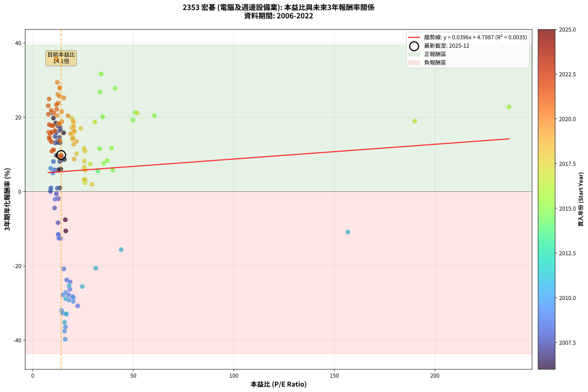
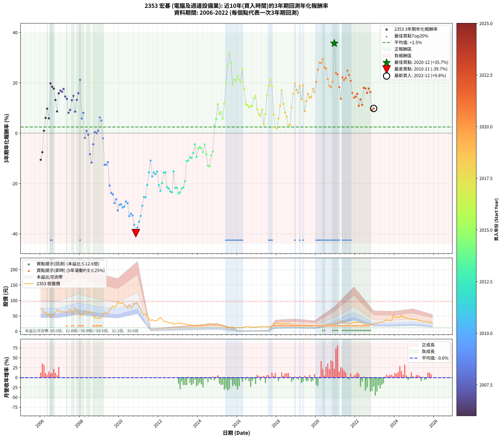

# 2353 宏碁 - 本益比與未來報酬率分析

!!! info "報告資訊"
    - **股票代號**: 2353
    - **公司名稱**: 宏碁
    - **產業別**: 電腦及週邊設備業
    - **分析期間**: 2006-2022 (204 個數據點)
    - **資料來源**: Type 12 (ShowMonthlyK_ChartFlow) 月收盤價與本益比
    - **報酬率口徑**: 含現金股利 (簡化: 年度合計，假設每年7/1入帳)
    - **報告生成時間**: 2026-01-22 22:26:50 CST

## 📈 視覺化圖表

### 圖表1: 本益比 vs 未來報酬率關係

*圖表1：2353 宏碁 本益比與3年期未來報酬率關係 (2006-2022)*

### 圖表2: 歷年買入時點的3年期實際報酬率

*圖表2：2353 宏碁 歷年買入時點的3年期實際報酬率 (2006-2022)*

## 📍 買點訊號說明

本報告提供兩種買點提示訊號（顯示於圖表2的股價子圖中）：

### ▲ 小綠色三角形（回測驗證）
- **計算方式**: 使用全部歷史資料計算本益比第25百分位數
- **用途**: 事後驗證，顯示歷史上哪些時點確實為低估區
- **限制**: 當下無法判斷，僅供回測參考
- **特性**: 後見之明（Look-Ahead Bias）

### ▲ 小橘色三角形（即時訊號）
- **計算方式**: 使用截至當月的過去5年資料計算本益比第25百分位數
- **用途**: 實際投資決策，當時即可判斷
- **優勢**: 可操作性強，符合實務需求
- **特性**: 無後見之明，滾動窗口計算

!!! tip "如何使用兩種訊號"
    - **綠色▲** 幫助理解歷史估值機會，驗證策略有效性
    - **橘色▲** 可作為實際買進參考，但仍需搭配基本面分析
    - 兩種訊號重疊時，表示即時判斷與事後驗證一致，信心度較高
    - 僅有綠色▲時，表示當時無法判斷（需要未來資料才能確認）
    - 僅有橘色▲時，表示即時判斷為買點，但事後可能不是最佳時機

## 📊 估值分析摘要

| 指標 | 數值 |
|:---:|:---:|
| **目前本益比** (2022-12) | **14.10 倍** |
| **歷史平均本益比** | 21.66 倍 |
| **估值水準** | 🟢 相對低估 |
| **預期3年年化報酬率** | **+5.36%** |
| **歷史平均報酬率** | +2.45% |
| **相關係數 (R²)** | 0.0035 |
| **趨勢線斜率** | 0.0396 |

!!! abstract "核心洞察"
    目前本益比顯著低於歷史平均，預期未來報酬率可能較高

    根據歷史數據回測，2353 宏碁 在目前本益比 **14.1倍** 的估值水準下，
    預期未來3年年化報酬率約為 **+5.4%**。

    **重要提醒**: 本分析基於歷史數據統計，實際報酬率會受到公司基本面變化、產業趨勢、
    總體經濟環境等多重因素影響。R² = 0.00 表示本益比可解釋約 0.4% 的報酬率變異。

## 📈 歷史估值統計

### 最佳買點 (最高報酬率)

| 項目 | 數值 |
|:---:|:---:|
| 起始時間 | 2020-12 |
| 當時本益比 | 11.77 倍 |
| 起始價格 | 23.6 元 |
| 3年後價格 | 53.8 元 |
| **3年年化報酬率** | **+35.71%** |

### 最差買點 (最低報酬率)

| 項目 | 數值 |
|:---:|:---:|
| 起始時間 | 2010-11 |
| 當時本益比 | 16.09 倍 |
| 起始價格 | 90.0 元 |
| 3年後價格 | 16.1 元 |
| **3年年化報酬率** | **-39.72%** |

## 🎯 投資啟示

### 本益比與報酬率關係

趨勢線方程式: **y = 0.0396x + 4.7987**

!!! info "弱相關或正相關"
    本益比與未來報酬率相關性較弱。這可能表示該股票的報酬率更多受到
    公司成長性、產業趨勢等因素影響，而非估值水準。**需綜合考量多項指標**。

### 估值區間建議

基於歷史數據分析:

- **🟢 低估區** (P/E < 17.3): 預期報酬率較高，可考慮增加持股
- **🟡 合理區** (P/E 17.3-26.0): 預期報酬率符合長期趨勢，正常持有
- **🔴 高估區** (P/E > 26.0): 預期報酬率較低，可考慮減碼或觀望

!!! danger "風險提示"
    - 過去表現不代表未來結果
    - 本分析假設公司基本面無重大結構性變化
    - 產業環境劇變可能使歷史規律失效
    - 應結合公司財報、產業趨勢、總體經濟等多重因素綜合判斷

!!! success "長期投資觀點"
    歷史數據顯示，在合理或低估的估值水準買入並長期持有，
    往往能獲得較佳的投資報酬。**耐心等待好價格**是價值投資的核心原則。

## 📊 數據品質

- **資料來源**: GoodInfo.tw Type 12 (ShowMonthlyK_ChartFlow)
- **資料頻率**: 月度收盤價與本益比
- **回測期間**: 2006-2022
- **數據點數量**: 204 個 (每個點代表一次3年期回測)

### 計算方法說明

1. **3年期年化報酬率**:
   - 對每個歷史時點，計算其後3年的實際投資報酬率
   - 期末價值(不含股利): 期末價格
   - 期末價值(含現金股利): 期末價格 + 持有期間內的現金股利合計 (簡化: 年度合計，假設每年7/1入帳)
   - 公式: 年化報酬率 = [(期末價值/期初價格)^(1/年數) - 1] × 100%

2. **本益比 (P/E Ratio)**:
   - 使用當時的月收盤價與EPS計算
   - 資料來源: Type 12 月度河流圖本益比數據

3. **趨勢線 (Linear Regression)**:
   - 使用最小平方法擬合線性趨勢線
   - R²值衡量本益比對報酬率的解釋能力

---

*本報告由 Stock Analysis System v1.9.0 自動生成*
*數據更新時間: 2026-01-22 22:26:50 CST*

## 📋 月度回測明細表

（每一列對應時間線圖中的一個買入點；可用來對照 SVG 圖上的每個點。）

| 買入月份 | 賣出月份 | 回測期限_年 | 實際持有年數 | 買入本益比_倍 | 買入收盤價_元 | 賣出收盤價_元 | 現金股利合計_元 | 總報酬率_pct | 年化報酬率_pct |
| --- | --- | --- | --- | --- | --- | --- | --- | --- | --- |
| 2006-01 | 2009-01 | 3 | 3.001 | 16.40 | 73.00 | 41.75 | 10.45 | -28.49 | -10.57 |
| 2006-02 | 2009-02 | 3 | 3.001 | 16.18 | 72.00 | 46.40 | 10.45 | -21.04 | -7.57 |
| 2006-03 | 2009-03 | 3 | 3.001 | 13.42 | 59.70 | 51.00 | 10.45 | +2.93 | +0.97 |
| 2006-04 | 2009-04 | 3 | 3.001 | 13.89 | 61.80 | 63.30 | 10.45 | +19.34 | +6.07 |
| 2006-05 | 2009-05 | 3 | 3.001 | 11.78 | 52.40 | 58.80 | 10.45 | +32.16 | +9.74 |
| 2006-06 | 2009-06 | 3 | 3.001 | 12.79 | 56.90 | 57.10 | 10.45 | +18.72 | +5.88 |
| 2006-07 | 2009-07 | 3 | 3.001 | 10.28 | 45.75 | 69.20 | 9.45 | +71.91 | +19.79 |
| 2006-08 | 2009-08 | 3 | 3.001 | 11.42 | 50.80 | 75.00 | 9.45 | +66.24 | +18.46 |
| 2006-09 | 2009-09 | 3 | 3.001 | 12.61 | 56.10 | 82.00 | 9.45 | +63.01 | +17.69 |
| 2006-10 | 2009-10 | 3 | 3.001 | 13.55 | 60.30 | 78.00 | 9.45 | +45.02 | +13.19 |
| 2006-11 | 2009-11 | 3 | 3.001 | 15.69 | 69.80 | 80.10 | 9.45 | +28.30 | +8.66 |
| 2006-12 | 2009-12 | 3 | 3.001 | 15.28 | 68.00 | 96.20 | 9.45 | +55.37 | +15.82 |
| 2007-01 | 2010-01 | 3 | 3.001 | 13.67 | 62.00 | 89.70 | 9.45 | +59.92 | +16.94 |
| 2007-02 | 2010-02 | 3 | 3.001 | 13.63 | 63.00 | 90.00 | 9.45 | +57.86 | +16.43 |
| 2007-03 | 2010-03 | 3 | 3.001 | 13.49 | 63.50 | 93.80 | 9.45 | +62.60 | +17.59 |
| 2007-04 | 2010-04 | 3 | 3.001 | 13.27 | 63.60 | 86.20 | 9.45 | +50.39 | +14.57 |
| 2007-05 | 2010-05 | 3 | 3.001 | 12.50 | 61.00 | 80.10 | 9.45 | +46.80 | +13.65 |
| 2007-06 | 2010-06 | 3 | 3.001 | 13.49 | 67.00 | 75.20 | 9.45 | +26.34 | +8.10 |
| 2007-07 | 2010-07 | 3 | 3.001 | 14.35 | 72.50 | 85.80 | 8.70 | +30.34 | +9.23 |
| 2007-08 | 2010-08 | 3 | 3.001 | 11.27 | 57.90 | 75.10 | 8.70 | +44.73 | +13.11 |
| 2007-09 | 2010-09 | 3 | 3.001 | 11.14 | 58.20 | 79.40 | 8.70 | +51.37 | +14.82 |
| 2007-10 | 2010-10 | 3 | 3.001 | 14.37 | 76.30 | 88.90 | 8.70 | +27.92 | +8.55 |
| 2007-11 | 2010-11 | 3 | 3.001 | 12.61 | 68.00 | 90.00 | 8.70 | +45.15 | +13.22 |
| 2007-12 | 2010-12 | 3 | 3.001 | 11.59 | 63.50 | 90.10 | 8.70 | +55.59 | +15.87 |
| 2008-01 | 2011-01 | 3 | 3.001 | 9.13 | 49.45 | 79.30 | 8.70 | +77.96 | +21.18 |
| 2008-02 | 2011-03 | 3 | 3.080 | 10.78 | 57.70 | 60.00 | 8.70 | +19.06 | +5.83 |
| 2008-03 | 2011-03 | 3 | 2.998 | 10.28 | 54.40 | 60.00 | 8.70 | +26.29 | +8.10 |
| 2008-04 | 2011-04 | 3 | 2.998 | 12.63 | 66.00 | 53.60 | 8.70 | -5.61 | -1.91 |
| 2008-05 | 2011-05 | 3 | 2.998 | 12.22 | 63.10 | 56.10 | 8.70 | +2.69 | +0.89 |
| 2008-06 | 2011-06 | 3 | 2.998 | 11.73 | 59.80 | 50.00 | 8.70 | -1.84 | -0.62 |
| 2008-07 | 2011-07 | 3 | 2.998 | 12.57 | 63.30 | 39.95 | 8.75 | -23.06 | -8.37 |
| 2008-08 | 2011-08 | 3 | 2.998 | 12.77 | 63.50 | 35.00 | 8.75 | -31.10 | -11.68 |
| 2008-09 | 2011-09 | 3 | 2.998 | 10.84 | 53.20 | 37.70 | 8.75 | -12.68 | -4.42 |
| 2008-10 | 2011-10 | 3 | 2.998 | 8.86 | 42.95 | 34.70 | 8.75 | +1.17 | +0.39 |
| 2008-11 | 2011-11 | 3 | 2.998 | 8.82 | 42.20 | 33.50 | 8.75 | +0.13 | +0.04 |
| 2008-12 | 2011-12 | 3 | 2.998 | 9.03 | 42.60 | 35.10 | 8.75 | +2.94 | +0.97 |
| 2009-01 | 2012-01 | 3 | 2.998 | 8.91 | 41.75 | 41.35 | 8.75 | +20.01 | +6.27 |
| 2009-02 | 2012-02 | 3 | 2.998 | 9.97 | 46.40 | 45.00 | 8.75 | +15.85 | +5.03 |
| 2009-03 | 2012-03 | 3 | 3.001 | 11.04 | 51.00 | 39.15 | 8.75 | -6.07 | -2.07 |
| 2009-04 | 2012-04 | 3 | 3.001 | 13.81 | 63.30 | 33.50 | 8.75 | -33.25 | -12.60 |
| 2009-05 | 2012-05 | 3 | 3.001 | 12.93 | 58.80 | 30.55 | 8.75 | -33.16 | -12.56 |
| 2009-06 | 2012-06 | 3 | 3.001 | 12.65 | 57.10 | 30.80 | 8.75 | -30.73 | -11.52 |
| 2009-07 | 2012-07 | 3 | 3.001 | 15.44 | 69.20 | 27.60 | 6.75 | -50.36 | -20.81 |
| 2009-08 | 2012-08 | 3 | 3.001 | 16.87 | 75.00 | 26.45 | 6.75 | -55.73 | -23.78 |
| 2009-09 | 2012-09 | 3 | 3.001 | 18.58 | 82.00 | 28.80 | 6.75 | -56.64 | -24.31 |
| 2009-10 | 2012-10 | 3 | 3.001 | 17.81 | 78.00 | 22.60 | 6.75 | -62.37 | -27.80 |
| 2009-11 | 2012-11 | 3 | 3.001 | 18.44 | 80.10 | 25.30 | 6.75 | -59.98 | -26.30 |
| 2009-12 | 2012-12 | 3 | 3.001 | 22.32 | 96.20 | 25.20 | 6.75 | -66.78 | -30.74 |
| 2010-01 | 2013-01 | 3 | 3.001 | 20.26 | 89.70 | 26.05 | 6.75 | -63.43 | -28.48 |
| 2010-02 | 2013-02 | 3 | 3.001 | 19.81 | 90.00 | 26.45 | 6.75 | -63.11 | -28.27 |
| 2010-03 | 2013-03 | 3 | 3.001 | 20.13 | 93.80 | 26.05 | 6.75 | -65.03 | -29.54 |
| 2010-04 | 2013-04 | 3 | 3.001 | 18.05 | 86.20 | 23.85 | 6.75 | -64.50 | -29.19 |
| 2010-05 | 2013-05 | 3 | 3.001 | 16.37 | 80.10 | 24.20 | 6.75 | -61.36 | -27.16 |
| 2010-06 | 2013-06 | 3 | 3.001 | 15.01 | 75.20 | 21.50 | 6.75 | -62.43 | -27.84 |
| 2010-07 | 2013-07 | 3 | 3.001 | 16.74 | 85.80 | 22.15 | 3.65 | -69.93 | -33.00 |
| 2010-08 | 2013-08 | 3 | 3.001 | 14.32 | 75.10 | 19.95 | 3.65 | -68.57 | -32.00 |
| 2010-09 | 2013-09 | 3 | 3.001 | 14.81 | 79.40 | 20.55 | 3.65 | -69.52 | -32.69 |
| 2010-10 | 2013-10 | 3 | 3.001 | 16.23 | 88.90 | 19.20 | 3.65 | -74.29 | -36.41 |
| 2010-11 | 2013-11 | 3 | 3.001 | 16.09 | 90.00 | 16.05 | 3.65 | -78.11 | -39.72 |
| 2010-12 | 2013-12 | 3 | 3.001 | 15.78 | 90.10 | 18.30 | 3.65 | -75.63 | -37.53 |
| 2011-01 | 2014-01 | 3 | 3.001 | 15.78 | 79.30 | 17.95 | 3.65 | -72.76 | -35.17 |
| 2011-02 | 2014-02 | 3 | 3.001 | 16.55 | 71.80 | 18.05 | 3.65 | -69.77 | -32.88 |
| 2011-03 | 2014-03 | 3 | 3.001 | 16.43 | 60.00 | 17.95 | 3.65 | -63.99 | -28.85 |
| 2011-04 | 2014-04 | 3 | 3.001 | 18.07 | 53.60 | 18.65 | 3.65 | -58.39 | -25.34 |
| 2011-05 | 2014-05 | 3 | 3.001 | 24.60 | 56.10 | 19.50 | 3.65 | -58.73 | -25.54 |
| 2011-06 | 2014-06 | 3 | 3.001 | 31.35 | 50.00 | 21.35 | 3.65 | -49.99 | -20.62 |
| 2011-07 | 2014-07 | 3 | 3.001 | 43.94 | 39.95 | 24.00 | 0.00 | -39.92 | -15.62 |
| 2011-08 | 2014-08 | 3 | 3.001 | 156.70 | 35.00 | 24.75 | 0.00 | -29.29 | -10.91 |
| 2011-09 | 2014-09 | 3 | 3.001 |  | 37.70 | 21.40 | 0.00 | -43.24 | -17.20 |
| 2011-10 | 2014-10 | 3 | 3.001 |  | 34.70 | 20.85 | 0.00 | -39.91 | -15.61 |
| 2011-11 | 2014-11 | 3 | 3.001 |  | 33.50 | 19.65 | 0.00 | -41.34 | -16.29 |
| 2011-12 | 2014-12 | 3 | 3.001 |  | 35.10 | 21.35 | 0.00 | -39.17 | -15.27 |
| 2012-01 | 2015-01 | 3 | 3.001 |  | 41.35 | 20.65 | 0.00 | -50.06 | -20.66 |
| 2012-02 | 2015-03 | 3 | 3.080 |  | 45.00 | 20.20 | 0.00 | -55.11 | -22.90 |
| 2012-03 | 2015-03 | 3 | 2.998 |  | 39.15 | 20.20 | 0.00 | -48.40 | -19.81 |
| 2012-04 | 2015-04 | 3 | 2.998 |  | 33.50 | 20.10 | 0.00 | -40.00 | -15.67 |
| 2012-05 | 2015-05 | 3 | 2.998 |  | 30.55 | 18.35 | 0.00 | -39.93 | -15.64 |
| 2012-06 | 2015-06 | 3 | 2.998 |  | 30.80 | 14.95 | 0.00 | -51.46 | -21.42 |
| 2012-07 | 2015-07 | 3 | 2.998 |  | 27.60 | 13.10 | 0.00 | -52.54 | -22.01 |
| 2012-08 | 2015-08 | 3 | 2.998 |  | 26.45 | 12.00 | 0.00 | -54.63 | -23.17 |
| 2012-09 | 2015-09 | 3 | 2.998 |  | 28.80 | 12.90 | 0.00 | -55.21 | -23.50 |
| 2012-10 | 2015-10 | 3 | 2.998 |  | 22.60 | 13.80 | 0.00 | -38.94 | -15.17 |
| 2012-11 | 2015-11 | 3 | 2.998 |  | 25.30 | 12.10 | 0.00 | -52.17 | -21.81 |
| 2012-12 | 2015-12 | 3 | 2.998 |  | 25.20 | 12.10 | 0.00 | -51.98 | -21.71 |
| 2013-01 | 2016-01 | 3 | 2.998 |  | 26.05 | 11.45 | 0.00 | -56.05 | -23.98 |
| 2013-02 | 2016-02 | 3 | 2.998 |  | 26.45 | 11.85 | 0.00 | -55.20 | -23.50 |
| 2013-03 | 2016-03 | 3 | 3.001 |  | 26.05 | 12.35 | 0.00 | -52.59 | -22.02 |
| 2013-04 | 2016-04 | 3 | 3.001 |  | 23.85 | 11.50 | 0.00 | -51.78 | -21.58 |
| 2013-05 | 2016-05 | 3 | 3.001 |  | 24.20 | 12.80 | 0.00 | -47.11 | -19.12 |
| 2013-06 | 2016-06 | 3 | 3.001 |  | 21.50 | 15.10 | 0.00 | -29.77 | -11.11 |
| 2013-07 | 2016-07 | 3 | 3.001 |  | 22.15 | 15.20 | 0.50 | -29.12 | -10.84 |
| 2013-08 | 2016-08 | 3 | 3.001 |  | 19.95 | 14.25 | 0.50 | -26.07 | -9.57 |
| 2013-09 | 2016-09 | 3 | 3.001 |  | 20.55 | 14.55 | 0.50 | -26.76 | -9.86 |
| 2013-10 | 2016-10 | 3 | 3.001 |  | 19.20 | 14.50 | 0.50 | -21.87 | -7.90 |
| 2013-11 | 2016-11 | 3 | 3.001 |  | 16.05 | 13.50 | 0.50 | -12.77 | -4.45 |
| 2013-12 | 2016-12 | 3 | 3.001 |  | 18.30 | 13.10 | 0.50 | -25.68 | -9.42 |
| 2014-01 | 2017-01 | 3 | 3.001 |  | 17.95 | 14.40 | 0.50 | -16.99 | -6.02 |
| 2014-02 | 2017-02 | 3 | 3.001 |  | 18.05 | 14.75 | 0.50 | -15.51 | -5.46 |
| 2014-03 | 2017-03 | 3 | 3.001 |  | 17.95 | 14.40 | 0.50 | -16.99 | -6.02 |
| 2014-04 | 2017-04 | 3 | 3.001 |  | 18.65 | 14.25 | 0.50 | -20.91 | -7.52 |
| 2014-05 | 2017-05 | 3 | 3.001 |  | 19.50 | 16.50 | 0.50 | -12.82 | -4.47 |
| 2014-06 | 2017-06 | 3 | 3.001 |  | 21.35 | 15.95 | 0.50 | -22.95 | -8.32 |
| 2014-07 | 2017-07 | 3 | 3.001 |  | 24.00 | 14.85 | 1.00 | -33.96 | -12.91 |
| 2014-08 | 2017-08 | 3 | 3.001 |  | 24.75 | 15.20 | 1.00 | -34.55 | -13.17 |
| 2014-09 | 2017-09 | 3 | 3.001 |  | 21.40 | 15.20 | 1.00 | -24.30 | -8.86 |
| 2014-10 | 2017-10 | 3 | 3.001 |  | 20.85 | 15.60 | 1.00 | -20.38 | -7.32 |
| 2014-11 | 2017-11 | 3 | 3.001 |  | 19.65 | 20.50 | 1.00 | +9.41 | +3.04 |
| 2014-12 | 2017-12 | 3 | 3.001 | 32.35 | 21.35 | 24.15 | 1.00 | +17.80 | +5.61 |
| 2015-01 | 2018-01 | 3 | 3.001 | 33.22 | 20.65 | 27.65 | 1.00 | +38.74 | +11.53 |
| 2015-02 | 2018-02 | 3 | 3.001 | 35.23 | 20.55 | 24.60 | 1.00 | +24.57 | +7.60 |
| 2015-03 | 2018-03 | 3 | 3.001 | 37.06 | 20.20 | 24.70 | 1.00 | +27.23 | +8.36 |
| 2015-04 | 2018-04 | 3 | 3.001 | 39.67 | 20.10 | 22.80 | 1.00 | +18.41 | +5.79 |
| 2015-05 | 2018-05 | 3 | 3.001 | 39.18 | 18.35 | 24.55 | 1.00 | +39.24 | +11.66 |
| 2015-06 | 2018-06 | 3 | 3.001 | 34.77 | 14.95 | 24.90 | 1.00 | +73.24 | +20.10 |
| 2015-07 | 2018-07 | 3 | 3.001 | 33.45 | 13.10 | 25.00 | 1.70 | +103.82 | +26.78 |
| 2015-08 | 2018-08 | 3 | 3.001 | 33.96 | 12.00 | 25.70 | 1.70 | +128.33 | +31.67 |
| 2015-09 | 2018-09 | 3 | 3.001 | 40.95 | 12.90 | 25.25 | 1.70 | +108.91 | +27.83 |
| 2015-10 | 2018-10 | 3 | 3.001 | 49.88 | 13.80 | 21.70 | 1.70 | +69.57 | +19.24 |
| 2015-11 | 2018-11 | 3 | 3.001 | 50.77 | 12.10 | 19.90 | 1.70 | +78.51 | +21.30 |
| 2015-12 | 2018-12 | 3 | 3.001 | 60.50 | 12.10 | 19.45 | 1.70 | +74.79 | +20.45 |
| 2016-01 | 2019-01 | 3 | 3.001 | 236.90 | 11.45 | 19.50 | 1.70 | +85.15 | +22.79 |
| 2016-02 | 2019-03 | 3 | 3.080 |  | 11.85 | 19.75 | 1.70 | +81.01 | +21.25 |
| 2016-03 | 2019-03 | 3 | 2.998 |  | 12.35 | 19.75 | 1.70 | +73.68 | +20.22 |
| 2016-04 | 2019-04 | 3 | 2.998 |  | 11.50 | 20.95 | 1.70 | +96.96 | +25.37 |
| 2016-05 | 2019-05 | 3 | 2.998 |  | 12.80 | 19.05 | 1.70 | +62.11 | +17.49 |
| 2016-06 | 2019-06 | 3 | 2.998 |  | 15.10 | 19.25 | 1.70 | +38.74 | +11.54 |
| 2016-07 | 2019-07 | 3 | 2.998 |  | 15.20 | 18.95 | 1.97 | +37.63 | +11.24 |
| 2016-08 | 2019-08 | 3 | 2.998 |  | 14.25 | 17.20 | 1.97 | +34.53 | +10.40 |
| 2016-09 | 2019-09 | 3 | 2.998 |  | 14.55 | 17.80 | 1.97 | +35.88 | +10.77 |
| 2016-10 | 2019-10 | 3 | 2.998 |  | 14.50 | 17.80 | 1.97 | +36.34 | +10.89 |
| 2016-11 | 2019-11 | 3 | 2.998 |  | 13.50 | 17.95 | 1.97 | +47.56 | +13.86 |
| 2016-12 | 2019-12 | 3 | 2.998 |  | 13.10 | 17.85 | 1.97 | +51.30 | +14.81 |
| 2017-01 | 2020-01 | 3 | 2.998 |  | 14.40 | 16.90 | 1.97 | +31.04 | +9.44 |
| 2017-02 | 2020-02 | 3 | 2.998 |  | 14.75 | 16.35 | 1.97 | +24.20 | +7.50 |
| 2017-03 | 2020-03 | 3 | 3.001 |  | 14.40 | 15.60 | 1.97 | +22.01 | +6.86 |
| 2017-04 | 2020-04 | 3 | 3.001 |  | 14.25 | 16.65 | 1.97 | +30.67 | +9.32 |
| 2017-05 | 2020-05 | 3 | 3.001 |  | 16.50 | 16.35 | 1.97 | +11.03 | +3.55 |
| 2017-06 | 2020-06 | 3 | 3.001 |  | 15.95 | 17.90 | 1.97 | +24.58 | +7.60 |
| 2017-07 | 2020-07 | 3 | 3.001 |  | 14.85 | 20.30 | 2.25 | +51.83 | +14.93 |
| 2017-08 | 2020-08 | 3 | 3.001 | 190.00 | 15.20 | 23.35 | 2.25 | +68.40 | +18.97 |
| 2017-09 | 2020-09 | 3 | 3.001 | 51.97 | 15.20 | 24.80 | 2.25 | +77.94 | +21.17 |
| 2017-10 | 2020-10 | 3 | 3.001 | 30.89 | 15.60 | 23.85 | 2.25 | +67.29 | +18.71 |
| 2017-11 | 2020-11 | 3 | 3.001 | 28.57 | 20.50 | 23.15 | 2.25 | +23.89 | +7.40 |
| 2017-12 | 2020-12 | 3 | 3.001 | 25.97 | 24.15 | 23.65 | 2.25 | +7.23 | +2.35 |
| 2018-01 | 2021-01 | 3 | 3.001 | 29.52 | 27.65 | 27.05 | 2.25 | +5.96 | +1.95 |
| 2018-02 | 2021-02 | 3 | 3.001 | 26.08 | 24.60 | 26.85 | 2.25 | +18.28 | +5.75 |
| 2018-03 | 2021-03 | 3 | 3.001 | 26.00 | 24.70 | 31.45 | 2.25 | +36.43 | +10.91 |
| 2018-04 | 2021-04 | 3 | 3.001 | 23.83 | 22.80 | 34.30 | 2.25 | +60.29 | +17.03 |
| 2018-05 | 2021-05 | 3 | 3.001 | 25.48 | 24.55 | 31.90 | 2.25 | +39.09 | +11.62 |
| 2018-06 | 2021-06 | 3 | 3.001 | 25.67 | 24.90 | 29.30 | 2.25 | +26.69 | +8.20 |
| 2018-07 | 2021-07 | 3 | 3.001 | 25.60 | 25.00 | 27.20 | 3.05 | +20.99 | +6.56 |
| 2018-08 | 2021-08 | 3 | 3.001 | 26.14 | 25.70 | 25.20 | 3.05 | +9.91 | +3.20 |
| 2018-09 | 2021-09 | 3 | 3.001 | 25.51 | 25.25 | 24.75 | 3.05 | +10.09 | +3.25 |
| 2018-10 | 2021-10 | 3 | 3.001 | 21.77 | 21.70 | 26.00 | 3.05 | +33.86 | +10.21 |
| 2018-11 | 2021-11 | 3 | 3.001 | 19.83 | 19.90 | 27.70 | 3.05 | +54.51 | +15.60 |
| 2018-12 | 2021-12 | 3 | 3.001 | 19.26 | 19.45 | 30.45 | 3.05 | +72.22 | +19.86 |
| 2019-01 | 2022-01 | 3 | 3.001 | 19.53 | 19.50 | 28.35 | 3.05 | +61.01 | +17.20 |
| 2019-02 | 2022-02 | 3 | 3.001 | 20.62 | 20.35 | 28.80 | 3.05 | +56.50 | +16.10 |
| 2019-03 | 2022-03 | 3 | 3.001 | 20.26 | 19.75 | 29.95 | 3.05 | +67.07 | +18.65 |
| 2019-04 | 2022-04 | 3 | 3.001 | 21.75 | 20.95 | 27.60 | 3.05 | +46.29 | +13.52 |
| 2019-05 | 2022-05 | 3 | 3.001 | 20.02 | 19.05 | 29.10 | 3.05 | +68.75 | +19.05 |
| 2019-06 | 2022-06 | 3 | 3.001 | 20.48 | 19.25 | 21.70 | 3.05 | +28.56 | +8.73 |
| 2019-07 | 2022-07 | 3 | 3.001 | 20.41 | 18.95 | 22.60 | 4.56 | +43.31 | +12.74 |
| 2019-08 | 2022-08 | 3 | 3.001 | 18.76 | 17.20 | 22.00 | 4.56 | +54.40 | +15.58 |
| 2019-09 | 2022-09 | 3 | 3.001 | 19.67 | 17.80 | 21.90 | 4.56 | +48.63 | +14.12 |
| 2019-10 | 2022-10 | 3 | 3.001 | 19.93 | 17.80 | 22.10 | 4.56 | +49.76 | +14.41 |
| 2019-11 | 2022-11 | 3 | 3.001 | 20.36 | 17.95 | 24.60 | 4.56 | +62.43 | +17.55 |
| 2019-12 | 2022-12 | 3 | 3.001 | 20.52 | 17.85 | 23.55 | 4.56 | +57.46 | +16.34 |
| 2020-01 | 2023-01 | 3 | 3.001 | 17.51 | 16.90 | 24.95 | 4.56 | +74.60 | +20.41 |
| 2020-02 | 2023-03 | 3 | 3.080 | 15.42 | 16.35 | 28.15 | 4.56 | +100.04 | +25.25 |
| 2020-03 | 2023-03 | 3 | 2.998 | 13.51 | 15.60 | 28.15 | 4.56 | +109.66 | +28.01 |
| 2020-04 | 2023-04 | 3 | 2.998 | 13.32 | 16.65 | 30.25 | 4.56 | +109.05 | +27.89 |
| 2020-05 | 2023-05 | 3 | 2.998 | 12.16 | 16.35 | 30.85 | 4.56 | +116.56 | +29.40 |
| 2020-06 | 2023-06 | 3 | 2.998 | 12.43 | 17.90 | 31.35 | 4.56 | +100.60 | +26.14 |
| 2020-07 | 2023-07 | 3 | 2.998 | 13.22 | 20.30 | 35.00 | 5.28 | +98.42 | +25.68 |
| 2020-08 | 2023-08 | 3 | 2.998 | 14.33 | 23.35 | 36.60 | 5.28 | +79.36 | +21.52 |
| 2020-09 | 2023-09 | 3 | 2.998 | 14.38 | 24.80 | 36.30 | 5.28 | +67.66 | +18.81 |
| 2020-10 | 2023-10 | 3 | 2.998 | 13.10 | 23.85 | 34.10 | 5.28 | +65.12 | +18.21 |
| 2020-11 | 2023-11 | 3 | 2.998 | 12.09 | 23.15 | 35.20 | 5.28 | +74.86 | +20.49 |
| 2020-12 | 2023-12 | 3 | 2.998 | 11.77 | 23.65 | 53.80 | 5.28 | +149.81 | +35.71 |
| 2021-01 | 2024-01 | 3 | 2.998 | 12.61 | 27.05 | 46.05 | 5.28 | +89.76 | +23.82 |
| 2021-02 | 2024-02 | 3 | 2.998 | 11.78 | 26.85 | 45.15 | 5.28 | +87.82 | +23.40 |
| 2021-03 | 2024-03 | 3 | 3.001 | 13.02 | 31.45 | 46.80 | 5.28 | +65.60 | +18.30 |
| 2021-04 | 2024-04 | 3 | 3.001 | 13.45 | 34.30 | 45.15 | 5.28 | +47.03 | +13.71 |
| 2021-05 | 2024-05 | 3 | 3.001 | 11.88 | 31.90 | 52.90 | 5.28 | +82.38 | +22.17 |
| 2021-06 | 2024-06 | 3 | 3.001 | 10.39 | 29.30 | 46.85 | 5.28 | +77.92 | +21.17 |
| 2021-07 | 2024-07 | 3 | 3.001 | 9.20 | 27.20 | 43.85 | 5.38 | +80.99 | +21.86 |
| 2021-08 | 2024-08 | 3 | 3.001 | 8.16 | 25.20 | 43.75 | 5.38 | +94.96 | +24.92 |
| 2021-09 | 2024-09 | 3 | 3.001 | 7.67 | 24.75 | 40.80 | 5.38 | +86.59 | +23.10 |
| 2021-10 | 2024-10 | 3 | 3.001 | 7.74 | 26.00 | 40.45 | 5.38 | +76.27 | +20.79 |
| 2021-11 | 2024-11 | 3 | 3.001 | 7.93 | 27.70 | 37.85 | 5.38 | +56.06 | +15.99 |
| 2021-12 | 2024-12 | 3 | 3.001 | 8.39 | 30.45 | 39.80 | 5.38 | +48.37 | +14.05 |
| 2022-01 | 2025-01 | 3 | 3.001 | 8.18 | 28.35 | 37.20 | 5.38 | +50.19 | +14.52 |
| 2022-02 | 2025-02 | 3 | 3.001 | 8.72 | 28.80 | 39.15 | 5.38 | +54.62 | +15.63 |
| 2022-03 | 2025-03 | 3 | 3.001 | 9.54 | 29.95 | 35.45 | 5.38 | +36.33 | +10.88 |
| 2022-04 | 2025-04 | 3 | 3.001 | 9.27 | 27.60 | 34.90 | 5.38 | +45.94 | +13.43 |
| 2022-05 | 2025-05 | 3 | 3.001 | 10.34 | 29.10 | 34.70 | 5.38 | +37.73 | +11.26 |
| 2022-06 | 2025-06 | 3 | 3.001 | 8.19 | 21.70 | 30.30 | 5.38 | +64.42 | +18.02 |
| 2022-07 | 2025-07 | 3 | 3.001 | 9.09 | 22.60 | 32.15 | 4.80 | +63.50 | +17.80 |
| 2022-08 | 2025-08 | 3 | 3.001 | 9.47 | 22.00 | 29.55 | 4.80 | +56.14 | +16.01 |
| 2022-09 | 2025-09 | 3 | 3.001 | 10.14 | 21.90 | 30.95 | 4.80 | +63.24 | +17.74 |
| 2022-10 | 2025-10 | 3 | 3.001 | 11.07 | 22.10 | 30.05 | 4.80 | +57.69 | +16.39 |
| 2022-11 | 2025-11 | 3 | 3.001 | 13.42 | 24.60 | 27.25 | 4.80 | +30.28 | +9.22 |
| 2022-12 | 2025-12 | 3 | 3.001 | 14.10 | 23.55 | 26.40 | 4.80 | +32.48 | +9.83 |
