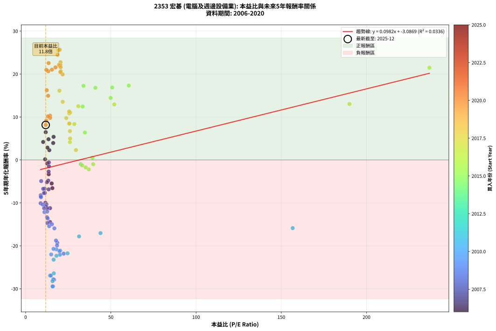
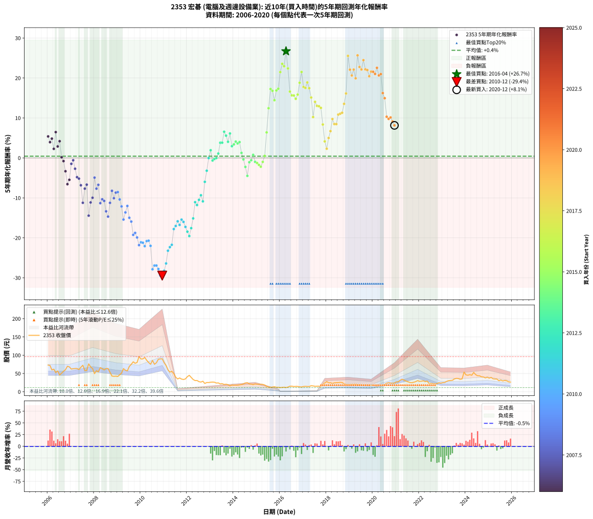

# 2353 宏碁 - 本益比與未來報酬率分析

!!! info "報告資訊"
    - **股票代號**: 2353
    - **公司名稱**: 宏碁
    - **產業別**: 電腦及週邊設備業
    - **分析期間**: 2006-2020 (180 個數據點)
    - **資料來源**: Type 12 (ShowMonthlyK_ChartFlow) 月收盤價與本益比
    - **報酬率口徑**: 含現金股利 (簡化: 年度合計，假設每年7/1入帳)
    - **報告生成時間**: 2026-01-06 00:30:55 CST

## 📈 視覺化圖表

### 圖表1: 本益比 vs 未來報酬率關係

*圖表1：2353 宏碁 本益比與5年期未來報酬率關係 (2006-2020)*

### 圖表2: 歷年買入時點的5年期實際報酬率

*圖表2：2353 宏碁 歷年買入時點的5年期實際報酬率 (2006-2020)*

## 📍 買點訊號說明

本報告提供兩種買點提示訊號（顯示於圖表2的股價子圖中）：

### ▲ 小綠色三角形（回測驗證）
- **計算方式**: 使用全部歷史資料計算本益比第25百分位數
- **用途**: 事後驗證，顯示歷史上哪些時點確實為低估區
- **限制**: 當下無法判斷，僅供回測參考
- **特性**: 後見之明（Look-Ahead Bias）

### ▲ 小橘色三角形（即時訊號）
- **計算方式**: 使用截至當月的過去5年資料計算本益比第25百分位數
- **用途**: 實際投資決策，當時即可判斷
- **優勢**: 可操作性強，符合實務需求
- **特性**: 無後見之明，滾動窗口計算

!!! tip "如何使用兩種訊號"
    - **綠色▲** 幫助理解歷史估值機會，驗證策略有效性
    - **橘色▲** 可作為實際買進參考，但仍需搭配基本面分析
    - 兩種訊號重疊時，表示即時判斷與事後驗證一致，信心度較高
    - 僅有綠色▲時，表示當時無法判斷（需要未來資料才能確認）
    - 僅有橘色▲時，表示即時判斷為買點，但事後可能不是最佳時機

## 📊 估值分析摘要

| 指標 | 數值 |
|:---:|:---:|
| **目前本益比** (2020-12) | **11.77 倍** |
| **歷史平均本益比** | 23.90 倍 |
| **估值水準** | 🟢 相對低估 |
| **預期5年年化報酬率** | **-1.93%** |
| **歷史平均報酬率** | +0.44% |
| **相關係數 (R²)** | 0.0336 |
| **趨勢線斜率** | 0.0982 |

!!! abstract "核心洞察"
    目前本益比顯著低於歷史平均，預期未來報酬率可能較高

    根據歷史數據回測，2353 宏碁 在目前本益比 **11.8倍** 的估值水準下，
    預期未來5年年化報酬率約為 **-1.9%**。

    **重要提醒**: 本分析基於歷史數據統計，實際報酬率會受到公司基本面變化、產業趨勢、
    總體經濟環境等多重因素影響。R² = 0.03 表示本益比可解釋約 3.4% 的報酬率變異。

## 📈 歷史估值統計

### 最佳買點 (最高報酬率)

| 項目 | 數值 |
|:---:|:---:|
| 起始時間 | 2016-04 |
| 當時本益比 | nan 倍 |
| 起始價格 | 11.5 元 |
| 5年後價格 | 34.3 元 |
| **5年年化報酬率** | **+26.70%** |

### 最差買點 (最低報酬率)

| 項目 | 數值 |
|:---:|:---:|
| 起始時間 | 2010-12 |
| 當時本益比 | 15.78 倍 |
| 起始價格 | 90.1 元 |
| 5年後價格 | 12.1 元 |
| **5年年化報酬率** | **-29.45%** |

## 🎯 投資啟示

### 本益比與報酬率關係

趨勢線方程式: **y = 0.0982x + -3.0869**

!!! info "弱相關或正相關"
    本益比與未來報酬率相關性較弱。這可能表示該股票的報酬率更多受到
    公司成長性、產業趨勢等因素影響，而非估值水準。**需綜合考量多項指標**。

### 估值區間建議

基於歷史數據分析:

- **🟢 低估區** (P/E < 19.1): 預期報酬率較高，可考慮增加持股
- **🟡 合理區** (P/E 19.1-28.7): 預期報酬率符合長期趨勢，正常持有
- **🔴 高估區** (P/E > 28.7): 預期報酬率較低，可考慮減碼或觀望

!!! danger "風險提示"
    - 過去表現不代表未來結果
    - 本分析假設公司基本面無重大結構性變化
    - 產業環境劇變可能使歷史規律失效
    - 應結合公司財報、產業趨勢、總體經濟等多重因素綜合判斷

!!! success "長期投資觀點"
    歷史數據顯示，在合理或低估的估值水準買入並長期持有，
    往往能獲得較佳的投資報酬。**耐心等待好價格**是價值投資的核心原則。

## 📊 數據品質

- **資料來源**: GoodInfo.tw Type 12 (ShowMonthlyK_ChartFlow)
- **資料頻率**: 月度收盤價與本益比
- **回測期間**: 2006-2020
- **數據點數量**: 180 個 (每個點代表一次5年期回測)

### 計算方法說明

1. **5年期年化報酬率**:
   - 對每個歷史時點，計算其後5年的實際投資報酬率
   - 期末價值(不含股利): 期末價格
   - 期末價值(含現金股利): 期末價格 + 持有期間內的現金股利合計 (簡化: 年度合計，假設每年7/1入帳)
   - 公式: 年化報酬率 = [(期末價值/期初價格)^(1/年數) - 1] × 100%

2. **本益比 (P/E Ratio)**:
   - 使用當時的月收盤價與EPS計算
   - 資料來源: Type 12 月度河流圖本益比數據

3. **趨勢線 (Linear Regression)**:
   - 使用最小平方法擬合線性趨勢線
   - R²值衡量本益比對報酬率的解釋能力

---

*本報告由 Stock Analysis System v1.9.0 自動生成*
*數據更新時間: 2026-01-06 00:30:55 CST*

## 📋 月度回測明細表

（每一列對應時間線圖中的一個買入點；可用來對照 SVG 圖上的每個點。）

| 買入月份 | 賣出月份 | 回測期限_年 | 實際持有年數 | 買入本益比_倍 | 買入收盤價_元 | 賣出收盤價_元 | 現金股利合計_元 | 總報酬率_pct | 年化報酬率_pct |
| --- | --- | --- | --- | --- | --- | --- | --- | --- | --- |
| 2006-01 | 2011-01 | 5 | 4.999 | 16.40 | 73.00 | 79.30 | 15.55 | +29.93 | +5.38 |
| 2006-02 | 2011-02 | 5 | 4.999 | 16.18 | 72.00 | 71.80 | 15.55 | +21.32 | +3.94 |
| 2006-03 | 2011-03 | 5 | 4.999 | 13.42 | 59.70 | 60.00 | 15.55 | +26.55 | +4.82 |
| 2006-04 | 2011-04 | 5 | 4.999 | 13.89 | 61.80 | 53.60 | 15.55 | +11.89 | +2.27 |
| 2006-05 | 2011-05 | 5 | 4.999 | 11.78 | 52.40 | 56.10 | 15.55 | +36.74 | +6.46 |
| 2006-06 | 2011-06 | 5 | 4.999 | 12.79 | 56.90 | 50.00 | 15.55 | +15.20 | +2.87 |
| 2006-07 | 2011-07 | 5 | 4.999 | 10.28 | 45.75 | 39.95 | 16.20 | +22.74 | +4.18 |
| 2006-08 | 2011-08 | 5 | 4.999 | 11.42 | 50.80 | 35.00 | 16.20 | +0.80 | +0.16 |
| 2006-09 | 2011-09 | 5 | 4.999 | 12.61 | 56.10 | 37.70 | 16.20 | -3.91 | -0.80 |
| 2006-10 | 2011-10 | 5 | 4.999 | 13.55 | 60.30 | 34.70 | 16.20 | -15.58 | -3.33 |
| 2006-11 | 2011-11 | 5 | 4.999 | 15.69 | 69.80 | 33.50 | 16.20 | -28.79 | -6.57 |
| 2006-12 | 2011-12 | 5 | 4.999 | 15.28 | 68.00 | 35.10 | 16.20 | -24.55 | -5.48 |
| 2007-01 | 2012-01 | 5 | 4.999 | 13.67 | 62.00 | 41.35 | 16.20 | -7.17 | -1.48 |
| 2007-02 | 2012-02 | 5 | 4.999 | 13.63 | 63.00 | 45.00 | 16.20 | -2.85 | -0.58 |
| 2007-03 | 2012-03 | 5 | 5.002 | 13.49 | 63.50 | 39.15 | 16.20 | -12.83 | -2.71 |
| 2007-04 | 2012-04 | 5 | 5.002 | 13.27 | 63.60 | 33.50 | 16.20 | -21.85 | -4.81 |
| 2007-05 | 2012-05 | 5 | 5.002 | 12.50 | 61.00 | 30.55 | 16.20 | -23.35 | -5.18 |
| 2007-06 | 2012-06 | 5 | 5.002 | 13.49 | 67.00 | 30.80 | 16.20 | -29.84 | -6.84 |
| 2007-07 | 2012-07 | 5 | 5.002 | 14.35 | 72.50 | 27.60 | 12.35 | -44.89 | -11.23 |
| 2007-08 | 2012-08 | 5 | 5.002 | 11.27 | 57.90 | 26.45 | 12.35 | -32.98 | -7.69 |
| 2007-09 | 2012-09 | 5 | 5.002 | 11.14 | 58.20 | 28.80 | 12.35 | -29.29 | -6.69 |
| 2007-10 | 2012-10 | 5 | 5.002 | 14.37 | 76.30 | 22.60 | 12.35 | -54.19 | -14.45 |
| 2007-11 | 2012-11 | 5 | 5.002 | 12.61 | 68.00 | 25.30 | 12.35 | -44.63 | -11.15 |
| 2007-12 | 2012-12 | 5 | 5.002 | 11.59 | 63.50 | 25.20 | 12.35 | -40.86 | -9.97 |
| 2008-01 | 2013-01 | 5 | 5.002 | 9.13 | 49.45 | 26.05 | 12.35 | -22.34 | -4.93 |
| 2008-02 | 2013-03 | 5 | 5.081 | 10.78 | 57.70 | 26.05 | 12.35 | -33.44 | -7.70 |
| 2008-03 | 2013-03 | 5 | 4.999 | 10.28 | 54.40 | 26.05 | 12.35 | -29.40 | -6.73 |
| 2008-04 | 2013-04 | 5 | 4.999 | 12.63 | 66.00 | 23.85 | 12.35 | -45.15 | -11.32 |
| 2008-05 | 2013-05 | 5 | 4.999 | 12.22 | 63.10 | 24.20 | 12.35 | -42.07 | -10.34 |
| 2008-06 | 2013-06 | 5 | 4.999 | 11.73 | 59.80 | 21.50 | 12.35 | -43.39 | -10.76 |
| 2008-07 | 2013-07 | 5 | 4.999 | 12.57 | 63.30 | 22.15 | 8.75 | -51.18 | -13.36 |
| 2008-08 | 2013-08 | 5 | 4.999 | 12.77 | 63.50 | 19.95 | 8.75 | -54.80 | -14.69 |
| 2008-09 | 2013-09 | 5 | 4.999 | 10.84 | 53.20 | 20.55 | 8.75 | -44.92 | -11.24 |
| 2008-10 | 2013-10 | 5 | 4.999 | 8.86 | 42.95 | 19.20 | 8.75 | -34.92 | -8.23 |
| 2008-11 | 2013-11 | 5 | 4.999 | 8.82 | 42.20 | 16.05 | 8.75 | -41.22 | -10.08 |
| 2008-12 | 2013-12 | 5 | 4.999 | 9.03 | 42.60 | 18.30 | 8.75 | -36.49 | -8.68 |
| 2009-01 | 2014-01 | 5 | 4.999 | 8.91 | 41.75 | 17.95 | 8.75 | -36.04 | -8.55 |
| 2009-02 | 2014-02 | 5 | 4.999 | 9.97 | 46.40 | 18.05 | 8.75 | -42.23 | -10.40 |
| 2009-03 | 2014-03 | 5 | 4.999 | 11.04 | 51.00 | 17.95 | 8.75 | -47.64 | -12.14 |
| 2009-04 | 2014-04 | 5 | 4.999 | 13.81 | 63.30 | 18.65 | 8.75 | -56.71 | -15.42 |
| 2009-05 | 2014-05 | 5 | 4.999 | 12.93 | 58.80 | 19.50 | 8.75 | -51.95 | -13.64 |
| 2009-06 | 2014-06 | 5 | 4.999 | 12.65 | 57.10 | 21.35 | 8.75 | -47.28 | -12.02 |
| 2009-07 | 2014-07 | 5 | 4.999 | 15.44 | 69.20 | 24.00 | 6.75 | -55.56 | -14.97 |
| 2009-08 | 2014-08 | 5 | 4.999 | 16.87 | 75.00 | 24.75 | 6.75 | -57.99 | -15.93 |
| 2009-09 | 2014-09 | 5 | 4.999 | 18.58 | 82.00 | 21.40 | 6.75 | -65.67 | -19.25 |
| 2009-10 | 2014-10 | 5 | 4.999 | 17.81 | 78.00 | 20.85 | 6.75 | -64.61 | -18.76 |
| 2009-11 | 2014-11 | 5 | 4.999 | 18.44 | 80.10 | 19.65 | 6.75 | -67.04 | -19.91 |
| 2009-12 | 2014-12 | 5 | 4.999 | 22.32 | 96.20 | 21.35 | 6.75 | -70.79 | -21.82 |
| 2010-01 | 2015-01 | 5 | 4.999 | 20.26 | 89.70 | 20.65 | 6.75 | -69.45 | -21.12 |
| 2010-02 | 2015-02 | 5 | 4.999 | 19.81 | 90.00 | 20.55 | 6.75 | -69.66 | -21.23 |
| 2010-03 | 2015-03 | 5 | 4.999 | 20.13 | 93.80 | 20.20 | 6.75 | -71.26 | -22.08 |
| 2010-04 | 2015-04 | 5 | 4.999 | 18.05 | 86.20 | 20.10 | 6.75 | -68.85 | -20.81 |
| 2010-05 | 2015-05 | 5 | 4.999 | 16.37 | 80.10 | 18.35 | 6.75 | -68.66 | -20.71 |
| 2010-06 | 2015-06 | 5 | 4.999 | 15.01 | 75.20 | 14.95 | 6.75 | -71.14 | -22.01 |
| 2010-07 | 2015-07 | 5 | 4.999 | 16.74 | 85.80 | 13.10 | 3.65 | -80.47 | -27.87 |
| 2010-08 | 2015-08 | 5 | 4.999 | 14.32 | 75.10 | 12.00 | 3.65 | -79.16 | -26.92 |
| 2010-09 | 2015-09 | 5 | 4.999 | 14.81 | 79.40 | 12.90 | 3.65 | -79.15 | -26.92 |
| 2010-10 | 2015-10 | 5 | 4.999 | 16.23 | 88.90 | 13.80 | 3.65 | -80.37 | -27.79 |
| 2010-11 | 2015-11 | 5 | 4.999 | 16.09 | 90.00 | 12.10 | 3.65 | -82.50 | -29.43 |
| 2010-12 | 2015-12 | 5 | 4.999 | 15.78 | 90.10 | 12.10 | 3.65 | -82.51 | -29.45 |
| 2011-01 | 2016-01 | 5 | 4.999 | 15.78 | 79.30 | 11.45 | 3.65 | -80.95 | -28.23 |
| 2011-02 | 2016-02 | 5 | 4.999 | 16.55 | 71.80 | 11.85 | 3.65 | -78.41 | -26.41 |
| 2011-03 | 2016-03 | 5 | 5.002 | 16.43 | 60.00 | 12.35 | 3.65 | -73.33 | -23.22 |
| 2011-04 | 2016-04 | 5 | 5.002 | 18.07 | 53.60 | 11.50 | 3.65 | -71.73 | -22.32 |
| 2011-05 | 2016-05 | 5 | 5.002 | 24.60 | 56.10 | 12.80 | 3.65 | -70.67 | -21.75 |
| 2011-06 | 2016-06 | 5 | 5.002 | 31.35 | 50.00 | 15.10 | 3.65 | -62.49 | -17.80 |
| 2011-07 | 2016-07 | 5 | 5.002 | 43.94 | 39.95 | 15.20 | 0.50 | -60.70 | -17.03 |
| 2011-08 | 2016-08 | 5 | 5.002 | 156.70 | 35.00 | 14.25 | 0.50 | -57.86 | -15.87 |
| 2011-09 | 2016-09 | 5 | 5.002 |  | 37.70 | 14.55 | 0.50 | -60.08 | -16.77 |
| 2011-10 | 2016-10 | 5 | 5.002 |  | 34.70 | 14.50 | 0.50 | -56.77 | -15.44 |
| 2011-11 | 2016-11 | 5 | 5.002 |  | 33.50 | 13.50 | 0.50 | -58.21 | -16.01 |
| 2011-12 | 2016-12 | 5 | 5.002 |  | 35.10 | 13.10 | 0.50 | -61.25 | -17.27 |
| 2012-01 | 2017-01 | 5 | 5.002 |  | 41.35 | 14.40 | 0.50 | -63.97 | -18.46 |
| 2012-02 | 2017-03 | 5 | 5.081 |  | 45.00 | 14.40 | 0.50 | -66.89 | -19.55 |
| 2012-03 | 2017-03 | 5 | 4.999 |  | 39.15 | 14.40 | 0.50 | -61.94 | -17.57 |
| 2012-04 | 2017-04 | 5 | 4.999 |  | 33.50 | 14.25 | 0.50 | -55.97 | -15.13 |
| 2012-05 | 2017-05 | 5 | 4.999 |  | 30.55 | 16.50 | 0.50 | -44.35 | -11.06 |
| 2012-06 | 2017-06 | 5 | 4.999 |  | 30.80 | 15.95 | 0.50 | -46.59 | -11.79 |
| 2012-07 | 2017-07 | 5 | 4.999 |  | 27.60 | 14.85 | 1.00 | -42.57 | -10.50 |
| 2012-08 | 2017-08 | 5 | 4.999 |  | 26.45 | 15.20 | 1.00 | -38.75 | -9.34 |
| 2012-09 | 2017-09 | 5 | 4.999 |  | 28.80 | 15.20 | 1.00 | -43.75 | -10.87 |
| 2012-10 | 2017-10 | 5 | 4.999 |  | 22.60 | 15.60 | 1.00 | -26.55 | -5.99 |
| 2012-11 | 2017-11 | 5 | 4.999 |  | 25.30 | 20.50 | 1.00 | -15.02 | -3.20 |
| 2012-12 | 2017-12 | 5 | 4.999 |  | 25.20 | 24.15 | 1.00 | -0.20 | -0.04 |
| 2013-01 | 2018-01 | 5 | 4.999 |  | 26.05 | 27.65 | 1.00 | +9.98 | +1.92 |
| 2013-02 | 2018-02 | 5 | 4.999 |  | 26.45 | 24.60 | 1.00 | -3.21 | -0.65 |
| 2013-03 | 2018-03 | 5 | 4.999 |  | 26.05 | 24.70 | 1.00 | -1.34 | -0.27 |
| 2013-04 | 2018-04 | 5 | 4.999 |  | 23.85 | 22.80 | 1.00 | -0.21 | -0.04 |
| 2013-05 | 2018-05 | 5 | 4.999 |  | 24.20 | 24.55 | 1.00 | +5.58 | +1.09 |
| 2013-06 | 2018-06 | 5 | 4.999 |  | 21.50 | 24.90 | 1.00 | +20.47 | +3.79 |
| 2013-07 | 2018-07 | 5 | 4.999 |  | 22.15 | 25.00 | 1.70 | +20.54 | +3.81 |
| 2013-08 | 2018-08 | 5 | 4.999 |  | 19.95 | 25.70 | 1.70 | +37.34 | +6.55 |
| 2013-09 | 2018-09 | 5 | 4.999 |  | 20.55 | 25.25 | 1.70 | +31.14 | +5.57 |
| 2013-10 | 2018-10 | 5 | 4.999 |  | 19.20 | 21.70 | 1.70 | +21.87 | +4.04 |
| 2013-11 | 2018-11 | 5 | 4.999 |  | 16.05 | 19.90 | 1.70 | +34.58 | +6.12 |
| 2013-12 | 2018-12 | 5 | 4.999 |  | 18.30 | 19.45 | 1.70 | +15.57 | +2.94 |
| 2014-01 | 2019-01 | 5 | 4.999 |  | 17.95 | 19.50 | 1.70 | +18.11 | +3.38 |
| 2014-02 | 2019-02 | 5 | 4.999 |  | 18.05 | 20.35 | 1.70 | +22.16 | +4.09 |
| 2014-03 | 2019-03 | 5 | 4.999 |  | 17.95 | 19.75 | 1.70 | +19.50 | +3.63 |
| 2014-04 | 2019-04 | 5 | 4.999 |  | 18.65 | 20.95 | 1.70 | +21.45 | +3.96 |
| 2014-05 | 2019-05 | 5 | 4.999 |  | 19.50 | 19.05 | 1.70 | +6.41 | +1.25 |
| 2014-06 | 2019-06 | 5 | 4.999 |  | 21.35 | 19.25 | 1.70 | -1.87 | -0.38 |
| 2014-07 | 2019-07 | 5 | 4.999 |  | 24.00 | 18.95 | 2.47 | -10.75 | -2.25 |
| 2014-08 | 2019-08 | 5 | 4.999 |  | 24.75 | 17.20 | 2.47 | -20.53 | -4.49 |
| 2014-09 | 2019-09 | 5 | 4.999 |  | 21.40 | 17.80 | 2.47 | -5.28 | -1.08 |
| 2014-10 | 2019-10 | 5 | 4.999 |  | 20.85 | 17.80 | 2.47 | -2.78 | -0.56 |
| 2014-11 | 2019-11 | 5 | 4.999 |  | 19.65 | 17.95 | 2.47 | +3.92 | +0.77 |
| 2014-12 | 2019-12 | 5 | 4.999 | 32.35 | 21.35 | 17.85 | 2.47 | -4.82 | -0.98 |
| 2015-01 | 2020-01 | 5 | 4.999 | 33.22 | 20.65 | 16.90 | 2.47 | -6.20 | -1.27 |
| 2015-02 | 2020-02 | 5 | 4.999 | 35.23 | 20.55 | 16.35 | 2.47 | -8.42 | -1.74 |
| 2015-03 | 2020-03 | 5 | 5.002 | 37.06 | 20.20 | 15.60 | 2.47 | -10.54 | -2.20 |
| 2015-04 | 2020-04 | 5 | 5.002 | 39.67 | 20.10 | 16.65 | 2.47 | -4.88 | -0.99 |
| 2015-05 | 2020-05 | 5 | 5.002 | 39.18 | 18.35 | 16.35 | 2.47 | +2.56 | +0.51 |
| 2015-06 | 2020-06 | 5 | 5.002 | 34.77 | 14.95 | 17.90 | 2.47 | +36.25 | +6.38 |
| 2015-07 | 2020-07 | 5 | 5.002 | 33.45 | 13.10 | 20.30 | 3.25 | +79.75 | +12.44 |
| 2015-08 | 2020-08 | 5 | 5.002 | 33.96 | 12.00 | 23.35 | 3.25 | +121.64 | +17.25 |
| 2015-09 | 2020-09 | 5 | 5.002 | 40.95 | 12.90 | 24.80 | 3.25 | +117.42 | +16.80 |
| 2015-10 | 2020-10 | 5 | 5.002 | 49.88 | 13.80 | 23.85 | 3.25 | +96.36 | +14.44 |
| 2015-11 | 2020-11 | 5 | 5.002 | 50.77 | 12.10 | 23.15 | 3.25 | +118.16 | +16.88 |
| 2015-12 | 2020-12 | 5 | 5.002 | 60.50 | 12.10 | 23.65 | 3.25 | +122.29 | +17.32 |
| 2016-01 | 2021-01 | 5 | 5.002 | 236.90 | 11.45 | 27.05 | 3.25 | +164.60 | +21.47 |
| 2016-02 | 2021-03 | 5 | 5.081 |  | 11.85 | 31.45 | 3.25 | +192.80 | +23.54 |
| 2016-03 | 2021-03 | 5 | 4.999 |  | 12.35 | 31.45 | 3.25 | +180.95 | +22.95 |
| 2016-04 | 2021-04 | 5 | 4.999 |  | 11.50 | 34.30 | 3.25 | +226.50 | +26.70 |
| 2016-05 | 2021-05 | 5 | 4.999 |  | 12.80 | 31.90 | 3.25 | +174.59 | +22.39 |
| 2016-06 | 2021-06 | 5 | 4.999 |  | 15.10 | 29.30 | 3.25 | +115.54 | +16.60 |
| 2016-07 | 2021-07 | 5 | 4.999 |  | 15.20 | 27.20 | 4.25 | +106.89 | +15.65 |
| 2016-08 | 2021-08 | 5 | 4.999 |  | 14.25 | 25.20 | 4.25 | +106.65 | +15.63 |
| 2016-09 | 2021-09 | 5 | 4.999 |  | 14.55 | 24.75 | 4.25 | +99.29 | +14.79 |
| 2016-10 | 2021-10 | 5 | 4.999 |  | 14.50 | 26.00 | 4.25 | +108.60 | +15.84 |
| 2016-11 | 2021-11 | 5 | 4.999 |  | 13.50 | 27.70 | 4.25 | +136.64 | +18.80 |
| 2016-12 | 2021-12 | 5 | 4.999 |  | 13.10 | 30.45 | 4.25 | +164.86 | +21.51 |
| 2017-01 | 2022-01 | 5 | 4.999 |  | 14.40 | 28.35 | 4.25 | +126.37 | +17.75 |
| 2017-02 | 2022-02 | 5 | 4.999 |  | 14.75 | 28.80 | 4.25 | +124.05 | +17.51 |
| 2017-03 | 2022-03 | 5 | 4.999 |  | 14.40 | 29.95 | 4.25 | +137.48 | +18.89 |
| 2017-04 | 2022-04 | 5 | 4.999 |  | 14.25 | 27.60 | 4.25 | +123.49 | +17.45 |
| 2017-05 | 2022-05 | 5 | 4.999 |  | 16.50 | 29.10 | 4.25 | +102.10 | +15.11 |
| 2017-06 | 2022-06 | 5 | 4.999 |  | 15.95 | 21.70 | 4.25 | +62.68 | +10.22 |
| 2017-07 | 2022-07 | 5 | 4.999 |  | 14.85 | 22.60 | 6.03 | +92.77 | +14.03 |
| 2017-08 | 2022-08 | 5 | 4.999 | 190.00 | 15.20 | 22.00 | 6.03 | +84.39 | +13.02 |
| 2017-09 | 2022-09 | 5 | 4.999 | 51.97 | 15.20 | 21.90 | 6.03 | +83.73 | +12.94 |
| 2017-10 | 2022-10 | 5 | 4.999 | 30.89 | 15.60 | 22.10 | 6.03 | +80.30 | +12.51 |
| 2017-11 | 2022-11 | 5 | 4.999 | 28.57 | 20.50 | 24.60 | 6.03 | +49.40 | +8.36 |
| 2017-12 | 2022-12 | 5 | 4.999 | 25.97 | 24.15 | 23.55 | 6.03 | +22.47 | +4.14 |
| 2018-01 | 2023-01 | 5 | 4.999 | 29.52 | 27.65 | 24.95 | 6.03 | +12.03 | +2.30 |
| 2018-02 | 2023-02 | 5 | 4.999 | 26.08 | 24.60 | 25.35 | 6.03 | +27.55 | +4.99 |
| 2018-03 | 2023-03 | 5 | 4.999 | 26.00 | 24.70 | 28.15 | 6.03 | +38.37 | +6.71 |
| 2018-04 | 2023-04 | 5 | 4.999 | 23.83 | 22.80 | 30.25 | 6.03 | +59.11 | +9.73 |
| 2018-05 | 2023-05 | 5 | 4.999 | 25.48 | 24.55 | 30.85 | 6.03 | +50.21 | +8.48 |
| 2018-06 | 2023-06 | 5 | 4.999 | 25.67 | 24.90 | 31.35 | 6.03 | +50.11 | +8.46 |
| 2018-07 | 2023-07 | 5 | 4.999 | 25.60 | 25.00 | 35.00 | 6.83 | +67.31 | +10.84 |
| 2018-08 | 2023-08 | 5 | 4.999 | 26.14 | 25.70 | 36.60 | 6.83 | +68.98 | +11.06 |
| 2018-09 | 2023-09 | 5 | 4.999 | 25.51 | 25.25 | 36.30 | 6.83 | +70.80 | +11.30 |
| 2018-10 | 2023-10 | 5 | 4.999 | 21.77 | 21.70 | 34.10 | 6.83 | +88.60 | +13.53 |
| 2018-11 | 2023-11 | 5 | 4.999 | 19.83 | 19.90 | 35.20 | 6.83 | +111.19 | +16.13 |
| 2018-12 | 2023-12 | 5 | 4.999 | 19.26 | 19.45 | 53.80 | 6.83 | +211.71 | +25.53 |
| 2019-01 | 2024-01 | 5 | 4.999 | 19.53 | 19.50 | 46.05 | 6.83 | +171.16 | +22.08 |
| 2019-02 | 2024-02 | 5 | 4.999 | 20.62 | 20.35 | 45.15 | 6.83 | +155.42 | +20.63 |
| 2019-03 | 2024-03 | 5 | 5.002 | 20.26 | 19.75 | 46.80 | 6.83 | +171.53 | +22.10 |
| 2019-04 | 2024-04 | 5 | 5.002 | 21.75 | 20.95 | 45.15 | 6.83 | +148.10 | +19.92 |
| 2019-05 | 2024-05 | 5 | 5.002 | 20.02 | 19.05 | 52.90 | 6.83 | +213.53 | +25.67 |
| 2019-06 | 2024-06 | 5 | 5.002 | 20.48 | 19.25 | 46.85 | 6.83 | +178.84 | +22.75 |
| 2019-07 | 2024-07 | 5 | 5.002 | 20.41 | 18.95 | 43.85 | 7.66 | +171.80 | +22.13 |
| 2019-08 | 2024-08 | 5 | 5.002 | 18.76 | 17.20 | 43.75 | 7.66 | +198.88 | +24.47 |
| 2019-09 | 2024-09 | 5 | 5.002 | 19.67 | 17.80 | 40.80 | 7.66 | +172.23 | +22.17 |
| 2019-10 | 2024-10 | 5 | 5.002 | 19.93 | 17.80 | 40.45 | 7.66 | +170.26 | +21.99 |
| 2019-11 | 2024-11 | 5 | 5.002 | 20.36 | 17.95 | 37.85 | 7.66 | +153.52 | +20.44 |
| 2019-12 | 2024-12 | 5 | 5.002 | 20.52 | 17.85 | 39.80 | 7.66 | +165.87 | +21.59 |
| 2020-01 | 2025-01 | 5 | 5.002 | 17.51 | 16.90 | 37.20 | 7.66 | +165.43 | +21.55 |
| 2020-02 | 2025-03 | 5 | 5.081 | 15.42 | 16.35 | 35.45 | 7.66 | +163.65 | +21.02 |
| 2020-03 | 2025-03 | 5 | 4.999 | 13.51 | 15.60 | 35.45 | 7.66 | +176.33 | +22.55 |
| 2020-04 | 2025-04 | 5 | 4.999 | 13.32 | 16.65 | 34.90 | 7.66 | +155.60 | +20.65 |
| 2020-05 | 2025-05 | 5 | 4.999 | 12.16 | 16.35 | 34.70 | 7.66 | +159.06 | +20.97 |
| 2020-06 | 2025-06 | 5 | 4.999 | 12.43 | 17.90 | 30.30 | 7.66 | +112.05 | +16.22 |
| 2020-07 | 2025-07 | 5 | 4.999 | 13.22 | 20.30 | 32.15 | 8.58 | +100.64 | +14.95 |
| 2020-08 | 2025-08 | 5 | 4.999 | 14.33 | 23.35 | 29.55 | 8.58 | +63.30 | +10.31 |
| 2020-09 | 2025-09 | 5 | 4.999 | 14.38 | 24.80 | 30.95 | 8.58 | +59.40 | +9.77 |
| 2020-10 | 2025-10 | 5 | 4.999 | 13.10 | 23.85 | 30.05 | 8.58 | +61.97 | +10.13 |
| 2020-11 | 2025-11 | 5 | 4.999 | 12.09 | 23.15 | 27.25 | 8.58 | +54.77 | +9.13 |
| 2020-12 | 2025-12 | 5 | 4.999 | 11.77 | 23.65 | 26.40 | 8.58 | +47.91 | +8.14 |
