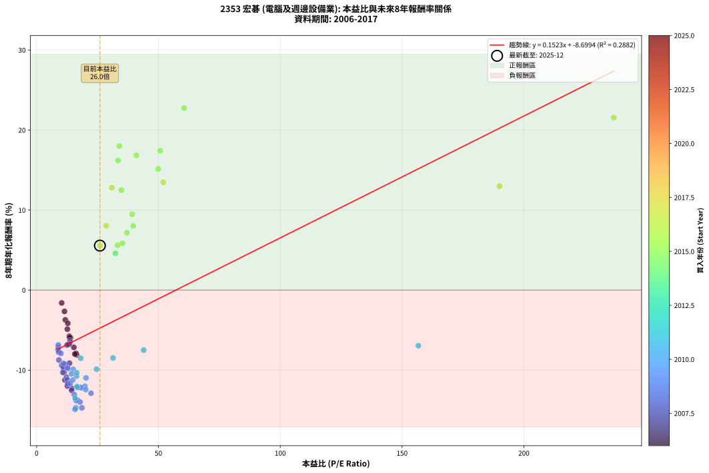
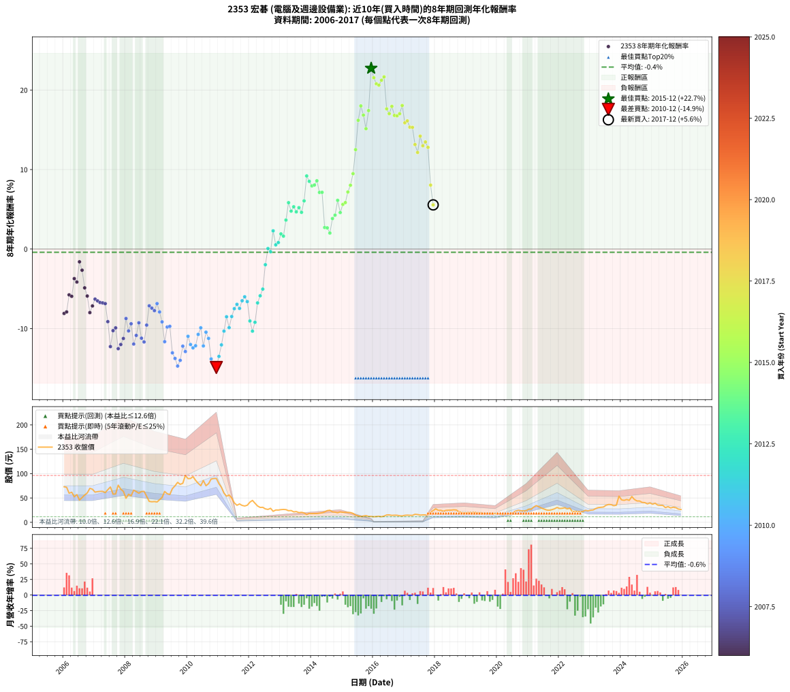

# 2353 宏碁 - 本益比與未來報酬率分析

!!! info "報告資訊"
    - **股票代號**: 2353
    - **公司名稱**: 宏碁
    - **產業別**: 電腦及週邊設備業
    - **分析期間**: 2006-2017 (144 個數據點)
    - **資料來源**: Type 12 (ShowMonthlyK_ChartFlow) 月收盤價與本益比
    - **報酬率口徑**: 含現金股利 (簡化: 年度合計，假設每年7/1入帳)
    - **報告生成時間**: 2026-01-06 18:28:09 CST

## 📈 視覺化圖表

### 圖表1: 本益比 vs 未來報酬率關係

*圖表1：2353 宏碁 本益比與8年期未來報酬率關係 (2006-2017)*

### 圖表2: 歷年買入時點的8年期實際報酬率

*圖表2：2353 宏碁 歷年買入時點的8年期實際報酬率 (2006-2017)*

## 📍 買點訊號說明

本報告提供兩種買點提示訊號（顯示於圖表2的股價子圖中）：

### ▲ 小綠色三角形（回測驗證）
- **計算方式**: 使用全部歷史資料計算本益比第25百分位數
- **用途**: 事後驗證，顯示歷史上哪些時點確實為低估區
- **限制**: 當下無法判斷，僅供回測參考
- **特性**: 後見之明（Look-Ahead Bias）

### ▲ 小橘色三角形（即時訊號）
- **計算方式**: 使用截至當月的過去5年資料計算本益比第25百分位數
- **用途**: 實際投資決策，當時即可判斷
- **優勢**: 可操作性強，符合實務需求
- **特性**: 無後見之明，滾動窗口計算

!!! tip "如何使用兩種訊號"
    - **綠色▲** 幫助理解歷史估值機會，驗證策略有效性
    - **橘色▲** 可作為實際買進參考，但仍需搭配基本面分析
    - 兩種訊號重疊時，表示即時判斷與事後驗證一致，信心度較高
    - 僅有綠色▲時，表示當時無法判斷（需要未來資料才能確認）
    - 僅有橘色▲時，表示即時判斷為買點，但事後可能不是最佳時機

## 📊 估值分析摘要

| 指標 | 數值 |
|:---:|:---:|
| **目前本益比** (2017-12) | **25.97 倍** |
| **歷史平均本益比** | 25.74 倍 |
| **估值水準** | 🟡 合理範圍 |
| **預期8年年化報酬率** | **-4.74%** |
| **歷史平均報酬率** | -0.40% |
| **相關係數 (R²)** | 0.2882 |
| **趨勢線斜率** | 0.1523 |

!!! abstract "核心洞察"
    目前本益比接近歷史平均，預期報酬率符合長期趨勢

    根據歷史數據回測，2353 宏碁 在目前本益比 **26.0倍** 的估值水準下，
    預期未來8年年化報酬率約為 **-4.7%**。

    **重要提醒**: 本分析基於歷史數據統計，實際報酬率會受到公司基本面變化、產業趨勢、
    總體經濟環境等多重因素影響。R² = 0.29 表示本益比可解釋約 28.8% 的報酬率變異。

## 📈 歷史估值統計

### 最佳買點 (最高報酬率)

| 項目 | 數值 |
|:---:|:---:|
| 起始時間 | 2015-12 |
| 當時本益比 | 60.50 倍 |
| 起始價格 | 12.1 元 |
| 8年後價格 | 53.8 元 |
| **8年年化報酬率** | **+22.74%** |

### 最差買點 (最低報酬率)

| 項目 | 數值 |
|:---:|:---:|
| 起始時間 | 2010-12 |
| 當時本益比 | 15.78 倍 |
| 起始價格 | 90.1 元 |
| 8年後價格 | 19.4 元 |
| **8年年化報酬率** | **-14.89%** |

## 🎯 投資啟示

### 本益比與報酬率關係

趨勢線方程式: **y = 0.1523x + -8.6994**

!!! info "弱相關或正相關"
    本益比與未來報酬率相關性較弱。這可能表示該股票的報酬率更多受到
    公司成長性、產業趨勢等因素影響，而非估值水準。**需綜合考量多項指標**。

### 估值區間建議

基於歷史數據分析:

- **🟢 低估區** (P/E < 20.6): 預期報酬率較高，可考慮增加持股
- **🟡 合理區** (P/E 20.6-30.9): 預期報酬率符合長期趨勢，正常持有
- **🔴 高估區** (P/E > 30.9): 預期報酬率較低，可考慮減碼或觀望

!!! danger "風險提示"
    - 過去表現不代表未來結果
    - 本分析假設公司基本面無重大結構性變化
    - 產業環境劇變可能使歷史規律失效
    - 應結合公司財報、產業趨勢、總體經濟等多重因素綜合判斷

!!! success "長期投資觀點"
    歷史數據顯示，在合理或低估的估值水準買入並長期持有，
    往往能獲得較佳的投資報酬。**耐心等待好價格**是價值投資的核心原則。

## 📊 數據品質

- **資料來源**: GoodInfo.tw Type 12 (ShowMonthlyK_ChartFlow)
- **資料頻率**: 月度收盤價與本益比
- **回測期間**: 2006-2017
- **數據點數量**: 144 個 (每個點代表一次8年期回測)

### 計算方法說明

1. **8年期年化報酬率**:
   - 對每個歷史時點，計算其後8年的實際投資報酬率
   - 期末價值(不含股利): 期末價格
   - 期末價值(含現金股利): 期末價格 + 持有期間內的現金股利合計 (簡化: 年度合計，假設每年7/1入帳)
   - 公式: 年化報酬率 = [(期末價值/期初價格)^(1/年數) - 1] × 100%

2. **本益比 (P/E Ratio)**:
   - 使用當時的月收盤價與EPS計算
   - 資料來源: Type 12 月度河流圖本益比數據

3. **趨勢線 (Linear Regression)**:
   - 使用最小平方法擬合線性趨勢線
   - R²值衡量本益比對報酬率的解釋能力

---

*本報告由 Stock Analysis System v1.9.0 自動生成*
*數據更新時間: 2026-01-06 18:28:09 CST*

## 📋 月度回測明細表

（每一列對應時間線圖中的一個買入點；可用來對照 SVG 圖上的每個點。）

| 買入月份 | 賣出月份 | 回測期限_年 | 實際持有年數 | 買入本益比_倍 | 買入收盤價_元 | 賣出收盤價_元 | 現金股利合計_元 | 總報酬率_pct | 年化報酬率_pct |
| --- | --- | --- | --- | --- | --- | --- | --- | --- | --- |
| 2006-01 | 2014-01 | 8 | 8.000 | 16.40 | 73.00 | 17.95 | 19.20 | -49.10 | -8.10 |
| 2006-02 | 2014-02 | 8 | 8.000 | 16.18 | 72.00 | 18.05 | 19.20 | -48.26 | -7.91 |
| 2006-03 | 2014-03 | 8 | 8.000 | 13.42 | 59.70 | 17.95 | 19.20 | -37.77 | -5.76 |
| 2006-04 | 2014-04 | 8 | 8.000 | 13.89 | 61.80 | 18.65 | 19.20 | -38.75 | -5.94 |
| 2006-05 | 2014-05 | 8 | 8.000 | 11.78 | 52.40 | 19.50 | 19.20 | -26.14 | -3.72 |
| 2006-06 | 2014-06 | 8 | 8.000 | 12.79 | 56.90 | 21.35 | 19.20 | -28.73 | -4.14 |
| 2006-07 | 2014-07 | 8 | 8.000 | 10.28 | 45.75 | 24.00 | 16.20 | -12.12 | -1.60 |
| 2006-08 | 2014-08 | 8 | 8.000 | 11.42 | 50.80 | 24.75 | 16.20 | -19.38 | -2.66 |
| 2006-09 | 2014-09 | 8 | 8.000 | 12.61 | 56.10 | 21.40 | 16.20 | -32.97 | -4.88 |
| 2006-10 | 2014-10 | 8 | 8.000 | 13.55 | 60.30 | 20.85 | 16.20 | -38.55 | -5.91 |
| 2006-11 | 2014-11 | 8 | 8.000 | 15.69 | 69.80 | 19.65 | 16.20 | -48.63 | -7.99 |
| 2006-12 | 2014-12 | 8 | 8.000 | 15.28 | 68.00 | 21.35 | 16.20 | -44.77 | -7.15 |
| 2007-01 | 2015-01 | 8 | 8.000 | 13.67 | 62.00 | 20.65 | 16.20 | -40.56 | -6.30 |
| 2007-02 | 2015-02 | 8 | 8.000 | 13.63 | 63.00 | 20.55 | 16.20 | -41.66 | -6.51 |
| 2007-03 | 2015-03 | 8 | 8.000 | 13.49 | 63.50 | 20.20 | 16.20 | -42.67 | -6.72 |
| 2007-04 | 2015-04 | 8 | 8.000 | 13.27 | 63.60 | 20.10 | 16.20 | -42.92 | -6.77 |
| 2007-05 | 2015-05 | 8 | 8.000 | 12.50 | 61.00 | 18.35 | 16.20 | -43.35 | -6.86 |
| 2007-06 | 2015-06 | 8 | 8.000 | 13.49 | 67.00 | 14.95 | 16.20 | -53.50 | -9.13 |
| 2007-07 | 2015-07 | 8 | 8.000 | 14.35 | 72.50 | 13.10 | 12.35 | -64.89 | -12.26 |
| 2007-08 | 2015-08 | 8 | 8.000 | 11.27 | 57.90 | 12.00 | 12.35 | -57.94 | -10.26 |
| 2007-09 | 2015-09 | 8 | 8.000 | 11.14 | 58.20 | 12.90 | 12.35 | -56.61 | -9.91 |
| 2007-10 | 2015-10 | 8 | 8.000 | 14.37 | 76.30 | 13.80 | 12.35 | -65.72 | -12.53 |
| 2007-11 | 2015-11 | 8 | 8.000 | 12.61 | 68.00 | 12.10 | 12.35 | -64.04 | -12.00 |
| 2007-12 | 2015-12 | 8 | 8.000 | 11.59 | 63.50 | 12.10 | 12.35 | -61.49 | -11.24 |
| 2008-01 | 2016-01 | 8 | 8.000 | 9.13 | 49.45 | 11.45 | 12.35 | -51.86 | -8.73 |
| 2008-02 | 2016-02 | 8 | 8.000 | 10.78 | 57.70 | 11.85 | 12.35 | -58.05 | -10.29 |
| 2008-03 | 2016-03 | 8 | 8.000 | 10.28 | 54.40 | 12.35 | 12.35 | -54.59 | -9.40 |
| 2008-04 | 2016-04 | 8 | 8.000 | 12.63 | 66.00 | 11.50 | 12.35 | -63.86 | -11.95 |
| 2008-05 | 2016-05 | 8 | 8.000 | 12.22 | 63.10 | 12.80 | 12.35 | -60.14 | -10.86 |
| 2008-06 | 2016-06 | 8 | 8.000 | 11.73 | 59.80 | 15.10 | 12.35 | -54.09 | -9.27 |
| 2008-07 | 2016-07 | 8 | 8.000 | 12.57 | 63.30 | 15.20 | 9.25 | -61.37 | -11.21 |
| 2008-08 | 2016-08 | 8 | 8.000 | 12.77 | 63.50 | 14.25 | 9.25 | -62.99 | -11.68 |
| 2008-09 | 2016-09 | 8 | 8.000 | 10.84 | 53.20 | 14.55 | 9.25 | -55.26 | -9.56 |
| 2008-10 | 2016-10 | 8 | 8.000 | 8.86 | 42.95 | 14.50 | 9.25 | -44.69 | -7.14 |
| 2008-11 | 2016-11 | 8 | 8.000 | 8.82 | 42.20 | 13.50 | 9.25 | -46.08 | -7.43 |
| 2008-12 | 2016-12 | 8 | 8.000 | 9.03 | 42.60 | 13.10 | 9.25 | -47.53 | -7.74 |
| 2009-01 | 2017-01 | 8 | 8.000 | 8.91 | 41.75 | 14.40 | 9.25 | -43.34 | -6.86 |
| 2009-02 | 2017-02 | 8 | 8.000 | 9.97 | 46.40 | 14.75 | 9.25 | -48.27 | -7.91 |
| 2009-03 | 2017-03 | 8 | 8.000 | 11.04 | 51.00 | 14.40 | 9.25 | -53.62 | -9.16 |
| 2009-04 | 2017-04 | 8 | 8.000 | 13.81 | 63.30 | 14.25 | 9.25 | -62.87 | -11.65 |
| 2009-05 | 2017-05 | 8 | 8.000 | 12.93 | 58.80 | 16.50 | 9.25 | -56.20 | -9.80 |
| 2009-06 | 2017-06 | 8 | 8.000 | 12.65 | 57.10 | 15.95 | 9.25 | -55.86 | -9.72 |
| 2009-07 | 2017-07 | 8 | 8.000 | 15.44 | 69.20 | 14.85 | 7.75 | -67.34 | -13.05 |
| 2009-08 | 2017-08 | 8 | 8.000 | 16.87 | 75.00 | 15.20 | 7.75 | -69.39 | -13.76 |
| 2009-09 | 2017-09 | 8 | 8.000 | 18.58 | 82.00 | 15.20 | 7.75 | -72.01 | -14.71 |
| 2009-10 | 2017-10 | 8 | 8.000 | 17.81 | 78.00 | 15.60 | 7.75 | -70.06 | -13.99 |
| 2009-11 | 2017-11 | 8 | 8.000 | 18.44 | 80.10 | 20.50 | 7.75 | -64.73 | -12.21 |
| 2009-12 | 2017-12 | 8 | 8.000 | 22.32 | 96.20 | 24.15 | 7.75 | -66.84 | -12.89 |
| 2010-01 | 2018-01 | 8 | 8.000 | 20.26 | 89.70 | 27.65 | 7.75 | -60.53 | -10.97 |
| 2010-02 | 2018-02 | 8 | 8.000 | 19.81 | 90.00 | 24.60 | 7.75 | -64.05 | -12.00 |
| 2010-03 | 2018-03 | 8 | 8.000 | 20.13 | 93.80 | 24.70 | 7.75 | -65.40 | -12.42 |
| 2010-04 | 2018-04 | 8 | 8.000 | 18.05 | 86.20 | 22.80 | 7.75 | -64.55 | -12.16 |
| 2010-05 | 2018-05 | 8 | 8.000 | 16.37 | 80.10 | 24.55 | 7.75 | -59.67 | -10.73 |
| 2010-06 | 2018-06 | 8 | 8.000 | 15.01 | 75.20 | 24.90 | 7.75 | -56.58 | -9.90 |
| 2010-07 | 2018-07 | 8 | 8.000 | 16.74 | 85.80 | 25.00 | 5.35 | -64.62 | -12.18 |
| 2010-08 | 2018-08 | 8 | 8.000 | 14.32 | 75.10 | 25.70 | 5.35 | -58.65 | -10.45 |
| 2010-09 | 2018-09 | 8 | 8.000 | 14.81 | 79.40 | 25.25 | 5.35 | -61.46 | -11.23 |
| 2010-10 | 2018-10 | 8 | 8.000 | 16.23 | 88.90 | 21.70 | 5.35 | -69.57 | -13.82 |
| 2010-11 | 2018-11 | 8 | 8.000 | 16.09 | 90.00 | 19.90 | 5.35 | -71.94 | -14.69 |
| 2010-12 | 2018-12 | 8 | 8.000 | 15.78 | 90.10 | 19.45 | 5.35 | -72.47 | -14.89 |
| 2011-01 | 2019-01 | 8 | 8.000 | 15.78 | 79.30 | 19.50 | 5.35 | -68.66 | -13.50 |
| 2011-02 | 2019-02 | 8 | 8.000 | 16.55 | 71.80 | 20.35 | 5.35 | -64.20 | -12.05 |
| 2011-03 | 2019-03 | 8 | 8.000 | 16.43 | 60.00 | 19.75 | 5.35 | -58.16 | -10.32 |
| 2011-04 | 2019-04 | 8 | 8.000 | 18.07 | 53.60 | 20.95 | 5.35 | -50.93 | -8.51 |
| 2011-05 | 2019-05 | 8 | 8.000 | 24.60 | 56.10 | 19.05 | 5.35 | -56.50 | -9.88 |
| 2011-06 | 2019-06 | 8 | 8.000 | 31.35 | 50.00 | 19.25 | 5.35 | -50.79 | -8.48 |
| 2011-07 | 2019-07 | 8 | 8.000 | 43.94 | 39.95 | 18.95 | 2.47 | -46.38 | -7.50 |
| 2011-08 | 2019-08 | 8 | 8.000 | 156.70 | 35.00 | 17.20 | 2.47 | -43.80 | -6.95 |
| 2011-09 | 2019-09 | 8 | 8.000 |  | 37.70 | 17.80 | 2.47 | -46.23 | -7.46 |
| 2011-10 | 2019-10 | 8 | 8.000 |  | 34.70 | 17.80 | 2.47 | -41.59 | -6.50 |
| 2011-11 | 2019-11 | 8 | 8.000 |  | 33.50 | 17.95 | 2.47 | -39.04 | -6.00 |
| 2011-12 | 2019-12 | 8 | 8.000 |  | 35.10 | 17.85 | 2.47 | -42.11 | -6.60 |
| 2012-01 | 2020-01 | 8 | 8.000 |  | 41.35 | 16.90 | 2.47 | -53.16 | -9.04 |
| 2012-02 | 2020-02 | 8 | 8.000 |  | 45.00 | 16.35 | 2.47 | -58.18 | -10.32 |
| 2012-03 | 2020-03 | 8 | 8.000 |  | 39.15 | 15.60 | 2.47 | -53.84 | -9.21 |
| 2012-04 | 2020-04 | 8 | 8.000 |  | 33.50 | 16.65 | 2.47 | -42.93 | -6.77 |
| 2012-05 | 2020-05 | 8 | 8.000 |  | 30.55 | 16.35 | 2.47 | -38.40 | -5.88 |
| 2012-06 | 2020-06 | 8 | 8.000 |  | 30.80 | 17.90 | 2.47 | -33.86 | -5.04 |
| 2012-07 | 2020-07 | 8 | 8.000 |  | 27.60 | 20.30 | 3.25 | -14.68 | -1.97 |
| 2012-08 | 2020-08 | 8 | 8.000 |  | 26.45 | 23.35 | 3.25 | +0.56 | +0.07 |
| 2012-09 | 2020-09 | 8 | 8.000 |  | 28.80 | 24.80 | 3.25 | -2.61 | -0.33 |
| 2012-10 | 2020-10 | 8 | 8.000 |  | 22.60 | 23.85 | 3.25 | +19.90 | +2.29 |
| 2012-11 | 2020-11 | 8 | 8.000 |  | 25.30 | 23.15 | 3.25 | +4.34 | +0.53 |
| 2012-12 | 2020-12 | 8 | 8.000 |  | 25.20 | 23.65 | 3.25 | +6.73 | +0.82 |
| 2013-01 | 2021-01 | 8 | 8.000 |  | 26.05 | 27.05 | 3.25 | +16.30 | +1.91 |
| 2013-02 | 2021-02 | 8 | 8.000 |  | 26.45 | 26.85 | 3.25 | +13.79 | +1.63 |
| 2013-03 | 2021-03 | 8 | 8.000 |  | 26.05 | 31.45 | 3.25 | +33.19 | +3.65 |
| 2013-04 | 2021-04 | 8 | 8.000 |  | 23.85 | 34.30 | 3.25 | +57.43 | +5.84 |
| 2013-05 | 2021-05 | 8 | 8.000 |  | 24.20 | 31.90 | 3.25 | +45.24 | +4.78 |
| 2013-06 | 2021-06 | 8 | 8.000 |  | 21.50 | 29.30 | 3.25 | +51.38 | +5.32 |
| 2013-07 | 2021-07 | 8 | 8.000 |  | 22.15 | 27.20 | 4.75 | +44.23 | +4.68 |
| 2013-08 | 2021-08 | 8 | 8.000 |  | 19.95 | 25.20 | 4.75 | +50.11 | +5.21 |
| 2013-09 | 2021-09 | 8 | 8.000 |  | 20.55 | 24.75 | 4.75 | +43.54 | +4.62 |
| 2013-10 | 2021-10 | 8 | 8.000 |  | 19.20 | 26.00 | 4.75 | +60.14 | +6.06 |
| 2013-11 | 2021-11 | 8 | 8.000 |  | 16.05 | 27.70 | 4.75 | +102.16 | +9.20 |
| 2013-12 | 2021-12 | 8 | 8.000 |  | 18.30 | 30.45 | 4.75 | +92.33 | +8.52 |
| 2014-01 | 2022-01 | 8 | 8.000 |  | 17.95 | 28.35 | 4.75 | +84.38 | +7.95 |
| 2014-02 | 2022-02 | 8 | 8.000 |  | 18.05 | 28.80 | 4.75 | +85.86 | +8.06 |
| 2014-03 | 2022-03 | 8 | 8.000 |  | 17.95 | 29.95 | 4.75 | +93.30 | +8.59 |
| 2014-04 | 2022-04 | 8 | 8.000 |  | 18.65 | 27.60 | 4.75 | +73.44 | +7.13 |
| 2014-05 | 2022-05 | 8 | 8.000 |  | 19.50 | 29.10 | 4.75 | +73.57 | +7.14 |
| 2014-06 | 2022-06 | 8 | 8.000 |  | 21.35 | 21.70 | 4.75 | +23.87 | +2.71 |
| 2014-07 | 2022-07 | 8 | 8.000 |  | 24.00 | 22.60 | 7.03 | +23.45 | +2.67 |
| 2014-08 | 2022-08 | 8 | 8.000 |  | 24.75 | 22.00 | 7.03 | +17.28 | +2.01 |
| 2014-09 | 2022-09 | 8 | 8.000 |  | 21.40 | 21.90 | 7.03 | +35.17 | +3.84 |
| 2014-10 | 2022-10 | 8 | 8.000 |  | 20.85 | 22.10 | 7.03 | +39.70 | +4.27 |
| 2014-11 | 2022-11 | 8 | 8.000 |  | 19.65 | 24.60 | 7.03 | +60.95 | +6.13 |
| 2014-12 | 2022-12 | 8 | 8.000 | 32.35 | 21.35 | 23.55 | 7.03 | +43.22 | +4.59 |
| 2015-01 | 2023-01 | 8 | 8.000 | 33.22 | 20.65 | 24.95 | 7.03 | +54.85 | +5.62 |
| 2015-02 | 2023-02 | 8 | 8.000 | 35.23 | 20.55 | 25.35 | 7.03 | +57.55 | +5.85 |
| 2015-03 | 2023-03 | 8 | 8.000 | 37.06 | 20.20 | 28.15 | 7.03 | +74.14 | +7.18 |
| 2015-04 | 2023-04 | 8 | 8.000 | 39.67 | 20.10 | 30.25 | 7.03 | +85.46 | +8.03 |
| 2015-05 | 2023-05 | 8 | 8.000 | 39.18 | 18.35 | 30.85 | 7.03 | +106.41 | +9.48 |
| 2015-06 | 2023-06 | 8 | 8.000 | 34.77 | 14.95 | 31.35 | 7.03 | +156.70 | +12.51 |
| 2015-07 | 2023-07 | 8 | 8.000 | 33.45 | 13.10 | 35.00 | 8.53 | +232.27 | +16.19 |
| 2015-08 | 2023-08 | 8 | 8.000 | 33.96 | 12.00 | 36.60 | 8.53 | +276.06 | +18.01 |
| 2015-09 | 2023-09 | 8 | 8.000 | 40.95 | 12.90 | 36.30 | 8.53 | +247.50 | +16.85 |
| 2015-10 | 2023-10 | 8 | 8.000 | 49.88 | 13.80 | 34.10 | 8.53 | +208.89 | +15.14 |
| 2015-11 | 2023-11 | 8 | 8.000 | 50.77 | 12.10 | 35.20 | 8.53 | +261.38 | +17.42 |
| 2015-12 | 2023-12 | 8 | 8.000 | 60.50 | 12.10 | 53.80 | 8.53 | +415.10 | +22.74 |
| 2016-01 | 2024-01 | 8 | 8.000 | 236.90 | 11.45 | 46.05 | 8.53 | +376.66 | +21.56 |
| 2016-02 | 2024-02 | 8 | 8.000 |  | 11.85 | 45.15 | 8.53 | +352.97 | +20.78 |
| 2016-03 | 2024-03 | 8 | 8.000 |  | 12.35 | 46.80 | 8.53 | +347.99 | +20.62 |
| 2016-04 | 2024-04 | 8 | 8.000 |  | 11.50 | 45.15 | 8.53 | +366.76 | +21.24 |
| 2016-05 | 2024-05 | 8 | 8.000 |  | 12.80 | 52.90 | 8.53 | +379.90 | +21.66 |
| 2016-06 | 2024-06 | 8 | 8.000 |  | 15.10 | 46.85 | 8.53 | +266.74 | +17.64 |
| 2016-07 | 2024-07 | 8 | 8.000 |  | 15.20 | 43.85 | 9.63 | +251.82 | +17.03 |
| 2016-08 | 2024-08 | 8 | 8.000 |  | 14.25 | 43.75 | 9.63 | +274.58 | +17.95 |
| 2016-09 | 2024-09 | 8 | 8.000 |  | 14.55 | 40.80 | 9.63 | +246.58 | +16.81 |
| 2016-10 | 2024-10 | 8 | 8.000 |  | 14.50 | 40.45 | 9.63 | +245.36 | +16.76 |
| 2016-11 | 2024-11 | 8 | 8.000 |  | 13.50 | 37.85 | 9.63 | +251.68 | +17.02 |
| 2016-12 | 2024-12 | 8 | 8.000 |  | 13.10 | 39.80 | 9.63 | +277.31 | +18.06 |
| 2017-01 | 2025-01 | 8 | 8.000 |  | 14.40 | 37.20 | 9.63 | +225.19 | +15.88 |
| 2017-02 | 2025-02 | 8 | 8.000 |  | 14.75 | 39.15 | 9.63 | +230.69 | +16.13 |
| 2017-03 | 2025-03 | 8 | 8.000 |  | 14.40 | 35.45 | 9.63 | +213.03 | +15.33 |
| 2017-04 | 2025-04 | 8 | 8.000 |  | 14.25 | 34.90 | 9.63 | +212.47 | +15.31 |
| 2017-05 | 2025-05 | 8 | 8.000 |  | 16.50 | 34.70 | 9.63 | +168.65 | +13.15 |
| 2017-06 | 2025-06 | 8 | 8.000 |  | 15.95 | 30.30 | 9.63 | +150.33 | +12.15 |
| 2017-07 | 2025-07 | 8 | 8.000 |  | 14.85 | 32.15 | 10.83 | +189.41 | +14.21 |
| 2017-08 | 2025-08 | 8 | 8.000 | 190.00 | 15.20 | 29.55 | 10.83 | +165.64 | +12.99 |
| 2017-09 | 2025-09 | 8 | 8.000 | 51.97 | 15.20 | 30.95 | 10.83 | +174.85 | +13.47 |
| 2017-10 | 2025-10 | 8 | 8.000 | 30.89 | 15.60 | 30.05 | 10.83 | +162.03 | +12.80 |
| 2017-11 | 2025-11 | 8 | 8.000 | 28.57 | 20.50 | 27.25 | 10.83 | +85.74 | +8.05 |
| 2017-12 | 2025-12 | 8 | 8.000 | 25.97 | 24.15 | 26.40 | 10.83 | +54.15 | +5.56 |
