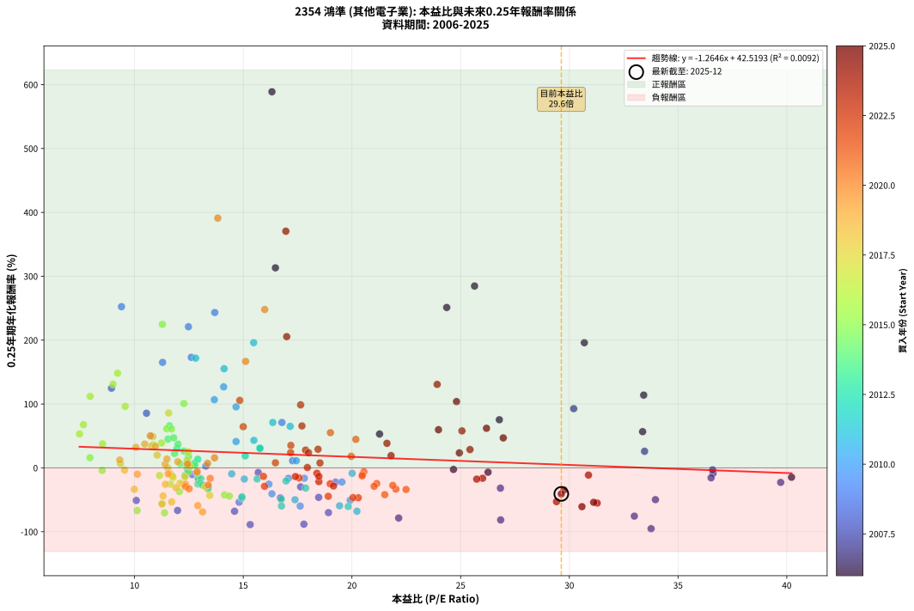
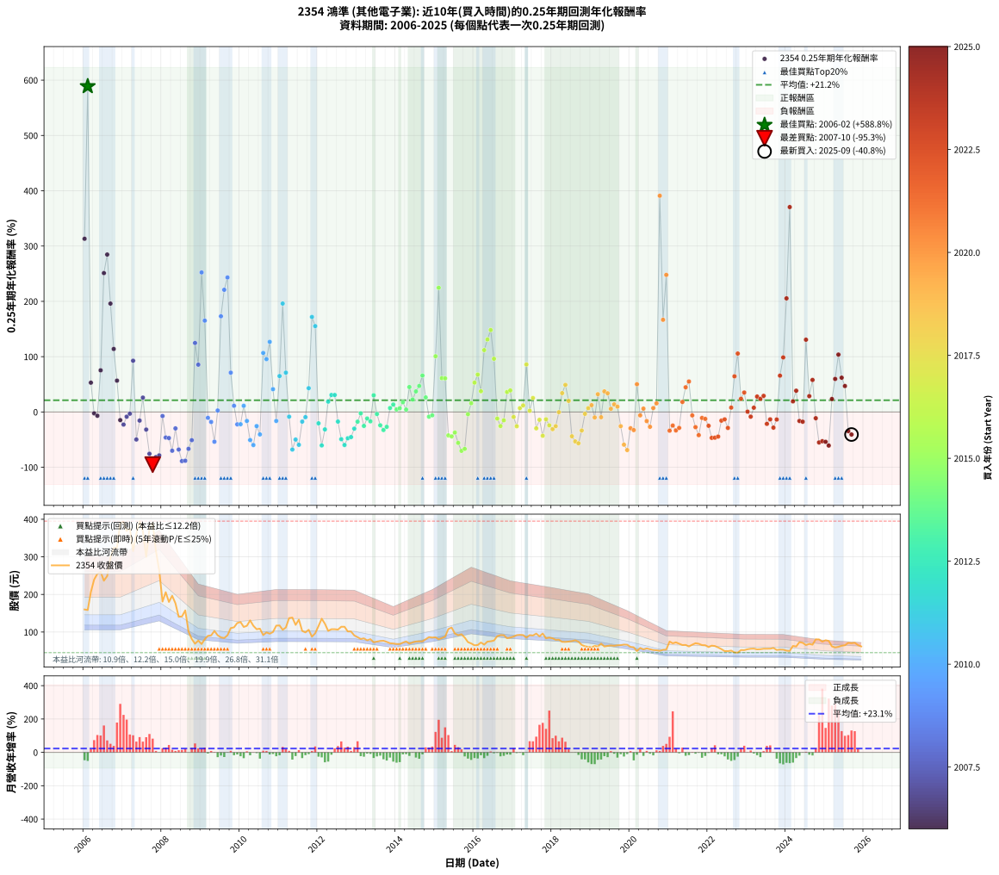

# 2354 鴻準 - 本益比與未來報酬率分析

!!! info "報告資訊"
    - **股票代號**: 2354
    - **公司名稱**: 鴻準
    - **產業別**: 其他電子業
    - **分析期間**: 2006-2025 (237 個數據點)
    - **資料來源**: Type 12 (ShowMonthlyK_ChartFlow) 月收盤價與本益比
    - **報酬率口徑**: 含現金股利 (簡化: 年度合計，假設每年7/1入帳)
    - **報告生成時間**: 2026-01-09 20:37:07 CST

## 📈 視覺化圖表

### 圖表1: 本益比 vs 未來報酬率關係

*圖表1：2354 鴻準 本益比與0.25年期未來報酬率關係 (2006-2025)*

### 圖表2: 歷年買入時點的0.25年期實際報酬率

*圖表2：2354 鴻準 歷年買入時點的0.25年期實際報酬率 (2006-2025)*

## 📍 買點訊號說明

本報告提供兩種買點提示訊號（顯示於圖表2的股價子圖中）：

### ▲ 小綠色三角形（回測驗證）
- **計算方式**: 使用全部歷史資料計算本益比第25百分位數
- **用途**: 事後驗證，顯示歷史上哪些時點確實為低估區
- **限制**: 當下無法判斷，僅供回測參考
- **特性**: 後見之明（Look-Ahead Bias）

### ▲ 小橘色三角形（即時訊號）
- **計算方式**: 使用截至當月的過去5年資料計算本益比第25百分位數
- **用途**: 實際投資決策，當時即可判斷
- **優勢**: 可操作性強，符合實務需求
- **特性**: 無後見之明，滾動窗口計算

!!! tip "如何使用兩種訊號"
    - **綠色▲** 幫助理解歷史估值機會，驗證策略有效性
    - **橘色▲** 可作為實際買進參考，但仍需搭配基本面分析
    - 兩種訊號重疊時，表示即時判斷與事後驗證一致，信心度較高
    - 僅有綠色▲時，表示當時無法判斷（需要未來資料才能確認）
    - 僅有橘色▲時，表示即時判斷為買點，但事後可能不是最佳時機

## 📊 估值分析摘要

| 指標 | 數值 |
|:---:|:---:|
| **目前本益比** (2025-09) | **29.63 倍** |
| **歷史平均本益比** | 16.83 倍 |
| **估值水準** | 🔴 相對高估 |
| **預期0.25年年化報酬率** | **+5.05%** |
| **歷史平均報酬率** | +21.23% |
| **相關係數 (R²)** | 0.0092 |
| **趨勢線斜率** | -1.2646 |

!!! abstract "核心洞察"
    目前本益比顯著高於歷史平均，預期未來報酬率可能較低

    根據歷史數據回測，2354 鴻準 在目前本益比 **29.6倍** 的估值水準下，
    預期未來0.25年年化報酬率約為 **+5.0%**。

    **重要提醒**: 本分析基於歷史數據統計，實際報酬率會受到公司基本面變化、產業趨勢、
    總體經濟環境等多重因素影響。R² = 0.01 表示本益比可解釋約 0.9% 的報酬率變異。

## 📈 歷史估值統計

### 最佳買點 (最高報酬率)

| 項目 | 數值 |
|:---:|:---:|
| 起始時間 | 2006-02 |
| 當時本益比 | 16.32 倍 |
| 起始價格 | 158.5 元 |
| 0.25年後價格 | 255.0 元 |
| **0.25年年化報酬率** | **+588.80%** |

### 最差買點 (最低報酬率)

| 項目 | 數值 |
|:---:|:---:|
| 起始時間 | 2007-10 |
| 當時本益比 | 33.76 倍 |
| 起始價格 | 390.0 元 |
| 0.25年後價格 | 181.0 元 |
| **0.25年年化報酬率** | **-95.25%** |

## 🎯 投資啟示

### 本益比與報酬率關係

趨勢線方程式: **y = -1.2646x + 42.5193**

!!! warning "強負相關"
    本益比與未來報酬率呈現強負相關。在高本益比時期買入，未來報酬率顯著較低；
    在低本益比時期買入，未來報酬率顯著較高。**估值紀律至關重要**。

### 估值區間建議

基於歷史數據分析:

- **🟢 低估區** (P/E < 13.5): 預期報酬率較高，可考慮增加持股
- **🟡 合理區** (P/E 13.5-20.2): 預期報酬率符合長期趨勢，正常持有
- **🔴 高估區** (P/E > 20.2): 預期報酬率較低，可考慮減碼或觀望

!!! danger "風險提示"
    - 過去表現不代表未來結果
    - 本分析假設公司基本面無重大結構性變化
    - 產業環境劇變可能使歷史規律失效
    - 應結合公司財報、產業趨勢、總體經濟等多重因素綜合判斷

!!! success "長期投資觀點"
    歷史數據顯示，在合理或低估的估值水準買入並長期持有，
    往往能獲得較佳的投資報酬。**耐心等待好價格**是價值投資的核心原則。

## 📊 數據品質

- **資料來源**: GoodInfo.tw Type 12 (ShowMonthlyK_ChartFlow)
- **資料頻率**: 月度收盤價與本益比
- **回測期間**: 2006-2025
- **數據點數量**: 237 個 (每個點代表一次0.25年期回測)

### 計算方法說明

1. **0.25年期年化報酬率**:
   - 對每個歷史時點，計算其後0.25年的實際投資報酬率
   - 期末價值(不含股利): 期末價格
   - 期末價值(含現金股利): 期末價格 + 持有期間內的現金股利合計 (簡化: 年度合計，假設每年7/1入帳)
   - 公式: 年化報酬率 = [(期末價值/期初價格)^(1/年數) - 1] × 100%

2. **本益比 (P/E Ratio)**:
   - 使用當時的月收盤價與EPS計算
   - 資料來源: Type 12 月度河流圖本益比數據

3. **趨勢線 (Linear Regression)**:
   - 使用最小平方法擬合線性趨勢線
   - R²值衡量本益比對報酬率的解釋能力

---

*本報告由 Stock Analysis System v1.9.0 自動生成*
*數據更新時間: 2026-01-09 20:37:07 CST*

## 📋 月度回測明細表

（每一列對應時間線圖中的一個買入點；可用來對照 SVG 圖上的每個點。）

| 買入月份 | 賣出月份 | 回測期限_年 | 實際持有年數 | 買入本益比_倍 | 買入收盤價_元 | 賣出收盤價_元 | 現金股利合計_元 | 總報酬率_pct | 年化報酬率_pct |
| --- | --- | --- | --- | --- | --- | --- | --- | --- | --- |
| 2006-01 | 2006-05 | 0.25 | 0.329 | 16.48 | 160.00 | 255.00 | 0.00 | +59.38 | +313.16 |
| 2006-02 | 2006-05 | 0.25 | 0.246 | 16.32 | 158.50 | 255.00 | 0.00 | +60.88 | +588.80 |
| 2006-03 | 2006-07 | 0.25 | 0.334 | 21.27 | 206.50 | 236.50 | 1.50 | +15.25 | +52.96 |
| 2006-04 | 2006-07 | 0.25 | 0.249 | 24.67 | 239.50 | 236.50 | 1.50 | -0.63 | -2.49 |
| 2006-05 | 2006-08 | 0.25 | 0.252 | 26.26 | 255.00 | 249.00 | 1.50 | -1.76 | -6.82 |
| 2006-06 | 2006-09 | 0.25 | 0.252 | 26.78 | 260.00 | 298.00 | 1.50 | +15.19 | +75.33 |
| 2006-07 | 2006-10 | 0.25 | 0.252 | 24.36 | 236.50 | 324.50 | 0.00 | +37.21 | +251.10 |
| 2006-08 | 2006-12 | 0.25 | 0.334 | 25.64 | 249.00 | 390.50 | 0.00 | +56.83 | +284.65 |
| 2006-09 | 2006-12 | 0.25 | 0.249 | 30.69 | 298.00 | 390.50 | 0.00 | +31.04 | +195.96 |
| 2006-10 | 2007-01 | 0.25 | 0.252 | 33.42 | 324.50 | 393.00 | 0.00 | +21.11 | +113.91 |
| 2006-11 | 2007-03 | 0.25 | 0.329 | 33.37 | 324.00 | 375.50 | 0.00 | +15.90 | +56.67 |
| 2006-12 | 2007-03 | 0.25 | 0.246 | 40.22 | 390.50 | 375.50 | 0.00 | -3.84 | -14.70 |
| 2007-01 | 2007-05 | 0.25 | 0.329 | 39.72 | 393.00 | 361.00 | 0.00 | -8.14 | -22.78 |
| 2007-02 | 2007-05 | 0.25 | 0.246 | 36.61 | 369.00 | 361.00 | 0.00 | -2.17 | -8.51 |
| 2007-03 | 2007-07 | 0.25 | 0.334 | 36.59 | 375.50 | 368.00 | 3.50 | -1.07 | -3.16 |
| 2007-04 | 2007-07 | 0.25 | 0.249 | 30.20 | 315.50 | 368.00 | 3.50 | +17.75 | +92.67 |
| 2007-05 | 2007-08 | 0.25 | 0.252 | 33.96 | 361.00 | 300.00 | 3.50 | -15.93 | -49.78 |
| 2007-06 | 2007-09 | 0.25 | 0.252 | 36.52 | 395.00 | 375.00 | 3.50 | -4.18 | -15.58 |
| 2007-07 | 2007-10 | 0.25 | 0.252 | 33.46 | 368.00 | 390.00 | 0.00 | +5.98 | +25.93 |
| 2007-08 | 2007-12 | 0.25 | 0.334 | 26.83 | 300.00 | 264.00 | 0.00 | -12.00 | -31.80 |
| 2007-09 | 2007-12 | 0.25 | 0.249 | 32.99 | 375.00 | 264.00 | 0.00 | -29.60 | -75.55 |
| 2007-10 | 2008-01 | 0.25 | 0.252 | 33.76 | 390.00 | 181.00 | 0.00 | -53.59 | -95.25 |
| 2007-11 | 2008-03 | 0.25 | 0.331 | 26.84 | 315.00 | 180.00 | 0.00 | -42.86 | -81.53 |
| 2007-12 | 2008-03 | 0.25 | 0.249 | 22.15 | 264.00 | 180.00 | 0.00 | -31.82 | -78.50 |
| 2008-01 | 2008-05 | 0.25 | 0.331 | 15.69 | 181.00 | 176.50 | 0.00 | -2.49 | -7.32 |
| 2008-02 | 2008-05 | 0.25 | 0.249 | 18.47 | 206.00 | 176.50 | 0.00 | -14.32 | -46.22 |
| 2008-03 | 2008-07 | 0.25 | 0.334 | 16.71 | 180.00 | 141.50 | 4.00 | -19.17 | -47.11 |
| 2008-04 | 2008-07 | 0.25 | 0.249 | 18.92 | 196.50 | 141.50 | 4.00 | -25.95 | -70.06 |
| 2008-05 | 2008-08 | 0.25 | 0.252 | 17.64 | 176.50 | 157.50 | 4.00 | -8.50 | -29.71 |
| 2008-06 | 2008-09 | 0.25 | 0.252 | 14.60 | 140.50 | 101.50 | 4.00 | -24.91 | -67.94 |
| 2008-07 | 2008-10 | 0.25 | 0.252 | 15.32 | 141.50 | 81.50 | 0.00 | -42.40 | -88.81 |
| 2008-08 | 2008-12 | 0.25 | 0.334 | 17.79 | 157.50 | 77.20 | 0.00 | -50.98 | -88.17 |
| 2008-09 | 2008-12 | 0.25 | 0.249 | 11.98 | 101.50 | 77.20 | 0.00 | -23.94 | -66.66 |
| 2008-10 | 2009-01 | 0.25 | 0.252 | 10.08 | 81.50 | 68.10 | 0.00 | -16.44 | -50.99 |
| 2008-11 | 2009-03 | 0.25 | 0.329 | 8.94 | 68.90 | 89.90 | 0.00 | +30.48 | +124.74 |
| 2008-12 | 2009-03 | 0.25 | 0.246 | 10.55 | 77.20 | 89.90 | 0.00 | +16.45 | +85.54 |
| 2009-01 | 2009-05 | 0.25 | 0.329 | 9.40 | 68.10 | 103.00 | 0.00 | +51.25 | +252.32 |
| 2009-02 | 2009-05 | 0.25 | 0.246 | 11.29 | 81.00 | 103.00 | 0.00 | +27.16 | +165.15 |
| 2009-03 | 2009-07 | 0.25 | 0.334 | 12.66 | 89.90 | 85.80 | 0.80 | -3.67 | -10.59 |
| 2009-04 | 2009-07 | 0.25 | 0.249 | 12.95 | 91.00 | 85.80 | 0.80 | -4.84 | -18.04 |
| 2009-05 | 2009-08 | 0.25 | 0.252 | 14.81 | 103.00 | 84.00 | 0.80 | -17.67 | -53.79 |
| 2009-06 | 2009-09 | 0.25 | 0.252 | 13.28 | 91.40 | 91.20 | 0.80 | +0.66 | +2.63 |
| 2009-07 | 2009-10 | 0.25 | 0.252 | 12.61 | 85.80 | 110.50 | 0.00 | +28.79 | +173.03 |
| 2009-08 | 2009-12 | 0.25 | 0.334 | 12.48 | 84.00 | 124.00 | 0.00 | +47.62 | +220.91 |
| 2009-09 | 2009-12 | 0.25 | 0.249 | 13.69 | 91.20 | 124.00 | 0.00 | +35.96 | +243.19 |
| 2009-10 | 2010-01 | 0.25 | 0.252 | 16.78 | 110.50 | 126.50 | 0.00 | +14.48 | +71.06 |
| 2009-11 | 2010-03 | 0.25 | 0.329 | 17.27 | 112.50 | 116.50 | 0.00 | +3.56 | +11.22 |
| 2009-12 | 2010-03 | 0.25 | 0.246 | 19.25 | 124.00 | 116.50 | 0.00 | -6.05 | -22.37 |
| 2010-01 | 2010-05 | 0.25 | 0.329 | 19.54 | 126.50 | 116.50 | 0.00 | -7.91 | -22.17 |
| 2010-02 | 2010-05 | 0.25 | 0.246 | 17.44 | 113.50 | 116.50 | 0.00 | +2.64 | +11.17 |
| 2010-03 | 2010-07 | 0.25 | 0.334 | 17.81 | 116.50 | 109.00 | 0.80 | -5.75 | -16.25 |
| 2010-04 | 2010-07 | 0.25 | 0.249 | 19.92 | 131.00 | 109.00 | 0.80 | -16.18 | -50.77 |
| 2010-05 | 2010-08 | 0.25 | 0.252 | 17.62 | 116.50 | 91.80 | 0.80 | -20.52 | -59.81 |
| 2010-06 | 2010-09 | 0.25 | 0.252 | 16.18 | 107.50 | 99.00 | 0.80 | -7.16 | -25.55 |
| 2010-07 | 2010-10 | 0.25 | 0.252 | 16.32 | 109.00 | 95.60 | 0.00 | -12.29 | -40.59 |
| 2010-08 | 2010-12 | 0.25 | 0.334 | 13.67 | 91.80 | 117.00 | 0.00 | +27.45 | +106.72 |
| 2010-09 | 2010-12 | 0.25 | 0.249 | 14.67 | 99.00 | 117.00 | 0.00 | +18.18 | +95.52 |
| 2010-10 | 2011-01 | 0.25 | 0.252 | 14.10 | 95.60 | 117.50 | 0.00 | +22.91 | +126.80 |
| 2010-11 | 2011-03 | 0.25 | 0.329 | 14.67 | 100.00 | 112.00 | 0.00 | +12.00 | +41.19 |
| 2010-12 | 2011-03 | 0.25 | 0.246 | 17.08 | 117.00 | 112.00 | 0.00 | -4.27 | -16.24 |
| 2011-01 | 2011-05 | 0.25 | 0.329 | 17.16 | 117.50 | 138.50 | 0.00 | +17.87 | +64.95 |
| 2011-02 | 2011-05 | 0.25 | 0.246 | 15.48 | 106.00 | 138.50 | 0.00 | +30.66 | +196.04 |
| 2011-03 | 2011-07 | 0.25 | 0.334 | 16.36 | 112.00 | 133.00 | 1.00 | +19.64 | +71.07 |
| 2011-04 | 2011-07 | 0.25 | 0.249 | 20.01 | 137.00 | 133.00 | 1.00 | -2.19 | -8.50 |
| 2011-05 | 2011-08 | 0.25 | 0.252 | 20.23 | 138.50 | 103.00 | 1.00 | -24.91 | -67.93 |
| 2011-06 | 2011-09 | 0.25 | 0.252 | 17.38 | 119.00 | 99.00 | 1.00 | -15.97 | -49.87 |
| 2011-07 | 2011-10 | 0.25 | 0.252 | 19.43 | 133.00 | 106.00 | 0.00 | -20.30 | -59.38 |
| 2011-08 | 2011-12 | 0.25 | 0.334 | 15.05 | 103.00 | 96.60 | 0.00 | -6.21 | -17.47 |
| 2011-09 | 2011-12 | 0.25 | 0.249 | 14.47 | 99.00 | 96.60 | 0.00 | -2.42 | -9.38 |
| 2011-10 | 2012-01 | 0.25 | 0.252 | 15.49 | 106.00 | 116.00 | 0.00 | +9.43 | +43.03 |
| 2011-11 | 2012-03 | 0.25 | 0.331 | 12.81 | 87.60 | 122.00 | 0.00 | +39.27 | +171.80 |
| 2011-12 | 2012-03 | 0.25 | 0.249 | 14.12 | 96.60 | 122.00 | 0.00 | +26.29 | +155.23 |
| 2012-01 | 2012-05 | 0.25 | 0.331 | 16.97 | 116.00 | 107.50 | 0.00 | -7.33 | -20.52 |
| 2012-02 | 2012-05 | 0.25 | 0.249 | 19.83 | 135.50 | 107.50 | 0.00 | -20.66 | -60.51 |
| 2012-03 | 2012-07 | 0.25 | 0.334 | 17.87 | 122.00 | 106.50 | 1.00 | -11.89 | -31.53 |
| 2012-04 | 2012-07 | 0.25 | 0.249 | 15.09 | 103.00 | 106.50 | 1.00 | +4.37 | +18.72 |
| 2012-05 | 2012-08 | 0.25 | 0.252 | 15.76 | 107.50 | 114.00 | 1.00 | +6.98 | +30.70 |
| 2012-06 | 2012-09 | 0.25 | 0.252 | 15.77 | 107.50 | 114.00 | 1.00 | +6.98 | +30.70 |
| 2012-07 | 2012-10 | 0.25 | 0.252 | 15.64 | 106.50 | 101.50 | 0.00 | -4.69 | -17.38 |
| 2012-08 | 2012-12 | 0.25 | 0.334 | 16.75 | 114.00 | 90.90 | 0.00 | -20.26 | -49.23 |
| 2012-09 | 2012-12 | 0.25 | 0.249 | 16.76 | 114.00 | 90.90 | 0.00 | -20.26 | -59.70 |
| 2012-10 | 2013-01 | 0.25 | 0.252 | 14.93 | 101.50 | 86.30 | 0.00 | -14.98 | -47.48 |
| 2012-11 | 2013-03 | 0.25 | 0.329 | 14.94 | 101.50 | 83.20 | 0.00 | -18.03 | -45.40 |
| 2012-12 | 2013-03 | 0.25 | 0.246 | 13.39 | 90.90 | 83.20 | 0.00 | -8.47 | -30.18 |
| 2013-01 | 2013-05 | 0.25 | 0.329 | 12.93 | 86.30 | 81.00 | 0.00 | -6.14 | -17.54 |
| 2013-02 | 2013-05 | 0.25 | 0.246 | 12.43 | 81.50 | 81.00 | 0.00 | -0.61 | -2.47 |
| 2013-03 | 2013-07 | 0.25 | 0.334 | 12.92 | 83.20 | 74.50 | 1.00 | -9.25 | -25.23 |
| 2013-04 | 2013-07 | 0.25 | 0.249 | 12.32 | 77.90 | 74.50 | 1.00 | -3.08 | -11.80 |
| 2013-05 | 2013-08 | 0.25 | 0.252 | 13.05 | 81.00 | 76.30 | 1.00 | -4.57 | -16.94 |
| 2013-06 | 2013-09 | 0.25 | 0.252 | 11.95 | 72.80 | 76.80 | 1.00 | +6.87 | +30.18 |
| 2013-07 | 2013-10 | 0.25 | 0.252 | 12.47 | 74.50 | 73.80 | 0.00 | -0.94 | -3.68 |
| 2013-08 | 2013-12 | 0.25 | 0.334 | 13.03 | 76.30 | 69.60 | 0.00 | -8.78 | -24.05 |
| 2013-09 | 2013-12 | 0.25 | 0.249 | 13.38 | 76.80 | 69.60 | 0.00 | -9.38 | -32.64 |
| 2013-10 | 2014-01 | 0.25 | 0.252 | 13.12 | 73.80 | 68.20 | 0.00 | -7.59 | -26.90 |
| 2013-11 | 2014-03 | 0.25 | 0.329 | 12.75 | 70.20 | 71.80 | 0.00 | +2.28 | +7.10 |
| 2013-12 | 2014-03 | 0.25 | 0.246 | 12.91 | 69.60 | 71.80 | 0.00 | +3.16 | +13.46 |
| 2014-01 | 2014-05 | 0.25 | 0.329 | 12.38 | 68.20 | 69.20 | 0.00 | +1.47 | +4.53 |
| 2014-02 | 2014-05 | 0.25 | 0.246 | 12.09 | 68.10 | 69.20 | 0.00 | +1.62 | +6.72 |
| 2014-03 | 2014-07 | 0.25 | 0.334 | 12.48 | 71.80 | 74.80 | 1.00 | +5.57 | +17.62 |
| 2014-04 | 2014-07 | 0.25 | 0.249 | 12.77 | 75.00 | 74.80 | 1.00 | +1.07 | +4.35 |
| 2014-05 | 2014-08 | 0.25 | 0.252 | 11.54 | 69.20 | 75.00 | 1.00 | +9.83 | +45.08 |
| 2014-06 | 2014-09 | 0.25 | 0.252 | 11.84 | 72.40 | 75.20 | 1.00 | +5.25 | +22.52 |
| 2014-07 | 2014-10 | 0.25 | 0.252 | 12.00 | 74.80 | 81.00 | 0.00 | +8.29 | +37.18 |
| 2014-08 | 2014-12 | 0.25 | 0.334 | 11.80 | 75.00 | 85.30 | 0.00 | +13.73 | +47.00 |
| 2014-09 | 2014-12 | 0.25 | 0.249 | 11.61 | 75.20 | 85.30 | 0.00 | +13.43 | +65.84 |
| 2014-10 | 2015-01 | 0.25 | 0.252 | 12.28 | 81.00 | 85.90 | 0.00 | +6.05 | +26.26 |
| 2014-11 | 2015-03 | 0.25 | 0.329 | 12.87 | 86.50 | 84.00 | 0.00 | -2.89 | -8.54 |
| 2014-12 | 2015-03 | 0.25 | 0.246 | 12.47 | 85.30 | 84.00 | 0.00 | -1.52 | -6.04 |
| 2015-01 | 2015-05 | 0.25 | 0.329 | 12.27 | 85.90 | 108.00 | 0.00 | +25.73 | +100.74 |
| 2015-02 | 2015-05 | 0.25 | 0.246 | 11.28 | 80.80 | 108.00 | 0.00 | +33.66 | +224.64 |
| 2015-03 | 2015-07 | 0.25 | 0.334 | 11.48 | 84.00 | 96.00 | 2.50 | +17.26 | +61.08 |
| 2015-04 | 2015-07 | 0.25 | 0.249 | 11.70 | 87.50 | 96.00 | 2.50 | +12.57 | +60.85 |
| 2015-05 | 2015-08 | 0.25 | 0.252 | 14.14 | 108.00 | 91.50 | 2.50 | -12.96 | -42.37 |
| 2015-06 | 2015-09 | 0.25 | 0.252 | 14.36 | 112.00 | 94.20 | 2.50 | -13.66 | -44.19 |
| 2015-07 | 2015-10 | 0.25 | 0.252 | 12.06 | 96.00 | 85.40 | 0.00 | -11.04 | -37.16 |
| 2015-08 | 2015-12 | 0.25 | 0.334 | 11.27 | 91.50 | 69.60 | 0.00 | -23.93 | -55.91 |
| 2015-09 | 2015-12 | 0.25 | 0.249 | 11.38 | 94.20 | 69.60 | 0.00 | -26.11 | -70.32 |
| 2015-10 | 2016-01 | 0.25 | 0.252 | 10.12 | 85.40 | 64.70 | 0.00 | -24.24 | -66.78 |
| 2015-11 | 2016-03 | 0.25 | 0.331 | 8.51 | 73.20 | 72.20 | 0.00 | -1.37 | -4.07 |
| 2015-12 | 2016-03 | 0.25 | 0.249 | 7.95 | 69.60 | 72.20 | 0.00 | +3.74 | +15.86 |
| 2016-01 | 2016-05 | 0.25 | 0.331 | 7.47 | 64.70 | 74.50 | 0.00 | +15.15 | +53.07 |
| 2016-02 | 2016-05 | 0.25 | 0.249 | 7.65 | 65.50 | 74.50 | 0.00 | +13.74 | +67.66 |
| 2016-03 | 2016-07 | 0.25 | 0.334 | 8.53 | 72.20 | 77.30 | 3.00 | +11.22 | +37.48 |
| 2016-04 | 2016-07 | 0.25 | 0.249 | 7.96 | 66.60 | 77.30 | 3.00 | +20.57 | +111.88 |
| 2016-05 | 2016-08 | 0.25 | 0.252 | 9.01 | 74.50 | 89.00 | 3.00 | +23.49 | +131.09 |
| 2016-06 | 2016-09 | 0.25 | 0.252 | 9.22 | 75.40 | 91.80 | 3.00 | +25.73 | +148.19 |
| 2016-07 | 2016-10 | 0.25 | 0.252 | 9.57 | 77.30 | 91.60 | 0.00 | +18.50 | +96.18 |
| 2016-08 | 2016-12 | 0.25 | 0.334 | 11.15 | 89.00 | 85.30 | 0.00 | -4.16 | -11.94 |
| 2016-09 | 2016-12 | 0.25 | 0.249 | 11.65 | 91.80 | 85.30 | 0.00 | -7.08 | -25.53 |
| 2016-10 | 2017-01 | 0.25 | 0.252 | 11.77 | 91.60 | 87.90 | 0.00 | -4.04 | -15.10 |
| 2016-11 | 2017-03 | 0.25 | 0.329 | 10.87 | 83.60 | 92.50 | 0.00 | +10.65 | +36.06 |
| 2016-12 | 2017-03 | 0.25 | 0.246 | 11.24 | 85.30 | 92.50 | 0.00 | +8.44 | +38.94 |
| 2017-01 | 2017-05 | 0.25 | 0.329 | 11.65 | 87.90 | 85.20 | 0.00 | -3.07 | -9.06 |
| 2017-02 | 2017-05 | 0.25 | 0.246 | 12.23 | 91.70 | 85.20 | 0.00 | -7.09 | -25.80 |
| 2017-03 | 2017-07 | 0.25 | 0.334 | 12.41 | 92.50 | 90.80 | 3.80 | +2.27 | +6.95 |
| 2017-04 | 2017-07 | 0.25 | 0.249 | 12.42 | 92.00 | 90.80 | 3.80 | +2.83 | +11.84 |
| 2017-05 | 2017-08 | 0.25 | 0.252 | 11.57 | 85.20 | 95.80 | 3.80 | +16.90 | +85.89 |
| 2017-06 | 2017-09 | 0.25 | 0.252 | 12.54 | 91.80 | 88.50 | 3.80 | +0.54 | +2.18 |
| 2017-07 | 2017-10 | 0.25 | 0.252 | 12.48 | 90.80 | 96.10 | 0.00 | +5.84 | +25.26 |
| 2017-08 | 2017-12 | 0.25 | 0.334 | 13.25 | 95.80 | 85.20 | 0.00 | -11.06 | -29.61 |
| 2017-09 | 2017-12 | 0.25 | 0.249 | 12.32 | 88.50 | 85.20 | 0.00 | -3.73 | -14.15 |
| 2017-10 | 2018-01 | 0.25 | 0.252 | 13.46 | 96.10 | 83.40 | 0.00 | -13.22 | -43.03 |
| 2017-11 | 2018-03 | 0.25 | 0.329 | 11.75 | 83.40 | 79.60 | 0.00 | -4.56 | -13.23 |
| 2017-12 | 2018-03 | 0.25 | 0.246 | 12.09 | 85.20 | 79.60 | 0.00 | -6.57 | -24.11 |
| 2018-01 | 2018-05 | 0.25 | 0.329 | 11.91 | 83.40 | 73.80 | 0.00 | -11.51 | -31.08 |
| 2018-02 | 2018-05 | 0.25 | 0.246 | 11.42 | 79.40 | 73.80 | 0.00 | -7.05 | -25.68 |
| 2018-03 | 2018-07 | 0.25 | 0.334 | 11.53 | 79.60 | 75.90 | 3.60 | -0.13 | -0.38 |
| 2018-04 | 2018-07 | 0.25 | 0.249 | 10.78 | 73.90 | 75.90 | 3.60 | +7.58 | +34.07 |
| 2018-05 | 2018-08 | 0.25 | 0.252 | 10.84 | 73.80 | 78.00 | 3.60 | +10.57 | +49.02 |
| 2018-06 | 2018-09 | 0.25 | 0.252 | 11.04 | 74.60 | 74.50 | 3.60 | +4.69 | +19.96 |
| 2018-07 | 2018-10 | 0.25 | 0.252 | 11.31 | 75.90 | 65.60 | 0.00 | -13.57 | -43.95 |
| 2018-08 | 2018-12 | 0.25 | 0.334 | 11.71 | 78.00 | 60.50 | 0.00 | -22.44 | -53.26 |
| 2018-09 | 2018-12 | 0.25 | 0.249 | 11.26 | 74.50 | 60.50 | 0.00 | -18.79 | -56.63 |
| 2018-10 | 2019-01 | 0.25 | 0.252 | 9.99 | 65.60 | 59.20 | 0.00 | -9.76 | -33.47 |
| 2018-11 | 2019-03 | 0.25 | 0.329 | 9.54 | 62.20 | 61.50 | 0.00 | -1.13 | -3.39 |
| 2018-12 | 2019-03 | 0.25 | 0.246 | 9.35 | 60.50 | 61.50 | 0.00 | +1.65 | +6.88 |
| 2019-01 | 2019-05 | 0.25 | 0.329 | 9.32 | 59.20 | 61.50 | 0.00 | +3.89 | +12.30 |
| 2019-02 | 2019-05 | 0.25 | 0.246 | 10.13 | 63.10 | 61.50 | 0.00 | -2.54 | -9.90 |
| 2019-03 | 2019-07 | 0.25 | 0.334 | 10.06 | 61.50 | 64.30 | 3.20 | +9.76 | +32.14 |
| 2019-04 | 2019-07 | 0.25 | 0.249 | 11.55 | 69.20 | 64.30 | 3.20 | -2.46 | -9.50 |
| 2019-05 | 2019-08 | 0.25 | 0.252 | 10.47 | 61.50 | 63.40 | 3.20 | +8.29 | +37.20 |
| 2019-06 | 2019-09 | 0.25 | 0.252 | 10.96 | 63.10 | 64.70 | 3.20 | +7.61 | +33.79 |
| 2019-07 | 2019-10 | 0.25 | 0.252 | 11.41 | 64.30 | 65.20 | 0.00 | +1.40 | +5.67 |
| 2019-08 | 2019-12 | 0.25 | 0.334 | 11.49 | 63.40 | 66.20 | 0.00 | +4.42 | +13.81 |
| 2019-09 | 2019-12 | 0.25 | 0.249 | 11.99 | 64.70 | 66.20 | 0.00 | +2.32 | +9.64 |
| 2019-10 | 2020-01 | 0.25 | 0.252 | 12.35 | 65.20 | 60.50 | 0.00 | -7.21 | -25.70 |
| 2019-11 | 2020-03 | 0.25 | 0.331 | 12.91 | 66.60 | 49.50 | 0.00 | -25.68 | -59.17 |
| 2019-12 | 2020-03 | 0.25 | 0.249 | 13.13 | 66.20 | 49.50 | 0.00 | -25.23 | -68.86 |
| 2020-01 | 2020-05 | 0.25 | 0.331 | 12.35 | 60.50 | 53.90 | 0.00 | -10.91 | -29.44 |
| 2020-02 | 2020-05 | 0.25 | 0.249 | 12.51 | 59.50 | 53.90 | 0.00 | -9.41 | -32.75 |
| 2020-03 | 2020-07 | 0.25 | 0.334 | 10.73 | 49.50 | 54.20 | 2.50 | +14.55 | +50.17 |
| 2020-04 | 2020-07 | 0.25 | 0.249 | 12.88 | 57.60 | 54.20 | 2.50 | -1.56 | -6.13 |
| 2020-05 | 2020-08 | 0.25 | 0.252 | 12.44 | 53.90 | 52.20 | 2.50 | +1.48 | +6.02 |
| 2020-06 | 2020-09 | 0.25 | 0.252 | 13.48 | 56.50 | 51.50 | 2.50 | -4.42 | -16.45 |
| 2020-07 | 2020-10 | 0.25 | 0.252 | 13.39 | 54.20 | 50.10 | 0.00 | -7.56 | -26.82 |
| 2020-08 | 2020-12 | 0.25 | 0.334 | 13.36 | 52.20 | 53.40 | 0.00 | +2.30 | +7.04 |
| 2020-09 | 2020-12 | 0.25 | 0.249 | 13.68 | 51.50 | 53.40 | 0.00 | +3.69 | +15.65 |
| 2020-10 | 2021-01 | 0.25 | 0.252 | 13.83 | 50.10 | 74.80 | 0.00 | +49.30 | +390.97 |
| 2020-11 | 2021-03 | 0.25 | 0.329 | 15.11 | 52.60 | 72.60 | 0.00 | +38.02 | +166.67 |
| 2020-12 | 2021-03 | 0.25 | 0.246 | 15.99 | 53.40 | 72.60 | 0.00 | +35.96 | +247.83 |
| 2021-01 | 2021-05 | 0.25 | 0.329 | 22.49 | 74.80 | 65.30 | 0.00 | -12.70 | -33.86 |
| 2021-02 | 2021-05 | 0.25 | 0.246 | 21.14 | 70.00 | 65.30 | 0.00 | -6.71 | -24.58 |
| 2021-03 | 2021-07 | 0.25 | 0.334 | 22.02 | 72.60 | 61.60 | 1.80 | -12.67 | -33.35 |
| 2021-04 | 2021-07 | 0.25 | 0.249 | 21.02 | 69.00 | 61.60 | 1.80 | -8.12 | -28.80 |
| 2021-05 | 2021-08 | 0.25 | 0.252 | 19.97 | 65.30 | 66.30 | 1.80 | +4.29 | +18.14 |
| 2021-06 | 2021-09 | 0.25 | 0.252 | 20.18 | 65.70 | 70.30 | 1.80 | +9.74 | +44.63 |
| 2021-07 | 2021-10 | 0.25 | 0.252 | 19.01 | 61.60 | 68.80 | 0.00 | +11.69 | +55.09 |
| 2021-08 | 2021-12 | 0.25 | 0.334 | 20.55 | 66.30 | 64.90 | 0.00 | -2.11 | -6.19 |
| 2021-09 | 2021-12 | 0.25 | 0.249 | 21.88 | 70.30 | 64.90 | 0.00 | -7.68 | -27.44 |
| 2021-10 | 2022-01 | 0.25 | 0.252 | 21.51 | 68.80 | 60.00 | 0.00 | -12.79 | -41.92 |
| 2021-11 | 2022-03 | 0.25 | 0.329 | 20.48 | 65.20 | 62.80 | 0.00 | -3.68 | -10.79 |
| 2021-12 | 2022-03 | 0.25 | 0.246 | 20.47 | 64.90 | 62.80 | 0.00 | -3.24 | -12.50 |
| 2022-01 | 2022-05 | 0.25 | 0.329 | 19.00 | 60.00 | 54.60 | 0.00 | -9.00 | -24.95 |
| 2022-02 | 2022-05 | 0.25 | 0.246 | 20.29 | 63.80 | 54.60 | 0.00 | -14.42 | -46.85 |
| 2022-03 | 2022-07 | 0.25 | 0.334 | 20.05 | 62.80 | 49.25 | 1.70 | -18.87 | -46.53 |
| 2022-04 | 2022-07 | 0.25 | 0.249 | 18.91 | 59.00 | 49.25 | 1.70 | -13.64 | -44.50 |
| 2022-05 | 2022-08 | 0.25 | 0.252 | 17.57 | 54.60 | 50.60 | 1.70 | -4.21 | -15.71 |
| 2022-06 | 2022-09 | 0.25 | 0.252 | 15.93 | 49.30 | 45.85 | 1.70 | -3.55 | -13.37 |
| 2022-07 | 2022-10 | 0.25 | 0.252 | 15.98 | 49.25 | 45.20 | 0.00 | -8.22 | -28.87 |
| 2022-08 | 2022-12 | 0.25 | 0.334 | 16.48 | 50.60 | 51.90 | 0.00 | +2.57 | +7.89 |
| 2022-09 | 2022-12 | 0.25 | 0.249 | 15.00 | 45.85 | 51.90 | 0.00 | +13.20 | +64.46 |
| 2022-10 | 2023-01 | 0.25 | 0.252 | 14.84 | 45.20 | 54.20 | 0.00 | +19.91 | +105.63 |
| 2022-11 | 2023-03 | 0.25 | 0.329 | 17.18 | 52.10 | 55.90 | 0.00 | +7.29 | +23.90 |
| 2022-12 | 2023-03 | 0.25 | 0.246 | 17.19 | 51.90 | 55.90 | 0.00 | +7.71 | +35.16 |
| 2023-01 | 2023-05 | 0.25 | 0.329 | 17.95 | 54.20 | 54.30 | 0.00 | +0.18 | +0.56 |
| 2023-02 | 2023-05 | 0.25 | 0.246 | 18.39 | 55.50 | 54.30 | 0.00 | -2.16 | -8.49 |
| 2023-03 | 2023-07 | 0.25 | 0.334 | 18.53 | 55.90 | 55.70 | 1.60 | +2.50 | +7.69 |
| 2023-04 | 2023-07 | 0.25 | 0.249 | 17.87 | 53.90 | 55.70 | 1.60 | +6.31 | +27.83 |
| 2023-05 | 2023-08 | 0.25 | 0.252 | 18.00 | 54.30 | 55.70 | 1.60 | +5.52 | +23.80 |
| 2023-06 | 2023-09 | 0.25 | 0.252 | 18.44 | 55.60 | 57.70 | 1.60 | +6.65 | +29.15 |
| 2023-07 | 2023-10 | 0.25 | 0.252 | 18.48 | 55.70 | 52.40 | 0.00 | -5.92 | -21.53 |
| 2023-08 | 2023-12 | 0.25 | 0.334 | 18.48 | 55.70 | 53.10 | 0.00 | -4.67 | -13.33 |
| 2023-09 | 2023-12 | 0.25 | 0.249 | 19.15 | 57.70 | 53.10 | 0.00 | -7.97 | -28.36 |
| 2023-10 | 2024-01 | 0.25 | 0.252 | 17.40 | 52.40 | 50.50 | 0.00 | -3.63 | -13.64 |
| 2023-11 | 2024-03 | 0.25 | 0.331 | 17.70 | 53.30 | 63.00 | 0.00 | +18.20 | +65.65 |
| 2023-12 | 2024-03 | 0.25 | 0.249 | 17.64 | 53.10 | 63.00 | 0.00 | +18.64 | +98.61 |
| 2024-01 | 2024-05 | 0.25 | 0.331 | 17.00 | 50.50 | 73.10 | 0.00 | +44.75 | +205.40 |
| 2024-02 | 2024-05 | 0.25 | 0.249 | 16.96 | 49.70 | 73.10 | 0.00 | +47.08 | +370.48 |
| 2024-03 | 2024-07 | 0.25 | 0.334 | 21.80 | 63.00 | 65.30 | 1.50 | +6.03 | +19.17 |
| 2024-04 | 2024-07 | 0.25 | 0.249 | 21.61 | 61.60 | 65.30 | 1.50 | +8.44 | +38.44 |
| 2024-05 | 2024-08 | 0.25 | 0.252 | 26.01 | 73.10 | 68.40 | 1.50 | -4.38 | -16.28 |
| 2024-06 | 2024-09 | 0.25 | 0.252 | 25.74 | 71.30 | 66.40 | 1.50 | -4.77 | -17.63 |
| 2024-07 | 2024-10 | 0.25 | 0.252 | 23.92 | 65.30 | 80.60 | 0.00 | +23.43 | +130.65 |
| 2024-08 | 2024-12 | 0.25 | 0.334 | 25.43 | 68.40 | 74.40 | 0.00 | +8.77 | +28.63 |
| 2024-09 | 2024-12 | 0.25 | 0.249 | 25.06 | 66.40 | 74.40 | 0.00 | +12.05 | +57.87 |
| 2024-10 | 2025-01 | 0.25 | 0.252 | 30.88 | 80.60 | 78.20 | 0.00 | -2.98 | -11.31 |
| 2024-11 | 2025-03 | 0.25 | 0.329 | 31.28 | 80.40 | 61.80 | 0.00 | -23.13 | -55.10 |
| 2024-12 | 2025-03 | 0.25 | 0.246 | 29.41 | 74.40 | 61.80 | 0.00 | -16.94 | -52.91 |
| 2025-01 | 2025-05 | 0.25 | 0.329 | 31.12 | 78.20 | 60.60 | 0.00 | -22.51 | -53.98 |
| 2025-02 | 2025-05 | 0.25 | 0.246 | 30.58 | 76.30 | 60.60 | 0.00 | -20.58 | -60.74 |
| 2025-03 | 2025-07 | 0.25 | 0.334 | 24.94 | 61.80 | 64.90 | 1.40 | +7.28 | +23.42 |
| 2025-04 | 2025-07 | 0.25 | 0.249 | 23.98 | 59.00 | 64.90 | 1.40 | +12.37 | +59.71 |
| 2025-05 | 2025-08 | 0.25 | 0.252 | 24.81 | 60.60 | 71.10 | 1.40 | +19.64 | +103.77 |
| 2025-06 | 2025-09 | 0.25 | 0.252 | 26.19 | 63.50 | 70.30 | 1.40 | +12.91 | +61.96 |
| 2025-07 | 2025-10 | 0.25 | 0.252 | 26.96 | 64.90 | 71.50 | 0.00 | +10.17 | +46.89 |
| 2025-08 | 2025-12 | 0.25 | 0.334 | 29.75 | 71.10 | 61.70 | 0.00 | -13.22 | -34.59 |
| 2025-09 | 2025-12 | 0.25 | 0.249 | 29.63 | 70.30 | 61.70 | 0.00 | -12.23 | -40.77 |
