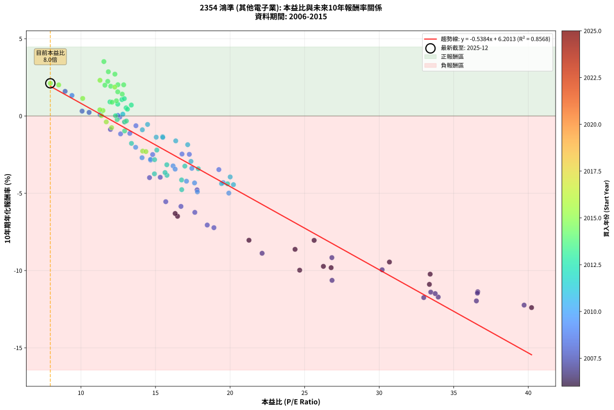
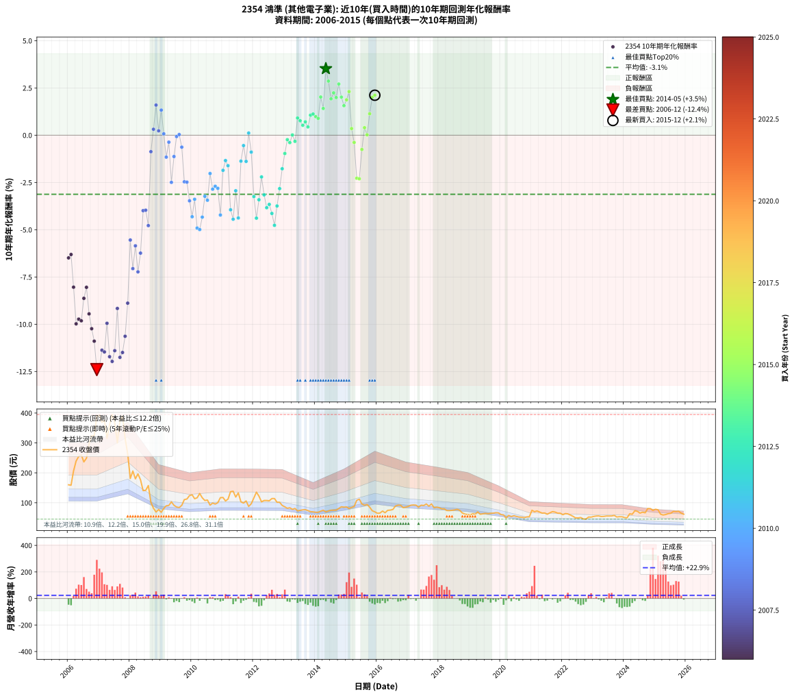

# 2354 鴻準 - 本益比與未來報酬率分析

!!! info "報告資訊"
    - **股票代號**: 2354
    - **公司名稱**: 鴻準
    - **產業別**: 其他電子業
    - **分析期間**: 2006-2015 (120 個數據點)
    - **資料來源**: Type 12 (ShowMonthlyK_ChartFlow) 月收盤價與本益比
    - **報酬率口徑**: 含現金股利 (簡化: 年度合計，假設每年7/1入帳)
    - **報告生成時間**: 2026-01-13 00:34:18 CST

## 📈 視覺化圖表

### 圖表1: 本益比 vs 未來報酬率關係

*圖表1：2354 鴻準 本益比與10年期未來報酬率關係 (2006-2015)*

### 圖表2: 歷年買入時點的10年期實際報酬率

*圖表2：2354 鴻準 歷年買入時點的10年期實際報酬率 (2006-2015)*

## 📍 買點訊號說明

本報告提供兩種買點提示訊號（顯示於圖表2的股價子圖中）：

### ▲ 小綠色三角形（回測驗證）
- **計算方式**: 使用全部歷史資料計算本益比第25百分位數
- **用途**: 事後驗證，顯示歷史上哪些時點確實為低估區
- **限制**: 當下無法判斷，僅供回測參考
- **特性**: 後見之明（Look-Ahead Bias）

### ▲ 小橘色三角形（即時訊號）
- **計算方式**: 使用截至當月的過去5年資料計算本益比第25百分位數
- **用途**: 實際投資決策，當時即可判斷
- **優勢**: 可操作性強，符合實務需求
- **特性**: 無後見之明，滾動窗口計算

!!! tip "如何使用兩種訊號"
    - **綠色▲** 幫助理解歷史估值機會，驗證策略有效性
    - **橘色▲** 可作為實際買進參考，但仍需搭配基本面分析
    - 兩種訊號重疊時，表示即時判斷與事後驗證一致，信心度較高
    - 僅有綠色▲時，表示當時無法判斷（需要未來資料才能確認）
    - 僅有橘色▲時，表示即時判斷為買點，但事後可能不是最佳時機

## 📊 估值分析摘要

| 指標 | 數值 |
|:---:|:---:|
| **目前本益比** (2015-12) | **7.95 倍** |
| **歷史平均本益比** | 17.32 倍 |
| **估值水準** | 🟢 相對低估 |
| **預期10年年化報酬率** | **+1.92%** |
| **歷史平均報酬率** | -3.13% |
| **相關係數 (R²)** | 0.8568 |
| **趨勢線斜率** | -0.5384 |

!!! abstract "核心洞察"
    目前本益比顯著低於歷史平均，預期未來報酬率可能較高

    根據歷史數據回測，2354 鴻準 在目前本益比 **8.0倍** 的估值水準下，
    預期未來10年年化報酬率約為 **+1.9%**。

    **重要提醒**: 本分析基於歷史數據統計，實際報酬率會受到公司基本面變化、產業趨勢、
    總體經濟環境等多重因素影響。R² = 0.86 表示本益比可解釋約 85.7% 的報酬率變異。

## 📈 歷史估值統計

### 最佳買點 (最高報酬率)

| 項目 | 數值 |
|:---:|:---:|
| 起始時間 | 2014-05 |
| 當時本益比 | 11.54 倍 |
| 起始價格 | 69.2 元 |
| 10年後價格 | 73.1 元 |
| **10年年化報酬率** | **+3.52%** |

### 最差買點 (最低報酬率)

| 項目 | 數值 |
|:---:|:---:|
| 起始時間 | 2006-12 |
| 當時本益比 | 40.22 倍 |
| 起始價格 | 390.5 元 |
| 10年後價格 | 85.3 元 |
| **10年年化報酬率** | **-12.40%** |

## 🎯 投資啟示

### 本益比與報酬率關係

趨勢線方程式: **y = -0.5384x + 6.2013**

!!! warning "強負相關"
    本益比與未來報酬率呈現強負相關。在高本益比時期買入，未來報酬率顯著較低；
    在低本益比時期買入，未來報酬率顯著較高。**估值紀律至關重要**。

### 估值區間建議

基於歷史數據分析:

- **🟢 低估區** (P/E < 13.9): 預期報酬率較高，可考慮增加持股
- **🟡 合理區** (P/E 13.9-20.8): 預期報酬率符合長期趨勢，正常持有
- **🔴 高估區** (P/E > 20.8): 預期報酬率較低，可考慮減碼或觀望

!!! danger "風險提示"
    - 過去表現不代表未來結果
    - 本分析假設公司基本面無重大結構性變化
    - 產業環境劇變可能使歷史規律失效
    - 應結合公司財報、產業趨勢、總體經濟等多重因素綜合判斷

!!! success "長期投資觀點"
    歷史數據顯示，在合理或低估的估值水準買入並長期持有，
    往往能獲得較佳的投資報酬。**耐心等待好價格**是價值投資的核心原則。

## 📊 數據品質

- **資料來源**: GoodInfo.tw Type 12 (ShowMonthlyK_ChartFlow)
- **資料頻率**: 月度收盤價與本益比
- **回測期間**: 2006-2015
- **數據點數量**: 120 個 (每個點代表一次10年期回測)

### 計算方法說明

1. **10年期年化報酬率**:
   - 對每個歷史時點，計算其後10年的實際投資報酬率
   - 期末價值(不含股利): 期末價格
   - 期末價值(含現金股利): 期末價格 + 持有期間內的現金股利合計 (簡化: 年度合計，假設每年7/1入帳)
   - 公式: 年化報酬率 = [(期末價值/期初價格)^(1/年數) - 1] × 100%

2. **本益比 (P/E Ratio)**:
   - 使用當時的月收盤價與EPS計算
   - 資料來源: Type 12 月度河流圖本益比數據

3. **趨勢線 (Linear Regression)**:
   - 使用最小平方法擬合線性趨勢線
   - R²值衡量本益比對報酬率的解釋能力

---

*本報告由 Stock Analysis System v1.9.0 自動生成*
*數據更新時間: 2026-01-13 00:34:18 CST*

## 📋 月度回測明細表

（每一列對應時間線圖中的一個買入點；可用來對照 SVG 圖上的每個點。）

| 買入月份 | 賣出月份 | 回測期限_年 | 實際持有年數 | 買入本益比_倍 | 買入收盤價_元 | 賣出收盤價_元 | 現金股利合計_元 | 總報酬率_pct | 年化報酬率_pct |
| --- | --- | --- | --- | --- | --- | --- | --- | --- | --- |
| 2006-01 | 2016-01 | 10 | 9.999 | 16.48 | 160.00 | 64.70 | 17.10 | -48.87 | -6.49 |
| 2006-02 | 2016-02 | 10 | 9.999 | 16.32 | 158.50 | 65.50 | 17.10 | -47.89 | -6.31 |
| 2006-03 | 2016-03 | 10 | 10.001 | 21.27 | 206.50 | 72.20 | 17.10 | -56.76 | -8.04 |
| 2006-04 | 2016-04 | 10 | 10.001 | 24.67 | 239.50 | 66.60 | 17.10 | -65.05 | -9.98 |
| 2006-05 | 2016-05 | 10 | 10.001 | 26.26 | 255.00 | 74.50 | 17.10 | -64.08 | -9.73 |
| 2006-06 | 2016-06 | 10 | 10.001 | 26.78 | 260.00 | 75.40 | 17.10 | -64.42 | -9.82 |
| 2006-07 | 2016-07 | 10 | 10.001 | 24.36 | 236.50 | 77.30 | 18.60 | -59.45 | -8.63 |
| 2006-08 | 2016-08 | 10 | 10.001 | 25.64 | 249.00 | 89.00 | 18.60 | -56.79 | -8.05 |
| 2006-09 | 2016-09 | 10 | 10.001 | 30.69 | 298.00 | 91.80 | 18.60 | -62.95 | -9.45 |
| 2006-10 | 2016-10 | 10 | 10.001 | 33.42 | 324.50 | 91.60 | 18.60 | -66.04 | -10.24 |
| 2006-11 | 2016-11 | 10 | 10.001 | 33.37 | 324.00 | 83.60 | 18.60 | -68.46 | -10.90 |
| 2006-12 | 2016-12 | 10 | 10.001 | 40.22 | 390.50 | 85.30 | 18.60 | -73.39 | -12.40 |
| 2007-01 | 2017-01 | 10 | 10.001 | 39.72 | 393.00 | 87.90 | 18.60 | -72.90 | -12.24 |
| 2007-02 | 2017-02 | 10 | 10.001 | 36.61 | 369.00 | 91.70 | 18.60 | -70.11 | -11.37 |
| 2007-03 | 2017-03 | 10 | 10.001 | 36.59 | 375.50 | 92.50 | 18.60 | -70.41 | -11.46 |
| 2007-04 | 2017-04 | 10 | 10.001 | 30.20 | 315.50 | 92.00 | 18.60 | -64.94 | -9.95 |
| 2007-05 | 2017-05 | 10 | 10.001 | 33.96 | 361.00 | 85.20 | 18.60 | -71.25 | -11.72 |
| 2007-06 | 2017-06 | 10 | 10.001 | 36.52 | 395.00 | 91.80 | 18.60 | -72.05 | -11.97 |
| 2007-07 | 2017-07 | 10 | 10.001 | 33.46 | 368.00 | 90.80 | 18.90 | -70.19 | -11.40 |
| 2007-08 | 2017-08 | 10 | 10.001 | 26.83 | 300.00 | 95.80 | 18.90 | -61.77 | -9.17 |
| 2007-09 | 2017-09 | 10 | 10.001 | 32.99 | 375.00 | 88.50 | 18.90 | -71.36 | -11.75 |
| 2007-10 | 2017-10 | 10 | 10.001 | 33.76 | 390.00 | 96.10 | 18.90 | -70.51 | -11.49 |
| 2007-11 | 2017-11 | 10 | 10.001 | 26.84 | 315.00 | 83.40 | 18.90 | -67.52 | -10.64 |
| 2007-12 | 2017-12 | 10 | 10.001 | 22.15 | 264.00 | 85.20 | 18.90 | -60.57 | -8.88 |
| 2008-01 | 2018-01 | 10 | 10.001 | 15.69 | 181.00 | 83.40 | 18.90 | -43.48 | -5.55 |
| 2008-02 | 2018-03 | 10 | 10.081 | 18.47 | 206.00 | 79.60 | 18.90 | -52.18 | -7.06 |
| 2008-03 | 2018-03 | 10 | 9.999 | 16.71 | 180.00 | 79.60 | 18.90 | -45.28 | -5.85 |
| 2008-04 | 2018-04 | 10 | 9.999 | 18.92 | 196.50 | 73.90 | 18.90 | -52.77 | -7.23 |
| 2008-05 | 2018-05 | 10 | 9.999 | 17.64 | 176.50 | 73.80 | 18.90 | -47.48 | -6.24 |
| 2008-06 | 2018-06 | 10 | 9.999 | 14.60 | 140.50 | 74.60 | 18.90 | -33.45 | -3.99 |
| 2008-07 | 2018-07 | 10 | 9.999 | 15.32 | 141.50 | 75.90 | 18.50 | -33.29 | -3.97 |
| 2008-08 | 2018-08 | 10 | 9.999 | 17.79 | 157.50 | 78.00 | 18.50 | -38.73 | -4.78 |
| 2008-09 | 2018-09 | 10 | 9.999 | 11.98 | 101.50 | 74.50 | 18.50 | -8.37 | -0.87 |
| 2008-10 | 2018-10 | 10 | 9.999 | 10.08 | 81.50 | 65.60 | 18.50 | +3.19 | +0.31 |
| 2008-11 | 2018-11 | 10 | 9.999 | 8.94 | 68.90 | 62.20 | 18.50 | +17.13 | +1.59 |
| 2008-12 | 2018-12 | 10 | 9.999 | 10.55 | 77.20 | 60.50 | 18.50 | +2.33 | +0.23 |
| 2009-01 | 2019-01 | 10 | 9.999 | 9.40 | 68.10 | 59.20 | 18.50 | +14.10 | +1.33 |
| 2009-02 | 2019-02 | 10 | 9.999 | 11.29 | 81.00 | 63.10 | 18.50 | +0.74 | +0.07 |
| 2009-03 | 2019-03 | 10 | 9.999 | 12.66 | 89.90 | 61.50 | 18.50 | -11.01 | -1.16 |
| 2009-04 | 2019-04 | 10 | 9.999 | 12.95 | 91.00 | 69.20 | 18.50 | -3.63 | -0.37 |
| 2009-05 | 2019-05 | 10 | 9.999 | 14.81 | 103.00 | 61.50 | 18.50 | -22.33 | -2.50 |
| 2009-06 | 2019-06 | 10 | 9.999 | 13.28 | 91.40 | 63.10 | 18.50 | -10.72 | -1.13 |
| 2009-07 | 2019-07 | 10 | 9.999 | 12.61 | 85.80 | 64.30 | 20.90 | -0.70 | -0.07 |
| 2009-08 | 2019-08 | 10 | 9.999 | 12.48 | 84.00 | 63.40 | 20.90 | +0.36 | +0.04 |
| 2009-09 | 2019-09 | 10 | 9.999 | 13.69 | 91.20 | 64.70 | 20.90 | -6.14 | -0.63 |
| 2009-10 | 2019-10 | 10 | 9.999 | 16.78 | 110.50 | 65.20 | 20.90 | -22.08 | -2.46 |
| 2009-11 | 2019-11 | 10 | 9.999 | 17.27 | 112.50 | 66.60 | 20.90 | -22.22 | -2.48 |
| 2009-12 | 2019-12 | 10 | 9.999 | 19.25 | 124.00 | 66.20 | 20.90 | -29.76 | -3.47 |
| 2010-01 | 2020-01 | 10 | 9.999 | 19.54 | 126.50 | 60.50 | 20.90 | -35.65 | -4.31 |
| 2010-02 | 2020-02 | 10 | 9.999 | 17.44 | 113.50 | 59.50 | 20.90 | -29.16 | -3.39 |
| 2010-03 | 2020-03 | 10 | 10.001 | 17.81 | 116.50 | 49.50 | 20.90 | -39.57 | -4.91 |
| 2010-04 | 2020-04 | 10 | 10.001 | 19.92 | 131.00 | 57.60 | 20.90 | -40.08 | -4.99 |
| 2010-05 | 2020-05 | 10 | 10.001 | 17.62 | 116.50 | 53.90 | 20.90 | -35.79 | -4.33 |
| 2010-06 | 2020-06 | 10 | 10.001 | 16.18 | 107.50 | 56.50 | 20.90 | -28.00 | -3.23 |
| 2010-07 | 2020-07 | 10 | 10.001 | 16.32 | 109.00 | 54.20 | 22.60 | -29.54 | -3.44 |
| 2010-08 | 2020-08 | 10 | 10.001 | 13.67 | 91.80 | 52.20 | 22.60 | -18.52 | -2.03 |
| 2010-09 | 2020-09 | 10 | 10.001 | 14.67 | 99.00 | 51.50 | 22.60 | -25.15 | -2.86 |
| 2010-10 | 2020-10 | 10 | 10.001 | 14.10 | 95.60 | 50.10 | 22.60 | -23.95 | -2.70 |
| 2010-11 | 2020-11 | 10 | 10.001 | 14.67 | 100.00 | 52.60 | 22.60 | -24.80 | -2.81 |
| 2010-12 | 2020-12 | 10 | 10.001 | 17.08 | 117.00 | 53.40 | 22.60 | -35.04 | -4.22 |
| 2011-01 | 2021-01 | 10 | 10.001 | 17.16 | 117.50 | 74.80 | 22.60 | -17.11 | -1.86 |
| 2011-02 | 2021-02 | 10 | 10.001 | 15.48 | 106.00 | 70.00 | 22.60 | -12.64 | -1.34 |
| 2011-03 | 2021-03 | 10 | 10.001 | 16.36 | 112.00 | 72.60 | 22.60 | -15.00 | -1.61 |
| 2011-04 | 2021-04 | 10 | 10.001 | 20.01 | 137.00 | 69.00 | 22.60 | -33.14 | -3.95 |
| 2011-05 | 2021-05 | 10 | 10.001 | 20.23 | 138.50 | 65.30 | 22.60 | -36.53 | -4.44 |
| 2011-06 | 2021-06 | 10 | 10.001 | 17.38 | 119.00 | 65.70 | 22.60 | -25.80 | -2.94 |
| 2011-07 | 2021-07 | 10 | 10.001 | 19.43 | 133.00 | 61.60 | 23.40 | -36.09 | -4.38 |
| 2011-08 | 2021-08 | 10 | 10.001 | 15.05 | 103.00 | 66.30 | 23.40 | -12.91 | -1.37 |
| 2011-09 | 2021-09 | 10 | 10.001 | 14.47 | 99.00 | 70.30 | 23.40 | -5.35 | -0.55 |
| 2011-10 | 2021-10 | 10 | 10.001 | 15.49 | 106.00 | 68.80 | 23.40 | -13.02 | -1.38 |
| 2011-11 | 2021-11 | 10 | 10.001 | 12.81 | 87.60 | 65.20 | 23.40 | +1.14 | +0.11 |
| 2011-12 | 2021-12 | 10 | 10.001 | 14.12 | 96.60 | 64.90 | 23.40 | -8.59 | -0.89 |
| 2012-01 | 2022-01 | 10 | 10.001 | 16.97 | 116.00 | 60.00 | 23.40 | -28.10 | -3.25 |
| 2012-02 | 2022-03 | 10 | 10.081 | 19.83 | 135.50 | 62.80 | 23.40 | -36.38 | -4.39 |
| 2012-03 | 2022-03 | 10 | 9.999 | 17.87 | 122.00 | 62.80 | 23.40 | -29.34 | -3.41 |
| 2012-04 | 2022-04 | 10 | 9.999 | 15.09 | 103.00 | 59.00 | 23.40 | -20.00 | -2.21 |
| 2012-05 | 2022-05 | 10 | 9.999 | 15.76 | 107.50 | 54.60 | 23.40 | -27.44 | -3.16 |
| 2012-06 | 2022-06 | 10 | 9.999 | 15.77 | 107.50 | 49.30 | 23.40 | -32.37 | -3.84 |
| 2012-07 | 2022-07 | 10 | 9.999 | 15.64 | 106.50 | 49.25 | 24.10 | -31.13 | -3.66 |
| 2012-08 | 2022-08 | 10 | 9.999 | 16.75 | 114.00 | 50.60 | 24.10 | -34.47 | -4.14 |
| 2012-09 | 2022-09 | 10 | 9.999 | 16.76 | 114.00 | 45.85 | 24.10 | -38.64 | -4.77 |
| 2012-10 | 2022-10 | 10 | 9.999 | 14.93 | 101.50 | 45.20 | 24.10 | -31.72 | -3.74 |
| 2012-11 | 2022-11 | 10 | 9.999 | 14.94 | 101.50 | 52.10 | 24.10 | -24.93 | -2.83 |
| 2012-12 | 2022-12 | 10 | 9.999 | 13.39 | 90.90 | 51.90 | 24.10 | -16.39 | -1.77 |
| 2013-01 | 2023-01 | 10 | 9.999 | 12.93 | 86.30 | 54.20 | 24.10 | -9.27 | -0.97 |
| 2013-02 | 2023-02 | 10 | 9.999 | 12.43 | 81.50 | 55.50 | 24.10 | -2.33 | -0.24 |
| 2013-03 | 2023-03 | 10 | 9.999 | 12.92 | 83.20 | 55.90 | 24.10 | -3.85 | -0.39 |
| 2013-04 | 2023-04 | 10 | 9.999 | 12.32 | 77.90 | 53.90 | 24.10 | +0.13 | +0.01 |
| 2013-05 | 2023-05 | 10 | 9.999 | 13.05 | 81.00 | 54.30 | 24.10 | -3.21 | -0.33 |
| 2013-06 | 2023-06 | 10 | 9.999 | 11.95 | 72.80 | 55.60 | 24.10 | +9.48 | +0.91 |
| 2013-07 | 2023-07 | 10 | 9.999 | 12.47 | 74.50 | 55.70 | 24.70 | +7.92 | +0.77 |
| 2013-08 | 2023-08 | 10 | 9.999 | 13.03 | 76.30 | 55.70 | 24.70 | +5.37 | +0.52 |
| 2013-09 | 2023-09 | 10 | 9.999 | 13.38 | 76.80 | 57.70 | 24.70 | +7.29 | +0.71 |
| 2013-10 | 2023-10 | 10 | 9.999 | 13.12 | 73.80 | 52.40 | 24.70 | +4.47 | +0.44 |
| 2013-11 | 2023-11 | 10 | 9.999 | 12.75 | 70.20 | 53.30 | 24.70 | +11.11 | +1.06 |
| 2013-12 | 2023-12 | 10 | 9.999 | 12.91 | 69.60 | 53.10 | 24.70 | +11.78 | +1.12 |
| 2014-01 | 2024-01 | 10 | 9.999 | 12.38 | 68.20 | 50.50 | 24.70 | +10.26 | +0.98 |
| 2014-02 | 2024-02 | 10 | 9.999 | 12.09 | 68.10 | 49.70 | 24.70 | +9.25 | +0.89 |
| 2014-03 | 2024-03 | 10 | 10.001 | 12.48 | 71.80 | 63.00 | 24.70 | +22.14 | +2.02 |
| 2014-04 | 2024-04 | 10 | 10.001 | 12.77 | 75.00 | 61.60 | 24.70 | +15.07 | +1.41 |
| 2014-05 | 2024-05 | 10 | 10.001 | 11.54 | 69.20 | 73.10 | 24.70 | +41.33 | +3.52 |
| 2014-06 | 2024-06 | 10 | 10.001 | 11.84 | 72.40 | 71.30 | 24.70 | +32.60 | +2.86 |
| 2014-07 | 2024-07 | 10 | 10.001 | 12.00 | 74.80 | 65.30 | 25.20 | +20.99 | +1.92 |
| 2014-08 | 2024-08 | 10 | 10.001 | 11.80 | 75.00 | 68.40 | 25.20 | +24.80 | +2.24 |
| 2014-09 | 2024-09 | 10 | 10.001 | 11.61 | 75.20 | 66.40 | 25.20 | +21.81 | +1.99 |
| 2014-10 | 2024-10 | 10 | 10.001 | 12.28 | 81.00 | 80.60 | 25.20 | +30.62 | +2.71 |
| 2014-11 | 2024-11 | 10 | 10.001 | 12.87 | 86.50 | 80.40 | 25.20 | +22.08 | +2.01 |
| 2014-12 | 2024-12 | 10 | 10.001 | 12.47 | 85.30 | 74.40 | 25.20 | +16.76 | +1.56 |
| 2015-01 | 2025-01 | 10 | 10.001 | 12.27 | 85.90 | 78.20 | 25.20 | +20.37 | +1.87 |
| 2015-02 | 2025-02 | 10 | 10.001 | 11.28 | 80.80 | 76.30 | 25.20 | +25.62 | +2.31 |
| 2015-03 | 2025-03 | 10 | 10.001 | 11.48 | 84.00 | 61.80 | 25.20 | +3.57 | +0.35 |
| 2015-04 | 2025-04 | 10 | 10.001 | 11.70 | 87.50 | 59.00 | 25.20 | -3.77 | -0.38 |
| 2015-05 | 2025-05 | 10 | 10.001 | 14.14 | 108.00 | 60.60 | 25.20 | -20.56 | -2.27 |
| 2015-06 | 2025-06 | 10 | 10.001 | 14.36 | 112.00 | 63.50 | 25.20 | -20.80 | -2.31 |
| 2015-07 | 2025-07 | 10 | 10.001 | 12.06 | 96.00 | 64.90 | 24.10 | -7.29 | -0.75 |
| 2015-08 | 2025-08 | 10 | 10.001 | 11.27 | 91.50 | 71.10 | 24.10 | +4.04 | +0.40 |
| 2015-09 | 2025-09 | 10 | 10.001 | 11.38 | 94.20 | 70.30 | 24.10 | +0.21 | +0.02 |
| 2015-10 | 2025-10 | 10 | 10.001 | 10.12 | 85.40 | 71.50 | 24.10 | +11.94 | +1.13 |
| 2015-11 | 2025-11 | 10 | 10.001 | 8.51 | 73.20 | 65.20 | 24.10 | +21.99 | +2.01 |
| 2015-12 | 2025-12 | 10 | 10.001 | 7.95 | 69.60 | 61.70 | 24.10 | +23.28 | +2.11 |
