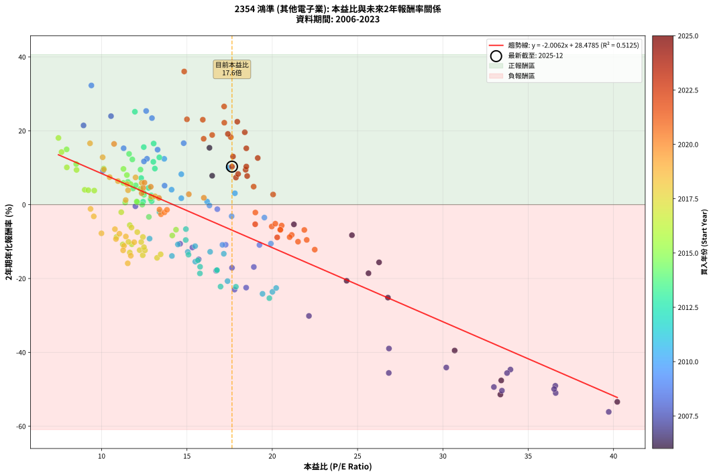
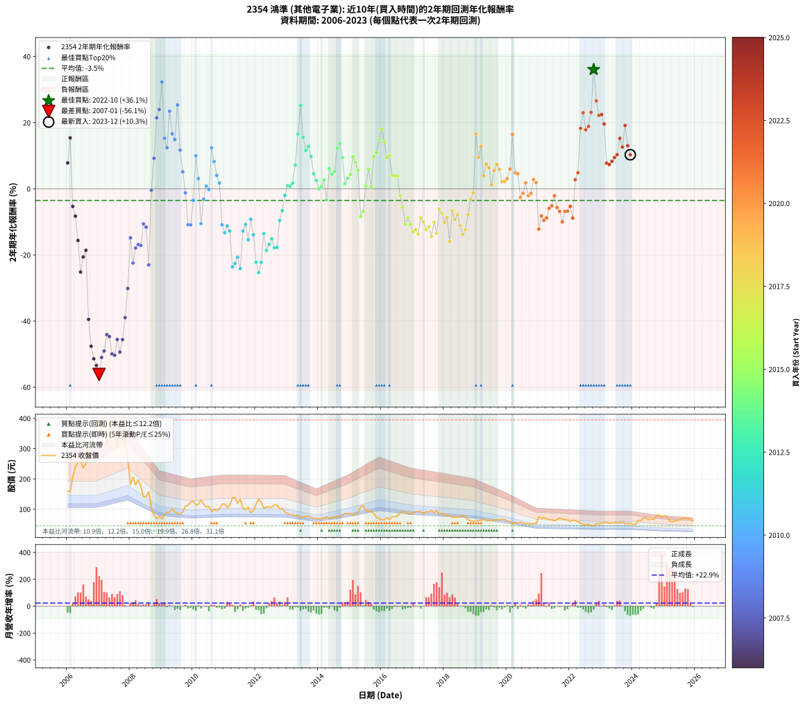

# 2354 鴻準 - 本益比與未來報酬率分析

!!! info "報告資訊"
    - **股票代號**: 2354
    - **公司名稱**: 鴻準
    - **產業別**: 其他電子業
    - **分析期間**: 2006-2023 (216 個數據點)
    - **資料來源**: Type 12 (ShowMonthlyK_ChartFlow) 月收盤價與本益比
    - **報酬率口徑**: 含現金股利 (簡化: 年度合計，假設每年7/1入帳)
    - **報告生成時間**: 2026-01-05 20:36:49 CST

## 📈 視覺化圖表

### 圖表1: 本益比 vs 未來報酬率關係

*圖表1：2354 鴻準 本益比與2年期未來報酬率關係 (2006-2023)*

### 圖表2: 歷年買入時點的2年期實際報酬率

*圖表2：2354 鴻準 歷年買入時點的2年期實際報酬率 (2006-2023)*

## 📍 買點訊號說明

本報告提供兩種買點提示訊號（顯示於圖表2的股價子圖中）：

### ▲ 小綠色三角形（回測驗證）
- **計算方式**: 使用全部歷史資料計算本益比第25百分位數
- **用途**: 事後驗證，顯示歷史上哪些時點確實為低估區
- **限制**: 當下無法判斷，僅供回測參考
- **特性**: 後見之明（Look-Ahead Bias）

### ▲ 小橘色三角形（即時訊號）
- **計算方式**: 使用截至當月的過去5年資料計算本益比第25百分位數
- **用途**: 實際投資決策，當時即可判斷
- **優勢**: 可操作性強，符合實務需求
- **特性**: 無後見之明，滾動窗口計算

!!! tip "如何使用兩種訊號"
    - **綠色▲** 幫助理解歷史估值機會，驗證策略有效性
    - **橘色▲** 可作為實際買進參考，但仍需搭配基本面分析
    - 兩種訊號重疊時，表示即時判斷與事後驗證一致，信心度較高
    - 僅有綠色▲時，表示當時無法判斷（需要未來資料才能確認）
    - 僅有橘色▲時，表示即時判斷為買點，但事後可能不是最佳時機

## 📊 估值分析摘要

| 指標 | 數值 |
|:---:|:---:|
| **目前本益比** (2023-12) | **17.64 倍** |
| **歷史平均本益比** | 15.96 倍 |
| **估值水準** | 🟡 合理範圍 |
| **預期2年年化報酬率** | **-6.91%** |
| **歷史平均報酬率** | -3.53% |
| **相關係數 (R²)** | 0.5125 |
| **趨勢線斜率** | -2.0062 |

!!! abstract "核心洞察"
    目前本益比接近歷史平均，預期報酬率符合長期趨勢

    根據歷史數據回測，2354 鴻準 在目前本益比 **17.6倍** 的估值水準下，
    預期未來2年年化報酬率約為 **-6.9%**。

    **重要提醒**: 本分析基於歷史數據統計，實際報酬率會受到公司基本面變化、產業趨勢、
    總體經濟環境等多重因素影響。R² = 0.51 表示本益比可解釋約 51.2% 的報酬率變異。

## 📈 歷史估值統計

### 最佳買點 (最高報酬率)

| 項目 | 數值 |
|:---:|:---:|
| 起始時間 | 2022-10 |
| 當時本益比 | 14.84 倍 |
| 起始價格 | 45.2 元 |
| 2年後價格 | 80.6 元 |
| **2年年化報酬率** | **+36.05%** |

### 最差買點 (最低報酬率)

| 項目 | 數值 |
|:---:|:---:|
| 起始時間 | 2007-01 |
| 當時本益比 | 39.72 倍 |
| 起始價格 | 393.0 元 |
| 2年後價格 | 68.1 元 |
| **2年年化報酬率** | **-56.12%** |

## 🎯 投資啟示

### 本益比與報酬率關係

趨勢線方程式: **y = -2.0062x + 28.4785**

!!! warning "強負相關"
    本益比與未來報酬率呈現強負相關。在高本益比時期買入，未來報酬率顯著較低；
    在低本益比時期買入，未來報酬率顯著較高。**估值紀律至關重要**。

### 估值區間建議

基於歷史數據分析:

- **🟢 低估區** (P/E < 12.8): 預期報酬率較高，可考慮增加持股
- **🟡 合理區** (P/E 12.8-19.1): 預期報酬率符合長期趨勢，正常持有
- **🔴 高估區** (P/E > 19.1): 預期報酬率較低，可考慮減碼或觀望

!!! danger "風險提示"
    - 過去表現不代表未來結果
    - 本分析假設公司基本面無重大結構性變化
    - 產業環境劇變可能使歷史規律失效
    - 應結合公司財報、產業趨勢、總體經濟等多重因素綜合判斷

!!! success "長期投資觀點"
    歷史數據顯示，在合理或低估的估值水準買入並長期持有，
    往往能獲得較佳的投資報酬。**耐心等待好價格**是價值投資的核心原則。

## 📊 數據品質

- **資料來源**: GoodInfo.tw Type 12 (ShowMonthlyK_ChartFlow)
- **資料頻率**: 月度收盤價與本益比
- **回測期間**: 2006-2023
- **數據點數量**: 216 個 (每個點代表一次2年期回測)

### 計算方法說明

1. **2年期年化報酬率**:
   - 對每個歷史時點，計算其後2年的實際投資報酬率
   - 期末價值(不含股利): 期末價格
   - 期末價值(含現金股利): 期末價格 + 持有期間內的現金股利合計 (簡化: 年度合計，假設每年7/1入帳)
   - 公式: 年化報酬率 = [(期末價值/期初價格)^(1/年數) - 1] × 100%

2. **本益比 (P/E Ratio)**:
   - 使用當時的月收盤價與EPS計算
   - 資料來源: Type 12 月度河流圖本益比數據

3. **趨勢線 (Linear Regression)**:
   - 使用最小平方法擬合線性趨勢線
   - R²值衡量本益比對報酬率的解釋能力

---

*本報告由 Stock Analysis System v1.9.0 自動生成*
*數據更新時間: 2026-01-05 20:36:49 CST*

## 📋 月度回測明細表

（每一列對應時間線圖中的一個買入點；可用來對照 SVG 圖上的每個點。）

| 買入月份 | 賣出月份 | 回測期限_年 | 實際持有年數 | 買入本益比_倍 | 買入收盤價_元 | 賣出收盤價_元 | 現金股利合計_元 | 總報酬率_pct | 年化報酬率_pct |
| --- | --- | --- | --- | --- | --- | --- | --- | --- | --- |
| 2006-01 | 2008-01 | 2 | 1.999 | 16.48 | 160.00 | 181.00 | 5.00 | +16.25 | +7.82 |
| 2006-02 | 2008-02 | 2 | 1.999 | 16.32 | 158.50 | 206.00 | 5.00 | +33.12 | +15.39 |
| 2006-03 | 2008-03 | 2 | 2.001 | 21.27 | 206.50 | 180.00 | 5.00 | -10.41 | -5.35 |
| 2006-04 | 2008-04 | 2 | 2.001 | 24.67 | 239.50 | 196.50 | 5.00 | -15.87 | -8.27 |
| 2006-05 | 2008-05 | 2 | 2.001 | 26.26 | 255.00 | 176.50 | 5.00 | -28.82 | -15.62 |
| 2006-06 | 2008-06 | 2 | 2.001 | 26.78 | 260.00 | 140.50 | 5.00 | -44.04 | -25.18 |
| 2006-07 | 2008-07 | 2 | 2.001 | 24.36 | 236.50 | 141.50 | 7.50 | -37.00 | -20.61 |
| 2006-08 | 2008-08 | 2 | 2.001 | 25.64 | 249.00 | 157.50 | 7.50 | -33.73 | -18.59 |
| 2006-09 | 2008-09 | 2 | 2.001 | 30.69 | 298.00 | 101.50 | 7.50 | -63.42 | -39.50 |
| 2006-10 | 2008-10 | 2 | 2.001 | 33.42 | 324.50 | 81.50 | 7.50 | -72.57 | -47.61 |
| 2006-11 | 2008-11 | 2 | 2.001 | 33.37 | 324.00 | 68.90 | 7.50 | -76.42 | -51.42 |
| 2006-12 | 2008-12 | 2 | 2.001 | 40.22 | 390.50 | 77.20 | 7.50 | -78.31 | -53.40 |
| 2007-01 | 2009-01 | 2 | 2.001 | 39.72 | 393.00 | 68.10 | 7.50 | -80.76 | -56.12 |
| 2007-02 | 2009-02 | 2 | 2.001 | 36.61 | 369.00 | 81.00 | 7.50 | -76.02 | -51.00 |
| 2007-03 | 2009-03 | 2 | 2.001 | 36.59 | 375.50 | 89.90 | 7.50 | -74.06 | -49.05 |
| 2007-04 | 2009-04 | 2 | 2.001 | 30.20 | 315.50 | 91.00 | 7.50 | -68.78 | -44.10 |
| 2007-05 | 2009-05 | 2 | 2.001 | 33.96 | 361.00 | 103.00 | 7.50 | -69.39 | -44.65 |
| 2007-06 | 2009-06 | 2 | 2.001 | 36.52 | 395.00 | 91.40 | 7.50 | -74.96 | -49.94 |
| 2007-07 | 2009-07 | 2 | 2.001 | 33.46 | 368.00 | 85.80 | 4.80 | -75.38 | -50.36 |
| 2007-08 | 2009-08 | 2 | 2.001 | 26.83 | 300.00 | 84.00 | 4.80 | -70.40 | -45.57 |
| 2007-09 | 2009-09 | 2 | 2.001 | 32.99 | 375.00 | 91.20 | 4.80 | -74.40 | -49.38 |
| 2007-10 | 2009-10 | 2 | 2.001 | 33.76 | 390.00 | 110.50 | 4.80 | -70.44 | -45.60 |
| 2007-11 | 2009-11 | 2 | 2.001 | 26.84 | 315.00 | 112.50 | 4.80 | -62.76 | -38.96 |
| 2007-12 | 2009-12 | 2 | 2.001 | 22.15 | 264.00 | 124.00 | 4.80 | -51.21 | -30.13 |
| 2008-01 | 2010-01 | 2 | 2.001 | 15.69 | 181.00 | 126.50 | 4.80 | -27.46 | -14.82 |
| 2008-02 | 2010-03 | 2 | 2.081 | 18.47 | 206.00 | 116.50 | 4.80 | -41.12 | -22.47 |
| 2008-03 | 2010-03 | 2 | 1.999 | 16.71 | 180.00 | 116.50 | 4.80 | -32.61 | -17.92 |
| 2008-04 | 2010-04 | 2 | 1.999 | 18.92 | 196.50 | 131.00 | 4.80 | -30.89 | -16.88 |
| 2008-05 | 2010-05 | 2 | 1.999 | 17.64 | 176.50 | 116.50 | 4.80 | -31.27 | -17.11 |
| 2008-06 | 2010-06 | 2 | 1.999 | 14.60 | 140.50 | 107.50 | 4.80 | -20.07 | -10.60 |
| 2008-07 | 2010-07 | 2 | 1.999 | 15.32 | 141.50 | 109.00 | 1.60 | -21.84 | -11.60 |
| 2008-08 | 2010-08 | 2 | 1.999 | 17.79 | 157.50 | 91.80 | 1.60 | -40.70 | -23.01 |
| 2008-09 | 2010-09 | 2 | 1.999 | 11.98 | 101.50 | 99.00 | 1.60 | -0.89 | -0.44 |
| 2008-10 | 2010-10 | 2 | 1.999 | 10.08 | 81.50 | 95.60 | 1.60 | +19.26 | +9.21 |
| 2008-11 | 2010-11 | 2 | 1.999 | 8.94 | 68.90 | 100.00 | 1.60 | +47.46 | +21.45 |
| 2008-12 | 2010-12 | 2 | 1.999 | 10.55 | 77.20 | 117.00 | 1.60 | +53.63 | +23.96 |
| 2009-01 | 2011-01 | 2 | 1.999 | 9.40 | 68.10 | 117.50 | 1.60 | +74.89 | +32.27 |
| 2009-02 | 2011-02 | 2 | 1.999 | 11.29 | 81.00 | 106.00 | 1.60 | +32.84 | +15.27 |
| 2009-03 | 2011-03 | 2 | 1.999 | 12.66 | 89.90 | 112.00 | 1.60 | +26.36 | +12.42 |
| 2009-04 | 2011-04 | 2 | 1.999 | 12.95 | 91.00 | 137.00 | 1.60 | +52.31 | +23.43 |
| 2009-05 | 2011-05 | 2 | 1.999 | 14.81 | 103.00 | 138.50 | 1.60 | +36.02 | +16.64 |
| 2009-06 | 2011-06 | 2 | 1.999 | 13.28 | 91.40 | 119.00 | 1.60 | +31.95 | +14.88 |
| 2009-07 | 2011-07 | 2 | 1.999 | 12.61 | 85.80 | 133.00 | 1.80 | +57.11 | +25.36 |
| 2009-08 | 2011-08 | 2 | 1.999 | 12.48 | 84.00 | 103.00 | 1.80 | +24.76 | +11.71 |
| 2009-09 | 2011-09 | 2 | 1.999 | 13.69 | 91.20 | 99.00 | 1.80 | +10.53 | +5.14 |
| 2009-10 | 2011-10 | 2 | 1.999 | 16.78 | 110.50 | 106.00 | 1.80 | -2.44 | -1.23 |
| 2009-11 | 2011-11 | 2 | 1.999 | 17.27 | 112.50 | 87.60 | 1.80 | -20.53 | -10.86 |
| 2009-12 | 2011-12 | 2 | 1.999 | 19.25 | 124.00 | 96.60 | 1.80 | -20.65 | -10.93 |
| 2010-01 | 2012-01 | 2 | 1.999 | 19.54 | 126.50 | 116.00 | 1.80 | -6.88 | -3.50 |
| 2010-02 | 2012-02 | 2 | 1.999 | 17.44 | 113.50 | 135.50 | 1.80 | +20.97 | +9.99 |
| 2010-03 | 2012-03 | 2 | 2.001 | 17.81 | 116.50 | 122.00 | 1.80 | +6.27 | +3.08 |
| 2010-04 | 2012-04 | 2 | 2.001 | 19.92 | 131.00 | 103.00 | 1.80 | -20.00 | -10.55 |
| 2010-05 | 2012-05 | 2 | 2.001 | 17.62 | 116.50 | 107.50 | 1.80 | -6.18 | -3.14 |
| 2010-06 | 2012-06 | 2 | 2.001 | 16.18 | 107.50 | 107.50 | 1.80 | +1.67 | +0.83 |
| 2010-07 | 2012-07 | 2 | 2.001 | 16.32 | 109.00 | 106.50 | 2.00 | -0.46 | -0.23 |
| 2010-08 | 2012-08 | 2 | 2.001 | 13.67 | 91.80 | 114.00 | 2.00 | +26.36 | +12.40 |
| 2010-09 | 2012-09 | 2 | 2.001 | 14.67 | 99.00 | 114.00 | 2.00 | +17.17 | +8.24 |
| 2010-10 | 2012-10 | 2 | 2.001 | 14.10 | 95.60 | 101.50 | 2.00 | +8.26 | +4.05 |
| 2010-11 | 2012-11 | 2 | 2.001 | 14.67 | 100.00 | 101.50 | 2.00 | +3.50 | +1.73 |
| 2010-12 | 2012-12 | 2 | 2.001 | 17.08 | 117.00 | 90.90 | 2.00 | -20.60 | -10.89 |
| 2011-01 | 2013-01 | 2 | 2.001 | 17.16 | 117.50 | 86.30 | 2.00 | -24.85 | -13.30 |
| 2011-02 | 2013-02 | 2 | 2.001 | 15.48 | 106.00 | 81.50 | 2.00 | -21.23 | -11.24 |
| 2011-03 | 2013-03 | 2 | 2.001 | 16.36 | 112.00 | 83.20 | 2.00 | -23.93 | -12.77 |
| 2011-04 | 2013-04 | 2 | 2.001 | 20.01 | 137.00 | 77.90 | 2.00 | -41.68 | -23.62 |
| 2011-05 | 2013-05 | 2 | 2.001 | 20.23 | 138.50 | 81.00 | 2.00 | -40.07 | -22.57 |
| 2011-06 | 2013-06 | 2 | 2.001 | 17.38 | 119.00 | 72.80 | 2.00 | -37.14 | -20.70 |
| 2011-07 | 2013-07 | 2 | 2.001 | 19.43 | 133.00 | 74.50 | 2.00 | -42.48 | -24.14 |
| 2011-08 | 2013-08 | 2 | 2.001 | 15.05 | 103.00 | 76.30 | 2.00 | -23.98 | -12.80 |
| 2011-09 | 2013-09 | 2 | 2.001 | 14.47 | 99.00 | 76.80 | 2.00 | -20.40 | -10.78 |
| 2011-10 | 2013-10 | 2 | 2.001 | 15.49 | 106.00 | 73.80 | 2.00 | -28.49 | -15.43 |
| 2011-11 | 2013-11 | 2 | 2.001 | 12.81 | 87.60 | 70.20 | 2.00 | -17.58 | -9.21 |
| 2011-12 | 2013-12 | 2 | 2.001 | 14.12 | 96.60 | 69.60 | 2.00 | -25.88 | -13.90 |
| 2012-01 | 2014-01 | 2 | 2.001 | 16.97 | 116.00 | 68.20 | 2.00 | -39.48 | -22.19 |
| 2012-02 | 2014-03 | 2 | 2.081 | 19.83 | 135.50 | 71.80 | 2.00 | -45.54 | -25.32 |
| 2012-03 | 2014-03 | 2 | 1.999 | 17.87 | 122.00 | 71.80 | 2.00 | -39.51 | -22.24 |
| 2012-04 | 2014-04 | 2 | 1.999 | 15.09 | 103.00 | 75.00 | 2.00 | -25.24 | -13.55 |
| 2012-05 | 2014-05 | 2 | 1.999 | 15.76 | 107.50 | 69.20 | 2.00 | -33.77 | -18.63 |
| 2012-06 | 2014-06 | 2 | 1.999 | 15.77 | 107.50 | 72.40 | 2.00 | -30.79 | -16.82 |
| 2012-07 | 2014-07 | 2 | 1.999 | 15.64 | 106.50 | 74.80 | 2.00 | -27.89 | -15.09 |
| 2012-08 | 2014-08 | 2 | 1.999 | 16.75 | 114.00 | 75.00 | 2.00 | -32.46 | -17.83 |
| 2012-09 | 2014-09 | 2 | 1.999 | 16.76 | 114.00 | 75.20 | 2.00 | -32.28 | -17.72 |
| 2012-10 | 2014-10 | 2 | 1.999 | 14.93 | 101.50 | 81.00 | 2.00 | -18.23 | -9.58 |
| 2012-11 | 2014-11 | 2 | 1.999 | 14.94 | 101.50 | 86.50 | 2.00 | -12.81 | -6.63 |
| 2012-12 | 2014-12 | 2 | 1.999 | 13.39 | 90.90 | 85.30 | 2.00 | -3.96 | -2.00 |
| 2013-01 | 2015-01 | 2 | 1.999 | 12.93 | 86.30 | 85.90 | 2.00 | +1.85 | +0.92 |
| 2013-02 | 2015-02 | 2 | 1.999 | 12.43 | 81.50 | 80.80 | 2.00 | +1.60 | +0.79 |
| 2013-03 | 2015-03 | 2 | 1.999 | 12.92 | 83.20 | 84.00 | 2.00 | +3.37 | +1.67 |
| 2013-04 | 2015-04 | 2 | 1.999 | 12.32 | 77.90 | 87.50 | 2.00 | +14.89 | +7.19 |
| 2013-05 | 2015-05 | 2 | 1.999 | 13.05 | 81.00 | 108.00 | 2.00 | +35.80 | +16.55 |
| 2013-06 | 2015-06 | 2 | 1.999 | 11.95 | 72.80 | 112.00 | 2.00 | +56.59 | +25.16 |
| 2013-07 | 2015-07 | 2 | 1.999 | 12.47 | 74.50 | 96.00 | 3.50 | +33.56 | +15.58 |
| 2013-08 | 2015-08 | 2 | 1.999 | 13.03 | 76.30 | 91.50 | 3.50 | +24.51 | +11.59 |
| 2013-09 | 2015-09 | 2 | 1.999 | 13.38 | 76.80 | 94.20 | 3.50 | +27.21 | +12.80 |
| 2013-10 | 2015-10 | 2 | 1.999 | 13.12 | 73.80 | 85.40 | 3.50 | +20.46 | +9.76 |
| 2013-11 | 2015-11 | 2 | 1.999 | 12.75 | 70.20 | 73.20 | 3.50 | +9.26 | +4.53 |
| 2013-12 | 2015-12 | 2 | 1.999 | 12.91 | 69.60 | 69.60 | 3.50 | +5.03 | +2.49 |
| 2014-01 | 2016-01 | 2 | 1.999 | 12.38 | 68.20 | 64.70 | 3.50 | +0.00 | +0.00 |
| 2014-02 | 2016-02 | 2 | 1.999 | 12.09 | 68.10 | 65.50 | 3.50 | +1.32 | +0.66 |
| 2014-03 | 2016-03 | 2 | 2.001 | 12.48 | 71.80 | 72.20 | 3.50 | +5.43 | +2.68 |
| 2014-04 | 2016-04 | 2 | 2.001 | 12.77 | 75.00 | 66.60 | 3.50 | -6.53 | -3.32 |
| 2014-05 | 2016-05 | 2 | 2.001 | 11.54 | 69.20 | 74.50 | 3.50 | +12.72 | +6.16 |
| 2014-06 | 2016-06 | 2 | 2.001 | 11.84 | 72.40 | 75.40 | 3.50 | +8.98 | +4.39 |
| 2014-07 | 2016-07 | 2 | 2.001 | 12.00 | 74.80 | 77.30 | 5.50 | +10.70 | +5.21 |
| 2014-08 | 2016-08 | 2 | 2.001 | 11.80 | 75.00 | 89.00 | 5.50 | +26.00 | +12.24 |
| 2014-09 | 2016-09 | 2 | 2.001 | 11.61 | 75.20 | 91.80 | 5.50 | +29.39 | +13.74 |
| 2014-10 | 2016-10 | 2 | 2.001 | 12.28 | 81.00 | 91.60 | 5.50 | +19.88 | +9.48 |
| 2014-11 | 2016-11 | 2 | 2.001 | 12.87 | 86.50 | 83.60 | 5.50 | +3.01 | +1.49 |
| 2014-12 | 2016-12 | 2 | 2.001 | 12.47 | 85.30 | 85.30 | 5.50 | +6.45 | +3.17 |
| 2015-01 | 2017-01 | 2 | 2.001 | 12.27 | 85.90 | 87.90 | 5.50 | +8.73 | +4.27 |
| 2015-02 | 2017-02 | 2 | 2.001 | 11.28 | 80.80 | 91.70 | 5.50 | +20.30 | +9.67 |
| 2015-03 | 2017-03 | 2 | 2.001 | 11.48 | 84.00 | 92.50 | 5.50 | +16.67 | +8.01 |
| 2015-04 | 2017-04 | 2 | 2.001 | 11.70 | 87.50 | 92.00 | 5.50 | +11.43 | +5.56 |
| 2015-05 | 2017-05 | 2 | 2.001 | 14.14 | 108.00 | 85.20 | 5.50 | -16.02 | -8.35 |
| 2015-06 | 2017-06 | 2 | 2.001 | 14.36 | 112.00 | 91.80 | 5.50 | -13.13 | -6.79 |
| 2015-07 | 2017-07 | 2 | 2.001 | 12.06 | 96.00 | 90.80 | 6.80 | +1.67 | +0.83 |
| 2015-08 | 2017-08 | 2 | 2.001 | 11.27 | 91.50 | 95.80 | 6.80 | +12.13 | +5.89 |
| 2015-09 | 2017-09 | 2 | 2.001 | 11.38 | 94.20 | 88.50 | 6.80 | +1.17 | +0.58 |
| 2015-10 | 2017-10 | 2 | 2.001 | 10.12 | 85.40 | 96.10 | 6.80 | +20.49 | +9.76 |
| 2015-11 | 2017-11 | 2 | 2.001 | 8.51 | 73.20 | 83.40 | 6.80 | +23.22 | +11.00 |
| 2015-12 | 2017-12 | 2 | 2.001 | 7.95 | 69.60 | 85.20 | 6.80 | +32.18 | +14.96 |
| 2016-01 | 2018-01 | 2 | 2.001 | 7.47 | 64.70 | 83.40 | 6.80 | +39.41 | +18.06 |
| 2016-02 | 2018-03 | 2 | 2.081 | 7.65 | 65.50 | 79.60 | 6.80 | +31.91 | +14.24 |
| 2016-03 | 2018-03 | 2 | 1.999 | 8.53 | 72.20 | 79.60 | 6.80 | +19.67 | +9.40 |
| 2016-04 | 2018-04 | 2 | 1.999 | 7.96 | 66.60 | 73.90 | 6.80 | +21.17 | +10.09 |
| 2016-05 | 2018-05 | 2 | 1.999 | 9.01 | 74.50 | 73.80 | 6.80 | +8.19 | +4.02 |
| 2016-06 | 2018-06 | 2 | 1.999 | 9.22 | 75.40 | 74.60 | 6.80 | +7.96 | +3.91 |
| 2016-07 | 2018-07 | 2 | 1.999 | 9.57 | 77.30 | 75.90 | 7.40 | +7.76 | +3.81 |
| 2016-08 | 2018-08 | 2 | 1.999 | 11.15 | 89.00 | 78.00 | 7.40 | -4.04 | -2.04 |
| 2016-09 | 2018-09 | 2 | 1.999 | 11.65 | 91.80 | 74.50 | 7.40 | -10.78 | -5.55 |
| 2016-10 | 2018-10 | 2 | 1.999 | 11.77 | 91.60 | 65.60 | 7.40 | -20.31 | -10.74 |
| 2016-11 | 2018-11 | 2 | 1.999 | 10.87 | 83.60 | 62.20 | 7.40 | -16.75 | -8.76 |
| 2016-12 | 2018-12 | 2 | 1.999 | 11.24 | 85.30 | 60.50 | 7.40 | -20.40 | -10.79 |
| 2017-01 | 2019-01 | 2 | 1.999 | 11.65 | 87.90 | 59.20 | 7.40 | -24.23 | -12.96 |
| 2017-02 | 2019-02 | 2 | 1.999 | 12.23 | 91.70 | 63.10 | 7.40 | -23.12 | -12.33 |
| 2017-03 | 2019-03 | 2 | 1.999 | 12.41 | 92.50 | 61.50 | 7.40 | -25.51 | -13.70 |
| 2017-04 | 2019-04 | 2 | 1.999 | 12.42 | 92.00 | 69.20 | 7.40 | -16.74 | -8.76 |
| 2017-05 | 2019-05 | 2 | 1.999 | 11.57 | 85.20 | 61.50 | 7.40 | -19.13 | -10.08 |
| 2017-06 | 2019-06 | 2 | 1.999 | 12.54 | 91.80 | 63.10 | 7.40 | -23.20 | -12.37 |
| 2017-07 | 2019-07 | 2 | 1.999 | 12.48 | 90.80 | 64.30 | 6.80 | -21.70 | -11.52 |
| 2017-08 | 2019-08 | 2 | 1.999 | 13.25 | 95.80 | 63.40 | 6.80 | -26.72 | -14.41 |
| 2017-09 | 2019-09 | 2 | 1.999 | 12.32 | 88.50 | 64.70 | 6.80 | -19.21 | -10.12 |
| 2017-10 | 2019-10 | 2 | 1.999 | 13.46 | 96.10 | 65.20 | 6.80 | -25.08 | -13.45 |
| 2017-11 | 2019-11 | 2 | 1.999 | 11.75 | 83.40 | 66.60 | 6.80 | -11.99 | -6.19 |
| 2017-12 | 2019-12 | 2 | 1.999 | 12.09 | 85.20 | 66.20 | 6.80 | -14.32 | -7.44 |
| 2018-01 | 2020-01 | 2 | 1.999 | 11.91 | 83.40 | 60.50 | 6.80 | -19.30 | -10.18 |
| 2018-02 | 2020-02 | 2 | 1.999 | 11.42 | 79.40 | 59.50 | 6.80 | -16.50 | -8.63 |
| 2018-03 | 2020-03 | 2 | 2.001 | 11.53 | 79.60 | 49.50 | 6.80 | -29.27 | -15.89 |
| 2018-04 | 2020-04 | 2 | 2.001 | 10.78 | 73.90 | 57.60 | 6.80 | -12.86 | -6.64 |
| 2018-05 | 2020-05 | 2 | 2.001 | 10.84 | 73.80 | 53.90 | 6.80 | -17.75 | -9.30 |
| 2018-06 | 2020-06 | 2 | 2.001 | 11.04 | 74.60 | 56.50 | 6.80 | -15.15 | -7.88 |
| 2018-07 | 2020-07 | 2 | 2.001 | 11.31 | 75.90 | 54.20 | 5.70 | -21.08 | -11.16 |
| 2018-08 | 2020-08 | 2 | 2.001 | 11.71 | 78.00 | 52.20 | 5.70 | -25.77 | -13.83 |
| 2018-09 | 2020-09 | 2 | 2.001 | 11.26 | 74.50 | 51.50 | 5.70 | -23.22 | -12.37 |
| 2018-10 | 2020-10 | 2 | 2.001 | 9.99 | 65.60 | 50.10 | 5.70 | -14.94 | -7.77 |
| 2018-11 | 2020-11 | 2 | 2.001 | 9.54 | 62.20 | 52.60 | 5.70 | -6.27 | -3.18 |
| 2018-12 | 2020-12 | 2 | 2.001 | 9.35 | 60.50 | 53.40 | 5.70 | -2.31 | -1.16 |
| 2019-01 | 2021-01 | 2 | 2.001 | 9.32 | 59.20 | 74.80 | 5.70 | +35.98 | +16.60 |
| 2019-02 | 2021-02 | 2 | 2.001 | 10.13 | 63.10 | 70.00 | 5.70 | +19.97 | +9.52 |
| 2019-03 | 2021-03 | 2 | 2.001 | 10.06 | 61.50 | 72.60 | 5.70 | +27.32 | +12.83 |
| 2019-04 | 2021-04 | 2 | 2.001 | 11.55 | 69.20 | 69.00 | 5.70 | +7.95 | +3.90 |
| 2019-05 | 2021-05 | 2 | 2.001 | 10.47 | 61.50 | 65.30 | 5.70 | +15.45 | +7.44 |
| 2019-06 | 2021-06 | 2 | 2.001 | 10.96 | 63.10 | 65.70 | 5.70 | +13.15 | +6.37 |
| 2019-07 | 2021-07 | 2 | 2.001 | 11.41 | 64.30 | 61.60 | 4.30 | +2.49 | +1.24 |
| 2019-08 | 2021-08 | 2 | 2.001 | 11.49 | 63.40 | 66.30 | 4.30 | +11.36 | +5.52 |
| 2019-09 | 2021-09 | 2 | 2.001 | 11.99 | 64.70 | 70.30 | 4.30 | +15.30 | +7.37 |
| 2019-10 | 2021-10 | 2 | 2.001 | 12.35 | 65.20 | 68.80 | 4.30 | +12.12 | +5.88 |
| 2019-11 | 2021-11 | 2 | 2.001 | 12.91 | 66.60 | 65.20 | 4.30 | +4.35 | +2.15 |
| 2019-12 | 2021-12 | 2 | 2.001 | 13.13 | 66.20 | 64.90 | 4.30 | +4.53 | +2.24 |
| 2020-01 | 2022-01 | 2 | 2.001 | 12.35 | 60.50 | 60.00 | 4.30 | +6.28 | +3.09 |
| 2020-02 | 2022-03 | 2 | 2.081 | 12.51 | 59.50 | 62.80 | 4.30 | +12.77 | +5.95 |
| 2020-03 | 2022-03 | 2 | 1.999 | 10.73 | 49.50 | 62.80 | 4.30 | +35.56 | +16.44 |
| 2020-04 | 2022-04 | 2 | 1.999 | 12.88 | 57.60 | 59.00 | 4.30 | +9.90 | +4.83 |
| 2020-05 | 2022-05 | 2 | 1.999 | 12.44 | 53.90 | 54.60 | 4.30 | +9.28 | +4.54 |
| 2020-06 | 2022-06 | 2 | 1.999 | 13.48 | 56.50 | 49.30 | 4.30 | -5.13 | -2.60 |
| 2020-07 | 2022-07 | 2 | 1.999 | 13.39 | 54.20 | 49.25 | 3.50 | -2.68 | -1.35 |
| 2020-08 | 2022-08 | 2 | 1.999 | 13.36 | 52.20 | 50.60 | 3.50 | +3.64 | +1.80 |
| 2020-09 | 2022-09 | 2 | 1.999 | 13.68 | 51.50 | 45.85 | 3.50 | -4.17 | -2.11 |
| 2020-10 | 2022-10 | 2 | 1.999 | 13.83 | 50.10 | 45.20 | 3.50 | -2.79 | -1.41 |
| 2020-11 | 2022-11 | 2 | 1.999 | 15.11 | 52.60 | 52.10 | 3.50 | +5.70 | +2.81 |
| 2020-12 | 2022-12 | 2 | 1.999 | 15.99 | 53.40 | 51.90 | 3.50 | +3.75 | +1.86 |
| 2021-01 | 2023-01 | 2 | 1.999 | 22.49 | 74.80 | 54.20 | 3.50 | -22.86 | -12.18 |
| 2021-02 | 2023-02 | 2 | 1.999 | 21.14 | 70.00 | 55.50 | 3.50 | -15.71 | -8.20 |
| 2021-03 | 2023-03 | 2 | 1.999 | 22.02 | 72.60 | 55.90 | 3.50 | -18.18 | -9.55 |
| 2021-04 | 2023-04 | 2 | 1.999 | 21.02 | 69.00 | 53.90 | 3.50 | -16.81 | -8.80 |
| 2021-05 | 2023-05 | 2 | 1.999 | 19.97 | 65.30 | 54.30 | 3.50 | -11.49 | -5.92 |
| 2021-06 | 2023-06 | 2 | 1.999 | 20.18 | 65.70 | 55.60 | 3.50 | -10.05 | -5.16 |
| 2021-07 | 2023-07 | 2 | 1.999 | 19.01 | 61.60 | 55.70 | 3.30 | -4.22 | -2.13 |
| 2021-08 | 2023-08 | 2 | 1.999 | 20.55 | 66.30 | 55.70 | 3.30 | -11.01 | -5.67 |
| 2021-09 | 2023-09 | 2 | 1.999 | 21.88 | 70.30 | 57.70 | 3.30 | -13.23 | -6.85 |
| 2021-10 | 2023-10 | 2 | 1.999 | 21.51 | 68.80 | 52.40 | 3.30 | -19.04 | -10.03 |
| 2021-11 | 2023-11 | 2 | 1.999 | 20.48 | 65.20 | 53.30 | 3.30 | -13.19 | -6.83 |
| 2021-12 | 2023-12 | 2 | 1.999 | 20.47 | 64.90 | 53.10 | 3.30 | -13.10 | -6.78 |
| 2022-01 | 2024-01 | 2 | 1.999 | 19.00 | 60.00 | 50.50 | 3.30 | -10.33 | -5.31 |
| 2022-02 | 2024-02 | 2 | 1.999 | 20.29 | 63.80 | 49.70 | 3.30 | -16.93 | -8.86 |
| 2022-03 | 2024-03 | 2 | 2.001 | 20.05 | 62.80 | 63.00 | 3.30 | +5.57 | +2.75 |
| 2022-04 | 2024-04 | 2 | 2.001 | 18.91 | 59.00 | 61.60 | 3.30 | +10.00 | +4.88 |
| 2022-05 | 2024-05 | 2 | 2.001 | 17.57 | 54.60 | 73.10 | 3.30 | +39.93 | +18.28 |
| 2022-06 | 2024-06 | 2 | 2.001 | 15.93 | 49.30 | 71.30 | 3.30 | +51.32 | +22.99 |
| 2022-07 | 2024-07 | 2 | 2.001 | 15.98 | 49.25 | 65.30 | 3.10 | +38.88 | +17.84 |
| 2022-08 | 2024-08 | 2 | 2.001 | 16.48 | 50.60 | 68.40 | 3.10 | +41.30 | +18.86 |
| 2022-09 | 2024-09 | 2 | 2.001 | 15.00 | 45.85 | 66.40 | 3.10 | +51.58 | +23.10 |
| 2022-10 | 2024-10 | 2 | 2.001 | 14.84 | 45.20 | 80.60 | 3.10 | +85.18 | +36.05 |
| 2022-11 | 2024-11 | 2 | 2.001 | 17.18 | 52.10 | 80.40 | 3.10 | +60.27 | +26.58 |
| 2022-12 | 2024-12 | 2 | 2.001 | 17.19 | 51.90 | 74.40 | 3.10 | +49.33 | +22.18 |
| 2023-01 | 2025-01 | 2 | 2.001 | 17.95 | 54.20 | 78.20 | 3.10 | +50.00 | +22.46 |
| 2023-02 | 2025-02 | 2 | 2.001 | 18.39 | 55.50 | 76.30 | 3.10 | +43.06 | +19.59 |
| 2023-03 | 2025-03 | 2 | 2.001 | 18.53 | 55.90 | 61.80 | 3.10 | +16.10 | +7.74 |
| 2023-04 | 2025-04 | 2 | 2.001 | 17.87 | 53.90 | 59.00 | 3.10 | +15.21 | +7.33 |
| 2023-05 | 2025-05 | 2 | 2.001 | 18.00 | 54.30 | 60.60 | 3.10 | +17.31 | +8.30 |
| 2023-06 | 2025-06 | 2 | 2.001 | 18.44 | 55.60 | 63.50 | 3.10 | +19.78 | +9.44 |
| 2023-07 | 2025-07 | 2 | 2.001 | 18.48 | 55.70 | 64.90 | 2.90 | +21.72 | +10.32 |
| 2023-08 | 2025-08 | 2 | 2.001 | 18.48 | 55.70 | 71.10 | 2.90 | +32.85 | +15.25 |
| 2023-09 | 2025-09 | 2 | 2.001 | 19.15 | 57.70 | 70.30 | 2.90 | +26.86 | +12.62 |
| 2023-10 | 2025-10 | 2 | 2.001 | 17.40 | 52.40 | 71.50 | 2.90 | +41.98 | +19.14 |
| 2023-11 | 2025-11 | 2 | 2.001 | 17.70 | 53.30 | 65.20 | 2.90 | +27.77 | +13.02 |
| 2023-12 | 2025-12 | 2 | 2.001 | 17.64 | 53.10 | 61.70 | 2.90 | +21.66 | +10.29 |
