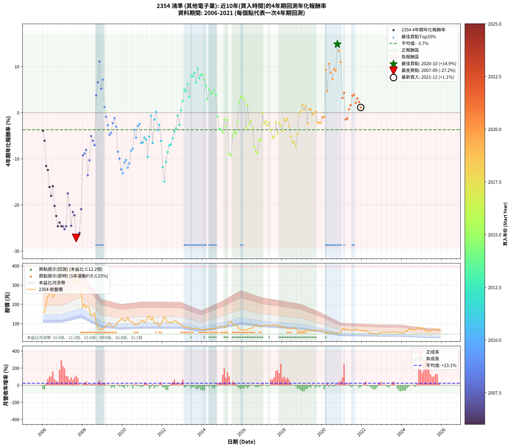

# 2354 鴻準 - 本益比與未來報酬率分析

!!! info "報告資訊"
    - **股票代號**: 2354
    - **公司名稱**: 鴻準
    - **產業別**: 其他電子業
    - **分析期間**: 2006-2021 (192 個數據點)
    - **資料來源**: Type 12 (ShowMonthlyK_ChartFlow) 月收盤價與本益比
    - **報酬率口徑**: 含現金股利 (簡化: 年度合計，假設每年7/1入帳)
    - **報告生成時間**: 2026-01-11 18:28:42 CST

## 📈 視覺化圖表

### 圖表1: 本益比 vs 未來報酬率關係

*圖表1：2354 鴻準 本益比與4年期未來報酬率關係 (2006-2021)*

### 圖表2: 歷年買入時點的4年期實際報酬率

*圖表2：2354 鴻準 歷年買入時點的4年期實際報酬率 (2006-2021)*

## 📍 買點訊號說明

本報告提供兩種買點提示訊號（顯示於圖表2的股價子圖中）：

### ▲ 小綠色三角形（回測驗證）
- **計算方式**: 使用全部歷史資料計算本益比第25百分位數
- **用途**: 事後驗證，顯示歷史上哪些時點確實為低估區
- **限制**: 當下無法判斷，僅供回測參考
- **特性**: 後見之明（Look-Ahead Bias）

### ▲ 小橘色三角形（即時訊號）
- **計算方式**: 使用截至當月的過去5年資料計算本益比第25百分位數
- **用途**: 實際投資決策，當時即可判斷
- **優勢**: 可操作性強，符合實務需求
- **特性**: 無後見之明，滾動窗口計算

!!! tip "如何使用兩種訊號"
    - **綠色▲** 幫助理解歷史估值機會，驗證策略有效性
    - **橘色▲** 可作為實際買進參考，但仍需搭配基本面分析
    - 兩種訊號重疊時，表示即時判斷與事後驗證一致，信心度較高
    - 僅有綠色▲時，表示當時無法判斷（需要未來資料才能確認）
    - 僅有橘色▲時，表示即時判斷為買點，但事後可能不是最佳時機

## 📊 估值分析摘要

| 指標 | 數值 |
|:---:|:---:|
| **目前本益比** (2021-12) | **20.47 倍** |
| **歷史平均本益比** | 15.73 倍 |
| **估值水準** | 🔴 相對高估 |
| **預期4年年化報酬率** | **-8.37%** |
| **歷史平均報酬率** | -3.69% |
| **相關係數 (R²)** | 0.5602 |
| **趨勢線斜率** | -0.9859 |

!!! abstract "核心洞察"
    目前本益比顯著高於歷史平均，預期未來報酬率可能較低

    根據歷史數據回測，2354 鴻準 在目前本益比 **20.5倍** 的估值水準下，
    預期未來4年年化報酬率約為 **-8.4%**。

    **重要提醒**: 本分析基於歷史數據統計，實際報酬率會受到公司基本面變化、產業趨勢、
    總體經濟環境等多重因素影響。R² = 0.56 表示本益比可解釋約 56.0% 的報酬率變異。

## 📈 歷史估值統計

### 最佳買點 (最高報酬率)

| 項目 | 數值 |
|:---:|:---:|
| 起始時間 | 2020-10 |
| 當時本益比 | 13.83 倍 |
| 起始價格 | 50.1 元 |
| 4年後價格 | 80.6 元 |
| **4年年化報酬率** | **+14.86%** |

### 最差買點 (最低報酬率)

| 項目 | 數值 |
|:---:|:---:|
| 起始時間 | 2007-09 |
| 當時本益比 | 32.99 倍 |
| 起始價格 | 375.0 元 |
| 4年後價格 | 99.0 元 |
| **4年年化報酬率** | **-27.15%** |

## 🎯 投資啟示

### 本益比與報酬率關係

趨勢線方程式: **y = -0.9859x + 11.8140**

!!! warning "強負相關"
    本益比與未來報酬率呈現強負相關。在高本益比時期買入，未來報酬率顯著較低；
    在低本益比時期買入，未來報酬率顯著較高。**估值紀律至關重要**。

### 估值區間建議

基於歷史數據分析:

- **🟢 低估區** (P/E < 12.6): 預期報酬率較高，可考慮增加持股
- **🟡 合理區** (P/E 12.6-18.9): 預期報酬率符合長期趨勢，正常持有
- **🔴 高估區** (P/E > 18.9): 預期報酬率較低，可考慮減碼或觀望

!!! danger "風險提示"
    - 過去表現不代表未來結果
    - 本分析假設公司基本面無重大結構性變化
    - 產業環境劇變可能使歷史規律失效
    - 應結合公司財報、產業趨勢、總體經濟等多重因素綜合判斷

!!! success "長期投資觀點"
    歷史數據顯示，在合理或低估的估值水準買入並長期持有，
    往往能獲得較佳的投資報酬。**耐心等待好價格**是價值投資的核心原則。

## 📊 數據品質

- **資料來源**: GoodInfo.tw Type 12 (ShowMonthlyK_ChartFlow)
- **資料頻率**: 月度收盤價與本益比
- **回測期間**: 2006-2021
- **數據點數量**: 192 個 (每個點代表一次4年期回測)

### 計算方法說明

1. **4年期年化報酬率**:
   - 對每個歷史時點，計算其後4年的實際投資報酬率
   - 期末價值(不含股利): 期末價格
   - 期末價值(含現金股利): 期末價格 + 持有期間內的現金股利合計 (簡化: 年度合計，假設每年7/1入帳)
   - 公式: 年化報酬率 = [(期末價值/期初價格)^(1/年數) - 1] × 100%

2. **本益比 (P/E Ratio)**:
   - 使用當時的月收盤價與EPS計算
   - 資料來源: Type 12 月度河流圖本益比數據

3. **趨勢線 (Linear Regression)**:
   - 使用最小平方法擬合線性趨勢線
   - R²值衡量本益比對報酬率的解釋能力

---

*本報告由 Stock Analysis System v1.9.0 自動生成*
*數據更新時間: 2026-01-11 18:28:42 CST*

## 📋 月度回測明細表

（每一列對應時間線圖中的一個買入點；可用來對照 SVG 圖上的每個點。）

| 買入月份 | 賣出月份 | 回測期限_年 | 實際持有年數 | 買入本益比_倍 | 買入收盤價_元 | 賣出收盤價_元 | 現金股利合計_元 | 總報酬率_pct | 年化報酬率_pct |
| --- | --- | --- | --- | --- | --- | --- | --- | --- | --- |
| 2006-01 | 2010-01 | 4 | 4.000 | 16.48 | 160.00 | 126.50 | 9.80 | -14.81 | -3.93 |
| 2006-02 | 2010-02 | 4 | 4.000 | 16.32 | 158.50 | 113.50 | 9.80 | -22.21 | -6.09 |
| 2006-03 | 2010-03 | 4 | 4.000 | 21.27 | 206.50 | 116.50 | 9.80 | -38.84 | -11.57 |
| 2006-04 | 2010-04 | 4 | 4.000 | 24.67 | 239.50 | 131.00 | 9.80 | -41.21 | -12.44 |
| 2006-05 | 2010-05 | 4 | 4.000 | 26.26 | 255.00 | 116.50 | 9.80 | -50.47 | -16.11 |
| 2006-06 | 2010-06 | 4 | 4.000 | 26.78 | 260.00 | 107.50 | 9.80 | -54.88 | -18.04 |
| 2006-07 | 2010-07 | 4 | 4.000 | 24.36 | 236.50 | 109.00 | 9.10 | -50.06 | -15.94 |
| 2006-08 | 2010-08 | 4 | 4.000 | 25.64 | 249.00 | 91.80 | 9.10 | -59.48 | -20.21 |
| 2006-09 | 2010-09 | 4 | 4.000 | 30.69 | 298.00 | 99.00 | 9.10 | -63.72 | -22.39 |
| 2006-10 | 2010-10 | 4 | 4.000 | 33.42 | 324.50 | 95.60 | 9.10 | -67.73 | -24.63 |
| 2006-11 | 2010-11 | 4 | 4.000 | 33.37 | 324.00 | 100.00 | 9.10 | -66.33 | -23.82 |
| 2006-12 | 2010-12 | 4 | 4.000 | 40.22 | 390.50 | 117.00 | 9.10 | -67.71 | -24.62 |
| 2007-01 | 2011-01 | 4 | 4.000 | 39.72 | 393.00 | 117.50 | 9.10 | -67.79 | -24.66 |
| 2007-02 | 2011-02 | 4 | 4.000 | 36.61 | 369.00 | 106.00 | 9.10 | -68.81 | -25.27 |
| 2007-03 | 2011-03 | 4 | 4.000 | 36.59 | 375.50 | 112.00 | 9.10 | -67.75 | -24.64 |
| 2007-04 | 2011-04 | 4 | 4.000 | 30.20 | 315.50 | 137.00 | 9.10 | -53.69 | -17.51 |
| 2007-05 | 2011-05 | 4 | 4.000 | 33.96 | 361.00 | 138.50 | 9.10 | -59.11 | -20.04 |
| 2007-06 | 2011-06 | 4 | 4.000 | 36.52 | 395.00 | 119.00 | 9.10 | -67.57 | -24.54 |
| 2007-07 | 2011-07 | 4 | 4.000 | 33.46 | 368.00 | 133.00 | 6.60 | -62.07 | -21.52 |
| 2007-08 | 2011-08 | 4 | 4.000 | 26.83 | 300.00 | 103.00 | 6.60 | -63.47 | -22.26 |
| 2007-09 | 2011-09 | 4 | 4.000 | 32.99 | 375.00 | 99.00 | 6.60 | -71.84 | -27.15 |
| 2007-10 | 2011-10 | 4 | 4.000 | 33.76 | 390.00 | 106.00 | 6.60 | -71.13 | -26.70 |
| 2007-11 | 2011-11 | 4 | 4.000 | 26.84 | 315.00 | 87.60 | 6.60 | -70.10 | -26.05 |
| 2007-12 | 2011-12 | 4 | 4.000 | 22.15 | 264.00 | 96.60 | 6.60 | -60.91 | -20.93 |
| 2008-01 | 2012-01 | 4 | 4.000 | 15.69 | 181.00 | 116.00 | 6.60 | -32.27 | -9.28 |
| 2008-02 | 2012-02 | 4 | 4.000 | 18.47 | 206.00 | 135.50 | 6.60 | -31.02 | -8.87 |
| 2008-03 | 2012-03 | 4 | 4.000 | 16.71 | 180.00 | 122.00 | 6.60 | -28.56 | -8.06 |
| 2008-04 | 2012-04 | 4 | 4.000 | 18.92 | 196.50 | 103.00 | 6.60 | -44.22 | -13.58 |
| 2008-05 | 2012-05 | 4 | 4.000 | 17.64 | 176.50 | 107.50 | 6.60 | -35.35 | -10.33 |
| 2008-06 | 2012-06 | 4 | 4.000 | 14.60 | 140.50 | 107.50 | 6.60 | -18.79 | -5.07 |
| 2008-07 | 2012-07 | 4 | 4.000 | 15.32 | 141.50 | 106.50 | 3.60 | -22.19 | -6.08 |
| 2008-08 | 2012-08 | 4 | 4.000 | 17.79 | 157.50 | 114.00 | 3.60 | -25.33 | -7.04 |
| 2008-09 | 2012-09 | 4 | 4.000 | 11.98 | 101.50 | 114.00 | 3.60 | +15.86 | +3.75 |
| 2008-10 | 2012-10 | 4 | 4.000 | 10.08 | 81.50 | 101.50 | 3.60 | +28.96 | +6.56 |
| 2008-11 | 2012-11 | 4 | 4.000 | 8.94 | 68.90 | 101.50 | 3.60 | +52.54 | +11.13 |
| 2008-12 | 2012-12 | 4 | 4.000 | 10.55 | 77.20 | 90.90 | 3.60 | +22.41 | +5.18 |
| 2009-01 | 2013-01 | 4 | 4.000 | 9.40 | 68.10 | 86.30 | 3.60 | +32.01 | +7.19 |
| 2009-02 | 2013-02 | 4 | 4.000 | 11.29 | 81.00 | 81.50 | 3.60 | +5.06 | +1.24 |
| 2009-03 | 2013-03 | 4 | 4.000 | 12.66 | 89.90 | 83.20 | 3.60 | -3.45 | -0.87 |
| 2009-04 | 2013-04 | 4 | 4.000 | 12.95 | 91.00 | 77.90 | 3.60 | -10.44 | -2.72 |
| 2009-05 | 2013-05 | 4 | 4.000 | 14.81 | 103.00 | 81.00 | 3.60 | -17.86 | -4.80 |
| 2009-06 | 2013-06 | 4 | 4.000 | 13.28 | 91.40 | 72.80 | 3.60 | -16.41 | -4.38 |
| 2009-07 | 2013-07 | 4 | 4.000 | 12.61 | 85.80 | 74.50 | 3.80 | -8.74 | -2.26 |
| 2009-08 | 2013-08 | 4 | 4.000 | 12.48 | 84.00 | 76.30 | 3.80 | -4.64 | -1.18 |
| 2009-09 | 2013-09 | 4 | 4.000 | 13.69 | 91.20 | 76.80 | 3.80 | -11.62 | -3.04 |
| 2009-10 | 2013-10 | 4 | 4.000 | 16.78 | 110.50 | 73.80 | 3.80 | -29.77 | -8.46 |
| 2009-11 | 2013-11 | 4 | 4.000 | 17.27 | 112.50 | 70.20 | 3.80 | -34.22 | -9.94 |
| 2009-12 | 2013-12 | 4 | 4.000 | 19.25 | 124.00 | 69.60 | 3.80 | -40.81 | -12.29 |
| 2010-01 | 2014-01 | 4 | 4.000 | 19.54 | 126.50 | 68.20 | 3.80 | -43.08 | -13.14 |
| 2010-02 | 2014-02 | 4 | 4.000 | 17.44 | 113.50 | 68.10 | 3.80 | -36.65 | -10.79 |
| 2010-03 | 2014-03 | 4 | 4.000 | 17.81 | 116.50 | 71.80 | 3.80 | -35.11 | -10.25 |
| 2010-04 | 2014-04 | 4 | 4.000 | 19.92 | 131.00 | 75.00 | 3.80 | -39.85 | -11.93 |
| 2010-05 | 2014-05 | 4 | 4.000 | 17.62 | 116.50 | 69.20 | 3.80 | -37.34 | -11.03 |
| 2010-06 | 2014-06 | 4 | 4.000 | 16.18 | 107.50 | 72.40 | 3.80 | -29.12 | -8.24 |
| 2010-07 | 2014-07 | 4 | 4.000 | 16.32 | 109.00 | 74.80 | 4.00 | -27.71 | -7.79 |
| 2010-08 | 2014-08 | 4 | 4.000 | 13.67 | 91.80 | 75.00 | 4.00 | -13.94 | -3.68 |
| 2010-09 | 2014-09 | 4 | 4.000 | 14.67 | 99.00 | 75.20 | 4.00 | -20.00 | -5.43 |
| 2010-10 | 2014-10 | 4 | 4.000 | 14.10 | 95.60 | 81.00 | 4.00 | -11.09 | -2.90 |
| 2010-11 | 2014-11 | 4 | 4.000 | 14.67 | 100.00 | 86.50 | 4.00 | -9.50 | -2.46 |
| 2010-12 | 2014-12 | 4 | 4.000 | 17.08 | 117.00 | 85.30 | 4.00 | -23.68 | -6.53 |
| 2011-01 | 2015-01 | 4 | 4.000 | 17.16 | 117.50 | 85.90 | 4.00 | -23.49 | -6.47 |
| 2011-02 | 2015-02 | 4 | 4.000 | 15.48 | 106.00 | 80.80 | 4.00 | -20.00 | -5.43 |
| 2011-03 | 2015-03 | 4 | 4.000 | 16.36 | 112.00 | 84.00 | 4.00 | -21.43 | -5.85 |
| 2011-04 | 2015-04 | 4 | 4.000 | 20.01 | 137.00 | 87.50 | 4.00 | -33.21 | -9.60 |
| 2011-05 | 2015-05 | 4 | 4.000 | 20.23 | 138.50 | 108.00 | 4.00 | -19.13 | -5.17 |
| 2011-06 | 2015-06 | 4 | 4.000 | 17.38 | 119.00 | 112.00 | 4.00 | -2.52 | -0.64 |
| 2011-07 | 2015-07 | 4 | 4.000 | 19.43 | 133.00 | 96.00 | 5.50 | -23.68 | -6.53 |
| 2011-08 | 2015-08 | 4 | 4.000 | 15.05 | 103.00 | 91.50 | 5.50 | -5.83 | -1.49 |
| 2011-09 | 2015-09 | 4 | 4.000 | 14.47 | 99.00 | 94.20 | 5.50 | +0.71 | +0.18 |
| 2011-10 | 2015-10 | 4 | 4.000 | 15.49 | 106.00 | 85.40 | 5.50 | -14.25 | -3.77 |
| 2011-11 | 2015-11 | 4 | 4.000 | 12.81 | 87.60 | 73.20 | 5.50 | -10.16 | -2.64 |
| 2011-12 | 2015-12 | 4 | 4.000 | 14.12 | 96.60 | 69.60 | 5.50 | -22.26 | -6.10 |
| 2012-01 | 2016-01 | 4 | 4.000 | 16.97 | 116.00 | 64.70 | 5.50 | -39.48 | -11.80 |
| 2012-02 | 2016-02 | 4 | 4.000 | 19.83 | 135.50 | 65.50 | 5.50 | -47.60 | -14.92 |
| 2012-03 | 2016-03 | 4 | 4.000 | 17.87 | 122.00 | 72.20 | 5.50 | -36.31 | -10.67 |
| 2012-04 | 2016-04 | 4 | 4.000 | 15.09 | 103.00 | 66.60 | 5.50 | -30.00 | -8.53 |
| 2012-05 | 2016-05 | 4 | 4.000 | 15.76 | 107.50 | 74.50 | 5.50 | -25.58 | -7.12 |
| 2012-06 | 2016-06 | 4 | 4.000 | 15.77 | 107.50 | 75.40 | 5.50 | -24.74 | -6.86 |
| 2012-07 | 2016-07 | 4 | 4.000 | 15.64 | 106.50 | 77.30 | 7.50 | -20.38 | -5.54 |
| 2012-08 | 2016-08 | 4 | 4.000 | 16.75 | 114.00 | 89.00 | 7.50 | -15.35 | -4.08 |
| 2012-09 | 2016-09 | 4 | 4.000 | 16.76 | 114.00 | 91.80 | 7.50 | -12.89 | -3.39 |
| 2012-10 | 2016-10 | 4 | 4.000 | 14.93 | 101.50 | 91.60 | 7.50 | -2.36 | -0.60 |
| 2012-11 | 2016-11 | 4 | 4.000 | 14.94 | 101.50 | 83.60 | 7.50 | -10.25 | -2.67 |
| 2012-12 | 2016-12 | 4 | 4.000 | 13.39 | 90.90 | 85.30 | 7.50 | +2.09 | +0.52 |
| 2013-01 | 2017-01 | 4 | 4.000 | 12.93 | 86.30 | 87.90 | 7.50 | +10.54 | +2.54 |
| 2013-02 | 2017-02 | 4 | 4.000 | 12.43 | 81.50 | 91.70 | 7.50 | +21.72 | +5.04 |
| 2013-03 | 2017-03 | 4 | 4.000 | 12.92 | 83.20 | 92.50 | 7.50 | +20.19 | +4.71 |
| 2013-04 | 2017-04 | 4 | 4.000 | 12.32 | 77.90 | 92.00 | 7.50 | +27.73 | +6.31 |
| 2013-05 | 2017-05 | 4 | 4.000 | 13.05 | 81.00 | 85.20 | 7.50 | +14.44 | +3.43 |
| 2013-06 | 2017-06 | 4 | 4.000 | 11.95 | 72.80 | 91.80 | 7.50 | +36.40 | +8.07 |
| 2013-07 | 2017-07 | 4 | 4.000 | 12.47 | 74.50 | 90.80 | 10.30 | +35.70 | +7.93 |
| 2013-08 | 2017-08 | 4 | 4.000 | 13.03 | 76.30 | 95.80 | 10.30 | +39.06 | +8.59 |
| 2013-09 | 2017-09 | 4 | 4.000 | 13.38 | 76.80 | 88.50 | 10.30 | +28.65 | +6.50 |
| 2013-10 | 2017-10 | 4 | 4.000 | 13.12 | 73.80 | 96.10 | 10.30 | +44.17 | +9.58 |
| 2013-11 | 2017-11 | 4 | 4.000 | 12.75 | 70.20 | 83.40 | 10.30 | +33.48 | +7.49 |
| 2013-12 | 2017-12 | 4 | 4.000 | 12.91 | 69.60 | 85.20 | 10.30 | +37.21 | +8.23 |
| 2014-01 | 2018-01 | 4 | 4.000 | 12.38 | 68.20 | 83.40 | 10.30 | +37.39 | +8.27 |
| 2014-02 | 2018-02 | 4 | 4.000 | 12.09 | 68.10 | 79.40 | 10.30 | +31.72 | +7.13 |
| 2014-03 | 2018-03 | 4 | 4.000 | 12.48 | 71.80 | 79.60 | 10.30 | +25.21 | +5.78 |
| 2014-04 | 2018-04 | 4 | 4.000 | 12.77 | 75.00 | 73.90 | 10.30 | +12.27 | +2.93 |
| 2014-05 | 2018-05 | 4 | 4.000 | 11.54 | 69.20 | 73.80 | 10.30 | +21.53 | +5.00 |
| 2014-06 | 2018-06 | 4 | 4.000 | 11.84 | 72.40 | 74.60 | 10.30 | +17.27 | +4.06 |
| 2014-07 | 2018-07 | 4 | 4.000 | 12.00 | 74.80 | 75.90 | 12.90 | +18.72 | +4.38 |
| 2014-08 | 2018-08 | 4 | 4.000 | 11.80 | 75.00 | 78.00 | 12.90 | +21.20 | +4.92 |
| 2014-09 | 2018-09 | 4 | 4.000 | 11.61 | 75.20 | 74.50 | 12.90 | +16.22 | +3.83 |
| 2014-10 | 2018-10 | 4 | 4.000 | 12.28 | 81.00 | 65.60 | 12.90 | -3.09 | -0.78 |
| 2014-11 | 2018-11 | 4 | 4.000 | 12.87 | 86.50 | 62.20 | 12.90 | -13.18 | -3.47 |
| 2014-12 | 2018-12 | 4 | 4.000 | 12.47 | 85.30 | 60.50 | 12.90 | -13.95 | -3.69 |
| 2015-01 | 2019-01 | 4 | 4.000 | 12.27 | 85.90 | 59.20 | 12.90 | -16.07 | -4.28 |
| 2015-02 | 2019-02 | 4 | 4.000 | 11.28 | 80.80 | 63.10 | 12.90 | -5.94 | -1.52 |
| 2015-03 | 2019-03 | 4 | 4.000 | 11.48 | 84.00 | 61.50 | 12.90 | -11.43 | -2.99 |
| 2015-04 | 2019-04 | 4 | 4.000 | 11.70 | 87.50 | 69.20 | 12.90 | -6.17 | -1.58 |
| 2015-05 | 2019-05 | 4 | 4.000 | 14.14 | 108.00 | 61.50 | 12.90 | -31.11 | -8.90 |
| 2015-06 | 2019-06 | 4 | 4.000 | 14.36 | 112.00 | 63.10 | 12.90 | -32.14 | -9.24 |
| 2015-07 | 2019-07 | 4 | 4.000 | 12.06 | 96.00 | 64.30 | 13.60 | -18.85 | -5.09 |
| 2015-08 | 2019-08 | 4 | 4.000 | 11.27 | 91.50 | 63.40 | 13.60 | -15.85 | -4.22 |
| 2015-09 | 2019-09 | 4 | 4.000 | 11.38 | 94.20 | 64.70 | 13.60 | -16.88 | -4.52 |
| 2015-10 | 2019-10 | 4 | 4.000 | 10.12 | 85.40 | 65.20 | 13.60 | -7.73 | -1.99 |
| 2015-11 | 2019-11 | 4 | 4.000 | 8.51 | 73.20 | 66.60 | 13.60 | +9.56 | +2.31 |
| 2015-12 | 2019-12 | 4 | 4.000 | 7.95 | 69.60 | 66.20 | 13.60 | +14.66 | +3.48 |
| 2016-01 | 2020-01 | 4 | 4.000 | 7.47 | 64.70 | 60.50 | 13.60 | +14.53 | +3.45 |
| 2016-02 | 2020-02 | 4 | 4.000 | 7.65 | 65.50 | 59.50 | 13.60 | +11.60 | +2.78 |
| 2016-03 | 2020-03 | 4 | 4.000 | 8.53 | 72.20 | 49.50 | 13.60 | -12.60 | -3.31 |
| 2016-04 | 2020-04 | 4 | 4.000 | 7.96 | 66.60 | 57.60 | 13.60 | +6.91 | +1.68 |
| 2016-05 | 2020-05 | 4 | 4.000 | 9.01 | 74.50 | 53.90 | 13.60 | -9.40 | -2.44 |
| 2016-06 | 2020-06 | 4 | 4.000 | 9.22 | 75.40 | 56.50 | 13.60 | -7.03 | -1.81 |
| 2016-07 | 2020-07 | 4 | 4.000 | 9.57 | 77.30 | 54.20 | 13.10 | -12.94 | -3.40 |
| 2016-08 | 2020-08 | 4 | 4.000 | 11.15 | 89.00 | 52.20 | 13.10 | -26.63 | -7.45 |
| 2016-09 | 2020-09 | 4 | 4.000 | 11.65 | 91.80 | 51.50 | 13.10 | -29.63 | -8.41 |
| 2016-10 | 2020-10 | 4 | 4.000 | 11.77 | 91.60 | 50.10 | 13.10 | -31.00 | -8.86 |
| 2016-11 | 2020-11 | 4 | 4.000 | 10.87 | 83.60 | 52.60 | 13.10 | -21.41 | -5.85 |
| 2016-12 | 2020-12 | 4 | 4.000 | 11.24 | 85.30 | 53.40 | 13.10 | -22.04 | -6.03 |
| 2017-01 | 2021-01 | 4 | 4.000 | 11.65 | 87.90 | 74.80 | 13.10 | +0.00 | +0.00 |
| 2017-02 | 2021-02 | 4 | 4.000 | 12.23 | 91.70 | 70.00 | 13.10 | -9.38 | -2.43 |
| 2017-03 | 2021-03 | 4 | 4.000 | 12.41 | 92.50 | 72.60 | 13.10 | -7.35 | -1.89 |
| 2017-04 | 2021-04 | 4 | 4.000 | 12.42 | 92.00 | 69.00 | 13.10 | -10.76 | -2.81 |
| 2017-05 | 2021-05 | 4 | 4.000 | 11.57 | 85.20 | 65.30 | 13.10 | -7.98 | -2.06 |
| 2017-06 | 2021-06 | 4 | 4.000 | 12.54 | 91.80 | 65.70 | 13.10 | -14.16 | -3.75 |
| 2017-07 | 2021-07 | 4 | 4.000 | 12.48 | 90.80 | 61.60 | 11.10 | -19.93 | -5.41 |
| 2017-08 | 2021-08 | 4 | 4.000 | 13.25 | 95.80 | 66.30 | 11.10 | -19.21 | -5.19 |
| 2017-09 | 2021-09 | 4 | 4.000 | 12.32 | 88.50 | 70.30 | 11.10 | -8.02 | -2.07 |
| 2017-10 | 2021-10 | 4 | 4.000 | 13.46 | 96.10 | 68.80 | 11.10 | -16.86 | -4.51 |
| 2017-11 | 2021-11 | 4 | 4.000 | 11.75 | 83.40 | 65.20 | 11.10 | -8.51 | -2.20 |
| 2017-12 | 2021-12 | 4 | 4.000 | 12.09 | 85.20 | 64.90 | 11.10 | -10.80 | -2.82 |
| 2018-01 | 2022-01 | 4 | 4.000 | 11.91 | 83.40 | 60.00 | 11.10 | -14.75 | -3.91 |
| 2018-02 | 2022-02 | 4 | 4.000 | 11.42 | 79.40 | 63.80 | 11.10 | -5.67 | -1.45 |
| 2018-03 | 2022-03 | 4 | 4.000 | 11.53 | 79.60 | 62.80 | 11.10 | -7.16 | -1.84 |
| 2018-04 | 2022-04 | 4 | 4.000 | 10.78 | 73.90 | 59.00 | 11.10 | -5.14 | -1.31 |
| 2018-05 | 2022-05 | 4 | 4.000 | 10.84 | 73.80 | 54.60 | 11.10 | -10.98 | -2.86 |
| 2018-06 | 2022-06 | 4 | 4.000 | 11.04 | 74.60 | 49.30 | 11.10 | -19.03 | -5.14 |
| 2018-07 | 2022-07 | 4 | 4.000 | 11.31 | 75.90 | 49.25 | 9.20 | -22.99 | -6.32 |
| 2018-08 | 2022-08 | 4 | 4.000 | 11.71 | 78.00 | 50.60 | 9.20 | -23.33 | -6.43 |
| 2018-09 | 2022-09 | 4 | 4.000 | 11.26 | 74.50 | 45.85 | 9.20 | -26.11 | -7.28 |
| 2018-10 | 2022-10 | 4 | 4.000 | 9.99 | 65.60 | 45.20 | 9.20 | -17.07 | -4.57 |
| 2018-11 | 2022-11 | 4 | 4.000 | 9.54 | 62.20 | 52.10 | 9.20 | -1.45 | -0.36 |
| 2018-12 | 2022-12 | 4 | 4.000 | 9.35 | 60.50 | 51.90 | 9.20 | +0.99 | +0.25 |
| 2019-01 | 2023-01 | 4 | 4.000 | 9.32 | 59.20 | 54.20 | 9.20 | +7.09 | +1.73 |
| 2019-02 | 2023-02 | 4 | 4.000 | 10.13 | 63.10 | 55.50 | 9.20 | +2.54 | +0.63 |
| 2019-03 | 2023-03 | 4 | 4.000 | 10.06 | 61.50 | 55.90 | 9.20 | +5.85 | +1.43 |
| 2019-04 | 2023-04 | 4 | 4.000 | 11.55 | 69.20 | 53.90 | 9.20 | -8.82 | -2.28 |
| 2019-05 | 2023-05 | 4 | 4.000 | 10.47 | 61.50 | 54.30 | 9.20 | +3.25 | +0.80 |
| 2019-06 | 2023-06 | 4 | 4.000 | 10.96 | 63.10 | 55.60 | 9.20 | +2.69 | +0.67 |
| 2019-07 | 2023-07 | 4 | 4.000 | 11.41 | 64.30 | 55.70 | 7.60 | -1.56 | -0.39 |
| 2019-08 | 2023-08 | 4 | 4.000 | 11.49 | 63.40 | 55.70 | 7.60 | -0.16 | -0.04 |
| 2019-09 | 2023-09 | 4 | 4.000 | 11.99 | 64.70 | 57.70 | 7.60 | +0.93 | +0.23 |
| 2019-10 | 2023-10 | 4 | 4.000 | 12.35 | 65.20 | 52.40 | 7.60 | -7.98 | -2.06 |
| 2019-11 | 2023-11 | 4 | 4.000 | 12.91 | 66.60 | 53.30 | 7.60 | -8.56 | -2.21 |
| 2019-12 | 2023-12 | 4 | 4.000 | 13.13 | 66.20 | 53.10 | 7.60 | -8.31 | -2.15 |
| 2020-01 | 2024-01 | 4 | 4.000 | 12.35 | 60.50 | 50.50 | 7.60 | -3.97 | -1.01 |
| 2020-02 | 2024-02 | 4 | 4.000 | 12.51 | 59.50 | 49.70 | 7.60 | -3.70 | -0.94 |
| 2020-03 | 2024-03 | 4 | 4.000 | 10.73 | 49.50 | 63.00 | 7.60 | +42.63 | +9.28 |
| 2020-04 | 2024-04 | 4 | 4.000 | 12.88 | 57.60 | 61.60 | 7.60 | +20.14 | +4.69 |
| 2020-05 | 2024-05 | 4 | 4.000 | 12.44 | 53.90 | 73.10 | 7.60 | +49.72 | +10.62 |
| 2020-06 | 2024-06 | 4 | 4.000 | 13.48 | 56.50 | 71.30 | 7.60 | +39.65 | +8.71 |
| 2020-07 | 2024-07 | 4 | 4.000 | 13.39 | 54.20 | 65.30 | 6.60 | +32.66 | +7.32 |
| 2020-08 | 2024-08 | 4 | 4.000 | 13.36 | 52.20 | 68.40 | 6.60 | +43.68 | +9.48 |
| 2020-09 | 2024-09 | 4 | 4.000 | 13.68 | 51.50 | 66.40 | 6.60 | +41.75 | +9.11 |
| 2020-10 | 2024-10 | 4 | 4.000 | 13.83 | 50.10 | 80.60 | 6.60 | +74.05 | +14.86 |
| 2020-11 | 2024-11 | 4 | 4.000 | 15.11 | 52.60 | 80.40 | 6.60 | +65.40 | +13.41 |
| 2020-12 | 2024-12 | 4 | 4.000 | 15.99 | 53.40 | 74.40 | 6.60 | +51.69 | +10.98 |
| 2021-01 | 2025-01 | 4 | 4.000 | 22.49 | 74.80 | 78.20 | 6.60 | +13.37 | +3.19 |
| 2021-02 | 2025-02 | 4 | 4.000 | 21.14 | 70.00 | 76.30 | 6.60 | +18.43 | +4.32 |
| 2021-03 | 2025-03 | 4 | 4.000 | 22.02 | 72.60 | 61.80 | 6.60 | -5.79 | -1.48 |
| 2021-04 | 2025-04 | 4 | 4.000 | 21.02 | 69.00 | 59.00 | 6.60 | -4.93 | -1.26 |
| 2021-05 | 2025-05 | 4 | 4.000 | 19.97 | 65.30 | 60.60 | 6.60 | +2.91 | +0.72 |
| 2021-06 | 2025-06 | 4 | 4.000 | 20.18 | 65.70 | 63.50 | 6.60 | +6.70 | +1.63 |
| 2021-07 | 2025-07 | 4 | 4.000 | 19.01 | 61.60 | 64.90 | 6.20 | +15.42 | +3.65 |
| 2021-08 | 2025-08 | 4 | 4.000 | 20.55 | 66.30 | 71.10 | 6.20 | +16.59 | +3.91 |
| 2021-09 | 2025-09 | 4 | 4.000 | 21.88 | 70.30 | 70.30 | 6.20 | +8.82 | +2.14 |
| 2021-10 | 2025-10 | 4 | 4.000 | 21.51 | 68.80 | 71.50 | 6.20 | +12.94 | +3.09 |
| 2021-11 | 2025-11 | 4 | 4.000 | 20.48 | 65.20 | 65.20 | 6.20 | +9.51 | +2.30 |
| 2021-12 | 2025-12 | 4 | 4.000 | 20.47 | 64.90 | 61.70 | 6.20 | +4.62 | +1.14 |
