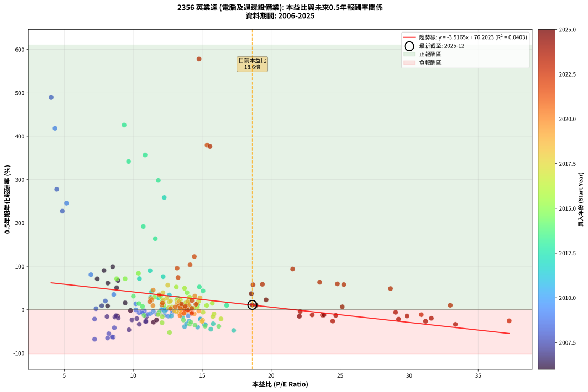
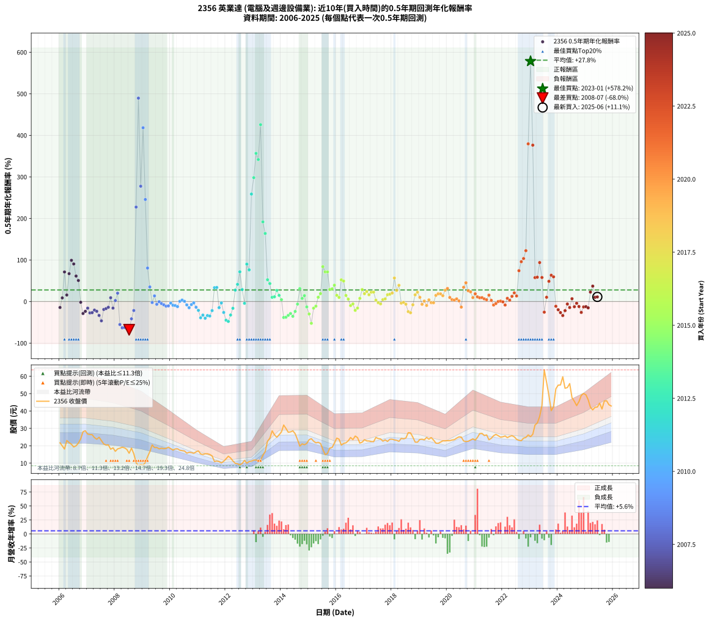

# 2356 英業達 - 本益比與未來報酬率分析

!!! info "報告資訊"
    - **股票代號**: 2356
    - **公司名稱**: 英業達
    - **產業別**: 電腦及週邊設備業
    - **分析期間**: 2006-2025 (234 個數據點)
    - **資料來源**: Type 12 (ShowMonthlyK_ChartFlow) 月收盤價與本益比
    - **報酬率口徑**: 含現金股利 (簡化: 年度合計，假設每年7/1入帳)
    - **報告生成時間**: 2026-01-12 20:41:45 CST

## 📈 視覺化圖表

### 圖表1: 本益比 vs 未來報酬率關係

*圖表1：2356 英業達 本益比與0.5年期未來報酬率關係 (2006-2025)*

### 圖表2: 歷年買入時點的0.5年期實際報酬率

*圖表2：2356 英業達 歷年買入時點的0.5年期實際報酬率 (2006-2025)*

## 📍 買點訊號說明

本報告提供兩種買點提示訊號（顯示於圖表2的股價子圖中）：

### ▲ 小綠色三角形（回測驗證）
- **計算方式**: 使用全部歷史資料計算本益比第25百分位數
- **用途**: 事後驗證，顯示歷史上哪些時點確實為低估區
- **限制**: 當下無法判斷，僅供回測參考
- **特性**: 後見之明（Look-Ahead Bias）

### ▲ 小橘色三角形（即時訊號）
- **計算方式**: 使用截至當月的過去5年資料計算本益比第25百分位數
- **用途**: 實際投資決策，當時即可判斷
- **優勢**: 可操作性強，符合實務需求
- **特性**: 無後見之明，滾動窗口計算

!!! tip "如何使用兩種訊號"
    - **綠色▲** 幫助理解歷史估值機會，驗證策略有效性
    - **橘色▲** 可作為實際買進參考，但仍需搭配基本面分析
    - 兩種訊號重疊時，表示即時判斷與事後驗證一致，信心度較高
    - 僅有綠色▲時，表示當時無法判斷（需要未來資料才能確認）
    - 僅有橘色▲時，表示即時判斷為買點，但事後可能不是最佳時機

## 📊 估值分析摘要

| 指標 | 數值 |
|:---:|:---:|
| **目前本益比** (2025-06) | **18.63 倍** |
| **歷史平均本益比** | 13.76 倍 |
| **估值水準** | 🔴 相對高估 |
| **預期0.5年年化報酬率** | **+10.69%** |
| **歷史平均報酬率** | +27.80% |
| **相關係數 (R²)** | 0.0403 |
| **趨勢線斜率** | -3.5165 |

!!! abstract "核心洞察"
    目前本益比顯著高於歷史平均，預期未來報酬率可能較低

    根據歷史數據回測，2356 英業達 在目前本益比 **18.6倍** 的估值水準下，
    預期未來0.5年年化報酬率約為 **+10.7%**。

    **重要提醒**: 本分析基於歷史數據統計，實際報酬率會受到公司基本面變化、產業趨勢、
    總體經濟環境等多重因素影響。R² = 0.04 表示本益比可解釋約 4.0% 的報酬率變異。

## 📈 歷史估值統計

### 最佳買點 (最高報酬率)

| 項目 | 數值 |
|:---:|:---:|
| 起始時間 | 2023-01 |
| 當時本益比 | 14.77 倍 |
| 起始價格 | 25.2 元 |
| 0.5年後價格 | 63.7 元 |
| **0.5年年化報酬率** | **+578.22%** |

### 最差買點 (最低報酬率)

| 項目 | 數值 |
|:---:|:---:|
| 起始時間 | 2008-07 |
| 當時本益比 | 7.20 倍 |
| 起始價格 | 15.7 元 |
| 0.5年後價格 | 8.8 元 |
| **0.5年年化報酬率** | **-67.95%** |

## 🎯 投資啟示

### 本益比與報酬率關係

趨勢線方程式: **y = -3.5165x + 76.2023**

!!! warning "強負相關"
    本益比與未來報酬率呈現強負相關。在高本益比時期買入，未來報酬率顯著較低；
    在低本益比時期買入，未來報酬率顯著較高。**估值紀律至關重要**。

### 估值區間建議

基於歷史數據分析:

- **🟢 低估區** (P/E < 11.0): 預期報酬率較高，可考慮增加持股
- **🟡 合理區** (P/E 11.0-16.5): 預期報酬率符合長期趨勢，正常持有
- **🔴 高估區** (P/E > 16.5): 預期報酬率較低，可考慮減碼或觀望

!!! danger "風險提示"
    - 過去表現不代表未來結果
    - 本分析假設公司基本面無重大結構性變化
    - 產業環境劇變可能使歷史規律失效
    - 應結合公司財報、產業趨勢、總體經濟等多重因素綜合判斷

!!! success "長期投資觀點"
    歷史數據顯示，在合理或低估的估值水準買入並長期持有，
    往往能獲得較佳的投資報酬。**耐心等待好價格**是價值投資的核心原則。

## 📊 數據品質

- **資料來源**: GoodInfo.tw Type 12 (ShowMonthlyK_ChartFlow)
- **資料頻率**: 月度收盤價與本益比
- **回測期間**: 2006-2025
- **數據點數量**: 234 個 (每個點代表一次0.5年期回測)

### 計算方法說明

1. **0.5年期年化報酬率**:
   - 對每個歷史時點，計算其後0.5年的實際投資報酬率
   - 期末價值(不含股利): 期末價格
   - 期末價值(含現金股利): 期末價格 + 持有期間內的現金股利合計 (簡化: 年度合計，假設每年7/1入帳)
   - 公式: 年化報酬率 = [(期末價值/期初價格)^(1/年數) - 1] × 100%

2. **本益比 (P/E Ratio)**:
   - 使用當時的月收盤價與EPS計算
   - 資料來源: Type 12 月度河流圖本益比數據

3. **趨勢線 (Linear Regression)**:
   - 使用最小平方法擬合線性趨勢線
   - R²值衡量本益比對報酬率的解釋能力

---

*本報告由 Stock Analysis System v1.9.0 自動生成*
*數據更新時間: 2026-01-12 20:41:45 CST*

## 📋 月度回測明細表

（每一列對應時間線圖中的一個買入點；可用來對照 SVG 圖上的每個點。）

| 買入月份 | 賣出月份 | 回測期限_年 | 實際持有年數 | 買入本益比_倍 | 買入收盤價_元 | 賣出收盤價_元 | 現金股利合計_元 | 總報酬率_pct | 年化報酬率_pct |
| --- | --- | --- | --- | --- | --- | --- | --- | --- | --- |
| 2006-01 | 2006-07 | 0.5 | 0.496 | 8.86 | 21.70 | 19.30 | 0.80 | -7.37 | -14.32 |
| 2006-02 | 2006-08 | 0.5 | 0.498 | 8.14 | 19.95 | 20.00 | 0.80 | +4.26 | +8.73 |
| 2006-03 | 2006-10 | 0.5 | 0.586 | 7.39 | 18.10 | 24.00 | 0.80 | +37.02 | +71.18 |
| 2006-04 | 2006-10 | 0.5 | 0.501 | 9.41 | 23.05 | 24.00 | 0.80 | +7.59 | +15.73 |
| 2006-05 | 2006-12 | 0.5 | 0.586 | 8.90 | 21.80 | 28.65 | 0.80 | +35.09 | +67.09 |
| 2006-06 | 2006-12 | 0.5 | 0.501 | 8.51 | 20.85 | 28.65 | 0.80 | +41.25 | +99.22 |
| 2006-07 | 2007-01 | 0.5 | 0.504 | 7.88 | 19.30 | 26.70 | 0.00 | +38.34 | +90.46 |
| 2006-08 | 2007-03 | 0.5 | 0.580 | 8.16 | 20.00 | 26.40 | 0.00 | +32.00 | +61.34 |
| 2006-09 | 2007-03 | 0.5 | 0.496 | 8.80 | 21.55 | 26.40 | 0.00 | +22.51 | +50.62 |
| 2006-10 | 2007-05 | 0.5 | 0.580 | 9.80 | 24.00 | 23.75 | 0.00 | -1.04 | -1.79 |
| 2006-11 | 2007-05 | 0.5 | 0.496 | 11.47 | 28.10 | 23.75 | 0.00 | -15.48 | -28.78 |
| 2006-12 | 2007-07 | 0.5 | 0.580 | 11.69 | 28.65 | 23.00 | 1.50 | -14.49 | -23.63 |
| 2007-01 | 2007-07 | 0.5 | 0.496 | 10.95 | 26.70 | 23.00 | 1.50 | -8.24 | -15.93 |
| 2007-02 | 2007-08 | 0.5 | 0.498 | 10.89 | 26.45 | 21.05 | 1.50 | -14.74 | -27.40 |
| 2007-03 | 2007-10 | 0.5 | 0.586 | 10.92 | 26.40 | 20.50 | 1.50 | -16.67 | -26.74 |
| 2007-04 | 2007-10 | 0.5 | 0.501 | 10.26 | 24.70 | 20.50 | 1.50 | -10.93 | -20.63 |
| 2007-05 | 2007-12 | 0.5 | 0.586 | 9.91 | 23.75 | 18.80 | 1.50 | -14.53 | -23.50 |
| 2007-06 | 2007-12 | 0.5 | 0.501 | 10.44 | 24.90 | 18.80 | 1.50 | -18.47 | -33.48 |
| 2007-07 | 2008-01 | 0.5 | 0.504 | 9.69 | 23.00 | 16.80 | 0.00 | -26.96 | -46.40 |
| 2007-08 | 2008-03 | 0.5 | 0.583 | 8.91 | 21.05 | 18.60 | 0.00 | -11.64 | -19.12 |
| 2007-09 | 2008-03 | 0.5 | 0.498 | 8.67 | 20.40 | 18.60 | 0.00 | -8.82 | -16.92 |
| 2007-10 | 2008-05 | 0.5 | 0.583 | 8.75 | 20.50 | 18.80 | 0.00 | -8.29 | -13.80 |
| 2007-11 | 2008-05 | 0.5 | 0.498 | 7.72 | 18.00 | 18.80 | 0.00 | +4.44 | +9.12 |
| 2007-12 | 2008-07 | 0.5 | 0.583 | 8.10 | 18.80 | 15.70 | 1.30 | -9.57 | -15.85 |
| 2008-01 | 2008-07 | 0.5 | 0.498 | 7.30 | 16.80 | 15.70 | 1.30 | +1.19 | +2.40 |
| 2008-02 | 2008-08 | 0.5 | 0.501 | 7.98 | 18.20 | 18.65 | 1.30 | +9.62 | +20.11 |
| 2008-03 | 2008-10 | 0.5 | 0.586 | 8.23 | 18.60 | 10.30 | 1.30 | -37.63 | -55.33 |
| 2008-04 | 2008-10 | 0.5 | 0.501 | 8.55 | 19.15 | 10.30 | 1.30 | -39.43 | -63.23 |
| 2008-05 | 2008-12 | 0.5 | 0.586 | 8.47 | 18.80 | 9.25 | 1.30 | -43.88 | -62.70 |
| 2008-06 | 2008-12 | 0.5 | 0.501 | 8.14 | 17.90 | 9.25 | 1.30 | -41.06 | -65.19 |
| 2008-07 | 2009-01 | 0.5 | 0.504 | 7.20 | 15.70 | 8.85 | 0.00 | -43.63 | -67.95 |
| 2008-08 | 2009-03 | 0.5 | 0.580 | 8.63 | 18.65 | 13.65 | 0.00 | -26.81 | -41.59 |
| 2008-09 | 2009-03 | 0.5 | 0.496 | 7.20 | 15.40 | 13.65 | 0.00 | -11.36 | -21.61 |
| 2008-10 | 2009-05 | 0.5 | 0.580 | 4.86 | 10.30 | 20.50 | 0.00 | +99.03 | +227.34 |
| 2008-11 | 2009-05 | 0.5 | 0.496 | 4.05 | 8.51 | 20.50 | 0.00 | +140.89 | +489.53 |
| 2008-12 | 2009-07 | 0.5 | 0.580 | 4.45 | 9.25 | 19.00 | 1.00 | +116.22 | +277.55 |
| 2009-01 | 2009-07 | 0.5 | 0.496 | 4.33 | 8.85 | 19.00 | 1.00 | +125.99 | +418.24 |
| 2009-02 | 2009-08 | 0.5 | 0.498 | 5.16 | 10.35 | 18.20 | 1.00 | +85.51 | +245.59 |
| 2009-03 | 2009-10 | 0.5 | 0.586 | 6.93 | 13.65 | 18.30 | 1.00 | +41.39 | +80.61 |
| 2009-04 | 2009-10 | 0.5 | 0.501 | 8.59 | 16.60 | 18.30 | 1.00 | +16.27 | +35.09 |
| 2009-05 | 2009-12 | 0.5 | 0.586 | 10.81 | 20.50 | 19.20 | 1.00 | -1.46 | -2.48 |
| 2009-06 | 2009-12 | 0.5 | 0.501 | 10.19 | 18.95 | 19.20 | 1.00 | +6.60 | +13.60 |
| 2009-07 | 2010-01 | 0.5 | 0.504 | 10.42 | 19.00 | 18.35 | 0.00 | -3.42 | -6.68 |
| 2009-08 | 2010-03 | 0.5 | 0.580 | 10.19 | 18.20 | 18.15 | 0.00 | -0.27 | -0.47 |
| 2009-09 | 2010-03 | 0.5 | 0.496 | 10.63 | 18.60 | 18.15 | 0.00 | -2.42 | -4.82 |
| 2009-10 | 2010-05 | 0.5 | 0.580 | 10.68 | 18.30 | 17.45 | 0.00 | -4.64 | -7.87 |
| 2009-11 | 2010-05 | 0.5 | 0.496 | 11.03 | 18.50 | 17.45 | 0.00 | -5.68 | -11.12 |
| 2009-12 | 2010-07 | 0.5 | 0.580 | 11.71 | 19.20 | 17.00 | 1.00 | -6.25 | -10.52 |
| 2010-01 | 2010-07 | 0.5 | 0.496 | 11.46 | 18.35 | 17.00 | 1.00 | -1.91 | -3.81 |
| 2010-02 | 2010-08 | 0.5 | 0.498 | 11.23 | 17.55 | 15.75 | 1.00 | -4.56 | -8.94 |
| 2010-03 | 2010-10 | 0.5 | 0.586 | 11.90 | 18.15 | 16.10 | 1.00 | -5.79 | -9.67 |
| 2010-04 | 2010-10 | 0.5 | 0.501 | 12.28 | 18.25 | 16.10 | 1.00 | -6.30 | -12.18 |
| 2010-05 | 2010-12 | 0.5 | 0.586 | 12.05 | 17.45 | 16.50 | 1.00 | +0.29 | +0.49 |
| 2010-06 | 2010-12 | 0.5 | 0.501 | 12.20 | 17.20 | 16.50 | 1.00 | +1.74 | +3.51 |
| 2010-07 | 2011-01 | 0.5 | 0.504 | 12.39 | 17.00 | 17.05 | 0.00 | +0.29 | +0.58 |
| 2010-08 | 2011-03 | 0.5 | 0.580 | 11.81 | 15.75 | 15.00 | 0.00 | -4.76 | -8.06 |
| 2010-09 | 2011-03 | 0.5 | 0.496 | 12.55 | 16.25 | 15.00 | 0.00 | -7.69 | -14.92 |
| 2010-10 | 2011-05 | 0.5 | 0.580 | 12.81 | 16.10 | 15.40 | 0.00 | -4.35 | -7.37 |
| 2010-11 | 2011-05 | 0.5 | 0.496 | 12.85 | 15.65 | 15.40 | 0.00 | -1.60 | -3.20 |
| 2010-12 | 2011-07 | 0.5 | 0.580 | 13.98 | 16.50 | 14.15 | 1.00 | -8.18 | -13.67 |
| 2011-01 | 2011-07 | 0.5 | 0.496 | 14.86 | 17.05 | 14.15 | 1.00 | -11.14 | -21.20 |
| 2011-02 | 2011-08 | 0.5 | 0.498 | 13.72 | 15.30 | 10.95 | 1.00 | -21.89 | -39.09 |
| 2011-03 | 2011-10 | 0.5 | 0.586 | 13.86 | 15.00 | 10.90 | 1.00 | -20.66 | -32.63 |
| 2011-04 | 2011-10 | 0.5 | 0.501 | 14.67 | 15.40 | 10.90 | 1.00 | -22.72 | -40.22 |
| 2011-05 | 2011-12 | 0.5 | 0.586 | 15.14 | 15.40 | 11.10 | 1.00 | -21.42 | -33.73 |
| 2011-06 | 2011-12 | 0.5 | 0.501 | 15.23 | 15.00 | 11.10 | 1.00 | -19.33 | -34.86 |
| 2011-07 | 2012-01 | 0.5 | 0.504 | 14.86 | 14.15 | 12.50 | 0.00 | -11.66 | -21.82 |
| 2011-08 | 2012-03 | 0.5 | 0.583 | 11.90 | 10.95 | 12.95 | 0.00 | +18.26 | +33.33 |
| 2011-09 | 2012-03 | 0.5 | 0.498 | 12.62 | 11.20 | 12.95 | 0.00 | +15.62 | +33.82 |
| 2011-10 | 2012-05 | 0.5 | 0.583 | 12.75 | 10.90 | 9.93 | 0.00 | -8.90 | -14.77 |
| 2011-11 | 2012-05 | 0.5 | 0.498 | 12.28 | 10.10 | 9.93 | 0.00 | -1.68 | -3.35 |
| 2011-12 | 2012-07 | 0.5 | 0.583 | 14.05 | 11.10 | 8.99 | 0.30 | -16.31 | -26.31 |
| 2012-01 | 2012-07 | 0.5 | 0.498 | 15.62 | 12.50 | 8.99 | 0.30 | -25.68 | -44.88 |
| 2012-02 | 2012-08 | 0.5 | 0.501 | 17.28 | 14.00 | 9.80 | 0.30 | -27.86 | -47.88 |
| 2012-03 | 2012-10 | 0.5 | 0.586 | 15.79 | 12.95 | 9.99 | 0.30 | -20.54 | -32.46 |
| 2012-04 | 2012-10 | 0.5 | 0.501 | 13.55 | 11.25 | 9.99 | 0.30 | -8.53 | -16.31 |
| 2012-05 | 2012-12 | 0.5 | 0.586 | 11.82 | 9.93 | 11.15 | 0.30 | +15.31 | +27.52 |
| 2012-06 | 2012-12 | 0.5 | 0.501 | 11.33 | 9.63 | 11.15 | 0.30 | +18.90 | +41.27 |
| 2012-07 | 2013-01 | 0.5 | 0.504 | 10.45 | 8.99 | 11.80 | 0.00 | +31.26 | +71.58 |
| 2012-08 | 2013-03 | 0.5 | 0.580 | 11.26 | 9.80 | 11.35 | 0.00 | +15.82 | +28.79 |
| 2012-09 | 2013-03 | 0.5 | 0.496 | 13.18 | 11.60 | 11.35 | 0.00 | -2.16 | -4.30 |
| 2012-10 | 2013-05 | 0.5 | 0.580 | 11.22 | 9.99 | 14.50 | 0.00 | +45.15 | +90.01 |
| 2012-11 | 2013-05 | 0.5 | 0.496 | 12.17 | 10.95 | 14.50 | 0.00 | +32.42 | +76.24 |
| 2012-12 | 2013-07 | 0.5 | 0.580 | 12.25 | 11.15 | 22.60 | 0.80 | +109.87 | +258.65 |
| 2013-01 | 2013-07 | 0.5 | 0.496 | 11.82 | 11.80 | 22.60 | 0.80 | +98.31 | +298.11 |
| 2013-02 | 2013-08 | 0.5 | 0.498 | 10.86 | 11.80 | 24.35 | 0.80 | +113.14 | +356.64 |
| 2013-03 | 2013-10 | 0.5 | 0.586 | 9.66 | 11.35 | 26.30 | 0.80 | +138.77 | +341.69 |
| 2013-04 | 2013-10 | 0.5 | 0.501 | 9.34 | 11.80 | 26.30 | 0.80 | +129.66 | +425.65 |
| 2013-05 | 2013-12 | 0.5 | 0.586 | 10.73 | 14.50 | 26.35 | 0.80 | +87.24 | +191.69 |
| 2013-06 | 2013-12 | 0.5 | 0.501 | 11.60 | 16.70 | 26.35 | 0.80 | +62.57 | +163.78 |
| 2013-07 | 2014-01 | 0.5 | 0.504 | 14.79 | 22.60 | 27.95 | 0.00 | +23.67 | +52.46 |
| 2013-08 | 2014-03 | 0.5 | 0.580 | 15.06 | 24.35 | 30.00 | 0.00 | +23.20 | +43.26 |
| 2013-09 | 2014-03 | 0.5 | 0.496 | 16.77 | 28.60 | 30.00 | 0.00 | +4.90 | +10.12 |
| 2013-10 | 2014-05 | 0.5 | 0.580 | 14.67 | 26.30 | 28.00 | 0.00 | +6.46 | +11.40 |
| 2013-11 | 2014-05 | 0.5 | 0.496 | 13.23 | 24.90 | 28.00 | 0.00 | +12.45 | +26.72 |
| 2013-12 | 2014-07 | 0.5 | 0.580 | 13.38 | 26.35 | 26.95 | 1.60 | +8.35 | +14.82 |
| 2014-01 | 2014-07 | 0.5 | 0.496 | 14.18 | 27.95 | 26.95 | 1.60 | +2.15 | +4.38 |
| 2014-02 | 2014-08 | 0.5 | 0.498 | 16.20 | 31.95 | 23.50 | 1.60 | -21.44 | -38.39 |
| 2014-03 | 2014-10 | 0.5 | 0.586 | 15.21 | 30.00 | 21.10 | 1.60 | -24.33 | -37.87 |
| 2014-04 | 2014-10 | 0.5 | 0.501 | 14.09 | 27.80 | 21.10 | 1.60 | -18.35 | -33.27 |
| 2014-05 | 2014-12 | 0.5 | 0.586 | 14.18 | 28.00 | 21.35 | 1.60 | -18.04 | -28.78 |
| 2014-06 | 2014-12 | 0.5 | 0.501 | 14.48 | 28.60 | 21.35 | 1.60 | -19.76 | -35.55 |
| 2014-07 | 2015-01 | 0.5 | 0.504 | 13.64 | 26.95 | 23.50 | 0.00 | -12.80 | -23.81 |
| 2014-08 | 2015-03 | 0.5 | 0.580 | 11.89 | 23.50 | 22.65 | 0.00 | -3.62 | -6.15 |
| 2014-09 | 2015-03 | 0.5 | 0.496 | 10.01 | 19.80 | 22.65 | 0.00 | +14.39 | +31.18 |
| 2014-10 | 2015-05 | 0.5 | 0.580 | 10.67 | 21.10 | 22.00 | 0.00 | +4.27 | +7.46 |
| 2014-11 | 2015-05 | 0.5 | 0.496 | 10.41 | 20.60 | 22.00 | 0.00 | +6.80 | +14.19 |
| 2014-12 | 2015-07 | 0.5 | 0.580 | 10.78 | 21.35 | 17.95 | 1.75 | -7.73 | -12.94 |
| 2015-01 | 2015-07 | 0.5 | 0.496 | 12.09 | 23.50 | 17.95 | 1.75 | -16.17 | -29.95 |
| 2015-02 | 2015-08 | 0.5 | 0.498 | 12.63 | 24.10 | 14.90 | 1.75 | -30.91 | -52.39 |
| 2015-03 | 2015-10 | 0.5 | 0.586 | 12.10 | 22.65 | 18.70 | 1.75 | -9.71 | -16.00 |
| 2015-04 | 2015-10 | 0.5 | 0.501 | 11.81 | 21.70 | 18.70 | 1.75 | -5.76 | -11.17 |
| 2015-05 | 2015-12 | 0.5 | 0.586 | 12.22 | 22.00 | 21.55 | 1.75 | +5.91 | +10.29 |
| 2015-06 | 2015-12 | 0.5 | 0.501 | 12.10 | 21.35 | 21.55 | 1.75 | +9.13 | +19.06 |
| 2015-07 | 2016-01 | 0.5 | 0.504 | 10.38 | 17.95 | 24.40 | 0.00 | +35.93 | +83.93 |
| 2015-08 | 2016-03 | 0.5 | 0.583 | 8.80 | 14.90 | 20.40 | 0.00 | +36.91 | +71.38 |
| 2015-09 | 2016-03 | 0.5 | 0.498 | 9.41 | 15.60 | 20.40 | 0.00 | +30.77 | +71.32 |
| 2015-10 | 2016-05 | 0.5 | 0.583 | 11.53 | 18.70 | 21.70 | 0.00 | +16.04 | +29.06 |
| 2015-11 | 2016-05 | 0.5 | 0.498 | 11.98 | 19.00 | 21.70 | 0.00 | +14.21 | +30.56 |
| 2015-12 | 2016-07 | 0.5 | 0.583 | 13.90 | 21.55 | 24.75 | 1.40 | +21.35 | +39.34 |
| 2016-01 | 2016-07 | 0.5 | 0.498 | 15.73 | 24.40 | 24.75 | 1.40 | +7.17 | +14.91 |
| 2016-02 | 2016-08 | 0.5 | 0.501 | 15.32 | 23.80 | 23.55 | 1.40 | +4.83 | +9.88 |
| 2016-03 | 2016-10 | 0.5 | 0.586 | 13.12 | 20.40 | 24.70 | 1.40 | +27.94 | +52.28 |
| 2016-04 | 2016-10 | 0.5 | 0.501 | 13.72 | 21.35 | 24.70 | 1.40 | +22.25 | +49.32 |
| 2016-05 | 2016-12 | 0.5 | 0.586 | 13.93 | 21.70 | 22.10 | 1.40 | +8.29 | +14.57 |
| 2016-06 | 2016-12 | 0.5 | 0.501 | 14.65 | 22.85 | 22.10 | 1.40 | +2.84 | +5.76 |
| 2016-07 | 2017-01 | 0.5 | 0.504 | 15.85 | 24.75 | 23.50 | 0.00 | -5.05 | -9.78 |
| 2016-08 | 2017-03 | 0.5 | 0.580 | 15.06 | 23.55 | 22.75 | 0.00 | -3.40 | -5.78 |
| 2016-09 | 2017-03 | 0.5 | 0.496 | 16.36 | 25.60 | 22.75 | 0.00 | -11.13 | -21.19 |
| 2016-10 | 2017-05 | 0.5 | 0.580 | 15.77 | 24.70 | 22.35 | 0.00 | -9.51 | -15.82 |
| 2016-11 | 2017-05 | 0.5 | 0.496 | 13.74 | 21.55 | 22.35 | 0.00 | +3.71 | +7.63 |
| 2016-12 | 2017-07 | 0.5 | 0.580 | 14.08 | 22.10 | 24.15 | 1.45 | +15.84 | +28.83 |
| 2017-01 | 2017-07 | 0.5 | 0.496 | 14.73 | 23.50 | 24.15 | 1.45 | +8.94 | +18.85 |
| 2017-02 | 2017-08 | 0.5 | 0.498 | 14.06 | 22.80 | 23.95 | 1.45 | +11.40 | +24.20 |
| 2017-03 | 2017-10 | 0.5 | 0.586 | 13.81 | 22.75 | 23.40 | 1.45 | +9.23 | +16.26 |
| 2017-04 | 2017-10 | 0.5 | 0.501 | 13.42 | 22.45 | 23.40 | 1.45 | +10.69 | +22.47 |
| 2017-05 | 2017-12 | 0.5 | 0.586 | 13.15 | 22.35 | 23.75 | 1.45 | +12.75 | +22.73 |
| 2017-06 | 2017-12 | 0.5 | 0.501 | 14.38 | 24.80 | 23.75 | 1.45 | +1.61 | +3.25 |
| 2017-07 | 2018-01 | 0.5 | 0.504 | 13.79 | 24.15 | 23.80 | 0.00 | -1.45 | -2.86 |
| 2017-08 | 2018-03 | 0.5 | 0.580 | 13.48 | 23.95 | 23.15 | 0.00 | -3.34 | -5.69 |
| 2017-09 | 2018-03 | 0.5 | 0.496 | 12.57 | 22.65 | 23.15 | 0.00 | +2.21 | +4.50 |
| 2017-10 | 2018-05 | 0.5 | 0.580 | 12.80 | 23.40 | 24.25 | 0.00 | +3.63 | +6.34 |
| 2017-11 | 2018-05 | 0.5 | 0.496 | 12.13 | 22.50 | 24.25 | 0.00 | +7.78 | +16.32 |
| 2017-12 | 2018-07 | 0.5 | 0.580 | 12.63 | 23.75 | 24.45 | 1.65 | +9.89 | +17.65 |
| 2018-01 | 2018-07 | 0.5 | 0.496 | 12.70 | 23.80 | 24.45 | 1.65 | +9.66 | +20.46 |
| 2018-02 | 2018-08 | 0.5 | 0.498 | 12.50 | 23.35 | 27.55 | 1.65 | +25.05 | +56.62 |
| 2018-03 | 2018-10 | 0.5 | 0.586 | 12.43 | 23.15 | 24.95 | 1.65 | +14.90 | +26.76 |
| 2018-04 | 2018-10 | 0.5 | 0.501 | 12.15 | 22.55 | 24.95 | 1.65 | +17.96 | +39.05 |
| 2018-05 | 2018-12 | 0.5 | 0.586 | 13.10 | 24.25 | 22.05 | 1.65 | -2.27 | -3.84 |
| 2018-06 | 2018-12 | 0.5 | 0.501 | 12.98 | 23.95 | 22.05 | 1.65 | -1.04 | -2.07 |
| 2018-07 | 2019-01 | 0.5 | 0.504 | 13.29 | 24.45 | 23.65 | 0.00 | -3.27 | -6.39 |
| 2018-08 | 2019-03 | 0.5 | 0.580 | 15.03 | 27.55 | 23.45 | 0.00 | -14.88 | -24.24 |
| 2018-09 | 2019-03 | 0.5 | 0.496 | 14.99 | 27.40 | 23.45 | 0.00 | -14.42 | -26.96 |
| 2018-10 | 2019-05 | 0.5 | 0.580 | 13.70 | 24.95 | 23.80 | 0.00 | -4.61 | -7.81 |
| 2018-11 | 2019-05 | 0.5 | 0.496 | 12.17 | 22.10 | 23.80 | 0.00 | +7.69 | +16.13 |
| 2018-12 | 2019-07 | 0.5 | 0.580 | 12.18 | 22.05 | 23.30 | 1.50 | +12.47 | +22.44 |
| 2019-01 | 2019-07 | 0.5 | 0.496 | 13.23 | 23.65 | 23.30 | 1.50 | +4.86 | +10.06 |
| 2019-02 | 2019-08 | 0.5 | 0.498 | 13.48 | 23.80 | 21.50 | 1.50 | -3.36 | -6.63 |
| 2019-03 | 2019-10 | 0.5 | 0.586 | 13.46 | 23.45 | 22.10 | 1.50 | +0.64 | +1.09 |
| 2019-04 | 2019-10 | 0.5 | 0.501 | 14.42 | 24.80 | 22.10 | 1.50 | -4.84 | -9.42 |
| 2019-05 | 2019-12 | 0.5 | 0.586 | 14.02 | 23.80 | 22.85 | 1.50 | +2.31 | +3.98 |
| 2019-06 | 2019-12 | 0.5 | 0.501 | 14.75 | 24.70 | 22.85 | 1.50 | -1.42 | -2.81 |
| 2019-07 | 2020-01 | 0.5 | 0.504 | 14.10 | 23.30 | 22.95 | 0.00 | -1.50 | -2.96 |
| 2019-08 | 2020-03 | 0.5 | 0.583 | 13.19 | 21.50 | 23.30 | 0.00 | +8.37 | +14.78 |
| 2019-09 | 2020-03 | 0.5 | 0.498 | 13.31 | 21.40 | 23.30 | 0.00 | +8.88 | +18.61 |
| 2019-10 | 2020-05 | 0.5 | 0.583 | 13.94 | 22.10 | 24.40 | 0.00 | +10.41 | +18.50 |
| 2019-11 | 2020-05 | 0.5 | 0.498 | 14.62 | 22.85 | 24.40 | 0.00 | +6.78 | +14.08 |
| 2019-12 | 2020-07 | 0.5 | 0.583 | 14.84 | 22.85 | 25.00 | 1.30 | +15.10 | +27.27 |
| 2020-01 | 2020-07 | 0.5 | 0.498 | 14.46 | 22.95 | 25.00 | 1.30 | +14.60 | +31.45 |
| 2020-02 | 2020-08 | 0.5 | 0.501 | 14.05 | 22.95 | 22.75 | 1.30 | +4.79 | +9.79 |
| 2020-03 | 2020-10 | 0.5 | 0.586 | 13.87 | 23.30 | 22.60 | 1.30 | +2.58 | +4.44 |
| 2020-04 | 2020-10 | 0.5 | 0.501 | 13.61 | 23.50 | 22.60 | 1.30 | +1.70 | +3.43 |
| 2020-05 | 2020-12 | 0.5 | 0.586 | 13.76 | 24.40 | 24.00 | 1.30 | +3.69 | +6.38 |
| 2020-06 | 2020-12 | 0.5 | 0.501 | 13.79 | 25.10 | 24.00 | 1.30 | +0.80 | +1.60 |
| 2020-07 | 2021-01 | 0.5 | 0.504 | 13.39 | 25.00 | 23.25 | 0.00 | -7.00 | -13.42 |
| 2020-08 | 2021-03 | 0.5 | 0.580 | 11.89 | 22.75 | 27.00 | 0.00 | +18.68 | +34.32 |
| 2020-09 | 2021-03 | 0.5 | 0.496 | 11.45 | 22.45 | 27.00 | 0.00 | +20.27 | +45.12 |
| 2020-10 | 2021-05 | 0.5 | 0.580 | 11.26 | 22.60 | 25.85 | 0.00 | +14.38 | +26.05 |
| 2020-11 | 2021-05 | 0.5 | 0.496 | 11.35 | 23.30 | 25.85 | 0.00 | +10.94 | +23.32 |
| 2020-12 | 2021-07 | 0.5 | 0.580 | 11.43 | 24.00 | 23.45 | 1.85 | +5.42 | +9.51 |
| 2021-01 | 2021-07 | 0.5 | 0.496 | 11.20 | 23.25 | 23.45 | 1.85 | +8.82 | +18.59 |
| 2021-02 | 2021-08 | 0.5 | 0.498 | 12.08 | 24.80 | 24.30 | 1.85 | +5.44 | +11.22 |
| 2021-03 | 2021-10 | 0.5 | 0.586 | 13.30 | 27.00 | 26.55 | 1.85 | +5.19 | +9.01 |
| 2021-04 | 2021-10 | 0.5 | 0.501 | 13.53 | 27.15 | 26.55 | 1.85 | +4.60 | +9.40 |
| 2021-05 | 2021-12 | 0.5 | 0.586 | 13.03 | 25.85 | 24.95 | 1.85 | +3.68 | +6.35 |
| 2021-06 | 2021-12 | 0.5 | 0.501 | 13.39 | 26.25 | 24.95 | 1.85 | +2.10 | +4.23 |
| 2021-07 | 2022-01 | 0.5 | 0.504 | 12.11 | 23.45 | 25.20 | 0.00 | +7.46 | +15.36 |
| 2021-08 | 2022-03 | 0.5 | 0.580 | 12.70 | 24.30 | 24.70 | 0.00 | +1.65 | +2.85 |
| 2021-09 | 2022-03 | 0.5 | 0.496 | 13.65 | 25.80 | 24.70 | 0.00 | -4.26 | -8.42 |
| 2021-10 | 2022-05 | 0.5 | 0.580 | 14.22 | 26.55 | 25.80 | 0.00 | -2.82 | -4.82 |
| 2021-11 | 2022-05 | 0.5 | 0.496 | 14.00 | 25.80 | 25.80 | 0.00 | +0.00 | +0.00 |
| 2021-12 | 2022-07 | 0.5 | 0.580 | 13.71 | 24.95 | 23.70 | 1.40 | +0.60 | +1.04 |
| 2022-01 | 2022-07 | 0.5 | 0.496 | 13.92 | 25.20 | 23.70 | 1.40 | -0.40 | -0.80 |
| 2022-02 | 2022-08 | 0.5 | 0.498 | 14.24 | 25.65 | 23.15 | 1.40 | -4.29 | -8.42 |
| 2022-03 | 2022-10 | 0.5 | 0.586 | 13.78 | 24.70 | 24.40 | 1.40 | +4.45 | +7.72 |
| 2022-04 | 2022-10 | 0.5 | 0.501 | 14.24 | 25.40 | 24.40 | 1.40 | +1.57 | +3.17 |
| 2022-05 | 2022-12 | 0.5 | 0.586 | 14.54 | 25.80 | 26.25 | 1.40 | +7.17 | +12.55 |
| 2022-06 | 2022-12 | 0.5 | 0.501 | 14.25 | 25.15 | 26.25 | 1.40 | +9.94 | +20.82 |
| 2022-07 | 2023-01 | 0.5 | 0.504 | 13.50 | 23.70 | 25.25 | 0.00 | +6.54 | +13.40 |
| 2022-08 | 2023-03 | 0.5 | 0.580 | 13.25 | 23.15 | 31.95 | 0.00 | +38.01 | +74.21 |
| 2022-09 | 2023-03 | 0.5 | 0.496 | 13.18 | 22.90 | 31.95 | 0.00 | +39.52 | +95.82 |
| 2022-10 | 2023-05 | 0.5 | 0.580 | 14.12 | 24.40 | 36.85 | 0.00 | +51.02 | +103.46 |
| 2022-11 | 2023-05 | 0.5 | 0.496 | 14.43 | 24.80 | 36.85 | 0.00 | +48.59 | +122.36 |
| 2022-12 | 2023-07 | 0.5 | 0.580 | 15.35 | 26.25 | 63.70 | 1.50 | +148.38 | +379.45 |
| 2023-01 | 2023-07 | 0.5 | 0.496 | 14.77 | 25.25 | 63.70 | 1.50 | +158.22 | +578.22 |
| 2023-02 | 2023-08 | 0.5 | 0.498 | 15.56 | 26.60 | 56.40 | 1.50 | +117.67 | +376.34 |
| 2023-03 | 2023-10 | 0.5 | 0.586 | 18.68 | 31.95 | 40.20 | 1.50 | +30.52 | +57.55 |
| 2023-04 | 2023-10 | 0.5 | 0.501 | 19.36 | 33.10 | 40.20 | 1.50 | +25.98 | +58.56 |
| 2023-05 | 2023-12 | 0.5 | 0.586 | 21.55 | 36.85 | 52.80 | 1.50 | +47.35 | +93.80 |
| 2023-06 | 2023-12 | 0.5 | 0.501 | 25.26 | 43.20 | 52.80 | 1.50 | +25.69 | +57.84 |
| 2023-07 | 2024-01 | 0.5 | 0.504 | 37.25 | 63.70 | 54.90 | 0.00 | -13.81 | -25.56 |
| 2023-08 | 2024-03 | 0.5 | 0.583 | 32.98 | 56.40 | 59.70 | 0.00 | +5.85 | +10.24 |
| 2023-09 | 2024-03 | 0.5 | 0.498 | 28.65 | 49.00 | 59.70 | 0.00 | +21.84 | +48.64 |
| 2023-10 | 2024-05 | 0.5 | 0.583 | 23.51 | 40.20 | 53.50 | 0.00 | +33.08 | +63.25 |
| 2023-11 | 2024-05 | 0.5 | 0.498 | 24.80 | 42.40 | 53.50 | 0.00 | +26.18 | +59.47 |
| 2023-12 | 2024-07 | 0.5 | 0.583 | 30.88 | 52.80 | 47.70 | 1.50 | -6.82 | -11.40 |
| 2024-01 | 2024-07 | 0.5 | 0.498 | 31.61 | 54.90 | 47.70 | 1.50 | -10.38 | -19.75 |
| 2024-02 | 2024-08 | 0.5 | 0.501 | 31.19 | 55.00 | 45.60 | 1.50 | -14.36 | -26.62 |
| 2024-03 | 2024-10 | 0.5 | 0.586 | 33.35 | 59.70 | 45.40 | 1.50 | -21.44 | -33.76 |
| 2024-04 | 2024-10 | 0.5 | 0.501 | 29.23 | 53.10 | 45.40 | 1.50 | -11.68 | -21.95 |
| 2024-05 | 2024-12 | 0.5 | 0.586 | 29.02 | 53.50 | 50.10 | 1.50 | -3.55 | -5.99 |
| 2024-06 | 2024-12 | 0.5 | 0.501 | 29.84 | 55.80 | 50.10 | 1.50 | -7.53 | -14.46 |
| 2024-07 | 2025-01 | 0.5 | 0.504 | 25.15 | 47.70 | 49.30 | 0.00 | +3.35 | +6.77 |
| 2024-08 | 2025-03 | 0.5 | 0.580 | 23.71 | 45.60 | 42.20 | 0.00 | -7.46 | -12.50 |
| 2024-09 | 2025-03 | 0.5 | 0.496 | 22.10 | 43.10 | 42.20 | 0.00 | -2.09 | -4.17 |
| 2024-10 | 2025-05 | 0.5 | 0.580 | 22.97 | 45.40 | 42.15 | 0.00 | -7.16 | -12.01 |
| 2024-11 | 2025-05 | 0.5 | 0.496 | 24.46 | 49.00 | 42.15 | 0.00 | -13.98 | -26.20 |
| 2024-12 | 2025-07 | 0.5 | 0.580 | 24.68 | 50.10 | 44.50 | 1.70 | -7.78 | -13.03 |
| 2025-01 | 2025-07 | 0.5 | 0.496 | 23.82 | 49.30 | 44.50 | 1.70 | -6.29 | -12.28 |
| 2025-02 | 2025-08 | 0.5 | 0.498 | 22.04 | 46.50 | 41.15 | 1.70 | -7.85 | -15.13 |
| 2025-03 | 2025-10 | 0.5 | 0.586 | 19.63 | 42.20 | 45.90 | 1.70 | +12.80 | +22.82 |
| 2025-04 | 2025-10 | 0.5 | 0.501 | 18.56 | 40.65 | 45.90 | 1.70 | +17.10 | +37.03 |
| 2025-05 | 2025-12 | 0.5 | 0.586 | 18.90 | 42.15 | 42.90 | 1.70 | +5.81 | +10.12 |
| 2025-06 | 2025-12 | 0.5 | 0.501 | 18.63 | 42.30 | 42.90 | 1.70 | +5.44 | +11.15 |
