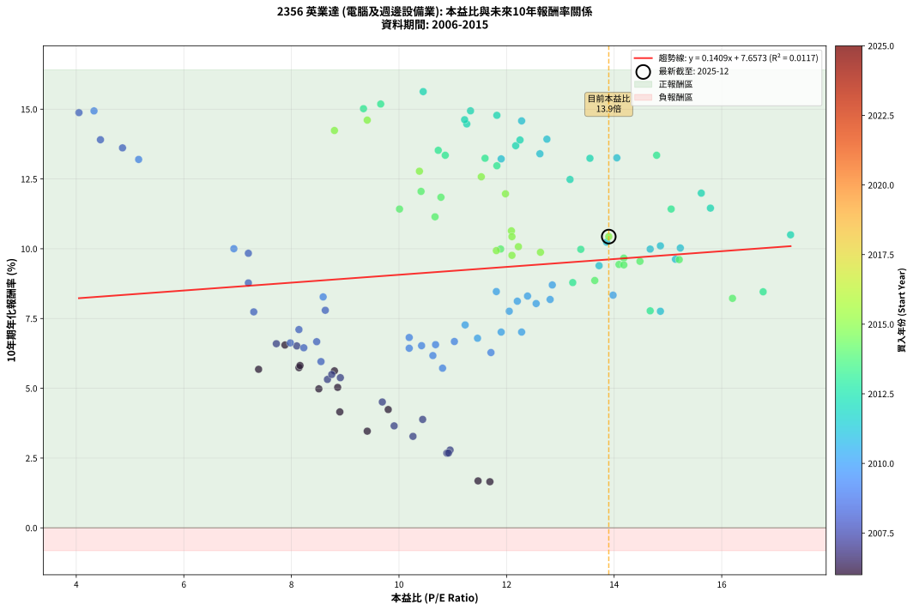
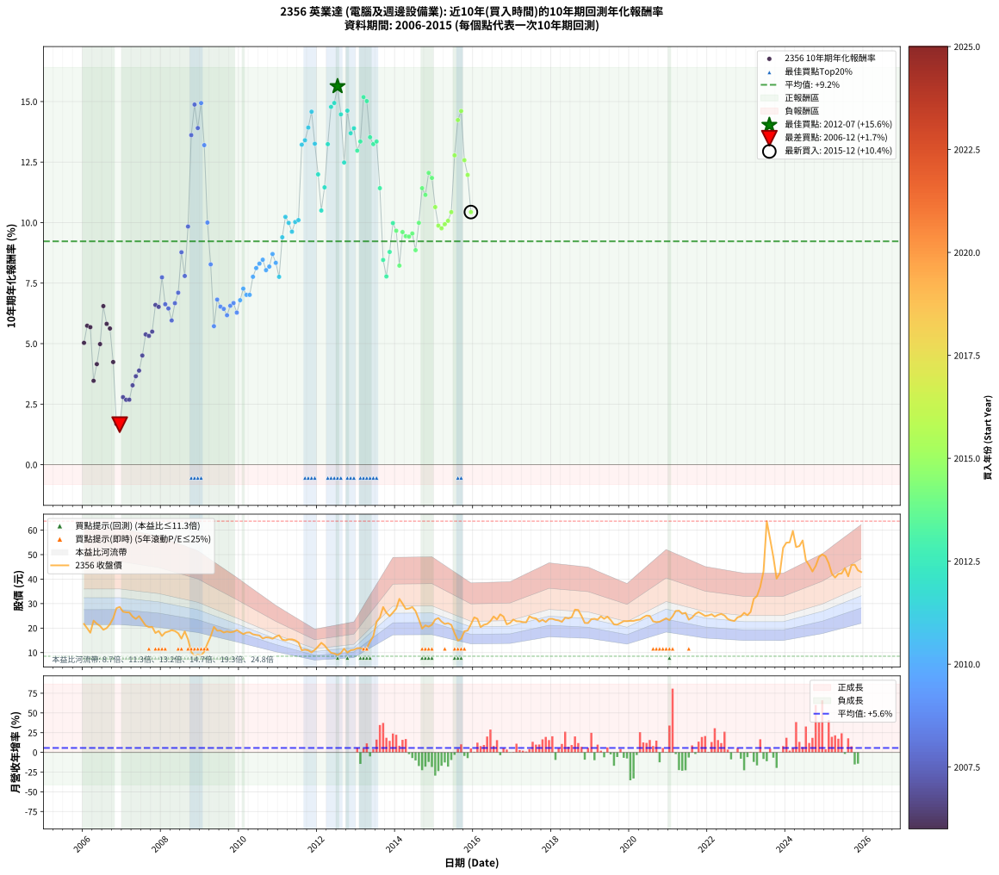

# 2356 英業達 - 本益比與未來報酬率分析

!!! info "報告資訊"
    - **股票代號**: 2356
    - **公司名稱**: 英業達
    - **產業別**: 電腦及週邊設備業
    - **分析期間**: 2006-2015 (120 個數據點)
    - **資料來源**: Type 12 (ShowMonthlyK_ChartFlow) 月收盤價與本益比
    - **報酬率口徑**: 含現金股利 (簡化: 年度合計，假設每年7/1入帳)
    - **報告生成時間**: 2026-01-06 22:30:42 CST

## 📈 視覺化圖表

### 圖表1: 本益比 vs 未來報酬率關係

*圖表1：2356 英業達 本益比與10年期未來報酬率關係 (2006-2015)*

### 圖表2: 歷年買入時點的10年期實際報酬率

*圖表2：2356 英業達 歷年買入時點的10年期實際報酬率 (2006-2015)*

## 📍 買點訊號說明

本報告提供兩種買點提示訊號（顯示於圖表2的股價子圖中）：

### ▲ 小綠色三角形（回測驗證）
- **計算方式**: 使用全部歷史資料計算本益比第25百分位數
- **用途**: 事後驗證，顯示歷史上哪些時點確實為低估區
- **限制**: 當下無法判斷，僅供回測參考
- **特性**: 後見之明（Look-Ahead Bias）

### ▲ 小橘色三角形（即時訊號）
- **計算方式**: 使用截至當月的過去5年資料計算本益比第25百分位數
- **用途**: 實際投資決策，當時即可判斷
- **優勢**: 可操作性強，符合實務需求
- **特性**: 無後見之明，滾動窗口計算

!!! tip "如何使用兩種訊號"
    - **綠色▲** 幫助理解歷史估值機會，驗證策略有效性
    - **橘色▲** 可作為實際買進參考，但仍需搭配基本面分析
    - 兩種訊號重疊時，表示即時判斷與事後驗證一致，信心度較高
    - 僅有綠色▲時，表示當時無法判斷（需要未來資料才能確認）
    - 僅有橘色▲時，表示即時判斷為買點，但事後可能不是最佳時機

## 📊 估值分析摘要

| 指標 | 數值 |
|:---:|:---:|
| **目前本益比** (2015-12) | **13.90 倍** |
| **歷史平均本益比** | 11.13 倍 |
| **估值水準** | 🔴 相對高估 |
| **預期10年年化報酬率** | **+9.62%** |
| **歷史平均報酬率** | +9.23% |
| **相關係數 (R²)** | 0.0117 |
| **趨勢線斜率** | 0.1409 |

!!! abstract "核心洞察"
    目前本益比顯著高於歷史平均，預期未來報酬率可能較低

    根據歷史數據回測，2356 英業達 在目前本益比 **13.9倍** 的估值水準下，
    預期未來10年年化報酬率約為 **+9.6%**。

    **重要提醒**: 本分析基於歷史數據統計，實際報酬率會受到公司基本面變化、產業趨勢、
    總體經濟環境等多重因素影響。R² = 0.01 表示本益比可解釋約 1.2% 的報酬率變異。

## 📈 歷史估值統計

### 最佳買點 (最高報酬率)

| 項目 | 數值 |
|:---:|:---:|
| 起始時間 | 2012-07 |
| 當時本益比 | 10.45 倍 |
| 起始價格 | 9.0 元 |
| 10年後價格 | 23.7 元 |
| **10年年化報酬率** | **+15.63%** |

### 最差買點 (最低報酬率)

| 項目 | 數值 |
|:---:|:---:|
| 起始時間 | 2006-12 |
| 當時本益比 | 11.69 倍 |
| 起始價格 | 28.6 元 |
| 10年後價格 | 22.1 元 |
| **10年年化報酬率** | **+1.65%** |

## 🎯 投資啟示

### 本益比與報酬率關係

趨勢線方程式: **y = 0.1409x + 7.6573**

!!! info "弱相關或正相關"
    本益比與未來報酬率相關性較弱。這可能表示該股票的報酬率更多受到
    公司成長性、產業趨勢等因素影響，而非估值水準。**需綜合考量多項指標**。

### 估值區間建議

基於歷史數據分析:

- **🟢 低估區** (P/E < 8.9): 預期報酬率較高，可考慮增加持股
- **🟡 合理區** (P/E 8.9-13.4): 預期報酬率符合長期趨勢，正常持有
- **🔴 高估區** (P/E > 13.4): 預期報酬率較低，可考慮減碼或觀望

!!! danger "風險提示"
    - 過去表現不代表未來結果
    - 本分析假設公司基本面無重大結構性變化
    - 產業環境劇變可能使歷史規律失效
    - 應結合公司財報、產業趨勢、總體經濟等多重因素綜合判斷

!!! success "長期投資觀點"
    歷史數據顯示，在合理或低估的估值水準買入並長期持有，
    往往能獲得較佳的投資報酬。**耐心等待好價格**是價值投資的核心原則。

## 📊 數據品質

- **資料來源**: GoodInfo.tw Type 12 (ShowMonthlyK_ChartFlow)
- **資料頻率**: 月度收盤價與本益比
- **回測期間**: 2006-2015
- **數據點數量**: 120 個 (每個點代表一次10年期回測)

### 計算方法說明

1. **10年期年化報酬率**:
   - 對每個歷史時點，計算其後10年的實際投資報酬率
   - 期末價值(不含股利): 期末價格
   - 期末價值(含現金股利): 期末價格 + 持有期間內的現金股利合計 (簡化: 年度合計，假設每年7/1入帳)
   - 公式: 年化報酬率 = [(期末價值/期初價格)^(1/年數) - 1] × 100%

2. **本益比 (P/E Ratio)**:
   - 使用當時的月收盤價與EPS計算
   - 資料來源: Type 12 月度河流圖本益比數據

3. **趨勢線 (Linear Regression)**:
   - 使用最小平方法擬合線性趨勢線
   - R²值衡量本益比對報酬率的解釋能力

---

*本報告由 Stock Analysis System v1.9.0 自動生成*
*數據更新時間: 2026-01-06 22:30:42 CST*

## 📋 月度回測明細表

（每一列對應時間線圖中的一個買入點；可用來對照 SVG 圖上的每個點。）

| 買入月份 | 賣出月份 | 回測期限_年 | 實際持有年數 | 買入本益比_倍 | 買入收盤價_元 | 賣出收盤價_元 | 現金股利合計_元 | 總報酬率_pct | 年化報酬率_pct |
| --- | --- | --- | --- | --- | --- | --- | --- | --- | --- |
| 2006-01 | 2016-01 | 10 | 9.999 | 8.86 | 21.70 | 24.40 | 11.05 | +63.37 | +5.03 |
| 2006-02 | 2016-02 | 10 | 9.999 | 8.14 | 19.95 | 23.80 | 11.05 | +74.69 | +5.74 |
| 2006-03 | 2016-03 | 10 | 10.001 | 7.39 | 18.10 | 20.40 | 11.05 | +73.76 | +5.68 |
| 2006-04 | 2016-04 | 10 | 10.001 | 9.41 | 23.05 | 21.35 | 11.05 | +40.57 | +3.46 |
| 2006-05 | 2016-05 | 10 | 10.001 | 8.90 | 21.80 | 21.70 | 11.05 | +50.23 | +4.15 |
| 2006-06 | 2016-06 | 10 | 10.001 | 8.51 | 20.85 | 22.85 | 11.05 | +62.59 | +4.98 |
| 2006-07 | 2016-07 | 10 | 10.001 | 7.88 | 19.30 | 24.75 | 11.65 | +88.61 | +6.55 |
| 2006-08 | 2016-08 | 10 | 10.001 | 8.16 | 20.00 | 23.55 | 11.65 | +76.00 | +5.82 |
| 2006-09 | 2016-09 | 10 | 10.001 | 8.80 | 21.55 | 25.60 | 11.65 | +72.86 | +5.62 |
| 2006-10 | 2016-10 | 10 | 10.001 | 9.80 | 24.00 | 24.70 | 11.65 | +51.46 | +4.24 |
| 2006-11 | 2016-11 | 10 | 10.001 | 11.47 | 28.10 | 21.55 | 11.65 | +18.15 | +1.68 |
| 2006-12 | 2016-12 | 10 | 10.001 | 11.69 | 28.65 | 22.10 | 11.65 | +17.80 | +1.65 |
| 2007-01 | 2017-01 | 10 | 10.001 | 10.95 | 26.70 | 23.50 | 11.65 | +31.65 | +2.79 |
| 2007-02 | 2017-02 | 10 | 10.001 | 10.89 | 26.45 | 22.80 | 11.65 | +30.25 | +2.68 |
| 2007-03 | 2017-03 | 10 | 10.001 | 10.92 | 26.40 | 22.75 | 11.65 | +30.31 | +2.68 |
| 2007-04 | 2017-04 | 10 | 10.001 | 10.26 | 24.70 | 22.45 | 11.65 | +38.06 | +3.28 |
| 2007-05 | 2017-05 | 10 | 10.001 | 9.91 | 23.75 | 22.35 | 11.65 | +43.16 | +3.65 |
| 2007-06 | 2017-06 | 10 | 10.001 | 10.44 | 24.90 | 24.80 | 11.65 | +46.39 | +3.88 |
| 2007-07 | 2017-07 | 10 | 10.001 | 9.69 | 23.00 | 24.15 | 11.60 | +55.44 | +4.51 |
| 2007-08 | 2017-08 | 10 | 10.001 | 8.91 | 21.05 | 23.95 | 11.60 | +68.89 | +5.38 |
| 2007-09 | 2017-09 | 10 | 10.001 | 8.67 | 20.40 | 22.65 | 11.60 | +67.90 | +5.32 |
| 2007-10 | 2017-10 | 10 | 10.001 | 8.75 | 20.50 | 23.40 | 11.60 | +70.74 | +5.49 |
| 2007-11 | 2017-11 | 10 | 10.001 | 7.72 | 18.00 | 22.50 | 11.60 | +89.45 | +6.60 |
| 2007-12 | 2017-12 | 10 | 10.001 | 8.10 | 18.80 | 23.75 | 11.60 | +88.04 | +6.52 |
| 2008-01 | 2018-01 | 10 | 10.001 | 7.30 | 16.80 | 23.80 | 11.60 | +110.72 | +7.74 |
| 2008-02 | 2018-03 | 10 | 10.081 | 7.98 | 18.20 | 23.15 | 11.60 | +90.94 | +6.63 |
| 2008-03 | 2018-03 | 10 | 9.999 | 8.23 | 18.60 | 23.15 | 11.60 | +86.83 | +6.45 |
| 2008-04 | 2018-04 | 10 | 9.999 | 8.55 | 19.15 | 22.55 | 11.60 | +78.33 | +5.96 |
| 2008-05 | 2018-05 | 10 | 9.999 | 8.47 | 18.80 | 24.25 | 11.60 | +90.70 | +6.67 |
| 2008-06 | 2018-06 | 10 | 9.999 | 8.14 | 17.90 | 23.95 | 11.60 | +98.61 | +7.10 |
| 2008-07 | 2018-07 | 10 | 9.999 | 7.20 | 15.70 | 24.45 | 11.95 | +131.85 | +8.77 |
| 2008-08 | 2018-08 | 10 | 9.999 | 8.63 | 18.65 | 27.55 | 11.95 | +111.80 | +7.79 |
| 2008-09 | 2018-09 | 10 | 9.999 | 7.20 | 15.40 | 27.40 | 11.95 | +155.53 | +9.84 |
| 2008-10 | 2018-10 | 10 | 9.999 | 4.86 | 10.30 | 24.95 | 11.95 | +258.26 | +13.61 |
| 2008-11 | 2018-11 | 10 | 9.999 | 4.05 | 8.51 | 22.10 | 11.95 | +300.13 | +14.88 |
| 2008-12 | 2018-12 | 10 | 9.999 | 4.45 | 9.25 | 22.05 | 11.95 | +267.58 | +13.90 |
| 2009-01 | 2019-01 | 10 | 9.999 | 4.33 | 8.85 | 23.65 | 11.95 | +302.27 | +14.94 |
| 2009-02 | 2019-02 | 10 | 9.999 | 5.16 | 10.35 | 23.80 | 11.95 | +245.42 | +13.20 |
| 2009-03 | 2019-03 | 10 | 9.999 | 6.93 | 13.65 | 23.45 | 11.95 | +159.35 | +10.00 |
| 2009-04 | 2019-04 | 10 | 9.999 | 8.59 | 16.60 | 24.80 | 11.95 | +121.39 | +8.27 |
| 2009-05 | 2019-05 | 10 | 9.999 | 10.81 | 20.50 | 23.80 | 11.95 | +74.40 | +5.72 |
| 2009-06 | 2019-06 | 10 | 9.999 | 10.19 | 18.95 | 24.70 | 11.95 | +93.41 | +6.82 |
| 2009-07 | 2019-07 | 10 | 9.999 | 10.42 | 19.00 | 23.30 | 12.45 | +88.16 | +6.53 |
| 2009-08 | 2019-08 | 10 | 9.999 | 10.19 | 18.20 | 21.50 | 12.45 | +86.54 | +6.43 |
| 2009-09 | 2019-09 | 10 | 9.999 | 10.63 | 18.60 | 21.40 | 12.45 | +81.99 | +6.17 |
| 2009-10 | 2019-10 | 10 | 9.999 | 10.68 | 18.30 | 22.10 | 12.45 | +88.80 | +6.56 |
| 2009-11 | 2019-11 | 10 | 9.999 | 11.03 | 18.50 | 22.85 | 12.45 | +90.82 | +6.68 |
| 2009-12 | 2019-12 | 10 | 9.999 | 11.71 | 19.20 | 22.85 | 12.45 | +83.86 | +6.28 |
| 2010-01 | 2020-01 | 10 | 9.999 | 11.46 | 18.35 | 22.95 | 12.45 | +92.92 | +6.79 |
| 2010-02 | 2020-02 | 10 | 9.999 | 11.23 | 17.55 | 22.95 | 12.45 | +101.72 | +7.27 |
| 2010-03 | 2020-03 | 10 | 10.001 | 11.90 | 18.15 | 23.30 | 12.45 | +96.98 | +7.01 |
| 2010-04 | 2020-04 | 10 | 10.001 | 12.28 | 18.25 | 23.50 | 12.45 | +96.99 | +7.01 |
| 2010-05 | 2020-05 | 10 | 10.001 | 12.05 | 17.45 | 24.40 | 12.45 | +111.18 | +7.76 |
| 2010-06 | 2020-06 | 10 | 10.001 | 12.20 | 17.20 | 25.10 | 12.45 | +118.32 | +8.12 |
| 2010-07 | 2020-07 | 10 | 10.001 | 12.39 | 17.00 | 25.00 | 12.75 | +122.06 | +8.30 |
| 2010-08 | 2020-08 | 10 | 10.001 | 11.81 | 15.75 | 22.75 | 12.75 | +125.40 | +8.47 |
| 2010-09 | 2020-09 | 10 | 10.001 | 12.55 | 16.25 | 22.45 | 12.75 | +116.62 | +8.04 |
| 2010-10 | 2020-10 | 10 | 10.001 | 12.81 | 16.10 | 22.60 | 12.75 | +119.57 | +8.18 |
| 2010-11 | 2020-11 | 10 | 10.001 | 12.85 | 15.65 | 23.30 | 12.75 | +130.36 | +8.70 |
| 2010-12 | 2020-12 | 10 | 10.001 | 13.98 | 16.50 | 24.00 | 12.75 | +122.73 | +8.34 |
| 2011-01 | 2021-01 | 10 | 10.001 | 14.86 | 17.05 | 23.25 | 12.75 | +111.15 | +7.76 |
| 2011-02 | 2021-02 | 10 | 10.001 | 13.72 | 15.30 | 24.80 | 12.75 | +145.43 | +9.39 |
| 2011-03 | 2021-03 | 10 | 10.001 | 13.86 | 15.00 | 27.00 | 12.75 | +165.01 | +10.24 |
| 2011-04 | 2021-04 | 10 | 10.001 | 14.67 | 15.40 | 27.15 | 12.75 | +159.10 | +9.99 |
| 2011-05 | 2021-05 | 10 | 10.001 | 15.14 | 15.40 | 25.85 | 12.75 | +150.66 | +9.62 |
| 2011-06 | 2021-06 | 10 | 10.001 | 15.23 | 15.00 | 26.25 | 12.75 | +160.01 | +10.03 |
| 2011-07 | 2021-07 | 10 | 10.001 | 14.86 | 14.15 | 23.45 | 13.60 | +161.84 | +10.10 |
| 2011-08 | 2021-08 | 10 | 10.001 | 11.90 | 10.95 | 24.30 | 13.60 | +246.12 | +13.22 |
| 2011-09 | 2021-09 | 10 | 10.001 | 12.62 | 11.20 | 25.80 | 13.60 | +251.79 | +13.40 |
| 2011-10 | 2021-10 | 10 | 10.001 | 12.75 | 10.90 | 26.55 | 13.60 | +268.35 | +13.92 |
| 2011-11 | 2021-11 | 10 | 10.001 | 12.28 | 10.10 | 25.80 | 13.60 | +290.10 | +14.58 |
| 2011-12 | 2021-12 | 10 | 10.001 | 14.05 | 11.10 | 24.95 | 13.60 | +247.30 | +13.26 |
| 2012-01 | 2022-01 | 10 | 10.001 | 15.62 | 12.50 | 25.20 | 13.60 | +210.40 | +11.99 |
| 2012-02 | 2022-03 | 10 | 10.081 | 17.28 | 14.00 | 24.70 | 13.60 | +173.57 | +10.50 |
| 2012-03 | 2022-03 | 10 | 9.999 | 15.79 | 12.95 | 24.70 | 13.60 | +195.75 | +11.45 |
| 2012-04 | 2022-04 | 10 | 9.999 | 13.55 | 11.25 | 25.40 | 13.60 | +246.67 | +13.24 |
| 2012-05 | 2022-05 | 10 | 9.999 | 11.82 | 9.93 | 25.80 | 13.60 | +296.78 | +14.78 |
| 2012-06 | 2022-06 | 10 | 9.999 | 11.33 | 9.63 | 25.15 | 13.60 | +302.39 | +14.94 |
| 2012-07 | 2022-07 | 10 | 9.999 | 10.45 | 8.99 | 23.70 | 14.70 | +327.14 | +15.63 |
| 2012-08 | 2022-08 | 10 | 9.999 | 11.26 | 9.80 | 23.15 | 14.70 | +286.22 | +14.47 |
| 2012-09 | 2022-09 | 10 | 9.999 | 13.18 | 11.60 | 22.90 | 14.70 | +224.14 | +12.48 |
| 2012-10 | 2022-10 | 10 | 9.999 | 11.22 | 9.99 | 24.40 | 14.70 | +291.39 | +14.62 |
| 2012-11 | 2022-11 | 10 | 9.999 | 12.17 | 10.95 | 24.80 | 14.70 | +260.73 | +13.69 |
| 2012-12 | 2022-12 | 10 | 9.999 | 12.25 | 11.15 | 26.25 | 14.70 | +267.26 | +13.90 |
| 2013-01 | 2023-01 | 10 | 9.999 | 11.82 | 11.80 | 25.25 | 14.70 | +238.56 | +12.97 |
| 2013-02 | 2023-02 | 10 | 9.999 | 10.86 | 11.80 | 26.60 | 14.70 | +250.00 | +13.35 |
| 2013-03 | 2023-03 | 10 | 9.999 | 9.66 | 11.35 | 31.95 | 14.70 | +311.01 | +15.18 |
| 2013-04 | 2023-04 | 10 | 9.999 | 9.34 | 11.80 | 33.10 | 14.70 | +305.08 | +15.02 |
| 2013-05 | 2023-05 | 10 | 9.999 | 10.73 | 14.50 | 36.85 | 14.70 | +255.52 | +13.53 |
| 2013-06 | 2023-06 | 10 | 9.999 | 11.60 | 16.70 | 43.20 | 14.70 | +246.71 | +13.24 |
| 2013-07 | 2023-07 | 10 | 9.999 | 14.79 | 22.60 | 63.70 | 15.40 | +250.00 | +13.35 |
| 2013-08 | 2023-08 | 10 | 9.999 | 15.06 | 24.35 | 56.40 | 15.40 | +194.87 | +11.42 |
| 2013-09 | 2023-09 | 10 | 9.999 | 16.77 | 28.60 | 49.00 | 15.40 | +125.17 | +8.46 |
| 2013-10 | 2023-10 | 10 | 9.999 | 14.67 | 26.30 | 40.20 | 15.40 | +111.41 | +7.77 |
| 2013-11 | 2023-11 | 10 | 9.999 | 13.23 | 24.90 | 42.40 | 15.40 | +132.13 | +8.79 |
| 2013-12 | 2023-12 | 10 | 9.999 | 13.38 | 26.35 | 52.80 | 15.40 | +158.82 | +9.98 |
| 2014-01 | 2024-01 | 10 | 9.999 | 14.18 | 27.95 | 54.90 | 15.40 | +151.52 | +9.66 |
| 2014-02 | 2024-02 | 10 | 9.999 | 16.20 | 31.95 | 55.00 | 15.40 | +120.34 | +8.22 |
| 2014-03 | 2024-03 | 10 | 10.001 | 15.21 | 30.00 | 59.70 | 15.40 | +150.33 | +9.61 |
| 2014-04 | 2024-04 | 10 | 10.001 | 14.09 | 27.80 | 53.10 | 15.40 | +146.40 | +9.44 |
| 2014-05 | 2024-05 | 10 | 10.001 | 14.18 | 28.00 | 53.50 | 15.40 | +146.07 | +9.42 |
| 2014-06 | 2024-06 | 10 | 10.001 | 14.48 | 28.60 | 55.80 | 15.40 | +148.95 | +9.55 |
| 2014-07 | 2024-07 | 10 | 10.001 | 13.64 | 26.95 | 47.70 | 15.30 | +133.77 | +8.86 |
| 2014-08 | 2024-08 | 10 | 10.001 | 11.89 | 23.50 | 45.60 | 15.30 | +159.15 | +9.99 |
| 2014-09 | 2024-09 | 10 | 10.001 | 10.01 | 19.80 | 43.10 | 15.30 | +194.95 | +11.42 |
| 2014-10 | 2024-10 | 10 | 10.001 | 10.67 | 21.10 | 45.40 | 15.30 | +187.68 | +11.14 |
| 2014-11 | 2024-11 | 10 | 10.001 | 10.41 | 20.60 | 49.00 | 15.30 | +212.14 | +12.05 |
| 2014-12 | 2024-12 | 10 | 10.001 | 10.78 | 21.35 | 50.10 | 15.30 | +206.32 | +11.84 |
| 2015-01 | 2025-01 | 10 | 10.001 | 12.09 | 23.50 | 49.30 | 15.30 | +174.89 | +10.64 |
| 2015-02 | 2025-02 | 10 | 10.001 | 12.63 | 24.10 | 46.50 | 15.30 | +156.43 | +9.87 |
| 2015-03 | 2025-03 | 10 | 10.001 | 12.10 | 22.65 | 42.20 | 15.30 | +153.86 | +9.76 |
| 2015-04 | 2025-04 | 10 | 10.001 | 11.81 | 21.70 | 40.65 | 15.30 | +157.83 | +9.93 |
| 2015-05 | 2025-05 | 10 | 10.001 | 12.22 | 22.00 | 42.15 | 15.30 | +161.14 | +10.07 |
| 2015-06 | 2025-06 | 10 | 10.001 | 12.10 | 21.35 | 42.30 | 15.30 | +169.79 | +10.43 |
| 2015-07 | 2025-07 | 10 | 10.001 | 10.38 | 17.95 | 44.50 | 15.25 | +232.87 | +12.78 |
| 2015-08 | 2025-08 | 10 | 10.001 | 8.80 | 14.90 | 41.15 | 15.25 | +278.52 | +14.24 |
| 2015-09 | 2025-09 | 10 | 10.001 | 9.41 | 15.60 | 45.75 | 15.25 | +291.03 | +14.61 |
| 2015-10 | 2025-10 | 10 | 10.001 | 11.53 | 18.70 | 45.90 | 15.25 | +227.01 | +12.58 |
| 2015-11 | 2025-11 | 10 | 10.001 | 11.98 | 19.00 | 43.60 | 15.25 | +209.74 | +11.97 |
| 2015-12 | 2025-12 | 10 | 10.001 | 13.90 | 21.55 | 42.90 | 15.25 | +169.84 | +10.43 |
