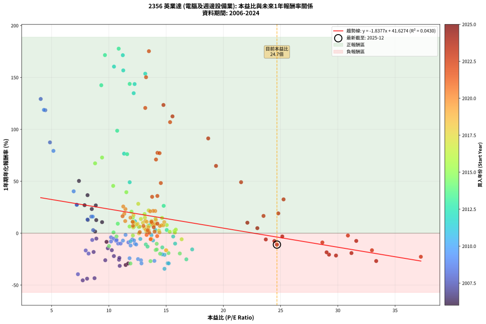
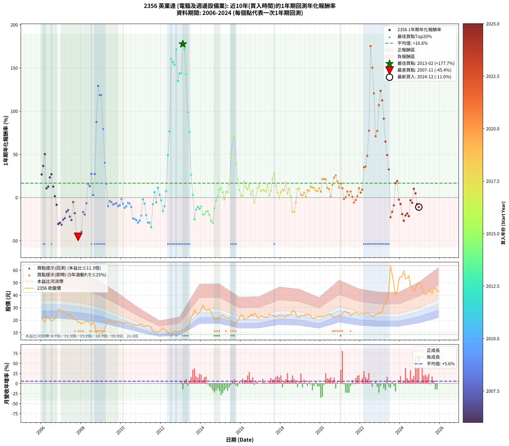

# 2356 英業達 - 本益比與未來報酬率分析

!!! info "報告資訊"
    - **股票代號**: 2356
    - **公司名稱**: 英業達
    - **產業別**: 電腦及週邊設備業
    - **分析期間**: 2006-2024 (228 個數據點)
    - **資料來源**: Type 12 (ShowMonthlyK_ChartFlow) 月收盤價與本益比
    - **報酬率口徑**: 含現金股利 (簡化: 年度合計，假設每年7/1入帳)
    - **報告生成時間**: 2026-01-10 20:36:34 CST

## 📈 視覺化圖表

### 圖表1: 本益比 vs 未來報酬率關係

*圖表1：2356 英業達 本益比與1年期未來報酬率關係 (2006-2024)*

### 圖表2: 歷年買入時點的1年期實際報酬率

*圖表2：2356 英業達 歷年買入時點的1年期實際報酬率 (2006-2024)*

## 📍 買點訊號說明

本報告提供兩種買點提示訊號（顯示於圖表2的股價子圖中）：

### ▲ 小綠色三角形（回測驗證）
- **計算方式**: 使用全部歷史資料計算本益比第25百分位數
- **用途**: 事後驗證，顯示歷史上哪些時點確實為低估區
- **限制**: 當下無法判斷，僅供回測參考
- **特性**: 後見之明（Look-Ahead Bias）

### ▲ 小橘色三角形（即時訊號）
- **計算方式**: 使用截至當月的過去5年資料計算本益比第25百分位數
- **用途**: 實際投資決策，當時即可判斷
- **優勢**: 可操作性強，符合實務需求
- **特性**: 無後見之明，滾動窗口計算

!!! tip "如何使用兩種訊號"
    - **綠色▲** 幫助理解歷史估值機會，驗證策略有效性
    - **橘色▲** 可作為實際買進參考，但仍需搭配基本面分析
    - 兩種訊號重疊時，表示即時判斷與事後驗證一致，信心度較高
    - 僅有綠色▲時，表示當時無法判斷（需要未來資料才能確認）
    - 僅有橘色▲時，表示即時判斷為買點，但事後可能不是最佳時機

## 📊 估值分析摘要

| 指標 | 數值 |
|:---:|:---:|
| **目前本益比** (2024-12) | **24.68 倍** |
| **歷史平均本益比** | 13.59 倍 |
| **估值水準** | 🔴 相對高估 |
| **預期1年年化報酬率** | **-3.73%** |
| **歷史平均報酬率** | +16.65% |
| **相關係數 (R²)** | 0.0430 |
| **趨勢線斜率** | -1.8377 |

!!! abstract "核心洞察"
    目前本益比顯著高於歷史平均，預期未來報酬率可能較低

    根據歷史數據回測，2356 英業達 在目前本益比 **24.7倍** 的估值水準下，
    預期未來1年年化報酬率約為 **-3.7%**。

    **重要提醒**: 本分析基於歷史數據統計，實際報酬率會受到公司基本面變化、產業趨勢、
    總體經濟環境等多重因素影響。R² = 0.04 表示本益比可解釋約 4.3% 的報酬率變異。

## 📈 歷史估值統計

### 最佳買點 (最高報酬率)

| 項目 | 數值 |
|:---:|:---:|
| 起始時間 | 2013-02 |
| 當時本益比 | 10.86 倍 |
| 起始價格 | 11.8 元 |
| 1年後價格 | 31.9 元 |
| **1年年化報酬率** | **+177.74%** |

### 最差買點 (最低報酬率)

| 項目 | 數值 |
|:---:|:---:|
| 起始時間 | 2007-11 |
| 當時本益比 | 7.72 倍 |
| 起始價格 | 18.0 元 |
| 1年後價格 | 8.5 元 |
| **1年年化報酬率** | **-45.43%** |

## 🎯 投資啟示

### 本益比與報酬率關係

趨勢線方程式: **y = -1.8377x + 41.6274**

!!! warning "強負相關"
    本益比與未來報酬率呈現強負相關。在高本益比時期買入，未來報酬率顯著較低；
    在低本益比時期買入，未來報酬率顯著較高。**估值紀律至關重要**。

### 估值區間建議

基於歷史數據分析:

- **🟢 低估區** (P/E < 10.9): 預期報酬率較高，可考慮增加持股
- **🟡 合理區** (P/E 10.9-16.3): 預期報酬率符合長期趨勢，正常持有
- **🔴 高估區** (P/E > 16.3): 預期報酬率較低，可考慮減碼或觀望

!!! danger "風險提示"
    - 過去表現不代表未來結果
    - 本分析假設公司基本面無重大結構性變化
    - 產業環境劇變可能使歷史規律失效
    - 應結合公司財報、產業趨勢、總體經濟等多重因素綜合判斷

!!! success "長期投資觀點"
    歷史數據顯示，在合理或低估的估值水準買入並長期持有，
    往往能獲得較佳的投資報酬。**耐心等待好價格**是價值投資的核心原則。

## 📊 數據品質

- **資料來源**: GoodInfo.tw Type 12 (ShowMonthlyK_ChartFlow)
- **資料頻率**: 月度收盤價與本益比
- **回測期間**: 2006-2024
- **數據點數量**: 228 個 (每個點代表一次1年期回測)

### 計算方法說明

1. **1年期年化報酬率**:
   - 對每個歷史時點，計算其後1年的實際投資報酬率
   - 期末價值(不含股利): 期末價格
   - 期末價值(含現金股利): 期末價格 + 持有期間內的現金股利合計 (簡化: 年度合計，假設每年7/1入帳)
   - 公式: 年化報酬率 = [(期末價值/期初價格)^(1/年數) - 1] × 100%

2. **本益比 (P/E Ratio)**:
   - 使用當時的月收盤價與EPS計算
   - 資料來源: Type 12 月度河流圖本益比數據

3. **趨勢線 (Linear Regression)**:
   - 使用最小平方法擬合線性趨勢線
   - R²值衡量本益比對報酬率的解釋能力

---

*本報告由 Stock Analysis System v1.9.0 自動生成*
*數據更新時間: 2026-01-10 20:36:34 CST*

## 📋 月度回測明細表

（每一列對應時間線圖中的一個買入點；可用來對照 SVG 圖上的每個點。）

| 買入月份 | 賣出月份 | 回測期限_年 | 實際持有年數 | 買入本益比_倍 | 買入收盤價_元 | 賣出收盤價_元 | 現金股利合計_元 | 總報酬率_pct | 年化報酬率_pct |
| --- | --- | --- | --- | --- | --- | --- | --- | --- | --- |
| 2006-01 | 2007-01 | 1 | 0.999 | 8.86 | 21.70 | 26.70 | 0.80 | +26.73 | +26.75 |
| 2006-02 | 2007-02 | 1 | 0.999 | 8.14 | 19.95 | 26.45 | 0.80 | +36.59 | +36.62 |
| 2006-03 | 2007-03 | 1 | 0.999 | 7.39 | 18.10 | 26.40 | 0.80 | +50.28 | +50.32 |
| 2006-04 | 2007-04 | 1 | 0.999 | 9.41 | 23.05 | 24.70 | 0.80 | +10.63 | +10.64 |
| 2006-05 | 2007-05 | 1 | 0.999 | 8.90 | 21.80 | 23.75 | 0.80 | +12.61 | +12.62 |
| 2006-06 | 2007-06 | 1 | 0.999 | 8.51 | 20.85 | 24.90 | 0.80 | +23.26 | +23.28 |
| 2006-07 | 2007-07 | 1 | 0.999 | 7.88 | 19.30 | 23.00 | 1.50 | +26.94 | +26.96 |
| 2006-08 | 2007-08 | 1 | 0.999 | 8.16 | 20.00 | 21.05 | 1.50 | +12.75 | +12.76 |
| 2006-09 | 2007-09 | 1 | 0.999 | 8.80 | 21.55 | 20.40 | 1.50 | +1.62 | +1.63 |
| 2006-10 | 2007-10 | 1 | 0.999 | 9.80 | 24.00 | 20.50 | 1.50 | -8.33 | -8.34 |
| 2006-11 | 2007-11 | 1 | 0.999 | 11.47 | 28.10 | 18.00 | 1.50 | -30.60 | -30.62 |
| 2006-12 | 2007-12 | 1 | 0.999 | 11.69 | 28.65 | 18.80 | 1.50 | -29.14 | -29.16 |
| 2007-01 | 2008-01 | 1 | 0.999 | 10.95 | 26.70 | 16.80 | 1.50 | -31.46 | -31.48 |
| 2007-02 | 2008-02 | 1 | 0.999 | 10.89 | 26.45 | 18.20 | 1.50 | -25.52 | -25.53 |
| 2007-03 | 2008-03 | 1 | 1.002 | 10.92 | 26.40 | 18.60 | 1.50 | -23.86 | -23.82 |
| 2007-04 | 2008-04 | 1 | 1.002 | 10.26 | 24.70 | 19.15 | 1.50 | -16.40 | -16.37 |
| 2007-05 | 2008-05 | 1 | 1.002 | 9.91 | 23.75 | 18.80 | 1.50 | -14.53 | -14.50 |
| 2007-06 | 2008-06 | 1 | 1.002 | 10.44 | 24.90 | 17.90 | 1.50 | -22.09 | -22.05 |
| 2007-07 | 2008-07 | 1 | 1.002 | 9.69 | 23.00 | 15.70 | 1.30 | -26.09 | -26.04 |
| 2007-08 | 2008-08 | 1 | 1.002 | 8.91 | 21.05 | 18.65 | 1.30 | -5.23 | -5.22 |
| 2007-09 | 2008-09 | 1 | 1.002 | 8.67 | 20.40 | 15.40 | 1.30 | -18.14 | -18.10 |
| 2007-10 | 2008-10 | 1 | 1.002 | 8.75 | 20.50 | 10.30 | 1.30 | -43.41 | -43.35 |
| 2007-11 | 2008-11 | 1 | 1.002 | 7.72 | 18.00 | 8.51 | 1.30 | -45.50 | -45.43 |
| 2007-12 | 2008-12 | 1 | 1.002 | 8.10 | 18.80 | 9.25 | 1.30 | -43.88 | -43.82 |
| 2008-01 | 2009-01 | 1 | 1.002 | 7.30 | 16.80 | 8.85 | 1.30 | -39.58 | -39.52 |
| 2008-02 | 2009-03 | 1 | 1.081 | 7.98 | 18.20 | 13.65 | 1.30 | -17.86 | -16.63 |
| 2008-03 | 2009-03 | 1 | 0.999 | 8.23 | 18.60 | 13.65 | 1.30 | -19.62 | -19.64 |
| 2008-04 | 2009-04 | 1 | 0.999 | 8.55 | 19.15 | 16.60 | 1.30 | -6.53 | -6.53 |
| 2008-05 | 2009-05 | 1 | 0.999 | 8.47 | 18.80 | 20.50 | 1.30 | +15.96 | +15.97 |
| 2008-06 | 2009-06 | 1 | 0.999 | 8.14 | 17.90 | 18.95 | 1.30 | +13.13 | +13.14 |
| 2008-07 | 2009-07 | 1 | 0.999 | 7.20 | 15.70 | 19.00 | 1.00 | +27.39 | +27.41 |
| 2008-08 | 2009-08 | 1 | 0.999 | 8.63 | 18.65 | 18.20 | 1.00 | +2.95 | +2.95 |
| 2008-09 | 2009-09 | 1 | 0.999 | 7.20 | 15.40 | 18.60 | 1.00 | +27.27 | +27.29 |
| 2008-10 | 2009-10 | 1 | 0.999 | 4.86 | 10.30 | 18.30 | 1.00 | +87.38 | +87.46 |
| 2008-11 | 2009-11 | 1 | 0.999 | 4.05 | 8.51 | 18.50 | 1.00 | +129.14 | +129.27 |
| 2008-12 | 2009-12 | 1 | 0.999 | 4.45 | 9.25 | 19.20 | 1.00 | +118.38 | +118.50 |
| 2009-01 | 2010-01 | 1 | 0.999 | 4.33 | 8.85 | 18.35 | 1.00 | +118.64 | +118.76 |
| 2009-02 | 2010-02 | 1 | 0.999 | 5.16 | 10.35 | 17.55 | 1.00 | +79.23 | +79.30 |
| 2009-03 | 2010-03 | 1 | 0.999 | 6.93 | 13.65 | 18.15 | 1.00 | +40.29 | +40.33 |
| 2009-04 | 2010-04 | 1 | 0.999 | 8.59 | 16.60 | 18.25 | 1.00 | +15.96 | +15.98 |
| 2009-05 | 2010-05 | 1 | 0.999 | 10.81 | 20.50 | 17.45 | 1.00 | -10.00 | -10.01 |
| 2009-06 | 2010-06 | 1 | 0.999 | 10.19 | 18.95 | 17.20 | 1.00 | -3.96 | -3.96 |
| 2009-07 | 2010-07 | 1 | 0.999 | 10.42 | 19.00 | 17.00 | 1.00 | -5.26 | -5.27 |
| 2009-08 | 2010-08 | 1 | 0.999 | 10.19 | 18.20 | 15.75 | 1.00 | -7.97 | -7.97 |
| 2009-09 | 2010-09 | 1 | 0.999 | 10.63 | 18.60 | 16.25 | 1.00 | -7.26 | -7.26 |
| 2009-10 | 2010-10 | 1 | 0.999 | 10.68 | 18.30 | 16.10 | 1.00 | -6.56 | -6.56 |
| 2009-11 | 2010-11 | 1 | 0.999 | 11.03 | 18.50 | 15.65 | 1.00 | -10.00 | -10.01 |
| 2009-12 | 2010-12 | 1 | 0.999 | 11.71 | 19.20 | 16.50 | 1.00 | -8.85 | -8.86 |
| 2010-01 | 2011-01 | 1 | 0.999 | 11.46 | 18.35 | 17.05 | 1.00 | -1.63 | -1.64 |
| 2010-02 | 2011-02 | 1 | 0.999 | 11.23 | 17.55 | 15.30 | 1.00 | -7.12 | -7.13 |
| 2010-03 | 2011-03 | 1 | 0.999 | 11.90 | 18.15 | 15.00 | 1.00 | -11.85 | -11.85 |
| 2010-04 | 2011-04 | 1 | 0.999 | 12.28 | 18.25 | 15.40 | 1.00 | -10.14 | -10.14 |
| 2010-05 | 2011-05 | 1 | 0.999 | 12.05 | 17.45 | 15.40 | 1.00 | -6.02 | -6.02 |
| 2010-06 | 2011-06 | 1 | 0.999 | 12.20 | 17.20 | 15.00 | 1.00 | -6.98 | -6.98 |
| 2010-07 | 2011-07 | 1 | 0.999 | 12.39 | 17.00 | 14.15 | 1.00 | -10.88 | -10.88 |
| 2010-08 | 2011-08 | 1 | 0.999 | 11.81 | 15.75 | 10.95 | 1.00 | -24.12 | -24.13 |
| 2010-09 | 2011-09 | 1 | 0.999 | 12.55 | 16.25 | 11.20 | 1.00 | -24.92 | -24.93 |
| 2010-10 | 2011-10 | 1 | 0.999 | 12.81 | 16.10 | 10.90 | 1.00 | -26.08 | -26.10 |
| 2010-11 | 2011-11 | 1 | 0.999 | 12.85 | 15.65 | 10.10 | 1.00 | -29.07 | -29.08 |
| 2010-12 | 2011-12 | 1 | 0.999 | 13.98 | 16.50 | 11.10 | 1.00 | -26.66 | -26.68 |
| 2011-01 | 2012-01 | 1 | 0.999 | 14.86 | 17.05 | 12.50 | 1.00 | -20.82 | -20.83 |
| 2011-02 | 2012-02 | 1 | 0.999 | 13.72 | 15.30 | 14.00 | 1.00 | -1.95 | -1.96 |
| 2011-03 | 2012-03 | 1 | 1.002 | 13.86 | 15.00 | 12.95 | 1.00 | -6.99 | -6.98 |
| 2011-04 | 2012-04 | 1 | 1.002 | 14.67 | 15.40 | 11.25 | 1.00 | -20.45 | -20.41 |
| 2011-05 | 2012-05 | 1 | 1.002 | 15.14 | 15.40 | 9.93 | 1.00 | -29.02 | -28.97 |
| 2011-06 | 2012-06 | 1 | 1.002 | 15.23 | 15.00 | 9.63 | 1.00 | -29.13 | -29.08 |
| 2011-07 | 2012-07 | 1 | 1.002 | 14.86 | 14.15 | 8.99 | 0.30 | -34.35 | -34.29 |
| 2011-08 | 2012-08 | 1 | 1.002 | 11.90 | 10.95 | 9.80 | 0.30 | -7.76 | -7.75 |
| 2011-09 | 2012-09 | 1 | 1.002 | 12.62 | 11.20 | 11.60 | 0.30 | +6.25 | +6.24 |
| 2011-10 | 2012-10 | 1 | 1.002 | 12.75 | 10.90 | 9.99 | 0.30 | -5.60 | -5.59 |
| 2011-11 | 2012-11 | 1 | 1.002 | 12.28 | 10.10 | 10.95 | 0.30 | +11.39 | +11.36 |
| 2011-12 | 2012-12 | 1 | 1.002 | 14.05 | 11.10 | 11.15 | 0.30 | +3.15 | +3.15 |
| 2012-01 | 2013-01 | 1 | 1.002 | 15.62 | 12.50 | 11.80 | 0.30 | -3.20 | -3.19 |
| 2012-02 | 2013-03 | 1 | 1.081 | 17.28 | 14.00 | 11.35 | 0.30 | -16.79 | -15.63 |
| 2012-03 | 2013-03 | 1 | 0.999 | 15.79 | 12.95 | 11.35 | 0.30 | -10.04 | -10.05 |
| 2012-04 | 2013-04 | 1 | 0.999 | 13.55 | 11.25 | 11.80 | 0.30 | +7.56 | +7.56 |
| 2012-05 | 2013-05 | 1 | 0.999 | 11.82 | 9.93 | 14.50 | 0.30 | +49.04 | +49.08 |
| 2012-06 | 2013-06 | 1 | 0.999 | 11.33 | 9.63 | 16.70 | 0.30 | +76.53 | +76.60 |
| 2012-07 | 2013-07 | 1 | 0.999 | 10.45 | 8.99 | 22.60 | 0.80 | +160.29 | +160.46 |
| 2012-08 | 2013-08 | 1 | 0.999 | 11.26 | 9.80 | 24.35 | 0.80 | +156.63 | +156.80 |
| 2012-09 | 2013-09 | 1 | 0.999 | 13.18 | 11.60 | 28.60 | 0.80 | +153.45 | +153.61 |
| 2012-10 | 2013-10 | 1 | 0.999 | 11.22 | 9.99 | 26.30 | 0.80 | +171.27 | +171.46 |
| 2012-11 | 2013-11 | 1 | 0.999 | 12.17 | 10.95 | 24.90 | 0.80 | +134.70 | +134.84 |
| 2012-12 | 2013-12 | 1 | 0.999 | 12.25 | 11.15 | 26.35 | 0.80 | +143.50 | +143.65 |
| 2013-01 | 2014-01 | 1 | 0.999 | 11.82 | 11.80 | 27.95 | 0.80 | +143.64 | +143.79 |
| 2013-02 | 2014-02 | 1 | 0.999 | 10.86 | 11.80 | 31.95 | 0.80 | +177.54 | +177.74 |
| 2013-03 | 2014-03 | 1 | 0.999 | 9.66 | 11.35 | 30.00 | 0.80 | +171.37 | +171.55 |
| 2013-04 | 2014-04 | 1 | 0.999 | 9.34 | 11.80 | 27.80 | 0.80 | +142.37 | +142.52 |
| 2013-05 | 2014-05 | 1 | 0.999 | 10.73 | 14.50 | 28.00 | 0.80 | +98.62 | +98.71 |
| 2013-06 | 2014-06 | 1 | 0.999 | 11.60 | 16.70 | 28.60 | 0.80 | +76.05 | +76.12 |
| 2013-07 | 2014-07 | 1 | 0.999 | 14.79 | 22.60 | 26.95 | 1.60 | +26.33 | +26.35 |
| 2013-08 | 2014-08 | 1 | 0.999 | 15.06 | 24.35 | 23.50 | 1.60 | +3.08 | +3.08 |
| 2013-09 | 2014-09 | 1 | 0.999 | 16.77 | 28.60 | 19.80 | 1.60 | -25.17 | -25.19 |
| 2013-10 | 2014-10 | 1 | 0.999 | 14.67 | 26.30 | 21.10 | 1.60 | -13.69 | -13.70 |
| 2013-11 | 2014-11 | 1 | 0.999 | 13.23 | 24.90 | 20.60 | 1.60 | -10.84 | -10.85 |
| 2013-12 | 2014-12 | 1 | 0.999 | 13.38 | 26.35 | 21.35 | 1.60 | -12.90 | -12.91 |
| 2014-01 | 2015-01 | 1 | 0.999 | 14.18 | 27.95 | 23.50 | 1.60 | -10.20 | -10.20 |
| 2014-02 | 2015-02 | 1 | 0.999 | 16.20 | 31.95 | 24.10 | 1.60 | -19.56 | -19.57 |
| 2014-03 | 2015-03 | 1 | 0.999 | 15.21 | 30.00 | 22.65 | 1.60 | -19.17 | -19.18 |
| 2014-04 | 2015-04 | 1 | 0.999 | 14.09 | 27.80 | 21.70 | 1.60 | -16.19 | -16.20 |
| 2014-05 | 2015-05 | 1 | 0.999 | 14.18 | 28.00 | 22.00 | 1.60 | -15.71 | -15.72 |
| 2014-06 | 2015-06 | 1 | 0.999 | 14.48 | 28.60 | 21.35 | 1.60 | -19.76 | -19.77 |
| 2014-07 | 2015-07 | 1 | 0.999 | 13.64 | 26.95 | 17.95 | 1.75 | -26.90 | -26.92 |
| 2014-08 | 2015-08 | 1 | 0.999 | 11.89 | 23.50 | 14.90 | 1.75 | -29.15 | -29.17 |
| 2014-09 | 2015-09 | 1 | 0.999 | 10.01 | 19.80 | 15.60 | 1.75 | -12.37 | -12.38 |
| 2014-10 | 2015-10 | 1 | 0.999 | 10.67 | 21.10 | 18.70 | 1.75 | -3.08 | -3.08 |
| 2014-11 | 2015-11 | 1 | 0.999 | 10.41 | 20.60 | 19.00 | 1.75 | +0.73 | +0.73 |
| 2014-12 | 2015-12 | 1 | 0.999 | 10.78 | 21.35 | 21.55 | 1.75 | +9.13 | +9.14 |
| 2015-01 | 2016-01 | 1 | 0.999 | 12.09 | 23.50 | 24.40 | 1.75 | +11.28 | +11.28 |
| 2015-02 | 2016-02 | 1 | 0.999 | 12.63 | 24.10 | 23.80 | 1.75 | +6.02 | +6.02 |
| 2015-03 | 2016-03 | 1 | 1.002 | 12.10 | 22.65 | 20.40 | 1.75 | -2.21 | -2.20 |
| 2015-04 | 2016-04 | 1 | 1.002 | 11.81 | 21.70 | 21.35 | 1.75 | +6.45 | +6.44 |
| 2015-05 | 2016-05 | 1 | 1.002 | 12.22 | 22.00 | 21.70 | 1.75 | +6.59 | +6.58 |
| 2015-06 | 2016-06 | 1 | 1.002 | 12.10 | 21.35 | 22.85 | 1.75 | +15.22 | +15.19 |
| 2015-07 | 2016-07 | 1 | 1.002 | 10.38 | 17.95 | 24.75 | 1.40 | +45.68 | +45.57 |
| 2015-08 | 2016-08 | 1 | 1.002 | 8.80 | 14.90 | 23.55 | 1.40 | +67.45 | +67.27 |
| 2015-09 | 2016-09 | 1 | 1.002 | 9.41 | 15.60 | 25.60 | 1.40 | +73.08 | +72.88 |
| 2015-10 | 2016-10 | 1 | 1.002 | 11.53 | 18.70 | 24.70 | 1.40 | +39.57 | +39.48 |
| 2015-11 | 2016-11 | 1 | 1.002 | 11.98 | 19.00 | 21.55 | 1.40 | +20.79 | +20.74 |
| 2015-12 | 2016-12 | 1 | 1.002 | 13.90 | 21.55 | 22.10 | 1.40 | +9.05 | +9.03 |
| 2016-01 | 2017-01 | 1 | 1.002 | 15.73 | 24.40 | 23.50 | 1.40 | +2.05 | +2.04 |
| 2016-02 | 2017-03 | 1 | 1.081 | 15.32 | 23.80 | 22.75 | 1.40 | +1.47 | +1.36 |
| 2016-03 | 2017-03 | 1 | 0.999 | 13.12 | 20.40 | 22.75 | 1.40 | +18.38 | +18.40 |
| 2016-04 | 2017-04 | 1 | 0.999 | 13.72 | 21.35 | 22.45 | 1.40 | +11.71 | +11.72 |
| 2016-05 | 2017-05 | 1 | 0.999 | 13.93 | 21.70 | 22.35 | 1.40 | +9.45 | +9.45 |
| 2016-06 | 2017-06 | 1 | 0.999 | 14.65 | 22.85 | 24.80 | 1.40 | +14.66 | +14.67 |
| 2016-07 | 2017-07 | 1 | 0.999 | 15.85 | 24.75 | 24.15 | 1.45 | +3.43 | +3.44 |
| 2016-08 | 2017-08 | 1 | 0.999 | 15.06 | 23.55 | 23.95 | 1.45 | +7.86 | +7.86 |
| 2016-09 | 2017-09 | 1 | 0.999 | 16.36 | 25.60 | 22.65 | 1.45 | -5.86 | -5.86 |
| 2016-10 | 2017-10 | 1 | 0.999 | 15.77 | 24.70 | 23.40 | 1.45 | +0.61 | +0.61 |
| 2016-11 | 2017-11 | 1 | 0.999 | 13.74 | 21.55 | 22.50 | 1.45 | +11.14 | +11.14 |
| 2016-12 | 2017-12 | 1 | 0.999 | 14.08 | 22.10 | 23.75 | 1.45 | +14.03 | +14.04 |
| 2017-01 | 2018-01 | 1 | 0.999 | 14.73 | 23.50 | 23.80 | 1.45 | +7.45 | +7.45 |
| 2017-02 | 2018-02 | 1 | 0.999 | 14.06 | 22.80 | 23.35 | 1.45 | +8.77 | +8.78 |
| 2017-03 | 2018-03 | 1 | 0.999 | 13.81 | 22.75 | 23.15 | 1.45 | +8.13 | +8.14 |
| 2017-04 | 2018-04 | 1 | 0.999 | 13.42 | 22.45 | 22.55 | 1.45 | +6.90 | +6.91 |
| 2017-05 | 2018-05 | 1 | 0.999 | 13.15 | 22.35 | 24.25 | 1.45 | +14.99 | +15.00 |
| 2017-06 | 2018-06 | 1 | 0.999 | 14.38 | 24.80 | 23.95 | 1.45 | +2.42 | +2.42 |
| 2017-07 | 2018-07 | 1 | 0.999 | 13.79 | 24.15 | 24.45 | 1.65 | +8.07 | +8.08 |
| 2017-08 | 2018-08 | 1 | 0.999 | 13.48 | 23.95 | 27.55 | 1.65 | +21.92 | +21.94 |
| 2017-09 | 2018-09 | 1 | 0.999 | 12.57 | 22.65 | 27.40 | 1.65 | +28.26 | +28.28 |
| 2017-10 | 2018-10 | 1 | 0.999 | 12.80 | 23.40 | 24.95 | 1.65 | +13.68 | +13.69 |
| 2017-11 | 2018-11 | 1 | 0.999 | 12.13 | 22.50 | 22.10 | 1.65 | +5.56 | +5.56 |
| 2017-12 | 2018-12 | 1 | 0.999 | 12.63 | 23.75 | 22.05 | 1.65 | -0.21 | -0.21 |
| 2018-01 | 2019-01 | 1 | 0.999 | 12.70 | 23.80 | 23.65 | 1.65 | +6.30 | +6.31 |
| 2018-02 | 2019-02 | 1 | 0.999 | 12.50 | 23.35 | 23.80 | 1.65 | +8.99 | +9.00 |
| 2018-03 | 2019-03 | 1 | 0.999 | 12.43 | 23.15 | 23.45 | 1.65 | +8.42 | +8.43 |
| 2018-04 | 2019-04 | 1 | 0.999 | 12.15 | 22.55 | 24.80 | 1.65 | +17.29 | +17.31 |
| 2018-05 | 2019-05 | 1 | 0.999 | 13.10 | 24.25 | 23.80 | 1.65 | +4.95 | +4.95 |
| 2018-06 | 2019-06 | 1 | 0.999 | 12.98 | 23.95 | 24.70 | 1.65 | +10.02 | +10.03 |
| 2018-07 | 2019-07 | 1 | 0.999 | 13.29 | 24.45 | 23.30 | 1.50 | +1.43 | +1.43 |
| 2018-08 | 2019-08 | 1 | 0.999 | 15.03 | 27.55 | 21.50 | 1.50 | -16.52 | -16.53 |
| 2018-09 | 2019-09 | 1 | 0.999 | 14.99 | 27.40 | 21.40 | 1.50 | -16.42 | -16.43 |
| 2018-10 | 2019-10 | 1 | 0.999 | 13.70 | 24.95 | 22.10 | 1.50 | -5.41 | -5.41 |
| 2018-11 | 2019-11 | 1 | 0.999 | 12.17 | 22.10 | 22.85 | 1.50 | +10.18 | +10.19 |
| 2018-12 | 2019-12 | 1 | 0.999 | 12.18 | 22.05 | 22.85 | 1.50 | +10.43 | +10.44 |
| 2019-01 | 2020-01 | 1 | 0.999 | 13.23 | 23.65 | 22.95 | 1.50 | +3.38 | +3.39 |
| 2019-02 | 2020-02 | 1 | 0.999 | 13.48 | 23.80 | 22.95 | 1.50 | +2.73 | +2.73 |
| 2019-03 | 2020-03 | 1 | 1.002 | 13.46 | 23.45 | 23.30 | 1.50 | +5.76 | +5.74 |
| 2019-04 | 2020-04 | 1 | 1.002 | 14.42 | 24.80 | 23.50 | 1.50 | +0.81 | +0.80 |
| 2019-05 | 2020-05 | 1 | 1.002 | 14.02 | 23.80 | 24.40 | 1.50 | +8.82 | +8.80 |
| 2019-06 | 2020-06 | 1 | 1.002 | 14.75 | 24.70 | 25.10 | 1.50 | +7.69 | +7.68 |
| 2019-07 | 2020-07 | 1 | 1.002 | 14.10 | 23.30 | 25.00 | 1.30 | +12.88 | +12.85 |
| 2019-08 | 2020-08 | 1 | 1.002 | 13.19 | 21.50 | 22.75 | 1.30 | +11.86 | +11.83 |
| 2019-09 | 2020-09 | 1 | 1.002 | 13.31 | 21.40 | 22.45 | 1.30 | +10.98 | +10.96 |
| 2019-10 | 2020-10 | 1 | 1.002 | 13.94 | 22.10 | 22.60 | 1.30 | +8.14 | +8.13 |
| 2019-11 | 2020-11 | 1 | 1.002 | 14.62 | 22.85 | 23.30 | 1.30 | +7.66 | +7.64 |
| 2019-12 | 2020-12 | 1 | 1.002 | 14.84 | 22.85 | 24.00 | 1.30 | +10.72 | +10.70 |
| 2020-01 | 2021-01 | 1 | 1.002 | 14.46 | 22.95 | 23.25 | 1.30 | +6.97 | +6.96 |
| 2020-02 | 2021-03 | 1 | 1.081 | 14.05 | 22.95 | 27.00 | 1.30 | +23.31 | +21.38 |
| 2020-03 | 2021-03 | 1 | 0.999 | 13.87 | 23.30 | 27.00 | 1.30 | +21.46 | +21.48 |
| 2020-04 | 2021-04 | 1 | 0.999 | 13.61 | 23.50 | 27.15 | 1.30 | +21.06 | +21.08 |
| 2020-05 | 2021-05 | 1 | 0.999 | 13.76 | 24.40 | 25.85 | 1.30 | +11.27 | +11.28 |
| 2020-06 | 2021-06 | 1 | 0.999 | 13.79 | 25.10 | 26.25 | 1.30 | +9.76 | +9.77 |
| 2020-07 | 2021-07 | 1 | 0.999 | 13.39 | 25.00 | 23.45 | 1.85 | +1.20 | +1.20 |
| 2020-08 | 2021-08 | 1 | 0.999 | 11.89 | 22.75 | 24.30 | 1.85 | +14.95 | +14.96 |
| 2020-09 | 2021-09 | 1 | 0.999 | 11.45 | 22.45 | 25.80 | 1.85 | +23.16 | +23.18 |
| 2020-10 | 2021-10 | 1 | 0.999 | 11.26 | 22.60 | 26.55 | 1.85 | +25.66 | +25.68 |
| 2020-11 | 2021-11 | 1 | 0.999 | 11.35 | 23.30 | 25.80 | 1.85 | +18.67 | +18.68 |
| 2020-12 | 2021-12 | 1 | 0.999 | 11.43 | 24.00 | 24.95 | 1.85 | +11.67 | +11.68 |
| 2021-01 | 2022-01 | 1 | 0.999 | 11.20 | 23.25 | 25.20 | 1.85 | +16.34 | +16.36 |
| 2021-02 | 2022-02 | 1 | 0.999 | 12.08 | 24.80 | 25.65 | 1.85 | +10.89 | +10.89 |
| 2021-03 | 2022-03 | 1 | 0.999 | 13.30 | 27.00 | 24.70 | 1.85 | -1.67 | -1.67 |
| 2021-04 | 2022-04 | 1 | 0.999 | 13.53 | 27.15 | 25.40 | 1.85 | +0.37 | +0.37 |
| 2021-05 | 2022-05 | 1 | 0.999 | 13.03 | 25.85 | 25.80 | 1.85 | +6.96 | +6.97 |
| 2021-06 | 2022-06 | 1 | 0.999 | 13.39 | 26.25 | 25.15 | 1.85 | +2.86 | +2.86 |
| 2021-07 | 2022-07 | 1 | 0.999 | 12.11 | 23.45 | 23.70 | 1.40 | +7.04 | +7.04 |
| 2021-08 | 2022-08 | 1 | 0.999 | 12.70 | 24.30 | 23.15 | 1.40 | +1.03 | +1.03 |
| 2021-09 | 2022-09 | 1 | 0.999 | 13.65 | 25.80 | 22.90 | 1.40 | -5.81 | -5.82 |
| 2021-10 | 2022-10 | 1 | 0.999 | 14.22 | 26.55 | 24.40 | 1.40 | -2.82 | -2.83 |
| 2021-11 | 2022-11 | 1 | 0.999 | 14.00 | 25.80 | 24.80 | 1.40 | +1.55 | +1.55 |
| 2021-12 | 2022-12 | 1 | 0.999 | 13.71 | 24.95 | 26.25 | 1.40 | +10.82 | +10.83 |
| 2022-01 | 2023-01 | 1 | 0.999 | 13.92 | 25.20 | 25.25 | 1.40 | +5.75 | +5.76 |
| 2022-02 | 2023-02 | 1 | 0.999 | 14.24 | 25.65 | 26.60 | 1.40 | +9.16 | +9.17 |
| 2022-03 | 2023-03 | 1 | 0.999 | 13.78 | 24.70 | 31.95 | 1.40 | +35.02 | +35.05 |
| 2022-04 | 2023-04 | 1 | 0.999 | 14.24 | 25.40 | 33.10 | 1.40 | +35.83 | +35.86 |
| 2022-05 | 2023-05 | 1 | 0.999 | 14.54 | 25.80 | 36.85 | 1.40 | +48.26 | +48.30 |
| 2022-06 | 2023-06 | 1 | 0.999 | 14.25 | 25.15 | 43.20 | 1.40 | +77.34 | +77.41 |
| 2022-07 | 2023-07 | 1 | 0.999 | 13.50 | 23.70 | 63.70 | 1.50 | +175.11 | +175.30 |
| 2022-08 | 2023-08 | 1 | 0.999 | 13.25 | 23.15 | 56.40 | 1.50 | +150.11 | +150.27 |
| 2022-09 | 2023-09 | 1 | 0.999 | 13.18 | 22.90 | 49.00 | 1.50 | +120.52 | +120.64 |
| 2022-10 | 2023-10 | 1 | 0.999 | 14.12 | 24.40 | 40.20 | 1.50 | +70.90 | +70.96 |
| 2022-11 | 2023-11 | 1 | 0.999 | 14.43 | 24.80 | 42.40 | 1.50 | +77.02 | +77.09 |
| 2022-12 | 2023-12 | 1 | 0.999 | 15.35 | 26.25 | 52.80 | 1.50 | +106.86 | +106.96 |
| 2023-01 | 2024-01 | 1 | 0.999 | 14.77 | 25.25 | 54.90 | 1.50 | +123.37 | +123.49 |
| 2023-02 | 2024-02 | 1 | 0.999 | 15.56 | 26.60 | 55.00 | 1.50 | +112.41 | +112.52 |
| 2023-03 | 2024-03 | 1 | 1.002 | 18.68 | 31.95 | 59.70 | 1.50 | +91.55 | +91.29 |
| 2023-04 | 2024-04 | 1 | 1.002 | 19.36 | 33.10 | 53.10 | 1.50 | +64.95 | +64.79 |
| 2023-05 | 2024-05 | 1 | 1.002 | 21.55 | 36.85 | 53.50 | 1.50 | +49.25 | +49.13 |
| 2023-06 | 2024-06 | 1 | 1.002 | 25.26 | 43.20 | 55.80 | 1.50 | +32.64 | +32.56 |
| 2023-07 | 2024-07 | 1 | 1.002 | 37.25 | 63.70 | 47.70 | 1.50 | -22.76 | -22.72 |
| 2023-08 | 2024-08 | 1 | 1.002 | 32.98 | 56.40 | 45.60 | 1.50 | -16.49 | -16.46 |
| 2023-09 | 2024-09 | 1 | 1.002 | 28.65 | 49.00 | 43.10 | 1.50 | -8.98 | -8.96 |
| 2023-10 | 2024-10 | 1 | 1.002 | 23.51 | 40.20 | 45.40 | 1.50 | +16.67 | +16.63 |
| 2023-11 | 2024-11 | 1 | 1.002 | 24.80 | 42.40 | 49.00 | 1.50 | +19.10 | +19.06 |
| 2023-12 | 2024-12 | 1 | 1.002 | 30.88 | 52.80 | 50.10 | 1.50 | -2.27 | -2.27 |
| 2024-01 | 2025-01 | 1 | 1.002 | 31.61 | 54.90 | 49.30 | 1.50 | -7.47 | -7.45 |
| 2024-02 | 2025-03 | 1 | 1.081 | 31.19 | 55.00 | 42.20 | 1.50 | -20.55 | -19.16 |
| 2024-03 | 2025-03 | 1 | 0.999 | 33.35 | 59.70 | 42.20 | 1.50 | -26.80 | -26.82 |
| 2024-04 | 2025-04 | 1 | 0.999 | 29.23 | 53.10 | 40.65 | 1.50 | -20.62 | -20.63 |
| 2024-05 | 2025-05 | 1 | 0.999 | 29.02 | 53.50 | 42.15 | 1.50 | -18.41 | -18.42 |
| 2024-06 | 2025-06 | 1 | 0.999 | 29.84 | 55.80 | 42.30 | 1.50 | -21.51 | -21.52 |
| 2024-07 | 2025-07 | 1 | 0.999 | 25.15 | 47.70 | 44.50 | 1.70 | -3.14 | -3.15 |
| 2024-08 | 2025-08 | 1 | 0.999 | 23.71 | 45.60 | 41.15 | 1.70 | -6.03 | -6.03 |
| 2024-09 | 2025-09 | 1 | 0.999 | 22.10 | 43.10 | 45.75 | 1.70 | +10.09 | +10.10 |
| 2024-10 | 2025-10 | 1 | 0.999 | 22.97 | 45.40 | 45.90 | 1.70 | +4.85 | +4.85 |
| 2024-11 | 2025-11 | 1 | 0.999 | 24.46 | 49.00 | 43.60 | 1.70 | -7.55 | -7.56 |
| 2024-12 | 2025-12 | 1 | 0.999 | 24.68 | 50.10 | 42.90 | 1.70 | -10.98 | -10.99 |
