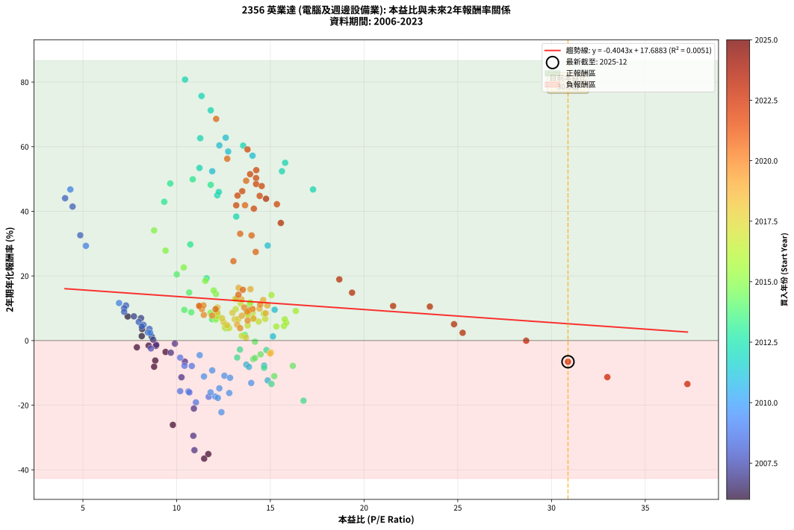
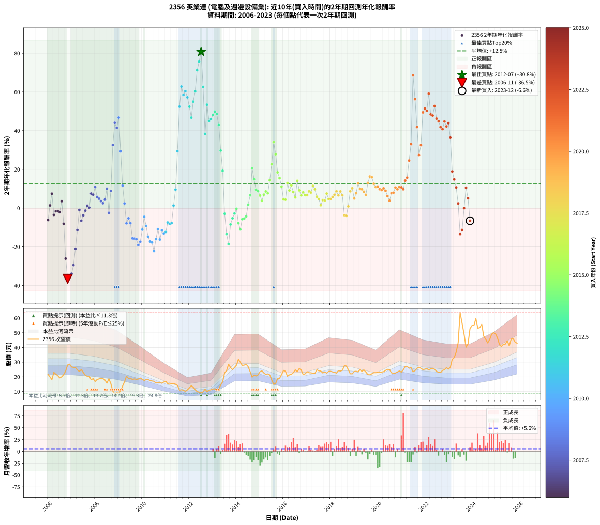

# 2356 英業達 - 本益比與未來報酬率分析

!!! info "報告資訊"
    - **股票代號**: 2356
    - **公司名稱**: 英業達
    - **產業別**: 電腦及週邊設備業
    - **分析期間**: 2006-2023 (216 個數據點)
    - **資料來源**: Type 12 (ShowMonthlyK_ChartFlow) 月收盤價與本益比
    - **報酬率口徑**: 含現金股利 (簡化: 年度合計，假設每年7/1入帳)
    - **報告生成時間**: 2026-01-10 22:28:05 CST

## 📈 視覺化圖表

### 圖表1: 本益比 vs 未來報酬率關係

*圖表1：2356 英業達 本益比與2年期未來報酬率關係 (2006-2023)*

### 圖表2: 歷年買入時點的2年期實際報酬率

*圖表2：2356 英業達 歷年買入時點的2年期實際報酬率 (2006-2023)*

## 📍 買點訊號說明

本報告提供兩種買點提示訊號（顯示於圖表2的股價子圖中）：

### ▲ 小綠色三角形（回測驗證）
- **計算方式**: 使用全部歷史資料計算本益比第25百分位數
- **用途**: 事後驗證，顯示歷史上哪些時點確實為低估區
- **限制**: 當下無法判斷，僅供回測參考
- **特性**: 後見之明（Look-Ahead Bias）

### ▲ 小橘色三角形（即時訊號）
- **計算方式**: 使用截至當月的過去5年資料計算本益比第25百分位數
- **用途**: 實際投資決策，當時即可判斷
- **優勢**: 可操作性強，符合實務需求
- **特性**: 無後見之明，滾動窗口計算

!!! tip "如何使用兩種訊號"
    - **綠色▲** 幫助理解歷史估值機會，驗證策略有效性
    - **橘色▲** 可作為實際買進參考，但仍需搭配基本面分析
    - 兩種訊號重疊時，表示即時判斷與事後驗證一致，信心度較高
    - 僅有綠色▲時，表示當時無法判斷（需要未來資料才能確認）
    - 僅有橘色▲時，表示即時判斷為買點，但事後可能不是最佳時機

## 📊 估值分析摘要

| 指標 | 數值 |
|:---:|:---:|
| **目前本益比** (2023-12) | **30.88 倍** |
| **歷史平均本益比** | 12.83 倍 |
| **估值水準** | 🔴 相對高估 |
| **預期2年年化報酬率** | **+5.20%** |
| **歷史平均報酬率** | +12.50% |
| **相關係數 (R²)** | 0.0051 |
| **趨勢線斜率** | -0.4043 |

!!! abstract "核心洞察"
    目前本益比顯著高於歷史平均，預期未來報酬率可能較低

    根據歷史數據回測，2356 英業達 在目前本益比 **30.9倍** 的估值水準下，
    預期未來2年年化報酬率約為 **+5.2%**。

    **重要提醒**: 本分析基於歷史數據統計，實際報酬率會受到公司基本面變化、產業趨勢、
    總體經濟環境等多重因素影響。R² = 0.01 表示本益比可解釋約 0.5% 的報酬率變異。

## 📈 歷史估值統計

### 最佳買點 (最高報酬率)

| 項目 | 數值 |
|:---:|:---:|
| 起始時間 | 2012-07 |
| 當時本益比 | 10.45 倍 |
| 起始價格 | 9.0 元 |
| 2年後價格 | 26.9 元 |
| **2年年化報酬率** | **+80.76%** |

### 最差買點 (最低報酬率)

| 項目 | 數值 |
|:---:|:---:|
| 起始時間 | 2006-11 |
| 當時本益比 | 11.47 倍 |
| 起始價格 | 28.1 元 |
| 2年後價格 | 8.5 元 |
| **2年年化報酬率** | **-36.54%** |

## 🎯 投資啟示

### 本益比與報酬率關係

趨勢線方程式: **y = -0.4043x + 17.6883**

!!! note "負相關"
    本益比與未來報酬率呈現負相關。較低的本益比通常帶來較高的未來報酬率，
    但相關性不算非常強。**估值仍是重要參考指標之一**。

### 估值區間建議

基於歷史數據分析:

- **🟢 低估區** (P/E < 10.3): 預期報酬率較高，可考慮增加持股
- **🟡 合理區** (P/E 10.3-15.4): 預期報酬率符合長期趨勢，正常持有
- **🔴 高估區** (P/E > 15.4): 預期報酬率較低，可考慮減碼或觀望

!!! danger "風險提示"
    - 過去表現不代表未來結果
    - 本分析假設公司基本面無重大結構性變化
    - 產業環境劇變可能使歷史規律失效
    - 應結合公司財報、產業趨勢、總體經濟等多重因素綜合判斷

!!! success "長期投資觀點"
    歷史數據顯示，在合理或低估的估值水準買入並長期持有，
    往往能獲得較佳的投資報酬。**耐心等待好價格**是價值投資的核心原則。

## 📊 數據品質

- **資料來源**: GoodInfo.tw Type 12 (ShowMonthlyK_ChartFlow)
- **資料頻率**: 月度收盤價與本益比
- **回測期間**: 2006-2023
- **數據點數量**: 216 個 (每個點代表一次2年期回測)

### 計算方法說明

1. **2年期年化報酬率**:
   - 對每個歷史時點，計算其後2年的實際投資報酬率
   - 期末價值(不含股利): 期末價格
   - 期末價值(含現金股利): 期末價格 + 持有期間內的現金股利合計 (簡化: 年度合計，假設每年7/1入帳)
   - 公式: 年化報酬率 = [(期末價值/期初價格)^(1/年數) - 1] × 100%

2. **本益比 (P/E Ratio)**:
   - 使用當時的月收盤價與EPS計算
   - 資料來源: Type 12 月度河流圖本益比數據

3. **趨勢線 (Linear Regression)**:
   - 使用最小平方法擬合線性趨勢線
   - R²值衡量本益比對報酬率的解釋能力

---

*本報告由 Stock Analysis System v1.9.0 自動生成*
*數據更新時間: 2026-01-10 22:28:05 CST*

## 📋 月度回測明細表

（每一列對應時間線圖中的一個買入點；可用來對照 SVG 圖上的每個點。）

| 買入月份 | 賣出月份 | 回測期限_年 | 實際持有年數 | 買入本益比_倍 | 買入收盤價_元 | 賣出收盤價_元 | 現金股利合計_元 | 總報酬率_pct | 年化報酬率_pct |
| --- | --- | --- | --- | --- | --- | --- | --- | --- | --- |
| 2006-01 | 2008-01 | 2 | 1.999 | 8.86 | 21.70 | 16.80 | 2.30 | -11.98 | -6.19 |
| 2006-02 | 2008-02 | 2 | 1.999 | 8.14 | 19.95 | 18.20 | 2.30 | +2.76 | +1.37 |
| 2006-03 | 2008-03 | 2 | 2.001 | 7.39 | 18.10 | 18.60 | 2.30 | +15.47 | +7.45 |
| 2006-04 | 2008-04 | 2 | 2.001 | 9.41 | 23.05 | 19.15 | 2.30 | -6.94 | -3.53 |
| 2006-05 | 2008-05 | 2 | 2.001 | 8.90 | 21.80 | 18.80 | 2.30 | -3.21 | -1.62 |
| 2006-06 | 2008-06 | 2 | 2.001 | 8.51 | 20.85 | 17.90 | 2.30 | -3.12 | -1.57 |
| 2006-07 | 2008-07 | 2 | 2.001 | 7.88 | 19.30 | 15.70 | 2.80 | -4.15 | -2.09 |
| 2006-08 | 2008-08 | 2 | 2.001 | 8.16 | 20.00 | 18.65 | 2.80 | +7.25 | +3.56 |
| 2006-09 | 2008-09 | 2 | 2.001 | 8.80 | 21.55 | 15.40 | 2.80 | -15.55 | -8.10 |
| 2006-10 | 2008-10 | 2 | 2.001 | 9.80 | 24.00 | 10.30 | 2.80 | -45.42 | -26.10 |
| 2006-11 | 2008-11 | 2 | 2.001 | 11.47 | 28.10 | 8.51 | 2.80 | -59.75 | -36.54 |
| 2006-12 | 2008-12 | 2 | 2.001 | 11.69 | 28.65 | 9.25 | 2.80 | -57.94 | -35.13 |
| 2007-01 | 2009-01 | 2 | 2.001 | 10.95 | 26.70 | 8.85 | 2.80 | -56.37 | -33.93 |
| 2007-02 | 2009-02 | 2 | 2.001 | 10.89 | 26.45 | 10.35 | 2.80 | -50.28 | -29.47 |
| 2007-03 | 2009-03 | 2 | 2.001 | 10.92 | 26.40 | 13.65 | 2.80 | -37.69 | -21.05 |
| 2007-04 | 2009-04 | 2 | 2.001 | 10.26 | 24.70 | 16.60 | 2.80 | -21.46 | -11.37 |
| 2007-05 | 2009-05 | 2 | 2.001 | 9.91 | 23.75 | 20.50 | 2.80 | -1.89 | -0.95 |
| 2007-06 | 2009-06 | 2 | 2.001 | 10.44 | 24.90 | 18.95 | 2.80 | -12.65 | -6.53 |
| 2007-07 | 2009-07 | 2 | 2.001 | 9.69 | 23.00 | 19.00 | 2.30 | -7.39 | -3.76 |
| 2007-08 | 2009-08 | 2 | 2.001 | 8.91 | 21.05 | 18.20 | 2.30 | -2.61 | -1.31 |
| 2007-09 | 2009-09 | 2 | 2.001 | 8.67 | 20.40 | 18.60 | 2.30 | +2.45 | +1.22 |
| 2007-10 | 2009-10 | 2 | 2.001 | 8.75 | 20.50 | 18.30 | 2.30 | +0.49 | +0.24 |
| 2007-11 | 2009-11 | 2 | 2.001 | 7.72 | 18.00 | 18.50 | 2.30 | +15.56 | +7.49 |
| 2007-12 | 2009-12 | 2 | 2.001 | 8.10 | 18.80 | 19.20 | 2.30 | +14.36 | +6.94 |
| 2008-01 | 2010-01 | 2 | 2.001 | 7.30 | 16.80 | 18.35 | 2.30 | +22.92 | +10.86 |
| 2008-02 | 2010-03 | 2 | 2.081 | 7.98 | 18.20 | 18.15 | 2.30 | +12.36 | +5.76 |
| 2008-03 | 2010-03 | 2 | 1.999 | 8.23 | 18.60 | 18.15 | 2.30 | +9.95 | +4.86 |
| 2008-04 | 2010-04 | 2 | 1.999 | 8.55 | 19.15 | 18.25 | 2.30 | +7.31 | +3.59 |
| 2008-05 | 2010-05 | 2 | 1.999 | 8.47 | 18.80 | 17.45 | 2.30 | +5.05 | +2.50 |
| 2008-06 | 2010-06 | 2 | 1.999 | 8.14 | 17.90 | 17.20 | 2.30 | +8.94 | +4.38 |
| 2008-07 | 2010-07 | 2 | 1.999 | 7.20 | 15.70 | 17.00 | 2.00 | +21.02 | +10.02 |
| 2008-08 | 2010-08 | 2 | 1.999 | 8.63 | 18.65 | 15.75 | 2.00 | -4.83 | -2.44 |
| 2008-09 | 2010-09 | 2 | 1.999 | 7.20 | 15.40 | 16.25 | 2.00 | +18.51 | +8.87 |
| 2008-10 | 2010-10 | 2 | 1.999 | 4.86 | 10.30 | 16.10 | 2.00 | +75.73 | +32.59 |
| 2008-11 | 2010-11 | 2 | 1.999 | 4.05 | 8.51 | 15.65 | 2.00 | +107.40 | +44.05 |
| 2008-12 | 2010-12 | 2 | 1.999 | 4.45 | 9.25 | 16.50 | 2.00 | +100.00 | +41.45 |
| 2009-01 | 2011-01 | 2 | 1.999 | 4.33 | 8.85 | 17.05 | 2.00 | +115.25 | +46.75 |
| 2009-02 | 2011-02 | 2 | 1.999 | 5.16 | 10.35 | 15.30 | 2.00 | +67.15 | +29.31 |
| 2009-03 | 2011-03 | 2 | 1.999 | 6.93 | 13.65 | 15.00 | 2.00 | +24.54 | +11.61 |
| 2009-04 | 2011-04 | 2 | 1.999 | 8.59 | 16.60 | 15.40 | 2.00 | +4.82 | +2.38 |
| 2009-05 | 2011-05 | 2 | 1.999 | 10.81 | 20.50 | 15.40 | 2.00 | -15.12 | -7.88 |
| 2009-06 | 2011-06 | 2 | 1.999 | 10.19 | 18.95 | 15.00 | 2.00 | -10.29 | -5.29 |
| 2009-07 | 2011-07 | 2 | 1.999 | 10.42 | 19.00 | 14.15 | 2.00 | -14.99 | -7.81 |
| 2009-08 | 2011-08 | 2 | 1.999 | 10.19 | 18.20 | 10.95 | 2.00 | -28.84 | -15.65 |
| 2009-09 | 2011-09 | 2 | 1.999 | 10.63 | 18.60 | 11.20 | 2.00 | -29.03 | -15.76 |
| 2009-10 | 2011-10 | 2 | 1.999 | 10.68 | 18.30 | 10.90 | 2.00 | -29.50 | -16.05 |
| 2009-11 | 2011-11 | 2 | 1.999 | 11.03 | 18.50 | 10.10 | 2.00 | -34.59 | -19.13 |
| 2009-12 | 2011-12 | 2 | 1.999 | 11.71 | 19.20 | 11.10 | 2.00 | -31.77 | -17.41 |
| 2010-01 | 2012-01 | 2 | 1.999 | 11.46 | 18.35 | 12.50 | 2.00 | -20.98 | -11.11 |
| 2010-02 | 2012-02 | 2 | 1.999 | 11.23 | 17.55 | 14.00 | 2.00 | -8.83 | -4.52 |
| 2010-03 | 2012-03 | 2 | 2.001 | 11.90 | 18.15 | 12.95 | 2.00 | -17.63 | -9.23 |
| 2010-04 | 2012-04 | 2 | 2.001 | 12.28 | 18.25 | 11.25 | 2.00 | -27.39 | -14.78 |
| 2010-05 | 2012-05 | 2 | 2.001 | 12.05 | 17.45 | 9.93 | 2.00 | -31.63 | -17.30 |
| 2010-06 | 2012-06 | 2 | 2.001 | 12.20 | 17.20 | 9.63 | 2.00 | -32.38 | -17.76 |
| 2010-07 | 2012-07 | 2 | 2.001 | 12.39 | 17.00 | 8.99 | 1.30 | -39.46 | -22.18 |
| 2010-08 | 2012-08 | 2 | 2.001 | 11.81 | 15.75 | 9.80 | 1.30 | -29.52 | -16.04 |
| 2010-09 | 2012-09 | 2 | 2.001 | 12.55 | 16.25 | 11.60 | 1.30 | -20.61 | -10.89 |
| 2010-10 | 2012-10 | 2 | 2.001 | 12.81 | 16.10 | 9.99 | 1.30 | -29.87 | -16.25 |
| 2010-11 | 2012-11 | 2 | 2.001 | 12.85 | 15.65 | 10.95 | 1.30 | -21.72 | -11.52 |
| 2010-12 | 2012-12 | 2 | 2.001 | 13.98 | 16.50 | 11.15 | 1.30 | -24.54 | -13.12 |
| 2011-01 | 2013-01 | 2 | 2.001 | 14.86 | 17.05 | 11.80 | 1.30 | -23.16 | -12.33 |
| 2011-02 | 2013-02 | 2 | 2.001 | 13.72 | 15.30 | 11.80 | 1.30 | -14.37 | -7.46 |
| 2011-03 | 2013-03 | 2 | 2.001 | 13.86 | 15.00 | 11.35 | 1.30 | -15.66 | -8.16 |
| 2011-04 | 2013-04 | 2 | 2.001 | 14.67 | 15.40 | 11.80 | 1.30 | -14.93 | -7.76 |
| 2011-05 | 2013-05 | 2 | 2.001 | 15.14 | 15.40 | 14.50 | 1.30 | +2.60 | +1.29 |
| 2011-06 | 2013-06 | 2 | 2.001 | 15.23 | 15.00 | 16.70 | 1.30 | +20.01 | +9.54 |
| 2011-07 | 2013-07 | 2 | 2.001 | 14.86 | 14.15 | 22.60 | 1.10 | +67.49 | +29.40 |
| 2011-08 | 2013-08 | 2 | 2.001 | 11.90 | 10.95 | 24.35 | 1.10 | +132.42 | +52.41 |
| 2011-09 | 2013-09 | 2 | 2.001 | 12.62 | 11.20 | 28.60 | 1.10 | +165.18 | +62.79 |
| 2011-10 | 2013-10 | 2 | 2.001 | 12.75 | 10.90 | 26.30 | 1.10 | +151.38 | +58.50 |
| 2011-11 | 2013-11 | 2 | 2.001 | 12.28 | 10.10 | 24.90 | 1.10 | +157.43 | +60.39 |
| 2011-12 | 2013-12 | 2 | 2.001 | 14.05 | 11.10 | 26.35 | 1.10 | +147.30 | +57.21 |
| 2012-01 | 2014-01 | 2 | 2.001 | 15.62 | 12.50 | 27.95 | 1.10 | +132.40 | +52.40 |
| 2012-02 | 2014-03 | 2 | 2.081 | 17.28 | 14.00 | 30.00 | 1.10 | +122.14 | +46.75 |
| 2012-03 | 2014-03 | 2 | 1.999 | 15.79 | 12.95 | 30.00 | 1.10 | +140.15 | +55.02 |
| 2012-04 | 2014-04 | 2 | 1.999 | 13.55 | 11.25 | 27.80 | 1.10 | +156.89 | +60.33 |
| 2012-05 | 2014-05 | 2 | 1.999 | 11.82 | 9.93 | 28.00 | 1.10 | +193.05 | +71.25 |
| 2012-06 | 2014-06 | 2 | 1.999 | 11.33 | 9.63 | 28.60 | 1.10 | +208.41 | +75.68 |
| 2012-07 | 2014-07 | 2 | 1.999 | 10.45 | 8.99 | 26.95 | 2.40 | +226.47 | +80.76 |
| 2012-08 | 2014-08 | 2 | 1.999 | 11.26 | 9.80 | 23.50 | 2.40 | +164.29 | +62.62 |
| 2012-09 | 2014-09 | 2 | 1.999 | 13.18 | 11.60 | 19.80 | 2.40 | +91.38 | +38.37 |
| 2012-10 | 2014-10 | 2 | 1.999 | 11.22 | 9.99 | 21.10 | 2.40 | +135.24 | +53.42 |
| 2012-11 | 2014-11 | 2 | 1.999 | 12.17 | 10.95 | 20.60 | 2.40 | +110.05 | +44.97 |
| 2012-12 | 2014-12 | 2 | 1.999 | 12.25 | 11.15 | 21.35 | 2.40 | +113.00 | +45.98 |
| 2013-01 | 2015-01 | 2 | 1.999 | 11.82 | 11.80 | 23.50 | 2.40 | +119.49 | +48.19 |
| 2013-02 | 2015-02 | 2 | 1.999 | 10.86 | 11.80 | 24.10 | 2.40 | +124.58 | +49.90 |
| 2013-03 | 2015-03 | 2 | 1.999 | 9.66 | 11.35 | 22.65 | 2.40 | +120.70 | +48.60 |
| 2013-04 | 2015-04 | 2 | 1.999 | 9.34 | 11.80 | 21.70 | 2.40 | +104.24 | +42.95 |
| 2013-05 | 2015-05 | 2 | 1.999 | 10.73 | 14.50 | 22.00 | 2.40 | +68.28 | +29.74 |
| 2013-06 | 2015-06 | 2 | 1.999 | 11.60 | 16.70 | 21.35 | 2.40 | +42.22 | +19.27 |
| 2013-07 | 2015-07 | 2 | 1.999 | 14.79 | 22.60 | 17.95 | 3.35 | -5.75 | -2.92 |
| 2013-08 | 2015-08 | 2 | 1.999 | 15.06 | 24.35 | 14.90 | 3.35 | -25.05 | -13.44 |
| 2013-09 | 2015-09 | 2 | 1.999 | 16.77 | 28.60 | 15.60 | 3.35 | -33.74 | -18.61 |
| 2013-10 | 2015-10 | 2 | 1.999 | 14.67 | 26.30 | 18.70 | 3.35 | -16.16 | -8.44 |
| 2013-11 | 2015-11 | 2 | 1.999 | 13.23 | 24.90 | 19.00 | 3.35 | -10.24 | -5.26 |
| 2013-12 | 2015-12 | 2 | 1.999 | 13.38 | 26.35 | 21.55 | 3.35 | -5.50 | -2.79 |
| 2014-01 | 2016-01 | 2 | 1.999 | 14.18 | 27.95 | 24.40 | 3.35 | -0.72 | -0.36 |
| 2014-02 | 2016-02 | 2 | 1.999 | 16.20 | 31.95 | 23.80 | 3.35 | -15.02 | -7.82 |
| 2014-03 | 2016-03 | 2 | 2.001 | 15.21 | 30.00 | 20.40 | 3.35 | -20.83 | -11.02 |
| 2014-04 | 2016-04 | 2 | 2.001 | 14.09 | 27.80 | 21.35 | 3.35 | -11.15 | -5.74 |
| 2014-05 | 2016-05 | 2 | 2.001 | 14.18 | 28.00 | 21.70 | 3.35 | -10.54 | -5.41 |
| 2014-06 | 2016-06 | 2 | 2.001 | 14.48 | 28.60 | 22.85 | 3.35 | -8.39 | -4.28 |
| 2014-07 | 2016-07 | 2 | 2.001 | 13.64 | 26.95 | 24.75 | 3.15 | +3.53 | +1.75 |
| 2014-08 | 2016-08 | 2 | 2.001 | 11.89 | 23.50 | 23.55 | 3.15 | +13.62 | +6.59 |
| 2014-09 | 2016-09 | 2 | 2.001 | 10.01 | 19.80 | 25.60 | 3.15 | +45.20 | +20.48 |
| 2014-10 | 2016-10 | 2 | 2.001 | 10.67 | 21.10 | 24.70 | 3.15 | +31.99 | +14.88 |
| 2014-11 | 2016-11 | 2 | 2.001 | 10.41 | 20.60 | 21.55 | 3.15 | +19.90 | +9.49 |
| 2014-12 | 2016-12 | 2 | 2.001 | 10.78 | 21.35 | 22.10 | 3.15 | +18.27 | +8.74 |
| 2015-01 | 2017-01 | 2 | 2.001 | 12.09 | 23.50 | 23.50 | 3.15 | +13.40 | +6.49 |
| 2015-02 | 2017-02 | 2 | 2.001 | 12.63 | 24.10 | 22.80 | 3.15 | +7.68 | +3.76 |
| 2015-03 | 2017-03 | 2 | 2.001 | 12.10 | 22.65 | 22.75 | 3.15 | +14.35 | +6.93 |
| 2015-04 | 2017-04 | 2 | 2.001 | 11.81 | 21.70 | 22.45 | 3.15 | +17.97 | +8.61 |
| 2015-05 | 2017-05 | 2 | 2.001 | 12.22 | 22.00 | 22.35 | 3.15 | +15.91 | +7.66 |
| 2015-06 | 2017-06 | 2 | 2.001 | 12.10 | 21.35 | 24.80 | 3.15 | +30.91 | +14.41 |
| 2015-07 | 2017-07 | 2 | 2.001 | 10.38 | 17.95 | 24.15 | 2.85 | +50.42 | +22.63 |
| 2015-08 | 2017-08 | 2 | 2.001 | 8.80 | 14.90 | 23.95 | 2.85 | +79.87 | +34.09 |
| 2015-09 | 2017-09 | 2 | 2.001 | 9.41 | 15.60 | 22.65 | 2.85 | +63.46 | +27.83 |
| 2015-10 | 2017-10 | 2 | 2.001 | 11.53 | 18.70 | 23.40 | 2.85 | +40.37 | +18.47 |
| 2015-11 | 2017-11 | 2 | 2.001 | 11.98 | 19.00 | 22.50 | 2.85 | +33.42 | +15.50 |
| 2015-12 | 2017-12 | 2 | 2.001 | 13.90 | 21.55 | 23.75 | 2.85 | +23.43 | +11.09 |
| 2016-01 | 2018-01 | 2 | 2.001 | 15.73 | 24.40 | 23.80 | 2.85 | +9.22 | +4.51 |
| 2016-02 | 2018-03 | 2 | 2.081 | 15.32 | 23.80 | 23.15 | 2.85 | +9.24 | +4.34 |
| 2016-03 | 2018-03 | 2 | 1.999 | 13.12 | 20.40 | 23.15 | 2.85 | +27.45 | +12.90 |
| 2016-04 | 2018-04 | 2 | 1.999 | 13.72 | 21.35 | 22.55 | 2.85 | +18.97 | +9.08 |
| 2016-05 | 2018-05 | 2 | 1.999 | 13.93 | 21.70 | 24.25 | 2.85 | +24.88 | +11.76 |
| 2016-06 | 2018-06 | 2 | 1.999 | 14.65 | 22.85 | 23.95 | 2.85 | +17.29 | +8.30 |
| 2016-07 | 2018-07 | 2 | 1.999 | 15.85 | 24.75 | 24.45 | 3.10 | +11.31 | +5.51 |
| 2016-08 | 2018-08 | 2 | 1.999 | 15.06 | 23.55 | 27.55 | 3.10 | +30.15 | +14.09 |
| 2016-09 | 2018-09 | 2 | 1.999 | 16.36 | 25.60 | 27.40 | 3.10 | +19.14 | +9.16 |
| 2016-10 | 2018-10 | 2 | 1.999 | 15.77 | 24.70 | 24.95 | 3.10 | +13.56 | +6.57 |
| 2016-11 | 2018-11 | 2 | 1.999 | 13.74 | 21.55 | 22.10 | 3.10 | +16.94 | +8.14 |
| 2016-12 | 2018-12 | 2 | 1.999 | 14.08 | 22.10 | 22.05 | 3.10 | +13.80 | +6.68 |
| 2017-01 | 2019-01 | 2 | 1.999 | 14.73 | 23.50 | 23.65 | 3.10 | +13.83 | +6.70 |
| 2017-02 | 2019-02 | 2 | 1.999 | 14.06 | 22.80 | 23.80 | 3.10 | +17.98 | +8.63 |
| 2017-03 | 2019-03 | 2 | 1.999 | 13.81 | 22.75 | 23.45 | 3.10 | +16.70 | +8.04 |
| 2017-04 | 2019-04 | 2 | 1.999 | 13.42 | 22.45 | 24.80 | 3.10 | +24.28 | +11.49 |
| 2017-05 | 2019-05 | 2 | 1.999 | 13.15 | 22.35 | 23.80 | 3.10 | +20.36 | +9.71 |
| 2017-06 | 2019-06 | 2 | 1.999 | 14.38 | 24.80 | 24.70 | 3.10 | +12.10 | +5.88 |
| 2017-07 | 2019-07 | 2 | 1.999 | 13.79 | 24.15 | 23.30 | 3.15 | +9.52 | +4.66 |
| 2017-08 | 2019-08 | 2 | 1.999 | 13.48 | 23.95 | 21.50 | 3.15 | +2.92 | +1.45 |
| 2017-09 | 2019-09 | 2 | 1.999 | 12.57 | 22.65 | 21.40 | 3.15 | +8.39 | +4.11 |
| 2017-10 | 2019-10 | 2 | 1.999 | 12.80 | 23.40 | 22.10 | 3.15 | +7.91 | +3.88 |
| 2017-11 | 2019-11 | 2 | 1.999 | 12.13 | 22.50 | 22.85 | 3.15 | +15.56 | +7.50 |
| 2017-12 | 2019-12 | 2 | 1.999 | 12.63 | 23.75 | 22.85 | 3.15 | +9.47 | +4.63 |
| 2018-01 | 2020-01 | 2 | 1.999 | 12.70 | 23.80 | 22.95 | 3.15 | +9.66 | +4.72 |
| 2018-02 | 2020-02 | 2 | 1.999 | 12.50 | 23.35 | 22.95 | 3.15 | +11.78 | +5.73 |
| 2018-03 | 2020-03 | 2 | 2.001 | 12.43 | 23.15 | 23.30 | 3.15 | +14.25 | +6.89 |
| 2018-04 | 2020-04 | 2 | 2.001 | 12.15 | 22.55 | 23.50 | 3.15 | +18.18 | +8.71 |
| 2018-05 | 2020-05 | 2 | 2.001 | 13.10 | 24.25 | 24.40 | 3.15 | +13.61 | +6.58 |
| 2018-06 | 2020-06 | 2 | 2.001 | 12.98 | 23.95 | 25.10 | 3.15 | +17.95 | +8.60 |
| 2018-07 | 2020-07 | 2 | 2.001 | 13.29 | 24.45 | 25.00 | 2.80 | +13.70 | +6.63 |
| 2018-08 | 2020-08 | 2 | 2.001 | 15.03 | 27.55 | 22.75 | 2.80 | -7.26 | -3.70 |
| 2018-09 | 2020-09 | 2 | 2.001 | 14.99 | 27.40 | 22.45 | 2.80 | -7.85 | -4.00 |
| 2018-10 | 2020-10 | 2 | 2.001 | 13.70 | 24.95 | 22.60 | 2.80 | +1.80 | +0.90 |
| 2018-11 | 2020-11 | 2 | 2.001 | 12.17 | 22.10 | 23.30 | 2.80 | +18.10 | +8.67 |
| 2018-12 | 2020-12 | 2 | 2.001 | 12.18 | 22.05 | 24.00 | 2.80 | +21.54 | +10.24 |
| 2019-01 | 2021-01 | 2 | 2.001 | 13.23 | 23.65 | 23.25 | 2.80 | +10.15 | +4.95 |
| 2019-02 | 2021-02 | 2 | 2.001 | 13.48 | 23.80 | 24.80 | 2.80 | +15.97 | +7.68 |
| 2019-03 | 2021-03 | 2 | 2.001 | 13.46 | 23.45 | 27.00 | 2.80 | +27.08 | +12.72 |
| 2019-04 | 2021-04 | 2 | 2.001 | 14.42 | 24.80 | 27.15 | 2.80 | +20.77 | +9.89 |
| 2019-05 | 2021-05 | 2 | 2.001 | 14.02 | 23.80 | 25.85 | 2.80 | +20.38 | +9.71 |
| 2019-06 | 2021-06 | 2 | 2.001 | 14.75 | 24.70 | 26.25 | 2.80 | +17.61 | +8.44 |
| 2019-07 | 2021-07 | 2 | 2.001 | 14.10 | 23.30 | 23.45 | 3.15 | +14.16 | +6.84 |
| 2019-08 | 2021-08 | 2 | 2.001 | 13.19 | 21.50 | 24.30 | 3.15 | +27.67 | +12.98 |
| 2019-09 | 2021-09 | 2 | 2.001 | 13.31 | 21.40 | 25.80 | 3.15 | +35.28 | +16.30 |
| 2019-10 | 2021-10 | 2 | 2.001 | 13.94 | 22.10 | 26.55 | 3.15 | +34.39 | +15.91 |
| 2019-11 | 2021-11 | 2 | 2.001 | 14.62 | 22.85 | 25.80 | 3.15 | +26.70 | +12.55 |
| 2019-12 | 2021-12 | 2 | 2.001 | 14.84 | 22.85 | 24.95 | 3.15 | +22.98 | +10.89 |
| 2020-01 | 2022-01 | 2 | 2.001 | 14.46 | 22.95 | 25.20 | 3.15 | +23.53 | +11.14 |
| 2020-02 | 2022-03 | 2 | 2.081 | 14.05 | 22.95 | 24.70 | 3.15 | +21.35 | +9.75 |
| 2020-03 | 2022-03 | 2 | 1.999 | 13.87 | 23.30 | 24.70 | 3.15 | +19.53 | +9.34 |
| 2020-04 | 2022-04 | 2 | 1.999 | 13.61 | 23.50 | 25.40 | 3.15 | +21.49 | +10.23 |
| 2020-05 | 2022-05 | 2 | 1.999 | 13.76 | 24.40 | 25.80 | 3.15 | +18.65 | +8.93 |
| 2020-06 | 2022-06 | 2 | 1.999 | 13.79 | 25.10 | 25.15 | 3.15 | +12.75 | +6.19 |
| 2020-07 | 2022-07 | 2 | 1.999 | 13.39 | 25.00 | 23.70 | 3.25 | +7.80 | +3.83 |
| 2020-08 | 2022-08 | 2 | 1.999 | 11.89 | 22.75 | 23.15 | 3.25 | +16.04 | +7.73 |
| 2020-09 | 2022-09 | 2 | 1.999 | 11.45 | 22.45 | 22.90 | 3.25 | +16.48 | +7.93 |
| 2020-10 | 2022-10 | 2 | 1.999 | 11.26 | 22.60 | 24.40 | 3.25 | +22.35 | +10.62 |
| 2020-11 | 2022-11 | 2 | 1.999 | 11.35 | 23.30 | 24.80 | 3.25 | +20.39 | +9.73 |
| 2020-12 | 2022-12 | 2 | 1.999 | 11.43 | 24.00 | 26.25 | 3.25 | +22.92 | +10.88 |
| 2021-01 | 2023-01 | 2 | 1.999 | 11.20 | 23.25 | 25.25 | 3.25 | +22.58 | +10.72 |
| 2021-02 | 2023-02 | 2 | 1.999 | 12.08 | 24.80 | 26.60 | 3.25 | +20.36 | +9.72 |
| 2021-03 | 2023-03 | 2 | 1.999 | 13.30 | 27.00 | 31.95 | 3.25 | +30.37 | +14.19 |
| 2021-04 | 2023-04 | 2 | 1.999 | 13.53 | 27.15 | 33.10 | 3.25 | +33.89 | +15.72 |
| 2021-05 | 2023-05 | 2 | 1.999 | 13.03 | 25.85 | 36.85 | 3.25 | +55.13 | +24.57 |
| 2021-06 | 2023-06 | 2 | 1.999 | 13.39 | 26.25 | 43.20 | 3.25 | +76.95 | +33.05 |
| 2021-07 | 2023-07 | 2 | 1.999 | 12.11 | 23.45 | 63.70 | 2.90 | +184.01 | +68.59 |
| 2021-08 | 2023-08 | 2 | 1.999 | 12.70 | 24.30 | 56.40 | 2.90 | +144.03 | +56.26 |
| 2021-09 | 2023-09 | 2 | 1.999 | 13.65 | 25.80 | 49.00 | 2.90 | +101.16 | +41.87 |
| 2021-10 | 2023-10 | 2 | 1.999 | 14.22 | 26.55 | 40.20 | 2.90 | +62.34 | +27.43 |
| 2021-11 | 2023-11 | 2 | 1.999 | 14.00 | 25.80 | 42.40 | 2.90 | +75.58 | +32.53 |
| 2021-12 | 2023-12 | 2 | 1.999 | 13.71 | 24.95 | 52.80 | 2.90 | +123.25 | +49.46 |
| 2022-01 | 2024-01 | 2 | 1.999 | 13.92 | 25.20 | 54.90 | 2.90 | +129.37 | +51.49 |
| 2022-02 | 2024-02 | 2 | 1.999 | 14.24 | 25.65 | 55.00 | 2.90 | +125.73 | +50.29 |
| 2022-03 | 2024-03 | 2 | 2.001 | 13.78 | 24.70 | 59.70 | 2.90 | +153.44 | +59.15 |
| 2022-04 | 2024-04 | 2 | 2.001 | 14.24 | 25.40 | 53.10 | 2.90 | +120.47 | +48.44 |
| 2022-05 | 2024-05 | 2 | 2.001 | 14.54 | 25.80 | 53.50 | 2.90 | +118.60 | +47.81 |
| 2022-06 | 2024-06 | 2 | 2.001 | 14.25 | 25.15 | 55.80 | 2.90 | +133.40 | +52.73 |
| 2022-07 | 2024-07 | 2 | 2.001 | 13.50 | 23.70 | 47.70 | 3.00 | +113.92 | +46.22 |
| 2022-08 | 2024-08 | 2 | 2.001 | 13.25 | 23.15 | 45.60 | 3.00 | +109.94 | +44.85 |
| 2022-09 | 2024-09 | 2 | 2.001 | 13.18 | 22.90 | 43.10 | 3.00 | +101.31 | +41.85 |
| 2022-10 | 2024-10 | 2 | 2.001 | 14.12 | 24.40 | 45.40 | 3.00 | +98.36 | +40.81 |
| 2022-11 | 2024-11 | 2 | 2.001 | 14.43 | 24.80 | 49.00 | 3.00 | +109.68 | +44.77 |
| 2022-12 | 2024-12 | 2 | 2.001 | 15.35 | 26.25 | 50.10 | 3.00 | +102.29 | +42.19 |
| 2023-01 | 2025-01 | 2 | 2.001 | 14.77 | 25.25 | 49.30 | 3.00 | +107.13 | +43.88 |
| 2023-02 | 2025-02 | 2 | 2.001 | 15.56 | 26.60 | 46.50 | 3.00 | +86.09 | +36.39 |
| 2023-03 | 2025-03 | 2 | 2.001 | 18.68 | 31.95 | 42.20 | 3.00 | +41.47 | +18.93 |
| 2023-04 | 2025-04 | 2 | 2.001 | 19.36 | 33.10 | 40.65 | 3.00 | +31.87 | +14.83 |
| 2023-05 | 2025-05 | 2 | 2.001 | 21.55 | 36.85 | 42.15 | 3.00 | +22.52 | +10.68 |
| 2023-06 | 2025-06 | 2 | 2.001 | 25.26 | 43.20 | 42.30 | 3.00 | +4.86 | +2.40 |
| 2023-07 | 2025-07 | 2 | 2.001 | 37.25 | 63.70 | 44.50 | 3.20 | -25.12 | -13.46 |
| 2023-08 | 2025-08 | 2 | 2.001 | 32.98 | 56.40 | 41.15 | 3.20 | -21.37 | -11.32 |
| 2023-09 | 2025-09 | 2 | 2.001 | 28.65 | 49.00 | 45.75 | 3.20 | -0.10 | -0.05 |
| 2023-10 | 2025-10 | 2 | 2.001 | 23.51 | 40.20 | 45.90 | 3.20 | +22.14 | +10.51 |
| 2023-11 | 2025-11 | 2 | 2.001 | 24.80 | 42.40 | 43.60 | 3.20 | +10.38 | +5.06 |
| 2023-12 | 2025-12 | 2 | 2.001 | 30.88 | 52.80 | 42.90 | 3.20 | -12.69 | -6.56 |
