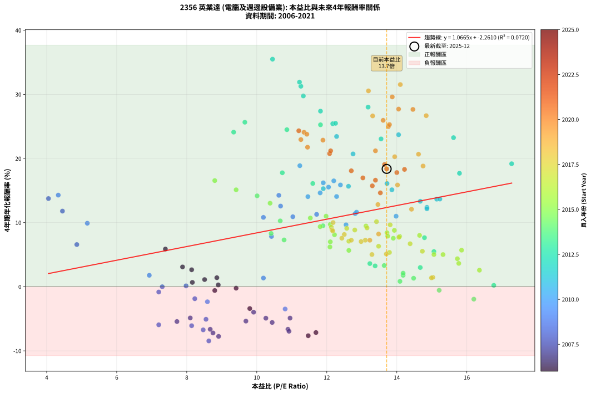
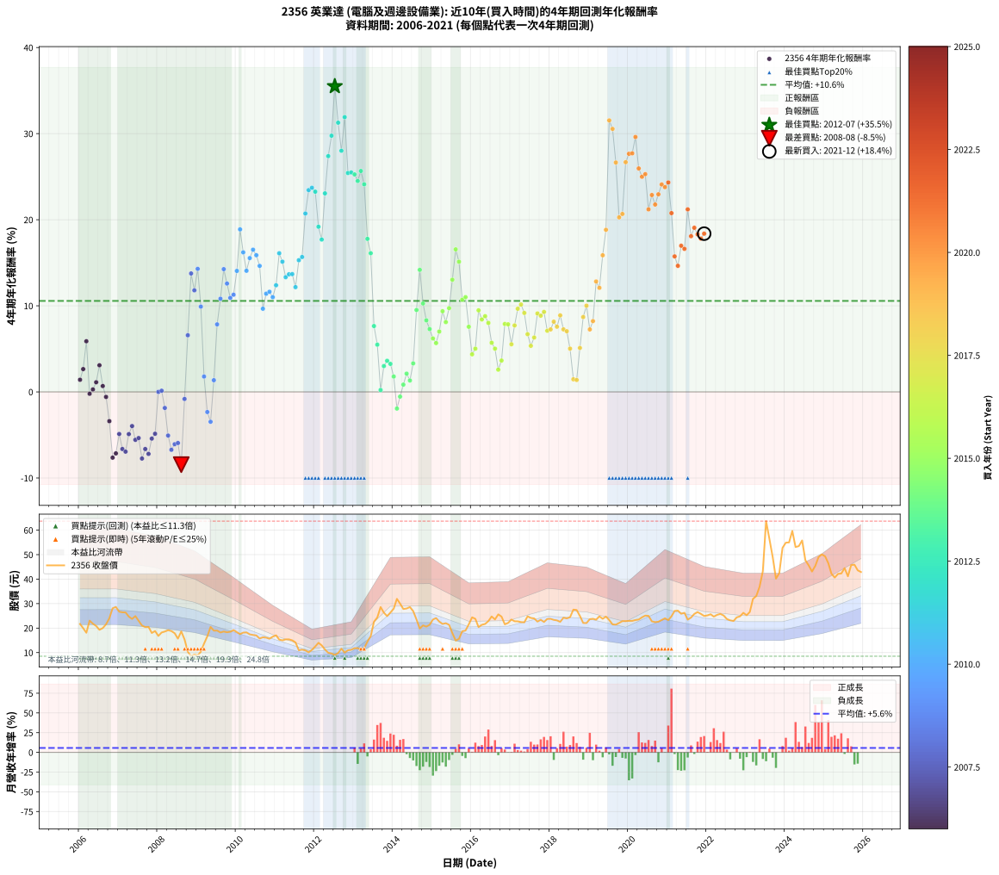

# 2356 英業達 - 本益比與未來報酬率分析

!!! info "報告資訊"
    - **股票代號**: 2356
    - **公司名稱**: 英業達
    - **產業別**: 電腦及週邊設備業
    - **分析期間**: 2006-2021 (192 個數據點)
    - **資料來源**: Type 12 (ShowMonthlyK_ChartFlow) 月收盤價與本益比
    - **報酬率口徑**: 含現金股利 (簡化: 年度合計，假設每年7/1入帳)
    - **報告生成時間**: 2026-01-10 18:29:08 CST

## 📈 視覺化圖表

### 圖表1: 本益比 vs 未來報酬率關係

*圖表1：2356 英業達 本益比與4年期未來報酬率關係 (2006-2021)*

### 圖表2: 歷年買入時點的4年期實際報酬率

*圖表2：2356 英業達 歷年買入時點的4年期實際報酬率 (2006-2021)*

## 📍 買點訊號說明

本報告提供兩種買點提示訊號（顯示於圖表2的股價子圖中）：

### ▲ 小綠色三角形（回測驗證）
- **計算方式**: 使用全部歷史資料計算本益比第25百分位數
- **用途**: 事後驗證，顯示歷史上哪些時點確實為低估區
- **限制**: 當下無法判斷，僅供回測參考
- **特性**: 後見之明（Look-Ahead Bias）

### ▲ 小橘色三角形（即時訊號）
- **計算方式**: 使用截至當月的過去5年資料計算本益比第25百分位數
- **用途**: 實際投資決策，當時即可判斷
- **優勢**: 可操作性強，符合實務需求
- **特性**: 無後見之明，滾動窗口計算

!!! tip "如何使用兩種訊號"
    - **綠色▲** 幫助理解歷史估值機會，驗證策略有效性
    - **橘色▲** 可作為實際買進參考，但仍需搭配基本面分析
    - 兩種訊號重疊時，表示即時判斷與事後驗證一致，信心度較高
    - 僅有綠色▲時，表示當時無法判斷（需要未來資料才能確認）
    - 僅有橘色▲時，表示即時判斷為買點，但事後可能不是最佳時機

## 📊 估值分析摘要

| 指標 | 數值 |
|:---:|:---:|
| **目前本益比** (2021-12) | **13.71 倍** |
| **歷史平均本益比** | 12.03 倍 |
| **估值水準** | 🟡 合理範圍 |
| **預期4年年化報酬率** | **+12.36%** |
| **歷史平均報酬率** | +10.57% |
| **相關係數 (R²)** | 0.0720 |
| **趨勢線斜率** | 1.0665 |

!!! abstract "核心洞察"
    目前本益比接近歷史平均，預期報酬率符合長期趨勢

    根據歷史數據回測，2356 英業達 在目前本益比 **13.7倍** 的估值水準下，
    預期未來4年年化報酬率約為 **+12.4%**。

    **重要提醒**: 本分析基於歷史數據統計，實際報酬率會受到公司基本面變化、產業趨勢、
    總體經濟環境等多重因素影響。R² = 0.07 表示本益比可解釋約 7.2% 的報酬率變異。

## 📈 歷史估值統計

### 最佳買點 (最高報酬率)

| 項目 | 數值 |
|:---:|:---:|
| 起始時間 | 2012-07 |
| 當時本益比 | 10.45 倍 |
| 起始價格 | 9.0 元 |
| 4年後價格 | 24.8 元 |
| **4年年化報酬率** | **+35.49%** |

### 最差買點 (最低報酬率)

| 項目 | 數值 |
|:---:|:---:|
| 起始時間 | 2008-08 |
| 當時本益比 | 8.63 倍 |
| 起始價格 | 18.6 元 |
| 4年後價格 | 9.8 元 |
| **4年年化報酬率** | **-8.45%** |

## 🎯 投資啟示

### 本益比與報酬率關係

趨勢線方程式: **y = 1.0665x + -2.2610**

!!! info "弱相關或正相關"
    本益比與未來報酬率相關性較弱。這可能表示該股票的報酬率更多受到
    公司成長性、產業趨勢等因素影響，而非估值水準。**需綜合考量多項指標**。

### 估值區間建議

基於歷史數據分析:

- **🟢 低估區** (P/E < 9.6): 預期報酬率較高，可考慮增加持股
- **🟡 合理區** (P/E 9.6-14.4): 預期報酬率符合長期趨勢，正常持有
- **🔴 高估區** (P/E > 14.4): 預期報酬率較低，可考慮減碼或觀望

!!! danger "風險提示"
    - 過去表現不代表未來結果
    - 本分析假設公司基本面無重大結構性變化
    - 產業環境劇變可能使歷史規律失效
    - 應結合公司財報、產業趨勢、總體經濟等多重因素綜合判斷

!!! success "長期投資觀點"
    歷史數據顯示，在合理或低估的估值水準買入並長期持有，
    往往能獲得較佳的投資報酬。**耐心等待好價格**是價值投資的核心原則。

## 📊 數據品質

- **資料來源**: GoodInfo.tw Type 12 (ShowMonthlyK_ChartFlow)
- **資料頻率**: 月度收盤價與本益比
- **回測期間**: 2006-2021
- **數據點數量**: 192 個 (每個點代表一次4年期回測)

### 計算方法說明

1. **4年期年化報酬率**:
   - 對每個歷史時點，計算其後4年的實際投資報酬率
   - 期末價值(不含股利): 期末價格
   - 期末價值(含現金股利): 期末價格 + 持有期間內的現金股利合計 (簡化: 年度合計，假設每年7/1入帳)
   - 公式: 年化報酬率 = [(期末價值/期初價格)^(1/年數) - 1] × 100%

2. **本益比 (P/E Ratio)**:
   - 使用當時的月收盤價與EPS計算
   - 資料來源: Type 12 月度河流圖本益比數據

3. **趨勢線 (Linear Regression)**:
   - 使用最小平方法擬合線性趨勢線
   - R²值衡量本益比對報酬率的解釋能力

---

*本報告由 Stock Analysis System v1.9.0 自動生成*
*數據更新時間: 2026-01-10 18:29:08 CST*

## 📋 月度回測明細表

（每一列對應時間線圖中的一個買入點；可用來對照 SVG 圖上的每個點。）

| 買入月份 | 賣出月份 | 回測期限_年 | 實際持有年數 | 買入本益比_倍 | 買入收盤價_元 | 賣出收盤價_元 | 現金股利合計_元 | 總報酬率_pct | 年化報酬率_pct |
| --- | --- | --- | --- | --- | --- | --- | --- | --- | --- |
| 2006-01 | 2010-01 | 4 | 4.000 | 8.86 | 21.70 | 18.35 | 4.60 | +5.76 | +1.41 |
| 2006-02 | 2010-02 | 4 | 4.000 | 8.14 | 19.95 | 17.55 | 4.60 | +11.03 | +2.65 |
| 2006-03 | 2010-03 | 4 | 4.000 | 7.39 | 18.10 | 18.15 | 4.60 | +25.69 | +5.88 |
| 2006-04 | 2010-04 | 4 | 4.000 | 9.41 | 23.05 | 18.25 | 4.60 | -0.87 | -0.22 |
| 2006-05 | 2010-05 | 4 | 4.000 | 8.90 | 21.80 | 17.45 | 4.60 | +1.15 | +0.29 |
| 2006-06 | 2010-06 | 4 | 4.000 | 8.51 | 20.85 | 17.20 | 4.60 | +4.56 | +1.12 |
| 2006-07 | 2010-07 | 4 | 4.000 | 7.88 | 19.30 | 17.00 | 4.80 | +12.95 | +3.09 |
| 2006-08 | 2010-08 | 4 | 4.000 | 8.16 | 20.00 | 15.75 | 4.80 | +2.75 | +0.68 |
| 2006-09 | 2010-09 | 4 | 4.000 | 8.80 | 21.55 | 16.25 | 4.80 | -2.32 | -0.59 |
| 2006-10 | 2010-10 | 4 | 4.000 | 9.80 | 24.00 | 16.10 | 4.80 | -12.92 | -3.40 |
| 2006-11 | 2010-11 | 4 | 4.000 | 11.47 | 28.10 | 15.65 | 4.80 | -27.22 | -7.64 |
| 2006-12 | 2010-12 | 4 | 4.000 | 11.69 | 28.65 | 16.50 | 4.80 | -25.65 | -7.14 |
| 2007-01 | 2011-01 | 4 | 4.000 | 10.95 | 26.70 | 17.05 | 4.80 | -18.16 | -4.89 |
| 2007-02 | 2011-02 | 4 | 4.000 | 10.89 | 26.45 | 15.30 | 4.80 | -24.01 | -6.63 |
| 2007-03 | 2011-03 | 4 | 4.000 | 10.92 | 26.40 | 15.00 | 4.80 | -25.00 | -6.94 |
| 2007-04 | 2011-04 | 4 | 4.000 | 10.26 | 24.70 | 15.40 | 4.80 | -18.22 | -4.90 |
| 2007-05 | 2011-05 | 4 | 4.000 | 9.91 | 23.75 | 15.40 | 4.80 | -14.95 | -3.97 |
| 2007-06 | 2011-06 | 4 | 4.000 | 10.44 | 24.90 | 15.00 | 4.80 | -20.48 | -5.57 |
| 2007-07 | 2011-07 | 4 | 4.000 | 9.69 | 23.00 | 14.15 | 4.30 | -19.78 | -5.36 |
| 2007-08 | 2011-08 | 4 | 4.000 | 8.91 | 21.05 | 10.95 | 4.30 | -27.55 | -7.74 |
| 2007-09 | 2011-09 | 4 | 4.000 | 8.67 | 20.40 | 11.20 | 4.30 | -24.01 | -6.64 |
| 2007-10 | 2011-10 | 4 | 4.000 | 8.75 | 20.50 | 10.90 | 4.30 | -25.85 | -7.20 |
| 2007-11 | 2011-11 | 4 | 4.000 | 7.72 | 18.00 | 10.10 | 4.30 | -19.99 | -5.42 |
| 2007-12 | 2011-12 | 4 | 4.000 | 8.10 | 18.80 | 11.10 | 4.30 | -18.08 | -4.86 |
| 2008-01 | 2012-01 | 4 | 4.000 | 7.30 | 16.80 | 12.50 | 4.30 | +0.01 | +0.00 |
| 2008-02 | 2012-02 | 4 | 4.000 | 7.98 | 18.20 | 14.00 | 4.30 | +0.55 | +0.14 |
| 2008-03 | 2012-03 | 4 | 4.000 | 8.23 | 18.60 | 12.95 | 4.30 | -7.25 | -1.86 |
| 2008-04 | 2012-04 | 4 | 4.000 | 8.55 | 19.15 | 11.25 | 4.30 | -18.79 | -5.07 |
| 2008-05 | 2012-05 | 4 | 4.000 | 8.47 | 18.80 | 9.93 | 4.30 | -24.30 | -6.72 |
| 2008-06 | 2012-06 | 4 | 4.000 | 8.14 | 17.90 | 9.63 | 4.30 | -22.17 | -6.07 |
| 2008-07 | 2012-07 | 4 | 4.000 | 7.20 | 15.70 | 8.99 | 3.30 | -21.71 | -5.94 |
| 2008-08 | 2012-08 | 4 | 4.000 | 8.63 | 18.65 | 9.80 | 3.30 | -29.75 | -8.45 |
| 2008-09 | 2012-09 | 4 | 4.000 | 7.20 | 15.40 | 11.60 | 3.30 | -3.24 | -0.82 |
| 2008-10 | 2012-10 | 4 | 4.000 | 4.86 | 10.30 | 9.99 | 3.30 | +29.04 | +6.58 |
| 2008-11 | 2012-11 | 4 | 4.000 | 4.05 | 8.51 | 10.95 | 3.30 | +67.46 | +13.76 |
| 2008-12 | 2012-12 | 4 | 4.000 | 4.45 | 9.25 | 11.15 | 3.30 | +56.23 | +11.80 |
| 2009-01 | 2013-01 | 4 | 4.000 | 4.33 | 8.85 | 11.80 | 3.30 | +70.63 | +14.29 |
| 2009-02 | 2013-02 | 4 | 4.000 | 5.16 | 10.35 | 11.80 | 3.30 | +45.90 | +9.90 |
| 2009-03 | 2013-03 | 4 | 4.000 | 6.93 | 13.65 | 11.35 | 3.30 | +7.33 | +1.78 |
| 2009-04 | 2013-04 | 4 | 4.000 | 8.59 | 16.60 | 11.80 | 3.30 | -9.03 | -2.34 |
| 2009-05 | 2013-05 | 4 | 4.000 | 10.81 | 20.50 | 14.50 | 3.30 | -13.17 | -3.47 |
| 2009-06 | 2013-06 | 4 | 4.000 | 10.19 | 18.95 | 16.70 | 3.30 | +5.55 | +1.36 |
| 2009-07 | 2013-07 | 4 | 4.000 | 10.42 | 19.00 | 22.60 | 3.10 | +35.27 | +7.84 |
| 2009-08 | 2013-08 | 4 | 4.000 | 10.19 | 18.20 | 24.35 | 3.10 | +50.83 | +10.82 |
| 2009-09 | 2013-09 | 4 | 4.000 | 10.63 | 18.60 | 28.60 | 3.10 | +70.44 | +14.26 |
| 2009-10 | 2013-10 | 4 | 4.000 | 10.68 | 18.30 | 26.30 | 3.10 | +60.66 | +12.58 |
| 2009-11 | 2013-11 | 4 | 4.000 | 11.03 | 18.50 | 24.90 | 3.10 | +51.36 | +10.92 |
| 2009-12 | 2013-12 | 4 | 4.000 | 11.71 | 19.20 | 26.35 | 3.10 | +53.39 | +11.29 |
| 2010-01 | 2014-01 | 4 | 4.000 | 11.46 | 18.35 | 27.95 | 3.10 | +69.22 | +14.05 |
| 2010-02 | 2014-02 | 4 | 4.000 | 11.23 | 17.55 | 31.95 | 3.10 | +99.72 | +18.88 |
| 2010-03 | 2014-03 | 4 | 4.000 | 11.90 | 18.15 | 30.00 | 3.10 | +82.37 | +16.21 |
| 2010-04 | 2014-04 | 4 | 4.000 | 12.28 | 18.25 | 27.80 | 3.10 | +69.32 | +14.07 |
| 2010-05 | 2014-05 | 4 | 4.000 | 12.05 | 17.45 | 28.00 | 3.10 | +78.23 | +15.54 |
| 2010-06 | 2014-06 | 4 | 4.000 | 12.20 | 17.20 | 28.60 | 3.10 | +84.31 | +16.52 |
| 2010-07 | 2014-07 | 4 | 4.000 | 12.39 | 17.00 | 26.95 | 3.70 | +80.30 | +15.88 |
| 2010-08 | 2014-08 | 4 | 4.000 | 11.81 | 15.75 | 23.50 | 3.70 | +72.70 | +14.64 |
| 2010-09 | 2014-09 | 4 | 4.000 | 12.55 | 16.25 | 19.80 | 3.70 | +44.62 | +9.66 |
| 2010-10 | 2014-10 | 4 | 4.000 | 12.81 | 16.10 | 21.10 | 3.70 | +54.04 | +11.41 |
| 2010-11 | 2014-11 | 4 | 4.000 | 12.85 | 15.65 | 20.60 | 3.70 | +55.28 | +11.63 |
| 2010-12 | 2014-12 | 4 | 4.000 | 13.98 | 16.50 | 21.35 | 3.70 | +51.82 | +11.00 |
| 2011-01 | 2015-01 | 4 | 4.000 | 14.86 | 17.05 | 23.50 | 3.70 | +59.54 | +12.39 |
| 2011-02 | 2015-02 | 4 | 4.000 | 13.72 | 15.30 | 24.10 | 3.70 | +81.71 | +16.10 |
| 2011-03 | 2015-03 | 4 | 4.000 | 13.86 | 15.00 | 22.65 | 3.70 | +75.67 | +15.13 |
| 2011-04 | 2015-04 | 4 | 4.000 | 14.67 | 15.40 | 21.70 | 3.70 | +64.94 | +13.33 |
| 2011-05 | 2015-05 | 4 | 4.000 | 15.14 | 15.40 | 22.00 | 3.70 | +66.89 | +13.66 |
| 2011-06 | 2015-06 | 4 | 4.000 | 15.23 | 15.00 | 21.35 | 3.70 | +67.01 | +13.68 |
| 2011-07 | 2015-07 | 4 | 4.000 | 14.86 | 14.15 | 17.95 | 4.45 | +58.30 | +12.17 |
| 2011-08 | 2015-08 | 4 | 4.000 | 11.90 | 10.95 | 14.90 | 4.45 | +76.71 | +15.30 |
| 2011-09 | 2015-09 | 4 | 4.000 | 12.62 | 11.20 | 15.60 | 4.45 | +79.02 | +15.67 |
| 2011-10 | 2015-10 | 4 | 4.000 | 12.75 | 10.90 | 18.70 | 4.45 | +112.39 | +20.72 |
| 2011-11 | 2015-11 | 4 | 4.000 | 12.28 | 10.10 | 19.00 | 4.45 | +132.18 | +23.44 |
| 2011-12 | 2015-12 | 4 | 4.000 | 14.05 | 11.10 | 21.55 | 4.45 | +134.23 | +23.71 |
| 2012-01 | 2016-01 | 4 | 4.000 | 15.62 | 12.50 | 24.40 | 4.45 | +130.80 | +23.26 |
| 2012-02 | 2016-02 | 4 | 4.000 | 17.28 | 14.00 | 23.80 | 4.45 | +101.79 | +19.19 |
| 2012-03 | 2016-03 | 4 | 4.000 | 15.79 | 12.95 | 20.40 | 4.45 | +91.89 | +17.70 |
| 2012-04 | 2016-04 | 4 | 4.000 | 13.55 | 11.25 | 21.35 | 4.45 | +129.33 | +23.06 |
| 2012-05 | 2016-05 | 4 | 4.000 | 11.82 | 9.93 | 21.70 | 4.45 | +163.34 | +27.39 |
| 2012-06 | 2016-06 | 4 | 4.000 | 11.33 | 9.63 | 22.85 | 4.45 | +183.49 | +29.76 |
| 2012-07 | 2016-07 | 4 | 4.000 | 10.45 | 8.99 | 24.75 | 5.55 | +237.04 | +35.49 |
| 2012-08 | 2016-08 | 4 | 4.000 | 11.26 | 9.80 | 23.55 | 5.55 | +196.94 | +31.27 |
| 2012-09 | 2016-09 | 4 | 4.000 | 13.18 | 11.60 | 25.60 | 5.55 | +168.53 | +28.01 |
| 2012-10 | 2016-10 | 4 | 4.000 | 11.22 | 9.99 | 24.70 | 5.55 | +202.80 | +31.91 |
| 2012-11 | 2016-11 | 4 | 4.000 | 12.17 | 10.95 | 21.55 | 5.55 | +147.49 | +25.43 |
| 2012-12 | 2016-12 | 4 | 4.000 | 12.25 | 11.15 | 22.10 | 5.55 | +147.98 | +25.49 |
| 2013-01 | 2017-01 | 4 | 4.000 | 11.82 | 11.80 | 23.50 | 5.55 | +146.19 | +25.26 |
| 2013-02 | 2017-02 | 4 | 4.000 | 10.86 | 11.80 | 22.80 | 5.55 | +140.25 | +24.50 |
| 2013-03 | 2017-03 | 4 | 4.000 | 9.66 | 11.35 | 22.75 | 5.55 | +149.34 | +25.66 |
| 2013-04 | 2017-04 | 4 | 4.000 | 9.34 | 11.80 | 22.45 | 5.55 | +137.29 | +24.11 |
| 2013-05 | 2017-05 | 4 | 4.000 | 10.73 | 14.50 | 22.35 | 5.55 | +92.41 | +17.78 |
| 2013-06 | 2017-06 | 4 | 4.000 | 11.60 | 16.70 | 24.80 | 5.55 | +81.74 | +16.11 |
| 2013-07 | 2017-07 | 4 | 4.000 | 14.79 | 22.60 | 24.15 | 6.20 | +34.29 | +7.65 |
| 2013-08 | 2017-08 | 4 | 4.000 | 15.06 | 24.35 | 23.95 | 6.20 | +23.82 | +5.49 |
| 2013-09 | 2017-09 | 4 | 4.000 | 16.77 | 28.60 | 22.65 | 6.20 | +0.87 | +0.22 |
| 2013-10 | 2017-10 | 4 | 4.000 | 14.67 | 26.30 | 23.40 | 6.20 | +12.55 | +3.00 |
| 2013-11 | 2017-11 | 4 | 4.000 | 13.23 | 24.90 | 22.50 | 6.20 | +15.26 | +3.61 |
| 2013-12 | 2017-12 | 4 | 4.000 | 13.38 | 26.35 | 23.75 | 6.20 | +13.66 | +3.25 |
| 2014-01 | 2018-01 | 4 | 4.000 | 14.18 | 27.95 | 23.80 | 6.20 | +7.33 | +1.79 |
| 2014-02 | 2018-02 | 4 | 4.000 | 16.20 | 31.95 | 23.35 | 6.20 | -7.51 | -1.93 |
| 2014-03 | 2018-03 | 4 | 4.000 | 15.21 | 30.00 | 23.15 | 6.20 | -2.17 | -0.55 |
| 2014-04 | 2018-04 | 4 | 4.000 | 14.09 | 27.80 | 22.55 | 6.20 | +3.42 | +0.84 |
| 2014-05 | 2018-05 | 4 | 4.000 | 14.18 | 28.00 | 24.25 | 6.20 | +8.75 | +2.12 |
| 2014-06 | 2018-06 | 4 | 4.000 | 14.48 | 28.60 | 23.95 | 6.20 | +5.42 | +1.33 |
| 2014-07 | 2018-07 | 4 | 4.000 | 13.64 | 26.95 | 24.45 | 6.25 | +13.91 | +3.31 |
| 2014-08 | 2018-08 | 4 | 4.000 | 11.89 | 23.50 | 27.55 | 6.25 | +43.83 | +9.51 |
| 2014-09 | 2018-09 | 4 | 4.000 | 10.01 | 19.80 | 27.40 | 6.25 | +69.95 | +14.18 |
| 2014-10 | 2018-10 | 4 | 4.000 | 10.67 | 21.10 | 24.95 | 6.25 | +47.87 | +10.27 |
| 2014-11 | 2018-11 | 4 | 4.000 | 10.41 | 20.60 | 22.10 | 6.25 | +37.62 | +8.31 |
| 2014-12 | 2018-12 | 4 | 4.000 | 10.78 | 21.35 | 22.05 | 6.25 | +32.55 | +7.30 |
| 2015-01 | 2019-01 | 4 | 4.000 | 12.09 | 23.50 | 23.65 | 6.25 | +27.23 | +6.21 |
| 2015-02 | 2019-02 | 4 | 4.000 | 12.63 | 24.10 | 23.80 | 6.25 | +24.69 | +5.67 |
| 2015-03 | 2019-03 | 4 | 4.000 | 12.10 | 22.65 | 23.45 | 6.25 | +31.13 | +7.01 |
| 2015-04 | 2019-04 | 4 | 4.000 | 11.81 | 21.70 | 24.80 | 6.25 | +43.09 | +9.37 |
| 2015-05 | 2019-05 | 4 | 4.000 | 12.22 | 22.00 | 23.80 | 6.25 | +36.59 | +8.11 |
| 2015-06 | 2019-06 | 4 | 4.000 | 12.10 | 21.35 | 24.70 | 6.25 | +44.96 | +9.73 |
| 2015-07 | 2019-07 | 4 | 4.000 | 10.38 | 17.95 | 23.30 | 6.00 | +63.23 | +13.03 |
| 2015-08 | 2019-08 | 4 | 4.000 | 8.80 | 14.90 | 21.50 | 6.00 | +84.56 | +16.56 |
| 2015-09 | 2019-09 | 4 | 4.000 | 9.41 | 15.60 | 21.40 | 6.00 | +75.64 | +15.12 |
| 2015-10 | 2019-10 | 4 | 4.000 | 11.53 | 18.70 | 22.10 | 6.00 | +50.27 | +10.72 |
| 2015-11 | 2019-11 | 4 | 4.000 | 11.98 | 19.00 | 22.85 | 6.00 | +51.84 | +11.01 |
| 2015-12 | 2019-12 | 4 | 4.000 | 13.90 | 21.55 | 22.85 | 6.00 | +33.87 | +7.57 |
| 2016-01 | 2020-01 | 4 | 4.000 | 15.73 | 24.40 | 22.95 | 6.00 | +18.65 | +4.37 |
| 2016-02 | 2020-02 | 4 | 4.000 | 15.32 | 23.80 | 22.95 | 6.00 | +21.64 | +5.02 |
| 2016-03 | 2020-03 | 4 | 4.000 | 13.12 | 20.40 | 23.30 | 6.00 | +43.63 | +9.47 |
| 2016-04 | 2020-04 | 4 | 4.000 | 13.72 | 21.35 | 23.50 | 6.00 | +38.17 | +8.42 |
| 2016-05 | 2020-05 | 4 | 4.000 | 13.93 | 21.70 | 24.40 | 6.00 | +40.09 | +8.79 |
| 2016-06 | 2020-06 | 4 | 4.000 | 14.65 | 22.85 | 25.10 | 6.00 | +36.11 | +8.01 |
| 2016-07 | 2020-07 | 4 | 4.000 | 15.85 | 24.75 | 25.00 | 5.90 | +24.85 | +5.71 |
| 2016-08 | 2020-08 | 4 | 4.000 | 15.06 | 23.55 | 22.75 | 5.90 | +21.66 | +5.02 |
| 2016-09 | 2020-09 | 4 | 4.000 | 16.36 | 25.60 | 22.45 | 5.90 | +10.74 | +2.58 |
| 2016-10 | 2020-10 | 4 | 4.000 | 15.77 | 24.70 | 22.60 | 5.90 | +15.38 | +3.64 |
| 2016-11 | 2020-11 | 4 | 4.000 | 13.74 | 21.55 | 23.30 | 5.90 | +35.50 | +7.89 |
| 2016-12 | 2020-12 | 4 | 4.000 | 14.08 | 22.10 | 24.00 | 5.90 | +35.29 | +7.85 |
| 2017-01 | 2021-01 | 4 | 4.000 | 14.73 | 23.50 | 23.25 | 5.90 | +24.04 | +5.53 |
| 2017-02 | 2021-02 | 4 | 4.000 | 14.06 | 22.80 | 24.80 | 5.90 | +34.65 | +7.72 |
| 2017-03 | 2021-03 | 4 | 4.000 | 13.81 | 22.75 | 27.00 | 5.90 | +44.62 | +9.66 |
| 2017-04 | 2021-04 | 4 | 4.000 | 13.42 | 22.45 | 27.15 | 5.90 | +47.22 | +10.15 |
| 2017-05 | 2021-05 | 4 | 4.000 | 13.15 | 22.35 | 25.85 | 5.90 | +42.06 | +9.17 |
| 2017-06 | 2021-06 | 4 | 4.000 | 14.38 | 24.80 | 26.25 | 5.90 | +29.64 | +6.70 |
| 2017-07 | 2021-07 | 4 | 4.000 | 13.79 | 24.15 | 23.45 | 6.30 | +23.19 | +5.35 |
| 2017-08 | 2021-08 | 4 | 4.000 | 13.48 | 23.95 | 24.30 | 6.30 | +27.77 | +6.32 |
| 2017-09 | 2021-09 | 4 | 4.000 | 12.57 | 22.65 | 25.80 | 6.30 | +41.72 | +9.11 |
| 2017-10 | 2021-10 | 4 | 4.000 | 12.80 | 23.40 | 26.55 | 6.30 | +40.38 | +8.85 |
| 2017-11 | 2021-11 | 4 | 4.000 | 12.13 | 22.50 | 25.80 | 6.30 | +42.67 | +9.29 |
| 2017-12 | 2021-12 | 4 | 4.000 | 12.63 | 23.75 | 24.95 | 6.30 | +31.58 | +7.10 |
| 2018-01 | 2022-01 | 4 | 4.000 | 12.70 | 23.80 | 25.20 | 6.30 | +32.35 | +7.26 |
| 2018-02 | 2022-02 | 4 | 4.000 | 12.50 | 23.35 | 25.65 | 6.30 | +36.83 | +8.15 |
| 2018-03 | 2022-03 | 4 | 4.000 | 12.43 | 23.15 | 24.70 | 6.30 | +33.91 | +7.57 |
| 2018-04 | 2022-04 | 4 | 4.000 | 12.15 | 22.55 | 25.40 | 6.30 | +40.58 | +8.89 |
| 2018-05 | 2022-05 | 4 | 4.000 | 13.10 | 24.25 | 25.80 | 6.30 | +32.37 | +7.26 |
| 2018-06 | 2022-06 | 4 | 4.000 | 12.98 | 23.95 | 25.15 | 6.30 | +31.32 | +7.05 |
| 2018-07 | 2022-07 | 4 | 4.000 | 13.29 | 24.45 | 23.70 | 6.05 | +21.68 | +5.03 |
| 2018-08 | 2022-08 | 4 | 4.000 | 15.03 | 27.55 | 23.15 | 6.05 | +5.99 | +1.46 |
| 2018-09 | 2022-09 | 4 | 4.000 | 14.99 | 27.40 | 22.90 | 6.05 | +5.66 | +1.39 |
| 2018-10 | 2022-10 | 4 | 4.000 | 13.70 | 24.95 | 24.40 | 6.05 | +22.04 | +5.11 |
| 2018-11 | 2022-11 | 4 | 4.000 | 12.17 | 22.10 | 24.80 | 6.05 | +39.59 | +8.70 |
| 2018-12 | 2022-12 | 4 | 4.000 | 12.18 | 22.05 | 26.25 | 6.05 | +46.49 | +10.01 |
| 2019-01 | 2023-01 | 4 | 4.000 | 13.23 | 23.65 | 25.25 | 6.05 | +32.35 | +7.26 |
| 2019-02 | 2023-02 | 4 | 4.000 | 13.48 | 23.80 | 26.60 | 6.05 | +37.18 | +8.22 |
| 2019-03 | 2023-03 | 4 | 4.000 | 13.46 | 23.45 | 31.95 | 6.05 | +62.05 | +12.83 |
| 2019-04 | 2023-04 | 4 | 4.000 | 14.42 | 24.80 | 33.10 | 6.05 | +57.86 | +12.09 |
| 2019-05 | 2023-05 | 4 | 4.000 | 14.02 | 23.80 | 36.85 | 6.05 | +80.25 | +15.87 |
| 2019-06 | 2023-06 | 4 | 4.000 | 14.75 | 24.70 | 43.20 | 6.05 | +99.39 | +18.83 |
| 2019-07 | 2023-07 | 4 | 4.000 | 14.10 | 23.30 | 63.70 | 6.05 | +199.36 | +31.54 |
| 2019-08 | 2023-08 | 4 | 4.000 | 13.19 | 21.50 | 56.40 | 6.05 | +190.47 | +30.55 |
| 2019-09 | 2023-09 | 4 | 4.000 | 13.31 | 21.40 | 49.00 | 6.05 | +157.24 | +26.64 |
| 2019-10 | 2023-10 | 4 | 4.000 | 13.94 | 22.10 | 40.20 | 6.05 | +109.28 | +20.28 |
| 2019-11 | 2023-11 | 4 | 4.000 | 14.62 | 22.85 | 42.40 | 6.05 | +112.04 | +20.67 |
| 2019-12 | 2023-12 | 4 | 4.000 | 14.84 | 22.85 | 52.80 | 6.05 | +157.55 | +26.68 |
| 2020-01 | 2024-01 | 4 | 4.000 | 14.46 | 22.95 | 54.90 | 6.05 | +165.58 | +27.66 |
| 2020-02 | 2024-02 | 4 | 4.000 | 14.05 | 22.95 | 55.00 | 6.05 | +166.01 | +27.71 |
| 2020-03 | 2024-03 | 4 | 4.000 | 13.87 | 23.30 | 59.70 | 6.05 | +182.19 | +29.61 |
| 2020-04 | 2024-04 | 4 | 4.000 | 13.61 | 23.50 | 53.10 | 6.05 | +151.70 | +25.96 |
| 2020-05 | 2024-05 | 4 | 4.000 | 13.76 | 24.40 | 53.50 | 6.05 | +144.06 | +24.99 |
| 2020-06 | 2024-06 | 4 | 4.000 | 13.79 | 25.10 | 55.80 | 6.05 | +146.41 | +25.29 |
| 2020-07 | 2024-07 | 4 | 4.000 | 13.39 | 25.00 | 47.70 | 6.25 | +115.80 | +21.20 |
| 2020-08 | 2024-08 | 4 | 4.000 | 11.89 | 22.75 | 45.60 | 6.25 | +127.91 | +22.87 |
| 2020-09 | 2024-09 | 4 | 4.000 | 11.45 | 22.45 | 43.10 | 6.25 | +119.82 | +21.76 |
| 2020-10 | 2024-10 | 4 | 4.000 | 11.26 | 22.60 | 45.40 | 6.25 | +128.54 | +22.95 |
| 2020-11 | 2024-11 | 4 | 4.000 | 11.35 | 23.30 | 49.00 | 6.25 | +137.12 | +24.09 |
| 2020-12 | 2024-12 | 4 | 4.000 | 11.43 | 24.00 | 50.10 | 6.25 | +134.79 | +23.79 |
| 2021-01 | 2025-01 | 4 | 4.000 | 11.20 | 23.25 | 49.30 | 6.25 | +138.92 | +24.33 |
| 2021-02 | 2025-02 | 4 | 4.000 | 12.08 | 24.80 | 46.50 | 6.25 | +112.70 | +20.77 |
| 2021-03 | 2025-03 | 4 | 4.000 | 13.30 | 27.00 | 42.20 | 6.25 | +79.44 | +15.74 |
| 2021-04 | 2025-04 | 4 | 4.000 | 13.53 | 27.15 | 40.65 | 6.25 | +72.74 | +14.64 |
| 2021-05 | 2025-05 | 4 | 4.000 | 13.03 | 25.85 | 42.15 | 6.25 | +87.23 | +16.98 |
| 2021-06 | 2025-06 | 4 | 4.000 | 13.39 | 26.25 | 42.30 | 6.25 | +84.95 | +16.62 |
| 2021-07 | 2025-07 | 4 | 4.000 | 12.11 | 23.45 | 44.50 | 6.10 | +115.78 | +21.20 |
| 2021-08 | 2025-08 | 4 | 4.000 | 12.70 | 24.30 | 41.15 | 6.10 | +94.44 | +18.09 |
| 2021-09 | 2025-09 | 4 | 4.000 | 13.65 | 25.80 | 45.75 | 6.10 | +100.97 | +19.06 |
| 2021-10 | 2025-10 | 4 | 4.000 | 14.22 | 26.55 | 45.90 | 6.10 | +95.86 | +18.30 |
| 2021-11 | 2025-11 | 4 | 4.000 | 14.00 | 25.80 | 43.60 | 6.10 | +92.64 | +17.81 |
| 2021-12 | 2025-12 | 4 | 4.000 | 13.71 | 24.95 | 42.90 | 6.10 | +96.39 | +18.38 |
