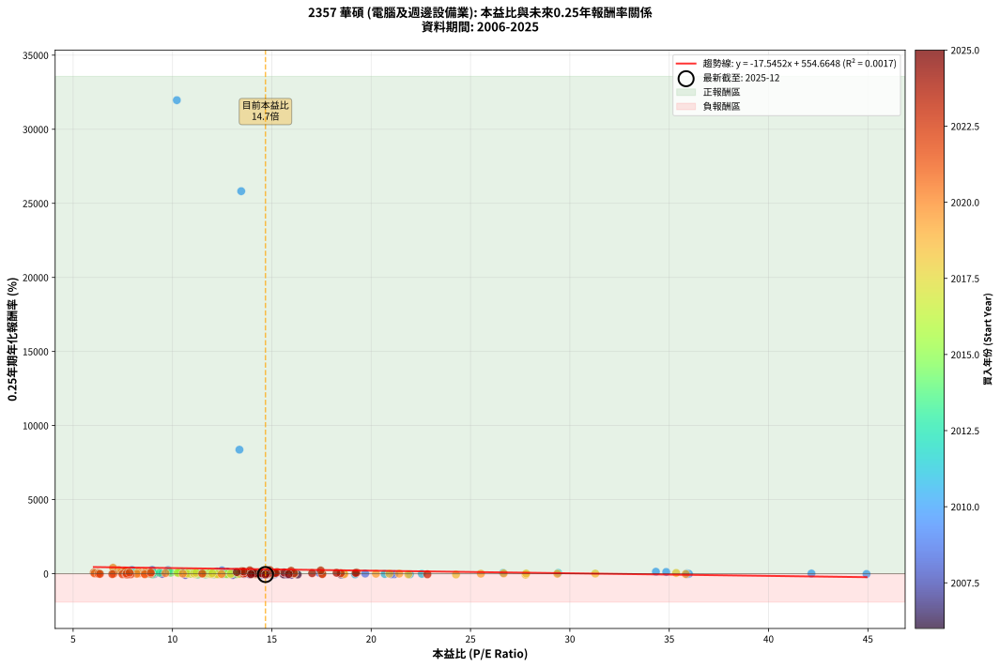
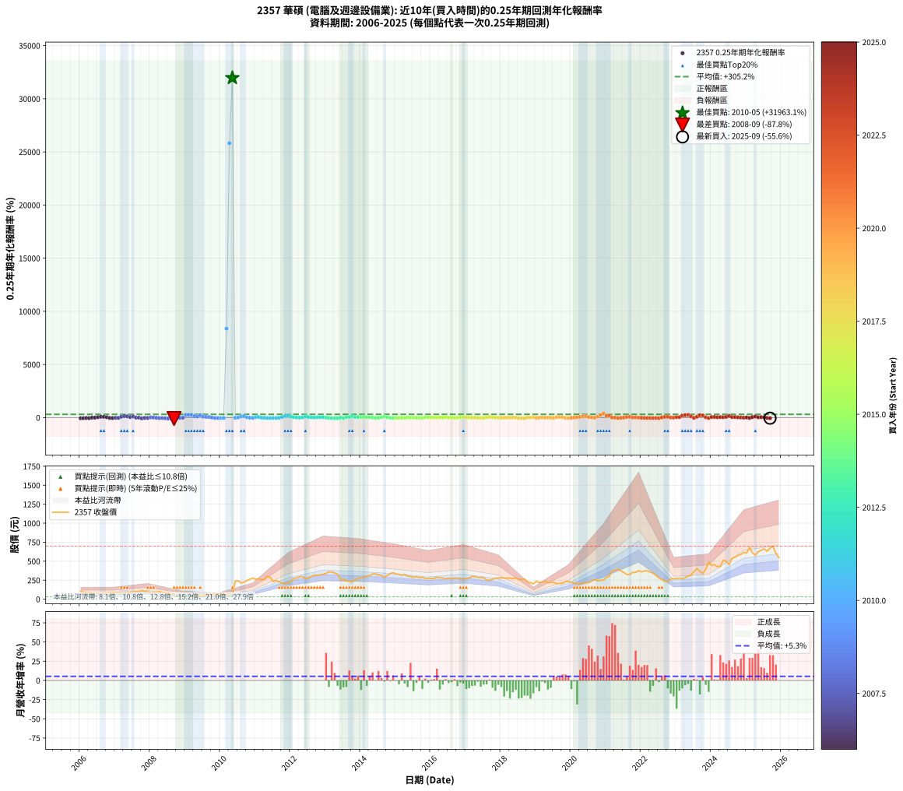

# 2357 華碩 - 本益比與未來報酬率分析

!!! info "報告資訊"
    - **股票代號**: 2357
    - **公司名稱**: 華碩
    - **產業別**: 電腦及週邊設備業
    - **分析期間**: 2006-2025 (237 個數據點)
    - **資料來源**: Type 12 (ShowMonthlyK_ChartFlow) 月收盤價與本益比
    - **報酬率口徑**: 含現金股利 (簡化: 年度合計，假設每年7/1入帳)
    - **報告生成時間**: 2026-01-04 08:47:28 CST

## 📈 視覺化圖表

### 圖表1: 本益比 vs 未來報酬率關係

*圖表1：2357 華碩 本益比與0.25年期未來報酬率關係 (2006-2025)*

### 圖表2: 歷年買入時點的0.25年期實際報酬率

*圖表2：2357 華碩 歷年買入時點的0.25年期實際報酬率 (2006-2025)*

## 📍 買點訊號說明

本報告提供兩種買點提示訊號（顯示於圖表2的股價子圖中）：

### ▲ 小綠色三角形（回測驗證）
- **計算方式**: 使用全部歷史資料計算本益比第25百分位數
- **用途**: 事後驗證，顯示歷史上哪些時點確實為低估區
- **限制**: 當下無法判斷，僅供回測參考
- **特性**: 後見之明（Look-Ahead Bias）

### ▲ 小橘色三角形（即時訊號）
- **計算方式**: 使用截至當月的過去5年資料計算本益比第25百分位數
- **用途**: 實際投資決策，當時即可判斷
- **優勢**: 可操作性強，符合實務需求
- **特性**: 無後見之明，滾動窗口計算

!!! tip "如何使用兩種訊號"
    - **綠色▲** 幫助理解歷史估值機會，驗證策略有效性
    - **橘色▲** 可作為實際買進參考，但仍需搭配基本面分析
    - 兩種訊號重疊時，表示即時判斷與事後驗證一致，信心度較高
    - 僅有綠色▲時，表示當時無法判斷（需要未來資料才能確認）
    - 僅有橘色▲時，表示即時判斷為買點，但事後可能不是最佳時機

## 📊 估值分析摘要

| 指標 | 數值 |
|:---:|:---:|
| **目前本益比** (2025-09) | **14.68 倍** |
| **歷史平均本益比** | 14.22 倍 |
| **估值水準** | 🟡 合理範圍 |
| **預期0.25年年化報酬率** | **+297.10%** |
| **歷史平均報酬率** | +305.23% |
| **相關係數 (R²)** | 0.0017 |
| **趨勢線斜率** | -17.5452 |

!!! abstract "核心洞察"
    目前本益比接近歷史平均，預期報酬率符合長期趨勢

    根據歷史數據回測，2357 華碩 在目前本益比 **14.7倍** 的估值水準下，
    預期未來0.25年年化報酬率約為 **+297.1%**。

    **重要提醒**: 本分析基於歷史數據統計，實際報酬率會受到公司基本面變化、產業趨勢、
    總體經濟環境等多重因素影響。R² = 0.00 表示本益比可解釋約 0.2% 的報酬率變異。

## 📈 歷史估值統計

### 最佳買點 (最高報酬率)

| 項目 | 數值 |
|:---:|:---:|
| 起始時間 | 2010-05 |
| 當時本益比 | 10.22 倍 |
| 起始價格 | 50.4 元 |
| 0.25年後價格 | 213.5 元 |
| **0.25年年化報酬率** | **+31963.06%** |

### 最差買點 (最低報酬率)

| 項目 | 數值 |
|:---:|:---:|
| 起始時間 | 2008-09 |
| 當時本益比 | 13.03 倍 |
| 起始價格 | 62.1 元 |
| 0.25年後價格 | 36.8 元 |
| **0.25年年化報酬率** | **-87.76%** |

## 🎯 投資啟示

### 本益比與報酬率關係

趨勢線方程式: **y = -17.5452x + 554.6648**

!!! warning "強負相關"
    本益比與未來報酬率呈現強負相關。在高本益比時期買入，未來報酬率顯著較低；
    在低本益比時期買入，未來報酬率顯著較高。**估值紀律至關重要**。

### 估值區間建議

基於歷史數據分析:

- **🟢 低估區** (P/E < 11.4): 預期報酬率較高，可考慮增加持股
- **🟡 合理區** (P/E 11.4-17.1): 預期報酬率符合長期趨勢，正常持有
- **🔴 高估區** (P/E > 17.1): 預期報酬率較低，可考慮減碼或觀望

!!! danger "風險提示"
    - 過去表現不代表未來結果
    - 本分析假設公司基本面無重大結構性變化
    - 產業環境劇變可能使歷史規律失效
    - 應結合公司財報、產業趨勢、總體經濟等多重因素綜合判斷

!!! success "長期投資觀點"
    歷史數據顯示，在合理或低估的估值水準買入並長期持有，
    往往能獲得較佳的投資報酬。**耐心等待好價格**是價值投資的核心原則。

## 📊 數據品質

- **資料來源**: GoodInfo.tw Type 12 (ShowMonthlyK_ChartFlow)
- **資料頻率**: 月度收盤價與本益比
- **回測期間**: 2006-2025
- **數據點數量**: 237 個 (每個點代表一次0.25年期回測)

### 計算方法說明

1. **0.25年期年化報酬率**:
   - 對每個歷史時點，計算其後0.25年的實際投資報酬率
   - 期末價值(不含股利): 期末價格
   - 期末價值(含現金股利): 期末價格 + 持有期間內的現金股利合計 (簡化: 年度合計，假設每年7/1入帳)
   - 公式: 年化報酬率 = [(期末價值/期初價格)^(1/年數) - 1] × 100%

2. **本益比 (P/E Ratio)**:
   - 使用當時的月收盤價與EPS計算
   - 資料來源: Type 12 月度河流圖本益比數據

3. **趨勢線 (Linear Regression)**:
   - 使用最小平方法擬合線性趨勢線
   - R²值衡量本益比對報酬率的解釋能力

---

*本報告由 Stock Analysis System v1.9.0 自動生成*
*數據更新時間: 2026-01-04 08:47:28 CST*

## 📋 月度回測明細表

（每一列對應時間線圖中的一個買入點；可用來對照 SVG 圖上的每個點。）

| 買入月份 | 賣出月份 | 回測期限_年 | 實際持有年數 | 買入本益比_倍 | 買入收盤價_元 | 賣出收盤價_元 | 現金股利合計_元 | 總報酬率_pct | 年化報酬率_pct |
| --- | --- | --- | --- | --- | --- | --- | --- | --- | --- |
| 2006-01 | 2006-05 | 0.25 | 0.329 | 18.50 | 104.50 | 75.70 | 0.00 | -27.56 | -62.52 |
| 2006-02 | 2006-05 | 0.25 | 0.246 | 16.30 | 92.10 | 75.70 | 0.00 | -17.81 | -54.88 |
| 2006-03 | 2006-07 | 0.25 | 0.334 | 15.58 | 88.00 | 73.60 | 1.00 | -15.23 | -39.02 |
| 2006-04 | 2006-07 | 0.25 | 0.249 | 15.63 | 88.30 | 73.60 | 1.00 | -15.52 | -49.17 |
| 2006-05 | 2006-08 | 0.25 | 0.252 | 13.40 | 75.70 | 73.80 | 1.00 | -1.19 | -4.64 |
| 2006-06 | 2006-09 | 0.25 | 0.252 | 14.07 | 79.50 | 77.70 | 1.00 | -1.01 | -3.94 |
| 2006-07 | 2006-10 | 0.25 | 0.252 | 13.03 | 73.60 | 80.80 | 0.00 | +9.78 | +44.85 |
| 2006-08 | 2006-12 | 0.25 | 0.334 | 13.06 | 73.80 | 89.20 | 0.00 | +20.87 | +76.37 |
| 2006-09 | 2006-12 | 0.25 | 0.249 | 13.75 | 77.70 | 89.20 | 0.00 | +14.80 | +74.02 |
| 2006-10 | 2007-01 | 0.25 | 0.252 | 14.30 | 80.80 | 87.00 | 0.00 | +7.67 | +34.11 |
| 2006-11 | 2007-03 | 0.25 | 0.329 | 15.73 | 88.90 | 78.00 | 0.00 | -12.26 | -32.84 |
| 2006-12 | 2007-03 | 0.25 | 0.246 | 15.79 | 89.20 | 78.00 | 0.00 | -12.56 | -41.99 |
| 2007-01 | 2007-05 | 0.25 | 0.329 | 15.00 | 87.00 | 81.50 | 0.00 | -6.32 | -18.03 |
| 2007-02 | 2007-05 | 0.25 | 0.246 | 14.80 | 88.00 | 81.50 | 0.00 | -7.39 | -26.76 |
| 2007-03 | 2007-07 | 0.25 | 0.334 | 12.80 | 78.00 | 93.70 | 1.49 | +22.04 | +81.55 |
| 2007-04 | 2007-07 | 0.25 | 0.249 | 12.24 | 76.40 | 93.70 | 1.49 | +24.60 | +141.74 |
| 2007-05 | 2007-08 | 0.25 | 0.252 | 12.75 | 81.50 | 98.50 | 1.49 | +22.69 | +125.20 |
| 2007-06 | 2007-09 | 0.25 | 0.252 | 13.83 | 90.40 | 98.80 | 1.49 | +10.94 | +51.02 |
| 2007-07 | 2007-10 | 0.25 | 0.252 | 14.01 | 93.70 | 114.00 | 0.00 | +21.66 | +117.83 |
| 2007-08 | 2007-12 | 0.25 | 0.334 | 14.41 | 98.50 | 97.40 | 0.00 | -1.12 | -3.31 |
| 2007-09 | 2007-12 | 0.25 | 0.249 | 14.15 | 98.80 | 97.40 | 0.00 | -1.42 | -5.57 |
| 2007-10 | 2008-01 | 0.25 | 0.252 | 15.99 | 114.00 | 82.60 | 0.00 | -27.54 | -72.17 |
| 2007-11 | 2008-03 | 0.25 | 0.331 | 13.87 | 101.00 | 89.00 | 0.00 | -11.88 | -31.74 |
| 2007-12 | 2008-03 | 0.25 | 0.249 | 13.11 | 97.40 | 89.00 | 0.00 | -8.62 | -30.37 |
| 2008-01 | 2008-05 | 0.25 | 0.331 | 11.58 | 82.60 | 87.70 | 0.00 | +6.17 | +19.82 |
| 2008-02 | 2008-05 | 0.25 | 0.249 | 12.70 | 86.80 | 87.70 | 0.00 | +1.04 | +4.23 |
| 2008-03 | 2008-07 | 0.25 | 0.334 | 13.61 | 89.00 | 80.40 | 2.49 | -6.86 | -19.17 |
| 2008-04 | 2008-07 | 0.25 | 0.249 | 15.82 | 98.80 | 80.40 | 2.49 | -16.10 | -50.57 |
| 2008-05 | 2008-08 | 0.25 | 0.252 | 14.74 | 87.70 | 73.10 | 2.49 | -13.81 | -44.56 |
| 2008-06 | 2008-09 | 0.25 | 0.252 | 14.61 | 82.60 | 62.10 | 2.49 | -21.80 | -62.33 |
| 2008-07 | 2008-10 | 0.25 | 0.252 | 15.01 | 80.40 | 47.60 | 0.00 | -40.80 | -87.52 |
| 2008-08 | 2008-12 | 0.25 | 0.334 | 14.44 | 73.10 | 36.80 | 0.00 | -49.66 | -87.19 |
| 2008-09 | 2008-12 | 0.25 | 0.249 | 13.03 | 62.10 | 36.80 | 0.00 | -40.74 | -87.76 |
| 2008-10 | 2009-01 | 0.25 | 0.252 | 10.65 | 47.60 | 30.25 | 0.00 | -36.45 | -83.47 |
| 2008-11 | 2009-03 | 0.25 | 0.329 | 9.09 | 37.95 | 35.65 | 0.00 | -6.06 | -17.33 |
| 2008-12 | 2009-03 | 0.25 | 0.246 | 9.48 | 36.80 | 35.65 | 0.00 | -3.12 | -12.09 |
| 2009-01 | 2009-05 | 0.25 | 0.329 | 7.96 | 30.25 | 45.80 | 0.00 | +51.40 | +253.43 |
| 2009-02 | 2009-05 | 0.25 | 0.246 | 8.98 | 33.45 | 45.80 | 0.00 | +36.92 | +257.96 |
| 2009-03 | 2009-07 | 0.25 | 0.334 | 9.78 | 35.65 | 52.00 | 2.00 | +51.47 | +246.65 |
| 2009-04 | 2009-07 | 0.25 | 0.249 | 12.29 | 43.85 | 52.00 | 2.00 | +23.15 | +130.64 |
| 2009-05 | 2009-08 | 0.25 | 0.252 | 13.13 | 45.80 | 52.40 | 2.00 | +18.78 | +98.02 |
| 2009-06 | 2009-09 | 0.25 | 0.252 | 12.49 | 42.60 | 55.20 | 2.00 | +34.27 | +222.20 |
| 2009-07 | 2009-10 | 0.25 | 0.252 | 15.61 | 52.00 | 61.00 | 0.00 | +17.31 | +88.47 |
| 2009-08 | 2009-12 | 0.25 | 0.334 | 16.11 | 52.40 | 61.80 | 0.00 | +17.94 | +63.88 |
| 2009-09 | 2009-12 | 0.25 | 0.249 | 17.39 | 55.20 | 61.80 | 0.00 | +11.96 | +57.35 |
| 2009-10 | 2010-01 | 0.25 | 0.252 | 19.70 | 61.00 | 62.00 | 0.00 | +1.64 | +6.67 |
| 2009-11 | 2010-03 | 0.25 | 0.329 | 21.17 | 63.90 | 55.30 | 0.00 | -13.46 | -35.59 |
| 2009-12 | 2010-03 | 0.25 | 0.246 | 21.02 | 61.80 | 55.30 | 0.00 | -10.52 | -36.30 |
| 2010-01 | 2010-05 | 0.25 | 0.329 | 18.57 | 62.00 | 50.40 | 0.00 | -18.71 | -46.77 |
| 2010-02 | 2010-05 | 0.25 | 0.246 | 15.15 | 56.60 | 50.40 | 0.00 | -10.95 | -37.55 |
| 2010-03 | 2010-07 | 0.25 | 0.334 | 13.37 | 55.30 | 241.50 | 2.10 | +340.51 | +8370.28 |
| 2010-04 | 2010-07 | 0.25 | 0.249 | 13.46 | 61.00 | 241.50 | 2.10 | +299.34 | +25820.90 |
| 2010-05 | 2010-08 | 0.25 | 0.252 | 10.22 | 50.40 | 213.50 | 2.10 | +327.78 | +31963.06 |
| 2010-06 | 2010-09 | 0.25 | 0.252 | 44.93 | 239.50 | 224.00 | 2.10 | -5.59 | -20.43 |
| 2010-07 | 2010-10 | 0.25 | 0.252 | 42.16 | 241.50 | 248.50 | 0.00 | +2.90 | +12.01 |
| 2010-08 | 2010-12 | 0.25 | 0.334 | 34.85 | 213.50 | 277.00 | 0.00 | +29.74 | +118.05 |
| 2010-09 | 2010-12 | 0.25 | 0.249 | 34.33 | 224.00 | 277.00 | 0.00 | +23.66 | +134.53 |
| 2010-10 | 2011-01 | 0.25 | 0.252 | 35.89 | 248.50 | 262.00 | 0.00 | +5.43 | +23.37 |
| 2010-11 | 2011-03 | 0.25 | 0.329 | 35.99 | 263.50 | 254.50 | 0.00 | -3.42 | -10.04 |
| 2010-12 | 2011-03 | 0.25 | 0.246 | 35.88 | 277.00 | 254.50 | 0.00 | -8.12 | -29.09 |
| 2011-01 | 2011-05 | 0.25 | 0.329 | 29.41 | 262.00 | 300.00 | 0.00 | +14.50 | +51.02 |
| 2011-02 | 2011-05 | 0.25 | 0.246 | 26.64 | 269.00 | 300.00 | 0.00 | +11.52 | +55.68 |
| 2011-03 | 2011-07 | 0.25 | 0.334 | 22.55 | 254.50 | 232.00 | 14.00 | -3.34 | -9.67 |
| 2011-04 | 2011-07 | 0.25 | 0.249 | 20.68 | 258.00 | 232.00 | 14.00 | -4.65 | -17.40 |
| 2011-05 | 2011-08 | 0.25 | 0.252 | 21.95 | 300.00 | 245.00 | 14.00 | -13.67 | -44.20 |
| 2011-06 | 2011-09 | 0.25 | 0.252 | 19.19 | 285.00 | 231.00 | 14.00 | -14.04 | -45.14 |
| 2011-07 | 2011-10 | 0.25 | 0.252 | 14.46 | 232.00 | 210.50 | 0.00 | -9.27 | -32.03 |
| 2011-08 | 2011-12 | 0.25 | 0.334 | 14.22 | 245.00 | 215.50 | 0.00 | -12.04 | -31.89 |
| 2011-09 | 2011-12 | 0.25 | 0.249 | 12.54 | 231.00 | 215.50 | 0.00 | -6.71 | -24.33 |
| 2011-10 | 2012-01 | 0.25 | 0.252 | 10.73 | 210.50 | 234.00 | 0.00 | +11.16 | +52.22 |
| 2011-11 | 2012-03 | 0.25 | 0.331 | 9.83 | 204.50 | 278.50 | 0.00 | +36.19 | +154.03 |
| 2011-12 | 2012-03 | 0.25 | 0.249 | 9.80 | 215.50 | 278.50 | 0.00 | +29.23 | +179.92 |
| 2012-01 | 2012-05 | 0.25 | 0.331 | 10.33 | 234.00 | 299.00 | 0.00 | +27.78 | +109.58 |
| 2012-02 | 2012-05 | 0.25 | 0.249 | 11.85 | 276.00 | 299.00 | 0.00 | +8.33 | +37.89 |
| 2012-03 | 2012-07 | 0.25 | 0.334 | 11.63 | 278.50 | 278.50 | 14.50 | +5.21 | +16.41 |
| 2012-04 | 2012-07 | 0.25 | 0.249 | 11.99 | 295.00 | 278.50 | 14.50 | -0.68 | -2.69 |
| 2012-05 | 2012-08 | 0.25 | 0.252 | 11.84 | 299.00 | 299.00 | 14.50 | +4.85 | +20.68 |
| 2012-06 | 2012-09 | 0.25 | 0.252 | 10.48 | 271.50 | 318.50 | 14.50 | +22.65 | +124.93 |
| 2012-07 | 2012-10 | 0.25 | 0.252 | 10.48 | 278.50 | 313.00 | 0.00 | +12.39 | +58.99 |
| 2012-08 | 2012-12 | 0.25 | 0.334 | 10.98 | 299.00 | 326.50 | 0.00 | +9.20 | +30.14 |
| 2012-09 | 2012-12 | 0.25 | 0.249 | 11.42 | 318.50 | 326.50 | 0.00 | +2.51 | +10.47 |
| 2012-10 | 2013-01 | 0.25 | 0.252 | 10.97 | 313.00 | 338.00 | 0.00 | +7.99 | +35.67 |
| 2012-11 | 2013-03 | 0.25 | 0.329 | 10.98 | 320.50 | 357.50 | 0.00 | +11.54 | +39.45 |
| 2012-12 | 2013-03 | 0.25 | 0.246 | 10.94 | 326.50 | 357.50 | 0.00 | +9.49 | +44.50 |
| 2013-01 | 2013-05 | 0.25 | 0.329 | 11.36 | 338.00 | 330.50 | 0.00 | -2.22 | -6.60 |
| 2013-02 | 2013-05 | 0.25 | 0.246 | 12.14 | 360.00 | 330.50 | 0.00 | -8.19 | -29.32 |
| 2013-03 | 2013-07 | 0.25 | 0.334 | 12.10 | 357.50 | 262.00 | 19.17 | -21.35 | -51.28 |
| 2013-04 | 2013-07 | 0.25 | 0.249 | 11.67 | 343.50 | 262.00 | 19.17 | -18.15 | -55.23 |
| 2013-05 | 2013-08 | 0.25 | 0.252 | 11.26 | 330.50 | 238.50 | 19.17 | -22.04 | -62.78 |
| 2013-06 | 2013-09 | 0.25 | 0.252 | 8.82 | 258.00 | 235.50 | 19.17 | -1.29 | -5.03 |
| 2013-07 | 2013-10 | 0.25 | 0.252 | 8.99 | 262.00 | 225.00 | 0.00 | -14.12 | -45.36 |
| 2013-08 | 2013-12 | 0.25 | 0.334 | 8.21 | 238.50 | 268.00 | 0.00 | +12.37 | +41.78 |
| 2013-09 | 2013-12 | 0.25 | 0.249 | 8.13 | 235.50 | 268.00 | 0.00 | +13.80 | +68.01 |
| 2013-10 | 2014-01 | 0.25 | 0.252 | 7.80 | 225.00 | 282.00 | 0.00 | +25.33 | +145.10 |
| 2013-11 | 2014-03 | 0.25 | 0.329 | 9.06 | 260.50 | 301.50 | 0.00 | +15.74 | +56.03 |
| 2013-12 | 2014-03 | 0.25 | 0.246 | 9.35 | 268.00 | 301.50 | 0.00 | +12.50 | +61.29 |
| 2014-01 | 2014-05 | 0.25 | 0.329 | 9.91 | 282.00 | 331.00 | 0.00 | +17.38 | +62.85 |
| 2014-02 | 2014-05 | 0.25 | 0.246 | 10.32 | 291.50 | 331.00 | 0.00 | +13.55 | +67.49 |
| 2014-03 | 2014-07 | 0.25 | 0.334 | 10.75 | 301.50 | 320.00 | 19.50 | +12.60 | +42.67 |
| 2014-04 | 2014-07 | 0.25 | 0.249 | 11.21 | 312.00 | 320.00 | 19.50 | +8.81 | +40.36 |
| 2014-05 | 2014-08 | 0.25 | 0.252 | 11.98 | 331.00 | 313.00 | 19.50 | +0.45 | +1.81 |
| 2014-06 | 2014-09 | 0.25 | 0.252 | 12.14 | 333.00 | 290.00 | 19.50 | -7.06 | -25.21 |
| 2014-07 | 2014-10 | 0.25 | 0.252 | 11.75 | 320.00 | 310.00 | 0.00 | -3.12 | -11.84 |
| 2014-08 | 2014-12 | 0.25 | 0.334 | 11.58 | 313.00 | 346.50 | 0.00 | +10.70 | +35.58 |
| 2014-09 | 2014-12 | 0.25 | 0.249 | 10.81 | 290.00 | 346.50 | 0.00 | +19.48 | +104.31 |
| 2014-10 | 2015-01 | 0.25 | 0.252 | 11.65 | 310.00 | 332.50 | 0.00 | +7.26 | +32.07 |
| 2014-11 | 2015-03 | 0.25 | 0.329 | 12.76 | 337.00 | 315.00 | 0.00 | -6.53 | -18.57 |
| 2014-12 | 2015-03 | 0.25 | 0.246 | 13.22 | 346.50 | 315.00 | 0.00 | -9.09 | -32.08 |
| 2015-01 | 2015-05 | 0.25 | 0.329 | 12.82 | 332.50 | 302.00 | 0.00 | -9.17 | -25.39 |
| 2015-02 | 2015-05 | 0.25 | 0.246 | 12.71 | 326.50 | 302.00 | 0.00 | -7.50 | -27.14 |
| 2015-03 | 2015-07 | 0.25 | 0.334 | 12.40 | 315.00 | 285.00 | 17.00 | -4.13 | -11.85 |
| 2015-04 | 2015-07 | 0.25 | 0.249 | 12.94 | 325.50 | 285.00 | 17.00 | -7.22 | -25.98 |
| 2015-05 | 2015-08 | 0.25 | 0.252 | 12.14 | 302.00 | 296.00 | 17.00 | +3.64 | +15.26 |
| 2015-06 | 2015-09 | 0.25 | 0.252 | 12.21 | 300.50 | 282.50 | 17.00 | -0.33 | -1.31 |
| 2015-07 | 2015-10 | 0.25 | 0.252 | 11.70 | 285.00 | 291.00 | 0.00 | +2.11 | +8.62 |
| 2015-08 | 2015-12 | 0.25 | 0.334 | 12.29 | 296.00 | 272.00 | 0.00 | -8.11 | -22.37 |
| 2015-09 | 2015-12 | 0.25 | 0.249 | 11.86 | 282.50 | 272.00 | 0.00 | -3.72 | -14.10 |
| 2015-10 | 2016-01 | 0.25 | 0.252 | 12.36 | 291.00 | 271.50 | 0.00 | -6.70 | -24.07 |
| 2015-11 | 2016-03 | 0.25 | 0.331 | 11.60 | 270.00 | 289.00 | 0.00 | +7.04 | +22.79 |
| 2015-12 | 2016-03 | 0.25 | 0.249 | 11.82 | 272.00 | 289.00 | 0.00 | +6.25 | +27.55 |
| 2016-01 | 2016-05 | 0.25 | 0.331 | 11.67 | 271.50 | 280.00 | 0.00 | +3.13 | +9.75 |
| 2016-02 | 2016-05 | 0.25 | 0.249 | 11.64 | 273.50 | 280.00 | 0.00 | +2.38 | +9.89 |
| 2016-03 | 2016-07 | 0.25 | 0.334 | 12.18 | 289.00 | 277.50 | 15.00 | +1.21 | +3.67 |
| 2016-04 | 2016-07 | 0.25 | 0.249 | 11.83 | 283.50 | 277.50 | 15.00 | +3.17 | +13.36 |
| 2016-05 | 2016-08 | 0.25 | 0.252 | 11.57 | 280.00 | 268.50 | 15.00 | +1.25 | +5.06 |
| 2016-06 | 2016-09 | 0.25 | 0.252 | 10.87 | 265.50 | 279.50 | 15.00 | +10.92 | +50.92 |
| 2016-07 | 2016-10 | 0.25 | 0.252 | 11.25 | 277.50 | 276.50 | 0.00 | -0.36 | -1.42 |
| 2016-08 | 2016-12 | 0.25 | 0.334 | 10.78 | 268.50 | 265.00 | 0.00 | -1.30 | -3.85 |
| 2016-09 | 2016-12 | 0.25 | 0.249 | 11.12 | 279.50 | 265.00 | 0.00 | -5.19 | -19.25 |
| 2016-10 | 2017-01 | 0.25 | 0.252 | 10.90 | 276.50 | 273.00 | 0.00 | -1.27 | -4.93 |
| 2016-11 | 2017-03 | 0.25 | 0.329 | 10.31 | 264.00 | 300.00 | 0.00 | +13.64 | +47.56 |
| 2016-12 | 2017-03 | 0.25 | 0.246 | 10.25 | 265.00 | 300.00 | 0.00 | +13.21 | +65.44 |
| 2017-01 | 2017-05 | 0.25 | 0.329 | 10.73 | 273.00 | 285.00 | 0.00 | +4.40 | +13.99 |
| 2017-02 | 2017-05 | 0.25 | 0.246 | 11.09 | 277.50 | 285.00 | 0.00 | +2.70 | +11.43 |
| 2017-03 | 2017-07 | 0.25 | 0.334 | 12.19 | 300.00 | 281.00 | 17.00 | -0.67 | -1.98 |
| 2017-04 | 2017-07 | 0.25 | 0.249 | 12.25 | 296.50 | 281.00 | 17.00 | +0.51 | +2.05 |
| 2017-05 | 2017-08 | 0.25 | 0.252 | 11.97 | 285.00 | 250.00 | 17.00 | -6.32 | -22.82 |
| 2017-06 | 2017-09 | 0.25 | 0.252 | 12.29 | 287.50 | 248.00 | 17.00 | -7.83 | -27.64 |
| 2017-07 | 2017-10 | 0.25 | 0.252 | 12.23 | 281.00 | 261.00 | 0.00 | -7.12 | -25.41 |
| 2017-08 | 2017-12 | 0.25 | 0.334 | 11.08 | 250.00 | 279.50 | 0.00 | +11.80 | +39.65 |
| 2017-09 | 2017-12 | 0.25 | 0.249 | 11.19 | 248.00 | 279.50 | 0.00 | +12.70 | +61.60 |
| 2017-10 | 2018-01 | 0.25 | 0.252 | 12.00 | 261.00 | 281.00 | 0.00 | +7.66 | +34.06 |
| 2017-11 | 2018-03 | 0.25 | 0.329 | 12.93 | 276.00 | 276.00 | 0.00 | +0.00 | +0.00 |
| 2017-12 | 2018-03 | 0.25 | 0.246 | 13.35 | 279.50 | 276.00 | 0.00 | -1.25 | -4.99 |
| 2018-01 | 2018-05 | 0.25 | 0.329 | 14.29 | 281.00 | 271.50 | 0.00 | -3.38 | -9.94 |
| 2018-02 | 2018-05 | 0.25 | 0.246 | 15.06 | 277.00 | 271.50 | 0.00 | -1.99 | -7.82 |
| 2018-03 | 2018-07 | 0.25 | 0.334 | 16.12 | 276.00 | 263.50 | 15.00 | +0.91 | +2.74 |
| 2018-04 | 2018-07 | 0.25 | 0.249 | 17.54 | 278.00 | 263.50 | 15.00 | +0.18 | +0.72 |
| 2018-05 | 2018-08 | 0.25 | 0.252 | 18.62 | 271.50 | 261.50 | 15.00 | +1.84 | +7.51 |
| 2018-06 | 2018-09 | 0.25 | 0.252 | 20.92 | 278.50 | 264.00 | 15.00 | +0.18 | +0.71 |
| 2018-07 | 2018-10 | 0.25 | 0.252 | 21.87 | 263.50 | 229.00 | 0.00 | -13.09 | -42.71 |
| 2018-08 | 2018-12 | 0.25 | 0.334 | 24.27 | 261.50 | 201.50 | 0.00 | -22.94 | -54.17 |
| 2018-09 | 2018-12 | 0.25 | 0.249 | 27.77 | 264.00 | 201.50 | 0.00 | -23.67 | -66.19 |
| 2018-10 | 2019-01 | 0.25 | 0.252 | 27.80 | 229.00 | 236.00 | 0.00 | +3.06 | +12.70 |
| 2018-11 | 2019-03 | 0.25 | 0.329 | 31.28 | 218.00 | 223.00 | 0.00 | +2.29 | +7.15 |
| 2018-12 | 2019-03 | 0.25 | 0.246 | 35.35 | 201.50 | 223.00 | 0.00 | +10.67 | +50.90 |
| 2019-01 | 2019-05 | 0.25 | 0.329 | 35.83 | 236.00 | 217.00 | 0.00 | -8.05 | -22.55 |
| 2019-02 | 2019-05 | 0.25 | 0.246 | 29.37 | 219.50 | 217.00 | 0.00 | -1.14 | -4.54 |
| 2019-03 | 2019-07 | 0.25 | 0.334 | 26.67 | 223.00 | 222.00 | 15.00 | +6.28 | +20.00 |
| 2019-04 | 2019-07 | 0.25 | 0.249 | 25.52 | 236.00 | 222.00 | 15.00 | +0.42 | +1.71 |
| 2019-05 | 2019-08 | 0.25 | 0.252 | 21.41 | 217.00 | 204.00 | 15.00 | +0.92 | +3.71 |
| 2019-06 | 2019-09 | 0.25 | 0.252 | 20.24 | 223.00 | 206.50 | 15.00 | -0.67 | -2.64 |
| 2019-07 | 2019-10 | 0.25 | 0.252 | 18.65 | 222.00 | 206.50 | 0.00 | -6.98 | -24.97 |
| 2019-08 | 2019-12 | 0.25 | 0.334 | 15.95 | 204.00 | 231.50 | 0.00 | +13.48 | +46.02 |
| 2019-09 | 2019-12 | 0.25 | 0.249 | 15.10 | 206.50 | 231.50 | 0.00 | +12.11 | +58.20 |
| 2019-10 | 2020-01 | 0.25 | 0.252 | 14.18 | 206.50 | 224.00 | 0.00 | +8.47 | +38.12 |
| 2019-11 | 2020-03 | 0.25 | 0.331 | 14.92 | 230.50 | 204.50 | 0.00 | -11.28 | -30.32 |
| 2019-12 | 2020-03 | 0.25 | 0.249 | 14.17 | 231.50 | 204.50 | 0.00 | -11.66 | -39.21 |
| 2020-01 | 2020-05 | 0.25 | 0.331 | 12.47 | 224.00 | 210.50 | 0.00 | -6.03 | -17.11 |
| 2020-02 | 2020-05 | 0.25 | 0.249 | 10.52 | 206.00 | 210.50 | 0.00 | +2.18 | +9.06 |
| 2020-03 | 2020-07 | 0.25 | 0.334 | 9.65 | 204.50 | 216.50 | 14.00 | +12.71 | +43.09 |
| 2020-04 | 2020-07 | 0.25 | 0.249 | 8.88 | 202.50 | 216.50 | 14.00 | +13.83 | +68.17 |
| 2020-05 | 2020-08 | 0.25 | 0.252 | 8.62 | 210.50 | 243.00 | 14.00 | +22.09 | +120.87 |
| 2020-06 | 2020-09 | 0.25 | 0.252 | 8.29 | 216.00 | 253.50 | 14.00 | +23.84 | +133.72 |
| 2020-07 | 2020-10 | 0.25 | 0.252 | 7.82 | 216.50 | 242.50 | 0.00 | +12.01 | +56.87 |
| 2020-08 | 2020-12 | 0.25 | 0.334 | 8.30 | 243.00 | 250.50 | 0.00 | +3.09 | +9.53 |
| 2020-09 | 2020-12 | 0.25 | 0.249 | 8.20 | 253.50 | 250.50 | 0.00 | -1.18 | -4.67 |
| 2020-10 | 2021-01 | 0.25 | 0.252 | 7.46 | 242.50 | 286.50 | 0.00 | +18.14 | +93.86 |
| 2020-11 | 2021-03 | 0.25 | 0.329 | 7.29 | 249.00 | 372.50 | 0.00 | +49.60 | +240.75 |
| 2020-12 | 2021-03 | 0.25 | 0.246 | 7.01 | 250.50 | 372.50 | 0.00 | +48.70 | +400.41 |
| 2021-01 | 2021-05 | 0.25 | 0.329 | 7.58 | 286.50 | 395.00 | 0.00 | +37.87 | +165.78 |
| 2021-02 | 2021-05 | 0.25 | 0.246 | 7.64 | 304.00 | 395.00 | 0.00 | +29.93 | +189.42 |
| 2021-03 | 2021-07 | 0.25 | 0.334 | 8.91 | 372.50 | 351.00 | 26.00 | +1.21 | +3.66 |
| 2021-04 | 2021-07 | 0.25 | 0.249 | 8.58 | 376.00 | 351.00 | 26.00 | +0.27 | +1.07 |
| 2021-05 | 2021-08 | 0.25 | 0.252 | 8.61 | 395.00 | 324.00 | 26.00 | -11.39 | -38.13 |
| 2021-06 | 2021-09 | 0.25 | 0.252 | 7.76 | 371.50 | 325.50 | 26.00 | -5.38 | -19.72 |
| 2021-07 | 2021-10 | 0.25 | 0.252 | 7.04 | 351.00 | 353.00 | 0.00 | +0.57 | +2.28 |
| 2021-08 | 2021-12 | 0.25 | 0.334 | 6.24 | 324.00 | 376.00 | 0.00 | +16.05 | +56.15 |
| 2021-09 | 2021-12 | 0.25 | 0.249 | 6.04 | 325.50 | 376.00 | 0.00 | +15.51 | +78.41 |
| 2021-10 | 2022-01 | 0.25 | 0.252 | 6.31 | 353.00 | 359.50 | 0.00 | +1.84 | +7.51 |
| 2021-11 | 2022-03 | 0.25 | 0.329 | 6.08 | 352.50 | 373.50 | 0.00 | +5.96 | +19.26 |
| 2021-12 | 2022-03 | 0.25 | 0.246 | 6.27 | 376.00 | 373.50 | 0.00 | -0.66 | -2.67 |
| 2022-01 | 2022-05 | 0.25 | 0.329 | 6.35 | 359.50 | 341.50 | 0.00 | -5.01 | -14.47 |
| 2022-02 | 2022-05 | 0.25 | 0.246 | 6.97 | 371.50 | 341.50 | 0.00 | -8.08 | -28.95 |
| 2022-03 | 2022-07 | 0.25 | 0.334 | 7.48 | 373.50 | 281.50 | 42.00 | -13.39 | -34.97 |
| 2022-04 | 2022-07 | 0.25 | 0.249 | 7.66 | 357.00 | 281.50 | 42.00 | -9.38 | -32.67 |
| 2022-05 | 2022-08 | 0.25 | 0.252 | 7.90 | 341.50 | 255.00 | 42.00 | -13.03 | -42.55 |
| 2022-06 | 2022-09 | 0.25 | 0.252 | 7.79 | 310.50 | 234.00 | 42.00 | -11.11 | -37.35 |
| 2022-07 | 2022-10 | 0.25 | 0.252 | 7.71 | 281.50 | 236.00 | 0.00 | -16.16 | -50.34 |
| 2022-08 | 2022-12 | 0.25 | 0.334 | 7.69 | 255.00 | 268.50 | 0.00 | +5.29 | +16.70 |
| 2022-09 | 2022-12 | 0.25 | 0.249 | 7.84 | 234.00 | 268.50 | 0.00 | +14.74 | +73.67 |
| 2022-10 | 2023-01 | 0.25 | 0.252 | 8.91 | 236.00 | 272.00 | 0.00 | +15.25 | +75.71 |
| 2022-11 | 2023-03 | 0.25 | 0.329 | 11.50 | 266.00 | 272.50 | 0.00 | +2.44 | +7.63 |
| 2022-12 | 2023-03 | 0.25 | 0.246 | 13.57 | 268.50 | 272.50 | 0.00 | +1.49 | +6.19 |
| 2023-01 | 2023-05 | 0.25 | 0.329 | 13.66 | 272.00 | 305.00 | 0.00 | +12.13 | +41.70 |
| 2023-02 | 2023-05 | 0.25 | 0.246 | 13.86 | 278.00 | 305.00 | 0.00 | +9.71 | +45.67 |
| 2023-03 | 2023-07 | 0.25 | 0.334 | 13.49 | 272.50 | 364.00 | 15.00 | +39.08 | +168.50 |
| 2023-04 | 2023-07 | 0.25 | 0.249 | 13.89 | 282.50 | 364.00 | 15.00 | +34.16 | +225.26 |
| 2023-05 | 2023-08 | 0.25 | 0.252 | 14.90 | 305.00 | 402.50 | 15.00 | +36.89 | +247.82 |
| 2023-06 | 2023-09 | 0.25 | 0.252 | 15.26 | 314.50 | 367.00 | 15.00 | +21.46 | +116.39 |
| 2023-07 | 2023-10 | 0.25 | 0.252 | 17.54 | 364.00 | 338.00 | 0.00 | -7.14 | -25.49 |
| 2023-08 | 2023-12 | 0.25 | 0.334 | 19.27 | 402.50 | 489.50 | 0.00 | +21.61 | +79.65 |
| 2023-09 | 2023-12 | 0.25 | 0.249 | 17.46 | 367.00 | 489.50 | 0.00 | +33.38 | +217.73 |
| 2023-10 | 2024-01 | 0.25 | 0.252 | 15.97 | 338.00 | 445.50 | 0.00 | +31.80 | +199.32 |
| 2023-11 | 2024-03 | 0.25 | 0.331 | 18.47 | 393.50 | 429.50 | 0.00 | +9.15 | +30.25 |
| 2023-12 | 2024-03 | 0.25 | 0.249 | 22.83 | 489.50 | 429.50 | 0.00 | -12.26 | -40.84 |
| 2024-01 | 2024-05 | 0.25 | 0.331 | 19.22 | 445.50 | 513.00 | 0.00 | +15.15 | +53.09 |
| 2024-02 | 2024-05 | 0.25 | 0.249 | 18.26 | 455.00 | 513.00 | 0.00 | +12.75 | +61.86 |
| 2024-03 | 2024-07 | 0.25 | 0.334 | 16.12 | 429.50 | 456.00 | 17.00 | +10.13 | +33.49 |
| 2024-04 | 2024-07 | 0.25 | 0.249 | 15.15 | 430.00 | 456.00 | 17.00 | +10.00 | +46.60 |
| 2024-05 | 2024-08 | 0.25 | 0.252 | 17.03 | 513.00 | 537.00 | 17.00 | +7.99 | +35.70 |
| 2024-06 | 2024-09 | 0.25 | 0.252 | 15.63 | 498.00 | 553.00 | 17.00 | +14.46 | +70.93 |
| 2024-07 | 2024-10 | 0.25 | 0.252 | 13.58 | 456.00 | 575.00 | 0.00 | +26.10 | +151.07 |
| 2024-08 | 2024-12 | 0.25 | 0.334 | 15.20 | 537.00 | 616.00 | 0.00 | +14.71 | +50.82 |
| 2024-09 | 2024-12 | 0.25 | 0.249 | 14.92 | 553.00 | 616.00 | 0.00 | +11.39 | +54.19 |
| 2024-10 | 2025-01 | 0.25 | 0.252 | 14.82 | 575.00 | 607.00 | 0.00 | +5.57 | +23.99 |
| 2024-11 | 2025-03 | 0.25 | 0.329 | 14.51 | 588.00 | 609.00 | 0.00 | +3.57 | +11.27 |
| 2024-12 | 2025-03 | 0.25 | 0.246 | 14.57 | 616.00 | 609.00 | 0.00 | -1.14 | -4.53 |
| 2025-01 | 2025-05 | 0.25 | 0.329 | 14.23 | 607.00 | 625.00 | 0.00 | +2.97 | +9.30 |
| 2025-02 | 2025-05 | 0.25 | 0.246 | 15.85 | 682.00 | 625.00 | 0.00 | -8.36 | -29.83 |
| 2025-03 | 2025-07 | 0.25 | 0.334 | 14.03 | 609.00 | 662.00 | 34.00 | +14.29 | +49.15 |
| 2025-04 | 2025-07 | 0.25 | 0.249 | 13.24 | 580.00 | 662.00 | 34.00 | +20.00 | +107.88 |
| 2025-05 | 2025-08 | 0.25 | 0.252 | 14.15 | 625.00 | 632.00 | 34.00 | +6.56 | +28.69 |
| 2025-06 | 2025-09 | 0.25 | 0.252 | 14.45 | 644.00 | 671.00 | 34.00 | +9.47 | +43.23 |
| 2025-07 | 2025-10 | 0.25 | 0.252 | 14.73 | 662.00 | 697.00 | 0.00 | +5.29 | +22.70 |
| 2025-08 | 2025-12 | 0.25 | 0.334 | 13.95 | 632.00 | 548.00 | 0.00 | -13.29 | -34.75 |
| 2025-09 | 2025-12 | 0.25 | 0.249 | 14.68 | 671.00 | 548.00 | 0.00 | -18.33 | -55.64 |
