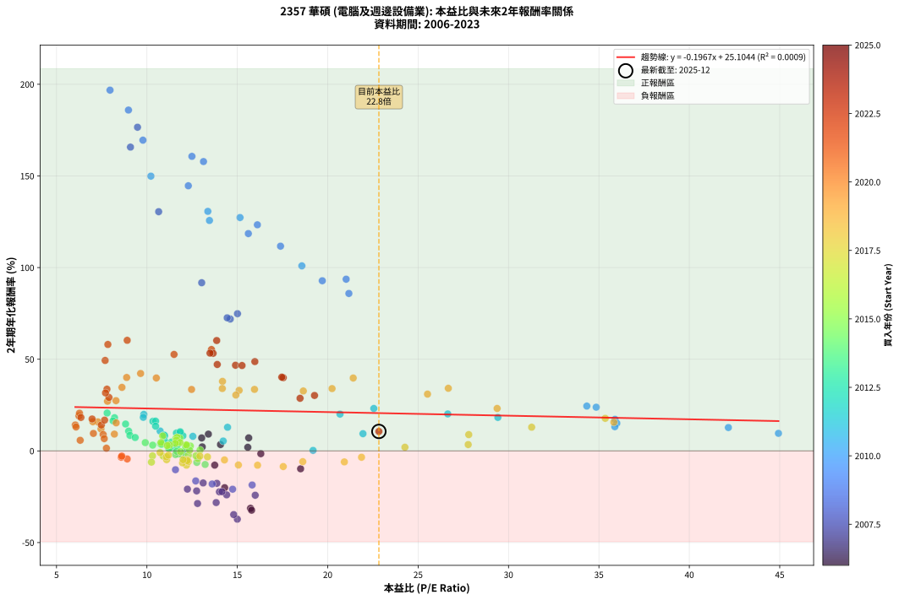
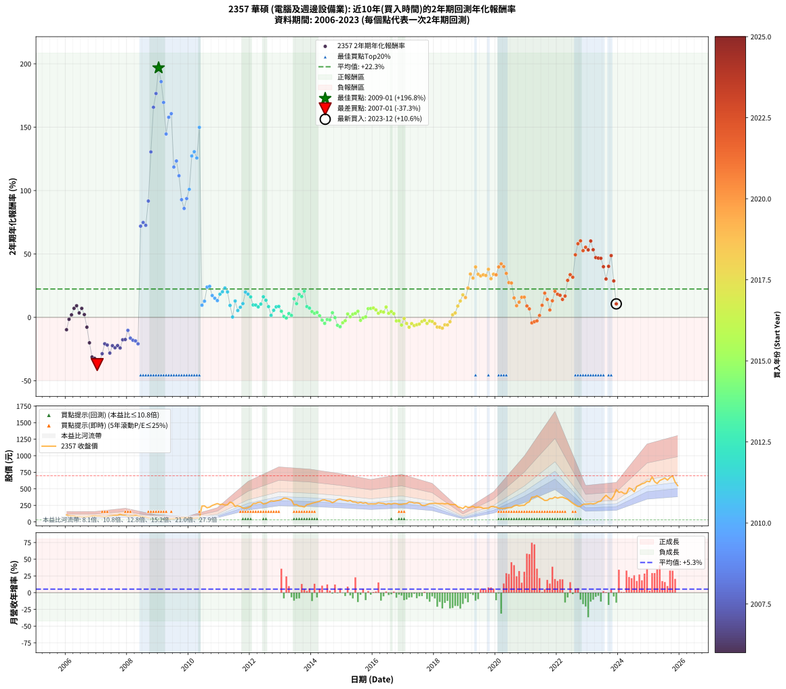

# 2357 華碩 - 本益比與未來報酬率分析

!!! info "報告資訊"
    - **股票代號**: 2357
    - **公司名稱**: 華碩
    - **產業別**: 電腦及週邊設備業
    - **分析期間**: 2006-2023 (216 個數據點)
    - **資料來源**: Type 12 (ShowMonthlyK_ChartFlow) 月收盤價與本益比
    - **報酬率口徑**: 含現金股利 (簡化: 年度合計，假設每年7/1入帳)
    - **報告生成時間**: 2026-01-10 20:37:22 CST

## 📈 視覺化圖表

### 圖表1: 本益比 vs 未來報酬率關係

*圖表1：2357 華碩 本益比與2年期未來報酬率關係 (2006-2023)*

### 圖表2: 歷年買入時點的2年期實際報酬率

*圖表2：2357 華碩 歷年買入時點的2年期實際報酬率 (2006-2023)*

## 📍 買點訊號說明

本報告提供兩種買點提示訊號（顯示於圖表2的股價子圖中）：

### ▲ 小綠色三角形（回測驗證）
- **計算方式**: 使用全部歷史資料計算本益比第25百分位數
- **用途**: 事後驗證，顯示歷史上哪些時點確實為低估區
- **限制**: 當下無法判斷，僅供回測參考
- **特性**: 後見之明（Look-Ahead Bias）

### ▲ 小橘色三角形（即時訊號）
- **計算方式**: 使用截至當月的過去5年資料計算本益比第25百分位數
- **用途**: 實際投資決策，當時即可判斷
- **優勢**: 可操作性強，符合實務需求
- **特性**: 無後見之明，滾動窗口計算

!!! tip "如何使用兩種訊號"
    - **綠色▲** 幫助理解歷史估值機會，驗證策略有效性
    - **橘色▲** 可作為實際買進參考，但仍需搭配基本面分析
    - 兩種訊號重疊時，表示即時判斷與事後驗證一致，信心度較高
    - 僅有綠色▲時，表示當時無法判斷（需要未來資料才能確認）
    - 僅有橘色▲時，表示即時判斷為買點，但事後可能不是最佳時機

## 📊 估值分析摘要

| 指標 | 數值 |
|:---:|:---:|
| **目前本益比** (2023-12) | **22.83 倍** |
| **歷史平均本益比** | 14.13 倍 |
| **估值水準** | 🔴 相對高估 |
| **預期2年年化報酬率** | **+20.61%** |
| **歷史平均報酬率** | +22.33% |
| **相關係數 (R²)** | 0.0009 |
| **趨勢線斜率** | -0.1967 |

!!! abstract "核心洞察"
    目前本益比顯著高於歷史平均，預期未來報酬率可能較低

    根據歷史數據回測，2357 華碩 在目前本益比 **22.8倍** 的估值水準下，
    預期未來2年年化報酬率約為 **+20.6%**。

    **重要提醒**: 本分析基於歷史數據統計，實際報酬率會受到公司基本面變化、產業趨勢、
    總體經濟環境等多重因素影響。R² = 0.00 表示本益比可解釋約 0.1% 的報酬率變異。

## 📈 歷史估值統計

### 最佳買點 (最高報酬率)

| 項目 | 數值 |
|:---:|:---:|
| 起始時間 | 2009-01 |
| 當時本益比 | 7.96 倍 |
| 起始價格 | 30.2 元 |
| 2年後價格 | 262.0 元 |
| **2年年化報酬率** | **+196.81%** |

### 最差買點 (最低報酬率)

| 項目 | 數值 |
|:---:|:---:|
| 起始時間 | 2007-01 |
| 當時本益比 | 15.00 倍 |
| 起始價格 | 87.0 元 |
| 2年後價格 | 30.2 元 |
| **2年年化報酬率** | **-37.25%** |

## 🎯 投資啟示

### 本益比與報酬率關係

趨勢線方程式: **y = -0.1967x + 25.1044**

!!! note "負相關"
    本益比與未來報酬率呈現負相關。較低的本益比通常帶來較高的未來報酬率，
    但相關性不算非常強。**估值仍是重要參考指標之一**。

### 估值區間建議

基於歷史數據分析:

- **🟢 低估區** (P/E < 11.3): 預期報酬率較高，可考慮增加持股
- **🟡 合理區** (P/E 11.3-17.0): 預期報酬率符合長期趨勢，正常持有
- **🔴 高估區** (P/E > 17.0): 預期報酬率較低，可考慮減碼或觀望

!!! danger "風險提示"
    - 過去表現不代表未來結果
    - 本分析假設公司基本面無重大結構性變化
    - 產業環境劇變可能使歷史規律失效
    - 應結合公司財報、產業趨勢、總體經濟等多重因素綜合判斷

!!! success "長期投資觀點"
    歷史數據顯示，在合理或低估的估值水準買入並長期持有，
    往往能獲得較佳的投資報酬。**耐心等待好價格**是價值投資的核心原則。

## 📊 數據品質

- **資料來源**: GoodInfo.tw Type 12 (ShowMonthlyK_ChartFlow)
- **資料頻率**: 月度收盤價與本益比
- **回測期間**: 2006-2023
- **數據點數量**: 216 個 (每個點代表一次2年期回測)

### 計算方法說明

1. **2年期年化報酬率**:
   - 對每個歷史時點，計算其後2年的實際投資報酬率
   - 期末價值(不含股利): 期末價格
   - 期末價值(含現金股利): 期末價格 + 持有期間內的現金股利合計 (簡化: 年度合計，假設每年7/1入帳)
   - 公式: 年化報酬率 = [(期末價值/期初價格)^(1/年數) - 1] × 100%

2. **本益比 (P/E Ratio)**:
   - 使用當時的月收盤價與EPS計算
   - 資料來源: Type 12 月度河流圖本益比數據

3. **趨勢線 (Linear Regression)**:
   - 使用最小平方法擬合線性趨勢線
   - R²值衡量本益比對報酬率的解釋能力

---

*本報告由 Stock Analysis System v1.9.0 自動生成*
*數據更新時間: 2026-01-10 20:37:22 CST*

## 📋 月度回測明細表

（每一列對應時間線圖中的一個買入點；可用來對照 SVG 圖上的每個點。）

| 買入月份 | 賣出月份 | 回測期限_年 | 實際持有年數 | 買入本益比_倍 | 買入收盤價_元 | 賣出收盤價_元 | 現金股利合計_元 | 總報酬率_pct | 年化報酬率_pct |
| --- | --- | --- | --- | --- | --- | --- | --- | --- | --- |
| 2006-01 | 2008-01 | 2 | 1.999 | 18.50 | 104.50 | 82.60 | 2.49 | -18.57 | -9.77 |
| 2006-02 | 2008-02 | 2 | 1.999 | 16.30 | 92.10 | 86.80 | 2.49 | -3.05 | -1.54 |
| 2006-03 | 2008-03 | 2 | 2.001 | 15.58 | 88.00 | 89.00 | 2.49 | +3.97 | +1.96 |
| 2006-04 | 2008-04 | 2 | 2.001 | 15.63 | 88.30 | 98.80 | 2.49 | +14.71 | +7.10 |
| 2006-05 | 2008-05 | 2 | 2.001 | 13.40 | 75.70 | 87.70 | 2.49 | +19.14 | +9.15 |
| 2006-06 | 2008-06 | 2 | 2.001 | 14.07 | 79.50 | 82.60 | 2.49 | +7.03 | +3.45 |
| 2006-07 | 2008-07 | 2 | 2.001 | 13.03 | 73.60 | 80.40 | 3.98 | +14.65 | +7.07 |
| 2006-08 | 2008-08 | 2 | 2.001 | 13.06 | 73.80 | 73.10 | 3.98 | +4.45 | +2.20 |
| 2006-09 | 2008-09 | 2 | 2.001 | 13.75 | 77.70 | 62.10 | 3.98 | -14.95 | -7.77 |
| 2006-10 | 2008-10 | 2 | 2.001 | 14.30 | 80.80 | 47.60 | 3.98 | -36.16 | -20.09 |
| 2006-11 | 2008-11 | 2 | 2.001 | 15.73 | 88.90 | 37.95 | 3.98 | -52.83 | -31.30 |
| 2006-12 | 2008-12 | 2 | 2.001 | 15.79 | 89.20 | 36.80 | 3.98 | -54.28 | -32.36 |
| 2007-01 | 2009-01 | 2 | 2.001 | 15.00 | 87.00 | 30.25 | 3.98 | -60.65 | -37.25 |
| 2007-02 | 2009-02 | 2 | 2.001 | 14.80 | 88.00 | 33.45 | 3.98 | -57.46 | -34.76 |
| 2007-03 | 2009-03 | 2 | 2.001 | 12.80 | 78.00 | 35.65 | 3.98 | -49.19 | -28.70 |
| 2007-04 | 2009-04 | 2 | 2.001 | 12.24 | 76.40 | 43.85 | 3.98 | -37.39 | -20.86 |
| 2007-05 | 2009-05 | 2 | 2.001 | 12.75 | 81.50 | 45.80 | 3.98 | -38.92 | -21.83 |
| 2007-06 | 2009-06 | 2 | 2.001 | 13.83 | 90.40 | 42.60 | 3.98 | -48.47 | -28.20 |
| 2007-07 | 2009-07 | 2 | 2.001 | 14.01 | 93.70 | 52.00 | 4.49 | -39.71 | -22.34 |
| 2007-08 | 2009-08 | 2 | 2.001 | 14.41 | 98.50 | 52.40 | 4.49 | -42.24 | -23.99 |
| 2007-09 | 2009-09 | 2 | 2.001 | 14.15 | 98.80 | 55.20 | 4.49 | -39.58 | -22.26 |
| 2007-10 | 2009-10 | 2 | 2.001 | 15.99 | 114.00 | 61.00 | 4.49 | -42.55 | -24.19 |
| 2007-11 | 2009-11 | 2 | 2.001 | 13.87 | 101.00 | 63.90 | 4.49 | -32.29 | -17.70 |
| 2007-12 | 2009-12 | 2 | 2.001 | 13.11 | 97.40 | 61.80 | 4.49 | -31.94 | -17.49 |
| 2008-01 | 2010-01 | 2 | 2.001 | 11.58 | 82.60 | 62.00 | 4.49 | -19.50 | -10.27 |
| 2008-02 | 2010-03 | 2 | 2.081 | 12.70 | 86.80 | 55.30 | 4.49 | -31.12 | -16.40 |
| 2008-03 | 2010-03 | 2 | 1.999 | 13.61 | 89.00 | 55.30 | 4.49 | -32.82 | -18.05 |
| 2008-04 | 2010-04 | 2 | 1.999 | 15.82 | 98.80 | 61.00 | 4.49 | -33.71 | -18.59 |
| 2008-05 | 2010-05 | 2 | 1.999 | 14.74 | 87.70 | 50.40 | 4.49 | -37.41 | -20.90 |
| 2008-06 | 2010-06 | 2 | 1.999 | 14.61 | 82.60 | 239.50 | 4.49 | +195.39 | +71.93 |
| 2008-07 | 2010-07 | 2 | 1.999 | 15.01 | 80.40 | 241.50 | 4.10 | +205.47 | +74.84 |
| 2008-08 | 2010-08 | 2 | 1.999 | 14.44 | 73.10 | 213.50 | 4.10 | +197.67 | +72.60 |
| 2008-09 | 2010-09 | 2 | 1.999 | 13.03 | 62.10 | 224.00 | 4.10 | +267.31 | +91.74 |
| 2008-10 | 2010-10 | 2 | 1.999 | 10.65 | 47.60 | 248.50 | 4.10 | +430.67 | +130.49 |
| 2008-11 | 2010-11 | 2 | 1.999 | 9.09 | 37.95 | 263.50 | 4.10 | +605.14 | +165.72 |
| 2008-12 | 2010-12 | 2 | 1.999 | 9.48 | 36.80 | 277.00 | 4.10 | +663.86 | +176.57 |
| 2009-01 | 2011-01 | 2 | 1.999 | 7.96 | 30.25 | 262.00 | 4.10 | +779.67 | +196.81 |
| 2009-02 | 2011-02 | 2 | 1.999 | 8.98 | 33.45 | 269.00 | 4.10 | +716.44 | +185.94 |
| 2009-03 | 2011-03 | 2 | 1.999 | 9.78 | 35.65 | 254.50 | 4.10 | +625.39 | +169.51 |
| 2009-04 | 2011-04 | 2 | 1.999 | 12.29 | 43.85 | 258.00 | 4.10 | +497.72 | +144.63 |
| 2009-05 | 2011-05 | 2 | 1.999 | 13.13 | 45.80 | 300.00 | 4.10 | +563.97 | +157.84 |
| 2009-06 | 2011-06 | 2 | 1.999 | 12.49 | 42.60 | 285.00 | 4.10 | +578.64 | +160.68 |
| 2009-07 | 2011-07 | 2 | 1.999 | 15.61 | 52.00 | 232.00 | 16.10 | +377.12 | +118.55 |
| 2009-08 | 2011-08 | 2 | 1.999 | 16.11 | 52.40 | 245.00 | 16.10 | +398.28 | +123.35 |
| 2009-09 | 2011-09 | 2 | 1.999 | 17.39 | 55.20 | 231.00 | 16.10 | +347.64 | +111.68 |
| 2009-10 | 2011-10 | 2 | 1.999 | 19.70 | 61.00 | 210.50 | 16.10 | +271.48 | +92.82 |
| 2009-11 | 2011-11 | 2 | 1.999 | 21.17 | 63.90 | 204.50 | 16.10 | +245.23 | +85.88 |
| 2009-12 | 2011-12 | 2 | 1.999 | 21.02 | 61.80 | 215.50 | 16.10 | +274.76 | +93.67 |
| 2010-01 | 2012-01 | 2 | 1.999 | 18.57 | 62.00 | 234.00 | 16.10 | +303.39 | +100.94 |
| 2010-02 | 2012-02 | 2 | 1.999 | 15.15 | 56.60 | 276.00 | 16.10 | +416.08 | +127.30 |
| 2010-03 | 2012-03 | 2 | 2.001 | 13.37 | 55.30 | 278.50 | 16.10 | +432.73 | +130.68 |
| 2010-04 | 2012-04 | 2 | 2.001 | 13.46 | 61.00 | 295.00 | 16.10 | +410.00 | +125.71 |
| 2010-05 | 2012-05 | 2 | 2.001 | 10.22 | 50.40 | 299.00 | 16.10 | +525.20 | +149.88 |
| 2010-06 | 2012-06 | 2 | 2.001 | 44.93 | 239.50 | 271.50 | 16.10 | +20.08 | +9.58 |
| 2010-07 | 2012-07 | 2 | 2.001 | 42.16 | 241.50 | 278.50 | 28.50 | +27.12 | +12.74 |
| 2010-08 | 2012-08 | 2 | 2.001 | 34.85 | 213.50 | 299.00 | 28.50 | +53.40 | +23.83 |
| 2010-09 | 2012-09 | 2 | 2.001 | 34.33 | 224.00 | 318.50 | 28.50 | +54.91 | +24.44 |
| 2010-10 | 2012-10 | 2 | 2.001 | 35.89 | 248.50 | 313.00 | 28.50 | +37.42 | +17.22 |
| 2010-11 | 2012-11 | 2 | 2.001 | 35.99 | 263.50 | 320.50 | 28.50 | +32.45 | +15.07 |
| 2010-12 | 2012-12 | 2 | 2.001 | 35.88 | 277.00 | 326.50 | 28.50 | +28.16 | +13.20 |
| 2011-01 | 2013-01 | 2 | 2.001 | 29.41 | 262.00 | 338.00 | 28.50 | +39.89 | +18.26 |
| 2011-02 | 2013-02 | 2 | 2.001 | 26.64 | 269.00 | 360.00 | 28.50 | +44.42 | +20.16 |
| 2011-03 | 2013-03 | 2 | 2.001 | 22.55 | 254.50 | 357.50 | 28.50 | +51.67 | +23.14 |
| 2011-04 | 2013-04 | 2 | 2.001 | 20.68 | 258.00 | 343.50 | 28.50 | +44.19 | +20.06 |
| 2011-05 | 2013-05 | 2 | 2.001 | 21.95 | 300.00 | 330.50 | 28.50 | +19.67 | +9.39 |
| 2011-06 | 2013-06 | 2 | 2.001 | 19.19 | 285.00 | 258.00 | 28.50 | +0.53 | +0.26 |
| 2011-07 | 2013-07 | 2 | 2.001 | 14.46 | 232.00 | 262.00 | 33.67 | +27.44 | +12.88 |
| 2011-08 | 2013-08 | 2 | 2.001 | 14.22 | 245.00 | 238.50 | 33.67 | +11.09 | +5.40 |
| 2011-09 | 2013-09 | 2 | 2.001 | 12.54 | 231.00 | 235.50 | 33.67 | +16.52 | +7.94 |
| 2011-10 | 2013-10 | 2 | 2.001 | 10.73 | 210.50 | 225.00 | 33.67 | +22.88 | +10.85 |
| 2011-11 | 2013-11 | 2 | 2.001 | 9.83 | 204.50 | 260.50 | 33.67 | +43.85 | +19.92 |
| 2011-12 | 2013-12 | 2 | 2.001 | 9.80 | 215.50 | 268.00 | 33.67 | +39.99 | +18.30 |
| 2012-01 | 2014-01 | 2 | 2.001 | 10.33 | 234.00 | 282.00 | 33.67 | +34.90 | +16.14 |
| 2012-02 | 2014-03 | 2 | 2.081 | 11.85 | 276.00 | 301.50 | 33.67 | +21.44 | +9.78 |
| 2012-03 | 2014-03 | 2 | 1.999 | 11.63 | 278.50 | 301.50 | 33.67 | +20.35 | +9.71 |
| 2012-04 | 2014-04 | 2 | 1.999 | 11.99 | 295.00 | 312.00 | 33.67 | +17.18 | +8.25 |
| 2012-05 | 2014-05 | 2 | 1.999 | 11.84 | 299.00 | 331.00 | 33.67 | +21.96 | +10.44 |
| 2012-06 | 2014-06 | 2 | 1.999 | 10.48 | 271.50 | 333.00 | 33.67 | +35.05 | +16.22 |
| 2012-07 | 2014-07 | 2 | 1.999 | 10.48 | 278.50 | 320.00 | 38.67 | +28.79 | +13.49 |
| 2012-08 | 2014-08 | 2 | 1.999 | 10.98 | 299.00 | 313.00 | 38.67 | +17.62 | +8.46 |
| 2012-09 | 2014-09 | 2 | 1.999 | 11.42 | 318.50 | 290.00 | 38.67 | +3.19 | +1.59 |
| 2012-10 | 2014-10 | 2 | 1.999 | 10.97 | 313.00 | 310.00 | 38.67 | +11.40 | +5.55 |
| 2012-11 | 2014-11 | 2 | 1.999 | 10.98 | 320.50 | 337.00 | 38.67 | +17.21 | +8.27 |
| 2012-12 | 2014-12 | 2 | 1.999 | 10.94 | 326.50 | 346.50 | 38.67 | +17.97 | +8.62 |
| 2013-01 | 2015-01 | 2 | 1.999 | 11.36 | 338.00 | 332.50 | 38.67 | +9.81 | +4.80 |
| 2013-02 | 2015-02 | 2 | 1.999 | 12.14 | 360.00 | 326.50 | 38.67 | +1.44 | +0.72 |
| 2013-03 | 2015-03 | 2 | 1.999 | 12.10 | 357.50 | 315.00 | 38.67 | -1.07 | -0.54 |
| 2013-04 | 2015-04 | 2 | 1.999 | 11.67 | 343.50 | 325.50 | 38.67 | +6.02 | +2.97 |
| 2013-05 | 2015-05 | 2 | 1.999 | 11.26 | 330.50 | 302.00 | 38.67 | +3.08 | +1.53 |
| 2013-06 | 2015-06 | 2 | 1.999 | 8.82 | 258.00 | 300.50 | 38.67 | +31.46 | +14.67 |
| 2013-07 | 2015-07 | 2 | 1.999 | 8.99 | 262.00 | 285.00 | 36.50 | +22.71 | +10.78 |
| 2013-08 | 2015-08 | 2 | 1.999 | 8.21 | 238.50 | 296.00 | 36.50 | +39.41 | +18.09 |
| 2013-09 | 2015-09 | 2 | 1.999 | 8.13 | 235.50 | 282.50 | 36.50 | +35.46 | +16.40 |
| 2013-10 | 2015-10 | 2 | 1.999 | 7.80 | 225.00 | 291.00 | 36.50 | +45.56 | +20.66 |
| 2013-11 | 2015-11 | 2 | 1.999 | 9.06 | 260.50 | 270.00 | 36.50 | +17.66 | +8.48 |
| 2013-12 | 2015-12 | 2 | 1.999 | 9.35 | 268.00 | 272.00 | 36.50 | +15.11 | +7.30 |
| 2014-01 | 2016-01 | 2 | 1.999 | 9.91 | 282.00 | 271.50 | 36.50 | +9.22 | +4.51 |
| 2014-02 | 2016-02 | 2 | 1.999 | 10.32 | 291.50 | 273.50 | 36.50 | +6.35 | +3.13 |
| 2014-03 | 2016-03 | 2 | 2.001 | 10.75 | 301.50 | 289.00 | 36.50 | +7.96 | +3.90 |
| 2014-04 | 2016-04 | 2 | 2.001 | 11.21 | 312.00 | 283.50 | 36.50 | +2.56 | +1.27 |
| 2014-05 | 2016-05 | 2 | 2.001 | 11.98 | 331.00 | 280.00 | 36.50 | -4.38 | -2.21 |
| 2014-06 | 2016-06 | 2 | 2.001 | 12.14 | 333.00 | 265.50 | 36.50 | -9.31 | -4.77 |
| 2014-07 | 2016-07 | 2 | 2.001 | 11.75 | 320.00 | 277.50 | 32.00 | -3.28 | -1.65 |
| 2014-08 | 2016-08 | 2 | 2.001 | 11.58 | 313.00 | 268.50 | 32.00 | -3.99 | -2.02 |
| 2014-09 | 2016-09 | 2 | 2.001 | 10.81 | 290.00 | 279.50 | 32.00 | +7.41 | +3.64 |
| 2014-10 | 2016-10 | 2 | 2.001 | 11.65 | 310.00 | 276.50 | 32.00 | -0.48 | -0.24 |
| 2014-11 | 2016-11 | 2 | 2.001 | 12.76 | 337.00 | 264.00 | 32.00 | -12.17 | -6.28 |
| 2014-12 | 2016-12 | 2 | 2.001 | 13.22 | 346.50 | 265.00 | 32.00 | -14.29 | -7.41 |
| 2015-01 | 2017-01 | 2 | 2.001 | 12.82 | 332.50 | 273.00 | 32.00 | -8.27 | -4.22 |
| 2015-02 | 2017-02 | 2 | 2.001 | 12.71 | 326.50 | 277.50 | 32.00 | -5.21 | -2.64 |
| 2015-03 | 2017-03 | 2 | 2.001 | 12.40 | 315.00 | 300.00 | 32.00 | +5.40 | +2.66 |
| 2015-04 | 2017-04 | 2 | 2.001 | 12.94 | 325.50 | 296.50 | 32.00 | +0.92 | +0.46 |
| 2015-05 | 2017-05 | 2 | 2.001 | 12.14 | 302.00 | 285.00 | 32.00 | +4.97 | +2.45 |
| 2015-06 | 2017-06 | 2 | 2.001 | 12.21 | 300.50 | 287.50 | 32.00 | +6.32 | +3.11 |
| 2015-07 | 2017-07 | 2 | 2.001 | 11.70 | 285.00 | 281.00 | 32.00 | +9.82 | +4.79 |
| 2015-08 | 2017-08 | 2 | 2.001 | 12.29 | 296.00 | 250.00 | 32.00 | -4.73 | -2.39 |
| 2015-09 | 2017-09 | 2 | 2.001 | 11.86 | 282.50 | 248.00 | 32.00 | -0.88 | -0.44 |
| 2015-10 | 2017-10 | 2 | 2.001 | 12.36 | 291.00 | 261.00 | 32.00 | +0.69 | +0.34 |
| 2015-11 | 2017-11 | 2 | 2.001 | 11.60 | 270.00 | 276.00 | 32.00 | +14.07 | +6.80 |
| 2015-12 | 2017-12 | 2 | 2.001 | 11.82 | 272.00 | 279.50 | 32.00 | +14.52 | +7.01 |
| 2016-01 | 2018-01 | 2 | 2.001 | 11.67 | 271.50 | 281.00 | 32.00 | +15.29 | +7.37 |
| 2016-02 | 2018-03 | 2 | 2.081 | 11.64 | 273.50 | 276.00 | 32.00 | +12.61 | +5.88 |
| 2016-03 | 2018-03 | 2 | 1.999 | 12.18 | 289.00 | 276.00 | 32.00 | +6.57 | +3.24 |
| 2016-04 | 2018-04 | 2 | 1.999 | 11.83 | 283.50 | 278.00 | 32.00 | +9.35 | +4.57 |
| 2016-05 | 2018-05 | 2 | 1.999 | 11.57 | 280.00 | 271.50 | 32.00 | +8.39 | +4.11 |
| 2016-06 | 2018-06 | 2 | 1.999 | 10.87 | 265.50 | 278.50 | 32.00 | +16.95 | +8.15 |
| 2016-07 | 2018-07 | 2 | 1.999 | 11.25 | 277.50 | 263.50 | 32.00 | +6.49 | +3.19 |
| 2016-08 | 2018-08 | 2 | 1.999 | 10.78 | 268.50 | 261.50 | 32.00 | +9.31 | +4.56 |
| 2016-09 | 2018-09 | 2 | 1.999 | 11.12 | 279.50 | 264.00 | 32.00 | +5.90 | +2.91 |
| 2016-10 | 2018-10 | 2 | 1.999 | 10.90 | 276.50 | 229.00 | 32.00 | -5.61 | -2.85 |
| 2016-11 | 2018-11 | 2 | 1.999 | 10.31 | 264.00 | 218.00 | 32.00 | -5.30 | -2.69 |
| 2016-12 | 2018-12 | 2 | 1.999 | 10.25 | 265.00 | 201.50 | 32.00 | -11.89 | -6.14 |
| 2017-01 | 2019-01 | 2 | 1.999 | 10.73 | 273.00 | 236.00 | 32.00 | -1.83 | -0.92 |
| 2017-02 | 2019-02 | 2 | 1.999 | 11.09 | 277.50 | 219.50 | 32.00 | -9.37 | -4.80 |
| 2017-03 | 2019-03 | 2 | 1.999 | 12.19 | 300.00 | 223.00 | 32.00 | -15.00 | -7.81 |
| 2017-04 | 2019-04 | 2 | 1.999 | 12.25 | 296.50 | 236.00 | 32.00 | -9.61 | -4.93 |
| 2017-05 | 2019-05 | 2 | 1.999 | 11.97 | 285.00 | 217.00 | 32.00 | -12.63 | -6.53 |
| 2017-06 | 2019-06 | 2 | 1.999 | 12.29 | 287.50 | 223.00 | 32.00 | -11.30 | -5.83 |
| 2017-07 | 2019-07 | 2 | 1.999 | 12.23 | 281.00 | 222.00 | 30.00 | -10.32 | -5.30 |
| 2017-08 | 2019-08 | 2 | 1.999 | 11.08 | 250.00 | 204.00 | 30.00 | -6.40 | -3.26 |
| 2017-09 | 2019-09 | 2 | 1.999 | 11.19 | 248.00 | 206.50 | 30.00 | -4.64 | -2.35 |
| 2017-10 | 2019-10 | 2 | 1.999 | 12.00 | 261.00 | 206.50 | 30.00 | -9.39 | -4.81 |
| 2017-11 | 2019-11 | 2 | 1.999 | 12.93 | 276.00 | 230.50 | 30.00 | -5.62 | -2.85 |
| 2017-12 | 2019-12 | 2 | 1.999 | 13.35 | 279.50 | 231.50 | 30.00 | -6.44 | -3.28 |
| 2018-01 | 2020-01 | 2 | 1.999 | 14.29 | 281.00 | 224.00 | 30.00 | -9.61 | -4.93 |
| 2018-02 | 2020-02 | 2 | 1.999 | 15.06 | 277.00 | 206.00 | 30.00 | -14.80 | -7.70 |
| 2018-03 | 2020-03 | 2 | 2.001 | 16.12 | 276.00 | 204.50 | 30.00 | -15.04 | -7.82 |
| 2018-04 | 2020-04 | 2 | 2.001 | 17.54 | 278.00 | 202.50 | 30.00 | -16.37 | -8.54 |
| 2018-05 | 2020-05 | 2 | 2.001 | 18.62 | 271.50 | 210.50 | 30.00 | -11.42 | -5.88 |
| 2018-06 | 2020-06 | 2 | 2.001 | 20.92 | 278.50 | 216.00 | 30.00 | -11.67 | -6.01 |
| 2018-07 | 2020-07 | 2 | 2.001 | 21.87 | 263.50 | 216.50 | 29.00 | -6.83 | -3.47 |
| 2018-08 | 2020-08 | 2 | 2.001 | 24.27 | 261.50 | 243.00 | 29.00 | +4.02 | +1.99 |
| 2018-09 | 2020-09 | 2 | 2.001 | 27.77 | 264.00 | 253.50 | 29.00 | +7.01 | +3.44 |
| 2018-10 | 2020-10 | 2 | 2.001 | 27.80 | 229.00 | 242.50 | 29.00 | +18.56 | +8.88 |
| 2018-11 | 2020-11 | 2 | 2.001 | 31.28 | 218.00 | 249.00 | 29.00 | +27.52 | +12.92 |
| 2018-12 | 2020-12 | 2 | 2.001 | 35.35 | 201.50 | 250.50 | 29.00 | +38.71 | +17.76 |
| 2019-01 | 2021-01 | 2 | 2.001 | 35.83 | 236.00 | 286.50 | 29.00 | +33.69 | +15.61 |
| 2019-02 | 2021-02 | 2 | 2.001 | 29.37 | 219.50 | 304.00 | 29.00 | +51.71 | +23.15 |
| 2019-03 | 2021-03 | 2 | 2.001 | 26.67 | 223.00 | 372.50 | 29.00 | +80.04 | +34.15 |
| 2019-04 | 2021-04 | 2 | 2.001 | 25.52 | 236.00 | 376.00 | 29.00 | +71.61 | +30.98 |
| 2019-05 | 2021-05 | 2 | 2.001 | 21.41 | 217.00 | 395.00 | 29.00 | +95.39 | +39.75 |
| 2019-06 | 2021-06 | 2 | 2.001 | 20.24 | 223.00 | 371.50 | 29.00 | +79.60 | +33.99 |
| 2019-07 | 2021-07 | 2 | 2.001 | 18.65 | 222.00 | 351.00 | 40.00 | +76.13 | +32.69 |
| 2019-08 | 2021-08 | 2 | 2.001 | 15.95 | 204.00 | 324.00 | 40.00 | +78.43 | +33.55 |
| 2019-09 | 2021-09 | 2 | 2.001 | 15.10 | 206.50 | 325.50 | 40.00 | +77.00 | +33.01 |
| 2019-10 | 2021-10 | 2 | 2.001 | 14.18 | 206.50 | 353.00 | 40.00 | +90.31 | +37.92 |
| 2019-11 | 2021-11 | 2 | 2.001 | 14.92 | 230.50 | 352.50 | 40.00 | +70.28 | +30.47 |
| 2019-12 | 2021-12 | 2 | 2.001 | 14.17 | 231.50 | 376.00 | 40.00 | +79.70 | +34.02 |
| 2020-01 | 2022-01 | 2 | 2.001 | 12.47 | 224.00 | 359.50 | 40.00 | +78.35 | +33.52 |
| 2020-02 | 2022-03 | 2 | 2.081 | 10.52 | 206.00 | 373.50 | 40.00 | +100.73 | +39.78 |
| 2020-03 | 2022-03 | 2 | 1.999 | 9.65 | 204.50 | 373.50 | 40.00 | +102.20 | +42.23 |
| 2020-04 | 2022-04 | 2 | 1.999 | 8.88 | 202.50 | 357.00 | 40.00 | +96.05 | +40.05 |
| 2020-05 | 2022-05 | 2 | 1.999 | 8.62 | 210.50 | 341.50 | 40.00 | +81.24 | +34.65 |
| 2020-06 | 2022-06 | 2 | 1.999 | 8.29 | 216.00 | 310.50 | 40.00 | +62.27 | +27.41 |
| 2020-07 | 2022-07 | 2 | 1.999 | 7.82 | 216.50 | 281.50 | 68.00 | +61.43 | +27.08 |
| 2020-08 | 2022-08 | 2 | 1.999 | 8.30 | 243.00 | 255.00 | 68.00 | +32.92 | +15.30 |
| 2020-09 | 2022-09 | 2 | 1.999 | 8.20 | 253.50 | 234.00 | 68.00 | +19.13 | +9.15 |
| 2020-10 | 2022-10 | 2 | 1.999 | 7.46 | 242.50 | 236.00 | 68.00 | +25.36 | +11.97 |
| 2020-11 | 2022-11 | 2 | 1.999 | 7.29 | 249.00 | 266.00 | 68.00 | +34.14 | +15.83 |
| 2020-12 | 2022-12 | 2 | 1.999 | 7.01 | 250.50 | 268.50 | 68.00 | +34.33 | +15.91 |
| 2021-01 | 2023-01 | 2 | 1.999 | 7.58 | 286.50 | 272.00 | 68.00 | +18.67 | +8.94 |
| 2021-02 | 2023-02 | 2 | 1.999 | 7.64 | 304.00 | 278.00 | 68.00 | +13.82 | +6.69 |
| 2021-03 | 2023-03 | 2 | 1.999 | 8.91 | 372.50 | 272.50 | 68.00 | -8.59 | -4.39 |
| 2021-04 | 2023-04 | 2 | 1.999 | 8.58 | 376.00 | 282.50 | 68.00 | -6.78 | -3.45 |
| 2021-05 | 2023-05 | 2 | 1.999 | 8.61 | 395.00 | 305.00 | 68.00 | -5.57 | -2.83 |
| 2021-06 | 2023-06 | 2 | 1.999 | 7.76 | 371.50 | 314.50 | 68.00 | +2.96 | +1.47 |
| 2021-07 | 2023-07 | 2 | 1.999 | 7.04 | 351.00 | 364.00 | 57.00 | +19.94 | +9.53 |
| 2021-08 | 2023-08 | 2 | 1.999 | 6.24 | 324.00 | 402.50 | 57.00 | +41.82 | +19.10 |
| 2021-09 | 2023-09 | 2 | 1.999 | 6.04 | 325.50 | 367.00 | 57.00 | +30.26 | +14.14 |
| 2021-10 | 2023-10 | 2 | 1.999 | 6.31 | 353.00 | 338.00 | 57.00 | +11.90 | +5.79 |
| 2021-11 | 2023-11 | 2 | 1.999 | 6.08 | 352.50 | 393.50 | 57.00 | +27.80 | +13.06 |
| 2021-12 | 2023-12 | 2 | 1.999 | 6.27 | 376.00 | 489.50 | 57.00 | +45.35 | +20.57 |
| 2022-01 | 2024-01 | 2 | 1.999 | 6.35 | 359.50 | 445.50 | 57.00 | +39.78 | +18.24 |
| 2022-02 | 2024-02 | 2 | 1.999 | 6.97 | 371.50 | 455.00 | 57.00 | +37.82 | +17.41 |
| 2022-03 | 2024-03 | 2 | 2.001 | 7.48 | 373.50 | 429.50 | 57.00 | +30.25 | +14.12 |
| 2022-04 | 2024-04 | 2 | 2.001 | 7.66 | 357.00 | 430.00 | 57.00 | +36.41 | +16.78 |
| 2022-05 | 2024-05 | 2 | 2.001 | 7.90 | 341.50 | 513.00 | 57.00 | +66.91 | +29.17 |
| 2022-06 | 2024-06 | 2 | 2.001 | 7.79 | 310.50 | 498.00 | 57.00 | +78.74 | +33.67 |
| 2022-07 | 2024-07 | 2 | 2.001 | 7.71 | 281.50 | 456.00 | 32.00 | +73.36 | +31.64 |
| 2022-08 | 2024-08 | 2 | 2.001 | 7.69 | 255.00 | 537.00 | 32.00 | +123.14 | +49.34 |
| 2022-09 | 2024-09 | 2 | 2.001 | 7.84 | 234.00 | 553.00 | 32.00 | +150.00 | +58.06 |
| 2022-10 | 2024-10 | 2 | 2.001 | 8.91 | 236.00 | 575.00 | 32.00 | +157.20 | +60.32 |
| 2022-11 | 2024-11 | 2 | 2.001 | 11.50 | 266.00 | 588.00 | 32.00 | +133.08 | +52.63 |
| 2022-12 | 2024-12 | 2 | 2.001 | 13.57 | 268.50 | 616.00 | 32.00 | +141.34 | +55.30 |
| 2023-01 | 2025-01 | 2 | 2.001 | 13.66 | 272.00 | 607.00 | 32.00 | +134.93 | +53.23 |
| 2023-02 | 2025-02 | 2 | 2.001 | 13.86 | 278.00 | 682.00 | 32.00 | +156.83 | +60.21 |
| 2023-03 | 2025-03 | 2 | 2.001 | 13.49 | 272.50 | 609.00 | 32.00 | +135.23 | +53.33 |
| 2023-04 | 2025-04 | 2 | 2.001 | 13.89 | 282.50 | 580.00 | 32.00 | +116.64 | +47.15 |
| 2023-05 | 2025-05 | 2 | 2.001 | 14.90 | 305.00 | 625.00 | 32.00 | +115.41 | +46.73 |
| 2023-06 | 2025-06 | 2 | 2.001 | 15.26 | 314.50 | 644.00 | 32.00 | +114.94 | +46.57 |
| 2023-07 | 2025-07 | 2 | 2.001 | 17.54 | 364.00 | 662.00 | 51.00 | +95.88 | +39.92 |
| 2023-08 | 2025-08 | 2 | 2.001 | 19.27 | 402.50 | 632.00 | 51.00 | +69.69 | +30.24 |
| 2023-09 | 2025-09 | 2 | 2.001 | 17.46 | 367.00 | 671.00 | 51.00 | +96.73 | +40.23 |
| 2023-10 | 2025-10 | 2 | 2.001 | 15.97 | 338.00 | 697.00 | 51.00 | +121.30 | +48.72 |
| 2023-11 | 2025-11 | 2 | 2.001 | 18.47 | 393.50 | 601.00 | 51.00 | +65.69 | +28.70 |
| 2023-12 | 2025-12 | 2 | 2.001 | 22.83 | 489.50 | 548.00 | 51.00 | +22.37 | +10.61 |
