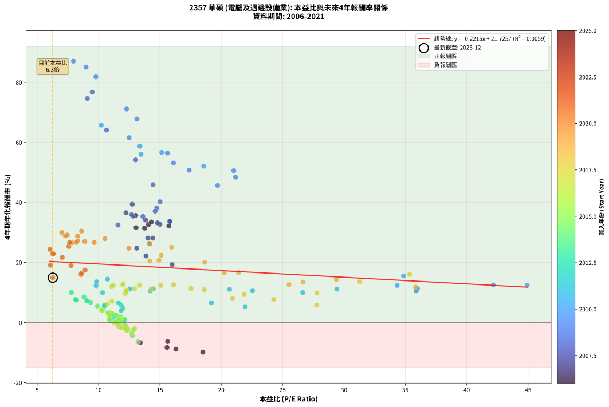
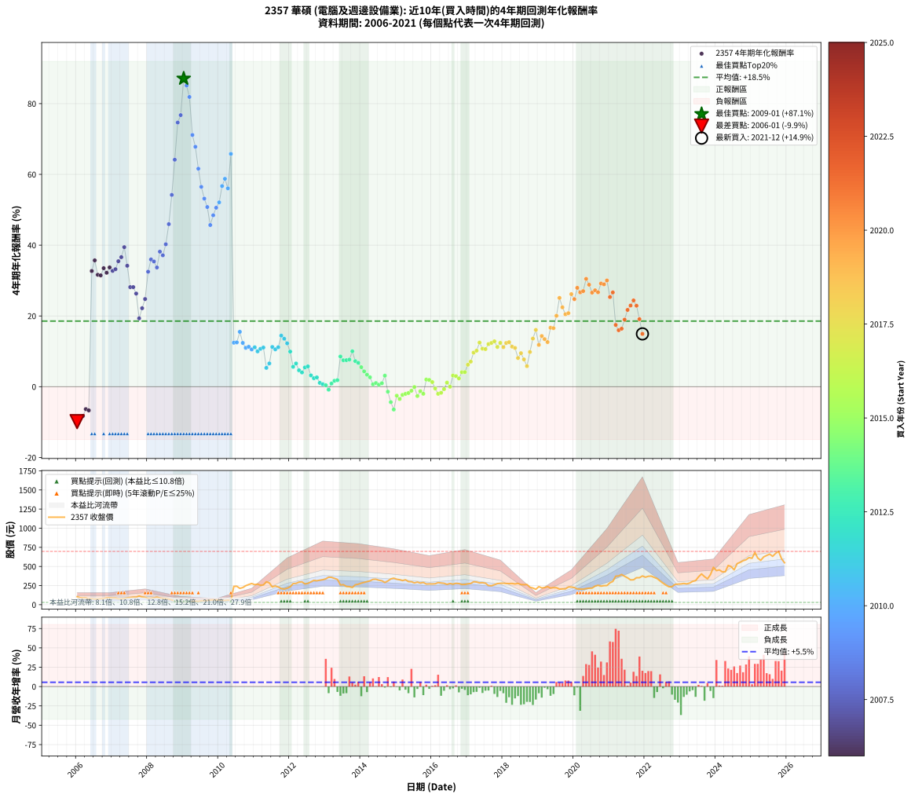

# 2357 華碩 - 本益比與未來報酬率分析

!!! info "報告資訊"
    - **股票代號**: 2357
    - **公司名稱**: 華碩
    - **產業別**: 電腦及週邊設備業
    - **分析期間**: 2006-2021 (192 個數據點)
    - **資料來源**: Type 12 (ShowMonthlyK_ChartFlow) 月收盤價與本益比
    - **報酬率口徑**: 含現金股利 (簡化: 年度合計，假設每年7/1入帳)
    - **報告生成時間**: 2026-01-04 08:24:52 CST

## 📈 視覺化圖表

### 圖表1: 本益比 vs 未來報酬率關係

*圖表1：2357 華碩 本益比與4年期未來報酬率關係 (2006-2021)*

### 圖表2: 歷年買入時點的4年期實際報酬率

*圖表2：2357 華碩 歷年買入時點的4年期實際報酬率 (2006-2021)*

## 📍 買點訊號說明

本報告提供兩種買點提示訊號（顯示於圖表2的股價子圖中）：

### ▲ 小綠色三角形（回測驗證）
- **計算方式**: 使用全部歷史資料計算本益比第25百分位數
- **用途**: 事後驗證，顯示歷史上哪些時點確實為低估區
- **限制**: 當下無法判斷，僅供回測參考
- **特性**: 後見之明（Look-Ahead Bias）

### ▲ 小橘色三角形（即時訊號）
- **計算方式**: 使用截至當月的過去5年資料計算本益比第25百分位數
- **用途**: 實際投資決策，當時即可判斷
- **優勢**: 可操作性強，符合實務需求
- **特性**: 無後見之明，滾動窗口計算

!!! tip "如何使用兩種訊號"
    - **綠色▲** 幫助理解歷史估值機會，驗證策略有效性
    - **橘色▲** 可作為實際買進參考，但仍需搭配基本面分析
    - 兩種訊號重疊時，表示即時判斷與事後驗證一致，信心度較高
    - 僅有綠色▲時，表示當時無法判斷（需要未來資料才能確認）
    - 僅有橘色▲時，表示即時判斷為買點，但事後可能不是最佳時機

## 📊 估值分析摘要

| 指標 | 數值 |
|:---:|:---:|
| **目前本益比** (2021-12) | **6.27 倍** |
| **歷史平均本益比** | 14.34 倍 |
| **估值水準** | 🟢 相對低估 |
| **預期4年年化報酬率** | **+20.34%** |
| **歷史平均報酬率** | +18.55% |
| **相關係數 (R²)** | 0.0059 |
| **趨勢線斜率** | -0.2215 |

!!! abstract "核心洞察"
    目前本益比顯著低於歷史平均，預期未來報酬率可能較高

    根據歷史數據回測，2357 華碩 在目前本益比 **6.3倍** 的估值水準下，
    預期未來4年年化報酬率約為 **+20.3%**。

    **重要提醒**: 本分析基於歷史數據統計，實際報酬率會受到公司基本面變化、產業趨勢、
    總體經濟環境等多重因素影響。R² = 0.01 表示本益比可解釋約 0.6% 的報酬率變異。

## 📈 歷史估值統計

### 最佳買點 (最高報酬率)

| 項目 | 數值 |
|:---:|:---:|
| 起始時間 | 2009-01 |
| 當時本益比 | 7.96 倍 |
| 起始價格 | 30.2 元 |
| 4年後價格 | 338.0 元 |
| **4年年化報酬率** | **+87.09%** |

### 最差買點 (最低報酬率)

| 項目 | 數值 |
|:---:|:---:|
| 起始時間 | 2006-01 |
| 當時本益比 | 18.50 倍 |
| 起始價格 | 104.5 元 |
| 4年後價格 | 62.0 元 |
| **4年年化報酬率** | **-9.86%** |

## 🎯 投資啟示

### 本益比與報酬率關係

趨勢線方程式: **y = -0.2215x + 21.7257**

!!! note "負相關"
    本益比與未來報酬率呈現負相關。較低的本益比通常帶來較高的未來報酬率，
    但相關性不算非常強。**估值仍是重要參考指標之一**。

### 估值區間建議

基於歷史數據分析:

- **🟢 低估區** (P/E < 11.5): 預期報酬率較高，可考慮增加持股
- **🟡 合理區** (P/E 11.5-17.2): 預期報酬率符合長期趨勢，正常持有
- **🔴 高估區** (P/E > 17.2): 預期報酬率較低，可考慮減碼或觀望

!!! danger "風險提示"
    - 過去表現不代表未來結果
    - 本分析假設公司基本面無重大結構性變化
    - 產業環境劇變可能使歷史規律失效
    - 應結合公司財報、產業趨勢、總體經濟等多重因素綜合判斷

!!! success "長期投資觀點"
    歷史數據顯示，在合理或低估的估值水準買入並長期持有，
    往往能獲得較佳的投資報酬。**耐心等待好價格**是價值投資的核心原則。

## 📊 數據品質

- **資料來源**: GoodInfo.tw Type 12 (ShowMonthlyK_ChartFlow)
- **資料頻率**: 月度收盤價與本益比
- **回測期間**: 2006-2021
- **數據點數量**: 192 個 (每個點代表一次4年期回測)

### 計算方法說明

1. **4年期年化報酬率**:
   - 對每個歷史時點，計算其後4年的實際投資報酬率
   - 期末價值(不含股利): 期末價格
   - 期末價值(含現金股利): 期末價格 + 持有期間內的現金股利合計 (簡化: 年度合計，假設每年7/1入帳)
   - 公式: 年化報酬率 = [(期末價值/期初價格)^(1/年數) - 1] × 100%

2. **本益比 (P/E Ratio)**:
   - 使用當時的月收盤價與EPS計算
   - 資料來源: Type 12 月度河流圖本益比數據

3. **趨勢線 (Linear Regression)**:
   - 使用最小平方法擬合線性趨勢線
   - R²值衡量本益比對報酬率的解釋能力

---

*本報告由 Stock Analysis System v1.9.0 自動生成*
*數據更新時間: 2026-01-04 08:24:52 CST*

## 📋 月度回測明細表

（每一列對應時間線圖中的一個買入點；可用來對照 SVG 圖上的每個點。）

| 買入月份 | 賣出月份 | 回測期限_年 | 實際持有年數 | 買入本益比_倍 | 買入收盤價_元 | 賣出收盤價_元 | 現金股利合計_元 | 總報酬率_pct | 年化報酬率_pct |
| --- | --- | --- | --- | --- | --- | --- | --- | --- | --- |
| 2006-01 | 2010-01 | 4 | 4.000 | 18.50 | 104.50 | 62.00 | 6.98 | -33.99 | -9.86 |
| 2006-02 | 2010-02 | 4 | 4.000 | 16.30 | 92.10 | 56.60 | 6.98 | -30.96 | -8.85 |
| 2006-03 | 2010-03 | 4 | 4.000 | 15.58 | 88.00 | 55.30 | 6.98 | -29.22 | -8.28 |
| 2006-04 | 2010-04 | 4 | 4.000 | 15.63 | 88.30 | 61.00 | 6.98 | -23.01 | -6.33 |
| 2006-05 | 2010-05 | 4 | 4.000 | 13.40 | 75.70 | 50.40 | 6.98 | -24.20 | -6.69 |
| 2006-06 | 2010-06 | 4 | 4.000 | 14.07 | 79.50 | 239.50 | 6.98 | +210.04 | +32.70 |
| 2006-07 | 2010-07 | 4 | 4.000 | 13.03 | 73.60 | 241.50 | 8.08 | +239.11 | +35.70 |
| 2006-08 | 2010-08 | 4 | 4.000 | 13.06 | 73.80 | 213.50 | 8.08 | +200.25 | +31.63 |
| 2006-09 | 2010-09 | 4 | 4.000 | 13.75 | 77.70 | 224.00 | 8.08 | +198.69 | +31.46 |
| 2006-10 | 2010-10 | 4 | 4.000 | 14.30 | 80.80 | 248.50 | 8.08 | +217.55 | +33.49 |
| 2006-11 | 2010-11 | 4 | 4.000 | 15.73 | 88.90 | 263.50 | 8.08 | +205.49 | +32.21 |
| 2006-12 | 2010-12 | 4 | 4.000 | 15.79 | 89.20 | 277.00 | 8.08 | +219.60 | +33.71 |
| 2007-01 | 2011-01 | 4 | 4.000 | 15.00 | 87.00 | 262.00 | 8.08 | +210.44 | +32.74 |
| 2007-02 | 2011-02 | 4 | 4.000 | 14.80 | 88.00 | 269.00 | 8.08 | +214.87 | +33.21 |
| 2007-03 | 2011-03 | 4 | 4.000 | 12.80 | 78.00 | 254.50 | 8.08 | +236.65 | +35.45 |
| 2007-04 | 2011-04 | 4 | 4.000 | 12.24 | 76.40 | 258.00 | 8.08 | +248.28 | +36.61 |
| 2007-05 | 2011-05 | 4 | 4.000 | 12.75 | 81.50 | 300.00 | 8.08 | +278.02 | +39.44 |
| 2007-06 | 2011-06 | 4 | 4.000 | 13.83 | 90.40 | 285.00 | 8.08 | +224.21 | +34.19 |
| 2007-07 | 2011-07 | 4 | 4.000 | 14.01 | 93.70 | 232.00 | 20.59 | +169.58 | +28.14 |
| 2007-08 | 2011-08 | 4 | 4.000 | 14.41 | 98.50 | 245.00 | 20.59 | +169.64 | +28.14 |
| 2007-09 | 2011-09 | 4 | 4.000 | 14.15 | 98.80 | 231.00 | 20.59 | +154.65 | +26.32 |
| 2007-10 | 2011-10 | 4 | 4.000 | 15.99 | 114.00 | 210.50 | 20.59 | +102.71 | +19.32 |
| 2007-11 | 2011-11 | 4 | 4.000 | 13.87 | 101.00 | 204.50 | 20.59 | +122.86 | +22.18 |
| 2007-12 | 2011-12 | 4 | 4.000 | 13.11 | 97.40 | 215.50 | 20.59 | +142.39 | +24.78 |
| 2008-01 | 2012-01 | 4 | 4.000 | 11.58 | 82.60 | 234.00 | 20.59 | +208.22 | +32.50 |
| 2008-02 | 2012-02 | 4 | 4.000 | 12.70 | 86.80 | 276.00 | 20.59 | +241.70 | +35.96 |
| 2008-03 | 2012-03 | 4 | 4.000 | 13.61 | 89.00 | 278.50 | 20.59 | +236.06 | +35.40 |
| 2008-04 | 2012-04 | 4 | 4.000 | 15.82 | 98.80 | 295.00 | 20.59 | +219.43 | +33.69 |
| 2008-05 | 2012-05 | 4 | 4.000 | 14.74 | 87.70 | 299.00 | 20.59 | +264.42 | +38.17 |
| 2008-06 | 2012-06 | 4 | 4.000 | 14.61 | 82.60 | 271.50 | 20.59 | +253.62 | +37.13 |
| 2008-07 | 2012-07 | 4 | 4.000 | 15.01 | 80.40 | 278.50 | 32.60 | +286.94 | +40.25 |
| 2008-08 | 2012-08 | 4 | 4.000 | 14.44 | 73.10 | 299.00 | 32.60 | +353.63 | +45.94 |
| 2008-09 | 2012-09 | 4 | 4.000 | 13.03 | 62.10 | 318.50 | 32.60 | +465.38 | +54.20 |
| 2008-10 | 2012-10 | 4 | 4.000 | 10.65 | 47.60 | 313.00 | 32.60 | +626.05 | +64.15 |
| 2008-11 | 2012-11 | 4 | 4.000 | 9.09 | 37.95 | 320.50 | 32.60 | +830.43 | +74.65 |
| 2008-12 | 2012-12 | 4 | 4.000 | 9.48 | 36.80 | 326.50 | 32.60 | +875.82 | +76.74 |
| 2009-01 | 2013-01 | 4 | 4.000 | 7.96 | 30.25 | 338.00 | 32.60 | +1125.12 | +87.09 |
| 2009-02 | 2013-02 | 4 | 4.000 | 8.98 | 33.45 | 360.00 | 32.60 | +1073.69 | +85.09 |
| 2009-03 | 2013-03 | 4 | 4.000 | 9.78 | 35.65 | 357.50 | 32.60 | +994.25 | +81.88 |
| 2009-04 | 2013-04 | 4 | 4.000 | 12.29 | 43.85 | 343.50 | 32.60 | +757.70 | +71.13 |
| 2009-05 | 2013-05 | 4 | 4.000 | 13.13 | 45.80 | 330.50 | 32.60 | +692.79 | +67.80 |
| 2009-06 | 2013-06 | 4 | 4.000 | 12.49 | 42.60 | 258.00 | 32.60 | +582.16 | +61.61 |
| 2009-07 | 2013-07 | 4 | 4.000 | 15.61 | 52.00 | 262.00 | 49.77 | +499.56 | +56.48 |
| 2009-08 | 2013-08 | 4 | 4.000 | 16.11 | 52.40 | 238.50 | 49.77 | +450.13 | +53.15 |
| 2009-09 | 2013-09 | 4 | 4.000 | 17.39 | 55.20 | 235.50 | 49.77 | +416.79 | +50.77 |
| 2009-10 | 2013-10 | 4 | 4.000 | 19.70 | 61.00 | 225.00 | 49.77 | +350.44 | +45.68 |
| 2009-11 | 2013-11 | 4 | 4.000 | 21.17 | 63.90 | 260.50 | 49.77 | +385.56 | +48.44 |
| 2009-12 | 2013-12 | 4 | 4.000 | 21.02 | 61.80 | 268.00 | 49.77 | +414.19 | +50.58 |
| 2010-01 | 2014-01 | 4 | 4.000 | 18.57 | 62.00 | 282.00 | 49.77 | +435.11 | +52.09 |
| 2010-02 | 2014-02 | 4 | 4.000 | 15.15 | 56.60 | 291.50 | 49.77 | +502.95 | +56.70 |
| 2010-03 | 2014-03 | 4 | 4.000 | 13.37 | 55.30 | 301.50 | 49.77 | +535.21 | +58.76 |
| 2010-04 | 2014-04 | 4 | 4.000 | 13.46 | 61.00 | 312.00 | 49.77 | +493.07 | +56.05 |
| 2010-05 | 2014-05 | 4 | 4.000 | 10.22 | 50.40 | 331.00 | 49.77 | +655.50 | +65.79 |
| 2010-06 | 2014-06 | 4 | 4.000 | 44.93 | 239.50 | 333.00 | 49.77 | +59.82 | +12.44 |
| 2010-07 | 2014-07 | 4 | 4.000 | 42.16 | 241.50 | 320.00 | 67.17 | +60.32 | +12.52 |
| 2010-08 | 2014-08 | 4 | 4.000 | 34.85 | 213.50 | 313.00 | 67.17 | +78.07 | +15.52 |
| 2010-09 | 2014-09 | 4 | 4.000 | 34.33 | 224.00 | 290.00 | 67.17 | +59.45 | +12.37 |
| 2010-10 | 2014-10 | 4 | 4.000 | 35.89 | 248.50 | 310.00 | 67.17 | +51.78 | +10.99 |
| 2010-11 | 2014-11 | 4 | 4.000 | 35.99 | 263.50 | 337.00 | 67.17 | +53.39 | +11.29 |
| 2010-12 | 2014-12 | 4 | 4.000 | 35.88 | 277.00 | 346.50 | 67.17 | +49.34 | +10.55 |
| 2011-01 | 2015-01 | 4 | 4.000 | 29.41 | 262.00 | 332.50 | 67.17 | +52.55 | +11.13 |
| 2011-02 | 2015-02 | 4 | 4.000 | 26.64 | 269.00 | 326.50 | 67.17 | +46.35 | +9.99 |
| 2011-03 | 2015-03 | 4 | 4.000 | 22.55 | 254.50 | 315.00 | 67.17 | +50.17 | +10.70 |
| 2011-04 | 2015-04 | 4 | 4.000 | 20.68 | 258.00 | 325.50 | 67.17 | +52.20 | +11.07 |
| 2011-05 | 2015-05 | 4 | 4.000 | 21.95 | 300.00 | 302.00 | 67.17 | +23.06 | +5.32 |
| 2011-06 | 2015-06 | 4 | 4.000 | 19.19 | 285.00 | 300.50 | 67.17 | +29.01 | +6.57 |
| 2011-07 | 2015-07 | 4 | 4.000 | 14.46 | 232.00 | 285.00 | 70.17 | +53.09 | +11.23 |
| 2011-08 | 2015-08 | 4 | 4.000 | 14.22 | 245.00 | 296.00 | 70.17 | +49.46 | +10.57 |
| 2011-09 | 2015-09 | 4 | 4.000 | 12.54 | 231.00 | 282.50 | 70.17 | +52.67 | +11.16 |
| 2011-10 | 2015-10 | 4 | 4.000 | 10.73 | 210.50 | 291.00 | 70.17 | +71.58 | +14.45 |
| 2011-11 | 2015-11 | 4 | 4.000 | 9.83 | 204.50 | 270.00 | 70.17 | +66.34 | +13.57 |
| 2011-12 | 2015-12 | 4 | 4.000 | 9.80 | 215.50 | 272.00 | 70.17 | +58.78 | +12.25 |
| 2012-01 | 2016-01 | 4 | 4.000 | 10.33 | 234.00 | 271.50 | 70.17 | +46.01 | +9.93 |
| 2012-02 | 2016-02 | 4 | 4.000 | 11.85 | 276.00 | 273.50 | 70.17 | +24.52 | +5.64 |
| 2012-03 | 2016-03 | 4 | 4.000 | 11.63 | 278.50 | 289.00 | 70.17 | +28.97 | +6.57 |
| 2012-04 | 2016-04 | 4 | 4.000 | 11.99 | 295.00 | 283.50 | 70.17 | +19.89 | +4.64 |
| 2012-05 | 2016-05 | 4 | 4.000 | 11.84 | 299.00 | 280.00 | 70.17 | +17.11 | +4.03 |
| 2012-06 | 2016-06 | 4 | 4.000 | 10.48 | 271.50 | 265.50 | 70.17 | +23.64 | +5.45 |
| 2012-07 | 2016-07 | 4 | 4.000 | 10.48 | 278.50 | 277.50 | 70.67 | +25.02 | +5.74 |
| 2012-08 | 2016-08 | 4 | 4.000 | 10.98 | 299.00 | 268.50 | 70.67 | +13.43 | +3.20 |
| 2012-09 | 2016-09 | 4 | 4.000 | 11.42 | 318.50 | 279.50 | 70.67 | +9.94 | +2.40 |
| 2012-10 | 2016-10 | 4 | 4.000 | 10.97 | 313.00 | 276.50 | 70.67 | +10.92 | +2.62 |
| 2012-11 | 2016-11 | 4 | 4.000 | 10.98 | 320.50 | 264.00 | 70.67 | +4.42 | +1.09 |
| 2012-12 | 2016-12 | 4 | 4.000 | 10.94 | 326.50 | 265.00 | 70.67 | +2.81 | +0.69 |
| 2013-01 | 2017-01 | 4 | 4.000 | 11.36 | 338.00 | 273.00 | 70.67 | +1.68 | +0.42 |
| 2013-02 | 2017-02 | 4 | 4.000 | 12.14 | 360.00 | 277.50 | 70.67 | -3.29 | -0.83 |
| 2013-03 | 2017-03 | 4 | 4.000 | 12.10 | 357.50 | 300.00 | 70.67 | +3.68 | +0.91 |
| 2013-04 | 2017-04 | 4 | 4.000 | 11.67 | 343.50 | 296.50 | 70.67 | +6.89 | +1.68 |
| 2013-05 | 2017-05 | 4 | 4.000 | 11.26 | 330.50 | 285.00 | 70.67 | +7.62 | +1.85 |
| 2013-06 | 2017-06 | 4 | 4.000 | 8.82 | 258.00 | 287.50 | 70.67 | +38.83 | +8.55 |
| 2013-07 | 2017-07 | 4 | 4.000 | 8.99 | 262.00 | 281.00 | 68.50 | +33.40 | +7.47 |
| 2013-08 | 2017-08 | 4 | 4.000 | 8.21 | 238.50 | 250.00 | 68.50 | +33.54 | +7.50 |
| 2013-09 | 2017-09 | 4 | 4.000 | 8.13 | 235.50 | 248.00 | 68.50 | +34.39 | +7.67 |
| 2013-10 | 2017-10 | 4 | 4.000 | 7.80 | 225.00 | 261.00 | 68.50 | +46.44 | +10.01 |
| 2013-11 | 2017-11 | 4 | 4.000 | 9.06 | 260.50 | 276.00 | 68.50 | +32.25 | +7.24 |
| 2013-12 | 2017-12 | 4 | 4.000 | 9.35 | 268.00 | 279.50 | 68.50 | +29.85 | +6.75 |
| 2014-01 | 2018-01 | 4 | 4.000 | 9.91 | 282.00 | 281.00 | 68.50 | +23.94 | +5.51 |
| 2014-02 | 2018-02 | 4 | 4.000 | 10.32 | 291.50 | 277.00 | 68.50 | +18.52 | +4.34 |
| 2014-03 | 2018-03 | 4 | 4.000 | 10.75 | 301.50 | 276.00 | 68.50 | +14.26 | +3.39 |
| 2014-04 | 2018-04 | 4 | 4.000 | 11.21 | 312.00 | 278.00 | 68.50 | +11.06 | +2.66 |
| 2014-05 | 2018-05 | 4 | 4.000 | 11.98 | 331.00 | 271.50 | 68.50 | +2.72 | +0.67 |
| 2014-06 | 2018-06 | 4 | 4.000 | 12.14 | 333.00 | 278.50 | 68.50 | +4.20 | +1.03 |
| 2014-07 | 2018-07 | 4 | 4.000 | 11.75 | 320.00 | 263.50 | 64.00 | +2.34 | +0.58 |
| 2014-08 | 2018-08 | 4 | 4.000 | 11.58 | 313.00 | 261.50 | 64.00 | +3.99 | +0.98 |
| 2014-09 | 2018-09 | 4 | 4.000 | 10.81 | 290.00 | 264.00 | 64.00 | +13.10 | +3.13 |
| 2014-10 | 2018-10 | 4 | 4.000 | 11.65 | 310.00 | 229.00 | 64.00 | -5.48 | -1.40 |
| 2014-11 | 2018-11 | 4 | 4.000 | 12.76 | 337.00 | 218.00 | 64.00 | -16.32 | -4.36 |
| 2014-12 | 2018-12 | 4 | 4.000 | 13.22 | 346.50 | 201.50 | 64.00 | -23.38 | -6.44 |
| 2015-01 | 2019-01 | 4 | 4.000 | 12.82 | 332.50 | 236.00 | 64.00 | -9.77 | -2.54 |
| 2015-02 | 2019-02 | 4 | 4.000 | 12.71 | 326.50 | 219.50 | 64.00 | -13.17 | -3.47 |
| 2015-03 | 2019-03 | 4 | 4.000 | 12.40 | 315.00 | 223.00 | 64.00 | -8.89 | -2.30 |
| 2015-04 | 2019-04 | 4 | 4.000 | 12.94 | 325.50 | 236.00 | 64.00 | -7.83 | -2.02 |
| 2015-05 | 2019-05 | 4 | 4.000 | 12.14 | 302.00 | 217.00 | 64.00 | -6.95 | -1.79 |
| 2015-06 | 2019-06 | 4 | 4.000 | 12.21 | 300.50 | 223.00 | 64.00 | -4.49 | -1.14 |
| 2015-07 | 2019-07 | 4 | 4.000 | 11.70 | 285.00 | 222.00 | 62.00 | -0.35 | -0.09 |
| 2015-08 | 2019-08 | 4 | 4.000 | 12.29 | 296.00 | 204.00 | 62.00 | -10.14 | -2.64 |
| 2015-09 | 2019-09 | 4 | 4.000 | 11.86 | 282.50 | 206.50 | 62.00 | -4.96 | -1.26 |
| 2015-10 | 2019-10 | 4 | 4.000 | 12.36 | 291.00 | 206.50 | 62.00 | -7.73 | -1.99 |
| 2015-11 | 2019-11 | 4 | 4.000 | 11.60 | 270.00 | 230.50 | 62.00 | +8.33 | +2.02 |
| 2015-12 | 2019-12 | 4 | 4.000 | 11.82 | 272.00 | 231.50 | 62.00 | +7.90 | +1.92 |
| 2016-01 | 2020-01 | 4 | 4.000 | 11.67 | 271.50 | 224.00 | 62.00 | +5.34 | +1.31 |
| 2016-02 | 2020-02 | 4 | 4.000 | 11.64 | 273.50 | 206.00 | 62.00 | -2.01 | -0.51 |
| 2016-03 | 2020-03 | 4 | 4.000 | 12.18 | 289.00 | 204.50 | 62.00 | -7.79 | -2.01 |
| 2016-04 | 2020-04 | 4 | 4.000 | 11.83 | 283.50 | 202.50 | 62.00 | -6.70 | -1.72 |
| 2016-05 | 2020-05 | 4 | 4.000 | 11.57 | 280.00 | 210.50 | 62.00 | -2.68 | -0.68 |
| 2016-06 | 2020-06 | 4 | 4.000 | 10.87 | 265.50 | 216.00 | 62.00 | +4.71 | +1.16 |
| 2016-07 | 2020-07 | 4 | 4.000 | 11.25 | 277.50 | 216.50 | 61.00 | +0.00 | +0.00 |
| 2016-08 | 2020-08 | 4 | 4.000 | 10.78 | 268.50 | 243.00 | 61.00 | +13.22 | +3.15 |
| 2016-09 | 2020-09 | 4 | 4.000 | 11.12 | 279.50 | 253.50 | 61.00 | +12.52 | +2.99 |
| 2016-10 | 2020-10 | 4 | 4.000 | 10.90 | 276.50 | 242.50 | 61.00 | +9.76 | +2.36 |
| 2016-11 | 2020-11 | 4 | 4.000 | 10.31 | 264.00 | 249.00 | 61.00 | +17.42 | +4.10 |
| 2016-12 | 2020-12 | 4 | 4.000 | 10.25 | 265.00 | 250.50 | 61.00 | +17.55 | +4.12 |
| 2017-01 | 2021-01 | 4 | 4.000 | 10.73 | 273.00 | 286.50 | 61.00 | +27.29 | +6.22 |
| 2017-02 | 2021-02 | 4 | 4.000 | 11.09 | 277.50 | 304.00 | 61.00 | +31.53 | +7.09 |
| 2017-03 | 2021-03 | 4 | 4.000 | 12.19 | 300.00 | 372.50 | 61.00 | +44.50 | +9.64 |
| 2017-04 | 2021-04 | 4 | 4.000 | 12.25 | 296.50 | 376.00 | 61.00 | +47.39 | +10.18 |
| 2017-05 | 2021-05 | 4 | 4.000 | 11.97 | 285.00 | 395.00 | 61.00 | +60.00 | +12.47 |
| 2017-06 | 2021-06 | 4 | 4.000 | 12.29 | 287.50 | 371.50 | 61.00 | +50.43 | +10.75 |
| 2017-07 | 2021-07 | 4 | 4.000 | 12.23 | 281.00 | 351.00 | 70.00 | +49.82 | +10.64 |
| 2017-08 | 2021-08 | 4 | 4.000 | 11.08 | 250.00 | 324.00 | 70.00 | +57.60 | +12.04 |
| 2017-09 | 2021-09 | 4 | 4.000 | 11.19 | 248.00 | 325.50 | 70.00 | +59.48 | +12.38 |
| 2017-10 | 2021-10 | 4 | 4.000 | 12.00 | 261.00 | 353.00 | 70.00 | +62.07 | +12.83 |
| 2017-11 | 2021-11 | 4 | 4.000 | 12.93 | 276.00 | 352.50 | 70.00 | +53.08 | +11.23 |
| 2017-12 | 2021-12 | 4 | 4.000 | 13.35 | 279.50 | 376.00 | 70.00 | +59.57 | +12.39 |
| 2018-01 | 2022-01 | 4 | 4.000 | 14.29 | 281.00 | 359.50 | 70.00 | +52.85 | +11.19 |
| 2018-02 | 2022-02 | 4 | 4.000 | 15.06 | 277.00 | 371.50 | 70.00 | +59.39 | +12.36 |
| 2018-03 | 2022-03 | 4 | 4.000 | 16.12 | 276.00 | 373.50 | 70.00 | +60.69 | +12.59 |
| 2018-04 | 2022-04 | 4 | 4.000 | 17.54 | 278.00 | 357.00 | 70.00 | +53.60 | +11.33 |
| 2018-05 | 2022-05 | 4 | 4.000 | 18.62 | 271.50 | 341.50 | 70.00 | +51.57 | +10.96 |
| 2018-06 | 2022-06 | 4 | 4.000 | 20.92 | 278.50 | 310.50 | 70.00 | +36.62 | +8.11 |
| 2018-07 | 2022-07 | 4 | 4.000 | 21.87 | 263.50 | 281.50 | 97.00 | +43.64 | +9.48 |
| 2018-08 | 2022-08 | 4 | 4.000 | 24.27 | 261.50 | 255.00 | 97.00 | +34.61 | +7.71 |
| 2018-09 | 2022-09 | 4 | 4.000 | 27.77 | 264.00 | 234.00 | 97.00 | +25.38 | +5.82 |
| 2018-10 | 2022-10 | 4 | 4.000 | 27.80 | 229.00 | 236.00 | 97.00 | +45.41 | +9.81 |
| 2018-11 | 2022-11 | 4 | 4.000 | 31.28 | 218.00 | 266.00 | 97.00 | +66.51 | +13.60 |
| 2018-12 | 2022-12 | 4 | 4.000 | 35.35 | 201.50 | 268.50 | 97.00 | +81.39 | +16.05 |
| 2019-01 | 2023-01 | 4 | 4.000 | 35.83 | 236.00 | 272.00 | 97.00 | +56.36 | +11.82 |
| 2019-02 | 2023-02 | 4 | 4.000 | 29.37 | 219.50 | 278.00 | 97.00 | +70.84 | +14.33 |
| 2019-03 | 2023-03 | 4 | 4.000 | 26.67 | 223.00 | 272.50 | 97.00 | +65.70 | +13.46 |
| 2019-04 | 2023-04 | 4 | 4.000 | 25.52 | 236.00 | 282.50 | 97.00 | +60.81 | +12.61 |
| 2019-05 | 2023-05 | 4 | 4.000 | 21.41 | 217.00 | 305.00 | 97.00 | +85.25 | +16.67 |
| 2019-06 | 2023-06 | 4 | 4.000 | 20.24 | 223.00 | 314.50 | 97.00 | +84.53 | +16.55 |
| 2019-07 | 2023-07 | 4 | 4.000 | 18.65 | 222.00 | 364.00 | 97.00 | +107.66 | +20.04 |
| 2019-08 | 2023-08 | 4 | 4.000 | 15.95 | 204.00 | 402.50 | 97.00 | +144.85 | +25.09 |
| 2019-09 | 2023-09 | 4 | 4.000 | 15.10 | 206.50 | 367.00 | 97.00 | +124.70 | +22.43 |
| 2019-10 | 2023-10 | 4 | 4.000 | 14.18 | 206.50 | 338.00 | 97.00 | +110.65 | +20.47 |
| 2019-11 | 2023-11 | 4 | 4.000 | 14.92 | 230.50 | 393.50 | 97.00 | +112.80 | +20.78 |
| 2019-12 | 2023-12 | 4 | 4.000 | 14.17 | 231.50 | 489.50 | 97.00 | +153.35 | +26.16 |
| 2020-01 | 2024-01 | 4 | 4.000 | 12.47 | 224.00 | 445.50 | 97.00 | +142.19 | +24.75 |
| 2020-02 | 2024-02 | 4 | 4.000 | 10.52 | 206.00 | 455.00 | 97.00 | +167.96 | +27.94 |
| 2020-03 | 2024-03 | 4 | 4.000 | 9.65 | 204.50 | 429.50 | 97.00 | +157.46 | +26.67 |
| 2020-04 | 2024-04 | 4 | 4.000 | 8.88 | 202.50 | 430.00 | 97.00 | +160.25 | +27.01 |
| 2020-05 | 2024-05 | 4 | 4.000 | 8.62 | 210.50 | 513.00 | 97.00 | +189.79 | +30.47 |
| 2020-06 | 2024-06 | 4 | 4.000 | 8.29 | 216.00 | 498.00 | 97.00 | +175.46 | +28.83 |
| 2020-07 | 2024-07 | 4 | 4.000 | 7.82 | 216.50 | 456.00 | 100.00 | +156.81 | +26.59 |
| 2020-08 | 2024-08 | 4 | 4.000 | 8.30 | 243.00 | 537.00 | 100.00 | +162.14 | +27.24 |
| 2020-09 | 2024-09 | 4 | 4.000 | 8.20 | 253.50 | 553.00 | 100.00 | +157.59 | +26.69 |
| 2020-10 | 2024-10 | 4 | 4.000 | 7.46 | 242.50 | 575.00 | 100.00 | +178.35 | +29.17 |
| 2020-11 | 2024-11 | 4 | 4.000 | 7.29 | 249.00 | 588.00 | 100.00 | +176.31 | +28.93 |
| 2020-12 | 2024-12 | 4 | 4.000 | 7.01 | 250.50 | 616.00 | 100.00 | +185.83 | +30.02 |
| 2021-01 | 2025-01 | 4 | 4.000 | 7.58 | 286.50 | 607.00 | 100.00 | +146.77 | +25.34 |
| 2021-02 | 2025-02 | 4 | 4.000 | 7.64 | 304.00 | 682.00 | 100.00 | +157.24 | +26.64 |
| 2021-03 | 2025-03 | 4 | 4.000 | 8.91 | 372.50 | 609.00 | 100.00 | +90.34 | +17.46 |
| 2021-04 | 2025-04 | 4 | 4.000 | 8.58 | 376.00 | 580.00 | 100.00 | +80.85 | +15.97 |
| 2021-05 | 2025-05 | 4 | 4.000 | 8.61 | 395.00 | 625.00 | 100.00 | +83.54 | +16.40 |
| 2021-06 | 2025-06 | 4 | 4.000 | 7.76 | 371.50 | 644.00 | 100.00 | +100.27 | +18.96 |
| 2021-07 | 2025-07 | 4 | 4.000 | 7.04 | 351.00 | 662.00 | 108.00 | +119.37 | +21.70 |
| 2021-08 | 2025-08 | 4 | 4.000 | 6.24 | 324.00 | 632.00 | 108.00 | +128.40 | +22.93 |
| 2021-09 | 2025-09 | 4 | 4.000 | 6.04 | 325.50 | 671.00 | 108.00 | +139.32 | +24.38 |
| 2021-10 | 2025-10 | 4 | 4.000 | 6.31 | 353.00 | 697.00 | 108.00 | +128.05 | +22.89 |
| 2021-11 | 2025-11 | 4 | 4.000 | 6.08 | 352.50 | 601.00 | 108.00 | +101.13 | +19.09 |
| 2021-12 | 2025-12 | 4 | 4.000 | 6.27 | 376.00 | 548.00 | 108.00 | +74.47 | +14.93 |
