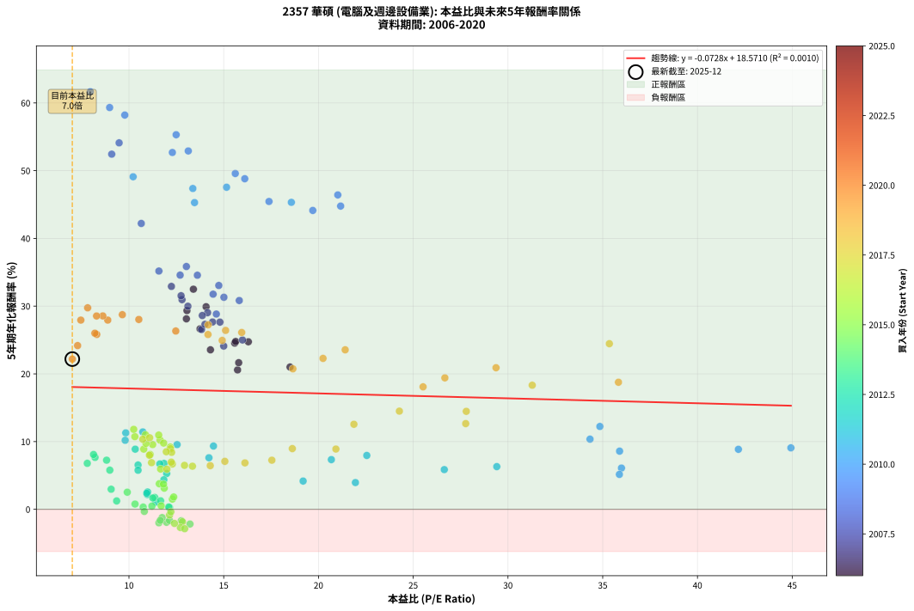
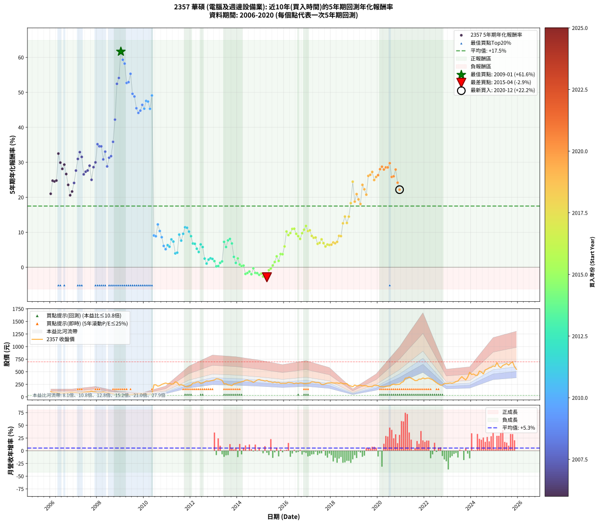

# 2357 華碩 - 本益比與未來報酬率分析

!!! info "報告資訊"
    - **股票代號**: 2357
    - **公司名稱**: 華碩
    - **產業別**: 電腦及週邊設備業
    - **分析期間**: 2006-2020 (180 個數據點)
    - **資料來源**: Type 12 (ShowMonthlyK_ChartFlow) 月收盤價與本益比
    - **報酬率口徑**: 含現金股利 (簡化: 年度合計，假設每年7/1入帳)
    - **報告生成時間**: 2026-01-11 18:30:06 CST

## 📈 視覺化圖表

### 圖表1: 本益比 vs 未來報酬率關係

*圖表1：2357 華碩 本益比與5年期未來報酬率關係 (2006-2020)*

### 圖表2: 歷年買入時點的5年期實際報酬率

*圖表2：2357 華碩 歷年買入時點的5年期實際報酬率 (2006-2020)*

## 📍 買點訊號說明

本報告提供兩種買點提示訊號（顯示於圖表2的股價子圖中）：

### ▲ 小綠色三角形（回測驗證）
- **計算方式**: 使用全部歷史資料計算本益比第25百分位數
- **用途**: 事後驗證，顯示歷史上哪些時點確實為低估區
- **限制**: 當下無法判斷，僅供回測參考
- **特性**: 後見之明（Look-Ahead Bias）

### ▲ 小橘色三角形（即時訊號）
- **計算方式**: 使用截至當月的過去5年資料計算本益比第25百分位數
- **用途**: 實際投資決策，當時即可判斷
- **優勢**: 可操作性強，符合實務需求
- **特性**: 無後見之明，滾動窗口計算

!!! tip "如何使用兩種訊號"
    - **綠色▲** 幫助理解歷史估值機會，驗證策略有效性
    - **橘色▲** 可作為實際買進參考，但仍需搭配基本面分析
    - 兩種訊號重疊時，表示即時判斷與事後驗證一致，信心度較高
    - 僅有綠色▲時，表示當時無法判斷（需要未來資料才能確認）
    - 僅有橘色▲時，表示即時判斷為買點，但事後可能不是最佳時機

## 📊 估值分析摘要

| 指標 | 數值 |
|:---:|:---:|
| **目前本益比** (2020-12) | **7.01 倍** |
| **歷史平均本益比** | 14.81 倍 |
| **估值水準** | 🟢 相對低估 |
| **預期5年年化報酬率** | **+18.06%** |
| **歷史平均報酬率** | +17.49% |
| **相關係數 (R²)** | 0.0010 |
| **趨勢線斜率** | -0.0728 |

!!! abstract "核心洞察"
    目前本益比顯著低於歷史平均，預期未來報酬率可能較高

    根據歷史數據回測，2357 華碩 在目前本益比 **7.0倍** 的估值水準下，
    預期未來5年年化報酬率約為 **+18.1%**。

    **重要提醒**: 本分析基於歷史數據統計，實際報酬率會受到公司基本面變化、產業趨勢、
    總體經濟環境等多重因素影響。R² = 0.00 表示本益比可解釋約 0.1% 的報酬率變異。

## 📈 歷史估值統計

### 最佳買點 (最高報酬率)

| 項目 | 數值 |
|:---:|:---:|
| 起始時間 | 2009-01 |
| 當時本益比 | 7.96 倍 |
| 起始價格 | 30.2 元 |
| 5年後價格 | 282.0 元 |
| **5年年化報酬率** | **+61.65%** |

### 最差買點 (最低報酬率)

| 項目 | 數值 |
|:---:|:---:|
| 起始時間 | 2015-04 |
| 當時本益比 | 12.94 倍 |
| 起始價格 | 325.5 元 |
| 5年後價格 | 202.5 元 |
| **5年年化報酬率** | **-2.86%** |

## 🎯 投資啟示

### 本益比與報酬率關係

趨勢線方程式: **y = -0.0728x + 18.5710**

!!! note "負相關"
    本益比與未來報酬率呈現負相關。較低的本益比通常帶來較高的未來報酬率，
    但相關性不算非常強。**估值仍是重要參考指標之一**。

### 估值區間建議

基於歷史數據分析:

- **🟢 低估區** (P/E < 11.8): 預期報酬率較高，可考慮增加持股
- **🟡 合理區** (P/E 11.8-17.8): 預期報酬率符合長期趨勢，正常持有
- **🔴 高估區** (P/E > 17.8): 預期報酬率較低，可考慮減碼或觀望

!!! danger "風險提示"
    - 過去表現不代表未來結果
    - 本分析假設公司基本面無重大結構性變化
    - 產業環境劇變可能使歷史規律失效
    - 應結合公司財報、產業趨勢、總體經濟等多重因素綜合判斷

!!! success "長期投資觀點"
    歷史數據顯示，在合理或低估的估值水準買入並長期持有，
    往往能獲得較佳的投資報酬。**耐心等待好價格**是價值投資的核心原則。

## 📊 數據品質

- **資料來源**: GoodInfo.tw Type 12 (ShowMonthlyK_ChartFlow)
- **資料頻率**: 月度收盤價與本益比
- **回測期間**: 2006-2020
- **數據點數量**: 180 個 (每個點代表一次5年期回測)

### 計算方法說明

1. **5年期年化報酬率**:
   - 對每個歷史時點，計算其後5年的實際投資報酬率
   - 期末價值(不含股利): 期末價格
   - 期末價值(含現金股利): 期末價格 + 持有期間內的現金股利合計 (簡化: 年度合計，假設每年7/1入帳)
   - 公式: 年化報酬率 = [(期末價值/期初價格)^(1/年數) - 1] × 100%

2. **本益比 (P/E Ratio)**:
   - 使用當時的月收盤價與EPS計算
   - 資料來源: Type 12 月度河流圖本益比數據

3. **趨勢線 (Linear Regression)**:
   - 使用最小平方法擬合線性趨勢線
   - R²值衡量本益比對報酬率的解釋能力

---

*本報告由 Stock Analysis System v1.9.0 自動生成*
*數據更新時間: 2026-01-11 18:30:06 CST*

## 📋 月度回測明細表

（每一列對應時間線圖中的一個買入點；可用來對照 SVG 圖上的每個點。）

| 買入月份 | 賣出月份 | 回測期限_年 | 實際持有年數 | 買入本益比_倍 | 買入收盤價_元 | 賣出收盤價_元 | 現金股利合計_元 | 總報酬率_pct | 年化報酬率_pct |
| --- | --- | --- | --- | --- | --- | --- | --- | --- | --- |
| 2006-01 | 2011-01 | 5 | 4.999 | 18.50 | 104.50 | 262.00 | 9.08 | +159.41 | +21.01 |
| 2006-02 | 2011-02 | 5 | 4.999 | 16.30 | 92.10 | 269.00 | 9.08 | +201.94 | +24.74 |
| 2006-03 | 2011-03 | 5 | 4.999 | 15.58 | 88.00 | 254.50 | 9.08 | +199.53 | +24.54 |
| 2006-04 | 2011-04 | 5 | 4.999 | 15.63 | 88.30 | 258.00 | 9.08 | +202.47 | +24.78 |
| 2006-05 | 2011-05 | 5 | 4.999 | 13.40 | 75.70 | 300.00 | 9.08 | +308.30 | +32.50 |
| 2006-06 | 2011-06 | 5 | 4.999 | 14.07 | 79.50 | 285.00 | 9.08 | +269.92 | +29.91 |
| 2006-07 | 2011-07 | 5 | 4.999 | 13.03 | 73.60 | 232.00 | 22.08 | +245.22 | +28.13 |
| 2006-08 | 2011-08 | 5 | 4.999 | 13.06 | 73.80 | 245.00 | 22.08 | +261.90 | +29.34 |
| 2006-09 | 2011-09 | 5 | 4.999 | 13.75 | 77.70 | 231.00 | 22.08 | +225.72 | +26.64 |
| 2006-10 | 2011-10 | 5 | 4.999 | 14.30 | 80.80 | 210.50 | 22.08 | +187.85 | +23.55 |
| 2006-11 | 2011-11 | 5 | 4.999 | 15.73 | 88.90 | 204.50 | 22.08 | +154.88 | +20.58 |
| 2006-12 | 2011-12 | 5 | 4.999 | 15.79 | 89.20 | 215.50 | 22.08 | +166.35 | +21.65 |
| 2007-01 | 2012-01 | 5 | 4.999 | 15.00 | 87.00 | 234.00 | 22.08 | +194.35 | +24.10 |
| 2007-02 | 2012-02 | 5 | 4.999 | 14.80 | 88.00 | 276.00 | 22.08 | +238.73 | +27.64 |
| 2007-03 | 2012-03 | 5 | 5.002 | 12.80 | 78.00 | 278.50 | 22.08 | +285.36 | +30.96 |
| 2007-04 | 2012-04 | 5 | 5.002 | 12.24 | 76.40 | 295.00 | 22.08 | +315.03 | +32.91 |
| 2007-05 | 2012-05 | 5 | 5.002 | 12.75 | 81.50 | 299.00 | 22.08 | +293.97 | +31.54 |
| 2007-06 | 2012-06 | 5 | 5.002 | 13.83 | 90.40 | 271.50 | 22.08 | +224.76 | +26.55 |
| 2007-07 | 2012-07 | 5 | 5.002 | 14.01 | 93.70 | 278.50 | 35.09 | +234.68 | +27.32 |
| 2007-08 | 2012-08 | 5 | 5.002 | 14.41 | 98.50 | 299.00 | 35.09 | +239.18 | +27.66 |
| 2007-09 | 2012-09 | 5 | 5.002 | 14.15 | 98.80 | 318.50 | 35.09 | +257.89 | +29.03 |
| 2007-10 | 2012-10 | 5 | 5.002 | 15.99 | 114.00 | 313.00 | 35.09 | +205.34 | +25.00 |
| 2007-11 | 2012-11 | 5 | 5.002 | 13.87 | 101.00 | 320.50 | 35.09 | +252.07 | +28.61 |
| 2007-12 | 2012-12 | 5 | 5.002 | 13.11 | 97.40 | 326.50 | 35.09 | +271.24 | +29.98 |
| 2008-01 | 2013-01 | 5 | 5.002 | 11.58 | 82.60 | 338.00 | 35.09 | +351.69 | +35.18 |
| 2008-02 | 2013-03 | 5 | 5.081 | 12.70 | 86.80 | 357.50 | 35.09 | +352.29 | +34.58 |
| 2008-03 | 2013-03 | 5 | 4.999 | 13.61 | 89.00 | 357.50 | 35.09 | +341.11 | +34.56 |
| 2008-04 | 2013-04 | 5 | 4.999 | 15.82 | 98.80 | 343.50 | 35.09 | +283.19 | +30.83 |
| 2008-05 | 2013-05 | 5 | 4.999 | 14.74 | 87.70 | 330.50 | 35.09 | +316.87 | +33.05 |
| 2008-06 | 2013-06 | 5 | 4.999 | 14.61 | 82.60 | 258.00 | 35.09 | +254.83 | +28.83 |
| 2008-07 | 2013-07 | 5 | 4.999 | 15.01 | 80.40 | 262.00 | 51.77 | +290.26 | +31.31 |
| 2008-08 | 2013-08 | 5 | 4.999 | 14.44 | 73.10 | 238.50 | 51.77 | +297.09 | +31.76 |
| 2008-09 | 2013-09 | 5 | 4.999 | 13.03 | 62.10 | 235.50 | 51.77 | +362.59 | +35.85 |
| 2008-10 | 2013-10 | 5 | 4.999 | 10.65 | 47.60 | 225.00 | 51.77 | +481.45 | +42.21 |
| 2008-11 | 2013-11 | 5 | 4.999 | 9.09 | 37.95 | 260.50 | 51.77 | +722.85 | +52.44 |
| 2008-12 | 2013-12 | 5 | 4.999 | 9.48 | 36.80 | 268.00 | 51.77 | +768.94 | +54.11 |
| 2009-01 | 2014-01 | 5 | 4.999 | 7.96 | 30.25 | 282.00 | 51.77 | +1003.37 | +61.65 |
| 2009-02 | 2014-02 | 5 | 4.999 | 8.98 | 33.45 | 291.50 | 51.77 | +926.22 | +59.32 |
| 2009-03 | 2014-03 | 5 | 4.999 | 9.78 | 35.65 | 301.50 | 51.77 | +890.94 | +58.21 |
| 2009-04 | 2014-04 | 5 | 4.999 | 12.29 | 43.85 | 312.00 | 51.77 | +729.58 | +52.69 |
| 2009-05 | 2014-05 | 5 | 4.999 | 13.13 | 45.80 | 331.00 | 51.77 | +735.74 | +52.91 |
| 2009-06 | 2014-06 | 5 | 4.999 | 12.49 | 42.60 | 333.00 | 51.77 | +803.22 | +55.30 |
| 2009-07 | 2014-07 | 5 | 4.999 | 15.61 | 52.00 | 320.00 | 69.27 | +648.60 | +49.58 |
| 2009-08 | 2014-08 | 5 | 4.999 | 16.11 | 52.40 | 313.00 | 69.27 | +629.52 | +48.81 |
| 2009-09 | 2014-09 | 5 | 4.999 | 17.39 | 55.20 | 290.00 | 69.27 | +550.85 | +45.45 |
| 2009-10 | 2014-10 | 5 | 4.999 | 19.70 | 61.00 | 310.00 | 69.27 | +521.75 | +44.13 |
| 2009-11 | 2014-11 | 5 | 4.999 | 21.17 | 63.90 | 337.00 | 69.27 | +535.79 | +44.77 |
| 2009-12 | 2014-12 | 5 | 4.999 | 21.02 | 61.80 | 346.50 | 69.27 | +572.77 | +46.42 |
| 2010-01 | 2015-01 | 5 | 4.999 | 18.57 | 62.00 | 332.50 | 69.27 | +548.02 | +45.32 |
| 2010-02 | 2015-02 | 5 | 4.999 | 15.15 | 56.60 | 326.50 | 69.27 | +599.24 | +47.55 |
| 2010-03 | 2015-03 | 5 | 4.999 | 13.37 | 55.30 | 315.00 | 69.27 | +594.88 | +47.37 |
| 2010-04 | 2015-04 | 5 | 4.999 | 13.46 | 61.00 | 325.50 | 69.27 | +547.16 | +45.29 |
| 2010-05 | 2015-05 | 5 | 4.999 | 10.22 | 50.40 | 302.00 | 69.27 | +636.65 | +49.10 |
| 2010-06 | 2015-06 | 5 | 4.999 | 44.93 | 239.50 | 300.50 | 69.27 | +54.39 | +9.08 |
| 2010-07 | 2015-07 | 5 | 4.999 | 42.16 | 241.50 | 285.00 | 84.17 | +52.87 | +8.86 |
| 2010-08 | 2015-08 | 5 | 4.999 | 34.85 | 213.50 | 296.00 | 84.17 | +78.07 | +12.23 |
| 2010-09 | 2015-09 | 5 | 4.999 | 34.33 | 224.00 | 282.50 | 84.17 | +63.69 | +10.36 |
| 2010-10 | 2015-10 | 5 | 4.999 | 35.89 | 248.50 | 291.00 | 84.17 | +50.97 | +8.59 |
| 2010-11 | 2015-11 | 5 | 4.999 | 35.99 | 263.50 | 270.00 | 84.17 | +34.41 | +6.09 |
| 2010-12 | 2015-12 | 5 | 4.999 | 35.88 | 277.00 | 272.00 | 84.17 | +28.58 | +5.16 |
| 2011-01 | 2016-01 | 5 | 4.999 | 29.41 | 262.00 | 271.50 | 84.17 | +35.75 | +6.30 |
| 2011-02 | 2016-02 | 5 | 4.999 | 26.64 | 269.00 | 273.50 | 84.17 | +32.96 | +5.86 |
| 2011-03 | 2016-03 | 5 | 5.002 | 22.55 | 254.50 | 289.00 | 84.17 | +46.63 | +7.95 |
| 2011-04 | 2016-04 | 5 | 5.002 | 20.68 | 258.00 | 283.50 | 84.17 | +42.51 | +7.34 |
| 2011-05 | 2016-05 | 5 | 5.002 | 21.95 | 300.00 | 280.00 | 84.17 | +21.39 | +3.95 |
| 2011-06 | 2016-06 | 5 | 5.002 | 19.19 | 285.00 | 265.50 | 84.17 | +22.69 | +4.17 |
| 2011-07 | 2016-07 | 5 | 5.002 | 14.46 | 232.00 | 277.50 | 85.17 | +56.32 | +9.34 |
| 2011-08 | 2016-08 | 5 | 5.002 | 14.22 | 245.00 | 268.50 | 85.17 | +44.36 | +7.62 |
| 2011-09 | 2016-09 | 5 | 5.002 | 12.54 | 231.00 | 279.50 | 85.17 | +57.87 | +9.56 |
| 2011-10 | 2016-10 | 5 | 5.002 | 10.73 | 210.50 | 276.50 | 85.17 | +71.81 | +11.43 |
| 2011-11 | 2016-11 | 5 | 5.002 | 9.83 | 204.50 | 264.00 | 85.17 | +70.74 | +11.29 |
| 2011-12 | 2016-12 | 5 | 5.002 | 9.80 | 215.50 | 265.00 | 85.17 | +62.49 | +10.19 |
| 2012-01 | 2017-01 | 5 | 5.002 | 10.33 | 234.00 | 273.00 | 85.17 | +53.06 | +8.88 |
| 2012-02 | 2017-03 | 5 | 5.081 | 11.85 | 276.00 | 300.00 | 85.17 | +39.55 | +6.78 |
| 2012-03 | 2017-03 | 5 | 4.999 | 11.63 | 278.50 | 300.00 | 85.17 | +38.30 | +6.70 |
| 2012-04 | 2017-04 | 5 | 4.999 | 11.99 | 295.00 | 296.50 | 85.17 | +29.38 | +5.29 |
| 2012-05 | 2017-05 | 5 | 4.999 | 11.84 | 299.00 | 285.00 | 85.17 | +23.80 | +4.36 |
| 2012-06 | 2017-06 | 5 | 4.999 | 10.48 | 271.50 | 287.50 | 85.17 | +37.26 | +6.54 |
| 2012-07 | 2017-07 | 5 | 4.999 | 10.48 | 278.50 | 281.00 | 87.67 | +32.38 | +5.77 |
| 2012-08 | 2017-08 | 5 | 4.999 | 10.98 | 299.00 | 250.00 | 87.67 | +12.93 | +2.46 |
| 2012-09 | 2017-09 | 5 | 4.999 | 11.42 | 318.50 | 248.00 | 87.67 | +5.39 | +1.06 |
| 2012-10 | 2017-10 | 5 | 4.999 | 10.97 | 313.00 | 261.00 | 87.67 | +11.40 | +2.18 |
| 2012-11 | 2017-11 | 5 | 4.999 | 10.98 | 320.50 | 276.00 | 87.67 | +13.47 | +2.56 |
| 2012-12 | 2017-12 | 5 | 4.999 | 10.94 | 326.50 | 279.50 | 87.67 | +12.46 | +2.38 |
| 2013-01 | 2018-01 | 5 | 4.999 | 11.36 | 338.00 | 281.00 | 87.67 | +9.07 | +1.75 |
| 2013-02 | 2018-02 | 5 | 4.999 | 12.14 | 360.00 | 277.00 | 87.67 | +1.30 | +0.26 |
| 2013-03 | 2018-03 | 5 | 4.999 | 12.10 | 357.50 | 276.00 | 87.67 | +1.73 | +0.34 |
| 2013-04 | 2018-04 | 5 | 4.999 | 11.67 | 343.50 | 278.00 | 87.67 | +6.45 | +1.26 |
| 2013-05 | 2018-05 | 5 | 4.999 | 11.26 | 330.50 | 271.50 | 87.67 | +8.67 | +1.68 |
| 2013-06 | 2018-06 | 5 | 4.999 | 8.82 | 258.00 | 278.50 | 87.67 | +41.93 | +7.25 |
| 2013-07 | 2018-07 | 5 | 4.999 | 8.99 | 262.00 | 263.50 | 83.50 | +32.44 | +5.78 |
| 2013-08 | 2018-08 | 5 | 4.999 | 8.21 | 238.50 | 261.50 | 83.50 | +44.65 | +7.66 |
| 2013-09 | 2018-09 | 5 | 4.999 | 8.13 | 235.50 | 264.00 | 83.50 | +47.56 | +8.09 |
| 2013-10 | 2018-10 | 5 | 4.999 | 7.80 | 225.00 | 229.00 | 83.50 | +38.89 | +6.79 |
| 2013-11 | 2018-11 | 5 | 4.999 | 9.06 | 260.50 | 218.00 | 83.50 | +15.74 | +2.97 |
| 2013-12 | 2018-12 | 5 | 4.999 | 9.35 | 268.00 | 201.50 | 83.50 | +6.34 | +1.24 |
| 2014-01 | 2019-01 | 5 | 4.999 | 9.91 | 282.00 | 236.00 | 83.50 | +13.30 | +2.53 |
| 2014-02 | 2019-02 | 5 | 4.999 | 10.32 | 291.50 | 219.50 | 83.50 | +3.95 | +0.78 |
| 2014-03 | 2019-03 | 5 | 4.999 | 10.75 | 301.50 | 223.00 | 83.50 | +1.66 | +0.33 |
| 2014-04 | 2019-04 | 5 | 4.999 | 11.21 | 312.00 | 236.00 | 83.50 | +2.40 | +0.48 |
| 2014-05 | 2019-05 | 5 | 4.999 | 11.98 | 331.00 | 217.00 | 83.50 | -9.21 | -1.92 |
| 2014-06 | 2019-06 | 5 | 4.999 | 12.14 | 333.00 | 223.00 | 83.50 | -7.96 | -1.65 |
| 2014-07 | 2019-07 | 5 | 4.999 | 11.75 | 320.00 | 222.00 | 79.00 | -5.94 | -1.22 |
| 2014-08 | 2019-08 | 5 | 4.999 | 11.58 | 313.00 | 204.00 | 79.00 | -9.58 | -2.00 |
| 2014-09 | 2019-09 | 5 | 4.999 | 10.81 | 290.00 | 206.50 | 79.00 | -1.55 | -0.31 |
| 2014-10 | 2019-10 | 5 | 4.999 | 11.65 | 310.00 | 206.50 | 79.00 | -7.90 | -1.63 |
| 2014-11 | 2019-11 | 5 | 4.999 | 12.76 | 337.00 | 230.50 | 79.00 | -8.16 | -1.69 |
| 2014-12 | 2019-12 | 5 | 4.999 | 13.22 | 346.50 | 231.50 | 79.00 | -10.39 | -2.17 |
| 2015-01 | 2020-01 | 5 | 4.999 | 12.82 | 332.50 | 224.00 | 79.00 | -8.87 | -1.84 |
| 2015-02 | 2020-02 | 5 | 4.999 | 12.71 | 326.50 | 206.00 | 79.00 | -12.71 | -2.68 |
| 2015-03 | 2020-03 | 5 | 5.002 | 12.40 | 315.00 | 204.50 | 79.00 | -10.00 | -2.08 |
| 2015-04 | 2020-04 | 5 | 5.002 | 12.94 | 325.50 | 202.50 | 79.00 | -13.52 | -2.86 |
| 2015-05 | 2020-05 | 5 | 5.002 | 12.14 | 302.00 | 210.50 | 79.00 | -4.14 | -0.84 |
| 2015-06 | 2020-06 | 5 | 5.002 | 12.21 | 300.50 | 216.00 | 79.00 | -1.83 | -0.37 |
| 2015-07 | 2020-07 | 5 | 5.002 | 11.70 | 285.00 | 216.50 | 76.00 | +2.63 | +0.52 |
| 2015-08 | 2020-08 | 5 | 5.002 | 12.29 | 296.00 | 243.00 | 76.00 | +7.77 | +1.51 |
| 2015-09 | 2020-09 | 5 | 5.002 | 11.86 | 282.50 | 253.50 | 76.00 | +16.64 | +3.12 |
| 2015-10 | 2020-10 | 5 | 5.002 | 12.36 | 291.00 | 242.50 | 76.00 | +9.45 | +1.82 |
| 2015-11 | 2020-11 | 5 | 5.002 | 11.60 | 270.00 | 249.00 | 76.00 | +20.37 | +3.78 |
| 2015-12 | 2020-12 | 5 | 5.002 | 11.82 | 272.00 | 250.50 | 76.00 | +20.04 | +3.72 |
| 2016-01 | 2021-01 | 5 | 5.002 | 11.67 | 271.50 | 286.50 | 76.00 | +33.52 | +5.95 |
| 2016-02 | 2021-03 | 5 | 5.081 | 11.64 | 273.50 | 372.50 | 76.00 | +63.99 | +10.22 |
| 2016-03 | 2021-03 | 5 | 4.999 | 12.18 | 289.00 | 372.50 | 76.00 | +55.19 | +9.19 |
| 2016-04 | 2021-04 | 5 | 4.999 | 11.83 | 283.50 | 376.00 | 76.00 | +59.44 | +9.78 |
| 2016-05 | 2021-05 | 5 | 4.999 | 11.57 | 280.00 | 395.00 | 76.00 | +68.21 | +10.96 |
| 2016-06 | 2021-06 | 5 | 4.999 | 10.87 | 265.50 | 371.50 | 76.00 | +68.55 | +11.01 |
| 2016-07 | 2021-07 | 5 | 4.999 | 11.25 | 277.50 | 351.00 | 87.00 | +57.84 | +9.56 |
| 2016-08 | 2021-08 | 5 | 4.999 | 10.78 | 268.50 | 324.00 | 87.00 | +53.07 | +8.89 |
| 2016-09 | 2021-09 | 5 | 4.999 | 11.12 | 279.50 | 325.50 | 87.00 | +47.58 | +8.10 |
| 2016-10 | 2021-10 | 5 | 4.999 | 10.90 | 276.50 | 353.00 | 87.00 | +59.13 | +9.74 |
| 2016-11 | 2021-11 | 5 | 4.999 | 10.31 | 264.00 | 352.50 | 87.00 | +66.48 | +10.73 |
| 2016-12 | 2021-12 | 5 | 4.999 | 10.25 | 265.00 | 376.00 | 87.00 | +74.72 | +11.81 |
| 2017-01 | 2022-01 | 5 | 4.999 | 10.73 | 273.00 | 359.50 | 87.00 | +63.55 | +10.34 |
| 2017-02 | 2022-02 | 5 | 4.999 | 11.09 | 277.50 | 371.50 | 87.00 | +65.23 | +10.57 |
| 2017-03 | 2022-03 | 5 | 4.999 | 12.19 | 300.00 | 373.50 | 87.00 | +53.50 | +8.95 |
| 2017-04 | 2022-04 | 5 | 4.999 | 12.25 | 296.50 | 357.00 | 87.00 | +49.75 | +8.41 |
| 2017-05 | 2022-05 | 5 | 4.999 | 11.97 | 285.00 | 341.50 | 87.00 | +50.35 | +8.50 |
| 2017-06 | 2022-06 | 5 | 4.999 | 12.29 | 287.50 | 310.50 | 87.00 | +38.26 | +6.69 |
| 2017-07 | 2022-07 | 5 | 4.999 | 12.23 | 281.00 | 281.50 | 112.00 | +40.04 | +6.97 |
| 2017-08 | 2022-08 | 5 | 4.999 | 11.08 | 250.00 | 255.00 | 112.00 | +46.80 | +7.98 |
| 2017-09 | 2022-09 | 5 | 4.999 | 11.19 | 248.00 | 234.00 | 112.00 | +39.52 | +6.89 |
| 2017-10 | 2022-10 | 5 | 4.999 | 12.00 | 261.00 | 236.00 | 112.00 | +33.33 | +5.92 |
| 2017-11 | 2022-11 | 5 | 4.999 | 12.93 | 276.00 | 266.00 | 112.00 | +36.96 | +6.49 |
| 2017-12 | 2022-12 | 5 | 4.999 | 13.35 | 279.50 | 268.50 | 112.00 | +36.14 | +6.36 |
| 2018-01 | 2023-01 | 5 | 4.999 | 14.29 | 281.00 | 272.00 | 112.00 | +36.65 | +6.45 |
| 2018-02 | 2023-02 | 5 | 4.999 | 15.06 | 277.00 | 278.00 | 112.00 | +40.79 | +7.08 |
| 2018-03 | 2023-03 | 5 | 4.999 | 16.12 | 276.00 | 272.50 | 112.00 | +39.31 | +6.86 |
| 2018-04 | 2023-04 | 5 | 4.999 | 17.54 | 278.00 | 282.50 | 112.00 | +41.91 | +7.25 |
| 2018-05 | 2023-05 | 5 | 4.999 | 18.62 | 271.50 | 305.00 | 112.00 | +53.59 | +8.96 |
| 2018-06 | 2023-06 | 5 | 4.999 | 20.92 | 278.50 | 314.50 | 112.00 | +53.14 | +8.90 |
| 2018-07 | 2023-07 | 5 | 4.999 | 21.87 | 263.50 | 364.00 | 112.00 | +80.65 | +12.56 |
| 2018-08 | 2023-08 | 5 | 4.999 | 24.27 | 261.50 | 402.50 | 112.00 | +96.75 | +14.50 |
| 2018-09 | 2023-09 | 5 | 4.999 | 27.77 | 264.00 | 367.00 | 112.00 | +81.44 | +12.66 |
| 2018-10 | 2023-10 | 5 | 4.999 | 27.80 | 229.00 | 338.00 | 112.00 | +96.51 | +14.47 |
| 2018-11 | 2023-11 | 5 | 4.999 | 31.28 | 218.00 | 393.50 | 112.00 | +131.88 | +18.32 |
| 2018-12 | 2023-12 | 5 | 4.999 | 35.35 | 201.50 | 489.50 | 112.00 | +198.51 | +24.45 |
| 2019-01 | 2024-01 | 5 | 4.999 | 35.83 | 236.00 | 445.50 | 112.00 | +136.23 | +18.76 |
| 2019-02 | 2024-02 | 5 | 4.999 | 29.37 | 219.50 | 455.00 | 112.00 | +158.31 | +20.90 |
| 2019-03 | 2024-03 | 5 | 5.002 | 26.67 | 223.00 | 429.50 | 112.00 | +142.83 | +19.41 |
| 2019-04 | 2024-04 | 5 | 5.002 | 25.52 | 236.00 | 430.00 | 112.00 | +129.66 | +18.08 |
| 2019-05 | 2024-05 | 5 | 5.002 | 21.41 | 217.00 | 513.00 | 112.00 | +188.02 | +23.55 |
| 2019-06 | 2024-06 | 5 | 5.002 | 20.24 | 223.00 | 498.00 | 112.00 | +173.54 | +22.28 |
| 2019-07 | 2024-07 | 5 | 5.002 | 18.65 | 222.00 | 456.00 | 114.00 | +156.76 | +20.75 |
| 2019-08 | 2024-08 | 5 | 5.002 | 15.95 | 204.00 | 537.00 | 114.00 | +219.12 | +26.11 |
| 2019-09 | 2024-09 | 5 | 5.002 | 15.10 | 206.50 | 553.00 | 114.00 | +223.00 | +26.42 |
| 2019-10 | 2024-10 | 5 | 5.002 | 14.18 | 206.50 | 575.00 | 114.00 | +233.66 | +27.24 |
| 2019-11 | 2024-11 | 5 | 5.002 | 14.92 | 230.50 | 588.00 | 114.00 | +204.56 | +24.94 |
| 2019-12 | 2024-12 | 5 | 5.002 | 14.17 | 231.50 | 616.00 | 114.00 | +215.33 | +25.81 |
| 2020-01 | 2025-01 | 5 | 5.002 | 12.47 | 224.00 | 607.00 | 114.00 | +221.88 | +26.33 |
| 2020-02 | 2025-03 | 5 | 5.081 | 10.52 | 206.00 | 609.00 | 114.00 | +250.97 | +28.03 |
| 2020-03 | 2025-03 | 5 | 4.999 | 9.65 | 204.50 | 609.00 | 114.00 | +253.55 | +28.74 |
| 2020-04 | 2025-04 | 5 | 4.999 | 8.88 | 202.50 | 580.00 | 114.00 | +242.72 | +27.94 |
| 2020-05 | 2025-05 | 5 | 4.999 | 8.62 | 210.50 | 625.00 | 114.00 | +251.07 | +28.56 |
| 2020-06 | 2025-06 | 5 | 4.999 | 8.29 | 216.00 | 644.00 | 114.00 | +250.93 | +28.55 |
| 2020-07 | 2025-07 | 5 | 4.999 | 7.82 | 216.50 | 662.00 | 134.00 | +267.67 | +29.75 |
| 2020-08 | 2025-08 | 5 | 4.999 | 8.30 | 243.00 | 632.00 | 134.00 | +215.23 | +25.82 |
| 2020-09 | 2025-09 | 5 | 4.999 | 8.20 | 253.50 | 671.00 | 134.00 | +217.55 | +26.00 |
| 2020-10 | 2025-10 | 5 | 4.999 | 7.46 | 242.50 | 697.00 | 134.00 | +242.68 | +27.94 |
| 2020-11 | 2025-11 | 5 | 4.999 | 7.29 | 249.00 | 601.00 | 134.00 | +195.18 | +24.17 |
| 2020-12 | 2025-12 | 5 | 4.999 | 7.01 | 250.50 | 548.00 | 134.00 | +172.26 | +22.18 |
