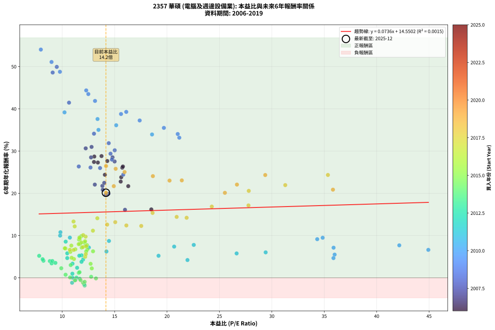
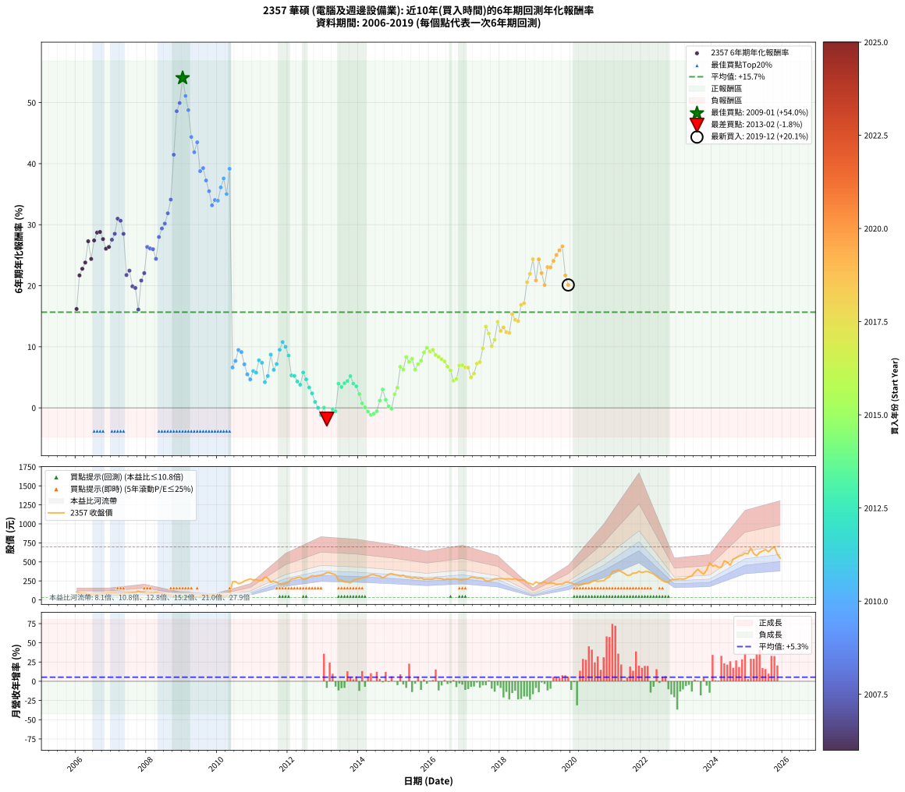

# 2357 華碩 - 本益比與未來報酬率分析

!!! info "報告資訊"
    - **股票代號**: 2357
    - **公司名稱**: 華碩
    - **產業別**: 電腦及週邊設備業
    - **分析期間**: 2006-2019 (168 個數據點)
    - **資料來源**: Type 12 (ShowMonthlyK_ChartFlow) 月收盤價與本益比
    - **報酬率口徑**: 含現金股利 (簡化: 年度合計，假設每年7/1入帳)
    - **報告生成時間**: 2026-01-04 08:47:31 CST

## 📈 視覺化圖表

### 圖表1: 本益比 vs 未來報酬率關係

*圖表1：2357 華碩 本益比與6年期未來報酬率關係 (2006-2019)*

### 圖表2: 歷年買入時點的6年期實際報酬率

*圖表2：2357 華碩 歷年買入時點的6年期實際報酬率 (2006-2019)*

## 📍 買點訊號說明

本報告提供兩種買點提示訊號（顯示於圖表2的股價子圖中）：

### ▲ 小綠色三角形（回測驗證）
- **計算方式**: 使用全部歷史資料計算本益比第25百分位數
- **用途**: 事後驗證，顯示歷史上哪些時點確實為低估區
- **限制**: 當下無法判斷，僅供回測參考
- **特性**: 後見之明（Look-Ahead Bias）

### ▲ 小橘色三角形（即時訊號）
- **計算方式**: 使用截至當月的過去5年資料計算本益比第25百分位數
- **用途**: 實際投資決策，當時即可判斷
- **優勢**: 可操作性強，符合實務需求
- **特性**: 無後見之明，滾動窗口計算

!!! tip "如何使用兩種訊號"
    - **綠色▲** 幫助理解歷史估值機會，驗證策略有效性
    - **橘色▲** 可作為實際買進參考，但仍需搭配基本面分析
    - 兩種訊號重疊時，表示即時判斷與事後驗證一致，信心度較高
    - 僅有綠色▲時，表示當時無法判斷（需要未來資料才能確認）
    - 僅有橘色▲時，表示即時判斷為買點，但事後可能不是最佳時機

## 📊 估值分析摘要

| 指標 | 數值 |
|:---:|:---:|
| **目前本益比** (2019-12) | **14.17 倍** |
| **歷史平均本益比** | 15.25 倍 |
| **估值水準** | 🟡 合理範圍 |
| **預期6年年化報酬率** | **+15.59%** |
| **歷史平均報酬率** | +15.67% |
| **相關係數 (R²)** | 0.0015 |
| **趨勢線斜率** | 0.0736 |

!!! abstract "核心洞察"
    目前本益比接近歷史平均，預期報酬率符合長期趨勢

    根據歷史數據回測，2357 華碩 在目前本益比 **14.2倍** 的估值水準下，
    預期未來6年年化報酬率約為 **+15.6%**。

    **重要提醒**: 本分析基於歷史數據統計，實際報酬率會受到公司基本面變化、產業趨勢、
    總體經濟環境等多重因素影響。R² = 0.00 表示本益比可解釋約 0.1% 的報酬率變異。

## 📈 歷史估值統計

### 最佳買點 (最高報酬率)

| 項目 | 數值 |
|:---:|:---:|
| 起始時間 | 2009-01 |
| 當時本益比 | 7.96 倍 |
| 起始價格 | 30.2 元 |
| 6年後價格 | 332.5 元 |
| **6年年化報酬率** | **+54.03%** |

### 最差買點 (最低報酬率)

| 項目 | 數值 |
|:---:|:---:|
| 起始時間 | 2013-02 |
| 當時本益比 | 12.14 倍 |
| 起始價格 | 360.0 元 |
| 6年後價格 | 219.5 元 |
| **6年年化報酬率** | **-1.83%** |

## 🎯 投資啟示

### 本益比與報酬率關係

趨勢線方程式: **y = 0.0736x + 14.5502**

!!! info "弱相關或正相關"
    本益比與未來報酬率相關性較弱。這可能表示該股票的報酬率更多受到
    公司成長性、產業趨勢等因素影響，而非估值水準。**需綜合考量多項指標**。

### 估值區間建議

基於歷史數據分析:

- **🟢 低估區** (P/E < 12.2): 預期報酬率較高，可考慮增加持股
- **🟡 合理區** (P/E 12.2-18.3): 預期報酬率符合長期趨勢，正常持有
- **🔴 高估區** (P/E > 18.3): 預期報酬率較低，可考慮減碼或觀望

!!! danger "風險提示"
    - 過去表現不代表未來結果
    - 本分析假設公司基本面無重大結構性變化
    - 產業環境劇變可能使歷史規律失效
    - 應結合公司財報、產業趨勢、總體經濟等多重因素綜合判斷

!!! success "長期投資觀點"
    歷史數據顯示，在合理或低估的估值水準買入並長期持有，
    往往能獲得較佳的投資報酬。**耐心等待好價格**是價值投資的核心原則。

## 📊 數據品質

- **資料來源**: GoodInfo.tw Type 12 (ShowMonthlyK_ChartFlow)
- **資料頻率**: 月度收盤價與本益比
- **回測期間**: 2006-2019
- **數據點數量**: 168 個 (每個點代表一次6年期回測)

### 計算方法說明

1. **6年期年化報酬率**:
   - 對每個歷史時點，計算其後6年的實際投資報酬率
   - 期末價值(不含股利): 期末價格
   - 期末價值(含現金股利): 期末價格 + 持有期間內的現金股利合計 (簡化: 年度合計，假設每年7/1入帳)
   - 公式: 年化報酬率 = [(期末價值/期初價格)^(1/年數) - 1] × 100%

2. **本益比 (P/E Ratio)**:
   - 使用當時的月收盤價與EPS計算
   - 資料來源: Type 12 月度河流圖本益比數據

3. **趨勢線 (Linear Regression)**:
   - 使用最小平方法擬合線性趨勢線
   - R²值衡量本益比對報酬率的解釋能力

---

*本報告由 Stock Analysis System v1.9.0 自動生成*
*數據更新時間: 2026-01-04 08:47:31 CST*

## 📋 月度回測明細表

（每一列對應時間線圖中的一個買入點；可用來對照 SVG 圖上的每個點。）

| 買入月份 | 賣出月份 | 回測期限_年 | 實際持有年數 | 買入本益比_倍 | 買入收盤價_元 | 賣出收盤價_元 | 現金股利合計_元 | 總報酬率_pct | 年化報酬率_pct |
| --- | --- | --- | --- | --- | --- | --- | --- | --- | --- |
| 2006-01 | 2012-01 | 6 | 5.999 | 18.50 | 104.50 | 234.00 | 23.08 | +146.01 | +16.19 |
| 2006-02 | 2012-02 | 6 | 5.999 | 16.30 | 92.10 | 276.00 | 23.08 | +224.74 | +21.70 |
| 2006-03 | 2012-03 | 6 | 6.001 | 15.58 | 88.00 | 278.50 | 23.08 | +242.71 | +22.78 |
| 2006-04 | 2012-04 | 6 | 6.001 | 15.63 | 88.30 | 295.00 | 23.08 | +260.23 | +23.81 |
| 2006-05 | 2012-05 | 6 | 6.001 | 13.40 | 75.70 | 299.00 | 23.08 | +325.47 | +27.29 |
| 2006-06 | 2012-06 | 6 | 6.001 | 14.07 | 79.50 | 271.50 | 23.08 | +270.55 | +24.39 |
| 2006-07 | 2012-07 | 6 | 6.001 | 13.03 | 73.60 | 278.50 | 36.58 | +328.10 | +27.42 |
| 2006-08 | 2012-08 | 6 | 6.001 | 13.06 | 73.80 | 299.00 | 36.58 | +354.72 | +28.71 |
| 2006-09 | 2012-09 | 6 | 6.001 | 13.75 | 77.70 | 318.50 | 36.58 | +356.99 | +28.81 |
| 2006-10 | 2012-10 | 6 | 6.001 | 14.30 | 80.80 | 313.00 | 36.58 | +332.65 | +27.64 |
| 2006-11 | 2012-11 | 6 | 6.001 | 15.73 | 88.90 | 320.50 | 36.58 | +301.67 | +26.07 |
| 2006-12 | 2012-12 | 6 | 6.001 | 15.79 | 89.20 | 326.50 | 36.58 | +307.04 | +26.35 |
| 2007-01 | 2013-01 | 6 | 6.001 | 15.00 | 87.00 | 338.00 | 36.58 | +330.56 | +27.54 |
| 2007-02 | 2013-02 | 6 | 6.001 | 14.80 | 88.00 | 360.00 | 36.58 | +350.66 | +28.51 |
| 2007-03 | 2013-03 | 6 | 6.001 | 12.80 | 78.00 | 357.50 | 36.58 | +405.24 | +30.99 |
| 2007-04 | 2013-04 | 6 | 6.001 | 12.24 | 76.40 | 343.50 | 36.58 | +397.49 | +30.65 |
| 2007-05 | 2013-05 | 6 | 6.001 | 12.75 | 81.50 | 330.50 | 36.58 | +350.41 | +28.50 |
| 2007-06 | 2013-06 | 6 | 6.001 | 13.83 | 90.40 | 258.00 | 36.58 | +225.87 | +21.76 |
| 2007-07 | 2013-07 | 6 | 6.001 | 14.01 | 93.70 | 262.00 | 54.26 | +237.53 | +22.47 |
| 2007-08 | 2013-08 | 6 | 6.001 | 14.41 | 98.50 | 238.50 | 54.26 | +197.22 | +19.90 |
| 2007-09 | 2013-09 | 6 | 6.001 | 14.15 | 98.80 | 235.50 | 54.26 | +193.28 | +19.64 |
| 2007-10 | 2013-10 | 6 | 6.001 | 15.99 | 114.00 | 225.00 | 54.26 | +144.97 | +16.10 |
| 2007-11 | 2013-11 | 6 | 6.001 | 13.87 | 101.00 | 260.50 | 54.26 | +211.65 | +20.85 |
| 2007-12 | 2013-12 | 6 | 6.001 | 13.11 | 97.40 | 268.00 | 54.26 | +230.86 | +22.06 |
| 2008-01 | 2014-01 | 6 | 6.001 | 11.58 | 82.60 | 282.00 | 54.26 | +307.10 | +26.36 |
| 2008-02 | 2014-03 | 6 | 6.081 | 12.70 | 86.80 | 301.50 | 54.26 | +309.86 | +26.11 |
| 2008-03 | 2014-03 | 6 | 5.999 | 13.61 | 89.00 | 301.50 | 54.26 | +299.73 | +25.98 |
| 2008-04 | 2014-04 | 6 | 5.999 | 15.82 | 98.80 | 312.00 | 54.26 | +270.71 | +24.41 |
| 2008-05 | 2014-05 | 6 | 5.999 | 14.74 | 87.70 | 331.00 | 54.26 | +339.30 | +27.98 |
| 2008-06 | 2014-06 | 6 | 5.999 | 14.61 | 82.60 | 333.00 | 54.26 | +368.84 | +29.38 |
| 2008-07 | 2014-07 | 6 | 5.999 | 15.01 | 80.40 | 320.00 | 71.27 | +386.65 | +30.19 |
| 2008-08 | 2014-08 | 6 | 5.999 | 14.44 | 73.10 | 313.00 | 71.27 | +425.68 | +31.87 |
| 2008-09 | 2014-09 | 6 | 5.999 | 13.03 | 62.10 | 290.00 | 71.27 | +481.76 | +34.12 |
| 2008-10 | 2014-10 | 6 | 5.999 | 10.65 | 47.60 | 310.00 | 71.27 | +700.99 | +41.46 |
| 2008-11 | 2014-11 | 6 | 5.999 | 9.09 | 37.95 | 337.00 | 71.27 | +975.81 | +48.59 |
| 2008-12 | 2014-12 | 6 | 5.999 | 9.48 | 36.80 | 346.50 | 71.27 | +1035.24 | +49.93 |
| 2009-01 | 2015-01 | 6 | 5.999 | 7.96 | 30.25 | 332.50 | 71.27 | +1234.78 | +54.03 |
| 2009-02 | 2015-02 | 6 | 5.999 | 8.98 | 33.45 | 326.50 | 71.27 | +1089.15 | +51.09 |
| 2009-03 | 2015-03 | 6 | 5.999 | 9.78 | 35.65 | 315.00 | 71.27 | +983.51 | +48.77 |
| 2009-04 | 2015-04 | 6 | 5.999 | 12.29 | 43.85 | 325.50 | 71.27 | +804.83 | +44.37 |
| 2009-05 | 2015-05 | 6 | 5.999 | 13.13 | 45.80 | 302.00 | 71.27 | +715.00 | +41.87 |
| 2009-06 | 2015-06 | 6 | 5.999 | 12.49 | 42.60 | 300.50 | 71.27 | +772.70 | +43.50 |
| 2009-07 | 2015-07 | 6 | 5.999 | 15.61 | 52.00 | 285.00 | 86.27 | +613.98 | +38.78 |
| 2009-08 | 2015-08 | 6 | 5.999 | 16.11 | 52.40 | 296.00 | 86.27 | +629.52 | +39.27 |
| 2009-09 | 2015-09 | 6 | 5.999 | 17.39 | 55.20 | 282.50 | 86.27 | +568.06 | +37.25 |
| 2009-10 | 2015-10 | 6 | 5.999 | 19.70 | 61.00 | 291.00 | 86.27 | +518.48 | +35.49 |
| 2009-11 | 2015-11 | 6 | 5.999 | 21.17 | 63.90 | 270.00 | 86.27 | +457.54 | +33.17 |
| 2009-12 | 2015-12 | 6 | 5.999 | 21.02 | 61.80 | 272.00 | 86.27 | +479.72 | +34.04 |
| 2010-01 | 2016-01 | 6 | 5.999 | 18.57 | 62.00 | 271.50 | 86.27 | +477.05 | +33.94 |
| 2010-02 | 2016-02 | 6 | 5.999 | 15.15 | 56.60 | 273.50 | 86.27 | +535.64 | +36.11 |
| 2010-03 | 2016-03 | 6 | 6.001 | 13.37 | 55.30 | 289.00 | 86.27 | +578.61 | +37.59 |
| 2010-04 | 2016-04 | 6 | 6.001 | 13.46 | 61.00 | 283.50 | 86.27 | +506.18 | +35.02 |
| 2010-05 | 2016-05 | 6 | 6.001 | 10.22 | 50.40 | 280.00 | 86.27 | +626.73 | +39.16 |
| 2010-06 | 2016-06 | 6 | 6.001 | 44.93 | 239.50 | 265.50 | 86.27 | +46.88 | +6.62 |
| 2010-07 | 2016-07 | 6 | 6.001 | 42.16 | 241.50 | 277.50 | 99.17 | +55.97 | +7.69 |
| 2010-08 | 2016-08 | 6 | 6.001 | 34.85 | 213.50 | 268.50 | 99.17 | +72.21 | +9.48 |
| 2010-09 | 2016-09 | 6 | 6.001 | 34.33 | 224.00 | 279.50 | 99.17 | +69.05 | +9.14 |
| 2010-10 | 2016-10 | 6 | 6.001 | 35.89 | 248.50 | 276.50 | 99.17 | +51.18 | +7.13 |
| 2010-11 | 2016-11 | 6 | 6.001 | 35.99 | 263.50 | 264.00 | 99.17 | +37.83 | +5.49 |
| 2010-12 | 2016-12 | 6 | 6.001 | 35.88 | 277.00 | 265.00 | 99.17 | +31.47 | +4.66 |
| 2011-01 | 2017-01 | 6 | 6.001 | 29.41 | 262.00 | 273.00 | 99.17 | +42.05 | +6.02 |
| 2011-02 | 2017-02 | 6 | 6.001 | 26.64 | 269.00 | 277.50 | 99.17 | +40.03 | +5.77 |
| 2011-03 | 2017-03 | 6 | 6.001 | 22.55 | 254.50 | 300.00 | 99.17 | +56.84 | +7.79 |
| 2011-04 | 2017-04 | 6 | 6.001 | 20.68 | 258.00 | 296.50 | 99.17 | +53.36 | +7.39 |
| 2011-05 | 2017-05 | 6 | 6.001 | 21.95 | 300.00 | 285.00 | 99.17 | +28.06 | +4.21 |
| 2011-06 | 2017-06 | 6 | 6.001 | 19.19 | 285.00 | 287.50 | 99.17 | +35.67 | +5.21 |
| 2011-07 | 2017-07 | 6 | 6.001 | 14.46 | 232.00 | 281.00 | 102.17 | +65.16 | +8.72 |
| 2011-08 | 2017-08 | 6 | 6.001 | 14.22 | 245.00 | 250.00 | 102.17 | +43.74 | +6.23 |
| 2011-09 | 2017-09 | 6 | 6.001 | 12.54 | 231.00 | 248.00 | 102.17 | +51.59 | +7.18 |
| 2011-10 | 2017-10 | 6 | 6.001 | 10.73 | 210.50 | 261.00 | 102.17 | +72.53 | +9.51 |
| 2011-11 | 2017-11 | 6 | 6.001 | 9.83 | 204.50 | 276.00 | 102.17 | +84.92 | +10.79 |
| 2011-12 | 2017-12 | 6 | 6.001 | 9.80 | 215.50 | 279.50 | 102.17 | +77.11 | +9.99 |
| 2012-01 | 2018-01 | 6 | 6.001 | 10.33 | 234.00 | 281.00 | 102.17 | +63.75 | +8.56 |
| 2012-02 | 2018-03 | 6 | 6.081 | 11.85 | 276.00 | 276.00 | 102.17 | +37.02 | +5.32 |
| 2012-03 | 2018-03 | 6 | 5.999 | 11.63 | 278.50 | 276.00 | 102.17 | +35.79 | +5.23 |
| 2012-04 | 2018-04 | 6 | 5.999 | 11.99 | 295.00 | 278.00 | 102.17 | +28.87 | +4.32 |
| 2012-05 | 2018-05 | 6 | 5.999 | 11.84 | 299.00 | 271.50 | 102.17 | +24.97 | +3.79 |
| 2012-06 | 2018-06 | 6 | 5.999 | 10.48 | 271.50 | 278.50 | 102.17 | +40.21 | +5.80 |
| 2012-07 | 2018-07 | 6 | 5.999 | 10.48 | 278.50 | 263.50 | 102.67 | +31.48 | +4.67 |
| 2012-08 | 2018-08 | 6 | 5.999 | 10.98 | 299.00 | 261.50 | 102.67 | +21.80 | +3.34 |
| 2012-09 | 2018-09 | 6 | 5.999 | 11.42 | 318.50 | 264.00 | 102.67 | +15.12 | +2.38 |
| 2012-10 | 2018-10 | 6 | 5.999 | 10.97 | 313.00 | 229.00 | 102.67 | +5.96 | +0.97 |
| 2012-11 | 2018-11 | 6 | 5.999 | 10.98 | 320.50 | 218.00 | 102.67 | +0.05 | +0.01 |
| 2012-12 | 2018-12 | 6 | 5.999 | 10.94 | 326.50 | 201.50 | 102.67 | -6.84 | -1.17 |
| 2013-01 | 2019-01 | 6 | 5.999 | 11.36 | 338.00 | 236.00 | 102.67 | +0.20 | +0.03 |
| 2013-02 | 2019-02 | 6 | 5.999 | 12.14 | 360.00 | 219.50 | 102.67 | -10.51 | -1.83 |
| 2013-03 | 2019-03 | 6 | 5.999 | 12.10 | 357.50 | 223.00 | 102.67 | -8.90 | -1.54 |
| 2013-04 | 2019-04 | 6 | 5.999 | 11.67 | 343.50 | 236.00 | 102.67 | -1.41 | -0.24 |
| 2013-05 | 2019-05 | 6 | 5.999 | 11.26 | 330.50 | 217.00 | 102.67 | -3.28 | -0.55 |
| 2013-06 | 2019-06 | 6 | 5.999 | 8.82 | 258.00 | 223.00 | 102.67 | +26.23 | +3.96 |
| 2013-07 | 2019-07 | 6 | 5.999 | 8.99 | 262.00 | 222.00 | 98.50 | +22.33 | +3.42 |
| 2013-08 | 2019-08 | 6 | 5.999 | 8.21 | 238.50 | 204.00 | 98.50 | +26.83 | +4.04 |
| 2013-09 | 2019-09 | 6 | 5.999 | 8.13 | 235.50 | 206.50 | 98.50 | +29.51 | +4.41 |
| 2013-10 | 2019-10 | 6 | 5.999 | 7.80 | 225.00 | 206.50 | 98.50 | +35.56 | +5.20 |
| 2013-11 | 2019-11 | 6 | 5.999 | 9.06 | 260.50 | 230.50 | 98.50 | +26.30 | +3.97 |
| 2013-12 | 2019-12 | 6 | 5.999 | 9.35 | 268.00 | 231.50 | 98.50 | +23.13 | +3.53 |
| 2014-01 | 2020-01 | 6 | 5.999 | 9.91 | 282.00 | 224.00 | 98.50 | +14.36 | +2.26 |
| 2014-02 | 2020-02 | 6 | 5.999 | 10.32 | 291.50 | 206.00 | 98.50 | +4.46 | +0.73 |
| 2014-03 | 2020-03 | 6 | 6.001 | 10.75 | 301.50 | 204.50 | 98.50 | +0.50 | +0.08 |
| 2014-04 | 2020-04 | 6 | 6.001 | 11.21 | 312.00 | 202.50 | 98.50 | -3.53 | -0.60 |
| 2014-05 | 2020-05 | 6 | 6.001 | 11.98 | 331.00 | 210.50 | 98.50 | -6.65 | -1.14 |
| 2014-06 | 2020-06 | 6 | 6.001 | 12.14 | 333.00 | 216.00 | 98.50 | -5.56 | -0.95 |
| 2014-07 | 2020-07 | 6 | 6.001 | 11.75 | 320.00 | 216.50 | 93.00 | -3.28 | -0.55 |
| 2014-08 | 2020-08 | 6 | 6.001 | 11.58 | 313.00 | 243.00 | 93.00 | +7.35 | +1.19 |
| 2014-09 | 2020-09 | 6 | 6.001 | 10.81 | 290.00 | 253.50 | 93.00 | +19.48 | +3.01 |
| 2014-10 | 2020-10 | 6 | 6.001 | 11.65 | 310.00 | 242.50 | 93.00 | +8.23 | +1.33 |
| 2014-11 | 2020-11 | 6 | 6.001 | 12.76 | 337.00 | 249.00 | 93.00 | +1.48 | +0.25 |
| 2014-12 | 2020-12 | 6 | 6.001 | 13.22 | 346.50 | 250.50 | 93.00 | -0.87 | -0.14 |
| 2015-01 | 2021-01 | 6 | 6.001 | 12.82 | 332.50 | 286.50 | 93.00 | +14.14 | +2.23 |
| 2015-02 | 2021-02 | 6 | 6.001 | 12.71 | 326.50 | 304.00 | 93.00 | +21.59 | +3.31 |
| 2015-03 | 2021-03 | 6 | 6.001 | 12.40 | 315.00 | 372.50 | 93.00 | +47.78 | +6.72 |
| 2015-04 | 2021-04 | 6 | 6.001 | 12.94 | 325.50 | 376.00 | 93.00 | +44.09 | +6.27 |
| 2015-05 | 2021-05 | 6 | 6.001 | 12.14 | 302.00 | 395.00 | 93.00 | +61.59 | +8.32 |
| 2015-06 | 2021-06 | 6 | 6.001 | 12.21 | 300.50 | 371.50 | 93.00 | +54.58 | +7.53 |
| 2015-07 | 2021-07 | 6 | 6.001 | 11.70 | 285.00 | 351.00 | 102.00 | +58.95 | +8.03 |
| 2015-08 | 2021-08 | 6 | 6.001 | 12.29 | 296.00 | 324.00 | 102.00 | +43.92 | +6.25 |
| 2015-09 | 2021-09 | 6 | 6.001 | 11.86 | 282.50 | 325.50 | 102.00 | +51.33 | +7.15 |
| 2015-10 | 2021-10 | 6 | 6.001 | 12.36 | 291.00 | 353.00 | 102.00 | +56.36 | +7.73 |
| 2015-11 | 2021-11 | 6 | 6.001 | 11.60 | 270.00 | 352.50 | 102.00 | +68.33 | +9.07 |
| 2015-12 | 2021-12 | 6 | 6.001 | 11.82 | 272.00 | 376.00 | 102.00 | +75.74 | +9.85 |
| 2016-01 | 2022-01 | 6 | 6.001 | 11.67 | 271.50 | 359.50 | 102.00 | +69.98 | +9.24 |
| 2016-02 | 2022-03 | 6 | 6.081 | 11.64 | 273.50 | 373.50 | 102.00 | +73.86 | +9.52 |
| 2016-03 | 2022-03 | 6 | 5.999 | 12.18 | 289.00 | 373.50 | 102.00 | +64.53 | +8.66 |
| 2016-04 | 2022-04 | 6 | 5.999 | 11.83 | 283.50 | 357.00 | 102.00 | +61.90 | +8.36 |
| 2016-05 | 2022-05 | 6 | 5.999 | 11.57 | 280.00 | 341.50 | 102.00 | +58.39 | +7.97 |
| 2016-06 | 2022-06 | 6 | 5.999 | 10.87 | 265.50 | 310.50 | 102.00 | +55.37 | +7.62 |
| 2016-07 | 2022-07 | 6 | 5.999 | 11.25 | 277.50 | 281.50 | 129.00 | +47.93 | +6.75 |
| 2016-08 | 2022-08 | 6 | 5.999 | 10.78 | 268.50 | 255.00 | 129.00 | +43.02 | +6.15 |
| 2016-09 | 2022-09 | 6 | 5.999 | 11.12 | 279.50 | 234.00 | 129.00 | +29.87 | +4.45 |
| 2016-10 | 2022-10 | 6 | 5.999 | 10.90 | 276.50 | 236.00 | 129.00 | +32.01 | +4.74 |
| 2016-11 | 2022-11 | 6 | 5.999 | 10.31 | 264.00 | 266.00 | 129.00 | +49.62 | +6.95 |
| 2016-12 | 2022-12 | 6 | 5.999 | 10.25 | 265.00 | 268.50 | 129.00 | +50.00 | +6.99 |
| 2017-01 | 2023-01 | 6 | 5.999 | 10.73 | 273.00 | 272.00 | 129.00 | +46.89 | +6.62 |
| 2017-02 | 2023-02 | 6 | 5.999 | 11.09 | 277.50 | 278.00 | 129.00 | +46.67 | +6.59 |
| 2017-03 | 2023-03 | 6 | 5.999 | 12.19 | 300.00 | 272.50 | 129.00 | +33.83 | +4.98 |
| 2017-04 | 2023-04 | 6 | 5.999 | 12.25 | 296.50 | 282.50 | 129.00 | +38.79 | +5.62 |
| 2017-05 | 2023-05 | 6 | 5.999 | 11.97 | 285.00 | 305.00 | 129.00 | +52.28 | +7.26 |
| 2017-06 | 2023-06 | 6 | 5.999 | 12.29 | 287.50 | 314.50 | 129.00 | +54.26 | +7.49 |
| 2017-07 | 2023-07 | 6 | 5.999 | 12.23 | 281.00 | 364.00 | 127.00 | +74.73 | +9.75 |
| 2017-08 | 2023-08 | 6 | 5.999 | 11.08 | 250.00 | 402.50 | 127.00 | +111.80 | +13.33 |
| 2017-09 | 2023-09 | 6 | 5.999 | 11.19 | 248.00 | 367.00 | 127.00 | +99.19 | +12.17 |
| 2017-10 | 2023-10 | 6 | 5.999 | 12.00 | 261.00 | 338.00 | 127.00 | +78.16 | +10.11 |
| 2017-11 | 2023-11 | 6 | 5.999 | 12.93 | 276.00 | 393.50 | 127.00 | +88.59 | +11.16 |
| 2017-12 | 2023-12 | 6 | 5.999 | 13.35 | 279.50 | 489.50 | 127.00 | +120.57 | +14.10 |
| 2018-01 | 2024-01 | 6 | 5.999 | 14.29 | 281.00 | 445.50 | 127.00 | +103.74 | +12.60 |
| 2018-02 | 2024-02 | 6 | 5.999 | 15.06 | 277.00 | 455.00 | 127.00 | +110.11 | +13.18 |
| 2018-03 | 2024-03 | 6 | 6.001 | 16.12 | 276.00 | 429.50 | 127.00 | +101.63 | +12.40 |
| 2018-04 | 2024-04 | 6 | 6.001 | 17.54 | 278.00 | 430.00 | 127.00 | +100.36 | +12.28 |
| 2018-05 | 2024-05 | 6 | 6.001 | 18.62 | 271.50 | 513.00 | 127.00 | +135.73 | +15.36 |
| 2018-06 | 2024-06 | 6 | 6.001 | 20.92 | 278.50 | 498.00 | 127.00 | +124.42 | +14.42 |
| 2018-07 | 2024-07 | 6 | 6.001 | 21.87 | 263.50 | 456.00 | 129.00 | +122.01 | +14.21 |
| 2018-08 | 2024-08 | 6 | 6.001 | 24.27 | 261.50 | 537.00 | 129.00 | +154.68 | +16.86 |
| 2018-09 | 2024-09 | 6 | 6.001 | 27.77 | 264.00 | 553.00 | 129.00 | +158.33 | +17.13 |
| 2018-10 | 2024-10 | 6 | 6.001 | 27.80 | 229.00 | 575.00 | 129.00 | +207.42 | +20.58 |
| 2018-11 | 2024-11 | 6 | 6.001 | 31.28 | 218.00 | 588.00 | 129.00 | +228.90 | +21.94 |
| 2018-12 | 2024-12 | 6 | 6.001 | 35.35 | 201.50 | 616.00 | 129.00 | +269.73 | +24.34 |
| 2019-01 | 2025-01 | 6 | 6.001 | 35.83 | 236.00 | 607.00 | 129.00 | +211.86 | +20.87 |
| 2019-02 | 2025-02 | 6 | 6.001 | 29.37 | 219.50 | 682.00 | 129.00 | +269.48 | +24.33 |
| 2019-03 | 2025-03 | 6 | 6.001 | 26.67 | 223.00 | 609.00 | 129.00 | +230.94 | +22.07 |
| 2019-04 | 2025-04 | 6 | 6.001 | 25.52 | 236.00 | 580.00 | 129.00 | +200.42 | +20.12 |
| 2019-05 | 2025-05 | 6 | 6.001 | 21.41 | 217.00 | 625.00 | 129.00 | +247.47 | +23.06 |
| 2019-06 | 2025-06 | 6 | 6.001 | 20.24 | 223.00 | 644.00 | 129.00 | +246.64 | +23.02 |
| 2019-07 | 2025-07 | 6 | 6.001 | 18.65 | 222.00 | 662.00 | 148.00 | +264.86 | +24.07 |
| 2019-08 | 2025-08 | 6 | 6.001 | 15.95 | 204.00 | 632.00 | 148.00 | +282.35 | +25.04 |
| 2019-09 | 2025-09 | 6 | 6.001 | 15.10 | 206.50 | 671.00 | 148.00 | +296.61 | +25.81 |
| 2019-10 | 2025-10 | 6 | 6.001 | 14.18 | 206.50 | 697.00 | 148.00 | +309.20 | +26.46 |
| 2019-11 | 2025-11 | 6 | 6.001 | 14.92 | 230.50 | 601.00 | 148.00 | +224.95 | +21.70 |
| 2019-12 | 2025-12 | 6 | 6.001 | 14.17 | 231.50 | 548.00 | 148.00 | +200.65 | +20.13 |
