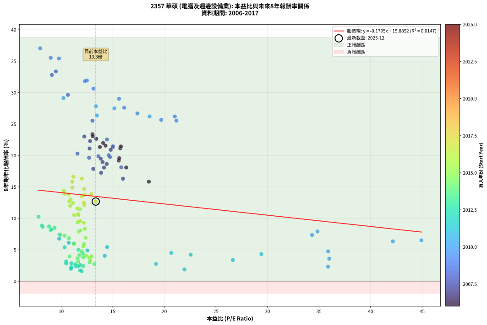
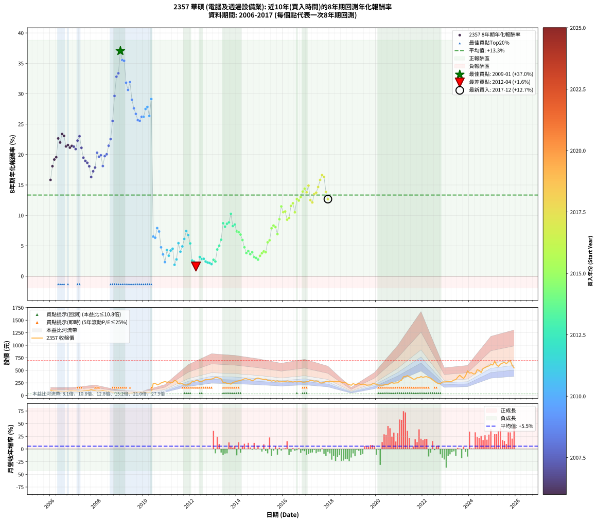

# 2357 華碩 - 本益比與未來報酬率分析

!!! info "報告資訊"
    - **股票代號**: 2357
    - **公司名稱**: 華碩
    - **產業別**: 電腦及週邊設備業
    - **分析期間**: 2005-2017 (145 個數據點)
    - **資料來源**: Type 12 (ShowMonthlyK_ChartFlow) 月收盤價與本益比
    - **報酬率口徑**: 含現金股利 (簡化: 年度合計，假設每年7/1入帳)
    - **報告生成時間**: 2025-12-23 12:00:18 CST

## 📈 視覺化圖表

### 圖表1: 本益比 vs 未來報酬率關係

*圖表1：2357 華碩 本益比與8年期未來報酬率關係 (2005-2017)*

### 圖表2: 歷年買入時點的8年期實際報酬率

*圖表2：2357 華碩 歷年買入時點的8年期實際報酬率 (2005-2017)*

## 📍 買點訊號說明

本報告提供兩種買點提示訊號（顯示於圖表2的股價子圖中）：

### ▲ 小綠色三角形（回測驗證）
- **計算方式**: 使用全部歷史資料計算本益比第25百分位數
- **用途**: 事後驗證，顯示歷史上哪些時點確實為低估區
- **限制**: 當下無法判斷，僅供回測參考
- **特性**: 後見之明（Look-Ahead Bias）

### ▲ 小橘色三角形（即時訊號）
- **計算方式**: 使用截至當月的過去5年資料計算本益比第25百分位數
- **用途**: 實際投資決策，當時即可判斷
- **優勢**: 可操作性強，符合實務需求
- **特性**: 無後見之明，滾動窗口計算

!!! tip "如何使用兩種訊號"
    - **綠色▲** 幫助理解歷史估值機會，驗證策略有效性
    - **橘色▲** 可作為實際買進參考，但仍需搭配基本面分析
    - 兩種訊號重疊時，表示即時判斷與事後驗證一致，信心度較高
    - 僅有綠色▲時，表示當時無法判斷（需要未來資料才能確認）
    - 僅有橘色▲時，表示即時判斷為買點，但事後可能不是最佳時機

## 📊 估值分析摘要

| 指標 | 數值 |
|:---:|:---:|
| **目前本益比** (2017-12) | **13.35 倍** |
| **歷史平均本益比** | 14.22 倍 |
| **估值水準** | 🟡 合理範圍 |
| **預期8年年化報酬率** | **+13.52%** |
| **歷史平均報酬率** | +13.37% |
| **相關係數 (R²)** | 0.0135 |
| **趨勢線斜率** | -0.1711 |

!!! abstract "核心洞察"
    目前本益比接近歷史平均，預期報酬率符合長期趨勢

    根據歷史數據回測，2357 華碩 在目前本益比 **13.3倍** 的估值水準下，
    預期未來8年年化報酬率約為 **+13.5%**。

    **重要提醒**: 本分析基於歷史數據統計，實際報酬率會受到公司基本面變化、產業趨勢、
    總體經濟環境等多重因素影響。R² = 0.01 表示本益比可解釋約 1.3% 的報酬率變異。

## 📈 歷史估值統計

### 最佳買點 (最高報酬率)

| 項目 | 數值 |
|:---:|:---:|
| 起始時間 | 2009-01 |
| 當時本益比 | 7.96 倍 |
| 起始價格 | 30.2 元 |
| 8年後價格 | 273.0 元 |
| **8年年化報酬率** | **+37.04%** |

### 最差買點 (最低報酬率)

| 項目 | 數值 |
|:---:|:---:|
| 起始時間 | 2012-04 |
| 當時本益比 | 11.99 倍 |
| 起始價格 | 295.0 元 |
| 8年後價格 | 202.5 元 |
| **8年年化報酬率** | **+1.59%** |

## 🎯 投資啟示

### 本益比與報酬率關係

趨勢線方程式: **y = -0.1711x + 15.8023**

!!! note "負相關"
    本益比與未來報酬率呈現負相關。較低的本益比通常帶來較高的未來報酬率，
    但相關性不算非常強。**估值仍是重要參考指標之一**。

### 估值區間建議

基於歷史數據分析:

- **🟢 低估區** (P/E < 11.4): 預期報酬率較高，可考慮增加持股
- **🟡 合理區** (P/E 11.4-17.1): 預期報酬率符合長期趨勢，正常持有
- **🔴 高估區** (P/E > 17.1): 預期報酬率較低，可考慮減碼或觀望

!!! danger "風險提示"
    - 過去表現不代表未來結果
    - 本分析假設公司基本面無重大結構性變化
    - 產業環境劇變可能使歷史規律失效
    - 應結合公司財報、產業趨勢、總體經濟等多重因素綜合判斷

!!! success "長期投資觀點"
    歷史數據顯示，在合理或低估的估值水準買入並長期持有，
    往往能獲得較佳的投資報酬。**耐心等待好價格**是價值投資的核心原則。

## 📊 數據品質

- **資料來源**: GoodInfo.tw Type 12 (ShowMonthlyK_ChartFlow)
- **資料頻率**: 月度收盤價與本益比
- **回測期間**: 2005-2017
- **數據點數量**: 145 個 (每個點代表一次8年期回測)

### 計算方法說明

1. **8年期年化報酬率**:
   - 對每個歷史時點，計算其後8年的實際投資報酬率
   - 期末價值(不含股利): 期末價格
   - 期末價值(含現金股利): 期末價格 + 持有期間內的現金股利合計 (簡化: 年度合計，假設每年7/1入帳)
   - 公式: 年化報酬率 = [(期末價值/期初價格)^(1/年數) - 1] × 100%

2. **本益比 (P/E Ratio)**:
   - 使用當時的月收盤價與EPS計算
   - 資料來源: Type 12 月度河流圖本益比數據

3. **趨勢線 (Linear Regression)**:
   - 使用最小平方法擬合線性趨勢線
   - R²值衡量本益比對報酬率的解釋能力

---

*本報告由 Stock Analysis System v1.9.0 自動生成*
*數據更新時間: 2025-12-23 12:00:18 CST*

## 📋 月度回測明細表

（每一列對應時間線圖中的一個買入點；可用來對照 SVG 圖上的每個點。）

| 買入月份 | 賣出月份 | 回測期限_年 | 實際持有年數 | 買入本益比_倍 | 買入收盤價_元 | 賣出收盤價_元 | 現金股利合計_元 | 總報酬率_pct | 年化報酬率_pct |
| --- | --- | --- | --- | --- | --- | --- | --- | --- | --- |
| 2005-12 | 2013-12 | 8 | 8.000 | 18.94 | 101.00 | 268.00 | 56.75 | +221.54 | +15.72 |
| 2006-01 | 2014-01 | 8 | 8.000 | 19.50 | 104.50 | 282.00 | 56.75 | +224.17 | +15.84 |
| 2006-02 | 2014-02 | 8 | 8.000 | 17.10 | 92.10 | 291.50 | 56.75 | +278.13 | +18.09 |
| 2006-03 | 2014-03 | 8 | 8.000 | 16.26 | 88.00 | 301.50 | 56.75 | +307.11 | +19.18 |
| 2006-04 | 2014-04 | 8 | 8.000 | 16.24 | 88.30 | 312.00 | 56.75 | +317.61 | +19.56 |
| 2006-05 | 2014-05 | 8 | 8.000 | 13.85 | 75.70 | 331.00 | 56.75 | +412.22 | +22.65 |
| 2006-06 | 2014-06 | 8 | 8.000 | 14.48 | 79.50 | 333.00 | 56.75 | +390.26 | +21.98 |
| 2006-07 | 2014-07 | 8 | 8.000 | 13.34 | 73.60 | 320.00 | 75.25 | +437.03 | +23.38 |
| 2006-08 | 2014-08 | 8 | 8.000 | 13.31 | 73.80 | 313.00 | 75.25 | +426.09 | +23.06 |
| 2006-09 | 2014-09 | 8 | 8.000 | 13.95 | 77.70 | 290.00 | 75.25 | +370.08 | +21.34 |
| 2006-10 | 2014-10 | 8 | 8.000 | 14.44 | 80.80 | 310.00 | 75.25 | +376.80 | +21.56 |
| 2006-11 | 2014-11 | 8 | 8.000 | 15.81 | 88.90 | 337.00 | 75.25 | +363.73 | +21.14 |
| 2006-12 | 2014-12 | 8 | 8.000 | 15.79 | 89.20 | 346.50 | 75.25 | +372.82 | +21.43 |
| 2007-01 | 2015-01 | 8 | 8.000 | 15.00 | 87.00 | 332.50 | 75.25 | +368.68 | +21.30 |
| 2007-02 | 2015-02 | 8 | 8.000 | 14.80 | 88.00 | 326.50 | 75.25 | +356.54 | +20.90 |
| 2007-03 | 2015-03 | 8 | 8.000 | 12.80 | 78.00 | 315.00 | 75.25 | +400.33 | +22.29 |
| 2007-04 | 2015-04 | 8 | 8.000 | 12.24 | 76.40 | 325.50 | 75.25 | +424.55 | +23.02 |
| 2007-05 | 2015-05 | 8 | 8.000 | 12.75 | 81.50 | 302.00 | 75.25 | +362.89 | +21.11 |
| 2007-06 | 2015-06 | 8 | 8.000 | 13.83 | 90.40 | 300.50 | 75.25 | +315.66 | +19.49 |
| 2007-07 | 2015-07 | 8 | 8.000 | 14.01 | 93.70 | 285.00 | 90.76 | +301.03 | +18.96 |
| 2007-08 | 2015-08 | 8 | 8.000 | 14.41 | 98.50 | 296.00 | 90.76 | +292.65 | +18.65 |
| 2007-09 | 2015-09 | 8 | 8.000 | 14.15 | 98.80 | 282.50 | 90.76 | +277.80 | +18.07 |
| 2007-10 | 2015-10 | 8 | 8.000 | 15.99 | 114.00 | 291.00 | 90.76 | +234.88 | +16.31 |
| 2007-11 | 2015-11 | 8 | 8.000 | 13.87 | 101.00 | 270.00 | 90.76 | +257.19 | +17.25 |
| 2007-12 | 2015-12 | 8 | 8.000 | 13.11 | 97.40 | 272.00 | 90.76 | +272.45 | +17.86 |
| 2008-01 | 2016-01 | 8 | 8.000 | 11.58 | 82.60 | 271.50 | 90.76 | +338.57 | +20.30 |
| 2008-02 | 2016-02 | 8 | 8.000 | 12.70 | 86.80 | 273.50 | 90.76 | +319.66 | +19.64 |
| 2008-03 | 2016-03 | 8 | 8.000 | 13.61 | 89.00 | 289.00 | 90.76 | +326.70 | +19.89 |
| 2008-04 | 2016-04 | 8 | 8.000 | 15.82 | 98.80 | 283.50 | 90.76 | +278.81 | +18.11 |
| 2008-05 | 2016-05 | 8 | 8.000 | 14.74 | 87.70 | 280.00 | 90.76 | +322.76 | +19.75 |
| 2008-06 | 2016-06 | 8 | 8.000 | 14.61 | 82.60 | 265.50 | 90.76 | +331.31 | +20.05 |
| 2008-07 | 2016-07 | 8 | 8.000 | 15.01 | 80.40 | 277.50 | 103.27 | +373.59 | +21.46 |
| 2008-08 | 2016-08 | 8 | 8.000 | 14.44 | 73.10 | 268.50 | 103.27 | +408.58 | +22.54 |
| 2008-09 | 2016-09 | 8 | 8.000 | 13.03 | 62.10 | 279.50 | 103.27 | +516.38 | +25.53 |
| 2008-10 | 2016-10 | 8 | 8.000 | 10.65 | 47.60 | 276.50 | 103.27 | +697.84 | +29.64 |
| 2008-11 | 2016-11 | 8 | 8.000 | 9.09 | 37.95 | 264.00 | 103.27 | +867.77 | +32.81 |
| 2008-12 | 2016-12 | 8 | 8.000 | 9.48 | 36.80 | 265.00 | 103.27 | +900.73 | +33.36 |
| 2009-01 | 2017-01 | 8 | 8.000 | 7.96 | 30.25 | 273.00 | 103.27 | +1143.87 | +37.04 |
| 2009-02 | 2017-02 | 8 | 8.000 | 8.98 | 33.45 | 277.50 | 103.27 | +1038.33 | +35.53 |
| 2009-03 | 2017-03 | 8 | 8.000 | 9.78 | 35.65 | 300.00 | 103.27 | +1031.19 | +35.42 |
| 2009-04 | 2017-04 | 8 | 8.000 | 12.29 | 43.85 | 296.50 | 103.27 | +811.68 | +31.82 |
| 2009-05 | 2017-05 | 8 | 8.000 | 13.13 | 45.80 | 285.00 | 103.27 | +747.75 | +30.63 |
| 2009-06 | 2017-06 | 8 | 8.000 | 12.49 | 42.60 | 287.50 | 103.27 | +817.30 | +31.92 |
| 2009-07 | 2017-07 | 8 | 8.000 | 15.61 | 52.00 | 281.00 | 118.27 | +667.83 | +29.02 |
| 2009-08 | 2017-08 | 8 | 8.000 | 16.11 | 52.40 | 250.00 | 118.27 | +602.81 | +27.60 |
| 2009-09 | 2017-09 | 8 | 8.000 | 17.39 | 55.20 | 248.00 | 118.27 | +563.53 | +26.69 |
| 2009-10 | 2017-10 | 8 | 8.000 | 19.70 | 61.00 | 261.00 | 118.27 | +521.75 | +25.66 |
| 2009-11 | 2017-11 | 8 | 8.000 | 21.17 | 63.90 | 276.00 | 118.27 | +517.01 | +25.54 |
| 2009-12 | 2017-12 | 8 | 8.000 | 21.02 | 61.80 | 279.50 | 118.27 | +543.64 | +26.21 |
| 2010-01 | 2018-01 | 8 | 8.000 | 18.57 | 62.00 | 281.00 | 118.27 | +543.98 | +26.21 |
| 2010-02 | 2018-02 | 8 | 8.000 | 15.15 | 56.60 | 277.00 | 118.27 | +598.36 | +27.50 |
| 2010-03 | 2018-03 | 8 | 8.000 | 13.37 | 55.30 | 276.00 | 118.27 | +612.97 | +27.83 |
| 2010-04 | 2018-04 | 8 | 8.000 | 13.46 | 61.00 | 278.00 | 118.27 | +549.62 | +26.35 |
| 2010-05 | 2018-05 | 8 | 8.000 | 10.22 | 50.40 | 271.50 | 118.27 | +673.35 | +29.14 |
| 2010-06 | 2018-06 | 8 | 8.000 | 44.93 | 239.50 | 278.50 | 118.27 | +65.67 | +6.51 |
| 2010-07 | 2018-07 | 8 | 8.000 | 42.16 | 241.50 | 263.50 | 131.17 | +63.42 | +6.33 |
| 2010-08 | 2018-08 | 8 | 8.000 | 34.85 | 213.50 | 261.50 | 131.17 | +83.92 | +7.91 |
| 2010-09 | 2018-09 | 8 | 8.000 | 34.33 | 224.00 | 264.00 | 131.17 | +76.42 | +7.35 |
| 2010-10 | 2018-10 | 8 | 8.000 | 35.89 | 248.50 | 229.00 | 131.17 | +44.94 | +4.75 |
| 2010-11 | 2018-11 | 8 | 8.000 | 35.99 | 263.50 | 218.00 | 131.17 | +32.51 | +3.58 |
| 2010-12 | 2018-12 | 8 | 8.000 | 35.88 | 277.00 | 201.50 | 131.17 | +20.10 | +2.32 |
| 2011-01 | 2019-01 | 8 | 8.000 | 29.41 | 262.00 | 236.00 | 131.17 | +40.14 | +4.31 |
| 2011-02 | 2019-02 | 8 | 8.000 | 26.64 | 269.00 | 219.50 | 131.17 | +30.36 | +3.37 |
| 2011-03 | 2019-03 | 8 | 8.000 | 22.55 | 254.50 | 223.00 | 131.17 | +39.16 | +4.22 |
| 2011-04 | 2019-04 | 8 | 8.000 | 20.68 | 258.00 | 236.00 | 131.17 | +42.31 | +4.51 |
| 2011-05 | 2019-05 | 8 | 8.000 | 21.95 | 300.00 | 217.00 | 131.17 | +16.06 | +1.88 |
| 2011-06 | 2019-06 | 8 | 8.000 | 19.19 | 285.00 | 223.00 | 131.17 | +24.27 | +2.75 |
| 2011-07 | 2019-07 | 8 | 8.000 | 14.46 | 232.00 | 222.00 | 132.17 | +52.66 | +5.43 |
| 2011-08 | 2019-08 | 8 | 8.000 | 14.22 | 245.00 | 204.00 | 132.17 | +37.21 | +4.03 |
| 2011-09 | 2019-09 | 8 | 8.000 | 12.54 | 231.00 | 206.50 | 132.17 | +46.61 | +4.90 |
| 2011-10 | 2019-10 | 8 | 8.000 | 10.73 | 210.50 | 206.50 | 132.17 | +60.89 | +6.12 |
| 2011-11 | 2019-11 | 8 | 8.000 | 9.83 | 204.50 | 230.50 | 132.17 | +77.34 | +7.42 |
| 2011-12 | 2019-12 | 8 | 8.000 | 9.80 | 215.50 | 231.50 | 132.17 | +68.76 | +6.76 |
| 2012-01 | 2020-01 | 8 | 8.000 | 10.33 | 234.00 | 224.00 | 132.17 | +52.21 | +5.39 |
| 2012-02 | 2020-02 | 8 | 8.000 | 11.85 | 276.00 | 206.00 | 132.17 | +22.53 | +2.57 |
| 2012-03 | 2020-03 | 8 | 8.000 | 11.63 | 278.50 | 204.50 | 132.17 | +20.89 | +2.40 |
| 2012-04 | 2020-04 | 8 | 8.000 | 11.99 | 295.00 | 202.50 | 132.17 | +13.45 | +1.59 |
| 2012-05 | 2020-05 | 8 | 8.000 | 11.84 | 299.00 | 210.50 | 132.17 | +14.61 | +1.72 |
| 2012-06 | 2020-06 | 8 | 8.000 | 10.48 | 271.50 | 216.00 | 132.17 | +28.24 | +3.16 |
| 2012-07 | 2020-07 | 8 | 8.000 | 10.48 | 278.50 | 216.50 | 131.67 | +25.02 | +2.83 |
| 2012-08 | 2020-08 | 8 | 8.000 | 10.98 | 299.00 | 243.00 | 131.67 | +25.31 | +2.86 |
| 2012-09 | 2020-09 | 8 | 8.000 | 11.42 | 318.50 | 253.50 | 131.67 | +20.93 | +2.40 |
| 2012-10 | 2020-10 | 8 | 8.000 | 10.97 | 313.00 | 242.50 | 131.67 | +19.54 | +2.26 |
| 2012-11 | 2020-11 | 8 | 8.000 | 10.98 | 320.50 | 249.00 | 131.67 | +18.77 | +2.17 |
| 2012-12 | 2020-12 | 8 | 8.000 | 10.94 | 326.50 | 250.50 | 131.67 | +17.05 | +1.99 |
| 2013-01 | 2021-01 | 8 | 8.000 | 11.36 | 338.00 | 286.50 | 131.67 | +23.72 | +2.70 |
| 2013-02 | 2021-02 | 8 | 8.000 | 12.14 | 360.00 | 304.00 | 131.67 | +21.02 | +2.41 |
| 2013-03 | 2021-03 | 8 | 8.000 | 12.10 | 357.50 | 372.50 | 131.67 | +41.03 | +4.39 |
| 2013-04 | 2021-04 | 8 | 8.000 | 11.67 | 343.50 | 376.00 | 131.67 | +47.79 | +5.00 |
| 2013-05 | 2021-05 | 8 | 8.000 | 11.26 | 330.50 | 395.00 | 131.67 | +59.36 | +6.00 |
| 2013-06 | 2021-06 | 8 | 8.000 | 8.82 | 258.00 | 371.50 | 131.67 | +95.03 | +8.71 |
| 2013-07 | 2021-07 | 8 | 8.000 | 8.99 | 262.00 | 351.00 | 138.50 | +86.83 | +8.13 |
| 2013-08 | 2021-08 | 8 | 8.000 | 8.21 | 238.50 | 324.00 | 138.50 | +93.92 | +8.63 |
| 2013-09 | 2021-09 | 8 | 8.000 | 8.13 | 235.50 | 325.50 | 138.50 | +97.03 | +8.85 |
| 2013-10 | 2021-10 | 8 | 8.000 | 7.80 | 225.00 | 353.00 | 138.50 | +118.44 | +10.26 |
| 2013-11 | 2021-11 | 8 | 8.000 | 9.06 | 260.50 | 352.50 | 138.50 | +88.48 | +8.25 |
| 2013-12 | 2021-12 | 8 | 8.000 | 9.35 | 268.00 | 376.00 | 138.50 | +91.98 | +8.49 |
| 2014-01 | 2022-01 | 8 | 8.000 | 9.91 | 282.00 | 359.50 | 138.50 | +76.60 | +7.37 |
| 2014-02 | 2022-02 | 8 | 8.000 | 10.32 | 291.50 | 371.50 | 138.50 | +74.96 | +7.24 |
| 2014-03 | 2022-03 | 8 | 8.000 | 10.75 | 301.50 | 373.50 | 138.50 | +69.82 | +6.84 |
| 2014-04 | 2022-04 | 8 | 8.000 | 11.21 | 312.00 | 357.00 | 138.50 | +58.81 | +5.95 |
| 2014-05 | 2022-05 | 8 | 8.000 | 11.98 | 331.00 | 341.50 | 138.50 | +45.02 | +4.76 |
| 2014-06 | 2022-06 | 8 | 8.000 | 12.14 | 333.00 | 310.50 | 138.50 | +34.83 | +3.81 |
| 2014-07 | 2022-07 | 8 | 8.000 | 11.75 | 320.00 | 281.50 | 161.00 | +38.28 | +4.13 |
| 2014-08 | 2022-08 | 8 | 8.000 | 11.58 | 313.00 | 255.00 | 161.00 | +32.91 | +3.62 |
| 2014-09 | 2022-09 | 8 | 8.000 | 10.81 | 290.00 | 234.00 | 161.00 | +36.21 | +3.94 |
| 2014-10 | 2022-10 | 8 | 8.000 | 11.65 | 310.00 | 236.00 | 161.00 | +28.06 | +3.14 |
| 2014-11 | 2022-11 | 8 | 8.000 | 12.76 | 337.00 | 266.00 | 161.00 | +26.71 | +3.00 |
| 2014-12 | 2022-12 | 8 | 8.000 | 13.22 | 346.50 | 268.50 | 161.00 | +23.95 | +2.72 |
| 2015-01 | 2023-01 | 8 | 8.000 | 12.82 | 332.50 | 272.00 | 161.00 | +30.23 | +3.36 |
| 2015-02 | 2023-02 | 8 | 8.000 | 12.71 | 326.50 | 278.00 | 161.00 | +34.46 | +3.77 |
| 2015-03 | 2023-03 | 8 | 8.000 | 12.40 | 315.00 | 272.50 | 161.00 | +37.62 | +4.07 |
| 2015-04 | 2023-04 | 8 | 8.000 | 12.94 | 325.50 | 282.50 | 161.00 | +36.25 | +3.94 |
| 2015-05 | 2023-05 | 8 | 8.000 | 12.14 | 302.00 | 305.00 | 161.00 | +54.30 | +5.57 |
| 2015-06 | 2023-06 | 8 | 8.000 | 12.21 | 300.50 | 314.50 | 161.00 | +58.24 | +5.90 |
| 2015-07 | 2023-07 | 8 | 8.000 | 11.70 | 285.00 | 364.00 | 159.00 | +83.51 | +7.88 |
| 2015-08 | 2023-08 | 8 | 8.000 | 12.29 | 296.00 | 402.50 | 159.00 | +89.70 | +8.33 |
| 2015-09 | 2023-09 | 8 | 8.000 | 11.86 | 282.50 | 367.00 | 159.00 | +86.19 | +8.08 |
| 2015-10 | 2023-10 | 8 | 8.000 | 12.36 | 291.00 | 338.00 | 159.00 | +70.79 | +6.92 |
| 2015-11 | 2023-11 | 8 | 8.000 | 11.60 | 270.00 | 393.50 | 159.00 | +104.63 | +9.36 |
| 2015-12 | 2023-12 | 8 | 8.000 | 11.82 | 272.00 | 489.50 | 159.00 | +138.42 | +11.47 |
| 2016-01 | 2024-01 | 8 | 8.000 | 11.67 | 271.50 | 445.50 | 159.00 | +122.65 | +10.52 |
| 2016-02 | 2024-02 | 8 | 8.000 | 11.64 | 273.50 | 455.00 | 159.00 | +124.50 | +10.64 |
| 2016-03 | 2024-03 | 8 | 8.000 | 12.18 | 289.00 | 429.50 | 159.00 | +103.63 | +9.30 |
| 2016-04 | 2024-04 | 8 | 8.000 | 11.83 | 283.50 | 430.00 | 159.00 | +107.76 | +9.57 |
| 2016-05 | 2024-05 | 8 | 8.000 | 11.57 | 280.00 | 513.00 | 159.00 | +140.00 | +11.56 |
| 2016-06 | 2024-06 | 8 | 8.000 | 10.87 | 265.50 | 498.00 | 159.00 | +147.46 | +11.99 |
| 2016-07 | 2024-07 | 8 | 8.000 | 11.25 | 277.50 | 456.00 | 161.00 | +122.34 | +10.50 |
| 2016-08 | 2024-08 | 8 | 8.000 | 10.78 | 268.50 | 537.00 | 161.00 | +159.96 | +12.68 |
| 2016-09 | 2024-09 | 8 | 8.000 | 11.12 | 279.50 | 553.00 | 161.00 | +155.46 | +12.44 |
| 2016-10 | 2024-10 | 8 | 8.000 | 10.90 | 276.50 | 575.00 | 161.00 | +166.18 | +13.02 |
| 2016-11 | 2024-11 | 8 | 8.000 | 10.31 | 264.00 | 588.00 | 161.00 | +183.71 | +13.92 |
| 2016-12 | 2024-12 | 8 | 8.000 | 10.25 | 265.00 | 616.00 | 161.00 | +193.21 | +14.39 |
| 2017-01 | 2025-01 | 8 | 8.000 | 10.73 | 273.00 | 607.00 | 161.00 | +181.32 | +13.80 |
| 2017-02 | 2025-02 | 8 | 8.000 | 11.09 | 277.50 | 682.00 | 161.00 | +203.78 | +14.90 |
| 2017-03 | 2025-03 | 8 | 8.000 | 12.19 | 300.00 | 609.00 | 161.00 | +156.67 | +12.50 |
| 2017-04 | 2025-04 | 8 | 8.000 | 12.25 | 296.50 | 580.00 | 161.00 | +149.92 | +12.13 |
| 2017-05 | 2025-05 | 8 | 8.000 | 11.97 | 285.00 | 625.00 | 161.00 | +175.79 | +13.52 |
| 2017-06 | 2025-06 | 8 | 8.000 | 12.29 | 287.50 | 644.00 | 161.00 | +180.00 | +13.74 |
| 2017-07 | 2025-07 | 8 | 8.000 | 12.23 | 281.00 | 662.00 | 178.00 | +198.93 | +14.67 |
| 2017-08 | 2025-08 | 8 | 8.000 | 11.08 | 250.00 | 632.00 | 178.00 | +224.00 | +15.83 |
| 2017-09 | 2025-09 | 8 | 8.000 | 11.19 | 248.00 | 671.00 | 178.00 | +242.34 | +16.63 |
| 2017-10 | 2025-10 | 8 | 8.000 | 12.00 | 261.00 | 697.00 | 178.00 | +235.25 | +16.32 |
| 2017-11 | 2025-11 | 8 | 8.000 | 12.93 | 276.00 | 601.00 | 178.00 | +182.25 | +13.85 |
| 2017-12 | 2025-12 | 8 | 8.000 | 13.35 | 279.50 | 607.00 | 178.00 | +180.86 | +13.78 |
