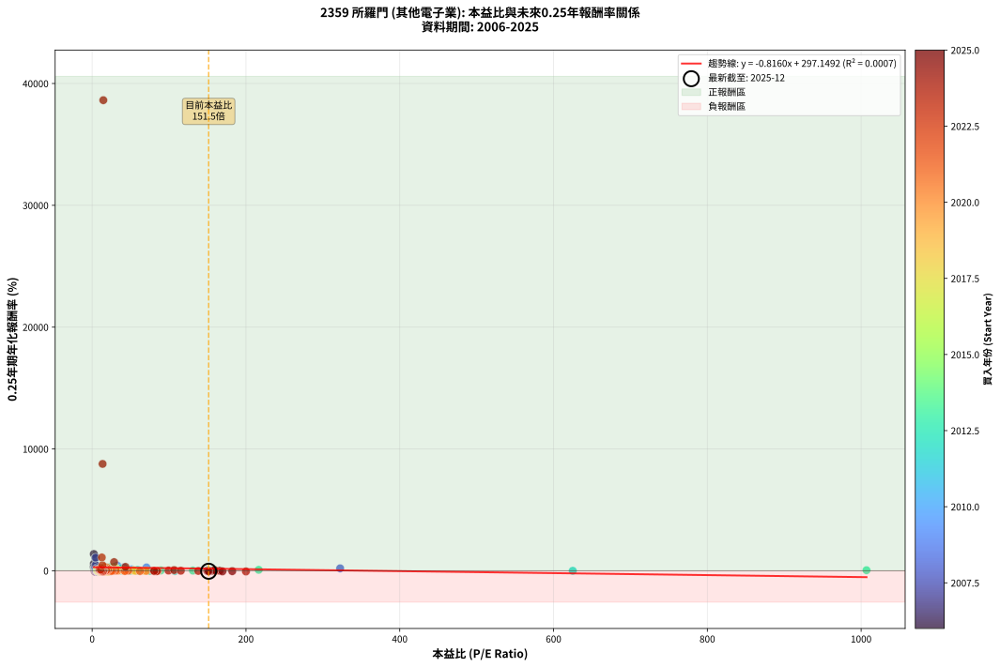
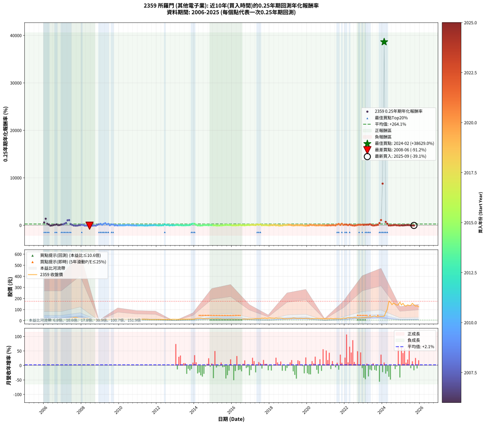

# 2359 所羅門 - 本益比與未來報酬率分析

!!! info "報告資訊"
    - **股票代號**: 2359
    - **公司名稱**: 所羅門
    - **產業別**: 其他電子業
    - **分析期間**: 2006-2025 (237 個數據點)
    - **資料來源**: Type 12 (ShowMonthlyK_ChartFlow) 月收盤價與本益比
    - **報酬率口徑**: 含現金股利 (簡化: 年度合計，假設每年7/1入帳)
    - **報告生成時間**: 2026-01-07 18:31:48 CST

## 📈 視覺化圖表

### 圖表1: 本益比 vs 未來報酬率關係

*圖表1：2359 所羅門 本益比與0.25年期未來報酬率關係 (2006-2025)*

### 圖表2: 歷年買入時點的0.25年期實際報酬率

*圖表2：2359 所羅門 歷年買入時點的0.25年期實際報酬率 (2006-2025)*

## 📍 買點訊號說明

本報告提供兩種買點提示訊號（顯示於圖表2的股價子圖中）：

### ▲ 小綠色三角形（回測驗證）
- **計算方式**: 使用全部歷史資料計算本益比第25百分位數
- **用途**: 事後驗證，顯示歷史上哪些時點確實為低估區
- **限制**: 當下無法判斷，僅供回測參考
- **特性**: 後見之明（Look-Ahead Bias）

### ▲ 小橘色三角形（即時訊號）
- **計算方式**: 使用截至當月的過去5年資料計算本益比第25百分位數
- **用途**: 實際投資決策，當時即可判斷
- **優勢**: 可操作性強，符合實務需求
- **特性**: 無後見之明，滾動窗口計算

!!! tip "如何使用兩種訊號"
    - **綠色▲** 幫助理解歷史估值機會，驗證策略有效性
    - **橘色▲** 可作為實際買進參考，但仍需搭配基本面分析
    - 兩種訊號重疊時，表示即時判斷與事後驗證一致，信心度較高
    - 僅有綠色▲時，表示當時無法判斷（需要未來資料才能確認）
    - 僅有橘色▲時，表示即時判斷為買點，但事後可能不是最佳時機

## 📊 估值分析摘要

| 指標 | 數值 |
|:---:|:---:|
| **目前本益比** (2025-09) | **151.50 倍** |
| **歷史平均本益比** | 39.20 倍 |
| **估值水準** | 🔴 相對高估 |
| **預期0.25年年化報酬率** | **+173.53%** |
| **歷史平均報酬率** | +264.09% |
| **相關係數 (R²)** | 0.0007 |
| **趨勢線斜率** | -0.8160 |

!!! abstract "核心洞察"
    目前本益比顯著高於歷史平均，預期未來報酬率可能較低

    根據歷史數據回測，2359 所羅門 在目前本益比 **151.5倍** 的估值水準下，
    預期未來0.25年年化報酬率約為 **+173.5%**。

    **重要提醒**: 本分析基於歷史數據統計，實際報酬率會受到公司基本面變化、產業趨勢、
    總體經濟環境等多重因素影響。R² = 0.00 表示本益比可解釋約 0.1% 的報酬率變異。

## 📈 歷史估值統計

### 最佳買點 (最高報酬率)

| 項目 | 數值 |
|:---:|:---:|
| 起始時間 | 2024-02 |
| 當時本益比 | 14.51 倍 |
| 起始價格 | 39.6 元 |
| 0.25年後價格 | 175.0 元 |
| **0.25年年化報酬率** | **+38629.02%** |

### 最差買點 (最低報酬率)

| 項目 | 數值 |
|:---:|:---:|
| 起始時間 | 2008-06 |
| 當時本益比 | 7.25 倍 |
| 起始價格 | 14.6 元 |
| 0.25年後價格 | 7.9 元 |
| **0.25年年化報酬率** | **-91.22%** |

## 🎯 投資啟示

### 本益比與報酬率關係

趨勢線方程式: **y = -0.8160x + 297.1492**

!!! warning "強負相關"
    本益比與未來報酬率呈現強負相關。在高本益比時期買入，未來報酬率顯著較低；
    在低本益比時期買入，未來報酬率顯著較高。**估值紀律至關重要**。

### 估值區間建議

基於歷史數據分析:

- **🟢 低估區** (P/E < 31.4): 預期報酬率較高，可考慮增加持股
- **🟡 合理區** (P/E 31.4-47.0): 預期報酬率符合長期趨勢，正常持有
- **🔴 高估區** (P/E > 47.0): 預期報酬率較低，可考慮減碼或觀望

!!! danger "風險提示"
    - 過去表現不代表未來結果
    - 本分析假設公司基本面無重大結構性變化
    - 產業環境劇變可能使歷史規律失效
    - 應結合公司財報、產業趨勢、總體經濟等多重因素綜合判斷

!!! success "長期投資觀點"
    歷史數據顯示，在合理或低估的估值水準買入並長期持有，
    往往能獲得較佳的投資報酬。**耐心等待好價格**是價值投資的核心原則。

## 📊 數據品質

- **資料來源**: GoodInfo.tw Type 12 (ShowMonthlyK_ChartFlow)
- **資料頻率**: 月度收盤價與本益比
- **回測期間**: 2006-2025
- **數據點數量**: 237 個 (每個點代表一次0.25年期回測)

### 計算方法說明

1. **0.25年期年化報酬率**:
   - 對每個歷史時點，計算其後0.25年的實際投資報酬率
   - 期末價值(不含股利): 期末價格
   - 期末價值(含現金股利): 期末價格 + 持有期間內的現金股利合計 (簡化: 年度合計，假設每年7/1入帳)
   - 公式: 年化報酬率 = [(期末價值/期初價格)^(1/年數) - 1] × 100%

2. **本益比 (P/E Ratio)**:
   - 使用當時的月收盤價與EPS計算
   - 資料來源: Type 12 月度河流圖本益比數據

3. **趨勢線 (Linear Regression)**:
   - 使用最小平方法擬合線性趨勢線
   - R²值衡量本益比對報酬率的解釋能力

---

*本報告由 Stock Analysis System v1.9.0 自動生成*
*數據更新時間: 2026-01-07 18:31:48 CST*

## 📋 月度回測明細表

（每一列對應時間線圖中的一個買入點；可用來對照 SVG 圖上的每個點。）

| 買入月份 | 賣出月份 | 回測期限_年 | 實際持有年數 | 買入本益比_倍 | 買入收盤價_元 | 賣出收盤價_元 | 現金股利合計_元 | 總報酬率_pct | 年化報酬率_pct |
| --- | --- | --- | --- | --- | --- | --- | --- | --- | --- |
| 2006-01 | 2006-05 | 0.25 | 0.329 | 2.25 | 6.00 | 11.30 | 0.00 | +88.33 | +586.77 |
| 2006-02 | 2006-05 | 0.25 | 0.246 | 2.18 | 5.82 | 11.30 | 0.00 | +94.16 | +1377.17 |
| 2006-03 | 2006-07 | 0.25 | 0.334 | 2.12 | 5.66 | 9.09 | 0.00 | +60.60 | +313.03 |
| 2006-04 | 2006-07 | 0.25 | 0.249 | 2.70 | 7.20 | 9.09 | 0.00 | +26.25 | +154.87 |
| 2006-05 | 2006-08 | 0.25 | 0.252 | 4.23 | 11.30 | 8.24 | 0.00 | -27.08 | -71.46 |
| 2006-06 | 2006-09 | 0.25 | 0.252 | 3.48 | 9.30 | 8.13 | 0.00 | -12.58 | -41.36 |
| 2006-07 | 2006-10 | 0.25 | 0.252 | 3.40 | 9.09 | 10.00 | 0.00 | +10.01 | +46.05 |
| 2006-08 | 2006-12 | 0.25 | 0.334 | 3.09 | 8.24 | 10.45 | 0.00 | +26.82 | +103.67 |
| 2006-09 | 2006-12 | 0.25 | 0.249 | 3.04 | 8.13 | 10.45 | 0.00 | +28.54 | +173.91 |
| 2006-10 | 2007-01 | 0.25 | 0.252 | 3.75 | 10.00 | 10.55 | 0.00 | +5.50 | +23.68 |
| 2006-11 | 2007-03 | 0.25 | 0.329 | 4.27 | 11.40 | 13.20 | 0.00 | +15.79 | +56.24 |
| 2006-12 | 2007-03 | 0.25 | 0.246 | 3.91 | 10.45 | 13.20 | 0.00 | +26.32 | +158.08 |
| 2007-01 | 2007-05 | 0.25 | 0.329 | 3.79 | 10.55 | 14.70 | 0.00 | +39.34 | +174.47 |
| 2007-02 | 2007-05 | 0.25 | 0.246 | 3.54 | 10.25 | 14.70 | 0.00 | +43.41 | +332.02 |
| 2007-03 | 2007-07 | 0.25 | 0.334 | 4.39 | 13.20 | 23.70 | 0.00 | +79.55 | +476.71 |
| 2007-04 | 2007-07 | 0.25 | 0.249 | 4.14 | 12.90 | 23.70 | 0.00 | +83.72 | +1048.85 |
| 2007-05 | 2007-08 | 0.25 | 0.252 | 4.55 | 14.70 | 27.40 | 0.00 | +86.39 | +1084.81 |
| 2007-06 | 2007-09 | 0.25 | 0.252 | 6.38 | 21.30 | 28.80 | 0.00 | +35.21 | +231.23 |
| 2007-07 | 2007-10 | 0.25 | 0.252 | 6.87 | 23.70 | 27.20 | 0.00 | +14.77 | +72.78 |
| 2007-08 | 2007-12 | 0.25 | 0.334 | 7.69 | 27.40 | 19.30 | 0.00 | -29.56 | -64.98 |
| 2007-09 | 2007-12 | 0.25 | 0.249 | 7.84 | 28.80 | 19.30 | 0.00 | -32.99 | -79.94 |
| 2007-10 | 2008-01 | 0.25 | 0.252 | 7.18 | 27.20 | 17.15 | 0.00 | -36.95 | -83.98 |
| 2007-11 | 2008-03 | 0.25 | 0.331 | 5.40 | 21.05 | 20.40 | 0.00 | -3.09 | -9.03 |
| 2007-12 | 2008-03 | 0.25 | 0.249 | 4.81 | 19.30 | 20.40 | 0.00 | +5.70 | +24.92 |
| 2008-01 | 2008-05 | 0.25 | 0.331 | 4.66 | 17.15 | 22.00 | 0.00 | +28.28 | +112.07 |
| 2008-02 | 2008-05 | 0.25 | 0.249 | 6.01 | 20.10 | 22.00 | 0.00 | +9.45 | +43.70 |
| 2008-03 | 2008-07 | 0.25 | 0.334 | 6.77 | 20.40 | 13.10 | 0.00 | -35.78 | -73.45 |
| 2008-04 | 2008-07 | 0.25 | 0.249 | 6.88 | 18.45 | 13.10 | 0.00 | -29.00 | -74.70 |
| 2008-05 | 2008-08 | 0.25 | 0.252 | 9.37 | 22.00 | 13.10 | 0.00 | -40.45 | -87.23 |
| 2008-06 | 2008-09 | 0.25 | 0.252 | 7.25 | 14.60 | 7.91 | 0.00 | -45.82 | -91.22 |
| 2008-07 | 2008-10 | 0.25 | 0.252 | 7.79 | 13.10 | 7.95 | 0.00 | -39.31 | -86.23 |
| 2008-08 | 2008-12 | 0.25 | 0.334 | 9.70 | 13.10 | 6.45 | 0.00 | -50.76 | -88.01 |
| 2008-09 | 2008-12 | 0.25 | 0.249 | 7.77 | 7.91 | 6.45 | 0.00 | -18.46 | -55.91 |
| 2008-10 | 2009-01 | 0.25 | 0.252 | 11.61 | 7.95 | 5.77 | 0.00 | -27.42 | -71.98 |
| 2008-11 | 2009-03 | 0.25 | 0.329 | 19.12 | 6.74 | 8.45 | 0.00 | +25.37 | +99.02 |
| 2008-12 | 2009-03 | 0.25 | 0.246 | 322.50 | 6.45 | 8.45 | 0.00 | +31.01 | +199.25 |
| 2009-01 | 2009-05 | 0.25 | 0.329 | 70.65 | 5.77 | 8.90 | 0.00 | +54.25 | +274.00 |
| 2009-02 | 2009-05 | 0.25 | 0.246 | 51.56 | 7.39 | 8.90 | 0.00 | +20.43 | +112.66 |
| 2009-03 | 2009-07 | 0.25 | 0.334 | 41.22 | 8.45 | 13.20 | 0.00 | +56.21 | +280.16 |
| 2009-04 | 2009-07 | 0.25 | 0.249 | 32.78 | 8.74 | 13.20 | 0.00 | +51.03 | +423.25 |
| 2009-05 | 2009-08 | 0.25 | 0.252 | 27.11 | 8.90 | 11.65 | 0.00 | +30.90 | +191.24 |
| 2009-06 | 2009-09 | 0.25 | 0.252 | 23.41 | 9.13 | 12.75 | 0.00 | +39.65 | +276.55 |
| 2009-07 | 2009-10 | 0.25 | 0.252 | 29.23 | 13.20 | 13.55 | 0.00 | +2.65 | +10.95 |
| 2009-08 | 2009-12 | 0.25 | 0.334 | 22.69 | 11.65 | 16.20 | 0.00 | +39.06 | +168.34 |
| 2009-09 | 2009-12 | 0.25 | 0.249 | 22.17 | 12.75 | 16.20 | 0.00 | +27.06 | +161.49 |
| 2009-10 | 2010-01 | 0.25 | 0.252 | 21.28 | 13.55 | 13.05 | 0.00 | -3.69 | -13.87 |
| 2009-11 | 2010-03 | 0.25 | 0.329 | 19.98 | 13.95 | 14.50 | 0.00 | +3.94 | +12.49 |
| 2009-12 | 2010-03 | 0.25 | 0.246 | 21.32 | 16.20 | 14.50 | 0.00 | -10.49 | -36.23 |
| 2010-01 | 2010-05 | 0.25 | 0.329 | 17.48 | 13.05 | 12.90 | 0.00 | -1.15 | -3.46 |
| 2010-02 | 2010-05 | 0.25 | 0.246 | 17.86 | 13.10 | 12.90 | 0.00 | -1.53 | -6.05 |
| 2010-03 | 2010-07 | 0.25 | 0.334 | 20.14 | 14.50 | 14.10 | 0.00 | -2.76 | -8.03 |
| 2010-04 | 2010-07 | 0.25 | 0.249 | 20.73 | 14.65 | 14.10 | 0.00 | -3.75 | -14.24 |
| 2010-05 | 2010-08 | 0.25 | 0.252 | 18.61 | 12.90 | 13.35 | 0.00 | +3.49 | +14.58 |
| 2010-06 | 2010-09 | 0.25 | 0.252 | 19.56 | 13.30 | 15.05 | 0.00 | +13.16 | +63.36 |
| 2010-07 | 2010-10 | 0.25 | 0.252 | 21.15 | 14.10 | 14.65 | 0.00 | +3.90 | +16.41 |
| 2010-08 | 2010-12 | 0.25 | 0.334 | 20.43 | 13.35 | 14.40 | 0.00 | +7.87 | +25.44 |
| 2010-09 | 2010-12 | 0.25 | 0.249 | 23.52 | 15.05 | 14.40 | 0.00 | -4.32 | -16.24 |
| 2010-10 | 2011-01 | 0.25 | 0.252 | 23.38 | 14.65 | 14.30 | 0.00 | -2.39 | -9.15 |
| 2010-11 | 2011-03 | 0.25 | 0.329 | 23.48 | 14.40 | 12.95 | 0.00 | -10.07 | -27.61 |
| 2010-12 | 2011-03 | 0.25 | 0.246 | 24.00 | 14.40 | 12.95 | 0.00 | -10.07 | -35.00 |
| 2011-01 | 2011-05 | 0.25 | 0.329 | 23.93 | 14.30 | 13.05 | 0.00 | -8.74 | -24.30 |
| 2011-02 | 2011-05 | 0.25 | 0.246 | 22.52 | 13.40 | 13.05 | 0.00 | -2.61 | -10.18 |
| 2011-03 | 2011-07 | 0.25 | 0.334 | 21.86 | 12.95 | 12.30 | 0.30 | -2.70 | -7.88 |
| 2011-04 | 2011-07 | 0.25 | 0.249 | 22.29 | 13.15 | 12.30 | 0.30 | -4.18 | -15.76 |
| 2011-05 | 2011-08 | 0.25 | 0.252 | 22.21 | 13.05 | 10.30 | 0.30 | -18.77 | -56.20 |
| 2011-06 | 2011-09 | 0.25 | 0.252 | 21.11 | 12.35 | 10.05 | 0.30 | -16.19 | -50.41 |
| 2011-07 | 2011-10 | 0.25 | 0.252 | 21.12 | 12.30 | 10.05 | 0.00 | -18.29 | -55.16 |
| 2011-08 | 2011-12 | 0.25 | 0.334 | 17.76 | 10.30 | 9.95 | 0.00 | -3.40 | -9.83 |
| 2011-09 | 2011-12 | 0.25 | 0.249 | 17.40 | 10.05 | 9.95 | 0.00 | -1.00 | -3.93 |
| 2011-10 | 2012-01 | 0.25 | 0.252 | 17.48 | 10.05 | 10.00 | 0.00 | -0.50 | -1.96 |
| 2011-11 | 2012-03 | 0.25 | 0.331 | 17.45 | 9.99 | 10.45 | 0.00 | +4.60 | +14.56 |
| 2011-12 | 2012-03 | 0.25 | 0.249 | 17.46 | 9.95 | 10.45 | 0.00 | +5.03 | +21.75 |
| 2012-01 | 2012-05 | 0.25 | 0.331 | 19.23 | 10.00 | 9.94 | 0.00 | -0.60 | -1.80 |
| 2012-02 | 2012-05 | 0.25 | 0.249 | 23.30 | 10.95 | 9.94 | 0.00 | -9.22 | -32.19 |
| 2012-03 | 2012-07 | 0.25 | 0.334 | 24.88 | 10.45 | 9.97 | 0.00 | -4.59 | -13.13 |
| 2012-04 | 2012-07 | 0.25 | 0.249 | 27.57 | 10.20 | 9.97 | 0.00 | -2.25 | -8.75 |
| 2012-05 | 2012-08 | 0.25 | 0.252 | 31.06 | 9.94 | 10.05 | 0.00 | +1.11 | +4.47 |
| 2012-06 | 2012-09 | 0.25 | 0.252 | 36.74 | 9.92 | 12.90 | 0.00 | +30.04 | +183.73 |
| 2012-07 | 2012-10 | 0.25 | 0.252 | 45.32 | 9.97 | 11.05 | 0.00 | +10.83 | +50.43 |
| 2012-08 | 2012-12 | 0.25 | 0.334 | 59.12 | 10.05 | 12.10 | 0.00 | +20.40 | +74.33 |
| 2012-09 | 2012-12 | 0.25 | 0.249 | 107.50 | 12.90 | 12.10 | 0.00 | -6.20 | -22.66 |
| 2012-10 | 2013-01 | 0.25 | 0.252 | 157.90 | 11.05 | 11.75 | 0.00 | +6.33 | +27.62 |
| 2012-11 | 2013-03 | 0.25 | 0.329 | 625.00 | 12.50 | 12.45 | 0.00 | -0.40 | -1.21 |
| 2012-12 | 2013-03 | 0.25 | 0.246 |  | 12.10 | 12.45 | 0.00 | +2.89 | +12.27 |
| 2013-01 | 2013-05 | 0.25 | 0.329 | 1007.00 | 11.75 | 13.30 | 0.00 | +13.19 | +45.81 |
| 2013-02 | 2013-05 | 0.25 | 0.246 | 216.60 | 11.55 | 13.30 | 0.00 | +15.15 | +77.28 |
| 2013-03 | 2013-07 | 0.25 | 0.334 | 131.00 | 12.45 | 12.95 | 0.00 | +4.02 | +12.51 |
| 2013-04 | 2013-07 | 0.25 | 0.249 | 89.27 | 12.20 | 12.95 | 0.00 | +6.15 | +27.06 |
| 2013-05 | 2013-08 | 0.25 | 0.252 | 74.58 | 13.30 | 12.85 | 0.00 | -3.38 | -12.77 |
| 2013-06 | 2013-09 | 0.25 | 0.252 | 59.77 | 13.15 | 12.95 | 0.00 | -1.52 | -5.90 |
| 2013-07 | 2013-10 | 0.25 | 0.252 | 49.49 | 12.95 | 12.80 | 0.00 | -1.16 | -4.52 |
| 2013-08 | 2013-12 | 0.25 | 0.334 | 42.36 | 12.85 | 13.50 | 0.00 | +5.06 | +15.92 |
| 2013-09 | 2013-12 | 0.25 | 0.249 | 37.54 | 12.95 | 13.50 | 0.00 | +4.25 | +18.17 |
| 2013-10 | 2014-01 | 0.25 | 0.252 | 33.10 | 12.80 | 14.05 | 0.00 | +9.77 | +44.76 |
| 2013-11 | 2014-03 | 0.25 | 0.329 | 29.88 | 12.80 | 19.20 | 0.00 | +50.00 | +243.54 |
| 2013-12 | 2014-03 | 0.25 | 0.246 | 28.72 | 13.50 | 19.20 | 0.00 | +42.22 | +317.63 |
| 2014-01 | 2014-05 | 0.25 | 0.329 | 23.81 | 14.05 | 22.00 | 0.00 | +56.58 | +291.52 |
| 2014-02 | 2014-05 | 0.25 | 0.246 | 26.41 | 18.75 | 22.00 | 0.00 | +17.33 | +91.31 |
| 2014-03 | 2014-07 | 0.25 | 0.334 | 23.13 | 19.20 | 17.25 | 0.00 | -10.16 | -27.43 |
| 2014-04 | 2014-07 | 0.25 | 0.249 | 20.32 | 19.30 | 17.25 | 0.00 | -10.62 | -36.28 |
| 2014-05 | 2014-08 | 0.25 | 0.252 | 20.56 | 22.00 | 17.80 | 0.00 | -19.09 | -56.87 |
| 2014-06 | 2014-09 | 0.25 | 0.252 | 16.60 | 19.75 | 18.70 | 0.00 | -5.32 | -19.50 |
| 2014-07 | 2014-10 | 0.25 | 0.252 | 13.17 | 17.25 | 18.60 | 0.00 | +7.83 | +34.87 |
| 2014-08 | 2014-12 | 0.25 | 0.334 | 12.45 | 17.80 | 20.20 | 0.00 | +13.48 | +46.03 |
| 2014-09 | 2014-12 | 0.25 | 0.249 | 12.06 | 18.70 | 20.20 | 0.00 | +8.02 | +36.30 |
| 2014-10 | 2015-01 | 0.25 | 0.252 | 11.14 | 18.60 | 18.75 | 0.00 | +0.81 | +3.24 |
| 2014-11 | 2015-03 | 0.25 | 0.329 | 10.20 | 18.25 | 20.85 | 0.00 | +14.25 | +49.99 |
| 2014-12 | 2015-03 | 0.25 | 0.246 | 10.58 | 20.20 | 20.85 | 0.00 | +3.22 | +13.72 |
| 2015-01 | 2015-05 | 0.25 | 0.329 | 9.72 | 18.75 | 18.00 | 0.00 | -4.00 | -11.68 |
| 2015-02 | 2015-05 | 0.25 | 0.246 | 9.41 | 18.35 | 18.00 | 0.00 | -1.91 | -7.52 |
| 2015-03 | 2015-07 | 0.25 | 0.334 | 10.58 | 20.85 | 14.45 | 1.00 | -25.90 | -59.24 |
| 2015-04 | 2015-07 | 0.25 | 0.249 | 10.10 | 20.10 | 14.45 | 1.00 | -23.13 | -65.22 |
| 2015-05 | 2015-08 | 0.25 | 0.252 | 8.96 | 18.00 | 14.00 | 1.00 | -16.67 | -51.51 |
| 2015-06 | 2015-09 | 0.25 | 0.252 | 8.28 | 16.80 | 13.75 | 1.00 | -12.20 | -40.35 |
| 2015-07 | 2015-10 | 0.25 | 0.252 | 7.05 | 14.45 | 14.30 | 0.00 | -1.04 | -4.06 |
| 2015-08 | 2015-12 | 0.25 | 0.334 | 6.76 | 14.00 | 15.20 | 0.00 | +8.57 | +27.92 |
| 2015-09 | 2015-12 | 0.25 | 0.249 | 6.58 | 13.75 | 15.20 | 0.00 | +10.55 | +49.54 |
| 2015-10 | 2016-01 | 0.25 | 0.252 | 6.78 | 14.30 | 16.40 | 0.00 | +14.69 | +72.29 |
| 2015-11 | 2016-03 | 0.25 | 0.331 | 6.88 | 14.65 | 16.30 | 0.00 | +11.26 | +38.01 |
| 2015-12 | 2016-03 | 0.25 | 0.249 | 7.07 | 15.20 | 16.30 | 0.00 | +7.24 | +32.37 |
| 2016-01 | 2016-05 | 0.25 | 0.331 | 8.00 | 16.40 | 15.15 | 0.00 | -7.62 | -21.28 |
| 2016-02 | 2016-05 | 0.25 | 0.249 | 7.87 | 15.35 | 15.15 | 0.00 | -1.30 | -5.13 |
| 2016-03 | 2016-07 | 0.25 | 0.334 | 8.81 | 16.30 | 14.05 | 1.00 | -7.67 | -21.25 |
| 2016-04 | 2016-07 | 0.25 | 0.249 | 8.57 | 15.00 | 14.05 | 1.00 | +0.33 | +1.34 |
| 2016-05 | 2016-08 | 0.25 | 0.252 | 9.18 | 15.15 | 14.40 | 1.00 | +1.65 | +6.71 |
| 2016-06 | 2016-09 | 0.25 | 0.252 | 9.10 | 14.10 | 15.15 | 1.00 | +14.54 | +71.42 |
| 2016-07 | 2016-10 | 0.25 | 0.252 | 9.69 | 14.05 | 14.30 | 0.00 | +1.78 | +7.25 |
| 2016-08 | 2016-12 | 0.25 | 0.334 | 10.67 | 14.40 | 15.00 | 0.00 | +4.17 | +13.00 |
| 2016-09 | 2016-12 | 0.25 | 0.249 | 12.12 | 15.15 | 15.00 | 0.00 | -0.99 | -3.92 |
| 2016-10 | 2017-01 | 0.25 | 0.252 | 12.43 | 14.30 | 15.45 | 0.00 | +8.04 | +35.95 |
| 2016-11 | 2017-03 | 0.25 | 0.329 | 13.33 | 14.00 | 16.50 | 0.00 | +17.86 | +64.89 |
| 2016-12 | 2017-03 | 0.25 | 0.246 | 15.79 | 15.00 | 16.50 | 0.00 | +10.00 | +47.23 |
| 2017-01 | 2017-05 | 0.25 | 0.329 | 17.18 | 15.45 | 18.80 | 0.00 | +21.68 | +81.73 |
| 2017-02 | 2017-05 | 0.25 | 0.246 | 18.80 | 15.95 | 18.80 | 0.00 | +17.87 | +94.87 |
| 2017-03 | 2017-07 | 0.25 | 0.334 | 20.69 | 16.50 | 18.55 | 1.00 | +18.48 | +66.16 |
| 2017-04 | 2017-07 | 0.25 | 0.249 | 23.77 | 17.75 | 18.55 | 1.00 | +10.14 | +47.36 |
| 2017-05 | 2017-08 | 0.25 | 0.252 | 27.02 | 18.80 | 22.95 | 1.00 | +27.39 | +161.49 |
| 2017-06 | 2017-09 | 0.25 | 0.252 | 28.91 | 18.65 | 21.35 | 1.00 | +19.84 | +105.14 |
| 2017-07 | 2017-10 | 0.25 | 0.252 | 31.22 | 18.55 | 23.85 | 0.00 | +28.57 | +171.22 |
| 2017-08 | 2017-12 | 0.25 | 0.334 | 42.24 | 22.95 | 23.15 | 0.00 | +0.87 | +2.63 |
| 2017-09 | 2017-12 | 0.25 | 0.249 | 43.35 | 21.35 | 23.15 | 0.00 | +8.43 | +38.39 |
| 2017-10 | 2018-01 | 0.25 | 0.252 | 54.00 | 23.85 | 25.30 | 0.00 | +6.08 | +26.40 |
| 2017-11 | 2018-03 | 0.25 | 0.329 | 53.60 | 20.95 | 22.55 | 0.00 | +7.64 | +25.11 |
| 2017-12 | 2018-03 | 0.25 | 0.246 | 68.09 | 23.15 | 22.55 | 0.00 | -2.59 | -10.11 |
| 2018-01 | 2018-05 | 0.25 | 0.329 | 56.33 | 25.30 | 24.60 | 0.00 | -2.77 | -8.19 |
| 2018-02 | 2018-05 | 0.25 | 0.246 | 40.84 | 22.80 | 24.60 | 0.00 | +7.89 | +36.12 |
| 2018-03 | 2018-07 | 0.25 | 0.334 | 33.78 | 22.55 | 22.95 | 1.00 | +6.21 | +19.76 |
| 2018-04 | 2018-07 | 0.25 | 0.249 | 26.46 | 20.55 | 22.95 | 1.00 | +16.55 | +84.88 |
| 2018-05 | 2018-08 | 0.25 | 0.252 | 27.77 | 24.60 | 22.70 | 1.00 | -3.66 | -13.75 |
| 2018-06 | 2018-09 | 0.25 | 0.252 | 21.36 | 21.25 | 21.40 | 1.00 | +5.41 | +23.27 |
| 2018-07 | 2018-10 | 0.25 | 0.252 | 20.78 | 22.95 | 16.80 | 0.00 | -26.80 | -71.02 |
| 2018-08 | 2018-12 | 0.25 | 0.334 | 18.71 | 22.70 | 18.15 | 0.00 | -20.04 | -48.81 |
| 2018-09 | 2018-12 | 0.25 | 0.249 | 16.18 | 21.40 | 18.15 | 0.00 | -15.19 | -48.37 |
| 2018-10 | 2019-01 | 0.25 | 0.252 | 11.73 | 16.80 | 18.40 | 0.00 | +9.52 | +43.50 |
| 2018-11 | 2019-03 | 0.25 | 0.329 | 11.52 | 17.75 | 20.15 | 0.00 | +13.52 | +47.11 |
| 2018-12 | 2019-03 | 0.25 | 0.246 | 11.00 | 18.15 | 20.15 | 0.00 | +11.02 | +52.84 |
| 2019-01 | 2019-05 | 0.25 | 0.329 | 11.03 | 18.40 | 22.80 | 0.00 | +23.91 | +92.05 |
| 2019-02 | 2019-05 | 0.25 | 0.246 | 11.66 | 19.65 | 22.80 | 0.00 | +16.03 | +82.83 |
| 2019-03 | 2019-07 | 0.25 | 0.334 | 11.84 | 20.15 | 20.10 | 1.10 | +5.21 | +16.43 |
| 2019-04 | 2019-07 | 0.25 | 0.249 | 13.81 | 23.75 | 20.10 | 1.10 | -10.74 | -36.61 |
| 2019-05 | 2019-08 | 0.25 | 0.252 | 13.12 | 22.80 | 21.35 | 1.10 | -1.54 | -5.96 |
| 2019-06 | 2019-09 | 0.25 | 0.252 | 11.99 | 21.05 | 21.40 | 1.10 | +6.89 | +30.27 |
| 2019-07 | 2019-10 | 0.25 | 0.252 | 11.34 | 20.10 | 20.45 | 0.00 | +1.74 | +7.09 |
| 2019-08 | 2019-12 | 0.25 | 0.334 | 11.93 | 21.35 | 22.10 | 0.00 | +3.51 | +10.89 |
| 2019-09 | 2019-12 | 0.25 | 0.249 | 11.84 | 21.40 | 22.10 | 0.00 | +3.27 | +13.79 |
| 2019-10 | 2020-01 | 0.25 | 0.252 | 11.21 | 20.45 | 20.50 | 0.00 | +0.24 | +0.97 |
| 2019-11 | 2020-03 | 0.25 | 0.331 | 11.29 | 20.80 | 15.90 | 0.00 | -23.56 | -55.55 |
| 2019-12 | 2020-03 | 0.25 | 0.249 | 11.88 | 22.10 | 15.90 | 0.00 | -28.05 | -73.33 |
| 2020-01 | 2020-05 | 0.25 | 0.331 | 11.95 | 20.50 | 18.35 | 0.00 | -10.49 | -28.43 |
| 2020-02 | 2020-05 | 0.25 | 0.249 | 12.68 | 19.90 | 18.35 | 0.00 | -7.79 | -27.78 |
| 2020-03 | 2020-07 | 0.25 | 0.334 | 11.16 | 15.90 | 19.20 | 0.80 | +25.79 | +98.74 |
| 2020-04 | 2020-07 | 0.25 | 0.249 | 14.84 | 19.00 | 19.20 | 0.80 | +5.26 | +22.86 |
| 2020-05 | 2020-08 | 0.25 | 0.252 | 16.17 | 18.35 | 19.80 | 0.80 | +12.26 | +58.28 |
| 2020-06 | 2020-09 | 0.25 | 0.252 | 19.65 | 19.45 | 18.50 | 0.80 | -0.77 | -3.03 |
| 2020-07 | 2020-10 | 0.25 | 0.252 | 22.72 | 19.20 | 18.20 | 0.00 | -5.21 | -19.13 |
| 2020-08 | 2020-12 | 0.25 | 0.334 | 28.29 | 19.80 | 19.20 | 0.00 | -3.03 | -8.80 |
| 2020-09 | 2020-12 | 0.25 | 0.249 | 33.33 | 18.50 | 19.20 | 0.00 | +3.78 | +16.08 |
| 2020-10 | 2021-01 | 0.25 | 0.252 | 44.39 | 18.20 | 17.60 | 0.00 | -3.30 | -12.46 |
| 2020-11 | 2021-03 | 0.25 | 0.329 | 70.38 | 18.65 | 17.90 | 0.00 | -4.02 | -11.74 |
| 2020-12 | 2021-03 | 0.25 | 0.246 | 160.00 | 19.20 | 17.90 | 0.00 | -6.77 | -24.76 |
| 2021-01 | 2021-05 | 0.25 | 0.329 | 85.16 | 17.60 | 17.00 | 0.00 | -3.41 | -10.02 |
| 2021-02 | 2021-05 | 0.25 | 0.246 | 62.22 | 18.25 | 17.00 | 0.00 | -6.85 | -25.02 |
| 2021-03 | 2021-07 | 0.25 | 0.334 | 47.11 | 17.90 | 18.25 | 0.50 | +4.75 | +14.90 |
| 2021-04 | 2021-07 | 0.25 | 0.249 | 42.43 | 19.80 | 18.25 | 0.50 | -5.30 | -19.64 |
| 2021-05 | 2021-08 | 0.25 | 0.252 | 30.72 | 17.00 | 17.40 | 0.50 | +5.29 | +22.73 |
| 2021-06 | 2021-09 | 0.25 | 0.252 | 27.03 | 17.30 | 17.30 | 0.50 | +2.89 | +11.98 |
| 2021-07 | 2021-10 | 0.25 | 0.252 | 25.11 | 18.25 | 17.35 | 0.00 | -4.93 | -18.19 |
| 2021-08 | 2021-12 | 0.25 | 0.334 | 21.39 | 17.40 | 23.90 | 0.00 | +37.36 | +158.64 |
| 2021-09 | 2021-12 | 0.25 | 0.249 | 19.22 | 17.30 | 23.90 | 0.00 | +38.15 | +265.88 |
| 2021-10 | 2022-01 | 0.25 | 0.252 | 17.58 | 17.35 | 20.20 | 0.00 | +16.43 | +82.91 |
| 2021-11 | 2022-03 | 0.25 | 0.329 | 16.30 | 17.50 | 27.80 | 0.00 | +58.86 | +309.09 |
| 2021-12 | 2022-03 | 0.25 | 0.246 | 20.60 | 23.90 | 27.80 | 0.00 | +16.32 | +84.68 |
| 2022-01 | 2022-05 | 0.25 | 0.329 | 15.71 | 20.20 | 27.30 | 0.00 | +35.15 | +150.12 |
| 2022-02 | 2022-05 | 0.25 | 0.246 | 15.73 | 22.20 | 27.30 | 0.00 | +22.97 | +131.46 |
| 2022-03 | 2022-07 | 0.25 | 0.334 | 18.08 | 27.80 | 29.50 | 0.90 | +9.35 | +30.69 |
| 2022-04 | 2022-07 | 0.25 | 0.249 | 14.52 | 24.15 | 29.50 | 0.90 | +25.88 | +151.88 |
| 2022-05 | 2022-08 | 0.25 | 0.252 | 15.26 | 27.30 | 27.60 | 0.90 | +4.40 | +18.62 |
| 2022-06 | 2022-09 | 0.25 | 0.252 | 13.24 | 25.35 | 22.90 | 0.90 | -6.11 | -22.16 |
| 2022-07 | 2022-10 | 0.25 | 0.252 | 14.45 | 29.50 | 22.50 | 0.00 | -23.73 | -65.88 |
| 2022-08 | 2022-12 | 0.25 | 0.334 | 12.74 | 27.60 | 26.10 | 0.00 | -5.43 | -15.41 |
| 2022-09 | 2022-12 | 0.25 | 0.249 | 9.99 | 22.90 | 26.10 | 0.00 | +13.97 | +69.04 |
| 2022-10 | 2023-01 | 0.25 | 0.252 | 9.30 | 22.50 | 26.80 | 0.00 | +19.11 | +100.23 |
| 2022-11 | 2023-03 | 0.25 | 0.329 | 9.98 | 25.40 | 31.80 | 0.00 | +25.20 | +98.18 |
| 2022-12 | 2023-03 | 0.25 | 0.246 | 9.78 | 26.10 | 31.80 | 0.00 | +21.84 | +122.92 |
| 2023-01 | 2023-05 | 0.25 | 0.329 | 9.90 | 26.80 | 32.50 | 0.00 | +21.27 | +79.85 |
| 2023-02 | 2023-05 | 0.25 | 0.246 | 9.70 | 26.60 | 32.50 | 0.00 | +22.18 | +125.47 |
| 2023-03 | 2023-07 | 0.25 | 0.334 | 11.44 | 31.80 | 39.80 | 1.50 | +29.87 | +118.71 |
| 2023-04 | 2023-07 | 0.25 | 0.249 | 11.95 | 33.65 | 39.80 | 1.50 | +22.73 | +127.55 |
| 2023-05 | 2023-08 | 0.25 | 0.252 | 11.39 | 32.50 | 41.90 | 1.50 | +33.54 | +215.26 |
| 2023-06 | 2023-09 | 0.25 | 0.252 | 12.11 | 35.00 | 37.00 | 1.50 | +10.00 | +45.99 |
| 2023-07 | 2023-10 | 0.25 | 0.252 | 13.60 | 39.80 | 33.60 | 0.00 | -15.58 | -48.95 |
| 2023-08 | 2023-12 | 0.25 | 0.334 | 14.14 | 41.90 | 39.10 | 0.00 | -6.68 | -18.70 |
| 2023-09 | 2023-12 | 0.25 | 0.249 | 12.33 | 37.00 | 39.10 | 0.00 | +5.68 | +24.80 |
| 2023-10 | 2024-01 | 0.25 | 0.252 | 11.06 | 33.60 | 39.60 | 0.00 | +17.86 | +92.00 |
| 2023-11 | 2024-03 | 0.25 | 0.331 | 13.37 | 41.10 | 72.50 | 0.00 | +76.40 | +454.72 |
| 2023-12 | 2024-03 | 0.25 | 0.249 | 12.57 | 39.10 | 72.50 | 0.00 | +85.42 | +1092.14 |
| 2024-01 | 2024-05 | 0.25 | 0.331 | 13.56 | 39.60 | 175.00 | 0.00 | +341.92 | +8772.15 |
| 2024-02 | 2024-05 | 0.25 | 0.249 | 14.51 | 39.65 | 175.00 | 0.00 | +341.36 | +38629.02 |
| 2024-03 | 2024-07 | 0.25 | 0.334 | 28.52 | 72.50 | 144.00 | 1.70 | +100.97 | +708.17 |
| 2024-04 | 2024-07 | 0.25 | 0.249 | 43.34 | 102.00 | 144.00 | 1.70 | +42.84 | +318.37 |
| 2024-05 | 2024-08 | 0.25 | 0.252 | 80.86 | 175.00 | 158.50 | 1.70 | -8.46 | -29.59 |
| 2024-06 | 2024-09 | 0.25 | 0.252 | 84.05 | 166.00 | 150.00 | 1.70 | -8.61 | -30.07 |
| 2024-07 | 2024-10 | 0.25 | 0.252 | 80.63 | 144.00 | 140.50 | 0.00 | -2.43 | -9.31 |
| 2024-08 | 2024-12 | 0.25 | 0.334 | 99.27 | 158.50 | 168.00 | 0.00 | +5.99 | +19.04 |
| 2024-09 | 2024-12 | 0.25 | 0.249 | 106.60 | 150.00 | 168.00 | 0.00 | +12.00 | +57.60 |
| 2024-10 | 2025-01 | 0.25 | 0.252 | 115.30 | 140.50 | 141.00 | 0.00 | +0.36 | +1.42 |
| 2024-11 | 2025-03 | 0.25 | 0.329 | 138.00 | 142.00 | 136.00 | 0.00 | -4.23 | -12.31 |
| 2024-12 | 2025-03 | 0.25 | 0.246 | 200.00 | 168.00 | 136.00 | 0.00 | -19.05 | -57.58 |
| 2025-01 | 2025-05 | 0.25 | 0.329 | 165.70 | 141.00 | 142.50 | 0.00 | +1.06 | +3.27 |
| 2025-02 | 2025-05 | 0.25 | 0.246 | 182.20 | 157.00 | 142.50 | 0.00 | -9.24 | -32.52 |
| 2025-03 | 2025-07 | 0.25 | 0.334 | 155.90 | 136.00 | 137.50 | 1.00 | +1.84 | +5.60 |
| 2025-04 | 2025-07 | 0.25 | 0.249 | 149.40 | 132.00 | 137.50 | 1.00 | +4.92 | +21.28 |
| 2025-05 | 2025-08 | 0.25 | 0.252 | 159.40 | 142.50 | 157.00 | 1.00 | +10.88 | +50.67 |
| 2025-06 | 2025-09 | 0.25 | 0.252 | 150.80 | 136.50 | 142.00 | 1.00 | +4.76 | +20.28 |
| 2025-07 | 2025-10 | 0.25 | 0.252 | 150.10 | 137.50 | 131.50 | 0.00 | -4.36 | -16.23 |
| 2025-08 | 2025-12 | 0.25 | 0.334 | 169.40 | 157.00 | 125.50 | 0.00 | -20.06 | -48.85 |
| 2025-09 | 2025-12 | 0.25 | 0.249 | 151.50 | 142.00 | 125.50 | 0.00 | -11.62 | -39.09 |
