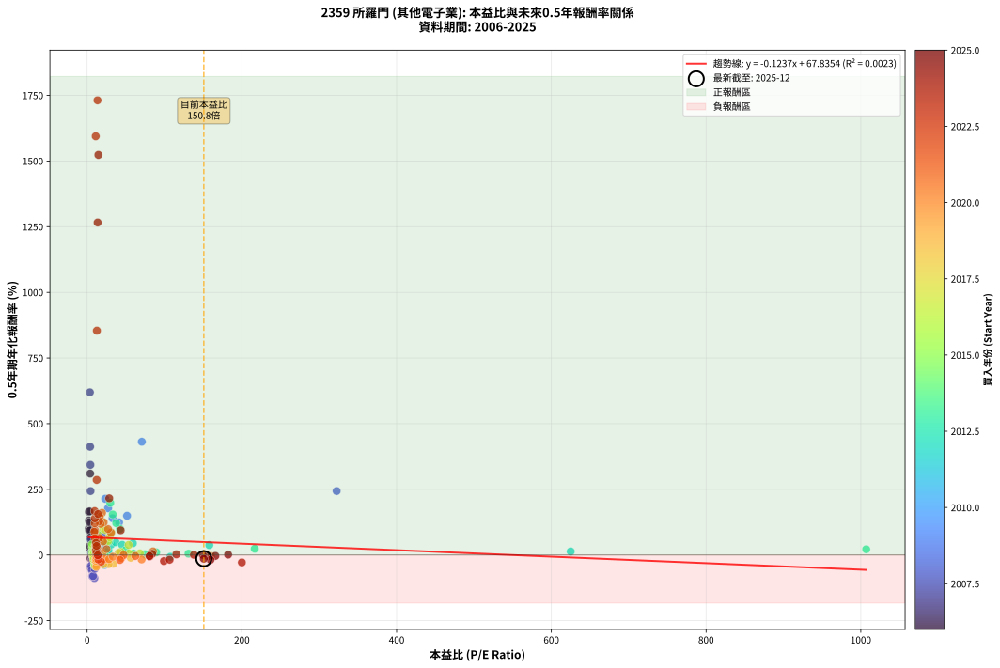
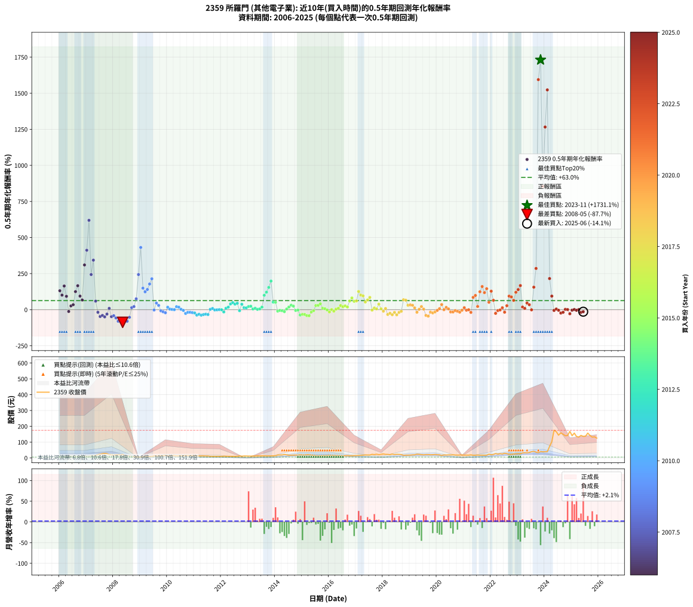

# 2359 所羅門 - 本益比與未來報酬率分析

!!! info "報告資訊"
    - **股票代號**: 2359
    - **公司名稱**: 所羅門
    - **產業別**: 其他電子業
    - **分析期間**: 2006-2025 (234 個數據點)
    - **資料來源**: Type 12 (ShowMonthlyK_ChartFlow) 月收盤價與本益比
    - **報酬率口徑**: 含現金股利 (簡化: 年度合計，假設每年7/1入帳)
    - **報告生成時間**: 2026-01-06 18:30:35 CST

## 📈 視覺化圖表

### 圖表1: 本益比 vs 未來報酬率關係

*圖表1：2359 所羅門 本益比與0.5年期未來報酬率關係 (2006-2025)*

### 圖表2: 歷年買入時點的0.5年期實際報酬率

*圖表2：2359 所羅門 歷年買入時點的0.5年期實際報酬率 (2006-2025)*

## 📍 買點訊號說明

本報告提供兩種買點提示訊號（顯示於圖表2的股價子圖中）：

### ▲ 小綠色三角形（回測驗證）
- **計算方式**: 使用全部歷史資料計算本益比第25百分位數
- **用途**: 事後驗證，顯示歷史上哪些時點確實為低估區
- **限制**: 當下無法判斷，僅供回測參考
- **特性**: 後見之明（Look-Ahead Bias）

### ▲ 小橘色三角形（即時訊號）
- **計算方式**: 使用截至當月的過去5年資料計算本益比第25百分位數
- **用途**: 實際投資決策，當時即可判斷
- **優勢**: 可操作性強，符合實務需求
- **特性**: 無後見之明，滾動窗口計算

!!! tip "如何使用兩種訊號"
    - **綠色▲** 幫助理解歷史估值機會，驗證策略有效性
    - **橘色▲** 可作為實際買進參考，但仍需搭配基本面分析
    - 兩種訊號重疊時，表示即時判斷與事後驗證一致，信心度較高
    - 僅有綠色▲時，表示當時無法判斷（需要未來資料才能確認）
    - 僅有橘色▲時，表示即時判斷為買點，但事後可能不是最佳時機

## 📊 估值分析摘要

| 指標 | 數值 |
|:---:|:---:|
| **目前本益比** (2025-06) | **150.80 倍** |
| **歷史平均本益比** | 37.69 倍 |
| **估值水準** | 🔴 相對高估 |
| **預期0.5年年化報酬率** | **+49.19%** |
| **歷史平均報酬率** | +62.96% |
| **相關係數 (R²)** | 0.0023 |
| **趨勢線斜率** | -0.1237 |

!!! abstract "核心洞察"
    目前本益比顯著高於歷史平均，預期未來報酬率可能較低

    根據歷史數據回測，2359 所羅門 在目前本益比 **150.8倍** 的估值水準下，
    預期未來0.5年年化報酬率約為 **+49.2%**。

    **重要提醒**: 本分析基於歷史數據統計，實際報酬率會受到公司基本面變化、產業趨勢、
    總體經濟環境等多重因素影響。R² = 0.00 表示本益比可解釋約 0.2% 的報酬率變異。

## 📈 歷史估值統計

### 最佳買點 (最高報酬率)

| 項目 | 數值 |
|:---:|:---:|
| 起始時間 | 2023-11 |
| 當時本益比 | 13.37 倍 |
| 起始價格 | 41.1 元 |
| 0.5年後價格 | 175.0 元 |
| **0.5年年化報酬率** | **+1731.11%** |

### 最差買點 (最低報酬率)

| 項目 | 數值 |
|:---:|:---:|
| 起始時間 | 2008-05 |
| 當時本益比 | 9.37 倍 |
| 起始價格 | 22.0 元 |
| 0.5年後價格 | 6.5 元 |
| **0.5年年化報酬率** | **-87.68%** |

## 🎯 投資啟示

### 本益比與報酬率關係

趨勢線方程式: **y = -0.1237x + 67.8354**

!!! note "負相關"
    本益比與未來報酬率呈現負相關。較低的本益比通常帶來較高的未來報酬率，
    但相關性不算非常強。**估值仍是重要參考指標之一**。

### 估值區間建議

基於歷史數據分析:

- **🟢 低估區** (P/E < 30.1): 預期報酬率較高，可考慮增加持股
- **🟡 合理區** (P/E 30.1-45.2): 預期報酬率符合長期趨勢，正常持有
- **🔴 高估區** (P/E > 45.2): 預期報酬率較低，可考慮減碼或觀望

!!! danger "風險提示"
    - 過去表現不代表未來結果
    - 本分析假設公司基本面無重大結構性變化
    - 產業環境劇變可能使歷史規律失效
    - 應結合公司財報、產業趨勢、總體經濟等多重因素綜合判斷

!!! success "長期投資觀點"
    歷史數據顯示，在合理或低估的估值水準買入並長期持有，
    往往能獲得較佳的投資報酬。**耐心等待好價格**是價值投資的核心原則。

## 📊 數據品質

- **資料來源**: GoodInfo.tw Type 12 (ShowMonthlyK_ChartFlow)
- **資料頻率**: 月度收盤價與本益比
- **回測期間**: 2006-2025
- **數據點數量**: 234 個 (每個點代表一次0.5年期回測)

### 計算方法說明

1. **0.5年期年化報酬率**:
   - 對每個歷史時點，計算其後0.5年的實際投資報酬率
   - 期末價值(不含股利): 期末價格
   - 期末價值(含現金股利): 期末價格 + 持有期間內的現金股利合計 (簡化: 年度合計，假設每年7/1入帳)
   - 公式: 年化報酬率 = [(期末價值/期初價格)^(1/年數) - 1] × 100%

2. **本益比 (P/E Ratio)**:
   - 使用當時的月收盤價與EPS計算
   - 資料來源: Type 12 月度河流圖本益比數據

3. **趨勢線 (Linear Regression)**:
   - 使用最小平方法擬合線性趨勢線
   - R²值衡量本益比對報酬率的解釋能力

---

*本報告由 Stock Analysis System v1.9.0 自動生成*
*數據更新時間: 2026-01-06 18:30:35 CST*

## 📋 月度回測明細表

（每一列對應時間線圖中的一個買入點；可用來對照 SVG 圖上的每個點。）

| 買入月份 | 賣出月份 | 回測期限_年 | 實際持有年數 | 買入本益比_倍 | 買入收盤價_元 | 賣出收盤價_元 | 現金股利合計_元 | 總報酬率_pct | 年化報酬率_pct |
| --- | --- | --- | --- | --- | --- | --- | --- | --- | --- |
| 2006-01 | 2006-07 | 0.5 | 0.496 | 2.25 | 6.00 | 9.09 | 0.00 | +51.50 | +131.24 |
| 2006-02 | 2006-08 | 0.5 | 0.498 | 2.18 | 5.82 | 8.24 | 0.00 | +41.58 | +100.93 |
| 2006-03 | 2006-10 | 0.5 | 0.586 | 2.12 | 5.66 | 10.00 | 0.00 | +76.68 | +164.17 |
| 2006-04 | 2006-10 | 0.5 | 0.501 | 2.70 | 7.20 | 10.00 | 0.00 | +38.89 | +92.64 |
| 2006-05 | 2006-12 | 0.5 | 0.586 | 4.23 | 11.30 | 10.45 | 0.00 | -7.52 | -12.49 |
| 2006-06 | 2006-12 | 0.5 | 0.501 | 3.48 | 9.30 | 10.45 | 0.00 | +12.37 | +26.20 |
| 2006-07 | 2007-01 | 0.5 | 0.504 | 3.40 | 9.09 | 10.55 | 0.00 | +16.06 | +34.40 |
| 2006-08 | 2007-03 | 0.5 | 0.580 | 3.09 | 8.24 | 13.20 | 0.00 | +60.19 | +125.21 |
| 2006-09 | 2007-03 | 0.5 | 0.496 | 3.04 | 8.13 | 13.20 | 0.00 | +62.36 | +165.92 |
| 2006-10 | 2007-05 | 0.5 | 0.580 | 3.75 | 10.00 | 14.70 | 0.00 | +47.00 | +94.21 |
| 2006-11 | 2007-05 | 0.5 | 0.496 | 4.27 | 11.40 | 14.70 | 0.00 | +28.95 | +67.04 |
| 2006-12 | 2007-07 | 0.5 | 0.580 | 3.91 | 10.45 | 23.70 | 0.00 | +126.79 | +309.93 |
| 2007-01 | 2007-07 | 0.5 | 0.496 | 3.79 | 10.55 | 23.70 | 0.00 | +124.64 | +412.04 |
| 2007-02 | 2007-08 | 0.5 | 0.498 | 3.54 | 10.25 | 27.40 | 0.00 | +167.32 | +619.43 |
| 2007-03 | 2007-10 | 0.5 | 0.586 | 4.39 | 13.20 | 27.20 | 0.00 | +106.06 | +243.49 |
| 2007-04 | 2007-10 | 0.5 | 0.501 | 4.14 | 12.90 | 27.20 | 0.00 | +110.85 | +343.23 |
| 2007-05 | 2007-12 | 0.5 | 0.586 | 4.55 | 14.70 | 19.30 | 0.00 | +31.29 | +59.15 |
| 2007-06 | 2007-12 | 0.5 | 0.501 | 6.38 | 21.30 | 19.30 | 0.00 | -9.39 | -17.86 |
| 2007-07 | 2008-01 | 0.5 | 0.504 | 6.87 | 23.70 | 17.15 | 0.00 | -27.64 | -47.38 |
| 2007-08 | 2008-03 | 0.5 | 0.583 | 7.69 | 27.40 | 20.40 | 0.00 | -25.55 | -39.70 |
| 2007-09 | 2008-03 | 0.5 | 0.498 | 7.84 | 28.80 | 20.40 | 0.00 | -29.17 | -49.95 |
| 2007-10 | 2008-05 | 0.5 | 0.583 | 7.18 | 27.20 | 22.00 | 0.00 | -19.12 | -30.50 |
| 2007-11 | 2008-05 | 0.5 | 0.498 | 5.40 | 21.05 | 22.00 | 0.00 | +4.51 | +9.26 |
| 2007-12 | 2008-07 | 0.5 | 0.583 | 4.81 | 19.30 | 13.10 | 0.00 | -32.12 | -48.55 |
| 2008-01 | 2008-07 | 0.5 | 0.498 | 4.66 | 17.15 | 13.10 | 0.00 | -23.62 | -41.76 |
| 2008-02 | 2008-08 | 0.5 | 0.501 | 6.01 | 20.10 | 13.10 | 0.00 | -34.83 | -57.45 |
| 2008-03 | 2008-10 | 0.5 | 0.586 | 6.77 | 20.40 | 7.95 | 0.00 | -61.03 | -79.98 |
| 2008-04 | 2008-10 | 0.5 | 0.501 | 6.88 | 18.45 | 7.95 | 0.00 | -56.91 | -81.37 |
| 2008-05 | 2008-12 | 0.5 | 0.586 | 9.37 | 22.00 | 6.45 | 0.00 | -70.68 | -87.68 |
| 2008-06 | 2008-12 | 0.5 | 0.501 | 7.25 | 14.60 | 6.45 | 0.00 | -55.82 | -80.42 |
| 2008-07 | 2009-01 | 0.5 | 0.504 | 7.79 | 13.10 | 5.77 | 0.00 | -55.95 | -80.36 |
| 2008-08 | 2009-03 | 0.5 | 0.580 | 9.70 | 13.10 | 8.45 | 0.00 | -35.50 | -53.02 |
| 2008-09 | 2009-03 | 0.5 | 0.496 | 7.77 | 7.91 | 8.45 | 0.00 | +6.83 | +14.26 |
| 2008-10 | 2009-05 | 0.5 | 0.580 | 11.61 | 7.95 | 8.90 | 0.00 | +11.95 | +21.47 |
| 2008-11 | 2009-05 | 0.5 | 0.496 | 19.12 | 6.74 | 8.90 | 0.00 | +32.05 | +75.24 |
| 2008-12 | 2009-07 | 0.5 | 0.580 | 322.50 | 6.45 | 13.20 | 0.00 | +104.65 | +243.43 |
| 2009-01 | 2009-07 | 0.5 | 0.496 | 70.65 | 5.77 | 13.20 | 0.00 | +128.77 | +431.19 |
| 2009-02 | 2009-08 | 0.5 | 0.498 | 51.56 | 7.39 | 11.65 | 0.00 | +57.65 | +149.30 |
| 2009-03 | 2009-10 | 0.5 | 0.586 | 41.22 | 8.45 | 13.55 | 0.00 | +60.36 | +123.89 |
| 2009-04 | 2009-10 | 0.5 | 0.501 | 32.78 | 8.74 | 13.55 | 0.00 | +55.03 | +139.92 |
| 2009-05 | 2009-12 | 0.5 | 0.586 | 27.11 | 8.90 | 16.20 | 0.00 | +82.02 | +177.96 |
| 2009-06 | 2009-12 | 0.5 | 0.501 | 23.41 | 9.13 | 16.20 | 0.00 | +77.44 | +214.10 |
| 2009-07 | 2010-01 | 0.5 | 0.504 | 29.23 | 13.20 | 13.05 | 0.00 | -1.14 | -2.24 |
| 2009-08 | 2010-03 | 0.5 | 0.580 | 22.69 | 11.65 | 14.50 | 0.00 | +24.46 | +45.80 |
| 2009-09 | 2010-03 | 0.5 | 0.496 | 22.17 | 12.75 | 14.50 | 0.00 | +13.73 | +29.63 |
| 2009-10 | 2010-05 | 0.5 | 0.580 | 21.28 | 13.55 | 12.90 | 0.00 | -4.80 | -8.12 |
| 2009-11 | 2010-05 | 0.5 | 0.496 | 19.98 | 13.95 | 12.90 | 0.00 | -7.53 | -14.61 |
| 2009-12 | 2010-07 | 0.5 | 0.580 | 21.32 | 16.20 | 14.10 | 0.00 | -12.96 | -21.27 |
| 2010-01 | 2010-07 | 0.5 | 0.496 | 17.48 | 13.05 | 14.10 | 0.00 | +8.05 | +16.90 |
| 2010-02 | 2010-08 | 0.5 | 0.498 | 17.86 | 13.10 | 13.35 | 0.00 | +1.91 | +3.87 |
| 2010-03 | 2010-10 | 0.5 | 0.586 | 20.14 | 14.50 | 14.65 | 0.00 | +1.03 | +1.77 |
| 2010-04 | 2010-10 | 0.5 | 0.501 | 20.73 | 14.65 | 14.65 | 0.00 | +0.00 | +0.00 |
| 2010-05 | 2010-12 | 0.5 | 0.586 | 18.61 | 12.90 | 14.40 | 0.00 | +11.63 | +20.65 |
| 2010-06 | 2010-12 | 0.5 | 0.501 | 19.56 | 13.30 | 14.40 | 0.00 | +8.27 | +17.19 |
| 2010-07 | 2011-01 | 0.5 | 0.504 | 21.15 | 14.10 | 14.30 | 0.00 | +1.42 | +2.84 |
| 2010-08 | 2011-03 | 0.5 | 0.580 | 20.43 | 13.35 | 12.95 | 0.00 | -3.00 | -5.11 |
| 2010-09 | 2011-03 | 0.5 | 0.496 | 23.52 | 15.05 | 12.95 | 0.00 | -13.95 | -26.16 |
| 2010-10 | 2011-05 | 0.5 | 0.580 | 23.38 | 14.65 | 13.05 | 0.00 | -10.92 | -18.07 |
| 2010-11 | 2011-05 | 0.5 | 0.496 | 23.48 | 14.40 | 13.05 | 0.00 | -9.37 | -18.02 |
| 2010-12 | 2011-07 | 0.5 | 0.580 | 24.00 | 14.40 | 12.30 | 0.30 | -12.50 | -20.55 |
| 2011-01 | 2011-07 | 0.5 | 0.496 | 23.93 | 14.30 | 12.30 | 0.30 | -11.89 | -22.54 |
| 2011-02 | 2011-08 | 0.5 | 0.498 | 22.52 | 13.40 | 10.30 | 0.30 | -20.90 | -37.53 |
| 2011-03 | 2011-10 | 0.5 | 0.586 | 21.86 | 12.95 | 10.05 | 0.30 | -20.08 | -31.78 |
| 2011-04 | 2011-10 | 0.5 | 0.501 | 22.29 | 13.15 | 10.05 | 0.30 | -21.29 | -37.99 |
| 2011-05 | 2011-12 | 0.5 | 0.586 | 22.21 | 13.05 | 9.95 | 0.30 | -21.46 | -33.78 |
| 2011-06 | 2011-12 | 0.5 | 0.501 | 21.11 | 12.35 | 9.95 | 0.30 | -17.00 | -31.06 |
| 2011-07 | 2012-01 | 0.5 | 0.504 | 21.12 | 12.30 | 10.00 | 0.00 | -18.70 | -33.70 |
| 2011-08 | 2012-03 | 0.5 | 0.583 | 17.76 | 10.30 | 10.45 | 0.00 | +1.46 | +2.51 |
| 2011-09 | 2012-03 | 0.5 | 0.498 | 17.40 | 10.05 | 10.45 | 0.00 | +3.98 | +8.15 |
| 2011-10 | 2012-05 | 0.5 | 0.583 | 17.48 | 10.05 | 9.94 | 0.00 | -1.09 | -1.87 |
| 2011-11 | 2012-05 | 0.5 | 0.498 | 17.45 | 9.99 | 9.94 | 0.00 | -0.50 | -1.00 |
| 2011-12 | 2012-07 | 0.5 | 0.583 | 17.46 | 9.95 | 9.97 | 0.00 | +0.20 | +0.34 |
| 2012-01 | 2012-07 | 0.5 | 0.498 | 19.23 | 10.00 | 9.97 | 0.00 | -0.30 | -0.60 |
| 2012-02 | 2012-08 | 0.5 | 0.501 | 23.30 | 10.95 | 10.05 | 0.00 | -8.22 | -15.73 |
| 2012-03 | 2012-10 | 0.5 | 0.586 | 24.88 | 10.45 | 11.05 | 0.00 | +5.74 | +10.00 |
| 2012-04 | 2012-10 | 0.5 | 0.501 | 27.57 | 10.20 | 11.05 | 0.00 | +8.33 | +17.32 |
| 2012-05 | 2012-12 | 0.5 | 0.586 | 31.06 | 9.94 | 12.10 | 0.00 | +21.73 | +39.88 |
| 2012-06 | 2012-12 | 0.5 | 0.501 | 36.74 | 9.92 | 12.10 | 0.00 | +21.98 | +48.66 |
| 2012-07 | 2013-01 | 0.5 | 0.504 | 45.32 | 9.97 | 11.75 | 0.00 | +17.85 | +38.55 |
| 2012-08 | 2013-03 | 0.5 | 0.580 | 59.12 | 10.05 | 12.45 | 0.00 | +23.88 | +44.62 |
| 2012-09 | 2013-03 | 0.5 | 0.496 | 107.50 | 12.90 | 12.45 | 0.00 | -3.49 | -6.91 |
| 2012-10 | 2013-05 | 0.5 | 0.580 | 157.90 | 11.05 | 13.30 | 0.00 | +20.36 | +37.62 |
| 2012-11 | 2013-05 | 0.5 | 0.496 | 625.00 | 12.50 | 13.30 | 0.00 | +6.40 | +13.34 |
| 2012-12 | 2013-07 | 0.5 | 0.580 |  | 12.10 | 12.95 | 0.00 | +7.02 | +12.41 |
| 2013-01 | 2013-07 | 0.5 | 0.496 | 1007.00 | 11.75 | 12.95 | 0.00 | +10.21 | +21.68 |
| 2013-02 | 2013-08 | 0.5 | 0.498 | 216.60 | 11.55 | 12.85 | 0.00 | +11.26 | +23.87 |
| 2013-03 | 2013-10 | 0.5 | 0.586 | 131.00 | 12.45 | 12.80 | 0.00 | +2.81 | +4.85 |
| 2013-04 | 2013-10 | 0.5 | 0.501 | 89.27 | 12.20 | 12.80 | 0.00 | +4.92 | +10.06 |
| 2013-05 | 2013-12 | 0.5 | 0.586 | 74.58 | 13.30 | 13.50 | 0.00 | +1.50 | +2.58 |
| 2013-06 | 2013-12 | 0.5 | 0.501 | 59.77 | 13.15 | 13.50 | 0.00 | +2.66 | +5.38 |
| 2013-07 | 2014-01 | 0.5 | 0.504 | 49.49 | 12.95 | 14.05 | 0.00 | +8.49 | +17.57 |
| 2013-08 | 2014-03 | 0.5 | 0.580 | 42.36 | 12.85 | 19.20 | 0.00 | +49.42 | +99.74 |
| 2013-09 | 2014-03 | 0.5 | 0.496 | 37.54 | 12.95 | 19.20 | 0.00 | +48.26 | +121.38 |
| 2013-10 | 2014-05 | 0.5 | 0.580 | 33.10 | 12.80 | 22.00 | 0.00 | +71.87 | +154.24 |
| 2013-11 | 2014-05 | 0.5 | 0.496 | 29.88 | 12.80 | 22.00 | 0.00 | +71.87 | +198.30 |
| 2013-12 | 2014-07 | 0.5 | 0.580 | 28.72 | 13.50 | 17.25 | 0.00 | +27.78 | +52.55 |
| 2014-01 | 2014-07 | 0.5 | 0.496 | 23.81 | 14.05 | 17.25 | 0.00 | +22.78 | +51.30 |
| 2014-02 | 2014-08 | 0.5 | 0.498 | 26.41 | 18.75 | 17.80 | 0.00 | -5.07 | -9.91 |
| 2014-03 | 2014-10 | 0.5 | 0.586 | 23.13 | 19.20 | 18.60 | 0.00 | -3.12 | -5.27 |
| 2014-04 | 2014-10 | 0.5 | 0.501 | 20.32 | 19.30 | 18.60 | 0.00 | -3.63 | -7.11 |
| 2014-05 | 2014-12 | 0.5 | 0.586 | 20.56 | 22.00 | 20.20 | 0.00 | -8.18 | -13.56 |
| 2014-06 | 2014-12 | 0.5 | 0.501 | 16.60 | 19.75 | 20.20 | 0.00 | +2.28 | +4.60 |
| 2014-07 | 2015-01 | 0.5 | 0.504 | 13.17 | 17.25 | 18.75 | 0.00 | +8.70 | +18.00 |
| 2014-08 | 2015-03 | 0.5 | 0.580 | 12.45 | 17.80 | 20.85 | 0.00 | +17.13 | +31.32 |
| 2014-09 | 2015-03 | 0.5 | 0.496 | 12.06 | 18.70 | 20.85 | 0.00 | +11.50 | +24.56 |
| 2014-10 | 2015-05 | 0.5 | 0.580 | 11.14 | 18.60 | 18.00 | 0.00 | -3.23 | -5.49 |
| 2014-11 | 2015-05 | 0.5 | 0.496 | 10.20 | 18.25 | 18.00 | 0.00 | -1.37 | -2.75 |
| 2014-12 | 2015-07 | 0.5 | 0.580 | 10.58 | 20.20 | 14.45 | 1.00 | -23.51 | -36.99 |
| 2015-01 | 2015-07 | 0.5 | 0.496 | 9.72 | 18.75 | 14.45 | 1.00 | -17.60 | -32.34 |
| 2015-02 | 2015-08 | 0.5 | 0.498 | 9.41 | 18.35 | 14.00 | 1.00 | -18.26 | -33.27 |
| 2015-03 | 2015-10 | 0.5 | 0.586 | 10.58 | 20.85 | 14.30 | 1.00 | -26.62 | -41.04 |
| 2015-04 | 2015-10 | 0.5 | 0.501 | 10.10 | 20.10 | 14.30 | 1.00 | -23.88 | -41.99 |
| 2015-05 | 2015-12 | 0.5 | 0.586 | 8.96 | 18.00 | 15.20 | 1.00 | -10.00 | -16.46 |
| 2015-06 | 2015-12 | 0.5 | 0.501 | 8.28 | 16.80 | 15.20 | 1.00 | -3.57 | -7.00 |
| 2015-07 | 2016-01 | 0.5 | 0.504 | 7.05 | 14.45 | 16.40 | 0.00 | +13.49 | +28.57 |
| 2015-08 | 2016-03 | 0.5 | 0.583 | 6.76 | 14.00 | 16.30 | 0.00 | +16.43 | +29.80 |
| 2015-09 | 2016-03 | 0.5 | 0.498 | 6.58 | 13.75 | 16.30 | 0.00 | +18.55 | +40.69 |
| 2015-10 | 2016-05 | 0.5 | 0.583 | 6.78 | 14.30 | 15.15 | 0.00 | +5.94 | +10.41 |
| 2015-11 | 2016-05 | 0.5 | 0.498 | 6.88 | 14.65 | 15.15 | 0.00 | +3.41 | +6.97 |
| 2015-12 | 2016-07 | 0.5 | 0.583 | 7.07 | 15.20 | 14.05 | 1.00 | -0.99 | -1.69 |
| 2016-01 | 2016-07 | 0.5 | 0.498 | 8.00 | 16.40 | 14.05 | 1.00 | -8.23 | -15.84 |
| 2016-02 | 2016-08 | 0.5 | 0.501 | 7.87 | 15.35 | 14.40 | 1.00 | +0.33 | +0.65 |
| 2016-03 | 2016-10 | 0.5 | 0.586 | 8.81 | 16.30 | 14.30 | 1.00 | -6.13 | -10.24 |
| 2016-04 | 2016-10 | 0.5 | 0.501 | 8.57 | 15.00 | 14.30 | 1.00 | +2.00 | +4.03 |
| 2016-05 | 2016-12 | 0.5 | 0.586 | 9.18 | 15.15 | 15.00 | 1.00 | +5.61 | +9.76 |
| 2016-06 | 2016-12 | 0.5 | 0.501 | 9.10 | 14.10 | 15.00 | 1.00 | +13.48 | +28.70 |
| 2016-07 | 2017-01 | 0.5 | 0.504 | 9.69 | 14.05 | 15.45 | 0.00 | +9.96 | +20.75 |
| 2016-08 | 2017-03 | 0.5 | 0.580 | 10.67 | 14.40 | 16.50 | 0.00 | +14.58 | +26.43 |
| 2016-09 | 2017-03 | 0.5 | 0.496 | 12.12 | 15.15 | 16.50 | 0.00 | +8.91 | +18.80 |
| 2016-10 | 2017-05 | 0.5 | 0.580 | 12.43 | 14.30 | 18.80 | 0.00 | +31.47 | +60.22 |
| 2016-11 | 2017-05 | 0.5 | 0.496 | 13.33 | 14.00 | 18.80 | 0.00 | +34.29 | +81.28 |
| 2016-12 | 2017-07 | 0.5 | 0.580 | 15.79 | 15.00 | 18.55 | 1.00 | +30.33 | +57.84 |
| 2017-01 | 2017-07 | 0.5 | 0.496 | 17.18 | 15.45 | 18.55 | 1.00 | +26.54 | +60.79 |
| 2017-02 | 2017-08 | 0.5 | 0.498 | 18.80 | 15.95 | 22.95 | 1.00 | +50.16 | +126.10 |
| 2017-03 | 2017-10 | 0.5 | 0.586 | 20.69 | 16.50 | 23.85 | 1.00 | +50.61 | +101.16 |
| 2017-04 | 2017-10 | 0.5 | 0.501 | 23.77 | 17.75 | 23.85 | 1.00 | +40.00 | +95.73 |
| 2017-05 | 2017-12 | 0.5 | 0.586 | 27.02 | 18.80 | 23.15 | 1.00 | +28.46 | +53.33 |
| 2017-06 | 2017-12 | 0.5 | 0.501 | 28.91 | 18.65 | 23.15 | 1.00 | +29.49 | +67.50 |
| 2017-07 | 2018-01 | 0.5 | 0.504 | 31.22 | 18.55 | 25.30 | 0.00 | +36.39 | +85.16 |
| 2017-08 | 2018-03 | 0.5 | 0.580 | 42.24 | 22.95 | 22.55 | 0.00 | -1.74 | -2.98 |
| 2017-09 | 2018-03 | 0.5 | 0.496 | 43.35 | 21.35 | 22.55 | 0.00 | +5.62 | +11.67 |
| 2017-10 | 2018-05 | 0.5 | 0.580 | 54.00 | 23.85 | 24.60 | 0.00 | +3.14 | +5.48 |
| 2017-11 | 2018-05 | 0.5 | 0.496 | 53.60 | 20.95 | 24.60 | 0.00 | +17.42 | +38.28 |
| 2017-12 | 2018-07 | 0.5 | 0.580 | 68.09 | 23.15 | 22.95 | 1.00 | +3.46 | +6.03 |
| 2018-01 | 2018-07 | 0.5 | 0.496 | 56.33 | 25.30 | 22.95 | 1.00 | -5.34 | -10.48 |
| 2018-02 | 2018-08 | 0.5 | 0.498 | 40.84 | 22.80 | 22.70 | 1.00 | +3.95 | +8.08 |
| 2018-03 | 2018-10 | 0.5 | 0.586 | 33.78 | 22.55 | 16.80 | 1.00 | -21.06 | -33.22 |
| 2018-04 | 2018-10 | 0.5 | 0.501 | 26.46 | 20.55 | 16.80 | 1.00 | -13.38 | -24.93 |
| 2018-05 | 2018-12 | 0.5 | 0.586 | 27.77 | 24.60 | 18.15 | 1.00 | -22.15 | -34.78 |
| 2018-06 | 2018-12 | 0.5 | 0.501 | 21.36 | 21.25 | 18.15 | 1.00 | -9.88 | -18.75 |
| 2018-07 | 2019-01 | 0.5 | 0.504 | 20.78 | 22.95 | 18.40 | 0.00 | -19.83 | -35.51 |
| 2018-08 | 2019-03 | 0.5 | 0.580 | 18.71 | 22.70 | 20.15 | 0.00 | -11.23 | -18.56 |
| 2018-09 | 2019-03 | 0.5 | 0.496 | 16.18 | 21.40 | 20.15 | 0.00 | -5.84 | -11.44 |
| 2018-10 | 2019-05 | 0.5 | 0.580 | 11.73 | 16.80 | 22.80 | 0.00 | +35.71 | +69.24 |
| 2018-11 | 2019-05 | 0.5 | 0.496 | 11.52 | 17.75 | 22.80 | 0.00 | +28.45 | +65.74 |
| 2018-12 | 2019-07 | 0.5 | 0.580 | 11.00 | 18.15 | 20.10 | 1.10 | +16.80 | +30.68 |
| 2019-01 | 2019-07 | 0.5 | 0.496 | 11.03 | 18.40 | 20.10 | 1.10 | +15.22 | +33.09 |
| 2019-02 | 2019-08 | 0.5 | 0.498 | 11.66 | 19.65 | 21.35 | 1.10 | +14.25 | +30.65 |
| 2019-03 | 2019-10 | 0.5 | 0.586 | 11.84 | 20.15 | 20.45 | 1.10 | +6.95 | +12.15 |
| 2019-04 | 2019-10 | 0.5 | 0.501 | 13.81 | 23.75 | 20.45 | 1.10 | -9.26 | -17.64 |
| 2019-05 | 2019-12 | 0.5 | 0.586 | 13.12 | 22.80 | 22.10 | 1.10 | +1.75 | +3.01 |
| 2019-06 | 2019-12 | 0.5 | 0.501 | 11.99 | 21.05 | 22.10 | 1.10 | +10.21 | +21.42 |
| 2019-07 | 2020-01 | 0.5 | 0.504 | 11.34 | 20.10 | 20.50 | 0.00 | +1.99 | +3.99 |
| 2019-08 | 2020-03 | 0.5 | 0.583 | 11.93 | 21.35 | 15.90 | 0.00 | -25.53 | -39.67 |
| 2019-09 | 2020-03 | 0.5 | 0.498 | 11.84 | 21.40 | 15.90 | 0.00 | -25.70 | -44.91 |
| 2019-10 | 2020-05 | 0.5 | 0.583 | 11.21 | 20.45 | 18.35 | 0.00 | -10.27 | -16.96 |
| 2019-11 | 2020-05 | 0.5 | 0.498 | 11.29 | 20.80 | 18.35 | 0.00 | -11.78 | -22.24 |
| 2019-12 | 2020-07 | 0.5 | 0.583 | 11.88 | 22.10 | 19.20 | 0.80 | -9.50 | -15.74 |
| 2020-01 | 2020-07 | 0.5 | 0.498 | 11.95 | 20.50 | 19.20 | 0.80 | -2.44 | -4.83 |
| 2020-02 | 2020-08 | 0.5 | 0.501 | 12.68 | 19.90 | 19.80 | 0.80 | +3.52 | +7.14 |
| 2020-03 | 2020-10 | 0.5 | 0.586 | 11.16 | 15.90 | 18.20 | 0.80 | +19.50 | +35.53 |
| 2020-04 | 2020-10 | 0.5 | 0.501 | 14.84 | 19.00 | 18.20 | 0.80 | +0.00 | +0.00 |
| 2020-05 | 2020-12 | 0.5 | 0.586 | 16.17 | 18.35 | 19.20 | 0.80 | +8.99 | +15.83 |
| 2020-06 | 2020-12 | 0.5 | 0.501 | 19.65 | 19.45 | 19.20 | 0.80 | +2.83 | +5.72 |
| 2020-07 | 2021-01 | 0.5 | 0.504 | 22.72 | 19.20 | 17.60 | 0.00 | -8.33 | -15.86 |
| 2020-08 | 2021-03 | 0.5 | 0.580 | 28.29 | 19.80 | 17.90 | 0.00 | -9.60 | -15.95 |
| 2020-09 | 2021-03 | 0.5 | 0.496 | 33.33 | 18.50 | 17.90 | 0.00 | -3.24 | -6.44 |
| 2020-10 | 2021-05 | 0.5 | 0.580 | 44.39 | 18.20 | 17.00 | 0.00 | -6.59 | -11.09 |
| 2020-11 | 2021-05 | 0.5 | 0.496 | 70.38 | 18.65 | 17.00 | 0.00 | -8.85 | -17.05 |
| 2020-12 | 2021-07 | 0.5 | 0.580 | 160.00 | 19.20 | 18.25 | 0.50 | -2.34 | -4.00 |
| 2021-01 | 2021-07 | 0.5 | 0.496 | 85.16 | 17.60 | 18.25 | 0.50 | +6.53 | +13.62 |
| 2021-02 | 2021-08 | 0.5 | 0.498 | 62.22 | 18.25 | 17.40 | 0.50 | -1.92 | -3.81 |
| 2021-03 | 2021-10 | 0.5 | 0.586 | 47.11 | 17.90 | 17.35 | 0.50 | -0.28 | -0.48 |
| 2021-04 | 2021-10 | 0.5 | 0.501 | 42.43 | 19.80 | 17.35 | 0.50 | -9.85 | -18.69 |
| 2021-05 | 2021-12 | 0.5 | 0.586 | 30.72 | 17.00 | 23.90 | 0.50 | +43.53 | +85.29 |
| 2021-06 | 2021-12 | 0.5 | 0.501 | 27.03 | 17.30 | 23.90 | 0.50 | +41.04 | +98.64 |
| 2021-07 | 2022-01 | 0.5 | 0.504 | 25.11 | 18.25 | 20.20 | 0.00 | +10.68 | +22.33 |
| 2021-08 | 2022-03 | 0.5 | 0.580 | 21.39 | 17.40 | 27.80 | 0.00 | +59.77 | +124.18 |
| 2021-09 | 2022-03 | 0.5 | 0.496 | 19.22 | 17.30 | 27.80 | 0.00 | +60.69 | +160.43 |
| 2021-10 | 2022-05 | 0.5 | 0.580 | 17.58 | 17.35 | 27.30 | 0.00 | +57.35 | +118.36 |
| 2021-11 | 2022-05 | 0.5 | 0.496 | 16.30 | 17.50 | 27.30 | 0.00 | +56.00 | +145.31 |
| 2021-12 | 2022-07 | 0.5 | 0.580 | 20.60 | 23.90 | 29.50 | 0.90 | +27.20 | +51.36 |
| 2022-01 | 2022-07 | 0.5 | 0.496 | 15.71 | 20.20 | 29.50 | 0.90 | +50.50 | +128.16 |
| 2022-02 | 2022-08 | 0.5 | 0.498 | 15.73 | 22.20 | 27.60 | 0.90 | +28.38 | +65.09 |
| 2022-03 | 2022-10 | 0.5 | 0.586 | 18.08 | 27.80 | 22.50 | 0.90 | -15.83 | -25.48 |
| 2022-04 | 2022-10 | 0.5 | 0.501 | 14.52 | 24.15 | 22.50 | 0.90 | -3.11 | -6.10 |
| 2022-05 | 2022-12 | 0.5 | 0.586 | 15.26 | 27.30 | 26.10 | 0.90 | -1.10 | -1.87 |
| 2022-06 | 2022-12 | 0.5 | 0.501 | 13.24 | 25.35 | 26.10 | 0.90 | +6.51 | +13.41 |
| 2022-07 | 2023-01 | 0.5 | 0.504 | 14.45 | 29.50 | 26.80 | 0.00 | -9.15 | -17.35 |
| 2022-08 | 2023-03 | 0.5 | 0.580 | 12.74 | 27.60 | 31.80 | 0.00 | +15.22 | +27.64 |
| 2022-09 | 2023-03 | 0.5 | 0.496 | 9.99 | 22.90 | 31.80 | 0.00 | +38.86 | +93.97 |
| 2022-10 | 2023-05 | 0.5 | 0.580 | 9.30 | 22.50 | 32.50 | 0.00 | +44.44 | +88.43 |
| 2022-11 | 2023-05 | 0.5 | 0.496 | 9.98 | 25.40 | 32.50 | 0.00 | +27.95 | +64.45 |
| 2022-12 | 2023-07 | 0.5 | 0.580 | 9.78 | 26.10 | 39.80 | 1.50 | +58.24 | +120.49 |
| 2023-01 | 2023-07 | 0.5 | 0.496 | 9.90 | 26.80 | 39.80 | 1.50 | +54.10 | +139.33 |
| 2023-02 | 2023-08 | 0.5 | 0.498 | 9.70 | 26.60 | 41.90 | 1.50 | +63.16 | +167.10 |
| 2023-03 | 2023-10 | 0.5 | 0.586 | 11.44 | 31.80 | 33.60 | 1.50 | +10.38 | +18.35 |
| 2023-04 | 2023-10 | 0.5 | 0.501 | 11.95 | 33.65 | 33.60 | 1.50 | +4.31 | +8.78 |
| 2023-05 | 2023-12 | 0.5 | 0.586 | 11.39 | 32.50 | 39.10 | 1.50 | +24.92 | +46.20 |
| 2023-06 | 2023-12 | 0.5 | 0.501 | 12.11 | 35.00 | 39.10 | 1.50 | +16.00 | +34.48 |
| 2023-07 | 2024-01 | 0.5 | 0.504 | 13.60 | 39.80 | 39.60 | 0.00 | -0.50 | -1.00 |
| 2023-08 | 2024-03 | 0.5 | 0.583 | 14.14 | 41.90 | 72.50 | 0.00 | +73.03 | +156.05 |
| 2023-09 | 2024-03 | 0.5 | 0.498 | 12.33 | 37.00 | 72.50 | 0.00 | +95.95 | +285.73 |
| 2023-10 | 2024-05 | 0.5 | 0.583 | 11.06 | 33.60 | 175.00 | 0.00 | +420.83 | +1594.29 |
| 2023-11 | 2024-05 | 0.5 | 0.498 | 13.37 | 41.10 | 175.00 | 0.00 | +325.79 | +1731.11 |
| 2023-12 | 2024-07 | 0.5 | 0.583 | 12.57 | 39.10 | 144.00 | 1.70 | +272.63 | +854.18 |
| 2024-01 | 2024-07 | 0.5 | 0.498 | 13.56 | 39.60 | 144.00 | 1.70 | +267.93 | +1265.89 |
| 2024-02 | 2024-08 | 0.5 | 0.501 | 14.51 | 39.65 | 158.50 | 1.70 | +304.04 | +1523.13 |
| 2024-03 | 2024-10 | 0.5 | 0.586 | 28.52 | 72.50 | 140.50 | 1.70 | +96.14 | +215.75 |
| 2024-04 | 2024-10 | 0.5 | 0.501 | 43.34 | 102.00 | 140.50 | 1.70 | +39.41 | +94.09 |
| 2024-05 | 2024-12 | 0.5 | 0.586 | 80.86 | 175.00 | 168.00 | 1.70 | -3.03 | -5.11 |
| 2024-06 | 2024-12 | 0.5 | 0.501 | 84.05 | 166.00 | 168.00 | 1.70 | +2.23 | +4.50 |
| 2024-07 | 2025-01 | 0.5 | 0.504 | 80.63 | 144.00 | 141.00 | 0.00 | -2.08 | -4.09 |
| 2024-08 | 2025-03 | 0.5 | 0.580 | 99.27 | 158.50 | 136.00 | 0.00 | -14.20 | -23.19 |
| 2024-09 | 2025-03 | 0.5 | 0.496 | 106.60 | 150.00 | 136.00 | 0.00 | -9.33 | -17.94 |
| 2024-10 | 2025-05 | 0.5 | 0.580 | 115.30 | 140.50 | 142.50 | 0.00 | +1.42 | +2.47 |
| 2024-11 | 2025-05 | 0.5 | 0.496 | 138.00 | 142.00 | 142.50 | 0.00 | +0.35 | +0.71 |
| 2024-12 | 2025-07 | 0.5 | 0.580 | 200.00 | 168.00 | 137.50 | 1.00 | -17.56 | -28.30 |
| 2025-01 | 2025-07 | 0.5 | 0.496 | 165.70 | 141.00 | 137.50 | 1.00 | -1.77 | -3.55 |
| 2025-02 | 2025-08 | 0.5 | 0.498 | 182.20 | 157.00 | 157.00 | 1.00 | +0.64 | +1.28 |
| 2025-03 | 2025-10 | 0.5 | 0.586 | 155.90 | 136.00 | 131.50 | 1.00 | -2.57 | -4.35 |
| 2025-04 | 2025-10 | 0.5 | 0.501 | 149.40 | 132.00 | 131.50 | 1.00 | +0.38 | +0.76 |
| 2025-05 | 2025-12 | 0.5 | 0.586 | 159.40 | 142.50 | 125.50 | 1.00 | -11.23 | -18.39 |
| 2025-06 | 2025-12 | 0.5 | 0.501 | 150.80 | 136.50 | 125.50 | 1.00 | -7.33 | -14.09 |
