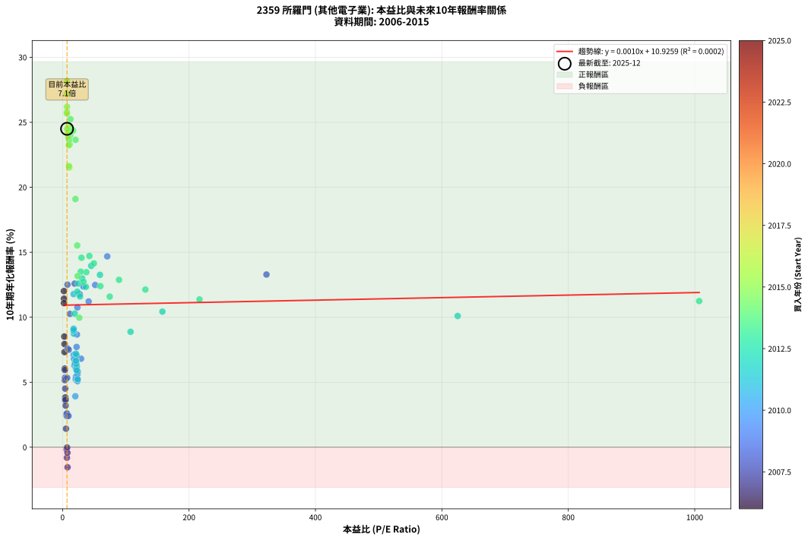
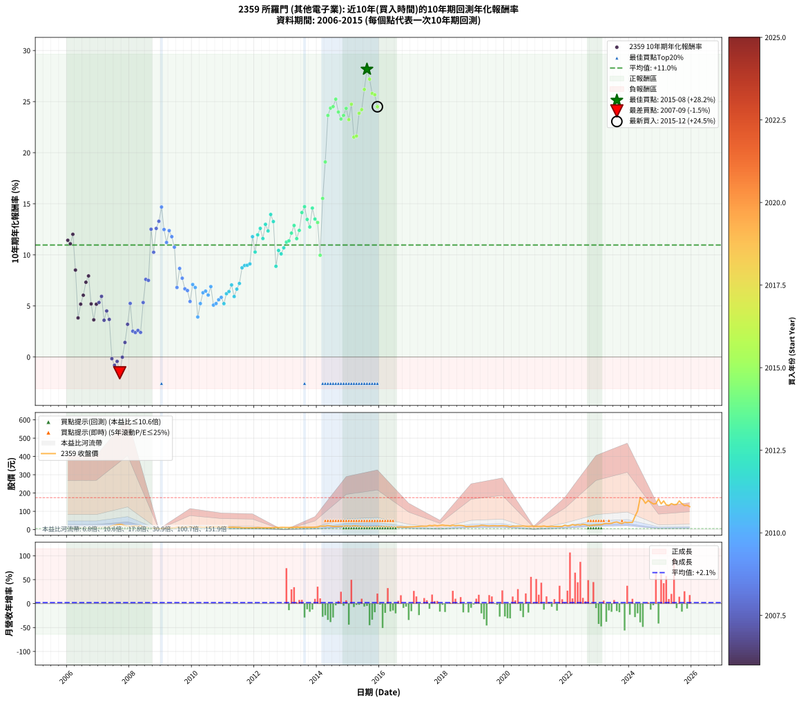

# 2359 所羅門 - 本益比與未來報酬率分析

!!! info "報告資訊"
    - **股票代號**: 2359
    - **公司名稱**: 所羅門
    - **產業別**: 其他電子業
    - **分析期間**: 2006-2015 (120 個數據點)
    - **資料來源**: Type 12 (ShowMonthlyK_ChartFlow) 月收盤價與本益比
    - **報酬率口徑**: 含現金股利 (簡化: 年度合計，假設每年7/1入帳)
    - **報告生成時間**: 2026-01-06 18:31:06 CST

## 📈 視覺化圖表

### 圖表1: 本益比 vs 未來報酬率關係

*圖表1：2359 所羅門 本益比與10年期未來報酬率關係 (2006-2015)*

### 圖表2: 歷年買入時點的10年期實際報酬率

*圖表2：2359 所羅門 歷年買入時點的10年期實際報酬率 (2006-2015)*

## 📍 買點訊號說明

本報告提供兩種買點提示訊號（顯示於圖表2的股價子圖中）：

### ▲ 小綠色三角形（回測驗證）
- **計算方式**: 使用全部歷史資料計算本益比第25百分位數
- **用途**: 事後驗證，顯示歷史上哪些時點確實為低估區
- **限制**: 當下無法判斷，僅供回測參考
- **特性**: 後見之明（Look-Ahead Bias）

### ▲ 小橘色三角形（即時訊號）
- **計算方式**: 使用截至當月的過去5年資料計算本益比第25百分位數
- **用途**: 實際投資決策，當時即可判斷
- **優勢**: 可操作性強，符合實務需求
- **特性**: 無後見之明，滾動窗口計算

!!! tip "如何使用兩種訊號"
    - **綠色▲** 幫助理解歷史估值機會，驗證策略有效性
    - **橘色▲** 可作為實際買進參考，但仍需搭配基本面分析
    - 兩種訊號重疊時，表示即時判斷與事後驗證一致，信心度較高
    - 僅有綠色▲時，表示當時無法判斷（需要未來資料才能確認）
    - 僅有橘色▲時，表示即時判斷為買點，但事後可能不是最佳時機

## 📊 估值分析摘要

| 指標 | 數值 |
|:---:|:---:|
| **目前本益比** (2015-12) | **7.07 倍** |
| **歷史平均本益比** | 39.13 倍 |
| **估值水準** | 🟢 相對低估 |
| **預期10年年化報酬率** | **+10.93%** |
| **歷史平均報酬率** | +10.96% |
| **相關係數 (R²)** | 0.0002 |
| **趨勢線斜率** | 0.0010 |

!!! abstract "核心洞察"
    目前本益比顯著低於歷史平均，預期未來報酬率可能較高

    根據歷史數據回測，2359 所羅門 在目前本益比 **7.1倍** 的估值水準下，
    預期未來10年年化報酬率約為 **+10.9%**。

    **重要提醒**: 本分析基於歷史數據統計，實際報酬率會受到公司基本面變化、產業趨勢、
    總體經濟環境等多重因素影響。R² = 0.00 表示本益比可解釋約 0.0% 的報酬率變異。

## 📈 歷史估值統計

### 最佳買點 (最高報酬率)

| 項目 | 數值 |
|:---:|:---:|
| 起始時間 | 2015-08 |
| 當時本益比 | 6.76 倍 |
| 起始價格 | 14.0 元 |
| 10年後價格 | 157.0 元 |
| **10年年化報酬率** | **+28.17%** |

### 最差買點 (最低報酬率)

| 項目 | 數值 |
|:---:|:---:|
| 起始時間 | 2007-09 |
| 當時本益比 | 7.84 倍 |
| 起始價格 | 28.8 元 |
| 10年後價格 | 21.4 元 |
| **10年年化報酬率** | **-1.54%** |

## 🎯 投資啟示

### 本益比與報酬率關係

趨勢線方程式: **y = 0.0010x + 10.9259**

!!! info "弱相關或正相關"
    本益比與未來報酬率相關性較弱。這可能表示該股票的報酬率更多受到
    公司成長性、產業趨勢等因素影響，而非估值水準。**需綜合考量多項指標**。

### 估值區間建議

基於歷史數據分析:

- **🟢 低估區** (P/E < 31.3): 預期報酬率較高，可考慮增加持股
- **🟡 合理區** (P/E 31.3-47.0): 預期報酬率符合長期趨勢，正常持有
- **🔴 高估區** (P/E > 47.0): 預期報酬率較低，可考慮減碼或觀望

!!! danger "風險提示"
    - 過去表現不代表未來結果
    - 本分析假設公司基本面無重大結構性變化
    - 產業環境劇變可能使歷史規律失效
    - 應結合公司財報、產業趨勢、總體經濟等多重因素綜合判斷

!!! success "長期投資觀點"
    歷史數據顯示，在合理或低估的估值水準買入並長期持有，
    往往能獲得較佳的投資報酬。**耐心等待好價格**是價值投資的核心原則。

## 📊 數據品質

- **資料來源**: GoodInfo.tw Type 12 (ShowMonthlyK_ChartFlow)
- **資料頻率**: 月度收盤價與本益比
- **回測期間**: 2006-2015
- **數據點數量**: 120 個 (每個點代表一次10年期回測)

### 計算方法說明

1. **10年期年化報酬率**:
   - 對每個歷史時點，計算其後10年的實際投資報酬率
   - 期末價值(不含股利): 期末價格
   - 期末價值(含現金股利): 期末價格 + 持有期間內的現金股利合計 (簡化: 年度合計，假設每年7/1入帳)
   - 公式: 年化報酬率 = [(期末價值/期初價格)^(1/年數) - 1] × 100%

2. **本益比 (P/E Ratio)**:
   - 使用當時的月收盤價與EPS計算
   - 資料來源: Type 12 月度河流圖本益比數據

3. **趨勢線 (Linear Regression)**:
   - 使用最小平方法擬合線性趨勢線
   - R²值衡量本益比對報酬率的解釋能力

---

*本報告由 Stock Analysis System v1.9.0 自動生成*
*數據更新時間: 2026-01-06 18:31:06 CST*

## 📋 月度回測明細表

（每一列對應時間線圖中的一個買入點；可用來對照 SVG 圖上的每個點。）

| 買入月份 | 賣出月份 | 回測期限_年 | 實際持有年數 | 買入本益比_倍 | 買入收盤價_元 | 賣出收盤價_元 | 現金股利合計_元 | 總報酬率_pct | 年化報酬率_pct |
| --- | --- | --- | --- | --- | --- | --- | --- | --- | --- |
| 2006-01 | 2016-01 | 10 | 9.999 | 2.25 | 6.00 | 16.40 | 1.30 | +195.00 | +11.43 |
| 2006-02 | 2016-02 | 10 | 9.999 | 2.18 | 5.82 | 15.35 | 1.30 | +186.08 | +11.08 |
| 2006-03 | 2016-03 | 10 | 10.001 | 2.12 | 5.66 | 16.30 | 1.30 | +210.95 | +12.01 |
| 2006-04 | 2016-04 | 10 | 10.001 | 2.70 | 7.20 | 15.00 | 1.30 | +126.39 | +8.51 |
| 2006-05 | 2016-05 | 10 | 10.001 | 4.23 | 11.30 | 15.15 | 1.30 | +45.58 | +3.83 |
| 2006-06 | 2016-06 | 10 | 10.001 | 3.48 | 9.30 | 14.10 | 1.30 | +65.59 | +5.17 |
| 2006-07 | 2016-07 | 10 | 10.001 | 3.40 | 9.09 | 14.05 | 2.30 | +79.87 | +6.05 |
| 2006-08 | 2016-08 | 10 | 10.001 | 3.09 | 8.24 | 14.40 | 2.30 | +102.67 | +7.32 |
| 2006-09 | 2016-09 | 10 | 10.001 | 3.04 | 8.13 | 15.15 | 2.30 | +114.64 | +7.94 |
| 2006-10 | 2016-10 | 10 | 10.001 | 3.75 | 10.00 | 14.30 | 2.30 | +66.00 | +5.20 |
| 2006-11 | 2016-11 | 10 | 10.001 | 4.27 | 11.40 | 14.00 | 2.30 | +42.98 | +3.64 |
| 2006-12 | 2016-12 | 10 | 10.001 | 3.91 | 10.45 | 15.00 | 2.30 | +65.55 | +5.17 |
| 2007-01 | 2017-01 | 10 | 10.001 | 3.79 | 10.55 | 15.45 | 2.30 | +68.25 | +5.34 |
| 2007-02 | 2017-02 | 10 | 10.001 | 3.54 | 10.25 | 15.95 | 2.30 | +78.05 | +5.94 |
| 2007-03 | 2017-03 | 10 | 10.001 | 4.39 | 13.20 | 16.50 | 2.30 | +42.42 | +3.60 |
| 2007-04 | 2017-04 | 10 | 10.001 | 4.14 | 12.90 | 17.75 | 2.30 | +55.43 | +4.51 |
| 2007-05 | 2017-05 | 10 | 10.001 | 4.55 | 14.70 | 18.80 | 2.30 | +43.54 | +3.68 |
| 2007-06 | 2017-06 | 10 | 10.001 | 6.38 | 21.30 | 18.65 | 2.30 | -1.64 | -0.17 |
| 2007-07 | 2017-07 | 10 | 10.001 | 6.87 | 23.70 | 18.55 | 3.30 | -7.81 | -0.81 |
| 2007-08 | 2017-08 | 10 | 10.001 | 7.69 | 27.40 | 22.95 | 3.30 | -4.20 | -0.43 |
| 2007-09 | 2017-09 | 10 | 10.001 | 7.84 | 28.80 | 21.35 | 3.30 | -14.41 | -1.54 |
| 2007-10 | 2017-10 | 10 | 10.001 | 7.18 | 27.20 | 23.85 | 3.30 | -0.18 | -0.02 |
| 2007-11 | 2017-11 | 10 | 10.001 | 5.40 | 21.05 | 20.95 | 3.30 | +15.20 | +1.43 |
| 2007-12 | 2017-12 | 10 | 10.001 | 4.81 | 19.30 | 23.15 | 3.30 | +37.05 | +3.20 |
| 2008-01 | 2018-01 | 10 | 10.001 | 4.66 | 17.15 | 25.30 | 3.30 | +66.76 | +5.25 |
| 2008-02 | 2018-03 | 10 | 10.081 | 6.01 | 20.10 | 22.55 | 3.30 | +28.61 | +2.53 |
| 2008-03 | 2018-03 | 10 | 9.999 | 6.77 | 20.40 | 22.55 | 3.30 | +26.72 | +2.40 |
| 2008-04 | 2018-04 | 10 | 9.999 | 6.88 | 18.45 | 20.55 | 3.30 | +29.27 | +2.60 |
| 2008-05 | 2018-05 | 10 | 9.999 | 9.37 | 22.00 | 24.60 | 3.30 | +26.82 | +2.40 |
| 2008-06 | 2018-06 | 10 | 9.999 | 7.25 | 14.60 | 21.25 | 3.30 | +68.15 | +5.34 |
| 2008-07 | 2018-07 | 10 | 9.999 | 7.79 | 13.10 | 22.95 | 4.30 | +108.02 | +7.60 |
| 2008-08 | 2018-08 | 10 | 9.999 | 9.70 | 13.10 | 22.70 | 4.30 | +106.11 | +7.50 |
| 2008-09 | 2018-09 | 10 | 9.999 | 7.77 | 7.91 | 21.40 | 4.30 | +224.91 | +12.51 |
| 2008-10 | 2018-10 | 10 | 9.999 | 11.61 | 7.95 | 16.80 | 4.30 | +165.41 | +10.25 |
| 2008-11 | 2018-11 | 10 | 9.999 | 19.12 | 6.74 | 17.75 | 4.30 | +227.15 | +12.59 |
| 2008-12 | 2018-12 | 10 | 9.999 | 322.50 | 6.45 | 18.15 | 4.30 | +248.06 | +13.29 |
| 2009-01 | 2019-01 | 10 | 9.999 | 70.65 | 5.77 | 18.40 | 4.30 | +293.41 | +14.68 |
| 2009-02 | 2019-02 | 10 | 9.999 | 51.56 | 7.39 | 19.65 | 4.30 | +224.09 | +12.48 |
| 2009-03 | 2019-03 | 10 | 9.999 | 41.22 | 8.45 | 20.15 | 4.30 | +189.35 | +11.21 |
| 2009-04 | 2019-04 | 10 | 9.999 | 32.78 | 8.74 | 23.75 | 4.30 | +220.94 | +12.37 |
| 2009-05 | 2019-05 | 10 | 9.999 | 27.11 | 8.90 | 22.80 | 4.30 | +204.49 | +11.78 |
| 2009-06 | 2019-06 | 10 | 9.999 | 23.41 | 9.13 | 21.05 | 4.30 | +177.66 | +10.75 |
| 2009-07 | 2019-07 | 10 | 9.999 | 29.23 | 13.20 | 20.10 | 5.40 | +93.18 | +6.81 |
| 2009-08 | 2019-08 | 10 | 9.999 | 22.69 | 11.65 | 21.35 | 5.40 | +129.61 | +8.67 |
| 2009-09 | 2019-09 | 10 | 9.999 | 22.17 | 12.75 | 21.40 | 5.40 | +110.20 | +7.71 |
| 2009-10 | 2019-10 | 10 | 9.999 | 21.28 | 13.55 | 20.45 | 5.40 | +90.77 | +6.67 |
| 2009-11 | 2019-11 | 10 | 9.999 | 19.98 | 13.95 | 20.80 | 5.40 | +87.81 | +6.51 |
| 2009-12 | 2019-12 | 10 | 9.999 | 21.32 | 16.20 | 22.10 | 5.40 | +69.75 | +5.44 |
| 2010-01 | 2020-01 | 10 | 9.999 | 17.48 | 13.05 | 20.50 | 5.40 | +98.47 | +7.10 |
| 2010-02 | 2020-02 | 10 | 9.999 | 17.86 | 13.10 | 19.90 | 5.40 | +93.13 | +6.80 |
| 2010-03 | 2020-03 | 10 | 10.001 | 20.14 | 14.50 | 15.90 | 5.40 | +46.90 | +3.92 |
| 2010-04 | 2020-04 | 10 | 10.001 | 20.73 | 14.65 | 19.00 | 5.40 | +66.55 | +5.23 |
| 2010-05 | 2020-05 | 10 | 10.001 | 18.61 | 12.90 | 18.35 | 5.40 | +84.11 | +6.29 |
| 2010-06 | 2020-06 | 10 | 10.001 | 19.56 | 13.30 | 19.45 | 5.40 | +86.84 | +6.45 |
| 2010-07 | 2020-07 | 10 | 10.001 | 21.15 | 14.10 | 19.20 | 6.20 | +80.14 | +6.06 |
| 2010-08 | 2020-08 | 10 | 10.001 | 20.43 | 13.35 | 19.80 | 6.20 | +94.76 | +6.89 |
| 2010-09 | 2020-09 | 10 | 10.001 | 23.52 | 15.05 | 18.50 | 6.20 | +64.12 | +5.08 |
| 2010-10 | 2020-10 | 10 | 10.001 | 23.38 | 14.65 | 18.20 | 6.20 | +66.55 | +5.23 |
| 2010-11 | 2020-11 | 10 | 10.001 | 23.48 | 14.40 | 18.65 | 6.20 | +72.57 | +5.61 |
| 2010-12 | 2020-12 | 10 | 10.001 | 24.00 | 14.40 | 19.20 | 6.20 | +76.39 | +5.84 |
| 2011-01 | 2021-01 | 10 | 10.001 | 23.93 | 14.30 | 17.60 | 6.20 | +66.43 | +5.23 |
| 2011-02 | 2021-02 | 10 | 10.001 | 22.52 | 13.40 | 18.25 | 6.20 | +82.46 | +6.20 |
| 2011-03 | 2021-03 | 10 | 10.001 | 21.86 | 12.95 | 17.90 | 6.20 | +86.10 | +6.41 |
| 2011-04 | 2021-04 | 10 | 10.001 | 22.29 | 13.15 | 19.80 | 6.20 | +97.72 | +7.05 |
| 2011-05 | 2021-05 | 10 | 10.001 | 22.21 | 13.05 | 17.00 | 6.20 | +77.78 | +5.92 |
| 2011-06 | 2021-06 | 10 | 10.001 | 21.11 | 12.35 | 17.30 | 6.20 | +90.28 | +6.64 |
| 2011-07 | 2021-07 | 10 | 10.001 | 21.12 | 12.30 | 18.25 | 6.40 | +100.41 | +7.20 |
| 2011-08 | 2021-08 | 10 | 10.001 | 17.76 | 10.30 | 17.40 | 6.40 | +131.07 | +8.73 |
| 2011-09 | 2021-09 | 10 | 10.001 | 17.40 | 10.05 | 17.30 | 6.40 | +135.82 | +8.96 |
| 2011-10 | 2021-10 | 10 | 10.001 | 17.48 | 10.05 | 17.35 | 6.40 | +136.32 | +8.98 |
| 2011-11 | 2021-11 | 10 | 10.001 | 17.45 | 9.99 | 17.50 | 6.40 | +139.24 | +9.11 |
| 2011-12 | 2021-12 | 10 | 10.001 | 17.46 | 9.95 | 23.90 | 6.40 | +204.52 | +11.78 |
| 2012-01 | 2022-01 | 10 | 10.001 | 19.23 | 10.00 | 20.20 | 6.40 | +166.00 | +10.28 |
| 2012-02 | 2022-03 | 10 | 10.081 | 23.30 | 10.95 | 27.80 | 6.40 | +212.33 | +11.96 |
| 2012-03 | 2022-03 | 10 | 9.999 | 24.88 | 10.45 | 27.80 | 6.40 | +227.27 | +12.59 |
| 2012-04 | 2022-04 | 10 | 9.999 | 27.57 | 10.20 | 24.15 | 6.40 | +199.51 | +11.60 |
| 2012-05 | 2022-05 | 10 | 9.999 | 31.06 | 9.94 | 27.30 | 6.40 | +239.03 | +12.99 |
| 2012-06 | 2022-06 | 10 | 9.999 | 36.74 | 9.92 | 25.35 | 6.40 | +220.06 | +12.34 |
| 2012-07 | 2022-07 | 10 | 9.999 | 45.32 | 9.97 | 29.50 | 7.30 | +269.11 | +13.95 |
| 2012-08 | 2022-08 | 10 | 9.999 | 59.12 | 10.05 | 27.60 | 7.30 | +247.26 | +13.26 |
| 2012-09 | 2022-09 | 10 | 9.999 | 107.50 | 12.90 | 22.90 | 7.30 | +134.11 | +8.88 |
| 2012-10 | 2022-10 | 10 | 9.999 | 157.90 | 11.05 | 22.50 | 7.30 | +169.68 | +10.43 |
| 2012-11 | 2022-11 | 10 | 9.999 | 625.00 | 12.50 | 25.40 | 7.30 | +161.60 | +10.10 |
| 2012-12 | 2022-12 | 10 | 9.999 |  | 12.10 | 26.10 | 7.30 | +176.03 | +10.69 |
| 2013-01 | 2023-01 | 10 | 9.999 | 1007.00 | 11.75 | 26.80 | 7.30 | +190.21 | +11.24 |
| 2013-02 | 2023-02 | 10 | 9.999 | 216.60 | 11.55 | 26.60 | 7.30 | +193.51 | +11.37 |
| 2013-03 | 2023-03 | 10 | 9.999 | 131.00 | 12.45 | 31.80 | 7.30 | +214.06 | +12.13 |
| 2013-04 | 2023-04 | 10 | 9.999 | 89.27 | 12.20 | 33.65 | 7.30 | +235.66 | +12.87 |
| 2013-05 | 2023-05 | 10 | 9.999 | 74.58 | 13.30 | 32.50 | 7.30 | +199.25 | +11.59 |
| 2013-06 | 2023-06 | 10 | 9.999 | 59.77 | 13.15 | 35.00 | 7.30 | +221.67 | +12.40 |
| 2013-07 | 2023-07 | 10 | 9.999 | 49.49 | 12.95 | 39.80 | 8.80 | +275.29 | +14.14 |
| 2013-08 | 2023-08 | 10 | 9.999 | 42.36 | 12.85 | 41.90 | 8.80 | +294.55 | +14.71 |
| 2013-09 | 2023-09 | 10 | 9.999 | 37.54 | 12.95 | 37.00 | 8.80 | +253.67 | +13.47 |
| 2013-10 | 2023-10 | 10 | 9.999 | 33.10 | 12.80 | 33.60 | 8.80 | +231.25 | +12.73 |
| 2013-11 | 2023-11 | 10 | 9.999 | 29.88 | 12.80 | 41.10 | 8.80 | +289.84 | +14.58 |
| 2013-12 | 2023-12 | 10 | 9.999 | 28.72 | 13.50 | 39.10 | 8.80 | +254.81 | +13.50 |
| 2014-01 | 2024-01 | 10 | 9.999 | 23.81 | 14.05 | 39.60 | 8.80 | +244.48 | +13.17 |
| 2014-02 | 2024-02 | 10 | 9.999 | 26.41 | 18.75 | 39.65 | 8.80 | +158.40 | +9.96 |
| 2014-03 | 2024-03 | 10 | 10.001 | 23.13 | 19.20 | 72.50 | 8.80 | +323.44 | +15.52 |
| 2014-04 | 2024-04 | 10 | 10.001 | 20.32 | 19.30 | 102.00 | 8.80 | +474.09 | +19.09 |
| 2014-05 | 2024-05 | 10 | 10.001 | 20.56 | 22.00 | 175.00 | 8.80 | +735.45 | +23.65 |
| 2014-06 | 2024-06 | 10 | 10.001 | 16.60 | 19.75 | 166.00 | 8.80 | +785.06 | +24.36 |
| 2014-07 | 2024-07 | 10 | 10.001 | 13.17 | 17.25 | 144.00 | 10.50 | +795.65 | +24.51 |
| 2014-08 | 2024-08 | 10 | 10.001 | 12.45 | 17.80 | 158.50 | 10.50 | +849.44 | +25.24 |
| 2014-09 | 2024-09 | 10 | 10.001 | 12.06 | 18.70 | 150.00 | 10.50 | +758.29 | +23.98 |
| 2014-10 | 2024-10 | 10 | 10.001 | 11.14 | 18.60 | 140.50 | 10.50 | +711.83 | +23.29 |
| 2014-11 | 2024-11 | 10 | 10.001 | 10.20 | 18.25 | 142.00 | 10.50 | +735.62 | +23.65 |
| 2014-12 | 2024-12 | 10 | 10.001 | 10.58 | 20.20 | 168.00 | 10.50 | +783.66 | +24.34 |
| 2015-01 | 2025-01 | 10 | 10.001 | 9.72 | 18.75 | 141.00 | 10.50 | +708.00 | +23.23 |
| 2015-02 | 2025-02 | 10 | 10.001 | 9.41 | 18.35 | 157.00 | 10.50 | +812.81 | +24.75 |
| 2015-03 | 2025-03 | 10 | 10.001 | 10.58 | 20.85 | 136.00 | 10.50 | +602.64 | +21.52 |
| 2015-04 | 2025-04 | 10 | 10.001 | 10.10 | 20.10 | 132.00 | 10.50 | +608.96 | +21.63 |
| 2015-05 | 2025-05 | 10 | 10.001 | 8.96 | 18.00 | 142.50 | 10.50 | +750.00 | +23.86 |
| 2015-06 | 2025-06 | 10 | 10.001 | 8.28 | 16.80 | 136.50 | 10.50 | +775.00 | +24.22 |
| 2015-07 | 2025-07 | 10 | 10.001 | 7.05 | 14.45 | 137.50 | 10.50 | +924.22 | +26.19 |
| 2015-08 | 2025-08 | 10 | 10.001 | 6.76 | 14.00 | 157.00 | 10.50 | +1096.43 | +28.17 |
| 2015-09 | 2025-09 | 10 | 10.001 | 6.58 | 13.75 | 142.00 | 10.50 | +1009.09 | +27.20 |
| 2015-10 | 2025-10 | 10 | 10.001 | 6.78 | 14.30 | 131.50 | 10.50 | +893.01 | +25.80 |
| 2015-11 | 2025-11 | 10 | 10.001 | 6.88 | 14.65 | 133.50 | 10.50 | +882.94 | +25.67 |
| 2015-12 | 2025-12 | 10 | 10.001 | 7.07 | 15.20 | 125.50 | 10.50 | +794.74 | +24.50 |
