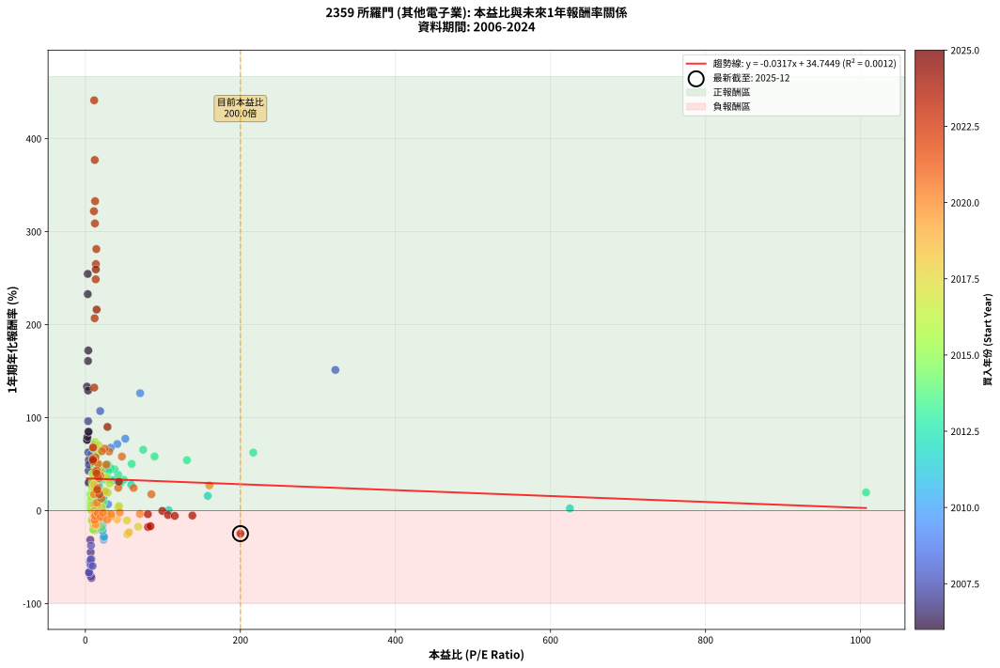
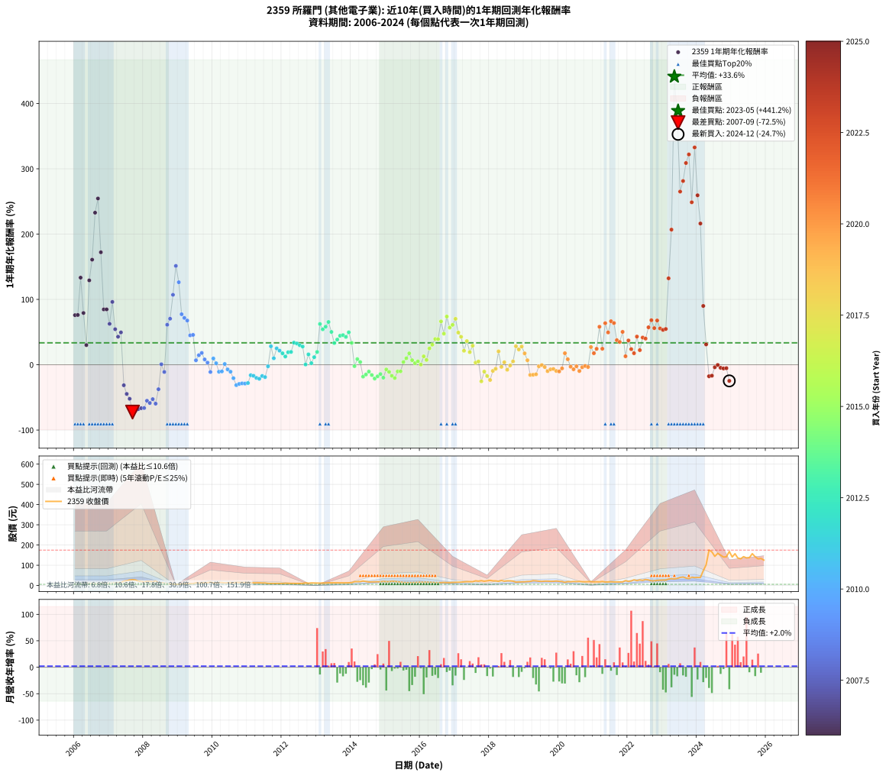

# 2359 所羅門 - 本益比與未來報酬率分析

!!! info "報告資訊"
    - **股票代號**: 2359
    - **公司名稱**: 所羅門
    - **產業別**: 其他電子業
    - **分析期間**: 2006-2024 (228 個數據點)
    - **資料來源**: Type 12 (ShowMonthlyK_ChartFlow) 月收盤價與本益比
    - **報酬率口徑**: 含現金股利 (簡化: 年度合計，假設每年7/1入帳)
    - **報告生成時間**: 2026-01-04 08:47:33 CST

## 📈 視覺化圖表

### 圖表1: 本益比 vs 未來報酬率關係

*圖表1：2359 所羅門 本益比與1年期未來報酬率關係 (2006-2024)*

### 圖表2: 歷年買入時點的1年期實際報酬率

*圖表2：2359 所羅門 歷年買入時點的1年期實際報酬率 (2006-2024)*

## 📍 買點訊號說明

本報告提供兩種買點提示訊號（顯示於圖表2的股價子圖中）：

### ▲ 小綠色三角形（回測驗證）
- **計算方式**: 使用全部歷史資料計算本益比第25百分位數
- **用途**: 事後驗證，顯示歷史上哪些時點確實為低估區
- **限制**: 當下無法判斷，僅供回測參考
- **特性**: 後見之明（Look-Ahead Bias）

### ▲ 小橘色三角形（即時訊號）
- **計算方式**: 使用截至當月的過去5年資料計算本益比第25百分位數
- **用途**: 實際投資決策，當時即可判斷
- **優勢**: 可操作性強，符合實務需求
- **特性**: 無後見之明，滾動窗口計算

!!! tip "如何使用兩種訊號"
    - **綠色▲** 幫助理解歷史估值機會，驗證策略有效性
    - **橘色▲** 可作為實際買進參考，但仍需搭配基本面分析
    - 兩種訊號重疊時，表示即時判斷與事後驗證一致，信心度較高
    - 僅有綠色▲時，表示當時無法判斷（需要未來資料才能確認）
    - 僅有橘色▲時，表示即時判斷為買點，但事後可能不是最佳時機

## 📊 估值分析摘要

| 指標 | 數值 |
|:---:|:---:|
| **目前本益比** (2024-12) | **200.00 倍** |
| **歷史平均本益比** | 34.44 倍 |
| **估值水準** | 🔴 相對高估 |
| **預期1年年化報酬率** | **+28.40%** |
| **歷史平均報酬率** | +33.55% |
| **相關係數 (R²)** | 0.0012 |
| **趨勢線斜率** | -0.0317 |

!!! abstract "核心洞察"
    目前本益比顯著高於歷史平均，預期未來報酬率可能較低

    根據歷史數據回測，2359 所羅門 在目前本益比 **200.0倍** 的估值水準下，
    預期未來1年年化報酬率約為 **+28.4%**。

    **重要提醒**: 本分析基於歷史數據統計，實際報酬率會受到公司基本面變化、產業趨勢、
    總體經濟環境等多重因素影響。R² = 0.00 表示本益比可解釋約 0.1% 的報酬率變異。

## 📈 歷史估值統計

### 最佳買點 (最高報酬率)

| 項目 | 數值 |
|:---:|:---:|
| 起始時間 | 2023-05 |
| 當時本益比 | 11.39 倍 |
| 起始價格 | 32.5 元 |
| 1年後價格 | 175.0 元 |
| **1年年化報酬率** | **+441.20%** |

### 最差買點 (最低報酬率)

| 項目 | 數值 |
|:---:|:---:|
| 起始時間 | 2007-09 |
| 當時本益比 | 7.84 倍 |
| 起始價格 | 28.8 元 |
| 1年後價格 | 7.9 元 |
| **1年年化報酬率** | **-72.46%** |

## 🎯 投資啟示

### 本益比與報酬率關係

趨勢線方程式: **y = -0.0317x + 34.7449**

!!! note "負相關"
    本益比與未來報酬率呈現負相關。較低的本益比通常帶來較高的未來報酬率，
    但相關性不算非常強。**估值仍是重要參考指標之一**。

### 估值區間建議

基於歷史數據分析:

- **🟢 低估區** (P/E < 27.6): 預期報酬率較高，可考慮增加持股
- **🟡 合理區** (P/E 27.6-41.3): 預期報酬率符合長期趨勢，正常持有
- **🔴 高估區** (P/E > 41.3): 預期報酬率較低，可考慮減碼或觀望

!!! danger "風險提示"
    - 過去表現不代表未來結果
    - 本分析假設公司基本面無重大結構性變化
    - 產業環境劇變可能使歷史規律失效
    - 應結合公司財報、產業趨勢、總體經濟等多重因素綜合判斷

!!! success "長期投資觀點"
    歷史數據顯示，在合理或低估的估值水準買入並長期持有，
    往往能獲得較佳的投資報酬。**耐心等待好價格**是價值投資的核心原則。

## 📊 數據品質

- **資料來源**: GoodInfo.tw Type 12 (ShowMonthlyK_ChartFlow)
- **資料頻率**: 月度收盤價與本益比
- **回測期間**: 2006-2024
- **數據點數量**: 228 個 (每個點代表一次1年期回測)

### 計算方法說明

1. **1年期年化報酬率**:
   - 對每個歷史時點，計算其後1年的實際投資報酬率
   - 期末價值(不含股利): 期末價格
   - 期末價值(含現金股利): 期末價格 + 持有期間內的現金股利合計 (簡化: 年度合計，假設每年7/1入帳)
   - 公式: 年化報酬率 = [(期末價值/期初價格)^(1/年數) - 1] × 100%

2. **本益比 (P/E Ratio)**:
   - 使用當時的月收盤價與EPS計算
   - 資料來源: Type 12 月度河流圖本益比數據

3. **趨勢線 (Linear Regression)**:
   - 使用最小平方法擬合線性趨勢線
   - R²值衡量本益比對報酬率的解釋能力

---

*本報告由 Stock Analysis System v1.9.0 自動生成*
*數據更新時間: 2026-01-04 08:47:33 CST*

## 📋 月度回測明細表

（每一列對應時間線圖中的一個買入點；可用來對照 SVG 圖上的每個點。）

| 買入月份 | 賣出月份 | 回測期限_年 | 實際持有年數 | 買入本益比_倍 | 買入收盤價_元 | 賣出收盤價_元 | 現金股利合計_元 | 總報酬率_pct | 年化報酬率_pct |
| --- | --- | --- | --- | --- | --- | --- | --- | --- | --- |
| 2006-01 | 2007-01 | 1 | 0.999 | 2.25 | 6.00 | 10.55 | 0.00 | +75.83 | +75.90 |
| 2006-02 | 2007-02 | 1 | 0.999 | 2.18 | 5.82 | 10.25 | 0.00 | +76.12 | +76.19 |
| 2006-03 | 2007-03 | 1 | 0.999 | 2.12 | 5.66 | 13.20 | 0.00 | +133.22 | +133.35 |
| 2006-04 | 2007-04 | 1 | 0.999 | 2.70 | 7.20 | 12.90 | 0.00 | +79.17 | +79.24 |
| 2006-05 | 2007-05 | 1 | 0.999 | 4.23 | 11.30 | 14.70 | 0.00 | +30.09 | +30.11 |
| 2006-06 | 2007-06 | 1 | 0.999 | 3.48 | 9.30 | 21.30 | 0.00 | +129.03 | +129.16 |
| 2006-07 | 2007-07 | 1 | 0.999 | 3.40 | 9.09 | 23.70 | 0.00 | +160.73 | +160.90 |
| 2006-08 | 2007-08 | 1 | 0.999 | 3.09 | 8.24 | 27.40 | 0.00 | +232.52 | +232.80 |
| 2006-09 | 2007-09 | 1 | 0.999 | 3.04 | 8.13 | 28.80 | 0.00 | +254.24 | +254.55 |
| 2006-10 | 2007-10 | 1 | 0.999 | 3.75 | 10.00 | 27.20 | 0.00 | +172.00 | +172.19 |
| 2006-11 | 2007-11 | 1 | 0.999 | 4.27 | 11.40 | 21.05 | 0.00 | +84.65 | +84.73 |
| 2006-12 | 2007-12 | 1 | 0.999 | 3.91 | 10.45 | 19.30 | 0.00 | +84.69 | +84.77 |
| 2007-01 | 2008-01 | 1 | 0.999 | 3.79 | 10.55 | 17.15 | 0.00 | +62.56 | +62.61 |
| 2007-02 | 2008-02 | 1 | 0.999 | 3.54 | 10.25 | 20.10 | 0.00 | +96.10 | +96.19 |
| 2007-03 | 2008-03 | 1 | 1.002 | 4.39 | 13.20 | 20.40 | 0.00 | +54.55 | +54.41 |
| 2007-04 | 2008-04 | 1 | 1.002 | 4.14 | 12.90 | 18.45 | 0.00 | +43.02 | +42.92 |
| 2007-05 | 2008-05 | 1 | 1.002 | 4.55 | 14.70 | 22.00 | 0.00 | +49.66 | +49.54 |
| 2007-06 | 2008-06 | 1 | 1.002 | 6.38 | 21.30 | 14.60 | 0.00 | -31.46 | -31.40 |
| 2007-07 | 2008-07 | 1 | 1.002 | 6.87 | 23.70 | 13.10 | 0.00 | -44.73 | -44.66 |
| 2007-08 | 2008-08 | 1 | 1.002 | 7.69 | 27.40 | 13.10 | 0.00 | -52.19 | -52.12 |
| 2007-09 | 2008-09 | 1 | 1.002 | 7.84 | 28.80 | 7.91 | 0.00 | -72.53 | -72.46 |
| 2007-10 | 2008-10 | 1 | 1.002 | 7.18 | 27.20 | 7.95 | 0.00 | -70.77 | -70.70 |
| 2007-11 | 2008-11 | 1 | 1.002 | 5.40 | 21.05 | 6.74 | 0.00 | -67.98 | -67.91 |
| 2007-12 | 2008-12 | 1 | 1.002 | 4.81 | 19.30 | 6.45 | 0.00 | -66.58 | -66.51 |
| 2008-01 | 2009-01 | 1 | 1.002 | 4.66 | 17.15 | 5.77 | 0.00 | -66.36 | -66.28 |
| 2008-02 | 2009-03 | 1 | 1.081 | 6.01 | 20.10 | 8.45 | 0.00 | -57.96 | -55.12 |
| 2008-03 | 2009-03 | 1 | 0.999 | 6.77 | 20.40 | 8.45 | 0.00 | -58.58 | -58.60 |
| 2008-04 | 2009-04 | 1 | 0.999 | 6.88 | 18.45 | 8.74 | 0.00 | -52.63 | -52.65 |
| 2008-05 | 2009-05 | 1 | 0.999 | 9.37 | 22.00 | 8.90 | 0.00 | -59.55 | -59.57 |
| 2008-06 | 2009-06 | 1 | 0.999 | 7.25 | 14.60 | 9.13 | 0.00 | -37.47 | -37.49 |
| 2008-07 | 2009-07 | 1 | 0.999 | 7.79 | 13.10 | 13.20 | 0.00 | +0.76 | +0.76 |
| 2008-08 | 2009-08 | 1 | 0.999 | 9.70 | 13.10 | 11.65 | 0.00 | -11.07 | -11.08 |
| 2008-09 | 2009-09 | 1 | 0.999 | 7.77 | 7.91 | 12.75 | 0.00 | +61.19 | +61.24 |
| 2008-10 | 2009-10 | 1 | 0.999 | 11.61 | 7.95 | 13.55 | 0.00 | +70.44 | +70.50 |
| 2008-11 | 2009-11 | 1 | 0.999 | 19.12 | 6.74 | 13.95 | 0.00 | +106.97 | +107.08 |
| 2008-12 | 2009-12 | 1 | 0.999 | 322.50 | 6.45 | 16.20 | 0.00 | +151.16 | +151.32 |
| 2009-01 | 2010-01 | 1 | 0.999 | 70.65 | 5.77 | 13.05 | 0.00 | +126.17 | +126.30 |
| 2009-02 | 2010-02 | 1 | 0.999 | 51.56 | 7.39 | 13.10 | 0.00 | +77.27 | +77.34 |
| 2009-03 | 2010-03 | 1 | 0.999 | 41.22 | 8.45 | 14.50 | 0.00 | +71.60 | +71.66 |
| 2009-04 | 2010-04 | 1 | 0.999 | 32.78 | 8.74 | 14.65 | 0.00 | +67.62 | +67.68 |
| 2009-05 | 2010-05 | 1 | 0.999 | 27.11 | 8.90 | 12.90 | 0.00 | +44.94 | +44.98 |
| 2009-06 | 2010-06 | 1 | 0.999 | 23.41 | 9.13 | 13.30 | 0.00 | +45.67 | +45.71 |
| 2009-07 | 2010-07 | 1 | 0.999 | 29.23 | 13.20 | 14.10 | 0.00 | +6.82 | +6.82 |
| 2009-08 | 2010-08 | 1 | 0.999 | 22.69 | 11.65 | 13.35 | 0.00 | +14.59 | +14.60 |
| 2009-09 | 2010-09 | 1 | 0.999 | 22.17 | 12.75 | 15.05 | 0.00 | +18.04 | +18.05 |
| 2009-10 | 2010-10 | 1 | 0.999 | 21.28 | 13.55 | 14.65 | 0.00 | +8.12 | +8.12 |
| 2009-11 | 2010-11 | 1 | 0.999 | 19.98 | 13.95 | 14.40 | 0.00 | +3.23 | +3.23 |
| 2009-12 | 2010-12 | 1 | 0.999 | 21.32 | 16.20 | 14.40 | 0.00 | -11.11 | -11.12 |
| 2010-01 | 2011-01 | 1 | 0.999 | 17.48 | 13.05 | 14.30 | 0.00 | +9.58 | +9.59 |
| 2010-02 | 2011-02 | 1 | 0.999 | 17.86 | 13.10 | 13.40 | 0.00 | +2.29 | +2.29 |
| 2010-03 | 2011-03 | 1 | 0.999 | 20.14 | 14.50 | 12.95 | 0.00 | -10.69 | -10.70 |
| 2010-04 | 2011-04 | 1 | 0.999 | 20.73 | 14.65 | 13.15 | 0.00 | -10.24 | -10.25 |
| 2010-05 | 2011-05 | 1 | 0.999 | 18.61 | 12.90 | 13.05 | 0.00 | +1.16 | +1.16 |
| 2010-06 | 2011-06 | 1 | 0.999 | 19.56 | 13.30 | 12.35 | 0.00 | -7.14 | -7.15 |
| 2010-07 | 2011-07 | 1 | 0.999 | 21.15 | 14.10 | 12.30 | 0.30 | -10.64 | -10.65 |
| 2010-08 | 2011-08 | 1 | 0.999 | 20.43 | 13.35 | 10.30 | 0.30 | -20.60 | -20.61 |
| 2010-09 | 2011-09 | 1 | 0.999 | 23.52 | 15.05 | 10.05 | 0.30 | -31.23 | -31.25 |
| 2010-10 | 2011-10 | 1 | 0.999 | 23.38 | 14.65 | 10.05 | 0.30 | -29.35 | -29.37 |
| 2010-11 | 2011-11 | 1 | 0.999 | 23.48 | 14.40 | 9.99 | 0.30 | -28.54 | -28.56 |
| 2010-12 | 2011-12 | 1 | 0.999 | 24.00 | 14.40 | 9.95 | 0.30 | -28.82 | -28.84 |
| 2011-01 | 2012-01 | 1 | 0.999 | 23.93 | 14.30 | 10.00 | 0.30 | -27.97 | -27.99 |
| 2011-02 | 2012-02 | 1 | 0.999 | 22.52 | 13.40 | 10.95 | 0.30 | -16.04 | -16.05 |
| 2011-03 | 2012-03 | 1 | 1.002 | 21.86 | 12.95 | 10.45 | 0.30 | -16.99 | -16.96 |
| 2011-04 | 2012-04 | 1 | 1.002 | 22.29 | 13.15 | 10.20 | 0.30 | -20.15 | -20.12 |
| 2011-05 | 2012-05 | 1 | 1.002 | 22.21 | 13.05 | 9.94 | 0.30 | -21.53 | -21.49 |
| 2011-06 | 2012-06 | 1 | 1.002 | 21.11 | 12.35 | 9.92 | 0.30 | -17.25 | -17.21 |
| 2011-07 | 2012-07 | 1 | 1.002 | 21.12 | 12.30 | 9.97 | 0.00 | -18.94 | -18.91 |
| 2011-08 | 2012-08 | 1 | 1.002 | 17.76 | 10.30 | 10.05 | 0.00 | -2.43 | -2.42 |
| 2011-09 | 2012-09 | 1 | 1.002 | 17.40 | 10.05 | 12.90 | 0.00 | +28.36 | +28.29 |
| 2011-10 | 2012-10 | 1 | 1.002 | 17.48 | 10.05 | 11.05 | 0.00 | +9.95 | +9.93 |
| 2011-11 | 2012-11 | 1 | 1.002 | 17.45 | 9.99 | 12.50 | 0.00 | +25.13 | +25.07 |
| 2011-12 | 2012-12 | 1 | 1.002 | 17.46 | 9.95 | 12.10 | 0.00 | +21.61 | +21.56 |
| 2012-01 | 2013-01 | 1 | 1.002 | 19.23 | 10.00 | 11.75 | 0.00 | +17.50 | +17.46 |
| 2012-02 | 2013-03 | 1 | 1.081 | 23.30 | 10.95 | 12.45 | 0.00 | +13.70 | +12.60 |
| 2012-03 | 2013-03 | 1 | 0.999 | 24.88 | 10.45 | 12.45 | 0.00 | +19.14 | +19.15 |
| 2012-04 | 2013-04 | 1 | 0.999 | 27.57 | 10.20 | 12.20 | 0.00 | +19.61 | +19.62 |
| 2012-05 | 2013-05 | 1 | 0.999 | 31.06 | 9.94 | 13.30 | 0.00 | +33.80 | +33.83 |
| 2012-06 | 2013-06 | 1 | 0.999 | 36.74 | 9.92 | 13.15 | 0.00 | +32.56 | +32.59 |
| 2012-07 | 2013-07 | 1 | 0.999 | 45.32 | 9.97 | 12.95 | 0.00 | +29.89 | +29.91 |
| 2012-08 | 2013-08 | 1 | 0.999 | 59.12 | 10.05 | 12.85 | 0.00 | +27.86 | +27.88 |
| 2012-09 | 2013-09 | 1 | 0.999 | 107.50 | 12.90 | 12.95 | 0.00 | +0.39 | +0.39 |
| 2012-10 | 2013-10 | 1 | 0.999 | 157.90 | 11.05 | 12.80 | 0.00 | +15.84 | +15.85 |
| 2012-11 | 2013-11 | 1 | 0.999 | 625.00 | 12.50 | 12.80 | 0.00 | +2.40 | +2.40 |
| 2012-12 | 2013-12 | 1 | 0.999 |  | 12.10 | 13.50 | 0.00 | +11.57 | +11.58 |
| 2013-01 | 2014-01 | 1 | 0.999 | 1007.00 | 11.75 | 14.05 | 0.00 | +19.57 | +19.59 |
| 2013-02 | 2014-02 | 1 | 0.999 | 216.60 | 11.55 | 18.75 | 0.00 | +62.34 | +62.39 |
| 2013-03 | 2014-03 | 1 | 0.999 | 131.00 | 12.45 | 19.20 | 0.00 | +54.22 | +54.26 |
| 2013-04 | 2014-04 | 1 | 0.999 | 89.27 | 12.20 | 19.30 | 0.00 | +58.20 | +58.25 |
| 2013-05 | 2014-05 | 1 | 0.999 | 74.58 | 13.30 | 22.00 | 0.00 | +65.41 | +65.47 |
| 2013-06 | 2014-06 | 1 | 0.999 | 59.77 | 13.15 | 19.75 | 0.00 | +50.19 | +50.23 |
| 2013-07 | 2014-07 | 1 | 0.999 | 49.49 | 12.95 | 17.25 | 0.00 | +33.20 | +33.23 |
| 2013-08 | 2014-08 | 1 | 0.999 | 42.36 | 12.85 | 17.80 | 0.00 | +38.52 | +38.55 |
| 2013-09 | 2014-09 | 1 | 0.999 | 37.54 | 12.95 | 18.70 | 0.00 | +44.40 | +44.44 |
| 2013-10 | 2014-10 | 1 | 0.999 | 33.10 | 12.80 | 18.60 | 0.00 | +45.31 | +45.35 |
| 2013-11 | 2014-11 | 1 | 0.999 | 29.88 | 12.80 | 18.25 | 0.00 | +42.58 | +42.61 |
| 2013-12 | 2014-12 | 1 | 0.999 | 28.72 | 13.50 | 20.20 | 0.00 | +49.63 | +49.67 |
| 2014-01 | 2015-01 | 1 | 0.999 | 23.81 | 14.05 | 18.75 | 0.00 | +33.45 | +33.48 |
| 2014-02 | 2015-02 | 1 | 0.999 | 26.41 | 18.75 | 18.35 | 0.00 | -2.13 | -2.13 |
| 2014-03 | 2015-03 | 1 | 0.999 | 23.13 | 19.20 | 20.85 | 0.00 | +8.59 | +8.60 |
| 2014-04 | 2015-04 | 1 | 0.999 | 20.32 | 19.30 | 20.10 | 0.00 | +4.15 | +4.15 |
| 2014-05 | 2015-05 | 1 | 0.999 | 20.56 | 22.00 | 18.00 | 0.00 | -18.18 | -18.19 |
| 2014-06 | 2015-06 | 1 | 0.999 | 16.60 | 19.75 | 16.80 | 0.00 | -14.94 | -14.95 |
| 2014-07 | 2015-07 | 1 | 0.999 | 13.17 | 17.25 | 14.45 | 1.00 | -10.43 | -10.44 |
| 2014-08 | 2015-08 | 1 | 0.999 | 12.45 | 17.80 | 14.00 | 1.00 | -15.73 | -15.74 |
| 2014-09 | 2015-09 | 1 | 0.999 | 12.06 | 18.70 | 13.75 | 1.00 | -21.12 | -21.14 |
| 2014-10 | 2015-10 | 1 | 0.999 | 11.14 | 18.60 | 14.30 | 1.00 | -17.74 | -17.75 |
| 2014-11 | 2015-11 | 1 | 0.999 | 10.20 | 18.25 | 14.65 | 1.00 | -14.25 | -14.26 |
| 2014-12 | 2015-12 | 1 | 0.999 | 10.58 | 20.20 | 15.20 | 1.00 | -19.80 | -19.81 |
| 2015-01 | 2016-01 | 1 | 0.999 | 9.72 | 18.75 | 16.40 | 1.00 | -7.20 | -7.20 |
| 2015-02 | 2016-02 | 1 | 0.999 | 9.41 | 18.35 | 15.35 | 1.00 | -10.90 | -10.91 |
| 2015-03 | 2016-03 | 1 | 1.002 | 10.58 | 20.85 | 16.30 | 1.00 | -17.03 | -16.99 |
| 2015-04 | 2016-04 | 1 | 1.002 | 10.10 | 20.10 | 15.00 | 1.00 | -20.40 | -20.36 |
| 2015-05 | 2016-05 | 1 | 1.002 | 8.96 | 18.00 | 15.15 | 1.00 | -10.28 | -10.26 |
| 2015-06 | 2016-06 | 1 | 1.002 | 8.28 | 16.80 | 14.10 | 1.00 | -10.12 | -10.10 |
| 2015-07 | 2016-07 | 1 | 1.002 | 7.05 | 14.45 | 14.05 | 1.00 | +4.15 | +4.14 |
| 2015-08 | 2016-08 | 1 | 1.002 | 6.76 | 14.00 | 14.40 | 1.00 | +10.00 | +9.98 |
| 2015-09 | 2016-09 | 1 | 1.002 | 6.58 | 13.75 | 15.15 | 1.00 | +17.45 | +17.42 |
| 2015-10 | 2016-10 | 1 | 1.002 | 6.78 | 14.30 | 14.30 | 1.00 | +6.99 | +6.98 |
| 2015-11 | 2016-11 | 1 | 1.002 | 6.88 | 14.65 | 14.00 | 1.00 | +2.39 | +2.38 |
| 2015-12 | 2016-12 | 1 | 1.002 | 7.07 | 15.20 | 15.00 | 1.00 | +5.26 | +5.25 |
| 2016-01 | 2017-01 | 1 | 1.002 | 8.00 | 16.40 | 15.45 | 1.00 | +0.30 | +0.30 |
| 2016-02 | 2017-03 | 1 | 1.081 | 7.87 | 15.35 | 16.50 | 1.00 | +14.01 | +12.89 |
| 2016-03 | 2017-03 | 1 | 0.999 | 8.81 | 16.30 | 16.50 | 1.00 | +7.36 | +7.37 |
| 2016-04 | 2017-04 | 1 | 0.999 | 8.57 | 15.00 | 17.75 | 1.00 | +25.00 | +25.02 |
| 2016-05 | 2017-05 | 1 | 0.999 | 9.18 | 15.15 | 18.80 | 1.00 | +30.69 | +30.72 |
| 2016-06 | 2017-06 | 1 | 0.999 | 9.10 | 14.10 | 18.65 | 1.00 | +39.36 | +39.39 |
| 2016-07 | 2017-07 | 1 | 0.999 | 9.69 | 14.05 | 18.55 | 1.00 | +39.15 | +39.18 |
| 2016-08 | 2017-08 | 1 | 0.999 | 10.67 | 14.40 | 22.95 | 1.00 | +66.32 | +66.38 |
| 2016-09 | 2017-09 | 1 | 0.999 | 12.12 | 15.15 | 21.35 | 1.00 | +47.52 | +47.56 |
| 2016-10 | 2017-10 | 1 | 0.999 | 12.43 | 14.30 | 23.85 | 1.00 | +73.78 | +73.84 |
| 2016-11 | 2017-11 | 1 | 0.999 | 13.33 | 14.00 | 20.95 | 1.00 | +56.79 | +56.83 |
| 2016-12 | 2017-12 | 1 | 0.999 | 15.79 | 15.00 | 23.15 | 1.00 | +61.00 | +61.05 |
| 2017-01 | 2018-01 | 1 | 0.999 | 17.18 | 15.45 | 25.30 | 1.00 | +70.23 | +70.29 |
| 2017-02 | 2018-02 | 1 | 0.999 | 18.80 | 15.95 | 22.80 | 1.00 | +49.22 | +49.26 |
| 2017-03 | 2018-03 | 1 | 0.999 | 20.69 | 16.50 | 22.55 | 1.00 | +42.73 | +42.76 |
| 2017-04 | 2018-04 | 1 | 0.999 | 23.77 | 17.75 | 20.55 | 1.00 | +21.41 | +21.42 |
| 2017-05 | 2018-05 | 1 | 0.999 | 27.02 | 18.80 | 24.60 | 1.00 | +36.17 | +36.20 |
| 2017-06 | 2018-06 | 1 | 0.999 | 28.91 | 18.65 | 21.25 | 1.00 | +19.30 | +19.32 |
| 2017-07 | 2018-07 | 1 | 0.999 | 31.22 | 18.55 | 22.95 | 1.00 | +29.11 | +29.13 |
| 2017-08 | 2018-08 | 1 | 0.999 | 42.24 | 22.95 | 22.70 | 1.00 | +3.27 | +3.27 |
| 2017-09 | 2018-09 | 1 | 0.999 | 43.35 | 21.35 | 21.40 | 1.00 | +4.92 | +4.92 |
| 2017-10 | 2018-10 | 1 | 0.999 | 54.00 | 23.85 | 16.80 | 1.00 | -25.37 | -25.38 |
| 2017-11 | 2018-11 | 1 | 0.999 | 53.60 | 20.95 | 17.75 | 1.00 | -10.50 | -10.51 |
| 2017-12 | 2018-12 | 1 | 0.999 | 68.09 | 23.15 | 18.15 | 1.00 | -17.28 | -17.29 |
| 2018-01 | 2019-01 | 1 | 0.999 | 56.33 | 25.30 | 18.40 | 1.00 | -23.32 | -23.33 |
| 2018-02 | 2019-02 | 1 | 0.999 | 40.84 | 22.80 | 19.65 | 1.00 | -9.43 | -9.44 |
| 2018-03 | 2019-03 | 1 | 0.999 | 33.78 | 22.55 | 20.15 | 1.00 | -6.21 | -6.21 |
| 2018-04 | 2019-04 | 1 | 0.999 | 26.46 | 20.55 | 23.75 | 1.00 | +20.44 | +20.45 |
| 2018-05 | 2019-05 | 1 | 0.999 | 27.77 | 24.60 | 22.80 | 1.00 | -3.25 | -3.25 |
| 2018-06 | 2019-06 | 1 | 0.999 | 21.36 | 21.25 | 21.05 | 1.00 | +3.76 | +3.77 |
| 2018-07 | 2019-07 | 1 | 0.999 | 20.78 | 22.95 | 20.10 | 1.10 | -7.63 | -7.63 |
| 2018-08 | 2019-08 | 1 | 0.999 | 18.71 | 22.70 | 21.35 | 1.10 | -1.10 | -1.10 |
| 2018-09 | 2019-09 | 1 | 0.999 | 16.18 | 21.40 | 21.40 | 1.10 | +5.14 | +5.14 |
| 2018-10 | 2019-10 | 1 | 0.999 | 11.73 | 16.80 | 20.45 | 1.10 | +28.27 | +28.30 |
| 2018-11 | 2019-11 | 1 | 0.999 | 11.52 | 17.75 | 20.80 | 1.10 | +23.38 | +23.40 |
| 2018-12 | 2019-12 | 1 | 0.999 | 11.00 | 18.15 | 22.10 | 1.10 | +27.82 | +27.85 |
| 2019-01 | 2020-01 | 1 | 0.999 | 11.03 | 18.40 | 20.50 | 1.10 | +17.39 | +17.40 |
| 2019-02 | 2020-02 | 1 | 0.999 | 11.66 | 19.65 | 19.90 | 1.10 | +6.87 | +6.88 |
| 2019-03 | 2020-03 | 1 | 1.002 | 11.84 | 20.15 | 15.90 | 1.10 | -15.63 | -15.60 |
| 2019-04 | 2020-04 | 1 | 1.002 | 13.81 | 23.75 | 19.00 | 1.10 | -15.37 | -15.34 |
| 2019-05 | 2020-05 | 1 | 1.002 | 13.12 | 22.80 | 18.35 | 1.10 | -14.69 | -14.67 |
| 2019-06 | 2020-06 | 1 | 1.002 | 11.99 | 21.05 | 19.45 | 1.10 | -2.38 | -2.37 |
| 2019-07 | 2020-07 | 1 | 1.002 | 11.34 | 20.10 | 19.20 | 0.80 | -0.50 | -0.50 |
| 2019-08 | 2020-08 | 1 | 1.002 | 11.93 | 21.35 | 19.80 | 0.80 | -3.51 | -3.51 |
| 2019-09 | 2020-09 | 1 | 1.002 | 11.84 | 21.40 | 18.50 | 0.80 | -9.81 | -9.79 |
| 2019-10 | 2020-10 | 1 | 1.002 | 11.21 | 20.45 | 18.20 | 0.80 | -7.09 | -7.08 |
| 2019-11 | 2020-11 | 1 | 1.002 | 11.29 | 20.80 | 18.65 | 0.80 | -6.49 | -6.48 |
| 2019-12 | 2020-12 | 1 | 1.002 | 11.88 | 22.10 | 19.20 | 0.80 | -9.50 | -9.48 |
| 2020-01 | 2021-01 | 1 | 1.002 | 11.95 | 20.50 | 17.60 | 0.80 | -10.24 | -10.22 |
| 2020-02 | 2021-03 | 1 | 1.081 | 12.68 | 19.90 | 17.90 | 0.80 | -6.03 | -5.59 |
| 2020-03 | 2021-03 | 1 | 0.999 | 11.16 | 15.90 | 17.90 | 0.80 | +17.61 | +17.62 |
| 2020-04 | 2021-04 | 1 | 0.999 | 14.84 | 19.00 | 19.80 | 0.80 | +8.42 | +8.43 |
| 2020-05 | 2021-05 | 1 | 0.999 | 16.17 | 18.35 | 17.00 | 0.80 | -3.00 | -3.00 |
| 2020-06 | 2021-06 | 1 | 0.999 | 19.65 | 19.45 | 17.30 | 0.80 | -6.94 | -6.95 |
| 2020-07 | 2021-07 | 1 | 0.999 | 22.72 | 19.20 | 18.25 | 0.50 | -2.34 | -2.35 |
| 2020-08 | 2021-08 | 1 | 0.999 | 28.29 | 19.80 | 17.40 | 0.50 | -9.60 | -9.60 |
| 2020-09 | 2021-09 | 1 | 0.999 | 33.33 | 18.50 | 17.30 | 0.50 | -3.78 | -3.79 |
| 2020-10 | 2021-10 | 1 | 0.999 | 44.39 | 18.20 | 17.35 | 0.50 | -1.92 | -1.92 |
| 2020-11 | 2021-11 | 1 | 0.999 | 70.38 | 18.65 | 17.50 | 0.50 | -3.49 | -3.49 |
| 2020-12 | 2021-12 | 1 | 0.999 | 160.00 | 19.20 | 23.90 | 0.50 | +27.08 | +27.10 |
| 2021-01 | 2022-01 | 1 | 0.999 | 85.16 | 17.60 | 20.20 | 0.50 | +17.61 | +17.63 |
| 2021-02 | 2022-02 | 1 | 0.999 | 62.22 | 18.25 | 22.20 | 0.50 | +24.38 | +24.40 |
| 2021-03 | 2022-03 | 1 | 0.999 | 47.11 | 17.90 | 27.80 | 0.50 | +58.10 | +58.15 |
| 2021-04 | 2022-04 | 1 | 0.999 | 42.43 | 19.80 | 24.15 | 0.50 | +24.49 | +24.51 |
| 2021-05 | 2022-05 | 1 | 0.999 | 30.72 | 17.00 | 27.30 | 0.50 | +63.53 | +63.58 |
| 2021-06 | 2022-06 | 1 | 0.999 | 27.03 | 17.30 | 25.35 | 0.50 | +49.42 | +49.46 |
| 2021-07 | 2022-07 | 1 | 0.999 | 25.11 | 18.25 | 29.50 | 0.90 | +66.58 | +66.63 |
| 2021-08 | 2022-08 | 1 | 0.999 | 21.39 | 17.40 | 27.60 | 0.90 | +63.79 | +63.85 |
| 2021-09 | 2022-09 | 1 | 0.999 | 19.22 | 17.30 | 22.90 | 0.90 | +37.57 | +37.60 |
| 2021-10 | 2022-10 | 1 | 0.999 | 17.58 | 17.35 | 22.50 | 0.90 | +34.87 | +34.90 |
| 2021-11 | 2022-11 | 1 | 0.999 | 16.30 | 17.50 | 25.40 | 0.90 | +50.29 | +50.33 |
| 2021-12 | 2022-12 | 1 | 0.999 | 20.60 | 23.90 | 26.10 | 0.90 | +12.97 | +12.98 |
| 2022-01 | 2023-01 | 1 | 0.999 | 15.71 | 20.20 | 26.80 | 0.90 | +37.13 | +37.16 |
| 2022-02 | 2023-02 | 1 | 0.999 | 15.73 | 22.20 | 26.60 | 0.90 | +23.87 | +23.89 |
| 2022-03 | 2023-03 | 1 | 0.999 | 18.08 | 27.80 | 31.80 | 0.90 | +17.63 | +17.64 |
| 2022-04 | 2023-04 | 1 | 0.999 | 14.52 | 24.15 | 33.65 | 0.90 | +43.06 | +43.10 |
| 2022-05 | 2023-05 | 1 | 0.999 | 15.26 | 27.30 | 32.50 | 0.90 | +22.34 | +22.36 |
| 2022-06 | 2023-06 | 1 | 0.999 | 13.24 | 25.35 | 35.00 | 0.90 | +41.62 | +41.65 |
| 2022-07 | 2023-07 | 1 | 0.999 | 14.45 | 29.50 | 39.80 | 1.50 | +40.00 | +40.03 |
| 2022-08 | 2023-08 | 1 | 0.999 | 12.74 | 27.60 | 41.90 | 1.50 | +57.25 | +57.30 |
| 2022-09 | 2023-09 | 1 | 0.999 | 9.99 | 22.90 | 37.00 | 1.50 | +68.12 | +68.18 |
| 2022-10 | 2023-10 | 1 | 0.999 | 9.30 | 22.50 | 33.60 | 1.50 | +56.00 | +56.05 |
| 2022-11 | 2023-11 | 1 | 0.999 | 9.98 | 25.40 | 41.10 | 1.50 | +67.72 | +67.78 |
| 2022-12 | 2023-12 | 1 | 0.999 | 9.78 | 26.10 | 39.10 | 1.50 | +55.56 | +55.60 |
| 2023-01 | 2024-01 | 1 | 0.999 | 9.90 | 26.80 | 39.60 | 1.50 | +53.36 | +53.40 |
| 2023-02 | 2024-02 | 1 | 0.999 | 9.70 | 26.60 | 39.65 | 1.50 | +54.70 | +54.75 |
| 2023-03 | 2024-03 | 1 | 1.002 | 11.44 | 31.80 | 72.50 | 1.50 | +132.70 | +132.30 |
| 2023-04 | 2024-04 | 1 | 1.002 | 11.95 | 33.65 | 102.00 | 1.50 | +207.58 | +206.87 |
| 2023-05 | 2024-05 | 1 | 1.002 | 11.39 | 32.50 | 175.00 | 1.50 | +443.08 | +441.20 |
| 2023-06 | 2024-06 | 1 | 1.002 | 12.11 | 35.00 | 166.00 | 1.50 | +378.57 | +377.04 |
| 2023-07 | 2024-07 | 1 | 1.002 | 13.60 | 39.80 | 144.00 | 1.70 | +266.08 | +265.11 |
| 2023-08 | 2024-08 | 1 | 1.002 | 14.14 | 41.90 | 158.50 | 1.70 | +282.34 | +281.29 |
| 2023-09 | 2024-09 | 1 | 1.002 | 12.33 | 37.00 | 150.00 | 1.70 | +310.00 | +308.82 |
| 2023-10 | 2024-10 | 1 | 1.002 | 11.06 | 33.60 | 140.50 | 1.70 | +323.21 | +321.96 |
| 2023-11 | 2024-11 | 1 | 1.002 | 13.37 | 41.10 | 142.00 | 1.70 | +249.64 | +248.74 |
| 2023-12 | 2024-12 | 1 | 1.002 | 12.57 | 39.10 | 168.00 | 1.70 | +334.02 | +332.71 |
| 2024-01 | 2025-01 | 1 | 1.002 | 13.56 | 39.60 | 141.00 | 1.70 | +260.35 | +259.41 |
| 2024-02 | 2025-03 | 1 | 1.081 | 14.51 | 39.65 | 136.00 | 1.70 | +247.29 | +216.20 |
| 2024-03 | 2025-03 | 1 | 0.999 | 28.52 | 72.50 | 136.00 | 1.70 | +89.93 | +90.01 |
| 2024-04 | 2025-04 | 1 | 0.999 | 43.34 | 102.00 | 132.00 | 1.70 | +31.08 | +31.10 |
| 2024-05 | 2025-05 | 1 | 0.999 | 80.86 | 175.00 | 142.50 | 1.70 | -17.60 | -17.61 |
| 2024-06 | 2025-06 | 1 | 0.999 | 84.05 | 166.00 | 136.50 | 1.70 | -16.75 | -16.76 |
| 2024-07 | 2025-07 | 1 | 0.999 | 80.63 | 144.00 | 137.50 | 1.00 | -3.82 | -3.82 |
| 2024-08 | 2025-08 | 1 | 0.999 | 99.27 | 158.50 | 157.00 | 1.00 | -0.32 | -0.32 |
| 2024-09 | 2025-09 | 1 | 0.999 | 106.60 | 150.00 | 142.00 | 1.00 | -4.67 | -4.67 |
| 2024-10 | 2025-10 | 1 | 0.999 | 115.30 | 140.50 | 131.50 | 1.00 | -5.69 | -5.70 |
| 2024-11 | 2025-11 | 1 | 0.999 | 138.00 | 142.00 | 133.50 | 1.00 | -5.28 | -5.29 |
| 2024-12 | 2025-12 | 1 | 0.999 | 200.00 | 168.00 | 125.50 | 1.00 | -24.70 | -24.72 |
