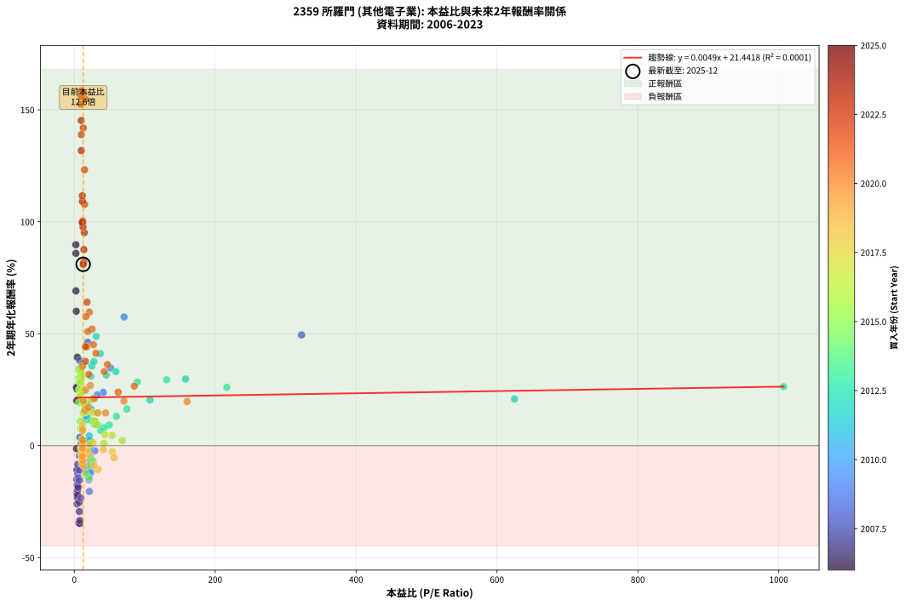
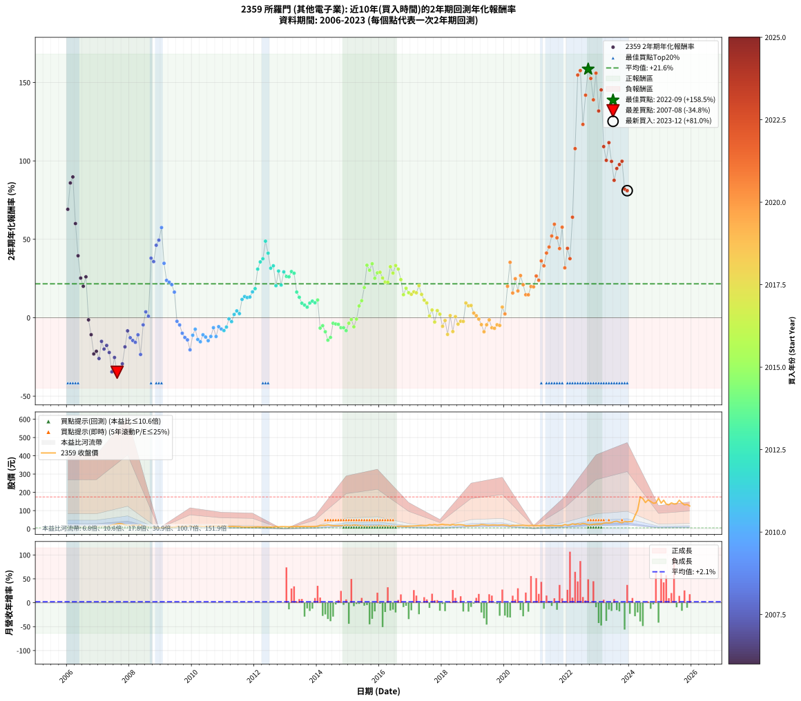

# 2359 所羅門 - 本益比與未來報酬率分析

!!! info "報告資訊"
    - **股票代號**: 2359
    - **公司名稱**: 所羅門
    - **產業別**: 其他電子業
    - **分析期間**: 2006-2023 (216 個數據點)
    - **資料來源**: Type 12 (ShowMonthlyK_ChartFlow) 月收盤價與本益比
    - **報酬率口徑**: 含現金股利 (簡化: 年度合計，假設每年7/1入帳)
    - **報告生成時間**: 2026-01-07 20:39:59 CST

## 📈 視覺化圖表

### 圖表1: 本益比 vs 未來報酬率關係

*圖表1：2359 所羅門 本益比與2年期未來報酬率關係 (2006-2023)*

### 圖表2: 歷年買入時點的2年期實際報酬率

*圖表2：2359 所羅門 歷年買入時點的2年期實際報酬率 (2006-2023)*

## 📍 買點訊號說明

本報告提供兩種買點提示訊號（顯示於圖表2的股價子圖中）：

### ▲ 小綠色三角形（回測驗證）
- **計算方式**: 使用全部歷史資料計算本益比第25百分位數
- **用途**: 事後驗證，顯示歷史上哪些時點確實為低估區
- **限制**: 當下無法判斷，僅供回測參考
- **特性**: 後見之明（Look-Ahead Bias）

### ▲ 小橘色三角形（即時訊號）
- **計算方式**: 使用截至當月的過去5年資料計算本益比第25百分位數
- **用途**: 實際投資決策，當時即可判斷
- **優勢**: 可操作性強，符合實務需求
- **特性**: 無後見之明，滾動窗口計算

!!! tip "如何使用兩種訊號"
    - **綠色▲** 幫助理解歷史估值機會，驗證策略有效性
    - **橘色▲** 可作為實際買進參考，但仍需搭配基本面分析
    - 兩種訊號重疊時，表示即時判斷與事後驗證一致，信心度較高
    - 僅有綠色▲時，表示當時無法判斷（需要未來資料才能確認）
    - 僅有橘色▲時，表示即時判斷為買點，但事後可能不是最佳時機

## 📊 估值分析摘要

| 指標 | 數值 |
|:---:|:---:|
| **目前本益比** (2023-12) | **12.57 倍** |
| **歷史平均本益比** | 31.69 倍 |
| **估值水準** | 🟢 相對低估 |
| **預期2年年化報酬率** | **+21.50%** |
| **歷史平均報酬率** | +21.63% |
| **相關係數 (R²)** | 0.0001 |
| **趨勢線斜率** | 0.0049 |

!!! abstract "核心洞察"
    目前本益比顯著低於歷史平均，預期未來報酬率可能較高

    根據歷史數據回測，2359 所羅門 在目前本益比 **12.6倍** 的估值水準下，
    預期未來2年年化報酬率約為 **+21.5%**。

    **重要提醒**: 本分析基於歷史數據統計，實際報酬率會受到公司基本面變化、產業趨勢、
    總體經濟環境等多重因素影響。R² = 0.00 表示本益比可解釋約 0.0% 的報酬率變異。

## 📈 歷史估值統計

### 最佳買點 (最高報酬率)

| 項目 | 數值 |
|:---:|:---:|
| 起始時間 | 2022-09 |
| 當時本益比 | 9.99 倍 |
| 起始價格 | 22.9 元 |
| 2年後價格 | 150.0 元 |
| **2年年化報酬率** | **+158.48%** |

### 最差買點 (最低報酬率)

| 項目 | 數值 |
|:---:|:---:|
| 起始時間 | 2007-08 |
| 當時本益比 | 7.69 倍 |
| 起始價格 | 27.4 元 |
| 2年後價格 | 11.7 元 |
| **2年年化報酬率** | **-34.77%** |

## 🎯 投資啟示

### 本益比與報酬率關係

趨勢線方程式: **y = 0.0049x + 21.4418**

!!! info "弱相關或正相關"
    本益比與未來報酬率相關性較弱。這可能表示該股票的報酬率更多受到
    公司成長性、產業趨勢等因素影響，而非估值水準。**需綜合考量多項指標**。

### 估值區間建議

基於歷史數據分析:

- **🟢 低估區** (P/E < 25.4): 預期報酬率較高，可考慮增加持股
- **🟡 合理區** (P/E 25.4-38.0): 預期報酬率符合長期趨勢，正常持有
- **🔴 高估區** (P/E > 38.0): 預期報酬率較低，可考慮減碼或觀望

!!! danger "風險提示"
    - 過去表現不代表未來結果
    - 本分析假設公司基本面無重大結構性變化
    - 產業環境劇變可能使歷史規律失效
    - 應結合公司財報、產業趨勢、總體經濟等多重因素綜合判斷

!!! success "長期投資觀點"
    歷史數據顯示，在合理或低估的估值水準買入並長期持有，
    往往能獲得較佳的投資報酬。**耐心等待好價格**是價值投資的核心原則。

## 📊 數據品質

- **資料來源**: GoodInfo.tw Type 12 (ShowMonthlyK_ChartFlow)
- **資料頻率**: 月度收盤價與本益比
- **回測期間**: 2006-2023
- **數據點數量**: 216 個 (每個點代表一次2年期回測)

### 計算方法說明

1. **2年期年化報酬率**:
   - 對每個歷史時點，計算其後2年的實際投資報酬率
   - 期末價值(不含股利): 期末價格
   - 期末價值(含現金股利): 期末價格 + 持有期間內的現金股利合計 (簡化: 年度合計，假設每年7/1入帳)
   - 公式: 年化報酬率 = [(期末價值/期初價格)^(1/年數) - 1] × 100%

2. **本益比 (P/E Ratio)**:
   - 使用當時的月收盤價與EPS計算
   - 資料來源: Type 12 月度河流圖本益比數據

3. **趨勢線 (Linear Regression)**:
   - 使用最小平方法擬合線性趨勢線
   - R²值衡量本益比對報酬率的解釋能力

---

*本報告由 Stock Analysis System v1.9.0 自動生成*
*數據更新時間: 2026-01-07 20:39:59 CST*

## 📋 月度回測明細表

（每一列對應時間線圖中的一個買入點；可用來對照 SVG 圖上的每個點。）

| 買入月份 | 賣出月份 | 回測期限_年 | 實際持有年數 | 買入本益比_倍 | 買入收盤價_元 | 賣出收盤價_元 | 現金股利合計_元 | 總報酬率_pct | 年化報酬率_pct |
| --- | --- | --- | --- | --- | --- | --- | --- | --- | --- |
| 2006-01 | 2008-01 | 2 | 1.999 | 2.25 | 6.00 | 17.15 | 0.00 | +185.83 | +69.13 |
| 2006-02 | 2008-02 | 2 | 1.999 | 2.18 | 5.82 | 20.10 | 0.00 | +245.36 | +85.92 |
| 2006-03 | 2008-03 | 2 | 2.001 | 2.12 | 5.66 | 20.40 | 0.00 | +260.42 | +89.77 |
| 2006-04 | 2008-04 | 2 | 2.001 | 2.70 | 7.20 | 18.45 | 0.00 | +156.25 | +60.03 |
| 2006-05 | 2008-05 | 2 | 2.001 | 4.23 | 11.30 | 22.00 | 0.00 | +94.69 | +39.50 |
| 2006-06 | 2008-06 | 2 | 2.001 | 3.48 | 9.30 | 14.60 | 0.00 | +56.99 | +25.28 |
| 2006-07 | 2008-07 | 2 | 2.001 | 3.40 | 9.09 | 13.10 | 0.00 | +44.11 | +20.03 |
| 2006-08 | 2008-08 | 2 | 2.001 | 3.09 | 8.24 | 13.10 | 0.00 | +58.98 | +26.07 |
| 2006-09 | 2008-09 | 2 | 2.001 | 3.04 | 8.13 | 7.91 | 0.00 | -2.71 | -1.36 |
| 2006-10 | 2008-10 | 2 | 2.001 | 3.75 | 10.00 | 7.95 | 0.00 | -20.50 | -10.83 |
| 2006-11 | 2008-11 | 2 | 2.001 | 4.27 | 11.40 | 6.74 | 0.00 | -40.88 | -23.09 |
| 2006-12 | 2008-12 | 2 | 2.001 | 3.91 | 10.45 | 6.45 | 0.00 | -38.28 | -21.42 |
| 2007-01 | 2009-01 | 2 | 2.001 | 3.79 | 10.55 | 5.77 | 0.00 | -45.31 | -26.03 |
| 2007-02 | 2009-02 | 2 | 2.001 | 3.54 | 10.25 | 7.39 | 0.00 | -27.90 | -15.08 |
| 2007-03 | 2009-03 | 2 | 2.001 | 4.39 | 13.20 | 8.45 | 0.00 | -35.98 | -19.98 |
| 2007-04 | 2009-04 | 2 | 2.001 | 4.14 | 12.90 | 8.74 | 0.00 | -32.25 | -17.68 |
| 2007-05 | 2009-05 | 2 | 2.001 | 4.55 | 14.70 | 8.90 | 0.00 | -39.46 | -22.18 |
| 2007-06 | 2009-06 | 2 | 2.001 | 6.38 | 21.30 | 9.13 | 0.00 | -57.14 | -34.51 |
| 2007-07 | 2009-07 | 2 | 2.001 | 6.87 | 23.70 | 13.20 | 0.00 | -44.30 | -25.36 |
| 2007-08 | 2009-08 | 2 | 2.001 | 7.69 | 27.40 | 11.65 | 0.00 | -57.48 | -34.77 |
| 2007-09 | 2009-09 | 2 | 2.001 | 7.84 | 28.80 | 12.75 | 0.00 | -55.73 | -33.45 |
| 2007-10 | 2009-10 | 2 | 2.001 | 7.18 | 27.20 | 13.55 | 0.00 | -50.18 | -29.40 |
| 2007-11 | 2009-11 | 2 | 2.001 | 5.40 | 21.05 | 13.95 | 0.00 | -33.73 | -18.58 |
| 2007-12 | 2009-12 | 2 | 2.001 | 4.81 | 19.30 | 16.20 | 0.00 | -16.06 | -8.38 |
| 2008-01 | 2010-01 | 2 | 2.001 | 4.66 | 17.15 | 13.05 | 0.00 | -23.91 | -12.76 |
| 2008-02 | 2010-03 | 2 | 2.081 | 6.01 | 20.10 | 14.50 | 0.00 | -27.86 | -14.53 |
| 2008-03 | 2010-03 | 2 | 1.999 | 6.77 | 20.40 | 14.50 | 0.00 | -28.92 | -15.70 |
| 2008-04 | 2010-04 | 2 | 1.999 | 6.88 | 18.45 | 14.65 | 0.00 | -20.60 | -10.90 |
| 2008-05 | 2010-05 | 2 | 1.999 | 9.37 | 22.00 | 12.90 | 0.00 | -41.36 | -23.44 |
| 2008-06 | 2010-06 | 2 | 1.999 | 7.25 | 14.60 | 13.30 | 0.00 | -8.90 | -4.56 |
| 2008-07 | 2010-07 | 2 | 1.999 | 7.79 | 13.10 | 14.10 | 0.00 | +7.63 | +3.75 |
| 2008-08 | 2010-08 | 2 | 1.999 | 9.70 | 13.10 | 13.35 | 0.00 | +1.91 | +0.95 |
| 2008-09 | 2010-09 | 2 | 1.999 | 7.77 | 7.91 | 15.05 | 0.00 | +90.27 | +37.97 |
| 2008-10 | 2010-10 | 2 | 1.999 | 11.61 | 7.95 | 14.65 | 0.00 | +84.28 | +35.78 |
| 2008-11 | 2010-11 | 2 | 1.999 | 19.12 | 6.74 | 14.40 | 0.00 | +113.65 | +46.21 |
| 2008-12 | 2010-12 | 2 | 1.999 | 322.50 | 6.45 | 14.40 | 0.00 | +123.26 | +49.46 |
| 2009-01 | 2011-01 | 2 | 1.999 | 70.65 | 5.77 | 14.30 | 0.00 | +147.83 | +57.48 |
| 2009-02 | 2011-02 | 2 | 1.999 | 51.56 | 7.39 | 13.40 | 0.00 | +81.33 | +34.68 |
| 2009-03 | 2011-03 | 2 | 1.999 | 41.22 | 8.45 | 12.95 | 0.00 | +53.25 | +23.81 |
| 2009-04 | 2011-04 | 2 | 1.999 | 32.78 | 8.74 | 13.15 | 0.00 | +50.46 | +22.68 |
| 2009-05 | 2011-05 | 2 | 1.999 | 27.11 | 8.90 | 13.05 | 0.00 | +46.63 | +21.11 |
| 2009-06 | 2011-06 | 2 | 1.999 | 23.41 | 9.13 | 12.35 | 0.00 | +35.27 | +16.32 |
| 2009-07 | 2011-07 | 2 | 1.999 | 29.23 | 13.20 | 12.30 | 0.30 | -4.55 | -2.30 |
| 2009-08 | 2011-08 | 2 | 1.999 | 22.69 | 11.65 | 10.30 | 0.30 | -9.01 | -4.62 |
| 2009-09 | 2011-09 | 2 | 1.999 | 22.17 | 12.75 | 10.05 | 0.30 | -18.82 | -9.91 |
| 2009-10 | 2011-10 | 2 | 1.999 | 21.28 | 13.55 | 10.05 | 0.30 | -23.62 | -12.61 |
| 2009-11 | 2011-11 | 2 | 1.999 | 19.98 | 13.95 | 9.99 | 0.30 | -26.24 | -14.12 |
| 2009-12 | 2011-12 | 2 | 1.999 | 21.32 | 16.20 | 9.95 | 0.30 | -36.73 | -20.47 |
| 2010-01 | 2012-01 | 2 | 1.999 | 17.48 | 13.05 | 10.00 | 0.30 | -21.07 | -11.17 |
| 2010-02 | 2012-02 | 2 | 1.999 | 17.86 | 13.10 | 10.95 | 0.30 | -14.12 | -7.33 |
| 2010-03 | 2012-03 | 2 | 2.001 | 20.14 | 14.50 | 10.45 | 0.30 | -25.86 | -13.89 |
| 2010-04 | 2012-04 | 2 | 2.001 | 20.73 | 14.65 | 10.20 | 0.30 | -28.33 | -15.33 |
| 2010-05 | 2012-05 | 2 | 2.001 | 18.61 | 12.90 | 9.94 | 0.30 | -20.62 | -10.90 |
| 2010-06 | 2012-06 | 2 | 2.001 | 19.56 | 13.30 | 9.92 | 0.30 | -23.16 | -12.33 |
| 2010-07 | 2012-07 | 2 | 2.001 | 21.15 | 14.10 | 9.97 | 0.30 | -27.16 | -14.65 |
| 2010-08 | 2012-08 | 2 | 2.001 | 20.43 | 13.35 | 10.05 | 0.30 | -22.47 | -11.94 |
| 2010-09 | 2012-09 | 2 | 2.001 | 23.52 | 15.05 | 12.90 | 0.30 | -12.29 | -6.34 |
| 2010-10 | 2012-10 | 2 | 2.001 | 23.38 | 14.65 | 11.05 | 0.30 | -22.53 | -11.97 |
| 2010-11 | 2012-11 | 2 | 2.001 | 23.48 | 14.40 | 12.50 | 0.30 | -11.11 | -5.72 |
| 2010-12 | 2012-12 | 2 | 2.001 | 24.00 | 14.40 | 12.10 | 0.30 | -13.89 | -7.20 |
| 2011-01 | 2013-01 | 2 | 2.001 | 23.93 | 14.30 | 11.75 | 0.30 | -15.73 | -8.20 |
| 2011-02 | 2013-02 | 2 | 2.001 | 22.52 | 13.40 | 11.55 | 0.30 | -11.57 | -5.96 |
| 2011-03 | 2013-03 | 2 | 2.001 | 21.86 | 12.95 | 12.45 | 0.30 | -1.54 | -0.77 |
| 2011-04 | 2013-04 | 2 | 2.001 | 22.29 | 13.15 | 12.20 | 0.30 | -4.94 | -2.50 |
| 2011-05 | 2013-05 | 2 | 2.001 | 22.21 | 13.05 | 13.30 | 0.30 | +4.21 | +2.08 |
| 2011-06 | 2013-06 | 2 | 2.001 | 21.11 | 12.35 | 13.15 | 0.30 | +8.91 | +4.36 |
| 2011-07 | 2013-07 | 2 | 2.001 | 21.12 | 12.30 | 12.95 | 0.00 | +5.28 | +2.61 |
| 2011-08 | 2013-08 | 2 | 2.001 | 17.76 | 10.30 | 12.85 | 0.00 | +24.76 | +11.69 |
| 2011-09 | 2013-09 | 2 | 2.001 | 17.40 | 10.05 | 12.95 | 0.00 | +28.86 | +13.50 |
| 2011-10 | 2013-10 | 2 | 2.001 | 17.48 | 10.05 | 12.80 | 0.00 | +27.36 | +12.85 |
| 2011-11 | 2013-11 | 2 | 2.001 | 17.45 | 9.99 | 12.80 | 0.00 | +28.13 | +13.18 |
| 2011-12 | 2013-12 | 2 | 2.001 | 17.46 | 9.95 | 13.50 | 0.00 | +35.68 | +16.47 |
| 2012-01 | 2014-01 | 2 | 2.001 | 19.23 | 10.00 | 14.05 | 0.00 | +40.50 | +18.52 |
| 2012-02 | 2014-03 | 2 | 2.081 | 23.30 | 10.95 | 19.20 | 0.00 | +75.34 | +30.98 |
| 2012-03 | 2014-03 | 2 | 1.999 | 24.88 | 10.45 | 19.20 | 0.00 | +83.73 | +35.58 |
| 2012-04 | 2014-04 | 2 | 1.999 | 27.57 | 10.20 | 19.30 | 0.00 | +89.22 | +37.59 |
| 2012-05 | 2014-05 | 2 | 1.999 | 31.06 | 9.94 | 22.00 | 0.00 | +121.33 | +48.81 |
| 2012-06 | 2014-06 | 2 | 1.999 | 36.74 | 9.92 | 19.75 | 0.00 | +99.09 | +41.13 |
| 2012-07 | 2014-07 | 2 | 1.999 | 45.32 | 9.97 | 17.25 | 0.00 | +73.02 | +31.56 |
| 2012-08 | 2014-08 | 2 | 1.999 | 59.12 | 10.05 | 17.80 | 0.00 | +77.11 | +33.11 |
| 2012-09 | 2014-09 | 2 | 1.999 | 107.50 | 12.90 | 18.70 | 0.00 | +44.96 | +20.42 |
| 2012-10 | 2014-10 | 2 | 1.999 | 157.90 | 11.05 | 18.60 | 0.00 | +68.33 | +29.76 |
| 2012-11 | 2014-11 | 2 | 1.999 | 625.00 | 12.50 | 18.25 | 0.00 | +46.00 | +20.85 |
| 2012-12 | 2014-12 | 2 | 1.999 |  | 12.10 | 20.20 | 0.00 | +66.94 | +29.23 |
| 2013-01 | 2015-01 | 2 | 1.999 | 1007.00 | 11.75 | 18.75 | 0.00 | +59.57 | +26.34 |
| 2013-02 | 2015-02 | 2 | 1.999 | 216.60 | 11.55 | 18.35 | 0.00 | +58.87 | +26.07 |
| 2013-03 | 2015-03 | 2 | 1.999 | 131.00 | 12.45 | 20.85 | 0.00 | +67.47 | +29.43 |
| 2013-04 | 2015-04 | 2 | 1.999 | 89.27 | 12.20 | 20.10 | 0.00 | +64.75 | +28.38 |
| 2013-05 | 2015-05 | 2 | 1.999 | 74.58 | 13.30 | 18.00 | 0.00 | +35.34 | +16.35 |
| 2013-06 | 2015-06 | 2 | 1.999 | 59.77 | 13.15 | 16.80 | 0.00 | +27.76 | +13.04 |
| 2013-07 | 2015-07 | 2 | 1.999 | 49.49 | 12.95 | 14.45 | 1.00 | +19.31 | +9.23 |
| 2013-08 | 2015-08 | 2 | 1.999 | 42.36 | 12.85 | 14.00 | 1.00 | +16.73 | +8.05 |
| 2013-09 | 2015-09 | 2 | 1.999 | 37.54 | 12.95 | 13.75 | 1.00 | +13.90 | +6.73 |
| 2013-10 | 2015-10 | 2 | 1.999 | 33.10 | 12.80 | 14.30 | 1.00 | +19.53 | +9.34 |
| 2013-11 | 2015-11 | 2 | 1.999 | 29.88 | 12.80 | 14.65 | 1.00 | +22.27 | +10.58 |
| 2013-12 | 2015-12 | 2 | 1.999 | 28.72 | 13.50 | 15.20 | 1.00 | +20.00 | +9.55 |
| 2014-01 | 2016-01 | 2 | 1.999 | 23.81 | 14.05 | 16.40 | 1.00 | +23.84 | +11.29 |
| 2014-02 | 2016-02 | 2 | 1.999 | 26.41 | 18.75 | 15.35 | 1.00 | -12.80 | -6.62 |
| 2014-03 | 2016-03 | 2 | 2.001 | 23.13 | 19.20 | 16.30 | 1.00 | -9.90 | -5.07 |
| 2014-04 | 2016-04 | 2 | 2.001 | 20.32 | 19.30 | 15.00 | 1.00 | -17.10 | -8.94 |
| 2014-05 | 2016-05 | 2 | 2.001 | 20.56 | 22.00 | 15.15 | 1.00 | -26.59 | -14.31 |
| 2014-06 | 2016-06 | 2 | 2.001 | 16.60 | 19.75 | 14.10 | 1.00 | -23.54 | -12.55 |
| 2014-07 | 2016-07 | 2 | 2.001 | 13.17 | 17.25 | 14.05 | 2.00 | -6.96 | -3.54 |
| 2014-08 | 2016-08 | 2 | 2.001 | 12.45 | 17.80 | 14.40 | 2.00 | -7.87 | -4.01 |
| 2014-09 | 2016-09 | 2 | 2.001 | 12.06 | 18.70 | 15.15 | 2.00 | -8.29 | -4.23 |
| 2014-10 | 2016-10 | 2 | 2.001 | 11.14 | 18.60 | 14.30 | 2.00 | -12.37 | -6.38 |
| 2014-11 | 2016-11 | 2 | 2.001 | 10.20 | 18.25 | 14.00 | 2.00 | -12.33 | -6.36 |
| 2014-12 | 2016-12 | 2 | 2.001 | 10.58 | 20.20 | 15.00 | 2.00 | -15.84 | -8.26 |
| 2015-01 | 2017-01 | 2 | 2.001 | 9.72 | 18.75 | 15.45 | 2.00 | -6.93 | -3.53 |
| 2015-02 | 2017-02 | 2 | 2.001 | 9.41 | 18.35 | 15.95 | 2.00 | -2.18 | -1.10 |
| 2015-03 | 2017-03 | 2 | 2.001 | 10.58 | 20.85 | 16.50 | 2.00 | -11.27 | -5.80 |
| 2015-04 | 2017-04 | 2 | 2.001 | 10.10 | 20.10 | 17.75 | 2.00 | -1.74 | -0.87 |
| 2015-05 | 2017-05 | 2 | 2.001 | 8.96 | 18.00 | 18.80 | 2.00 | +15.56 | +7.49 |
| 2015-06 | 2017-06 | 2 | 2.001 | 8.28 | 16.80 | 18.65 | 2.00 | +22.92 | +10.86 |
| 2015-07 | 2017-07 | 2 | 2.001 | 7.05 | 14.45 | 18.55 | 2.00 | +42.21 | +19.24 |
| 2015-08 | 2017-08 | 2 | 2.001 | 6.76 | 14.00 | 22.95 | 2.00 | +78.21 | +33.47 |
| 2015-09 | 2017-09 | 2 | 2.001 | 6.58 | 13.75 | 21.35 | 2.00 | +69.82 | +30.29 |
| 2015-10 | 2017-10 | 2 | 2.001 | 6.78 | 14.30 | 23.85 | 2.00 | +80.77 | +34.42 |
| 2015-11 | 2017-11 | 2 | 2.001 | 6.88 | 14.65 | 20.95 | 2.00 | +56.66 | +25.14 |
| 2015-12 | 2017-12 | 2 | 2.001 | 7.07 | 15.20 | 23.15 | 2.00 | +65.46 | +28.61 |
| 2016-01 | 2018-01 | 2 | 2.001 | 8.00 | 16.40 | 25.30 | 2.00 | +66.46 | +29.00 |
| 2016-02 | 2018-03 | 2 | 2.081 | 7.87 | 15.35 | 22.55 | 2.00 | +59.93 | +25.32 |
| 2016-03 | 2018-03 | 2 | 1.999 | 8.81 | 16.30 | 22.55 | 2.00 | +50.61 | +22.74 |
| 2016-04 | 2018-04 | 2 | 1.999 | 8.57 | 15.00 | 20.55 | 2.00 | +50.33 | +22.63 |
| 2016-05 | 2018-05 | 2 | 1.999 | 9.18 | 15.15 | 24.60 | 2.00 | +75.58 | +32.53 |
| 2016-06 | 2018-06 | 2 | 1.999 | 9.10 | 14.10 | 21.25 | 2.00 | +64.89 | +28.43 |
| 2016-07 | 2018-07 | 2 | 1.999 | 9.69 | 14.05 | 22.95 | 2.00 | +77.58 | +33.29 |
| 2016-08 | 2018-08 | 2 | 1.999 | 10.67 | 14.40 | 22.70 | 2.00 | +71.53 | +30.99 |
| 2016-09 | 2018-09 | 2 | 1.999 | 12.12 | 15.15 | 21.40 | 2.00 | +54.46 | +24.30 |
| 2016-10 | 2018-10 | 2 | 1.999 | 12.43 | 14.30 | 16.80 | 2.00 | +31.47 | +14.67 |
| 2016-11 | 2018-11 | 2 | 1.999 | 13.33 | 14.00 | 17.75 | 2.00 | +41.07 | +18.79 |
| 2016-12 | 2018-12 | 2 | 1.999 | 15.79 | 15.00 | 18.15 | 2.00 | +34.33 | +15.91 |
| 2017-01 | 2019-01 | 2 | 1.999 | 17.18 | 15.45 | 18.40 | 2.00 | +32.04 | +14.92 |
| 2017-02 | 2019-02 | 2 | 1.999 | 18.80 | 15.95 | 19.65 | 2.00 | +35.74 | +16.52 |
| 2017-03 | 2019-03 | 2 | 1.999 | 20.69 | 16.50 | 20.15 | 2.00 | +34.24 | +15.87 |
| 2017-04 | 2019-04 | 2 | 1.999 | 23.77 | 17.75 | 23.75 | 2.00 | +45.07 | +20.46 |
| 2017-05 | 2019-05 | 2 | 1.999 | 27.02 | 18.80 | 22.80 | 2.00 | +31.91 | +14.87 |
| 2017-06 | 2019-06 | 2 | 1.999 | 28.91 | 18.65 | 21.05 | 2.00 | +23.59 | +11.18 |
| 2017-07 | 2019-07 | 2 | 1.999 | 31.22 | 18.55 | 20.10 | 2.10 | +19.68 | +9.40 |
| 2017-08 | 2019-08 | 2 | 1.999 | 42.24 | 22.95 | 21.35 | 2.10 | +2.18 | +1.08 |
| 2017-09 | 2019-09 | 2 | 1.999 | 43.35 | 21.35 | 21.40 | 2.10 | +10.07 | +4.92 |
| 2017-10 | 2019-10 | 2 | 1.999 | 54.00 | 23.85 | 20.45 | 2.10 | -5.45 | -2.77 |
| 2017-11 | 2019-11 | 2 | 1.999 | 53.60 | 20.95 | 20.80 | 2.10 | +9.31 | +4.55 |
| 2017-12 | 2019-12 | 2 | 1.999 | 68.09 | 23.15 | 22.10 | 2.10 | +4.54 | +2.24 |
| 2018-01 | 2020-01 | 2 | 1.999 | 56.33 | 25.30 | 20.50 | 2.10 | -10.67 | -5.49 |
| 2018-02 | 2020-02 | 2 | 1.999 | 40.84 | 22.80 | 19.90 | 2.10 | -3.51 | -1.77 |
| 2018-03 | 2020-03 | 2 | 2.001 | 33.78 | 22.55 | 15.90 | 2.10 | -20.18 | -10.65 |
| 2018-04 | 2020-04 | 2 | 2.001 | 26.46 | 20.55 | 19.00 | 2.10 | +2.68 | +1.33 |
| 2018-05 | 2020-05 | 2 | 2.001 | 27.77 | 24.60 | 18.35 | 2.10 | -16.87 | -8.82 |
| 2018-06 | 2020-06 | 2 | 2.001 | 21.36 | 21.25 | 19.45 | 2.10 | +1.41 | +0.70 |
| 2018-07 | 2020-07 | 2 | 2.001 | 20.78 | 22.95 | 19.20 | 1.90 | -8.06 | -4.11 |
| 2018-08 | 2020-08 | 2 | 2.001 | 18.71 | 22.70 | 19.80 | 1.90 | -4.41 | -2.23 |
| 2018-09 | 2020-09 | 2 | 2.001 | 16.18 | 21.40 | 18.50 | 1.90 | -4.67 | -2.36 |
| 2018-10 | 2020-10 | 2 | 2.001 | 11.73 | 16.80 | 18.20 | 1.90 | +19.64 | +9.37 |
| 2018-11 | 2020-11 | 2 | 2.001 | 11.52 | 17.75 | 18.65 | 1.90 | +15.77 | +7.59 |
| 2018-12 | 2020-12 | 2 | 2.001 | 11.00 | 18.15 | 19.20 | 1.90 | +16.25 | +7.82 |
| 2019-01 | 2021-01 | 2 | 2.001 | 11.03 | 18.40 | 17.60 | 1.90 | +5.98 | +2.94 |
| 2019-02 | 2021-02 | 2 | 2.001 | 11.66 | 19.65 | 18.25 | 1.90 | +2.54 | +1.26 |
| 2019-03 | 2021-03 | 2 | 2.001 | 11.84 | 20.15 | 17.90 | 1.90 | -1.74 | -0.87 |
| 2019-04 | 2021-04 | 2 | 2.001 | 13.81 | 23.75 | 19.80 | 1.90 | -8.63 | -4.41 |
| 2019-05 | 2021-05 | 2 | 2.001 | 13.12 | 22.80 | 17.00 | 1.90 | -17.11 | -8.95 |
| 2019-06 | 2021-06 | 2 | 2.001 | 11.99 | 21.05 | 17.30 | 1.90 | -8.79 | -4.49 |
| 2019-07 | 2021-07 | 2 | 2.001 | 11.34 | 20.10 | 18.25 | 1.30 | -2.74 | -1.38 |
| 2019-08 | 2021-08 | 2 | 2.001 | 11.93 | 21.35 | 17.40 | 1.30 | -12.41 | -6.41 |
| 2019-09 | 2021-09 | 2 | 2.001 | 11.84 | 21.40 | 17.30 | 1.30 | -13.08 | -6.77 |
| 2019-10 | 2021-10 | 2 | 2.001 | 11.21 | 20.45 | 17.35 | 1.30 | -8.80 | -4.50 |
| 2019-11 | 2021-11 | 2 | 2.001 | 11.29 | 20.80 | 17.50 | 1.30 | -9.62 | -4.93 |
| 2019-12 | 2021-12 | 2 | 2.001 | 11.88 | 22.10 | 23.90 | 1.30 | +14.03 | +6.78 |
| 2020-01 | 2022-01 | 2 | 2.001 | 11.95 | 20.50 | 20.20 | 1.30 | +4.88 | +2.41 |
| 2020-02 | 2022-03 | 2 | 2.081 | 12.68 | 19.90 | 27.80 | 1.30 | +46.23 | +20.04 |
| 2020-03 | 2022-03 | 2 | 1.999 | 11.16 | 15.90 | 27.80 | 1.30 | +83.02 | +35.31 |
| 2020-04 | 2022-04 | 2 | 1.999 | 14.84 | 19.00 | 24.15 | 1.30 | +33.95 | +15.75 |
| 2020-05 | 2022-05 | 2 | 1.999 | 16.17 | 18.35 | 27.30 | 1.30 | +55.86 | +24.86 |
| 2020-06 | 2022-06 | 2 | 1.999 | 19.65 | 19.45 | 25.35 | 1.30 | +37.02 | +17.07 |
| 2020-07 | 2022-07 | 2 | 1.999 | 22.72 | 19.20 | 29.50 | 1.40 | +60.94 | +26.88 |
| 2020-08 | 2022-08 | 2 | 1.999 | 28.29 | 19.80 | 27.60 | 1.40 | +46.46 | +21.04 |
| 2020-09 | 2022-09 | 2 | 1.999 | 33.33 | 18.50 | 22.90 | 1.40 | +31.35 | +14.62 |
| 2020-10 | 2022-10 | 2 | 1.999 | 44.39 | 18.20 | 22.50 | 1.40 | +31.32 | +14.61 |
| 2020-11 | 2022-11 | 2 | 1.999 | 70.38 | 18.65 | 25.40 | 1.40 | +43.70 | +19.89 |
| 2020-12 | 2022-12 | 2 | 1.999 | 160.00 | 19.20 | 26.10 | 1.40 | +43.23 | +19.69 |
| 2021-01 | 2023-01 | 2 | 1.999 | 85.16 | 17.60 | 26.80 | 1.40 | +60.23 | +26.60 |
| 2021-02 | 2023-02 | 2 | 1.999 | 62.22 | 18.25 | 26.60 | 1.40 | +53.42 | +23.88 |
| 2021-03 | 2023-03 | 2 | 1.999 | 47.11 | 17.90 | 31.80 | 1.40 | +85.47 | +36.22 |
| 2021-04 | 2023-04 | 2 | 1.999 | 42.43 | 19.80 | 33.65 | 1.40 | +77.02 | +33.07 |
| 2021-05 | 2023-05 | 2 | 1.999 | 30.72 | 17.00 | 32.50 | 1.40 | +99.41 | +41.25 |
| 2021-06 | 2023-06 | 2 | 1.999 | 27.03 | 17.30 | 35.00 | 1.40 | +110.40 | +45.09 |
| 2021-07 | 2023-07 | 2 | 1.999 | 25.11 | 18.25 | 39.80 | 2.40 | +131.23 | +52.11 |
| 2021-08 | 2023-08 | 2 | 1.999 | 21.39 | 17.40 | 41.90 | 2.40 | +154.60 | +59.61 |
| 2021-09 | 2023-09 | 2 | 1.999 | 19.22 | 17.30 | 37.00 | 2.40 | +127.75 | +50.95 |
| 2021-10 | 2023-10 | 2 | 1.999 | 17.58 | 17.35 | 33.60 | 2.40 | +107.49 | +44.08 |
| 2021-11 | 2023-11 | 2 | 1.999 | 16.30 | 17.50 | 41.10 | 2.40 | +148.57 | +57.71 |
| 2021-12 | 2023-12 | 2 | 1.999 | 20.60 | 23.90 | 39.10 | 2.40 | +73.64 | +31.80 |
| 2022-01 | 2024-01 | 2 | 1.999 | 15.71 | 20.20 | 39.60 | 2.40 | +107.92 | +44.23 |
| 2022-02 | 2024-02 | 2 | 1.999 | 15.73 | 22.20 | 39.65 | 2.40 | +89.41 | +37.66 |
| 2022-03 | 2024-03 | 2 | 2.001 | 18.08 | 27.80 | 72.50 | 2.40 | +169.42 | +64.09 |
| 2022-04 | 2024-04 | 2 | 2.001 | 14.52 | 24.15 | 102.00 | 2.40 | +332.30 | +107.81 |
| 2022-05 | 2024-05 | 2 | 2.001 | 15.26 | 27.30 | 175.00 | 2.40 | +549.82 | +154.75 |
| 2022-06 | 2024-06 | 2 | 2.001 | 13.24 | 25.35 | 166.00 | 2.40 | +564.30 | +157.57 |
| 2022-07 | 2024-07 | 2 | 2.001 | 14.45 | 29.50 | 144.00 | 3.20 | +398.98 | +123.26 |
| 2022-08 | 2024-08 | 2 | 2.001 | 12.74 | 27.60 | 158.50 | 3.20 | +485.87 | +141.90 |
| 2022-09 | 2024-09 | 2 | 2.001 | 9.99 | 22.90 | 150.00 | 3.20 | +569.00 | +158.48 |
| 2022-10 | 2024-10 | 2 | 2.001 | 9.30 | 22.50 | 140.50 | 3.20 | +538.67 | +152.56 |
| 2022-11 | 2024-11 | 2 | 2.001 | 9.98 | 25.40 | 142.00 | 3.20 | +471.65 | +138.95 |
| 2022-12 | 2024-12 | 2 | 2.001 | 9.78 | 26.10 | 168.00 | 3.20 | +555.94 | +155.95 |
| 2023-01 | 2025-01 | 2 | 2.001 | 9.90 | 26.80 | 141.00 | 3.20 | +438.06 | +131.83 |
| 2023-02 | 2025-02 | 2 | 2.001 | 9.70 | 26.60 | 157.00 | 3.20 | +502.26 | +145.26 |
| 2023-03 | 2025-03 | 2 | 2.001 | 11.44 | 31.80 | 136.00 | 3.20 | +337.74 | +109.12 |
| 2023-04 | 2025-04 | 2 | 2.001 | 11.95 | 33.65 | 132.00 | 3.20 | +301.78 | +100.35 |
| 2023-05 | 2025-05 | 2 | 2.001 | 11.39 | 32.50 | 142.50 | 3.20 | +348.31 | +111.62 |
| 2023-06 | 2025-06 | 2 | 2.001 | 12.11 | 35.00 | 136.50 | 3.20 | +299.14 | +99.69 |
| 2023-07 | 2025-07 | 2 | 2.001 | 13.60 | 39.80 | 137.50 | 2.70 | +252.26 | +87.61 |
| 2023-08 | 2025-08 | 2 | 2.001 | 14.14 | 41.90 | 157.00 | 2.70 | +281.15 | +95.14 |
| 2023-09 | 2025-09 | 2 | 2.001 | 12.33 | 37.00 | 142.00 | 2.70 | +291.08 | +97.67 |
| 2023-10 | 2025-10 | 2 | 2.001 | 11.06 | 33.60 | 131.50 | 2.70 | +299.40 | +99.76 |
| 2023-11 | 2025-11 | 2 | 2.001 | 13.37 | 41.10 | 133.50 | 2.70 | +231.39 | +81.97 |
| 2023-12 | 2025-12 | 2 | 2.001 | 12.57 | 39.10 | 125.50 | 2.70 | +227.88 | +81.00 |
