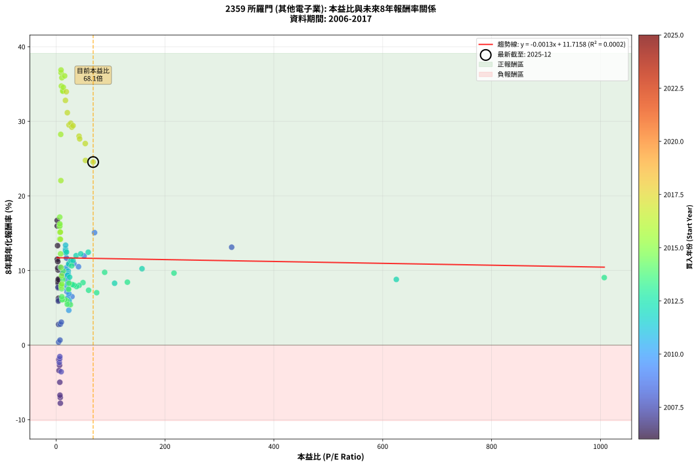
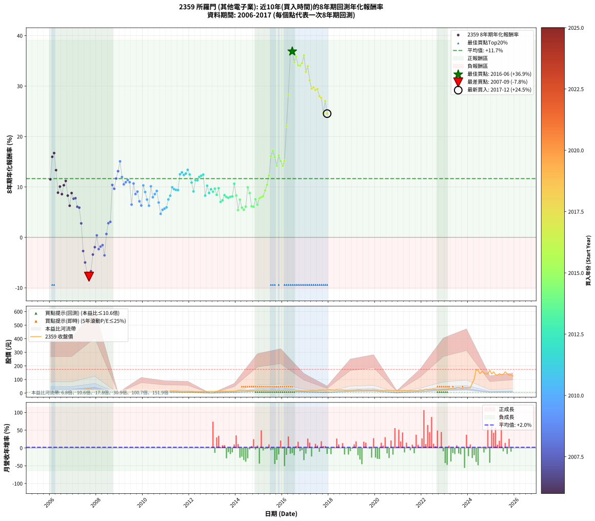

# 2359 所羅門 - 本益比與未來報酬率分析

!!! info "報告資訊"
    - **股票代號**: 2359
    - **公司名稱**: 所羅門
    - **產業別**: 其他電子業
    - **分析期間**: 2006-2017 (144 個數據點)
    - **資料來源**: Type 12 (ShowMonthlyK_ChartFlow) 月收盤價與本益比
    - **報酬率口徑**: 含現金股利 (簡化: 年度合計，假設每年7/1入帳)
    - **報告生成時間**: 2026-01-04 08:47:36 CST

## 📈 視覺化圖表

### 圖表1: 本益比 vs 未來報酬率關係

*圖表1：2359 所羅門 本益比與8年期未來報酬率關係 (2006-2017)*

### 圖表2: 歷年買入時點的8年期實際報酬率

*圖表2：2359 所羅門 歷年買入時點的8年期實際報酬率 (2006-2017)*

## 📍 買點訊號說明

本報告提供兩種買點提示訊號（顯示於圖表2的股價子圖中）：

### ▲ 小綠色三角形（回測驗證）
- **計算方式**: 使用全部歷史資料計算本益比第25百分位數
- **用途**: 事後驗證，顯示歷史上哪些時點確實為低估區
- **限制**: 當下無法判斷，僅供回測參考
- **特性**: 後見之明（Look-Ahead Bias）

### ▲ 小橘色三角形（即時訊號）
- **計算方式**: 使用截至當月的過去5年資料計算本益比第25百分位數
- **用途**: 實際投資決策，當時即可判斷
- **優勢**: 可操作性強，符合實務需求
- **特性**: 無後見之明，滾動窗口計算

!!! tip "如何使用兩種訊號"
    - **綠色▲** 幫助理解歷史估值機會，驗證策略有效性
    - **橘色▲** 可作為實際買進參考，但仍需搭配基本面分析
    - 兩種訊號重疊時，表示即時判斷與事後驗證一致，信心度較高
    - 僅有綠色▲時，表示當時無法判斷（需要未來資料才能確認）
    - 僅有橘色▲時，表示即時判斷為買點，但事後可能不是最佳時機

## 📊 估值分析摘要

| 指標 | 數值 |
|:---:|:---:|
| **目前本益比** (2017-12) | **68.09 倍** |
| **歷史平均本益比** | 36.44 倍 |
| **估值水準** | 🔴 相對高估 |
| **預期8年年化報酬率** | **+11.63%** |
| **歷史平均報酬率** | +11.66% |
| **相關係數 (R²)** | 0.0002 |
| **趨勢線斜率** | -0.0013 |

!!! abstract "核心洞察"
    目前本益比顯著高於歷史平均，預期未來報酬率可能較低

    根據歷史數據回測，2359 所羅門 在目前本益比 **68.1倍** 的估值水準下，
    預期未來8年年化報酬率約為 **+11.6%**。

    **重要提醒**: 本分析基於歷史數據統計，實際報酬率會受到公司基本面變化、產業趨勢、
    總體經濟環境等多重因素影響。R² = 0.00 表示本益比可解釋約 0.0% 的報酬率變異。

## 📈 歷史估值統計

### 最佳買點 (最高報酬率)

| 項目 | 數值 |
|:---:|:---:|
| 起始時間 | 2016-06 |
| 當時本益比 | 9.10 倍 |
| 起始價格 | 14.1 元 |
| 8年後價格 | 166.0 元 |
| **8年年化報酬率** | **+36.88%** |

### 最差買點 (最低報酬率)

| 項目 | 數值 |
|:---:|:---:|
| 起始時間 | 2007-09 |
| 當時本益比 | 7.84 倍 |
| 起始價格 | 28.8 元 |
| 8年後價格 | 13.8 元 |
| **8年年化報酬率** | **-7.79%** |

## 🎯 投資啟示

### 本益比與報酬率關係

趨勢線方程式: **y = -0.0013x + 11.7158**

!!! note "負相關"
    本益比與未來報酬率呈現負相關。較低的本益比通常帶來較高的未來報酬率，
    但相關性不算非常強。**估值仍是重要參考指標之一**。

### 估值區間建議

基於歷史數據分析:

- **🟢 低估區** (P/E < 29.2): 預期報酬率較高，可考慮增加持股
- **🟡 合理區** (P/E 29.2-43.7): 預期報酬率符合長期趨勢，正常持有
- **🔴 高估區** (P/E > 43.7): 預期報酬率較低，可考慮減碼或觀望

!!! danger "風險提示"
    - 過去表現不代表未來結果
    - 本分析假設公司基本面無重大結構性變化
    - 產業環境劇變可能使歷史規律失效
    - 應結合公司財報、產業趨勢、總體經濟等多重因素綜合判斷

!!! success "長期投資觀點"
    歷史數據顯示，在合理或低估的估值水準買入並長期持有，
    往往能獲得較佳的投資報酬。**耐心等待好價格**是價值投資的核心原則。

## 📊 數據品質

- **資料來源**: GoodInfo.tw Type 12 (ShowMonthlyK_ChartFlow)
- **資料頻率**: 月度收盤價與本益比
- **回測期間**: 2006-2017
- **數據點數量**: 144 個 (每個點代表一次8年期回測)

### 計算方法說明

1. **8年期年化報酬率**:
   - 對每個歷史時點，計算其後8年的實際投資報酬率
   - 期末價值(不含股利): 期末價格
   - 期末價值(含現金股利): 期末價格 + 持有期間內的現金股利合計 (簡化: 年度合計，假設每年7/1入帳)
   - 公式: 年化報酬率 = [(期末價值/期初價格)^(1/年數) - 1] × 100%

2. **本益比 (P/E Ratio)**:
   - 使用當時的月收盤價與EPS計算
   - 資料來源: Type 12 月度河流圖本益比數據

3. **趨勢線 (Linear Regression)**:
   - 使用最小平方法擬合線性趨勢線
   - R²值衡量本益比對報酬率的解釋能力

---

*本報告由 Stock Analysis System v1.9.0 自動生成*
*數據更新時間: 2026-01-04 08:47:36 CST*

## 📋 月度回測明細表

（每一列對應時間線圖中的一個買入點；可用來對照 SVG 圖上的每個點。）

| 買入月份 | 賣出月份 | 回測期限_年 | 實際持有年數 | 買入本益比_倍 | 買入收盤價_元 | 賣出收盤價_元 | 現金股利合計_元 | 總報酬率_pct | 年化報酬率_pct |
| --- | --- | --- | --- | --- | --- | --- | --- | --- | --- |
| 2006-01 | 2014-01 | 8 | 8.000 | 2.25 | 6.00 | 14.05 | 0.30 | +139.17 | +11.52 |
| 2006-02 | 2014-02 | 8 | 8.000 | 2.18 | 5.82 | 18.75 | 0.30 | +227.32 | +15.98 |
| 2006-03 | 2014-03 | 8 | 8.000 | 2.12 | 5.66 | 19.20 | 0.30 | +244.52 | +16.72 |
| 2006-04 | 2014-04 | 8 | 8.000 | 2.70 | 7.20 | 19.30 | 0.30 | +172.22 | +13.34 |
| 2006-05 | 2014-05 | 8 | 8.000 | 4.23 | 11.30 | 22.00 | 0.30 | +97.35 | +8.87 |
| 2006-06 | 2014-06 | 8 | 8.000 | 3.48 | 9.30 | 19.75 | 0.30 | +115.59 | +10.08 |
| 2006-07 | 2014-07 | 8 | 8.000 | 3.40 | 9.09 | 17.25 | 0.30 | +93.07 | +8.57 |
| 2006-08 | 2014-08 | 8 | 8.000 | 3.09 | 8.24 | 17.80 | 0.30 | +119.66 | +10.34 |
| 2006-09 | 2014-09 | 8 | 8.000 | 3.04 | 8.13 | 18.70 | 0.30 | +133.70 | +11.19 |
| 2006-10 | 2014-10 | 8 | 8.000 | 3.75 | 10.00 | 18.60 | 0.30 | +89.00 | +8.28 |
| 2006-11 | 2014-11 | 8 | 8.000 | 4.27 | 11.40 | 18.25 | 0.30 | +62.72 | +6.27 |
| 2006-12 | 2014-12 | 8 | 8.000 | 3.91 | 10.45 | 20.20 | 0.30 | +96.17 | +8.79 |
| 2007-01 | 2015-01 | 8 | 8.000 | 3.79 | 10.55 | 18.75 | 0.30 | +80.57 | +7.67 |
| 2007-02 | 2015-02 | 8 | 8.000 | 3.54 | 10.25 | 18.35 | 0.30 | +81.95 | +7.77 |
| 2007-03 | 2015-03 | 8 | 8.000 | 4.39 | 13.20 | 20.85 | 0.30 | +60.23 | +6.07 |
| 2007-04 | 2015-04 | 8 | 8.000 | 4.14 | 12.90 | 20.10 | 0.30 | +58.14 | +5.90 |
| 2007-05 | 2015-05 | 8 | 8.000 | 4.55 | 14.70 | 18.00 | 0.30 | +24.49 | +2.78 |
| 2007-06 | 2015-06 | 8 | 8.000 | 6.38 | 21.30 | 16.80 | 0.30 | -19.72 | -2.71 |
| 2007-07 | 2015-07 | 8 | 8.000 | 6.87 | 23.70 | 14.45 | 1.30 | -33.54 | -4.98 |
| 2007-08 | 2015-08 | 8 | 8.000 | 7.69 | 27.40 | 14.00 | 1.30 | -44.16 | -7.02 |
| 2007-09 | 2015-09 | 8 | 8.000 | 7.84 | 28.80 | 13.75 | 1.30 | -47.74 | -7.79 |
| 2007-10 | 2015-10 | 8 | 8.000 | 7.18 | 27.20 | 14.30 | 1.30 | -42.65 | -6.71 |
| 2007-11 | 2015-11 | 8 | 8.000 | 5.40 | 21.05 | 14.65 | 1.30 | -24.23 | -3.41 |
| 2007-12 | 2015-12 | 8 | 8.000 | 4.81 | 19.30 | 15.20 | 1.30 | -14.51 | -1.94 |
| 2008-01 | 2016-01 | 8 | 8.000 | 4.66 | 17.15 | 16.40 | 1.30 | +3.21 | +0.40 |
| 2008-02 | 2016-02 | 8 | 8.000 | 6.01 | 20.10 | 15.35 | 1.30 | -17.16 | -2.33 |
| 2008-03 | 2016-03 | 8 | 8.000 | 6.77 | 20.40 | 16.30 | 1.30 | -13.73 | -1.83 |
| 2008-04 | 2016-04 | 8 | 8.000 | 6.88 | 18.45 | 15.00 | 1.30 | -11.65 | -1.54 |
| 2008-05 | 2016-05 | 8 | 8.000 | 9.37 | 22.00 | 15.15 | 1.30 | -25.23 | -3.57 |
| 2008-06 | 2016-06 | 8 | 8.000 | 7.25 | 14.60 | 14.10 | 1.30 | +5.48 | +0.67 |
| 2008-07 | 2016-07 | 8 | 8.000 | 7.79 | 13.10 | 14.05 | 2.30 | +24.81 | +2.81 |
| 2008-08 | 2016-08 | 8 | 8.000 | 9.70 | 13.10 | 14.40 | 2.30 | +27.48 | +3.08 |
| 2008-09 | 2016-09 | 8 | 8.000 | 7.77 | 7.91 | 15.15 | 2.30 | +120.61 | +10.40 |
| 2008-10 | 2016-10 | 8 | 8.000 | 11.61 | 7.95 | 14.30 | 2.30 | +108.81 | +9.64 |
| 2008-11 | 2016-11 | 8 | 8.000 | 19.12 | 6.74 | 14.00 | 2.30 | +141.84 | +11.67 |
| 2008-12 | 2016-12 | 8 | 8.000 | 322.50 | 6.45 | 15.00 | 2.30 | +168.22 | +13.13 |
| 2009-01 | 2017-01 | 8 | 8.000 | 70.65 | 5.77 | 15.45 | 2.30 | +207.63 | +15.08 |
| 2009-02 | 2017-02 | 8 | 8.000 | 51.56 | 7.39 | 15.95 | 2.30 | +146.96 | +11.96 |
| 2009-03 | 2017-03 | 8 | 8.000 | 41.22 | 8.45 | 16.50 | 2.30 | +122.49 | +10.51 |
| 2009-04 | 2017-04 | 8 | 8.000 | 32.78 | 8.74 | 17.75 | 2.30 | +129.41 | +10.94 |
| 2009-05 | 2017-05 | 8 | 8.000 | 27.11 | 8.90 | 18.80 | 2.30 | +137.08 | +11.39 |
| 2009-06 | 2017-06 | 8 | 8.000 | 23.41 | 9.13 | 18.65 | 2.30 | +129.46 | +10.94 |
| 2009-07 | 2017-07 | 8 | 8.000 | 29.23 | 13.20 | 18.55 | 3.30 | +65.53 | +6.50 |
| 2009-08 | 2017-08 | 8 | 8.000 | 22.69 | 11.65 | 22.95 | 3.30 | +125.32 | +10.69 |
| 2009-09 | 2017-09 | 8 | 8.000 | 22.17 | 12.75 | 21.35 | 3.30 | +93.33 | +8.59 |
| 2009-10 | 2017-10 | 8 | 8.000 | 21.28 | 13.55 | 23.85 | 3.30 | +100.37 | +9.08 |
| 2009-11 | 2017-11 | 8 | 8.000 | 19.98 | 13.95 | 20.95 | 3.30 | +73.84 | +7.16 |
| 2009-12 | 2017-12 | 8 | 8.000 | 21.32 | 16.20 | 23.15 | 3.30 | +63.27 | +6.32 |
| 2010-01 | 2018-01 | 8 | 8.000 | 17.48 | 13.05 | 25.30 | 3.30 | +119.16 | +10.30 |
| 2010-02 | 2018-02 | 8 | 8.000 | 17.86 | 13.10 | 22.80 | 3.30 | +99.24 | +9.00 |
| 2010-03 | 2018-03 | 8 | 8.000 | 20.14 | 14.50 | 22.55 | 3.30 | +78.28 | +7.49 |
| 2010-04 | 2018-04 | 8 | 8.000 | 20.73 | 14.65 | 20.55 | 3.30 | +62.80 | +6.28 |
| 2010-05 | 2018-05 | 8 | 8.000 | 18.61 | 12.90 | 24.60 | 3.30 | +116.28 | +10.12 |
| 2010-06 | 2018-06 | 8 | 8.000 | 19.56 | 13.30 | 21.25 | 3.30 | +84.59 | +7.96 |
| 2010-07 | 2018-07 | 8 | 8.000 | 21.15 | 14.10 | 22.95 | 4.30 | +93.26 | +8.58 |
| 2010-08 | 2018-08 | 8 | 8.000 | 20.43 | 13.35 | 22.70 | 4.30 | +102.25 | +9.20 |
| 2010-09 | 2018-09 | 8 | 8.000 | 23.52 | 15.05 | 21.40 | 4.30 | +70.76 | +6.92 |
| 2010-10 | 2018-10 | 8 | 8.000 | 23.38 | 14.65 | 16.80 | 4.30 | +44.03 | +4.67 |
| 2010-11 | 2018-11 | 8 | 8.000 | 23.48 | 14.40 | 17.75 | 4.30 | +53.12 | +5.47 |
| 2010-12 | 2018-12 | 8 | 8.000 | 24.00 | 14.40 | 18.15 | 4.30 | +55.90 | +5.71 |
| 2011-01 | 2019-01 | 8 | 8.000 | 23.93 | 14.30 | 18.40 | 4.30 | +58.74 | +5.95 |
| 2011-02 | 2019-02 | 8 | 8.000 | 22.52 | 13.40 | 19.65 | 4.30 | +78.73 | +7.53 |
| 2011-03 | 2019-03 | 8 | 8.000 | 21.86 | 12.95 | 20.15 | 4.30 | +88.80 | +8.27 |
| 2011-04 | 2019-04 | 8 | 8.000 | 22.29 | 13.15 | 23.75 | 4.30 | +113.31 | +9.93 |
| 2011-05 | 2019-05 | 8 | 8.000 | 22.21 | 13.05 | 22.80 | 4.30 | +107.66 | +9.56 |
| 2011-06 | 2019-06 | 8 | 8.000 | 21.11 | 12.35 | 21.05 | 4.30 | +105.26 | +9.41 |
| 2011-07 | 2019-07 | 8 | 8.000 | 21.12 | 12.30 | 20.10 | 5.10 | +104.88 | +9.38 |
| 2011-08 | 2019-08 | 8 | 8.000 | 17.76 | 10.30 | 21.35 | 5.10 | +156.80 | +12.51 |
| 2011-09 | 2019-09 | 8 | 8.000 | 17.40 | 10.05 | 21.40 | 5.10 | +163.68 | +12.88 |
| 2011-10 | 2019-10 | 8 | 8.000 | 17.48 | 10.05 | 20.45 | 5.10 | +154.23 | +12.37 |
| 2011-11 | 2019-11 | 8 | 8.000 | 17.45 | 9.99 | 20.80 | 5.10 | +159.26 | +12.65 |
| 2011-12 | 2019-12 | 8 | 8.000 | 17.46 | 9.95 | 22.10 | 5.10 | +173.37 | +13.39 |
| 2012-01 | 2020-01 | 8 | 8.000 | 19.23 | 10.00 | 20.50 | 5.10 | +156.00 | +12.47 |
| 2012-02 | 2020-02 | 8 | 8.000 | 23.30 | 10.95 | 19.90 | 5.10 | +128.31 | +10.87 |
| 2012-03 | 2020-03 | 8 | 8.000 | 24.88 | 10.45 | 15.90 | 5.10 | +100.96 | +9.12 |
| 2012-04 | 2020-04 | 8 | 8.000 | 27.57 | 10.20 | 19.00 | 5.10 | +136.27 | +11.35 |
| 2012-05 | 2020-05 | 8 | 8.000 | 31.06 | 9.94 | 18.35 | 5.10 | +135.92 | +11.33 |
| 2012-06 | 2020-06 | 8 | 8.000 | 36.74 | 9.92 | 19.45 | 5.10 | +147.48 | +11.99 |
| 2012-07 | 2020-07 | 8 | 8.000 | 45.32 | 9.97 | 19.20 | 5.90 | +151.76 | +12.23 |
| 2012-08 | 2020-08 | 8 | 8.000 | 59.12 | 10.05 | 19.80 | 5.90 | +155.72 | +12.45 |
| 2012-09 | 2020-09 | 8 | 8.000 | 107.50 | 12.90 | 18.50 | 5.90 | +89.15 | +8.29 |
| 2012-10 | 2020-10 | 8 | 8.000 | 157.90 | 11.05 | 18.20 | 5.90 | +118.10 | +10.24 |
| 2012-11 | 2020-11 | 8 | 8.000 | 625.00 | 12.50 | 18.65 | 5.90 | +96.40 | +8.80 |
| 2012-12 | 2020-12 | 8 | 8.000 |  | 12.10 | 19.20 | 5.90 | +107.44 | +9.55 |
| 2013-01 | 2021-01 | 8 | 8.000 | 1007.00 | 11.75 | 17.60 | 5.90 | +100.00 | +9.05 |
| 2013-02 | 2021-02 | 8 | 8.000 | 216.60 | 11.55 | 18.25 | 5.90 | +109.09 | +9.66 |
| 2013-03 | 2021-03 | 8 | 8.000 | 131.00 | 12.45 | 17.90 | 5.90 | +91.16 | +8.44 |
| 2013-04 | 2021-04 | 8 | 8.000 | 89.27 | 12.20 | 19.80 | 5.90 | +110.66 | +9.76 |
| 2013-05 | 2021-05 | 8 | 8.000 | 74.58 | 13.30 | 17.00 | 5.90 | +72.18 | +7.03 |
| 2013-06 | 2021-06 | 8 | 8.000 | 59.77 | 13.15 | 17.30 | 5.90 | +76.43 | +7.35 |
| 2013-07 | 2021-07 | 8 | 8.000 | 49.49 | 12.95 | 18.25 | 6.40 | +90.35 | +8.38 |
| 2013-08 | 2021-08 | 8 | 8.000 | 42.36 | 12.85 | 17.40 | 6.40 | +85.21 | +8.01 |
| 2013-09 | 2021-09 | 8 | 8.000 | 37.54 | 12.95 | 17.30 | 6.40 | +83.01 | +7.85 |
| 2013-10 | 2021-10 | 8 | 8.000 | 33.10 | 12.80 | 17.35 | 6.40 | +85.55 | +8.03 |
| 2013-11 | 2021-11 | 8 | 8.000 | 29.88 | 12.80 | 17.50 | 6.40 | +86.72 | +8.12 |
| 2013-12 | 2021-12 | 8 | 8.000 | 28.72 | 13.50 | 23.90 | 6.40 | +124.44 | +10.63 |
| 2014-01 | 2022-01 | 8 | 8.000 | 23.81 | 14.05 | 20.20 | 6.40 | +89.32 | +8.31 |
| 2014-02 | 2022-02 | 8 | 8.000 | 26.41 | 18.75 | 22.20 | 6.40 | +52.53 | +5.42 |
| 2014-03 | 2022-03 | 8 | 8.000 | 23.13 | 19.20 | 27.80 | 6.40 | +78.13 | +7.48 |
| 2014-04 | 2022-04 | 8 | 8.000 | 20.32 | 19.30 | 24.15 | 6.40 | +58.29 | +5.91 |
| 2014-05 | 2022-05 | 8 | 8.000 | 20.56 | 22.00 | 27.30 | 6.40 | +53.18 | +5.48 |
| 2014-06 | 2022-06 | 8 | 8.000 | 16.60 | 19.75 | 25.35 | 6.40 | +60.76 | +6.11 |
| 2014-07 | 2022-07 | 8 | 8.000 | 13.17 | 17.25 | 29.50 | 7.30 | +113.33 | +9.93 |
| 2014-08 | 2022-08 | 8 | 8.000 | 12.45 | 17.80 | 27.60 | 7.30 | +96.07 | +8.78 |
| 2014-09 | 2022-09 | 8 | 8.000 | 12.06 | 18.70 | 22.90 | 7.30 | +61.50 | +6.17 |
| 2014-10 | 2022-10 | 8 | 8.000 | 11.14 | 18.60 | 22.50 | 7.30 | +60.22 | +6.07 |
| 2014-11 | 2022-11 | 8 | 8.000 | 10.20 | 18.25 | 25.40 | 7.30 | +79.18 | +7.56 |
| 2014-12 | 2022-12 | 8 | 8.000 | 10.58 | 20.20 | 26.10 | 7.30 | +65.35 | +6.49 |
| 2015-01 | 2023-01 | 8 | 8.000 | 9.72 | 18.75 | 26.80 | 7.30 | +81.87 | +7.76 |
| 2015-02 | 2023-02 | 8 | 8.000 | 9.41 | 18.35 | 26.60 | 7.30 | +84.74 | +7.97 |
| 2015-03 | 2023-03 | 8 | 8.000 | 10.58 | 20.85 | 31.80 | 7.30 | +87.53 | +8.18 |
| 2015-04 | 2023-04 | 8 | 8.000 | 10.10 | 20.10 | 33.65 | 7.30 | +103.73 | +9.30 |
| 2015-05 | 2023-05 | 8 | 8.000 | 8.96 | 18.00 | 32.50 | 7.30 | +121.11 | +10.43 |
| 2015-06 | 2023-06 | 8 | 8.000 | 8.28 | 16.80 | 35.00 | 7.30 | +151.79 | +12.24 |
| 2015-07 | 2023-07 | 8 | 8.000 | 7.05 | 14.45 | 39.80 | 7.80 | +229.41 | +16.07 |
| 2015-08 | 2023-08 | 8 | 8.000 | 6.76 | 14.00 | 41.90 | 7.80 | +255.00 | +17.16 |
| 2015-09 | 2023-09 | 8 | 8.000 | 6.58 | 13.75 | 37.00 | 7.80 | +225.82 | +15.91 |
| 2015-10 | 2023-10 | 8 | 8.000 | 6.78 | 14.30 | 33.60 | 7.80 | +189.51 | +14.21 |
| 2015-11 | 2023-11 | 8 | 8.000 | 6.88 | 14.65 | 41.10 | 7.80 | +233.79 | +16.26 |
| 2015-12 | 2023-12 | 8 | 8.000 | 7.07 | 15.20 | 39.10 | 7.80 | +208.55 | +15.12 |
| 2016-01 | 2024-01 | 8 | 8.000 | 8.00 | 16.40 | 39.60 | 7.80 | +189.02 | +14.19 |
| 2016-02 | 2024-02 | 8 | 8.000 | 7.87 | 15.35 | 39.65 | 7.80 | +209.12 | +15.15 |
| 2016-03 | 2024-03 | 8 | 8.000 | 8.81 | 16.30 | 72.50 | 7.80 | +392.64 | +22.06 |
| 2016-04 | 2024-04 | 8 | 8.000 | 8.57 | 15.00 | 102.00 | 7.80 | +632.00 | +28.25 |
| 2016-05 | 2024-05 | 8 | 8.000 | 9.18 | 15.15 | 175.00 | 7.80 | +1106.60 | +36.52 |
| 2016-06 | 2024-06 | 8 | 8.000 | 9.10 | 14.10 | 166.00 | 7.80 | +1132.62 | +36.88 |
| 2016-07 | 2024-07 | 8 | 8.000 | 9.69 | 14.05 | 144.00 | 8.50 | +985.41 | +34.73 |
| 2016-08 | 2024-08 | 8 | 8.000 | 10.67 | 14.40 | 158.50 | 8.50 | +1059.72 | +35.85 |
| 2016-09 | 2024-09 | 8 | 8.000 | 12.12 | 15.15 | 150.00 | 8.50 | +946.20 | +34.11 |
| 2016-10 | 2024-10 | 8 | 8.000 | 12.43 | 14.30 | 140.50 | 8.50 | +941.96 | +34.04 |
| 2016-11 | 2024-11 | 8 | 8.000 | 13.33 | 14.00 | 142.00 | 8.50 | +975.00 | +34.56 |
| 2016-12 | 2024-12 | 8 | 8.000 | 15.79 | 15.00 | 168.00 | 8.50 | +1076.67 | +36.09 |
| 2017-01 | 2025-01 | 8 | 8.000 | 17.18 | 15.45 | 141.00 | 8.50 | +867.64 | +32.80 |
| 2017-02 | 2025-02 | 8 | 8.000 | 18.80 | 15.95 | 157.00 | 8.50 | +937.62 | +33.97 |
| 2017-03 | 2025-03 | 8 | 8.000 | 20.69 | 16.50 | 136.00 | 8.50 | +775.76 | +31.16 |
| 2017-04 | 2025-04 | 8 | 8.000 | 23.77 | 17.75 | 132.00 | 8.50 | +691.55 | +29.51 |
| 2017-05 | 2025-05 | 8 | 8.000 | 27.02 | 18.80 | 142.50 | 8.50 | +703.19 | +29.75 |
| 2017-06 | 2025-06 | 8 | 8.000 | 28.91 | 18.65 | 136.50 | 8.50 | +677.48 | +29.22 |
| 2017-07 | 2025-07 | 8 | 8.000 | 31.22 | 18.55 | 137.50 | 8.50 | +687.06 | +29.42 |
| 2017-08 | 2025-08 | 8 | 8.000 | 42.24 | 22.95 | 157.00 | 8.50 | +621.13 | +28.01 |
| 2017-09 | 2025-09 | 8 | 8.000 | 43.35 | 21.35 | 142.00 | 8.50 | +604.92 | +27.65 |
| 2017-10 | 2025-10 | 8 | 8.000 | 54.00 | 23.85 | 131.50 | 8.50 | +487.00 | +24.76 |
| 2017-11 | 2025-11 | 8 | 8.000 | 53.60 | 20.95 | 133.50 | 8.50 | +577.80 | +27.02 |
| 2017-12 | 2025-12 | 8 | 8.000 | 68.09 | 23.15 | 125.50 | 8.50 | +478.83 | +24.54 |
