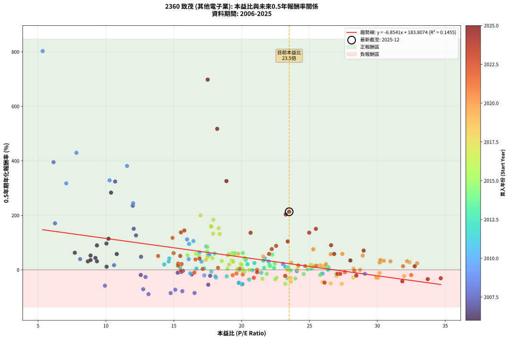
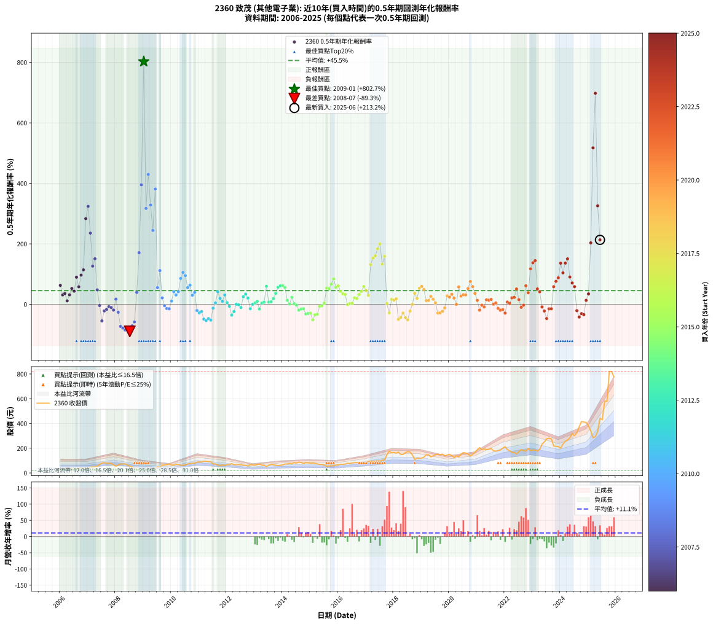

# 2360 致茂 - 本益比與未來報酬率分析

!!! info "報告資訊"
    - **股票代號**: 2360
    - **公司名稱**: 致茂
    - **產業別**: 其他電子業
    - **分析期間**: 2006-2025 (234 個數據點)
    - **資料來源**: Type 12 (ShowMonthlyK_ChartFlow) 月收盤價與本益比
    - **報酬率口徑**: 含現金股利 (簡化: 年度合計，假設每年7/1入帳)
    - **報告生成時間**: 2026-01-05 00:31:25 CST

## 📈 視覺化圖表

### 圖表1: 本益比 vs 未來報酬率關係

*圖表1：2360 致茂 本益比與0.5年期未來報酬率關係 (2006-2025)*

### 圖表2: 歷年買入時點的0.5年期實際報酬率

*圖表2：2360 致茂 歷年買入時點的0.5年期實際報酬率 (2006-2025)*

## 📍 買點訊號說明

本報告提供兩種買點提示訊號（顯示於圖表2的股價子圖中）：

### ▲ 小綠色三角形（回測驗證）
- **計算方式**: 使用全部歷史資料計算本益比第25百分位數
- **用途**: 事後驗證，顯示歷史上哪些時點確實為低估區
- **限制**: 當下無法判斷，僅供回測參考
- **特性**: 後見之明（Look-Ahead Bias）

### ▲ 小橘色三角形（即時訊號）
- **計算方式**: 使用截至當月的過去5年資料計算本益比第25百分位數
- **用途**: 實際投資決策，當時即可判斷
- **優勢**: 可操作性強，符合實務需求
- **特性**: 無後見之明，滾動窗口計算

!!! tip "如何使用兩種訊號"
    - **綠色▲** 幫助理解歷史估值機會，驗證策略有效性
    - **橘色▲** 可作為實際買進參考，但仍需搭配基本面分析
    - 兩種訊號重疊時，表示即時判斷與事後驗證一致，信心度較高
    - 僅有綠色▲時，表示當時無法判斷（需要未來資料才能確認）
    - 僅有橘色▲時，表示即時判斷為買點，但事後可能不是最佳時機

## 📊 估值分析摘要

| 指標 | 數值 |
|:---:|:---:|
| **目前本益比** (2025-06) | **23.50 倍** |
| **歷史平均本益比** | 20.18 倍 |
| **估值水準** | 🟡 合理範圍 |
| **預期0.5年年化報酬率** | **+22.74%** |
| **歷史平均報酬率** | +45.49% |
| **相關係數 (R²)** | 0.1455 |
| **趨勢線斜率** | -6.8541 |

!!! abstract "核心洞察"
    目前本益比接近歷史平均，預期報酬率符合長期趨勢

    根據歷史數據回測，2360 致茂 在目前本益比 **23.5倍** 的估值水準下，
    預期未來0.5年年化報酬率約為 **+22.7%**。

    **重要提醒**: 本分析基於歷史數據統計，實際報酬率會受到公司基本面變化、產業趨勢、
    總體經濟環境等多重因素影響。R² = 0.15 表示本益比可解釋約 14.6% 的報酬率變異。

## 📈 歷史估值統計

### 最佳買點 (最高報酬率)

| 項目 | 數值 |
|:---:|:---:|
| 起始時間 | 2009-01 |
| 當時本益比 | 5.34 倍 |
| 起始價格 | 17.6 元 |
| 0.5年後價格 | 50.5 元 |
| **0.5年年化報酬率** | **+802.67%** |

### 最差買點 (最低報酬率)

| 項目 | 數值 |
|:---:|:---:|
| 起始時間 | 2008-07 |
| 當時本益比 | 13.14 倍 |
| 起始價格 | 54.5 元 |
| 0.5年後價格 | 17.6 元 |
| **0.5年年化報酬率** | **-89.33%** |

## 🎯 投資啟示

### 本益比與報酬率關係

趨勢線方程式: **y = -6.8541x + 183.8074**

!!! warning "強負相關"
    本益比與未來報酬率呈現強負相關。在高本益比時期買入，未來報酬率顯著較低；
    在低本益比時期買入，未來報酬率顯著較高。**估值紀律至關重要**。

### 估值區間建議

基於歷史數據分析:

- **🟢 低估區** (P/E < 16.1): 預期報酬率較高，可考慮增加持股
- **🟡 合理區** (P/E 16.1-24.2): 預期報酬率符合長期趨勢，正常持有
- **🔴 高估區** (P/E > 24.2): 預期報酬率較低，可考慮減碼或觀望

!!! danger "風險提示"
    - 過去表現不代表未來結果
    - 本分析假設公司基本面無重大結構性變化
    - 產業環境劇變可能使歷史規律失效
    - 應結合公司財報、產業趨勢、總體經濟等多重因素綜合判斷

!!! success "長期投資觀點"
    歷史數據顯示，在合理或低估的估值水準買入並長期持有，
    往往能獲得較佳的投資報酬。**耐心等待好價格**是價值投資的核心原則。

## 📊 數據品質

- **資料來源**: GoodInfo.tw Type 12 (ShowMonthlyK_ChartFlow)
- **資料頻率**: 月度收盤價與本益比
- **回測期間**: 2006-2025
- **數據點數量**: 234 個 (每個點代表一次0.5年期回測)

### 計算方法說明

1. **0.5年期年化報酬率**:
   - 對每個歷史時點，計算其後0.5年的實際投資報酬率
   - 期末價值(不含股利): 期末價格
   - 期末價值(含現金股利): 期末價格 + 持有期間內的現金股利合計 (簡化: 年度合計，假設每年7/1入帳)
   - 公式: 年化報酬率 = [(期末價值/期初價格)^(1/年數) - 1] × 100%

2. **本益比 (P/E Ratio)**:
   - 使用當時的月收盤價與EPS計算
   - 資料來源: Type 12 月度河流圖本益比數據

3. **趨勢線 (Linear Regression)**:
   - 使用最小平方法擬合線性趨勢線
   - R²值衡量本益比對報酬率的解釋能力

---

*本報告由 Stock Analysis System v1.9.0 自動生成*
*數據更新時間: 2026-01-05 00:31:25 CST*

## 📋 月度回測明細表

（每一列對應時間線圖中的一個買入點；可用來對照 SVG 圖上的每個點。）

| 買入月份 | 賣出月份 | 回測期限_年 | 實際持有年數 | 買入本益比_倍 | 買入收盤價_元 | 賣出收盤價_元 | 現金股利合計_元 | 總報酬率_pct | 年化報酬率_pct |
| --- | --- | --- | --- | --- | --- | --- | --- | --- | --- |
| 2006-01 | 2006-07 | 0.5 | 0.496 | 7.71 | 28.05 | 33.60 | 2.11 | +27.30 | +62.75 |
| 2006-02 | 2006-08 | 0.5 | 0.498 | 8.67 | 31.55 | 34.00 | 2.11 | +14.44 | +31.10 |
| 2006-03 | 2006-10 | 0.5 | 0.586 | 8.87 | 32.30 | 36.55 | 2.11 | +19.68 | +35.89 |
| 2006-04 | 2006-10 | 0.5 | 0.501 | 10.05 | 36.60 | 36.55 | 2.11 | +5.62 | +11.53 |
| 2006-05 | 2006-12 | 0.5 | 0.586 | 9.34 | 34.00 | 37.80 | 2.11 | +17.37 | +31.44 |
| 2006-06 | 2006-12 | 0.5 | 0.501 | 8.87 | 32.30 | 37.80 | 2.11 | +23.55 | +52.52 |
| 2006-07 | 2007-01 | 0.5 | 0.504 | 9.23 | 33.60 | 40.30 | 0.00 | +19.94 | +43.47 |
| 2006-08 | 2007-03 | 0.5 | 0.580 | 9.34 | 34.00 | 49.30 | 0.00 | +45.00 | +89.68 |
| 2006-09 | 2007-03 | 0.5 | 0.496 | 10.80 | 39.30 | 49.30 | 0.00 | +25.45 | +58.01 |
| 2006-10 | 2007-05 | 0.5 | 0.580 | 10.04 | 36.55 | 54.10 | 0.00 | +48.02 | +96.53 |
| 2006-11 | 2007-05 | 0.5 | 0.496 | 10.19 | 37.10 | 54.10 | 0.00 | +45.82 | +114.09 |
| 2006-12 | 2007-07 | 0.5 | 0.580 | 10.38 | 37.80 | 80.00 | 2.45 | +118.13 | +283.32 |
| 2007-01 | 2007-07 | 0.5 | 0.496 | 10.68 | 40.30 | 80.00 | 2.45 | +104.60 | +324.02 |
| 2007-02 | 2007-08 | 0.5 | 0.498 | 11.98 | 46.75 | 83.00 | 2.45 | +82.79 | +235.50 |
| 2007-03 | 2007-10 | 0.5 | 0.586 | 12.22 | 49.30 | 77.10 | 2.45 | +61.37 | +126.30 |
| 2007-04 | 2007-10 | 0.5 | 0.501 | 12.05 | 50.20 | 77.10 | 2.45 | +58.47 | +150.66 |
| 2007-05 | 2007-12 | 0.5 | 0.586 | 12.59 | 54.10 | 65.60 | 2.45 | +25.79 | +47.94 |
| 2007-06 | 2007-12 | 0.5 | 0.501 | 15.67 | 69.40 | 65.60 | 2.45 | -1.94 | -3.84 |
| 2007-07 | 2008-01 | 0.5 | 0.504 | 17.54 | 80.00 | 53.70 | 0.00 | -32.88 | -54.67 |
| 2007-08 | 2008-03 | 0.5 | 0.583 | 17.68 | 83.00 | 71.90 | 0.00 | -13.37 | -21.82 |
| 2007-09 | 2008-03 | 0.5 | 0.498 | 16.33 | 78.80 | 71.90 | 0.00 | -8.76 | -16.80 |
| 2007-10 | 2008-05 | 0.5 | 0.583 | 15.55 | 77.10 | 73.60 | 0.00 | -4.54 | -7.66 |
| 2007-11 | 2008-05 | 0.5 | 0.498 | 15.29 | 77.80 | 73.60 | 0.00 | -5.40 | -10.54 |
| 2007-12 | 2008-07 | 0.5 | 0.583 | 12.57 | 65.60 | 54.50 | 3.59 | -11.44 | -18.81 |
| 2008-01 | 2008-07 | 0.5 | 0.498 | 10.60 | 53.70 | 54.50 | 3.59 | +8.18 | +17.09 |
| 2008-02 | 2008-08 | 0.5 | 0.501 | 12.92 | 63.50 | 50.90 | 3.59 | -14.18 | -26.31 |
| 2008-03 | 2008-10 | 0.5 | 0.586 | 15.11 | 71.90 | 29.85 | 3.59 | -53.49 | -72.92 |
| 2008-04 | 2008-10 | 0.5 | 0.501 | 15.63 | 72.00 | 29.85 | 3.59 | -53.55 | -78.36 |
| 2008-05 | 2008-12 | 0.5 | 0.586 | 16.53 | 73.60 | 20.75 | 3.59 | -66.93 | -84.87 |
| 2008-06 | 2008-12 | 0.5 | 0.501 | 14.77 | 63.50 | 20.75 | 3.59 | -61.66 | -85.25 |
| 2008-07 | 2009-01 | 0.5 | 0.504 | 13.14 | 54.50 | 17.65 | 0.00 | -67.61 | -89.33 |
| 2008-08 | 2009-03 | 0.5 | 0.580 | 12.75 | 50.90 | 24.75 | 0.00 | -51.38 | -71.13 |
| 2008-09 | 2009-03 | 0.5 | 0.496 | 9.93 | 38.15 | 24.75 | 0.00 | -35.12 | -58.24 |
| 2008-10 | 2009-05 | 0.5 | 0.580 | 8.10 | 29.85 | 36.20 | 0.00 | +21.27 | +39.42 |
| 2008-11 | 2009-05 | 0.5 | 0.496 | 6.25 | 22.10 | 36.20 | 0.00 | +63.80 | +170.70 |
| 2008-12 | 2009-07 | 0.5 | 0.580 | 6.14 | 20.75 | 50.50 | 2.01 | +153.07 | +395.15 |
| 2009-01 | 2009-07 | 0.5 | 0.496 | 5.34 | 17.65 | 50.50 | 2.01 | +197.52 | +802.67 |
| 2009-02 | 2009-08 | 0.5 | 0.498 | 7.08 | 22.90 | 44.65 | 2.01 | +103.76 | +317.23 |
| 2009-03 | 2009-10 | 0.5 | 0.586 | 7.83 | 24.75 | 63.70 | 2.01 | +165.50 | +429.41 |
| 2009-04 | 2009-10 | 0.5 | 0.501 | 10.27 | 31.70 | 63.70 | 2.01 | +107.29 | +328.42 |
| 2009-05 | 2009-12 | 0.5 | 0.586 | 12.01 | 36.20 | 72.70 | 2.01 | +106.39 | +244.42 |
| 2009-06 | 2009-12 | 0.5 | 0.501 | 11.56 | 34.00 | 72.70 | 2.01 | +119.74 | +381.31 |
| 2009-07 | 2010-01 | 0.5 | 0.504 | 17.62 | 50.50 | 63.00 | 0.00 | +24.75 | +55.12 |
| 2009-08 | 2010-03 | 0.5 | 0.580 | 15.98 | 44.65 | 69.00 | 0.00 | +54.54 | +111.68 |
| 2009-09 | 2010-03 | 0.5 | 0.496 | 23.05 | 62.70 | 69.00 | 0.00 | +10.05 | +21.31 |
| 2009-10 | 2010-05 | 0.5 | 0.580 | 24.07 | 63.70 | 62.00 | 0.00 | -2.67 | -4.55 |
| 2009-11 | 2010-05 | 0.5 | 0.496 | 25.96 | 66.80 | 62.00 | 0.00 | -7.19 | -13.97 |
| 2009-12 | 2010-07 | 0.5 | 0.580 | 29.08 | 72.70 | 64.30 | 2.00 | -8.80 | -14.68 |
| 2010-01 | 2010-07 | 0.5 | 0.496 | 23.23 | 63.00 | 64.30 | 2.00 | +5.24 | +10.85 |
| 2010-02 | 2010-08 | 0.5 | 0.498 | 21.71 | 63.50 | 73.60 | 2.00 | +19.06 | +41.91 |
| 2010-03 | 2010-10 | 0.5 | 0.586 | 21.99 | 69.00 | 78.80 | 2.00 | +17.10 | +30.92 |
| 2010-04 | 2010-10 | 0.5 | 0.501 | 20.24 | 67.80 | 78.80 | 2.00 | +19.17 | +41.92 |
| 2010-05 | 2010-12 | 0.5 | 0.586 | 17.40 | 62.00 | 87.10 | 2.00 | +43.71 | +85.69 |
| 2010-06 | 2010-12 | 0.5 | 0.501 | 16.45 | 62.10 | 87.10 | 2.00 | +43.48 | +105.56 |
| 2010-07 | 2011-01 | 0.5 | 0.504 | 16.13 | 64.30 | 90.00 | 0.00 | +39.97 | +94.93 |
| 2010-08 | 2011-03 | 0.5 | 0.580 | 17.52 | 73.60 | 95.00 | 0.00 | +29.08 | +55.23 |
| 2010-09 | 2011-03 | 0.5 | 0.496 | 16.88 | 74.50 | 95.00 | 0.00 | +27.52 | +63.32 |
| 2010-10 | 2011-05 | 0.5 | 0.580 | 17.04 | 78.80 | 91.80 | 0.00 | +16.50 | +30.09 |
| 2010-11 | 2011-05 | 0.5 | 0.496 | 16.10 | 77.90 | 91.80 | 0.00 | +17.84 | +39.28 |
| 2010-12 | 2011-07 | 0.5 | 0.580 | 17.25 | 87.10 | 72.50 | 3.80 | -12.40 | -20.39 |
| 2011-01 | 2011-07 | 0.5 | 0.496 | 18.12 | 90.00 | 72.50 | 3.80 | -15.22 | -28.34 |
| 2011-02 | 2011-08 | 0.5 | 0.498 | 18.06 | 88.20 | 73.20 | 3.80 | -12.70 | -23.86 |
| 2011-03 | 2011-10 | 0.5 | 0.586 | 19.78 | 95.00 | 60.40 | 3.80 | -32.42 | -48.77 |
| 2011-04 | 2011-10 | 0.5 | 0.501 | 20.02 | 94.50 | 60.40 | 3.80 | -32.06 | -53.77 |
| 2011-05 | 2011-12 | 0.5 | 0.586 | 19.80 | 91.80 | 59.40 | 3.80 | -31.15 | -47.12 |
| 2011-06 | 2011-12 | 0.5 | 0.501 | 20.07 | 91.40 | 59.40 | 3.80 | -30.85 | -52.12 |
| 2011-07 | 2012-01 | 0.5 | 0.504 | 16.21 | 72.50 | 67.70 | 0.00 | -6.62 | -12.71 |
| 2011-08 | 2012-03 | 0.5 | 0.583 | 16.67 | 73.20 | 75.20 | 0.00 | +2.73 | +4.73 |
| 2011-09 | 2012-03 | 0.5 | 0.498 | 14.67 | 63.20 | 75.20 | 0.00 | +18.99 | +41.75 |
| 2011-10 | 2012-05 | 0.5 | 0.583 | 14.30 | 60.40 | 67.10 | 0.00 | +11.09 | +19.77 |
| 2011-11 | 2012-05 | 0.5 | 0.498 | 15.45 | 64.00 | 67.10 | 0.00 | +4.84 | +9.96 |
| 2011-12 | 2012-07 | 0.5 | 0.583 | 14.63 | 59.40 | 67.00 | 2.50 | +17.00 | +30.90 |
| 2012-01 | 2012-07 | 0.5 | 0.498 | 17.24 | 67.70 | 67.00 | 2.50 | +2.66 | +5.41 |
| 2012-02 | 2012-08 | 0.5 | 0.501 | 17.77 | 67.40 | 62.60 | 2.50 | -3.41 | -6.70 |
| 2012-03 | 2012-10 | 0.5 | 0.586 | 20.55 | 75.20 | 55.60 | 2.50 | -22.74 | -35.62 |
| 2012-04 | 2012-10 | 0.5 | 0.501 | 18.90 | 66.60 | 55.60 | 2.50 | -12.76 | -23.85 |
| 2012-05 | 2012-12 | 0.5 | 0.586 | 19.79 | 67.10 | 64.70 | 2.50 | +0.15 | +0.25 |
| 2012-06 | 2012-12 | 0.5 | 0.501 | 20.79 | 67.70 | 64.70 | 2.50 | -0.74 | -1.47 |
| 2012-07 | 2013-01 | 0.5 | 0.504 | 21.45 | 67.00 | 63.30 | 0.00 | -5.52 | -10.66 |
| 2012-08 | 2013-03 | 0.5 | 0.580 | 20.94 | 62.60 | 71.30 | 0.00 | +13.90 | +25.13 |
| 2012-09 | 2013-03 | 0.5 | 0.496 | 21.61 | 61.70 | 71.30 | 0.00 | +15.56 | +33.89 |
| 2012-10 | 2013-05 | 0.5 | 0.580 | 20.43 | 55.60 | 62.00 | 0.00 | +11.51 | +20.65 |
| 2012-11 | 2013-05 | 0.5 | 0.496 | 25.89 | 67.00 | 62.00 | 0.00 | -7.46 | -14.49 |
| 2012-12 | 2013-07 | 0.5 | 0.580 | 26.37 | 64.70 | 62.70 | 2.00 | +0.00 | +0.00 |
| 2013-01 | 2013-07 | 0.5 | 0.496 | 25.15 | 63.30 | 62.70 | 2.00 | +2.21 | +4.51 |
| 2013-02 | 2013-08 | 0.5 | 0.498 | 26.40 | 68.10 | 69.30 | 2.00 | +4.70 | +9.65 |
| 2013-03 | 2013-10 | 0.5 | 0.586 | 26.98 | 71.30 | 62.60 | 2.00 | -9.40 | -15.50 |
| 2013-04 | 2013-10 | 0.5 | 0.501 | 23.39 | 63.30 | 62.60 | 2.00 | +2.05 | +4.14 |
| 2013-05 | 2013-12 | 0.5 | 0.586 | 22.39 | 62.00 | 62.50 | 2.00 | +4.03 | +6.98 |
| 2013-06 | 2013-12 | 0.5 | 0.501 | 18.01 | 51.00 | 62.50 | 2.00 | +26.47 | +59.79 |
| 2013-07 | 2014-01 | 0.5 | 0.504 | 21.66 | 62.70 | 65.00 | 0.00 | +3.67 | +7.41 |
| 2013-08 | 2014-03 | 0.5 | 0.580 | 23.43 | 69.30 | 72.60 | 0.00 | +4.76 | +8.34 |
| 2013-09 | 2014-03 | 0.5 | 0.496 | 22.05 | 66.60 | 72.60 | 0.00 | +9.01 | +19.01 |
| 2013-10 | 2014-05 | 0.5 | 0.580 | 20.30 | 62.60 | 74.90 | 0.00 | +19.65 | +36.22 |
| 2013-11 | 2014-05 | 0.5 | 0.496 | 19.07 | 60.00 | 74.90 | 0.00 | +24.83 | +56.46 |
| 2013-12 | 2014-07 | 0.5 | 0.580 | 19.47 | 62.50 | 80.00 | 2.50 | +32.00 | +61.34 |
| 2014-01 | 2014-07 | 0.5 | 0.496 | 20.09 | 65.00 | 80.00 | 2.50 | +26.92 | +61.79 |
| 2014-02 | 2014-08 | 0.5 | 0.498 | 22.26 | 72.60 | 88.00 | 2.50 | +24.66 | +55.63 |
| 2014-03 | 2014-10 | 0.5 | 0.586 | 22.09 | 72.60 | 75.70 | 2.50 | +7.71 | +13.52 |
| 2014-04 | 2014-10 | 0.5 | 0.501 | 23.46 | 77.70 | 75.70 | 2.50 | +0.64 | +1.29 |
| 2014-05 | 2014-12 | 0.5 | 0.586 | 22.44 | 74.90 | 82.10 | 2.50 | +12.95 | +23.10 |
| 2014-06 | 2014-12 | 0.5 | 0.501 | 24.86 | 83.60 | 82.10 | 2.50 | +1.20 | +2.40 |
| 2014-07 | 2015-01 | 0.5 | 0.504 | 23.61 | 80.00 | 78.90 | 0.00 | -1.37 | -2.71 |
| 2014-08 | 2015-03 | 0.5 | 0.580 | 25.78 | 88.00 | 77.70 | 0.00 | -11.70 | -19.30 |
| 2014-09 | 2015-03 | 0.5 | 0.496 | 24.57 | 84.50 | 77.70 | 0.00 | -8.05 | -15.57 |
| 2014-10 | 2015-05 | 0.5 | 0.580 | 21.85 | 75.70 | 69.10 | 0.00 | -8.72 | -14.54 |
| 2014-11 | 2015-05 | 0.5 | 0.496 | 23.96 | 83.60 | 69.10 | 0.00 | -17.34 | -31.91 |
| 2014-12 | 2015-07 | 0.5 | 0.580 | 23.36 | 82.10 | 64.00 | 2.61 | -18.87 | -30.25 |
| 2015-01 | 2015-07 | 0.5 | 0.496 | 22.57 | 78.90 | 64.00 | 2.61 | -15.58 | -28.95 |
| 2015-02 | 2015-08 | 0.5 | 0.498 | 23.22 | 80.70 | 53.80 | 2.61 | -30.10 | -51.26 |
| 2015-03 | 2015-10 | 0.5 | 0.586 | 22.48 | 77.70 | 58.00 | 2.61 | -22.00 | -34.56 |
| 2015-04 | 2015-10 | 0.5 | 0.501 | 21.53 | 74.00 | 58.00 | 2.61 | -18.10 | -32.87 |
| 2015-05 | 2015-12 | 0.5 | 0.586 | 20.22 | 69.10 | 63.90 | 2.61 | -3.75 | -6.32 |
| 2015-06 | 2015-12 | 0.5 | 0.501 | 20.07 | 68.20 | 63.90 | 2.61 | -2.48 | -4.89 |
| 2015-07 | 2016-01 | 0.5 | 0.504 | 18.95 | 64.00 | 65.30 | 0.00 | +2.03 | +4.07 |
| 2015-08 | 2016-03 | 0.5 | 0.583 | 16.02 | 53.80 | 69.20 | 0.00 | +28.62 | +53.98 |
| 2015-09 | 2016-03 | 0.5 | 0.498 | 16.86 | 56.30 | 69.20 | 0.00 | +22.91 | +51.29 |
| 2015-10 | 2016-05 | 0.5 | 0.583 | 17.47 | 58.00 | 78.20 | 0.00 | +34.83 | +66.93 |
| 2015-11 | 2016-05 | 0.5 | 0.498 | 17.49 | 57.70 | 78.20 | 0.00 | +35.53 | +84.06 |
| 2015-12 | 2016-07 | 0.5 | 0.583 | 19.48 | 63.90 | 80.50 | 2.37 | +29.69 | +56.18 |
| 2016-01 | 2016-07 | 0.5 | 0.498 | 19.30 | 65.30 | 80.50 | 2.37 | +26.91 | +61.33 |
| 2016-02 | 2016-08 | 0.5 | 0.501 | 20.21 | 70.50 | 82.00 | 2.37 | +19.68 | +43.12 |
| 2016-03 | 2016-10 | 0.5 | 0.586 | 19.26 | 69.20 | 80.10 | 2.37 | +19.18 | +34.92 |
| 2016-04 | 2016-10 | 0.5 | 0.501 | 19.37 | 71.60 | 80.10 | 2.37 | +15.19 | +32.60 |
| 2016-05 | 2016-12 | 0.5 | 0.586 | 20.57 | 78.20 | 75.40 | 2.37 | -0.55 | -0.93 |
| 2016-06 | 2016-12 | 0.5 | 0.501 | 19.67 | 76.80 | 75.40 | 2.37 | +1.27 | +2.54 |
| 2016-07 | 2017-01 | 0.5 | 0.504 | 20.08 | 80.50 | 81.90 | 0.00 | +1.74 | +3.48 |
| 2016-08 | 2017-03 | 0.5 | 0.580 | 19.94 | 82.00 | 91.90 | 0.00 | +12.07 | +21.70 |
| 2016-09 | 2017-03 | 0.5 | 0.496 | 19.99 | 84.30 | 91.90 | 0.00 | +9.02 | +19.03 |
| 2016-10 | 2017-05 | 0.5 | 0.580 | 18.53 | 80.10 | 94.30 | 0.00 | +17.73 | +32.47 |
| 2016-11 | 2017-05 | 0.5 | 0.496 | 17.85 | 79.00 | 94.30 | 0.00 | +19.37 | +42.94 |
| 2016-12 | 2017-07 | 0.5 | 0.580 | 16.64 | 75.40 | 95.50 | 3.22 | +30.93 | +59.09 |
| 2017-01 | 2017-07 | 0.5 | 0.496 | 17.48 | 81.90 | 95.50 | 3.22 | +20.54 | +45.78 |
| 2017-02 | 2017-08 | 0.5 | 0.498 | 19.37 | 93.80 | 103.50 | 3.22 | +13.78 | +29.56 |
| 2017-03 | 2017-10 | 0.5 | 0.586 | 18.38 | 91.90 | 147.00 | 3.22 | +63.46 | +131.34 |
| 2017-04 | 2017-10 | 0.5 | 0.501 | 18.31 | 94.40 | 147.00 | 3.22 | +59.13 | +152.75 |
| 2017-05 | 2017-12 | 0.5 | 0.586 | 17.75 | 94.30 | 162.00 | 3.22 | +75.21 | +160.43 |
| 2017-06 | 2017-12 | 0.5 | 0.501 | 17.92 | 98.00 | 162.00 | 3.22 | +68.59 | +183.63 |
| 2017-07 | 2018-01 | 0.5 | 0.504 | 16.97 | 95.50 | 166.00 | 0.00 | +73.82 | +199.65 |
| 2017-08 | 2018-03 | 0.5 | 0.580 | 17.90 | 103.50 | 169.00 | 0.00 | +63.29 | +132.75 |
| 2017-09 | 2018-03 | 0.5 | 0.496 | 17.76 | 105.50 | 169.00 | 0.00 | +60.19 | +158.79 |
| 2017-10 | 2018-05 | 0.5 | 0.580 | 24.11 | 147.00 | 149.50 | 0.00 | +1.70 | +2.95 |
| 2017-11 | 2018-05 | 0.5 | 0.496 | 28.22 | 176.50 | 149.50 | 0.00 | -15.30 | -28.47 |
| 2017-12 | 2018-07 | 0.5 | 0.580 | 25.27 | 162.00 | 172.50 | 4.47 | +9.24 | +16.45 |
| 2018-01 | 2018-07 | 0.5 | 0.496 | 25.96 | 166.00 | 172.50 | 4.47 | +6.61 | +13.79 |
| 2018-02 | 2018-08 | 0.5 | 0.498 | 25.08 | 160.00 | 169.50 | 4.47 | +8.73 | +18.30 |
| 2018-03 | 2018-10 | 0.5 | 0.586 | 26.56 | 169.00 | 108.50 | 4.47 | -33.15 | -49.71 |
| 2018-04 | 2018-10 | 0.5 | 0.501 | 23.63 | 150.00 | 108.50 | 4.47 | -24.68 | -43.21 |
| 2018-05 | 2018-12 | 0.5 | 0.586 | 23.61 | 149.50 | 118.00 | 4.47 | -18.08 | -28.85 |
| 2018-06 | 2018-12 | 0.5 | 0.501 | 25.97 | 164.00 | 118.00 | 4.47 | -25.32 | -44.16 |
| 2018-07 | 2019-01 | 0.5 | 0.504 | 27.38 | 172.50 | 120.00 | 0.00 | -30.43 | -51.34 |
| 2018-08 | 2019-03 | 0.5 | 0.580 | 26.98 | 169.50 | 146.50 | 0.00 | -13.57 | -22.22 |
| 2018-09 | 2019-03 | 0.5 | 0.496 | 23.37 | 146.50 | 146.50 | 0.00 | +0.00 | +0.00 |
| 2018-10 | 2019-05 | 0.5 | 0.580 | 17.36 | 108.50 | 130.00 | 0.00 | +19.82 | +36.54 |
| 2018-11 | 2019-05 | 0.5 | 0.496 | 19.08 | 119.00 | 130.00 | 0.00 | +9.24 | +19.53 |
| 2018-12 | 2019-07 | 0.5 | 0.580 | 18.97 | 118.00 | 147.00 | 4.18 | +28.12 | +53.25 |
| 2019-01 | 2019-07 | 0.5 | 0.496 | 19.75 | 120.00 | 147.00 | 4.18 | +25.98 | +59.37 |
| 2019-02 | 2019-08 | 0.5 | 0.498 | 21.59 | 128.00 | 152.00 | 4.18 | +22.01 | +49.08 |
| 2019-03 | 2019-10 | 0.5 | 0.586 | 25.32 | 146.50 | 152.50 | 4.18 | +6.95 | +12.15 |
| 2019-04 | 2019-10 | 0.5 | 0.501 | 26.15 | 147.50 | 152.50 | 4.18 | +6.22 | +12.80 |
| 2019-05 | 2019-12 | 0.5 | 0.586 | 23.66 | 130.00 | 145.00 | 4.18 | +14.75 | +26.47 |
| 2019-06 | 2019-12 | 0.5 | 0.501 | 25.79 | 138.00 | 145.00 | 4.18 | +8.10 | +16.82 |
| 2019-07 | 2020-01 | 0.5 | 0.504 | 28.24 | 147.00 | 150.50 | 0.00 | +2.38 | +4.78 |
| 2019-08 | 2020-03 | 0.5 | 0.583 | 30.04 | 152.00 | 124.50 | 0.00 | -18.09 | -28.98 |
| 2019-09 | 2020-03 | 0.5 | 0.498 | 29.91 | 147.00 | 124.50 | 0.00 | -15.31 | -28.35 |
| 2019-10 | 2020-05 | 0.5 | 0.583 | 31.97 | 152.50 | 131.00 | 0.00 | -14.10 | -22.94 |
| 2019-11 | 2020-05 | 0.5 | 0.498 | 30.16 | 139.50 | 131.00 | 0.00 | -6.09 | -11.85 |
| 2019-12 | 2020-07 | 0.5 | 0.583 | 32.37 | 145.00 | 164.50 | 3.01 | +15.52 | +28.07 |
| 2020-01 | 2020-07 | 0.5 | 0.498 | 32.93 | 150.50 | 164.50 | 3.01 | +11.30 | +23.97 |
| 2020-02 | 2020-08 | 0.5 | 0.501 | 30.47 | 142.00 | 161.00 | 3.01 | +15.50 | +33.32 |
| 2020-03 | 2020-10 | 0.5 | 0.586 | 26.21 | 124.50 | 136.00 | 3.01 | +11.65 | +20.70 |
| 2020-04 | 2020-10 | 0.5 | 0.501 | 28.72 | 139.00 | 136.00 | 3.01 | +0.01 | +0.01 |
| 2020-05 | 2020-12 | 0.5 | 0.586 | 26.57 | 131.00 | 168.00 | 3.01 | +30.54 | +57.60 |
| 2020-06 | 2020-12 | 0.5 | 0.501 | 30.18 | 151.50 | 168.00 | 3.01 | +12.88 | +27.35 |
| 2020-07 | 2021-01 | 0.5 | 0.504 | 32.19 | 164.50 | 189.00 | 0.00 | +14.89 | +31.73 |
| 2020-08 | 2021-03 | 0.5 | 0.580 | 30.96 | 161.00 | 188.50 | 0.00 | +17.08 | +31.22 |
| 2020-09 | 2021-03 | 0.5 | 0.496 | 28.92 | 153.00 | 188.50 | 0.00 | +23.20 | +52.36 |
| 2020-10 | 2021-05 | 0.5 | 0.580 | 25.28 | 136.00 | 188.50 | 0.00 | +38.60 | +75.49 |
| 2020-11 | 2021-05 | 0.5 | 0.496 | 27.42 | 150.00 | 188.50 | 0.00 | +25.67 | +58.57 |
| 2020-12 | 2021-07 | 0.5 | 0.580 | 30.22 | 168.00 | 196.50 | 4.50 | +19.64 | +36.20 |
| 2021-01 | 2021-07 | 0.5 | 0.496 | 31.89 | 189.00 | 196.50 | 4.50 | +6.35 | +13.23 |
| 2021-02 | 2021-08 | 0.5 | 0.498 | 32.49 | 204.50 | 179.50 | 4.50 | -10.02 | -19.10 |
| 2021-03 | 2021-10 | 0.5 | 0.586 | 28.30 | 188.50 | 181.00 | 4.50 | -1.59 | -2.70 |
| 2021-04 | 2021-10 | 0.5 | 0.501 | 27.61 | 194.00 | 181.00 | 4.50 | -4.38 | -8.55 |
| 2021-05 | 2021-12 | 0.5 | 0.586 | 25.50 | 188.50 | 200.00 | 4.50 | +8.49 | +14.92 |
| 2021-06 | 2021-12 | 0.5 | 0.501 | 24.68 | 191.50 | 200.00 | 4.50 | +6.79 | +14.01 |
| 2021-07 | 2022-01 | 0.5 | 0.504 | 24.18 | 196.50 | 212.00 | 0.00 | +7.89 | +16.27 |
| 2021-08 | 2022-03 | 0.5 | 0.580 | 21.13 | 179.50 | 180.00 | 0.00 | +0.28 | +0.48 |
| 2021-09 | 2022-03 | 0.5 | 0.496 | 19.86 | 176.00 | 180.00 | 0.00 | +2.27 | +4.64 |
| 2021-10 | 2022-05 | 0.5 | 0.580 | 19.62 | 181.00 | 166.50 | 0.00 | -8.01 | -13.40 |
| 2021-11 | 2022-05 | 0.5 | 0.496 | 19.34 | 185.50 | 166.50 | 0.00 | -10.24 | -19.59 |
| 2021-12 | 2022-07 | 0.5 | 0.580 | 20.08 | 200.00 | 172.00 | 6.98 | -10.51 | -17.41 |
| 2022-01 | 2022-07 | 0.5 | 0.496 | 20.90 | 212.00 | 172.00 | 6.98 | -15.58 | -28.94 |
| 2022-02 | 2022-08 | 0.5 | 0.498 | 18.26 | 188.50 | 188.50 | 6.98 | +3.70 | +7.57 |
| 2022-03 | 2022-10 | 0.5 | 0.586 | 17.13 | 180.00 | 176.50 | 6.98 | +1.93 | +3.32 |
| 2022-04 | 2022-10 | 0.5 | 0.501 | 15.58 | 166.50 | 176.50 | 6.98 | +10.20 | +21.39 |
| 2022-05 | 2022-12 | 0.5 | 0.586 | 15.32 | 166.50 | 181.00 | 6.98 | +12.90 | +23.01 |
| 2022-06 | 2022-12 | 0.5 | 0.501 | 13.85 | 153.00 | 181.00 | 6.98 | +22.86 | +50.83 |
| 2022-07 | 2023-01 | 0.5 | 0.504 | 15.31 | 172.00 | 185.00 | 0.00 | +7.56 | +15.56 |
| 2022-08 | 2023-03 | 0.5 | 0.580 | 16.52 | 188.50 | 177.50 | 0.00 | -5.84 | -9.84 |
| 2022-09 | 2023-03 | 0.5 | 0.496 | 15.52 | 180.00 | 177.50 | 0.00 | -1.39 | -2.78 |
| 2022-10 | 2023-05 | 0.5 | 0.580 | 14.99 | 176.50 | 233.00 | 0.00 | +32.01 | +61.36 |
| 2022-11 | 2023-05 | 0.5 | 0.496 | 16.60 | 198.50 | 233.00 | 0.00 | +17.38 | +38.18 |
| 2022-12 | 2023-07 | 0.5 | 0.580 | 14.91 | 181.00 | 276.00 | 8.00 | +56.91 | +117.30 |
| 2023-01 | 2023-07 | 0.5 | 0.496 | 15.53 | 185.00 | 276.00 | 8.00 | +53.51 | +137.49 |
| 2023-02 | 2023-08 | 0.5 | 0.498 | 15.78 | 184.50 | 280.00 | 8.00 | +56.10 | +144.41 |
| 2023-03 | 2023-10 | 0.5 | 0.586 | 15.48 | 177.50 | 218.00 | 8.00 | +27.32 | +51.03 |
| 2023-04 | 2023-10 | 0.5 | 0.501 | 16.90 | 190.00 | 218.00 | 8.00 | +18.95 | +41.39 |
| 2023-05 | 2023-12 | 0.5 | 0.586 | 21.14 | 233.00 | 213.00 | 8.00 | -5.15 | -8.63 |
| 2023-06 | 2023-12 | 0.5 | 0.501 | 23.21 | 250.50 | 213.00 | 8.00 | -11.78 | -22.13 |
| 2023-07 | 2024-01 | 0.5 | 0.504 | 26.11 | 276.00 | 200.50 | 0.00 | -27.36 | -46.97 |
| 2023-08 | 2024-03 | 0.5 | 0.583 | 27.06 | 280.00 | 255.00 | 0.00 | -8.93 | -14.82 |
| 2023-09 | 2024-03 | 0.5 | 0.498 | 27.27 | 276.00 | 255.00 | 0.00 | -7.61 | -14.68 |
| 2023-10 | 2024-05 | 0.5 | 0.583 | 22.02 | 218.00 | 285.00 | 0.00 | +30.73 | +58.34 |
| 2023-11 | 2024-05 | 0.5 | 0.498 | 22.22 | 215.00 | 285.00 | 0.00 | +32.56 | +76.06 |
| 2023-12 | 2024-07 | 0.5 | 0.583 | 22.54 | 213.00 | 301.00 | 6.60 | +44.41 | +87.80 |
| 2024-01 | 2024-07 | 0.5 | 0.498 | 20.66 | 200.50 | 301.00 | 6.60 | +53.42 | +136.06 |
| 2024-02 | 2024-08 | 0.5 | 0.501 | 23.40 | 233.00 | 326.50 | 6.60 | +42.96 | +104.08 |
| 2024-03 | 2024-10 | 0.5 | 0.586 | 24.98 | 255.00 | 415.50 | 6.60 | +65.53 | +136.36 |
| 2024-04 | 2024-10 | 0.5 | 0.501 | 25.47 | 266.50 | 415.50 | 6.60 | +58.39 | +150.39 |
| 2024-05 | 2024-12 | 0.5 | 0.586 | 26.59 | 285.00 | 409.00 | 6.60 | +45.82 | +90.38 |
| 2024-06 | 2024-12 | 0.5 | 0.501 | 28.99 | 318.00 | 409.00 | 6.60 | +30.69 | +70.62 |
| 2024-07 | 2025-01 | 0.5 | 0.504 | 26.82 | 301.00 | 379.50 | 0.00 | +26.08 | +58.41 |
| 2024-08 | 2025-03 | 0.5 | 0.580 | 28.45 | 326.50 | 285.00 | 0.00 | -12.71 | -20.88 |
| 2024-09 | 2025-03 | 0.5 | 0.496 | 31.84 | 373.50 | 285.00 | 0.00 | -23.69 | -42.06 |
| 2024-10 | 2025-05 | 0.5 | 0.580 | 34.67 | 415.50 | 335.50 | 0.00 | -19.25 | -30.82 |
| 2024-11 | 2025-05 | 0.5 | 0.496 | 33.71 | 412.50 | 335.50 | 0.00 | -18.67 | -34.09 |
| 2024-12 | 2025-07 | 0.5 | 0.580 | 32.75 | 409.00 | 430.50 | 9.00 | +7.46 | +13.19 |
| 2025-01 | 2025-07 | 0.5 | 0.496 | 28.01 | 379.50 | 430.50 | 9.00 | +15.81 | +34.47 |
| 2025-02 | 2025-08 | 0.5 | 0.498 | 23.25 | 339.50 | 581.00 | 9.00 | +73.78 | +203.16 |
| 2025-03 | 2025-10 | 0.5 | 0.586 | 18.20 | 285.00 | 819.00 | 9.00 | +190.53 | +517.38 |
| 2025-04 | 2025-10 | 0.5 | 0.501 | 17.50 | 292.50 | 819.00 | 9.00 | +183.08 | +697.92 |
| 2025-05 | 2025-12 | 0.5 | 0.586 | 18.88 | 335.50 | 775.00 | 9.00 | +133.68 | +325.75 |
| 2025-06 | 2025-12 | 0.5 | 0.501 | 23.50 | 442.50 | 775.00 | 9.00 | +77.18 | +213.18 |
