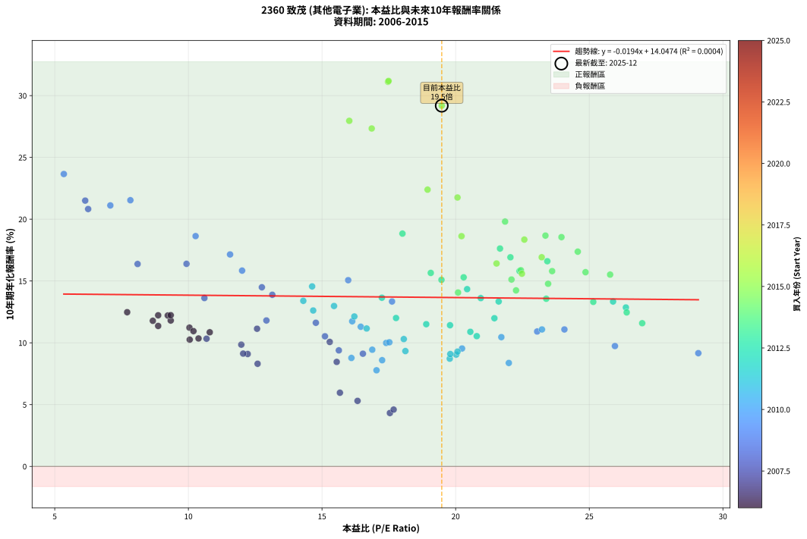
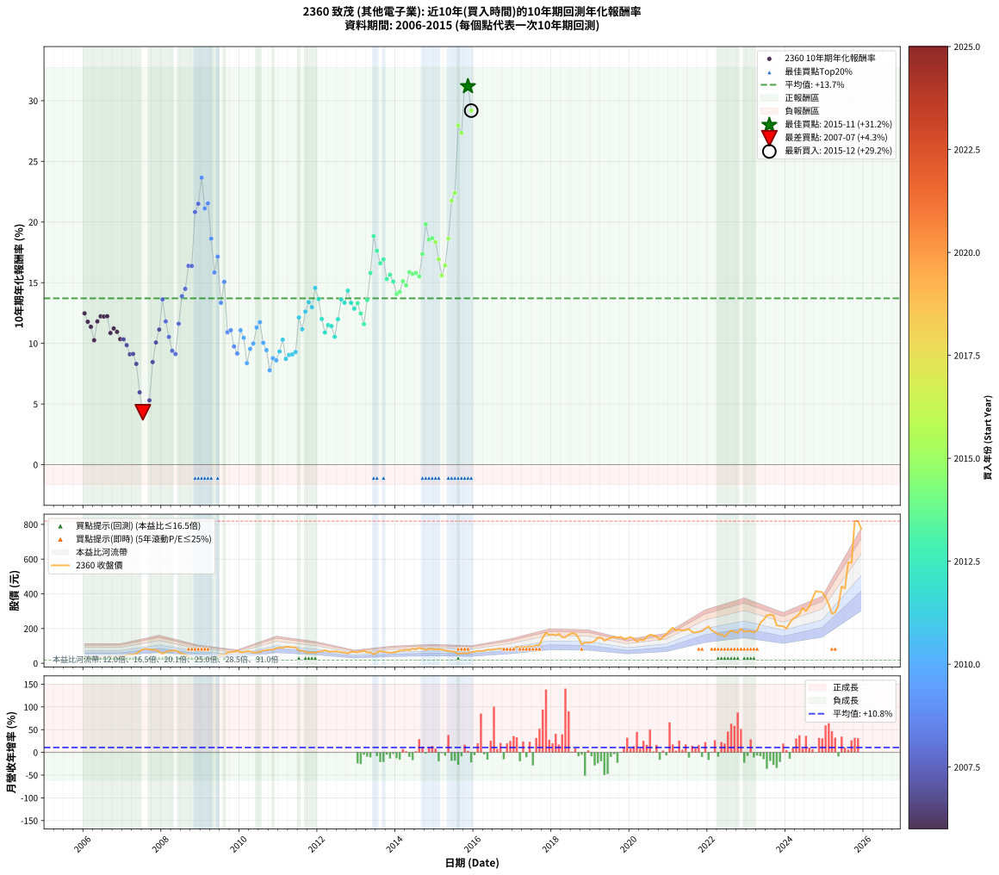

# 2360 致茂 - 本益比與未來報酬率分析

!!! info "報告資訊"
    - **股票代號**: 2360
    - **公司名稱**: 致茂
    - **產業別**: 其他電子業
    - **分析期間**: 2006-2015 (120 個數據點)
    - **資料來源**: Type 12 (ShowMonthlyK_ChartFlow) 月收盤價與本益比
    - **報酬率口徑**: 含現金股利 (簡化: 年度合計，假設每年7/1入帳)
    - **報告生成時間**: 2026-01-10 22:30:35 CST

## 📈 視覺化圖表

### 圖表1: 本益比 vs 未來報酬率關係

*圖表1：2360 致茂 本益比與10年期未來報酬率關係 (2006-2015)*

### 圖表2: 歷年買入時點的10年期實際報酬率

*圖表2：2360 致茂 歷年買入時點的10年期實際報酬率 (2006-2015)*

## 📍 買點訊號說明

本報告提供兩種買點提示訊號（顯示於圖表2的股價子圖中）：

### ▲ 小綠色三角形（回測驗證）
- **計算方式**: 使用全部歷史資料計算本益比第25百分位數
- **用途**: 事後驗證，顯示歷史上哪些時點確實為低估區
- **限制**: 當下無法判斷，僅供回測參考
- **特性**: 後見之明（Look-Ahead Bias）

### ▲ 小橘色三角形（即時訊號）
- **計算方式**: 使用截至當月的過去5年資料計算本益比第25百分位數
- **用途**: 實際投資決策，當時即可判斷
- **優勢**: 可操作性強，符合實務需求
- **特性**: 無後見之明，滾動窗口計算

!!! tip "如何使用兩種訊號"
    - **綠色▲** 幫助理解歷史估值機會，驗證策略有效性
    - **橘色▲** 可作為實際買進參考，但仍需搭配基本面分析
    - 兩種訊號重疊時，表示即時判斷與事後驗證一致，信心度較高
    - 僅有綠色▲時，表示當時無法判斷（需要未來資料才能確認）
    - 僅有橘色▲時，表示即時判斷為買點，但事後可能不是最佳時機

## 📊 估值分析摘要

| 指標 | 數值 |
|:---:|:---:|
| **目前本益比** (2015-12) | **19.48 倍** |
| **歷史平均本益比** | 17.33 倍 |
| **估值水準** | 🟡 合理範圍 |
| **預期10年年化報酬率** | **+13.67%** |
| **歷史平均報酬率** | +13.71% |
| **相關係數 (R²)** | 0.0004 |
| **趨勢線斜率** | -0.0194 |

!!! abstract "核心洞察"
    目前本益比接近歷史平均，預期報酬率符合長期趨勢

    根據歷史數據回測，2360 致茂 在目前本益比 **19.5倍** 的估值水準下，
    預期未來10年年化報酬率約為 **+13.7%**。

    **重要提醒**: 本分析基於歷史數據統計，實際報酬率會受到公司基本面變化、產業趨勢、
    總體經濟環境等多重因素影響。R² = 0.00 表示本益比可解釋約 0.0% 的報酬率變異。

## 📈 歷史估值統計

### 最佳買點 (最高報酬率)

| 項目 | 數值 |
|:---:|:---:|
| 起始時間 | 2015-11 |
| 當時本益比 | 17.49 倍 |
| 起始價格 | 57.7 元 |
| 10年後價格 | 819.0 元 |
| **10年年化報酬率** | **+31.19%** |

### 最差買點 (最低報酬率)

| 項目 | 數值 |
|:---:|:---:|
| 起始時間 | 2007-07 |
| 當時本益比 | 17.54 倍 |
| 起始價格 | 80.0 元 |
| 10年後價格 | 95.5 元 |
| **10年年化報酬率** | **+4.32%** |

## 🎯 投資啟示

### 本益比與報酬率關係

趨勢線方程式: **y = -0.0194x + 14.0474**

!!! note "負相關"
    本益比與未來報酬率呈現負相關。較低的本益比通常帶來較高的未來報酬率，
    但相關性不算非常強。**估值仍是重要參考指標之一**。

### 估值區間建議

基於歷史數據分析:

- **🟢 低估區** (P/E < 13.9): 預期報酬率較高，可考慮增加持股
- **🟡 合理區** (P/E 13.9-20.8): 預期報酬率符合長期趨勢，正常持有
- **🔴 高估區** (P/E > 20.8): 預期報酬率較低，可考慮減碼或觀望

!!! danger "風險提示"
    - 過去表現不代表未來結果
    - 本分析假設公司基本面無重大結構性變化
    - 產業環境劇變可能使歷史規律失效
    - 應結合公司財報、產業趨勢、總體經濟等多重因素綜合判斷

!!! success "長期投資觀點"
    歷史數據顯示，在合理或低估的估值水準買入並長期持有，
    往往能獲得較佳的投資報酬。**耐心等待好價格**是價值投資的核心原則。

## 📊 數據品質

- **資料來源**: GoodInfo.tw Type 12 (ShowMonthlyK_ChartFlow)
- **資料頻率**: 月度收盤價與本益比
- **回測期間**: 2006-2015
- **數據點數量**: 120 個 (每個點代表一次10年期回測)

### 計算方法說明

1. **10年期年化報酬率**:
   - 對每個歷史時點，計算其後10年的實際投資報酬率
   - 期末價值(不含股利): 期末價格
   - 期末價值(含現金股利): 期末價格 + 持有期間內的現金股利合計 (簡化: 年度合計，假設每年7/1入帳)
   - 公式: 年化報酬率 = [(期末價值/期初價格)^(1/年數) - 1] × 100%

2. **本益比 (P/E Ratio)**:
   - 使用當時的月收盤價與EPS計算
   - 資料來源: Type 12 月度河流圖本益比數據

3. **趨勢線 (Linear Regression)**:
   - 使用最小平方法擬合線性趨勢線
   - R²值衡量本益比對報酬率的解釋能力

---

*本報告由 Stock Analysis System v1.9.0 自動生成*
*數據更新時間: 2026-01-10 22:30:35 CST*

## 📋 月度回測明細表

（每一列對應時間線圖中的一個買入點；可用來對照 SVG 圖上的每個點。）

| 買入月份 | 賣出月份 | 回測期限_年 | 實際持有年數 | 買入本益比_倍 | 買入收盤價_元 | 賣出收盤價_元 | 現金股利合計_元 | 總報酬率_pct | 年化報酬率_pct |
| --- | --- | --- | --- | --- | --- | --- | --- | --- | --- |
| 2006-01 | 2016-01 | 10 | 9.999 | 7.71 | 28.05 | 65.30 | 25.57 | +223.96 | +12.48 |
| 2006-02 | 2016-02 | 10 | 9.999 | 8.67 | 31.55 | 70.50 | 25.57 | +204.51 | +11.78 |
| 2006-03 | 2016-03 | 10 | 10.001 | 8.87 | 32.30 | 69.20 | 25.57 | +193.41 | +11.36 |
| 2006-04 | 2016-04 | 10 | 10.001 | 10.05 | 36.60 | 71.60 | 25.57 | +165.50 | +10.26 |
| 2006-05 | 2016-05 | 10 | 10.001 | 9.34 | 34.00 | 78.20 | 25.57 | +205.21 | +11.80 |
| 2006-06 | 2016-06 | 10 | 10.001 | 8.87 | 32.30 | 76.80 | 25.57 | +216.94 | +12.23 |
| 2006-07 | 2016-07 | 10 | 10.001 | 9.23 | 33.60 | 80.50 | 25.84 | +216.48 | +12.21 |
| 2006-08 | 2016-08 | 10 | 10.001 | 9.34 | 34.00 | 82.00 | 25.84 | +217.17 | +12.23 |
| 2006-09 | 2016-09 | 10 | 10.001 | 10.80 | 39.30 | 84.30 | 25.84 | +180.25 | +10.85 |
| 2006-10 | 2016-10 | 10 | 10.001 | 10.04 | 36.55 | 80.10 | 25.84 | +189.84 | +11.23 |
| 2006-11 | 2016-11 | 10 | 10.001 | 10.19 | 37.10 | 79.00 | 25.84 | +182.58 | +10.95 |
| 2006-12 | 2016-12 | 10 | 10.001 | 10.38 | 37.80 | 75.40 | 25.84 | +167.83 | +10.35 |
| 2007-01 | 2017-01 | 10 | 10.001 | 10.68 | 40.30 | 81.90 | 25.84 | +167.34 | +10.33 |
| 2007-02 | 2017-02 | 10 | 10.001 | 11.98 | 46.75 | 93.80 | 25.84 | +155.91 | +9.85 |
| 2007-03 | 2017-03 | 10 | 10.001 | 12.22 | 49.30 | 91.90 | 25.84 | +138.82 | +9.09 |
| 2007-04 | 2017-04 | 10 | 10.001 | 12.05 | 50.20 | 94.40 | 25.84 | +139.52 | +9.13 |
| 2007-05 | 2017-05 | 10 | 10.001 | 12.59 | 54.10 | 94.30 | 25.84 | +122.07 | +8.30 |
| 2007-06 | 2017-06 | 10 | 10.001 | 15.67 | 69.40 | 98.00 | 25.84 | +78.44 | +5.96 |
| 2007-07 | 2017-07 | 10 | 10.001 | 17.54 | 80.00 | 95.50 | 26.61 | +52.63 | +4.32 |
| 2007-08 | 2017-08 | 10 | 10.001 | 17.68 | 83.00 | 103.50 | 26.61 | +56.75 | +4.60 |
| 2007-09 | 2017-09 | 10 | 10.001 | 16.33 | 78.80 | 105.50 | 26.61 | +67.65 | +5.30 |
| 2007-10 | 2017-10 | 10 | 10.001 | 15.55 | 77.10 | 147.00 | 26.61 | +125.17 | +8.45 |
| 2007-11 | 2017-11 | 10 | 10.001 | 15.29 | 77.80 | 176.50 | 26.61 | +161.06 | +10.07 |
| 2007-12 | 2017-12 | 10 | 10.001 | 12.57 | 65.60 | 162.00 | 26.61 | +187.51 | +11.14 |
| 2008-01 | 2018-01 | 10 | 10.001 | 10.60 | 53.70 | 166.00 | 26.61 | +258.67 | +13.62 |
| 2008-02 | 2018-03 | 10 | 10.081 | 12.92 | 63.50 | 169.00 | 26.61 | +208.04 | +11.81 |
| 2008-03 | 2018-03 | 10 | 9.999 | 15.11 | 71.90 | 169.00 | 26.61 | +172.05 | +10.53 |
| 2008-04 | 2018-04 | 10 | 9.999 | 15.63 | 72.00 | 150.00 | 26.61 | +145.29 | +9.39 |
| 2008-05 | 2018-05 | 10 | 9.999 | 16.53 | 73.60 | 149.50 | 26.61 | +139.27 | +9.12 |
| 2008-06 | 2018-06 | 10 | 9.999 | 14.77 | 63.50 | 164.00 | 26.61 | +200.17 | +11.62 |
| 2008-07 | 2018-07 | 10 | 9.999 | 13.14 | 54.50 | 172.50 | 27.49 | +266.95 | +13.89 |
| 2008-08 | 2018-08 | 10 | 9.999 | 12.75 | 50.90 | 169.50 | 27.49 | +287.01 | +14.49 |
| 2008-09 | 2018-09 | 10 | 9.999 | 9.93 | 38.15 | 146.50 | 27.49 | +356.06 | +16.39 |
| 2008-10 | 2018-10 | 10 | 9.999 | 8.10 | 29.85 | 108.50 | 27.49 | +355.57 | +16.38 |
| 2008-11 | 2018-11 | 10 | 9.999 | 6.25 | 22.10 | 119.00 | 27.49 | +562.84 | +20.82 |
| 2008-12 | 2018-12 | 10 | 9.999 | 6.14 | 20.75 | 118.00 | 27.49 | +601.15 | +21.50 |
| 2009-01 | 2019-01 | 10 | 9.999 | 5.34 | 17.65 | 120.00 | 27.49 | +735.63 | +23.66 |
| 2009-02 | 2019-02 | 10 | 9.999 | 7.08 | 22.90 | 128.00 | 27.49 | +578.99 | +21.11 |
| 2009-03 | 2019-03 | 10 | 9.999 | 7.83 | 24.75 | 146.50 | 27.49 | +602.98 | +21.54 |
| 2009-04 | 2019-04 | 10 | 9.999 | 10.27 | 31.70 | 147.50 | 27.49 | +452.01 | +18.63 |
| 2009-05 | 2019-05 | 10 | 9.999 | 12.01 | 36.20 | 130.00 | 27.49 | +335.05 | +15.84 |
| 2009-06 | 2019-06 | 10 | 9.999 | 11.56 | 34.00 | 138.00 | 27.49 | +386.73 | +17.15 |
| 2009-07 | 2019-07 | 10 | 9.999 | 17.62 | 50.50 | 147.00 | 29.65 | +249.81 | +13.34 |
| 2009-08 | 2019-08 | 10 | 9.999 | 15.98 | 44.65 | 152.00 | 29.65 | +306.84 | +15.07 |
| 2009-09 | 2019-09 | 10 | 9.999 | 23.05 | 62.70 | 147.00 | 29.65 | +181.74 | +10.92 |
| 2009-10 | 2019-10 | 10 | 9.999 | 24.07 | 63.70 | 152.50 | 29.65 | +185.96 | +11.08 |
| 2009-11 | 2019-11 | 10 | 9.999 | 25.96 | 66.80 | 139.50 | 29.65 | +153.22 | +9.74 |
| 2009-12 | 2019-12 | 10 | 9.999 | 29.08 | 72.70 | 145.00 | 29.65 | +140.24 | +9.16 |
| 2010-01 | 2020-01 | 10 | 9.999 | 23.23 | 63.00 | 150.50 | 29.65 | +185.96 | +11.08 |
| 2010-02 | 2020-02 | 10 | 9.999 | 21.71 | 63.50 | 142.00 | 29.65 | +170.32 | +10.46 |
| 2010-03 | 2020-03 | 10 | 10.001 | 21.99 | 69.00 | 124.50 | 29.65 | +123.41 | +8.37 |
| 2010-04 | 2020-04 | 10 | 10.001 | 20.24 | 67.80 | 139.00 | 29.65 | +148.75 | +9.54 |
| 2010-05 | 2020-05 | 10 | 10.001 | 17.40 | 62.00 | 131.00 | 29.65 | +159.12 | +9.99 |
| 2010-06 | 2020-06 | 10 | 10.001 | 16.45 | 62.10 | 151.50 | 29.65 | +191.71 | +11.30 |
| 2010-07 | 2020-07 | 10 | 10.001 | 16.13 | 64.30 | 164.50 | 30.66 | +203.52 | +11.74 |
| 2010-08 | 2020-08 | 10 | 10.001 | 17.52 | 73.60 | 161.00 | 30.66 | +160.41 | +10.04 |
| 2010-09 | 2020-09 | 10 | 10.001 | 16.88 | 74.50 | 153.00 | 30.66 | +146.52 | +9.44 |
| 2010-10 | 2020-10 | 10 | 10.001 | 17.04 | 78.80 | 136.00 | 30.66 | +111.50 | +7.78 |
| 2010-11 | 2020-11 | 10 | 10.001 | 16.10 | 77.90 | 150.00 | 30.66 | +131.91 | +8.77 |
| 2010-12 | 2020-12 | 10 | 10.001 | 17.25 | 87.10 | 168.00 | 30.66 | +128.08 | +8.59 |
| 2011-01 | 2021-01 | 10 | 10.001 | 18.12 | 90.00 | 189.00 | 30.66 | +144.07 | +9.33 |
| 2011-02 | 2021-02 | 10 | 10.001 | 18.06 | 88.20 | 204.50 | 30.66 | +166.62 | +10.30 |
| 2011-03 | 2021-03 | 10 | 10.001 | 19.78 | 95.00 | 188.50 | 30.66 | +130.70 | +8.72 |
| 2011-04 | 2021-04 | 10 | 10.001 | 20.02 | 94.50 | 194.00 | 30.66 | +137.74 | +9.04 |
| 2011-05 | 2021-05 | 10 | 10.001 | 19.80 | 91.80 | 188.50 | 30.66 | +138.74 | +9.09 |
| 2011-06 | 2021-06 | 10 | 10.001 | 20.07 | 91.40 | 191.50 | 30.66 | +143.06 | +9.29 |
| 2011-07 | 2021-07 | 10 | 10.001 | 16.21 | 72.50 | 196.50 | 31.36 | +214.29 | +12.13 |
| 2011-08 | 2021-08 | 10 | 10.001 | 16.67 | 73.20 | 179.50 | 31.36 | +188.06 | +11.16 |
| 2011-09 | 2021-09 | 10 | 10.001 | 14.67 | 63.20 | 176.00 | 31.36 | +228.10 | +12.61 |
| 2011-10 | 2021-10 | 10 | 10.001 | 14.30 | 60.40 | 181.00 | 31.36 | +251.59 | +13.40 |
| 2011-11 | 2021-11 | 10 | 10.001 | 15.45 | 64.00 | 185.50 | 31.36 | +238.85 | +12.98 |
| 2011-12 | 2021-12 | 10 | 10.001 | 14.63 | 59.40 | 200.00 | 31.36 | +289.50 | +14.56 |
| 2012-01 | 2022-01 | 10 | 10.001 | 17.24 | 67.70 | 212.00 | 31.36 | +259.47 | +13.65 |
| 2012-02 | 2022-03 | 10 | 10.081 | 17.77 | 67.40 | 180.00 | 31.36 | +213.59 | +12.01 |
| 2012-03 | 2022-03 | 10 | 9.999 | 20.55 | 75.20 | 180.00 | 31.36 | +181.07 | +10.89 |
| 2012-04 | 2022-04 | 10 | 9.999 | 18.90 | 66.60 | 166.50 | 31.36 | +197.09 | +11.51 |
| 2012-05 | 2022-05 | 10 | 9.999 | 19.79 | 67.10 | 166.50 | 31.36 | +194.87 | +11.42 |
| 2012-06 | 2022-06 | 10 | 9.999 | 20.79 | 67.70 | 153.00 | 31.36 | +172.32 | +10.54 |
| 2012-07 | 2022-07 | 10 | 9.999 | 21.45 | 67.00 | 172.00 | 35.84 | +210.21 | +11.99 |
| 2012-08 | 2022-08 | 10 | 9.999 | 20.94 | 62.60 | 188.50 | 35.84 | +258.37 | +13.62 |
| 2012-09 | 2022-09 | 10 | 9.999 | 21.61 | 61.70 | 180.00 | 35.84 | +249.82 | +13.34 |
| 2012-10 | 2022-10 | 10 | 9.999 | 20.43 | 55.60 | 176.50 | 35.84 | +281.91 | +14.34 |
| 2012-11 | 2022-11 | 10 | 9.999 | 25.89 | 67.00 | 198.50 | 35.84 | +249.76 | +13.34 |
| 2012-12 | 2022-12 | 10 | 9.999 | 26.37 | 64.70 | 181.00 | 35.84 | +235.15 | +12.86 |
| 2013-01 | 2023-01 | 10 | 9.999 | 25.15 | 63.30 | 185.00 | 35.84 | +248.88 | +13.31 |
| 2013-02 | 2023-02 | 10 | 9.999 | 26.40 | 68.10 | 184.50 | 35.84 | +223.56 | +12.46 |
| 2013-03 | 2023-03 | 10 | 9.999 | 26.98 | 71.30 | 177.50 | 35.84 | +199.22 | +11.58 |
| 2013-04 | 2023-04 | 10 | 9.999 | 23.39 | 63.30 | 190.00 | 35.84 | +256.78 | +13.57 |
| 2013-05 | 2023-05 | 10 | 9.999 | 22.39 | 62.00 | 233.00 | 35.84 | +333.62 | +15.80 |
| 2013-06 | 2023-06 | 10 | 9.999 | 18.01 | 51.00 | 250.50 | 35.84 | +461.45 | +18.83 |
| 2013-07 | 2023-07 | 10 | 9.999 | 21.66 | 62.70 | 276.00 | 41.84 | +406.93 | +17.63 |
| 2013-08 | 2023-08 | 10 | 9.999 | 23.43 | 69.30 | 280.00 | 41.84 | +364.42 | +16.60 |
| 2013-09 | 2023-09 | 10 | 9.999 | 22.05 | 66.60 | 276.00 | 41.84 | +377.24 | +16.92 |
| 2013-10 | 2023-10 | 10 | 9.999 | 20.30 | 62.60 | 218.00 | 41.84 | +315.08 | +15.30 |
| 2013-11 | 2023-11 | 10 | 9.999 | 19.07 | 60.00 | 215.00 | 41.84 | +328.07 | +15.65 |
| 2013-12 | 2023-12 | 10 | 9.999 | 19.47 | 62.50 | 213.00 | 41.84 | +307.75 | +15.09 |
| 2014-01 | 2024-01 | 10 | 9.999 | 20.09 | 65.00 | 200.50 | 41.84 | +272.84 | +14.07 |
| 2014-02 | 2024-02 | 10 | 9.999 | 22.26 | 72.60 | 233.00 | 41.84 | +278.57 | +14.24 |
| 2014-03 | 2024-03 | 10 | 10.001 | 22.09 | 72.60 | 255.00 | 41.84 | +308.87 | +15.12 |
| 2014-04 | 2024-04 | 10 | 10.001 | 23.46 | 77.70 | 266.50 | 41.84 | +296.84 | +14.78 |
| 2014-05 | 2024-05 | 10 | 10.001 | 22.44 | 74.90 | 285.00 | 41.84 | +336.37 | +15.87 |
| 2014-06 | 2024-06 | 10 | 10.001 | 24.86 | 83.60 | 318.00 | 41.84 | +330.43 | +15.71 |
| 2014-07 | 2024-07 | 10 | 10.001 | 23.61 | 80.00 | 301.00 | 45.94 | +333.68 | +15.80 |
| 2014-08 | 2024-08 | 10 | 10.001 | 25.78 | 88.00 | 326.50 | 45.94 | +323.23 | +15.52 |
| 2014-09 | 2024-09 | 10 | 10.001 | 24.57 | 84.50 | 373.50 | 45.94 | +396.38 | +17.37 |
| 2014-10 | 2024-10 | 10 | 10.001 | 21.85 | 75.70 | 415.50 | 45.94 | +509.57 | +19.81 |
| 2014-11 | 2024-11 | 10 | 10.001 | 23.96 | 83.60 | 412.50 | 45.94 | +448.38 | +18.55 |
| 2014-12 | 2024-12 | 10 | 10.001 | 23.36 | 82.10 | 409.00 | 45.94 | +454.13 | +18.67 |
| 2015-01 | 2025-01 | 10 | 10.001 | 22.57 | 78.90 | 379.50 | 45.94 | +439.22 | +18.35 |
| 2015-02 | 2025-02 | 10 | 10.001 | 23.22 | 80.70 | 339.50 | 45.94 | +377.62 | +16.92 |
| 2015-03 | 2025-03 | 10 | 10.001 | 22.48 | 77.70 | 285.00 | 45.94 | +325.92 | +15.59 |
| 2015-04 | 2025-04 | 10 | 10.001 | 21.53 | 74.00 | 292.50 | 45.94 | +357.36 | +16.42 |
| 2015-05 | 2025-05 | 10 | 10.001 | 20.22 | 69.10 | 335.50 | 45.94 | +452.02 | +18.63 |
| 2015-06 | 2025-06 | 10 | 10.001 | 20.07 | 68.20 | 442.50 | 45.94 | +616.19 | +21.76 |
| 2015-07 | 2025-07 | 10 | 10.001 | 18.95 | 64.00 | 430.50 | 52.34 | +654.43 | +22.39 |
| 2015-08 | 2025-08 | 10 | 10.001 | 16.02 | 53.80 | 581.00 | 52.34 | +1077.20 | +27.96 |
| 2015-09 | 2025-09 | 10 | 10.001 | 16.86 | 56.30 | 579.00 | 52.34 | +1021.38 | +27.34 |
| 2015-10 | 2025-10 | 10 | 10.001 | 17.47 | 58.00 | 819.00 | 52.34 | +1402.30 | +31.12 |
| 2015-11 | 2025-11 | 10 | 10.001 | 17.49 | 57.70 | 819.00 | 52.34 | +1410.11 | +31.19 |
| 2015-12 | 2025-12 | 10 | 10.001 | 19.48 | 63.90 | 775.00 | 52.34 | +1194.74 | +29.18 |
