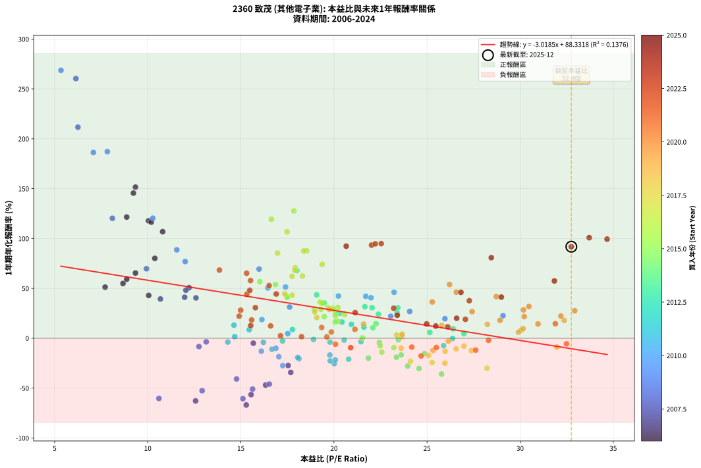

# 2360 致茂 - 本益比與未來報酬率分析

!!! info "報告資訊"
    - **股票代號**: 2360
    - **公司名稱**: 致茂
    - **產業別**: 其他電子業
    - **分析期間**: 2006-2024 (228 個數據點)
    - **資料來源**: Type 12 (ShowMonthlyK_ChartFlow) 月收盤價與本益比
    - **報酬率口徑**: 含現金股利 (簡化: 年度合計，假設每年7/1入帳)
    - **報告生成時間**: 2026-01-12 20:43:59 CST

## 📈 視覺化圖表

### 圖表1: 本益比 vs 未來報酬率關係

*圖表1：2360 致茂 本益比與1年期未來報酬率關係 (2006-2024)*

### 圖表2: 歷年買入時點的1年期實際報酬率

*圖表2：2360 致茂 歷年買入時點的1年期實際報酬率 (2006-2024)*

## 📍 買點訊號說明

本報告提供兩種買點提示訊號（顯示於圖表2的股價子圖中）：

### ▲ 小綠色三角形（回測驗證）
- **計算方式**: 使用全部歷史資料計算本益比第25百分位數
- **用途**: 事後驗證，顯示歷史上哪些時點確實為低估區
- **限制**: 當下無法判斷，僅供回測參考
- **特性**: 後見之明（Look-Ahead Bias）

### ▲ 小橘色三角形（即時訊號）
- **計算方式**: 使用截至當月的過去5年資料計算本益比第25百分位數
- **用途**: 實際投資決策，當時即可判斷
- **優勢**: 可操作性強，符合實務需求
- **特性**: 無後見之明，滾動窗口計算

!!! tip "如何使用兩種訊號"
    - **綠色▲** 幫助理解歷史估值機會，驗證策略有效性
    - **橘色▲** 可作為實際買進參考，但仍需搭配基本面分析
    - 兩種訊號重疊時，表示即時判斷與事後驗證一致，信心度較高
    - 僅有綠色▲時，表示當時無法判斷（需要未來資料才能確認）
    - 僅有橘色▲時，表示即時判斷為買點，但事後可能不是最佳時機

## 📊 估值分析摘要

| 指標 | 數值 |
|:---:|:---:|
| **目前本益比** (2024-12) | **32.75 倍** |
| **歷史平均本益比** | 20.14 倍 |
| **估值水準** | 🔴 相對高估 |
| **預期1年年化報酬率** | **-10.52%** |
| **歷史平均報酬率** | +27.53% |
| **相關係數 (R²)** | 0.1376 |
| **趨勢線斜率** | -3.0185 |

!!! abstract "核心洞察"
    目前本益比顯著高於歷史平均，預期未來報酬率可能較低

    根據歷史數據回測，2360 致茂 在目前本益比 **32.8倍** 的估值水準下，
    預期未來1年年化報酬率約為 **-10.5%**。

    **重要提醒**: 本分析基於歷史數據統計，實際報酬率會受到公司基本面變化、產業趨勢、
    總體經濟環境等多重因素影響。R² = 0.14 表示本益比可解釋約 13.8% 的報酬率變異。

## 📈 歷史估值統計

### 最佳買點 (最高報酬率)

| 項目 | 數值 |
|:---:|:---:|
| 起始時間 | 2009-01 |
| 當時本益比 | 5.34 倍 |
| 起始價格 | 17.6 元 |
| 1年後價格 | 63.0 元 |
| **1年年化報酬率** | **+268.67%** |

### 最差買點 (最低報酬率)

| 項目 | 數值 |
|:---:|:---:|
| 起始時間 | 2007-11 |
| 當時本益比 | 15.29 倍 |
| 起始價格 | 77.8 元 |
| 1年後價格 | 22.1 元 |
| **1年年化報酬率** | **-66.90%** |

## 🎯 投資啟示

### 本益比與報酬率關係

趨勢線方程式: **y = -3.0185x + 88.3318**

!!! warning "強負相關"
    本益比與未來報酬率呈現強負相關。在高本益比時期買入，未來報酬率顯著較低；
    在低本益比時期買入，未來報酬率顯著較高。**估值紀律至關重要**。

### 估值區間建議

基於歷史數據分析:

- **🟢 低估區** (P/E < 16.1): 預期報酬率較高，可考慮增加持股
- **🟡 合理區** (P/E 16.1-24.2): 預期報酬率符合長期趨勢，正常持有
- **🔴 高估區** (P/E > 24.2): 預期報酬率較低，可考慮減碼或觀望

!!! danger "風險提示"
    - 過去表現不代表未來結果
    - 本分析假設公司基本面無重大結構性變化
    - 產業環境劇變可能使歷史規律失效
    - 應結合公司財報、產業趨勢、總體經濟等多重因素綜合判斷

!!! success "長期投資觀點"
    歷史數據顯示，在合理或低估的估值水準買入並長期持有，
    往往能獲得較佳的投資報酬。**耐心等待好價格**是價值投資的核心原則。

## 📊 數據品質

- **資料來源**: GoodInfo.tw Type 12 (ShowMonthlyK_ChartFlow)
- **資料頻率**: 月度收盤價與本益比
- **回測期間**: 2006-2024
- **數據點數量**: 228 個 (每個點代表一次1年期回測)

### 計算方法說明

1. **1年期年化報酬率**:
   - 對每個歷史時點，計算其後1年的實際投資報酬率
   - 期末價值(不含股利): 期末價格
   - 期末價值(含現金股利): 期末價格 + 持有期間內的現金股利合計 (簡化: 年度合計，假設每年7/1入帳)
   - 公式: 年化報酬率 = [(期末價值/期初價格)^(1/年數) - 1] × 100%

2. **本益比 (P/E Ratio)**:
   - 使用當時的月收盤價與EPS計算
   - 資料來源: Type 12 月度河流圖本益比數據

3. **趨勢線 (Linear Regression)**:
   - 使用最小平方法擬合線性趨勢線
   - R²值衡量本益比對報酬率的解釋能力

---

*本報告由 Stock Analysis System v1.9.0 自動生成*
*數據更新時間: 2026-01-12 20:43:59 CST*

## 📋 月度回測明細表

（每一列對應時間線圖中的一個買入點；可用來對照 SVG 圖上的每個點。）

| 買入月份 | 賣出月份 | 回測期限_年 | 實際持有年數 | 買入本益比_倍 | 買入收盤價_元 | 賣出收盤價_元 | 現金股利合計_元 | 總報酬率_pct | 年化報酬率_pct |
| --- | --- | --- | --- | --- | --- | --- | --- | --- | --- |
| 2006-01 | 2007-01 | 1 | 0.999 | 7.71 | 28.05 | 40.30 | 2.11 | +51.18 | +51.23 |
| 2006-02 | 2007-02 | 1 | 0.999 | 8.67 | 31.55 | 46.75 | 2.11 | +54.86 | +54.90 |
| 2006-03 | 2007-03 | 1 | 0.999 | 8.87 | 32.30 | 49.30 | 2.11 | +59.15 | +59.21 |
| 2006-04 | 2007-04 | 1 | 0.999 | 10.05 | 36.60 | 50.20 | 2.11 | +42.92 | +42.95 |
| 2006-05 | 2007-05 | 1 | 0.999 | 9.34 | 34.00 | 54.10 | 2.11 | +65.31 | +65.37 |
| 2006-06 | 2007-06 | 1 | 0.999 | 8.87 | 32.30 | 69.40 | 2.11 | +121.38 | +121.50 |
| 2006-07 | 2007-07 | 1 | 0.999 | 9.23 | 33.60 | 80.00 | 2.45 | +145.40 | +145.55 |
| 2006-08 | 2007-08 | 1 | 0.999 | 9.34 | 34.00 | 83.00 | 2.45 | +151.33 | +151.49 |
| 2006-09 | 2007-09 | 1 | 0.999 | 10.80 | 39.30 | 78.80 | 2.45 | +106.75 | +106.85 |
| 2006-10 | 2007-10 | 1 | 0.999 | 10.04 | 36.55 | 77.10 | 2.45 | +117.66 | +117.77 |
| 2006-11 | 2007-11 | 1 | 0.999 | 10.19 | 37.10 | 77.80 | 2.45 | +116.32 | +116.43 |
| 2006-12 | 2007-12 | 1 | 0.999 | 10.38 | 37.80 | 65.60 | 2.45 | +80.03 | +80.11 |
| 2007-01 | 2008-01 | 1 | 0.999 | 10.68 | 40.30 | 53.70 | 2.45 | +39.34 | +39.37 |
| 2007-02 | 2008-02 | 1 | 0.999 | 11.98 | 46.75 | 63.50 | 2.45 | +41.08 | +41.11 |
| 2007-03 | 2008-03 | 1 | 1.002 | 12.22 | 49.30 | 71.90 | 2.45 | +50.82 | +50.69 |
| 2007-04 | 2008-04 | 1 | 1.002 | 12.05 | 50.20 | 72.00 | 2.45 | +48.31 | +48.19 |
| 2007-05 | 2008-05 | 1 | 1.002 | 12.59 | 54.10 | 73.60 | 2.45 | +40.58 | +40.48 |
| 2007-06 | 2008-06 | 1 | 1.002 | 15.67 | 69.40 | 63.50 | 2.45 | -4.97 | -4.96 |
| 2007-07 | 2008-07 | 1 | 1.002 | 17.54 | 80.00 | 54.50 | 3.59 | -27.38 | -27.34 |
| 2007-08 | 2008-08 | 1 | 1.002 | 17.68 | 83.00 | 50.90 | 3.59 | -34.35 | -34.29 |
| 2007-09 | 2008-09 | 1 | 1.002 | 16.33 | 78.80 | 38.15 | 3.59 | -47.03 | -46.96 |
| 2007-10 | 2008-10 | 1 | 1.002 | 15.55 | 77.10 | 29.85 | 3.59 | -56.62 | -56.55 |
| 2007-11 | 2008-11 | 1 | 1.002 | 15.29 | 77.80 | 22.10 | 3.59 | -66.98 | -66.90 |
| 2007-12 | 2008-12 | 1 | 1.002 | 12.57 | 65.60 | 20.75 | 3.59 | -62.89 | -62.82 |
| 2008-01 | 2009-01 | 1 | 1.002 | 10.60 | 53.70 | 17.65 | 3.59 | -60.44 | -60.37 |
| 2008-02 | 2009-03 | 1 | 1.081 | 12.92 | 63.50 | 24.75 | 3.59 | -55.37 | -52.57 |
| 2008-03 | 2009-03 | 1 | 0.999 | 15.11 | 71.90 | 24.75 | 3.59 | -60.58 | -60.61 |
| 2008-04 | 2009-04 | 1 | 0.999 | 15.63 | 72.00 | 31.70 | 3.59 | -50.98 | -51.01 |
| 2008-05 | 2009-05 | 1 | 0.999 | 16.53 | 73.60 | 36.20 | 3.59 | -45.93 | -45.96 |
| 2008-06 | 2009-06 | 1 | 0.999 | 14.77 | 63.50 | 34.00 | 3.59 | -40.80 | -40.82 |
| 2008-07 | 2009-07 | 1 | 0.999 | 13.14 | 54.50 | 50.50 | 2.01 | -3.65 | -3.65 |
| 2008-08 | 2009-08 | 1 | 0.999 | 12.75 | 50.90 | 44.65 | 2.01 | -8.33 | -8.33 |
| 2008-09 | 2009-09 | 1 | 0.999 | 9.93 | 38.15 | 62.70 | 2.01 | +69.63 | +69.69 |
| 2008-10 | 2009-10 | 1 | 0.999 | 8.10 | 29.85 | 63.70 | 2.01 | +120.14 | +120.26 |
| 2008-11 | 2009-11 | 1 | 0.999 | 6.25 | 22.10 | 66.80 | 2.01 | +211.37 | +211.61 |
| 2008-12 | 2009-12 | 1 | 0.999 | 6.14 | 20.75 | 72.70 | 2.01 | +260.06 | +260.37 |
| 2009-01 | 2010-01 | 1 | 0.999 | 5.34 | 17.65 | 63.00 | 2.01 | +268.34 | +268.67 |
| 2009-02 | 2010-02 | 1 | 0.999 | 7.08 | 22.90 | 63.50 | 2.01 | +186.08 | +186.28 |
| 2009-03 | 2010-03 | 1 | 0.999 | 7.83 | 24.75 | 69.00 | 2.01 | +186.92 | +187.12 |
| 2009-04 | 2010-04 | 1 | 0.999 | 10.27 | 31.70 | 67.80 | 2.01 | +120.23 | +120.35 |
| 2009-05 | 2010-05 | 1 | 0.999 | 12.01 | 36.20 | 62.00 | 2.01 | +76.83 | +76.90 |
| 2009-06 | 2010-06 | 1 | 0.999 | 11.56 | 34.00 | 62.10 | 2.01 | +88.56 | +88.65 |
| 2009-07 | 2010-07 | 1 | 0.999 | 17.62 | 50.50 | 64.30 | 2.00 | +31.29 | +31.31 |
| 2009-08 | 2010-08 | 1 | 0.999 | 15.98 | 44.65 | 73.60 | 2.00 | +69.32 | +69.38 |
| 2009-09 | 2010-09 | 1 | 0.999 | 23.05 | 62.70 | 74.50 | 2.00 | +22.01 | +22.03 |
| 2009-10 | 2010-10 | 1 | 0.999 | 24.07 | 63.70 | 78.80 | 2.00 | +26.84 | +26.87 |
| 2009-11 | 2010-11 | 1 | 0.999 | 25.96 | 66.80 | 77.90 | 2.00 | +19.61 | +19.63 |
| 2009-12 | 2010-12 | 1 | 0.999 | 29.08 | 72.70 | 87.10 | 2.00 | +22.56 | +22.58 |
| 2010-01 | 2011-01 | 1 | 0.999 | 23.23 | 63.00 | 90.00 | 2.00 | +46.03 | +46.07 |
| 2010-02 | 2011-02 | 1 | 0.999 | 21.71 | 63.50 | 88.20 | 2.00 | +42.05 | +42.08 |
| 2010-03 | 2011-03 | 1 | 0.999 | 21.99 | 69.00 | 95.00 | 2.00 | +40.58 | +40.61 |
| 2010-04 | 2011-04 | 1 | 0.999 | 20.24 | 67.80 | 94.50 | 2.00 | +42.33 | +42.36 |
| 2010-05 | 2011-05 | 1 | 0.999 | 17.40 | 62.00 | 91.80 | 2.00 | +51.29 | +51.33 |
| 2010-06 | 2011-06 | 1 | 0.999 | 16.45 | 62.10 | 91.40 | 2.00 | +50.40 | +50.44 |
| 2010-07 | 2011-07 | 1 | 0.999 | 16.13 | 64.30 | 72.50 | 3.80 | +18.66 | +18.68 |
| 2010-08 | 2011-08 | 1 | 0.999 | 17.52 | 73.60 | 73.20 | 3.80 | +4.62 | +4.62 |
| 2010-09 | 2011-09 | 1 | 0.999 | 16.88 | 74.50 | 63.20 | 3.80 | -10.07 | -10.07 |
| 2010-10 | 2011-10 | 1 | 0.999 | 17.04 | 78.80 | 60.40 | 3.80 | -18.53 | -18.54 |
| 2010-11 | 2011-11 | 1 | 0.999 | 16.10 | 77.90 | 64.00 | 3.80 | -12.97 | -12.97 |
| 2010-12 | 2011-12 | 1 | 0.999 | 17.25 | 87.10 | 59.40 | 3.80 | -27.44 | -27.46 |
| 2011-01 | 2012-01 | 1 | 0.999 | 18.12 | 90.00 | 67.70 | 3.80 | -20.56 | -20.57 |
| 2011-02 | 2012-02 | 1 | 0.999 | 18.06 | 88.20 | 67.40 | 3.80 | -19.27 | -19.29 |
| 2011-03 | 2012-03 | 1 | 1.002 | 19.78 | 95.00 | 75.20 | 3.80 | -16.84 | -16.81 |
| 2011-04 | 2012-04 | 1 | 1.002 | 20.02 | 94.50 | 66.60 | 3.80 | -25.50 | -25.46 |
| 2011-05 | 2012-05 | 1 | 1.002 | 19.80 | 91.80 | 67.10 | 3.80 | -22.77 | -22.73 |
| 2011-06 | 2012-06 | 1 | 1.002 | 20.07 | 91.40 | 67.70 | 3.80 | -21.77 | -21.73 |
| 2011-07 | 2012-07 | 1 | 1.002 | 16.21 | 72.50 | 67.00 | 2.50 | -4.14 | -4.13 |
| 2011-08 | 2012-08 | 1 | 1.002 | 16.67 | 73.20 | 62.60 | 2.50 | -11.07 | -11.04 |
| 2011-09 | 2012-09 | 1 | 1.002 | 14.67 | 63.20 | 61.70 | 2.50 | +1.58 | +1.58 |
| 2011-10 | 2012-10 | 1 | 1.002 | 14.30 | 60.40 | 55.60 | 2.50 | -3.81 | -3.80 |
| 2011-11 | 2012-11 | 1 | 1.002 | 15.45 | 64.00 | 67.00 | 2.50 | +8.59 | +8.58 |
| 2011-12 | 2012-12 | 1 | 1.002 | 14.63 | 59.40 | 64.70 | 2.50 | +13.13 | +13.10 |
| 2012-01 | 2013-01 | 1 | 1.002 | 17.24 | 67.70 | 63.30 | 2.50 | -2.81 | -2.80 |
| 2012-02 | 2013-03 | 1 | 1.081 | 17.77 | 67.40 | 71.30 | 2.50 | +9.50 | +8.75 |
| 2012-03 | 2013-03 | 1 | 0.999 | 20.55 | 75.20 | 71.30 | 2.50 | -1.86 | -1.86 |
| 2012-04 | 2013-04 | 1 | 0.999 | 18.90 | 66.60 | 63.30 | 2.50 | -1.20 | -1.20 |
| 2012-05 | 2013-05 | 1 | 0.999 | 19.79 | 67.10 | 62.00 | 2.50 | -3.87 | -3.88 |
| 2012-06 | 2013-06 | 1 | 0.999 | 20.79 | 67.70 | 51.00 | 2.50 | -20.97 | -20.99 |
| 2012-07 | 2013-07 | 1 | 0.999 | 21.45 | 67.00 | 62.70 | 2.00 | -3.43 | -3.44 |
| 2012-08 | 2013-08 | 1 | 0.999 | 20.94 | 62.60 | 69.30 | 2.00 | +13.90 | +13.91 |
| 2012-09 | 2013-09 | 1 | 0.999 | 21.61 | 61.70 | 66.60 | 2.00 | +11.18 | +11.19 |
| 2012-10 | 2013-10 | 1 | 0.999 | 20.43 | 55.60 | 62.60 | 2.00 | +16.19 | +16.20 |
| 2012-11 | 2013-11 | 1 | 0.999 | 25.89 | 67.00 | 60.00 | 2.00 | -7.46 | -7.47 |
| 2012-12 | 2013-12 | 1 | 0.999 | 26.37 | 64.70 | 62.50 | 2.00 | -0.31 | -0.31 |
| 2013-01 | 2014-01 | 1 | 0.999 | 25.15 | 63.30 | 65.00 | 2.00 | +5.85 | +5.85 |
| 2013-02 | 2014-02 | 1 | 0.999 | 26.40 | 68.10 | 72.60 | 2.00 | +9.54 | +9.55 |
| 2013-03 | 2014-03 | 1 | 0.999 | 26.98 | 71.30 | 72.60 | 2.00 | +4.63 | +4.63 |
| 2013-04 | 2014-04 | 1 | 0.999 | 23.39 | 63.30 | 77.70 | 2.00 | +25.91 | +25.93 |
| 2013-05 | 2014-05 | 1 | 0.999 | 22.39 | 62.00 | 74.90 | 2.00 | +24.03 | +24.05 |
| 2013-06 | 2014-06 | 1 | 0.999 | 18.01 | 51.00 | 83.60 | 2.00 | +67.84 | +67.90 |
| 2013-07 | 2014-07 | 1 | 0.999 | 21.66 | 62.70 | 80.00 | 2.50 | +31.58 | +31.60 |
| 2013-08 | 2014-08 | 1 | 0.999 | 23.43 | 69.30 | 88.00 | 2.50 | +30.59 | +30.62 |
| 2013-09 | 2014-09 | 1 | 0.999 | 22.05 | 66.60 | 84.50 | 2.50 | +30.63 | +30.65 |
| 2013-10 | 2014-10 | 1 | 0.999 | 20.30 | 62.60 | 75.70 | 2.50 | +24.92 | +24.94 |
| 2013-11 | 2014-11 | 1 | 0.999 | 19.07 | 60.00 | 83.60 | 2.50 | +43.50 | +43.54 |
| 2013-12 | 2014-12 | 1 | 0.999 | 19.47 | 62.50 | 82.10 | 2.50 | +35.36 | +35.39 |
| 2014-01 | 2015-01 | 1 | 0.999 | 20.09 | 65.00 | 78.90 | 2.50 | +25.23 | +25.25 |
| 2014-02 | 2015-02 | 1 | 0.999 | 22.26 | 72.60 | 80.70 | 2.50 | +14.60 | +14.61 |
| 2014-03 | 2015-03 | 1 | 0.999 | 22.09 | 72.60 | 77.70 | 2.50 | +10.47 | +10.48 |
| 2014-04 | 2015-04 | 1 | 0.999 | 23.46 | 77.70 | 74.00 | 2.50 | -1.54 | -1.55 |
| 2014-05 | 2015-05 | 1 | 0.999 | 22.44 | 74.90 | 69.10 | 2.50 | -4.41 | -4.41 |
| 2014-06 | 2015-06 | 1 | 0.999 | 24.86 | 83.60 | 68.20 | 2.50 | -15.43 | -15.44 |
| 2014-07 | 2015-07 | 1 | 0.999 | 23.61 | 80.00 | 64.00 | 2.61 | -16.74 | -16.75 |
| 2014-08 | 2015-08 | 1 | 0.999 | 25.78 | 88.00 | 53.80 | 2.61 | -35.90 | -35.92 |
| 2014-09 | 2015-09 | 1 | 0.999 | 24.57 | 84.50 | 56.30 | 2.61 | -30.29 | -30.30 |
| 2014-10 | 2015-10 | 1 | 0.999 | 21.85 | 75.70 | 58.00 | 2.61 | -19.94 | -19.95 |
| 2014-11 | 2015-11 | 1 | 0.999 | 23.96 | 83.60 | 57.70 | 2.61 | -27.86 | -27.88 |
| 2014-12 | 2015-12 | 1 | 0.999 | 23.36 | 82.10 | 63.90 | 2.61 | -18.99 | -19.00 |
| 2015-01 | 2016-01 | 1 | 0.999 | 22.57 | 78.90 | 65.30 | 2.61 | -13.93 | -13.94 |
| 2015-02 | 2016-02 | 1 | 0.999 | 23.22 | 80.70 | 70.50 | 2.61 | -9.41 | -9.42 |
| 2015-03 | 2016-03 | 1 | 1.002 | 22.48 | 77.70 | 69.20 | 2.61 | -7.58 | -7.57 |
| 2015-04 | 2016-04 | 1 | 1.002 | 21.53 | 74.00 | 71.60 | 2.61 | +0.28 | +0.28 |
| 2015-05 | 2016-05 | 1 | 1.002 | 20.22 | 69.10 | 78.20 | 2.61 | +16.94 | +16.90 |
| 2015-06 | 2016-06 | 1 | 1.002 | 20.07 | 68.20 | 76.80 | 2.61 | +16.43 | +16.40 |
| 2015-07 | 2016-07 | 1 | 1.002 | 18.95 | 64.00 | 80.50 | 2.37 | +29.49 | +29.42 |
| 2015-08 | 2016-08 | 1 | 1.002 | 16.02 | 53.80 | 82.00 | 2.37 | +56.83 | +56.68 |
| 2015-09 | 2016-09 | 1 | 1.002 | 16.86 | 56.30 | 84.30 | 2.37 | +53.95 | +53.81 |
| 2015-10 | 2016-10 | 1 | 1.002 | 17.47 | 58.00 | 80.10 | 2.37 | +42.19 | +42.09 |
| 2015-11 | 2016-11 | 1 | 1.002 | 17.49 | 57.70 | 79.00 | 2.37 | +41.03 | +40.93 |
| 2015-12 | 2016-12 | 1 | 1.002 | 19.48 | 63.90 | 75.40 | 2.37 | +21.71 | +21.66 |
| 2016-01 | 2017-01 | 1 | 1.002 | 19.30 | 65.30 | 81.90 | 2.37 | +29.06 | +28.99 |
| 2016-02 | 2017-03 | 1 | 1.081 | 20.21 | 70.50 | 91.90 | 2.37 | +33.72 | +30.83 |
| 2016-03 | 2017-03 | 1 | 0.999 | 19.26 | 69.20 | 91.90 | 2.37 | +36.23 | +36.26 |
| 2016-04 | 2017-04 | 1 | 0.999 | 19.37 | 71.60 | 94.40 | 2.37 | +35.16 | +35.19 |
| 2016-05 | 2017-05 | 1 | 0.999 | 20.57 | 78.20 | 94.30 | 2.37 | +23.62 | +23.64 |
| 2016-06 | 2017-06 | 1 | 0.999 | 19.67 | 76.80 | 98.00 | 2.37 | +30.69 | +30.72 |
| 2016-07 | 2017-07 | 1 | 0.999 | 20.08 | 80.50 | 95.50 | 3.22 | +22.63 | +22.65 |
| 2016-08 | 2017-08 | 1 | 0.999 | 19.94 | 82.00 | 103.50 | 3.22 | +30.15 | +30.17 |
| 2016-09 | 2017-09 | 1 | 0.999 | 19.99 | 84.30 | 105.50 | 3.22 | +28.97 | +28.99 |
| 2016-10 | 2017-10 | 1 | 0.999 | 18.53 | 80.10 | 147.00 | 3.22 | +87.54 | +87.62 |
| 2016-11 | 2017-11 | 1 | 0.999 | 17.85 | 79.00 | 176.50 | 3.22 | +127.49 | +127.62 |
| 2016-12 | 2017-12 | 1 | 0.999 | 16.64 | 75.40 | 162.00 | 3.22 | +119.13 | +119.24 |
| 2017-01 | 2018-01 | 1 | 0.999 | 17.48 | 81.90 | 166.00 | 3.22 | +106.62 | +106.72 |
| 2017-02 | 2018-02 | 1 | 0.999 | 19.37 | 93.80 | 160.00 | 3.22 | +74.01 | +74.08 |
| 2017-03 | 2018-03 | 1 | 0.999 | 18.38 | 91.90 | 169.00 | 3.22 | +87.40 | +87.48 |
| 2017-04 | 2018-04 | 1 | 0.999 | 18.31 | 94.40 | 150.00 | 3.22 | +62.31 | +62.36 |
| 2017-05 | 2018-05 | 1 | 0.999 | 17.75 | 94.30 | 149.50 | 3.22 | +61.95 | +62.01 |
| 2017-06 | 2018-06 | 1 | 0.999 | 17.92 | 98.00 | 164.00 | 3.22 | +70.63 | +70.70 |
| 2017-07 | 2018-07 | 1 | 0.999 | 16.97 | 95.50 | 172.50 | 4.47 | +85.31 | +85.39 |
| 2017-08 | 2018-08 | 1 | 0.999 | 17.90 | 103.50 | 169.50 | 4.47 | +68.09 | +68.15 |
| 2017-09 | 2018-09 | 1 | 0.999 | 17.76 | 105.50 | 146.50 | 4.47 | +43.10 | +43.14 |
| 2017-10 | 2018-10 | 1 | 0.999 | 24.11 | 147.00 | 108.50 | 4.47 | -23.15 | -23.16 |
| 2017-11 | 2018-11 | 1 | 0.999 | 28.22 | 176.50 | 119.00 | 4.47 | -30.04 | -30.06 |
| 2017-12 | 2018-12 | 1 | 0.999 | 25.27 | 162.00 | 118.00 | 4.47 | -24.40 | -24.41 |
| 2018-01 | 2019-01 | 1 | 0.999 | 25.96 | 166.00 | 120.00 | 4.47 | -25.02 | -25.03 |
| 2018-02 | 2019-02 | 1 | 0.999 | 25.08 | 160.00 | 128.00 | 4.47 | -17.20 | -17.21 |
| 2018-03 | 2019-03 | 1 | 0.999 | 26.56 | 169.00 | 146.50 | 4.47 | -10.67 | -10.67 |
| 2018-04 | 2019-04 | 1 | 0.999 | 23.63 | 150.00 | 147.50 | 4.47 | +1.32 | +1.32 |
| 2018-05 | 2019-05 | 1 | 0.999 | 23.61 | 149.50 | 130.00 | 4.47 | -10.05 | -10.06 |
| 2018-06 | 2019-06 | 1 | 0.999 | 25.97 | 164.00 | 138.00 | 4.47 | -13.13 | -13.13 |
| 2018-07 | 2019-07 | 1 | 0.999 | 27.38 | 172.50 | 147.00 | 4.18 | -12.36 | -12.37 |
| 2018-08 | 2019-08 | 1 | 0.999 | 26.98 | 169.50 | 152.00 | 4.18 | -7.86 | -7.86 |
| 2018-09 | 2019-09 | 1 | 0.999 | 23.37 | 146.50 | 147.00 | 4.18 | +3.19 | +3.20 |
| 2018-10 | 2019-10 | 1 | 0.999 | 17.36 | 108.50 | 152.50 | 4.18 | +44.40 | +44.44 |
| 2018-11 | 2019-11 | 1 | 0.999 | 19.08 | 119.00 | 139.50 | 4.18 | +20.74 | +20.75 |
| 2018-12 | 2019-12 | 1 | 0.999 | 18.97 | 118.00 | 145.00 | 4.18 | +26.42 | +26.44 |
| 2019-01 | 2020-01 | 1 | 0.999 | 19.75 | 120.00 | 150.50 | 4.18 | +28.90 | +28.92 |
| 2019-02 | 2020-02 | 1 | 0.999 | 21.59 | 128.00 | 142.00 | 4.18 | +14.20 | +14.21 |
| 2019-03 | 2020-03 | 1 | 1.002 | 25.32 | 146.50 | 124.50 | 4.18 | -12.17 | -12.14 |
| 2019-04 | 2020-04 | 1 | 1.002 | 26.15 | 147.50 | 139.00 | 4.18 | -2.93 | -2.92 |
| 2019-05 | 2020-05 | 1 | 1.002 | 23.66 | 130.00 | 131.00 | 4.18 | +3.98 | +3.97 |
| 2019-06 | 2020-06 | 1 | 1.002 | 25.79 | 138.00 | 151.50 | 4.18 | +12.81 | +12.78 |
| 2019-07 | 2020-07 | 1 | 1.002 | 28.24 | 147.00 | 164.50 | 3.01 | +13.95 | +13.92 |
| 2019-08 | 2020-08 | 1 | 1.002 | 30.04 | 152.00 | 161.00 | 3.01 | +7.90 | +7.88 |
| 2019-09 | 2020-09 | 1 | 1.002 | 29.91 | 147.00 | 153.00 | 3.01 | +6.13 | +6.11 |
| 2019-10 | 2020-10 | 1 | 1.002 | 31.97 | 152.50 | 136.00 | 3.01 | -8.85 | -8.83 |
| 2019-11 | 2020-11 | 1 | 1.002 | 30.16 | 139.50 | 150.00 | 3.01 | +9.68 | +9.66 |
| 2019-12 | 2020-12 | 1 | 1.002 | 32.37 | 145.00 | 168.00 | 3.01 | +17.94 | +17.90 |
| 2020-01 | 2021-01 | 1 | 1.002 | 32.93 | 150.50 | 189.00 | 3.01 | +27.58 | +27.52 |
| 2020-02 | 2021-03 | 1 | 1.081 | 30.47 | 142.00 | 188.50 | 3.01 | +34.86 | +31.86 |
| 2020-03 | 2021-03 | 1 | 0.999 | 26.21 | 124.50 | 188.50 | 3.01 | +53.82 | +53.87 |
| 2020-04 | 2021-04 | 1 | 0.999 | 28.72 | 139.00 | 194.00 | 3.01 | +41.73 | +41.77 |
| 2020-05 | 2021-05 | 1 | 0.999 | 26.57 | 131.00 | 188.50 | 3.01 | +46.19 | +46.23 |
| 2020-06 | 2021-06 | 1 | 0.999 | 30.18 | 151.50 | 191.50 | 3.01 | +28.39 | +28.41 |
| 2020-07 | 2021-07 | 1 | 0.999 | 32.19 | 164.50 | 196.50 | 4.50 | +22.19 | +22.21 |
| 2020-08 | 2021-08 | 1 | 0.999 | 30.96 | 161.00 | 179.50 | 4.50 | +14.29 | +14.30 |
| 2020-09 | 2021-09 | 1 | 0.999 | 28.92 | 153.00 | 176.00 | 4.50 | +17.97 | +17.99 |
| 2020-10 | 2021-10 | 1 | 0.999 | 25.28 | 136.00 | 181.00 | 4.50 | +36.40 | +36.43 |
| 2020-11 | 2021-11 | 1 | 0.999 | 27.42 | 150.00 | 185.50 | 4.50 | +26.67 | +26.69 |
| 2020-12 | 2021-12 | 1 | 0.999 | 30.22 | 168.00 | 200.00 | 4.50 | +21.73 | +21.74 |
| 2021-01 | 2022-01 | 1 | 0.999 | 31.89 | 189.00 | 212.00 | 4.50 | +14.55 | +14.56 |
| 2021-02 | 2022-02 | 1 | 0.999 | 32.49 | 204.50 | 188.50 | 4.50 | -5.62 | -5.63 |
| 2021-03 | 2022-03 | 1 | 0.999 | 28.30 | 188.50 | 180.00 | 4.50 | -2.12 | -2.12 |
| 2021-04 | 2022-04 | 1 | 0.999 | 27.61 | 194.00 | 166.50 | 4.50 | -11.86 | -11.86 |
| 2021-05 | 2022-05 | 1 | 0.999 | 25.50 | 188.50 | 166.50 | 4.50 | -9.28 | -9.29 |
| 2021-06 | 2022-06 | 1 | 0.999 | 24.68 | 191.50 | 153.00 | 4.50 | -17.75 | -17.77 |
| 2021-07 | 2022-07 | 1 | 0.999 | 24.18 | 196.50 | 172.00 | 6.98 | -8.92 | -8.92 |
| 2021-08 | 2022-08 | 1 | 0.999 | 21.13 | 179.50 | 188.50 | 6.98 | +8.90 | +8.91 |
| 2021-09 | 2022-09 | 1 | 0.999 | 19.86 | 176.00 | 180.00 | 6.98 | +6.24 | +6.24 |
| 2021-10 | 2022-10 | 1 | 0.999 | 19.62 | 181.00 | 176.50 | 6.98 | +1.37 | +1.37 |
| 2021-11 | 2022-11 | 1 | 0.999 | 19.34 | 185.50 | 198.50 | 6.98 | +10.77 | +10.78 |
| 2021-12 | 2022-12 | 1 | 0.999 | 20.08 | 200.00 | 181.00 | 6.98 | -6.01 | -6.01 |
| 2022-01 | 2023-01 | 1 | 0.999 | 20.90 | 212.00 | 185.00 | 6.98 | -9.44 | -9.45 |
| 2022-02 | 2023-02 | 1 | 0.999 | 18.26 | 188.50 | 184.50 | 6.98 | +1.58 | +1.58 |
| 2022-03 | 2023-03 | 1 | 0.999 | 17.13 | 180.00 | 177.50 | 6.98 | +2.49 | +2.49 |
| 2022-04 | 2023-04 | 1 | 0.999 | 15.58 | 166.50 | 190.00 | 6.98 | +18.31 | +18.32 |
| 2022-05 | 2023-05 | 1 | 0.999 | 15.32 | 166.50 | 233.00 | 6.98 | +44.13 | +44.17 |
| 2022-06 | 2023-06 | 1 | 0.999 | 13.85 | 153.00 | 250.50 | 6.98 | +68.29 | +68.35 |
| 2022-07 | 2023-07 | 1 | 0.999 | 15.31 | 172.00 | 276.00 | 8.00 | +65.12 | +65.17 |
| 2022-08 | 2023-08 | 1 | 0.999 | 16.52 | 188.50 | 280.00 | 8.00 | +52.79 | +52.83 |
| 2022-09 | 2023-09 | 1 | 0.999 | 15.52 | 180.00 | 276.00 | 8.00 | +57.78 | +57.83 |
| 2022-10 | 2023-10 | 1 | 0.999 | 14.99 | 176.50 | 218.00 | 8.00 | +28.05 | +28.07 |
| 2022-11 | 2023-11 | 1 | 0.999 | 16.60 | 198.50 | 215.00 | 8.00 | +12.34 | +12.35 |
| 2022-12 | 2023-12 | 1 | 0.999 | 14.91 | 181.00 | 213.00 | 8.00 | +22.10 | +22.12 |
| 2023-01 | 2024-01 | 1 | 0.999 | 15.53 | 185.00 | 200.50 | 8.00 | +12.70 | +12.71 |
| 2023-02 | 2024-02 | 1 | 0.999 | 15.78 | 184.50 | 233.00 | 8.00 | +30.62 | +30.65 |
| 2023-03 | 2024-03 | 1 | 1.002 | 15.48 | 177.50 | 255.00 | 8.00 | +48.17 | +48.05 |
| 2023-04 | 2024-04 | 1 | 1.002 | 16.90 | 190.00 | 266.50 | 8.00 | +44.47 | +44.37 |
| 2023-05 | 2024-05 | 1 | 1.002 | 21.14 | 233.00 | 285.00 | 8.00 | +25.75 | +25.69 |
| 2023-06 | 2024-06 | 1 | 1.002 | 23.21 | 250.50 | 318.00 | 8.00 | +30.14 | +30.07 |
| 2023-07 | 2024-07 | 1 | 1.002 | 26.11 | 276.00 | 301.00 | 6.60 | +11.45 | +11.42 |
| 2023-08 | 2024-08 | 1 | 1.002 | 27.06 | 280.00 | 326.50 | 6.60 | +18.96 | +18.92 |
| 2023-09 | 2024-09 | 1 | 1.002 | 27.27 | 276.00 | 373.50 | 6.60 | +37.72 | +37.63 |
| 2023-10 | 2024-10 | 1 | 1.002 | 22.02 | 218.00 | 415.50 | 6.60 | +93.62 | +93.36 |
| 2023-11 | 2024-11 | 1 | 1.002 | 22.22 | 215.00 | 412.50 | 6.60 | +94.93 | +94.66 |
| 2023-12 | 2024-12 | 1 | 1.002 | 22.54 | 213.00 | 409.00 | 6.60 | +95.12 | +94.85 |
| 2024-01 | 2025-01 | 1 | 1.002 | 20.66 | 200.50 | 379.50 | 6.60 | +92.57 | +92.31 |
| 2024-02 | 2025-03 | 1 | 1.081 | 23.40 | 233.00 | 285.00 | 6.60 | +25.15 | +23.05 |
| 2024-03 | 2025-03 | 1 | 0.999 | 24.98 | 255.00 | 285.00 | 6.60 | +14.35 | +14.36 |
| 2024-04 | 2025-04 | 1 | 0.999 | 25.47 | 266.50 | 292.50 | 6.60 | +12.23 | +12.24 |
| 2024-05 | 2025-05 | 1 | 0.999 | 26.59 | 285.00 | 335.50 | 6.60 | +20.04 | +20.05 |
| 2024-06 | 2025-06 | 1 | 0.999 | 28.99 | 318.00 | 442.50 | 6.60 | +41.23 | +41.26 |
| 2024-07 | 2025-07 | 1 | 0.999 | 26.82 | 301.00 | 430.50 | 9.00 | +46.01 | +46.05 |
| 2024-08 | 2025-08 | 1 | 0.999 | 28.45 | 326.50 | 581.00 | 9.00 | +80.70 | +80.78 |
| 2024-09 | 2025-09 | 1 | 0.999 | 31.84 | 373.50 | 579.00 | 9.00 | +57.43 | +57.48 |
| 2024-10 | 2025-10 | 1 | 0.999 | 34.67 | 415.50 | 819.00 | 9.00 | +99.28 | +99.37 |
| 2024-11 | 2025-11 | 1 | 0.999 | 33.71 | 412.50 | 819.00 | 9.00 | +100.73 | +100.82 |
| 2024-12 | 2025-12 | 1 | 0.999 | 32.75 | 409.00 | 775.00 | 9.00 | +91.69 | +91.77 |
