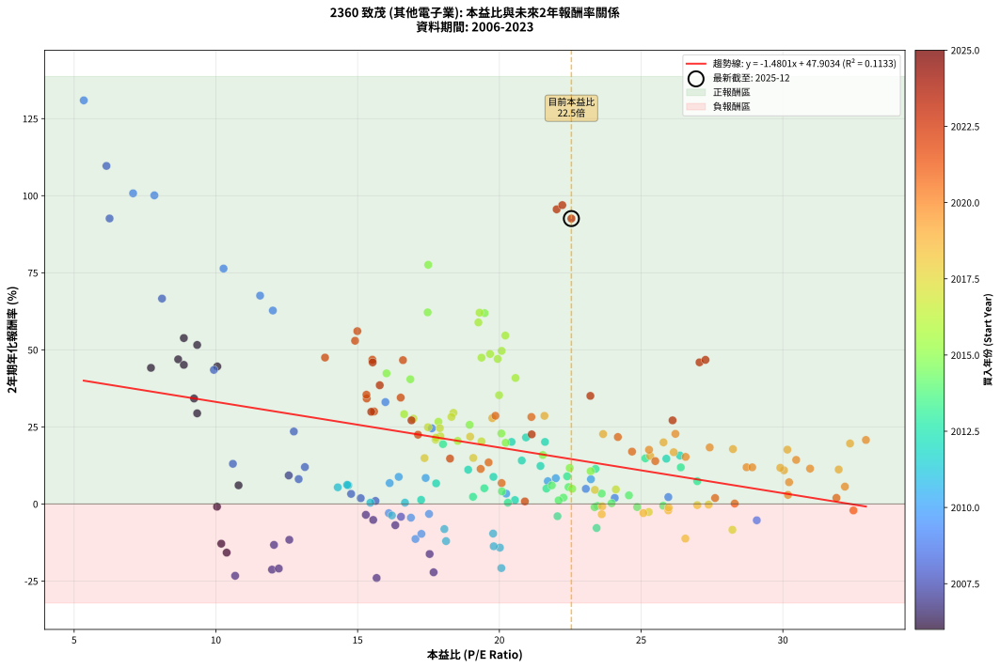
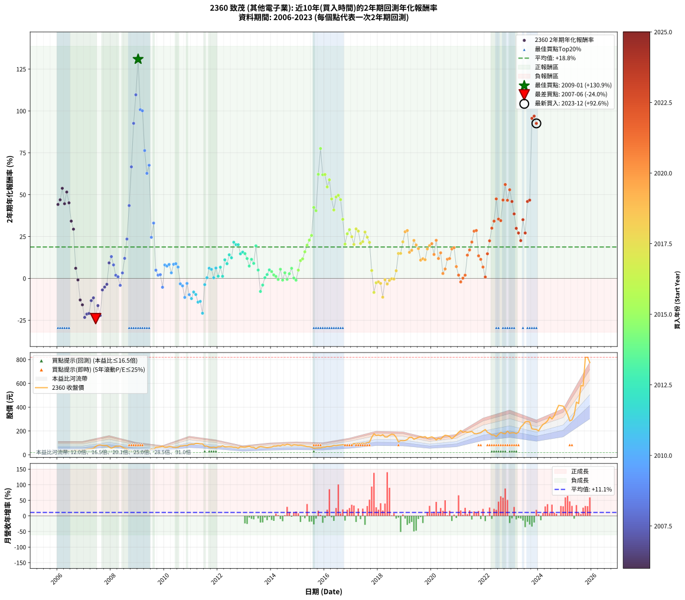

# 2360 致茂 - 本益比與未來報酬率分析

!!! info "報告資訊"
    - **股票代號**: 2360
    - **公司名稱**: 致茂
    - **產業別**: 其他電子業
    - **分析期間**: 2006-2023 (216 個數據點)
    - **資料來源**: Type 12 (ShowMonthlyK_ChartFlow) 月收盤價與本益比
    - **報酬率口徑**: 含現金股利 (簡化: 年度合計，假設每年7/1入帳)
    - **報告生成時間**: 2026-01-06 22:32:28 CST

## 📈 視覺化圖表

### 圖表1: 本益比 vs 未來報酬率關係

*圖表1：2360 致茂 本益比與2年期未來報酬率關係 (2006-2023)*

### 圖表2: 歷年買入時點的2年期實際報酬率

*圖表2：2360 致茂 歷年買入時點的2年期實際報酬率 (2006-2023)*

## 📍 買點訊號說明

本報告提供兩種買點提示訊號（顯示於圖表2的股價子圖中）：

### ▲ 小綠色三角形（回測驗證）
- **計算方式**: 使用全部歷史資料計算本益比第25百分位數
- **用途**: 事後驗證，顯示歷史上哪些時點確實為低估區
- **限制**: 當下無法判斷，僅供回測參考
- **特性**: 後見之明（Look-Ahead Bias）

### ▲ 小橘色三角形（即時訊號）
- **計算方式**: 使用截至當月的過去5年資料計算本益比第25百分位數
- **用途**: 實際投資決策，當時即可判斷
- **優勢**: 可操作性強，符合實務需求
- **特性**: 無後見之明，滾動窗口計算

!!! tip "如何使用兩種訊號"
    - **綠色▲** 幫助理解歷史估值機會，驗證策略有效性
    - **橘色▲** 可作為實際買進參考，但仍需搭配基本面分析
    - 兩種訊號重疊時，表示即時判斷與事後驗證一致，信心度較高
    - 僅有綠色▲時，表示當時無法判斷（需要未來資料才能確認）
    - 僅有橘色▲時，表示即時判斷為買點，但事後可能不是最佳時機

## 📊 估值分析摘要

| 指標 | 數值 |
|:---:|:---:|
| **目前本益比** (2023-12) | **22.54 倍** |
| **歷史平均本益比** | 19.70 倍 |
| **估值水準** | 🟡 合理範圍 |
| **預期2年年化報酬率** | **+14.54%** |
| **歷史平均報酬率** | +18.75% |
| **相關係數 (R²)** | 0.1133 |
| **趨勢線斜率** | -1.4801 |

!!! abstract "核心洞察"
    目前本益比接近歷史平均，預期報酬率符合長期趨勢

    根據歷史數據回測，2360 致茂 在目前本益比 **22.5倍** 的估值水準下，
    預期未來2年年化報酬率約為 **+14.5%**。

    **重要提醒**: 本分析基於歷史數據統計，實際報酬率會受到公司基本面變化、產業趨勢、
    總體經濟環境等多重因素影響。R² = 0.11 表示本益比可解釋約 11.3% 的報酬率變異。

## 📈 歷史估值統計

### 最佳買點 (最高報酬率)

| 項目 | 數值 |
|:---:|:---:|
| 起始時間 | 2009-01 |
| 當時本益比 | 5.34 倍 |
| 起始價格 | 17.6 元 |
| 2年後價格 | 90.0 元 |
| **2年年化報酬率** | **+130.92%** |

### 最差買點 (最低報酬率)

| 項目 | 數值 |
|:---:|:---:|
| 起始時間 | 2007-06 |
| 當時本益比 | 15.67 倍 |
| 起始價格 | 69.4 元 |
| 2年後價格 | 34.0 元 |
| **2年年化報酬率** | **-24.02%** |

## 🎯 投資啟示

### 本益比與報酬率關係

趨勢線方程式: **y = -1.4801x + 47.9034**

!!! warning "強負相關"
    本益比與未來報酬率呈現強負相關。在高本益比時期買入，未來報酬率顯著較低；
    在低本益比時期買入，未來報酬率顯著較高。**估值紀律至關重要**。

### 估值區間建議

基於歷史數據分析:

- **🟢 低估區** (P/E < 15.8): 預期報酬率較高，可考慮增加持股
- **🟡 合理區** (P/E 15.8-23.6): 預期報酬率符合長期趨勢，正常持有
- **🔴 高估區** (P/E > 23.6): 預期報酬率較低，可考慮減碼或觀望

!!! danger "風險提示"
    - 過去表現不代表未來結果
    - 本分析假設公司基本面無重大結構性變化
    - 產業環境劇變可能使歷史規律失效
    - 應結合公司財報、產業趨勢、總體經濟等多重因素綜合判斷

!!! success "長期投資觀點"
    歷史數據顯示，在合理或低估的估值水準買入並長期持有，
    往往能獲得較佳的投資報酬。**耐心等待好價格**是價值投資的核心原則。

## 📊 數據品質

- **資料來源**: GoodInfo.tw Type 12 (ShowMonthlyK_ChartFlow)
- **資料頻率**: 月度收盤價與本益比
- **回測期間**: 2006-2023
- **數據點數量**: 216 個 (每個點代表一次2年期回測)

### 計算方法說明

1. **2年期年化報酬率**:
   - 對每個歷史時點，計算其後2年的實際投資報酬率
   - 期末價值(不含股利): 期末價格
   - 期末價值(含現金股利): 期末價格 + 持有期間內的現金股利合計 (簡化: 年度合計，假設每年7/1入帳)
   - 公式: 年化報酬率 = [(期末價值/期初價格)^(1/年數) - 1] × 100%

2. **本益比 (P/E Ratio)**:
   - 使用當時的月收盤價與EPS計算
   - 資料來源: Type 12 月度河流圖本益比數據

3. **趨勢線 (Linear Regression)**:
   - 使用最小平方法擬合線性趨勢線
   - R²值衡量本益比對報酬率的解釋能力

---

*本報告由 Stock Analysis System v1.9.0 自動生成*
*數據更新時間: 2026-01-06 22:32:28 CST*

## 📋 月度回測明細表

（每一列對應時間線圖中的一個買入點；可用來對照 SVG 圖上的每個點。）

| 買入月份 | 賣出月份 | 回測期限_年 | 實際持有年數 | 買入本益比_倍 | 買入收盤價_元 | 賣出收盤價_元 | 現金股利合計_元 | 總報酬率_pct | 年化報酬率_pct |
| --- | --- | --- | --- | --- | --- | --- | --- | --- | --- |
| 2006-01 | 2008-01 | 2 | 1.999 | 7.71 | 28.05 | 53.70 | 4.56 | +107.70 | +44.15 |
| 2006-02 | 2008-02 | 2 | 1.999 | 8.67 | 31.55 | 63.50 | 4.56 | +115.72 | +46.91 |
| 2006-03 | 2008-03 | 2 | 2.001 | 8.87 | 32.30 | 71.90 | 4.56 | +136.72 | +53.81 |
| 2006-04 | 2008-04 | 2 | 2.001 | 10.05 | 36.60 | 72.00 | 4.56 | +109.18 | +44.59 |
| 2006-05 | 2008-05 | 2 | 2.001 | 9.34 | 34.00 | 73.60 | 4.56 | +129.88 | +51.58 |
| 2006-06 | 2008-06 | 2 | 2.001 | 8.87 | 32.30 | 63.50 | 4.56 | +110.71 | +45.12 |
| 2006-07 | 2008-07 | 2 | 2.001 | 9.23 | 33.60 | 54.50 | 6.05 | +80.20 | +34.21 |
| 2006-08 | 2008-08 | 2 | 2.001 | 9.34 | 34.00 | 50.90 | 6.05 | +67.49 | +29.39 |
| 2006-09 | 2008-09 | 2 | 2.001 | 10.80 | 39.30 | 38.15 | 6.05 | +12.46 | +6.04 |
| 2006-10 | 2008-10 | 2 | 2.001 | 10.04 | 36.55 | 29.85 | 6.05 | -1.79 | -0.90 |
| 2006-11 | 2008-11 | 2 | 2.001 | 10.19 | 37.10 | 22.10 | 6.05 | -24.13 | -12.89 |
| 2006-12 | 2008-12 | 2 | 2.001 | 10.38 | 37.80 | 20.75 | 6.05 | -29.11 | -15.79 |
| 2007-01 | 2009-01 | 2 | 2.001 | 10.68 | 40.30 | 17.65 | 6.05 | -41.20 | -23.31 |
| 2007-02 | 2009-02 | 2 | 2.001 | 11.98 | 46.75 | 22.90 | 6.05 | -38.08 | -21.30 |
| 2007-03 | 2009-03 | 2 | 2.001 | 12.22 | 49.30 | 24.75 | 6.05 | -37.53 | -20.95 |
| 2007-04 | 2009-04 | 2 | 2.001 | 12.05 | 50.20 | 31.70 | 6.05 | -24.81 | -13.28 |
| 2007-05 | 2009-05 | 2 | 2.001 | 12.59 | 54.10 | 36.20 | 6.05 | -21.91 | -11.62 |
| 2007-06 | 2009-06 | 2 | 2.001 | 15.67 | 69.40 | 34.00 | 6.05 | -42.30 | -24.02 |
| 2007-07 | 2009-07 | 2 | 2.001 | 17.54 | 80.00 | 50.50 | 5.61 | -29.87 | -16.25 |
| 2007-08 | 2009-08 | 2 | 2.001 | 17.68 | 83.00 | 44.65 | 5.61 | -39.45 | -22.17 |
| 2007-09 | 2009-09 | 2 | 2.001 | 16.33 | 78.80 | 62.70 | 5.61 | -13.32 | -6.89 |
| 2007-10 | 2009-10 | 2 | 2.001 | 15.55 | 77.10 | 63.70 | 5.61 | -10.11 | -5.19 |
| 2007-11 | 2009-11 | 2 | 2.001 | 15.29 | 77.80 | 66.80 | 5.61 | -6.93 | -3.53 |
| 2007-12 | 2009-12 | 2 | 2.001 | 12.57 | 65.60 | 72.70 | 5.61 | +19.37 | +9.25 |
| 2008-01 | 2010-01 | 2 | 2.001 | 10.60 | 53.70 | 63.00 | 5.61 | +27.76 | +13.02 |
| 2008-02 | 2010-03 | 2 | 2.081 | 12.92 | 63.50 | 69.00 | 5.61 | +17.49 | +8.05 |
| 2008-03 | 2010-03 | 2 | 1.999 | 15.11 | 71.90 | 69.00 | 5.61 | +3.76 | +1.87 |
| 2008-04 | 2010-04 | 2 | 1.999 | 15.63 | 72.00 | 67.80 | 5.61 | +1.95 | +0.97 |
| 2008-05 | 2010-05 | 2 | 1.999 | 16.53 | 73.60 | 62.00 | 5.61 | -8.15 | -4.16 |
| 2008-06 | 2010-06 | 2 | 1.999 | 14.77 | 63.50 | 62.10 | 5.61 | +6.62 | +3.26 |
| 2008-07 | 2010-07 | 2 | 1.999 | 13.14 | 54.50 | 64.30 | 4.01 | +25.34 | +11.97 |
| 2008-08 | 2010-08 | 2 | 1.999 | 12.75 | 50.90 | 73.60 | 4.01 | +52.48 | +23.50 |
| 2008-09 | 2010-09 | 2 | 1.999 | 9.93 | 38.15 | 74.50 | 4.01 | +105.80 | +43.49 |
| 2008-10 | 2010-10 | 2 | 1.999 | 8.10 | 29.85 | 78.80 | 4.01 | +177.43 | +66.62 |
| 2008-11 | 2010-11 | 2 | 1.999 | 6.25 | 22.10 | 77.90 | 4.01 | +270.64 | +92.61 |
| 2008-12 | 2010-12 | 2 | 1.999 | 6.14 | 20.75 | 87.10 | 4.01 | +339.09 | +109.65 |
| 2009-01 | 2011-01 | 2 | 1.999 | 5.34 | 17.65 | 90.00 | 4.01 | +432.65 | +130.92 |
| 2009-02 | 2011-02 | 2 | 1.999 | 7.08 | 22.90 | 88.20 | 4.01 | +302.67 | +100.76 |
| 2009-03 | 2011-03 | 2 | 1.999 | 7.83 | 24.75 | 95.00 | 4.01 | +300.05 | +100.11 |
| 2009-04 | 2011-04 | 2 | 1.999 | 10.27 | 31.70 | 94.50 | 4.01 | +210.76 | +76.35 |
| 2009-05 | 2011-05 | 2 | 1.999 | 12.01 | 36.20 | 91.80 | 4.01 | +164.67 | +62.74 |
| 2009-06 | 2011-06 | 2 | 1.999 | 11.56 | 34.00 | 91.40 | 4.01 | +180.62 | +67.58 |
| 2009-07 | 2011-07 | 2 | 1.999 | 17.62 | 50.50 | 72.50 | 5.80 | +55.05 | +24.54 |
| 2009-08 | 2011-08 | 2 | 1.999 | 15.98 | 44.65 | 73.20 | 5.80 | +76.93 | +33.04 |
| 2009-09 | 2011-09 | 2 | 1.999 | 23.05 | 62.70 | 63.20 | 5.80 | +10.05 | +4.91 |
| 2009-10 | 2011-10 | 2 | 1.999 | 24.07 | 63.70 | 60.40 | 5.80 | +3.92 | +1.94 |
| 2009-11 | 2011-11 | 2 | 1.999 | 25.96 | 66.80 | 64.00 | 5.80 | +4.49 | +2.22 |
| 2009-12 | 2011-12 | 2 | 1.999 | 29.08 | 72.70 | 59.40 | 5.80 | -10.32 | -5.30 |
| 2010-01 | 2012-01 | 2 | 1.999 | 23.23 | 63.00 | 67.70 | 5.80 | +16.67 | +8.02 |
| 2010-02 | 2012-02 | 2 | 1.999 | 21.71 | 63.50 | 67.40 | 5.80 | +15.28 | +7.37 |
| 2010-03 | 2012-03 | 2 | 2.001 | 21.99 | 69.00 | 75.20 | 5.80 | +17.39 | +8.34 |
| 2010-04 | 2012-04 | 2 | 2.001 | 20.24 | 67.80 | 66.60 | 5.80 | +6.78 | +3.33 |
| 2010-05 | 2012-05 | 2 | 2.001 | 17.40 | 62.00 | 67.10 | 5.80 | +17.58 | +8.43 |
| 2010-06 | 2012-06 | 2 | 2.001 | 16.45 | 62.10 | 67.70 | 5.80 | +18.36 | +8.79 |
| 2010-07 | 2012-07 | 2 | 2.001 | 16.13 | 64.30 | 67.00 | 6.30 | +14.00 | +6.76 |
| 2010-08 | 2012-08 | 2 | 2.001 | 17.52 | 73.60 | 62.60 | 6.30 | -6.39 | -3.24 |
| 2010-09 | 2012-09 | 2 | 2.001 | 16.88 | 74.50 | 61.70 | 6.30 | -8.72 | -4.46 |
| 2010-10 | 2012-10 | 2 | 2.001 | 17.04 | 78.80 | 55.60 | 6.30 | -21.45 | -11.36 |
| 2010-11 | 2012-11 | 2 | 2.001 | 16.10 | 77.90 | 67.00 | 6.30 | -5.91 | -3.00 |
| 2010-12 | 2012-12 | 2 | 2.001 | 17.25 | 87.10 | 64.70 | 6.30 | -18.48 | -9.71 |
| 2011-01 | 2013-01 | 2 | 2.001 | 18.12 | 90.00 | 63.30 | 6.30 | -22.67 | -12.05 |
| 2011-02 | 2013-02 | 2 | 2.001 | 18.06 | 88.20 | 68.10 | 6.30 | -15.65 | -8.15 |
| 2011-03 | 2013-03 | 2 | 2.001 | 19.78 | 95.00 | 71.30 | 6.30 | -18.32 | -9.61 |
| 2011-04 | 2013-04 | 2 | 2.001 | 20.02 | 94.50 | 63.30 | 6.30 | -26.35 | -14.17 |
| 2011-05 | 2013-05 | 2 | 2.001 | 19.80 | 91.80 | 62.00 | 6.30 | -25.60 | -13.74 |
| 2011-06 | 2013-06 | 2 | 2.001 | 20.07 | 91.40 | 51.00 | 6.30 | -37.31 | -20.81 |
| 2011-07 | 2013-07 | 2 | 2.001 | 16.21 | 72.50 | 62.70 | 4.50 | -7.31 | -3.72 |
| 2011-08 | 2013-08 | 2 | 2.001 | 16.67 | 73.20 | 69.30 | 4.50 | +0.82 | +0.41 |
| 2011-09 | 2013-09 | 2 | 2.001 | 14.67 | 63.20 | 66.60 | 4.50 | +12.50 | +6.06 |
| 2011-10 | 2013-10 | 2 | 2.001 | 14.30 | 60.40 | 62.60 | 4.50 | +11.09 | +5.40 |
| 2011-11 | 2013-11 | 2 | 2.001 | 15.45 | 64.00 | 60.00 | 4.50 | +0.78 | +0.39 |
| 2011-12 | 2013-12 | 2 | 2.001 | 14.63 | 59.40 | 62.50 | 4.50 | +12.79 | +6.20 |
| 2012-01 | 2014-01 | 2 | 2.001 | 17.24 | 67.70 | 65.00 | 4.50 | +2.66 | +1.32 |
| 2012-02 | 2014-03 | 2 | 2.081 | 17.77 | 67.40 | 72.60 | 4.50 | +14.39 | +6.68 |
| 2012-03 | 2014-03 | 2 | 1.999 | 20.55 | 75.20 | 72.60 | 4.50 | +2.53 | +1.26 |
| 2012-04 | 2014-04 | 2 | 1.999 | 18.90 | 66.60 | 77.70 | 4.50 | +23.42 | +11.10 |
| 2012-05 | 2014-05 | 2 | 1.999 | 19.79 | 67.10 | 74.90 | 4.50 | +18.33 | +8.79 |
| 2012-06 | 2014-06 | 2 | 1.999 | 20.79 | 67.70 | 83.60 | 4.50 | +30.13 | +14.09 |
| 2012-07 | 2014-07 | 2 | 1.999 | 21.45 | 67.00 | 80.00 | 4.50 | +26.12 | +12.31 |
| 2012-08 | 2014-08 | 2 | 1.999 | 20.94 | 62.60 | 88.00 | 4.50 | +47.76 | +21.57 |
| 2012-09 | 2014-09 | 2 | 1.999 | 21.61 | 61.70 | 84.50 | 4.50 | +44.25 | +20.12 |
| 2012-10 | 2014-10 | 2 | 1.999 | 20.43 | 55.60 | 75.70 | 4.50 | +44.24 | +20.12 |
| 2012-11 | 2014-11 | 2 | 1.999 | 25.89 | 67.00 | 83.60 | 4.50 | +31.49 | +14.68 |
| 2012-12 | 2014-12 | 2 | 1.999 | 26.37 | 64.70 | 82.10 | 4.50 | +33.85 | +15.70 |
| 2013-01 | 2015-01 | 2 | 1.999 | 25.15 | 63.30 | 78.90 | 4.50 | +31.75 | +14.79 |
| 2013-02 | 2015-02 | 2 | 1.999 | 26.40 | 68.10 | 80.70 | 4.50 | +25.11 | +11.86 |
| 2013-03 | 2015-03 | 2 | 1.999 | 26.98 | 71.30 | 77.70 | 4.50 | +15.29 | +7.38 |
| 2013-04 | 2015-04 | 2 | 1.999 | 23.39 | 63.30 | 74.00 | 4.50 | +24.01 | +11.37 |
| 2013-05 | 2015-05 | 2 | 1.999 | 22.39 | 62.00 | 69.10 | 4.50 | +18.71 | +8.96 |
| 2013-06 | 2015-06 | 2 | 1.999 | 18.01 | 51.00 | 68.20 | 4.50 | +42.55 | +19.41 |
| 2013-07 | 2015-07 | 2 | 1.999 | 21.66 | 62.70 | 64.00 | 5.11 | +10.22 | +4.99 |
| 2013-08 | 2015-08 | 2 | 1.999 | 23.43 | 69.30 | 53.80 | 5.11 | -15.00 | -7.81 |
| 2013-09 | 2015-09 | 2 | 1.999 | 22.05 | 66.60 | 56.30 | 5.11 | -7.80 | -3.98 |
| 2013-10 | 2015-10 | 2 | 1.999 | 20.30 | 62.60 | 58.00 | 5.11 | +0.81 | +0.40 |
| 2013-11 | 2015-11 | 2 | 1.999 | 19.07 | 60.00 | 57.70 | 5.11 | +4.68 | +2.31 |
| 2013-12 | 2015-12 | 2 | 1.999 | 19.47 | 62.50 | 63.90 | 5.11 | +10.41 | +5.08 |
| 2014-01 | 2016-01 | 2 | 1.999 | 20.09 | 65.00 | 65.30 | 5.11 | +8.32 | +4.08 |
| 2014-02 | 2016-02 | 2 | 1.999 | 22.26 | 72.60 | 70.50 | 5.11 | +4.14 | +2.05 |
| 2014-03 | 2016-03 | 2 | 2.001 | 22.09 | 72.60 | 69.20 | 5.11 | +2.35 | +1.17 |
| 2014-04 | 2016-04 | 2 | 2.001 | 23.46 | 77.70 | 71.60 | 5.11 | -1.28 | -0.64 |
| 2014-05 | 2016-05 | 2 | 2.001 | 22.44 | 74.90 | 78.20 | 5.11 | +11.22 | +5.46 |
| 2014-06 | 2016-06 | 2 | 2.001 | 24.86 | 83.60 | 76.80 | 5.11 | -2.03 | -1.02 |
| 2014-07 | 2016-07 | 2 | 2.001 | 23.61 | 80.00 | 80.50 | 4.98 | +6.85 | +3.37 |
| 2014-08 | 2016-08 | 2 | 2.001 | 25.78 | 88.00 | 82.00 | 4.98 | -1.16 | -0.58 |
| 2014-09 | 2016-09 | 2 | 2.001 | 24.57 | 84.50 | 84.30 | 4.98 | +5.66 | +2.79 |
| 2014-10 | 2016-10 | 2 | 2.001 | 21.85 | 75.70 | 80.10 | 4.98 | +12.39 | +6.01 |
| 2014-11 | 2016-11 | 2 | 2.001 | 23.96 | 83.60 | 79.00 | 4.98 | +0.45 | +0.23 |
| 2014-12 | 2016-12 | 2 | 2.001 | 23.36 | 82.10 | 75.40 | 4.98 | -2.10 | -1.05 |
| 2015-01 | 2017-01 | 2 | 2.001 | 22.57 | 78.90 | 81.90 | 4.98 | +10.11 | +4.93 |
| 2015-02 | 2017-02 | 2 | 2.001 | 23.22 | 80.70 | 93.80 | 4.98 | +22.40 | +10.63 |
| 2015-03 | 2017-03 | 2 | 2.001 | 22.48 | 77.70 | 91.90 | 4.98 | +24.68 | +11.65 |
| 2015-04 | 2017-04 | 2 | 2.001 | 21.53 | 74.00 | 94.40 | 4.98 | +34.30 | +15.88 |
| 2015-05 | 2017-05 | 2 | 2.001 | 20.22 | 69.10 | 94.30 | 4.98 | +43.68 | +19.85 |
| 2015-06 | 2017-06 | 2 | 2.001 | 20.07 | 68.20 | 98.00 | 4.98 | +51.00 | +22.86 |
| 2015-07 | 2017-07 | 2 | 2.001 | 18.95 | 64.00 | 95.50 | 5.59 | +57.96 | +25.66 |
| 2015-08 | 2017-08 | 2 | 2.001 | 16.02 | 53.80 | 103.50 | 5.59 | +102.78 | +42.37 |
| 2015-09 | 2017-09 | 2 | 2.001 | 16.86 | 56.30 | 105.50 | 5.59 | +97.33 | +40.44 |
| 2015-10 | 2017-10 | 2 | 2.001 | 17.47 | 58.00 | 147.00 | 5.59 | +163.09 | +62.15 |
| 2015-11 | 2017-11 | 2 | 2.001 | 17.49 | 57.70 | 176.50 | 5.59 | +215.59 | +77.58 |
| 2015-12 | 2017-12 | 2 | 2.001 | 19.48 | 63.90 | 162.00 | 5.59 | +162.28 | +61.90 |
| 2016-01 | 2018-01 | 2 | 2.001 | 19.30 | 65.30 | 166.00 | 5.59 | +162.78 | +62.05 |
| 2016-02 | 2018-03 | 2 | 2.081 | 20.21 | 70.50 | 169.00 | 5.59 | +147.65 | +54.62 |
| 2016-03 | 2018-03 | 2 | 1.999 | 19.26 | 69.20 | 169.00 | 5.59 | +152.30 | +58.89 |
| 2016-04 | 2018-04 | 2 | 1.999 | 19.37 | 71.60 | 150.00 | 5.59 | +117.31 | +47.45 |
| 2016-05 | 2018-05 | 2 | 1.999 | 20.57 | 78.20 | 149.50 | 5.59 | +98.33 | +40.86 |
| 2016-06 | 2018-06 | 2 | 1.999 | 19.67 | 76.80 | 164.00 | 5.59 | +120.83 | +48.64 |
| 2016-07 | 2018-07 | 2 | 1.999 | 20.08 | 80.50 | 172.50 | 7.70 | +123.85 | +49.66 |
| 2016-08 | 2018-08 | 2 | 1.999 | 19.94 | 82.00 | 169.50 | 7.70 | +116.09 | +47.04 |
| 2016-09 | 2018-09 | 2 | 1.999 | 19.99 | 84.30 | 146.50 | 7.70 | +82.91 | +35.27 |
| 2016-10 | 2018-10 | 2 | 1.999 | 18.53 | 80.10 | 108.50 | 7.70 | +45.06 | +20.46 |
| 2016-11 | 2018-11 | 2 | 1.999 | 17.85 | 79.00 | 119.00 | 7.70 | +60.37 | +26.66 |
| 2016-12 | 2018-12 | 2 | 1.999 | 16.64 | 75.40 | 118.00 | 7.70 | +66.71 | +29.14 |
| 2017-01 | 2019-01 | 2 | 1.999 | 17.48 | 81.90 | 120.00 | 7.70 | +55.92 | +24.89 |
| 2017-02 | 2019-02 | 2 | 1.999 | 19.37 | 93.80 | 128.00 | 7.70 | +44.67 | +20.29 |
| 2017-03 | 2019-03 | 2 | 1.999 | 18.38 | 91.90 | 146.50 | 7.70 | +67.79 | +29.56 |
| 2017-04 | 2019-04 | 2 | 1.999 | 18.31 | 94.40 | 147.50 | 7.70 | +64.40 | +28.24 |
| 2017-05 | 2019-05 | 2 | 1.999 | 17.75 | 94.30 | 130.00 | 7.70 | +46.02 | +20.85 |
| 2017-06 | 2019-06 | 2 | 1.999 | 17.92 | 98.00 | 138.00 | 7.70 | +48.67 | +21.95 |
| 2017-07 | 2019-07 | 2 | 1.999 | 16.97 | 95.50 | 147.00 | 8.65 | +62.99 | +27.69 |
| 2017-08 | 2019-08 | 2 | 1.999 | 17.90 | 103.50 | 152.00 | 8.65 | +55.22 | +24.61 |
| 2017-09 | 2019-09 | 2 | 1.999 | 17.76 | 105.50 | 147.00 | 8.65 | +47.54 | +21.48 |
| 2017-10 | 2019-10 | 2 | 1.999 | 24.11 | 147.00 | 152.50 | 8.65 | +9.63 | +4.71 |
| 2017-11 | 2019-11 | 2 | 1.999 | 28.22 | 176.50 | 139.50 | 8.65 | -16.06 | -8.39 |
| 2017-12 | 2019-12 | 2 | 1.999 | 25.27 | 162.00 | 145.00 | 8.65 | -5.15 | -2.61 |
| 2018-01 | 2020-01 | 2 | 1.999 | 25.96 | 166.00 | 150.50 | 8.65 | -4.12 | -2.09 |
| 2018-02 | 2020-02 | 2 | 1.999 | 25.08 | 160.00 | 142.00 | 8.65 | -5.84 | -2.97 |
| 2018-03 | 2020-03 | 2 | 2.001 | 26.56 | 169.00 | 124.50 | 8.65 | -21.21 | -11.23 |
| 2018-04 | 2020-04 | 2 | 2.001 | 23.63 | 150.00 | 139.00 | 8.65 | -1.56 | -0.78 |
| 2018-05 | 2020-05 | 2 | 2.001 | 23.61 | 149.50 | 131.00 | 8.65 | -6.59 | -3.35 |
| 2018-06 | 2020-06 | 2 | 2.001 | 25.97 | 164.00 | 151.50 | 8.65 | -2.35 | -1.18 |
| 2018-07 | 2020-07 | 2 | 2.001 | 27.38 | 172.50 | 164.50 | 7.19 | -0.47 | -0.24 |
| 2018-08 | 2020-08 | 2 | 2.001 | 26.98 | 169.50 | 161.00 | 7.19 | -0.78 | -0.39 |
| 2018-09 | 2020-09 | 2 | 2.001 | 23.37 | 146.50 | 153.00 | 7.19 | +9.34 | +4.56 |
| 2018-10 | 2020-10 | 2 | 2.001 | 17.36 | 108.50 | 136.00 | 7.19 | +31.97 | +14.87 |
| 2018-11 | 2020-11 | 2 | 2.001 | 19.08 | 119.00 | 150.00 | 7.19 | +32.09 | +14.92 |
| 2018-12 | 2020-12 | 2 | 2.001 | 18.97 | 118.00 | 168.00 | 7.19 | +48.46 | +21.83 |
| 2019-01 | 2021-01 | 2 | 2.001 | 19.75 | 120.00 | 189.00 | 7.19 | +63.49 | +27.84 |
| 2019-02 | 2021-02 | 2 | 2.001 | 21.59 | 128.00 | 204.50 | 7.19 | +65.38 | +28.58 |
| 2019-03 | 2021-03 | 2 | 2.001 | 25.32 | 146.50 | 188.50 | 7.19 | +33.57 | +15.56 |
| 2019-04 | 2021-04 | 2 | 2.001 | 26.15 | 147.50 | 194.00 | 7.19 | +36.40 | +16.78 |
| 2019-05 | 2021-05 | 2 | 2.001 | 23.66 | 130.00 | 188.50 | 7.19 | +50.53 | +22.67 |
| 2019-06 | 2021-06 | 2 | 2.001 | 25.79 | 138.00 | 191.50 | 7.19 | +43.97 | +19.97 |
| 2019-07 | 2021-07 | 2 | 2.001 | 28.24 | 147.00 | 196.50 | 7.51 | +38.78 | +17.79 |
| 2019-08 | 2021-08 | 2 | 2.001 | 30.04 | 152.00 | 179.50 | 7.51 | +23.03 | +10.91 |
| 2019-09 | 2021-09 | 2 | 2.001 | 29.91 | 147.00 | 176.00 | 7.51 | +24.83 | +11.72 |
| 2019-10 | 2021-10 | 2 | 2.001 | 31.97 | 152.50 | 181.00 | 7.51 | +23.61 | +11.17 |
| 2019-11 | 2021-11 | 2 | 2.001 | 30.16 | 139.50 | 185.50 | 7.51 | +38.36 | +17.61 |
| 2019-12 | 2021-12 | 2 | 2.001 | 32.37 | 145.00 | 200.00 | 7.51 | +43.11 | +19.61 |
| 2020-01 | 2022-01 | 2 | 2.001 | 32.93 | 150.50 | 212.00 | 7.51 | +45.85 | +20.75 |
| 2020-02 | 2022-03 | 2 | 2.081 | 30.47 | 142.00 | 180.00 | 7.51 | +32.05 | +14.29 |
| 2020-03 | 2022-03 | 2 | 1.999 | 26.21 | 124.50 | 180.00 | 7.51 | +50.61 | +22.74 |
| 2020-04 | 2022-04 | 2 | 1.999 | 28.72 | 139.00 | 166.50 | 7.51 | +25.18 | +11.89 |
| 2020-05 | 2022-05 | 2 | 1.999 | 26.57 | 131.00 | 166.50 | 7.51 | +32.83 | +15.26 |
| 2020-06 | 2022-06 | 2 | 1.999 | 30.18 | 151.50 | 153.00 | 7.51 | +5.95 | +2.93 |
| 2020-07 | 2022-07 | 2 | 1.999 | 32.19 | 164.50 | 172.00 | 11.48 | +11.54 | +5.62 |
| 2020-08 | 2022-08 | 2 | 1.999 | 30.96 | 161.00 | 188.50 | 11.48 | +24.21 | +11.46 |
| 2020-09 | 2022-09 | 2 | 1.999 | 28.92 | 153.00 | 180.00 | 11.48 | +25.15 | +11.88 |
| 2020-10 | 2022-10 | 2 | 1.999 | 25.28 | 136.00 | 176.50 | 11.48 | +38.22 | +17.58 |
| 2020-11 | 2022-11 | 2 | 1.999 | 27.42 | 150.00 | 198.50 | 11.48 | +39.99 | +18.33 |
| 2020-12 | 2022-12 | 2 | 1.999 | 30.22 | 168.00 | 181.00 | 11.48 | +14.57 | +7.04 |
| 2021-01 | 2023-01 | 2 | 1.999 | 31.89 | 189.00 | 185.00 | 11.48 | +3.96 | +1.96 |
| 2021-02 | 2023-02 | 2 | 1.999 | 32.49 | 204.50 | 184.50 | 11.48 | -4.17 | -2.11 |
| 2021-03 | 2023-03 | 2 | 1.999 | 28.30 | 188.50 | 177.50 | 11.48 | +0.26 | +0.13 |
| 2021-04 | 2023-04 | 2 | 1.999 | 27.61 | 194.00 | 190.00 | 11.48 | +3.86 | +1.91 |
| 2021-05 | 2023-05 | 2 | 1.999 | 25.50 | 188.50 | 233.00 | 11.48 | +29.70 | +13.90 |
| 2021-06 | 2023-06 | 2 | 1.999 | 24.68 | 191.50 | 250.50 | 11.48 | +36.80 | +16.98 |
| 2021-07 | 2023-07 | 2 | 1.999 | 24.18 | 196.50 | 276.00 | 14.98 | +48.08 | +21.71 |
| 2021-08 | 2023-08 | 2 | 1.999 | 21.13 | 179.50 | 280.00 | 14.98 | +64.34 | +28.22 |
| 2021-09 | 2023-09 | 2 | 1.999 | 19.86 | 176.00 | 276.00 | 14.98 | +65.33 | +28.60 |
| 2021-10 | 2023-10 | 2 | 1.999 | 19.62 | 181.00 | 218.00 | 14.98 | +28.72 | +13.46 |
| 2021-11 | 2023-11 | 2 | 1.999 | 19.34 | 185.50 | 215.00 | 14.98 | +23.98 | +11.35 |
| 2021-12 | 2023-12 | 2 | 1.999 | 20.08 | 200.00 | 213.00 | 14.98 | +13.99 | +6.77 |
| 2022-01 | 2024-01 | 2 | 1.999 | 20.90 | 212.00 | 200.50 | 14.98 | +1.64 | +0.82 |
| 2022-02 | 2024-02 | 2 | 1.999 | 18.26 | 188.50 | 233.00 | 14.98 | +31.56 | +14.71 |
| 2022-03 | 2024-03 | 2 | 2.001 | 17.13 | 180.00 | 255.00 | 14.98 | +49.99 | +22.45 |
| 2022-04 | 2024-04 | 2 | 2.001 | 15.58 | 166.50 | 266.50 | 14.98 | +69.06 | +30.00 |
| 2022-05 | 2024-05 | 2 | 2.001 | 15.32 | 166.50 | 285.00 | 14.98 | +80.17 | +34.20 |
| 2022-06 | 2024-06 | 2 | 2.001 | 13.85 | 153.00 | 318.00 | 14.98 | +117.64 | +47.49 |
| 2022-07 | 2024-07 | 2 | 2.001 | 15.31 | 172.00 | 301.00 | 14.60 | +83.49 | +35.43 |
| 2022-08 | 2024-08 | 2 | 2.001 | 16.52 | 188.50 | 326.50 | 14.60 | +80.96 | +34.49 |
| 2022-09 | 2024-09 | 2 | 2.001 | 15.52 | 180.00 | 373.50 | 14.60 | +115.61 | +46.80 |
| 2022-10 | 2024-10 | 2 | 2.001 | 14.99 | 176.50 | 415.50 | 14.60 | +143.68 | +56.06 |
| 2022-11 | 2024-11 | 2 | 2.001 | 16.60 | 198.50 | 412.50 | 14.60 | +115.16 | +46.65 |
| 2022-12 | 2024-12 | 2 | 2.001 | 14.91 | 181.00 | 409.00 | 14.60 | +134.03 | +52.94 |
| 2023-01 | 2025-01 | 2 | 2.001 | 15.53 | 185.00 | 379.50 | 14.60 | +113.03 | +45.92 |
| 2023-02 | 2025-02 | 2 | 2.001 | 15.78 | 184.50 | 339.50 | 14.60 | +91.92 | +38.51 |
| 2023-03 | 2025-03 | 2 | 2.001 | 15.48 | 177.50 | 285.00 | 14.60 | +68.79 | +29.90 |
| 2023-04 | 2025-04 | 2 | 2.001 | 16.90 | 190.00 | 292.50 | 14.60 | +61.63 | +27.11 |
| 2023-05 | 2025-05 | 2 | 2.001 | 21.14 | 233.00 | 335.50 | 14.60 | +50.26 | +22.56 |
| 2023-06 | 2025-06 | 2 | 2.001 | 23.21 | 250.50 | 442.50 | 14.60 | +82.48 | +35.06 |
| 2023-07 | 2025-07 | 2 | 2.001 | 26.11 | 276.00 | 430.50 | 15.60 | +61.63 | +27.11 |
| 2023-08 | 2025-08 | 2 | 2.001 | 27.06 | 280.00 | 581.00 | 15.60 | +113.07 | +45.93 |
| 2023-09 | 2025-09 | 2 | 2.001 | 27.27 | 276.00 | 579.00 | 15.60 | +115.43 | +46.74 |
| 2023-10 | 2025-10 | 2 | 2.001 | 22.02 | 218.00 | 819.00 | 15.60 | +282.84 | +95.57 |
| 2023-11 | 2025-11 | 2 | 2.001 | 22.22 | 215.00 | 819.00 | 15.60 | +288.19 | +96.93 |
| 2023-12 | 2025-12 | 2 | 2.001 | 22.54 | 213.00 | 775.00 | 15.60 | +271.17 | +92.57 |
