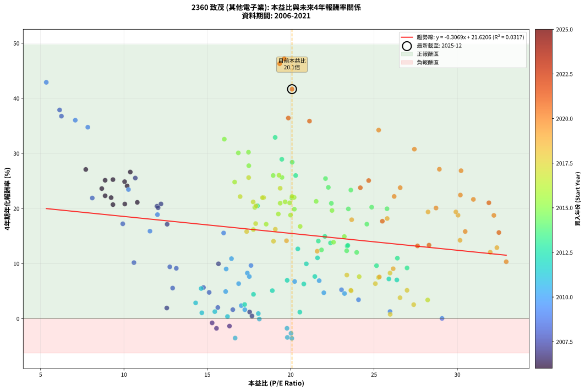
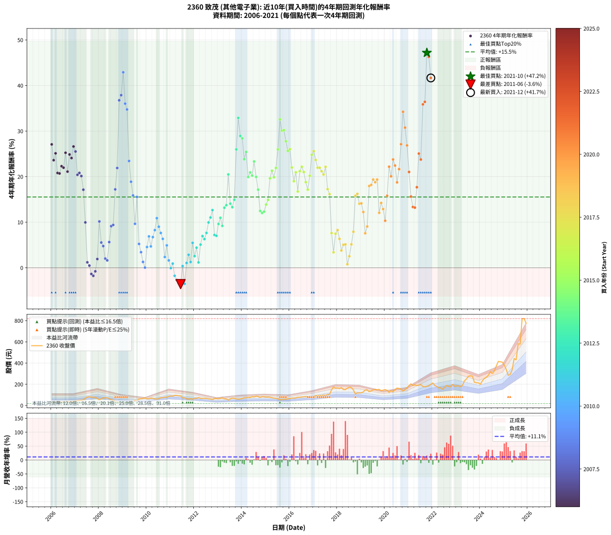

# 2360 致茂 - 本益比與未來報酬率分析

!!! info "報告資訊"
    - **股票代號**: 2360
    - **公司名稱**: 致茂
    - **產業別**: 其他電子業
    - **分析期間**: 2006-2021 (192 個數據點)
    - **資料來源**: Type 12 (ShowMonthlyK_ChartFlow) 月收盤價與本益比
    - **報酬率口徑**: 含現金股利 (簡化: 年度合計，假設每年7/1入帳)
    - **報告生成時間**: 2026-01-05 20:39:42 CST

## 📈 視覺化圖表

### 圖表1: 本益比 vs 未來報酬率關係

*圖表1：2360 致茂 本益比與4年期未來報酬率關係 (2006-2021)*

### 圖表2: 歷年買入時點的4年期實際報酬率

*圖表2：2360 致茂 歷年買入時點的4年期實際報酬率 (2006-2021)*

## 📍 買點訊號說明

本報告提供兩種買點提示訊號（顯示於圖表2的股價子圖中）：

### ▲ 小綠色三角形（回測驗證）
- **計算方式**: 使用全部歷史資料計算本益比第25百分位數
- **用途**: 事後驗證，顯示歷史上哪些時點確實為低估區
- **限制**: 當下無法判斷，僅供回測參考
- **特性**: 後見之明（Look-Ahead Bias）

### ▲ 小橘色三角形（即時訊號）
- **計算方式**: 使用截至當月的過去5年資料計算本益比第25百分位數
- **用途**: 實際投資決策，當時即可判斷
- **優勢**: 可操作性強，符合實務需求
- **特性**: 無後見之明，滾動窗口計算

!!! tip "如何使用兩種訊號"
    - **綠色▲** 幫助理解歷史估值機會，驗證策略有效性
    - **橘色▲** 可作為實際買進參考，但仍需搭配基本面分析
    - 兩種訊號重疊時，表示即時判斷與事後驗證一致，信心度較高
    - 僅有綠色▲時，表示當時無法判斷（需要未來資料才能確認）
    - 僅有橘色▲時，表示即時判斷為買點，但事後可能不是最佳時機

## 📊 估值分析摘要

| 指標 | 數值 |
|:---:|:---:|
| **目前本益比** (2021-12) | **20.08 倍** |
| **歷史平均本益比** | 19.81 倍 |
| **估值水準** | 🟡 合理範圍 |
| **預期4年年化報酬率** | **+15.46%** |
| **歷史平均報酬率** | +15.54% |
| **相關係數 (R²)** | 0.0317 |
| **趨勢線斜率** | -0.3069 |

!!! abstract "核心洞察"
    目前本益比接近歷史平均，預期報酬率符合長期趨勢

    根據歷史數據回測，2360 致茂 在目前本益比 **20.1倍** 的估值水準下，
    預期未來4年年化報酬率約為 **+15.5%**。

    **重要提醒**: 本分析基於歷史數據統計，實際報酬率會受到公司基本面變化、產業趨勢、
    總體經濟環境等多重因素影響。R² = 0.03 表示本益比可解釋約 3.2% 的報酬率變異。

## 📈 歷史估值統計

### 最佳買點 (最高報酬率)

| 項目 | 數值 |
|:---:|:---:|
| 起始時間 | 2021-10 |
| 當時本益比 | 19.62 倍 |
| 起始價格 | 181.0 元 |
| 4年後價格 | 819.0 元 |
| **4年年化報酬率** | **+47.19%** |

### 最差買點 (最低報酬率)

| 項目 | 數值 |
|:---:|:---:|
| 起始時間 | 2011-06 |
| 當時本益比 | 20.07 倍 |
| 起始價格 | 91.4 元 |
| 4年後價格 | 68.2 元 |
| **4年年化報酬率** | **-3.58%** |

## 🎯 投資啟示

### 本益比與報酬率關係

趨勢線方程式: **y = -0.3069x + 21.6206**

!!! note "負相關"
    本益比與未來報酬率呈現負相關。較低的本益比通常帶來較高的未來報酬率，
    但相關性不算非常強。**估值仍是重要參考指標之一**。

### 估值區間建議

基於歷史數據分析:

- **🟢 低估區** (P/E < 15.9): 預期報酬率較高，可考慮增加持股
- **🟡 合理區** (P/E 15.9-23.8): 預期報酬率符合長期趨勢，正常持有
- **🔴 高估區** (P/E > 23.8): 預期報酬率較低，可考慮減碼或觀望

!!! danger "風險提示"
    - 過去表現不代表未來結果
    - 本分析假設公司基本面無重大結構性變化
    - 產業環境劇變可能使歷史規律失效
    - 應結合公司財報、產業趨勢、總體經濟等多重因素綜合判斷

!!! success "長期投資觀點"
    歷史數據顯示，在合理或低估的估值水準買入並長期持有，
    往往能獲得較佳的投資報酬。**耐心等待好價格**是價值投資的核心原則。

## 📊 數據品質

- **資料來源**: GoodInfo.tw Type 12 (ShowMonthlyK_ChartFlow)
- **資料頻率**: 月度收盤價與本益比
- **回測期間**: 2006-2021
- **數據點數量**: 192 個 (每個點代表一次4年期回測)

### 計算方法說明

1. **4年期年化報酬率**:
   - 對每個歷史時點，計算其後4年的實際投資報酬率
   - 期末價值(不含股利): 期末價格
   - 期末價值(含現金股利): 期末價格 + 持有期間內的現金股利合計 (簡化: 年度合計，假設每年7/1入帳)
   - 公式: 年化報酬率 = [(期末價值/期初價格)^(1/年數) - 1] × 100%

2. **本益比 (P/E Ratio)**:
   - 使用當時的月收盤價與EPS計算
   - 資料來源: Type 12 月度河流圖本益比數據

3. **趨勢線 (Linear Regression)**:
   - 使用最小平方法擬合線性趨勢線
   - R²值衡量本益比對報酬率的解釋能力

---

*本報告由 Stock Analysis System v1.9.0 自動生成*
*數據更新時間: 2026-01-05 20:39:42 CST*

## 📋 月度回測明細表

（每一列對應時間線圖中的一個買入點；可用來對照 SVG 圖上的每個點。）

| 買入月份 | 賣出月份 | 回測期限_年 | 實際持有年數 | 買入本益比_倍 | 買入收盤價_元 | 賣出收盤價_元 | 現金股利合計_元 | 總報酬率_pct | 年化報酬率_pct |
| --- | --- | --- | --- | --- | --- | --- | --- | --- | --- |
| 2006-01 | 2010-01 | 4 | 4.000 | 7.71 | 28.05 | 63.00 | 10.17 | +160.84 | +27.08 |
| 2006-02 | 2010-02 | 4 | 4.000 | 8.67 | 31.55 | 63.50 | 10.17 | +133.49 | +23.61 |
| 2006-03 | 2010-03 | 4 | 4.000 | 8.87 | 32.30 | 69.00 | 10.17 | +145.09 | +25.12 |
| 2006-04 | 2010-04 | 4 | 4.000 | 10.05 | 36.60 | 67.80 | 10.17 | +113.02 | +20.81 |
| 2006-05 | 2010-05 | 4 | 4.000 | 9.34 | 34.00 | 62.00 | 10.17 | +112.25 | +20.70 |
| 2006-06 | 2010-06 | 4 | 4.000 | 8.87 | 32.30 | 62.10 | 10.17 | +123.73 | +22.30 |
| 2006-07 | 2010-07 | 4 | 4.000 | 9.23 | 33.60 | 64.30 | 10.06 | +121.30 | +21.97 |
| 2006-08 | 2010-08 | 4 | 4.000 | 9.34 | 34.00 | 73.60 | 10.06 | +146.05 | +25.24 |
| 2006-09 | 2010-09 | 4 | 4.000 | 10.80 | 39.30 | 74.50 | 10.06 | +115.16 | +21.11 |
| 2006-10 | 2010-10 | 4 | 4.000 | 10.04 | 36.55 | 78.80 | 10.06 | +143.11 | +24.87 |
| 2006-11 | 2010-11 | 4 | 4.000 | 10.19 | 37.10 | 77.90 | 10.06 | +137.08 | +24.09 |
| 2006-12 | 2010-12 | 4 | 4.000 | 10.38 | 37.80 | 87.10 | 10.06 | +157.03 | +26.62 |
| 2007-01 | 2011-01 | 4 | 4.000 | 10.68 | 40.30 | 90.00 | 10.06 | +148.28 | +25.53 |
| 2007-02 | 2011-02 | 4 | 4.000 | 11.98 | 46.75 | 88.20 | 10.06 | +110.18 | +20.41 |
| 2007-03 | 2011-03 | 4 | 4.000 | 12.22 | 49.30 | 95.00 | 10.06 | +113.10 | +20.82 |
| 2007-04 | 2011-04 | 4 | 4.000 | 12.05 | 50.20 | 94.50 | 10.06 | +108.28 | +20.13 |
| 2007-05 | 2011-05 | 4 | 4.000 | 12.59 | 54.10 | 91.80 | 10.06 | +88.28 | +17.14 |
| 2007-06 | 2011-06 | 4 | 4.000 | 15.67 | 69.40 | 91.40 | 10.06 | +46.19 | +9.96 |
| 2007-07 | 2011-07 | 4 | 4.000 | 17.54 | 80.00 | 72.50 | 11.41 | +4.88 | +1.20 |
| 2007-08 | 2011-08 | 4 | 4.000 | 17.68 | 83.00 | 73.20 | 11.41 | +1.93 | +0.48 |
| 2007-09 | 2011-09 | 4 | 4.000 | 16.33 | 78.80 | 63.20 | 11.41 | -5.32 | -1.36 |
| 2007-10 | 2011-10 | 4 | 4.000 | 15.55 | 77.10 | 60.40 | 11.41 | -6.87 | -1.76 |
| 2007-11 | 2011-11 | 4 | 4.000 | 15.29 | 77.80 | 64.00 | 11.41 | -3.08 | -0.78 |
| 2007-12 | 2011-12 | 4 | 4.000 | 12.57 | 65.60 | 59.40 | 11.41 | +7.93 | +1.93 |
| 2008-01 | 2012-01 | 4 | 4.000 | 10.60 | 53.70 | 67.70 | 11.41 | +47.31 | +10.17 |
| 2008-02 | 2012-02 | 4 | 4.000 | 12.92 | 63.50 | 67.40 | 11.41 | +24.10 | +5.55 |
| 2008-03 | 2012-03 | 4 | 4.000 | 15.11 | 71.90 | 75.20 | 11.41 | +20.45 | +4.76 |
| 2008-04 | 2012-04 | 4 | 4.000 | 15.63 | 72.00 | 66.60 | 11.41 | +8.34 | +2.02 |
| 2008-05 | 2012-05 | 4 | 4.000 | 16.53 | 73.60 | 67.10 | 11.41 | +6.66 | +1.63 |
| 2008-06 | 2012-06 | 4 | 4.000 | 14.77 | 63.50 | 67.70 | 11.41 | +24.57 | +5.65 |
| 2008-07 | 2012-07 | 4 | 4.000 | 13.14 | 54.50 | 67.00 | 10.31 | +41.86 | +9.13 |
| 2008-08 | 2012-08 | 4 | 4.000 | 12.75 | 50.90 | 62.60 | 10.31 | +43.25 | +9.40 |
| 2008-09 | 2012-09 | 4 | 4.000 | 9.93 | 38.15 | 61.70 | 10.31 | +88.76 | +17.21 |
| 2008-10 | 2012-10 | 4 | 4.000 | 8.10 | 29.85 | 55.60 | 10.31 | +120.81 | +21.90 |
| 2008-11 | 2012-11 | 4 | 4.000 | 6.25 | 22.10 | 67.00 | 10.31 | +249.83 | +36.76 |
| 2008-12 | 2012-12 | 4 | 4.000 | 6.14 | 20.75 | 64.70 | 10.31 | +261.50 | +37.89 |
| 2009-01 | 2013-01 | 4 | 4.000 | 5.34 | 17.65 | 63.30 | 10.31 | +317.07 | +42.91 |
| 2009-02 | 2013-02 | 4 | 4.000 | 7.08 | 22.90 | 68.10 | 10.31 | +242.41 | +36.03 |
| 2009-03 | 2013-03 | 4 | 4.000 | 7.83 | 24.75 | 71.30 | 10.31 | +229.75 | +34.75 |
| 2009-04 | 2013-04 | 4 | 4.000 | 10.27 | 31.70 | 63.30 | 10.31 | +132.21 | +23.44 |
| 2009-05 | 2013-05 | 4 | 4.000 | 12.01 | 36.20 | 62.00 | 10.31 | +99.76 | +18.88 |
| 2009-06 | 2013-06 | 4 | 4.000 | 11.56 | 34.00 | 51.00 | 10.31 | +80.33 | +15.88 |
| 2009-07 | 2013-07 | 4 | 4.000 | 17.62 | 50.50 | 62.70 | 10.30 | +44.55 | +9.65 |
| 2009-08 | 2013-08 | 4 | 4.000 | 15.98 | 44.65 | 69.30 | 10.30 | +78.28 | +15.55 |
| 2009-09 | 2013-09 | 4 | 4.000 | 23.05 | 62.70 | 66.60 | 10.30 | +22.65 | +5.24 |
| 2009-10 | 2013-10 | 4 | 4.000 | 24.07 | 63.70 | 62.60 | 10.30 | +14.44 | +3.43 |
| 2009-11 | 2013-11 | 4 | 4.000 | 25.96 | 66.80 | 60.00 | 10.30 | +5.24 | +1.28 |
| 2009-12 | 2013-12 | 4 | 4.000 | 29.08 | 72.70 | 62.50 | 10.30 | +0.14 | +0.03 |
| 2010-01 | 2014-01 | 4 | 4.000 | 23.23 | 63.00 | 65.00 | 10.30 | +19.52 | +4.56 |
| 2010-02 | 2014-02 | 4 | 4.000 | 21.71 | 63.50 | 72.60 | 10.30 | +30.55 | +6.89 |
| 2010-03 | 2014-03 | 4 | 4.000 | 21.99 | 69.00 | 72.60 | 10.30 | +20.14 | +4.70 |
| 2010-04 | 2014-04 | 4 | 4.000 | 20.24 | 67.80 | 77.70 | 10.30 | +29.79 | +6.74 |
| 2010-05 | 2014-05 | 4 | 4.000 | 17.40 | 62.00 | 74.90 | 10.30 | +37.42 | +8.27 |
| 2010-06 | 2014-06 | 4 | 4.000 | 16.45 | 62.10 | 83.60 | 10.30 | +51.21 | +10.89 |
| 2010-07 | 2014-07 | 4 | 4.000 | 16.13 | 64.30 | 80.00 | 10.80 | +41.21 | +9.01 |
| 2010-08 | 2014-08 | 4 | 4.000 | 17.52 | 73.60 | 88.00 | 10.80 | +34.24 | +7.64 |
| 2010-09 | 2014-09 | 4 | 4.000 | 16.88 | 74.50 | 84.50 | 10.80 | +27.92 | +6.35 |
| 2010-10 | 2014-10 | 4 | 4.000 | 17.04 | 78.80 | 75.70 | 10.80 | +9.77 | +2.36 |
| 2010-11 | 2014-11 | 4 | 4.000 | 16.10 | 77.90 | 83.60 | 10.80 | +21.18 | +4.92 |
| 2010-12 | 2014-12 | 4 | 4.000 | 17.25 | 87.10 | 82.10 | 10.80 | +6.66 | +1.62 |
| 2011-01 | 2015-01 | 4 | 4.000 | 18.12 | 90.00 | 78.90 | 10.80 | -0.33 | -0.08 |
| 2011-02 | 2015-02 | 4 | 4.000 | 18.06 | 88.20 | 80.70 | 10.80 | +3.74 | +0.92 |
| 2011-03 | 2015-03 | 4 | 4.000 | 19.78 | 95.00 | 77.70 | 10.80 | -6.84 | -1.76 |
| 2011-04 | 2015-04 | 4 | 4.000 | 20.02 | 94.50 | 74.00 | 10.80 | -10.26 | -2.67 |
| 2011-05 | 2015-05 | 4 | 4.000 | 19.80 | 91.80 | 69.10 | 10.80 | -12.96 | -3.41 |
| 2011-06 | 2015-06 | 4 | 4.000 | 20.07 | 91.40 | 68.20 | 10.80 | -13.57 | -3.58 |
| 2011-07 | 2015-07 | 4 | 4.000 | 16.21 | 72.50 | 64.00 | 9.61 | +1.53 | +0.38 |
| 2011-08 | 2015-08 | 4 | 4.000 | 16.67 | 73.20 | 53.80 | 9.61 | -13.38 | -3.53 |
| 2011-09 | 2015-09 | 4 | 4.000 | 14.67 | 63.20 | 56.30 | 9.61 | +4.28 | +1.05 |
| 2011-10 | 2015-10 | 4 | 4.000 | 14.30 | 60.40 | 58.00 | 9.61 | +11.93 | +2.86 |
| 2011-11 | 2015-11 | 4 | 4.000 | 15.45 | 64.00 | 57.70 | 9.61 | +5.17 | +1.27 |
| 2011-12 | 2015-12 | 4 | 4.000 | 14.63 | 59.40 | 63.90 | 9.61 | +23.75 | +5.47 |
| 2012-01 | 2016-01 | 4 | 4.000 | 17.24 | 67.70 | 65.30 | 9.61 | +10.65 | +2.56 |
| 2012-02 | 2016-02 | 4 | 4.000 | 17.77 | 67.40 | 70.50 | 9.61 | +18.85 | +4.41 |
| 2012-03 | 2016-03 | 4 | 4.000 | 20.55 | 75.20 | 69.20 | 9.61 | +4.80 | +1.18 |
| 2012-04 | 2016-04 | 4 | 4.000 | 18.90 | 66.60 | 71.60 | 9.61 | +21.93 | +5.08 |
| 2012-05 | 2016-05 | 4 | 4.000 | 19.79 | 67.10 | 78.20 | 9.61 | +30.86 | +6.96 |
| 2012-06 | 2016-06 | 4 | 4.000 | 20.79 | 67.70 | 76.80 | 9.61 | +27.63 | +6.29 |
| 2012-07 | 2016-07 | 4 | 4.000 | 21.45 | 67.00 | 80.50 | 9.48 | +34.30 | +7.65 |
| 2012-08 | 2016-08 | 4 | 4.000 | 20.94 | 62.60 | 82.00 | 9.48 | +46.13 | +9.95 |
| 2012-09 | 2016-09 | 4 | 4.000 | 21.61 | 61.70 | 84.30 | 9.48 | +51.99 | +11.03 |
| 2012-10 | 2016-10 | 4 | 4.000 | 20.43 | 55.60 | 80.10 | 9.48 | +61.12 | +12.66 |
| 2012-11 | 2016-11 | 4 | 4.000 | 25.89 | 67.00 | 79.00 | 9.48 | +32.06 | +7.20 |
| 2012-12 | 2016-12 | 4 | 4.000 | 26.37 | 64.70 | 75.40 | 9.48 | +31.19 | +7.02 |
| 2013-01 | 2017-01 | 4 | 4.000 | 25.15 | 63.30 | 81.90 | 9.48 | +44.36 | +9.61 |
| 2013-02 | 2017-02 | 4 | 4.000 | 26.40 | 68.10 | 93.80 | 9.48 | +51.66 | +10.97 |
| 2013-03 | 2017-03 | 4 | 4.000 | 26.98 | 71.30 | 91.90 | 9.48 | +42.19 | +9.20 |
| 2013-04 | 2017-04 | 4 | 4.000 | 23.39 | 63.30 | 94.40 | 9.48 | +64.11 | +13.18 |
| 2013-05 | 2017-05 | 4 | 4.000 | 22.39 | 62.00 | 94.30 | 9.48 | +67.39 | +13.74 |
| 2013-06 | 2017-06 | 4 | 4.000 | 18.01 | 51.00 | 98.00 | 9.48 | +110.75 | +20.49 |
| 2013-07 | 2017-07 | 4 | 4.000 | 21.66 | 62.70 | 95.50 | 10.70 | +69.38 | +14.08 |
| 2013-08 | 2017-08 | 4 | 4.000 | 23.43 | 69.30 | 103.50 | 10.70 | +64.79 | +13.30 |
| 2013-09 | 2017-09 | 4 | 4.000 | 22.05 | 66.60 | 105.50 | 10.70 | +74.48 | +14.93 |
| 2013-10 | 2017-10 | 4 | 4.000 | 20.30 | 62.60 | 147.00 | 10.70 | +151.92 | +25.98 |
| 2013-11 | 2017-11 | 4 | 4.000 | 19.07 | 60.00 | 176.50 | 10.70 | +212.00 | +32.90 |
| 2013-12 | 2017-12 | 4 | 4.000 | 19.47 | 62.50 | 162.00 | 10.70 | +176.32 | +28.93 |
| 2014-01 | 2018-01 | 4 | 4.000 | 20.09 | 65.00 | 166.00 | 10.70 | +171.85 | +28.40 |
| 2014-02 | 2018-02 | 4 | 4.000 | 22.26 | 72.60 | 160.00 | 10.70 | +135.13 | +23.83 |
| 2014-03 | 2018-03 | 4 | 4.000 | 22.09 | 72.60 | 169.00 | 10.70 | +147.52 | +25.43 |
| 2014-04 | 2018-04 | 4 | 4.000 | 23.46 | 77.70 | 150.00 | 10.70 | +106.82 | +19.92 |
| 2014-05 | 2018-05 | 4 | 4.000 | 22.44 | 74.90 | 149.50 | 10.70 | +113.89 | +20.93 |
| 2014-06 | 2018-06 | 4 | 4.000 | 24.86 | 83.60 | 164.00 | 10.70 | +108.97 | +20.23 |
| 2014-07 | 2018-07 | 4 | 4.000 | 23.61 | 80.00 | 172.50 | 12.68 | +131.47 | +23.35 |
| 2014-08 | 2018-08 | 4 | 4.000 | 25.78 | 88.00 | 169.50 | 12.68 | +107.02 | +19.95 |
| 2014-09 | 2018-09 | 4 | 4.000 | 24.57 | 84.50 | 146.50 | 12.68 | +88.37 | +17.15 |
| 2014-10 | 2018-10 | 4 | 4.000 | 21.85 | 75.70 | 108.50 | 12.68 | +60.07 | +12.48 |
| 2014-11 | 2018-11 | 4 | 4.000 | 23.96 | 83.60 | 119.00 | 12.68 | +57.51 | +12.03 |
| 2014-12 | 2018-12 | 4 | 4.000 | 23.36 | 82.10 | 118.00 | 12.68 | +59.17 | +12.32 |
| 2015-01 | 2019-01 | 4 | 4.000 | 22.57 | 78.90 | 120.00 | 12.68 | +68.16 | +13.88 |
| 2015-02 | 2019-02 | 4 | 4.000 | 23.22 | 80.70 | 128.00 | 12.68 | +74.32 | +14.90 |
| 2015-03 | 2019-03 | 4 | 4.000 | 22.48 | 77.70 | 146.50 | 12.68 | +104.86 | +19.64 |
| 2015-04 | 2019-04 | 4 | 4.000 | 21.53 | 74.00 | 147.50 | 12.68 | +116.45 | +21.29 |
| 2015-05 | 2019-05 | 4 | 4.000 | 20.22 | 69.10 | 130.00 | 12.68 | +106.48 | +19.87 |
| 2015-06 | 2019-06 | 4 | 4.000 | 20.07 | 68.20 | 138.00 | 12.68 | +120.93 | +21.92 |
| 2015-07 | 2019-07 | 4 | 4.000 | 18.95 | 64.00 | 147.00 | 14.25 | +151.95 | +25.99 |
| 2015-08 | 2019-08 | 4 | 4.000 | 16.02 | 53.80 | 152.00 | 14.25 | +209.01 | +32.58 |
| 2015-09 | 2019-09 | 4 | 4.000 | 16.86 | 56.30 | 147.00 | 14.25 | +186.41 | +30.09 |
| 2015-10 | 2019-10 | 4 | 4.000 | 17.47 | 58.00 | 152.50 | 14.25 | +187.49 | +30.21 |
| 2015-11 | 2019-11 | 4 | 4.000 | 17.49 | 57.70 | 139.50 | 14.25 | +166.46 | +27.76 |
| 2015-12 | 2019-12 | 4 | 4.000 | 19.48 | 63.90 | 145.00 | 14.25 | +149.21 | +25.64 |
| 2016-01 | 2020-01 | 4 | 4.000 | 19.30 | 65.30 | 150.50 | 14.25 | +152.29 | +26.03 |
| 2016-02 | 2020-02 | 4 | 4.000 | 20.21 | 70.50 | 142.00 | 14.25 | +121.63 | +22.01 |
| 2016-03 | 2020-03 | 4 | 4.000 | 19.26 | 69.20 | 124.50 | 14.25 | +100.50 | +19.00 |
| 2016-04 | 2020-04 | 4 | 4.000 | 19.37 | 71.60 | 139.00 | 14.25 | +114.03 | +20.95 |
| 2016-05 | 2020-05 | 4 | 4.000 | 20.57 | 78.20 | 131.00 | 14.25 | +85.74 | +16.74 |
| 2016-06 | 2020-06 | 4 | 4.000 | 19.67 | 76.80 | 151.50 | 14.25 | +115.82 | +21.21 |
| 2016-07 | 2020-07 | 4 | 4.000 | 20.08 | 80.50 | 164.50 | 14.88 | +122.83 | +22.18 |
| 2016-08 | 2020-08 | 4 | 4.000 | 19.94 | 82.00 | 161.00 | 14.88 | +114.49 | +21.02 |
| 2016-09 | 2020-09 | 4 | 4.000 | 19.99 | 84.30 | 153.00 | 14.88 | +99.15 | +18.79 |
| 2016-10 | 2020-10 | 4 | 4.000 | 18.53 | 80.10 | 136.00 | 14.88 | +88.37 | +17.15 |
| 2016-11 | 2020-11 | 4 | 4.000 | 17.85 | 79.00 | 150.00 | 14.88 | +108.71 | +20.19 |
| 2016-12 | 2020-12 | 4 | 4.000 | 16.64 | 75.40 | 168.00 | 14.88 | +142.55 | +24.80 |
| 2017-01 | 2021-01 | 4 | 4.000 | 17.48 | 81.90 | 189.00 | 14.88 | +148.94 | +25.61 |
| 2017-02 | 2021-02 | 4 | 4.000 | 19.37 | 93.80 | 204.50 | 14.88 | +133.88 | +23.67 |
| 2017-03 | 2021-03 | 4 | 4.000 | 18.38 | 91.90 | 188.50 | 14.88 | +121.31 | +21.97 |
| 2017-04 | 2021-04 | 4 | 4.000 | 18.31 | 94.40 | 194.00 | 14.88 | +121.27 | +21.96 |
| 2017-05 | 2021-05 | 4 | 4.000 | 17.75 | 94.30 | 188.50 | 14.88 | +115.67 | +21.19 |
| 2017-06 | 2021-06 | 4 | 4.000 | 17.92 | 98.00 | 191.50 | 14.88 | +110.59 | +20.47 |
| 2017-07 | 2021-07 | 4 | 4.000 | 16.97 | 95.50 | 196.50 | 16.16 | +122.68 | +22.16 |
| 2017-08 | 2021-08 | 4 | 4.000 | 17.90 | 103.50 | 179.50 | 16.16 | +89.04 | +17.26 |
| 2017-09 | 2021-09 | 4 | 4.000 | 17.76 | 105.50 | 176.00 | 16.16 | +82.14 | +16.17 |
| 2017-10 | 2021-10 | 4 | 4.000 | 24.11 | 147.00 | 181.00 | 16.16 | +34.12 | +7.62 |
| 2017-11 | 2021-11 | 4 | 4.000 | 28.22 | 176.50 | 185.50 | 16.16 | +14.25 | +3.39 |
| 2017-12 | 2021-12 | 4 | 4.000 | 25.27 | 162.00 | 200.00 | 16.16 | +33.43 | +7.48 |
| 2018-01 | 2022-01 | 4 | 4.000 | 25.96 | 166.00 | 212.00 | 16.16 | +37.45 | +8.28 |
| 2018-02 | 2022-02 | 4 | 4.000 | 25.08 | 160.00 | 188.50 | 16.16 | +27.91 | +6.35 |
| 2018-03 | 2022-03 | 4 | 4.000 | 26.56 | 169.00 | 180.00 | 16.16 | +16.07 | +3.80 |
| 2018-04 | 2022-04 | 4 | 4.000 | 23.63 | 150.00 | 166.50 | 16.16 | +21.77 | +5.05 |
| 2018-05 | 2022-05 | 4 | 4.000 | 23.61 | 149.50 | 166.50 | 16.16 | +22.18 | +5.14 |
| 2018-06 | 2022-06 | 4 | 4.000 | 25.97 | 164.00 | 153.00 | 16.16 | +3.15 | +0.78 |
| 2018-07 | 2022-07 | 4 | 4.000 | 27.38 | 172.50 | 172.00 | 18.67 | +10.53 | +2.53 |
| 2018-08 | 2022-08 | 4 | 4.000 | 26.98 | 169.50 | 188.50 | 18.67 | +22.22 | +5.14 |
| 2018-09 | 2022-09 | 4 | 4.000 | 23.37 | 146.50 | 180.00 | 18.67 | +35.61 | +7.91 |
| 2018-10 | 2022-10 | 4 | 4.000 | 17.36 | 108.50 | 176.50 | 18.67 | +79.88 | +15.81 |
| 2018-11 | 2022-11 | 4 | 4.000 | 19.08 | 119.00 | 198.50 | 18.67 | +82.49 | +16.23 |
| 2018-12 | 2022-12 | 4 | 4.000 | 18.97 | 118.00 | 181.00 | 18.67 | +69.21 | +14.05 |
| 2019-01 | 2023-01 | 4 | 4.000 | 19.75 | 120.00 | 185.00 | 18.67 | +69.72 | +14.14 |
| 2019-02 | 2023-02 | 4 | 4.000 | 21.59 | 128.00 | 184.50 | 18.67 | +58.72 | +12.24 |
| 2019-03 | 2023-03 | 4 | 4.000 | 25.32 | 146.50 | 177.50 | 18.67 | +33.90 | +7.57 |
| 2019-04 | 2023-04 | 4 | 4.000 | 26.15 | 147.50 | 190.00 | 18.67 | +41.47 | +9.06 |
| 2019-05 | 2023-05 | 4 | 4.000 | 23.66 | 130.00 | 233.00 | 18.67 | +93.59 | +17.96 |
| 2019-06 | 2023-06 | 4 | 4.000 | 25.79 | 138.00 | 250.50 | 18.67 | +95.05 | +18.18 |
| 2019-07 | 2023-07 | 4 | 4.000 | 28.24 | 147.00 | 276.00 | 22.49 | +103.05 | +19.37 |
| 2019-08 | 2023-08 | 4 | 4.000 | 30.04 | 152.00 | 280.00 | 22.49 | +99.01 | +18.77 |
| 2019-09 | 2023-09 | 4 | 4.000 | 29.91 | 147.00 | 276.00 | 22.49 | +103.05 | +19.37 |
| 2019-10 | 2023-10 | 4 | 4.000 | 31.97 | 152.50 | 218.00 | 22.49 | +57.70 | +12.06 |
| 2019-11 | 2023-11 | 4 | 4.000 | 30.16 | 139.50 | 215.00 | 22.49 | +70.24 | +14.23 |
| 2019-12 | 2023-12 | 4 | 4.000 | 32.37 | 145.00 | 213.00 | 22.49 | +62.41 | +12.89 |
| 2020-01 | 2024-01 | 4 | 4.000 | 32.93 | 150.50 | 200.50 | 22.49 | +48.17 | +10.33 |
| 2020-02 | 2024-02 | 4 | 4.000 | 30.47 | 142.00 | 233.00 | 22.49 | +79.92 | +15.82 |
| 2020-03 | 2024-03 | 4 | 4.000 | 26.21 | 124.50 | 255.00 | 22.49 | +122.88 | +22.19 |
| 2020-04 | 2024-04 | 4 | 4.000 | 28.72 | 139.00 | 266.50 | 22.49 | +107.91 | +20.08 |
| 2020-05 | 2024-05 | 4 | 4.000 | 26.57 | 131.00 | 285.00 | 22.49 | +134.72 | +23.78 |
| 2020-06 | 2024-06 | 4 | 4.000 | 30.18 | 151.50 | 318.00 | 22.49 | +124.75 | +22.44 |
| 2020-07 | 2024-07 | 4 | 4.000 | 32.19 | 164.50 | 301.00 | 26.08 | +98.83 | +18.75 |
| 2020-08 | 2024-08 | 4 | 4.000 | 30.96 | 161.00 | 326.50 | 26.08 | +119.00 | +21.65 |
| 2020-09 | 2024-09 | 4 | 4.000 | 28.92 | 153.00 | 373.50 | 26.08 | +161.16 | +27.12 |
| 2020-10 | 2024-10 | 4 | 4.000 | 25.28 | 136.00 | 415.50 | 26.08 | +224.69 | +34.24 |
| 2020-11 | 2024-11 | 4 | 4.000 | 27.42 | 150.00 | 412.50 | 26.08 | +192.39 | +30.76 |
| 2020-12 | 2024-12 | 4 | 4.000 | 30.22 | 168.00 | 409.00 | 26.08 | +158.98 | +26.86 |
| 2021-01 | 2025-01 | 4 | 4.000 | 31.89 | 189.00 | 379.50 | 26.08 | +114.59 | +21.03 |
| 2021-02 | 2025-02 | 4 | 4.000 | 32.49 | 204.50 | 339.50 | 26.08 | +78.77 | +15.63 |
| 2021-03 | 2025-03 | 4 | 4.000 | 28.30 | 188.50 | 285.00 | 26.08 | +65.03 | +13.34 |
| 2021-04 | 2025-04 | 4 | 4.000 | 27.61 | 194.00 | 292.50 | 26.08 | +64.22 | +13.20 |
| 2021-05 | 2025-05 | 4 | 4.000 | 25.50 | 188.50 | 335.50 | 26.08 | +91.82 | +17.69 |
| 2021-06 | 2025-06 | 4 | 4.000 | 24.68 | 191.50 | 442.50 | 26.08 | +144.69 | +25.07 |
| 2021-07 | 2025-07 | 4 | 4.000 | 24.18 | 196.50 | 430.50 | 30.58 | +134.65 | +23.77 |
| 2021-08 | 2025-08 | 4 | 4.000 | 21.13 | 179.50 | 581.00 | 30.58 | +240.71 | +35.86 |
| 2021-09 | 2025-09 | 4 | 4.000 | 19.86 | 176.00 | 579.00 | 30.58 | +246.35 | +36.42 |
| 2021-10 | 2025-10 | 4 | 4.000 | 19.62 | 181.00 | 819.00 | 30.58 | +369.38 | +47.19 |
| 2021-11 | 2025-11 | 4 | 4.000 | 19.34 | 185.50 | 819.00 | 30.58 | +358.00 | +46.29 |
| 2021-12 | 2025-12 | 4 | 4.000 | 20.08 | 200.00 | 775.00 | 30.58 | +302.79 | +41.67 |
