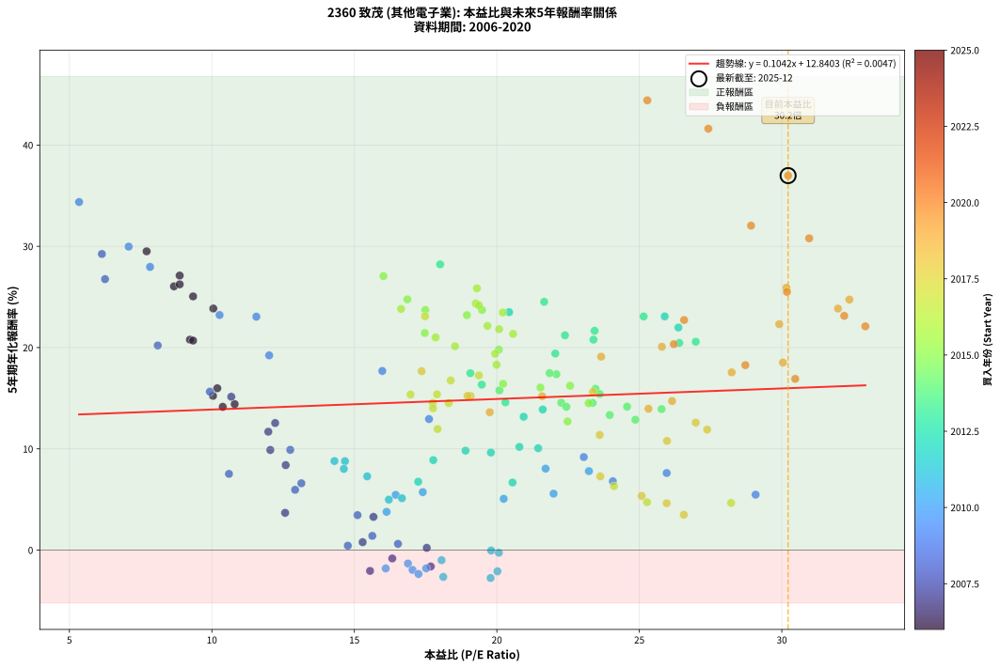
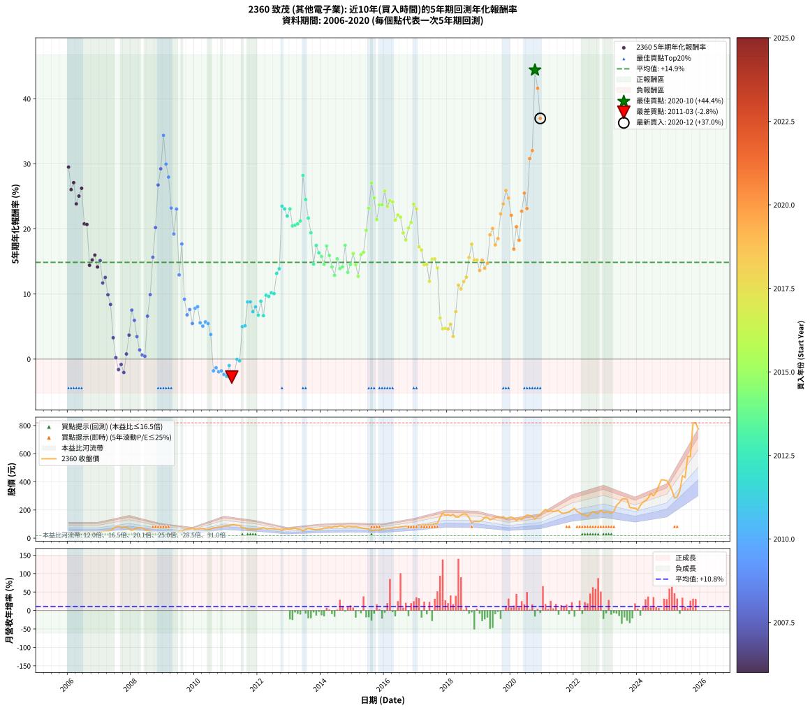

# 2360 致茂 - 本益比與未來報酬率分析

!!! info "報告資訊"
    - **股票代號**: 2360
    - **公司名稱**: 致茂
    - **產業別**: 其他電子業
    - **分析期間**: 2006-2020 (180 個數據點)
    - **資料來源**: Type 12 (ShowMonthlyK_ChartFlow) 月收盤價與本益比
    - **報酬率口徑**: 含現金股利 (簡化: 年度合計，假設每年7/1入帳)
    - **報告生成時間**: 2026-01-09 20:40:23 CST

## 📈 視覺化圖表

### 圖表1: 本益比 vs 未來報酬率關係

*圖表1：2360 致茂 本益比與5年期未來報酬率關係 (2006-2020)*

### 圖表2: 歷年買入時點的5年期實際報酬率

*圖表2：2360 致茂 歷年買入時點的5年期實際報酬率 (2006-2020)*

## 📍 買點訊號說明

本報告提供兩種買點提示訊號（顯示於圖表2的股價子圖中）：

### ▲ 小綠色三角形（回測驗證）
- **計算方式**: 使用全部歷史資料計算本益比第25百分位數
- **用途**: 事後驗證，顯示歷史上哪些時點確實為低估區
- **限制**: 當下無法判斷，僅供回測參考
- **特性**: 後見之明（Look-Ahead Bias）

### ▲ 小橘色三角形（即時訊號）
- **計算方式**: 使用截至當月的過去5年資料計算本益比第25百分位數
- **用途**: 實際投資決策，當時即可判斷
- **優勢**: 可操作性強，符合實務需求
- **特性**: 無後見之明，滾動窗口計算

!!! tip "如何使用兩種訊號"
    - **綠色▲** 幫助理解歷史估值機會，驗證策略有效性
    - **橘色▲** 可作為實際買進參考，但仍需搭配基本面分析
    - 兩種訊號重疊時，表示即時判斷與事後驗證一致，信心度較高
    - 僅有綠色▲時，表示當時無法判斷（需要未來資料才能確認）
    - 僅有橘色▲時，表示即時判斷為買點，但事後可能不是最佳時機

## 📊 估值分析摘要

| 指標 | 數值 |
|:---:|:---:|
| **目前本益比** (2020-12) | **30.22 倍** |
| **歷史平均本益比** | 19.50 倍 |
| **估值水準** | 🔴 相對高估 |
| **預期5年年化報酬率** | **+15.99%** |
| **歷史平均報酬率** | +14.87% |
| **相關係數 (R²)** | 0.0047 |
| **趨勢線斜率** | 0.1042 |

!!! abstract "核心洞察"
    目前本益比顯著高於歷史平均，預期未來報酬率可能較低

    根據歷史數據回測，2360 致茂 在目前本益比 **30.2倍** 的估值水準下，
    預期未來5年年化報酬率約為 **+16.0%**。

    **重要提醒**: 本分析基於歷史數據統計，實際報酬率會受到公司基本面變化、產業趨勢、
    總體經濟環境等多重因素影響。R² = 0.00 表示本益比可解釋約 0.5% 的報酬率變異。

## 📈 歷史估值統計

### 最佳買點 (最高報酬率)

| 項目 | 數值 |
|:---:|:---:|
| 起始時間 | 2020-10 |
| 當時本益比 | 25.28 倍 |
| 起始價格 | 136.0 元 |
| 5年後價格 | 819.0 元 |
| **5年年化報酬率** | **+44.42%** |

### 最差買點 (最低報酬率)

| 項目 | 數值 |
|:---:|:---:|
| 起始時間 | 2011-03 |
| 當時本益比 | 19.78 倍 |
| 起始價格 | 95.0 元 |
| 5年後價格 | 69.2 元 |
| **5年年化報酬率** | **-2.76%** |

## 🎯 投資啟示

### 本益比與報酬率關係

趨勢線方程式: **y = 0.1042x + 12.8403**

!!! info "弱相關或正相關"
    本益比與未來報酬率相關性較弱。這可能表示該股票的報酬率更多受到
    公司成長性、產業趨勢等因素影響，而非估值水準。**需綜合考量多項指標**。

### 估值區間建議

基於歷史數據分析:

- **🟢 低估區** (P/E < 15.6): 預期報酬率較高，可考慮增加持股
- **🟡 合理區** (P/E 15.6-23.4): 預期報酬率符合長期趨勢，正常持有
- **🔴 高估區** (P/E > 23.4): 預期報酬率較低，可考慮減碼或觀望

!!! danger "風險提示"
    - 過去表現不代表未來結果
    - 本分析假設公司基本面無重大結構性變化
    - 產業環境劇變可能使歷史規律失效
    - 應結合公司財報、產業趨勢、總體經濟等多重因素綜合判斷

!!! success "長期投資觀點"
    歷史數據顯示，在合理或低估的估值水準買入並長期持有，
    往往能獲得較佳的投資報酬。**耐心等待好價格**是價值投資的核心原則。

## 📊 數據品質

- **資料來源**: GoodInfo.tw Type 12 (ShowMonthlyK_ChartFlow)
- **資料頻率**: 月度收盤價與本益比
- **回測期間**: 2006-2020
- **數據點數量**: 180 個 (每個點代表一次5年期回測)

### 計算方法說明

1. **5年期年化報酬率**:
   - 對每個歷史時點，計算其後5年的實際投資報酬率
   - 期末價值(不含股利): 期末價格
   - 期末價值(含現金股利): 期末價格 + 持有期間內的現金股利合計 (簡化: 年度合計，假設每年7/1入帳)
   - 公式: 年化報酬率 = [(期末價值/期初價格)^(1/年數) - 1] × 100%

2. **本益比 (P/E Ratio)**:
   - 使用當時的月收盤價與EPS計算
   - 資料來源: Type 12 月度河流圖本益比數據

3. **趨勢線 (Linear Regression)**:
   - 使用最小平方法擬合線性趨勢線
   - R²值衡量本益比對報酬率的解釋能力

---

*本報告由 Stock Analysis System v1.9.0 自動生成*
*數據更新時間: 2026-01-09 20:40:23 CST*

## 📋 月度回測明細表

（每一列對應時間線圖中的一個買入點；可用來對照 SVG 圖上的每個點。）

| 買入月份 | 賣出月份 | 回測期限_年 | 實際持有年數 | 買入本益比_倍 | 買入收盤價_元 | 賣出收盤價_元 | 現金股利合計_元 | 總報酬率_pct | 年化報酬率_pct |
| --- | --- | --- | --- | --- | --- | --- | --- | --- | --- |
| 2006-01 | 2011-01 | 5 | 4.999 | 7.71 | 28.05 | 90.00 | 12.17 | +264.22 | +29.51 |
| 2006-02 | 2011-02 | 5 | 4.999 | 8.67 | 31.55 | 88.20 | 12.17 | +218.11 | +26.05 |
| 2006-03 | 2011-03 | 5 | 4.999 | 8.87 | 32.30 | 95.00 | 12.17 | +231.78 | +27.11 |
| 2006-04 | 2011-04 | 5 | 4.999 | 10.05 | 36.60 | 94.50 | 12.17 | +191.43 | +23.86 |
| 2006-05 | 2011-05 | 5 | 4.999 | 9.34 | 34.00 | 91.80 | 12.17 | +205.78 | +25.05 |
| 2006-06 | 2011-06 | 5 | 4.999 | 8.87 | 32.30 | 91.40 | 12.17 | +220.63 | +26.25 |
| 2006-07 | 2011-07 | 5 | 4.999 | 9.23 | 33.60 | 72.50 | 13.86 | +157.02 | +20.78 |
| 2006-08 | 2011-08 | 5 | 4.999 | 9.34 | 34.00 | 73.20 | 13.86 | +156.05 | +20.69 |
| 2006-09 | 2011-09 | 5 | 4.999 | 10.80 | 39.30 | 63.20 | 13.86 | +96.08 | +14.42 |
| 2006-10 | 2011-10 | 5 | 4.999 | 10.04 | 36.55 | 60.40 | 13.86 | +103.17 | +15.23 |
| 2006-11 | 2011-11 | 5 | 4.999 | 10.19 | 37.10 | 64.00 | 13.86 | +109.86 | +15.98 |
| 2006-12 | 2011-12 | 5 | 4.999 | 10.38 | 37.80 | 59.40 | 13.86 | +93.80 | +14.15 |
| 2007-01 | 2012-01 | 5 | 4.999 | 10.68 | 40.30 | 67.70 | 13.86 | +102.38 | +15.14 |
| 2007-02 | 2012-02 | 5 | 4.999 | 11.98 | 46.75 | 67.40 | 13.86 | +73.81 | +11.69 |
| 2007-03 | 2012-03 | 5 | 5.002 | 12.22 | 49.30 | 75.20 | 13.86 | +80.65 | +12.55 |
| 2007-04 | 2012-04 | 5 | 5.002 | 12.05 | 50.20 | 66.60 | 13.86 | +60.27 | +9.89 |
| 2007-05 | 2012-05 | 5 | 5.002 | 12.59 | 54.10 | 67.10 | 13.86 | +49.65 | +8.39 |
| 2007-06 | 2012-06 | 5 | 5.002 | 15.67 | 69.40 | 67.70 | 13.86 | +17.52 | +3.28 |
| 2007-07 | 2012-07 | 5 | 5.002 | 17.54 | 80.00 | 67.00 | 13.91 | +1.13 | +0.23 |
| 2007-08 | 2012-08 | 5 | 5.002 | 17.68 | 83.00 | 62.60 | 13.91 | -7.83 | -1.62 |
| 2007-09 | 2012-09 | 5 | 5.002 | 16.33 | 78.80 | 61.70 | 13.91 | -4.05 | -0.82 |
| 2007-10 | 2012-10 | 5 | 5.002 | 15.55 | 77.10 | 55.60 | 13.91 | -9.85 | -2.05 |
| 2007-11 | 2012-11 | 5 | 5.002 | 15.29 | 77.80 | 67.00 | 13.91 | +3.99 | +0.79 |
| 2007-12 | 2012-12 | 5 | 5.002 | 12.57 | 65.60 | 64.70 | 13.91 | +19.82 | +3.68 |
| 2008-01 | 2013-01 | 5 | 5.002 | 10.60 | 53.70 | 63.30 | 13.91 | +43.77 | +7.53 |
| 2008-02 | 2013-03 | 5 | 5.081 | 12.92 | 63.50 | 71.30 | 13.91 | +34.18 | +5.96 |
| 2008-03 | 2013-03 | 5 | 4.999 | 15.11 | 71.90 | 71.30 | 13.91 | +18.50 | +3.45 |
| 2008-04 | 2013-04 | 5 | 4.999 | 15.63 | 72.00 | 63.30 | 13.91 | +7.23 | +1.41 |
| 2008-05 | 2013-05 | 5 | 4.999 | 16.53 | 73.60 | 62.00 | 13.91 | +3.13 | +0.62 |
| 2008-06 | 2013-06 | 5 | 4.999 | 14.77 | 63.50 | 51.00 | 13.91 | +2.21 | +0.44 |
| 2008-07 | 2013-07 | 5 | 4.999 | 13.14 | 54.50 | 62.70 | 12.31 | +37.64 | +6.60 |
| 2008-08 | 2013-08 | 5 | 4.999 | 12.75 | 50.90 | 69.30 | 12.31 | +60.34 | +9.90 |
| 2008-09 | 2013-09 | 5 | 4.999 | 9.93 | 38.15 | 66.60 | 12.31 | +106.85 | +15.65 |
| 2008-10 | 2013-10 | 5 | 4.999 | 8.10 | 29.85 | 62.60 | 12.31 | +150.96 | +20.21 |
| 2008-11 | 2013-11 | 5 | 4.999 | 6.25 | 22.10 | 60.00 | 12.31 | +227.20 | +26.76 |
| 2008-12 | 2013-12 | 5 | 4.999 | 6.14 | 20.75 | 62.50 | 12.31 | +260.54 | +29.24 |
| 2009-01 | 2014-01 | 5 | 4.999 | 5.34 | 17.65 | 65.00 | 12.31 | +338.03 | +34.37 |
| 2009-02 | 2014-02 | 5 | 4.999 | 7.08 | 22.90 | 72.60 | 12.31 | +270.79 | +29.97 |
| 2009-03 | 2014-03 | 5 | 4.999 | 7.83 | 24.75 | 72.60 | 12.31 | +243.08 | +27.97 |
| 2009-04 | 2014-04 | 5 | 4.999 | 10.27 | 31.70 | 77.70 | 12.31 | +183.95 | +23.21 |
| 2009-05 | 2014-05 | 5 | 4.999 | 12.01 | 36.20 | 74.90 | 12.31 | +140.92 | +19.23 |
| 2009-06 | 2014-06 | 5 | 4.999 | 11.56 | 34.00 | 83.60 | 12.31 | +182.09 | +23.05 |
| 2009-07 | 2014-07 | 5 | 4.999 | 17.62 | 50.50 | 80.00 | 12.80 | +83.76 | +12.94 |
| 2009-08 | 2014-08 | 5 | 4.999 | 15.98 | 44.65 | 88.00 | 12.80 | +125.76 | +17.69 |
| 2009-09 | 2014-09 | 5 | 4.999 | 23.05 | 62.70 | 84.50 | 12.80 | +55.18 | +9.19 |
| 2009-10 | 2014-10 | 5 | 4.999 | 24.07 | 63.70 | 75.70 | 12.80 | +38.93 | +6.80 |
| 2009-11 | 2014-11 | 5 | 4.999 | 25.96 | 66.80 | 83.60 | 12.80 | +44.31 | +7.61 |
| 2009-12 | 2014-12 | 5 | 4.999 | 29.08 | 72.70 | 82.10 | 12.80 | +30.54 | +5.47 |
| 2010-01 | 2015-01 | 5 | 4.999 | 23.23 | 63.00 | 78.90 | 12.80 | +45.56 | +7.80 |
| 2010-02 | 2015-02 | 5 | 4.999 | 21.71 | 63.50 | 80.70 | 12.80 | +47.24 | +8.05 |
| 2010-03 | 2015-03 | 5 | 4.999 | 21.99 | 69.00 | 77.70 | 12.80 | +31.16 | +5.58 |
| 2010-04 | 2015-04 | 5 | 4.999 | 20.24 | 67.80 | 74.00 | 12.80 | +28.02 | +5.07 |
| 2010-05 | 2015-05 | 5 | 4.999 | 17.40 | 62.00 | 69.10 | 12.80 | +32.10 | +5.73 |
| 2010-06 | 2015-06 | 5 | 4.999 | 16.45 | 62.10 | 68.20 | 12.80 | +30.43 | +5.46 |
| 2010-07 | 2015-07 | 5 | 4.999 | 16.13 | 64.30 | 64.00 | 13.41 | +20.38 | +3.78 |
| 2010-08 | 2015-08 | 5 | 4.999 | 17.52 | 73.60 | 53.80 | 13.41 | -8.69 | -1.80 |
| 2010-09 | 2015-09 | 5 | 4.999 | 16.88 | 74.50 | 56.30 | 13.41 | -6.43 | -1.32 |
| 2010-10 | 2015-10 | 5 | 4.999 | 17.04 | 78.80 | 58.00 | 13.41 | -9.38 | -1.95 |
| 2010-11 | 2015-11 | 5 | 4.999 | 16.10 | 77.90 | 57.70 | 13.41 | -8.72 | -1.81 |
| 2010-12 | 2015-12 | 5 | 4.999 | 17.25 | 87.10 | 63.90 | 13.41 | -11.24 | -2.36 |
| 2011-01 | 2016-01 | 5 | 4.999 | 18.12 | 90.00 | 65.30 | 13.41 | -12.55 | -2.65 |
| 2011-02 | 2016-02 | 5 | 4.999 | 18.06 | 88.20 | 70.50 | 13.41 | -4.87 | -0.99 |
| 2011-03 | 2016-03 | 5 | 5.002 | 19.78 | 95.00 | 69.20 | 13.41 | -13.05 | -2.76 |
| 2011-04 | 2016-04 | 5 | 5.002 | 20.02 | 94.50 | 71.60 | 13.41 | -10.05 | -2.09 |
| 2011-05 | 2016-05 | 5 | 5.002 | 19.80 | 91.80 | 78.20 | 13.41 | -0.21 | -0.04 |
| 2011-06 | 2016-06 | 5 | 5.002 | 20.07 | 91.40 | 76.80 | 13.41 | -1.31 | -0.26 |
| 2011-07 | 2016-07 | 5 | 5.002 | 16.21 | 72.50 | 80.50 | 11.98 | +27.56 | +4.99 |
| 2011-08 | 2016-08 | 5 | 5.002 | 16.67 | 73.20 | 82.00 | 11.98 | +28.39 | +5.12 |
| 2011-09 | 2016-09 | 5 | 5.002 | 14.67 | 63.20 | 84.30 | 11.98 | +52.34 | +8.78 |
| 2011-10 | 2016-10 | 5 | 5.002 | 14.30 | 60.40 | 80.10 | 11.98 | +52.45 | +8.80 |
| 2011-11 | 2016-11 | 5 | 5.002 | 15.45 | 64.00 | 79.00 | 11.98 | +42.16 | +7.29 |
| 2011-12 | 2016-12 | 5 | 5.002 | 14.63 | 59.40 | 75.40 | 11.98 | +47.10 | +8.02 |
| 2012-01 | 2017-01 | 5 | 5.002 | 17.24 | 67.70 | 81.90 | 11.98 | +38.67 | +6.75 |
| 2012-02 | 2017-03 | 5 | 5.081 | 17.77 | 67.40 | 91.90 | 11.98 | +54.12 | +8.89 |
| 2012-03 | 2017-03 | 5 | 4.999 | 20.55 | 75.20 | 91.90 | 11.98 | +38.14 | +6.68 |
| 2012-04 | 2017-04 | 5 | 4.999 | 18.90 | 66.60 | 94.40 | 11.98 | +59.73 | +9.82 |
| 2012-05 | 2017-05 | 5 | 4.999 | 19.79 | 67.10 | 94.30 | 11.98 | +58.39 | +9.64 |
| 2012-06 | 2017-06 | 5 | 4.999 | 20.79 | 67.70 | 98.00 | 11.98 | +62.45 | +10.19 |
| 2012-07 | 2017-07 | 5 | 4.999 | 21.45 | 67.00 | 95.50 | 12.70 | +61.49 | +10.06 |
| 2012-08 | 2017-08 | 5 | 4.999 | 20.94 | 62.60 | 103.50 | 12.70 | +85.62 | +13.17 |
| 2012-09 | 2017-09 | 5 | 4.999 | 21.61 | 61.70 | 105.50 | 12.70 | +91.57 | +13.89 |
| 2012-10 | 2017-10 | 5 | 4.999 | 20.43 | 55.60 | 147.00 | 12.70 | +187.23 | +23.50 |
| 2012-11 | 2017-11 | 5 | 4.999 | 25.89 | 67.00 | 176.50 | 12.70 | +182.39 | +23.08 |
| 2012-12 | 2017-12 | 5 | 4.999 | 26.37 | 64.70 | 162.00 | 12.70 | +170.02 | +21.98 |
| 2013-01 | 2018-01 | 5 | 4.999 | 25.15 | 63.30 | 166.00 | 12.70 | +182.31 | +23.07 |
| 2013-02 | 2018-02 | 5 | 4.999 | 26.40 | 68.10 | 160.00 | 12.70 | +153.60 | +20.46 |
| 2013-03 | 2018-03 | 5 | 4.999 | 26.98 | 71.30 | 169.00 | 12.70 | +154.84 | +20.58 |
| 2013-04 | 2018-04 | 5 | 4.999 | 23.39 | 63.30 | 150.00 | 12.70 | +157.03 | +20.78 |
| 2013-05 | 2018-05 | 5 | 4.999 | 22.39 | 62.00 | 149.50 | 12.70 | +161.61 | +21.21 |
| 2013-06 | 2018-06 | 5 | 4.999 | 18.01 | 51.00 | 164.00 | 12.70 | +246.47 | +28.22 |
| 2013-07 | 2018-07 | 5 | 4.999 | 21.66 | 62.70 | 172.50 | 15.18 | +199.32 | +24.52 |
| 2013-08 | 2018-08 | 5 | 4.999 | 23.43 | 69.30 | 169.50 | 15.18 | +166.49 | +21.66 |
| 2013-09 | 2018-09 | 5 | 4.999 | 22.05 | 66.60 | 146.50 | 15.18 | +142.76 | +19.41 |
| 2013-10 | 2018-10 | 5 | 4.999 | 20.30 | 62.60 | 108.50 | 15.18 | +97.57 | +14.59 |
| 2013-11 | 2018-11 | 5 | 4.999 | 19.07 | 60.00 | 119.00 | 15.18 | +123.63 | +17.47 |
| 2013-12 | 2018-12 | 5 | 4.999 | 19.47 | 62.50 | 118.00 | 15.18 | +113.08 | +16.34 |
| 2014-01 | 2019-01 | 5 | 4.999 | 20.09 | 65.00 | 120.00 | 15.18 | +107.96 | +15.77 |
| 2014-02 | 2019-02 | 5 | 4.999 | 22.26 | 72.60 | 128.00 | 15.18 | +97.21 | +14.55 |
| 2014-03 | 2019-03 | 5 | 4.999 | 22.09 | 72.60 | 146.50 | 15.18 | +122.69 | +17.37 |
| 2014-04 | 2019-04 | 5 | 4.999 | 23.46 | 77.70 | 147.50 | 15.18 | +109.36 | +15.93 |
| 2014-05 | 2019-05 | 5 | 4.999 | 22.44 | 74.90 | 130.00 | 15.18 | +93.83 | +14.15 |
| 2014-06 | 2019-06 | 5 | 4.999 | 24.86 | 83.60 | 138.00 | 15.18 | +83.22 | +12.88 |
| 2014-07 | 2019-07 | 5 | 4.999 | 23.61 | 80.00 | 147.00 | 16.85 | +104.82 | +15.42 |
| 2014-08 | 2019-08 | 5 | 4.999 | 25.78 | 88.00 | 152.00 | 16.85 | +91.88 | +13.92 |
| 2014-09 | 2019-09 | 5 | 4.999 | 24.57 | 84.50 | 147.00 | 16.85 | +93.91 | +14.16 |
| 2014-10 | 2019-10 | 5 | 4.999 | 21.85 | 75.70 | 152.50 | 16.85 | +123.72 | +17.48 |
| 2014-11 | 2019-11 | 5 | 4.999 | 23.96 | 83.60 | 139.50 | 16.85 | +87.03 | +13.34 |
| 2014-12 | 2019-12 | 5 | 4.999 | 23.36 | 82.10 | 145.00 | 16.85 | +97.14 | +14.54 |
| 2015-01 | 2020-01 | 5 | 4.999 | 22.57 | 78.90 | 150.50 | 16.85 | +112.11 | +16.23 |
| 2015-02 | 2020-02 | 5 | 4.999 | 23.22 | 80.70 | 142.00 | 16.85 | +96.85 | +14.51 |
| 2015-03 | 2020-03 | 5 | 5.002 | 22.48 | 77.70 | 124.50 | 16.85 | +81.92 | +12.71 |
| 2015-04 | 2020-04 | 5 | 5.002 | 21.53 | 74.00 | 139.00 | 16.85 | +110.61 | +16.06 |
| 2015-05 | 2020-05 | 5 | 5.002 | 20.22 | 69.10 | 131.00 | 16.85 | +113.97 | +16.42 |
| 2015-06 | 2020-06 | 5 | 5.002 | 20.07 | 68.20 | 151.50 | 16.85 | +146.85 | +19.80 |
| 2015-07 | 2020-07 | 5 | 5.002 | 18.95 | 64.00 | 164.50 | 17.25 | +183.99 | +23.20 |
| 2015-08 | 2020-08 | 5 | 5.002 | 16.02 | 53.80 | 161.00 | 17.25 | +231.33 | +27.06 |
| 2015-09 | 2020-09 | 5 | 5.002 | 16.86 | 56.30 | 153.00 | 17.25 | +202.40 | +24.76 |
| 2015-10 | 2020-10 | 5 | 5.002 | 17.47 | 58.00 | 136.00 | 17.25 | +164.23 | +21.44 |
| 2015-11 | 2020-11 | 5 | 5.002 | 17.49 | 57.70 | 150.00 | 17.25 | +189.87 | +23.71 |
| 2015-12 | 2020-12 | 5 | 5.002 | 19.48 | 63.90 | 168.00 | 17.25 | +189.91 | +23.71 |
| 2016-01 | 2021-01 | 5 | 5.002 | 19.30 | 65.30 | 189.00 | 17.25 | +215.86 | +25.85 |
| 2016-02 | 2021-03 | 5 | 5.081 | 20.21 | 70.50 | 188.50 | 17.25 | +191.85 | +23.46 |
| 2016-03 | 2021-03 | 5 | 4.999 | 19.26 | 69.20 | 188.50 | 17.25 | +197.33 | +24.35 |
| 2016-04 | 2021-04 | 5 | 4.999 | 19.37 | 71.60 | 194.00 | 17.25 | +195.05 | +24.16 |
| 2016-05 | 2021-05 | 5 | 4.999 | 20.57 | 78.20 | 188.50 | 17.25 | +163.11 | +21.35 |
| 2016-06 | 2021-06 | 5 | 4.999 | 19.67 | 76.80 | 191.50 | 17.25 | +171.82 | +22.14 |
| 2016-07 | 2021-07 | 5 | 4.999 | 20.08 | 80.50 | 196.50 | 19.38 | +168.18 | +21.81 |
| 2016-08 | 2021-08 | 5 | 4.999 | 19.94 | 82.00 | 179.50 | 19.38 | +142.54 | +19.39 |
| 2016-09 | 2021-09 | 5 | 4.999 | 19.99 | 84.30 | 176.00 | 19.38 | +131.77 | +18.31 |
| 2016-10 | 2021-10 | 5 | 4.999 | 18.53 | 80.10 | 181.00 | 19.38 | +150.16 | +20.13 |
| 2016-11 | 2021-11 | 5 | 4.999 | 17.85 | 79.00 | 185.50 | 19.38 | +159.34 | +21.00 |
| 2016-12 | 2021-12 | 5 | 4.999 | 16.64 | 75.40 | 200.00 | 19.38 | +190.96 | +23.82 |
| 2017-01 | 2022-01 | 5 | 4.999 | 17.48 | 81.90 | 212.00 | 19.38 | +182.52 | +23.09 |
| 2017-02 | 2022-02 | 5 | 4.999 | 19.37 | 93.80 | 188.50 | 19.38 | +121.62 | +17.26 |
| 2017-03 | 2022-03 | 5 | 4.999 | 18.38 | 91.90 | 180.00 | 19.38 | +116.95 | +16.76 |
| 2017-04 | 2022-04 | 5 | 4.999 | 18.31 | 94.40 | 166.50 | 19.38 | +96.91 | +14.51 |
| 2017-05 | 2022-05 | 5 | 4.999 | 17.75 | 94.30 | 166.50 | 19.38 | +97.12 | +14.54 |
| 2017-06 | 2022-06 | 5 | 4.999 | 17.92 | 98.00 | 153.00 | 19.38 | +75.90 | +11.96 |
| 2017-07 | 2022-07 | 5 | 4.999 | 16.97 | 95.50 | 172.00 | 23.14 | +104.34 | +15.37 |
| 2017-08 | 2022-08 | 5 | 4.999 | 17.90 | 103.50 | 188.50 | 23.14 | +104.48 | +15.38 |
| 2017-09 | 2022-09 | 5 | 4.999 | 17.76 | 105.50 | 180.00 | 23.14 | +92.55 | +14.00 |
| 2017-10 | 2022-10 | 5 | 4.999 | 24.11 | 147.00 | 176.50 | 23.14 | +35.81 | +6.31 |
| 2017-11 | 2022-11 | 5 | 4.999 | 28.22 | 176.50 | 198.50 | 23.14 | +25.58 | +4.66 |
| 2017-12 | 2022-12 | 5 | 4.999 | 25.27 | 162.00 | 181.00 | 23.14 | +26.01 | +4.73 |
| 2018-01 | 2023-01 | 5 | 4.999 | 25.96 | 166.00 | 185.00 | 23.14 | +25.39 | +4.63 |
| 2018-02 | 2023-02 | 5 | 4.999 | 25.08 | 160.00 | 184.50 | 23.14 | +29.78 | +5.35 |
| 2018-03 | 2023-03 | 5 | 4.999 | 26.56 | 169.00 | 177.50 | 23.14 | +18.72 | +3.49 |
| 2018-04 | 2023-04 | 5 | 4.999 | 23.63 | 150.00 | 190.00 | 23.14 | +42.09 | +7.28 |
| 2018-05 | 2023-05 | 5 | 4.999 | 23.61 | 149.50 | 233.00 | 23.14 | +71.33 | +11.37 |
| 2018-06 | 2023-06 | 5 | 4.999 | 25.97 | 164.00 | 250.50 | 23.14 | +66.85 | +10.78 |
| 2018-07 | 2023-07 | 5 | 4.999 | 27.38 | 172.50 | 276.00 | 26.67 | +75.46 | +11.90 |
| 2018-08 | 2023-08 | 5 | 4.999 | 26.98 | 169.50 | 280.00 | 26.67 | +80.92 | +12.59 |
| 2018-09 | 2023-09 | 5 | 4.999 | 23.37 | 146.50 | 276.00 | 26.67 | +106.60 | +15.62 |
| 2018-10 | 2023-10 | 5 | 4.999 | 17.36 | 108.50 | 218.00 | 26.67 | +125.50 | +17.66 |
| 2018-11 | 2023-11 | 5 | 4.999 | 19.08 | 119.00 | 215.00 | 26.67 | +103.08 | +15.22 |
| 2018-12 | 2023-12 | 5 | 4.999 | 18.97 | 118.00 | 213.00 | 26.67 | +103.11 | +15.23 |
| 2019-01 | 2024-01 | 5 | 4.999 | 19.75 | 120.00 | 200.50 | 26.67 | +89.31 | +13.62 |
| 2019-02 | 2024-02 | 5 | 4.999 | 21.59 | 128.00 | 233.00 | 26.67 | +102.86 | +15.20 |
| 2019-03 | 2024-03 | 5 | 5.002 | 25.32 | 146.50 | 255.00 | 26.67 | +92.26 | +13.96 |
| 2019-04 | 2024-04 | 5 | 5.002 | 26.15 | 147.50 | 266.50 | 26.67 | +98.76 | +14.72 |
| 2019-05 | 2024-05 | 5 | 5.002 | 23.66 | 130.00 | 285.00 | 26.67 | +139.74 | +19.10 |
| 2019-06 | 2024-06 | 5 | 5.002 | 25.79 | 138.00 | 318.00 | 26.67 | +149.76 | +20.08 |
| 2019-07 | 2024-07 | 5 | 5.002 | 28.24 | 147.00 | 301.00 | 29.09 | +124.55 | +17.55 |
| 2019-08 | 2024-08 | 5 | 5.002 | 30.04 | 152.00 | 326.50 | 29.09 | +133.94 | +18.52 |
| 2019-09 | 2024-09 | 5 | 5.002 | 29.91 | 147.00 | 373.50 | 29.09 | +173.87 | +22.31 |
| 2019-10 | 2024-10 | 5 | 5.002 | 31.97 | 152.50 | 415.50 | 29.09 | +191.53 | +23.85 |
| 2019-11 | 2024-11 | 5 | 5.002 | 30.16 | 139.50 | 412.50 | 29.09 | +216.55 | +25.91 |
| 2019-12 | 2024-12 | 5 | 5.002 | 32.37 | 145.00 | 409.00 | 29.09 | +202.13 | +24.74 |
| 2020-01 | 2025-01 | 5 | 5.002 | 32.93 | 150.50 | 379.50 | 29.09 | +171.49 | +22.10 |
| 2020-02 | 2025-03 | 5 | 5.081 | 30.47 | 142.00 | 285.00 | 29.09 | +121.19 | +16.91 |
| 2020-03 | 2025-03 | 5 | 4.999 | 26.21 | 124.50 | 285.00 | 29.09 | +152.28 | +20.33 |
| 2020-04 | 2025-04 | 5 | 4.999 | 28.72 | 139.00 | 292.50 | 29.09 | +131.36 | +18.27 |
| 2020-05 | 2025-05 | 5 | 4.999 | 26.57 | 131.00 | 335.50 | 29.09 | +178.31 | +22.72 |
| 2020-06 | 2025-06 | 5 | 4.999 | 30.18 | 151.50 | 442.50 | 29.09 | +211.28 | +25.50 |
| 2020-07 | 2025-07 | 5 | 4.999 | 32.19 | 164.50 | 430.50 | 35.08 | +183.03 | +23.13 |
| 2020-08 | 2025-08 | 5 | 4.999 | 30.96 | 161.00 | 581.00 | 35.08 | +282.66 | +30.79 |
| 2020-09 | 2025-09 | 5 | 4.999 | 28.92 | 153.00 | 579.00 | 35.08 | +301.36 | +32.05 |
| 2020-10 | 2025-10 | 5 | 4.999 | 25.28 | 136.00 | 819.00 | 35.08 | +528.00 | +44.42 |
| 2020-11 | 2025-11 | 5 | 4.999 | 27.42 | 150.00 | 819.00 | 35.08 | +469.39 | +41.61 |
| 2020-12 | 2025-12 | 5 | 4.999 | 30.22 | 168.00 | 775.00 | 35.08 | +382.19 | +36.98 |
