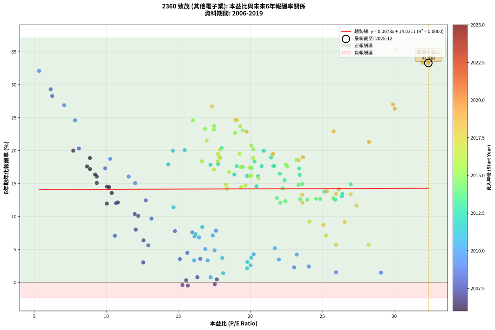
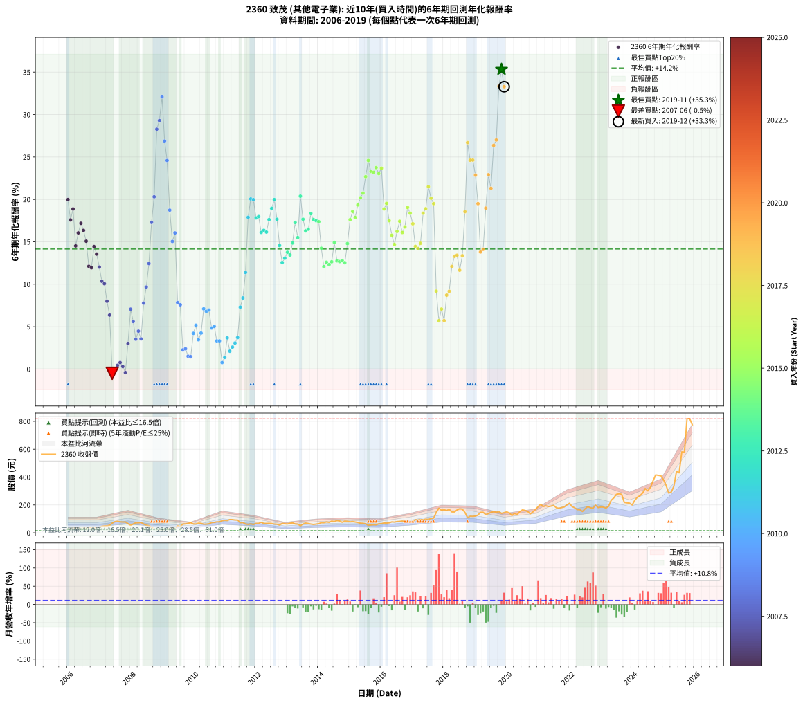

# 2360 致茂 - 本益比與未來報酬率分析

!!! info "報告資訊"
    - **股票代號**: 2360
    - **公司名稱**: 致茂
    - **產業別**: 其他電子業
    - **分析期間**: 2006-2019 (168 個數據點)
    - **資料來源**: Type 12 (ShowMonthlyK_ChartFlow) 月收盤價與本益比
    - **報酬率口徑**: 含現金股利 (簡化: 年度合計，假設每年7/1入帳)
    - **報告生成時間**: 2026-01-22 22:35:02 CST

## 📈 視覺化圖表

### 圖表1: 本益比 vs 未來報酬率關係

*圖表1：2360 致茂 本益比與6年期未來報酬率關係 (2006-2019)*

### 圖表2: 歷年買入時點的6年期實際報酬率

*圖表2：2360 致茂 歷年買入時點的6年期實際報酬率 (2006-2019)*

## 📍 買點訊號說明

本報告提供兩種買點提示訊號（顯示於圖表2的股價子圖中）：

### ▲ 小綠色三角形（回測驗證）
- **計算方式**: 使用全部歷史資料計算本益比第25百分位數
- **用途**: 事後驗證，顯示歷史上哪些時點確實為低估區
- **限制**: 當下無法判斷，僅供回測參考
- **特性**: 後見之明（Look-Ahead Bias）

### ▲ 小橘色三角形（即時訊號）
- **計算方式**: 使用截至當月的過去5年資料計算本益比第25百分位數
- **用途**: 實際投資決策，當時即可判斷
- **優勢**: 可操作性強，符合實務需求
- **特性**: 無後見之明，滾動窗口計算

!!! tip "如何使用兩種訊號"
    - **綠色▲** 幫助理解歷史估值機會，驗證策略有效性
    - **橘色▲** 可作為實際買進參考，但仍需搭配基本面分析
    - 兩種訊號重疊時，表示即時判斷與事後驗證一致，信心度較高
    - 僅有綠色▲時，表示當時無法判斷（需要未來資料才能確認）
    - 僅有橘色▲時，表示即時判斷為買點，但事後可能不是最佳時機

## 📊 估值分析摘要

| 指標 | 數值 |
|:---:|:---:|
| **目前本益比** (2019-12) | **32.37 倍** |
| **歷史平均本益比** | 18.81 倍 |
| **估值水準** | 🔴 相對高估 |
| **預期6年年化報酬率** | **+14.27%** |
| **歷史平均報酬率** | +14.17% |
| **相關係數 (R²)** | 0.0000 |
| **趨勢線斜率** | 0.0073 |

!!! abstract "核心洞察"
    目前本益比顯著高於歷史平均，預期未來報酬率可能較低

    根據歷史數據回測，2360 致茂 在目前本益比 **32.4倍** 的估值水準下，
    預期未來6年年化報酬率約為 **+14.3%**。

    **重要提醒**: 本分析基於歷史數據統計，實際報酬率會受到公司基本面變化、產業趨勢、
    總體經濟環境等多重因素影響。R² = 0.00 表示本益比可解釋約 0.0% 的報酬率變異。

## 📈 歷史估值統計

### 最佳買點 (最高報酬率)

| 項目 | 數值 |
|:---:|:---:|
| 起始時間 | 2019-11 |
| 當時本益比 | 30.16 倍 |
| 起始價格 | 139.5 元 |
| 6年後價格 | 819.0 元 |
| **6年年化報酬率** | **+35.33%** |

### 最差買點 (最低報酬率)

| 項目 | 數值 |
|:---:|:---:|
| 起始時間 | 2007-06 |
| 當時本益比 | 15.67 倍 |
| 起始價格 | 69.4 元 |
| 6年後價格 | 51.0 元 |
| **6年年化報酬率** | **-0.50%** |

## 🎯 投資啟示

### 本益比與報酬率關係

趨勢線方程式: **y = 0.0073x + 14.0311**

!!! info "弱相關或正相關"
    本益比與未來報酬率相關性較弱。這可能表示該股票的報酬率更多受到
    公司成長性、產業趨勢等因素影響，而非估值水準。**需綜合考量多項指標**。

### 估值區間建議

基於歷史數據分析:

- **🟢 低估區** (P/E < 15.0): 預期報酬率較高，可考慮增加持股
- **🟡 合理區** (P/E 15.0-22.6): 預期報酬率符合長期趨勢，正常持有
- **🔴 高估區** (P/E > 22.6): 預期報酬率較低，可考慮減碼或觀望

!!! danger "風險提示"
    - 過去表現不代表未來結果
    - 本分析假設公司基本面無重大結構性變化
    - 產業環境劇變可能使歷史規律失效
    - 應結合公司財報、產業趨勢、總體經濟等多重因素綜合判斷

!!! success "長期投資觀點"
    歷史數據顯示，在合理或低估的估值水準買入並長期持有，
    往往能獲得較佳的投資報酬。**耐心等待好價格**是價值投資的核心原則。

## 📊 數據品質

- **資料來源**: GoodInfo.tw Type 12 (ShowMonthlyK_ChartFlow)
- **資料頻率**: 月度收盤價與本益比
- **回測期間**: 2006-2019
- **數據點數量**: 168 個 (每個點代表一次6年期回測)

### 計算方法說明

1. **6年期年化報酬率**:
   - 對每個歷史時點，計算其後6年的實際投資報酬率
   - 期末價值(不含股利): 期末價格
   - 期末價值(含現金股利): 期末價格 + 持有期間內的現金股利合計 (簡化: 年度合計，假設每年7/1入帳)
   - 公式: 年化報酬率 = [(期末價值/期初價格)^(1/年數) - 1] × 100%

2. **本益比 (P/E Ratio)**:
   - 使用當時的月收盤價與EPS計算
   - 資料來源: Type 12 月度河流圖本益比數據

3. **趨勢線 (Linear Regression)**:
   - 使用最小平方法擬合線性趨勢線
   - R²值衡量本益比對報酬率的解釋能力

---

*本報告由 Stock Analysis System v1.9.0 自動生成*
*數據更新時間: 2026-01-22 22:35:02 CST*

## 📋 月度回測明細表

（每一列對應時間線圖中的一個買入點；可用來對照 SVG 圖上的每個點。）

| 買入月份 | 賣出月份 | 回測期限_年 | 實際持有年數 | 買入本益比_倍 | 買入收盤價_元 | 賣出收盤價_元 | 現金股利合計_元 | 總報酬率_pct | 年化報酬率_pct |
| --- | --- | --- | --- | --- | --- | --- | --- | --- | --- |
| 2006-01 | 2012-01 | 6 | 5.999 | 7.71 | 28.05 | 67.70 | 15.96 | +198.27 | +19.98 |
| 2006-02 | 2012-02 | 6 | 5.999 | 8.67 | 31.55 | 67.40 | 15.96 | +164.23 | +17.58 |
| 2006-03 | 2012-03 | 6 | 6.001 | 8.87 | 32.30 | 75.20 | 15.96 | +182.24 | +18.87 |
| 2006-04 | 2012-04 | 6 | 6.001 | 10.05 | 36.60 | 66.60 | 15.96 | +125.59 | +14.52 |
| 2006-05 | 2012-05 | 6 | 6.001 | 9.34 | 34.00 | 67.10 | 15.96 | +144.31 | +16.05 |
| 2006-06 | 2012-06 | 6 | 6.001 | 8.87 | 32.30 | 67.70 | 15.96 | +159.02 | +17.19 |
| 2006-07 | 2012-07 | 6 | 6.001 | 9.23 | 33.60 | 67.00 | 16.36 | +148.09 | +16.35 |
| 2006-08 | 2012-08 | 6 | 6.001 | 9.34 | 34.00 | 62.60 | 16.36 | +132.23 | +15.07 |
| 2006-09 | 2012-09 | 6 | 6.001 | 10.80 | 39.30 | 61.70 | 16.36 | +98.62 | +12.11 |
| 2006-10 | 2012-10 | 6 | 6.001 | 10.04 | 36.55 | 55.60 | 16.36 | +96.88 | +11.95 |
| 2006-11 | 2012-11 | 6 | 6.001 | 10.19 | 37.10 | 67.00 | 16.36 | +124.68 | +14.44 |
| 2006-12 | 2012-12 | 6 | 6.001 | 10.38 | 37.80 | 64.70 | 16.36 | +114.44 | +13.55 |
| 2007-01 | 2013-01 | 6 | 6.001 | 10.68 | 40.30 | 63.30 | 16.36 | +97.66 | +12.02 |
| 2007-02 | 2013-02 | 6 | 6.001 | 11.98 | 46.75 | 68.10 | 16.36 | +80.66 | +10.36 |
| 2007-03 | 2013-03 | 6 | 6.001 | 12.22 | 49.30 | 71.30 | 16.36 | +77.81 | +10.06 |
| 2007-04 | 2013-04 | 6 | 6.001 | 12.05 | 50.20 | 63.30 | 16.36 | +58.68 | +8.00 |
| 2007-05 | 2013-05 | 6 | 6.001 | 12.59 | 54.10 | 62.00 | 16.36 | +44.84 | +6.37 |
| 2007-06 | 2013-06 | 6 | 6.001 | 15.67 | 69.40 | 51.00 | 16.36 | -2.94 | -0.50 |
| 2007-07 | 2013-07 | 6 | 6.001 | 17.54 | 80.00 | 62.70 | 15.91 | -1.74 | -0.29 |
| 2007-08 | 2013-08 | 6 | 6.001 | 17.68 | 83.00 | 69.30 | 15.91 | +2.66 | +0.44 |
| 2007-09 | 2013-09 | 6 | 6.001 | 16.33 | 78.80 | 66.60 | 15.91 | +4.70 | +0.77 |
| 2007-10 | 2013-10 | 6 | 6.001 | 15.55 | 77.10 | 62.60 | 15.91 | +1.82 | +0.30 |
| 2007-11 | 2013-11 | 6 | 6.001 | 15.29 | 77.80 | 60.00 | 15.91 | -2.44 | -0.41 |
| 2007-12 | 2013-12 | 6 | 6.001 | 12.57 | 65.60 | 62.50 | 15.91 | +19.52 | +3.02 |
| 2008-01 | 2014-01 | 6 | 6.001 | 10.60 | 53.70 | 65.00 | 15.91 | +50.66 | +7.07 |
| 2008-02 | 2014-03 | 6 | 6.081 | 12.92 | 63.50 | 72.60 | 15.91 | +39.38 | +5.61 |
| 2008-03 | 2014-03 | 6 | 5.999 | 15.11 | 71.90 | 72.60 | 15.91 | +23.09 | +3.52 |
| 2008-04 | 2014-04 | 6 | 5.999 | 15.63 | 72.00 | 77.70 | 15.91 | +30.01 | +4.47 |
| 2008-05 | 2014-05 | 6 | 5.999 | 16.53 | 73.60 | 74.90 | 15.91 | +23.38 | +3.56 |
| 2008-06 | 2014-06 | 6 | 5.999 | 14.77 | 63.50 | 83.60 | 15.91 | +56.70 | +7.78 |
| 2008-07 | 2014-07 | 6 | 5.999 | 13.14 | 54.50 | 80.00 | 14.81 | +73.97 | +9.67 |
| 2008-08 | 2014-08 | 6 | 5.999 | 12.75 | 50.90 | 88.00 | 14.81 | +101.99 | +12.43 |
| 2008-09 | 2014-09 | 6 | 5.999 | 9.93 | 38.15 | 84.50 | 14.81 | +160.32 | +17.29 |
| 2008-10 | 2014-10 | 6 | 5.999 | 8.10 | 29.85 | 75.70 | 14.81 | +203.22 | +20.31 |
| 2008-11 | 2014-11 | 6 | 5.999 | 6.25 | 22.10 | 83.60 | 14.81 | +345.30 | +28.27 |
| 2008-12 | 2014-12 | 6 | 5.999 | 6.14 | 20.75 | 82.10 | 14.81 | +367.05 | +29.30 |
| 2009-01 | 2015-01 | 6 | 5.999 | 5.34 | 17.65 | 78.90 | 14.81 | +430.95 | +32.09 |
| 2009-02 | 2015-02 | 6 | 5.999 | 7.08 | 22.90 | 80.70 | 14.81 | +317.08 | +26.88 |
| 2009-03 | 2015-03 | 6 | 5.999 | 7.83 | 24.75 | 77.70 | 14.81 | +273.79 | +24.58 |
| 2009-04 | 2015-04 | 6 | 5.999 | 10.27 | 31.70 | 74.00 | 14.81 | +180.16 | +18.74 |
| 2009-05 | 2015-05 | 6 | 5.999 | 12.01 | 36.20 | 69.10 | 14.81 | +131.80 | +15.04 |
| 2009-06 | 2015-06 | 6 | 5.999 | 11.56 | 34.00 | 68.20 | 14.81 | +144.15 | +16.04 |
| 2009-07 | 2015-07 | 6 | 5.999 | 17.62 | 50.50 | 64.00 | 15.41 | +57.24 | +7.84 |
| 2009-08 | 2015-08 | 6 | 5.999 | 15.98 | 44.65 | 53.80 | 15.41 | +55.00 | +7.58 |
| 2009-09 | 2015-09 | 6 | 5.999 | 23.05 | 62.70 | 56.30 | 15.41 | +14.37 | +2.26 |
| 2009-10 | 2015-10 | 6 | 5.999 | 24.07 | 63.70 | 58.00 | 15.41 | +15.24 | +2.39 |
| 2009-11 | 2015-11 | 6 | 5.999 | 25.96 | 66.80 | 57.70 | 15.41 | +9.44 | +1.52 |
| 2009-12 | 2015-12 | 6 | 5.999 | 29.08 | 72.70 | 63.90 | 15.41 | +9.09 | +1.46 |
| 2010-01 | 2016-01 | 6 | 5.999 | 23.23 | 63.00 | 65.30 | 15.41 | +28.11 | +4.22 |
| 2010-02 | 2016-02 | 6 | 5.999 | 21.71 | 63.50 | 70.50 | 15.41 | +35.29 | +5.17 |
| 2010-03 | 2016-03 | 6 | 6.001 | 21.99 | 69.00 | 69.20 | 15.41 | +22.62 | +3.46 |
| 2010-04 | 2016-04 | 6 | 6.001 | 20.24 | 67.80 | 71.60 | 15.41 | +28.33 | +4.24 |
| 2010-05 | 2016-05 | 6 | 6.001 | 17.40 | 62.00 | 78.20 | 15.41 | +50.98 | +7.11 |
| 2010-06 | 2016-06 | 6 | 6.001 | 16.45 | 62.10 | 76.80 | 15.41 | +48.48 | +6.81 |
| 2010-07 | 2016-07 | 6 | 6.001 | 16.13 | 64.30 | 80.50 | 15.78 | +49.74 | +6.96 |
| 2010-08 | 2016-08 | 6 | 6.001 | 17.52 | 73.60 | 82.00 | 15.78 | +32.85 | +4.85 |
| 2010-09 | 2016-09 | 6 | 6.001 | 16.88 | 74.50 | 84.30 | 15.78 | +34.34 | +5.04 |
| 2010-10 | 2016-10 | 6 | 6.001 | 17.04 | 78.80 | 80.10 | 15.78 | +21.68 | +3.32 |
| 2010-11 | 2016-11 | 6 | 6.001 | 16.10 | 77.90 | 79.00 | 15.78 | +21.67 | +3.32 |
| 2010-12 | 2016-12 | 6 | 6.001 | 17.25 | 87.10 | 75.40 | 15.78 | +4.68 | +0.77 |
| 2011-01 | 2017-01 | 6 | 6.001 | 18.12 | 90.00 | 81.90 | 15.78 | +8.53 | +1.37 |
| 2011-02 | 2017-02 | 6 | 6.001 | 18.06 | 88.20 | 93.80 | 15.78 | +24.24 | +3.68 |
| 2011-03 | 2017-03 | 6 | 6.001 | 19.78 | 95.00 | 91.90 | 15.78 | +13.35 | +2.11 |
| 2011-04 | 2017-04 | 6 | 6.001 | 20.02 | 94.50 | 94.40 | 15.78 | +16.59 | +2.59 |
| 2011-05 | 2017-05 | 6 | 6.001 | 19.80 | 91.80 | 94.30 | 15.78 | +19.91 | +3.07 |
| 2011-06 | 2017-06 | 6 | 6.001 | 20.07 | 91.40 | 98.00 | 15.78 | +24.49 | +3.72 |
| 2011-07 | 2017-07 | 6 | 6.001 | 16.21 | 72.50 | 95.50 | 15.20 | +52.69 | +7.31 |
| 2011-08 | 2017-08 | 6 | 6.001 | 16.67 | 73.20 | 103.50 | 15.20 | +62.16 | +8.39 |
| 2011-09 | 2017-09 | 6 | 6.001 | 14.67 | 63.20 | 105.50 | 15.20 | +90.98 | +11.38 |
| 2011-10 | 2017-10 | 6 | 6.001 | 14.30 | 60.40 | 147.00 | 15.20 | +168.54 | +17.89 |
| 2011-11 | 2017-11 | 6 | 6.001 | 15.45 | 64.00 | 176.50 | 15.20 | +199.53 | +20.06 |
| 2011-12 | 2017-12 | 6 | 6.001 | 14.63 | 59.40 | 162.00 | 15.20 | +198.32 | +19.98 |
| 2012-01 | 2018-01 | 6 | 6.001 | 17.24 | 67.70 | 166.00 | 15.20 | +167.65 | +17.83 |
| 2012-02 | 2018-03 | 6 | 6.081 | 17.77 | 67.40 | 169.00 | 15.20 | +173.30 | +17.98 |
| 2012-03 | 2018-03 | 6 | 5.999 | 20.55 | 75.20 | 169.00 | 15.20 | +144.95 | +16.11 |
| 2012-04 | 2018-04 | 6 | 5.999 | 18.90 | 66.60 | 150.00 | 15.20 | +148.05 | +16.35 |
| 2012-05 | 2018-05 | 6 | 5.999 | 19.79 | 67.10 | 149.50 | 15.20 | +145.46 | +16.15 |
| 2012-06 | 2018-06 | 6 | 5.999 | 20.79 | 67.70 | 164.00 | 15.20 | +164.70 | +17.62 |
| 2012-07 | 2018-07 | 6 | 5.999 | 21.45 | 67.00 | 172.50 | 17.18 | +183.10 | +18.94 |
| 2012-08 | 2018-08 | 6 | 5.999 | 20.94 | 62.60 | 169.50 | 17.18 | +198.20 | +19.98 |
| 2012-09 | 2018-09 | 6 | 5.999 | 21.61 | 61.70 | 146.50 | 17.18 | +165.28 | +17.66 |
| 2012-10 | 2018-10 | 6 | 5.999 | 20.43 | 55.60 | 108.50 | 17.18 | +126.04 | +14.56 |
| 2012-11 | 2018-11 | 6 | 5.999 | 25.89 | 67.00 | 119.00 | 17.18 | +103.25 | +12.55 |
| 2012-12 | 2018-12 | 6 | 5.999 | 26.37 | 64.70 | 118.00 | 17.18 | +108.93 | +13.07 |
| 2013-01 | 2019-01 | 6 | 5.999 | 25.15 | 63.30 | 120.00 | 17.18 | +116.71 | +13.76 |
| 2013-02 | 2019-02 | 6 | 5.999 | 26.40 | 68.10 | 128.00 | 17.18 | +113.18 | +13.45 |
| 2013-03 | 2019-03 | 6 | 5.999 | 26.98 | 71.30 | 146.50 | 17.18 | +129.56 | +14.86 |
| 2013-04 | 2019-04 | 6 | 5.999 | 23.39 | 63.30 | 147.50 | 17.18 | +160.15 | +17.28 |
| 2013-05 | 2019-05 | 6 | 5.999 | 22.39 | 62.00 | 130.00 | 17.18 | +137.38 | +15.50 |
| 2013-06 | 2019-06 | 6 | 5.999 | 18.01 | 51.00 | 138.00 | 17.18 | +204.27 | +20.38 |
| 2013-07 | 2019-07 | 6 | 5.999 | 21.66 | 62.70 | 147.00 | 19.35 | +165.32 | +17.66 |
| 2013-08 | 2019-08 | 6 | 5.999 | 23.43 | 69.30 | 152.00 | 19.35 | +147.26 | +16.29 |
| 2013-09 | 2019-09 | 6 | 5.999 | 22.05 | 66.60 | 147.00 | 19.35 | +149.78 | +16.49 |
| 2013-10 | 2019-10 | 6 | 5.999 | 20.30 | 62.60 | 152.50 | 19.35 | +174.53 | +18.34 |
| 2013-11 | 2019-11 | 6 | 5.999 | 19.07 | 60.00 | 139.50 | 19.35 | +164.76 | +17.62 |
| 2013-12 | 2019-12 | 6 | 5.999 | 19.47 | 62.50 | 145.00 | 19.35 | +162.97 | +17.49 |
| 2014-01 | 2020-01 | 6 | 5.999 | 20.09 | 65.00 | 150.50 | 19.35 | +161.31 | +17.37 |
| 2014-02 | 2020-02 | 6 | 5.999 | 22.26 | 72.60 | 142.00 | 19.35 | +122.25 | +14.24 |
| 2014-03 | 2020-03 | 6 | 6.001 | 22.09 | 72.60 | 124.50 | 19.35 | +98.15 | +12.07 |
| 2014-04 | 2020-04 | 6 | 6.001 | 23.46 | 77.70 | 139.00 | 19.35 | +103.80 | +12.60 |
| 2014-05 | 2020-05 | 6 | 6.001 | 22.44 | 74.90 | 131.00 | 19.35 | +100.74 | +12.31 |
| 2014-06 | 2020-06 | 6 | 6.001 | 24.86 | 83.60 | 151.50 | 19.35 | +104.37 | +12.65 |
| 2014-07 | 2020-07 | 6 | 6.001 | 23.61 | 80.00 | 164.50 | 19.86 | +130.45 | +14.93 |
| 2014-08 | 2020-08 | 6 | 6.001 | 25.78 | 88.00 | 161.00 | 19.86 | +105.52 | +12.75 |
| 2014-09 | 2020-09 | 6 | 6.001 | 24.57 | 84.50 | 153.00 | 19.86 | +104.57 | +12.67 |
| 2014-10 | 2020-10 | 6 | 6.001 | 21.85 | 75.70 | 136.00 | 19.86 | +105.89 | +12.79 |
| 2014-11 | 2020-11 | 6 | 6.001 | 23.96 | 83.60 | 150.00 | 19.86 | +103.18 | +12.54 |
| 2014-12 | 2020-12 | 6 | 6.001 | 23.36 | 82.10 | 168.00 | 19.86 | +128.82 | +14.79 |
| 2015-01 | 2021-01 | 6 | 6.001 | 22.57 | 78.90 | 189.00 | 19.86 | +164.72 | +17.61 |
| 2015-02 | 2021-02 | 6 | 6.001 | 23.22 | 80.70 | 204.50 | 19.86 | +178.02 | +18.58 |
| 2015-03 | 2021-03 | 6 | 6.001 | 22.48 | 77.70 | 188.50 | 19.86 | +168.16 | +17.86 |
| 2015-04 | 2021-04 | 6 | 6.001 | 21.53 | 74.00 | 194.00 | 19.86 | +189.00 | +19.34 |
| 2015-05 | 2021-05 | 6 | 6.001 | 20.22 | 69.10 | 188.50 | 19.86 | +201.54 | +20.19 |
| 2015-06 | 2021-06 | 6 | 6.001 | 20.07 | 68.20 | 191.50 | 19.86 | +209.91 | +20.74 |
| 2015-07 | 2021-07 | 6 | 6.001 | 18.95 | 64.00 | 196.50 | 21.75 | +241.02 | +22.68 |
| 2015-08 | 2021-08 | 6 | 6.001 | 16.02 | 53.80 | 179.50 | 21.75 | +274.08 | +24.59 |
| 2015-09 | 2021-09 | 6 | 6.001 | 16.86 | 56.30 | 176.00 | 21.75 | +251.25 | +23.29 |
| 2015-10 | 2021-10 | 6 | 6.001 | 17.47 | 58.00 | 181.00 | 21.75 | +249.58 | +23.19 |
| 2015-11 | 2021-11 | 6 | 6.001 | 17.49 | 57.70 | 185.50 | 21.75 | +259.19 | +23.75 |
| 2015-12 | 2021-12 | 6 | 6.001 | 19.48 | 63.90 | 200.00 | 21.75 | +247.03 | +23.04 |
| 2016-01 | 2022-01 | 6 | 6.001 | 19.30 | 65.30 | 212.00 | 21.75 | +257.97 | +23.68 |
| 2016-02 | 2022-03 | 6 | 6.081 | 20.21 | 70.50 | 180.00 | 21.75 | +186.18 | +18.88 |
| 2016-03 | 2022-03 | 6 | 5.999 | 19.26 | 69.20 | 180.00 | 21.75 | +191.55 | +19.53 |
| 2016-04 | 2022-04 | 6 | 5.999 | 19.37 | 71.60 | 166.50 | 21.75 | +162.92 | +17.49 |
| 2016-05 | 2022-05 | 6 | 5.999 | 20.57 | 78.20 | 166.50 | 21.75 | +140.73 | +15.77 |
| 2016-06 | 2022-06 | 6 | 5.999 | 19.67 | 76.80 | 153.00 | 21.75 | +127.54 | +14.69 |
| 2016-07 | 2022-07 | 6 | 5.999 | 20.08 | 80.50 | 172.00 | 26.36 | +146.41 | +16.22 |
| 2016-08 | 2022-08 | 6 | 5.999 | 19.94 | 82.00 | 188.50 | 26.36 | +162.03 | +17.42 |
| 2016-09 | 2022-09 | 6 | 5.999 | 19.99 | 84.30 | 180.00 | 26.36 | +144.79 | +16.10 |
| 2016-10 | 2022-10 | 6 | 5.999 | 18.53 | 80.10 | 176.50 | 26.36 | +153.26 | +16.76 |
| 2016-11 | 2022-11 | 6 | 5.999 | 17.85 | 79.00 | 198.50 | 26.36 | +184.64 | +19.05 |
| 2016-12 | 2022-12 | 6 | 5.999 | 16.64 | 75.40 | 181.00 | 26.36 | +175.02 | +18.37 |
| 2017-01 | 2023-01 | 6 | 5.999 | 17.48 | 81.90 | 185.00 | 26.36 | +158.07 | +17.12 |
| 2017-02 | 2023-02 | 6 | 5.999 | 19.37 | 93.80 | 184.50 | 26.36 | +124.80 | +14.46 |
| 2017-03 | 2023-03 | 6 | 5.999 | 18.38 | 91.90 | 177.50 | 26.36 | +121.83 | +14.20 |
| 2017-04 | 2023-04 | 6 | 5.999 | 18.31 | 94.40 | 190.00 | 26.36 | +129.20 | +14.83 |
| 2017-05 | 2023-05 | 6 | 5.999 | 17.75 | 94.30 | 233.00 | 26.36 | +175.04 | +18.37 |
| 2017-06 | 2023-06 | 6 | 5.999 | 17.92 | 98.00 | 250.50 | 26.36 | +182.51 | +18.90 |
| 2017-07 | 2023-07 | 6 | 5.999 | 16.97 | 95.50 | 276.00 | 31.14 | +221.61 | +21.50 |
| 2017-08 | 2023-08 | 6 | 5.999 | 17.90 | 103.50 | 280.00 | 31.14 | +200.62 | +20.14 |
| 2017-09 | 2023-09 | 6 | 5.999 | 17.76 | 105.50 | 276.00 | 31.14 | +191.13 | +19.50 |
| 2017-10 | 2023-10 | 6 | 5.999 | 24.11 | 147.00 | 218.00 | 31.14 | +69.48 | +9.19 |
| 2017-11 | 2023-11 | 6 | 5.999 | 28.22 | 176.50 | 215.00 | 31.14 | +39.46 | +5.70 |
| 2017-12 | 2023-12 | 6 | 5.999 | 25.27 | 162.00 | 213.00 | 31.14 | +50.70 | +7.08 |
| 2018-01 | 2024-01 | 6 | 5.999 | 25.96 | 166.00 | 200.50 | 31.14 | +39.54 | +5.71 |
| 2018-02 | 2024-02 | 6 | 5.999 | 25.08 | 160.00 | 233.00 | 31.14 | +65.09 | +8.72 |
| 2018-03 | 2024-03 | 6 | 6.001 | 26.56 | 169.00 | 255.00 | 31.14 | +69.31 | +9.17 |
| 2018-04 | 2024-04 | 6 | 6.001 | 23.63 | 150.00 | 266.50 | 31.14 | +98.43 | +12.10 |
| 2018-05 | 2024-05 | 6 | 6.001 | 23.61 | 149.50 | 285.00 | 31.14 | +111.47 | +13.29 |
| 2018-06 | 2024-06 | 6 | 6.001 | 25.97 | 164.00 | 318.00 | 31.14 | +112.89 | +13.42 |
| 2018-07 | 2024-07 | 6 | 6.001 | 27.38 | 172.50 | 301.00 | 33.27 | +93.78 | +11.65 |
| 2018-08 | 2024-08 | 6 | 6.001 | 26.98 | 169.50 | 326.50 | 33.27 | +112.25 | +13.36 |
| 2018-09 | 2024-09 | 6 | 6.001 | 23.37 | 146.50 | 373.50 | 33.27 | +177.66 | +18.55 |
| 2018-10 | 2024-10 | 6 | 6.001 | 17.36 | 108.50 | 415.50 | 33.27 | +313.61 | +26.69 |
| 2018-11 | 2024-11 | 6 | 6.001 | 19.08 | 119.00 | 412.50 | 33.27 | +274.59 | +24.62 |
| 2018-12 | 2024-12 | 6 | 6.001 | 18.97 | 118.00 | 409.00 | 33.27 | +274.80 | +24.63 |
| 2019-01 | 2025-01 | 6 | 6.001 | 19.75 | 120.00 | 379.50 | 33.27 | +243.97 | +22.86 |
| 2019-02 | 2025-02 | 6 | 6.001 | 21.59 | 128.00 | 339.50 | 33.27 | +191.22 | +19.50 |
| 2019-03 | 2025-03 | 6 | 6.001 | 25.32 | 146.50 | 285.00 | 33.27 | +117.25 | +13.80 |
| 2019-04 | 2025-04 | 6 | 6.001 | 26.15 | 147.50 | 292.50 | 33.27 | +120.86 | +14.11 |
| 2019-05 | 2025-05 | 6 | 6.001 | 23.66 | 130.00 | 335.50 | 33.27 | +183.67 | +18.97 |
| 2019-06 | 2025-06 | 6 | 6.001 | 25.79 | 138.00 | 442.50 | 33.27 | +244.76 | +22.90 |
| 2019-07 | 2025-07 | 6 | 6.001 | 28.24 | 147.00 | 430.50 | 38.09 | +218.77 | +21.31 |
| 2019-08 | 2025-08 | 6 | 6.001 | 30.04 | 152.00 | 581.00 | 38.09 | +307.30 | +26.37 |
| 2019-09 | 2025-09 | 6 | 6.001 | 29.91 | 147.00 | 579.00 | 38.09 | +319.79 | +27.00 |
| 2019-10 | 2025-10 | 6 | 6.001 | 31.97 | 152.50 | 819.00 | 38.09 | +462.03 | +33.33 |
| 2019-11 | 2025-11 | 6 | 6.001 | 30.16 | 139.50 | 819.00 | 38.09 | +514.40 | +35.33 |
| 2019-12 | 2025-12 | 6 | 6.001 | 32.37 | 145.00 | 775.00 | 38.09 | +460.75 | +33.28 |
