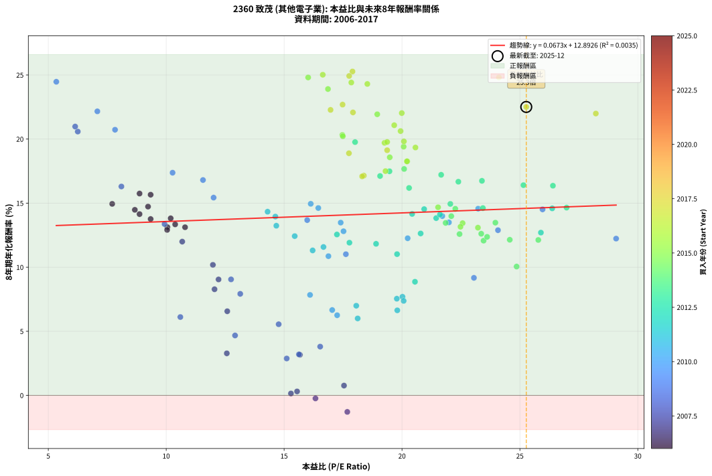
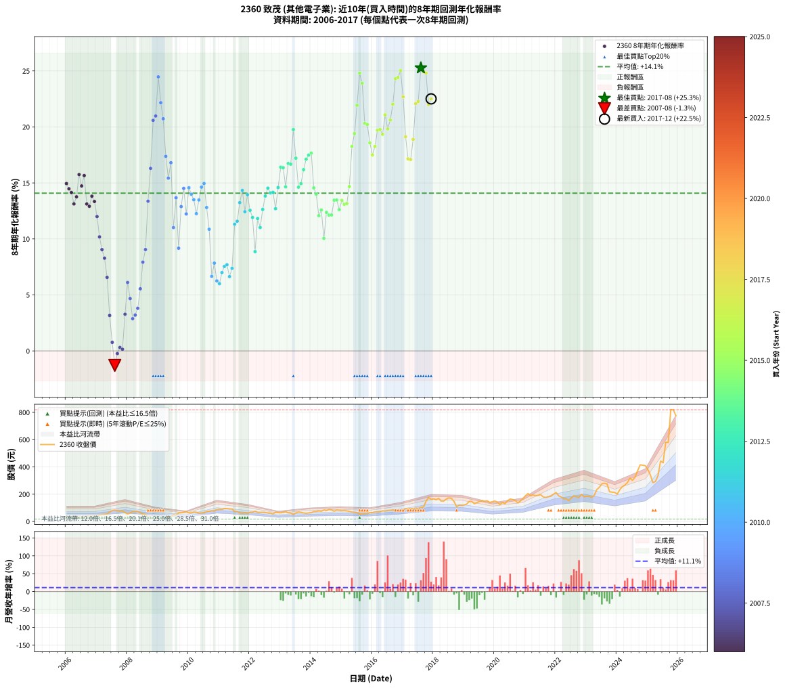

# 2360 致茂 - 本益比與未來報酬率分析

!!! info "報告資訊"
    - **股票代號**: 2360
    - **公司名稱**: 致茂
    - **產業別**: 其他電子業
    - **分析期間**: 2006-2017 (144 個數據點)
    - **資料來源**: Type 12 (ShowMonthlyK_ChartFlow) 月收盤價與本益比
    - **報酬率口徑**: 含現金股利 (簡化: 年度合計，假設每年7/1入帳)
    - **報告生成時間**: 2026-01-07 18:33:02 CST

## 📈 視覺化圖表

### 圖表1: 本益比 vs 未來報酬率關係

*圖表1：2360 致茂 本益比與8年期未來報酬率關係 (2006-2017)*

### 圖表2: 歷年買入時點的8年期實際報酬率

*圖表2：2360 致茂 歷年買入時點的8年期實際報酬率 (2006-2017)*

## 📍 買點訊號說明

本報告提供兩種買點提示訊號（顯示於圖表2的股價子圖中）：

### ▲ 小綠色三角形（回測驗證）
- **計算方式**: 使用全部歷史資料計算本益比第25百分位數
- **用途**: 事後驗證，顯示歷史上哪些時點確實為低估區
- **限制**: 當下無法判斷，僅供回測參考
- **特性**: 後見之明（Look-Ahead Bias）

### ▲ 小橘色三角形（即時訊號）
- **計算方式**: 使用截至當月的過去5年資料計算本益比第25百分位數
- **用途**: 實際投資決策，當時即可判斷
- **優勢**: 可操作性強，符合實務需求
- **特性**: 無後見之明，滾動窗口計算

!!! tip "如何使用兩種訊號"
    - **綠色▲** 幫助理解歷史估值機會，驗證策略有效性
    - **橘色▲** 可作為實際買進參考，但仍需搭配基本面分析
    - 兩種訊號重疊時，表示即時判斷與事後驗證一致，信心度較高
    - 僅有綠色▲時，表示當時無法判斷（需要未來資料才能確認）
    - 僅有橘色▲時，表示即時判斷為買點，但事後可能不是最佳時機

## 📊 估值分析摘要

| 指標 | 數值 |
|:---:|:---:|
| **目前本益比** (2017-12) | **25.27 倍** |
| **歷史平均本益比** | 17.71 倍 |
| **估值水準** | 🔴 相對高估 |
| **預期8年年化報酬率** | **+14.59%** |
| **歷史平均報酬率** | +14.08% |
| **相關係數 (R²)** | 0.0035 |
| **趨勢線斜率** | 0.0673 |

!!! abstract "核心洞察"
    目前本益比顯著高於歷史平均，預期未來報酬率可能較低

    根據歷史數據回測，2360 致茂 在目前本益比 **25.3倍** 的估值水準下，
    預期未來8年年化報酬率約為 **+14.6%**。

    **重要提醒**: 本分析基於歷史數據統計，實際報酬率會受到公司基本面變化、產業趨勢、
    總體經濟環境等多重因素影響。R² = 0.00 表示本益比可解釋約 0.4% 的報酬率變異。

## 📈 歷史估值統計

### 最佳買點 (最高報酬率)

| 項目 | 數值 |
|:---:|:---:|
| 起始時間 | 2017-08 |
| 當時本益比 | 17.90 倍 |
| 起始價格 | 103.5 元 |
| 8年後價格 | 581.0 元 |
| **8年年化報酬率** | **+25.27%** |

### 最差買點 (最低報酬率)

| 項目 | 數值 |
|:---:|:---:|
| 起始時間 | 2007-08 |
| 當時本益比 | 17.68 倍 |
| 起始價格 | 83.0 元 |
| 8年後價格 | 53.8 元 |
| **8年年化報酬率** | **-1.29%** |

## 🎯 投資啟示

### 本益比與報酬率關係

趨勢線方程式: **y = 0.0673x + 12.8926**

!!! info "弱相關或正相關"
    本益比與未來報酬率相關性較弱。這可能表示該股票的報酬率更多受到
    公司成長性、產業趨勢等因素影響，而非估值水準。**需綜合考量多項指標**。

### 估值區間建議

基於歷史數據分析:

- **🟢 低估區** (P/E < 14.2): 預期報酬率較高，可考慮增加持股
- **🟡 合理區** (P/E 14.2-21.3): 預期報酬率符合長期趨勢，正常持有
- **🔴 高估區** (P/E > 21.3): 預期報酬率較低，可考慮減碼或觀望

!!! danger "風險提示"
    - 過去表現不代表未來結果
    - 本分析假設公司基本面無重大結構性變化
    - 產業環境劇變可能使歷史規律失效
    - 應結合公司財報、產業趨勢、總體經濟等多重因素綜合判斷

!!! success "長期投資觀點"
    歷史數據顯示，在合理或低估的估值水準買入並長期持有，
    往往能獲得較佳的投資報酬。**耐心等待好價格**是價值投資的核心原則。

## 📊 數據品質

- **資料來源**: GoodInfo.tw Type 12 (ShowMonthlyK_ChartFlow)
- **資料頻率**: 月度收盤價與本益比
- **回測期間**: 2006-2017
- **數據點數量**: 144 個 (每個點代表一次8年期回測)

### 計算方法說明

1. **8年期年化報酬率**:
   - 對每個歷史時點，計算其後8年的實際投資報酬率
   - 期末價值(不含股利): 期末價格
   - 期末價值(含現金股利): 期末價格 + 持有期間內的現金股利合計 (簡化: 年度合計，假設每年7/1入帳)
   - 公式: 年化報酬率 = [(期末價值/期初價格)^(1/年數) - 1] × 100%

2. **本益比 (P/E Ratio)**:
   - 使用當時的月收盤價與EPS計算
   - 資料來源: Type 12 月度河流圖本益比數據

3. **趨勢線 (Linear Regression)**:
   - 使用最小平方法擬合線性趨勢線
   - R²值衡量本益比對報酬率的解釋能力

---

*本報告由 Stock Analysis System v1.9.0 自動生成*
*數據更新時間: 2026-01-07 18:33:02 CST*

## 📋 月度回測明細表

（每一列對應時間線圖中的一個買入點；可用來對照 SVG 圖上的每個點。）

| 買入月份 | 賣出月份 | 回測期限_年 | 實際持有年數 | 買入本益比_倍 | 買入收盤價_元 | 賣出收盤價_元 | 現金股利合計_元 | 總報酬率_pct | 年化報酬率_pct |
| --- | --- | --- | --- | --- | --- | --- | --- | --- | --- |
| 2006-01 | 2014-01 | 8 | 8.000 | 7.71 | 28.05 | 65.00 | 20.47 | +204.69 | +14.94 |
| 2006-02 | 2014-02 | 8 | 8.000 | 8.67 | 31.55 | 72.60 | 20.47 | +194.98 | +14.48 |
| 2006-03 | 2014-03 | 8 | 8.000 | 8.87 | 32.30 | 72.60 | 20.47 | +188.13 | +14.14 |
| 2006-04 | 2014-04 | 8 | 8.000 | 10.05 | 36.60 | 77.70 | 20.47 | +168.21 | +13.13 |
| 2006-05 | 2014-05 | 8 | 8.000 | 9.34 | 34.00 | 74.90 | 20.47 | +180.49 | +13.76 |
| 2006-06 | 2014-06 | 8 | 8.000 | 8.87 | 32.30 | 83.60 | 20.47 | +222.18 | +15.75 |
| 2006-07 | 2014-07 | 8 | 8.000 | 9.23 | 33.60 | 80.00 | 20.86 | +200.17 | +14.73 |
| 2006-08 | 2014-08 | 8 | 8.000 | 9.34 | 34.00 | 88.00 | 20.86 | +220.17 | +15.66 |
| 2006-09 | 2014-09 | 8 | 8.000 | 10.80 | 39.30 | 84.50 | 20.86 | +168.09 | +13.12 |
| 2006-10 | 2014-10 | 8 | 8.000 | 10.04 | 36.55 | 75.70 | 20.86 | +164.18 | +12.91 |
| 2006-11 | 2014-11 | 8 | 8.000 | 10.19 | 37.10 | 83.60 | 20.86 | +181.56 | +13.81 |
| 2006-12 | 2014-12 | 8 | 8.000 | 10.38 | 37.80 | 82.10 | 20.86 | +172.38 | +13.34 |
| 2007-01 | 2015-01 | 8 | 8.000 | 10.68 | 40.30 | 78.90 | 20.86 | +147.54 | +12.00 |
| 2007-02 | 2015-02 | 8 | 8.000 | 11.98 | 46.75 | 80.70 | 20.86 | +117.24 | +10.18 |
| 2007-03 | 2015-03 | 8 | 8.000 | 12.22 | 49.30 | 77.70 | 20.86 | +99.91 | +9.04 |
| 2007-04 | 2015-04 | 8 | 8.000 | 12.05 | 50.20 | 74.00 | 20.86 | +88.96 | +8.28 |
| 2007-05 | 2015-05 | 8 | 8.000 | 12.59 | 54.10 | 69.10 | 20.86 | +66.28 | +6.56 |
| 2007-06 | 2015-06 | 8 | 8.000 | 15.67 | 69.40 | 68.20 | 20.86 | +28.33 | +3.17 |
| 2007-07 | 2015-07 | 8 | 8.000 | 17.54 | 80.00 | 64.00 | 21.01 | +6.27 | +0.76 |
| 2007-08 | 2015-08 | 8 | 8.000 | 17.68 | 83.00 | 53.80 | 21.01 | -9.87 | -1.29 |
| 2007-09 | 2015-09 | 8 | 8.000 | 16.33 | 78.80 | 56.30 | 21.01 | -1.89 | -0.24 |
| 2007-10 | 2015-10 | 8 | 8.000 | 15.55 | 77.10 | 58.00 | 21.01 | +2.48 | +0.31 |
| 2007-11 | 2015-11 | 8 | 8.000 | 15.29 | 77.80 | 57.70 | 21.01 | +1.17 | +0.15 |
| 2007-12 | 2015-12 | 8 | 8.000 | 12.57 | 65.60 | 63.90 | 21.01 | +29.44 | +3.28 |
| 2008-01 | 2016-01 | 8 | 8.000 | 10.60 | 53.70 | 65.30 | 21.01 | +60.73 | +6.11 |
| 2008-02 | 2016-02 | 8 | 8.000 | 12.92 | 63.50 | 70.50 | 21.01 | +44.11 | +4.67 |
| 2008-03 | 2016-03 | 8 | 8.000 | 15.11 | 71.90 | 69.20 | 21.01 | +25.47 | +2.88 |
| 2008-04 | 2016-04 | 8 | 8.000 | 15.63 | 72.00 | 71.60 | 21.01 | +28.63 | +3.20 |
| 2008-05 | 2016-05 | 8 | 8.000 | 16.53 | 73.60 | 78.20 | 21.01 | +34.80 | +3.80 |
| 2008-06 | 2016-06 | 8 | 8.000 | 14.77 | 63.50 | 76.80 | 21.01 | +54.03 | +5.55 |
| 2008-07 | 2016-07 | 8 | 8.000 | 13.14 | 54.50 | 80.50 | 19.79 | +84.02 | +7.92 |
| 2008-08 | 2016-08 | 8 | 8.000 | 12.75 | 50.90 | 82.00 | 19.79 | +99.98 | +9.05 |
| 2008-09 | 2016-09 | 8 | 8.000 | 9.93 | 38.15 | 84.30 | 19.79 | +172.85 | +13.37 |
| 2008-10 | 2016-10 | 8 | 8.000 | 8.10 | 29.85 | 80.10 | 19.79 | +234.65 | +16.30 |
| 2008-11 | 2016-11 | 8 | 8.000 | 6.25 | 22.10 | 79.00 | 19.79 | +347.02 | +20.58 |
| 2008-12 | 2016-12 | 8 | 8.000 | 6.14 | 20.75 | 75.40 | 19.79 | +358.76 | +20.98 |
| 2009-01 | 2017-01 | 8 | 8.000 | 5.34 | 17.65 | 81.90 | 19.79 | +476.16 | +24.47 |
| 2009-02 | 2017-02 | 8 | 8.000 | 7.08 | 22.90 | 93.80 | 19.79 | +396.03 | +22.16 |
| 2009-03 | 2017-03 | 8 | 8.000 | 7.83 | 24.75 | 91.90 | 19.79 | +351.28 | +20.73 |
| 2009-04 | 2017-04 | 8 | 8.000 | 10.27 | 31.70 | 94.40 | 19.79 | +260.23 | +17.37 |
| 2009-05 | 2017-05 | 8 | 8.000 | 12.01 | 36.20 | 94.30 | 19.79 | +215.17 | +15.43 |
| 2009-06 | 2017-06 | 8 | 8.000 | 11.56 | 34.00 | 98.00 | 19.79 | +246.45 | +16.80 |
| 2009-07 | 2017-07 | 8 | 8.000 | 17.62 | 50.50 | 95.50 | 21.00 | +130.70 | +11.01 |
| 2009-08 | 2017-08 | 8 | 8.000 | 15.98 | 44.65 | 103.50 | 21.00 | +178.84 | +13.68 |
| 2009-09 | 2017-09 | 8 | 8.000 | 23.05 | 62.70 | 105.50 | 21.00 | +101.76 | +9.17 |
| 2009-10 | 2017-10 | 8 | 8.000 | 24.07 | 63.70 | 147.00 | 21.00 | +163.74 | +12.89 |
| 2009-11 | 2017-11 | 8 | 8.000 | 25.96 | 66.80 | 176.50 | 21.00 | +195.66 | +14.51 |
| 2009-12 | 2017-12 | 8 | 8.000 | 29.08 | 72.70 | 162.00 | 21.00 | +151.72 | +12.23 |
| 2010-01 | 2018-01 | 8 | 8.000 | 23.23 | 63.00 | 166.00 | 21.00 | +196.83 | +14.57 |
| 2010-02 | 2018-02 | 8 | 8.000 | 21.71 | 63.50 | 160.00 | 21.00 | +185.04 | +13.99 |
| 2010-03 | 2018-03 | 8 | 8.000 | 21.99 | 69.00 | 169.00 | 21.00 | +175.36 | +13.50 |
| 2010-04 | 2018-04 | 8 | 8.000 | 20.24 | 67.80 | 150.00 | 21.00 | +152.21 | +12.26 |
| 2010-05 | 2018-05 | 8 | 8.000 | 17.40 | 62.00 | 149.50 | 21.00 | +175.00 | +13.48 |
| 2010-06 | 2018-06 | 8 | 8.000 | 16.45 | 62.10 | 164.00 | 21.00 | +197.91 | +14.62 |
| 2010-07 | 2018-07 | 8 | 8.000 | 16.13 | 64.30 | 172.50 | 23.48 | +204.78 | +14.95 |
| 2010-08 | 2018-08 | 8 | 8.000 | 17.52 | 73.60 | 169.50 | 23.48 | +162.20 | +12.80 |
| 2010-09 | 2018-09 | 8 | 8.000 | 16.88 | 74.50 | 146.50 | 23.48 | +128.16 | +10.86 |
| 2010-10 | 2018-10 | 8 | 8.000 | 17.04 | 78.80 | 108.50 | 23.48 | +67.48 | +6.66 |
| 2010-11 | 2018-11 | 8 | 8.000 | 16.10 | 77.90 | 119.00 | 23.48 | +82.90 | +7.84 |
| 2010-12 | 2018-12 | 8 | 8.000 | 17.25 | 87.10 | 118.00 | 23.48 | +62.43 | +6.25 |
| 2011-01 | 2019-01 | 8 | 8.000 | 18.12 | 90.00 | 120.00 | 23.48 | +59.42 | +6.00 |
| 2011-02 | 2019-02 | 8 | 8.000 | 18.06 | 88.20 | 128.00 | 23.48 | +71.74 | +6.99 |
| 2011-03 | 2019-03 | 8 | 8.000 | 19.78 | 95.00 | 146.50 | 23.48 | +78.92 | +7.54 |
| 2011-04 | 2019-04 | 8 | 8.000 | 20.02 | 94.50 | 147.50 | 23.48 | +80.93 | +7.69 |
| 2011-05 | 2019-05 | 8 | 8.000 | 19.80 | 91.80 | 130.00 | 23.48 | +67.19 | +6.63 |
| 2011-06 | 2019-06 | 8 | 8.000 | 20.07 | 91.40 | 138.00 | 23.48 | +76.67 | +7.37 |
| 2011-07 | 2019-07 | 8 | 8.000 | 16.21 | 72.50 | 147.00 | 23.85 | +135.66 | +11.31 |
| 2011-08 | 2019-08 | 8 | 8.000 | 16.67 | 73.20 | 152.00 | 23.85 | +140.24 | +11.58 |
| 2011-09 | 2019-09 | 8 | 8.000 | 14.67 | 63.20 | 147.00 | 23.85 | +170.34 | +13.24 |
| 2011-10 | 2019-10 | 8 | 8.000 | 14.30 | 60.40 | 152.50 | 23.85 | +191.98 | +14.33 |
| 2011-11 | 2019-11 | 8 | 8.000 | 15.45 | 64.00 | 139.50 | 23.85 | +155.24 | +12.43 |
| 2011-12 | 2019-12 | 8 | 8.000 | 14.63 | 59.40 | 145.00 | 23.85 | +184.27 | +13.95 |
| 2012-01 | 2020-01 | 8 | 8.000 | 17.24 | 67.70 | 150.50 | 23.85 | +157.54 | +12.55 |
| 2012-02 | 2020-02 | 8 | 8.000 | 17.77 | 67.40 | 142.00 | 23.85 | +146.07 | +11.91 |
| 2012-03 | 2020-03 | 8 | 8.000 | 20.55 | 75.20 | 124.50 | 23.85 | +97.28 | +8.86 |
| 2012-04 | 2020-04 | 8 | 8.000 | 18.90 | 66.60 | 139.00 | 23.85 | +144.53 | +11.83 |
| 2012-05 | 2020-05 | 8 | 8.000 | 19.79 | 67.10 | 131.00 | 23.85 | +130.78 | +11.02 |
| 2012-06 | 2020-06 | 8 | 8.000 | 20.79 | 67.70 | 151.50 | 23.85 | +159.02 | +12.63 |
| 2012-07 | 2020-07 | 8 | 8.000 | 21.45 | 67.00 | 164.50 | 24.36 | +181.88 | +13.83 |
| 2012-08 | 2020-08 | 8 | 8.000 | 20.94 | 62.60 | 161.00 | 24.36 | +196.10 | +14.53 |
| 2012-09 | 2020-09 | 8 | 8.000 | 21.61 | 61.70 | 153.00 | 24.36 | +187.46 | +14.11 |
| 2012-10 | 2020-10 | 8 | 8.000 | 20.43 | 55.60 | 136.00 | 24.36 | +188.42 | +14.16 |
| 2012-11 | 2020-11 | 8 | 8.000 | 25.89 | 67.00 | 150.00 | 24.36 | +160.24 | +12.70 |
| 2012-12 | 2020-12 | 8 | 8.000 | 26.37 | 64.70 | 168.00 | 24.36 | +197.31 | +14.59 |
| 2013-01 | 2021-01 | 8 | 8.000 | 25.15 | 63.30 | 189.00 | 24.36 | +237.06 | +16.40 |
| 2013-02 | 2021-02 | 8 | 8.000 | 26.40 | 68.10 | 204.50 | 24.36 | +236.07 | +16.36 |
| 2013-03 | 2021-03 | 8 | 8.000 | 26.98 | 71.30 | 188.50 | 24.36 | +198.54 | +14.65 |
| 2013-04 | 2021-04 | 8 | 8.000 | 23.39 | 63.30 | 194.00 | 24.36 | +244.96 | +16.74 |
| 2013-05 | 2021-05 | 8 | 8.000 | 22.39 | 62.00 | 188.50 | 24.36 | +243.32 | +16.67 |
| 2013-06 | 2021-06 | 8 | 8.000 | 18.01 | 51.00 | 191.50 | 24.36 | +323.26 | +19.76 |
| 2013-07 | 2021-07 | 8 | 8.000 | 21.66 | 62.70 | 196.50 | 26.86 | +256.24 | +17.21 |
| 2013-08 | 2021-08 | 8 | 8.000 | 23.43 | 69.30 | 179.50 | 26.86 | +197.78 | +14.61 |
| 2013-09 | 2021-09 | 8 | 8.000 | 22.05 | 66.60 | 176.00 | 26.86 | +204.60 | +14.94 |
| 2013-10 | 2021-10 | 8 | 8.000 | 20.30 | 62.60 | 181.00 | 26.86 | +232.05 | +16.18 |
| 2013-11 | 2021-11 | 8 | 8.000 | 19.07 | 60.00 | 185.50 | 26.86 | +253.93 | +17.12 |
| 2013-12 | 2021-12 | 8 | 8.000 | 19.47 | 62.50 | 200.00 | 26.86 | +262.98 | +17.49 |
| 2014-01 | 2022-01 | 8 | 8.000 | 20.09 | 65.00 | 212.00 | 26.86 | +267.48 | +17.67 |
| 2014-02 | 2022-02 | 8 | 8.000 | 22.26 | 72.60 | 188.50 | 26.86 | +196.64 | +14.56 |
| 2014-03 | 2022-03 | 8 | 8.000 | 22.09 | 72.60 | 180.00 | 26.86 | +184.93 | +13.98 |
| 2014-04 | 2022-04 | 8 | 8.000 | 23.46 | 77.70 | 166.50 | 26.86 | +148.86 | +12.07 |
| 2014-05 | 2022-05 | 8 | 8.000 | 22.44 | 74.90 | 166.50 | 26.86 | +158.16 | +12.59 |
| 2014-06 | 2022-06 | 8 | 8.000 | 24.86 | 83.60 | 153.00 | 26.86 | +115.14 | +10.05 |
| 2014-07 | 2022-07 | 8 | 8.000 | 23.61 | 80.00 | 172.00 | 31.34 | +154.18 | +12.37 |
| 2014-08 | 2022-08 | 8 | 8.000 | 25.78 | 88.00 | 188.50 | 31.34 | +149.82 | +12.13 |
| 2014-09 | 2022-09 | 8 | 8.000 | 24.57 | 84.50 | 180.00 | 31.34 | +150.11 | +12.14 |
| 2014-10 | 2022-10 | 8 | 8.000 | 21.85 | 75.70 | 176.50 | 31.34 | +174.56 | +13.46 |
| 2014-11 | 2022-11 | 8 | 8.000 | 23.96 | 83.60 | 198.50 | 31.34 | +174.93 | +13.48 |
| 2014-12 | 2022-12 | 8 | 8.000 | 23.36 | 82.10 | 181.00 | 31.34 | +158.64 | +12.61 |
| 2015-01 | 2023-01 | 8 | 8.000 | 22.57 | 78.90 | 185.00 | 31.34 | +174.20 | +13.44 |
| 2015-02 | 2023-02 | 8 | 8.000 | 23.22 | 80.70 | 184.50 | 31.34 | +167.46 | +13.09 |
| 2015-03 | 2023-03 | 8 | 8.000 | 22.48 | 77.70 | 177.50 | 31.34 | +168.78 | +13.16 |
| 2015-04 | 2023-04 | 8 | 8.000 | 21.53 | 74.00 | 190.00 | 31.34 | +199.11 | +14.68 |
| 2015-05 | 2023-05 | 8 | 8.000 | 20.22 | 69.10 | 233.00 | 31.34 | +282.55 | +18.26 |
| 2015-06 | 2023-06 | 8 | 8.000 | 20.07 | 68.20 | 250.50 | 31.34 | +313.26 | +19.41 |
| 2015-07 | 2023-07 | 8 | 8.000 | 18.95 | 64.00 | 276.00 | 36.74 | +388.65 | +21.93 |
| 2015-08 | 2023-08 | 8 | 8.000 | 16.02 | 53.80 | 280.00 | 36.74 | +488.73 | +24.81 |
| 2015-09 | 2023-09 | 8 | 8.000 | 16.86 | 56.30 | 276.00 | 36.74 | +455.48 | +23.90 |
| 2015-10 | 2023-10 | 8 | 8.000 | 17.47 | 58.00 | 218.00 | 36.74 | +339.20 | +20.32 |
| 2015-11 | 2023-11 | 8 | 8.000 | 17.49 | 57.70 | 215.00 | 36.74 | +336.28 | +20.22 |
| 2015-12 | 2023-12 | 8 | 8.000 | 19.48 | 63.90 | 213.00 | 36.74 | +290.82 | +18.58 |
| 2016-01 | 2024-01 | 8 | 8.000 | 19.30 | 65.30 | 200.50 | 36.74 | +263.30 | +17.50 |
| 2016-02 | 2024-02 | 8 | 8.000 | 20.21 | 70.50 | 233.00 | 36.74 | +282.60 | +18.26 |
| 2016-03 | 2024-03 | 8 | 8.000 | 19.26 | 69.20 | 255.00 | 36.74 | +321.58 | +19.70 |
| 2016-04 | 2024-04 | 8 | 8.000 | 19.37 | 71.60 | 266.50 | 36.74 | +323.51 | +19.77 |
| 2016-05 | 2024-05 | 8 | 8.000 | 20.57 | 78.20 | 285.00 | 36.74 | +311.43 | +19.34 |
| 2016-06 | 2024-06 | 8 | 8.000 | 19.67 | 76.80 | 318.00 | 36.74 | +361.90 | +21.08 |
| 2016-07 | 2024-07 | 8 | 8.000 | 20.08 | 80.50 | 301.00 | 40.96 | +324.80 | +19.82 |
| 2016-08 | 2024-08 | 8 | 8.000 | 19.94 | 82.00 | 326.50 | 40.96 | +348.13 | +20.62 |
| 2016-09 | 2024-09 | 8 | 8.000 | 19.99 | 84.30 | 373.50 | 40.96 | +391.65 | +22.03 |
| 2016-10 | 2024-10 | 8 | 8.000 | 18.53 | 80.10 | 415.50 | 40.96 | +469.87 | +24.30 |
| 2016-11 | 2024-11 | 8 | 8.000 | 17.85 | 79.00 | 412.50 | 40.96 | +474.00 | +24.41 |
| 2016-12 | 2024-12 | 8 | 8.000 | 16.64 | 75.40 | 409.00 | 40.96 | +496.77 | +25.02 |
| 2017-01 | 2025-01 | 8 | 8.000 | 17.48 | 81.90 | 379.50 | 40.96 | +413.39 | +22.69 |
| 2017-02 | 2025-02 | 8 | 8.000 | 19.37 | 93.80 | 339.50 | 40.96 | +305.61 | +19.13 |
| 2017-03 | 2025-03 | 8 | 8.000 | 18.38 | 91.90 | 285.00 | 40.96 | +254.69 | +17.15 |
| 2017-04 | 2025-04 | 8 | 8.000 | 18.31 | 94.40 | 292.50 | 40.96 | +253.24 | +17.09 |
| 2017-05 | 2025-05 | 8 | 8.000 | 17.75 | 94.30 | 335.50 | 40.96 | +299.22 | +18.89 |
| 2017-06 | 2025-06 | 8 | 8.000 | 17.92 | 98.00 | 442.50 | 40.96 | +393.33 | +22.08 |
| 2017-07 | 2025-07 | 8 | 8.000 | 16.97 | 95.50 | 430.50 | 46.74 | +399.73 | +22.28 |
| 2017-08 | 2025-08 | 8 | 8.000 | 17.90 | 103.50 | 581.00 | 46.74 | +506.51 | +25.27 |
| 2017-09 | 2025-09 | 8 | 8.000 | 17.76 | 105.50 | 579.00 | 46.74 | +493.12 | +24.92 |
| 2017-10 | 2025-10 | 8 | 8.000 | 24.11 | 147.00 | 819.00 | 46.74 | +488.94 | +24.81 |
| 2017-11 | 2025-11 | 8 | 8.000 | 28.22 | 176.50 | 819.00 | 46.74 | +390.51 | +21.99 |
| 2017-12 | 2025-12 | 8 | 8.000 | 25.27 | 162.00 | 775.00 | 46.74 | +407.25 | +22.50 |
