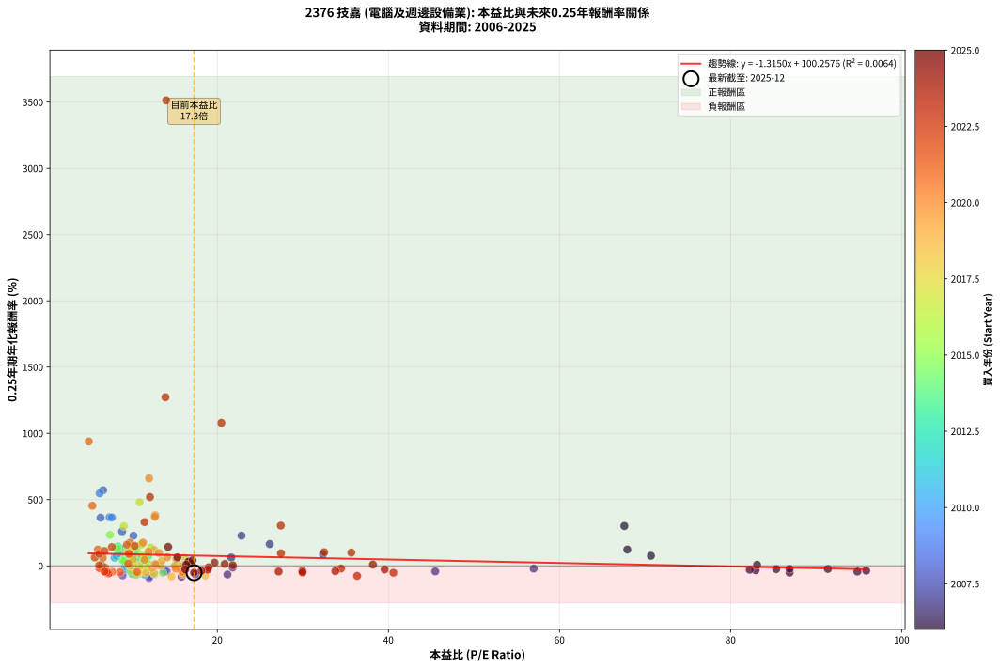

# 2376 技嘉 - 本益比與未來報酬率分析

!!! info "報告資訊"
    - **股票代號**: 2376
    - **公司名稱**: 技嘉
    - **產業別**: 電腦及週邊設備業
    - **分析期間**: 2006-2025 (237 個數據點)
    - **資料來源**: Type 12 (ShowMonthlyK_ChartFlow) 月收盤價與本益比
    - **報酬率口徑**: 含現金股利 (簡化: 年度合計，假設每年7/1入帳)
    - **報告生成時間**: 2026-01-10 18:31:38 CST

## 📈 視覺化圖表

### 圖表1: 本益比 vs 未來報酬率關係

*圖表1：2376 技嘉 本益比與0.25年期未來報酬率關係 (2006-2025)*

### 圖表2: 歷年買入時點的0.25年期實際報酬率

*圖表2：2376 技嘉 歷年買入時點的0.25年期實際報酬率 (2006-2025)*

## 📍 買點訊號說明

本報告提供兩種買點提示訊號（顯示於圖表2的股價子圖中）：

### ▲ 小綠色三角形（回測驗證）
- **計算方式**: 使用全部歷史資料計算本益比第25百分位數
- **用途**: 事後驗證，顯示歷史上哪些時點確實為低估區
- **限制**: 當下無法判斷，僅供回測參考
- **特性**: 後見之明（Look-Ahead Bias）

### ▲ 小橘色三角形（即時訊號）
- **計算方式**: 使用截至當月的過去5年資料計算本益比第25百分位數
- **用途**: 實際投資決策，當時即可判斷
- **優勢**: 可操作性強，符合實務需求
- **特性**: 無後見之明，滾動窗口計算

!!! tip "如何使用兩種訊號"
    - **綠色▲** 幫助理解歷史估值機會，驗證策略有效性
    - **橘色▲** 可作為實際買進參考，但仍需搭配基本面分析
    - 兩種訊號重疊時，表示即時判斷與事後驗證一致，信心度較高
    - 僅有綠色▲時，表示當時無法判斷（需要未來資料才能確認）
    - 僅有橘色▲時，表示即時判斷為買點，但事後可能不是最佳時機

## 📊 估值分析摘要

| 指標 | 數值 |
|:---:|:---:|
| **目前本益比** (2025-09) | **17.28 倍** |
| **歷史平均本益比** | 16.70 倍 |
| **估值水準** | 🟡 合理範圍 |
| **預期0.25年年化報酬率** | **+77.53%** |
| **歷史平均報酬率** | +78.29% |
| **相關係數 (R²)** | 0.0064 |
| **趨勢線斜率** | -1.3150 |

!!! abstract "核心洞察"
    目前本益比接近歷史平均，預期報酬率符合長期趨勢

    根據歷史數據回測，2376 技嘉 在目前本益比 **17.3倍** 的估值水準下，
    預期未來0.25年年化報酬率約為 **+77.5%**。

    **重要提醒**: 本分析基於歷史數據統計，實際報酬率會受到公司基本面變化、產業趨勢、
    總體經濟環境等多重因素影響。R² = 0.01 表示本益比可解釋約 0.6% 的報酬率變異。

## 📈 歷史估值統計

### 最佳買點 (最高報酬率)

| 項目 | 數值 |
|:---:|:---:|
| 起始時間 | 2023-04 |
| 當時本益比 | 14.02 倍 |
| 起始價格 | 131.0 元 |
| 0.25年後價格 | 314.0 元 |
| **0.25年年化報酬率** | **+3513.53%** |

### 最差買點 (最低報酬率)

| 項目 | 數值 |
|:---:|:---:|
| 起始時間 | 2008-07 |
| 當時本益比 | 12.02 倍 |
| 起始價格 | 22.2 元 |
| 0.25年後價格 | 11.7 元 |
| **0.25年年化報酬率** | **-92.21%** |

## 🎯 投資啟示

### 本益比與報酬率關係

趨勢線方程式: **y = -1.3150x + 100.2576**

!!! warning "強負相關"
    本益比與未來報酬率呈現強負相關。在高本益比時期買入，未來報酬率顯著較低；
    在低本益比時期買入，未來報酬率顯著較高。**估值紀律至關重要**。

### 估值區間建議

基於歷史數據分析:

- **🟢 低估區** (P/E < 13.4): 預期報酬率較高，可考慮增加持股
- **🟡 合理區** (P/E 13.4-20.0): 預期報酬率符合長期趨勢，正常持有
- **🔴 高估區** (P/E > 20.0): 預期報酬率較低，可考慮減碼或觀望

!!! danger "風險提示"
    - 過去表現不代表未來結果
    - 本分析假設公司基本面無重大結構性變化
    - 產業環境劇變可能使歷史規律失效
    - 應結合公司財報、產業趨勢、總體經濟等多重因素綜合判斷

!!! success "長期投資觀點"
    歷史數據顯示，在合理或低估的估值水準買入並長期持有，
    往往能獲得較佳的投資報酬。**耐心等待好價格**是價值投資的核心原則。

## 📊 數據品質

- **資料來源**: GoodInfo.tw Type 12 (ShowMonthlyK_ChartFlow)
- **資料頻率**: 月度收盤價與本益比
- **回測期間**: 2006-2025
- **數據點數量**: 237 個 (每個點代表一次0.25年期回測)

### 計算方法說明

1. **0.25年期年化報酬率**:
   - 對每個歷史時點，計算其後0.25年的實際投資報酬率
   - 期末價值(不含股利): 期末價格
   - 期末價值(含現金股利): 期末價格 + 持有期間內的現金股利合計 (簡化: 年度合計，假設每年7/1入帳)
   - 公式: 年化報酬率 = [(期末價值/期初價格)^(1/年數) - 1] × 100%

2. **本益比 (P/E Ratio)**:
   - 使用當時的月收盤價與EPS計算
   - 資料來源: Type 12 月度河流圖本益比數據

3. **趨勢線 (Linear Regression)**:
   - 使用最小平方法擬合線性趨勢線
   - R²值衡量本益比對報酬率的解釋能力

---

*本報告由 Stock Analysis System v1.9.0 自動生成*
*數據更新時間: 2026-01-10 18:31:38 CST*

## 📋 月度回測明細表

（每一列對應時間線圖中的一個買入點；可用來對照 SVG 圖上的每個點。）

| 買入月份 | 賣出月份 | 回測期限_年 | 實際持有年數 | 買入本益比_倍 | 買入收盤價_元 | 賣出收盤價_元 | 現金股利合計_元 | 總報酬率_pct | 年化報酬率_pct |
| --- | --- | --- | --- | --- | --- | --- | --- | --- | --- |
| 2006-01 | 2006-05 | 0.25 | 0.329 | 95.86 | 27.80 | 23.85 | 0.00 | -14.21 | -37.28 |
| 2006-02 | 2006-05 | 0.25 | 0.246 | 94.83 | 27.50 | 23.85 | 0.00 | -13.27 | -43.89 |
| 2006-03 | 2006-07 | 0.25 | 0.334 | 82.93 | 24.05 | 19.70 | 1.30 | -12.68 | -33.37 |
| 2006-04 | 2006-07 | 0.25 | 0.249 | 86.90 | 25.20 | 19.70 | 1.30 | -16.67 | -51.90 |
| 2006-05 | 2006-08 | 0.25 | 0.252 | 82.24 | 23.85 | 20.50 | 1.30 | -8.60 | -30.01 |
| 2006-06 | 2006-09 | 0.25 | 0.252 | 67.59 | 19.60 | 26.50 | 1.30 | +41.84 | +300.51 |
| 2006-07 | 2006-10 | 0.25 | 0.252 | 67.93 | 19.70 | 24.10 | 0.00 | +22.34 | +122.63 |
| 2006-08 | 2006-12 | 0.25 | 0.334 | 70.69 | 20.50 | 24.75 | 0.00 | +20.73 | +75.78 |
| 2006-09 | 2006-12 | 0.25 | 0.249 | 91.38 | 26.50 | 24.75 | 0.00 | -6.60 | -23.98 |
| 2006-10 | 2007-01 | 0.25 | 0.252 | 83.10 | 24.10 | 24.55 | 0.00 | +1.87 | +7.62 |
| 2006-11 | 2007-03 | 0.25 | 0.329 | 86.90 | 25.20 | 23.05 | 0.00 | -8.53 | -23.77 |
| 2006-12 | 2007-03 | 0.25 | 0.246 | 85.34 | 24.75 | 23.05 | 0.00 | -6.87 | -25.08 |
| 2007-01 | 2007-05 | 0.25 | 0.329 | 56.98 | 24.55 | 22.70 | 0.00 | -7.54 | -21.22 |
| 2007-02 | 2007-05 | 0.25 | 0.246 | 45.48 | 26.00 | 22.70 | 0.00 | -12.69 | -42.35 |
| 2007-03 | 2007-07 | 0.25 | 0.334 | 32.35 | 23.05 | 27.80 | 0.60 | +23.21 | +86.80 |
| 2007-04 | 2007-07 | 0.25 | 0.249 | 26.13 | 22.30 | 27.80 | 0.60 | +27.35 | +163.93 |
| 2007-05 | 2007-08 | 0.25 | 0.252 | 22.83 | 22.70 | 30.00 | 0.60 | +34.80 | +227.27 |
| 2007-06 | 2007-09 | 0.25 | 0.252 | 21.63 | 24.55 | 27.15 | 0.60 | +13.03 | +62.65 |
| 2007-07 | 2007-10 | 0.25 | 0.252 | 21.79 | 27.80 | 26.85 | 0.00 | -3.42 | -12.89 |
| 2007-08 | 2007-12 | 0.25 | 0.334 | 21.18 | 30.00 | 20.95 | 0.00 | -30.17 | -65.87 |
| 2007-09 | 2007-12 | 0.25 | 0.249 | 17.43 | 27.15 | 20.95 | 0.00 | -22.84 | -64.67 |
| 2007-10 | 2008-01 | 0.25 | 0.252 | 15.81 | 26.85 | 17.40 | 0.00 | -35.20 | -82.13 |
| 2007-11 | 2008-03 | 0.25 | 0.331 | 11.45 | 21.05 | 24.00 | 0.00 | +14.01 | +48.57 |
| 2007-12 | 2008-03 | 0.25 | 0.249 | 10.58 | 20.95 | 24.00 | 0.00 | +14.56 | +72.55 |
| 2008-01 | 2008-05 | 0.25 | 0.331 | 8.87 | 17.40 | 26.60 | 0.00 | +52.87 | +260.10 |
| 2008-02 | 2008-05 | 0.25 | 0.249 | 10.19 | 19.80 | 26.60 | 0.00 | +34.34 | +227.06 |
| 2008-03 | 2008-07 | 0.25 | 0.334 | 12.47 | 24.00 | 22.25 | 0.99 | -3.18 | -9.22 |
| 2008-04 | 2008-07 | 0.25 | 0.249 | 13.82 | 26.35 | 22.25 | 0.99 | -11.81 | -39.63 |
| 2008-05 | 2008-08 | 0.25 | 0.252 | 14.09 | 26.60 | 22.10 | 0.99 | -13.21 | -43.01 |
| 2008-06 | 2008-09 | 0.25 | 0.252 | 12.30 | 23.00 | 16.20 | 0.99 | -25.27 | -68.55 |
| 2008-07 | 2008-10 | 0.25 | 0.252 | 12.02 | 22.25 | 11.70 | 0.00 | -47.42 | -92.21 |
| 2008-08 | 2008-12 | 0.25 | 0.334 | 12.05 | 22.10 | 11.70 | 0.00 | -47.06 | -85.10 |
| 2008-09 | 2008-12 | 0.25 | 0.249 | 8.93 | 16.20 | 11.70 | 0.00 | -27.78 | -72.91 |
| 2008-10 | 2009-01 | 0.25 | 0.252 | 6.51 | 11.70 | 11.75 | 0.00 | +0.43 | +1.71 |
| 2008-11 | 2009-03 | 0.25 | 0.329 | 6.35 | 11.30 | 18.70 | 0.00 | +65.49 | +363.30 |
| 2008-12 | 2009-03 | 0.25 | 0.246 | 6.65 | 11.70 | 18.70 | 0.00 | +59.83 | +570.66 |
| 2009-01 | 2009-05 | 0.25 | 0.329 | 6.24 | 11.75 | 21.70 | 0.00 | +84.68 | +547.03 |
| 2009-02 | 2009-05 | 0.25 | 0.246 | 7.40 | 14.85 | 21.70 | 0.00 | +46.13 | +366.17 |
| 2009-03 | 2009-07 | 0.25 | 0.334 | 8.78 | 18.70 | 22.85 | 1.00 | +27.54 | +107.15 |
| 2009-04 | 2009-07 | 0.25 | 0.249 | 10.21 | 23.00 | 22.85 | 1.00 | +3.70 | +15.68 |
| 2009-05 | 2009-08 | 0.25 | 0.252 | 9.13 | 21.70 | 25.75 | 1.00 | +23.27 | +129.48 |
| 2009-06 | 2009-09 | 0.25 | 0.252 | 7.66 | 19.15 | 27.20 | 1.00 | +47.26 | +364.83 |
| 2009-07 | 2009-10 | 0.25 | 0.252 | 8.71 | 22.85 | 28.05 | 0.00 | +22.76 | +125.70 |
| 2009-08 | 2009-12 | 0.25 | 0.334 | 9.37 | 25.75 | 31.35 | 0.00 | +21.75 | +80.24 |
| 2009-09 | 2009-12 | 0.25 | 0.249 | 9.48 | 27.20 | 31.35 | 0.00 | +15.26 | +76.82 |
| 2009-10 | 2010-01 | 0.25 | 0.252 | 9.37 | 28.05 | 30.50 | 0.00 | +8.73 | +39.44 |
| 2009-11 | 2010-03 | 0.25 | 0.329 | 9.35 | 29.15 | 30.80 | 0.00 | +5.66 | +18.24 |
| 2009-12 | 2010-03 | 0.25 | 0.246 | 9.68 | 31.35 | 30.80 | 0.00 | -1.75 | -6.93 |
| 2010-01 | 2010-05 | 0.25 | 0.329 | 9.40 | 30.50 | 33.70 | 0.00 | +10.49 | +35.48 |
| 2010-02 | 2010-05 | 0.25 | 0.246 | 9.00 | 29.25 | 33.70 | 0.00 | +15.21 | +77.67 |
| 2010-03 | 2010-07 | 0.25 | 0.334 | 9.47 | 30.80 | 33.75 | 2.50 | +17.69 | +62.84 |
| 2010-04 | 2010-07 | 0.25 | 0.249 | 10.70 | 34.85 | 33.75 | 2.50 | +4.01 | +17.10 |
| 2010-05 | 2010-08 | 0.25 | 0.252 | 10.33 | 33.70 | 26.15 | 2.50 | -14.99 | -47.52 |
| 2010-06 | 2010-09 | 0.25 | 0.252 | 9.66 | 31.55 | 30.40 | 2.50 | +4.27 | +18.07 |
| 2010-07 | 2010-10 | 0.25 | 0.252 | 10.32 | 33.75 | 30.05 | 0.00 | -10.96 | -36.93 |
| 2010-08 | 2010-12 | 0.25 | 0.334 | 7.99 | 26.15 | 30.65 | 0.00 | +17.21 | +60.86 |
| 2010-09 | 2010-12 | 0.25 | 0.249 | 9.28 | 30.40 | 30.65 | 0.00 | +0.82 | +3.34 |
| 2010-10 | 2011-01 | 0.25 | 0.252 | 9.16 | 30.05 | 32.20 | 0.00 | +7.15 | +31.57 |
| 2010-11 | 2011-03 | 0.25 | 0.329 | 9.21 | 30.25 | 28.40 | 0.00 | -6.12 | -17.48 |
| 2010-12 | 2011-03 | 0.25 | 0.246 | 9.32 | 30.65 | 28.40 | 0.00 | -7.34 | -26.61 |
| 2011-01 | 2011-05 | 0.25 | 0.329 | 10.00 | 32.20 | 31.75 | 0.00 | -1.40 | -4.19 |
| 2011-02 | 2011-05 | 0.25 | 0.246 | 9.41 | 29.65 | 31.75 | 0.00 | +7.08 | +32.01 |
| 2011-03 | 2011-07 | 0.25 | 0.334 | 9.21 | 28.40 | 32.20 | 2.50 | +22.18 | +82.16 |
| 2011-04 | 2011-07 | 0.25 | 0.249 | 9.87 | 29.75 | 32.20 | 2.50 | +16.64 | +85.45 |
| 2011-05 | 2011-08 | 0.25 | 0.252 | 10.78 | 31.75 | 28.50 | 2.50 | -2.37 | -9.07 |
| 2011-06 | 2011-09 | 0.25 | 0.252 | 11.20 | 32.20 | 26.80 | 2.50 | -9.01 | -31.26 |
| 2011-07 | 2011-10 | 0.25 | 0.252 | 11.48 | 32.20 | 24.50 | 0.00 | -23.91 | -66.21 |
| 2011-08 | 2011-12 | 0.25 | 0.334 | 10.41 | 28.50 | 21.20 | 0.00 | -25.61 | -58.77 |
| 2011-09 | 2011-12 | 0.25 | 0.249 | 10.05 | 26.80 | 21.20 | 0.00 | -20.90 | -60.97 |
| 2011-10 | 2012-01 | 0.25 | 0.252 | 9.43 | 24.50 | 23.90 | 0.00 | -2.45 | -9.37 |
| 2011-11 | 2012-03 | 0.25 | 0.331 | 8.22 | 20.80 | 24.80 | 0.00 | +19.23 | +70.05 |
| 2011-12 | 2012-03 | 0.25 | 0.249 | 8.62 | 21.20 | 24.80 | 0.00 | +16.98 | +87.67 |
| 2012-01 | 2012-05 | 0.25 | 0.331 | 9.71 | 23.90 | 26.15 | 0.00 | +9.41 | +31.20 |
| 2012-02 | 2012-05 | 0.25 | 0.249 | 10.21 | 25.15 | 26.15 | 0.00 | +3.98 | +16.94 |
| 2012-03 | 2012-07 | 0.25 | 0.334 | 10.07 | 24.80 | 26.20 | 2.00 | +13.71 | +46.89 |
| 2012-04 | 2012-07 | 0.25 | 0.249 | 10.27 | 25.30 | 26.20 | 2.00 | +11.46 | +54.56 |
| 2012-05 | 2012-08 | 0.25 | 0.252 | 10.61 | 26.15 | 25.90 | 2.00 | +6.69 | +29.31 |
| 2012-06 | 2012-09 | 0.25 | 0.252 | 11.53 | 28.45 | 26.75 | 2.00 | +1.05 | +4.24 |
| 2012-07 | 2012-10 | 0.25 | 0.252 | 10.62 | 26.20 | 24.10 | 0.00 | -8.02 | -28.23 |
| 2012-08 | 2012-12 | 0.25 | 0.334 | 10.49 | 25.90 | 26.00 | 0.00 | +0.39 | +1.16 |
| 2012-09 | 2012-12 | 0.25 | 0.249 | 10.83 | 26.75 | 26.00 | 0.00 | -2.80 | -10.79 |
| 2012-10 | 2013-01 | 0.25 | 0.252 | 9.75 | 24.10 | 25.40 | 0.00 | +5.39 | +23.19 |
| 2012-11 | 2013-03 | 0.25 | 0.329 | 9.77 | 24.15 | 27.65 | 0.00 | +14.49 | +50.98 |
| 2012-12 | 2013-03 | 0.25 | 0.246 | 10.51 | 26.00 | 27.65 | 0.00 | +6.35 | +28.36 |
| 2013-01 | 2013-05 | 0.25 | 0.329 | 9.84 | 25.40 | 29.00 | 0.00 | +14.17 | +49.70 |
| 2013-02 | 2013-05 | 0.25 | 0.246 | 9.76 | 26.25 | 29.00 | 0.00 | +10.48 | +49.83 |
| 2013-03 | 2013-07 | 0.25 | 0.334 | 9.89 | 27.65 | 27.05 | 2.00 | +5.06 | +15.94 |
| 2013-04 | 2013-07 | 0.25 | 0.249 | 9.68 | 28.10 | 27.05 | 2.00 | +3.38 | +14.28 |
| 2013-05 | 2013-08 | 0.25 | 0.252 | 9.64 | 29.00 | 27.00 | 2.00 | +0.00 | +0.00 |
| 2013-06 | 2013-09 | 0.25 | 0.252 | 8.98 | 28.00 | 28.75 | 2.00 | +9.82 | +45.05 |
| 2013-07 | 2013-10 | 0.25 | 0.252 | 8.39 | 27.05 | 32.80 | 0.00 | +21.26 | +114.94 |
| 2013-08 | 2013-12 | 0.25 | 0.334 | 8.11 | 27.00 | 36.00 | 0.00 | +33.33 | +136.62 |
| 2013-09 | 2013-12 | 0.25 | 0.249 | 8.36 | 28.75 | 36.00 | 0.00 | +25.22 | +146.60 |
| 2013-10 | 2014-01 | 0.25 | 0.252 | 9.25 | 32.80 | 39.80 | 0.00 | +21.34 | +115.54 |
| 2013-11 | 2014-03 | 0.25 | 0.329 | 10.12 | 36.95 | 44.90 | 0.00 | +21.52 | +80.97 |
| 2013-12 | 2014-03 | 0.25 | 0.246 | 9.57 | 36.00 | 44.90 | 0.00 | +24.72 | +145.12 |
| 2014-01 | 2014-05 | 0.25 | 0.329 | 10.57 | 39.80 | 51.60 | 0.00 | +29.65 | +120.41 |
| 2014-02 | 2014-05 | 0.25 | 0.246 | 11.94 | 45.00 | 51.60 | 0.00 | +14.67 | +74.27 |
| 2014-03 | 2014-07 | 0.25 | 0.334 | 11.89 | 44.90 | 41.50 | 3.00 | -0.89 | -2.64 |
| 2014-04 | 2014-07 | 0.25 | 0.249 | 12.46 | 47.10 | 41.50 | 3.00 | -5.52 | -20.38 |
| 2014-05 | 2014-08 | 0.25 | 0.252 | 13.63 | 51.60 | 39.90 | 3.00 | -16.86 | -51.96 |
| 2014-06 | 2014-09 | 0.25 | 0.252 | 12.63 | 47.85 | 34.05 | 3.00 | -22.57 | -63.78 |
| 2014-07 | 2014-10 | 0.25 | 0.252 | 10.94 | 41.50 | 34.90 | 0.00 | -15.90 | -49.72 |
| 2014-08 | 2014-12 | 0.25 | 0.334 | 10.50 | 39.90 | 37.00 | 0.00 | -7.27 | -20.22 |
| 2014-09 | 2014-12 | 0.25 | 0.249 | 8.95 | 34.05 | 37.00 | 0.00 | +8.66 | +39.58 |
| 2014-10 | 2015-01 | 0.25 | 0.252 | 9.16 | 34.90 | 39.10 | 0.00 | +12.03 | +57.01 |
| 2014-11 | 2015-03 | 0.25 | 0.329 | 9.28 | 35.40 | 38.80 | 0.00 | +9.60 | +32.20 |
| 2014-12 | 2015-03 | 0.25 | 0.246 | 9.69 | 37.00 | 38.80 | 0.00 | +4.86 | +21.26 |
| 2015-01 | 2015-05 | 0.25 | 0.329 | 10.41 | 39.10 | 34.40 | 0.00 | -12.02 | -32.28 |
| 2015-02 | 2015-05 | 0.25 | 0.246 | 10.84 | 40.00 | 34.40 | 0.00 | -14.00 | -45.78 |
| 2015-03 | 2015-07 | 0.25 | 0.334 | 10.70 | 38.80 | 25.10 | 2.70 | -28.35 | -63.14 |
| 2015-04 | 2015-07 | 0.25 | 0.249 | 10.47 | 37.30 | 25.10 | 2.70 | -25.47 | -69.27 |
| 2015-05 | 2015-08 | 0.25 | 0.252 | 9.83 | 34.40 | 27.55 | 2.70 | -12.06 | -39.97 |
| 2015-06 | 2015-09 | 0.25 | 0.252 | 9.11 | 31.30 | 31.20 | 2.70 | +8.31 | +37.27 |
| 2015-07 | 2015-10 | 0.25 | 0.252 | 7.45 | 25.10 | 34.00 | 0.00 | +35.46 | +233.64 |
| 2015-08 | 2015-12 | 0.25 | 0.334 | 8.33 | 27.55 | 36.45 | 0.00 | +32.30 | +131.20 |
| 2015-09 | 2015-12 | 0.25 | 0.249 | 9.62 | 31.20 | 36.45 | 0.00 | +16.83 | +86.68 |
| 2015-10 | 2016-01 | 0.25 | 0.252 | 10.70 | 34.00 | 34.60 | 0.00 | +1.76 | +7.19 |
| 2015-11 | 2016-03 | 0.25 | 0.331 | 11.34 | 35.30 | 35.50 | 0.00 | +0.57 | +1.72 |
| 2015-12 | 2016-03 | 0.25 | 0.249 | 11.95 | 36.45 | 35.50 | 0.00 | -2.61 | -10.06 |
| 2016-01 | 2016-05 | 0.25 | 0.331 | 11.16 | 34.60 | 36.35 | 0.00 | +5.06 | +16.06 |
| 2016-02 | 2016-05 | 0.25 | 0.249 | 11.43 | 36.00 | 36.35 | 0.00 | +0.97 | +3.96 |
| 2016-03 | 2016-07 | 0.25 | 0.334 | 11.10 | 35.50 | 40.50 | 2.50 | +21.13 | +77.50 |
| 2016-04 | 2016-07 | 0.25 | 0.249 | 10.63 | 34.50 | 40.50 | 2.50 | +24.64 | +142.05 |
| 2016-05 | 2016-08 | 0.25 | 0.252 | 11.03 | 36.35 | 43.70 | 2.50 | +27.10 | +159.08 |
| 2016-06 | 2016-09 | 0.25 | 0.252 | 11.43 | 38.25 | 41.60 | 2.50 | +15.29 | +75.95 |
| 2016-07 | 2016-10 | 0.25 | 0.252 | 11.93 | 40.50 | 41.55 | 0.00 | +2.59 | +10.70 |
| 2016-08 | 2016-12 | 0.25 | 0.334 | 12.69 | 43.70 | 43.10 | 0.00 | -1.37 | -4.05 |
| 2016-09 | 2016-12 | 0.25 | 0.249 | 11.91 | 41.60 | 43.10 | 0.00 | +3.61 | +15.28 |
| 2016-10 | 2017-01 | 0.25 | 0.252 | 11.73 | 41.55 | 41.00 | 0.00 | -1.32 | -5.15 |
| 2016-11 | 2017-03 | 0.25 | 0.329 | 11.75 | 42.20 | 41.90 | 0.00 | -0.71 | -2.15 |
| 2016-12 | 2017-03 | 0.25 | 0.246 | 11.84 | 43.10 | 41.90 | 0.00 | -2.78 | -10.83 |
| 2017-01 | 2017-05 | 0.25 | 0.329 | 11.07 | 41.00 | 38.80 | 0.00 | -5.37 | -15.45 |
| 2017-02 | 2017-05 | 0.25 | 0.246 | 11.36 | 42.80 | 38.80 | 0.00 | -9.35 | -32.85 |
| 2017-03 | 2017-07 | 0.25 | 0.334 | 10.93 | 41.90 | 38.60 | 2.60 | -1.67 | -4.92 |
| 2017-04 | 2017-07 | 0.25 | 0.249 | 10.25 | 39.95 | 38.60 | 2.60 | +3.13 | +13.16 |
| 2017-05 | 2017-08 | 0.25 | 0.252 | 9.80 | 38.80 | 41.10 | 2.60 | +12.63 | +60.34 |
| 2017-06 | 2017-09 | 0.25 | 0.252 | 10.19 | 41.00 | 38.25 | 2.60 | -0.37 | -1.44 |
| 2017-07 | 2017-10 | 0.25 | 0.252 | 9.44 | 38.60 | 46.70 | 0.00 | +20.98 | +113.03 |
| 2017-08 | 2017-12 | 0.25 | 0.334 | 9.90 | 41.10 | 54.00 | 0.00 | +31.39 | +126.43 |
| 2017-09 | 2017-12 | 0.25 | 0.249 | 9.07 | 38.25 | 54.00 | 0.00 | +41.18 | +299.12 |
| 2017-10 | 2018-01 | 0.25 | 0.252 | 10.91 | 46.70 | 72.70 | 0.00 | +55.67 | +479.59 |
| 2017-11 | 2018-03 | 0.25 | 0.329 | 11.18 | 48.60 | 66.80 | 0.00 | +37.45 | +163.31 |
| 2017-12 | 2018-03 | 0.25 | 0.246 | 12.24 | 54.00 | 66.80 | 0.00 | +23.70 | +137.09 |
| 2018-01 | 2018-05 | 0.25 | 0.329 | 16.60 | 72.70 | 79.10 | 0.00 | +8.80 | +29.28 |
| 2018-02 | 2018-05 | 0.25 | 0.246 | 16.17 | 70.30 | 79.10 | 0.00 | +12.52 | +61.39 |
| 2018-03 | 2018-07 | 0.25 | 0.334 | 15.47 | 66.80 | 61.40 | 4.00 | -2.10 | -6.14 |
| 2018-04 | 2018-07 | 0.25 | 0.249 | 15.26 | 65.40 | 61.40 | 4.00 | +0.00 | +0.00 |
| 2018-05 | 2018-08 | 0.25 | 0.252 | 18.59 | 79.10 | 52.40 | 4.00 | -28.70 | -73.89 |
| 2018-06 | 2018-09 | 0.25 | 0.252 | 15.95 | 67.40 | 48.20 | 4.00 | -22.55 | -63.75 |
| 2018-07 | 2018-10 | 0.25 | 0.252 | 14.64 | 61.40 | 40.45 | 0.00 | -34.12 | -80.93 |
| 2018-08 | 2018-12 | 0.25 | 0.334 | 12.59 | 52.40 | 40.20 | 0.00 | -23.28 | -54.77 |
| 2018-09 | 2018-12 | 0.25 | 0.249 | 11.66 | 48.20 | 40.20 | 0.00 | -16.60 | -51.73 |
| 2018-10 | 2019-01 | 0.25 | 0.252 | 9.86 | 40.45 | 40.15 | 0.00 | -0.74 | -2.91 |
| 2018-11 | 2019-03 | 0.25 | 0.329 | 9.54 | 38.85 | 49.10 | 0.00 | +26.38 | +103.95 |
| 2018-12 | 2019-03 | 0.25 | 0.246 | 9.95 | 40.20 | 49.10 | 0.00 | +22.14 | +125.16 |
| 2019-01 | 2019-05 | 0.25 | 0.329 | 10.15 | 40.15 | 45.75 | 0.00 | +13.95 | +48.80 |
| 2019-02 | 2019-05 | 0.25 | 0.246 | 12.36 | 47.90 | 45.75 | 0.00 | -4.49 | -17.00 |
| 2019-03 | 2019-07 | 0.25 | 0.334 | 12.95 | 49.10 | 46.80 | 3.00 | +1.43 | +4.33 |
| 2019-04 | 2019-07 | 0.25 | 0.249 | 13.38 | 49.65 | 46.80 | 3.00 | +0.30 | +1.22 |
| 2019-05 | 2019-08 | 0.25 | 0.252 | 12.61 | 45.75 | 52.80 | 3.00 | +21.97 | +119.99 |
| 2019-06 | 2019-09 | 0.25 | 0.252 | 15.01 | 53.20 | 49.65 | 3.00 | -1.03 | -4.04 |
| 2019-07 | 2019-10 | 0.25 | 0.252 | 13.52 | 46.80 | 50.90 | 0.00 | +8.76 | +39.57 |
| 2019-08 | 2019-12 | 0.25 | 0.334 | 15.62 | 52.80 | 49.70 | 0.00 | -5.87 | -16.57 |
| 2019-09 | 2019-12 | 0.25 | 0.249 | 15.06 | 49.65 | 49.70 | 0.00 | +0.10 | +0.40 |
| 2019-10 | 2020-01 | 0.25 | 0.252 | 15.83 | 50.90 | 51.20 | 0.00 | +0.59 | +2.36 |
| 2019-11 | 2020-03 | 0.25 | 0.331 | 16.06 | 50.30 | 51.00 | 0.00 | +1.39 | +4.26 |
| 2019-12 | 2020-03 | 0.25 | 0.249 | 16.30 | 49.70 | 51.00 | 0.00 | +2.62 | +10.92 |
| 2020-01 | 2020-05 | 0.25 | 0.331 | 15.20 | 51.20 | 59.00 | 0.00 | +15.23 | +53.42 |
| 2020-02 | 2020-05 | 0.25 | 0.249 | 14.13 | 52.10 | 59.00 | 0.00 | +13.24 | +64.74 |
| 2020-03 | 2020-07 | 0.25 | 0.334 | 12.73 | 51.00 | 84.00 | 2.20 | +69.02 | +381.29 |
| 2020-04 | 2020-07 | 0.25 | 0.249 | 12.02 | 52.00 | 84.00 | 2.20 | +65.77 | +660.38 |
| 2020-05 | 2020-08 | 0.25 | 0.252 | 12.70 | 59.00 | 84.90 | 2.20 | +47.63 | +369.47 |
| 2020-06 | 2020-09 | 0.25 | 0.252 | 13.19 | 65.50 | 75.50 | 2.20 | +18.63 | +97.02 |
| 2020-07 | 2020-10 | 0.25 | 0.252 | 15.90 | 84.00 | 71.80 | 0.00 | -14.52 | -46.37 |
| 2020-08 | 2020-12 | 0.25 | 0.334 | 15.15 | 84.90 | 77.80 | 0.00 | -8.36 | -23.01 |
| 2020-09 | 2020-12 | 0.25 | 0.249 | 12.75 | 75.50 | 77.80 | 0.00 | +3.05 | +12.80 |
| 2020-10 | 2021-01 | 0.25 | 0.252 | 11.50 | 71.80 | 78.90 | 0.00 | +9.89 | +45.41 |
| 2020-11 | 2021-03 | 0.25 | 0.329 | 11.96 | 78.50 | 99.80 | 0.00 | +27.13 | +107.66 |
| 2020-12 | 2021-03 | 0.25 | 0.246 | 11.31 | 77.80 | 99.80 | 0.00 | +28.28 | +174.73 |
| 2021-01 | 2021-05 | 0.25 | 0.329 | 9.79 | 78.90 | 110.00 | 0.00 | +39.42 | +174.95 |
| 2021-02 | 2021-05 | 0.25 | 0.246 | 9.42 | 87.00 | 110.00 | 0.00 | +26.44 | +159.08 |
| 2021-03 | 2021-07 | 0.25 | 0.334 | 9.58 | 99.80 | 100.00 | 5.00 | +5.21 | +16.42 |
| 2021-04 | 2021-07 | 0.25 | 0.249 | 10.61 | 123.00 | 100.00 | 5.00 | -14.63 | -47.01 |
| 2021-05 | 2021-08 | 0.25 | 0.252 | 8.62 | 110.00 | 87.80 | 5.00 | -15.64 | -49.09 |
| 2021-06 | 2021-09 | 0.25 | 0.252 | 7.71 | 107.50 | 86.80 | 5.00 | -14.60 | -46.57 |
| 2021-07 | 2021-10 | 0.25 | 0.252 | 6.61 | 100.00 | 112.50 | 0.00 | +12.50 | +59.62 |
| 2021-08 | 2021-12 | 0.25 | 0.334 | 5.39 | 87.80 | 155.50 | 0.00 | +77.11 | +453.58 |
| 2021-09 | 2021-12 | 0.25 | 0.249 | 4.97 | 86.80 | 155.50 | 0.00 | +79.15 | +938.30 |
| 2021-10 | 2022-01 | 0.25 | 0.252 | 6.03 | 112.50 | 137.50 | 0.00 | +22.22 | +121.82 |
| 2021-11 | 2022-03 | 0.25 | 0.329 | 6.86 | 136.00 | 130.00 | 0.00 | -4.41 | -12.83 |
| 2021-12 | 2022-03 | 0.25 | 0.246 | 7.40 | 155.50 | 130.00 | 0.00 | -16.40 | -51.66 |
| 2022-01 | 2022-05 | 0.25 | 0.329 | 6.84 | 137.50 | 113.00 | 0.00 | -17.82 | -44.97 |
| 2022-02 | 2022-05 | 0.25 | 0.246 | 7.28 | 140.00 | 113.00 | 0.00 | -19.29 | -58.08 |
| 2022-03 | 2022-07 | 0.25 | 0.334 | 7.09 | 130.00 | 91.40 | 12.00 | -20.46 | -49.61 |
| 2022-04 | 2022-07 | 0.25 | 0.249 | 6.22 | 108.50 | 91.40 | 12.00 | -4.70 | -17.57 |
| 2022-05 | 2022-08 | 0.25 | 0.252 | 6.83 | 113.00 | 85.90 | 12.00 | -13.36 | -43.42 |
| 2022-06 | 2022-09 | 0.25 | 0.252 | 5.67 | 88.70 | 88.30 | 12.00 | +13.08 | +62.90 |
| 2022-07 | 2022-10 | 0.25 | 0.252 | 6.19 | 91.40 | 92.50 | 0.00 | +1.20 | +4.86 |
| 2022-08 | 2022-12 | 0.25 | 0.334 | 6.20 | 85.90 | 106.50 | 0.00 | +23.98 | +90.32 |
| 2022-09 | 2022-12 | 0.25 | 0.249 | 6.81 | 88.30 | 106.50 | 0.00 | +20.61 | +112.16 |
| 2022-10 | 2023-01 | 0.25 | 0.252 | 7.66 | 92.50 | 115.50 | 0.00 | +24.86 | +141.48 |
| 2022-11 | 2023-03 | 0.25 | 0.329 | 9.66 | 108.00 | 133.50 | 0.00 | +23.61 | +90.63 |
| 2022-12 | 2023-03 | 0.25 | 0.246 | 10.35 | 106.50 | 133.50 | 0.00 | +25.35 | +150.18 |
| 2023-01 | 2023-05 | 0.25 | 0.329 | 11.49 | 115.50 | 186.50 | 0.00 | +61.47 | +329.93 |
| 2023-02 | 2023-05 | 0.25 | 0.246 | 12.12 | 119.00 | 186.50 | 0.00 | +56.72 | +519.31 |
| 2023-03 | 2023-07 | 0.25 | 0.334 | 13.93 | 133.50 | 314.00 | 6.20 | +139.85 | +1272.41 |
| 2023-04 | 2023-07 | 0.25 | 0.249 | 14.02 | 131.00 | 314.00 | 6.20 | +144.43 | +3513.53 |
| 2023-05 | 2023-08 | 0.25 | 0.252 | 20.47 | 186.50 | 341.00 | 6.20 | +86.17 | +1079.06 |
| 2023-06 | 2023-09 | 0.25 | 0.252 | 27.44 | 243.50 | 281.50 | 6.20 | +18.15 | +93.91 |
| 2023-07 | 2023-10 | 0.25 | 0.252 | 36.35 | 314.00 | 217.50 | 0.00 | -30.73 | -76.73 |
| 2023-08 | 2023-12 | 0.25 | 0.334 | 40.58 | 341.00 | 266.00 | 0.00 | -21.99 | -52.46 |
| 2023-09 | 2023-12 | 0.25 | 0.249 | 34.47 | 281.50 | 266.00 | 0.00 | -5.51 | -20.33 |
| 2023-10 | 2024-01 | 0.25 | 0.252 | 27.42 | 217.50 | 309.00 | 0.00 | +42.07 | +303.12 |
| 2023-11 | 2024-03 | 0.25 | 0.331 | 32.49 | 250.00 | 316.00 | 0.00 | +26.40 | +102.83 |
| 2023-12 | 2024-03 | 0.25 | 0.249 | 35.66 | 266.00 | 316.00 | 0.00 | +18.80 | +99.64 |
| 2024-01 | 2024-05 | 0.25 | 0.331 | 38.19 | 309.00 | 318.00 | 0.00 | +2.91 | +9.05 |
| 2024-02 | 2024-05 | 0.25 | 0.249 | 39.56 | 345.00 | 318.00 | 0.00 | -7.83 | -27.90 |
| 2024-03 | 2024-07 | 0.25 | 0.334 | 33.79 | 316.00 | 259.00 | 6.36 | -16.03 | -40.72 |
| 2024-04 | 2024-07 | 0.25 | 0.249 | 29.95 | 299.00 | 259.00 | 6.36 | -11.25 | -38.07 |
| 2024-05 | 2024-08 | 0.25 | 0.252 | 29.96 | 318.00 | 261.00 | 6.36 | -15.93 | -49.78 |
| 2024-06 | 2024-09 | 0.25 | 0.252 | 27.17 | 305.50 | 258.50 | 6.36 | -13.30 | -43.26 |
| 2024-07 | 2024-10 | 0.25 | 0.252 | 21.81 | 259.00 | 261.50 | 0.00 | +0.97 | +3.89 |
| 2024-08 | 2024-12 | 0.25 | 0.334 | 20.87 | 261.00 | 272.50 | 0.00 | +4.41 | +13.78 |
| 2024-09 | 2024-12 | 0.25 | 0.249 | 19.68 | 258.50 | 272.50 | 0.00 | +5.42 | +23.58 |
| 2024-10 | 2025-01 | 0.25 | 0.252 | 18.99 | 261.50 | 253.50 | 0.00 | -3.06 | -11.60 |
| 2024-11 | 2025-03 | 0.25 | 0.329 | 18.86 | 271.50 | 242.00 | 0.00 | -10.87 | -29.54 |
| 2024-12 | 2025-03 | 0.25 | 0.246 | 18.13 | 272.50 | 242.00 | 0.00 | -11.19 | -38.23 |
| 2025-01 | 2025-05 | 0.25 | 0.329 | 16.59 | 253.50 | 276.00 | 0.00 | +8.88 | +29.54 |
| 2025-02 | 2025-05 | 0.25 | 0.246 | 16.64 | 258.50 | 276.00 | 0.00 | +6.77 | +30.45 |
| 2025-03 | 2025-07 | 0.25 | 0.334 | 15.33 | 242.00 | 275.00 | 10.00 | +17.77 | +63.17 |
| 2025-04 | 2025-07 | 0.25 | 0.249 | 14.25 | 228.50 | 275.00 | 10.00 | +24.73 | +142.75 |
| 2025-05 | 2025-08 | 0.25 | 0.252 | 16.94 | 276.00 | 277.00 | 10.00 | +3.99 | +16.78 |
| 2025-06 | 2025-09 | 0.25 | 0.252 | 17.10 | 283.00 | 299.00 | 10.00 | +9.19 | +41.76 |
| 2025-07 | 2025-10 | 0.25 | 0.252 | 16.37 | 275.00 | 280.50 | 0.00 | +2.00 | +8.18 |
| 2025-08 | 2025-12 | 0.25 | 0.334 | 16.25 | 277.00 | 249.50 | 0.00 | -9.93 | -26.88 |
| 2025-09 | 2025-12 | 0.25 | 0.249 | 17.28 | 299.00 | 249.50 | 0.00 | -16.56 | -51.64 |
