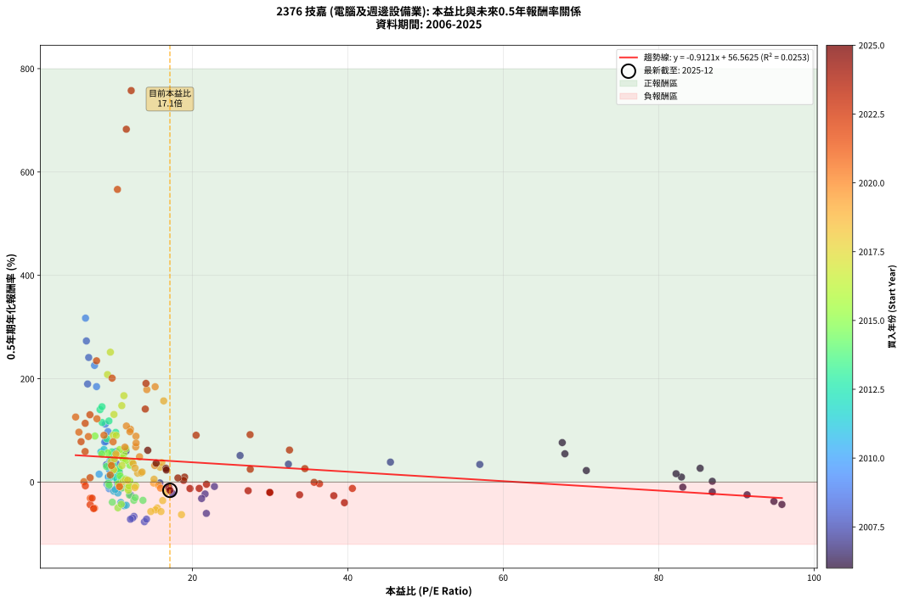

# 2376 技嘉 - 本益比與未來報酬率分析

!!! info "報告資訊"
    - **股票代號**: 2376
    - **公司名稱**: 技嘉
    - **產業別**: 電腦及週邊設備業
    - **分析期間**: 2006-2025 (234 個數據點)
    - **資料來源**: Type 12 (ShowMonthlyK_ChartFlow) 月收盤價與本益比
    - **報酬率口徑**: 含現金股利 (簡化: 年度合計，假設每年7/1入帳)
    - **報告生成時間**: 2026-01-05 20:40:09 CST

## 📈 視覺化圖表

### 圖表1: 本益比 vs 未來報酬率關係

*圖表1：2376 技嘉 本益比與0.5年期未來報酬率關係 (2006-2025)*

### 圖表2: 歷年買入時點的0.5年期實際報酬率

*圖表2：2376 技嘉 歷年買入時點的0.5年期實際報酬率 (2006-2025)*

## 📍 買點訊號說明

本報告提供兩種買點提示訊號（顯示於圖表2的股價子圖中）：

### ▲ 小綠色三角形（回測驗證）
- **計算方式**: 使用全部歷史資料計算本益比第25百分位數
- **用途**: 事後驗證，顯示歷史上哪些時點確實為低估區
- **限制**: 當下無法判斷，僅供回測參考
- **特性**: 後見之明（Look-Ahead Bias）

### ▲ 小橘色三角形（即時訊號）
- **計算方式**: 使用截至當月的過去5年資料計算本益比第25百分位數
- **用途**: 實際投資決策，當時即可判斷
- **優勢**: 可操作性強，符合實務需求
- **特性**: 無後見之明，滾動窗口計算

!!! tip "如何使用兩種訊號"
    - **綠色▲** 幫助理解歷史估值機會，驗證策略有效性
    - **橘色▲** 可作為實際買進參考，但仍需搭配基本面分析
    - 兩種訊號重疊時，表示即時判斷與事後驗證一致，信心度較高
    - 僅有綠色▲時，表示當時無法判斷（需要未來資料才能確認）
    - 僅有橘色▲時，表示即時判斷為買點，但事後可能不是最佳時機

## 📊 估值分析摘要

| 指標 | 數值 |
|:---:|:---:|
| **目前本益比** (2025-06) | **17.10 倍** |
| **歷史平均本益比** | 16.70 倍 |
| **估值水準** | 🟡 合理範圍 |
| **預期0.5年年化報酬率** | **+40.97%** |
| **歷史平均報酬率** | +41.33% |
| **相關係數 (R²)** | 0.0253 |
| **趨勢線斜率** | -0.9121 |

!!! abstract "核心洞察"
    目前本益比接近歷史平均，預期報酬率符合長期趨勢

    根據歷史數據回測，2376 技嘉 在目前本益比 **17.1倍** 的估值水準下，
    預期未來0.5年年化報酬率約為 **+41.0%**。

    **重要提醒**: 本分析基於歷史數據統計，實際報酬率會受到公司基本面變化、產業趨勢、
    總體經濟環境等多重因素影響。R² = 0.03 表示本益比可解釋約 2.5% 的報酬率變異。

## 📈 歷史估值統計

### 最佳買點 (最高報酬率)

| 項目 | 數值 |
|:---:|:---:|
| 起始時間 | 2023-02 |
| 當時本益比 | 12.12 倍 |
| 起始價格 | 119.0 元 |
| 0.5年後價格 | 341.0 元 |
| **0.5年年化報酬率** | **+757.55%** |

### 最差買點 (最低報酬率)

| 項目 | 數值 |
|:---:|:---:|
| 起始時間 | 2008-04 |
| 當時本益比 | 13.82 倍 |
| 起始價格 | 26.4 元 |
| 0.5年後價格 | 11.7 元 |
| **0.5年年化報酬率** | **-76.75%** |

## 🎯 投資啟示

### 本益比與報酬率關係

趨勢線方程式: **y = -0.9121x + 56.5625**

!!! warning "強負相關"
    本益比與未來報酬率呈現強負相關。在高本益比時期買入，未來報酬率顯著較低；
    在低本益比時期買入，未來報酬率顯著較高。**估值紀律至關重要**。

### 估值區間建議

基於歷史數據分析:

- **🟢 低估區** (P/E < 13.4): 預期報酬率較高，可考慮增加持股
- **🟡 合理區** (P/E 13.4-20.0): 預期報酬率符合長期趨勢，正常持有
- **🔴 高估區** (P/E > 20.0): 預期報酬率較低，可考慮減碼或觀望

!!! danger "風險提示"
    - 過去表現不代表未來結果
    - 本分析假設公司基本面無重大結構性變化
    - 產業環境劇變可能使歷史規律失效
    - 應結合公司財報、產業趨勢、總體經濟等多重因素綜合判斷

!!! success "長期投資觀點"
    歷史數據顯示，在合理或低估的估值水準買入並長期持有，
    往往能獲得較佳的投資報酬。**耐心等待好價格**是價值投資的核心原則。

## 📊 數據品質

- **資料來源**: GoodInfo.tw Type 12 (ShowMonthlyK_ChartFlow)
- **資料頻率**: 月度收盤價與本益比
- **回測期間**: 2006-2025
- **數據點數量**: 234 個 (每個點代表一次0.5年期回測)

### 計算方法說明

1. **0.5年期年化報酬率**:
   - 對每個歷史時點，計算其後0.5年的實際投資報酬率
   - 期末價值(不含股利): 期末價格
   - 期末價值(含現金股利): 期末價格 + 持有期間內的現金股利合計 (簡化: 年度合計，假設每年7/1入帳)
   - 公式: 年化報酬率 = [(期末價值/期初價格)^(1/年數) - 1] × 100%

2. **本益比 (P/E Ratio)**:
   - 使用當時的月收盤價與EPS計算
   - 資料來源: Type 12 月度河流圖本益比數據

3. **趨勢線 (Linear Regression)**:
   - 使用最小平方法擬合線性趨勢線
   - R²值衡量本益比對報酬率的解釋能力

---

*本報告由 Stock Analysis System v1.9.0 自動生成*
*數據更新時間: 2026-01-05 20:40:09 CST*

## 📋 月度回測明細表

（每一列對應時間線圖中的一個買入點；可用來對照 SVG 圖上的每個點。）

| 買入月份 | 賣出月份 | 回測期限_年 | 實際持有年數 | 買入本益比_倍 | 買入收盤價_元 | 賣出收盤價_元 | 現金股利合計_元 | 總報酬率_pct | 年化報酬率_pct |
| --- | --- | --- | --- | --- | --- | --- | --- | --- | --- |
| 2006-01 | 2006-07 | 0.5 | 0.496 | 95.86 | 27.80 | 19.70 | 1.30 | -24.46 | -43.22 |
| 2006-02 | 2006-08 | 0.5 | 0.498 | 94.83 | 27.50 | 20.50 | 1.30 | -20.73 | -37.26 |
| 2006-03 | 2006-10 | 0.5 | 0.586 | 82.93 | 24.05 | 24.10 | 1.30 | +5.61 | +9.77 |
| 2006-04 | 2006-10 | 0.5 | 0.501 | 86.90 | 25.20 | 24.10 | 1.30 | +0.79 | +1.59 |
| 2006-05 | 2006-12 | 0.5 | 0.586 | 82.24 | 23.85 | 24.75 | 1.30 | +9.22 | +16.25 |
| 2006-06 | 2006-12 | 0.5 | 0.501 | 67.59 | 19.60 | 24.75 | 1.30 | +32.91 | +76.44 |
| 2006-07 | 2007-01 | 0.5 | 0.504 | 67.93 | 19.70 | 24.55 | 0.00 | +24.62 | +54.79 |
| 2006-08 | 2007-03 | 0.5 | 0.580 | 70.69 | 20.50 | 23.05 | 0.00 | +12.44 | +22.38 |
| 2006-09 | 2007-03 | 0.5 | 0.496 | 91.38 | 26.50 | 23.05 | 0.00 | -13.02 | -24.53 |
| 2006-10 | 2007-05 | 0.5 | 0.580 | 83.10 | 24.10 | 22.70 | 0.00 | -5.81 | -9.80 |
| 2006-11 | 2007-05 | 0.5 | 0.496 | 86.90 | 25.20 | 22.70 | 0.00 | -9.92 | -19.01 |
| 2006-12 | 2007-07 | 0.5 | 0.580 | 85.34 | 24.75 | 27.80 | 0.60 | +14.75 | +26.74 |
| 2007-01 | 2007-07 | 0.5 | 0.496 | 56.98 | 24.55 | 27.80 | 0.60 | +15.68 | +34.17 |
| 2007-02 | 2007-08 | 0.5 | 0.498 | 45.48 | 26.00 | 30.00 | 0.60 | +17.69 | +38.67 |
| 2007-03 | 2007-10 | 0.5 | 0.586 | 32.35 | 23.05 | 26.85 | 0.60 | +19.09 | +34.74 |
| 2007-04 | 2007-10 | 0.5 | 0.501 | 26.13 | 22.30 | 26.85 | 0.60 | +23.09 | +51.39 |
| 2007-05 | 2007-12 | 0.5 | 0.586 | 22.83 | 22.70 | 20.95 | 0.60 | -5.07 | -8.49 |
| 2007-06 | 2007-12 | 0.5 | 0.501 | 21.63 | 24.55 | 20.95 | 0.60 | -12.22 | -22.91 |
| 2007-07 | 2008-01 | 0.5 | 0.504 | 21.79 | 27.80 | 17.40 | 0.00 | -37.41 | -60.55 |
| 2007-08 | 2008-03 | 0.5 | 0.583 | 21.18 | 30.00 | 24.00 | 0.00 | -20.00 | -31.79 |
| 2007-09 | 2008-03 | 0.5 | 0.498 | 17.43 | 27.15 | 24.00 | 0.00 | -11.60 | -21.92 |
| 2007-10 | 2008-05 | 0.5 | 0.583 | 15.81 | 26.85 | 26.60 | 0.00 | -0.93 | -1.59 |
| 2007-11 | 2008-05 | 0.5 | 0.498 | 11.45 | 21.05 | 26.60 | 0.00 | +26.37 | +59.94 |
| 2007-12 | 2008-07 | 0.5 | 0.583 | 10.58 | 20.95 | 22.25 | 0.99 | +10.92 | +19.44 |
| 2008-01 | 2008-07 | 0.5 | 0.498 | 8.87 | 17.40 | 22.25 | 0.99 | +33.55 | +78.70 |
| 2008-02 | 2008-08 | 0.5 | 0.501 | 10.19 | 19.80 | 22.10 | 0.99 | +16.60 | +35.87 |
| 2008-03 | 2008-10 | 0.5 | 0.586 | 12.47 | 24.00 | 11.70 | 0.99 | -47.14 | -66.31 |
| 2008-04 | 2008-10 | 0.5 | 0.501 | 13.82 | 26.35 | 11.70 | 0.99 | -51.85 | -76.75 |
| 2008-05 | 2008-12 | 0.5 | 0.586 | 14.09 | 26.60 | 11.70 | 0.99 | -52.30 | -71.74 |
| 2008-06 | 2008-12 | 0.5 | 0.501 | 12.30 | 23.00 | 11.70 | 0.99 | -44.84 | -69.50 |
| 2008-07 | 2009-01 | 0.5 | 0.504 | 12.02 | 22.25 | 11.75 | 0.00 | -47.19 | -71.84 |
| 2008-08 | 2009-03 | 0.5 | 0.580 | 12.05 | 22.10 | 18.70 | 0.00 | -15.38 | -25.01 |
| 2008-09 | 2009-03 | 0.5 | 0.496 | 8.93 | 16.20 | 18.70 | 0.00 | +15.43 | +33.59 |
| 2008-10 | 2009-05 | 0.5 | 0.580 | 6.51 | 11.70 | 21.70 | 0.00 | +85.47 | +189.87 |
| 2008-11 | 2009-05 | 0.5 | 0.496 | 6.35 | 11.30 | 21.70 | 0.00 | +92.04 | +273.12 |
| 2008-12 | 2009-07 | 0.5 | 0.580 | 6.65 | 11.70 | 22.85 | 1.00 | +103.85 | +241.11 |
| 2009-01 | 2009-07 | 0.5 | 0.496 | 6.24 | 11.75 | 22.85 | 1.00 | +102.98 | +317.27 |
| 2009-02 | 2009-08 | 0.5 | 0.498 | 7.40 | 14.85 | 25.75 | 1.00 | +80.13 | +225.80 |
| 2009-03 | 2009-10 | 0.5 | 0.586 | 8.78 | 18.70 | 28.05 | 1.00 | +55.35 | +112.09 |
| 2009-04 | 2009-10 | 0.5 | 0.501 | 10.21 | 23.00 | 28.05 | 1.00 | +26.30 | +59.38 |
| 2009-05 | 2009-12 | 0.5 | 0.586 | 9.13 | 21.70 | 31.35 | 1.00 | +49.08 | +97.69 |
| 2009-06 | 2009-12 | 0.5 | 0.501 | 7.66 | 19.15 | 31.35 | 1.00 | +68.93 | +184.76 |
| 2009-07 | 2010-01 | 0.5 | 0.504 | 8.71 | 22.85 | 30.50 | 0.00 | +33.48 | +77.40 |
| 2009-08 | 2010-03 | 0.5 | 0.580 | 9.37 | 25.75 | 30.80 | 0.00 | +19.61 | +36.14 |
| 2009-09 | 2010-03 | 0.5 | 0.496 | 9.48 | 27.20 | 30.80 | 0.00 | +13.24 | +28.51 |
| 2009-10 | 2010-05 | 0.5 | 0.580 | 9.37 | 28.05 | 33.70 | 0.00 | +20.14 | +37.19 |
| 2009-11 | 2010-05 | 0.5 | 0.496 | 9.35 | 29.15 | 33.70 | 0.00 | +15.61 | +34.00 |
| 2009-12 | 2010-07 | 0.5 | 0.580 | 9.68 | 31.35 | 33.75 | 2.50 | +15.62 | +28.42 |
| 2010-01 | 2010-07 | 0.5 | 0.496 | 9.40 | 30.50 | 33.75 | 2.50 | +18.85 | +41.68 |
| 2010-02 | 2010-08 | 0.5 | 0.498 | 9.00 | 29.25 | 26.15 | 2.50 | -2.06 | -4.09 |
| 2010-03 | 2010-10 | 0.5 | 0.586 | 9.47 | 30.80 | 30.05 | 2.50 | +5.68 | +9.88 |
| 2010-04 | 2010-10 | 0.5 | 0.501 | 10.70 | 34.85 | 30.05 | 2.50 | -6.61 | -12.75 |
| 2010-05 | 2010-12 | 0.5 | 0.586 | 10.33 | 33.70 | 30.65 | 2.50 | -1.64 | -2.78 |
| 2010-06 | 2010-12 | 0.5 | 0.501 | 9.66 | 31.55 | 30.65 | 2.50 | +5.06 | +10.36 |
| 2010-07 | 2011-01 | 0.5 | 0.504 | 10.32 | 33.75 | 32.20 | 0.00 | -4.59 | -8.91 |
| 2010-08 | 2011-03 | 0.5 | 0.580 | 7.99 | 26.15 | 28.40 | 0.00 | +8.60 | +15.28 |
| 2010-09 | 2011-03 | 0.5 | 0.496 | 9.28 | 30.40 | 28.40 | 0.00 | -6.58 | -12.83 |
| 2010-10 | 2011-05 | 0.5 | 0.580 | 9.16 | 30.05 | 31.75 | 0.00 | +5.66 | +9.94 |
| 2010-11 | 2011-05 | 0.5 | 0.496 | 9.21 | 30.25 | 31.75 | 0.00 | +4.96 | +10.26 |
| 2010-12 | 2011-07 | 0.5 | 0.580 | 9.32 | 30.65 | 32.20 | 2.50 | +13.21 | +23.83 |
| 2011-01 | 2011-07 | 0.5 | 0.496 | 10.00 | 32.20 | 32.20 | 2.50 | +7.76 | +16.28 |
| 2011-02 | 2011-08 | 0.5 | 0.498 | 9.41 | 29.65 | 28.50 | 2.50 | +4.55 | +9.34 |
| 2011-03 | 2011-10 | 0.5 | 0.586 | 9.21 | 28.40 | 24.50 | 2.50 | -4.93 | -8.27 |
| 2011-04 | 2011-10 | 0.5 | 0.501 | 9.87 | 29.75 | 24.50 | 2.50 | -9.25 | -17.61 |
| 2011-05 | 2011-12 | 0.5 | 0.586 | 10.78 | 31.75 | 21.20 | 2.50 | -25.36 | -39.30 |
| 2011-06 | 2011-12 | 0.5 | 0.501 | 11.20 | 32.20 | 21.20 | 2.50 | -26.40 | -45.76 |
| 2011-07 | 2012-01 | 0.5 | 0.504 | 11.48 | 32.20 | 23.90 | 0.00 | -25.78 | -44.66 |
| 2011-08 | 2012-03 | 0.5 | 0.583 | 10.41 | 28.50 | 24.80 | 0.00 | -12.98 | -21.22 |
| 2011-09 | 2012-03 | 0.5 | 0.498 | 10.05 | 26.80 | 24.80 | 0.00 | -7.46 | -14.41 |
| 2011-10 | 2012-05 | 0.5 | 0.583 | 9.43 | 24.50 | 26.15 | 0.00 | +6.73 | +11.82 |
| 2011-11 | 2012-05 | 0.5 | 0.498 | 8.22 | 20.80 | 26.15 | 0.00 | +25.72 | +58.31 |
| 2011-12 | 2012-07 | 0.5 | 0.583 | 8.62 | 21.20 | 26.20 | 2.00 | +33.01 | +63.10 |
| 2012-01 | 2012-07 | 0.5 | 0.498 | 9.71 | 23.90 | 26.20 | 2.00 | +17.99 | +39.37 |
| 2012-02 | 2012-08 | 0.5 | 0.501 | 10.21 | 25.15 | 25.90 | 2.00 | +10.93 | +23.00 |
| 2012-03 | 2012-10 | 0.5 | 0.586 | 10.07 | 24.80 | 24.10 | 2.00 | +5.24 | +9.10 |
| 2012-04 | 2012-10 | 0.5 | 0.501 | 10.27 | 25.30 | 24.10 | 2.00 | +3.16 | +6.40 |
| 2012-05 | 2012-12 | 0.5 | 0.586 | 10.61 | 26.15 | 26.00 | 2.00 | +7.07 | +12.37 |
| 2012-06 | 2012-12 | 0.5 | 0.501 | 11.53 | 28.45 | 26.00 | 2.00 | -1.59 | -3.14 |
| 2012-07 | 2013-01 | 0.5 | 0.504 | 10.62 | 26.20 | 25.40 | 0.00 | -3.05 | -5.97 |
| 2012-08 | 2013-03 | 0.5 | 0.580 | 10.49 | 25.90 | 27.65 | 0.00 | +6.76 | +11.92 |
| 2012-09 | 2013-03 | 0.5 | 0.496 | 10.83 | 26.75 | 27.65 | 0.00 | +3.36 | +6.91 |
| 2012-10 | 2013-05 | 0.5 | 0.580 | 9.75 | 24.10 | 29.00 | 0.00 | +20.33 | +37.56 |
| 2012-11 | 2013-05 | 0.5 | 0.496 | 9.77 | 24.15 | 29.00 | 0.00 | +20.08 | +44.67 |
| 2012-12 | 2013-07 | 0.5 | 0.580 | 10.51 | 26.00 | 27.05 | 2.00 | +11.73 | +21.06 |
| 2013-01 | 2013-07 | 0.5 | 0.496 | 9.84 | 25.40 | 27.05 | 2.00 | +14.37 | +31.12 |
| 2013-02 | 2013-08 | 0.5 | 0.498 | 9.76 | 26.25 | 27.00 | 2.00 | +10.48 | +22.13 |
| 2013-03 | 2013-10 | 0.5 | 0.586 | 9.89 | 27.65 | 32.80 | 2.00 | +25.86 | +48.07 |
| 2013-04 | 2013-10 | 0.5 | 0.501 | 9.68 | 28.10 | 32.80 | 2.00 | +23.84 | +53.24 |
| 2013-05 | 2013-12 | 0.5 | 0.586 | 9.64 | 29.00 | 36.00 | 2.00 | +31.03 | +58.62 |
| 2013-06 | 2013-12 | 0.5 | 0.501 | 8.98 | 28.00 | 36.00 | 2.00 | +35.71 | +83.95 |
| 2013-07 | 2014-01 | 0.5 | 0.504 | 8.39 | 27.05 | 39.80 | 0.00 | +47.13 | +115.24 |
| 2013-08 | 2014-03 | 0.5 | 0.580 | 8.11 | 27.00 | 44.90 | 0.00 | +66.30 | +140.19 |
| 2013-09 | 2014-03 | 0.5 | 0.496 | 8.36 | 28.75 | 44.90 | 0.00 | +56.17 | +145.86 |
| 2013-10 | 2014-05 | 0.5 | 0.580 | 9.25 | 32.80 | 51.60 | 0.00 | +57.32 | +118.28 |
| 2013-11 | 2014-05 | 0.5 | 0.496 | 10.12 | 36.95 | 51.60 | 0.00 | +39.65 | +96.19 |
| 2013-12 | 2014-07 | 0.5 | 0.580 | 9.57 | 36.00 | 41.50 | 3.00 | +23.61 | +44.08 |
| 2014-01 | 2014-07 | 0.5 | 0.496 | 10.57 | 39.80 | 41.50 | 3.00 | +11.81 | +25.26 |
| 2014-02 | 2014-08 | 0.5 | 0.498 | 11.94 | 45.00 | 39.90 | 3.00 | -4.67 | -9.15 |
| 2014-03 | 2014-10 | 0.5 | 0.586 | 11.89 | 44.90 | 34.90 | 3.00 | -15.59 | -25.12 |
| 2014-04 | 2014-10 | 0.5 | 0.501 | 12.46 | 47.10 | 34.90 | 3.00 | -19.53 | -35.19 |
| 2014-05 | 2014-12 | 0.5 | 0.586 | 13.63 | 51.60 | 37.00 | 3.00 | -22.48 | -35.25 |
| 2014-06 | 2014-12 | 0.5 | 0.501 | 12.63 | 47.85 | 37.00 | 3.00 | -16.41 | -30.07 |
| 2014-07 | 2015-01 | 0.5 | 0.504 | 10.94 | 41.50 | 39.10 | 0.00 | -5.78 | -11.15 |
| 2014-08 | 2015-03 | 0.5 | 0.580 | 10.50 | 39.90 | 38.80 | 0.00 | -2.76 | -4.70 |
| 2014-09 | 2015-03 | 0.5 | 0.496 | 8.95 | 34.05 | 38.80 | 0.00 | +13.95 | +30.15 |
| 2014-10 | 2015-05 | 0.5 | 0.580 | 9.16 | 34.90 | 34.40 | 0.00 | -1.43 | -2.46 |
| 2014-11 | 2015-05 | 0.5 | 0.496 | 9.28 | 35.40 | 34.40 | 0.00 | -2.82 | -5.62 |
| 2014-12 | 2015-07 | 0.5 | 0.580 | 9.69 | 37.00 | 25.10 | 2.70 | -24.86 | -38.89 |
| 2015-01 | 2015-07 | 0.5 | 0.496 | 10.41 | 39.10 | 25.10 | 2.70 | -28.90 | -49.76 |
| 2015-02 | 2015-08 | 0.5 | 0.498 | 10.84 | 40.00 | 27.55 | 2.70 | -24.38 | -42.92 |
| 2015-03 | 2015-10 | 0.5 | 0.586 | 10.70 | 38.80 | 34.00 | 2.70 | -5.41 | -9.06 |
| 2015-04 | 2015-10 | 0.5 | 0.501 | 10.47 | 37.30 | 34.00 | 2.70 | -1.61 | -3.18 |
| 2015-05 | 2015-12 | 0.5 | 0.586 | 9.83 | 34.40 | 36.45 | 2.70 | +13.81 | +24.70 |
| 2015-06 | 2015-12 | 0.5 | 0.501 | 9.11 | 31.30 | 36.45 | 2.70 | +25.08 | +56.31 |
| 2015-07 | 2016-01 | 0.5 | 0.504 | 7.45 | 25.10 | 34.60 | 0.00 | +37.85 | +89.11 |
| 2015-08 | 2016-03 | 0.5 | 0.583 | 8.33 | 27.55 | 35.50 | 0.00 | +28.86 | +54.46 |
| 2015-09 | 2016-03 | 0.5 | 0.498 | 9.62 | 31.20 | 35.50 | 0.00 | +13.78 | +29.58 |
| 2015-10 | 2016-05 | 0.5 | 0.583 | 10.70 | 34.00 | 36.35 | 0.00 | +6.91 | +12.14 |
| 2015-11 | 2016-05 | 0.5 | 0.498 | 11.34 | 35.30 | 36.35 | 0.00 | +2.97 | +6.06 |
| 2015-12 | 2016-07 | 0.5 | 0.583 | 11.95 | 36.45 | 40.50 | 2.50 | +17.97 | +32.76 |
| 2016-01 | 2016-07 | 0.5 | 0.498 | 11.16 | 34.60 | 40.50 | 2.50 | +24.28 | +54.68 |
| 2016-02 | 2016-08 | 0.5 | 0.501 | 11.43 | 36.00 | 43.70 | 2.50 | +28.33 | +64.53 |
| 2016-03 | 2016-10 | 0.5 | 0.586 | 11.10 | 35.50 | 41.55 | 2.50 | +24.08 | +44.53 |
| 2016-04 | 2016-10 | 0.5 | 0.501 | 10.63 | 34.50 | 41.55 | 2.50 | +27.68 | +62.86 |
| 2016-05 | 2016-12 | 0.5 | 0.586 | 11.03 | 36.35 | 43.10 | 2.50 | +25.45 | +47.25 |
| 2016-06 | 2016-12 | 0.5 | 0.501 | 11.43 | 38.25 | 43.10 | 2.50 | +19.22 | +42.02 |
| 2016-07 | 2017-01 | 0.5 | 0.504 | 11.93 | 40.50 | 41.00 | 0.00 | +1.23 | +2.47 |
| 2016-08 | 2017-03 | 0.5 | 0.580 | 12.69 | 43.70 | 41.90 | 0.00 | -4.12 | -6.99 |
| 2016-09 | 2017-03 | 0.5 | 0.496 | 11.91 | 41.60 | 41.90 | 0.00 | +0.72 | +1.46 |
| 2016-10 | 2017-05 | 0.5 | 0.580 | 11.73 | 41.55 | 38.80 | 0.00 | -6.62 | -11.13 |
| 2016-11 | 2017-05 | 0.5 | 0.496 | 11.75 | 42.20 | 38.80 | 0.00 | -8.06 | -15.59 |
| 2016-12 | 2017-07 | 0.5 | 0.580 | 11.84 | 43.10 | 38.60 | 2.60 | -4.41 | -7.47 |
| 2017-01 | 2017-07 | 0.5 | 0.496 | 11.07 | 41.00 | 38.60 | 2.60 | +0.49 | +0.99 |
| 2017-02 | 2017-08 | 0.5 | 0.498 | 11.36 | 42.80 | 41.10 | 2.60 | +2.10 | +4.26 |
| 2017-03 | 2017-10 | 0.5 | 0.586 | 10.93 | 41.90 | 46.70 | 2.60 | +17.66 | +31.99 |
| 2017-04 | 2017-10 | 0.5 | 0.501 | 10.25 | 39.95 | 46.70 | 2.60 | +23.40 | +52.15 |
| 2017-05 | 2017-12 | 0.5 | 0.586 | 9.80 | 38.80 | 54.00 | 2.60 | +45.88 | +90.50 |
| 2017-06 | 2017-12 | 0.5 | 0.501 | 10.19 | 41.00 | 54.00 | 2.60 | +38.05 | +90.32 |
| 2017-07 | 2018-01 | 0.5 | 0.504 | 9.44 | 38.60 | 72.70 | 0.00 | +88.34 | +251.39 |
| 2017-08 | 2018-03 | 0.5 | 0.580 | 9.90 | 41.10 | 66.80 | 0.00 | +62.53 | +130.89 |
| 2017-09 | 2018-03 | 0.5 | 0.496 | 9.07 | 38.25 | 66.80 | 0.00 | +74.64 | +208.06 |
| 2017-10 | 2018-05 | 0.5 | 0.580 | 10.91 | 46.70 | 79.10 | 0.00 | +69.38 | +147.91 |
| 2017-11 | 2018-05 | 0.5 | 0.496 | 11.18 | 48.60 | 79.10 | 0.00 | +62.76 | +167.23 |
| 2017-12 | 2018-07 | 0.5 | 0.580 | 12.24 | 54.00 | 61.40 | 4.00 | +21.11 | +39.10 |
| 2018-01 | 2018-07 | 0.5 | 0.496 | 16.60 | 72.70 | 61.40 | 4.00 | -10.04 | -19.23 |
| 2018-02 | 2018-08 | 0.5 | 0.498 | 16.17 | 70.30 | 52.40 | 4.00 | -19.77 | -35.73 |
| 2018-03 | 2018-10 | 0.5 | 0.586 | 15.47 | 66.80 | 40.45 | 4.00 | -33.46 | -50.10 |
| 2018-04 | 2018-10 | 0.5 | 0.501 | 15.26 | 65.40 | 40.45 | 4.00 | -32.03 | -53.73 |
| 2018-05 | 2018-12 | 0.5 | 0.586 | 18.59 | 79.10 | 40.20 | 4.00 | -44.12 | -62.97 |
| 2018-06 | 2018-12 | 0.5 | 0.501 | 15.95 | 67.40 | 40.20 | 4.00 | -34.42 | -56.92 |
| 2018-07 | 2019-01 | 0.5 | 0.504 | 14.64 | 61.40 | 40.15 | 0.00 | -34.61 | -56.97 |
| 2018-08 | 2019-03 | 0.5 | 0.580 | 12.59 | 52.40 | 49.10 | 0.00 | -6.30 | -10.60 |
| 2018-09 | 2019-03 | 0.5 | 0.496 | 11.66 | 48.20 | 49.10 | 0.00 | +1.87 | +3.80 |
| 2018-10 | 2019-05 | 0.5 | 0.580 | 9.86 | 40.45 | 45.75 | 0.00 | +13.10 | +23.63 |
| 2018-11 | 2019-05 | 0.5 | 0.496 | 9.54 | 38.85 | 45.75 | 0.00 | +17.76 | +39.08 |
| 2018-12 | 2019-07 | 0.5 | 0.580 | 9.95 | 40.20 | 46.80 | 3.00 | +23.88 | +44.62 |
| 2019-01 | 2019-07 | 0.5 | 0.496 | 10.15 | 40.15 | 46.80 | 3.00 | +24.03 | +54.44 |
| 2019-02 | 2019-08 | 0.5 | 0.498 | 12.36 | 47.90 | 52.80 | 3.00 | +16.49 | +35.85 |
| 2019-03 | 2019-10 | 0.5 | 0.586 | 12.95 | 49.10 | 50.90 | 3.00 | +9.78 | +17.26 |
| 2019-04 | 2019-10 | 0.5 | 0.501 | 13.38 | 49.65 | 50.90 | 3.00 | +8.56 | +17.81 |
| 2019-05 | 2019-12 | 0.5 | 0.586 | 12.61 | 45.75 | 49.70 | 3.00 | +15.19 | +27.30 |
| 2019-06 | 2019-12 | 0.5 | 0.501 | 15.01 | 53.20 | 49.70 | 3.00 | -0.94 | -1.87 |
| 2019-07 | 2020-01 | 0.5 | 0.504 | 13.52 | 46.80 | 51.20 | 0.00 | +9.40 | +19.53 |
| 2019-08 | 2020-03 | 0.5 | 0.583 | 15.62 | 52.80 | 51.00 | 0.00 | -3.41 | -5.77 |
| 2019-09 | 2020-03 | 0.5 | 0.498 | 15.06 | 49.65 | 51.00 | 0.00 | +2.72 | +5.53 |
| 2019-10 | 2020-05 | 0.5 | 0.583 | 15.83 | 50.90 | 59.00 | 0.00 | +15.91 | +28.82 |
| 2019-11 | 2020-05 | 0.5 | 0.498 | 16.06 | 50.30 | 59.00 | 0.00 | +17.30 | +37.73 |
| 2019-12 | 2020-07 | 0.5 | 0.583 | 16.30 | 49.70 | 84.00 | 2.20 | +73.44 | +157.09 |
| 2020-01 | 2020-07 | 0.5 | 0.498 | 15.20 | 51.20 | 84.00 | 2.20 | +68.36 | +184.46 |
| 2020-02 | 2020-08 | 0.5 | 0.501 | 14.13 | 52.10 | 84.90 | 2.20 | +67.18 | +178.90 |
| 2020-03 | 2020-10 | 0.5 | 0.586 | 12.73 | 51.00 | 71.80 | 2.20 | +45.10 | +88.76 |
| 2020-04 | 2020-10 | 0.5 | 0.501 | 12.02 | 52.00 | 71.80 | 2.20 | +42.31 | +102.22 |
| 2020-05 | 2020-12 | 0.5 | 0.586 | 12.70 | 59.00 | 77.80 | 2.20 | +35.59 | +68.15 |
| 2020-06 | 2020-12 | 0.5 | 0.501 | 13.19 | 65.50 | 77.80 | 2.20 | +22.14 | +49.05 |
| 2020-07 | 2021-01 | 0.5 | 0.504 | 15.90 | 84.00 | 78.90 | 0.00 | -6.07 | -11.69 |
| 2020-08 | 2021-03 | 0.5 | 0.580 | 15.15 | 84.90 | 99.80 | 0.00 | +17.55 | +32.13 |
| 2020-09 | 2021-03 | 0.5 | 0.496 | 12.75 | 75.50 | 99.80 | 0.00 | +32.19 | +75.61 |
| 2020-10 | 2021-05 | 0.5 | 0.580 | 11.50 | 71.80 | 110.00 | 0.00 | +53.20 | +108.54 |
| 2020-11 | 2021-05 | 0.5 | 0.496 | 11.96 | 78.50 | 110.00 | 0.00 | +40.13 | +97.55 |
| 2020-12 | 2021-07 | 0.5 | 0.580 | 11.31 | 77.80 | 100.00 | 5.00 | +34.96 | +67.62 |
| 2021-01 | 2021-07 | 0.5 | 0.496 | 9.79 | 78.90 | 100.00 | 5.00 | +33.08 | +78.01 |
| 2021-02 | 2021-08 | 0.5 | 0.498 | 9.42 | 87.00 | 87.80 | 5.00 | +6.67 | +13.83 |
| 2021-03 | 2021-10 | 0.5 | 0.586 | 9.58 | 99.80 | 112.50 | 5.00 | +17.74 | +32.14 |
| 2021-04 | 2021-10 | 0.5 | 0.501 | 10.61 | 123.00 | 112.50 | 5.00 | -4.47 | -8.73 |
| 2021-05 | 2021-12 | 0.5 | 0.586 | 8.62 | 110.00 | 155.50 | 5.00 | +45.91 | +90.57 |
| 2021-06 | 2021-12 | 0.5 | 0.501 | 7.71 | 107.50 | 155.50 | 5.00 | +49.30 | +122.55 |
| 2021-07 | 2022-01 | 0.5 | 0.504 | 6.61 | 100.00 | 137.50 | 0.00 | +37.50 | +88.16 |
| 2021-08 | 2022-03 | 0.5 | 0.580 | 5.39 | 87.80 | 130.00 | 0.00 | +48.06 | +96.64 |
| 2021-09 | 2022-03 | 0.5 | 0.496 | 4.97 | 86.80 | 130.00 | 0.00 | +49.77 | +125.94 |
| 2021-10 | 2022-05 | 0.5 | 0.580 | 6.03 | 112.50 | 113.00 | 0.00 | +0.44 | +0.77 |
| 2021-11 | 2022-05 | 0.5 | 0.496 | 6.86 | 136.00 | 113.00 | 0.00 | -16.91 | -31.19 |
| 2021-12 | 2022-07 | 0.5 | 0.580 | 7.40 | 155.50 | 91.40 | 12.00 | -33.50 | -50.49 |
| 2022-01 | 2022-07 | 0.5 | 0.496 | 6.84 | 137.50 | 91.40 | 12.00 | -24.80 | -43.74 |
| 2022-02 | 2022-08 | 0.5 | 0.498 | 7.28 | 140.00 | 85.90 | 12.00 | -30.07 | -51.22 |
| 2022-03 | 2022-10 | 0.5 | 0.586 | 7.09 | 130.00 | 92.50 | 12.00 | -19.62 | -31.11 |
| 2022-04 | 2022-10 | 0.5 | 0.501 | 6.22 | 108.50 | 92.50 | 12.00 | -3.69 | -7.22 |
| 2022-05 | 2022-12 | 0.5 | 0.586 | 6.83 | 113.00 | 106.50 | 12.00 | +4.87 | +8.45 |
| 2022-06 | 2022-12 | 0.5 | 0.501 | 5.67 | 88.70 | 106.50 | 12.00 | +33.60 | +78.27 |
| 2022-07 | 2023-01 | 0.5 | 0.504 | 6.19 | 91.40 | 115.50 | 0.00 | +26.37 | +59.13 |
| 2022-08 | 2023-03 | 0.5 | 0.580 | 6.20 | 85.90 | 133.50 | 0.00 | +55.41 | +113.75 |
| 2022-09 | 2023-03 | 0.5 | 0.496 | 6.81 | 88.30 | 133.50 | 0.00 | +51.19 | +130.28 |
| 2022-10 | 2023-05 | 0.5 | 0.580 | 7.66 | 92.50 | 186.50 | 0.00 | +101.62 | +234.72 |
| 2022-11 | 2023-05 | 0.5 | 0.496 | 9.66 | 108.00 | 186.50 | 0.00 | +72.69 | +201.14 |
| 2022-12 | 2023-07 | 0.5 | 0.580 | 10.35 | 106.50 | 314.00 | 6.20 | +200.66 | +566.28 |
| 2023-01 | 2023-07 | 0.5 | 0.496 | 11.49 | 115.50 | 314.00 | 6.20 | +177.23 | +682.76 |
| 2023-02 | 2023-08 | 0.5 | 0.498 | 12.12 | 119.00 | 341.00 | 6.20 | +191.76 | +757.55 |
| 2023-03 | 2023-10 | 0.5 | 0.586 | 13.93 | 133.50 | 217.50 | 6.20 | +67.57 | +141.34 |
| 2023-04 | 2023-10 | 0.5 | 0.501 | 14.02 | 131.00 | 217.50 | 6.20 | +70.76 | +190.96 |
| 2023-05 | 2023-12 | 0.5 | 0.586 | 20.47 | 186.50 | 266.00 | 6.20 | +45.95 | +90.66 |
| 2023-06 | 2023-12 | 0.5 | 0.501 | 27.44 | 243.50 | 266.00 | 6.20 | +11.79 | +24.91 |
| 2023-07 | 2024-01 | 0.5 | 0.504 | 36.35 | 314.00 | 309.00 | 0.00 | -1.59 | -3.14 |
| 2023-08 | 2024-03 | 0.5 | 0.583 | 40.58 | 341.00 | 316.00 | 0.00 | -7.33 | -12.24 |
| 2023-09 | 2024-03 | 0.5 | 0.498 | 34.47 | 281.50 | 316.00 | 0.00 | +12.26 | +26.11 |
| 2023-10 | 2024-05 | 0.5 | 0.583 | 27.42 | 217.50 | 318.00 | 0.00 | +46.21 | +91.82 |
| 2023-11 | 2024-05 | 0.5 | 0.498 | 32.49 | 250.00 | 318.00 | 0.00 | +27.20 | +62.07 |
| 2023-12 | 2024-07 | 0.5 | 0.583 | 35.66 | 266.00 | 259.00 | 6.36 | -0.24 | -0.41 |
| 2024-01 | 2024-07 | 0.5 | 0.498 | 38.19 | 309.00 | 259.00 | 6.36 | -14.12 | -26.33 |
| 2024-02 | 2024-08 | 0.5 | 0.501 | 39.56 | 345.00 | 261.00 | 6.36 | -22.50 | -39.88 |
| 2024-03 | 2024-10 | 0.5 | 0.586 | 33.79 | 316.00 | 261.50 | 6.36 | -15.23 | -24.58 |
| 2024-04 | 2024-10 | 0.5 | 0.501 | 29.95 | 299.00 | 261.50 | 6.36 | -10.42 | -19.71 |
| 2024-05 | 2024-12 | 0.5 | 0.586 | 29.96 | 318.00 | 272.50 | 6.36 | -12.31 | -20.08 |
| 2024-06 | 2024-12 | 0.5 | 0.501 | 27.17 | 305.50 | 272.50 | 6.36 | -8.72 | -16.65 |
| 2024-07 | 2025-01 | 0.5 | 0.504 | 21.81 | 259.00 | 253.50 | 0.00 | -2.12 | -4.17 |
| 2024-08 | 2025-03 | 0.5 | 0.580 | 20.87 | 261.00 | 242.00 | 0.00 | -7.28 | -12.21 |
| 2024-09 | 2025-03 | 0.5 | 0.496 | 19.68 | 258.50 | 242.00 | 0.00 | -6.38 | -12.46 |
| 2024-10 | 2025-05 | 0.5 | 0.580 | 18.99 | 261.50 | 276.00 | 0.00 | +5.54 | +9.74 |
| 2024-11 | 2025-05 | 0.5 | 0.496 | 18.86 | 271.50 | 276.00 | 0.00 | +1.66 | +3.37 |
| 2024-12 | 2025-07 | 0.5 | 0.580 | 18.13 | 272.50 | 275.00 | 10.00 | +4.59 | +8.03 |
| 2025-01 | 2025-07 | 0.5 | 0.496 | 16.59 | 253.50 | 275.00 | 10.00 | +12.43 | +26.66 |
| 2025-02 | 2025-08 | 0.5 | 0.498 | 16.64 | 258.50 | 277.00 | 10.00 | +11.03 | +23.35 |
| 2025-03 | 2025-10 | 0.5 | 0.586 | 15.33 | 242.00 | 280.50 | 10.00 | +20.04 | +36.58 |
| 2025-04 | 2025-10 | 0.5 | 0.501 | 14.25 | 228.50 | 280.50 | 10.00 | +27.13 | +61.47 |
| 2025-05 | 2025-12 | 0.5 | 0.586 | 16.94 | 276.00 | 249.50 | 10.00 | -5.98 | -9.99 |
| 2025-06 | 2025-12 | 0.5 | 0.501 | 17.10 | 283.00 | 249.50 | 10.00 | -8.30 | -15.89 |
