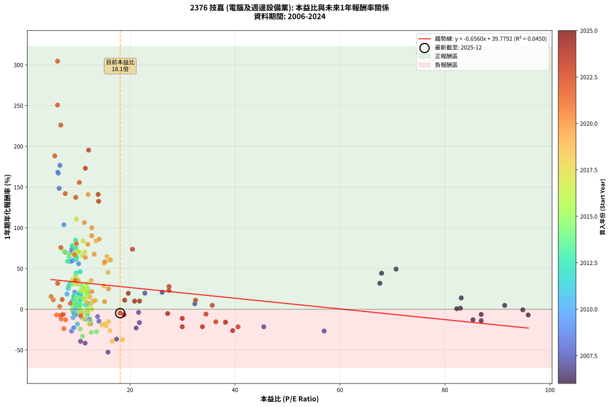
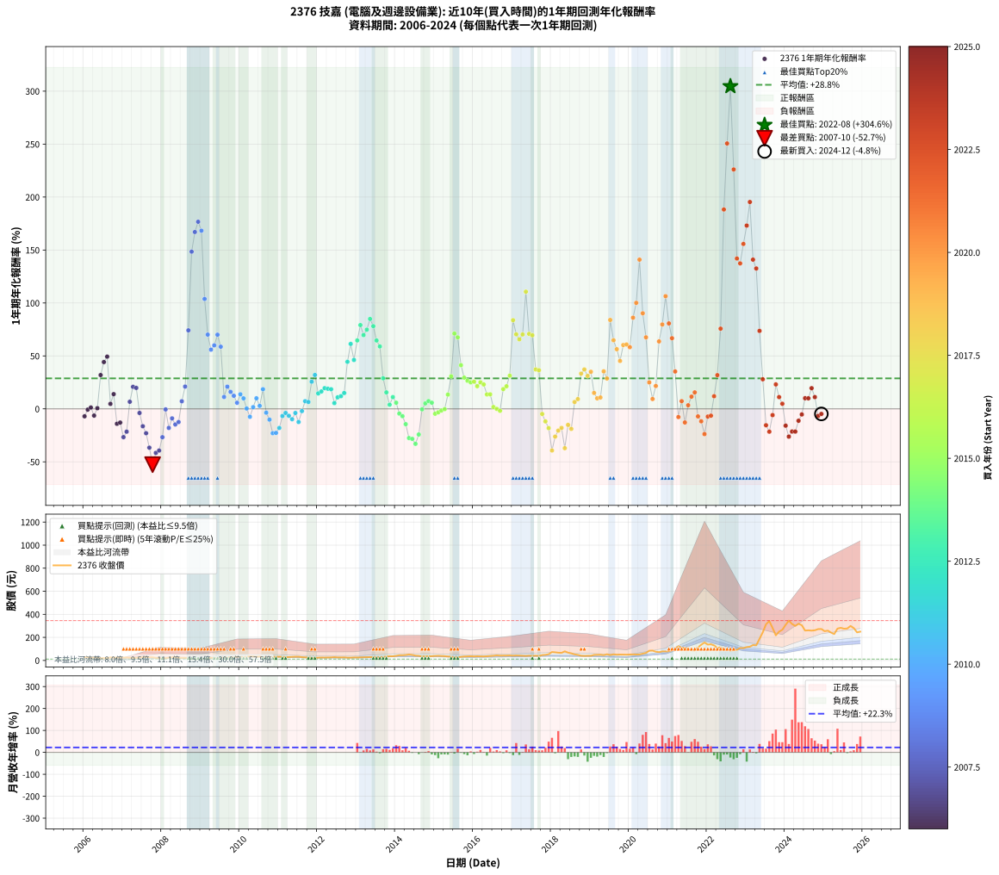

# 2376 技嘉 - 本益比與未來報酬率分析

!!! info "報告資訊"
    - **股票代號**: 2376
    - **公司名稱**: 技嘉
    - **產業別**: 電腦及週邊設備業
    - **分析期間**: 2006-2024 (228 個數據點)
    - **資料來源**: Type 12 (ShowMonthlyK_ChartFlow) 月收盤價與本益比
    - **報酬率口徑**: 含現金股利 (簡化: 年度合計，假設每年7/1入帳)
    - **報告生成時間**: 2026-01-06 22:33:07 CST

## 📈 視覺化圖表

### 圖表1: 本益比 vs 未來報酬率關係

*圖表1：2376 技嘉 本益比與1年期未來報酬率關係 (2006-2024)*

### 圖表2: 歷年買入時點的1年期實際報酬率

*圖表2：2376 技嘉 歷年買入時點的1年期實際報酬率 (2006-2024)*

## 📍 買點訊號說明

本報告提供兩種買點提示訊號（顯示於圖表2的股價子圖中）：

### ▲ 小綠色三角形（回測驗證）
- **計算方式**: 使用全部歷史資料計算本益比第25百分位數
- **用途**: 事後驗證，顯示歷史上哪些時點確實為低估區
- **限制**: 當下無法判斷，僅供回測參考
- **特性**: 後見之明（Look-Ahead Bias）

### ▲ 小橘色三角形（即時訊號）
- **計算方式**: 使用截至當月的過去5年資料計算本益比第25百分位數
- **用途**: 實際投資決策，當時即可判斷
- **優勢**: 可操作性強，符合實務需求
- **特性**: 無後見之明，滾動窗口計算

!!! tip "如何使用兩種訊號"
    - **綠色▲** 幫助理解歷史估值機會，驗證策略有效性
    - **橘色▲** 可作為實際買進參考，但仍需搭配基本面分析
    - 兩種訊號重疊時，表示即時判斷與事後驗證一致，信心度較高
    - 僅有綠色▲時，表示當時無法判斷（需要未來資料才能確認）
    - 僅有橘色▲時，表示即時判斷為買點，但事後可能不是最佳時機

## 📊 估值分析摘要

| 指標 | 數值 |
|:---:|:---:|
| **目前本益比** (2024-12) | **18.13 倍** |
| **歷史平均本益比** | 16.72 倍 |
| **估值水準** | 🟡 合理範圍 |
| **預期1年年化報酬率** | **+27.89%** |
| **歷史平均報酬率** | +28.81% |
| **相關係數 (R²)** | 0.0450 |
| **趨勢線斜率** | -0.6560 |

!!! abstract "核心洞察"
    目前本益比接近歷史平均，預期報酬率符合長期趨勢

    根據歷史數據回測，2376 技嘉 在目前本益比 **18.1倍** 的估值水準下，
    預期未來1年年化報酬率約為 **+27.9%**。

    **重要提醒**: 本分析基於歷史數據統計，實際報酬率會受到公司基本面變化、產業趨勢、
    總體經濟環境等多重因素影響。R² = 0.05 表示本益比可解釋約 4.5% 的報酬率變異。

## 📈 歷史估值統計

### 最佳買點 (最高報酬率)

| 項目 | 數值 |
|:---:|:---:|
| 起始時間 | 2022-08 |
| 當時本益比 | 6.20 倍 |
| 起始價格 | 85.9 元 |
| 1年後價格 | 341.0 元 |
| **1年年化報酬率** | **+304.58%** |

### 最差買點 (最低報酬率)

| 項目 | 數值 |
|:---:|:---:|
| 起始時間 | 2007-10 |
| 當時本益比 | 15.81 倍 |
| 起始價格 | 26.9 元 |
| 1年後價格 | 11.7 元 |
| **1年年化報酬率** | **-52.68%** |

## 🎯 投資啟示

### 本益比與報酬率關係

趨勢線方程式: **y = -0.6560x + 39.7792**

!!! warning "強負相關"
    本益比與未來報酬率呈現強負相關。在高本益比時期買入，未來報酬率顯著較低；
    在低本益比時期買入，未來報酬率顯著較高。**估值紀律至關重要**。

### 估值區間建議

基於歷史數據分析:

- **🟢 低估區** (P/E < 13.4): 預期報酬率較高，可考慮增加持股
- **🟡 合理區** (P/E 13.4-20.1): 預期報酬率符合長期趨勢，正常持有
- **🔴 高估區** (P/E > 20.1): 預期報酬率較低，可考慮減碼或觀望

!!! danger "風險提示"
    - 過去表現不代表未來結果
    - 本分析假設公司基本面無重大結構性變化
    - 產業環境劇變可能使歷史規律失效
    - 應結合公司財報、產業趨勢、總體經濟等多重因素綜合判斷

!!! success "長期投資觀點"
    歷史數據顯示，在合理或低估的估值水準買入並長期持有，
    往往能獲得較佳的投資報酬。**耐心等待好價格**是價值投資的核心原則。

## 📊 數據品質

- **資料來源**: GoodInfo.tw Type 12 (ShowMonthlyK_ChartFlow)
- **資料頻率**: 月度收盤價與本益比
- **回測期間**: 2006-2024
- **數據點數量**: 228 個 (每個點代表一次1年期回測)

### 計算方法說明

1. **1年期年化報酬率**:
   - 對每個歷史時點，計算其後1年的實際投資報酬率
   - 期末價值(不含股利): 期末價格
   - 期末價值(含現金股利): 期末價格 + 持有期間內的現金股利合計 (簡化: 年度合計，假設每年7/1入帳)
   - 公式: 年化報酬率 = [(期末價值/期初價格)^(1/年數) - 1] × 100%

2. **本益比 (P/E Ratio)**:
   - 使用當時的月收盤價與EPS計算
   - 資料來源: Type 12 月度河流圖本益比數據

3. **趨勢線 (Linear Regression)**:
   - 使用最小平方法擬合線性趨勢線
   - R²值衡量本益比對報酬率的解釋能力

---

*本報告由 Stock Analysis System v1.9.0 自動生成*
*數據更新時間: 2026-01-06 22:33:07 CST*

## 📋 月度回測明細表

（每一列對應時間線圖中的一個買入點；可用來對照 SVG 圖上的每個點。）

| 買入月份 | 賣出月份 | 回測期限_年 | 實際持有年數 | 買入本益比_倍 | 買入收盤價_元 | 賣出收盤價_元 | 現金股利合計_元 | 總報酬率_pct | 年化報酬率_pct |
| --- | --- | --- | --- | --- | --- | --- | --- | --- | --- |
| 2006-01 | 2007-01 | 1 | 0.999 | 95.86 | 27.80 | 24.55 | 1.30 | -7.01 | -7.02 |
| 2006-02 | 2007-02 | 1 | 0.999 | 94.83 | 27.50 | 26.00 | 1.30 | -0.73 | -0.73 |
| 2006-03 | 2007-03 | 1 | 0.999 | 82.93 | 24.05 | 23.05 | 1.30 | +1.25 | +1.25 |
| 2006-04 | 2007-04 | 1 | 0.999 | 86.90 | 25.20 | 22.30 | 1.30 | -6.35 | -6.35 |
| 2006-05 | 2007-05 | 1 | 0.999 | 82.24 | 23.85 | 22.70 | 1.30 | +0.63 | +0.63 |
| 2006-06 | 2007-06 | 1 | 0.999 | 67.59 | 19.60 | 24.55 | 1.30 | +31.89 | +31.91 |
| 2006-07 | 2007-07 | 1 | 0.999 | 67.93 | 19.70 | 27.80 | 0.60 | +44.16 | +44.20 |
| 2006-08 | 2007-08 | 1 | 0.999 | 70.69 | 20.50 | 30.00 | 0.60 | +49.27 | +49.31 |
| 2006-09 | 2007-09 | 1 | 0.999 | 91.38 | 26.50 | 27.15 | 0.60 | +4.72 | +4.72 |
| 2006-10 | 2007-10 | 1 | 0.999 | 83.10 | 24.10 | 26.85 | 0.60 | +13.90 | +13.91 |
| 2006-11 | 2007-11 | 1 | 0.999 | 86.90 | 25.20 | 21.05 | 0.60 | -14.09 | -14.10 |
| 2006-12 | 2007-12 | 1 | 0.999 | 85.34 | 24.75 | 20.95 | 0.60 | -12.93 | -12.94 |
| 2007-01 | 2008-01 | 1 | 0.999 | 56.98 | 24.55 | 17.40 | 0.60 | -26.68 | -26.70 |
| 2007-02 | 2008-02 | 1 | 0.999 | 45.48 | 26.00 | 19.80 | 0.60 | -21.54 | -21.55 |
| 2007-03 | 2008-03 | 1 | 1.002 | 32.35 | 23.05 | 24.00 | 0.60 | +6.72 | +6.71 |
| 2007-04 | 2008-04 | 1 | 1.002 | 26.13 | 22.30 | 26.35 | 0.60 | +20.85 | +20.81 |
| 2007-05 | 2008-05 | 1 | 1.002 | 22.83 | 22.70 | 26.60 | 0.60 | +19.82 | +19.78 |
| 2007-06 | 2008-06 | 1 | 1.002 | 21.63 | 24.55 | 23.00 | 0.60 | -3.87 | -3.86 |
| 2007-07 | 2008-07 | 1 | 1.002 | 21.79 | 27.80 | 22.25 | 0.99 | -16.41 | -16.38 |
| 2007-08 | 2008-08 | 1 | 1.002 | 21.18 | 30.00 | 22.10 | 0.99 | -23.04 | -23.00 |
| 2007-09 | 2008-09 | 1 | 1.002 | 17.43 | 27.15 | 16.20 | 0.99 | -36.70 | -36.64 |
| 2007-10 | 2008-10 | 1 | 1.002 | 15.81 | 26.85 | 11.70 | 0.99 | -52.75 | -52.68 |
| 2007-11 | 2008-11 | 1 | 1.002 | 11.45 | 21.05 | 11.30 | 0.99 | -41.63 | -41.57 |
| 2007-12 | 2008-12 | 1 | 1.002 | 10.58 | 20.95 | 11.70 | 0.99 | -39.44 | -39.38 |
| 2008-01 | 2009-01 | 1 | 1.002 | 8.87 | 17.40 | 11.75 | 0.99 | -26.80 | -26.75 |
| 2008-02 | 2009-03 | 1 | 1.081 | 10.19 | 19.80 | 18.70 | 0.99 | -0.57 | -0.53 |
| 2008-03 | 2009-03 | 1 | 0.999 | 12.47 | 24.00 | 18.70 | 0.99 | -17.97 | -17.98 |
| 2008-04 | 2009-04 | 1 | 0.999 | 13.82 | 26.35 | 23.00 | 0.99 | -8.97 | -8.97 |
| 2008-05 | 2009-05 | 1 | 0.999 | 14.09 | 26.60 | 21.70 | 0.99 | -14.71 | -14.72 |
| 2008-06 | 2009-06 | 1 | 0.999 | 12.30 | 23.00 | 19.15 | 0.99 | -12.45 | -12.46 |
| 2008-07 | 2009-07 | 1 | 0.999 | 12.02 | 22.25 | 22.85 | 1.00 | +7.19 | +7.20 |
| 2008-08 | 2009-08 | 1 | 0.999 | 12.05 | 22.10 | 25.75 | 1.00 | +21.04 | +21.06 |
| 2008-09 | 2009-09 | 1 | 0.999 | 8.93 | 16.20 | 27.20 | 1.00 | +74.07 | +74.14 |
| 2008-10 | 2009-10 | 1 | 0.999 | 6.51 | 11.70 | 28.05 | 1.00 | +148.29 | +148.45 |
| 2008-11 | 2009-11 | 1 | 0.999 | 6.35 | 11.30 | 29.15 | 1.00 | +166.81 | +166.99 |
| 2008-12 | 2009-12 | 1 | 0.999 | 6.65 | 11.70 | 31.35 | 1.00 | +176.50 | +176.69 |
| 2009-01 | 2010-01 | 1 | 0.999 | 6.24 | 11.75 | 30.50 | 1.00 | +168.09 | +168.27 |
| 2009-02 | 2010-02 | 1 | 0.999 | 7.40 | 14.85 | 29.25 | 1.00 | +103.70 | +103.80 |
| 2009-03 | 2010-03 | 1 | 0.999 | 8.78 | 18.70 | 30.80 | 1.00 | +70.05 | +70.12 |
| 2009-04 | 2010-04 | 1 | 0.999 | 10.21 | 23.00 | 34.85 | 1.00 | +55.87 | +55.92 |
| 2009-05 | 2010-05 | 1 | 0.999 | 9.13 | 21.70 | 33.70 | 1.00 | +59.91 | +59.96 |
| 2009-06 | 2010-06 | 1 | 0.999 | 7.66 | 19.15 | 31.55 | 1.00 | +69.97 | +70.04 |
| 2009-07 | 2010-07 | 1 | 0.999 | 8.71 | 22.85 | 33.75 | 2.50 | +58.63 | +58.68 |
| 2009-08 | 2010-08 | 1 | 0.999 | 9.37 | 25.75 | 26.15 | 2.50 | +11.25 | +11.26 |
| 2009-09 | 2010-09 | 1 | 0.999 | 9.48 | 27.20 | 30.40 | 2.50 | +20.95 | +20.96 |
| 2009-10 | 2010-10 | 1 | 0.999 | 9.37 | 28.05 | 30.05 | 2.50 | +16.04 | +16.05 |
| 2009-11 | 2010-11 | 1 | 0.999 | 9.35 | 29.15 | 30.25 | 2.50 | +12.34 | +12.35 |
| 2009-12 | 2010-12 | 1 | 0.999 | 9.68 | 31.35 | 30.65 | 2.50 | +5.74 | +5.74 |
| 2010-01 | 2011-01 | 1 | 0.999 | 9.40 | 30.50 | 32.20 | 2.50 | +13.76 | +13.77 |
| 2010-02 | 2011-02 | 1 | 0.999 | 9.00 | 29.25 | 29.65 | 2.50 | +9.91 | +9.91 |
| 2010-03 | 2011-03 | 1 | 0.999 | 9.47 | 30.80 | 28.40 | 2.50 | +0.32 | +0.32 |
| 2010-04 | 2011-04 | 1 | 0.999 | 10.70 | 34.85 | 29.75 | 2.50 | -7.47 | -7.47 |
| 2010-05 | 2011-05 | 1 | 0.999 | 10.33 | 33.70 | 31.75 | 2.50 | +1.63 | +1.63 |
| 2010-06 | 2011-06 | 1 | 0.999 | 9.66 | 31.55 | 32.20 | 2.50 | +9.98 | +9.98 |
| 2010-07 | 2011-07 | 1 | 0.999 | 10.32 | 33.75 | 32.20 | 2.50 | +2.81 | +2.81 |
| 2010-08 | 2011-08 | 1 | 0.999 | 7.99 | 26.15 | 28.50 | 2.50 | +18.54 | +18.56 |
| 2010-09 | 2011-09 | 1 | 0.999 | 9.28 | 30.40 | 26.80 | 2.50 | -3.62 | -3.62 |
| 2010-10 | 2011-10 | 1 | 0.999 | 9.16 | 30.05 | 24.50 | 2.50 | -10.15 | -10.16 |
| 2010-11 | 2011-11 | 1 | 0.999 | 9.21 | 30.25 | 20.80 | 2.50 | -22.98 | -22.99 |
| 2010-12 | 2011-12 | 1 | 0.999 | 9.32 | 30.65 | 21.20 | 2.50 | -22.68 | -22.69 |
| 2011-01 | 2012-01 | 1 | 0.999 | 10.00 | 32.20 | 23.90 | 2.50 | -18.02 | -18.03 |
| 2011-02 | 2012-02 | 1 | 0.999 | 9.41 | 29.65 | 25.15 | 2.50 | -6.75 | -6.75 |
| 2011-03 | 2012-03 | 1 | 1.002 | 9.21 | 28.40 | 24.80 | 2.50 | -3.88 | -3.87 |
| 2011-04 | 2012-04 | 1 | 1.002 | 9.87 | 29.75 | 25.30 | 2.50 | -6.56 | -6.54 |
| 2011-05 | 2012-05 | 1 | 1.002 | 10.78 | 31.75 | 26.15 | 2.50 | -9.77 | -9.75 |
| 2011-06 | 2012-06 | 1 | 1.002 | 11.20 | 32.20 | 28.45 | 2.50 | -3.89 | -3.88 |
| 2011-07 | 2012-07 | 1 | 1.002 | 11.48 | 32.20 | 26.20 | 2.00 | -12.43 | -12.40 |
| 2011-08 | 2012-08 | 1 | 1.002 | 10.41 | 28.50 | 25.90 | 2.00 | -2.11 | -2.10 |
| 2011-09 | 2012-09 | 1 | 1.002 | 10.05 | 26.80 | 26.75 | 2.00 | +7.27 | +7.26 |
| 2011-10 | 2012-10 | 1 | 1.002 | 9.43 | 24.50 | 24.10 | 2.00 | +6.53 | +6.51 |
| 2011-11 | 2012-11 | 1 | 1.002 | 8.22 | 20.80 | 24.15 | 2.00 | +25.72 | +25.66 |
| 2011-12 | 2012-12 | 1 | 1.002 | 8.62 | 21.20 | 26.00 | 2.00 | +32.07 | +32.00 |
| 2012-01 | 2013-01 | 1 | 1.002 | 9.71 | 23.90 | 25.40 | 2.00 | +14.64 | +14.61 |
| 2012-02 | 2013-03 | 1 | 1.081 | 10.21 | 25.15 | 27.65 | 2.00 | +17.89 | +16.44 |
| 2012-03 | 2013-03 | 1 | 0.999 | 10.07 | 24.80 | 27.65 | 2.00 | +19.55 | +19.57 |
| 2012-04 | 2013-04 | 1 | 0.999 | 10.27 | 25.30 | 28.10 | 2.00 | +18.97 | +18.98 |
| 2012-05 | 2013-05 | 1 | 0.999 | 10.61 | 26.15 | 29.00 | 2.00 | +18.54 | +18.56 |
| 2012-06 | 2013-06 | 1 | 0.999 | 11.53 | 28.45 | 28.00 | 2.00 | +5.44 | +5.45 |
| 2012-07 | 2013-07 | 1 | 0.999 | 10.62 | 26.20 | 27.05 | 2.00 | +10.88 | +10.89 |
| 2012-08 | 2013-08 | 1 | 0.999 | 10.49 | 25.90 | 27.00 | 2.00 | +11.97 | +11.98 |
| 2012-09 | 2013-09 | 1 | 0.999 | 10.83 | 26.75 | 28.75 | 2.00 | +14.95 | +14.96 |
| 2012-10 | 2013-10 | 1 | 0.999 | 9.75 | 24.10 | 32.80 | 2.00 | +44.40 | +44.43 |
| 2012-11 | 2013-11 | 1 | 0.999 | 9.77 | 24.15 | 36.95 | 2.00 | +61.28 | +61.34 |
| 2012-12 | 2013-12 | 1 | 0.999 | 10.51 | 26.00 | 36.00 | 2.00 | +46.15 | +46.19 |
| 2013-01 | 2014-01 | 1 | 0.999 | 9.84 | 25.40 | 39.80 | 2.00 | +64.57 | +64.62 |
| 2013-02 | 2014-02 | 1 | 0.999 | 9.76 | 26.25 | 45.00 | 2.00 | +79.05 | +79.12 |
| 2013-03 | 2014-03 | 1 | 0.999 | 9.89 | 27.65 | 44.90 | 2.00 | +69.62 | +69.68 |
| 2013-04 | 2014-04 | 1 | 0.999 | 9.68 | 28.10 | 47.10 | 2.00 | +74.73 | +74.80 |
| 2013-05 | 2014-05 | 1 | 0.999 | 9.64 | 29.00 | 51.60 | 2.00 | +84.83 | +84.91 |
| 2013-06 | 2014-06 | 1 | 0.999 | 8.98 | 28.00 | 47.85 | 2.00 | +78.04 | +78.11 |
| 2013-07 | 2014-07 | 1 | 0.999 | 8.39 | 27.05 | 41.50 | 3.00 | +64.51 | +64.57 |
| 2013-08 | 2014-08 | 1 | 0.999 | 8.11 | 27.00 | 39.90 | 3.00 | +58.89 | +58.94 |
| 2013-09 | 2014-09 | 1 | 0.999 | 8.36 | 28.75 | 34.05 | 3.00 | +28.87 | +28.89 |
| 2013-10 | 2014-10 | 1 | 0.999 | 9.25 | 32.80 | 34.90 | 3.00 | +15.55 | +15.56 |
| 2013-11 | 2014-11 | 1 | 0.999 | 10.12 | 36.95 | 35.40 | 3.00 | +3.92 | +3.93 |
| 2013-12 | 2014-12 | 1 | 0.999 | 9.57 | 36.00 | 37.00 | 3.00 | +11.11 | +11.12 |
| 2014-01 | 2015-01 | 1 | 0.999 | 10.57 | 39.80 | 39.10 | 3.00 | +5.78 | +5.78 |
| 2014-02 | 2015-02 | 1 | 0.999 | 11.94 | 45.00 | 40.00 | 3.00 | -4.44 | -4.45 |
| 2014-03 | 2015-03 | 1 | 0.999 | 11.89 | 44.90 | 38.80 | 3.00 | -6.90 | -6.91 |
| 2014-04 | 2015-04 | 1 | 0.999 | 12.46 | 47.10 | 37.30 | 3.00 | -14.44 | -14.45 |
| 2014-05 | 2015-05 | 1 | 0.999 | 13.63 | 51.60 | 34.40 | 3.00 | -27.52 | -27.54 |
| 2014-06 | 2015-06 | 1 | 0.999 | 12.63 | 47.85 | 31.30 | 3.00 | -28.32 | -28.33 |
| 2014-07 | 2015-07 | 1 | 0.999 | 10.94 | 41.50 | 25.10 | 2.70 | -33.01 | -33.03 |
| 2014-08 | 2015-08 | 1 | 0.999 | 10.50 | 39.90 | 27.55 | 2.70 | -24.19 | -24.20 |
| 2014-09 | 2015-09 | 1 | 0.999 | 8.95 | 34.05 | 31.20 | 2.70 | -0.44 | -0.44 |
| 2014-10 | 2015-10 | 1 | 0.999 | 9.16 | 34.90 | 34.00 | 2.70 | +5.16 | +5.16 |
| 2014-11 | 2015-11 | 1 | 0.999 | 9.28 | 35.40 | 35.30 | 2.70 | +7.34 | +7.35 |
| 2014-12 | 2015-12 | 1 | 0.999 | 9.69 | 37.00 | 36.45 | 2.70 | +5.81 | +5.81 |
| 2015-01 | 2016-01 | 1 | 0.999 | 10.41 | 39.10 | 34.60 | 2.70 | -4.60 | -4.61 |
| 2015-02 | 2016-02 | 1 | 0.999 | 10.84 | 40.00 | 36.00 | 2.70 | -3.25 | -3.25 |
| 2015-03 | 2016-03 | 1 | 1.002 | 10.70 | 38.80 | 35.50 | 2.70 | -1.55 | -1.54 |
| 2015-04 | 2016-04 | 1 | 1.002 | 10.47 | 37.30 | 34.50 | 2.70 | -0.27 | -0.27 |
| 2015-05 | 2016-05 | 1 | 1.002 | 9.83 | 34.40 | 36.35 | 2.70 | +13.52 | +13.49 |
| 2015-06 | 2016-06 | 1 | 1.002 | 9.11 | 31.30 | 38.25 | 2.70 | +30.83 | +30.76 |
| 2015-07 | 2016-07 | 1 | 1.002 | 7.45 | 25.10 | 40.50 | 2.50 | +71.31 | +71.13 |
| 2015-08 | 2016-08 | 1 | 1.002 | 8.33 | 27.55 | 43.70 | 2.50 | +67.70 | +67.52 |
| 2015-09 | 2016-09 | 1 | 1.002 | 9.62 | 31.20 | 41.60 | 2.50 | +41.35 | +41.25 |
| 2015-10 | 2016-10 | 1 | 1.002 | 10.70 | 34.00 | 41.55 | 2.50 | +29.56 | +29.49 |
| 2015-11 | 2016-11 | 1 | 1.002 | 11.34 | 35.30 | 42.20 | 2.50 | +26.63 | +26.57 |
| 2015-12 | 2016-12 | 1 | 1.002 | 11.95 | 36.45 | 43.10 | 2.50 | +25.10 | +25.05 |
| 2016-01 | 2017-01 | 1 | 1.002 | 11.16 | 34.60 | 41.00 | 2.50 | +25.72 | +25.66 |
| 2016-02 | 2017-03 | 1 | 1.081 | 11.43 | 36.00 | 41.90 | 2.50 | +23.33 | +21.40 |
| 2016-03 | 2017-03 | 1 | 0.999 | 11.10 | 35.50 | 41.90 | 2.50 | +25.07 | +25.09 |
| 2016-04 | 2017-04 | 1 | 0.999 | 10.63 | 34.50 | 39.95 | 2.50 | +23.04 | +23.06 |
| 2016-05 | 2017-05 | 1 | 0.999 | 11.03 | 36.35 | 38.80 | 2.50 | +13.62 | +13.63 |
| 2016-06 | 2017-06 | 1 | 0.999 | 11.43 | 38.25 | 41.00 | 2.50 | +13.73 | +13.74 |
| 2016-07 | 2017-07 | 1 | 0.999 | 11.93 | 40.50 | 38.60 | 2.60 | +1.73 | +1.73 |
| 2016-08 | 2017-08 | 1 | 0.999 | 12.69 | 43.70 | 41.10 | 2.60 | +0.00 | +0.00 |
| 2016-09 | 2017-09 | 1 | 0.999 | 11.91 | 41.60 | 38.25 | 2.60 | -1.80 | -1.80 |
| 2016-10 | 2017-10 | 1 | 0.999 | 11.73 | 41.55 | 46.70 | 2.60 | +18.65 | +18.67 |
| 2016-11 | 2017-11 | 1 | 0.999 | 11.75 | 42.20 | 48.60 | 2.60 | +21.33 | +21.34 |
| 2016-12 | 2017-12 | 1 | 0.999 | 11.84 | 43.10 | 54.00 | 2.60 | +31.32 | +31.35 |
| 2017-01 | 2018-01 | 1 | 0.999 | 11.07 | 41.00 | 72.70 | 2.60 | +83.66 | +83.74 |
| 2017-02 | 2018-02 | 1 | 0.999 | 11.36 | 42.80 | 70.30 | 2.60 | +70.33 | +70.39 |
| 2017-03 | 2018-03 | 1 | 0.999 | 10.93 | 41.90 | 66.80 | 2.60 | +65.63 | +65.69 |
| 2017-04 | 2018-04 | 1 | 0.999 | 10.25 | 39.95 | 65.40 | 2.60 | +70.21 | +70.27 |
| 2017-05 | 2018-05 | 1 | 0.999 | 9.80 | 38.80 | 79.10 | 2.60 | +110.57 | +110.67 |
| 2017-06 | 2018-06 | 1 | 0.999 | 10.19 | 41.00 | 67.40 | 2.60 | +70.73 | +70.79 |
| 2017-07 | 2018-07 | 1 | 0.999 | 9.44 | 38.60 | 61.40 | 4.00 | +69.43 | +69.49 |
| 2017-08 | 2018-08 | 1 | 0.999 | 9.90 | 41.10 | 52.40 | 4.00 | +37.23 | +37.26 |
| 2017-09 | 2018-09 | 1 | 0.999 | 9.07 | 38.25 | 48.20 | 4.00 | +36.47 | +36.50 |
| 2017-10 | 2018-10 | 1 | 0.999 | 10.91 | 46.70 | 40.45 | 4.00 | -4.82 | -4.82 |
| 2017-11 | 2018-11 | 1 | 0.999 | 11.18 | 48.60 | 38.85 | 4.00 | -11.83 | -11.84 |
| 2017-12 | 2018-12 | 1 | 0.999 | 12.24 | 54.00 | 40.20 | 4.00 | -18.15 | -18.16 |
| 2018-01 | 2019-01 | 1 | 0.999 | 16.60 | 72.70 | 40.15 | 4.00 | -39.27 | -39.29 |
| 2018-02 | 2019-02 | 1 | 0.999 | 16.17 | 70.30 | 47.90 | 4.00 | -26.17 | -26.19 |
| 2018-03 | 2019-03 | 1 | 0.999 | 15.47 | 66.80 | 49.10 | 4.00 | -20.51 | -20.52 |
| 2018-04 | 2019-04 | 1 | 0.999 | 15.26 | 65.40 | 49.65 | 4.00 | -17.97 | -17.98 |
| 2018-05 | 2019-05 | 1 | 0.999 | 18.59 | 79.10 | 45.75 | 4.00 | -37.10 | -37.12 |
| 2018-06 | 2019-06 | 1 | 0.999 | 15.95 | 67.40 | 53.20 | 4.00 | -15.13 | -15.14 |
| 2018-07 | 2019-07 | 1 | 0.999 | 14.64 | 61.40 | 46.80 | 3.00 | -18.89 | -18.90 |
| 2018-08 | 2019-08 | 1 | 0.999 | 12.59 | 52.40 | 52.80 | 3.00 | +6.49 | +6.49 |
| 2018-09 | 2019-09 | 1 | 0.999 | 11.66 | 48.20 | 49.65 | 3.00 | +9.23 | +9.24 |
| 2018-10 | 2019-10 | 1 | 0.999 | 9.86 | 40.45 | 50.90 | 3.00 | +33.25 | +33.28 |
| 2018-11 | 2019-11 | 1 | 0.999 | 9.54 | 38.85 | 50.30 | 3.00 | +37.19 | +37.22 |
| 2018-12 | 2019-12 | 1 | 0.999 | 9.95 | 40.20 | 49.70 | 3.00 | +31.09 | +31.12 |
| 2019-01 | 2020-01 | 1 | 0.999 | 10.15 | 40.15 | 51.20 | 3.00 | +34.99 | +35.02 |
| 2019-02 | 2020-02 | 1 | 0.999 | 12.36 | 47.90 | 52.10 | 3.00 | +15.03 | +15.04 |
| 2019-03 | 2020-03 | 1 | 1.002 | 12.95 | 49.10 | 51.00 | 3.00 | +9.98 | +9.96 |
| 2019-04 | 2020-04 | 1 | 1.002 | 13.38 | 49.65 | 52.00 | 3.00 | +10.78 | +10.75 |
| 2019-05 | 2020-05 | 1 | 1.002 | 12.61 | 45.75 | 59.00 | 3.00 | +35.52 | +35.43 |
| 2019-06 | 2020-06 | 1 | 1.002 | 15.01 | 53.20 | 65.50 | 3.00 | +28.76 | +28.69 |
| 2019-07 | 2020-07 | 1 | 1.002 | 13.52 | 46.80 | 84.00 | 2.20 | +84.19 | +83.96 |
| 2019-08 | 2020-08 | 1 | 1.002 | 15.62 | 52.80 | 84.90 | 2.20 | +64.96 | +64.79 |
| 2019-09 | 2020-09 | 1 | 1.002 | 15.06 | 49.65 | 75.50 | 2.20 | +56.50 | +56.35 |
| 2019-10 | 2020-10 | 1 | 1.002 | 15.83 | 50.90 | 71.80 | 2.20 | +45.38 | +45.27 |
| 2019-11 | 2020-11 | 1 | 1.002 | 16.06 | 50.30 | 78.50 | 2.20 | +60.44 | +60.28 |
| 2019-12 | 2020-12 | 1 | 1.002 | 16.30 | 49.70 | 77.80 | 2.20 | +60.97 | +60.81 |
| 2020-01 | 2021-01 | 1 | 1.002 | 15.20 | 51.20 | 78.90 | 2.20 | +58.40 | +58.25 |
| 2020-02 | 2021-03 | 1 | 1.081 | 14.13 | 52.10 | 99.80 | 2.20 | +95.78 | +86.12 |
| 2020-03 | 2021-03 | 1 | 0.999 | 12.73 | 51.00 | 99.80 | 2.20 | +100.00 | +100.09 |
| 2020-04 | 2021-04 | 1 | 0.999 | 12.02 | 52.00 | 123.00 | 2.20 | +140.77 | +140.91 |
| 2020-05 | 2021-05 | 1 | 0.999 | 12.70 | 59.00 | 110.00 | 2.20 | +90.17 | +90.25 |
| 2020-06 | 2021-06 | 1 | 0.999 | 13.19 | 65.50 | 107.50 | 2.20 | +67.48 | +67.54 |
| 2020-07 | 2021-07 | 1 | 0.999 | 15.90 | 84.00 | 100.00 | 5.00 | +25.00 | +25.02 |
| 2020-08 | 2021-08 | 1 | 0.999 | 15.15 | 84.90 | 87.80 | 5.00 | +9.31 | +9.31 |
| 2020-09 | 2021-09 | 1 | 0.999 | 12.75 | 75.50 | 86.80 | 5.00 | +21.59 | +21.61 |
| 2020-10 | 2021-10 | 1 | 0.999 | 11.50 | 71.80 | 112.50 | 5.00 | +63.65 | +63.70 |
| 2020-11 | 2021-11 | 1 | 0.999 | 11.96 | 78.50 | 136.00 | 5.00 | +79.62 | +79.69 |
| 2020-12 | 2021-12 | 1 | 0.999 | 11.31 | 77.80 | 155.50 | 5.00 | +106.30 | +106.40 |
| 2021-01 | 2022-01 | 1 | 0.999 | 9.79 | 78.90 | 137.50 | 5.00 | +80.61 | +80.68 |
| 2021-02 | 2022-02 | 1 | 0.999 | 9.42 | 87.00 | 140.00 | 5.00 | +66.67 | +66.72 |
| 2021-03 | 2022-03 | 1 | 0.999 | 9.58 | 99.80 | 130.00 | 5.00 | +35.27 | +35.30 |
| 2021-04 | 2022-04 | 1 | 0.999 | 10.61 | 123.00 | 108.50 | 5.00 | -7.72 | -7.73 |
| 2021-05 | 2022-05 | 1 | 0.999 | 8.62 | 110.00 | 113.00 | 5.00 | +7.27 | +7.28 |
| 2021-06 | 2022-06 | 1 | 0.999 | 7.71 | 107.50 | 88.70 | 5.00 | -12.84 | -12.85 |
| 2021-07 | 2022-07 | 1 | 0.999 | 6.61 | 100.00 | 91.40 | 12.00 | +3.40 | +3.40 |
| 2021-08 | 2022-08 | 1 | 0.999 | 5.39 | 87.80 | 85.90 | 12.00 | +11.50 | +11.51 |
| 2021-09 | 2022-09 | 1 | 0.999 | 4.97 | 86.80 | 88.30 | 12.00 | +15.55 | +15.56 |
| 2021-10 | 2022-10 | 1 | 0.999 | 6.03 | 112.50 | 92.50 | 12.00 | -7.11 | -7.12 |
| 2021-11 | 2022-11 | 1 | 0.999 | 6.86 | 136.00 | 108.00 | 12.00 | -11.76 | -11.77 |
| 2021-12 | 2022-12 | 1 | 0.999 | 7.40 | 155.50 | 106.50 | 12.00 | -23.79 | -23.81 |
| 2022-01 | 2023-01 | 1 | 0.999 | 6.84 | 137.50 | 115.50 | 12.00 | -7.27 | -7.28 |
| 2022-02 | 2023-02 | 1 | 0.999 | 7.28 | 140.00 | 119.00 | 12.00 | -6.43 | -6.43 |
| 2022-03 | 2023-03 | 1 | 0.999 | 7.09 | 130.00 | 133.50 | 12.00 | +11.92 | +11.93 |
| 2022-04 | 2023-04 | 1 | 0.999 | 6.22 | 108.50 | 131.00 | 12.00 | +31.80 | +31.82 |
| 2022-05 | 2023-05 | 1 | 0.999 | 6.83 | 113.00 | 186.50 | 12.00 | +75.66 | +75.73 |
| 2022-06 | 2023-06 | 1 | 0.999 | 5.67 | 88.70 | 243.50 | 12.00 | +188.05 | +188.26 |
| 2022-07 | 2023-07 | 1 | 0.999 | 6.19 | 91.40 | 314.00 | 6.20 | +250.33 | +250.63 |
| 2022-08 | 2023-08 | 1 | 0.999 | 6.20 | 85.90 | 341.00 | 6.20 | +304.19 | +304.58 |
| 2022-09 | 2023-09 | 1 | 0.999 | 6.81 | 88.30 | 281.50 | 6.20 | +225.82 | +226.08 |
| 2022-10 | 2023-10 | 1 | 0.999 | 7.66 | 92.50 | 217.50 | 6.20 | +141.84 | +141.98 |
| 2022-11 | 2023-11 | 1 | 0.999 | 9.66 | 108.00 | 250.00 | 6.20 | +137.22 | +137.36 |
| 2022-12 | 2023-12 | 1 | 0.999 | 10.35 | 106.50 | 266.00 | 6.20 | +155.59 | +155.75 |
| 2023-01 | 2024-01 | 1 | 0.999 | 11.49 | 115.50 | 309.00 | 6.20 | +172.90 | +173.09 |
| 2023-02 | 2024-02 | 1 | 0.999 | 12.12 | 119.00 | 345.00 | 6.20 | +195.13 | +195.34 |
| 2023-03 | 2024-03 | 1 | 1.002 | 13.93 | 133.50 | 316.00 | 6.20 | +141.35 | +140.91 |
| 2023-04 | 2024-04 | 1 | 1.002 | 14.02 | 131.00 | 299.00 | 6.20 | +132.98 | +132.57 |
| 2023-05 | 2024-05 | 1 | 1.002 | 20.47 | 186.50 | 318.00 | 6.20 | +73.83 | +73.64 |
| 2023-06 | 2024-06 | 1 | 1.002 | 27.44 | 243.50 | 305.50 | 6.20 | +28.01 | +27.94 |
| 2023-07 | 2024-07 | 1 | 1.002 | 36.35 | 314.00 | 259.00 | 6.36 | -15.49 | -15.46 |
| 2023-08 | 2024-08 | 1 | 1.002 | 40.58 | 341.00 | 261.00 | 6.36 | -21.60 | -21.56 |
| 2023-09 | 2024-09 | 1 | 1.002 | 34.47 | 281.50 | 258.50 | 6.36 | -5.91 | -5.90 |
| 2023-10 | 2024-10 | 1 | 1.002 | 27.42 | 217.50 | 261.50 | 6.36 | +23.15 | +23.10 |
| 2023-11 | 2024-11 | 1 | 1.002 | 32.49 | 250.00 | 271.50 | 6.36 | +11.14 | +11.12 |
| 2023-12 | 2024-12 | 1 | 1.002 | 35.66 | 266.00 | 272.50 | 6.36 | +4.83 | +4.82 |
| 2024-01 | 2025-01 | 1 | 1.002 | 38.19 | 309.00 | 253.50 | 6.36 | -15.90 | -15.87 |
| 2024-02 | 2025-03 | 1 | 1.081 | 39.56 | 345.00 | 242.00 | 6.36 | -28.01 | -26.21 |
| 2024-03 | 2025-03 | 1 | 0.999 | 33.79 | 316.00 | 242.00 | 6.36 | -21.41 | -21.42 |
| 2024-04 | 2025-04 | 1 | 0.999 | 29.95 | 299.00 | 228.50 | 6.36 | -21.45 | -21.47 |
| 2024-05 | 2025-05 | 1 | 0.999 | 29.96 | 318.00 | 276.00 | 6.36 | -11.21 | -11.22 |
| 2024-06 | 2025-06 | 1 | 0.999 | 27.17 | 305.50 | 283.00 | 6.36 | -5.28 | -5.29 |
| 2024-07 | 2025-07 | 1 | 0.999 | 21.81 | 259.00 | 275.00 | 10.00 | +10.04 | +10.05 |
| 2024-08 | 2025-08 | 1 | 0.999 | 20.87 | 261.00 | 277.00 | 10.00 | +9.96 | +9.97 |
| 2024-09 | 2025-09 | 1 | 0.999 | 19.68 | 258.50 | 299.00 | 10.00 | +19.54 | +19.55 |
| 2024-10 | 2025-10 | 1 | 0.999 | 18.99 | 261.50 | 280.50 | 10.00 | +11.09 | +11.10 |
| 2024-11 | 2025-11 | 1 | 0.999 | 18.86 | 271.50 | 243.50 | 10.00 | -6.63 | -6.63 |
| 2024-12 | 2025-12 | 1 | 0.999 | 18.13 | 272.50 | 249.50 | 10.00 | -4.77 | -4.77 |
