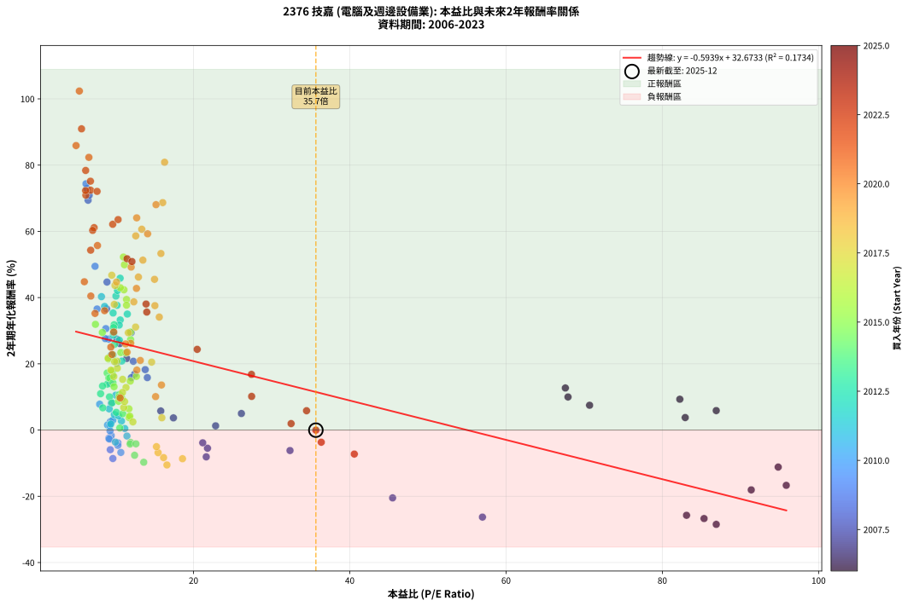
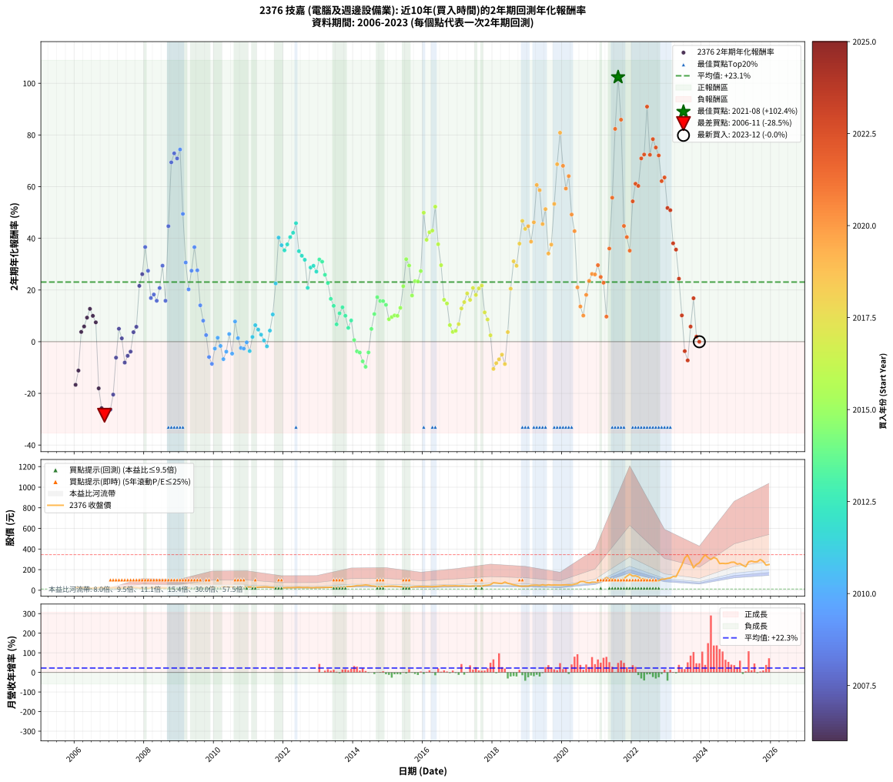

# 2376 技嘉 - 本益比與未來報酬率分析

!!! info "報告資訊"
    - **股票代號**: 2376
    - **公司名稱**: 技嘉
    - **產業別**: 電腦及週邊設備業
    - **分析期間**: 2006-2023 (216 個數據點)
    - **資料來源**: Type 12 (ShowMonthlyK_ChartFlow) 月收盤價與本益比
    - **報酬率口徑**: 含現金股利 (簡化: 年度合計，假設每年7/1入帳)
    - **報告生成時間**: 2026-01-13 13:20:46 CST

## 📈 視覺化圖表

### 圖表1: 本益比 vs 未來報酬率關係

*圖表1：2376 技嘉 本益比與2年期未來報酬率關係 (2006-2023)*

### 圖表2: 歷年買入時點的2年期實際報酬率

*圖表2：2376 技嘉 歷年買入時點的2年期實際報酬率 (2006-2023)*

## 📍 買點訊號說明

本報告提供兩種買點提示訊號（顯示於圖表2的股價子圖中）：

### ▲ 小綠色三角形（回測驗證）
- **計算方式**: 使用全部歷史資料計算本益比第25百分位數
- **用途**: 事後驗證，顯示歷史上哪些時點確實為低估區
- **限制**: 當下無法判斷，僅供回測參考
- **特性**: 後見之明（Look-Ahead Bias）

### ▲ 小橘色三角形（即時訊號）
- **計算方式**: 使用截至當月的過去5年資料計算本益比第25百分位數
- **用途**: 實際投資決策，當時即可判斷
- **優勢**: 可操作性強，符合實務需求
- **特性**: 無後見之明，滾動窗口計算

!!! tip "如何使用兩種訊號"
    - **綠色▲** 幫助理解歷史估值機會，驗證策略有效性
    - **橘色▲** 可作為實際買進參考，但仍需搭配基本面分析
    - 兩種訊號重疊時，表示即時判斷與事後驗證一致，信心度較高
    - 僅有綠色▲時，表示當時無法判斷（需要未來資料才能確認）
    - 僅有橘色▲時，表示即時判斷為買點，但事後可能不是最佳時機

## 📊 估值分析摘要

| 指標 | 數值 |
|:---:|:---:|
| **目前本益比** (2023-12) | **35.66 倍** |
| **歷史平均本益比** | 16.18 倍 |
| **估值水準** | 🔴 相對高估 |
| **預期2年年化報酬率** | **+11.49%** |
| **歷史平均報酬率** | +23.06% |
| **相關係數 (R²)** | 0.1734 |
| **趨勢線斜率** | -0.5939 |

!!! abstract "核心洞察"
    目前本益比顯著高於歷史平均，預期未來報酬率可能較低

    根據歷史數據回測，2376 技嘉 在目前本益比 **35.7倍** 的估值水準下，
    預期未來2年年化報酬率約為 **+11.5%**。

    **重要提醒**: 本分析基於歷史數據統計，實際報酬率會受到公司基本面變化、產業趨勢、
    總體經濟環境等多重因素影響。R² = 0.17 表示本益比可解釋約 17.3% 的報酬率變異。

## 📈 歷史估值統計

### 最佳買點 (最高報酬率)

| 項目 | 數值 |
|:---:|:---:|
| 起始時間 | 2021-08 |
| 當時本益比 | 5.39 倍 |
| 起始價格 | 87.8 元 |
| 2年後價格 | 341.0 元 |
| **2年年化報酬率** | **+102.36%** |

### 最差買點 (最低報酬率)

| 項目 | 數值 |
|:---:|:---:|
| 起始時間 | 2006-11 |
| 當時本益比 | 86.90 倍 |
| 起始價格 | 25.2 元 |
| 2年後價格 | 11.3 元 |
| **2年年化報酬率** | **-28.47%** |

## 🎯 投資啟示

### 本益比與報酬率關係

趨勢線方程式: **y = -0.5939x + 32.6733**

!!! warning "強負相關"
    本益比與未來報酬率呈現強負相關。在高本益比時期買入，未來報酬率顯著較低；
    在低本益比時期買入，未來報酬率顯著較高。**估值紀律至關重要**。

### 估值區間建議

基於歷史數據分析:

- **🟢 低估區** (P/E < 12.9): 預期報酬率較高，可考慮增加持股
- **🟡 合理區** (P/E 12.9-19.4): 預期報酬率符合長期趨勢，正常持有
- **🔴 高估區** (P/E > 19.4): 預期報酬率較低，可考慮減碼或觀望

!!! danger "風險提示"
    - 過去表現不代表未來結果
    - 本分析假設公司基本面無重大結構性變化
    - 產業環境劇變可能使歷史規律失效
    - 應結合公司財報、產業趨勢、總體經濟等多重因素綜合判斷

!!! success "長期投資觀點"
    歷史數據顯示，在合理或低估的估值水準買入並長期持有，
    往往能獲得較佳的投資報酬。**耐心等待好價格**是價值投資的核心原則。

## 📊 數據品質

- **資料來源**: GoodInfo.tw Type 12 (ShowMonthlyK_ChartFlow)
- **資料頻率**: 月度收盤價與本益比
- **回測期間**: 2006-2023
- **數據點數量**: 216 個 (每個點代表一次2年期回測)

### 計算方法說明

1. **2年期年化報酬率**:
   - 對每個歷史時點，計算其後2年的實際投資報酬率
   - 期末價值(不含股利): 期末價格
   - 期末價值(含現金股利): 期末價格 + 持有期間內的現金股利合計 (簡化: 年度合計，假設每年7/1入帳)
   - 公式: 年化報酬率 = [(期末價值/期初價格)^(1/年數) - 1] × 100%

2. **本益比 (P/E Ratio)**:
   - 使用當時的月收盤價與EPS計算
   - 資料來源: Type 12 月度河流圖本益比數據

3. **趨勢線 (Linear Regression)**:
   - 使用最小平方法擬合線性趨勢線
   - R²值衡量本益比對報酬率的解釋能力

---

*本報告由 Stock Analysis System v1.9.0 自動生成*
*數據更新時間: 2026-01-13 13:20:46 CST*

## 📋 月度回測明細表

（每一列對應時間線圖中的一個買入點；可用來對照 SVG 圖上的每個點。）

| 買入月份 | 賣出月份 | 回測期限_年 | 實際持有年數 | 買入本益比_倍 | 買入收盤價_元 | 賣出收盤價_元 | 現金股利合計_元 | 總報酬率_pct | 年化報酬率_pct |
| --- | --- | --- | --- | --- | --- | --- | --- | --- | --- |
| 2006-01 | 2008-01 | 2 | 1.999 | 95.86 | 27.80 | 17.40 | 1.90 | -30.58 | -16.69 |
| 2006-02 | 2008-02 | 2 | 1.999 | 94.83 | 27.50 | 19.80 | 1.90 | -21.09 | -11.18 |
| 2006-03 | 2008-03 | 2 | 2.001 | 82.93 | 24.05 | 24.00 | 1.90 | +7.69 | +3.77 |
| 2006-04 | 2008-04 | 2 | 2.001 | 86.90 | 25.20 | 26.35 | 1.90 | +12.10 | +5.87 |
| 2006-05 | 2008-05 | 2 | 2.001 | 82.24 | 23.85 | 26.60 | 1.90 | +19.50 | +9.31 |
| 2006-06 | 2008-06 | 2 | 2.001 | 67.59 | 19.60 | 23.00 | 1.90 | +27.04 | +12.70 |
| 2006-07 | 2008-07 | 2 | 2.001 | 67.93 | 19.70 | 22.25 | 1.59 | +21.00 | +9.99 |
| 2006-08 | 2008-08 | 2 | 2.001 | 70.69 | 20.50 | 22.10 | 1.59 | +15.55 | +7.49 |
| 2006-09 | 2008-09 | 2 | 2.001 | 91.38 | 26.50 | 16.20 | 1.59 | -32.88 | -18.06 |
| 2006-10 | 2008-10 | 2 | 2.001 | 83.10 | 24.10 | 11.70 | 1.59 | -44.87 | -25.73 |
| 2006-11 | 2008-11 | 2 | 2.001 | 86.90 | 25.20 | 11.30 | 1.59 | -48.86 | -28.47 |
| 2006-12 | 2008-12 | 2 | 2.001 | 85.34 | 24.75 | 11.70 | 1.59 | -46.32 | -26.71 |
| 2007-01 | 2009-01 | 2 | 2.001 | 56.98 | 24.55 | 11.75 | 1.59 | -45.67 | -26.28 |
| 2007-02 | 2009-02 | 2 | 2.001 | 45.48 | 26.00 | 14.85 | 1.59 | -36.78 | -20.48 |
| 2007-03 | 2009-03 | 2 | 2.001 | 32.35 | 23.05 | 18.70 | 1.59 | -11.99 | -6.18 |
| 2007-04 | 2009-04 | 2 | 2.001 | 26.13 | 22.30 | 23.00 | 1.59 | +10.26 | +5.00 |
| 2007-05 | 2009-05 | 2 | 2.001 | 22.83 | 22.70 | 21.70 | 1.59 | +2.59 | +1.28 |
| 2007-06 | 2009-06 | 2 | 2.001 | 21.63 | 24.55 | 19.15 | 1.59 | -15.53 | -8.09 |
| 2007-07 | 2009-07 | 2 | 2.001 | 21.79 | 27.80 | 22.85 | 1.99 | -10.66 | -5.48 |
| 2007-08 | 2009-08 | 2 | 2.001 | 21.18 | 30.00 | 25.75 | 1.99 | -7.54 | -3.84 |
| 2007-09 | 2009-09 | 2 | 2.001 | 17.43 | 27.15 | 27.20 | 1.99 | +7.50 | +3.68 |
| 2007-10 | 2009-10 | 2 | 2.001 | 15.81 | 26.85 | 28.05 | 1.99 | +11.87 | +5.76 |
| 2007-11 | 2009-11 | 2 | 2.001 | 11.45 | 21.05 | 29.15 | 1.99 | +47.92 | +21.61 |
| 2007-12 | 2009-12 | 2 | 2.001 | 10.58 | 20.95 | 31.35 | 1.99 | +59.13 | +26.13 |
| 2008-01 | 2010-01 | 2 | 2.001 | 8.87 | 17.40 | 30.50 | 1.99 | +86.71 | +36.61 |
| 2008-02 | 2010-03 | 2 | 2.081 | 10.19 | 19.80 | 30.80 | 1.99 | +65.59 | +27.43 |
| 2008-03 | 2010-03 | 2 | 1.999 | 12.47 | 24.00 | 30.80 | 1.99 | +36.61 | +16.89 |
| 2008-04 | 2010-04 | 2 | 1.999 | 13.82 | 26.35 | 34.85 | 1.99 | +39.80 | +18.25 |
| 2008-05 | 2010-05 | 2 | 1.999 | 14.09 | 26.60 | 33.70 | 1.99 | +34.16 | +15.84 |
| 2008-06 | 2010-06 | 2 | 1.999 | 12.30 | 23.00 | 31.55 | 1.99 | +45.81 | +20.77 |
| 2008-07 | 2010-07 | 2 | 1.999 | 12.02 | 22.25 | 33.75 | 3.50 | +67.41 | +29.41 |
| 2008-08 | 2010-08 | 2 | 1.999 | 12.05 | 22.10 | 26.15 | 3.50 | +34.15 | +15.84 |
| 2008-09 | 2010-09 | 2 | 1.999 | 8.93 | 16.20 | 30.40 | 3.50 | +109.25 | +44.69 |
| 2008-10 | 2010-10 | 2 | 1.999 | 6.51 | 11.70 | 30.05 | 3.50 | +186.74 | +69.39 |
| 2008-11 | 2010-11 | 2 | 1.999 | 6.35 | 11.30 | 30.25 | 3.50 | +198.65 | +72.88 |
| 2008-12 | 2010-12 | 2 | 1.999 | 6.65 | 11.70 | 30.65 | 3.50 | +191.86 | +70.90 |
| 2009-01 | 2011-01 | 2 | 1.999 | 6.24 | 11.75 | 32.20 | 3.50 | +203.81 | +74.37 |
| 2009-02 | 2011-02 | 2 | 1.999 | 7.40 | 14.85 | 29.65 | 3.50 | +123.22 | +49.45 |
| 2009-03 | 2011-03 | 2 | 1.999 | 8.78 | 18.70 | 28.40 | 3.50 | +70.58 | +30.63 |
| 2009-04 | 2011-04 | 2 | 1.999 | 10.21 | 23.00 | 29.75 | 3.50 | +44.56 | +20.25 |
| 2009-05 | 2011-05 | 2 | 1.999 | 9.13 | 21.70 | 31.75 | 3.50 | +62.43 | +27.47 |
| 2009-06 | 2011-06 | 2 | 1.999 | 7.66 | 19.15 | 32.20 | 3.50 | +86.41 | +36.56 |
| 2009-07 | 2011-07 | 2 | 1.999 | 8.71 | 22.85 | 32.20 | 5.00 | +62.79 | +27.61 |
| 2009-08 | 2011-08 | 2 | 1.999 | 9.37 | 25.75 | 28.50 | 5.00 | +30.09 | +14.07 |
| 2009-09 | 2011-09 | 2 | 1.999 | 9.48 | 27.20 | 26.80 | 5.00 | +16.90 | +8.13 |
| 2009-10 | 2011-10 | 2 | 1.999 | 9.37 | 28.05 | 24.50 | 5.00 | +5.16 | +2.55 |
| 2009-11 | 2011-11 | 2 | 1.999 | 9.35 | 29.15 | 20.80 | 5.00 | -11.50 | -5.93 |
| 2009-12 | 2011-12 | 2 | 1.999 | 9.68 | 31.35 | 21.20 | 5.00 | -16.44 | -8.59 |
| 2010-01 | 2012-01 | 2 | 1.999 | 9.40 | 30.50 | 23.90 | 5.00 | -5.26 | -2.67 |
| 2010-02 | 2012-02 | 2 | 1.999 | 9.00 | 29.25 | 25.15 | 5.00 | +3.07 | +1.52 |
| 2010-03 | 2012-03 | 2 | 2.001 | 9.47 | 30.80 | 24.80 | 5.00 | -3.26 | -1.64 |
| 2010-04 | 2012-04 | 2 | 2.001 | 10.70 | 34.85 | 25.30 | 5.00 | -13.06 | -6.76 |
| 2010-05 | 2012-05 | 2 | 2.001 | 10.33 | 33.70 | 26.15 | 5.00 | -7.58 | -3.86 |
| 2010-06 | 2012-06 | 2 | 2.001 | 9.66 | 31.55 | 28.45 | 5.00 | +6.01 | +2.96 |
| 2010-07 | 2012-07 | 2 | 2.001 | 10.32 | 33.75 | 26.20 | 4.50 | -9.04 | -4.63 |
| 2010-08 | 2012-08 | 2 | 2.001 | 7.99 | 26.15 | 25.90 | 4.50 | +16.24 | +7.81 |
| 2010-09 | 2012-09 | 2 | 2.001 | 9.28 | 30.40 | 26.75 | 4.50 | +2.79 | +1.38 |
| 2010-10 | 2012-10 | 2 | 2.001 | 9.16 | 30.05 | 24.10 | 4.50 | -4.83 | -2.44 |
| 2010-11 | 2012-11 | 2 | 2.001 | 9.21 | 30.25 | 24.15 | 4.50 | -5.30 | -2.68 |
| 2010-12 | 2012-12 | 2 | 2.001 | 9.32 | 30.65 | 26.00 | 4.50 | -0.50 | -0.25 |
| 2011-01 | 2013-01 | 2 | 2.001 | 10.00 | 32.20 | 25.40 | 4.50 | -7.15 | -3.64 |
| 2011-02 | 2013-02 | 2 | 2.001 | 9.41 | 29.65 | 26.25 | 4.50 | +3.70 | +1.83 |
| 2011-03 | 2013-03 | 2 | 2.001 | 9.21 | 28.40 | 27.65 | 4.50 | +13.20 | +6.39 |
| 2011-04 | 2013-04 | 2 | 2.001 | 9.87 | 29.75 | 28.10 | 4.50 | +9.57 | +4.67 |
| 2011-05 | 2013-05 | 2 | 2.001 | 10.78 | 31.75 | 29.00 | 4.50 | +5.51 | +2.71 |
| 2011-06 | 2013-06 | 2 | 2.001 | 11.20 | 32.20 | 28.00 | 4.50 | +0.93 | +0.46 |
| 2011-07 | 2013-07 | 2 | 2.001 | 11.48 | 32.20 | 27.05 | 4.00 | -3.57 | -1.80 |
| 2011-08 | 2013-08 | 2 | 2.001 | 10.41 | 28.50 | 27.00 | 4.00 | +8.77 | +4.29 |
| 2011-09 | 2013-09 | 2 | 2.001 | 10.05 | 26.80 | 28.75 | 4.00 | +22.20 | +10.54 |
| 2011-10 | 2013-10 | 2 | 2.001 | 9.43 | 24.50 | 32.80 | 4.00 | +50.20 | +22.54 |
| 2011-11 | 2013-11 | 2 | 2.001 | 8.22 | 20.80 | 36.95 | 4.00 | +96.87 | +40.28 |
| 2011-12 | 2013-12 | 2 | 2.001 | 8.62 | 21.20 | 36.00 | 4.00 | +88.67 | +37.33 |
| 2012-01 | 2014-01 | 2 | 2.001 | 9.71 | 23.90 | 39.80 | 4.00 | +83.26 | +35.35 |
| 2012-02 | 2014-03 | 2 | 2.081 | 10.21 | 25.15 | 44.90 | 4.00 | +94.43 | +37.65 |
| 2012-03 | 2014-03 | 2 | 1.999 | 10.07 | 24.80 | 44.90 | 4.00 | +97.17 | +40.45 |
| 2012-04 | 2014-04 | 2 | 1.999 | 10.27 | 25.30 | 47.10 | 4.00 | +101.97 | +42.15 |
| 2012-05 | 2014-05 | 2 | 1.999 | 10.61 | 26.15 | 51.60 | 4.00 | +112.62 | +45.85 |
| 2012-06 | 2014-06 | 2 | 1.999 | 11.53 | 28.45 | 47.85 | 4.00 | +82.25 | +35.03 |
| 2012-07 | 2014-07 | 2 | 1.999 | 10.62 | 26.20 | 41.50 | 5.00 | +77.48 | +33.25 |
| 2012-08 | 2014-08 | 2 | 1.999 | 10.49 | 25.90 | 39.90 | 5.00 | +73.36 | +31.69 |
| 2012-09 | 2014-09 | 2 | 1.999 | 10.83 | 26.75 | 34.05 | 5.00 | +45.98 | +20.84 |
| 2012-10 | 2014-10 | 2 | 1.999 | 9.75 | 24.10 | 34.90 | 5.00 | +65.56 | +28.69 |
| 2012-11 | 2014-11 | 2 | 1.999 | 9.77 | 24.15 | 35.40 | 5.00 | +67.29 | +29.36 |
| 2012-12 | 2014-12 | 2 | 1.999 | 10.51 | 26.00 | 37.00 | 5.00 | +61.54 | +27.12 |
| 2013-01 | 2015-01 | 2 | 1.999 | 9.84 | 25.40 | 39.10 | 5.00 | +73.62 | +31.79 |
| 2013-02 | 2015-02 | 2 | 1.999 | 9.76 | 26.25 | 40.00 | 5.00 | +71.43 | +30.95 |
| 2013-03 | 2015-03 | 2 | 1.999 | 9.89 | 27.65 | 38.80 | 5.00 | +58.41 | +25.88 |
| 2013-04 | 2015-04 | 2 | 1.999 | 9.68 | 28.10 | 37.30 | 5.00 | +50.53 | +22.71 |
| 2013-05 | 2015-05 | 2 | 1.999 | 9.64 | 29.00 | 34.40 | 5.00 | +35.86 | +16.57 |
| 2013-06 | 2015-06 | 2 | 1.999 | 8.98 | 28.00 | 31.30 | 5.00 | +29.64 | +13.87 |
| 2013-07 | 2015-07 | 2 | 1.999 | 8.39 | 27.05 | 25.10 | 5.70 | +13.86 | +6.71 |
| 2013-08 | 2015-08 | 2 | 1.999 | 8.11 | 27.00 | 27.55 | 5.70 | +23.15 | +10.98 |
| 2013-09 | 2015-09 | 2 | 1.999 | 8.36 | 28.75 | 31.20 | 5.70 | +28.35 | +13.30 |
| 2013-10 | 2015-10 | 2 | 1.999 | 9.25 | 32.80 | 34.00 | 5.70 | +21.04 | +10.02 |
| 2013-11 | 2015-11 | 2 | 1.999 | 10.12 | 36.95 | 35.30 | 5.70 | +10.96 | +5.34 |
| 2013-12 | 2015-12 | 2 | 1.999 | 9.57 | 36.00 | 36.45 | 5.70 | +17.08 | +8.21 |
| 2014-01 | 2016-01 | 2 | 1.999 | 10.57 | 39.80 | 34.60 | 5.70 | +1.26 | +0.63 |
| 2014-02 | 2016-02 | 2 | 1.999 | 11.94 | 45.00 | 36.00 | 5.70 | -7.33 | -3.74 |
| 2014-03 | 2016-03 | 2 | 2.001 | 11.89 | 44.90 | 35.50 | 5.70 | -8.24 | -4.21 |
| 2014-04 | 2016-04 | 2 | 2.001 | 12.46 | 47.10 | 34.50 | 5.70 | -14.65 | -7.61 |
| 2014-05 | 2016-05 | 2 | 2.001 | 13.63 | 51.60 | 36.35 | 5.70 | -18.51 | -9.72 |
| 2014-06 | 2016-06 | 2 | 2.001 | 12.63 | 47.85 | 38.25 | 5.70 | -8.15 | -4.16 |
| 2014-07 | 2016-07 | 2 | 2.001 | 10.94 | 41.50 | 40.50 | 5.20 | +10.12 | +4.93 |
| 2014-08 | 2016-08 | 2 | 2.001 | 10.50 | 39.90 | 43.70 | 5.20 | +22.56 | +10.70 |
| 2014-09 | 2016-09 | 2 | 2.001 | 8.95 | 34.05 | 41.60 | 5.20 | +37.44 | +17.22 |
| 2014-10 | 2016-10 | 2 | 2.001 | 9.16 | 34.90 | 41.55 | 5.20 | +33.95 | +15.73 |
| 2014-11 | 2016-11 | 2 | 2.001 | 9.28 | 35.40 | 42.20 | 5.20 | +33.90 | +15.70 |
| 2014-12 | 2016-12 | 2 | 2.001 | 9.69 | 37.00 | 43.10 | 5.20 | +30.54 | +14.24 |
| 2015-01 | 2017-01 | 2 | 2.001 | 10.41 | 39.10 | 41.00 | 5.20 | +18.16 | +8.69 |
| 2015-02 | 2017-02 | 2 | 2.001 | 10.84 | 40.00 | 42.80 | 5.20 | +20.00 | +9.54 |
| 2015-03 | 2017-03 | 2 | 2.001 | 10.70 | 38.80 | 41.90 | 5.20 | +21.39 | +10.17 |
| 2015-04 | 2017-04 | 2 | 2.001 | 10.47 | 37.30 | 39.95 | 5.20 | +21.05 | +10.01 |
| 2015-05 | 2017-05 | 2 | 2.001 | 9.83 | 34.40 | 38.80 | 5.20 | +27.91 | +13.09 |
| 2015-06 | 2017-06 | 2 | 2.001 | 9.11 | 31.30 | 41.00 | 5.20 | +47.60 | +21.48 |
| 2015-07 | 2017-07 | 2 | 2.001 | 7.45 | 25.10 | 38.60 | 5.10 | +74.10 | +31.92 |
| 2015-08 | 2017-08 | 2 | 2.001 | 8.33 | 27.55 | 41.10 | 5.10 | +67.70 | +29.47 |
| 2015-09 | 2017-09 | 2 | 2.001 | 9.62 | 31.20 | 38.25 | 5.10 | +38.94 | +17.86 |
| 2015-10 | 2017-10 | 2 | 2.001 | 10.70 | 34.00 | 46.70 | 5.10 | +52.35 | +23.41 |
| 2015-11 | 2017-11 | 2 | 2.001 | 11.34 | 35.30 | 48.60 | 5.10 | +52.12 | +23.32 |
| 2015-12 | 2017-12 | 2 | 2.001 | 11.95 | 36.45 | 54.00 | 5.10 | +62.14 | +27.31 |
| 2016-01 | 2018-01 | 2 | 2.001 | 11.16 | 34.60 | 72.70 | 5.10 | +124.86 | +49.91 |
| 2016-02 | 2018-03 | 2 | 2.081 | 11.43 | 36.00 | 66.80 | 5.10 | +99.72 | +39.44 |
| 2016-03 | 2018-03 | 2 | 1.999 | 11.10 | 35.50 | 66.80 | 5.10 | +102.54 | +42.35 |
| 2016-04 | 2018-04 | 2 | 1.999 | 10.63 | 34.50 | 65.40 | 5.10 | +104.35 | +42.99 |
| 2016-05 | 2018-05 | 2 | 1.999 | 11.03 | 36.35 | 79.10 | 5.10 | +131.64 | +52.24 |
| 2016-06 | 2018-06 | 2 | 1.999 | 11.43 | 38.25 | 67.40 | 5.10 | +89.54 | +37.70 |
| 2016-07 | 2018-07 | 2 | 1.999 | 11.93 | 40.50 | 61.40 | 6.60 | +67.90 | +29.60 |
| 2016-08 | 2018-08 | 2 | 1.999 | 12.69 | 43.70 | 52.40 | 6.60 | +35.01 | +16.21 |
| 2016-09 | 2018-09 | 2 | 1.999 | 11.91 | 41.60 | 48.20 | 6.60 | +31.73 | +14.78 |
| 2016-10 | 2018-10 | 2 | 1.999 | 11.73 | 41.55 | 40.45 | 6.60 | +13.24 | +6.42 |
| 2016-11 | 2018-11 | 2 | 1.999 | 11.75 | 42.20 | 38.85 | 6.60 | +7.70 | +3.78 |
| 2016-12 | 2018-12 | 2 | 1.999 | 11.84 | 43.10 | 40.20 | 6.60 | +8.58 | +4.21 |
| 2017-01 | 2019-01 | 2 | 1.999 | 11.07 | 41.00 | 40.15 | 6.60 | +14.02 | +6.79 |
| 2017-02 | 2019-02 | 2 | 1.999 | 11.36 | 42.80 | 47.90 | 6.60 | +27.34 | +12.85 |
| 2017-03 | 2019-03 | 2 | 1.999 | 10.93 | 41.90 | 49.10 | 6.60 | +32.94 | +15.31 |
| 2017-04 | 2019-04 | 2 | 1.999 | 10.25 | 39.95 | 49.65 | 6.60 | +40.80 | +18.67 |
| 2017-05 | 2019-05 | 2 | 1.999 | 9.80 | 38.80 | 45.75 | 6.60 | +34.92 | +16.17 |
| 2017-06 | 2019-06 | 2 | 1.999 | 10.19 | 41.00 | 53.20 | 6.60 | +45.85 | +20.79 |
| 2017-07 | 2019-07 | 2 | 1.999 | 9.44 | 38.60 | 46.80 | 7.00 | +39.38 | +18.07 |
| 2017-08 | 2019-08 | 2 | 1.999 | 9.90 | 41.10 | 52.80 | 7.00 | +45.50 | +20.64 |
| 2017-09 | 2019-09 | 2 | 1.999 | 9.07 | 38.25 | 49.65 | 7.00 | +48.10 | +21.71 |
| 2017-10 | 2019-10 | 2 | 1.999 | 10.91 | 46.70 | 50.90 | 7.00 | +23.98 | +11.36 |
| 2017-11 | 2019-11 | 2 | 1.999 | 11.18 | 48.60 | 50.30 | 7.00 | +17.90 | +8.59 |
| 2017-12 | 2019-12 | 2 | 1.999 | 12.24 | 54.00 | 49.70 | 7.00 | +5.00 | +2.47 |
| 2018-01 | 2020-01 | 2 | 1.999 | 16.60 | 72.70 | 51.20 | 7.00 | -19.94 | -10.53 |
| 2018-02 | 2020-02 | 2 | 1.999 | 16.17 | 70.30 | 52.10 | 7.00 | -15.93 | -8.32 |
| 2018-03 | 2020-03 | 2 | 2.001 | 15.47 | 66.80 | 51.00 | 7.00 | -13.17 | -6.81 |
| 2018-04 | 2020-04 | 2 | 2.001 | 15.26 | 65.40 | 52.00 | 7.00 | -9.79 | -5.02 |
| 2018-05 | 2020-05 | 2 | 2.001 | 18.59 | 79.10 | 59.00 | 7.00 | -16.56 | -8.65 |
| 2018-06 | 2020-06 | 2 | 2.001 | 15.95 | 67.40 | 65.50 | 7.00 | +7.57 | +3.71 |
| 2018-07 | 2020-07 | 2 | 2.001 | 14.64 | 61.40 | 84.00 | 5.20 | +45.28 | +20.52 |
| 2018-08 | 2020-08 | 2 | 2.001 | 12.59 | 52.40 | 84.90 | 5.20 | +71.95 | +31.10 |
| 2018-09 | 2020-09 | 2 | 2.001 | 11.66 | 48.20 | 75.50 | 5.20 | +67.43 | +29.37 |
| 2018-10 | 2020-10 | 2 | 2.001 | 9.86 | 40.45 | 71.80 | 5.20 | +90.36 | +37.94 |
| 2018-11 | 2020-11 | 2 | 2.001 | 9.54 | 38.85 | 78.50 | 5.20 | +115.44 | +46.74 |
| 2018-12 | 2020-12 | 2 | 2.001 | 9.95 | 40.20 | 77.80 | 5.20 | +106.47 | +43.65 |
| 2019-01 | 2021-01 | 2 | 2.001 | 10.15 | 40.15 | 78.90 | 5.20 | +109.46 | +44.69 |
| 2019-02 | 2021-02 | 2 | 2.001 | 12.36 | 47.90 | 87.00 | 5.20 | +92.48 | +38.71 |
| 2019-03 | 2021-03 | 2 | 2.001 | 12.95 | 49.10 | 99.80 | 5.20 | +113.85 | +46.20 |
| 2019-04 | 2021-04 | 2 | 2.001 | 13.38 | 49.65 | 123.00 | 5.20 | +158.21 | +60.64 |
| 2019-05 | 2021-05 | 2 | 2.001 | 12.61 | 45.75 | 110.00 | 5.20 | +151.80 | +58.63 |
| 2019-06 | 2021-06 | 2 | 2.001 | 15.01 | 53.20 | 107.50 | 5.20 | +111.84 | +45.51 |
| 2019-07 | 2021-07 | 2 | 2.001 | 13.52 | 46.80 | 100.00 | 7.20 | +129.06 | +51.30 |
| 2019-08 | 2021-08 | 2 | 2.001 | 15.62 | 52.80 | 87.80 | 7.20 | +79.92 | +34.11 |
| 2019-09 | 2021-09 | 2 | 2.001 | 15.06 | 49.65 | 86.80 | 7.20 | +89.33 | +37.57 |
| 2019-10 | 2021-10 | 2 | 2.001 | 15.83 | 50.90 | 112.50 | 7.20 | +135.17 | +53.31 |
| 2019-11 | 2021-11 | 2 | 2.001 | 16.06 | 50.30 | 136.00 | 7.20 | +184.69 | +68.67 |
| 2019-12 | 2021-12 | 2 | 2.001 | 16.30 | 49.70 | 155.50 | 7.20 | +227.36 | +80.86 |
| 2020-01 | 2022-01 | 2 | 2.001 | 15.20 | 51.20 | 137.50 | 7.20 | +182.62 | +68.05 |
| 2020-02 | 2022-03 | 2 | 2.081 | 14.13 | 52.10 | 130.00 | 7.20 | +163.34 | +59.26 |
| 2020-03 | 2022-03 | 2 | 1.999 | 12.73 | 51.00 | 130.00 | 7.20 | +169.02 | +64.07 |
| 2020-04 | 2022-04 | 2 | 1.999 | 12.02 | 52.00 | 108.50 | 7.20 | +122.50 | +49.21 |
| 2020-05 | 2022-05 | 2 | 1.999 | 12.70 | 59.00 | 113.00 | 7.20 | +103.73 | +42.77 |
| 2020-06 | 2022-06 | 2 | 1.999 | 13.19 | 65.50 | 88.70 | 7.20 | +46.41 | +21.02 |
| 2020-07 | 2022-07 | 2 | 1.999 | 15.90 | 84.00 | 91.40 | 17.00 | +29.05 | +13.61 |
| 2020-08 | 2022-08 | 2 | 1.999 | 15.15 | 84.90 | 85.90 | 17.00 | +21.20 | +10.10 |
| 2020-09 | 2022-09 | 2 | 1.999 | 12.75 | 75.50 | 88.30 | 17.00 | +39.47 | +18.11 |
| 2020-10 | 2022-10 | 2 | 1.999 | 11.50 | 71.80 | 92.50 | 17.00 | +52.51 | +23.51 |
| 2020-11 | 2022-11 | 2 | 1.999 | 11.96 | 78.50 | 108.00 | 17.00 | +59.24 | +26.21 |
| 2020-12 | 2022-12 | 2 | 1.999 | 11.31 | 77.80 | 106.50 | 17.00 | +58.74 | +26.01 |
| 2021-01 | 2023-01 | 2 | 1.999 | 9.79 | 78.90 | 115.50 | 17.00 | +67.93 | +29.61 |
| 2021-02 | 2023-02 | 2 | 1.999 | 9.42 | 87.00 | 119.00 | 17.00 | +56.32 | +25.05 |
| 2021-03 | 2023-03 | 2 | 1.999 | 9.58 | 99.80 | 133.50 | 17.00 | +50.80 | +22.82 |
| 2021-04 | 2023-04 | 2 | 1.999 | 10.61 | 123.00 | 131.00 | 17.00 | +20.33 | +9.70 |
| 2021-05 | 2023-05 | 2 | 1.999 | 8.62 | 110.00 | 186.50 | 17.00 | +85.00 | +36.04 |
| 2021-06 | 2023-06 | 2 | 1.999 | 7.71 | 107.50 | 243.50 | 17.00 | +142.33 | +55.72 |
| 2021-07 | 2023-07 | 2 | 1.999 | 6.61 | 100.00 | 314.00 | 18.20 | +232.20 | +82.34 |
| 2021-08 | 2023-08 | 2 | 1.999 | 5.39 | 87.80 | 341.00 | 18.20 | +309.11 | +102.36 |
| 2021-09 | 2023-09 | 2 | 1.999 | 4.97 | 86.80 | 281.50 | 18.20 | +245.28 | +85.90 |
| 2021-10 | 2023-10 | 2 | 1.999 | 6.03 | 112.50 | 217.50 | 18.20 | +109.51 | +44.78 |
| 2021-11 | 2023-11 | 2 | 1.999 | 6.86 | 136.00 | 250.00 | 18.20 | +97.21 | +40.46 |
| 2021-12 | 2023-12 | 2 | 1.999 | 7.40 | 155.50 | 266.00 | 18.20 | +82.77 | +35.22 |
| 2022-01 | 2024-01 | 2 | 1.999 | 6.84 | 137.50 | 309.00 | 18.20 | +137.96 | +54.31 |
| 2022-02 | 2024-02 | 2 | 1.999 | 7.28 | 140.00 | 345.00 | 18.20 | +159.43 | +61.12 |
| 2022-03 | 2024-03 | 2 | 2.001 | 7.09 | 130.00 | 316.00 | 18.20 | +157.08 | +60.28 |
| 2022-04 | 2024-04 | 2 | 2.001 | 6.22 | 108.50 | 299.00 | 18.20 | +192.35 | +70.92 |
| 2022-05 | 2024-05 | 2 | 2.001 | 6.83 | 113.00 | 318.00 | 18.20 | +197.52 | +72.42 |
| 2022-06 | 2024-06 | 2 | 2.001 | 5.67 | 88.70 | 305.50 | 18.20 | +264.94 | +90.95 |
| 2022-07 | 2024-07 | 2 | 2.001 | 6.19 | 91.40 | 259.00 | 12.56 | +197.11 | +72.30 |
| 2022-08 | 2024-08 | 2 | 2.001 | 6.20 | 85.90 | 261.00 | 12.56 | +218.46 | +78.38 |
| 2022-09 | 2024-09 | 2 | 2.001 | 6.81 | 88.30 | 258.50 | 12.56 | +206.97 | +75.14 |
| 2022-10 | 2024-10 | 2 | 2.001 | 7.66 | 92.50 | 261.50 | 12.56 | +196.28 | +72.06 |
| 2022-11 | 2024-11 | 2 | 2.001 | 9.66 | 108.00 | 271.50 | 12.56 | +163.02 | +62.12 |
| 2022-12 | 2024-12 | 2 | 2.001 | 10.35 | 106.50 | 272.50 | 12.56 | +167.66 | +63.55 |
| 2023-01 | 2025-01 | 2 | 2.001 | 11.49 | 115.50 | 253.50 | 12.56 | +130.35 | +51.73 |
| 2023-02 | 2025-02 | 2 | 2.001 | 12.12 | 119.00 | 258.50 | 12.56 | +127.78 | +50.88 |
| 2023-03 | 2025-03 | 2 | 2.001 | 13.93 | 133.50 | 242.00 | 12.56 | +90.68 | +38.06 |
| 2023-04 | 2025-04 | 2 | 2.001 | 14.02 | 131.00 | 228.50 | 12.56 | +84.01 | +35.62 |
| 2023-05 | 2025-05 | 2 | 2.001 | 20.47 | 186.50 | 276.00 | 12.56 | +54.72 | +24.37 |
| 2023-06 | 2025-06 | 2 | 2.001 | 27.44 | 243.50 | 283.00 | 12.56 | +21.38 | +10.16 |
| 2023-07 | 2025-07 | 2 | 2.001 | 36.35 | 314.00 | 275.00 | 16.36 | -7.21 | -3.67 |
| 2023-08 | 2025-08 | 2 | 2.001 | 40.58 | 341.00 | 277.00 | 16.36 | -13.97 | -7.24 |
| 2023-09 | 2025-09 | 2 | 2.001 | 34.47 | 281.50 | 299.00 | 16.36 | +12.03 | +5.84 |
| 2023-10 | 2025-10 | 2 | 2.001 | 27.42 | 217.50 | 280.50 | 16.36 | +36.49 | +16.81 |
| 2023-11 | 2025-11 | 2 | 2.001 | 32.49 | 250.00 | 243.50 | 16.36 | +3.94 | +1.95 |
| 2023-12 | 2025-12 | 2 | 2.001 | 35.66 | 266.00 | 249.50 | 16.36 | -0.05 | -0.03 |
