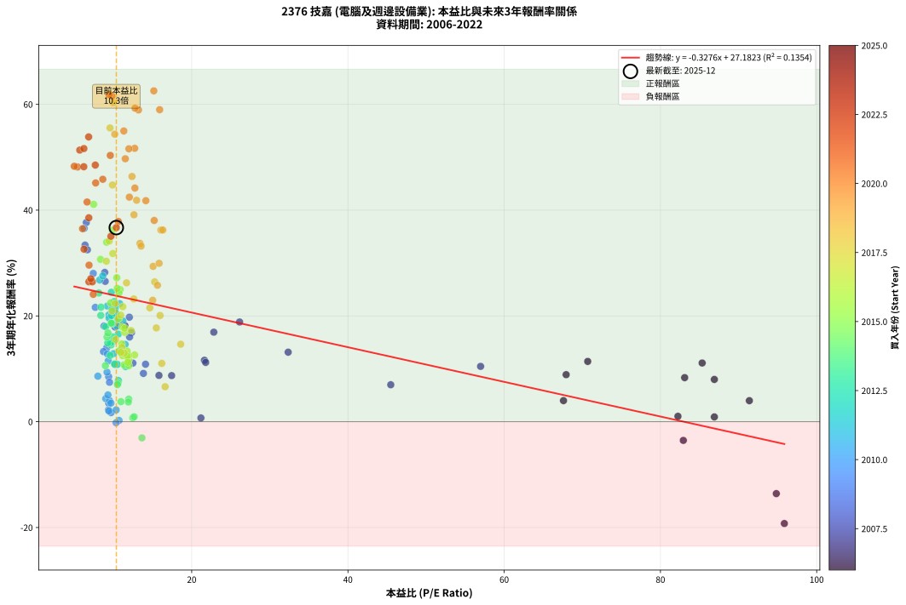
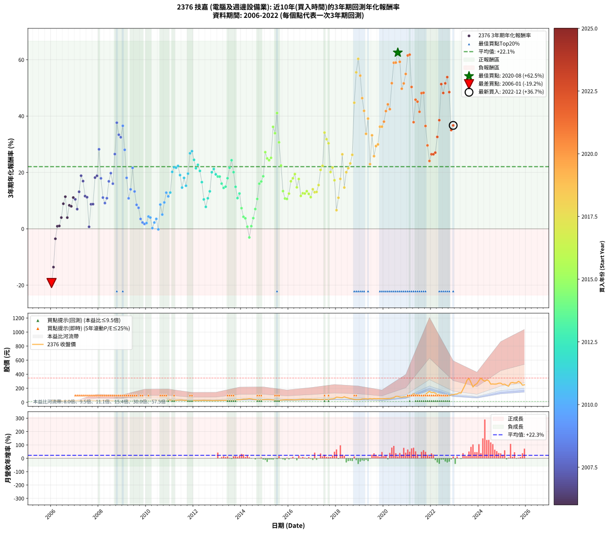

# 2376 技嘉 - 本益比與未來報酬率分析

!!! info "報告資訊"
    - **股票代號**: 2376
    - **公司名稱**: 技嘉
    - **產業別**: 電腦及週邊設備業
    - **分析期間**: 2006-2022 (204 個數據點)
    - **資料來源**: Type 12 (ShowMonthlyK_ChartFlow) 月收盤價與本益比
    - **報酬率口徑**: 含現金股利 (簡化: 年度合計，假設每年7/1入帳)
    - **報告生成時間**: 2026-01-06 22:33:15 CST

## 📈 視覺化圖表

### 圖表1: 本益比 vs 未來報酬率關係

*圖表1：2376 技嘉 本益比與3年期未來報酬率關係 (2006-2022)*

### 圖表2: 歷年買入時點的3年期實際報酬率

*圖表2：2376 技嘉 歷年買入時點的3年期實際報酬率 (2006-2022)*

## 📍 買點訊號說明

本報告提供兩種買點提示訊號（顯示於圖表2的股價子圖中）：

### ▲ 小綠色三角形（回測驗證）
- **計算方式**: 使用全部歷史資料計算本益比第25百分位數
- **用途**: 事後驗證，顯示歷史上哪些時點確實為低估區
- **限制**: 當下無法判斷，僅供回測參考
- **特性**: 後見之明（Look-Ahead Bias）

### ▲ 小橘色三角形（即時訊號）
- **計算方式**: 使用截至當月的過去5年資料計算本益比第25百分位數
- **用途**: 實際投資決策，當時即可判斷
- **優勢**: 可操作性強，符合實務需求
- **特性**: 無後見之明，滾動窗口計算

!!! tip "如何使用兩種訊號"
    - **綠色▲** 幫助理解歷史估值機會，驗證策略有效性
    - **橘色▲** 可作為實際買進參考，但仍需搭配基本面分析
    - 兩種訊號重疊時，表示即時判斷與事後驗證一致，信心度較高
    - 僅有綠色▲時，表示當時無法判斷（需要未來資料才能確認）
    - 僅有橘色▲時，表示即時判斷為買點，但事後可能不是最佳時機

## 📊 估值分析摘要

| 指標 | 數值 |
|:---:|:---:|
| **目前本益比** (2022-12) | **10.35 倍** |
| **歷史平均本益比** | 15.63 倍 |
| **估值水準** | 🟢 相對低估 |
| **預期3年年化報酬率** | **+23.79%** |
| **歷史平均報酬率** | +22.06% |
| **相關係數 (R²)** | 0.1354 |
| **趨勢線斜率** | -0.3276 |

!!! abstract "核心洞察"
    目前本益比顯著低於歷史平均，預期未來報酬率可能較高

    根據歷史數據回測，2376 技嘉 在目前本益比 **10.3倍** 的估值水準下，
    預期未來3年年化報酬率約為 **+23.8%**。

    **重要提醒**: 本分析基於歷史數據統計，實際報酬率會受到公司基本面變化、產業趨勢、
    總體經濟環境等多重因素影響。R² = 0.14 表示本益比可解釋約 13.5% 的報酬率變異。

## 📈 歷史估值統計

### 最佳買點 (最高報酬率)

| 項目 | 數值 |
|:---:|:---:|
| 起始時間 | 2020-08 |
| 當時本益比 | 15.15 倍 |
| 起始價格 | 84.9 元 |
| 3年後價格 | 341.0 元 |
| **3年年化報酬率** | **+62.54%** |

### 最差買點 (最低報酬率)

| 項目 | 數值 |
|:---:|:---:|
| 起始時間 | 2006-01 |
| 當時本益比 | 95.86 倍 |
| 起始價格 | 27.8 元 |
| 3年後價格 | 11.8 元 |
| **3年年化報酬率** | **-19.25%** |

## 🎯 投資啟示

### 本益比與報酬率關係

趨勢線方程式: **y = -0.3276x + 27.1823**

!!! note "負相關"
    本益比與未來報酬率呈現負相關。較低的本益比通常帶來較高的未來報酬率，
    但相關性不算非常強。**估值仍是重要參考指標之一**。

### 估值區間建議

基於歷史數據分析:

- **🟢 低估區** (P/E < 12.5): 預期報酬率較高，可考慮增加持股
- **🟡 合理區** (P/E 12.5-18.8): 預期報酬率符合長期趨勢，正常持有
- **🔴 高估區** (P/E > 18.8): 預期報酬率較低，可考慮減碼或觀望

!!! danger "風險提示"
    - 過去表現不代表未來結果
    - 本分析假設公司基本面無重大結構性變化
    - 產業環境劇變可能使歷史規律失效
    - 應結合公司財報、產業趨勢、總體經濟等多重因素綜合判斷

!!! success "長期投資觀點"
    歷史數據顯示，在合理或低估的估值水準買入並長期持有，
    往往能獲得較佳的投資報酬。**耐心等待好價格**是價值投資的核心原則。

## 📊 數據品質

- **資料來源**: GoodInfo.tw Type 12 (ShowMonthlyK_ChartFlow)
- **資料頻率**: 月度收盤價與本益比
- **回測期間**: 2006-2022
- **數據點數量**: 204 個 (每個點代表一次3年期回測)

### 計算方法說明

1. **3年期年化報酬率**:
   - 對每個歷史時點，計算其後3年的實際投資報酬率
   - 期末價值(不含股利): 期末價格
   - 期末價值(含現金股利): 期末價格 + 持有期間內的現金股利合計 (簡化: 年度合計，假設每年7/1入帳)
   - 公式: 年化報酬率 = [(期末價值/期初價格)^(1/年數) - 1] × 100%

2. **本益比 (P/E Ratio)**:
   - 使用當時的月收盤價與EPS計算
   - 資料來源: Type 12 月度河流圖本益比數據

3. **趨勢線 (Linear Regression)**:
   - 使用最小平方法擬合線性趨勢線
   - R²值衡量本益比對報酬率的解釋能力

---

*本報告由 Stock Analysis System v1.9.0 自動生成*
*數據更新時間: 2026-01-06 22:33:15 CST*

## 📋 月度回測明細表

（每一列對應時間線圖中的一個買入點；可用來對照 SVG 圖上的每個點。）

| 買入月份 | 賣出月份 | 回測期限_年 | 實際持有年數 | 買入本益比_倍 | 買入收盤價_元 | 賣出收盤價_元 | 現金股利合計_元 | 總報酬率_pct | 年化報酬率_pct |
| --- | --- | --- | --- | --- | --- | --- | --- | --- | --- |
| 2006-01 | 2009-01 | 3 | 3.001 | 95.86 | 27.80 | 11.75 | 2.89 | -47.35 | -19.25 |
| 2006-02 | 2009-02 | 3 | 3.001 | 94.83 | 27.50 | 14.85 | 2.89 | -35.50 | -13.60 |
| 2006-03 | 2009-03 | 3 | 3.001 | 82.93 | 24.05 | 18.70 | 2.89 | -10.24 | -3.54 |
| 2006-04 | 2009-04 | 3 | 3.001 | 86.90 | 25.20 | 23.00 | 2.89 | +2.73 | +0.90 |
| 2006-05 | 2009-05 | 3 | 3.001 | 82.24 | 23.85 | 21.70 | 2.89 | +3.09 | +1.02 |
| 2006-06 | 2009-06 | 3 | 3.001 | 67.59 | 19.60 | 19.15 | 2.89 | +12.43 | +3.98 |
| 2006-07 | 2009-07 | 3 | 3.001 | 67.93 | 19.70 | 22.85 | 2.59 | +29.12 | +8.89 |
| 2006-08 | 2009-08 | 3 | 3.001 | 70.69 | 20.50 | 25.75 | 2.59 | +38.23 | +11.39 |
| 2006-09 | 2009-09 | 3 | 3.001 | 91.38 | 26.50 | 27.20 | 2.59 | +12.40 | +3.97 |
| 2006-10 | 2009-10 | 3 | 3.001 | 83.10 | 24.10 | 28.05 | 2.59 | +27.12 | +8.33 |
| 2006-11 | 2009-11 | 3 | 3.001 | 86.90 | 25.20 | 29.15 | 2.59 | +25.94 | +7.99 |
| 2006-12 | 2009-12 | 3 | 3.001 | 85.34 | 24.75 | 31.35 | 2.59 | +37.12 | +11.09 |
| 2007-01 | 2010-01 | 3 | 3.001 | 56.98 | 24.55 | 30.50 | 2.59 | +34.77 | +10.46 |
| 2007-02 | 2010-02 | 3 | 3.001 | 45.48 | 26.00 | 29.25 | 2.59 | +22.45 | +6.98 |
| 2007-03 | 2010-03 | 3 | 3.001 | 32.35 | 23.05 | 30.80 | 2.59 | +44.85 | +13.14 |
| 2007-04 | 2010-04 | 3 | 3.001 | 26.13 | 22.30 | 34.85 | 2.59 | +67.88 | +18.85 |
| 2007-05 | 2010-05 | 3 | 3.001 | 22.83 | 22.70 | 33.70 | 2.59 | +59.85 | +16.92 |
| 2007-06 | 2010-06 | 3 | 3.001 | 21.63 | 24.55 | 31.55 | 2.59 | +39.05 | +11.61 |
| 2007-07 | 2010-07 | 3 | 3.001 | 21.79 | 27.80 | 33.75 | 4.49 | +37.54 | +11.21 |
| 2007-08 | 2010-08 | 3 | 3.001 | 21.18 | 30.00 | 26.15 | 4.49 | +2.12 | +0.70 |
| 2007-09 | 2010-09 | 3 | 3.001 | 17.43 | 27.15 | 30.40 | 4.49 | +28.49 | +8.71 |
| 2007-10 | 2010-10 | 3 | 3.001 | 15.81 | 26.85 | 30.05 | 4.49 | +28.62 | +8.75 |
| 2007-11 | 2010-11 | 3 | 3.001 | 11.45 | 21.05 | 30.25 | 4.49 | +65.01 | +18.16 |
| 2007-12 | 2010-12 | 3 | 3.001 | 10.58 | 20.95 | 30.65 | 4.49 | +67.71 | +18.81 |
| 2008-01 | 2011-01 | 3 | 3.001 | 8.87 | 17.40 | 32.20 | 4.49 | +110.83 | +28.22 |
| 2008-02 | 2011-03 | 3 | 3.080 | 10.19 | 19.80 | 28.40 | 4.49 | +66.09 | +17.91 |
| 2008-03 | 2011-03 | 3 | 2.998 | 12.47 | 24.00 | 28.40 | 4.49 | +37.02 | +11.08 |
| 2008-04 | 2011-04 | 3 | 2.998 | 13.82 | 26.35 | 29.75 | 4.49 | +29.92 | +9.12 |
| 2008-05 | 2011-05 | 3 | 2.998 | 14.09 | 26.60 | 31.75 | 4.49 | +36.22 | +10.86 |
| 2008-06 | 2011-06 | 3 | 2.998 | 12.30 | 23.00 | 32.20 | 4.49 | +59.50 | +16.85 |
| 2008-07 | 2011-07 | 3 | 2.998 | 12.02 | 22.25 | 32.20 | 6.00 | +71.67 | +19.75 |
| 2008-08 | 2011-08 | 3 | 2.998 | 12.05 | 22.10 | 28.50 | 6.00 | +56.10 | +16.01 |
| 2008-09 | 2011-09 | 3 | 2.998 | 8.93 | 16.20 | 26.80 | 6.00 | +102.45 | +26.52 |
| 2008-10 | 2011-10 | 3 | 2.998 | 6.51 | 11.70 | 24.50 | 6.00 | +160.66 | +37.65 |
| 2008-11 | 2011-11 | 3 | 2.998 | 6.35 | 11.30 | 20.80 | 6.00 | +137.14 | +33.38 |
| 2008-12 | 2011-12 | 3 | 2.998 | 6.65 | 11.70 | 21.20 | 6.00 | +132.45 | +32.49 |
| 2009-01 | 2012-01 | 3 | 2.998 | 6.24 | 11.75 | 23.90 | 6.00 | +154.44 | +36.55 |
| 2009-02 | 2012-02 | 3 | 2.998 | 7.40 | 14.85 | 25.15 | 6.00 | +109.74 | +28.03 |
| 2009-03 | 2012-03 | 3 | 3.001 | 8.78 | 18.70 | 24.80 | 6.00 | +64.69 | +18.09 |
| 2009-04 | 2012-04 | 3 | 3.001 | 10.21 | 23.00 | 25.30 | 6.00 | +36.07 | +10.81 |
| 2009-05 | 2012-05 | 3 | 3.001 | 9.13 | 21.70 | 26.15 | 6.00 | +48.14 | +13.99 |
| 2009-06 | 2012-06 | 3 | 3.001 | 7.66 | 19.15 | 28.45 | 6.00 | +79.88 | +21.61 |
| 2009-07 | 2012-07 | 3 | 3.001 | 8.71 | 22.85 | 26.20 | 7.00 | +45.28 | +13.25 |
| 2009-08 | 2012-08 | 3 | 3.001 | 9.37 | 25.75 | 25.90 | 7.00 | +27.75 | +8.50 |
| 2009-09 | 2012-09 | 3 | 3.001 | 9.48 | 27.20 | 26.75 | 7.00 | +24.07 | +7.45 |
| 2009-10 | 2012-10 | 3 | 3.001 | 9.37 | 28.05 | 24.10 | 7.00 | +10.86 | +3.50 |
| 2009-11 | 2012-11 | 3 | 3.001 | 9.35 | 29.15 | 24.15 | 7.00 | +6.85 | +2.23 |
| 2009-12 | 2012-12 | 3 | 3.001 | 9.68 | 31.35 | 26.00 | 7.00 | +5.25 | +1.72 |
| 2010-01 | 2013-01 | 3 | 3.001 | 9.40 | 30.50 | 25.40 | 7.00 | +6.22 | +2.03 |
| 2010-02 | 2013-02 | 3 | 3.001 | 9.00 | 29.25 | 26.25 | 7.00 | +13.66 | +4.36 |
| 2010-03 | 2013-03 | 3 | 3.001 | 9.47 | 30.80 | 27.65 | 7.00 | +12.49 | +4.00 |
| 2010-04 | 2013-04 | 3 | 3.001 | 10.70 | 34.85 | 28.10 | 7.00 | +0.71 | +0.23 |
| 2010-05 | 2013-05 | 3 | 3.001 | 10.33 | 33.70 | 29.00 | 7.00 | +6.81 | +2.22 |
| 2010-06 | 2013-06 | 3 | 3.001 | 9.66 | 31.55 | 28.00 | 7.00 | +10.92 | +3.51 |
| 2010-07 | 2013-07 | 3 | 3.001 | 10.32 | 33.75 | 27.05 | 6.50 | -0.60 | -0.20 |
| 2010-08 | 2013-08 | 3 | 3.001 | 7.99 | 26.15 | 27.00 | 6.50 | +28.10 | +8.60 |
| 2010-09 | 2013-09 | 3 | 3.001 | 9.28 | 30.40 | 28.75 | 6.50 | +15.95 | +5.05 |
| 2010-10 | 2013-10 | 3 | 3.001 | 9.16 | 30.05 | 32.80 | 6.50 | +30.78 | +9.35 |
| 2010-11 | 2013-11 | 3 | 3.001 | 9.21 | 30.25 | 36.95 | 6.50 | +43.63 | +12.82 |
| 2010-12 | 2013-12 | 3 | 3.001 | 9.32 | 30.65 | 36.00 | 6.50 | +38.66 | +11.51 |
| 2011-01 | 2014-01 | 3 | 3.001 | 10.00 | 32.20 | 39.80 | 6.50 | +43.78 | +12.86 |
| 2011-02 | 2014-02 | 3 | 3.001 | 9.41 | 29.65 | 45.00 | 6.50 | +73.69 | +20.20 |
| 2011-03 | 2014-03 | 3 | 3.001 | 9.21 | 28.40 | 44.90 | 6.50 | +80.98 | +21.86 |
| 2011-04 | 2014-04 | 3 | 3.001 | 9.87 | 29.75 | 47.10 | 6.50 | +80.16 | +21.67 |
| 2011-05 | 2014-05 | 3 | 3.001 | 10.78 | 31.75 | 51.60 | 6.50 | +82.99 | +22.31 |
| 2011-06 | 2014-06 | 3 | 3.001 | 11.20 | 32.20 | 47.85 | 6.50 | +68.78 | +19.06 |
| 2011-07 | 2014-07 | 3 | 3.001 | 11.48 | 32.20 | 41.50 | 7.00 | +50.62 | +14.62 |
| 2011-08 | 2014-08 | 3 | 3.001 | 10.41 | 28.50 | 39.90 | 7.00 | +64.56 | +18.06 |
| 2011-09 | 2014-09 | 3 | 3.001 | 10.05 | 26.80 | 34.05 | 7.00 | +53.17 | +15.27 |
| 2011-10 | 2014-10 | 3 | 3.001 | 9.43 | 24.50 | 34.90 | 7.00 | +71.02 | +19.58 |
| 2011-11 | 2014-11 | 3 | 3.001 | 8.22 | 20.80 | 35.40 | 7.00 | +103.84 | +26.79 |
| 2011-12 | 2014-12 | 3 | 3.001 | 8.62 | 21.20 | 37.00 | 7.00 | +107.54 | +27.55 |
| 2012-01 | 2015-01 | 3 | 3.001 | 9.71 | 23.90 | 39.10 | 7.00 | +92.88 | +24.47 |
| 2012-02 | 2015-03 | 3 | 3.080 | 10.21 | 25.15 | 38.80 | 7.00 | +82.10 | +21.48 |
| 2012-03 | 2015-03 | 3 | 2.998 | 10.07 | 24.80 | 38.80 | 7.00 | +84.67 | +22.71 |
| 2012-04 | 2015-04 | 3 | 2.998 | 10.27 | 25.30 | 37.30 | 7.00 | +75.09 | +20.54 |
| 2012-05 | 2015-05 | 3 | 2.998 | 10.61 | 26.15 | 34.40 | 7.00 | +58.31 | +16.56 |
| 2012-06 | 2015-06 | 3 | 2.998 | 11.53 | 28.45 | 31.30 | 7.00 | +34.62 | +10.42 |
| 2012-07 | 2015-07 | 3 | 2.998 | 10.62 | 26.20 | 25.10 | 7.70 | +25.19 | +7.78 |
| 2012-08 | 2015-08 | 3 | 2.998 | 10.49 | 25.90 | 27.55 | 7.70 | +36.10 | +10.83 |
| 2012-09 | 2015-09 | 3 | 2.998 | 10.83 | 26.75 | 31.20 | 7.70 | +45.42 | +13.30 |
| 2012-10 | 2015-10 | 3 | 2.998 | 9.75 | 24.10 | 34.00 | 7.70 | +73.03 | +20.07 |
| 2012-11 | 2015-11 | 3 | 2.998 | 9.77 | 24.15 | 35.30 | 7.70 | +78.05 | +21.22 |
| 2012-12 | 2015-12 | 3 | 2.998 | 10.51 | 26.00 | 36.45 | 7.70 | +69.81 | +19.32 |
| 2013-01 | 2016-01 | 3 | 2.998 | 9.84 | 25.40 | 34.60 | 7.70 | +66.54 | +18.55 |
| 2013-02 | 2016-02 | 3 | 2.998 | 9.76 | 26.25 | 36.00 | 7.70 | +66.48 | +18.53 |
| 2013-03 | 2016-03 | 3 | 3.001 | 9.89 | 27.65 | 35.50 | 7.70 | +56.24 | +16.03 |
| 2013-04 | 2016-04 | 3 | 3.001 | 9.68 | 28.10 | 34.50 | 7.70 | +50.18 | +14.51 |
| 2013-05 | 2016-05 | 3 | 3.001 | 9.64 | 29.00 | 36.35 | 7.70 | +51.90 | +14.95 |
| 2013-06 | 2016-06 | 3 | 3.001 | 8.98 | 28.00 | 38.25 | 7.70 | +64.11 | +17.95 |
| 2013-07 | 2016-07 | 3 | 3.001 | 8.39 | 27.05 | 40.50 | 8.20 | +80.04 | +21.65 |
| 2013-08 | 2016-08 | 3 | 3.001 | 8.11 | 27.00 | 43.70 | 8.20 | +92.22 | +24.33 |
| 2013-09 | 2016-09 | 3 | 3.001 | 8.36 | 28.75 | 41.60 | 8.20 | +73.22 | +20.09 |
| 2013-10 | 2016-10 | 3 | 3.001 | 9.25 | 32.80 | 41.55 | 8.20 | +51.68 | +14.89 |
| 2013-11 | 2016-11 | 3 | 3.001 | 10.12 | 36.95 | 42.20 | 8.20 | +36.40 | +10.90 |
| 2013-12 | 2016-12 | 3 | 3.001 | 9.57 | 36.00 | 43.10 | 8.20 | +42.50 | +12.53 |
| 2014-01 | 2017-01 | 3 | 3.001 | 10.57 | 39.80 | 41.00 | 8.20 | +23.62 | +7.32 |
| 2014-02 | 2017-02 | 3 | 3.001 | 11.94 | 45.00 | 42.80 | 8.20 | +13.33 | +4.26 |
| 2014-03 | 2017-03 | 3 | 3.001 | 11.89 | 44.90 | 41.90 | 8.20 | +11.58 | +3.72 |
| 2014-04 | 2017-04 | 3 | 3.001 | 12.46 | 47.10 | 39.95 | 8.20 | +2.23 | +0.74 |
| 2014-05 | 2017-05 | 3 | 3.001 | 13.63 | 51.60 | 38.80 | 8.20 | -8.91 | -3.06 |
| 2014-06 | 2017-06 | 3 | 3.001 | 12.63 | 47.85 | 41.00 | 8.20 | +2.82 | +0.93 |
| 2014-07 | 2017-07 | 3 | 3.001 | 10.94 | 41.50 | 38.60 | 7.80 | +11.81 | +3.79 |
| 2014-08 | 2017-08 | 3 | 3.001 | 10.50 | 39.90 | 41.10 | 7.80 | +22.56 | +7.01 |
| 2014-09 | 2017-09 | 3 | 3.001 | 8.95 | 34.05 | 38.25 | 7.80 | +35.24 | +10.58 |
| 2014-10 | 2017-10 | 3 | 3.001 | 9.16 | 34.90 | 46.70 | 7.80 | +56.16 | +16.01 |
| 2014-11 | 2017-11 | 3 | 3.001 | 9.28 | 35.40 | 48.60 | 7.80 | +59.32 | +16.79 |
| 2014-12 | 2017-12 | 3 | 3.001 | 9.69 | 37.00 | 54.00 | 7.80 | +67.03 | +18.64 |
| 2015-01 | 2018-01 | 3 | 3.001 | 10.41 | 39.10 | 72.70 | 7.80 | +105.88 | +27.21 |
| 2015-02 | 2018-02 | 3 | 3.001 | 10.84 | 40.00 | 70.30 | 7.80 | +95.25 | +24.98 |
| 2015-03 | 2018-03 | 3 | 3.001 | 10.70 | 38.80 | 66.80 | 7.80 | +92.27 | +24.34 |
| 2015-04 | 2018-04 | 3 | 3.001 | 10.47 | 37.30 | 65.40 | 7.80 | +96.25 | +25.19 |
| 2015-05 | 2018-05 | 3 | 3.001 | 9.83 | 34.40 | 79.10 | 7.80 | +152.62 | +36.18 |
| 2015-06 | 2018-06 | 3 | 3.001 | 9.11 | 31.30 | 67.40 | 7.80 | +140.26 | +33.93 |
| 2015-07 | 2018-07 | 3 | 3.001 | 7.45 | 25.10 | 61.40 | 9.10 | +180.88 | +41.08 |
| 2015-08 | 2018-08 | 3 | 3.001 | 8.33 | 27.55 | 52.40 | 9.10 | +123.23 | +30.68 |
| 2015-09 | 2018-09 | 3 | 3.001 | 9.62 | 31.20 | 48.20 | 9.10 | +83.65 | +22.46 |
| 2015-10 | 2018-10 | 3 | 3.001 | 10.70 | 34.00 | 40.45 | 9.10 | +45.74 | +13.37 |
| 2015-11 | 2018-11 | 3 | 3.001 | 11.34 | 35.30 | 38.85 | 9.10 | +35.84 | +10.75 |
| 2015-12 | 2018-12 | 3 | 3.001 | 11.95 | 36.45 | 40.20 | 9.10 | +35.25 | +10.59 |
| 2016-01 | 2019-01 | 3 | 3.001 | 11.16 | 34.60 | 40.15 | 9.10 | +42.34 | +12.49 |
| 2016-02 | 2019-03 | 3 | 3.080 | 11.43 | 36.00 | 49.10 | 9.10 | +61.67 | +16.88 |
| 2016-03 | 2019-03 | 3 | 2.998 | 11.10 | 35.50 | 49.10 | 9.10 | +63.94 | +17.93 |
| 2016-04 | 2019-04 | 3 | 2.998 | 10.63 | 34.50 | 49.65 | 9.10 | +70.29 | +19.43 |
| 2016-05 | 2019-05 | 3 | 2.998 | 11.03 | 36.35 | 45.75 | 9.10 | +50.89 | +14.71 |
| 2016-06 | 2019-06 | 3 | 2.998 | 11.43 | 38.25 | 53.20 | 9.10 | +62.88 | +17.67 |
| 2016-07 | 2019-07 | 3 | 2.998 | 11.93 | 40.50 | 46.80 | 9.60 | +39.26 | +11.68 |
| 2016-08 | 2019-08 | 3 | 2.998 | 12.69 | 43.70 | 52.80 | 9.60 | +42.79 | +12.62 |
| 2016-09 | 2019-09 | 3 | 2.998 | 11.91 | 41.60 | 49.65 | 9.60 | +42.43 | +12.52 |
| 2016-10 | 2019-10 | 3 | 2.998 | 11.73 | 41.55 | 50.90 | 9.60 | +45.61 | +13.35 |
| 2016-11 | 2019-11 | 3 | 2.998 | 11.75 | 42.20 | 50.30 | 9.60 | +41.94 | +12.39 |
| 2016-12 | 2019-12 | 3 | 2.998 | 11.84 | 43.10 | 49.70 | 9.60 | +37.59 | +11.23 |
| 2017-01 | 2020-01 | 3 | 2.998 | 11.07 | 41.00 | 51.20 | 9.60 | +48.29 | +14.05 |
| 2017-02 | 2020-02 | 3 | 2.998 | 11.36 | 42.80 | 52.10 | 9.60 | +44.16 | +12.98 |
| 2017-03 | 2020-03 | 3 | 3.001 | 10.93 | 41.90 | 51.00 | 9.60 | +44.63 | +13.09 |
| 2017-04 | 2020-04 | 3 | 3.001 | 10.25 | 39.95 | 52.00 | 9.60 | +54.19 | +15.52 |
| 2017-05 | 2020-05 | 3 | 3.001 | 9.80 | 38.80 | 59.00 | 9.60 | +76.80 | +20.91 |
| 2017-06 | 2020-06 | 3 | 3.001 | 10.19 | 41.00 | 65.50 | 9.60 | +83.17 | +22.35 |
| 2017-07 | 2020-07 | 3 | 3.001 | 9.44 | 38.60 | 84.00 | 9.20 | +141.45 | +34.15 |
| 2017-08 | 2020-08 | 3 | 3.001 | 9.90 | 41.10 | 84.90 | 9.20 | +128.95 | +31.79 |
| 2017-09 | 2020-09 | 3 | 3.001 | 9.07 | 38.25 | 75.50 | 9.20 | +121.44 | +30.33 |
| 2017-10 | 2020-10 | 3 | 3.001 | 10.91 | 46.70 | 71.80 | 9.20 | +73.45 | +20.14 |
| 2017-11 | 2020-11 | 3 | 3.001 | 11.18 | 48.60 | 78.50 | 9.20 | +80.45 | +21.74 |
| 2017-12 | 2020-12 | 3 | 3.001 | 12.24 | 54.00 | 77.80 | 9.20 | +61.11 | +17.23 |
| 2018-01 | 2021-01 | 3 | 3.001 | 16.60 | 72.70 | 78.90 | 9.20 | +21.18 | +6.61 |
| 2018-02 | 2021-02 | 3 | 3.001 | 16.17 | 70.30 | 87.00 | 9.20 | +36.84 | +11.02 |
| 2018-03 | 2021-03 | 3 | 3.001 | 15.47 | 66.80 | 99.80 | 9.20 | +63.17 | +17.72 |
| 2018-04 | 2021-04 | 3 | 3.001 | 15.26 | 65.40 | 123.00 | 9.20 | +102.14 | +26.43 |
| 2018-05 | 2021-05 | 3 | 3.001 | 18.59 | 79.10 | 110.00 | 9.20 | +50.70 | +14.64 |
| 2018-06 | 2021-06 | 3 | 3.001 | 15.95 | 67.40 | 107.50 | 9.20 | +73.15 | +20.07 |
| 2018-07 | 2021-07 | 3 | 3.001 | 14.64 | 61.40 | 100.00 | 10.20 | +79.48 | +21.52 |
| 2018-08 | 2021-08 | 3 | 3.001 | 12.59 | 52.40 | 87.80 | 10.20 | +87.02 | +23.20 |
| 2018-09 | 2021-09 | 3 | 3.001 | 11.66 | 48.20 | 86.80 | 10.20 | +101.24 | +26.25 |
| 2018-10 | 2021-10 | 3 | 3.001 | 9.86 | 40.45 | 112.50 | 10.20 | +203.34 | +44.75 |
| 2018-11 | 2021-11 | 3 | 3.001 | 9.54 | 38.85 | 136.00 | 10.20 | +276.32 | +55.53 |
| 2018-12 | 2021-12 | 3 | 3.001 | 9.95 | 40.20 | 155.50 | 10.20 | +312.19 | +60.32 |
| 2019-01 | 2022-01 | 3 | 3.001 | 10.15 | 40.15 | 137.50 | 10.20 | +267.87 | +54.36 |
| 2019-02 | 2022-02 | 3 | 3.001 | 12.36 | 47.90 | 140.00 | 10.20 | +213.57 | +46.35 |
| 2019-03 | 2022-03 | 3 | 3.001 | 12.95 | 49.10 | 130.00 | 10.20 | +185.54 | +41.86 |
| 2019-04 | 2022-04 | 3 | 3.001 | 13.38 | 49.65 | 108.50 | 10.20 | +139.07 | +33.71 |
| 2019-05 | 2022-05 | 3 | 3.001 | 12.61 | 45.75 | 113.00 | 10.20 | +169.29 | +39.11 |
| 2019-06 | 2022-06 | 3 | 3.001 | 15.01 | 53.20 | 88.70 | 10.20 | +85.90 | +22.95 |
| 2019-07 | 2022-07 | 3 | 3.001 | 13.52 | 46.80 | 91.40 | 19.20 | +136.32 | +33.19 |
| 2019-08 | 2022-08 | 3 | 3.001 | 15.62 | 52.80 | 85.90 | 19.20 | +99.05 | +25.79 |
| 2019-09 | 2022-09 | 3 | 3.001 | 15.06 | 49.65 | 88.30 | 19.20 | +116.52 | +29.36 |
| 2019-10 | 2022-10 | 3 | 3.001 | 15.83 | 50.90 | 92.50 | 19.20 | +119.45 | +29.94 |
| 2019-11 | 2022-11 | 3 | 3.001 | 16.06 | 50.30 | 108.00 | 19.20 | +152.88 | +36.23 |
| 2019-12 | 2022-12 | 3 | 3.001 | 16.30 | 49.70 | 106.50 | 19.20 | +152.92 | +36.24 |
| 2020-01 | 2023-01 | 3 | 3.001 | 15.20 | 51.20 | 115.50 | 19.20 | +163.09 | +38.04 |
| 2020-02 | 2023-03 | 3 | 3.080 | 14.13 | 52.10 | 133.50 | 19.20 | +193.09 | +41.78 |
| 2020-03 | 2023-03 | 3 | 2.998 | 12.73 | 51.00 | 133.50 | 19.20 | +199.41 | +44.17 |
| 2020-04 | 2023-04 | 3 | 2.998 | 12.02 | 52.00 | 131.00 | 19.20 | +188.85 | +42.45 |
| 2020-05 | 2023-05 | 3 | 2.998 | 12.70 | 59.00 | 186.50 | 19.20 | +248.64 | +51.68 |
| 2020-06 | 2023-06 | 3 | 2.998 | 13.19 | 65.50 | 243.50 | 19.20 | +301.07 | +58.93 |
| 2020-07 | 2023-07 | 3 | 2.998 | 15.90 | 84.00 | 314.00 | 23.20 | +301.43 | +58.98 |
| 2020-08 | 2023-08 | 3 | 2.998 | 15.15 | 84.90 | 341.00 | 23.20 | +328.98 | +62.54 |
| 2020-09 | 2023-09 | 3 | 2.998 | 12.75 | 75.50 | 281.50 | 23.20 | +303.58 | +59.26 |
| 2020-10 | 2023-10 | 3 | 2.998 | 11.50 | 71.80 | 217.50 | 23.20 | +235.24 | +49.71 |
| 2020-11 | 2023-11 | 3 | 2.998 | 11.96 | 78.50 | 250.00 | 23.20 | +248.03 | +51.59 |
| 2020-12 | 2023-12 | 3 | 2.998 | 11.31 | 77.80 | 266.00 | 23.20 | +271.72 | +54.95 |
| 2021-01 | 2024-01 | 3 | 2.998 | 9.79 | 78.90 | 309.00 | 23.20 | +321.04 | +61.53 |
| 2021-02 | 2024-02 | 3 | 2.998 | 9.42 | 87.00 | 345.00 | 23.20 | +323.22 | +61.81 |
| 2021-03 | 2024-03 | 3 | 3.001 | 9.58 | 99.80 | 316.00 | 23.20 | +239.88 | +50.34 |
| 2021-04 | 2024-04 | 3 | 3.001 | 10.61 | 123.00 | 299.00 | 23.20 | +161.95 | +37.84 |
| 2021-05 | 2024-05 | 3 | 3.001 | 8.62 | 110.00 | 318.00 | 23.20 | +210.18 | +45.83 |
| 2021-06 | 2024-06 | 3 | 3.001 | 7.71 | 107.50 | 305.50 | 23.20 | +205.77 | +45.13 |
| 2021-07 | 2024-07 | 3 | 3.001 | 6.61 | 100.00 | 259.00 | 24.56 | +183.56 | +41.53 |
| 2021-08 | 2024-08 | 3 | 3.001 | 5.39 | 87.80 | 261.00 | 24.56 | +225.24 | +48.15 |
| 2021-09 | 2024-09 | 3 | 3.001 | 4.97 | 86.80 | 258.50 | 24.56 | +226.10 | +48.28 |
| 2021-10 | 2024-10 | 3 | 3.001 | 6.03 | 112.50 | 261.50 | 24.56 | +154.27 | +36.48 |
| 2021-11 | 2024-11 | 3 | 3.001 | 6.86 | 136.00 | 271.50 | 24.56 | +117.69 | +29.59 |
| 2021-12 | 2024-12 | 3 | 3.001 | 7.40 | 155.50 | 272.50 | 24.56 | +91.03 | +24.07 |
| 2022-01 | 2025-01 | 3 | 3.001 | 6.84 | 137.50 | 253.50 | 24.56 | +102.22 | +26.45 |
| 2022-02 | 2025-02 | 3 | 3.001 | 7.28 | 140.00 | 258.50 | 24.56 | +102.18 | +26.44 |
| 2022-03 | 2025-03 | 3 | 3.001 | 7.09 | 130.00 | 242.00 | 24.56 | +105.04 | +27.04 |
| 2022-04 | 2025-04 | 3 | 3.001 | 6.22 | 108.50 | 228.50 | 24.56 | +133.23 | +32.61 |
| 2022-05 | 2025-05 | 3 | 3.001 | 6.83 | 113.00 | 276.00 | 24.56 | +165.98 | +38.54 |
| 2022-06 | 2025-06 | 3 | 3.001 | 5.67 | 88.70 | 283.00 | 24.56 | +246.74 | +51.34 |
| 2022-07 | 2025-07 | 3 | 3.001 | 6.19 | 91.40 | 275.00 | 22.56 | +225.56 | +48.20 |
| 2022-08 | 2025-08 | 3 | 3.001 | 6.20 | 85.90 | 277.00 | 22.56 | +248.73 | +51.63 |
| 2022-09 | 2025-09 | 3 | 3.001 | 6.81 | 88.30 | 299.00 | 22.56 | +264.17 | +53.84 |
| 2022-10 | 2025-10 | 3 | 3.001 | 7.66 | 92.50 | 280.50 | 22.56 | +227.63 | +48.51 |
| 2022-11 | 2025-11 | 3 | 3.001 | 9.66 | 108.00 | 243.50 | 22.56 | +146.35 | +35.05 |
| 2022-12 | 2025-12 | 3 | 3.001 | 10.35 | 106.50 | 249.50 | 22.56 | +155.45 | +36.69 |
