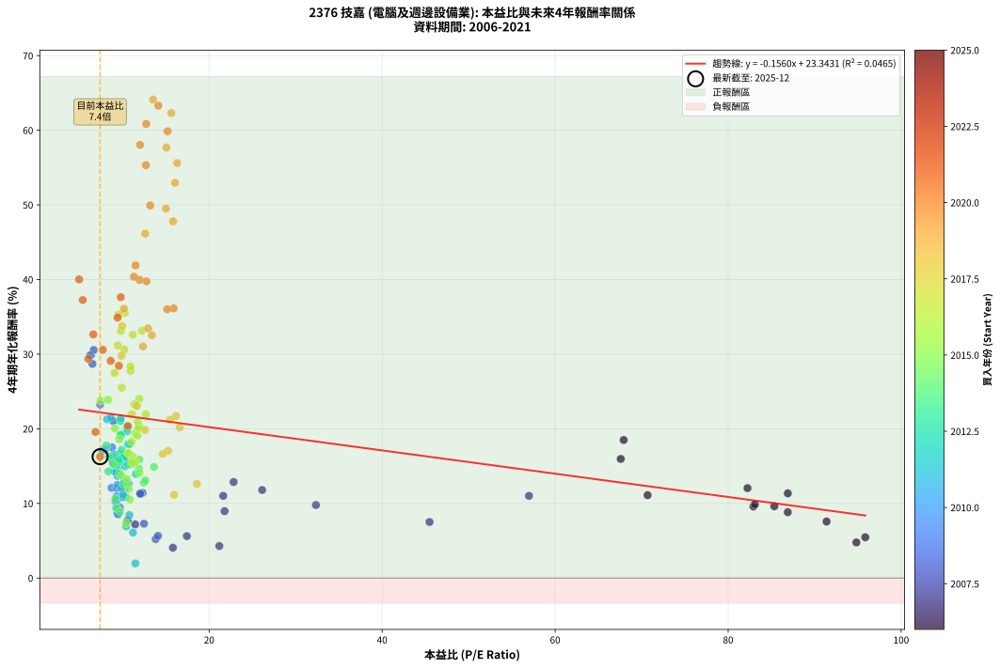
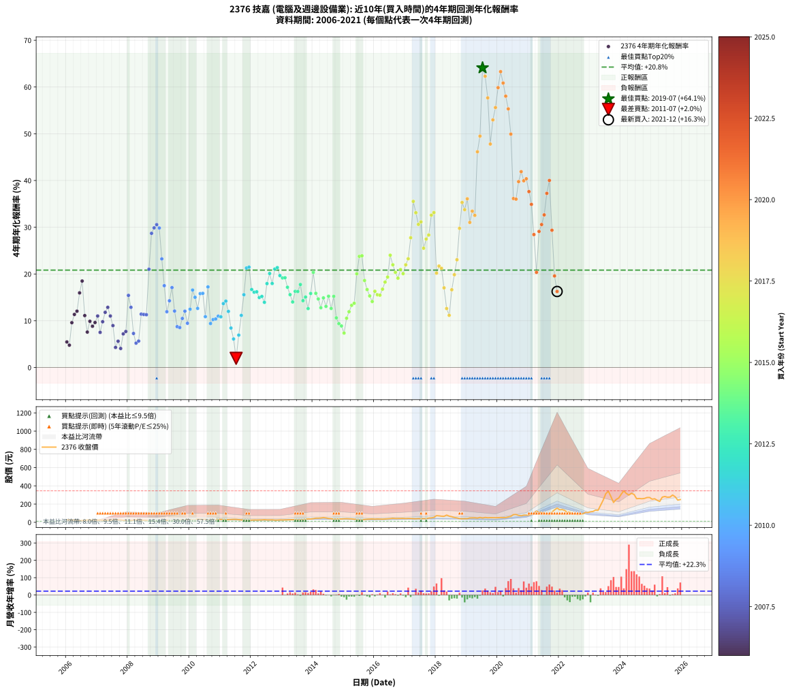

# 2376 技嘉 - 本益比與未來報酬率分析

!!! info "報告資訊"
    - **股票代號**: 2376
    - **公司名稱**: 技嘉
    - **產業別**: 電腦及週邊設備業
    - **分析期間**: 2006-2021 (192 個數據點)
    - **資料來源**: Type 12 (ShowMonthlyK_ChartFlow) 月收盤價與本益比
    - **報酬率口徑**: 含現金股利 (簡化: 年度合計，假設每年7/1入帳)
    - **報告生成時間**: 2026-01-06 00:35:07 CST

## 📈 視覺化圖表

### 圖表1: 本益比 vs 未來報酬率關係

*圖表1：2376 技嘉 本益比與4年期未來報酬率關係 (2006-2021)*

### 圖表2: 歷年買入時點的4年期實際報酬率

*圖表2：2376 技嘉 歷年買入時點的4年期實際報酬率 (2006-2021)*

## 📍 買點訊號說明

本報告提供兩種買點提示訊號（顯示於圖表2的股價子圖中）：

### ▲ 小綠色三角形（回測驗證）
- **計算方式**: 使用全部歷史資料計算本益比第25百分位數
- **用途**: 事後驗證，顯示歷史上哪些時點確實為低估區
- **限制**: 當下無法判斷，僅供回測參考
- **特性**: 後見之明（Look-Ahead Bias）

### ▲ 小橘色三角形（即時訊號）
- **計算方式**: 使用截至當月的過去5年資料計算本益比第25百分位數
- **用途**: 實際投資決策，當時即可判斷
- **優勢**: 可操作性強，符合實務需求
- **特性**: 無後見之明，滾動窗口計算

!!! tip "如何使用兩種訊號"
    - **綠色▲** 幫助理解歷史估值機會，驗證策略有效性
    - **橘色▲** 可作為實際買進參考，但仍需搭配基本面分析
    - 兩種訊號重疊時，表示即時判斷與事後驗證一致，信心度較高
    - 僅有綠色▲時，表示當時無法判斷（需要未來資料才能確認）
    - 僅有橘色▲時，表示即時判斷為買點，但事後可能不是最佳時機

## 📊 估值分析摘要

| 指標 | 數值 |
|:---:|:---:|
| **目前本益比** (2021-12) | **7.40 倍** |
| **歷史平均本益比** | 16.15 倍 |
| **估值水準** | 🟢 相對低估 |
| **預期4年年化報酬率** | **+22.19%** |
| **歷史平均報酬率** | +20.82% |
| **相關係數 (R²)** | 0.0465 |
| **趨勢線斜率** | -0.1560 |

!!! abstract "核心洞察"
    目前本益比顯著低於歷史平均，預期未來報酬率可能較高

    根據歷史數據回測，2376 技嘉 在目前本益比 **7.4倍** 的估值水準下，
    預期未來4年年化報酬率約為 **+22.2%**。

    **重要提醒**: 本分析基於歷史數據統計，實際報酬率會受到公司基本面變化、產業趨勢、
    總體經濟環境等多重因素影響。R² = 0.05 表示本益比可解釋約 4.6% 的報酬率變異。

## 📈 歷史估值統計

### 最佳買點 (最高報酬率)

| 項目 | 數值 |
|:---:|:---:|
| 起始時間 | 2019-07 |
| 當時本益比 | 13.52 倍 |
| 起始價格 | 46.8 元 |
| 4年後價格 | 314.0 元 |
| **4年年化報酬率** | **+64.10%** |

### 最差買點 (最低報酬率)

| 項目 | 數值 |
|:---:|:---:|
| 起始時間 | 2011-07 |
| 當時本益比 | 11.48 倍 |
| 起始價格 | 32.2 元 |
| 4年後價格 | 25.1 元 |
| **4年年化報酬率** | **+1.96%** |

## 🎯 投資啟示

### 本益比與報酬率關係

趨勢線方程式: **y = -0.1560x + 23.3431**

!!! note "負相關"
    本益比與未來報酬率呈現負相關。較低的本益比通常帶來較高的未來報酬率，
    但相關性不算非常強。**估值仍是重要參考指標之一**。

### 估值區間建議

基於歷史數據分析:

- **🟢 低估區** (P/E < 12.9): 預期報酬率較高，可考慮增加持股
- **🟡 合理區** (P/E 12.9-19.4): 預期報酬率符合長期趨勢，正常持有
- **🔴 高估區** (P/E > 19.4): 預期報酬率較低，可考慮減碼或觀望

!!! danger "風險提示"
    - 過去表現不代表未來結果
    - 本分析假設公司基本面無重大結構性變化
    - 產業環境劇變可能使歷史規律失效
    - 應結合公司財報、產業趨勢、總體經濟等多重因素綜合判斷

!!! success "長期投資觀點"
    歷史數據顯示，在合理或低估的估值水準買入並長期持有，
    往往能獲得較佳的投資報酬。**耐心等待好價格**是價值投資的核心原則。

## 📊 數據品質

- **資料來源**: GoodInfo.tw Type 12 (ShowMonthlyK_ChartFlow)
- **資料頻率**: 月度收盤價與本益比
- **回測期間**: 2006-2021
- **數據點數量**: 192 個 (每個點代表一次4年期回測)

### 計算方法說明

1. **4年期年化報酬率**:
   - 對每個歷史時點，計算其後4年的實際投資報酬率
   - 期末價值(不含股利): 期末價格
   - 期末價值(含現金股利): 期末價格 + 持有期間內的現金股利合計 (簡化: 年度合計，假設每年7/1入帳)
   - 公式: 年化報酬率 = [(期末價值/期初價格)^(1/年數) - 1] × 100%

2. **本益比 (P/E Ratio)**:
   - 使用當時的月收盤價與EPS計算
   - 資料來源: Type 12 月度河流圖本益比數據

3. **趨勢線 (Linear Regression)**:
   - 使用最小平方法擬合線性趨勢線
   - R²值衡量本益比對報酬率的解釋能力

---

*本報告由 Stock Analysis System v1.9.0 自動生成*
*數據更新時間: 2026-01-06 00:35:07 CST*

## 📋 月度回測明細表

（每一列對應時間線圖中的一個買入點；可用來對照 SVG 圖上的每個點。）

| 買入月份 | 賣出月份 | 回測期限_年 | 實際持有年數 | 買入本益比_倍 | 買入收盤價_元 | 賣出收盤價_元 | 現金股利合計_元 | 總報酬率_pct | 年化報酬率_pct |
| --- | --- | --- | --- | --- | --- | --- | --- | --- | --- |
| 2006-01 | 2010-01 | 4 | 4.000 | 95.86 | 27.80 | 30.50 | 3.89 | +23.69 | +5.46 |
| 2006-02 | 2010-02 | 4 | 4.000 | 94.83 | 27.50 | 29.25 | 3.89 | +20.50 | +4.77 |
| 2006-03 | 2010-03 | 4 | 4.000 | 82.93 | 24.05 | 30.80 | 3.89 | +44.23 | +9.59 |
| 2006-04 | 2010-04 | 4 | 4.000 | 86.90 | 25.20 | 34.85 | 3.89 | +53.72 | +11.35 |
| 2006-05 | 2010-05 | 4 | 4.000 | 82.24 | 23.85 | 33.70 | 3.89 | +57.60 | +12.04 |
| 2006-06 | 2010-06 | 4 | 4.000 | 67.59 | 19.60 | 31.55 | 3.89 | +80.80 | +15.96 |
| 2006-07 | 2010-07 | 4 | 4.000 | 67.93 | 19.70 | 33.75 | 5.08 | +97.13 | +18.49 |
| 2006-08 | 2010-08 | 4 | 4.000 | 70.69 | 20.50 | 26.15 | 5.08 | +52.37 | +11.10 |
| 2006-09 | 2010-09 | 4 | 4.000 | 91.38 | 26.50 | 30.40 | 5.08 | +33.91 | +7.57 |
| 2006-10 | 2010-10 | 4 | 4.000 | 83.10 | 24.10 | 30.05 | 5.08 | +45.79 | +9.88 |
| 2006-11 | 2010-11 | 4 | 4.000 | 86.90 | 25.20 | 30.25 | 5.08 | +40.22 | +8.82 |
| 2006-12 | 2010-12 | 4 | 4.000 | 85.34 | 24.75 | 30.65 | 5.08 | +44.38 | +9.62 |
| 2007-01 | 2011-01 | 4 | 4.000 | 56.98 | 24.55 | 32.20 | 5.08 | +51.87 | +11.01 |
| 2007-02 | 2011-02 | 4 | 4.000 | 45.48 | 26.00 | 29.65 | 5.08 | +33.60 | +7.51 |
| 2007-03 | 2011-03 | 4 | 4.000 | 32.35 | 23.05 | 28.40 | 5.08 | +45.27 | +9.79 |
| 2007-04 | 2011-04 | 4 | 4.000 | 26.13 | 22.30 | 29.75 | 5.08 | +56.21 | +11.80 |
| 2007-05 | 2011-05 | 4 | 4.000 | 22.83 | 22.70 | 31.75 | 5.08 | +62.27 | +12.86 |
| 2007-06 | 2011-06 | 4 | 4.000 | 21.63 | 24.55 | 32.20 | 5.08 | +51.87 | +11.01 |
| 2007-07 | 2011-07 | 4 | 4.000 | 21.79 | 27.80 | 32.20 | 6.98 | +40.95 | +8.96 |
| 2007-08 | 2011-08 | 4 | 4.000 | 21.18 | 30.00 | 28.50 | 6.98 | +18.28 | +4.29 |
| 2007-09 | 2011-09 | 4 | 4.000 | 17.43 | 27.15 | 26.80 | 6.98 | +24.43 | +5.62 |
| 2007-10 | 2011-10 | 4 | 4.000 | 15.81 | 26.85 | 24.50 | 6.98 | +17.26 | +4.06 |
| 2007-11 | 2011-11 | 4 | 4.000 | 11.45 | 21.05 | 20.80 | 6.98 | +31.99 | +7.19 |
| 2007-12 | 2011-12 | 4 | 4.000 | 10.58 | 20.95 | 21.20 | 6.98 | +34.53 | +7.70 |
| 2008-01 | 2012-01 | 4 | 4.000 | 8.87 | 17.40 | 23.90 | 6.98 | +77.49 | +15.42 |
| 2008-02 | 2012-02 | 4 | 4.000 | 10.19 | 19.80 | 25.15 | 6.98 | +62.29 | +12.87 |
| 2008-03 | 2012-03 | 4 | 4.000 | 12.47 | 24.00 | 24.80 | 6.98 | +32.43 | +7.28 |
| 2008-04 | 2012-04 | 4 | 4.000 | 13.82 | 26.35 | 25.30 | 6.98 | +22.52 | +5.21 |
| 2008-05 | 2012-05 | 4 | 4.000 | 14.09 | 26.60 | 26.15 | 6.98 | +24.56 | +5.64 |
| 2008-06 | 2012-06 | 4 | 4.000 | 12.30 | 23.00 | 28.45 | 6.98 | +54.06 | +11.41 |
| 2008-07 | 2012-07 | 4 | 4.000 | 12.02 | 22.25 | 26.20 | 8.00 | +53.69 | +11.34 |
| 2008-08 | 2012-08 | 4 | 4.000 | 12.05 | 22.10 | 25.90 | 8.00 | +53.38 | +11.29 |
| 2008-09 | 2012-09 | 4 | 4.000 | 8.93 | 16.20 | 26.75 | 8.00 | +114.48 | +21.02 |
| 2008-10 | 2012-10 | 4 | 4.000 | 6.51 | 11.70 | 24.10 | 8.00 | +174.32 | +28.70 |
| 2008-11 | 2012-11 | 4 | 4.000 | 6.35 | 11.30 | 24.15 | 8.00 | +184.48 | +29.87 |
| 2008-12 | 2012-12 | 4 | 4.000 | 6.65 | 11.70 | 26.00 | 8.00 | +190.56 | +30.56 |
| 2009-01 | 2013-01 | 4 | 4.000 | 6.24 | 11.75 | 25.40 | 8.00 | +184.22 | +29.84 |
| 2009-02 | 2013-02 | 4 | 4.000 | 7.40 | 14.85 | 26.25 | 8.00 | +130.61 | +23.23 |
| 2009-03 | 2013-03 | 4 | 4.000 | 8.78 | 18.70 | 27.65 | 8.00 | +90.62 | +17.50 |
| 2009-04 | 2013-04 | 4 | 4.000 | 10.21 | 23.00 | 28.10 | 8.00 | +56.94 | +11.93 |
| 2009-05 | 2013-05 | 4 | 4.000 | 9.13 | 21.70 | 29.00 | 8.00 | +70.49 | +14.27 |
| 2009-06 | 2013-06 | 4 | 4.000 | 7.66 | 19.15 | 28.00 | 8.00 | +87.97 | +17.09 |
| 2009-07 | 2013-07 | 4 | 4.000 | 8.71 | 22.85 | 27.05 | 9.00 | +57.75 | +12.07 |
| 2009-08 | 2013-08 | 4 | 4.000 | 9.37 | 25.75 | 27.00 | 9.00 | +39.79 | +8.73 |
| 2009-09 | 2013-09 | 4 | 4.000 | 9.48 | 27.20 | 28.75 | 9.00 | +38.77 | +8.54 |
| 2009-10 | 2013-10 | 4 | 4.000 | 9.37 | 28.05 | 32.80 | 9.00 | +49.01 | +10.48 |
| 2009-11 | 2013-11 | 4 | 4.000 | 9.35 | 29.15 | 36.95 | 9.00 | +57.62 | +12.05 |
| 2009-12 | 2013-12 | 4 | 4.000 | 9.68 | 31.35 | 36.00 | 9.00 | +43.53 | +9.45 |
| 2010-01 | 2014-01 | 4 | 4.000 | 9.40 | 30.50 | 39.80 | 9.00 | +59.99 | +12.47 |
| 2010-02 | 2014-02 | 4 | 4.000 | 9.00 | 29.25 | 45.00 | 9.00 | +84.60 | +16.56 |
| 2010-03 | 2014-03 | 4 | 4.000 | 9.47 | 30.80 | 44.90 | 9.00 | +74.99 | +15.01 |
| 2010-04 | 2014-04 | 4 | 4.000 | 10.70 | 34.85 | 47.10 | 9.00 | +60.96 | +12.64 |
| 2010-05 | 2014-05 | 4 | 4.000 | 10.33 | 33.70 | 51.60 | 9.00 | +79.81 | +15.80 |
| 2010-06 | 2014-06 | 4 | 4.000 | 9.66 | 31.55 | 47.85 | 9.00 | +80.18 | +15.86 |
| 2010-07 | 2014-07 | 4 | 4.000 | 10.32 | 33.75 | 41.50 | 9.50 | +51.11 | +10.87 |
| 2010-08 | 2014-08 | 4 | 4.000 | 7.99 | 26.15 | 39.90 | 9.50 | +88.90 | +17.24 |
| 2010-09 | 2014-09 | 4 | 4.000 | 9.28 | 30.40 | 34.05 | 9.50 | +43.25 | +9.40 |
| 2010-10 | 2014-10 | 4 | 4.000 | 9.16 | 30.05 | 34.90 | 9.50 | +47.75 | +10.25 |
| 2010-11 | 2014-11 | 4 | 4.000 | 9.21 | 30.25 | 35.40 | 9.50 | +48.42 | +10.38 |
| 2010-12 | 2014-12 | 4 | 4.000 | 9.32 | 30.65 | 37.00 | 9.50 | +51.71 | +10.98 |
| 2011-01 | 2015-01 | 4 | 4.000 | 10.00 | 32.20 | 39.10 | 9.50 | +50.93 | +10.84 |
| 2011-02 | 2015-02 | 4 | 4.000 | 9.41 | 29.65 | 40.00 | 9.50 | +66.94 | +13.67 |
| 2011-03 | 2015-03 | 4 | 4.000 | 9.21 | 28.40 | 38.80 | 9.50 | +70.06 | +14.20 |
| 2011-04 | 2015-04 | 4 | 4.000 | 9.87 | 29.75 | 37.30 | 9.50 | +57.30 | +11.99 |
| 2011-05 | 2015-05 | 4 | 4.000 | 10.78 | 31.75 | 34.40 | 9.50 | +38.26 | +8.44 |
| 2011-06 | 2015-06 | 4 | 4.000 | 11.20 | 32.20 | 31.30 | 9.50 | +26.70 | +6.10 |
| 2011-07 | 2015-07 | 4 | 4.000 | 11.48 | 32.20 | 25.10 | 9.70 | +8.07 | +1.96 |
| 2011-08 | 2015-08 | 4 | 4.000 | 10.41 | 28.50 | 27.55 | 9.70 | +30.70 | +6.92 |
| 2011-09 | 2015-09 | 4 | 4.000 | 10.05 | 26.80 | 31.20 | 9.70 | +52.61 | +11.15 |
| 2011-10 | 2015-10 | 4 | 4.000 | 9.43 | 24.50 | 34.00 | 9.70 | +78.36 | +15.57 |
| 2011-11 | 2015-11 | 4 | 4.000 | 8.22 | 20.80 | 35.30 | 9.70 | +116.34 | +21.28 |
| 2011-12 | 2015-12 | 4 | 4.000 | 8.62 | 21.20 | 36.45 | 9.70 | +117.68 | +21.47 |
| 2012-01 | 2016-01 | 4 | 4.000 | 9.71 | 23.90 | 34.60 | 9.70 | +85.35 | +16.68 |
| 2012-02 | 2016-02 | 4 | 4.000 | 10.21 | 25.15 | 36.00 | 9.70 | +81.71 | +16.10 |
| 2012-03 | 2016-03 | 4 | 4.000 | 10.07 | 24.80 | 35.50 | 9.70 | +82.25 | +16.19 |
| 2012-04 | 2016-04 | 4 | 4.000 | 10.27 | 25.30 | 34.50 | 9.70 | +74.70 | +14.97 |
| 2012-05 | 2016-05 | 4 | 4.000 | 10.61 | 26.15 | 36.35 | 9.70 | +76.10 | +15.20 |
| 2012-06 | 2016-06 | 4 | 4.000 | 11.53 | 28.45 | 38.25 | 9.70 | +68.54 | +13.94 |
| 2012-07 | 2016-07 | 4 | 4.000 | 10.62 | 26.20 | 40.50 | 10.20 | +93.51 | +17.94 |
| 2012-08 | 2016-08 | 4 | 4.000 | 10.49 | 25.90 | 43.70 | 10.20 | +108.11 | +20.11 |
| 2012-09 | 2016-09 | 4 | 4.000 | 10.83 | 26.75 | 41.60 | 10.20 | +93.64 | +17.96 |
| 2012-10 | 2016-10 | 4 | 4.000 | 9.75 | 24.10 | 41.55 | 10.20 | +114.73 | +21.05 |
| 2012-11 | 2016-11 | 4 | 4.000 | 9.77 | 24.15 | 42.20 | 10.20 | +116.98 | +21.37 |
| 2012-12 | 2016-12 | 4 | 4.000 | 10.51 | 26.00 | 43.10 | 10.20 | +105.00 | +19.66 |
| 2013-01 | 2017-01 | 4 | 4.000 | 9.84 | 25.40 | 41.00 | 10.20 | +101.57 | +19.15 |
| 2013-02 | 2017-02 | 4 | 4.000 | 9.76 | 26.25 | 42.80 | 10.20 | +101.90 | +19.20 |
| 2013-03 | 2017-03 | 4 | 4.000 | 9.89 | 27.65 | 41.90 | 10.20 | +88.43 | +17.16 |
| 2013-04 | 2017-04 | 4 | 4.000 | 9.68 | 28.10 | 39.95 | 10.20 | +78.47 | +15.58 |
| 2013-05 | 2017-05 | 4 | 4.000 | 9.64 | 29.00 | 38.80 | 10.20 | +68.97 | +14.01 |
| 2013-06 | 2017-06 | 4 | 4.000 | 8.98 | 28.00 | 41.00 | 10.20 | +82.86 | +16.29 |
| 2013-07 | 2017-07 | 4 | 4.000 | 8.39 | 27.05 | 38.60 | 10.80 | +82.62 | +16.25 |
| 2013-08 | 2017-08 | 4 | 4.000 | 8.11 | 27.00 | 41.10 | 10.80 | +92.22 | +17.75 |
| 2013-09 | 2017-09 | 4 | 4.000 | 8.36 | 28.75 | 38.25 | 10.80 | +70.61 | +14.29 |
| 2013-10 | 2017-10 | 4 | 4.000 | 9.25 | 32.80 | 46.70 | 10.80 | +75.30 | +15.07 |
| 2013-11 | 2017-11 | 4 | 4.000 | 10.12 | 36.95 | 48.60 | 10.80 | +60.76 | +12.60 |
| 2013-12 | 2017-12 | 4 | 4.000 | 9.57 | 36.00 | 54.00 | 10.80 | +80.00 | +15.83 |
| 2014-01 | 2018-01 | 4 | 4.000 | 10.57 | 39.80 | 72.70 | 10.80 | +109.80 | +20.35 |
| 2014-02 | 2018-02 | 4 | 4.000 | 11.94 | 45.00 | 70.30 | 10.80 | +80.22 | +15.86 |
| 2014-03 | 2018-03 | 4 | 4.000 | 11.89 | 44.90 | 66.80 | 10.80 | +72.83 | +14.66 |
| 2014-04 | 2018-04 | 4 | 4.000 | 12.46 | 47.10 | 65.40 | 10.80 | +61.78 | +12.78 |
| 2014-05 | 2018-05 | 4 | 4.000 | 13.63 | 51.60 | 79.10 | 10.80 | +74.22 | +14.89 |
| 2014-06 | 2018-06 | 4 | 4.000 | 12.63 | 47.85 | 67.40 | 10.80 | +63.43 | +13.07 |
| 2014-07 | 2018-07 | 4 | 4.000 | 10.94 | 41.50 | 61.40 | 11.80 | +76.39 | +15.24 |
| 2014-08 | 2018-08 | 4 | 4.000 | 10.50 | 39.90 | 52.40 | 11.80 | +60.90 | +12.63 |
| 2014-09 | 2018-09 | 4 | 4.000 | 8.95 | 34.05 | 48.20 | 11.80 | +76.21 | +15.21 |
| 2014-10 | 2018-10 | 4 | 4.000 | 9.16 | 34.90 | 40.45 | 11.80 | +49.71 | +10.62 |
| 2014-11 | 2018-11 | 4 | 4.000 | 9.28 | 35.40 | 38.85 | 11.80 | +43.08 | +9.37 |
| 2014-12 | 2018-12 | 4 | 4.000 | 9.69 | 37.00 | 40.20 | 11.80 | +40.54 | +8.88 |
| 2015-01 | 2019-01 | 4 | 4.000 | 10.41 | 39.10 | 40.15 | 11.80 | +32.86 | +7.36 |
| 2015-02 | 2019-02 | 4 | 4.000 | 10.84 | 40.00 | 47.90 | 11.80 | +49.25 | +10.53 |
| 2015-03 | 2019-03 | 4 | 4.000 | 10.70 | 38.80 | 49.10 | 11.80 | +56.96 | +11.93 |
| 2015-04 | 2019-04 | 4 | 4.000 | 10.47 | 37.30 | 49.65 | 11.80 | +64.75 | +13.29 |
| 2015-05 | 2019-05 | 4 | 4.000 | 9.83 | 34.40 | 45.75 | 11.80 | +67.30 | +13.73 |
| 2015-06 | 2019-06 | 4 | 4.000 | 9.11 | 31.30 | 53.20 | 11.80 | +107.67 | +20.04 |
| 2015-07 | 2019-07 | 4 | 4.000 | 7.45 | 25.10 | 46.80 | 12.10 | +134.66 | +23.77 |
| 2015-08 | 2019-08 | 4 | 4.000 | 8.33 | 27.55 | 52.80 | 12.10 | +135.57 | +23.89 |
| 2015-09 | 2019-09 | 4 | 4.000 | 9.62 | 31.20 | 49.65 | 12.10 | +97.92 | +18.61 |
| 2015-10 | 2019-10 | 4 | 4.000 | 10.70 | 34.00 | 50.90 | 12.10 | +85.29 | +16.67 |
| 2015-11 | 2019-11 | 4 | 4.000 | 11.34 | 35.30 | 50.30 | 12.10 | +76.77 | +15.31 |
| 2015-12 | 2019-12 | 4 | 4.000 | 11.95 | 36.45 | 49.70 | 12.10 | +69.55 | +14.11 |
| 2016-01 | 2020-01 | 4 | 4.000 | 11.16 | 34.60 | 51.20 | 12.10 | +82.95 | +16.30 |
| 2016-02 | 2020-02 | 4 | 4.000 | 11.43 | 36.00 | 52.10 | 12.10 | +78.33 | +15.56 |
| 2016-03 | 2020-03 | 4 | 4.000 | 11.10 | 35.50 | 51.00 | 12.10 | +77.75 | +15.46 |
| 2016-04 | 2020-04 | 4 | 4.000 | 10.63 | 34.50 | 52.00 | 12.10 | +85.80 | +16.75 |
| 2016-05 | 2020-05 | 4 | 4.000 | 11.03 | 36.35 | 59.00 | 12.10 | +95.60 | +18.26 |
| 2016-06 | 2020-06 | 4 | 4.000 | 11.43 | 38.25 | 65.50 | 12.10 | +102.88 | +19.35 |
| 2016-07 | 2020-07 | 4 | 4.000 | 11.93 | 40.50 | 84.00 | 11.80 | +136.54 | +24.02 |
| 2016-08 | 2020-08 | 4 | 4.000 | 12.69 | 43.70 | 84.90 | 11.80 | +121.28 | +21.97 |
| 2016-09 | 2020-09 | 4 | 4.000 | 11.91 | 41.60 | 75.50 | 11.80 | +109.86 | +20.36 |
| 2016-10 | 2020-10 | 4 | 4.000 | 11.73 | 41.55 | 71.80 | 11.80 | +101.20 | +19.10 |
| 2016-11 | 2020-11 | 4 | 4.000 | 11.75 | 42.20 | 78.50 | 11.80 | +113.98 | +20.95 |
| 2016-12 | 2020-12 | 4 | 4.000 | 11.84 | 43.10 | 77.80 | 11.80 | +107.89 | +20.08 |
| 2017-01 | 2021-01 | 4 | 4.000 | 11.07 | 41.00 | 78.90 | 11.80 | +121.22 | +21.96 |
| 2017-02 | 2021-02 | 4 | 4.000 | 11.36 | 42.80 | 87.00 | 11.80 | +130.84 | +23.26 |
| 2017-03 | 2021-03 | 4 | 4.000 | 10.93 | 41.90 | 99.80 | 11.80 | +166.35 | +27.75 |
| 2017-04 | 2021-04 | 4 | 4.000 | 10.25 | 39.95 | 123.00 | 11.80 | +237.42 | +35.53 |
| 2017-05 | 2021-05 | 4 | 4.000 | 9.80 | 38.80 | 110.00 | 11.80 | +213.92 | +33.11 |
| 2017-06 | 2021-06 | 4 | 4.000 | 10.19 | 41.00 | 107.50 | 11.80 | +190.98 | +30.61 |
| 2017-07 | 2021-07 | 4 | 4.000 | 9.44 | 38.60 | 100.00 | 14.20 | +195.85 | +31.15 |
| 2017-08 | 2021-08 | 4 | 4.000 | 9.90 | 41.10 | 87.80 | 14.20 | +148.18 | +25.51 |
| 2017-09 | 2021-09 | 4 | 4.000 | 9.07 | 38.25 | 86.80 | 14.20 | +164.05 | +27.47 |
| 2017-10 | 2021-10 | 4 | 4.000 | 10.91 | 46.70 | 112.50 | 14.20 | +171.31 | +28.34 |
| 2017-11 | 2021-11 | 4 | 4.000 | 11.18 | 48.60 | 136.00 | 14.20 | +209.05 | +32.59 |
| 2017-12 | 2021-12 | 4 | 4.000 | 12.24 | 54.00 | 155.50 | 14.20 | +214.26 | +33.14 |
| 2018-01 | 2022-01 | 4 | 4.000 | 16.60 | 72.70 | 137.50 | 14.20 | +108.67 | +20.19 |
| 2018-02 | 2022-02 | 4 | 4.000 | 16.17 | 70.30 | 140.00 | 14.20 | +119.35 | +21.70 |
| 2018-03 | 2022-03 | 4 | 4.000 | 15.47 | 66.80 | 130.00 | 14.20 | +115.87 | +21.21 |
| 2018-04 | 2022-04 | 4 | 4.000 | 15.26 | 65.40 | 108.50 | 14.20 | +87.61 | +17.04 |
| 2018-05 | 2022-05 | 4 | 4.000 | 18.59 | 79.10 | 113.00 | 14.20 | +60.81 | +12.61 |
| 2018-06 | 2022-06 | 4 | 4.000 | 15.95 | 67.40 | 88.70 | 14.20 | +52.67 | +11.16 |
| 2018-07 | 2022-07 | 4 | 4.000 | 14.64 | 61.40 | 91.40 | 22.20 | +85.02 | +16.63 |
| 2018-08 | 2022-08 | 4 | 4.000 | 12.59 | 52.40 | 85.90 | 22.20 | +106.30 | +19.85 |
| 2018-09 | 2022-09 | 4 | 4.000 | 11.66 | 48.20 | 88.30 | 22.20 | +129.25 | +23.05 |
| 2018-10 | 2022-10 | 4 | 4.000 | 9.86 | 40.45 | 92.50 | 22.20 | +183.56 | +29.77 |
| 2018-11 | 2022-11 | 4 | 4.000 | 9.54 | 38.85 | 108.00 | 22.20 | +235.14 | +35.30 |
| 2018-12 | 2022-12 | 4 | 4.000 | 9.95 | 40.20 | 106.50 | 22.20 | +220.15 | +33.76 |
| 2019-01 | 2023-01 | 4 | 4.000 | 10.15 | 40.15 | 115.50 | 22.20 | +242.96 | +36.09 |
| 2019-02 | 2023-02 | 4 | 4.000 | 12.36 | 47.90 | 119.00 | 22.20 | +194.78 | +31.03 |
| 2019-03 | 2023-03 | 4 | 4.000 | 12.95 | 49.10 | 133.50 | 22.20 | +217.11 | +33.44 |
| 2019-04 | 2023-04 | 4 | 4.000 | 13.38 | 49.65 | 131.00 | 22.20 | +208.56 | +32.54 |
| 2019-05 | 2023-05 | 4 | 4.000 | 12.61 | 45.75 | 186.50 | 22.20 | +356.17 | +46.14 |
| 2019-06 | 2023-06 | 4 | 4.000 | 15.01 | 53.20 | 243.50 | 22.20 | +399.44 | +49.49 |
| 2019-07 | 2023-07 | 4 | 4.000 | 13.52 | 46.80 | 314.00 | 25.40 | +625.21 | +64.10 |
| 2019-08 | 2023-08 | 4 | 4.000 | 15.62 | 52.80 | 341.00 | 25.40 | +593.94 | +62.30 |
| 2019-09 | 2023-09 | 4 | 4.000 | 15.06 | 49.65 | 281.50 | 25.40 | +518.13 | +57.68 |
| 2019-10 | 2023-10 | 4 | 4.000 | 15.83 | 50.90 | 217.50 | 25.40 | +377.21 | +47.80 |
| 2019-11 | 2023-11 | 4 | 4.000 | 16.06 | 50.30 | 250.00 | 25.40 | +447.51 | +52.97 |
| 2019-12 | 2023-12 | 4 | 4.000 | 16.30 | 49.70 | 266.00 | 25.40 | +486.32 | +55.61 |
| 2020-01 | 2024-01 | 4 | 4.000 | 15.20 | 51.20 | 309.00 | 25.40 | +553.12 | +59.86 |
| 2020-02 | 2024-02 | 4 | 4.000 | 14.13 | 52.10 | 345.00 | 25.40 | +610.94 | +63.29 |
| 2020-03 | 2024-03 | 4 | 4.000 | 12.73 | 51.00 | 316.00 | 25.40 | +569.41 | +60.85 |
| 2020-04 | 2024-04 | 4 | 4.000 | 12.02 | 52.00 | 299.00 | 25.40 | +523.85 | +58.04 |
| 2020-05 | 2024-05 | 4 | 4.000 | 12.70 | 59.00 | 318.00 | 25.40 | +482.03 | +55.32 |
| 2020-06 | 2024-06 | 4 | 4.000 | 13.19 | 65.50 | 305.50 | 25.40 | +405.19 | +49.92 |
| 2020-07 | 2024-07 | 4 | 4.000 | 15.90 | 84.00 | 259.00 | 29.56 | +243.52 | +36.14 |
| 2020-08 | 2024-08 | 4 | 4.000 | 15.15 | 84.90 | 261.00 | 29.56 | +242.24 | +36.01 |
| 2020-09 | 2024-09 | 4 | 4.000 | 12.75 | 75.50 | 258.50 | 29.56 | +281.53 | +39.76 |
| 2020-10 | 2024-10 | 4 | 4.000 | 11.50 | 71.80 | 261.50 | 29.56 | +305.37 | +41.89 |
| 2020-11 | 2024-11 | 4 | 4.000 | 11.96 | 78.50 | 271.50 | 29.56 | +283.51 | +39.94 |
| 2020-12 | 2024-12 | 4 | 4.000 | 11.31 | 77.80 | 272.50 | 29.56 | +288.25 | +40.37 |
| 2021-01 | 2025-01 | 4 | 4.000 | 9.79 | 78.90 | 253.50 | 29.56 | +258.76 | +37.63 |
| 2021-02 | 2025-02 | 4 | 4.000 | 9.42 | 87.00 | 258.50 | 29.56 | +231.10 | +34.89 |
| 2021-03 | 2025-03 | 4 | 4.000 | 9.58 | 99.80 | 242.00 | 29.56 | +172.10 | +28.43 |
| 2021-04 | 2025-04 | 4 | 4.000 | 10.61 | 123.00 | 228.50 | 29.56 | +109.80 | +20.35 |
| 2021-05 | 2025-05 | 4 | 4.000 | 8.62 | 110.00 | 276.00 | 29.56 | +177.78 | +29.10 |
| 2021-06 | 2025-06 | 4 | 4.000 | 7.71 | 107.50 | 283.00 | 29.56 | +190.75 | +30.58 |
| 2021-07 | 2025-07 | 4 | 4.000 | 6.61 | 100.00 | 275.00 | 34.56 | +209.56 | +32.64 |
| 2021-08 | 2025-08 | 4 | 4.000 | 5.39 | 87.80 | 277.00 | 34.56 | +254.85 | +37.25 |
| 2021-09 | 2025-09 | 4 | 4.000 | 4.97 | 86.80 | 299.00 | 34.56 | +284.28 | +40.01 |
| 2021-10 | 2025-10 | 4 | 4.000 | 6.03 | 112.50 | 280.50 | 34.56 | +180.05 | +29.36 |
| 2021-11 | 2025-11 | 4 | 4.000 | 6.86 | 136.00 | 243.50 | 34.56 | +104.45 | +19.58 |
| 2021-12 | 2025-12 | 4 | 4.000 | 7.40 | 155.50 | 249.50 | 34.56 | +82.67 | +16.26 |
