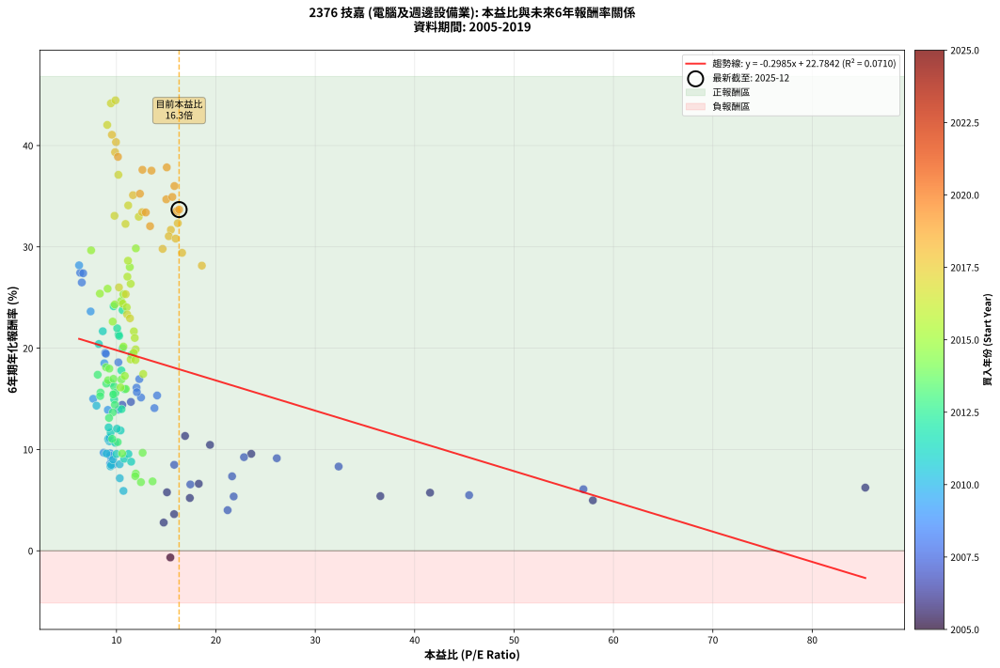
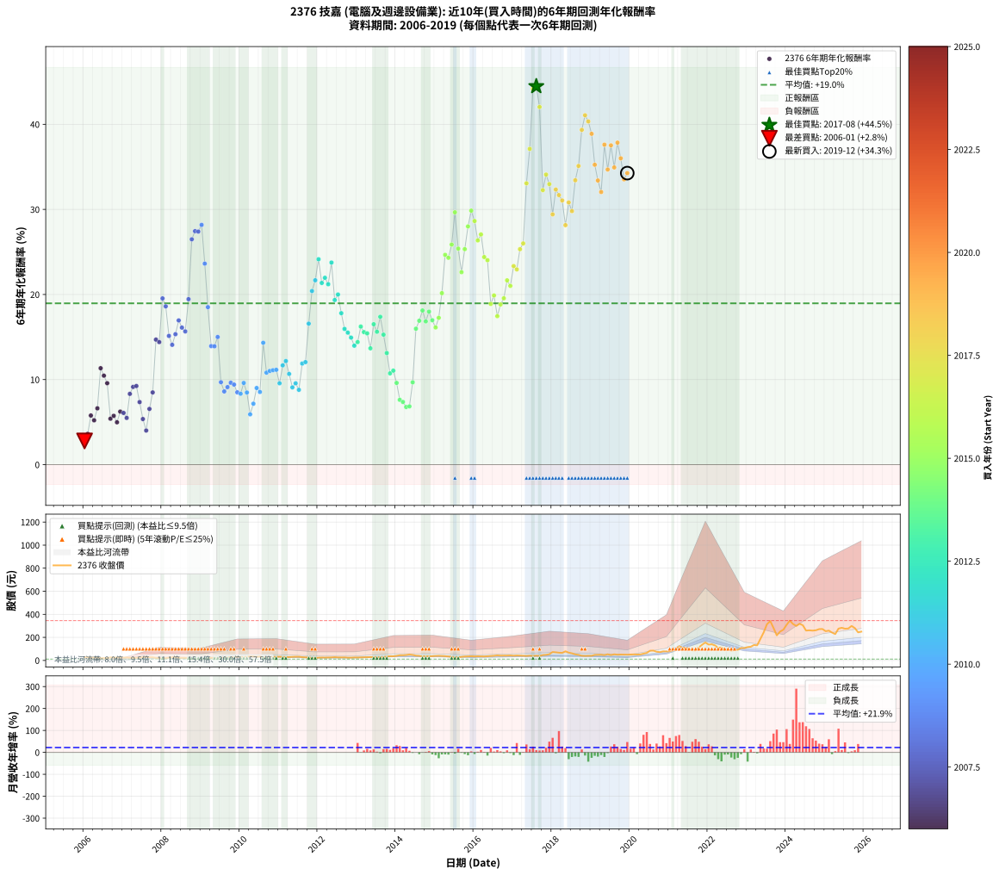

# 2376 技嘉 - 本益比與未來報酬率分析

!!! info "報告資訊"
    - **股票代號**: 2376
    - **公司名稱**: 技嘉
    - **產業別**: 電腦及週邊設備業
    - **分析期間**: 2006-2019 (168 個數據點)
    - **資料來源**: Type 12 (ShowMonthlyK_ChartFlow) 月收盤價與本益比
    - **報酬率口徑**: 含現金股利 (簡化: 年度合計，假設每年7/1入帳)
    - **報告生成時間**: 2026-01-04 08:47:44 CST

## 📈 視覺化圖表

### 圖表1: 本益比 vs 未來報酬率關係

*圖表1：2376 技嘉 本益比與6年期未來報酬率關係 (2006-2019)*

### 圖表2: 歷年買入時點的6年期實際報酬率

*圖表2：2376 技嘉 歷年買入時點的6年期實際報酬率 (2006-2019)*

## 📍 買點訊號說明

本報告提供兩種買點提示訊號（顯示於圖表2的股價子圖中）：

### ▲ 小綠色三角形（回測驗證）
- **計算方式**: 使用全部歷史資料計算本益比第25百分位數
- **用途**: 事後驗證，顯示歷史上哪些時點確實為低估區
- **限制**: 當下無法判斷，僅供回測參考
- **特性**: 後見之明（Look-Ahead Bias）

### ▲ 小橘色三角形（即時訊號）
- **計算方式**: 使用截至當月的過去5年資料計算本益比第25百分位數
- **用途**: 實際投資決策，當時即可判斷
- **優勢**: 可操作性強，符合實務需求
- **特性**: 無後見之明，滾動窗口計算

!!! tip "如何使用兩種訊號"
    - **綠色▲** 幫助理解歷史估值機會，驗證策略有效性
    - **橘色▲** 可作為實際買進參考，但仍需搭配基本面分析
    - 兩種訊號重疊時，表示即時判斷與事後驗證一致，信心度較高
    - 僅有綠色▲時，表示當時無法判斷（需要未來資料才能確認）
    - 僅有橘色▲時，表示即時判斷為買點，但事後可能不是最佳時機

## 📊 估值分析摘要

| 指標 | 數值 |
|:---:|:---:|
| **目前本益比** (2019-12) | **16.30 倍** |
| **歷史平均本益比** | 16.96 倍 |
| **估值水準** | 🟡 合理範圍 |
| **預期6年年化報酬率** | **+19.09%** |
| **歷史平均報酬率** | +18.96% |
| **相關係數 (R²)** | 0.1389 |
| **趨勢線斜率** | -0.1967 |

!!! abstract "核心洞察"
    目前本益比接近歷史平均，預期報酬率符合長期趨勢

    根據歷史數據回測，2376 技嘉 在目前本益比 **16.3倍** 的估值水準下，
    預期未來6年年化報酬率約為 **+19.1%**。

    **重要提醒**: 本分析基於歷史數據統計，實際報酬率會受到公司基本面變化、產業趨勢、
    總體經濟環境等多重因素影響。R² = 0.14 表示本益比可解釋約 13.9% 的報酬率變異。

## 📈 歷史估值統計

### 最佳買點 (最高報酬率)

| 項目 | 數值 |
|:---:|:---:|
| 起始時間 | 2017-08 |
| 當時本益比 | 9.90 倍 |
| 起始價格 | 41.1 元 |
| 6年後價格 | 341.0 元 |
| **6年年化報酬率** | **+44.46%** |

### 最差買點 (最低報酬率)

| 項目 | 數值 |
|:---:|:---:|
| 起始時間 | 2006-01 |
| 當時本益比 | 95.86 倍 |
| 起始價格 | 27.8 元 |
| 6年後價格 | 23.9 元 |
| **6年年化報酬率** | **+2.79%** |

## 🎯 投資啟示

### 本益比與報酬率關係

趨勢線方程式: **y = -0.1967x + 22.2981**

!!! note "負相關"
    本益比與未來報酬率呈現負相關。較低的本益比通常帶來較高的未來報酬率，
    但相關性不算非常強。**估值仍是重要參考指標之一**。

### 估值區間建議

基於歷史數據分析:

- **🟢 低估區** (P/E < 13.6): 預期報酬率較高，可考慮增加持股
- **🟡 合理區** (P/E 13.6-20.4): 預期報酬率符合長期趨勢，正常持有
- **🔴 高估區** (P/E > 20.4): 預期報酬率較低，可考慮減碼或觀望

!!! danger "風險提示"
    - 過去表現不代表未來結果
    - 本分析假設公司基本面無重大結構性變化
    - 產業環境劇變可能使歷史規律失效
    - 應結合公司財報、產業趨勢、總體經濟等多重因素綜合判斷

!!! success "長期投資觀點"
    歷史數據顯示，在合理或低估的估值水準買入並長期持有，
    往往能獲得較佳的投資報酬。**耐心等待好價格**是價值投資的核心原則。

## 📊 數據品質

- **資料來源**: GoodInfo.tw Type 12 (ShowMonthlyK_ChartFlow)
- **資料頻率**: 月度收盤價與本益比
- **回測期間**: 2006-2019
- **數據點數量**: 168 個 (每個點代表一次6年期回測)

### 計算方法說明

1. **6年期年化報酬率**:
   - 對每個歷史時點，計算其後6年的實際投資報酬率
   - 期末價值(不含股利): 期末價格
   - 期末價值(含現金股利): 期末價格 + 持有期間內的現金股利合計 (簡化: 年度合計，假設每年7/1入帳)
   - 公式: 年化報酬率 = [(期末價值/期初價格)^(1/年數) - 1] × 100%

2. **本益比 (P/E Ratio)**:
   - 使用當時的月收盤價與EPS計算
   - 資料來源: Type 12 月度河流圖本益比數據

3. **趨勢線 (Linear Regression)**:
   - 使用最小平方法擬合線性趨勢線
   - R²值衡量本益比對報酬率的解釋能力

---

*本報告由 Stock Analysis System v1.9.0 自動生成*
*數據更新時間: 2026-01-04 08:47:44 CST*

## 📋 月度回測明細表

（每一列對應時間線圖中的一個買入點；可用來對照 SVG 圖上的每個點。）

| 買入月份 | 賣出月份 | 回測期限_年 | 實際持有年數 | 買入本益比_倍 | 買入收盤價_元 | 賣出收盤價_元 | 現金股利合計_元 | 總報酬率_pct | 年化報酬率_pct |
| --- | --- | --- | --- | --- | --- | --- | --- | --- | --- |
| 2006-01 | 2012-01 | 6 | 5.999 | 95.86 | 27.80 | 23.90 | 8.88 | +17.93 | +2.79 |
| 2006-02 | 2012-02 | 6 | 5.999 | 94.83 | 27.50 | 25.15 | 8.88 | +23.76 | +3.62 |
| 2006-03 | 2012-03 | 6 | 6.001 | 82.93 | 24.05 | 24.80 | 8.88 | +40.06 | +5.77 |
| 2006-04 | 2012-04 | 6 | 6.001 | 86.90 | 25.20 | 25.30 | 8.88 | +35.65 | +5.21 |
| 2006-05 | 2012-05 | 6 | 6.001 | 82.24 | 23.85 | 26.15 | 8.88 | +46.89 | +6.62 |
| 2006-06 | 2012-06 | 6 | 6.001 | 67.59 | 19.60 | 28.45 | 8.88 | +90.48 | +11.33 |
| 2006-07 | 2012-07 | 6 | 6.001 | 67.93 | 19.70 | 26.20 | 9.58 | +81.64 | +10.46 |
| 2006-08 | 2012-08 | 6 | 6.001 | 70.69 | 20.50 | 25.90 | 9.58 | +73.09 | +9.57 |
| 2006-09 | 2012-09 | 6 | 6.001 | 91.38 | 26.50 | 26.75 | 9.58 | +37.11 | +5.40 |
| 2006-10 | 2012-10 | 6 | 6.001 | 83.10 | 24.10 | 24.10 | 9.58 | +39.76 | +5.74 |
| 2006-11 | 2012-11 | 6 | 6.001 | 86.90 | 25.20 | 24.15 | 9.58 | +33.86 | +4.98 |
| 2006-12 | 2012-12 | 6 | 6.001 | 85.34 | 24.75 | 26.00 | 9.58 | +43.77 | +6.24 |
| 2007-01 | 2013-01 | 6 | 6.001 | 56.98 | 24.55 | 25.40 | 9.58 | +42.50 | +6.08 |
| 2007-02 | 2013-02 | 6 | 6.001 | 45.48 | 26.00 | 26.25 | 9.58 | +37.82 | +5.49 |
| 2007-03 | 2013-03 | 6 | 6.001 | 32.35 | 23.05 | 27.65 | 9.58 | +61.53 | +8.32 |
| 2007-04 | 2013-04 | 6 | 6.001 | 26.13 | 22.30 | 28.10 | 9.58 | +68.98 | +9.14 |
| 2007-05 | 2013-05 | 6 | 6.001 | 22.83 | 22.70 | 29.00 | 9.58 | +69.97 | +9.24 |
| 2007-06 | 2013-06 | 6 | 6.001 | 21.63 | 24.55 | 28.00 | 9.58 | +53.09 | +7.35 |
| 2007-07 | 2013-07 | 6 | 6.001 | 21.79 | 27.80 | 27.05 | 10.98 | +36.81 | +5.36 |
| 2007-08 | 2013-08 | 6 | 6.001 | 21.18 | 30.00 | 27.00 | 10.98 | +26.61 | +4.01 |
| 2007-09 | 2013-09 | 6 | 6.001 | 17.43 | 27.15 | 28.75 | 10.98 | +46.35 | +6.55 |
| 2007-10 | 2013-10 | 6 | 6.001 | 15.81 | 26.85 | 32.80 | 10.98 | +63.07 | +8.49 |
| 2007-11 | 2013-11 | 6 | 6.001 | 11.45 | 21.05 | 36.95 | 10.98 | +127.71 | +14.70 |
| 2007-12 | 2013-12 | 6 | 6.001 | 10.58 | 20.95 | 36.00 | 10.98 | +124.26 | +14.41 |
| 2008-01 | 2014-01 | 6 | 6.001 | 8.87 | 17.40 | 39.80 | 10.98 | +191.86 | +19.54 |
| 2008-02 | 2014-03 | 6 | 6.081 | 10.19 | 19.80 | 44.90 | 10.98 | +182.24 | +18.61 |
| 2008-03 | 2014-03 | 6 | 5.999 | 12.47 | 24.00 | 44.90 | 10.98 | +132.85 | +15.13 |
| 2008-04 | 2014-04 | 6 | 5.999 | 13.82 | 26.35 | 47.10 | 10.98 | +120.43 | +14.08 |
| 2008-05 | 2014-05 | 6 | 5.999 | 14.09 | 26.60 | 51.60 | 10.98 | +135.27 | +15.33 |
| 2008-06 | 2014-06 | 6 | 5.999 | 12.30 | 23.00 | 47.85 | 10.98 | +155.80 | +16.95 |
| 2008-07 | 2014-07 | 6 | 5.999 | 12.02 | 22.25 | 41.50 | 13.00 | +144.93 | +16.11 |
| 2008-08 | 2014-08 | 6 | 5.999 | 12.05 | 22.10 | 39.90 | 13.00 | +139.35 | +15.66 |
| 2008-09 | 2014-09 | 6 | 5.999 | 8.93 | 16.20 | 34.05 | 13.00 | +190.41 | +19.45 |
| 2008-10 | 2014-10 | 6 | 5.999 | 6.51 | 11.70 | 34.90 | 13.00 | +309.37 | +26.49 |
| 2008-11 | 2014-11 | 6 | 5.999 | 6.35 | 11.30 | 35.40 | 13.00 | +328.28 | +27.44 |
| 2008-12 | 2014-12 | 6 | 5.999 | 6.65 | 11.70 | 37.00 | 13.00 | +327.32 | +27.39 |
| 2009-01 | 2015-01 | 6 | 5.999 | 6.24 | 11.75 | 39.10 | 13.00 | +343.37 | +28.18 |
| 2009-02 | 2015-02 | 6 | 5.999 | 7.40 | 14.85 | 40.00 | 13.00 | +256.88 | +23.63 |
| 2009-03 | 2015-03 | 6 | 5.999 | 8.78 | 18.70 | 38.80 | 13.00 | +176.98 | +18.51 |
| 2009-04 | 2015-04 | 6 | 5.999 | 10.21 | 23.00 | 37.30 | 13.00 | +118.68 | +13.93 |
| 2009-05 | 2015-05 | 6 | 5.999 | 9.13 | 21.70 | 34.40 | 13.00 | +118.41 | +13.91 |
| 2009-06 | 2015-06 | 6 | 5.999 | 7.66 | 19.15 | 31.30 | 13.00 | +131.31 | +15.00 |
| 2009-07 | 2015-07 | 6 | 5.999 | 8.71 | 22.85 | 25.10 | 14.70 | +74.16 | +9.69 |
| 2009-08 | 2015-08 | 6 | 5.999 | 9.37 | 25.75 | 27.55 | 14.70 | +64.06 | +8.60 |
| 2009-09 | 2015-09 | 6 | 5.999 | 9.48 | 27.20 | 31.20 | 14.70 | +68.74 | +9.11 |
| 2009-10 | 2015-10 | 6 | 5.999 | 9.37 | 28.05 | 34.00 | 14.70 | +73.60 | +9.63 |
| 2009-11 | 2015-11 | 6 | 5.999 | 9.35 | 29.15 | 35.30 | 14.70 | +71.51 | +9.41 |
| 2009-12 | 2015-12 | 6 | 5.999 | 9.68 | 31.35 | 36.45 | 14.70 | +63.15 | +8.50 |
| 2010-01 | 2016-01 | 6 | 5.999 | 9.40 | 30.50 | 34.60 | 14.70 | +61.63 | +8.33 |
| 2010-02 | 2016-02 | 6 | 5.999 | 9.00 | 29.25 | 36.00 | 14.70 | +73.32 | +9.60 |
| 2010-03 | 2016-03 | 6 | 6.001 | 9.47 | 30.80 | 35.50 | 14.70 | +62.97 | +8.48 |
| 2010-04 | 2016-04 | 6 | 6.001 | 10.70 | 34.85 | 34.50 | 14.70 | +41.16 | +5.91 |
| 2010-05 | 2016-05 | 6 | 6.001 | 10.33 | 33.70 | 36.35 | 14.70 | +51.47 | +7.16 |
| 2010-06 | 2016-06 | 6 | 6.001 | 9.66 | 31.55 | 38.25 | 14.70 | +67.82 | +9.01 |
| 2010-07 | 2016-07 | 6 | 6.001 | 10.32 | 33.75 | 40.50 | 14.70 | +63.55 | +8.54 |
| 2010-08 | 2016-08 | 6 | 6.001 | 7.99 | 26.15 | 43.70 | 14.70 | +123.32 | +14.32 |
| 2010-09 | 2016-09 | 6 | 6.001 | 9.28 | 30.40 | 41.60 | 14.70 | +85.19 | +10.81 |
| 2010-10 | 2016-10 | 6 | 6.001 | 9.16 | 30.05 | 41.55 | 14.70 | +87.18 | +11.01 |
| 2010-11 | 2016-11 | 6 | 6.001 | 9.21 | 30.25 | 42.20 | 14.70 | +88.09 | +11.10 |
| 2010-12 | 2016-12 | 6 | 6.001 | 9.32 | 30.65 | 43.10 | 14.70 | +88.57 | +11.15 |
| 2011-01 | 2017-01 | 6 | 6.001 | 10.00 | 32.20 | 41.00 | 14.70 | +72.98 | +9.56 |
| 2011-02 | 2017-02 | 6 | 6.001 | 9.41 | 29.65 | 42.80 | 14.70 | +93.92 | +11.67 |
| 2011-03 | 2017-03 | 6 | 6.001 | 9.21 | 28.40 | 41.90 | 14.70 | +99.29 | +12.18 |
| 2011-04 | 2017-04 | 6 | 6.001 | 9.87 | 29.75 | 39.95 | 14.70 | +83.69 | +10.66 |
| 2011-05 | 2017-05 | 6 | 6.001 | 10.78 | 31.75 | 38.80 | 14.70 | +68.50 | +9.08 |
| 2011-06 | 2017-06 | 6 | 6.001 | 11.20 | 32.20 | 41.00 | 14.70 | +72.98 | +9.56 |
| 2011-07 | 2017-07 | 6 | 6.001 | 11.48 | 32.20 | 38.60 | 14.80 | +65.84 | +8.79 |
| 2011-08 | 2017-08 | 6 | 6.001 | 10.41 | 28.50 | 41.10 | 14.80 | +96.14 | +11.88 |
| 2011-09 | 2017-09 | 6 | 6.001 | 10.05 | 26.80 | 38.25 | 14.80 | +97.94 | +12.05 |
| 2011-10 | 2017-10 | 6 | 6.001 | 9.43 | 24.50 | 46.70 | 14.80 | +151.02 | +16.57 |
| 2011-11 | 2017-11 | 6 | 6.001 | 8.22 | 20.80 | 48.60 | 14.80 | +204.80 | +20.41 |
| 2011-12 | 2017-12 | 6 | 6.001 | 8.62 | 21.20 | 54.00 | 14.80 | +224.52 | +21.67 |
| 2012-01 | 2018-01 | 6 | 6.001 | 9.71 | 23.90 | 72.70 | 14.80 | +266.10 | +24.14 |
| 2012-02 | 2018-03 | 6 | 6.081 | 10.21 | 25.15 | 66.80 | 14.80 | +224.45 | +21.36 |
| 2012-03 | 2018-03 | 6 | 5.999 | 10.07 | 24.80 | 66.80 | 14.80 | +229.03 | +21.96 |
| 2012-04 | 2018-04 | 6 | 5.999 | 10.27 | 25.30 | 65.40 | 14.80 | +216.99 | +21.21 |
| 2012-05 | 2018-05 | 6 | 5.999 | 10.61 | 26.15 | 79.10 | 14.80 | +259.08 | +23.75 |
| 2012-06 | 2018-06 | 6 | 5.999 | 11.53 | 28.45 | 67.40 | 14.80 | +188.92 | +19.35 |
| 2012-07 | 2018-07 | 6 | 5.999 | 10.62 | 26.20 | 61.40 | 16.80 | +198.47 | +20.00 |
| 2012-08 | 2018-08 | 6 | 5.999 | 10.49 | 25.90 | 52.40 | 16.80 | +167.18 | +17.80 |
| 2012-09 | 2018-09 | 6 | 5.999 | 10.83 | 26.75 | 48.20 | 16.80 | +142.99 | +15.95 |
| 2012-10 | 2018-10 | 6 | 5.999 | 9.75 | 24.10 | 40.45 | 16.80 | +137.55 | +15.52 |
| 2012-11 | 2018-11 | 6 | 5.999 | 9.77 | 24.15 | 38.85 | 16.80 | +130.43 | +14.93 |
| 2012-12 | 2018-12 | 6 | 5.999 | 10.51 | 26.00 | 40.20 | 16.80 | +119.23 | +13.98 |
| 2013-01 | 2019-01 | 6 | 5.999 | 9.84 | 25.40 | 40.15 | 16.80 | +124.21 | +14.41 |
| 2013-02 | 2019-02 | 6 | 5.999 | 9.76 | 26.25 | 47.90 | 16.80 | +146.48 | +16.23 |
| 2013-03 | 2019-03 | 6 | 5.999 | 9.89 | 27.65 | 49.10 | 16.80 | +138.34 | +15.58 |
| 2013-04 | 2019-04 | 6 | 5.999 | 9.68 | 28.10 | 49.65 | 16.80 | +136.48 | +15.43 |
| 2013-05 | 2019-05 | 6 | 5.999 | 9.64 | 29.00 | 45.75 | 16.80 | +115.69 | +13.67 |
| 2013-06 | 2019-06 | 6 | 5.999 | 8.98 | 28.00 | 53.20 | 16.80 | +150.00 | +16.50 |
| 2013-07 | 2019-07 | 6 | 5.999 | 8.39 | 27.05 | 46.80 | 17.80 | +138.82 | +15.62 |
| 2013-08 | 2019-08 | 6 | 5.999 | 8.11 | 27.00 | 52.80 | 17.80 | +161.48 | +17.38 |
| 2013-09 | 2019-09 | 6 | 5.999 | 8.36 | 28.75 | 49.65 | 17.80 | +134.61 | +15.28 |
| 2013-10 | 2019-10 | 6 | 5.999 | 9.25 | 32.80 | 50.90 | 17.80 | +109.45 | +13.12 |
| 2013-11 | 2019-11 | 6 | 5.999 | 10.12 | 36.95 | 50.30 | 17.80 | +84.30 | +10.73 |
| 2013-12 | 2019-12 | 6 | 5.999 | 9.57 | 36.00 | 49.70 | 17.80 | +87.50 | +11.05 |
| 2014-01 | 2020-01 | 6 | 5.999 | 10.57 | 39.80 | 51.20 | 17.80 | +73.37 | +9.61 |
| 2014-02 | 2020-02 | 6 | 5.999 | 11.94 | 45.00 | 52.10 | 17.80 | +55.33 | +7.62 |
| 2014-03 | 2020-03 | 6 | 6.001 | 11.89 | 44.90 | 51.00 | 17.80 | +53.23 | +7.37 |
| 2014-04 | 2020-04 | 6 | 6.001 | 12.46 | 47.10 | 52.00 | 17.80 | +48.20 | +6.77 |
| 2014-05 | 2020-05 | 6 | 6.001 | 13.63 | 51.60 | 59.00 | 17.80 | +48.84 | +6.85 |
| 2014-06 | 2020-06 | 6 | 6.001 | 12.63 | 47.85 | 65.50 | 17.80 | +74.09 | +9.68 |
| 2014-07 | 2020-07 | 6 | 6.001 | 10.94 | 41.50 | 84.00 | 17.00 | +143.37 | +15.97 |
| 2014-08 | 2020-08 | 6 | 6.001 | 10.50 | 39.90 | 84.90 | 17.00 | +155.39 | +16.91 |
| 2014-09 | 2020-09 | 6 | 6.001 | 8.95 | 34.05 | 75.50 | 17.00 | +171.66 | +18.12 |
| 2014-10 | 2020-10 | 6 | 6.001 | 9.16 | 34.90 | 71.80 | 17.00 | +154.44 | +16.84 |
| 2014-11 | 2020-11 | 6 | 6.001 | 9.28 | 35.40 | 78.50 | 17.00 | +169.77 | +17.98 |
| 2014-12 | 2020-12 | 6 | 6.001 | 9.69 | 37.00 | 77.80 | 17.00 | +156.22 | +16.97 |
| 2015-01 | 2021-01 | 6 | 6.001 | 10.41 | 39.10 | 78.90 | 17.00 | +145.27 | +16.12 |
| 2015-02 | 2021-02 | 6 | 6.001 | 10.84 | 40.00 | 87.00 | 17.00 | +160.00 | +17.26 |
| 2015-03 | 2021-03 | 6 | 6.001 | 10.70 | 38.80 | 99.80 | 17.00 | +201.03 | +20.16 |
| 2015-04 | 2021-04 | 6 | 6.001 | 10.47 | 37.30 | 123.00 | 17.00 | +275.34 | +24.66 |
| 2015-05 | 2021-05 | 6 | 6.001 | 9.83 | 34.40 | 110.00 | 17.00 | +269.19 | +24.31 |
| 2015-06 | 2021-06 | 6 | 6.001 | 9.11 | 31.30 | 107.50 | 17.00 | +297.76 | +25.87 |
| 2015-07 | 2021-07 | 6 | 6.001 | 7.45 | 25.10 | 100.00 | 19.30 | +375.30 | +29.66 |
| 2015-08 | 2021-08 | 6 | 6.001 | 8.33 | 27.55 | 87.80 | 19.30 | +288.75 | +25.39 |
| 2015-09 | 2021-09 | 6 | 6.001 | 9.62 | 31.20 | 86.80 | 19.30 | +240.06 | +22.62 |
| 2015-10 | 2021-10 | 6 | 6.001 | 10.70 | 34.00 | 112.50 | 19.30 | +287.65 | +25.33 |
| 2015-11 | 2021-11 | 6 | 6.001 | 11.34 | 35.30 | 136.00 | 19.30 | +339.94 | +28.00 |
| 2015-12 | 2021-12 | 6 | 6.001 | 11.95 | 36.45 | 155.50 | 19.30 | +379.56 | +29.85 |
| 2016-01 | 2022-01 | 6 | 6.001 | 11.16 | 34.60 | 137.50 | 19.30 | +353.18 | +28.63 |
| 2016-02 | 2022-03 | 6 | 6.081 | 11.43 | 36.00 | 130.00 | 19.30 | +314.72 | +26.35 |
| 2016-03 | 2022-03 | 6 | 5.999 | 11.10 | 35.50 | 130.00 | 19.30 | +320.56 | +27.06 |
| 2016-04 | 2022-04 | 6 | 5.999 | 10.63 | 34.50 | 108.50 | 19.30 | +270.43 | +24.40 |
| 2016-05 | 2022-05 | 6 | 5.999 | 11.03 | 36.35 | 113.00 | 19.30 | +263.96 | +24.03 |
| 2016-06 | 2022-06 | 6 | 5.999 | 11.43 | 38.25 | 88.70 | 19.30 | +182.35 | +18.89 |
| 2016-07 | 2022-07 | 6 | 5.999 | 11.93 | 40.50 | 91.40 | 28.80 | +196.79 | +19.88 |
| 2016-08 | 2022-08 | 6 | 5.999 | 12.69 | 43.70 | 85.90 | 28.80 | +162.47 | +17.45 |
| 2016-09 | 2022-09 | 6 | 5.999 | 11.91 | 41.60 | 88.30 | 28.80 | +181.49 | +18.83 |
| 2016-10 | 2022-10 | 6 | 5.999 | 11.73 | 41.55 | 92.50 | 28.80 | +191.94 | +19.55 |
| 2016-11 | 2022-11 | 6 | 5.999 | 11.75 | 42.20 | 108.00 | 28.80 | +224.17 | +21.66 |
| 2016-12 | 2022-12 | 6 | 5.999 | 11.84 | 43.10 | 106.50 | 28.80 | +213.92 | +21.01 |
| 2017-01 | 2023-01 | 6 | 5.999 | 11.07 | 41.00 | 115.50 | 28.80 | +251.95 | +23.34 |
| 2017-02 | 2023-02 | 6 | 5.999 | 11.36 | 42.80 | 119.00 | 28.80 | +245.33 | +22.95 |
| 2017-03 | 2023-03 | 6 | 5.999 | 10.93 | 41.90 | 133.50 | 28.80 | +287.35 | +25.33 |
| 2017-04 | 2023-04 | 6 | 5.999 | 10.25 | 39.95 | 131.00 | 28.80 | +300.00 | +26.00 |
| 2017-05 | 2023-05 | 6 | 5.999 | 9.80 | 38.80 | 186.50 | 28.80 | +454.90 | +33.06 |
| 2017-06 | 2023-06 | 6 | 5.999 | 10.19 | 41.00 | 243.50 | 28.80 | +564.15 | +37.11 |
| 2017-07 | 2023-07 | 6 | 5.999 | 9.44 | 38.60 | 314.00 | 32.40 | +797.41 | +44.17 |
| 2017-08 | 2023-08 | 6 | 5.999 | 9.90 | 41.10 | 341.00 | 32.40 | +808.52 | +44.46 |
| 2017-09 | 2023-09 | 6 | 5.999 | 9.07 | 38.25 | 281.50 | 32.40 | +720.65 | +42.03 |
| 2017-10 | 2023-10 | 6 | 5.999 | 10.91 | 46.70 | 217.50 | 32.40 | +435.12 | +32.26 |
| 2017-11 | 2023-11 | 6 | 5.999 | 11.18 | 48.60 | 250.00 | 32.40 | +481.07 | +34.09 |
| 2017-12 | 2023-12 | 6 | 5.999 | 12.24 | 54.00 | 266.00 | 32.40 | +452.59 | +32.97 |
| 2018-01 | 2024-01 | 6 | 5.999 | 16.60 | 72.70 | 309.00 | 32.40 | +369.60 | +29.41 |
| 2018-02 | 2024-02 | 6 | 5.999 | 16.17 | 70.30 | 345.00 | 32.40 | +436.84 | +32.33 |
| 2018-03 | 2024-03 | 6 | 6.001 | 15.47 | 66.80 | 316.00 | 32.40 | +421.56 | +31.68 |
| 2018-04 | 2024-04 | 6 | 6.001 | 15.26 | 65.40 | 299.00 | 32.40 | +406.73 | +31.05 |
| 2018-05 | 2024-05 | 6 | 6.001 | 18.59 | 79.10 | 318.00 | 32.40 | +342.98 | +28.15 |
| 2018-06 | 2024-06 | 6 | 6.001 | 15.95 | 67.40 | 305.50 | 32.40 | +401.34 | +30.82 |
| 2018-07 | 2024-07 | 6 | 6.001 | 14.64 | 61.40 | 259.00 | 34.76 | +378.43 | +29.80 |
| 2018-08 | 2024-08 | 6 | 6.001 | 12.59 | 52.40 | 261.00 | 34.76 | +464.42 | +33.43 |
| 2018-09 | 2024-09 | 6 | 6.001 | 11.66 | 48.20 | 258.50 | 34.76 | +508.42 | +35.10 |
| 2018-10 | 2024-10 | 6 | 6.001 | 9.86 | 40.45 | 261.50 | 34.76 | +632.41 | +39.35 |
| 2018-11 | 2024-11 | 6 | 6.001 | 9.54 | 38.85 | 271.50 | 34.76 | +688.31 | +41.06 |
| 2018-12 | 2024-12 | 6 | 6.001 | 9.95 | 40.20 | 272.50 | 34.76 | +664.32 | +40.34 |
| 2019-01 | 2025-01 | 6 | 6.001 | 10.15 | 40.15 | 253.50 | 34.76 | +617.95 | +38.88 |
| 2019-02 | 2025-02 | 6 | 6.001 | 12.36 | 47.90 | 258.50 | 34.76 | +512.23 | +35.25 |
| 2019-03 | 2025-03 | 6 | 6.001 | 12.95 | 49.10 | 242.00 | 34.76 | +463.66 | +33.40 |
| 2019-04 | 2025-04 | 6 | 6.001 | 13.38 | 49.65 | 228.50 | 34.76 | +430.23 | +32.04 |
| 2019-05 | 2025-05 | 6 | 6.001 | 12.61 | 45.75 | 276.00 | 34.76 | +579.25 | +37.61 |
| 2019-06 | 2025-06 | 6 | 6.001 | 15.01 | 53.20 | 283.00 | 34.76 | +497.29 | +34.69 |
| 2019-07 | 2025-07 | 6 | 6.001 | 13.52 | 46.80 | 275.00 | 41.76 | +576.83 | +37.53 |
| 2019-08 | 2025-08 | 6 | 6.001 | 15.62 | 52.80 | 277.00 | 41.76 | +503.71 | +34.93 |
| 2019-09 | 2025-09 | 6 | 6.001 | 15.06 | 49.65 | 299.00 | 41.76 | +586.32 | +37.84 |
| 2019-10 | 2025-10 | 6 | 6.001 | 15.83 | 50.90 | 280.50 | 41.76 | +533.12 | +36.00 |
| 2019-11 | 2025-11 | 6 | 6.001 | 16.06 | 50.30 | 243.50 | 41.76 | +467.11 | +33.53 |
| 2019-12 | 2025-12 | 6 | 6.001 | 16.30 | 49.70 | 249.50 | 41.76 | +486.03 | +34.26 |
