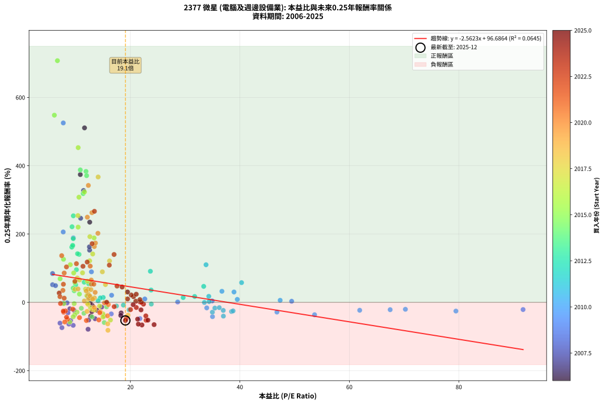
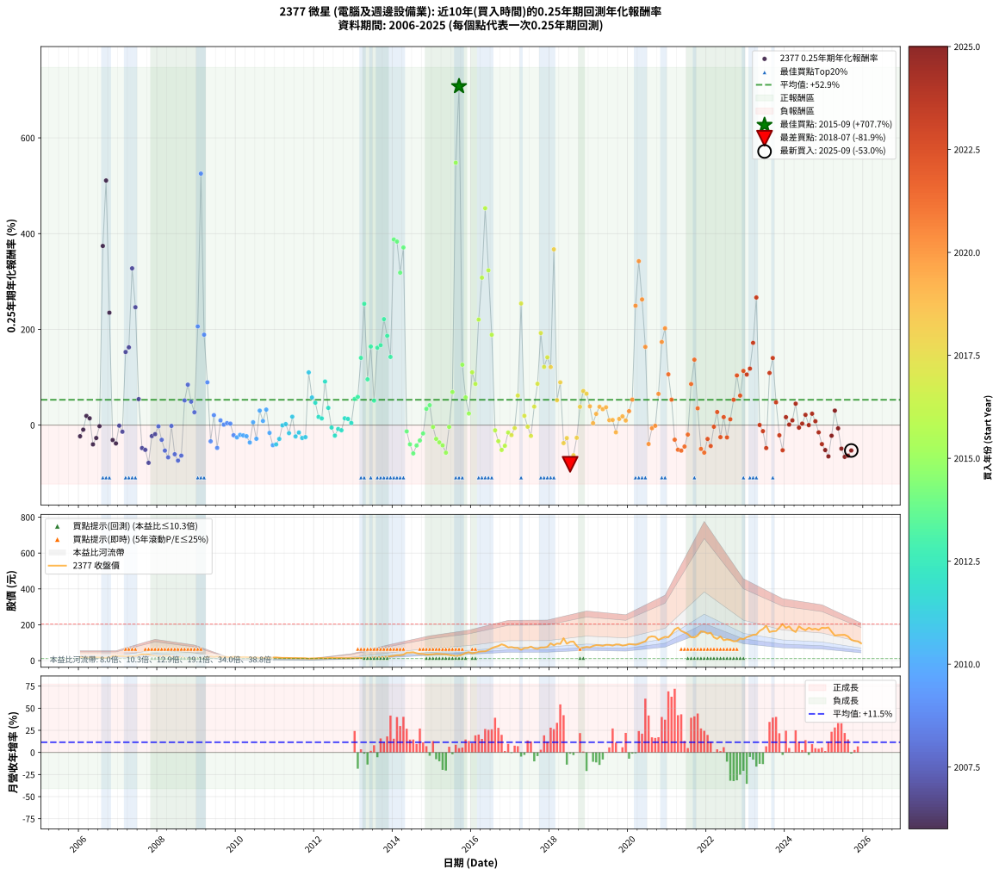

# 2377 微星 - 本益比與未來報酬率分析

!!! info "報告資訊"
    - **股票代號**: 2377
    - **公司名稱**: 微星
    - **產業別**: 電腦及週邊設備業
    - **分析期間**: 2006-2025 (237 個數據點)
    - **資料來源**: Type 12 (ShowMonthlyK_ChartFlow) 月收盤價與本益比
    - **報酬率口徑**: 含現金股利 (簡化: 年度合計，假設每年7/1入帳)
    - **報告生成時間**: 2026-01-04 08:47:46 CST

## 📈 視覺化圖表

### 圖表1: 本益比 vs 未來報酬率關係

*圖表1：2377 微星 本益比與0.25年期未來報酬率關係 (2006-2025)*

### 圖表2: 歷年買入時點的0.25年期實際報酬率

*圖表2：2377 微星 歷年買入時點的0.25年期實際報酬率 (2006-2025)*

## 📍 買點訊號說明

本報告提供兩種買點提示訊號（顯示於圖表2的股價子圖中）：

### ▲ 小綠色三角形（回測驗證）
- **計算方式**: 使用全部歷史資料計算本益比第25百分位數
- **用途**: 事後驗證，顯示歷史上哪些時點確實為低估區
- **限制**: 當下無法判斷，僅供回測參考
- **特性**: 後見之明（Look-Ahead Bias）

### ▲ 小橘色三角形（即時訊號）
- **計算方式**: 使用截至當月的過去5年資料計算本益比第25百分位數
- **用途**: 實際投資決策，當時即可判斷
- **優勢**: 可操作性強，符合實務需求
- **特性**: 無後見之明，滾動窗口計算

!!! tip "如何使用兩種訊號"
    - **綠色▲** 幫助理解歷史估值機會，驗證策略有效性
    - **橘色▲** 可作為實際買進參考，但仍需搭配基本面分析
    - 兩種訊號重疊時，表示即時判斷與事後驗證一致，信心度較高
    - 僅有綠色▲時，表示當時無法判斷（需要未來資料才能確認）
    - 僅有橘色▲時，表示即時判斷為買點，但事後可能不是最佳時機

## 📊 估值分析摘要

| 指標 | 數值 |
|:---:|:---:|
| **目前本益比** (2025-09) | **19.09 倍** |
| **歷史平均本益比** | 17.08 倍 |
| **估值水準** | 🟡 合理範圍 |
| **預期0.25年年化報酬率** | **+47.77%** |
| **歷史平均報酬率** | +52.91% |
| **相關係數 (R²)** | 0.0645 |
| **趨勢線斜率** | -2.5623 |

!!! abstract "核心洞察"
    目前本益比接近歷史平均，預期報酬率符合長期趨勢

    根據歷史數據回測，2377 微星 在目前本益比 **19.1倍** 的估值水準下，
    預期未來0.25年年化報酬率約為 **+47.8%**。

    **重要提醒**: 本分析基於歷史數據統計，實際報酬率會受到公司基本面變化、產業趨勢、
    總體經濟環境等多重因素影響。R² = 0.06 表示本益比可解釋約 6.4% 的報酬率變異。

## 📈 歷史估值統計

### 最佳買點 (最高報酬率)

| 項目 | 數值 |
|:---:|:---:|
| 起始時間 | 2015-09 |
| 當時本益比 | 6.67 倍 |
| 起始價格 | 27.9 元 |
| 0.25年後價格 | 47.0 元 |
| **0.25年年化報酬率** | **+707.66%** |

### 最差買點 (最低報酬率)

| 項目 | 數值 |
|:---:|:---:|
| 起始時間 | 2018-07 |
| 當時本益比 | 15.90 倍 |
| 起始價格 | 105.0 元 |
| 0.25年後價格 | 68.3 元 |
| **0.25年年化報酬率** | **-81.87%** |

## 🎯 投資啟示

### 本益比與報酬率關係

趨勢線方程式: **y = -2.5623x + 96.6864**

!!! warning "強負相關"
    本益比與未來報酬率呈現強負相關。在高本益比時期買入，未來報酬率顯著較低；
    在低本益比時期買入，未來報酬率顯著較高。**估值紀律至關重要**。

### 估值區間建議

基於歷史數據分析:

- **🟢 低估區** (P/E < 13.7): 預期報酬率較高，可考慮增加持股
- **🟡 合理區** (P/E 13.7-20.5): 預期報酬率符合長期趨勢，正常持有
- **🔴 高估區** (P/E > 20.5): 預期報酬率較低，可考慮減碼或觀望

!!! danger "風險提示"
    - 過去表現不代表未來結果
    - 本分析假設公司基本面無重大結構性變化
    - 產業環境劇變可能使歷史規律失效
    - 應結合公司財報、產業趨勢、總體經濟等多重因素綜合判斷

!!! success "長期投資觀點"
    歷史數據顯示，在合理或低估的估值水準買入並長期持有，
    往往能獲得較佳的投資報酬。**耐心等待好價格**是價值投資的核心原則。

## 📊 數據品質

- **資料來源**: GoodInfo.tw Type 12 (ShowMonthlyK_ChartFlow)
- **資料頻率**: 月度收盤價與本益比
- **回測期間**: 2006-2025
- **數據點數量**: 237 個 (每個點代表一次0.25年期回測)

### 計算方法說明

1. **0.25年期年化報酬率**:
   - 對每個歷史時點，計算其後0.25年的實際投資報酬率
   - 期末價值(不含股利): 期末價格
   - 期末價值(含現金股利): 期末價格 + 持有期間內的現金股利合計 (簡化: 年度合計，假設每年7/1入帳)
   - 公式: 年化報酬率 = [(期末價值/期初價格)^(1/年數) - 1] × 100%

2. **本益比 (P/E Ratio)**:
   - 使用當時的月收盤價與EPS計算
   - 資料來源: Type 12 月度河流圖本益比數據

3. **趨勢線 (Linear Regression)**:
   - 使用最小平方法擬合線性趨勢線
   - R²值衡量本益比對報酬率的解釋能力

---

*本報告由 Stock Analysis System v1.9.0 自動生成*
*數據更新時間: 2026-01-04 08:47:46 CST*

## 📋 月度回測明細表

（每一列對應時間線圖中的一個買入點；可用來對照 SVG 圖上的每個點。）

| 買入月份 | 賣出月份 | 回測期限_年 | 實際持有年數 | 買入本益比_倍 | 買入收盤價_元 | 賣出收盤價_元 | 現金股利合計_元 | 總報酬率_pct | 年化報酬率_pct |
| --- | --- | --- | --- | --- | --- | --- | --- | --- | --- |
| 2006-01 | 2006-05 | 0.25 | 0.329 | 13.91 | 19.75 | 18.10 | 0.00 | -8.35 | -23.32 |
| 2006-02 | 2006-05 | 0.25 | 0.246 | 13.06 | 18.55 | 18.10 | 0.00 | -2.43 | -9.49 |
| 2006-03 | 2006-07 | 0.25 | 0.334 | 12.25 | 17.40 | 17.95 | 0.50 | +6.03 | +19.17 |
| 2006-04 | 2006-07 | 0.25 | 0.249 | 12.57 | 17.85 | 17.95 | 0.50 | +3.36 | +14.19 |
| 2006-05 | 2006-08 | 0.25 | 0.252 | 12.75 | 18.10 | 15.40 | 0.50 | -12.15 | -40.22 |
| 2006-06 | 2006-09 | 0.25 | 0.252 | 12.96 | 18.40 | 16.50 | 0.50 | -7.61 | -26.96 |
| 2006-07 | 2006-10 | 0.25 | 0.252 | 12.64 | 17.95 | 17.85 | 0.00 | -0.56 | -2.19 |
| 2006-08 | 2006-12 | 0.25 | 0.334 | 10.85 | 15.40 | 25.90 | 0.00 | +68.18 | +374.19 |
| 2006-09 | 2006-12 | 0.25 | 0.249 | 11.62 | 16.50 | 25.90 | 0.00 | +56.97 | +510.88 |
| 2006-10 | 2007-01 | 0.25 | 0.252 | 12.57 | 17.85 | 24.20 | 0.00 | +35.57 | +234.78 |
| 2006-11 | 2007-03 | 0.25 | 0.329 | 18.31 | 26.00 | 23.00 | 0.00 | -11.54 | -31.15 |
| 2006-12 | 2007-03 | 0.25 | 0.246 | 18.24 | 25.90 | 23.00 | 0.00 | -11.20 | -38.24 |
| 2007-01 | 2007-05 | 0.25 | 0.329 | 15.54 | 24.20 | 24.10 | 0.00 | -0.41 | -1.25 |
| 2007-02 | 2007-05 | 0.25 | 0.246 | 14.75 | 25.00 | 24.10 | 0.00 | -3.60 | -13.83 |
| 2007-03 | 2007-07 | 0.25 | 0.334 | 12.55 | 23.00 | 30.75 | 0.60 | +36.30 | +152.71 |
| 2007-04 | 2007-07 | 0.25 | 0.249 | 12.51 | 24.65 | 30.75 | 0.60 | +27.17 | +162.43 |
| 2007-05 | 2007-08 | 0.25 | 0.252 | 11.44 | 24.10 | 34.15 | 0.60 | +44.18 | +327.47 |
| 2007-06 | 2007-09 | 0.25 | 0.252 | 10.91 | 24.50 | 32.90 | 0.60 | +36.73 | +246.22 |
| 2007-07 | 2007-10 | 0.25 | 0.252 | 12.91 | 30.75 | 34.30 | 0.00 | +11.54 | +54.30 |
| 2007-08 | 2007-12 | 0.25 | 0.334 | 13.55 | 34.15 | 27.45 | 0.00 | -19.62 | -48.00 |
| 2007-09 | 2007-12 | 0.25 | 0.249 | 12.38 | 32.90 | 27.45 | 0.00 | -16.57 | -51.66 |
| 2007-10 | 2008-01 | 0.25 | 0.252 | 12.27 | 34.30 | 23.20 | 0.00 | -32.36 | -78.82 |
| 2007-11 | 2008-03 | 0.25 | 0.331 | 9.68 | 28.40 | 26.05 | 0.00 | -8.27 | -22.95 |
| 2007-12 | 2008-03 | 0.25 | 0.249 | 8.94 | 27.45 | 26.05 | 0.00 | -5.10 | -18.95 |
| 2008-01 | 2008-05 | 0.25 | 0.331 | 7.73 | 23.20 | 23.00 | 0.00 | -0.86 | -2.58 |
| 2008-02 | 2008-05 | 0.25 | 0.249 | 8.59 | 25.20 | 23.00 | 0.00 | -8.73 | -30.70 |
| 2008-03 | 2008-07 | 0.25 | 0.334 | 9.09 | 26.05 | 19.40 | 0.80 | -22.46 | -53.30 |
| 2008-04 | 2008-07 | 0.25 | 0.249 | 9.55 | 26.70 | 19.40 | 0.80 | -24.34 | -67.36 |
| 2008-05 | 2008-08 | 0.25 | 0.252 | 8.43 | 23.00 | 22.10 | 0.80 | -0.43 | -1.72 |
| 2008-06 | 2008-09 | 0.25 | 0.252 | 7.14 | 19.00 | 14.20 | 0.80 | -21.05 | -60.88 |
| 2008-07 | 2008-10 | 0.25 | 0.252 | 7.49 | 19.40 | 13.80 | 0.00 | -28.87 | -74.13 |
| 2008-08 | 2008-12 | 0.25 | 0.334 | 8.76 | 22.10 | 15.75 | 0.00 | -28.73 | -63.73 |
| 2008-09 | 2008-12 | 0.25 | 0.249 | 5.78 | 14.20 | 15.75 | 0.00 | +10.92 | +51.56 |
| 2008-10 | 2009-01 | 0.25 | 0.252 | 5.78 | 13.80 | 16.10 | 0.00 | +16.67 | +84.41 |
| 2008-11 | 2009-03 | 0.25 | 0.329 | 6.32 | 14.65 | 16.70 | 0.00 | +13.99 | +48.98 |
| 2008-12 | 2009-03 | 0.25 | 0.246 | 7.00 | 15.75 | 16.70 | 0.00 | +6.03 | +26.83 |
| 2009-01 | 2009-05 | 0.25 | 0.329 | 7.73 | 16.10 | 23.25 | 0.00 | +44.41 | +206.04 |
| 2009-02 | 2009-05 | 0.25 | 0.246 | 7.74 | 14.80 | 23.25 | 0.00 | +57.09 | +525.30 |
| 2009-03 | 2009-07 | 0.25 | 0.334 | 9.57 | 16.70 | 23.30 | 0.50 | +42.51 | +188.79 |
| 2009-04 | 2009-07 | 0.25 | 0.249 | 12.88 | 20.30 | 23.30 | 0.50 | +17.24 | +89.32 |
| 2009-05 | 2009-08 | 0.25 | 0.252 | 16.51 | 23.25 | 20.45 | 0.50 | -9.90 | -33.88 |
| 2009-06 | 2009-09 | 0.25 | 0.252 | 16.57 | 20.55 | 21.05 | 0.50 | +4.86 | +20.74 |
| 2009-07 | 2009-10 | 0.25 | 0.252 | 21.74 | 23.30 | 19.80 | 0.00 | -15.02 | -47.60 |
| 2009-08 | 2009-12 | 0.25 | 0.334 | 22.64 | 20.45 | 21.10 | 0.00 | +3.18 | +9.82 |
| 2009-09 | 2009-12 | 0.25 | 0.249 | 28.64 | 21.05 | 21.10 | 0.00 | +0.24 | +0.96 |
| 2009-10 | 2010-01 | 0.25 | 0.252 | 34.94 | 19.80 | 20.00 | 0.00 | +1.01 | +4.07 |
| 2009-11 | 2010-03 | 0.25 | 0.329 | 49.46 | 19.70 | 19.90 | 0.00 | +1.02 | +3.12 |
| 2009-12 | 2010-03 | 0.25 | 0.246 | 91.74 | 21.10 | 19.90 | 0.00 | -5.69 | -21.15 |
| 2010-01 | 2010-05 | 0.25 | 0.329 | 79.47 | 20.00 | 18.15 | 0.00 | -9.25 | -25.58 |
| 2010-02 | 2010-05 | 0.25 | 0.246 | 70.24 | 19.20 | 18.15 | 0.00 | -5.47 | -20.41 |
| 2010-03 | 2010-07 | 0.25 | 0.334 | 67.46 | 19.90 | 17.85 | 0.50 | -7.79 | -21.55 |
| 2010-04 | 2010-07 | 0.25 | 0.249 | 61.89 | 19.60 | 17.85 | 0.50 | -6.38 | -23.24 |
| 2010-05 | 2010-08 | 0.25 | 0.252 | 53.65 | 18.15 | 15.70 | 0.50 | -10.74 | -36.32 |
| 2010-06 | 2010-09 | 0.25 | 0.252 | 47.36 | 17.05 | 16.80 | 0.50 | +1.47 | +5.95 |
| 2010-07 | 2010-10 | 0.25 | 0.252 | 46.77 | 17.85 | 16.40 | 0.00 | -8.12 | -28.56 |
| 2010-08 | 2010-12 | 0.25 | 0.334 | 38.93 | 15.70 | 17.15 | 0.00 | +9.24 | +30.27 |
| 2010-09 | 2010-12 | 0.25 | 0.249 | 39.53 | 16.80 | 17.15 | 0.00 | +2.08 | +8.63 |
| 2010-10 | 2011-01 | 0.25 | 0.252 | 36.72 | 16.40 | 17.60 | 0.00 | +7.32 | +32.36 |
| 2010-11 | 2011-03 | 0.25 | 0.329 | 33.95 | 15.90 | 15.00 | 0.00 | -5.66 | -16.25 |
| 2010-12 | 2011-03 | 0.25 | 0.246 | 35.00 | 17.15 | 15.00 | 0.00 | -12.54 | -41.93 |
| 2011-01 | 2011-05 | 0.25 | 0.329 | 36.99 | 17.60 | 14.85 | 0.00 | -15.63 | -40.38 |
| 2011-02 | 2011-05 | 0.25 | 0.246 | 34.98 | 16.15 | 14.85 | 0.00 | -8.05 | -28.86 |
| 2011-03 | 2011-07 | 0.25 | 0.334 | 33.52 | 15.00 | 14.45 | 0.53 | -0.15 | -0.46 |
| 2011-04 | 2011-07 | 0.25 | 0.249 | 34.38 | 14.90 | 14.45 | 0.53 | +0.52 | +2.09 |
| 2011-05 | 2011-08 | 0.25 | 0.252 | 35.43 | 14.85 | 13.65 | 0.53 | -4.53 | -16.82 |
| 2011-06 | 2011-09 | 0.25 | 0.252 | 34.32 | 13.90 | 13.95 | 0.53 | +4.15 | +17.52 |
| 2011-07 | 2011-10 | 0.25 | 0.252 | 36.97 | 14.45 | 13.50 | 0.00 | -6.57 | -23.66 |
| 2011-08 | 2011-12 | 0.25 | 0.334 | 36.24 | 13.65 | 12.90 | 0.00 | -5.49 | -15.57 |
| 2011-09 | 2011-12 | 0.25 | 0.249 | 38.48 | 13.95 | 12.90 | 0.00 | -7.53 | -26.95 |
| 2011-10 | 2012-01 | 0.25 | 0.252 | 38.76 | 13.50 | 12.55 | 0.00 | -7.04 | -25.15 |
| 2011-11 | 2012-03 | 0.25 | 0.331 | 33.82 | 11.30 | 14.45 | 0.00 | +27.88 | +110.07 |
| 2011-12 | 2012-03 | 0.25 | 0.249 | 40.31 | 12.90 | 14.45 | 0.00 | +12.02 | +57.68 |
| 2012-01 | 2012-05 | 0.25 | 0.331 | 33.39 | 12.55 | 14.25 | 0.00 | +13.55 | +46.74 |
| 2012-02 | 2012-05 | 0.25 | 0.249 | 31.74 | 13.70 | 14.25 | 0.00 | +4.01 | +17.11 |
| 2012-03 | 2012-07 | 0.25 | 0.334 | 29.64 | 14.45 | 14.05 | 1.05 | +4.48 | +14.01 |
| 2012-04 | 2012-07 | 0.25 | 0.249 | 23.65 | 12.85 | 14.05 | 1.05 | +17.49 | +90.95 |
| 2012-05 | 2012-08 | 0.25 | 0.252 | 23.78 | 14.25 | 14.35 | 1.05 | +8.05 | +35.98 |
| 2012-06 | 2012-09 | 0.25 | 0.252 | 23.82 | 15.60 | 14.35 | 1.05 | -1.30 | -5.07 |
| 2012-07 | 2012-10 | 0.25 | 0.252 | 19.77 | 14.05 | 13.20 | 0.00 | -6.05 | -21.95 |
| 2012-08 | 2012-12 | 0.25 | 0.334 | 18.72 | 14.35 | 13.95 | 0.00 | -2.79 | -8.12 |
| 2012-09 | 2012-12 | 0.25 | 0.249 | 17.45 | 14.35 | 13.95 | 0.00 | -2.79 | -10.73 |
| 2012-10 | 2013-01 | 0.25 | 0.252 | 15.03 | 13.20 | 13.65 | 0.00 | +3.41 | +14.24 |
| 2012-11 | 2013-03 | 0.25 | 0.329 | 14.50 | 13.55 | 14.10 | 0.00 | +4.06 | +12.87 |
| 2012-12 | 2013-03 | 0.25 | 0.246 | 14.09 | 13.95 | 14.10 | 0.00 | +1.08 | +4.44 |
| 2013-01 | 2013-05 | 0.25 | 0.329 | 12.38 | 13.65 | 15.75 | 0.00 | +15.38 | +54.58 |
| 2013-02 | 2013-05 | 0.25 | 0.246 | 11.56 | 14.05 | 15.75 | 0.00 | +12.10 | +58.97 |
| 2013-03 | 2013-07 | 0.25 | 0.334 | 10.62 | 14.10 | 17.80 | 1.10 | +34.04 | +140.41 |
| 2013-04 | 2013-07 | 0.25 | 0.249 | 9.58 | 13.80 | 17.80 | 1.10 | +36.96 | +253.35 |
| 2013-05 | 2013-08 | 0.25 | 0.252 | 10.14 | 15.75 | 17.55 | 1.10 | +18.41 | +95.61 |
| 2013-06 | 2013-09 | 0.25 | 0.252 | 9.43 | 15.70 | 18.95 | 1.10 | +27.71 | +164.05 |
| 2013-07 | 2013-10 | 0.25 | 0.252 | 10.01 | 17.80 | 19.75 | 0.00 | +10.96 | +51.09 |
| 2013-08 | 2013-12 | 0.25 | 0.334 | 9.29 | 17.55 | 24.20 | 0.00 | +37.89 | +161.67 |
| 2013-09 | 2013-12 | 0.25 | 0.249 | 9.46 | 18.95 | 24.20 | 0.00 | +27.70 | +166.86 |
| 2013-10 | 2014-01 | 0.25 | 0.252 | 9.34 | 19.75 | 26.50 | 0.00 | +34.18 | +221.29 |
| 2013-11 | 2014-03 | 0.25 | 0.329 | 9.56 | 21.30 | 30.10 | 0.00 | +41.31 | +186.50 |
| 2013-12 | 2014-03 | 0.25 | 0.246 | 10.34 | 24.20 | 30.10 | 0.00 | +24.38 | +142.40 |
| 2014-01 | 2014-05 | 0.25 | 0.329 | 10.85 | 26.50 | 44.60 | 0.00 | +68.30 | +387.71 |
| 2014-02 | 2014-05 | 0.25 | 0.246 | 11.89 | 30.25 | 44.60 | 0.00 | +47.44 | +383.36 |
| 2014-03 | 2014-07 | 0.25 | 0.334 | 11.37 | 30.10 | 46.55 | 2.00 | +61.30 | +318.40 |
| 2014-04 | 2014-07 | 0.25 | 0.249 | 12.00 | 33.00 | 46.55 | 2.00 | +47.12 | +370.98 |
| 2014-05 | 2014-08 | 0.25 | 0.252 | 15.64 | 44.60 | 41.05 | 2.00 | -3.48 | -13.10 |
| 2014-06 | 2014-09 | 0.25 | 0.252 | 15.23 | 45.00 | 37.55 | 2.00 | -12.11 | -40.10 |
| 2014-07 | 2014-10 | 0.25 | 0.252 | 15.22 | 46.55 | 37.15 | 0.00 | -20.19 | -59.16 |
| 2014-08 | 2014-12 | 0.25 | 0.334 | 12.99 | 41.05 | 34.10 | 0.00 | -16.93 | -42.61 |
| 2014-09 | 2014-12 | 0.25 | 0.249 | 11.51 | 37.55 | 34.10 | 0.00 | -9.19 | -32.08 |
| 2014-10 | 2015-01 | 0.25 | 0.252 | 11.04 | 37.15 | 35.40 | 0.00 | -4.71 | -17.43 |
| 2014-11 | 2015-03 | 0.25 | 0.329 | 9.73 | 33.75 | 37.15 | 0.00 | +10.07 | +33.93 |
| 2014-12 | 2015-03 | 0.25 | 0.246 | 9.55 | 34.10 | 37.15 | 0.00 | +8.94 | +41.58 |
| 2015-01 | 2015-05 | 0.25 | 0.329 | 9.73 | 35.40 | 34.95 | 0.00 | -1.27 | -3.82 |
| 2015-02 | 2015-05 | 0.25 | 0.246 | 10.25 | 38.00 | 34.95 | 0.00 | -8.03 | -28.79 |
| 2015-03 | 2015-07 | 0.25 | 0.334 | 9.84 | 37.15 | 29.00 | 3.00 | -13.86 | -36.03 |
| 2015-04 | 2015-07 | 0.25 | 0.249 | 9.55 | 36.70 | 29.00 | 3.00 | -12.81 | -42.31 |
| 2015-05 | 2015-08 | 0.25 | 0.252 | 8.93 | 34.95 | 25.15 | 3.00 | -19.46 | -57.64 |
| 2015-06 | 2015-09 | 0.25 | 0.252 | 7.84 | 31.20 | 27.90 | 3.00 | -0.96 | -3.76 |
| 2015-07 | 2015-10 | 0.25 | 0.252 | 7.16 | 29.00 | 33.10 | 0.00 | +14.14 | +69.05 |
| 2015-08 | 2015-12 | 0.25 | 0.334 | 6.11 | 25.15 | 46.95 | 0.00 | +86.68 | +548.08 |
| 2015-09 | 2015-12 | 0.25 | 0.249 | 6.67 | 27.90 | 46.95 | 0.00 | +68.28 | +707.66 |
| 2015-10 | 2016-01 | 0.25 | 0.252 | 7.78 | 33.10 | 40.65 | 0.00 | +22.81 | +126.08 |
| 2015-11 | 2016-03 | 0.25 | 0.331 | 9.86 | 42.60 | 49.55 | 0.00 | +16.31 | +57.81 |
| 2015-12 | 2016-03 | 0.25 | 0.249 | 10.69 | 46.95 | 49.55 | 0.00 | +5.54 | +24.15 |
| 2016-01 | 2016-05 | 0.25 | 0.331 | 9.02 | 40.65 | 52.00 | 0.00 | +27.92 | +110.29 |
| 2016-02 | 2016-05 | 0.25 | 0.249 | 9.64 | 44.55 | 52.00 | 0.00 | +16.72 | +86.01 |
| 2016-03 | 2016-07 | 0.25 | 0.334 | 10.45 | 49.55 | 69.60 | 3.50 | +47.53 | +220.32 |
| 2016-04 | 2016-07 | 0.25 | 0.249 | 10.60 | 51.50 | 69.60 | 3.50 | +41.94 | +307.88 |
| 2016-05 | 2016-08 | 0.25 | 0.252 | 10.46 | 52.00 | 76.50 | 3.50 | +53.85 | +453.04 |
| 2016-06 | 2016-09 | 0.25 | 0.252 | 11.61 | 59.10 | 81.50 | 3.50 | +43.82 | +323.26 |
| 2016-07 | 2016-10 | 0.25 | 0.252 | 13.37 | 69.60 | 90.90 | 0.00 | +30.60 | +188.64 |
| 2016-08 | 2016-12 | 0.25 | 0.334 | 14.37 | 76.50 | 73.60 | 0.00 | -3.79 | -10.93 |
| 2016-09 | 2016-12 | 0.25 | 0.249 | 14.98 | 81.50 | 73.60 | 0.00 | -9.69 | -33.58 |
| 2016-10 | 2017-01 | 0.25 | 0.252 | 16.36 | 90.90 | 75.60 | 0.00 | -16.83 | -51.89 |
| 2016-11 | 2017-03 | 0.25 | 0.329 | 14.98 | 85.00 | 70.60 | 0.00 | -16.94 | -43.16 |
| 2016-12 | 2017-03 | 0.25 | 0.246 | 12.71 | 73.60 | 70.60 | 0.00 | -4.08 | -15.54 |
| 2017-01 | 2017-05 | 0.25 | 0.329 | 13.05 | 75.60 | 70.00 | 0.00 | -7.41 | -20.88 |
| 2017-02 | 2017-05 | 0.25 | 0.246 | 12.26 | 71.10 | 70.00 | 0.00 | -1.55 | -6.13 |
| 2017-03 | 2017-07 | 0.25 | 0.334 | 12.17 | 70.60 | 78.40 | 4.50 | +17.42 | +61.74 |
| 2017-04 | 2017-07 | 0.25 | 0.249 | 10.42 | 60.50 | 78.40 | 4.50 | +37.02 | +254.06 |
| 2017-05 | 2017-08 | 0.25 | 0.252 | 12.05 | 70.00 | 68.70 | 4.50 | +4.57 | +19.42 |
| 2017-06 | 2017-09 | 0.25 | 0.252 | 12.16 | 70.70 | 65.60 | 4.50 | -0.85 | -3.33 |
| 2017-07 | 2017-10 | 0.25 | 0.252 | 13.47 | 78.40 | 73.50 | 0.00 | -6.25 | -22.60 |
| 2017-08 | 2017-12 | 0.25 | 0.334 | 11.80 | 68.70 | 76.60 | 0.00 | +11.50 | +38.52 |
| 2017-09 | 2017-12 | 0.25 | 0.249 | 11.26 | 65.60 | 76.60 | 0.00 | +16.77 | +86.31 |
| 2017-10 | 2018-01 | 0.25 | 0.252 | 12.60 | 73.50 | 96.30 | 0.00 | +31.02 | +192.31 |
| 2017-11 | 2018-03 | 0.25 | 0.329 | 12.56 | 73.30 | 95.20 | 0.00 | +29.88 | +121.60 |
| 2017-12 | 2018-03 | 0.25 | 0.246 | 13.12 | 76.60 | 95.20 | 0.00 | +24.28 | +141.62 |
| 2018-01 | 2018-05 | 0.25 | 0.329 | 16.19 | 96.30 | 125.00 | 0.00 | +29.80 | +121.21 |
| 2018-02 | 2018-05 | 0.25 | 0.246 | 14.11 | 85.50 | 125.00 | 0.00 | +46.20 | +367.09 |
| 2018-03 | 2018-07 | 0.25 | 0.334 | 15.44 | 95.20 | 105.00 | 4.50 | +15.02 | +52.04 |
| 2018-04 | 2018-07 | 0.25 | 0.249 | 14.88 | 93.40 | 105.00 | 4.50 | +17.24 | +89.33 |
| 2018-05 | 2018-08 | 0.25 | 0.252 | 19.57 | 125.00 | 106.50 | 4.50 | -11.20 | -37.60 |
| 2018-06 | 2018-09 | 0.25 | 0.252 | 14.50 | 94.20 | 82.50 | 4.50 | -7.64 | -27.07 |
| 2018-07 | 2018-10 | 0.25 | 0.252 | 15.90 | 105.00 | 68.30 | 0.00 | -34.95 | -81.87 |
| 2018-08 | 2018-12 | 0.25 | 0.334 | 15.86 | 106.50 | 76.40 | 0.00 | -28.26 | -63.01 |
| 2018-09 | 2018-12 | 0.25 | 0.249 | 12.09 | 82.50 | 76.40 | 0.00 | -7.39 | -26.53 |
| 2018-10 | 2019-01 | 0.25 | 0.252 | 9.85 | 68.30 | 74.10 | 0.00 | +8.49 | +38.21 |
| 2018-11 | 2019-03 | 0.25 | 0.329 | 10.30 | 72.50 | 86.50 | 0.00 | +19.31 | +71.15 |
| 2018-12 | 2019-03 | 0.25 | 0.246 | 10.69 | 76.40 | 86.50 | 0.00 | +13.22 | +65.51 |
| 2019-01 | 2019-05 | 0.25 | 0.329 | 10.43 | 74.10 | 82.60 | 0.00 | +11.47 | +39.17 |
| 2019-02 | 2019-05 | 0.25 | 0.246 | 11.59 | 81.80 | 82.60 | 0.00 | +0.98 | +4.03 |
| 2019-03 | 2019-07 | 0.25 | 0.334 | 12.33 | 86.50 | 87.80 | 5.00 | +7.28 | +23.43 |
| 2019-04 | 2019-07 | 0.25 | 0.249 | 12.28 | 85.60 | 87.80 | 5.00 | +8.41 | +38.29 |
| 2019-05 | 2019-08 | 0.25 | 0.252 | 11.93 | 82.60 | 83.80 | 5.00 | +7.51 | +33.29 |
| 2019-06 | 2019-09 | 0.25 | 0.252 | 12.79 | 88.00 | 90.30 | 5.00 | +8.30 | +37.22 |
| 2019-07 | 2019-10 | 0.25 | 0.252 | 12.85 | 87.80 | 90.00 | 0.00 | +2.51 | +10.32 |
| 2019-08 | 2019-12 | 0.25 | 0.334 | 12.34 | 83.80 | 86.70 | 0.00 | +3.46 | +10.72 |
| 2019-09 | 2019-12 | 0.25 | 0.249 | 13.39 | 90.30 | 86.70 | 0.00 | -3.99 | -15.07 |
| 2019-10 | 2020-01 | 0.25 | 0.252 | 13.43 | 90.00 | 92.80 | 0.00 | +3.11 | +12.93 |
| 2019-11 | 2020-03 | 0.25 | 0.331 | 12.61 | 83.90 | 88.70 | 0.00 | +5.72 | +18.29 |
| 2019-12 | 2020-03 | 0.25 | 0.249 | 13.12 | 86.70 | 88.70 | 0.00 | +2.31 | +9.59 |
| 2020-01 | 2020-05 | 0.25 | 0.331 | 13.56 | 92.80 | 101.00 | 0.00 | +8.84 | +29.12 |
| 2020-02 | 2020-05 | 0.25 | 0.249 | 12.83 | 90.80 | 101.00 | 0.00 | +11.23 | +53.31 |
| 2020-03 | 2020-07 | 0.25 | 0.334 | 12.13 | 88.70 | 130.50 | 4.20 | +51.86 | +249.31 |
| 2020-04 | 2020-07 | 0.25 | 0.249 | 12.32 | 93.00 | 130.50 | 4.20 | +44.84 | +342.33 |
| 2020-05 | 2020-08 | 0.25 | 0.252 | 12.98 | 101.00 | 135.50 | 4.20 | +38.32 | +262.48 |
| 2020-06 | 2020-09 | 0.25 | 0.252 | 13.41 | 107.50 | 133.00 | 4.20 | +27.63 | +163.40 |
| 2020-07 | 2020-10 | 0.25 | 0.252 | 15.82 | 130.50 | 115.00 | 0.00 | -11.88 | -39.47 |
| 2020-08 | 2020-12 | 0.25 | 0.334 | 15.97 | 135.50 | 132.50 | 0.00 | -2.21 | -6.48 |
| 2020-09 | 2020-12 | 0.25 | 0.249 | 15.26 | 133.00 | 132.50 | 0.00 | -0.38 | -1.50 |
| 2020-10 | 2021-01 | 0.25 | 0.252 | 12.85 | 115.00 | 130.50 | 0.00 | +13.48 | +65.20 |
| 2020-11 | 2021-03 | 0.25 | 0.329 | 13.61 | 125.00 | 174.00 | 0.00 | +39.20 | +173.65 |
| 2020-12 | 2021-03 | 0.25 | 0.246 | 14.07 | 132.50 | 174.00 | 0.00 | +31.32 | +202.16 |
| 2021-01 | 2021-05 | 0.25 | 0.329 | 12.66 | 130.50 | 165.50 | 0.00 | +26.82 | +106.10 |
| 2021-02 | 2021-05 | 0.25 | 0.246 | 13.32 | 149.00 | 165.50 | 0.00 | +11.07 | +53.15 |
| 2021-03 | 2021-07 | 0.25 | 0.334 | 14.41 | 174.00 | 148.00 | 6.10 | -11.44 | -30.48 |
| 2021-04 | 2021-07 | 0.25 | 0.249 | 14.24 | 184.50 | 148.00 | 6.10 | -16.48 | -51.45 |
| 2021-05 | 2021-08 | 0.25 | 0.252 | 11.96 | 165.50 | 130.50 | 6.10 | -17.46 | -53.32 |
| 2021-06 | 2021-09 | 0.25 | 0.252 | 10.70 | 157.50 | 129.50 | 6.10 | -13.90 | -44.81 |
| 2021-07 | 2021-10 | 0.25 | 0.252 | 9.48 | 148.00 | 140.00 | 0.00 | -5.41 | -19.80 |
| 2021-08 | 2021-12 | 0.25 | 0.334 | 7.91 | 130.50 | 160.50 | 0.00 | +22.99 | +85.80 |
| 2021-09 | 2021-12 | 0.25 | 0.249 | 7.45 | 129.50 | 160.50 | 0.00 | +23.94 | +136.65 |
| 2021-10 | 2022-01 | 0.25 | 0.252 | 7.67 | 140.00 | 151.00 | 0.00 | +7.86 | +35.02 |
| 2021-11 | 2022-03 | 0.25 | 0.329 | 8.51 | 163.00 | 130.00 | 0.00 | -20.25 | -49.77 |
| 2021-12 | 2022-03 | 0.25 | 0.246 | 8.01 | 160.50 | 130.00 | 0.00 | -19.00 | -57.49 |
| 2022-01 | 2022-05 | 0.25 | 0.329 | 7.81 | 151.00 | 135.00 | 0.00 | -10.60 | -28.89 |
| 2022-02 | 2022-05 | 0.25 | 0.246 | 8.33 | 155.50 | 135.00 | 0.00 | -13.18 | -43.66 |
| 2022-03 | 2022-07 | 0.25 | 0.334 | 7.23 | 130.00 | 118.00 | 10.50 | -1.15 | -3.41 |
| 2022-04 | 2022-07 | 0.25 | 0.249 | 7.00 | 121.00 | 118.00 | 10.50 | +6.20 | +27.30 |
| 2022-05 | 2022-08 | 0.25 | 0.252 | 8.13 | 135.00 | 115.00 | 10.50 | -7.04 | -25.15 |
| 2022-06 | 2022-09 | 0.25 | 0.252 | 7.13 | 113.50 | 107.50 | 10.50 | +3.96 | +16.69 |
| 2022-07 | 2022-10 | 0.25 | 0.252 | 7.75 | 118.00 | 109.50 | 0.00 | -7.20 | -25.68 |
| 2022-08 | 2022-12 | 0.25 | 0.334 | 7.91 | 115.00 | 119.50 | 0.00 | +3.91 | +12.18 |
| 2022-09 | 2022-12 | 0.25 | 0.249 | 7.76 | 107.50 | 119.50 | 0.00 | +11.16 | +52.92 |
| 2022-10 | 2023-01 | 0.25 | 0.252 | 8.32 | 109.50 | 131.00 | 0.00 | +19.63 | +103.75 |
| 2022-11 | 2023-03 | 0.25 | 0.329 | 9.86 | 123.00 | 144.00 | 0.00 | +17.07 | +61.57 |
| 2022-12 | 2023-03 | 0.25 | 0.246 | 10.14 | 119.50 | 144.00 | 0.00 | +20.50 | +113.16 |
| 2023-01 | 2023-05 | 0.25 | 0.329 | 11.34 | 131.00 | 166.00 | 0.00 | +26.72 | +105.59 |
| 2023-02 | 2023-05 | 0.25 | 0.246 | 12.11 | 137.00 | 166.00 | 0.00 | +21.17 | +117.98 |
| 2023-03 | 2023-07 | 0.25 | 0.334 | 13.01 | 144.00 | 194.50 | 6.60 | +39.65 | +171.80 |
| 2023-04 | 2023-07 | 0.25 | 0.249 | 13.43 | 145.50 | 194.50 | 6.60 | +38.21 | +266.54 |
| 2023-05 | 2023-08 | 0.25 | 0.252 | 15.67 | 166.00 | 159.50 | 6.60 | +0.06 | +0.24 |
| 2023-06 | 2023-09 | 0.25 | 0.252 | 17.04 | 176.50 | 164.00 | 6.60 | -3.34 | -12.63 |
| 2023-07 | 2023-10 | 0.25 | 0.252 | 19.23 | 194.50 | 165.00 | 0.00 | -15.17 | -47.95 |
| 2023-08 | 2023-12 | 0.25 | 0.334 | 16.15 | 159.50 | 204.00 | 0.00 | +27.90 | +108.91 |
| 2023-09 | 2023-12 | 0.25 | 0.249 | 17.02 | 164.00 | 204.00 | 0.00 | +24.39 | +140.13 |
| 2023-10 | 2024-01 | 0.25 | 0.252 | 17.56 | 165.00 | 182.00 | 0.00 | +10.30 | +47.60 |
| 2023-11 | 2024-03 | 0.25 | 0.331 | 20.03 | 183.50 | 169.50 | 0.00 | -7.63 | -21.30 |
| 2023-12 | 2024-03 | 0.25 | 0.249 | 22.87 | 204.00 | 169.50 | 0.00 | -16.91 | -52.46 |
| 2024-01 | 2024-05 | 0.25 | 0.331 | 20.57 | 182.00 | 191.50 | 0.00 | +5.22 | +16.60 |
| 2024-02 | 2024-05 | 0.25 | 0.249 | 21.77 | 191.00 | 191.50 | 0.00 | +0.26 | +1.05 |
| 2024-03 | 2024-07 | 0.25 | 0.334 | 19.48 | 169.50 | 169.50 | 5.40 | +3.19 | +9.84 |
| 2024-04 | 2024-07 | 0.25 | 0.249 | 18.49 | 159.50 | 169.50 | 5.40 | +9.66 | +44.77 |
| 2024-05 | 2024-08 | 0.25 | 0.252 | 22.39 | 191.50 | 183.50 | 5.40 | -1.36 | -5.28 |
| 2024-06 | 2024-09 | 0.25 | 0.252 | 20.99 | 178.00 | 174.00 | 5.40 | +0.79 | +3.16 |
| 2024-07 | 2024-10 | 0.25 | 0.252 | 20.16 | 169.50 | 178.00 | 0.00 | +5.01 | +21.44 |
| 2024-08 | 2024-12 | 0.25 | 0.334 | 22.02 | 183.50 | 183.50 | 0.00 | +0.00 | +0.00 |
| 2024-09 | 2024-12 | 0.25 | 0.249 | 21.07 | 174.00 | 183.50 | 0.00 | +5.46 | +23.78 |
| 2024-10 | 2025-01 | 0.25 | 0.252 | 21.74 | 178.00 | 181.50 | 0.00 | +1.97 | +8.04 |
| 2024-11 | 2025-03 | 0.25 | 0.329 | 21.08 | 171.00 | 162.00 | 0.00 | -5.26 | -15.17 |
| 2024-12 | 2025-03 | 0.25 | 0.246 | 22.82 | 183.50 | 162.00 | 0.00 | -11.72 | -39.69 |
| 2025-01 | 2025-05 | 0.25 | 0.329 | 23.20 | 181.50 | 142.50 | 0.00 | -21.49 | -52.11 |
| 2025-02 | 2025-05 | 0.25 | 0.246 | 24.33 | 185.00 | 142.50 | 0.00 | -22.97 | -65.33 |
| 2025-03 | 2025-07 | 0.25 | 0.334 | 21.94 | 162.00 | 144.00 | 5.00 | -8.02 | -22.15 |
| 2025-04 | 2025-07 | 0.25 | 0.249 | 19.47 | 139.50 | 144.00 | 5.00 | +6.81 | +30.27 |
| 2025-05 | 2025-08 | 0.25 | 0.252 | 20.51 | 142.50 | 135.00 | 5.00 | -1.75 | -6.79 |
| 2025-06 | 2025-09 | 0.25 | 0.252 | 21.32 | 143.50 | 116.00 | 5.00 | -15.68 | -49.19 |
| 2025-07 | 2025-10 | 0.25 | 0.252 | 22.11 | 144.00 | 109.50 | 0.00 | -23.96 | -66.29 |
| 2025-08 | 2025-12 | 0.25 | 0.334 | 21.45 | 135.00 | 96.10 | 0.00 | -28.81 | -63.85 |
| 2025-09 | 2025-12 | 0.25 | 0.249 | 19.09 | 116.00 | 96.10 | 0.00 | -17.16 | -53.02 |
